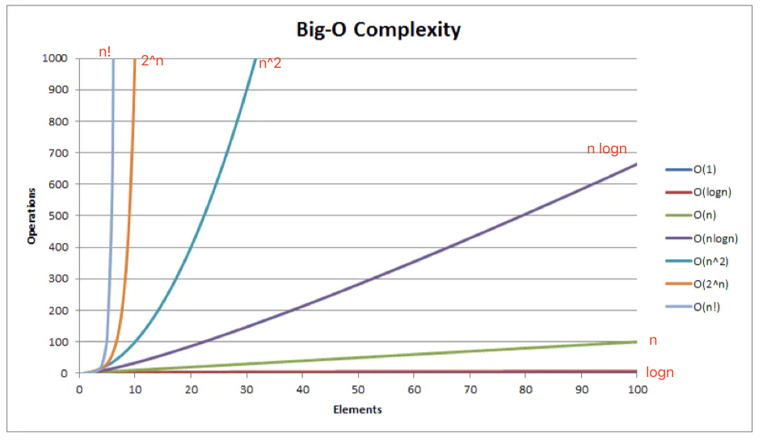

# 算法分类

## 算法复杂度

### 时间复杂度

时间复杂度是描述算法运行的时间。我们把算法需要运算的次数用输入大小为 n 的函数来表示，计作 `T(n)`。时间复杂度通用用 O(n) 来表示，公式为 `T(n) = O(f(n))`，其中 `f(n)` 表示每行代码执行次数之和，注意是执行次数。

数学描述：T(x) = O(x) = O(f(x))

#### 常见的时间复杂度

|名称|运行时间 T(n)| 时间举例| 算法举例|
|--|--|--|--|
|常数| O(1)| 3 | - |
|线性| O(n)| n | 操作数组 |
|平方| O(n^2)| n^2 | 冒泡排序 |
|对数| O(log(n))| log(n) | 二分搜索 |

##### O(1) 复杂度

算法执行所需要的时间不随着某个变量 n 的大小而变化，即此算法时间复杂度为一个常量，可表示为 O(1)。

```js

const a = 1;
console.log(a);
```

O(1) 表示常数级别的复杂度，不管你是 O(几)，统一给你计作 O(1)。

##### O(n) 复杂度

```js
for (let i = 0; i < n; i++) {
  // do something
}
```

上面这段代码，写了一个 for 循环，从 0 到 n，不管 n 是多少，都要循环 n 次，而且只循环 n 次，所以得到复杂度 O(n)。

##### O(n^2) 复杂度

```js
for (let i = 0; i < n; i++) {
  for (let j = 0; j < j; j++) {
    // do something
  }
}
```

上面的程序嵌套了两个循环，外层是 0 到 n，内层基于每一个不同的 i，也要从 0 到 n 执行，得到复杂度为 O(n^2)。可以看出，随着 n 增大，复杂度会成平方级增加。

##### O(log(n)) 对数复杂度

```js
for (let i = 1; i <= n; i *=2) {
  // do something
}
```
函数 y = logaX 叫做对数函数， a 就是对数函数的底数。

观察上面的代码，i 从 1 开始，每循环一次就乘以 2，直到 i 大于 n 时结束循环。

2¹ --> 2² --> 2³ ...--> 2ˣ。

观察上面列出 i 的取值发现，是一个等比数列，要知道循环了多少次，求出 x 的值即可。由 2ˣ = n 得到，x = log₂n。

如果把上面的 i*2 = 2 改为 i*=3，那么这段代码的时间复杂度就是 log₃n。

根据换底公式：

log𝚌ª * log𝑎ᵇ = log𝚌ᵇ

因此 log₃ᴺ = log₃² * log₂ᴺ，而 log₃² 是一个常量，得到 O(log₃ᴺ = O(log₂ᴺ)。所以，在对数时间复杂度的表示中，我们忽略对数的`“底”`，我不管你底数是多少，统一计作 `O(log(n))`。

##### O(2^n)

递归的时间复杂度

递归算法中，每个递归函数的时间复杂度为 `O(s)`，递归的调用次数为 n，则该递归算法的时间复杂度为 `O(n) = n * O(s)`。

我们先来看一个经典的问题，斐波那契数列（Fibonacci sequence）。

```js
function fibonacci(n) {
  if (n === 0 || n === 1) {
    return 1;
  }
  return fibonacci(n - 1) + fibonacci(n - 2);
}
```

F(0) = 1, F(2) = 1, F(n) = F(n - 1) + F(n - 2)(n ≥ 2, n ∈ N*)
 
我们很容易写出上面这样一段递归的代码，往往忽略了时间复杂度是多少，<u>换句话说调用多少次。</u>可以代一个数进去，例如 n = 5，完了之后大概就能理解递归的时间复杂度是怎么来的。

-01.png)

上图把 n = 5的情况都列举出来。可以看出，虽然代码非常简单，在实际运算的时候会有大量的重复计算。

在 n 层的完全二叉树中，节点的总数为 2ᴺ - 1，所以得到 F(n) 中递归数目的上限为 2ᴺ - 1。因此我们可以毛估出 F(n) 中递归的数目的上限为 O(2ᴺ)。

时间复杂度为 O(2ᴺ)，指数级的时间复杂度，显然不是最优的解法，让计算机傻算了很多次。这个时候，我们可以对已经计算的结果进行缓存，避免重复计算。

### 空间复杂度

空间复杂度是对算法运行过程中临时占用空间大小的度量，一个算法所需的存储空间用 `f(n)` 表示，可得出 `S(n) = O(f(n))`，其中 n 为问题的规模，S(n) 表示空间复杂度。通常用 S(n) 来定义。

数学描述：`S(x) = O(x) = O(f(x))`

#### O(1) 复杂度

算法执行所需要的临时空间不随着某个变量 n 的大小而变化，即此算法空间复杂度为一个常量，可表示为 O(1)。

```js
const a = 1;
const b = 2;
console.log(a);
console.log(b);
```

```js
/**
 * @description: 哈希
 * 思路：遍历两次。第一次遍历，用一个哈希对象记录所有字符的出现次数；第二次遍历，找出哈希对象中只出现一次的字符的下标
 * 详解：
 * 1. 第一次遍历，用一个哈希对象记录所有字符的出现次数；
 * 2. 第二次遍历，找出哈希对象中只出现一次的字符的下标；
 * @param {type}
 * @return:
 */
const firstUniqChar = function(s) {
  const hash = {};
  for (let i = 0; i < s.length; i++) {
    if (!hash[[s[i]]]) {
      hash[s[i]] = 1;
    } else {
      hash[s[i]] += 1;
    }
  }

  for (let i = 0; i < s.length; i += 1) {
    if (hash[s[i]] === 1) {
      return i;
    } 
  }
  return -1;
};
//  - 空间复杂度：O(1)
//   - 因为变量只有 hash 和 i，开辟空间大小不随输入的变量变化
```

以上代码，分配的空间不会随着处理数据量的变化而变化，因此得到空间复杂度为 O(1)。

#### O(n) 复杂度

```js
const arr = new Array(n);
for (let i = 0; i < n; i++) {
  // do something
}
```

上面这段代码的第一行，申请了长度为 n 的数空间，下面的 for 循环中没有分配新的空间，可以得出这段的空间复杂度为 O(n)。

### 时间空间相互转换

对于一个算法来说，它的时间复杂度和空间复杂度往往是相互影响的。拿我们熟悉的 chrome 来说，流畅性方面比其他厂商好很多，但是占用的内存空间略大。

<u>当追求一个较好的时间复杂度时，可能需要消耗更多的储存空间。反之，如果追求较好的空间复杂度，算法执行的时间可能就会变长。</u>

### 总结

常见的复杂度不多，从低到高排列就这么几个：O(1)、O(log(n))、O(n)、O(n²)。



## 基本算法思想

## 递归

### 递归算法概念

递归是一种解决问题的方法、它从解决问题的各个小部分的开始，直到解决最初的大问题。递归通常涉及函数调用自身。
```js
function recursiveFunction(someParam) {
  recusiveFunction(someParam)
}
```
假设现在必须要执行 recursiveFunction，结果是什么？单就上述情况而言，它会一直执行下去。因此，每个递归函数都必须有<u>基线条件，</u>即一个不再递归调用的条件（停止点），以防止无限递归。
编程名言：“要理解递归，首先要理解递归”。
```js
function understandRecursion(doIunderstandRecursion) {
  const recursionAnswer = confirm('Do you understand recursion?');
  if (recursionAnswer === true) { // 基线条件或停止点
    return true;
  }
  understandRecursion(recursionAnswer); // 递归调用
}
```

### 递归入门

```js
function understandRecursion(doIunderstandRecursion) {
  const recursionAnswer = confirm('Do you understand recursion?'); // function logic
  if (recursionAnswer === true) { // base case or stop point
    return true;
  }
  understandRecursion(recursionAnswer); // recursive call
}

understandRecursion(false);
```

### 重复计算问题（memoization）

### 循环引用

### 普通递归版本

```js
// 普通递归版本
function factorial(n) {
  console.trace();
  if (n === 1 || n === 0) {
    return 1;
  }
  return n * factorial(n - 1); // 先入栈，再出栈
}
```

函数地址和临时变量都会入栈，临时变量 n，空间复杂度为 O(n)，到了一定复杂度的时候会爆栈。

```js
Uncaught RangeError: Maximum call stack size exceeded
```
与许多语言一样，JavaScript会跟踪`堆栈`中的所有函数调用。这个栈大小是在线程一开始就分配好大小的，一旦超过这个最大值，就会导致 `RangeError`。在循环调用中，一旦根函数完成，堆栈就会被清除。但是在使用递归时，在所有其他的调用都被解析之前，第一个函数的调用不会结束。所以如果，我们调用太多，就会得到这个错误。

### 尾递归调用

尾递归是函数尾调用自身，属于尾调用下的。

```js
// 尾递归改造-第 1 步：
function tailFactorial(n, total = 1) {
  // 'use strict';
  if (n === 1 || n === 0) {
    return total;
  }
  // 把 total * n 传递过去，直接计算 total 值，当 n === 1 || n === 0 的时候，
  return tailFactorial(n - 1, total * n); // 在尾部调用的是函数本身，而不是  n * factorial(n - 1)，total 变量
}
// console.log("tailFactorial(5): ", tailFactorial(10000));  // 这个时候还是会出现爆栈问题。

// 尾递归改造-第 2 步：
function tailFactorial(n, total = 1) {
  // 'use strict';
  if (n === 1 || n === 0) {
    return total;
  }
  // 把 total * n 传递过去，直接计算 total 值，当 n === 1 || n === 0 的时候，
  // return tailFactorial(n - 1, total * n)  // 在尾部调用的是函数本身，而不是  n * factorial(n - 1)
  return tailFactorial.bind(null, n - 1, total * n); // 直接返回一个新版本的函数，而不是递归调用，并且使用了 total 记录了下来。这样就不用记录中间层的栈信息了。
  // 注意 bind的使用, 这里 tailFactorial 函数并不会直接进行递归调用而是返回下一步的调用交给 trampoline 来循环调用, 这样调用栈就不会增长了.
}
```

在编辑器不支持尾调用（尾递归）的情况，可以采用另一种解决方案：[蹦床函数](http://funkyjavascript.com/recursion-and-trampolines/)。

一个 trampline 蹦床函数函数，Trampoline 是对尾递归函数进行处理的一种技巧，其思想是使用延迟计算稍后执行递归调用，每次执行一个递归。这是可行的，但是这种方法也有一个很大的缺点：`它很慢`。在每次递归时，都会创建一个新函数，在大型递归时，就会产生大量的函数。
```js
function trampoline(f) {
  while (f && f instanceof Function) {
    f = f();
  }
  return f;
}
```

应用：

```js
const val = trampoline(tailFactorial(5));
```

当然，如果一个方法可以写成`尾递归`的形式，那它肯定也能被写成`迭代`的形式（其实理论上所有递归都能被写成迭代的形式，不过有些用迭代实现起来会比较复杂），但有些场景下使用递归可能会更加直观，如果它能被转为尾递归，你就可以直接用`trampoline函数`进行处理，或者把它改写成`迭代`的方法（或者等<u>大部分浏览器支持尾递归优化后在严格模式下执行</u>）

### 尾递归 + 遍历

trampoline 函数，在尾递归 + 遍历中如何处理，就像树的遍历孩子以及递归孩子：

```js
const traverseTree = (node, callback, parentNode) => {
  if (node === null) {
    return;
  }
  callback && callback(node, parentNode);

  if (node.children && node.children.length > 0) {
    const children = node.children;
    for (let i = 0; i < children.length; i++) {
      node && traverseTree(children[i], callback, node);
    }
  }
};
```

改写为尾递归，暂时没找到解决方案。如果真的爆栈，只能先考虑改为迭代方式（采用数组栈等存储）

### 那些类型的递归可以转为尾递归

### 从递归到迭代

迭代：累加器

### 小结

使用递归是为了编写代码不那么复杂，通常使用迭代既复杂又不直观。递归会出现爆栈问题，可以通过尾调用解决，在编译器不支持自动将尾递归转循环的情况下，可以使用蹦床函数 (trampoline）解决方案实现。递归它比迭代版本更具声明式，并且通常情况下代码也更短。递归可以轻松地实现复杂的逻辑。尽管存在堆栈溢出问题，但在不滥用的前提下，在 JavaScript 中使用它是没问题的。并且如果有需要，可以将`递归函数`重构为`迭代版本`。

### 递归实战

#### 取得一棵树的叶节点

#### 计算一个数的阶乘

- 什么情况使用递归
- 如何写递归代码
  - 单分支层层递归实例讲解
  - 多分支并列递归实例讲解
- 递归注意事项（缺点与解决方法）
  - 爆栈
  - 重复计算
  - 循环引用
  - 空间复杂度
  - 时间复杂度
- 递归实战
  - JavaScript 调用栈
  - 走台阶问题
  - 找到最佳推荐人
  - 数组拍平
  - 对象格式化
  - 实现一颗树组件（或者改变树的数据状态）
  - 实现一个深拷贝
    - weakMap 扩展知识


本地变量 n 和函数的地址都存入到栈中，这个时候如果不限制入栈的次数以及存入的变量过多，都会导致爆栈。

- 递归算法优点：代码的表达力很强，写起来简洁。函数式描述是什么，而不是描述流程。递归并不比普通版本更快，反倒更慢（函数调用，但是可以使用`尾递归优化`）。但要知道，递归更容易理解，并且它所需的代码更少。


## 排序

- O(n²)
  - 冒泡排序
  - 选择排序
  - 插入排序
  - 希尔排序
- O(n logᴺ)
  - 快速排序
  - 归并排序
  - 堆排序
- 时间复杂度为线性的排序算法
  - 计数排序
  - 桶排序
  - 基数排序

此外，排序算法还可以根据其稳定性，划分为`稳定排序`和`不稳定排序`。

即如果值相同的元素在排序后仍然保持着排序前的顺序，则这样的排序算法是稳定排序；如果值相同的元素排序后打乱了排序前的顺序，则这样的排序算法是不稳定排序。

## 参考资料

- [聊聊面试必考-递归思想与实战](https://juejin.im/post/5d85cda3f265da03b638e918?utm_source=gold_browser_extension#heading-0) —— 系统介绍递归的问题，从理论到实战
- [[译] 理解递归、尾调用优化和蹦床函数优化](https://juejin.im/post/5e003a67e51d45583f44d396#heading-6) 阐述了递归与迭代、尾递归之间的变换版本。
- [如何理解算法时间复杂度的表示法，例如 O(n²)、O(n)、O(1)、O(nlogn) 等？](https://www.zhihu.com/question/21387264/answer/422323594?utm_source=wechat_session&utm_medium=social&utm_oi=710800537397764096)
- [尾递归为啥能优化？](https://zhuanlan.zhihu.com/p/36587160)
- [尾调用优化 §](https://es6.ruanyifeng.com/#docs/function#%E5%B0%BE%E8%B0%83%E7%94%A8%E4%BC%98%E5%8C%96)
- [尾递归的后续探究](https://imweb.io/topic/5a244260a192c3b460fce275)
- [朋友你听说过尾递归吗](https://imweb.io/topic/584d33049be501ba17b10aaf)
- [浅谈尾递归的优化方式](http://blog.zhaojie.me/2009/04/tail-recursion-explanation.html)
- [尾调用](https://zh.wikipedia.org/wiki/%E5%B0%BE%E8%B0%83%E7%94%A8)
- [Javascript中的尾递归及其优化](https://zhuanlan.zhihu.com/p/47155064?utm_source=wechat_session&utm_medium=social&utm_oi=710800537397764096)
- [怎样避免JavaScript中过长递归导致的堆栈溢出？](https://www.zhihu.com/question/30078697/answer/146047599)
- [递归优化：尾调用和Memoization](https://juejin.im/post/5d8ecfb4e51d45783f5aa4a6#heading-7)
- 《算法 101》