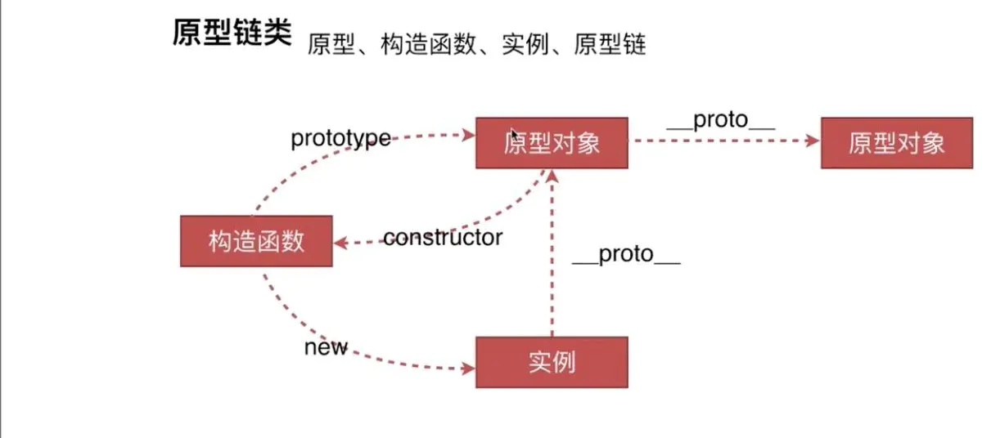
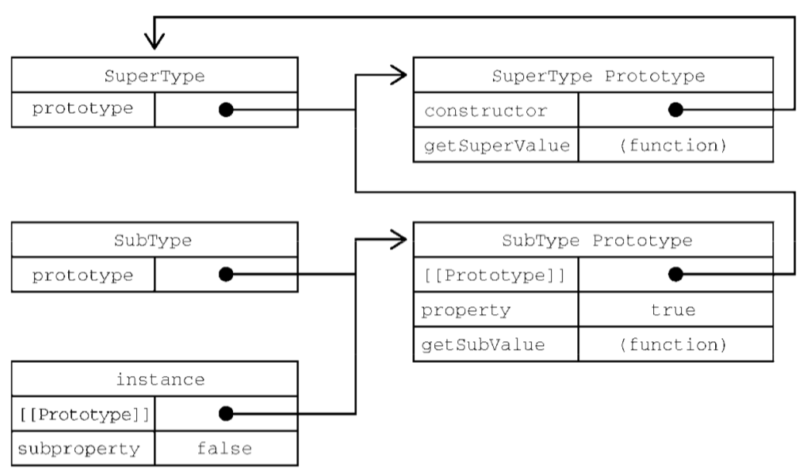

# 前端技术考核：JavaScript 原型、类与面向对象编程


## 0. 前言

你好，我是纳撸多。今天我要分享的主题是前端技术考核：JavaScript 原型、类与面向对象编程。在这里祝福大家新年快乐～，牛气冲天！让我们一起精进，成为更好的自己。	

如果有人向你请教「原型」这两个字是什么意思，你会怎么解释呢？不同领域的人可能有不同的见解。在文学电影作品领域，主线剧情便是一个原型，例如罗密欧与茱丽叶的原型是遭遇家人反对为爱殉情的男女主角，跟中国故事的梁山伯与祝英台很像。另外，故事中的人物也可以是原型，例如英雄的原型。在游戏开发中，原型是可以快速试玩的 demo。对于网站开发，更早的原型是产品经理手中的线框图。

那么原型是什么呢，接下来本文会从一般的原型说到面向对象、以及 JavaSc 的原型和原型链。

**文章大纲**

通过阅读完本文，你可以学到：
1. 使用面向对象思想构造“原型”
2. 基于「类」实现面向对象思想
3. 基于「原型」实现面向对象思想
4. JavaScript 原型的应用场景有哪些

阅读时长：15 分钟

## 1. “原型”与面向对象

### “原型”的一般概念

举个例子，你还记得 2016 年大火的动画电影是什么？那就是新海诚的作品[《你的名字》](https://zh.wikipedia.org/wiki/%E4%BD%A0%E7%9A%84%E5%90%8D%E5%AD%97%E3%80%82#%E6%BA%90%E8%B5%B7)，且不说奏乐动听，在剧情上也让人印象深刻。剧情并非以单纯恋爱题材为主，而是“有着见面的命运却迟迟无法相见的两人”。而这部作用的原型，便是以早期的新海城[《十字路口》](<https://zh.wikipedia.org/wiki/%E5%8D%81%E5%AD%97%E8%B7%AF%E5%8F%A3_(%E5%8B%95%E7%95%AB)>)为原型。

在文学、电影、游戏创作等领域，除了故事情节外，人物主角也是由原型一步步改良而来。比如[虐杀原型](https://zh.wikipedia.org/wiki/%E8%99%90%E6%9D%80%E5%8E%9F%E5%BD%A2) 游戏中的主角纸面原型如下，除了设定好人物的外表外，更重要的是要设定他的行为功能：


无论是故事剧情、人物，还是制造一个工业产品，<u>所谓原型就是最初的样例、模型</u>（很多时候模型和原型视为同一个东西）或者是为了测试概念而构建的产品。

### 通过面向对象实现计算机中的“原型”

在计算机编程中是通过`面向对象编程`概念实现原型的。要想了解什么是面向对象编程，它解决了什么问题？有必要先回顾`面向过程`编程。

举个例子，假设我们需要在屏幕上画出四方形、圆形与三角形，在用户点选图形时，图形需要按顺时钟方向旋转 360 度并根据形状的不同播放不同的 AIF 音效文件，如下图所示。


计算机是不能识别这么复杂的命令，这些命令需要拆分为一系列简单命令，分步执行，这就是面向过程的思维。基于这个程序要执行哪些动作，我们会写出以下的代码：

```js
// 严格来说，下面的代码对于计算机来说，也很复杂，不过足够让我们理解面向过程的思维了。

// 使用形状编号来找寻特定编号的图形
rotate(shapeNum) {
 // 旋转 360°
}

playSound(shapeNum) {
  // 查询播放哪个 AIF 音频文件
  // 播放
}
```

好的，看起来程序能够满足需求。接着需求说：要新增一个阿尔米巴原虫（Amoeba）形状并播放 .hif（高保真(HiFi) 音频）声音文件。原来的 rotate 程序还可以用，但是 playSound 需要修改。

```js
playSound(shapeNum) {
  if 不是 Amoeba
     // 查询使用哪个 AIF 文件
     // 播放
  else
    // 播放 amoeba.hif
}
```

这个时候已经对原来测试过的程序代码进行了一部分的修改。假设我们一开始对形状的旋转逻辑是这样写的：

1. 找出指定形状的外接四边形。
2. 计算出四边形的中心点，以此点为轴做旋转。


而后续才被告知阿尔巴原虫的旋转轴心不是图形的中心，而是绕着一端旋转，类似秒针那样。现在，我们也要修改已经测试好的`rotate` 程序了，给它加上轴心点的参数。

```js
rotate(shapNum, xPt, yPt) {
  if 不是 Amoeba
     // 计算中心点
     // 然后旋转
  else
    // 以 xPt 和 yPt 作为旋转中心
    // 然后旋转
}
```

如果现在程序还要支持新的形状，可能又要对 `rotate` 和 `playSound` 操刀了。可见这样的代码很脆弱，只要加入新的功能很可能影响现有稳定的代码。

面向过程思考的角度是这个程序要执行什么动作，如果使用面向对象的思维是怎么做的呢？


那面向对象，首先得有个对象。如下图所示，看中哪个对象，挑一个。


当然，这是现实世界中的人物对象。在编程中，对象得通过类进行实例化生成。所以要实现面向对象，**先要实现类的定义**，因为对象是靠类的模型塑造出来的。

举个例子：

```java
// 定义
public class Person {
  private void walk() {}
}
// 实例化
Person personA = new Person();
personA.walk()
Person personB = new Person();
personB.walk()
```

这个时候可以让 personA 和 personB 共享 Person 类对象中的属性和方法，都具有行走的功能，大大提高可维护性和复用性，这里思考的角度是这个程序有什么样的事物（Person）？这些事物有什么事件、功能与动作（walk）？

相信你已经了解面向过程和面向对象的区别了，让我们使用面向对象的思维重构前面的代码，首先分别为 3 个几何图形各写出一个类：


我们发现这三个类都有共同的类方法 `rotate()`、`playSound()`，可以再抽象出一个父类出来：


而对于新增的阿尔米巴原虫形状，我们只需要新建一个类，继承于 Shape 父类，只需要覆写父类的 rotate() 和 playSound 方法即可，无需改动另外三个类。


好了，让我们再总结下面向对象的基本定义。

- **类**（前面例子的 Person 类）
- **类方法**（walk 方法）与属性
- **类实例**（personA 和 personB）

基本概念：

- **封装**（对于访问者来说，访问的权限如何）
- **继承**（类、接口之间的继承，把共同的程序代码放在父类中）
- **多态**（同一个方法，不同的对象表现出不同的行为，例如 rotate）
- **抽象**（把子类的共同属性和行为抽象到父类中）

为了加深面向对象的理解，接下来我们再设计一个程序，可以让用户将一群动物丢到某种环境中以观察会发生什么事情，


假设现在的程序只有一部分的动物，后续会加入其他的动物。每个动物都用一个对象来表示，且动物会在环境中活动，执行任何被设计出的行为，分析步骤如下：

1. 分析并找出具有共同属性和行为的对象（比如 picture 图片、food 食物、hunger 饥饿程度、boundaries 活动边界、makeNoise 发出的声音、eat 吃饭、roam 散步）。
2. 抽象出代表共同状态与行为的父类（Animal）。
3. 决定子类是否需要让某项行为有特定不同的运作方式。（覆盖 eat、makeNoise）
4. 通过寻找使用共同行为的子类找出更多抽象化的机会（比如 Canine 犬科、Feline 猫科）。

可以看到以下这张图片：


最终得出一个简单的分类结构。

- Animal（动物类）
  - Canine（犬科）
    - Dog（狗）
    - Wolf（狼）
  - Feline（猫科）
    - Lion（狮子）
    - Tiger（老虎）
    - Cat（猫）

实现面向对象思想有两种方法，基于「**类实现**」和「**基于原型**」实现，下面将使用 Java 和 JavaScript 语言来实现。

## 2. 基于类实现的面向对象思想

要理解面向对象编程，最重要的特点就是根据`类封装创建对象`与`类之间继承`的概念了。在 Java 中，我们可以通过声明一个类作为基类，然后通过继承这个基类定义一个新类。

根据前面的类树状结构，我们首先定义 Animal 类，代码如下：

```java
public class Animal {
	public String picture; // 动物 JPEG 图像的名称
	public String food; // 此动物所吃的食物
	public int hunger; // 代表饥饿程度。它会根据动物吃了多少东西而改变
	public Boundaries boundaries; // 代表动物活动范围区域的长宽

	public Animal(String picture, String food, int hunger, Boundaries boundaries) {
		this.picture = picture;
		this.food = food;
		this.hunger = hunger;
		this.boundaries = boundaries;
	}

	public void makeNoise() { // 动物发出声音的行为
		System.out.println("Animal makeNoise!");
	}

	public void eat() { // 动物遇到食物时的行为程序
		System.out.println("Animal eat!");
	}

	public void sleep() { // 睡眠的行为程序
		System.out.println("Animal sleep!");
	}

	public void roam() { // 不在进食或睡眠时的行为程序
		System.out.println("Animal roam!");
	}
}
```

然后，基于 Animal 继续扩展子类，它们都覆盖了 Animal 的 makeNoise 和 eat 方法。

编写 Canine 类如下：

```java
public class Canine extends Animal {

	public Canine(String picture, String food, int hunger, Boundaries boundaries) {
		super(picture, food, hunger, boundaries);
	}

	public void makeNoise() {
		System.out.println("Canine makeNoise!");
	}

	public void eat() {
		System.out.println("Canine eat!");
	}
}
```

Feline 类：

```java
public class Feline extends Animal {

	public Feline(String picture, String food, int hunger, Boundaries boundaries) {
		super(picture, food, hunger, boundaries);
	}

	public void makeNoise() {
		System.out.println("Feline makeNoise!");
	}

	public void eat() {
		System.out.println("Feline makeNoise!");
	}
}

```

接着，编写基于 Feline 和 Canine 类的 Dog 类 和 Cat 类：

```java
public class Cat extends Feline {
	public Cat(String picture, String food, int hunger, Boundaries boundaries) {
		super(picture, food, hunger, boundaries);
	}
}
```

```java
public class Dog extends Canine {

	public Dog(String picture, String food, int hunger, Boundaries boundaries) {
		super(picture, food, hunger, boundaries);
	}
}
```

最后，我们可以根据 Dog 类和 Cat 类进行实例化并进行调用：

```java
public class Main {

	public static void main(String[] args) {
		Boundaries boundariesDog = new Boundaries();
		Boundaries boundariesCat = new Boundaries();
		Dog keji = new Dog("柯基", "骨头", 100, boundariesDog);
		Cat meiduan = new Cat("美短", "鱼", 100, boundariesCat);
		keji.makeNoise(); // Canine makeNoise!
		meiduan.makeNoise(); // Feline makeNoise!
	}
}
```

在这里，我们可以分析它的「原型」关系，`Keji` 的原型是 `Dog`，`Dog` 的原型是 `Canine`，而 `Canine` 的原型是 `Animal`。

接下来，我们看看基于原型实现的面向对象思想是怎么实现的。


## 3. 基于原型实现的面向对象思想

要想知道如何基于原型实现面向对象思想，先要知道 JavaScript 的原型与原型链是怎么来的。

### 3.1 JavaScript 原型与原型链是怎么来的？

ECMAScript 5.1 并没有正式支持面向对象的结构，比如类和继承。原型和原型链的出现是为了解决对象创建与继承的问题。对于对象创建来说，虽然使用 Object 构造函数或者对象字面量可以方便地创建对象，但是这些方式也有明显不足的地方，比如创建具有同样接口的多个对象需要重复编写很多代码。

业界上有几种方式可以创建对象，其中包括使用原型模式来创建对象。

1. **工厂模式**

```js
function createPerson(name, age, job) {
  let o = new Object();
  o.name = name;
  o.age = age;
  o.job = job;	
  o.sayName = function() {
    console.log(this.name);
  };
  return o;
}
let person1 = createPerson("Nicholas", 29, "Software Engineer");
let person2 = createPerson("Greg", 27, "Doctor");
```

**基本思路**：这里 `createPerson()` 接收 3 个参数，根据这几个参数构建了一个包含 Person 信息的对象。可以用不同的参数多次调用这个函数，每次都返回包含 3 个属性和 1 个方法的对象。

**优点**：解决创建多个类似对象的问题

**缺点**：没有解决对象标识问题（即创建的对象是什么类型）。

2. **构造函数模式**

**基本思路**：使用 ECMAScript 中的构造函数创建特定类型对象的。

```js
function Person(name, age, job) {
  this.name = name;
  this.age = age;
  this.job = job;
  this.sayName = function() {
    console.log(this.name);
  }
}

let person1 = new Person("Nicholas", 29, "Software Engineer");
let person2 = new Person("Greg", 27, "Doctor");
```

**优点**：通过这种方式创建的对象实例，可以通过 `instanceof`（更可靠） 或 `constructor` 确定对象类型。

```js
console.log(person1.constructor == Person); // true
console.log(person2.constructor == Person); // true

console.log(person1 instanceof Person); // true
console.log(person2 instanceof Person); // true
```

**缺点**：其定义的方法会在每个实例上都创建一遍。除非把方法定义在函数外部，但是反过来又会把外部作用域污染了。

```js
function Person(name, age, job) {
  this.name = name;
  this.age = age;
  this.job = job;
  this.sayName = sayName;
}
function sayName() {
  console.log(this.name);
}
```

3. **原型模式**（基于原型实现面向对象）

**基本思路**：每个函数都会创建一个 `prototype` 属性，这个属性是一个对象，包含应该由特定引用类型的实例共享的属性和方法。实际上，**这个对象就是通过调用构造函数创建的对象的原型**。

```js
function Person() {}
Person.prototype.name = "Nicholas";
Person.prototype.age = 29;
Person.prototype.job = "Software Engineer";
Person.prototype.sayName = function() {
  console.log(this.name);
}

let person1 = new Person();
person1.sayName(); // Nicholas

let person2 = new Person();
person2.sayName(); // Nicholas

console.log(person1.sayName == person2.sayName); // true
```




- 只要创建一个函数，就会按照特定规则为这个函数创建一个 prototype 属性。
- `prototype` 的 `contructor` 属性指向构造函数
实例的 `__proto__` 指向构造函数的 `prototype` 
- 实例与构造函数原型之间有直接的联系，但实例与构造函数之间没有。
- `hasOwnProperty()` 方法用于确定某个属性是在实例上还是在原型对象上。
- `in` 操作符会在可以通过对象访问指定属性时返回 true，无论该属性是在实例上还是在原型上。

原型模式之所以重要，不仅体现在自定义类型上，而且还因为它也是实现所有原生引用类型的模式。所有原生引用类型的构造函数（Object、Array、String 等）都在原型上定义了实例方法。

**优点**：使用原型对象的好处是，在它上面定义的属性和方法可以被对象实例共享。

**缺点**：传参以及共享引用类型的特性，要解决也简单，结合构造函数一起用，使用构造函数传参数，只把共享的方法放到原型对象上来。

这里就是基于原型进行类的定义了。而对于原型链的出现，则与继承相关，继续往下看。

### 3.2 JavaScript 类与继承

ECMAScript5（简称：ES5） 中要实现类的继承，主要是通过原型链实现。具体可以分为原型链继承、经典继承（盗用构造函数）、组合继承、原型式继承、寄生式继承、寄生式组合继承 5 种。


##### 1. 原型链继承以及优缺点

**基本思路**：前面说过，每个构造函数都有一个原型对象，原型有一个属性指向构造函数，而实例有一个内部指针指向原型。如果原型是另一个类型的实例呢？那就意味着这个原型本身有一个内部指针指向另一个原型，相应地另一个原型也有一个指针指向另个构造函数。这样就在实例与原型之间构造了一条原型链。这就是原型链的基本构想。

举个例子：

```js
function SuperType() {
  this.property = true;
}

SuperType.prototype.getSuperValue = function() {
  return this.property;
}

function SubType() {
  this.subproperty = false;
}

// 继承 SuperType
SubType.prototype = new SuperType();
SubType.prototype.getSubValue = function() {
  return this.subproperty;
};

let instance = new SubType();
console.log(instance.getSuperValue()); // true
```

这里的 `SubType.prototype = new SuperType()` 就把 SuperType 的实例直接赋给了 SubType 的原型，进而扩展了前面描述的原型搜索机制。在读取 SubType 实例上的属性时，首先会在实例上搜索这个属性。如果没找到，则会继续搜索实例的原型。在通过原型链实现继承之后，搜索就可以继承向上，搜索原型的原型，对属性和方法搜索会一直持续到原型链的末端。



**优点**：子类可以访问父类的所有属性和方法。
**缺点**：所有继承的属性和方法都会在对象实例间共享，无法做到实例私有。
- 主要问题出现在原型上中包含引用值的时候。
  ```js
  function SuperType() {
    this.colors = ["red", "blue", "green"];
  }
  function SubType() {}
  // 继承 SuperType
  SubType.prototype = new SuperType();
  let instance1 = new SubType();
  instance1.colors.push("black");
  console.log(instance1.colors) // "red,blue,green,black"

  let instance2 = new SubType();
  console.log(instance2.colors) // "red,blue,green,black"
  ```
- 子类型在实例化时不能给父类型的构造函数传参。

##### 2. 盗用构造函数（经典继承）

为了解决了原型包含引用值导致的继承问题，社区中出现一种叫做“盗用构造函数”的技术。
**基本思路**：在子类构造函数中调用父类构造函数。因为函数就是在特定上下文执行代码的简单对象，所以可以使用 `apply()` 和 `call()` 方法以新创建的对象为上下文执行构造函数。

```js
function SuperType() {
  this.colors = ["red", "blue", "green"];
}

function SubType() {
  // 继承 SuperType
  SuperType.call(this); // <--关键代码
}

let instance1 = new SubType();
instance1.colors.push("black");
console.log(instance1.colors); // "red,blue,green,black"

let instance2 = new SubType();
console.log(instance2.colors); // "red,blue,green"
```

在 `new SubType()`实例化后，调用了 `SubType()`的构造函数，间接调用了`SuperType.call(this);` 让每个实例都会有自己的 `colors` 属性。

**优点**：
- 每个实例都有自己的属性，避免引用类型的混用。
- 可以在子类构造函数中向父类构造函数传递参数。
```js
function SuperType(name) {
  this.name = name;
}

function SubType() {
  // 继承 SuperType 并传参
  SuperType.call(this, "Nicholas");

  // 实例属性
  this.age = 29;
}

let instance = new SubType();
console.log(instance.name); // "Nicholas";
console.log(instance.age); // 29
```

**缺点**：
- 必须在构造函数中定义方法，因此函数不能重用。
- 子类不能访问父类原型上定义的方法，因此所有类型只能使用构造函数模式。

##### 3. 组合继承

组合继承（有时候也叫伪经典继承）综合参考了原型链和盗用构造函数，将两者的优点集中了起来。

**基本思路**：使用原型链继承原型上的属性和方法，而通过盗用构造函数继承实例属性。

```js
function SuperType(name) {
  this.name = name;
  this.colors = ["red", "blue", "green"];
}

SuperType.prototype.sayName = function() {
  console.log(this.name);
}

function SubType(name, age) {
  // 继承属性
  SuperType.call(this, name);
  this.age = age;
}
// 继承方法
SubType.prototype = new SuperType();
SubType.prototype.sayAge = function() {
  console.log(this.age);
}

let instance1 = new SubType("Nicholas", 29);
instance1.colors.push("black");
console.log(instance1.colors); // "red,blue,green,black"
instance1.sayName(); // "Nicholas"
instance1.sayAge(); // 29

let instance2 = new SubType("Greg", 27);
console.log(instance2.colors); // "red,blue,green"
instance2.sayName(); // "Greg"
instance2.sayAge(); // 27
```

**优点**：组合继承弥补了原型链和盗用构造函数的不足。既可以把方法定义在原型上以实现重用，又可以让每个实例都有自己的属性。

**缺点**：组合继承存在效率问题，最主要的效率问题就是父类构造函数始终会被调用两次：一次在是创建子类型原型时调用，另一次是在子类构造函数中调用。

可以看到以下代码中两处调用的地方：

```js
function SuperType(name) {
  this.name = name;
  this.colors = ["red", "blue", "green"];
}

SuperType.prototype.sayName = function() {
  console.log(this.name);
}

function SubType(name, age) {
  SuperType.call(this, name); // 第二次调用 SuperType()
  this.age = age;
}

SubType.prototye = new SuperType(); // 第一次调用 SuperType()
SubType.prototype.constructor = SubType;
SubType.prototype.sayAge = function() {
  console.log(this.age)
};
```
##### 4. 原型式继承

前面 3 种类型都需要自定义类型才能共享信息，Douglas Crockford 提出即使不自定义类型也可以通过原型实现对象之间的信息共享。

**基本思路**：创建一个 object 函数，这个函数会创建一个临时构造函数，将传入的对象赋值给这个构造函数的原型，然后返回这个临时类型的一个实例。

```js
function object(o) {
  function F() {}
  F.prototype = o;
  return new F();
}
```

本质上，`object()` 是对传入的对象执行了一次浅赋值，如下代码所示，注意 `console.log() `打印的东西。

```js
let person = {
  name: "Nicholas",
  friends: ["Shelby", "Court", "Van"]
};

let anotherPerson = object(person);
anotherPerson.name = "Greg";
anotherPerson.friends.push("Rob");

let yetAnotherPerson = object(person);
yetAnotherPerson.name = "Linda";
yetAnotherPerson.friends.push("Barbie");

console.log(person.friends); // "Shelby,Court,Van,Rob,Barbie"
```

Crockford 推荐的原型式继承适用于这种情况：**你有一个对象，想在它的基础上再创建一个新对象。你需要把这个对象先传给 object()，然后再对返回的对象进行适当修改。**

ECMAScript5 通过增加 `Object.create()` 方法将原型式继承的概念规范化了。

```js
let person = {
  name: "Nicholas",
  friends: ["Shelby", "Court", "Van"]
};

let anotherPerson = Object.create(person);
anotherPerson.name = "Greg";
anotherPerson.friends.push("Rob");

let yetAnotherPerson = Object.create(person);
yetAnotherPerson.name = "Linda";
yetAnotherPerson.friends.push("Barbie");

console.log(person.friends); // "Shelby,Court,Van,Rob,Barbie"

```

**优点**：原型式继承非常适合不需要单独创建构造函数，但仍然需要在对象间共享信息的场合。

**缺点**：属性中包含的引用值始终会在相关对象间共享，跟使用原型模式是一样的。

##### 5.寄生式继承 

与原型式继承比较接近的一种继承方式是**寄生式继承**（parasitic inheritance）。

**基本思路**：创建一个实现继承的函数，以某种方式增强对象，然后返回这个对象。

```js
function createAnother(original) {
  let clone = object(original);// 通过调用函数创建一个新对象
  clone.sayHi = function() { // 以某种方式增强这个对象
    console.log("hi");
  }
  return clone; // 返回这个对象
}
```

object() 函数不是寄生式继承所必需的，任何返回新对象的函数都可以在这里使用。

```js
let person = {
  name: "Nicholas",
  friends: ["Shelby", "Court", "Van"]
}

let anotherPerson = createAnother(person);
anotherPerson.sayHi(); // "hi"
```

**优点**：寄生式同样适合主要关注对象，而不在乎类型和构造函数的场景。

**缺点**：通过寄生式继承给对象添加函数会导致函数难以重用，与构造函数模式类似。

##### 6. 寄生式组合继承

寄生式组合继承的出现是「为了解决组合继承的两次调用 SuperType 构造函数的效率问题」。

```js
function SuperType(name) {
  this.name = name;
  this.colors = ["red", "blue", "green"];
}

SuperType.prototype.sayName = function() {
  console.log(this.name);
}

function SubType(name, age) {
  SuperType.call(this, name); // 第二次调用 SuperType()
  this.age = age;
}

SubType.prototye = new SuperType(); // 第一次调用 SuperType()
SubType.prototype.constructor = SubType;
SubType.prototype.sayAge = function() {
  console.log(this.age)
};
```

有两组 name 和 colors 属性：一组在实例上，另一组在 SubType 的原型上。这是调用两次 SuperType 构造函数的结果。

寄生式组合继承通过盗用构造函数继承属性，但使用混合式原型链继承方法来解决上面的问题。

**基本思路**：不通过调用父类构造函数给子类原型赋值，而是取得父类原型的一个副本。

```js
function inheritPrototype(subType, superType) {
  let prototype = object(superType.prototype); // 创建对象
  prototype.constructor = subType; // 增强对象
  subType.prototype = prototype; // 赋值对象
}
```

这个函数接收两个参数：子类构造函数和父类构造函数。在这个函数内部，第一步是创建父类原型的一个副本。然后，给返回的 prototype 对象设置 constructor 属性，解决由于重写原型导致默认 constructor 丢失的问题。最后将新创建的对象赋值给子类型的原型。

代码如下：

```js
function SuperType(name) {
  this.name = name;
  this.colors = ["red", "blue", "green"];
}

SuperType.prototype.sayName = function() {
  console.log(this.name);
};

function SubType(name, age) {
  SuperType.call(this, name);
  this.age = age;
}

inheritPrototype(SubType, SuperType);

SubType.prototype.sayAge = function() {
  console.log(this.age);
};
```

这里你可能有会疑问：这里为什么不可以直接把 `subType.prototype = superType.prototype` 呢？
这样的话，SubType 的原型与 SuperType 的完全一致了，后续如果在 SubType.prototype.xxx 也会影响 SuperType.prototype 了。

**优点**：只调用了一次 SuperType 构造函数，避免了 SubType.prototype 上不必要也用不到的属性。而且，原型链仍然保持不变，因此 `instanceof` 操作符和 `isPrototypeOf()` 方法正常有效。

**缺点**：需要额外实现 `object()` 寄生式副本函数，可以直接使用 `Object.create(superType.prototype)`解决。

总的来说，寄生式组合继承可以算是引用类型继承的最佳模式。

### 3.3 实现动物类程序

通过前面的学习，相信你已经对如何使用 JavaScript 原型和原型链实现类的定义与继承比较熟悉了。现在让我们稍微回到前面提到的动物类程序，使用 JavaScript 来实现：

Animal（动物类）
  - Canine（犬科）
    - Dog（狗）
    - Wolf（狼）
  - Feline（猫科）
    - Lion（狮子）
    - Tiger（老虎）
    - Cat（猫）

#### ES5 方式

ES5 通过「**原型链**」进行继承，具体可以使用「**寄生式组合继承**」。

##### 定义类

1. 首先定义一个构造函数，通过构造函数创建对象（任何的 javaScript 函数都可以是构造函数）。
2. 然后使用 prototype 定义公共的属性和方法以此替代没有类的定义。

```js
function Animal(picture, food, hunger, boundaries) {
  this.picture = picture;
  this.food = food;
  this.hunger = hunger;
  this.boundaries = boundaries;
}

Animal.prototype.makeNoise = function() {
  console.log("Animal makeNoise!");
};

Animal.prototype.eat = function() {
  console.log("Animal eat!");
};

Animal.prototype.sleep = function() {
  console.log("Animal sleep!");
};

Animal.prototype.roam = function() {
  console.log("Animal roam!");
};

```

##### 子类和继承

我们通过设置子类的 prototype 的值为父类的值，并在子类的构造函数调用超类的构造函数实现继承。

```js
function inheri(subClass, superClass) {
  subClass.__proto__ = superClass; // 子类的构造函数指向父类的构造函数，以便实现静态方法、静态属性的继承
  subClass.prototype = Object.create(superClass.prototype); // 实现原型链上的继承，以便访问公共的属性和方法
  Object.defineProperty(subClass, "constructor", {
    enumerable: false,
    value: subClass,
    writable: true,
  });
}

function Canine(picture, food, hunger, boundaries) {
  return Animal.call(this, picture, food, hunger, boundaries); // 调用父类的构造函数
}
inheri(Canine, Animal);

// 对方法进行覆盖
Canine.prototype.makeNoise = function() {
  console.log("Canine makeNoise!");
  return "Canine makeNoise!";
};

Canine.prototype.eat = function() {
  console.log("Canine eat!");
};

function Dog(picture, food, hunger, boundaries) {
  Canine.call(this, picture, food, hunger, boundaries); // 调用父类的构造函数
}
inheri(Dog, Canine);
```

最后实例化 Dog

```js
const boundariesDog = new Boundaries(0, 0, 5, 5);
const keji = new Dog("柯基", "骨头", 100, boundariesDog);
keji.makeNoise();
```

#### ES6 方式

前面说过了 ES5 的 5 种继承方式，使用 ECMAScript 5 的特性来模拟类似于类（class-like）的行为。不难看出，各种策略都有自己的优缺点，实现继承的代码也显得非常冗长和混乱。

为解决这些问题，ES6 引入了 class 关键字具有正式定义类的能力。虽然 ECMAScript 6 类表面上看起来可以支持正式的面向对象编程，**但实际上它背后使用的仍然是原型和构造函数的概念**。

```js
class SuperType {
  constructor() {
    // 添加到 this 的所有内容都会存在不同的实例上
    this.locate = () => {}
  }
  sayName() {} // 在类块中定义的所有内容都会定义在类的原型上
}

class SubType extends SuperType {
  constructor(param) {
    super(param) // 相当于 super.constructor()，调用 super() 会调用父类构造函数，并将返回的实例赋值给 this
  }
  sayAge() {}
}
```

ECMAScript 中，类构造函数必须使用 new 操作符。而普通构造函数如果不使用 new 调用，那么就会以全局的 this（通常是 window）作为内部对象。

从各个方面来看，ECMAScript 类就是一种特殊函数。声明一个类之后，通过 typeof 操作符检测类标识符，表明它是一个函数。

**优点**：类的语法让开发者可以优雅地定义向后兼容的类，既可以继承内置类型，也可以继承自定义类型。类有效地跨域了对象实例、对象原型和对象类之间的鸿沟。
**缺点**：类是新增的语法糖，刚开始接触时可能不习惯。

接下来实现动物类程序：
```js
class Animal {
  constructor(picture, food, hunger, boundaries) {
    // 定义一个构造函数，当使用关键字 new 调用类时，会调用这个构造函数
    this.picture = picture;
    this.food = food;
    this.hunger = hunger;
    this.boundaries = boundaries;
  }

  makeNoise() {
    // 定义在原型上的共有方法
    // 动物发出声音的行为
  }

  eat() {
    // 动物遇到食物时的行为程序
  }

  sleep() {
    // 睡眠的行为程序
  }

  roam() {
    // 不在进食或睡眠时的行为程序
  }

  // 可以通过 static 关键字，实现静态函数
  static compare(canine1, canine2) {
    return canine1.hunger - canine2;
  }
}
```

通过 `extend` 关键字进行类的继承，在构造函数中通过关键字 `super()` 调用超类的构造函数：

```js
class Canine extends Animal {
  constructor(picture, food, hunger, boundaries) {
    super(picture, food, hunger, boundaries);
  }

  makeNoise() {}

  eat() {}
}
```

## 4. 应用场景

前面一直在讨论面向对象编程以及 JavaScript 的原型，那在实际开发中原型我们可以做什么呢。


### 4.1 给 JavaScript API 扩展属性

很多时候，想要用自然语言来描述日期距离某个特定时间点的时间间隔。比如，“某件事情发生在 3 秒钟前” 这种表达，远要比“某件事情发生在 x 年 x 月 x 日” 这种表达更容易理解。常见的场景例如微信朋友圈的发布时间、博客发帖等。

下面的例子，为所有的 Date 实例都添加了 ago 获取器，它会返回自然语言描述的日期距离现在 的时间间隔。简单地访问该属性就会调用事先定义好的函数，无须显式调用。

```js
Object.defineProperty(Date.prototype, "ago", {
  get: function() {
    const diff = (new Date().getTime() - this.getTime()) / 1000; // get seconds
    let dayDiff = Math.floor(diff / 86400); // get days
    return (
      (dayDiff === 0 && diff < 60 && "just now") ||
      (diff < 120 && "1 minute ago") ||
      (diff < 3600 && Math.floor(diff / 60) + "minutes ago") ||
      (diff < 7200 && "1 hour ago") ||
      (diff < 86400 && Math.floor(diff / 3600) + "hours ago") ||
      (dayDiff == 1 && "Yesterday") ||
      (dayDiff < 7 && dayDiff + "days ago") ||
      Math.ceil(dayDiff / 7) + "weeks ago"
    );
  },
});

const a = new Date("2018-11-22T09:30:00");
console.log(a.ago); // 91 weeks ago
```

### 4.2 给第三方库、框架增加属性

拿 Vue 项目举例，在开发过程中，如果要写一个 Vue 消息弹窗[插件](https://cn.vuejs.org/v2/guide/plugins.html)，通过下面代码这样使用：

```js
this.$Message(options);
```

通过查看 Vue 打包后的源码，可以发现实例公共的方法、属性都放到 `prototype` 对象上了。而 Vue 框架提供了 `install` 实现规范，让添加 Vue 实例方法，通过把它们添加到 `Vue.prototype` 上实现。

Message 组件

```html
<template>
  <transition>
    <div class="parent" v-if="show">
      <div class="child">{{ message }}</div>
    </div>
  </transition>
</template>
<script>
  export default {
    name: "toast",
    data() {
      return {
        message: "message",
        show: false,
      };
    },
  };
</script>
```

**编写的插件如下**：

```js
import toastComponent from "./toast.vue";

const Toast = {};

let $vm; // 存储 Vue 实例

Toast.install = function(Vue, options) {
  // 不重复
  if (Toast.installed) return;
  Toast.installed = true;
  // 挂载 $toast 到 Vue 的原型链中
  // 后续只需要通过 this.$toast 即可使用
  // 传递了四个参数
  // message 展示的内容
  // duration 时长
  // callback 关闭时的回调函数
  // config 暂时无用
  console.log(options);
  function createToast(message, duration, callback, config) {
    console.log(config);
    // 使用 Vue.extend 创建一个子类
    let Ext = Vue.extend(toastComponent);
    if (!$vm) {
      $vm = new Ext({
        el: document.createElement("div"),
      });
    }

    // 给对象赋值
    $vm.message = message || "message";
    $vm.duration = duration || 2500;
    $vm.show = true;

    // 挂载到 dom 中
    document.body.appendChild($vm.$el);

    // 延时消失
    setTimeout(() => {
      $vm.show = false;
      typeof callback === "function" && callback();
    }, $vm.duration);
  }
  Vue.prototype.$toast = createToast;
};

export default Toast;
```

上面 [Vue.extend](https://cn.vuejs.org/v2/api/#Vue-extend) API，用于命令式的创建组件，而不是声明式，最后手动 append 到 dom 中。在 iview 组件库的 message 组件，是用这个 api 去动态构造组件的

**注册到 Vue 上**：

```js
import Vue from "vue";
import toast from "./src/index.js";
Vue.use(toast);
```

**外部进行使用**：
```html
<template>
  <div><h2>Hello, MyPlugin</h2></div>
</template>

<script>
  export default {
    mounted() {
      console.log(this.$toast("Hello, Jecyu!"));
    },
  };
</script>

```
## 5. 小结

本文通过引进原型的概念，来谈谈面向对象的思想以及如何通过传统的面向对象语言 Java 来怎样新建对象以及继承类的。接着说说 JavaScript 又是如何通过原型来实现这两个概念的，它们的本质上的区别是基于类继承与基于原型继承。

另外，要进一步学习面向对象思想，往往需要掌握 UML 建模，顾名思义建立模型，也是建立原型的过程，之后再对系统进行具体的编码，具体可以看《面向对象与设计分析》。
## 参考资料

- [Trying to understand the difference between prototype and constructor in JavaScript](https://stackoverflow.com/questions/28600238/trying-to-understand-the-difference-between-prototype-and-constructor-in-javascr)
