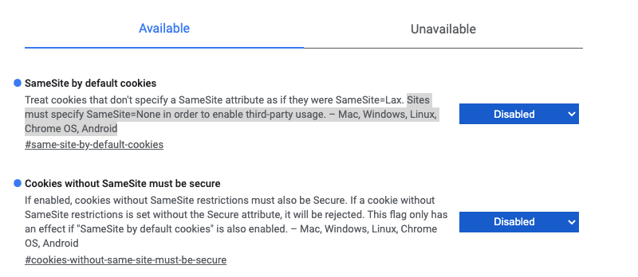
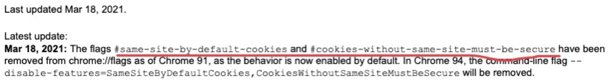
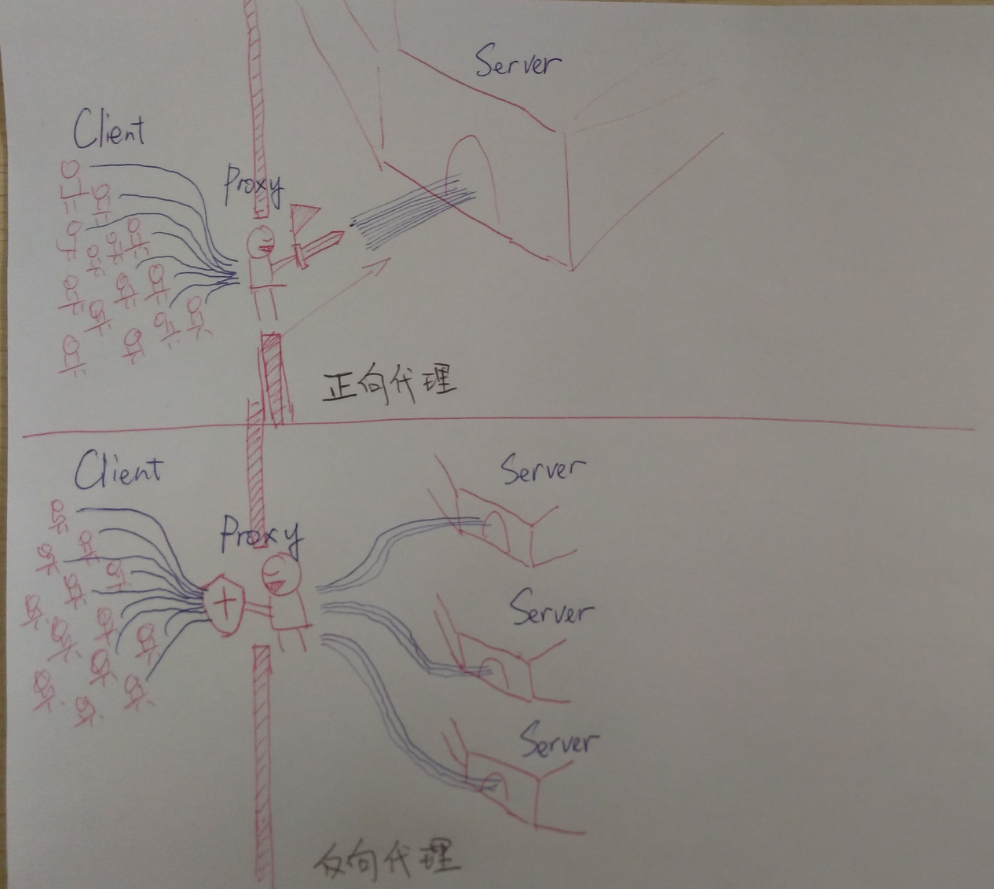
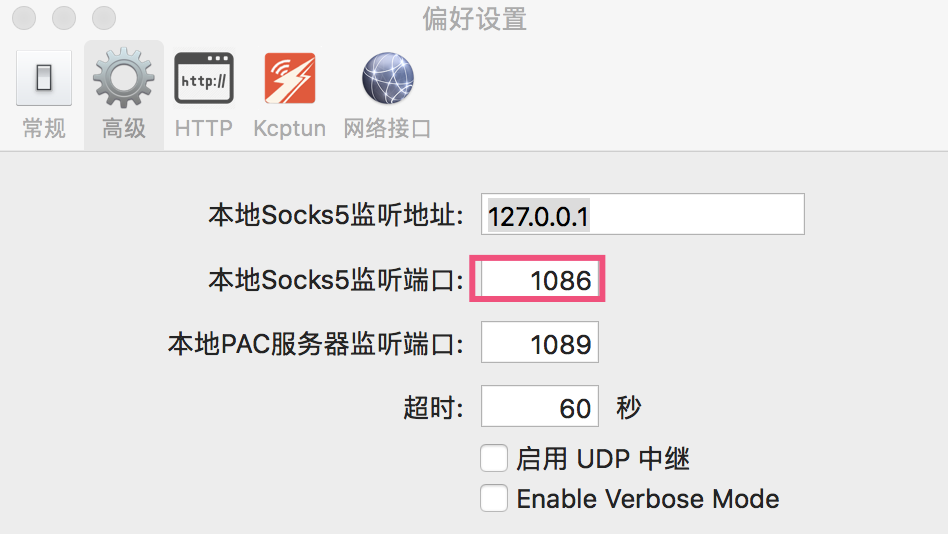

# 小 Tips：Chrome 91 版本 Cookie Same-Site 前端本地开发解决方案


## 前言

最近在本地开发环境测试公司系统时，遇到了跨域问题，导致无法登录获取用户权限。原本只要是本地浏览器存储了目标服务器的cookie 信息就可以发送跨域请求，但奇怪的是，已经通过开启 CORS 同源请求的方式获取到了 cookie，在本地开发环境启动的系统依然出现了跨域情况，检查发现请求根本没有自动携带 cookie。为什么开启了 CORS，还是会出现跨域的问题呢？

文章大纲

- 分析问题

  - 为什么会有跨域问题
  - 如何解决跨域问题
  - 为什么开启 CORS，还会出现跨域

- 解决问题

  - 浏览器关闭 Same-Site 

  - 使用第三方代理


## 分析问题

### 为什么会有跨域问题

 跨域本质上是 浏览器实现**同源策略（Same Origin Policy）**的一种安全手段。对于同源的定义，`url 协议`（protocol）、`端口`（port）、`主机`（host 域名）完全相同称为同源站点。同源策略限制了两个不同源站点的资源访问，比如前端想通过 XMLHttpRequest 将站点数据发送给不同源站点，就会产生跨域问题。

比如 A 源为：`http://store.company.com/dir/page.html`，下列与 B 源 的对比。引用自 MDN [Definition of an origin](https://developer.mozilla.org/en-US/docs/Web/Security/Same-origin_policy#definition_of_an_origin)

| URL                                               | Outcome     | Reason                                           |
| :------------------------------------------------ | :---------- | :----------------------------------------------- |
| `http://store.company.com/dir2/other.html`        | Same origin | Only the path differs                            |
| `http://store.company.com/dir/inner/another.html` | Same origin | Only the path differs                            |
| `https://store.company.com/page.html`             | Failure     | Different protocol                               |
| `http://store.company.com:81/dir/page.html`       | Failure     | Different port (`http://` is port 80 by default) |
| `http://news.company.com/dir/page.html`           | Failure     | Different host                                   |

而本地前端服务` http://localhost:9096` 与服务端 `http://api.backend.com` 是不同源的，存在跨域资源访问限制问题。

### 如何解决跨域问题

解决跨域问题，有很多种方式，比如使用 `JSONP`、`CORS`、`Proxy` 等方案。在公司的项目中，使用了 CORS 方案。

[CORS](https://developer.mozilla.org/zh-CN/docs/Glossary/CORS) 跨域资源共享是为了解决同源策略的网络层面限制而引入的，它是一种基于 [HTTP](https://developer.mozilla.org/zh-CN/docs/Glossary/HTTP) 头的机制，该机制通过允许服务器标示除了它自己以外的其他 [origin](https://developer.mozilla.org/zh-CN/docs/Glossary/源)（域，协议和端口），这样会浏览器可以访问加载这些资源。

如何开启呢，比如一个登录 `login` 接口简单请求，浏览器发出的请求信息会添加 `origin` 字段，`Origin`字段用来说明，本次请求来自哪个源（协议 + 域名 + 端口）。服务器根据这个值，决定是否同意这次请求。

```
  GET /cors HTTP/1.1
+ Origin: http://api.backend.com
  Host: localhost:9096
  Accept-Language: zh-CN,zh
  Connection: keep-alive
  User-Agent: Mozilla/5.0...
  ...
```

 如果`Origin`指定的域名在许可范围内，服务器会设置响应头 `Access-Control-Allow-Origin` ，浏览器会检查这个字段，从而让 `XMLHttpRequest` 正常获得结果，否则，就会抛出错误。

```js
+ Access-Control-Allow-Origin: http://localhost:9096
Set-cookie: token=xxxx; Path=xxx
```

同时，服务器会通过 `Session-Cookie` 机制维护用户的登录状态，从而使用 `Set-Cookie` 告诉浏览器中写入 `Cookie`。

登录成功后，客户端再次发送一个 `getUser` 接口用于获取用户权限信息，要携带之前的 `Cookie` 发送给服务端。

由于  CORS 请求默认不发送 Cookie 和 HTTP 认证信息。所以要把 Cookie 发送到服务器，需要 `ajax` 请求中开发 `withCredentials` 属性 为 `true`，并且服务端要指定 `Access-Control-Allow-Credentials` 字段：

```sh
+ Access-Control-Allow-Credentials: true
```

并且`Access-Control-Allow-Origin`就不能设为星号，必须指定明确的、与请求网页一致的域名。这样，就可以实现携带 Cookie 正常访问不同源的服务端资源了。

### 为什么开启 CORS，还会出现跨域

通过查看浏览器的 Chrome Network 发现，登录成功后，getUser 接口发送的浏览器请求没有正常携带 Cookie 字段。关于 cookie 无法被携带问题，有不少排查的方向，

- 浏览器是可以禁用 Cookie 的  `chrome://settings/cookies?search=cookie`
- 浏览器的插件导致，可以考虑使用无痕模式测试
- 是否开启了某些工具模拟请求，网络设置问题
- 是否是 Cookie 的属性设置问题，比如 domain、path、失效时间等。
- ...

经过仔细排查后发现这是因为浏览器设置的 Cookie 的 Same-Site 属性问题，导致 Cookie 无法被正常携带。


`Cookie` 的 `Same-Site` 属性是为了防止（CSRF-Cross-Site-Request-Forgery）`跨站请求伪造攻击`，CSRF 是指在受害者访问一个网站时，其 Cookie 还没有过期的情况下，攻击者伪造一个链接地址发送受害者并欺骗让其点击，从而获取用户信息。

`Same-Site` 名为同站，那它跟跨站、跨域有什么区别呢，理解它们的区别有利于我们更好的理解 `Cookie` 的 `Same-Site` 属性。

#### 同站（Same-Site）、跨站（Cross-Site）与跨域（Cross-Origin）的区别

**跨域**

本质上是 浏览器实现**同源策略（Same Origin Policy）**的一种安全手段。对于同源的定义，url 协议（protocol）、端口（port）、主机（host 域名）完全相同称为同源站点。

**同站与跨站**

只要两个 URL 的`eTLD+1` 相同即是同站，否则为跨站，不需要考虑协议和端口。

**eTLD**: (effective top-level domain) 有效顶级域名，注册于 Mozilla 维护的公共后缀列表（Public Suffix List）中,如 `.com`、`.org` 、`.com` 等

**eTLD+1**: 有效顶级域名 + 二级域名，如 `taobao.com`，`baidu.com`，`sugarat.top`

> 参考MDN https://developer.mozilla.org/en-US/docs/Glossary/TLD

#### Cookie 的 Same-Site

大部分网站使用了 Cookie 来存储登录状态，保护 Cookie 不被三方站点利用尤为重要，我们可以合理设置 `Cookie` 的 `Samesite` 属性值防御 `CSRF` 攻击。

- `strict`：严格校验，严格校验站点是否为同源
- `lax`：较宽松校验，在跨站点的情况下，从第三方网站打开链接，get 方式提交表单都会携带 cookie，
  但如果在第三方站点中使用了 post 方法，或者通过 img，iframe 等标签加载的 url，会禁止 cookie 发送
- `none`：不校验第三方站点是否为同源或同一站点，任何情况下都会发送 cookie

## 解决问题

### 浏览器关闭 Cookie 的 Same-Site

我们可以通过手动关闭 Cookie 的 Same-Site，这样就正常携带 Cookie 给服务端了。在 Chrome 浏览器中可以输入 `chrome://flags/`

把 `SameSite by default Cookie` 和 `Cookies without SameSite must be secure` 禁用掉。




-  `SameSite by default Cookie` 禁用或开启 SameSite Cookie 的规则
- `Cookies without SameSite must be secure` ：当没有设置 `SameSite` 属性或者设为 `None` 的时候，开启这个规则就要求跨站的前后端数据通信必须是 https 协议。

在 91 版本以前，是可以这样做的。仔细发现浏览器 Chrome 自动升级到了 91 版本，91 版本不再给手动关闭了。



如果想让后端设置响应头关闭，通过设置 `Set-Cookie` 时设置  `Same-Site` 属性为 `none `，但是这种做法要 https 协议才支持，必须设置 `Secure` 属性。

```bash
Set-Cookie: widget_session=abc123; SameSite=None; Secure
```

既然不能手动设置了，还有其他的方案吗？

方案一：本地开发暂时不升级到 91 版本了。

方案二：通过反向代理解决这个问题。

接下来具体说说方案二。

### 使用第三方代理

在使用代理解决 Cookie 携带问题前，先要搞懂什么是正向代理和反向代理。

正向代理与反向代理的区别是他们提供的服务对象不同，

- 正向就是对服务获取方服务的，表现为在客户端的出口位置，主要解决客户端的问题（比如翻墙上外网）
- 反向就是对服务提供方服务的，表现为在服务端的网络入口位置，主要解决服务端的问题（负载均衡）



来自知乎某图 https://www.zhihu.com/question/24723688


#### 正向代理

举个例子，没有代理的情况下，天朝下日常 git clone 仓库常常 443 错误，这是 https 开放的默认端口。

```js
git clone https://github.com/alexjoverm/typescript-library-starter.git ts-axios
Cloning into 'ts-axios'...
fatal: unable to access 'https://github.com/alexjoverm/typescript-library-starter.git/': LibreSSL SSL_connect: SSL_ERROR_SYSCALL in connection to github.com:443 
```
如果你使用到了 小飞机 [shadowsocks](https://github.com/shadowsocks)进行科学上网，可以看到小飞机监听的端口，这时候就可以给 git 请求的仓库设置为代理地址，



```shell
# 使用socks5协议
HTTP_PROXY="socks5://127.0.0.1:1086" HTTPS_PROXY="socks5://127.0.0.1:1086" git clone https://github.com/alexjoverm/typescript-library-starter.git ts-axios

# 使用http协议
HTTP_PROXY="http://127.0.0.1:1087" HTTPS_PROXY="http://127.0.0.1:1087" git clone https://github.com/alexjoverm/typescript-library-starter.git ts-axios
```

正向代理：客户端 --- 代理服务器 --- 目标服务器。这样就可以正常下载仓库了。

#### 反向代理

除了使用反向代理作负载均衡外，还可以使用反向代理解决跨站携带 Cookie 的问题，核心思路就是在前端本地使用代理服务器，整个数据的传递方式是 `目标服务器---代理服务器---浏览器`，而本地代理服务器与本地浏览器是属于同站，不存在跨站问题，而服务器与服务器之间传递数据没有同源策略的限制，并不会存在跨域行为，代理服务器与目标服务器之间能正常转发 Cookie， 浏览器就能正常携带 Cookie 给目标服务器了。

如果你是 Vue 项目的话，一般是通过 `Vue-Cli` 脚手架搭建，要使用实现代理服务，可以直接在 `vue.config.js` 文件对应 `webpack` 的 w配置增加 `devServer.proxy` 配置，值为要被代理的目标地址，

```js
module.exports = {
  devServer: {
    port: 9000
    proxy: 'http://backend.com:4000'
  }
}
```

前端根据 `devServer.port` 修改资源请求的地址为对应的  `localhost + port` 的形式即可，也就是说前端直接请求代理服务器地址即可，`http://localhost:9000`，这样前端发送请求，由于与代理服务器是同站，浏览器就会携带上 Cookie，Cookie 经过代理服务器进行转发给目标服务器，这样就可以正常维持登录状态了。


除了上面的方式外，你也可以使用 node 构建一个简单的代理服务器

```js
const http = require("http");
const httpProxy = require("http-proxy"); // 通过 http-proxy 实现代理功能

const proxy = httpProxy.createProxyServer();

proxy.on("error", function(err, req, res) {
  res.end();
});

const proxy_server = http.createServer(function(req, res) {
  proxy.web(req, res, {
    target: "http://backend.com:18080" // 目标服务器
  });
});

proxy_server.listen(8080, function() { // 代理服务器监听的端口
  console.log("proxy server is running");
});
```

如果在生产环境上，前端应用与后端应用不在同一个服务器上，还可以使用 nginx 进行代理转发。

1. 把访问 `http://代理服务器地址:9001/edu` 的请求转发到 `http://目标服务器1:8080`
2. 把访问 `http://代理服务器地址:9001/vod` 的请求转发到 `http://目标服务器2:8081`

```shell
server {
  listen 9001; // 代理服务器端口
  server_name xxx.xxx // 代理服务器域
  ;

  location ~ /edu/ {
    proxy_pass http://目标服务器域1:8080;
  }
  
  location ~ /vod/ {
    proxy_pass http://目标服务器域2:8081;
  }
}
```

## 小结

对于 Cookie Same-Site 的处理，本质上还是解决跨域的问题，离不开业界的方案，比如 CORS、设置代理，还可以通过 token 认证方式绕过这种处理，前端拿到服务端的 token 保存到本地，每次请求时都写到请求头里，这也是一种方案。

## 参考资料

- [跨域资源共享 CORS 详解](http://www.ruanyifeng.com/blog/2016/04/cors.html) 阮一峰大佬，详细讲解了 CORS 机制对简单请求和非简单请求的两种不同处理，以及客户端和服务端的配置区别。

- [当 CORS 遇到 SameSite](https://juejin.cn/post/6844904095271288840)

- [浏览器系列之 Cookie 和 SameSite 属性](https://github.com/mqyqingfeng/Blog/issues/157)

- [git 设置代理](https://github.com/shadowsocks/shadowsocks-windows/issues/407 )

- [正向代理与反向代理](https://www.cnblogs.com/anker/p/6056540.html) 

  

