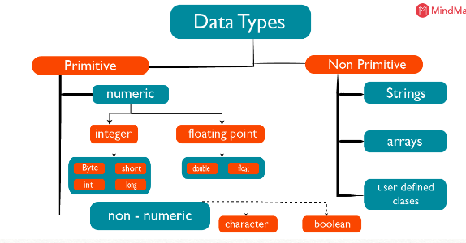
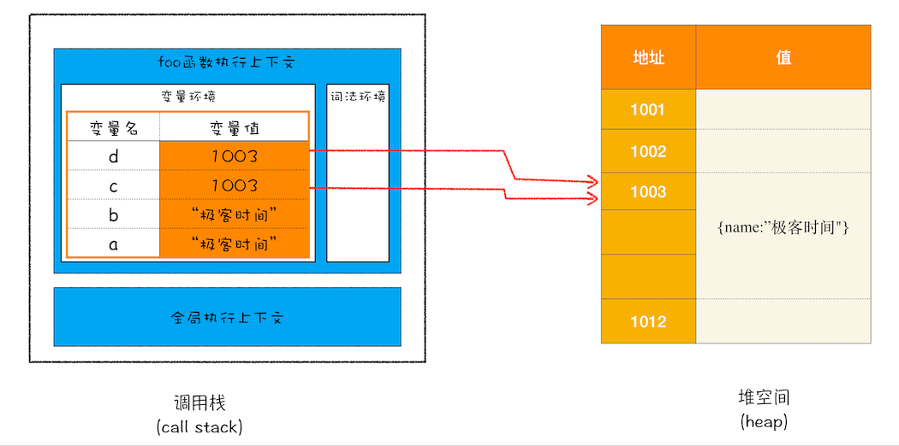

# 前端技术考核：JavaScript 数据类型考到这些

<!--   -->


目标读者：希望快速复习有关 JavaScript 数据类型的相关知识点，一个框架树。更多细节可以进一步看 MDN和书籍。

博客类型：实践总结型，以广度为主，也就是应用维度为重（问题、技术规范、最佳实践、市场应用趋势），设计维度为略（这个适合单独的特性剖析）。批判性思维考虑每个部分的观点表达。

博客平台：

- 分类
  - 前端
- 标签
  - JavaScript
  - 面试
## 0. 前言

大家好，我是纳撸多。今天要分享的内容是JS 基础之数据类型，让我们一起精进，成为更好的自己。

程序是由通过命令操作数据输出结果，而数据有很多种类型，如何进行类型判断、类型之间又是如何转换的，这些都是日常工作中需要掌握的。

通过阅读本文，你可以学到：

- JavaScript的数据类型有哪些？
- 这些数据类型是如何存储的？
- 如何进行数据类型判断？
- 如何进行数据类型的转换？

## 1.  JavaScript 数据类型有哪些?


JavaScript 一共有 7 种数据类型，包括基本类型 Undefined、Null、Boolean、Number、String、Symbol 和引用类型 Object。

### 1.1 基本类型

- Undefined
  - 当使用 var 或 let 声明了变量但没有初始化时，就相当于给变量赋予了 undefined。增加这个特殊值的目的就是为了正式明确空对象指针（null）和未初始化变量的区别。

    ```js
    let message;
    console.log(message == undefined); // true
    ```

  - undefined 值是由 null 值派生而来，它们表面上相等 ==。

    ```js
    console.log(null == undefined); // true
    ```
- Null  
  - 逻辑上讲，null 值表示一个空对象指针，这也是给 typeof 传一个 null 会返回 “object” 的原因。
  
    ```js
    let car = null;
    console.log(typeof car); // object
    ```
  
  - 在定义将来要保存对象值的变量时，建议用 null 来初始化，不要使用其他值。这样，只要检查这个变量的值是不是 null 就可以知道这个变量是否在后来被重新赋予了一个对象的引用。
  
    ```js
    if (car != null) { /* car 是一个对象的引用 */ }
    ```
- Boolean
  
  - true 和 false，这两个布尔值不同于数值，因此 true 不等于 1，false 不等于 0。
  - 注意，布尔值字面量 true 和 false 是区分大小写的，因此 True 和 False （及其大小混写形式）是有效的标识符，但不是布尔值。
- Number
  - Number 类型使用 IEEE 754 格式表示整数和浮点值（在某些语言中也叫双精度值）。
  
    ```js
    let intNum = 55; // 整数
    let octalNum = 070; // 八进制的 56，八进制字面量在严格模式下是无效的，会导致 JavaScript 引擎抛出语法错误
    let hexNum = 0xA; // 十六进制 10
    let floatNum = 1.1; // 浮点数
    ```
  
  - 值的范围：由于内存的限制，ECMAScript 并不支持表示这个世界上的所有数值。ECMAScript 可以表示的最小数值保存在 Numer.MIN_VALUE 中（多数浏览器中 5e-324），可以表示的最大的数值保存在 Number.MAX_VALUE 中（多数浏览器中：1.7976931348623157e+308）。如果某个计算得到的数值结果超出了 JavaScript可以表示的范围，那么这个数值会自动转换为一个 +Infinity（正无穷值）或 -Infinity（负无穷值）。**在计算非常大或非常小的数值，有必要监测一下计算结果是否超出范围。**
  
  - 有一个特殊的数值叫做 NaN，意思是“不是数值”（Not a Number），用于表示本来要返回数值的操作失败了（而不是抛出错误）。
  
  - 把一个值给 `isNaN()` 后， 该函数会尝试把它转化为数值。任何不能转化为数值的值都会返回 `true`。
- String
  - String（字符串）数据类型表示零或多个 16 位 Unicode 字符序列。
  - 几乎所有值都有 `toString()` 方法。这个方法的唯一用途就是返回当前值的字符串等价物。因为 `null` 和 `undefined` 没有 `toString()` 方法，所有 `String()`方法就直接返回了这两个值的字面量文本。
- Symbol
  
  - Symbol 是 ECMAScript6 新增的数据类型。符号实例是唯一、不可变的。符号的用途是确保对象属性使用唯一标识符，不会发生属性冲突的危险。

其中还有一种最新的基本数据类型 BigInt ，即使超过 Number 的安全范围限制，也可以安全地存储和操作。可以看这篇文章 [JS最新基本数据类型：BigInt](https://juejin.cn/post/6844903902295359502#heading-4)

### 1.2 引用类型

- Object
  - 分类
    - 基本引用类型
    - 集合引用类型
  - 说明
    - ECMAScript 的对象其实就是一组数据和功能的集合。
    - 对象通过 new 操作符后跟对象类型的名称来创建。
    - Object 类型的所有属性和方法在派生的对象上同样存在。
  - 属性与方法
    - `constructor`：用于创建当前对象的函数。
    - `hasOwnProperty(propertyName)`：用于判断当前对象实例（不是原型）上是否存在给定的属性。
    - `isPrototypeOf(object)`：用于判断当前对象实例是否为另一个对象的原型。
    - `propertyIsEnumerable(propertyName)`：用于判断给定的属性是否可以使用 `for-in` 语句枚举。
    - `toLocaleString()`：返回对象的字符串表示，该字符串反应对象所在的本地化执行环境。
    - `toString()`：返回对象的字符串表示。
    - `valueOf()`：返回对象对应的字符串、数值或布尔值表示。通常与 `toString()` 的返回值相同。

#### 1.2.1 基本引用类型

##### 1.2.1.1 [Date](https://developer.mozilla.org/en-US/docs/Web/JavaScript/Reference/Global_Objects/Date)

Date 类型将日期保存为自协调世界时（UTC，Universal Time Coordinated）时间 1970 年 1 月 1 日午夜（零时）至今所经过的毫秒数。

注意：虽然 Date 对象的核型时间值时 UTC，但获取日期和时间或其组成部分的基本方法都是在本地（即主机系统）时区和偏移量下工作的。

要创建日期对象，就使用 new 操作符来调用 Date 构造函数。在不给构造函数传参数的情况下，创建的对象将保存当前日期和时间。

```js
let now = new Date(); // Sun Mar 28 2021 08:55:34 GMT+0800 (中国标准时间)
```

要基于其他日期和时间创建日期对象，必须传入其毫秒表示（UNIX 纪元 1970年 1 月 1 日午夜之后的毫秒数）

实践应用：

1. 简单的性能测试：


2. 在后台管理系统中，通常在首页显示当前系统的时间值：

```js

```

3. 一些评论帖子的发布时间显示：

```js

```

4. 相识纪念日：

```js

```

##### 1.2.1.2 RegExp

##### 1.2.1.3 原始包装类型

（每当用到某个原始值的方法或属性时，后台都会创建一个相应原始包装类型的对象，从而暴露处操作原始值的各种方法。）

- Boolean
- Number·
- String

##### 单例内置对象

- Global
- Math
- bigInt（ES 2020 新增）

#### 1.2.2 集合引用类型


- Object
  - Object 类型是一种基础类型，所有引用类型都从它继承了基本的行为。
- Array
- 定型数组
  - 定型数组（typed）是 ECMAScript 新增的结构，目的是提升向原生库传输数据的效率。
  - 它指的是一种特殊的包含数值类型的数组。
- Map
  - Map 是一种新的集合类型，与 Object 只能使用数值、字符串或符号作为键不同，Map 可以使用任何 JavaScript 数据类型作为键。
  - Map 实例会维护键值对的插入顺序，因此可以根据插入顺序执行迭代操作。
  - 在内存占用、插入、删除性能上，Map 比 Object 更佳。查找上，Object 更好。
- WeakMap
  - WeakMap 是 Map 的 “兄弟” 类型，其 API 也是 Map 的子集。WeakMap 中的 “weak”（弱），描述的是 JavaScript 垃圾回收程序对待“弱映射”中键的方式，这些键不属于正式的引用，不会阻止垃圾回收。
  - 弱映射的键只能是 Object 或者继承来自 Object 的类型，尝试用非对象设置键会抛出 TypeError。
  - 因为 WeakMap 实例不会妨碍垃圾回收，所以非常适合保存关联元数据。
- Set
  - ECMAScript 6 新增的集合类型，数据结构跟 Array 类型。
- WeakSet
  - WeakSet 中的 “weak”（弱），描述的是 JavaScript 垃圾回收程序对待“弱映射”中键的方式，这些键不属于正式的引用，不会阻止垃圾回收。

## 2. 这些类型是如何存储的

<!--这块可能放到深拷贝与浅拷贝的前置也适合，可以引用。-->

前面提到 JavaScript 数据分为引用类型和基本类型，其中基本存储在栈里，引用类型数据的值存储在堆里，地址则存储在堆里。

举个例子：

```js
function foo(){
    var a = "极客时间"
    var b = a
    var c = {name:"极客时间"}
    var d = c
}
foo()
```




那么这些数据又是如何销毁的？函数执行上下文执行完成后，JavaScript 引擎会把 ESP 指向外层的执行上下文，当前的执行上下文的栈数据则会被销毁。至于堆的数据，在 JavaScript 执行的时候，会通过静态分析标记数据的引用情况，在下一次垃圾回收时，不被引用的对象将会通过垃圾回收器进行回收。更多细节可以看  JavaScript 内存管理。

## 3. 如何进行类型判断

### 封装一个类型判断工具函数

举个例子

搜索需要判断类型的场景代码，比如搜索工具中 typeOf 被使用的地方。也可以 github 搜索。

ECMAScript 6有 7种数据类型。当我们使用 typeof 对这些数据类型的值进行操作的时候，返回的结果却不是一一对应，分别是：
undefined、object、boolean、number、string、object 

注意以上都是小写的字符串。Null 和 Object 类型都返回了 object 字符串。

可以使用 Object.prototype.toString() 进行判断，输出结果为 []

typeof 上场，Null 和 Object 类型都返回了 object 字符串。这是因为 Null 被认为是空对象指针，这是正确的行为。

1. 通过 typeof 只能区分基本类型和引用类型，无法具体区分更细的引用类型

```js
typeof(new Map()); // "object"
typeof({});  // "object"
typeof(function foo(){}); // "function"
```

2. 通过 `String()` 方法判断，它内部会使用 `toString()` 进行类型判断，可以区分出不同的类型，但是无法区分空数组，因为它会转为字符串。

```js
String(new Map()) // "[object Map]"
String(new Set()) // "[object Set]"
String([]) // ""
```

3. 直接使用 `toString()` 来判断，同样无法区分空数组。

```js
[].toString(); // ""
```

4. 最后，可以 Object 原型上的方法 `Object.prototype.toString.call(param)`进行各种类型的判断，为什么这样处理就可以判断了呢？

输出："[object class]"

```js
Object.prototype.toString.call([]) // "[object Array]"
Object.prototype.toString.call(function () {}) // "[object Function]"
Object.prototype.toString.call(33) // "[object Number]"
```

对 `Object.prototype.toString()` 进行封装，参考 jQuery 的[type 源码](https://github.com/jquery/jquery/blob/ac9e3016645078e1e42120822cfb2076151c8cbe/src/core.js#L269。)

```js
var class2type = {};

// 生成class2type映射
"Boolean Number String Function Array Date RegExp Object Error".split(" ").map(function(item, index) {
    class2type["[object " + item + "]"] = item.toLowerCase();
})

// 写一个 type 函数能检测各种类型，如果是基本类型，就使用 typeof，引用类型就使用 toString。此外鉴于 typeof 的结果是小写，我也希望所有的结果都是小写。考虑到实际情况下并不会检测 Math 和 JSON，所以去掉这两个类型的检测。

function type(obj) {
    // 一箭双雕
    if (obj == null) { // 兼容 IE 6，null 和 undefined 会被 Object.prototype.toString 识别成 [object Object]
        return obj + "";
    }
    return typeof obj === "object" || typeof obj === "function" ?
        class2type[Object.prototype.toString.call(obj)] || "object" :
        typeof obj;
}
```


### 常见的数据类型判断场景

为什么会有这么多的工具函数呢，明明一个 type 可以搞掂，为什么要分这么细？

#### isEmpty

**使用场景：**

jQuery提供了 isEmptyObject 方法来判断是否是空对象，代码简单，我们直接看源码：

```js
function isEmptyObject( obj ) {
	var name;
  for ( name in obj ) {
   return false;
  }
  return true;
}
```

其实所谓的 isEmptyObject 就是判断是否有属性，for 循环一旦执行，就说明有属性，有属性就会返回 false。

但是根据这个源码我们可以看出isEmptyObject实际上判断的并不仅仅是空对象。

举个栗子：

```js
console.log(isEmptyObject({})); // true
console.log(isEmptyObject([])); // true
console.log(isEmptyObject(null)); // true
console.log(isEmptyObject(undefined)); // true
console.log(isEmptyObject(1)); // true
console.log(isEmptyObject('')); // true
console.log(isEmptyObject(true)); // true
```

以上都会返回 true。

但是既然 jQuery 是这样写，可能是因为考虑到实际开发中 isEmptyObject 用来判断 {} 和 {a: 1} 是足够的吧。如果真的是只判断 {}，完全可以结合上篇写的 type 

遇到不能枚举的对象，但又确实需要进行判断对象本身是否有属性，可以使用。比如 Arcgis 的 feature 判断。（这里待测试）

```js
function ifObjectIsEmpty(object){
  var isEmpty=true;
  if(JSON.stringify(object)==JSON.stringify({})){
   // Object is Empty
   isEmpty = true;
  }
  else{
   //Object is Not Empty
   isEmpty = false;
  }
  return isEmpty;
}
```

还可以将两者结合起来，兼容处理两种情况。

```js
function ifObjectIsEmpty(obj) {
  for(var prop in obj) {
    if(obj.hasOwnProperty(prop)) {
      return false;
    }
 	}
  return JSON.stringify(obj) === JSON.stringify({});
}
```

lodash 判断如下，更通用的判断。思路是：把所有的数据类型列举出来，进行一一支持。

```js
/**
\* Checks if `value` is an empty object, collection, map, or set.
*
\* Objects are considered empty if they have no own enumerable string keyed
\* properties.
*
\* Array-like values such as `arguments` objects, arrays, buffers, strings, or
\* jQuery-like collections are considered empty if they have a `length` of `0`.
\* Similarly, maps and sets are considered empty if they have a `size` of `0`.
*
\* @since 0.1.0
\* @category Lang
\* @param {*} value The value to check.
\* @returns {boolean} Returns `true` if `value` is empty, else `false`.
\* @example
*
\* isEmpty(null)
\* // => true
*
\* isEmpty(true)
\* // => true
*
\* isEmpty(1)
\* // => true
*
\* isEmpty([1, 2, 3])
\* // => false
*
\* isEmpty('abc')
\* // => false
*
\* isEmpty({ 'a': 1 })
\* // => false
*/
function isEmpty(value) {
  // Null、Undefined 判断
  if (value == null) {
    return true
  }

  // 字符串、数组、数字
  if (isArrayLike(value) &&(Array.isArray(value) || typeof value === 'string' || typeof value.splice ===    	
    'function' || isBuffer(value) || isTypedArray(value) || isArguments(value))) {
    return !value.length
  }
  const tag = getTag(value)
  // Map、Set 判断
  if (tag == '[object Map]' || tag == '[object Set]') {
    return !value.size
  }

  // Object 类型判断
  if (isPrototype(value)) { // 原型上的判断
    return !Object.keys(value).length
  }

  for (const key in value) { // 非原型值判断
    if (hasOwnProperty.call(value, key)) {
      return false
    }
  }
  return true
}
export default isEmpty
```

看工具类库先看源码从测试用例入手，功能测试、边界测试、负面测试。文章描述例子可以引用测试用例。

对应的测试用例

```js
describe('isEmpty', function() {
 it('should return `true` for empty values', function() {
   var expected = lodashStable.map(empties, stubTrue),
   actual = lodashStable.map(empties, isEmpty);
   assert.deepStrictEqual(actual, expected);
   assert.strictEqual(isEmpty(true), true);
   assert.strictEqual(isEmpty(slice), true);
   assert.strictEqual(isEmpty(1), true);
   assert.strictEqual(isEmpty(NaN), true);
   assert.strictEqual(isEmpty(/x/), true);
   assert.strictEqual(isEmpty(symbol), true);
   assert.strictEqual(isEmpty(), true);
   
   if (Buffer) {
     assert.strictEqual(isEmpty(new Buffer(0)), true);
     assert.strictEqual(isEmpty(new Buffer(1)), false);
   }
 });

 it('should return `false` for non-empty values', function() {
   assert.strictEqual(isEmpty([0]), false);
   assert.strictEqual(isEmpty({ 'a': 0 }), false);
   assert.strictEqual(isEmpty('a'), false);
 });

 it('should work with an object that has a `length` property', function() {
   assert.strictEqual(isEmpty({ 'length': 0 }), false);
 });

 it('should work with `arguments` objects', function() {
   assert.strictEqual(isEmpty(args), false);
 });

 it('should work with prototype objects', function() {
   function Foo() {}
   Foo.prototype = { 'constructor': Foo };
   assert.strictEqual(isEmpty(Foo.prototype), true);
   Foo.prototype.a = 1;
   assert.strictEqual(isEmpty(Foo.prototype), false);
 });

 it('should work with jQuery/MooTools DOM query collections', function() {
   function Foo(elements) {
     push.apply(this, elements);
   }
   Foo.prototype = { 'length': 0, 'splice': arrayProto.splice };
   assert.strictEqual(isEmpty(new Foo([])), true);
 });

 it('should work with maps', function() {
   if (Map) {
   lodashStable.each([new Map, realm.map], function(map) {
     assert.strictEqual(isEmpty(map), true);
     map.set('a', 1);
     assert.strictEqual(isEmpty(map), false);
     map.clear();
   });
  }
 });

	it('should work with sets', function() {
    if (Set) {
     lodashStable.each([new Set, realm.set], function(set) {
     assert.strictEqual(isEmpty(set), true);
		 set.add(1);
     assert.strictEqual(isEmpty(set), false);
	   set.clear();
   });
  }
 });

 it('should not treat objects with negative lengths as array-like', function() {
  function Foo() {}
  Foo.prototype.length = -1;
  assert.strictEqual(isEmpty(new Foo), true);
 });

 it('should not treat objects with lengths larger than `MAX_SAFE_INTEGER` as array-like', function() {
  function Foo() {}
  Foo.prototype.length = MAX_SAFE_INTEGER + 1;
  assert.strictEqual(isEmpty(new Foo), true);
 });
 
 it('should not treat objects with non-number lengths as array-like', function() {
  assert.strictEqual(isEmpty({ 'length': '0' }), false);
 });

 it('should return an unwrapped value when implicitly chaining', function() {
  assert.strictEqual(_({}).isEmpty(), true);
 });

 it('should return a wrapped value when explicitly chaining', function() {
  assert.ok(_({}).chain().isEmpty() instanceof _);
 });
});
```

可以看到最后还有边界测试的处理。

#### isplainObject 

**主要用于跨平台编码，避免宿主对象影响。**

$.isPlainObject() 函数用于判断指定参数是否是一个纯粹的对象。

**注意：**宿主对象(或其它被浏览器宿主环境使用的对象，用来完成ECMAScript的执行环境)难以进行跨平台的特性检测。因此，对于这些对象的实例，$.isPlainObject()在不同的浏览器上可能得出不同的结果。

摘自 vue props 相关逻辑

```js
 /**
  ** Get the raw type string of a value, e.g.,* [*object Object*]*.*
  */
 var _toString = Object**.**prototype**.**toString;
 function toRawType (value) {
  return _toString**.**call(value)**.**slice(8, -1)
 }

 /**
  ** Strict object type check. Only returns true*
  ** for plain JavaScript objects.*
  */
 function isPlainObject (obj) {
  return _toString**.**call(obj) === '[object Object]'
 }
```

jq 

```js
// 上节中写 type 函数时，用来存放 toString 映射结果的对象
var class2type = {};

// 相当于 Object.prototype.toString
var toString = class2type.toString;

// 相当于 Object.prototype.hasOwnProperty
var hasOwn = class2type.hasOwnProperty;

function isPlainObject(obj) {
  var proto, Ctor;
  // 排除掉明显不是obj的以及一些宿主对象如Window
  if (!obj || toString.call(obj) !== "[object Object]") {
​    return false;
  }

  /**
   \* getPrototypeOf es5 方法，获取 obj 的原型
   \* 以 new Object 创建的对象为例的话
   \* obj.__proto__ === Object.prototype
   */
  proto = Object.getPrototypeOf(obj);
  // 没有原型的对象是纯粹的，Object.create(null) 就在这里返回 true
  if (!proto) {
​    return true;
  }

  /**
   \* 以下判断通过 new Object 方式创建的对象
   \* 判断 proto 是否有 constructor 属性，如果有就让 Ctor 的值为 proto.constructor
   \* 如果是 Object 函数创建的对象，Ctor 在这里就等于 Object 构造函数
   */
  Ctor = hasOwn.call(proto, "constructor") && proto.constructor;
  // 在这里判断 Ctor 构造函数是不是 Object 构造函数，用于区分自定义构造函数和 Object 构造函数
  return typeof Ctor === "function" && hasOwn.toString.call(Ctor) === hasOwn.toString.call(Object);
}
```

#### window 对象

```js
function isWindow(obj) {
  var toString = Object.prototype.toString.call(obj);
  return toString == '[object global]' || toString == '[object Window]' || toString == '[object DOMWindow]';
}
```

#### isArraylike

```js
/**
 * Checks if `value` is array-like. A value is considered array-like if it's
 * not a function and has a `value.length` that's an integer greater than or
 * equal to `0` and less than or equal to `Number.MAX_SAFE_INTEGER`.
 *
 * @since 4.0.0
 * @category Lang
 * @param {*} value The value to check.
 * @returns {boolean} Returns `true` if `value` is array-like, else `false`.
 * @example
 *
 * isArrayLike([1, 2, 3])
 * // => true
 *
 * isArrayLike(document.body.children)
 * // => true
 *
 * isArrayLike('abc')
 * // => true
 *
 * isArrayLike(Function)
 * // => false
 */
function isArrayLike(value) {
  return value != null && typeof value !== 'function' && isLength(value.length)
}
 
export default isArrayLike

describe('isArrayLike', function() {
  it('should return `true` for array-like values', function() {
    var values = [args, [1, 2, 3], { '0': 'a', 'length': 1 }, 'a'],
        expected = lodashStable.map(values, stubTrue),
        actual = lodashStable.map(values, isArrayLike);
    assert.deepStrictEqual(actual, expected);
  });
 
  it('should return `false` for non-arrays', function() {
    var expected = lodashStable.map(falsey, function(value) {
      return value === '';
    });
 
    var actual = lodashStable.map(falsey, function(value, index) {
      return index ? isArrayLike(value) : isArrayLike();
    });
 
    assert.deepStrictEqual(actual, expected);
    assert.strictEqual(isArrayLike(true), false);
    assert.strictEqual(isArrayLike(new Date), false);
    assert.strictEqual(isArrayLike(new Error), false);
    assert.strictEqual(isArrayLike(_), false);
    assert.strictEqual(isArrayLike(asyncFunc), false);
    assert.strictEqual(isArrayLike(genFunc), false);
    assert.strictEqual(isArrayLike(slice), false);
    assert.strictEqual(isArrayLike({ 'a': 1 }), false);
    assert.strictEqual(isArrayLike(1), false);
    assert.strictEqual(isArrayLike(/x/), false);
    assert.strictEqual(isArrayLike(symbol), false);
  });
 
  it('should work with an array from another realm', function() {
    if (realm.object) {
      var values = [realm.arguments, realm.array, realm.string],
          expected = lodashStable.map(values, stubTrue),
          actual = lodashStable.map(values, isArrayLike);
 
      assert.deepStrictEqual(actual, expected);
    }
  });
});
```

#### iselement

```js
/**
 * Checks if `value` is likely a DOM element.
 *
 * @since 0.1.0
 * @category Lang
 * @param {*} value The value to check.
 * @returns {boolean} Returns `true` if `value` is a DOM element, else `false`.
 * @example
 *
 * isElement(document.body)
 * // => true
 *
 * isElement('<body>')
 * // => false
 */
function isElement(value) {
// 对象。nodeType以及带有原型。
  return isObjectLike(value) && value.nodeType === 1 && !isPlainObject(value)
}
 
export default isElement


 describe('isElement', function() {
  it('should return `true` for elements', function() {
    if (document) {
      assert.strictEqual(isElement(body), true);
    }
  });
 
  it('should return `true` for non-plain objects', function() {
    function Foo() {
      this.nodeType = 1;
    }
 
    assert.strictEqual(isElement(new Foo), true);
  });
 
  it('should return `false` for non DOM elements', function() {
    var expected = lodashStable.map(falsey, stubFalse);
 
    var actual = lodashStable.map(falsey, function(value, index) {
      return index ? isElement(value) : isElement();
    });
 
    assert.deepStrictEqual(actual, expected);
 
    assert.strictEqual(isElement(args), false);
    assert.strictEqual(isElement([1, 2, 3]), false);
    assert.strictEqual(isElement(true), false);
    assert.strictEqual(isElement(new Date), false);
    assert.strictEqual(isElement(new Error), false);
    assert.strictEqual(isElement(_), false);
    assert.strictEqual(isElement(slice), false);
    assert.strictEqual(isElement({ 'a': 1 }), false);
    assert.strictEqual(isElement(1), false);
    assert.strictEqual(isElement(/x/), false);
    assert.strictEqual(isElement('a'), false);
    assert.strictEqual(isElement(symbol), false);
  });
 
  it('should return `false` for plain objects', function() {
    assert.strictEqual(isElement({ 'nodeType': 1 }), false);
    assert.strictEqual(isElement({ 'nodeType': Object(1) }), false);
    assert.strictEqual(isElement({ 'nodeType': true }), false);
    assert.strictEqual(isElement({ 'nodeType': [1] }), false);
    assert.strictEqual(isElement({ 'nodeType': '1' }), false);
    assert.strictEqual(isElement({ 'nodeType': '001' }), false);
  });
 
  it('should work with a DOM element from another realm', function() {
    if (realm.element) {
      assert.strictEqual(isElement(realm.element), true);
    }
  });
});
```

#### isPrimitive

 判断变量是否为原型类型

#### isRegExp

判断变量是否为正则对象。

#### isValidArrayIndex

判断变量是否含有效的数组索引

#### isObject

区分对象和原始值

### Vue 中的 props 是如何判断类型的？

在 Vue 中，我们常常在组件定义中添加 props来接收父组件传递的值，比如：

```js
export default {
  name: 'Camera',
  props: ['name', 'img'],
}
```

通常不建议这么写，应该为props对象指定类型：

```js
export default {
  name: 'Camera',
  props: {
      name: {
        type: String,
      },
      img: {
        type: String,
      }
  }
}
```

在Vue中，props 可以有很多不同的类型：

* String
* Number
* Boolean (true 或者 false)
* Array
* Object

我们为什么要向 props 添加类型？通过添加类型，我们可以设置我们期望收到的数据类型。如果我们将camera的props中的name设置为true，它将无法正常工作，因此 Vue 会警告我们使用错误。


流程图：对每个点进行描述。

在 Vue 初始化中会执行 `initProps` ，其中对 Props 的处理包括检验类型，具体 Vue 源码是这样判断的：

```js
function validateProp(key, propOptions, propsData, vm) {
    var prop = propOptions[key];
    var absent = !hasOwn(propsData, key);
    var value = propsData[key];
    // boolean casting
    var booleanIndex = getTypeIndex(Boolean, prop.type);
    if (booleanIndex > -1) {
      if (absent && !hasOwn(prop, "default")) {
        value = false;
      } else if (value === "" || value === hyphenate(key)) {
        // only cast empty string / same name to boolean if
        // boolean has higher priority
        var stringIndex = getTypeIndex(String, prop.type);
        if (stringIndex < 0 || booleanIndex < stringIndex) {
          value = true;
        }
      }
    }
    // check default value 检查默认值
    if (value === undefined) {
      value = getPropDefaultValue(vm, prop, key);
      // since the default value is a fresh copy,
      // make sure to observe it.
      var prevShouldObserve = shouldObserve;
      toggleObserving(true);
      observe(value);
      toggleObserving(prevShouldObserve);
    }
    {
      assertProp(prop, key, value, vm, absent);
    }
    return value;
  }
```

`props` 入参的复杂性导致了判断逻辑的复杂性，`validateProp` 主要就做 3 件事情：**处理 Boolean 类型的数据，处理默认数据，prop 断言，并最终返回 prop 的值**。

`assertProp`

```js
function assertProp (
  prop: PropOptions,
  name: string,
  value: any,
  vm: ?Component,
  absent: boolean
) {
  if (prop.required && absent) {
    warn(
      'Missing required prop: "' + name + '"',
      vm
    )
    return
  }
  if (value == null && !prop.required) {
    return
  }
  let type = prop.type
  let valid = !type || type === true
  const expectedTypes = []
  if (type) {
    if (!Array.isArray(type)) {
      type = [type]
    }
    for (let i = 0; i < type.length && !valid; i++) {
      const assertedType = assertType(value, type[i])
      expectedTypes.push(assertedType.expectedType || '')
      valid = assertedType.valid
    }
  }

  if (!valid) {
    warn(
      getInvalidTypeMessage(name, value, expectedTypes),
      vm
    )
    return
  }
  const validator = prop.validator
  if (validator) {
    if (!validator(value)) {
      warn(
        'Invalid prop: custom validator check failed for prop "' + name + '".',
        vm
      )
    }
  }
}
```

`assertProp` 函数的目的是断言这个 `prop` 是否合法。

首先判断如果 `prop` 定义了 `required` 属性但父组件没有传递这个 `prop` 数据的话会报一个警告。

接着判断如果 `value` 为空且 `prop` 没有定义 `required` 属性则直接返回。

然后再去对 `prop` 的类型做校验，先是拿到 `prop` 中定义的类型 `type`，并尝试把它转成一个类型数组，然后依次遍历这个数组，执行 `assertType(value, type[i])` 去获取断言的结果，直到遍历完成或者是 `valid` 为 `true` 的时候跳出循环。

```js
const simpleCheckRE = /^(String|Number|Boolean|Function|Symbol)$/
function assertType (value: any, type: Function): {
  valid: boolean;
  expectedType: string;
} {
  let valid
  const expectedType = getType(type)
  if (simpleCheckRE.test(expectedType)) {
    const t = typeof value
    valid = t === expectedType.toLowerCase()
    // for primitive wrapper objects
    if (!valid && t === 'object') {
      valid = value instanceof type
    }
  } else if (expectedType === 'Object') {
    valid = isPlainObject(value)
  } else if (expectedType === 'Array') {
    valid = Array.isArray(value)
  } else {
    valid = value instanceof type
  }
  return {
    valid,
    expectedType
  }
}
```

`assertType` 的逻辑很简单，先通过 `getType(type)` 获取 `prop` 期望的类型 `expectedType`，然后再去根据几种不同的情况对比 `prop` 的值 `value` 是否和 `expectedType` 匹配，最后返回匹配的结果。

如果循环结束后 `valid` 仍然为 `false`，那么说明 `prop` 的值 `value` 与 `prop` 定义的类型都不匹配，那么就会输出一段通过 `getInvalidTypeMessage(name, value, expectedTypes)` 生成的警告信息，就不细说了。

最后判断当 `prop` 自己定义了 `validator` 自定义校验器，则执行 `validator` 校验器方法，如果校验不通过则输出警告信息。

## 4. 如何进行数据类型转换

一般使用要转换的目标类型所对应的构造函数来进行强制转换，有些情况则会发生隐形转换，比如在四则运算的过程中。

### 各种类型相互转换

1. 其他数据类型转字符串类型

| 数据类型  | String 类型            |
| --------- | ---------------------- |
| Number    | 转化为数字对应的字符串 |
| Boolean   | "true" / "false"       |
| Null      | "null"                 |
| Undefined | "undefined"            |
| Symbol    | "Symbol(xx)"           |
| Object    | "[object Object]"      |

```js
String(123);      // "123"
String(true);     // "true"
String(null);     // "null"
String(undefined);// "undefined"
String([1,2,3])   // "1,2,3"
String({});		  // "[object Object]"
String(Symbol()); // "Symbol()"
```

2. 其他数据类型转布尔类型

除了特殊的几个值 `""`、`undefined`、`NaN` `null` `false` `0` 转化为 `Boolean` 为 `false` 之外，其他类型值都转化为 `true`。

```js
Boolean('')         // false
Boolean(undefined)  // false
Boolean(null)       // false
Boolean(NaN)        // false
Boolean(false)      // false
Boolean(0)          // false
Boolean({})		    // true
Boolean([])		    // true
```

3. 转换为数字类型

| 数据类型  | Number 类型                                                  |
| --------- | ------------------------------------------------------------ |
| String    | 1) 数字转化为对应的数字，空字符串转化为 0<br> 2)其他转化为 NaN |
| Boolean   | 1) true -> 1 <br> 2)false -> 0                               |
| Null      | 0                                                            |
| Undefined | NaN                                                          |
| Symbol    | 抛出错误                                                     |
| Object    | NaN                                                          |
| Array     | 1) 数组为空转化为 0; <br> 2) 数组只有一个数字元素; <br> 3) 其他转化为 NaN |

```js
Number(10);        // 10 
Number('10');      // 10 
Number(null);      // 0  
Number('');        // 0  
Number(true);      // 1  
Number(false);     // 0  
Number([]);        // 0 
Number([1,2]);     // NaN
Number('10a');     // NaN
Number(undefined); // NaN
```

4. 对象类型转为原始类型

对象类型在转原始类型的时候，会调用内置的 `valueOf()` 和 `toString()` 方法，这两个方法是可以进行重写的。

转化为原始类型分为两种情况：转化为字符串类型或其他原始类型。

- 如果转字符串类型，就调用内置函数中的 `toString()` 方法。
- 如果是其他基本类型，则调用内置的 `valueOf()` 方法。

5. 原始值转对象

### 常见的数据转换场景

1. 基本类型与引用类型

2. 函数传参

3. null 和 undefined

## 5. 小结

## 参考资料

- https://juejin.cn/post/6844904104402092039

- https://juejin.cn/post/6844903485348020237

- https://juejin.cn/post/6844903486317035534

- 「从源码中学习」彻底理解Vue选项Props 
  https://juejin.cn/post/6844903796426932232