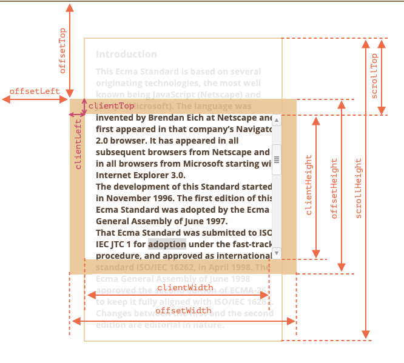

# 「造轮子」backtop

\# 1. 需求梳理


\## 1.1 主要结构


直观上分析，组件主要包括两部分：


\- 日期面板

​    \- 日期显示面板

​    \- 跳转到`今天`按钮

\- 顶部操作栏


\## 1.2 交互分析


交互上分析，大致包括：


\- 日期面板操作

​    \- 单日选择

​    \- 区域选择

​        \- 开始日期(select start)

​        \- 区间日期(start + hover)

​        \- 结束日期(select end)

​    \- 跳转到`今天`

\- 顶栏操作

​    \- 显示当前日期

​    \- 年/月翻页功能


\## 1.3 事件响应


消息传递（事件接口）上分析，应该具备以下几种能力：


\- 日期面板

​    \- `onSelected` 单板日期值被选中

​    \- `onSelectStart` 区域日期开始选择

​    \- `onSelecting` 区域中间值发生变化

​    \- `onSelectEnd` 区域日期值选择结束

​    \- `onToday` 跳转当天

​    \- `onChange` 日期值输出变化

​    \- `onReset` 需要重置状态

\- 顶部操作

​    \- `onNextYear` 跳到下一年

​    \- `onNextMonth` 跳到下一月

​    \- `onPreviousYear` 跳上一年

​    \- `onPreviousMonth` 跳上一月


\## 1.4 状态管理


\- 日期面板

​    \- 当月/非当月日期的显示和响应

​    \- 限制区域外日期的显示和响应

\- 顶部操作

​    \- 区域双板翻页的互作用

​    \- 区域限制的显示和响应


\## 1.5 样式实现


\- 使用`flex`布局

实现思路

## 前言

最近面试被问到了 backtop 的具体实现，你听说过 backtop 吗？有听说过，是不是那种像阅读一些文章、图片网站，一键点击文档回到顶部位置的效果呀？不知道你有没有实现思路？如何做到一键回到顶部，怎么实现丝滑般的滚动？接下来，多哥带你一步步实现这个需求。

**文章大纲**

- 需求分析
- 基本实现：回到顶部
- 进阶一：给滚动添加缓动效果
- 进阶二：优化滚动性能

## 需求分析

如果你不知道 backtop 是什么意思，可以看下以下的动图，注意鼠标也页面文档的交互过程：


通过仔细观察前面的动图，可以发现开始滚动页面时，页面文档滚出视窗外部一段距离时，会显示 backtop ⬆️按钮。滚动到底部后，鼠标点击 backTop，页面文档回到最初始的位置。

何时使用：

- 当页面内容区域比较长时；
- 当用户需要频繁返回顶部查看相关内容时。

基本的需求就是点击按钮文档回到顶部，可以挖掘更多的需求如下：

**进阶：**

- 在实现了回到顶部后，要求实现平滑的回到顶部。

- 对滚动事件进行性能上的优化处理。

- 考虑浏览器 api 兼容性问题，比如 scrollTop 与 pageYOffset 的选择。

- 功能的灵活性，提供 options 选项供用户定制回到顶部的时间、监听的目标元素、backTop 出现时的滚动高度、点击回调函数等。

- 移动端适配，比如移动端是通过手指触摸滑动，所使用的滚动事件、交互跟 PC 端也是不同的。

接下来，我们首先实现回到顶部，解决核心需求，再考虑优化。正所谓小步快跑，步子要小，步频要快，来自 jjc 大佬的名言。

## 基本实现：回到顶部

### **需求描述**

实现点击按钮回到顶部，这里可以拆分为两个需求：

- 滚动页面，页面文档滚动一段距离后，才显示按钮⬆️。
- 点击按钮⬆️，返回页面顶部。

### **思路分析**

针对需求一：

- 可以监听 window 的滚动事件，实时获取当前文档的滚动状态，比如可以通过判断当前文档的 （`scrollTop`/`pageYOffset`） 的值触发按钮⬆️的显示或隐藏。

针对需求二：

- 在点击 BackTop 按钮的时候，可以通过调用 `scrollTo` 或者更改 `scrollTop` 回到页面顶部。

### 代码实现

首先编写 Backtop 按钮的 html 结构 ，它可以是一个纯 div 容器。

```html
<div class="backTop" id="backTop"></div>
```

然后编写 CSS 样式，让按钮一直位于整个 body 的右下角，可以通过 `position` 定位实现，这里可以采用 `absolute` 或者 `fixed` 属性：

- `absolute`：绝对定位，对象脱离常规流，偏移属性参照的是离自身最近的非 static 定位祖先元素，如果没有定位的祖先元素，则一直回溯到 body 元素。
- `fixed`：固定定位，对象脱离常规流，相对于 `viewport` 初始包含块定位。
  - 如果它的父容器设置了 `transform` 、`perspective`、`filter` 等属性值为非默认值的情况下，则相对于父容器。
  - 当出现滚动条时，对象不会随着滚动

因为 `absolute` 会受到非 `static` （比如 relative）定位祖先元素的影响，要想正确定位得给 body 设置 `position: relative;`，而且出现滚动条时，对象会随着滚动不满足需求。所以这里采用 `fixed`，并添加足够大的 `z-index` 避免遮盖。

```css
#backTop {
   position: fixed;
   right: 2rem;
   bottom: 2rem;
   z-index: 1000;
}
```

现在来看看 JS 逻辑的处理，为了提升复用率，我们可以把对 backTop 按钮的处理抽象为一个类组件。

在外部直接根据传入的 backTop 按钮元素，直接实例化 BackTop。

```js
const topElement = document.getElementById("backTop");
const backTop = new BackTop(topElement);
```

整体的 backTop 结构如下：

```js
function BackTop(el) {
  this.el = el; 
  this.init(); // 组件初始化逻辑
  return this;
}

BackTop.prototype.init = function () {
  this.bind();
  return this;
};

// 给事件绑定相关处理器
BackTop.prototype.bind = function () {
};

// 给事件解除绑定相关处理器
BackTop.prototype.unbind = function () {
};

// 可以在卸载时添加一些清理逻辑
BackTop.prototype.destroy = function () {
  this.unbind();
  return this;
};
```

接下来，首先监听滚动事件，获取当前文档的滚动状态，可以通过判断当前文档的 `scrollTop/pageYOffset` 是否大于 0，大于 0 则显示出按钮，否则隐藏。



对于文档滚动，在大多数浏览器中，我们可以使用 `document.documentElement.scrollLeft/scrollTop` ，但在较旧的基于 WebKit 的浏览器中则不行，例如在 Safari（bug [5991](https://bugs.webkit.org/show_bug.cgi?id=5991)）中，我们应该使用 `document.body` 而不是 `document.documentElement`。

幸运的是，我们根本不必记住这些特性，因为滚动在 `window.pageXOffset/pageYOffset` 中可用。

```js
alert('Current scroll from the top: ' + window.pageYOffset);
alert('Current scroll from the left: ' + window.pageXOffset);
```

因此，这里就使用 pageXOffset，进行监听处理：

```js
BackTop.prototype.bind = function () {
  // 监听当前文档的滚动状态
  window.addEventListener('scroll', this.onScroll.bind(this), false);
  // 初始化 backTop scroll 状态
  this.onScroll();
  // 给当前元素绑定点击事件
  this.el.addEventListener('click', this.onClick.bind(this), false);
  return this;
};

BackTop.prototype.onScroll = function () {
  this.toggleElement();
};

BackTop.prototype.toggleElement = function () {
  // 显示/隐藏 backTop 元素
  if (window.pageYOffset < 50) {
    // addClass
    this.el.classList.add('hidden');
  } else {
    // removeClass
    this.el.classList.remove('hidden');
  }
};
```

css 样式如下，通过 visibility 实现隐藏，**只会引起重绘但不会重排 ，隐藏时元素不会触发绑定的事件**

```css
#backTop.hidden {
  visibility: hidden;
}
```

跟 `opacity` 属性一样，被隐藏的元素依然会对我们的网页布局起作用。与 `opacity` 不同的是它不会响应任何用户交互。

注意：如果一个元素的 `visibility` 被设置为 `hidden`，同时想要显示它的某个子孙元素 A，只要将这个 A 的 `visibility` 显式设为 `visible` 即可。

## 给滚动添加平滑滚动功能

### 需求描述

保证每一帧都滑动一段距离，浏览器每刷新一帧就移动一次距离，而不是一下子就跳到顶部。

### 思路分析

 从 HTML/CSS 的角度来看，动画是 style 属性的逐渐变化。例如，将 `style.left` 从 `0px` 变化到 `100px` 可以移动元素。

如果我们用 `setInterval` 每秒做 50 次小变化，看起来会更流畅。电影也是这样的原理：每秒 24 帧或更多帧足以使其看起来流畅。

```js
let delay = 1000 / 50; // 每秒 50 帧
let timer = setInterval(function() {
  if (animation complete) clearInterval(timer);
  else increase style.left
}, delay)
```

回到 backtop 的功能：

1. 点击按钮的那一刻，比如规定 1s 后滑动到目标位置。可以使用定时器每隔一段时间，滑动一段距离。
2. 为了保证刷新频率跟浏览器刷新频率一致，假设每秒 60 帧，每秒做 60 次小变化。计算出一帧要调用多少时间，这样就可以每一帧的时间执行一次回调，可以选择` setInterval` 或 `requestAnimationFrame`。

#### 选择 requestAnimationFrame 而不是 setInterval/setTimeout

- setTimeout、setInterval 是定时器，定时执行回调函数。

- requestAnimationFrame 是 HTML5 新增的api，类似于 setTimeout 定时器，按帧对网页进行重绘。这个方法是用来在页面重绘之前，通知浏览器调用一个指定的函数。这个方法接受一个函数为参，该函数会在重绘前调用。

  ```js
  let requestId = requestAnimationFrame(callback);
  // 取消回调
  cancelAnimationFrame(requestId)
  ```

**JS 实现动画的方式：针对动画实现来说，web 中动画是通过不断刷新页面每一帧（快照），比如以 60 fps 移动一个元素。**

- 定时器实现：
  - `setTimeout` 是以 n毫秒后执行回调函数，回调函数中可以递归调用 setTimeout 来实现动画。
  - `setInterval` 以 n 毫秒的间隔时间调用回调函数。
  - 借助 `setTimeout/ setInterval` 来编写 JS 动画，而动画的关键在于动画帧之间的时间间隔设置，这个时间间隔的设置有讲究，一方面要足够小，这样动画帧之间才有连贯性，动画效果才显得平滑流畅；另一方面要足够大，确保浏览器有足够的时间及时完成渲染。
  - 举个例，现代浏览器额定帧率为 每秒 60 帧，动画才能足够流畅，1 秒 = 1000 毫秒，1000 / 60 = 16.7 ms。（CPU）
    - 假如开一个 16.7ms 的 setTimeout，如果浏览器主线程做其他东西忙碌时，那么定时器回调任务就一直没有被执行，在 60 ms内只能绘制两次。
    - 那么就会造成丢帧的现象，继而导致动画断续显示。
  
- requestAnimationFrame
  - 通过递归调用实现动画，由系统来决定回调函数的执行时机。

**区别**

- setTimeout 实现动画的缺点：
  - setTimeout **只能设置固定的时间间隔，这个时间和屏幕刷新间隔可能不同**
  - 使用 setTimeout 实现的动画，当页面被隐藏或最小化时，定时器 setTimeout 仍在后台执行动画任务，此时刷新动画是完全没有意义的（chrome 已针对 <1000 ms 的优化）
- requestAnimationFrame 的优势：
  - **使用 `requestAnimationFrame` 的话，就不用手动计算每一帧时间。**
  - 能保证回调函数在屏幕每一次刷新间隔中只被执行一次，会把每一帧中的所有 DOM 操作集中起来，在一次重绘或回流中就完成，并且重绘或回流的时间间隔紧紧跟随浏览器的刷新频率。
  - 使用 requestAnimationFrame，当页面处于未激活的状态下，该页面的屏幕刷新任务会被系统暂停。
  - **当然，如果浏览器主线程做其他东西忙碌时，ui 线程还是被阻塞了，同样执行不了刷新，从而 requestAnimation 也会受影响。**

### 代码实现

随着时间的消逝，比如达到 1s 时间后，为保证最终滑动的总距离等于当前滚动的目标距离，需要动态计算还有多少时间（timeFraction 时间碎片从 0 到 1），根据时间进度 progress 动态调整每次的滑动速度也就是幅度大小 draw (progress)，这样就保证在 1s 后滑动到目标位置，可以抽离一个结构化动画函数

```js
/**
 * timing 时间变化函数，比如可以让时间直线、曲线变化，从而实现不同的动画效果
 * draw 绘制函数
 * duration 持续时间
 */
BackTop.prototype.animate = function ({ timing, draw, duration }) {
  let start = performance.now(); // 获得当前时间毫秒数
  requestAnimationFrame(function animate(time) {
    // timeFraction 从 0 增加到 1
    let timeFraction = (time - start) / duration;
    if (timeFraction > 1) timeFraction = 1;

    // 计算当前动画状态
    let progress = timing(timeFraction); // 时间变化函数

    draw(progress); // 可以根据时间进度 progress 动态调整每次的滑动速度也就是幅度大小

    if (timeFraction < 1) {
      requsetAnimationFrame(animate); 
    }
  });
};
```

使用 animate 函数如下：

```js
BackTop.prototype.onClick = function () {
  const { duration } = this.options;
  const s = window.pageYOffset; // 获取距离目标位置的大小
  this.animate({
    duration,
    timing(timeFraction) {
      return timeFraction;
    },
    draw(progress) {
      window.scrollTo(0, s - progress * s);
    },
  });
};
```

现在给 BackTop 按钮绑定点击事件处理程序：

```js
BackTop.prototype.bind = function () {
    // ....
    // 给当前元素绑定点击事件
    this.el.addEventListener('click', this.onClick.bind(this), false);
    //...
  };
```

## 对频繁滚动进行性能优化处理

### 需求描述

滚动的频繁触发处理器程序，导致性能的损失，需要进行处理。

scroll 事件本身会触发页面的重新渲染，同时 scroll 事件的 **handler** 又会被高频度的触发，因此事件的 handler 内部不应该有复杂操作，例如 DOM 操作就不应该放在事件处理中。

### 思路分析

针对此类高频度触发事件问题（例如页面 scroll ，屏幕 resize，监听用户输入等），下面介绍两种常用的解决方法，防抖和节流

1. 防抖是事件触发多次，控制回调在最后一次事件触发结束后的规定时间执行 1 次。

   譬如图片的懒加载，我希望在下滑过程中图片不断的被加载出来，而不是只有当我停止下滑时候，图片才被加载出来。又或者下滑时候的数据的 ajax 请求加载也是同理。

2. 节流是事件触发多次，控制回调在规定时间分片执行。

   比如我们希望即使页面在不断被滚动，但是滚动 handler 也可以以一定的频率被触发（譬如 250ms 触发一次）。

### 代码实现

基于 `requestAnimationFrame` 也可以实现节流功能，定时的时间与浏览器的刷新率一致。【TODO】看看 lodash 的节流处理，requestAnimationFrame 作为节流是否可靠。再稿。

```js
// 基于 requestAnimationFrame 的节流
throttleByAnimationFrame(func) {
  let isThrotted = false
  let requestId = null
  let savedArgs = null
  let savedThis = null
  const throttled = function (...args) {
    if (isThrotted) {
      // 锁住直接返回
      savedArgs = args // 并记录被冷却的参数
      savedThis = this
      return
    }

    func.apply(this, args) // 1. 执行 func，满足首次的执行
     // 2. 启动一个分片
    requestId = requestAnimationFrame(() => {
      isThrotted = false; // 2.1 够钟解锁
      if (savedArgs) {  // 有被冷却的参数，才执行
        throttled.apply(savedThis, savedArgs) // 2.2 继续调用 throttled 包装器
        savedThis = savedArgs = null
        requestId = null
      }
    })

    throttled.cancal = () => cancelAnimationFrame(requestId)
    isThrottle = true // 3. 启动分片定时器后，在这里进行锁住
  }

  return throttled
}
```

通过使用`performance.now()` 前后测试效果对比，添加节流 cpu 有明显的提升。

## 小结

整个实现过程中，还是涉及到不少知识点的，比如 `requestAnimationFrame` 与 `setTimeout`，这块我还没有吃透，有说不对的地方请指出，非常感谢。

> 源码 [backtop](https://github.com/naluduo233/build-my-own-x) 

## 参考资料

- [讶羽大佬造轮子]( https://github.com/mqyqingfeng/Wheels) 
- [ant design](https://ant.design/components/back-top-c)
- [前端性能高性能滚动 scroll 及页面渲染优化](https://juejin.cn/entry/6844903493677875214)
- [设计高性能无限滚动加载，了解高效页面秘密](https://zhuanlan.zhihu.com/p/25767226)

