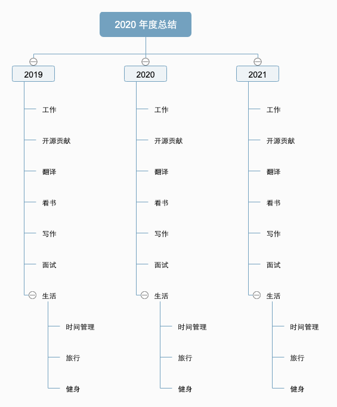
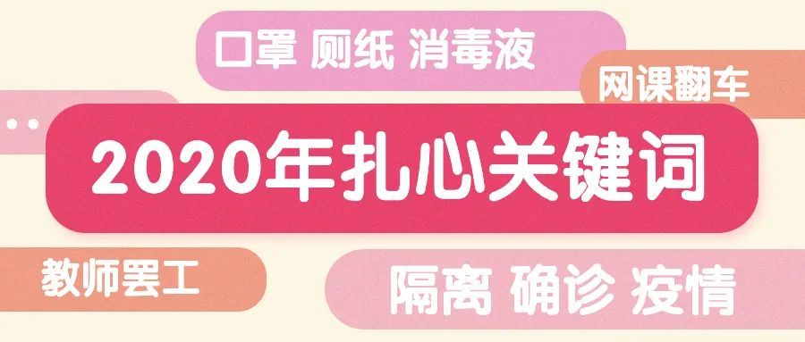
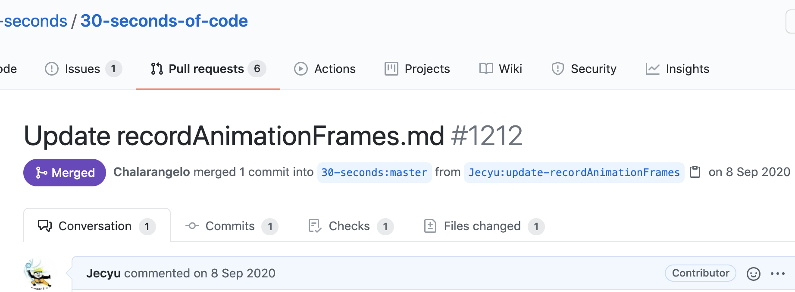
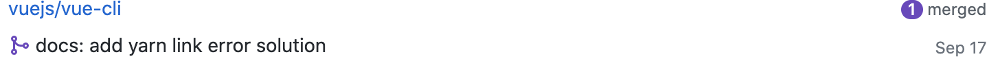
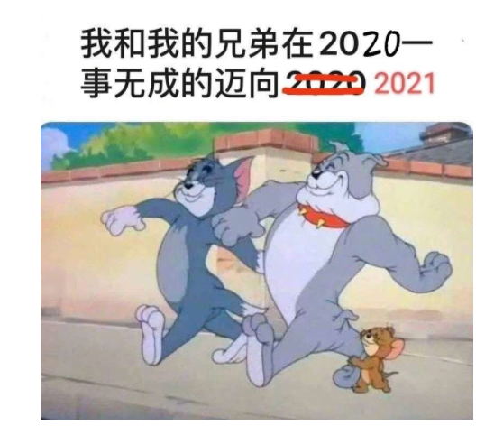
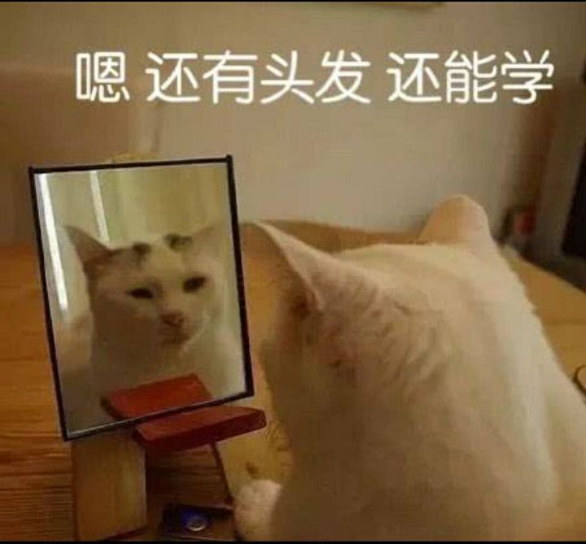

# 纳撸多的 2020 年度复盘，默默耕耘 | 掘金年度征文

文章大纲：

- 回顾 2019 年的计划（立flag）
- 总结下 2020 年干了哪些事情（完成度）
- 展望2021 年（新flag）

## 前言

现在已经是 2021 年了，如果有人跟你说起 2020 年，你会想起哪些内容呢？美国与伊拉克战争一触即发、英国正式脱欧、前所未有的新冠疫情，还有东非蝗灾、东京奥运会延期、中国高考延期，近期的蚂蚁金服暂缓上市、嫦娥五号发射成功等等。

如果让你用一个词儿来总结 2020 年，你会用什么？

作为一个有着 2 年半的职业普通打工人，对纳撸多而言，2020 年算是默默耕耘。

文章大纲：

- 相比 2019 年，2020 年的变化
  - 职场工作
  - 开源贡献
  - 个人写作
  - 生活
- 2021 的 flag

## 相比 2019 年，2020 年的变化

相信很多人都有一种感觉，2020 年过得太快了，主要是因为疫情持续存在。像大多数人那样，纳撸多的 2019 年终也立了不少 flag，包括以下：

- 进一步学习好公司项目依赖的 gis 技术
- 深入学习 vue 源码，编写自己的 UI 组件库
- 主动学习好业务知识
- 多做 review、技术分享、能够给新人一些帮助
- 深入学习 JS，从一些优秀的 JS 库中 axios、lodash、jq 等
- 学习设计模式、面向对象继承、多态、函数
- 加强前端架构知识学习，前端工程化，项目底层搭建
- 加强后端知识的学习，比如 Node、Java
- 提升自己的英语阅读水平能力
- 提升 review 开源项目源码的能力
- 提升自己的表达能力
- 英语翻译
- ...

接下来，纳撸多将一一进行 review 回顾检讨。
### 职场工作

#### 角色转变：先前端负责人，后技术负责人

4 月份开始正式复工，纳撸多主要负责了一个新 bs 资料管理系统项目的前端开发，由于这是新开的项目，工期方面不算紧张，在与老大讨论后，最终采用了 2020 年较火的 TypeScript 进行开发。当然，前端框架上还是使用 vue（2.6 版本）。从初期基础项目的搭建，到完整的项目开发，算是从零参与开发。其中也遇到一些问题，比如初期的由于第一次实战使用 TS + Vue，需要做不少处理，比如要处理一些库的命名空间问题等，而其他方面包括 reviwe 代码、提交代码规范等。在这里感谢纳撸多的 rjw 师傅，曾带着纳撸多一起做项目，让纳撸多成长到有足够的能力独立支持这个项目的开发。

大约在年中 7 月份，感谢领导的赏识，赋予纳撸多新的角色，全程负责另外一个新的二三维 gis 项目，这次是作为技术负责人，对整个项目的前后端负责。第一次从小队员的角色转到小队长，瞬间感觉到肩上的责任大很多，其中也遇到很多挑战和困难，无论是工作上的技术问题，还是人员之间的协作等，好在自己的努力和公司同事的不吝指教，得以让项目顺利完成一期目标。

这两个项目，让纳撸多收获许多，技术方面包括前端工程化方面、gis 项目技术算是掌握得七七八八，vue 方面有了进一步深入，包括编写自己的指令、插件、也写了一些 UI 组件，协作开发方面上也由以前前端方面到从整体项目上考虑，着重于业务知识的理解同时去考虑多个方案的实现。

#### 技术分享：性能优化系列

2020 年初，部门组织了选择要研究的技术主题。定期的技术分享，既可以活跃了公司内部的技术氛围，提升多数人的视野，对于个人而言也进行了技术沉淀和团队输出。其中纳撸多提出的是《Web 性能优化》主题方面的研究，github 地址为 https://jecyu.github.io/Web-Performance-Optimization/

web 性能优化是挺大的东西，今年主要是做了网络篇、缓存篇、工具篇等方面的研究分享和部分落地，还有很多可以研究以及落地实践的地方。

一些感悟：分享的东西能够结合项目来说，提前进行实践，才更具说服力。技术分享除了可以对团队输出外，对个人而言，也是提高表达能力的好机会，也感谢这个极客这个课程 [如何做好一场技术演讲
](https://time.geekbang.org/column/intro/61)。

#### 初为人师：新的考验

俗话说：师父带入行，发育靠自己。这个刚开始带 L 学习 gis 写 demo，科普了最基本的 gis 概念，一些行业知识涉及到前端技术应用。虽然 L 对 gis 不懂，但是不害羞，对于自己未知的领域，会主动去咨询相关的人。后来就师徒一起做项目了，期间也遇到一些纳撸多也不懂的问题，相互探讨。（最开始还想着如果遇到不懂的问题，会不会很尴尬😅。）

在带领他期间，也尽可能自己的经验传递给他（比如项目及时复盘、面对新需求考虑多种方案，请教老人、项目主动把控推进等等），也从他身上学到不少东西，比如好习惯，编码前多画画。

#### 第一次当面试官：角色调换

以前都是站着面试者的角度，去想着如何去准备面试。今年第一次当了初面的面试官，才知道面试官也不是好当，需要准备不少东西，根据公司的招聘需求，需要准备针对应届生的面试题以及针对老油条的，考察点也不一样。

今年总共面试了两次，谈不上有多少经验，但现在也清楚一些面试流程和套路，站在面试官的角度去面试别人，也得到不少锻炼，比如考察一个人，不仅仅考察他当前的技术，也看重他的潜力、好学能力，是否勤奋。其中发现一些自己知识面补足和短板的地方，还需要勤加补漏。

无论作为面试者，还是考察官，极客时间的《白海飞老师的面试现场》，真的很棒。还有很多需要反复听和消化实践。

### 开源贡献：被 merged request 的感觉真好

工作之外，纳撸多平时也逛逛 github，读读别人造的轮子，看看大佬关注的仓库。毕竟造论是不可能造轮子的了。

> 项目来不及了，肯定要做啊！不做项目要延期，延期就没有钱用。 造轮子是不可能造轮子的， 这辈子不可能造轮子的， 做组件又不会做 ，就是搜第三方库这种东西 ，才能维持的了生活这样子 ，我进github感觉像回家一样， 我一年回去 。。大年三十晚上都不回去， 就平时家里出点事， 就回去看看这样子， 在github里的感觉嘛，在github里面比家里感觉好多了！ 在家里一个人好无聊，没有友仔玩，也没有友女玩，进到github里面个个都是基佬，说话又好听，呜哇哦，超喜欢在里面的。——以上文字摘自网友

不过要造个好轮子是真的难，造个轮子需要你：
1. 熟悉需要解决的问题
2. 理解现有轮子的利弊
3. 有能力做更好的轮子

一直想做点开源贡献，但是自己目前也还没能力造不出好的轮子。但又想做点贡献，体会下跟活跃在 github 上的全球网友协作。

最开始想着为平时工作使用到的轮子做点贡献，比如 Vue、Iview、Element 等 UI 组件，对于贡献小白来说发觉还是有点难。寻寻觅觅，找到了这个库 https://github.com/firstcontributions/first-contributions，就是教你怎么给开源项目贡献的库，墙烈推荐，也是我的第一次被 merged request。

后来，也做了点微薄贡献。

给 30-seconds-of-code 修复个 bug：

给 vuecli 添加点文档补充：

新的一年里，继续努力💪
### 外文翻译：四级英语的我

为什么要学着翻译外文呢？不知道你有没有听过大佬这样说，你看这些翻译的文档，都是二手货。你懂得英语，就是掌握一手最新资料。对于纳撸多来说，工作中真是需要用到，比如 Arcgis API for JS 就是纯英文，没有翻译。

很多时候只能硬着头皮去看，虽然借助下《沙拉查词扩展》也挺香。但是还是想通过一些途径比如翻译文章去提升英语的阅读能力，因为参与 github 开源贡献、看一些文章比如 Medium 多少有点英语能耐阅读得更好，更不用 youtube 各种大神的视频都是英语的了，虽然 b 站也有很多搬运工帮忙翻译。

于是就边翻译边补英语，也看了些书籍比如《实用翻译教程》，学着掘金照猫画虎学翻译，有译者，有校对。[【译】程序员日常：你知道什么是 OAuth 吗？](https://juejin.cn/post/6870368895300173831)

最初想翻译这篇文章主要是项目上要实现单点登陆功能，而自己对 auth 2.0 这个很模糊。当时就找到了 Medium 这篇通俗易懂的文章。后面发现身边小伙伴也不太理解 auth 的机制，就想着翻译了。

总共翻译了两三篇文章，只放了该篇到掘金。翻译一篇文章虽然比自己作一篇容易点，但是要翻译好真的很费时，除了彻底理解原文的意思，必要时进行实践，还要字句思量，让译文更通顺。明年再接再励！
### 作文章：从 0 级到 L2 级

2017 年入驻的掘金，直到 2020 年掘金才从 0 级到 Lv1 升级到 Lv2，获赞 60，也有一点点粉丝 25（感谢关注🙏）。

不过与 2019 年比较，还是有挺大提升的。（感谢掘金的运营大佬）

很多时候想法很多，下笔也却觉得很难。最难的还是觉得把握好文章篇幅以及讲明白一个东西，需要费不少功夫。缺乏实践的拼凑类文章很难引起共鸣，一些有过深刻体会实践的文章往往能获得读者的点赞（不瞒你说，每天打开掘金看到这个  标红总让我高兴😊）。

2020 年末也参加掘金的写作训练营直播课，学习了不少写作大佬的经验，希望 2021 年输出更多好文章（有阅读有点赞）。
### 谈谈生活

**健身锻炼**

看过太多程序员加班过劳不幸去世的新闻，无论做什么工作，身体好，才能顶硬上。除了周末外，现在几乎每天早上都会起来做几十个苦卧撑。前段时间还买了健身架，时不时搞下过引体向上也不错，不过最近出差过多，导致它都长上灰了。

**篮球：几乎一周一约**

到底有多喜欢篮球呢，相信热爱篮球的小伙伴，可以在走路时突然来一个投篮动作，站着时来个无球插花。

几乎每个周末都要和小伙伴约上打一次篮球。一来是对篮球的热爱，二来感觉整天在室内办公，特别是对程序员来说，一整天都坐着，眼睛盯着电脑💻。周末出去放松打两场篮球，出点汗，真的舒服，大脑也能放空许多。

**旅行**

因为公司有个项目在广西，去那里待了挺长的一段时间。到处可见的南宁老友粉、螺蛳粉，南宁老友粉还是舒记的好吃。还抽空去了桂林两天，游了漓江，看了 20 元人民币山峰～

**摄影**

今年懒散了，好久没拿起微单相机了。因为疫情和工作上的问题，导致这个兴趣没坚持了。想起以前周末拿着相机，带上耳机，听上轻音乐，到处走走，见到触动的景象就拍，也是很放松的事情。明年重拾这个爱好～
## 2021 心想事成，运气超棒

2020 年的回顾洋洋晒晒写了不少，2019 年的 flag 完成五五六六。还有很多没怎么提升的地方，比如造轮子，做 UI 组件库。无论如何，2020 年已过去，剩下的交给 2021 年的自己吧。

又到惯例的 flag 时刻了，目标还是要有的，万一实现了呢。

技术方面
- 性能优化持续推进
- 可视化 WebGL 技术，主要是
  - 可视化 UI 编辑器
  - 可视化大屏
  - 场景模拟、基于游戏引擎的三维 GIS 系统
- 架构方面的研究
  - 领域驱动设计
  - 前端设计模式
  - 渲染框架：Vue2/3、Vue 生态（vite、router）等架构
  - 地图库：Arcgis for js api、Openlayer
- 微前端
- 拆造轮子系列（函数库、动画库、UI 组件库）
- ...

写作方面

- 掘金获得 300 个赞，上升到 Lv3（💪），目前 60 个赞（有11 个赞是自己赞的，自己的文章自己得先认可嘛），要想到获得点赞，首先要获得流量，更多的流量可以带来点赞和关注。要掌握提升流量的写作知识框架。

开源贡献
- 被 merge requested 数 10+（不是 typo 那种）

外文技术翻译

- 10 篇+，努力获得掘金翻译资格
- 尝试给一些 GitHub 官方文档翻译/校对

旅行

- 去看一场雪（希望 2021 疫情更好转）

看书

很多书都是看了一部分，今年继续：

- 《重构改善现有的代码》
- 《秋叶训练营系列书》，看了写作方面的，刷新自己认知面。
- 买了好几本掘金小册子，都还没看完
  - 《深入牵出 TypeScript：从基础知识到类型编程》
  - 《前端算法与数据结构面试：底层逻辑解读与大厂真题修炼》修言大佬
  - 《JavaScript 设计模式核⼼原理与应⽤实践》
  - 《剖析 Vue.js 内部运行机制》染陌大佬，看了第一章，精简易懂。
  - 《WebGL 入门与实践》
- ...
- 看些非技术书，比如一些小说。

最后送给自己的，flag 不在于多，坚持下去最重要！加油！
## 小结

感谢各位看官，祝大家 2021 年牛气冲天。优秀的人很多，向各位大佬看齐。

[掘金年度征文 | 2020 与我的技术之路 征文活动正在进行中......](https://juejin.cn/post/6901125532729999374)