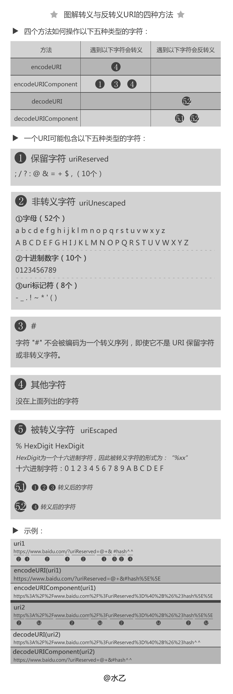

# 2020

<!-- ## Calc 坑 -->

<!-- 横向和纵向排版统一使用 flex 布局。 -->

## 十一月

### 不通过 webpack 压缩前端文件

webpack 需要有一个入口文件，比如 main.js，通过 require/import 层层引入依赖进行文件压缩处理。

只需要对 arcgis api for js 文件进行重新压缩处理。

可以使用 gulp 来处理这个事情，gulp 是一个基于流的自动化构建工具。除了可以管理和执行任务，还支持监听文件、读写文件。 http://52.82.69.134:18080/dgp_js_api412

- 通过 gulp.task 注册一个任务
- 通过 gulp.run 执行任务；
- 通过 gulp.watch 监听文件的变化
- 通过 gulp.src 读取文件
- 通过 gulp.dest 写文件。

#### 前言

#### 解决方案

## 十月

### vuecli3 Webpack 编译提示内存溢出解决方案

Node 是基于 V8 引擎，在一般的后端开发语言中，在基本的内存使用上没有什么限制，但是，在 Node 中通过 JavaScript 使用内存时只能使用部分内存（64 位系统下约为 `1.4 GB`，32 位系统下约为 0.7 GB）所以不管你电脑实际内存多大，在 node 运行 JavaScript 打包编译的时候所使用的内存大小，并不会因为你系统的实际内存大小改变而改变

```json
{
  "name": "nature-resource-cli3",
  "version": "3.2.28",
  "private": true,
  "scripts": {
    "serve": "vue-cli-service serve",
    "build": "vue-cli-service build",
    "permission": "node --max_old_space_size=4096 node_modules/@vue/cli-service/bin/vue-cli-service.js serve --mode permission "
  }
}
```

开启之后，运行 yarn permission，node 进程运行到 1.74GB 也不会崩掉。


```sh
node --max-nex-space-size=1024 app.js # 新生代，位为KB
node --max-old-space-size=2000 app.js # 老生代，单位为MB
```

参考资料：

- [NodeJS 中被忽略的内存](https://segmentfault.com/a/1190000004934938)
  <!-- Webpack编译提示内存溢出解决方案 https://my.oschina.net/u/4359745/blog/3424593-->

### 置灰功能

```css
.gray-map {
  -webkit-filter: grayscale(100%);
  -moz-filter: grayscale(100%);
  -ms-filter: grayscale(100%);
  -o-filter: grayscale(100%);
  filter: grayscale(100%);
  filter: gray;
}
```

### 前端地图添加水印

业务需求：根据用户名和 IP 动态生成水印。

不能用静态图片，既然是动态的，那么水印就是动态生成。

可以使用 canvas 动态绘制，然后生成背景图片，加入到地图 DOM 容器中。

```js
/**
 * 给网页添加水印
 */
export const createWaterMark = ({
  container = document.body,
  width = "200px",
  height = "150px",
  textAlign = "center",
  textBaseline = "middle",
  font = "10px microsoft yahei",
  fillStyle = "rgba(184, 184, 184, 0.8)",
  content = "请勿外传",
  rotate = "30",
  zIndex = 1000,
}) => {
  // const args = arguments[0];
  const canvas = document.createElement("canvas");

  canvas.setAttribute("width", width);
  canvas.setAttribute("height", height);
  const ctx = canvas.getContext("2d");

  ctx.textAlign = textAlign;
  ctx.textBaseline = textBaseline;
  ctx.font = font;
  ctx.fillStyle = fillStyle;
  ctx.rotate((Math.PI / 180) * rotate);
  ctx.fillText(content, parseFloat(width) / 2, parseFloat(height) / 2);

  const base64Url = canvas.toDataURL();
  const watermarkDiv = document.createElement("div");
  watermarkDiv.setAttribute(
    "style",
    `
        position:absolute;
        top:0;
        left:0;
        width:100%;
        height:100%;
        z-index:${zIndex};
        pointer-events:none;
        background-repeat:repeat;
        background-image:url('${base64Url}')`
  );

  container.style.position = "relative";
  container.insertBefore(watermarkDiv, container.firstChild);
};
```

<!-- 不通过地图的话，暂时不能根据比例尺进行水印的缩放。

地图切片添加水印，后端出图。可以为每个切片等级显示不同的水印大小。

是否可以设置等级。

方式二：自动创建 canvas 遮罩，不能进行同步移动。且容易被删除 dom。针对拍照。或者屏幕截图

直接把 背景 div 绘制到地图上去。

需要做 mutationServer 监听处理。

export const createWaterMark2 = ({
  container = document.body,
  width = "200px",
  height = "150px",
  textAlign = "center",
  textBaseline = "middle",
  font = "14px microsoft yahei",
  fillStyle = "rgba(184, 184, 184, 0.8)",
  content = "请勿外传",
  rotate = "30",
  zIndex = 1000
}) => {
  // const args = arguments[0];
  const canvas = document.createElement("canvas");

  canvas.setAttribute("width", width);
  canvas.setAttribute("height", height);
  const ctx = canvas.getContext("2d");

  ctx.textAlign = textAlign;
  ctx.textBaseline = textBaseline;
  ctx.font = font;
  ctx.fillStyle = fillStyle;
  ctx.rotate((Math.PI / 180) * rotate);
  ctx.fillText(content, parseFloat(width) / 2, parseFloat(height) / 2);

  const base64Url = canvas.toDataURL();
  const watermarkDiv = document.createElement("div");
  watermarkDiv.setAttribute(
    "style",
    `
        position:absolute;
        top:0;
        left:0;
        width:100%;
        height:100%;
        z-index:${zIndex};
        pointer-events:none;
        background-repeat:repeat;
        background-image:url('${base64Url}')`
  );

  container.style.position = "relative";
  container.insertBefore(watermarkDiv, container.firstChild);
  return watermarkDiv;
};

  // 方案二 后续处理直接绘制地图 canvas 对象上
          //   const waterMarkNode = createWaterMark2({
          //     content: username,
          //     container: document.querySelector(".eyemap-map")
          //   });
          //   const waterMarkNodeCanvas = await html2canvas(waterMarkNode, {
          //     backgroundColor: null,
          //   });
          //   const url = waterMarkNodeCanvas.toDataURL();
          //   var img = new Image();
          //   const canvas = documen.querySelector(".esri-view-root canvas")
          //   const ctx = canvas.getContext("2d");
          //   img.onload = function() {
          //     ctx.drawImage(img, 0, 0); // 获取地图 canvas
          //   };
          //   img.src = url; -->
<!--
不要陷入地图思维，跳出来。
  // 矩阵水印，以屏幕为网格切割。
      let textGra = new Graphic();
      const screenPoint = {x: window.innerWidth/2, y: window.innerHeight/2};
      const point = mapView.toMap(screenPoint);
      textGra.geometry = point;
      let textSymbol = {
        type: "text",
        color: "red",
        text: "全国规划总量",
        xoffset: 0,
        yoffset: 0,
        font: {
          size: 32,
          family: "Microsoft YaHei"
        }
      };

      // 方式二获取地图 canvas，然后添加水印到画布上？
      // textGra.symbol = textSymbol;
      // let copyrightGraphicLayer = new GraphicsLayer({
      //     id: "copyrightGraphicLayer"
      // });
      // copyrightGraphicLayer.add(textGra);


      // map.add(copyrightGraphicLayer);
      // map.reorder(copyrightGraphicLayer, 1000)
      // console.log("map ->", map);
      // map.order -->

参考资料：

- [前端水印生成方案(网页水印+图片水印)](https://juejin.im/entry/6844903645155164174#comment)
- [小 tips:使用 canvas 在前端实现图片水印合成](https://www.zhangxinxu.com/wordpress/2017/05/canvas-picture-watermark-synthesis/)
- [手摸手教你用 canvas 实现给图片添加平铺水印](https://juejin.im/post/6844903919378759688)

## 七月

### 计算树节点的孩子数量

```js
const tree = [
  {
    name: "1",
    // hasChildNumbers: 2,
    children: [
      {
        // hasChildNumbers: 0,
        name: "1-1",
      },
      {
        // hasChildNumbers: 0,
        name: "1-2",
      },
    ],
  },
  {
    name: "2",
    // hasChildNumbers: 3 + 1 + 1 + 1, // hasChildNumbers + 本身的节点数
    children: [
      {
        name: "2-1",
        // hasChildNumbers: 3,
        children: [
          {
            // hasChildNumbers: 0,
            name: "2-1-1",
          },
          {
            // hasChildNumbers: 0,
            name: "2-1-2",
          },
          {
            // hasChildNumbers: 0,
            name: "2-1-3",
          },
        ],
      },
      {
        name: "2-2",
        // hasChildNumbers: 1,
        children: [
          {
            // hasChildNumbers: 0,
            name: "2-1-3",
          },
        ],
      },
    ],
  },
];
```

上面的结构对应的树图：

思路分析：

```js
// 计算父节点本身
f(tree) = f(1) + f(2) + f(3) =
  f(1 - 1) + 1 + (f(1 - 2) + 1) + (f(2 - 1) + 1) + (f(2 - 2) + 1) + (f(3) + 1);
// 不计算父节点，只需判断不是叶子节点，把本身的计数去掉
f(tree) = f(1) + f(2) + f(3) = f(1 - 1) +
1 +
(f(1 - 2) + 1) +
(f(2 - 1) + 1) +
(f(2 - 2) + 1) +
(f(3) + 1) = f(1) - 1 + (f(2) - 1) + f(3);
```

实现：

```js
function getChilds(node, isIncludeParent) {
  let hasChilds = 0;
  if (node.children) {
    node.children.forEach((node) => {
      // 1-1 // 1-2
      hasChilds += getChilds(node, isIncludeParent) + 1;
      if (!isIncludeParent && node.children) {
        // 非叶子节点，把本身的计数去掉
        hasChilds--;
      }
    });
    return hasChilds;
  } else {
    // 无孩子
    return hasChilds;
  }
}
// 不计算 hasChilds，计算叶子的数量

// 遍历 + 递归搞掂，遍地的递归，以及 getChilds 的递归
function transerverTree(arr, callback) {
  arr.forEach((item) => {
    callback(item);
    if (item.children) {
      transerverTree(item.children, callback);
    }
  });
  return arr;
}

const result = transerverTree(tree, (item) => {
  item.hasChilds = getChilds(item, true);
});
console.log(result);
```

## 六月

### string.slice(start, end) vs string.substr(start, length) vs string.substring(start, end) vs string.splice

- https://stackoverflow.com/questions/2243824/what-is-the-difference-between-string-slice-and-string-substring
- https://www.tothenew.com/blog/javascript-slice-vs-substring-vs-substr/
- https://masteringjs.io/tutorials/fundamentals/substring
- https://www.freecodecamp.org/news/javascript-substring-examples-slice-substr-and-substring-methods-in-js/

## 五月

### 生成任意数量的树数据

在测试树的渲染性能问题时，大量的测试数据是个问题。

首先：可以采用这个函数，动态生成扁平化的树节点，参考 zTree 源码：

```js
const dataMaker = function(count, nodeKey = "id", parentKey = "pId") {
  let nodes = [],
    min = 10,
    max = 90,
    level = 0,
    curLevel = [],
    prevLevel = [],
    levelCount,
    i = 0,
    j,
    k,
    l,
    m;
  while (i < count) {
    if (level == 0) {
      levelCount = Math.round(Math.random() * max) + min;
      for (j = 0; j < levelCount && i < count; j++, i++) {
        const n = { [nodeKey]: i, [parentKey]: -1, name: "Big-" + i };
        nodes.push(n);
        curLevel.push(n);
      }
    } else {
      for (l = 0, m = prevLevel.length; l < m && i < count; l++) {
        levelCount = Math.round(Math.random() * max) + min;
        for (j = 0; j < levelCount && i < count; j++, i++) {
          const n = {
            [nodeKey]: i,
            [parentKey]: prevLevel[l][nodeKey],
            name: "Big-" + i,
          };
          nodes.push(n);
          curLevel.push(n);
        }
      }
    }
    prevLevel = curLevel;
    curLevel = [];
    level++;
  }
  return nodes;
};
```

然后：根据扁平化的带有父子关系的节点，重新构建一棵树数据：

```js
const BuildTree = (
  tree,
  childrenKey = "children",
  key = "nodeKey",
  parentKey = "parent"
) => {
  const n = []; // 添加多一个数组，记录父级
  const treeMap = {};
  // 删除 所有 children，传入的值带有 children，以防止孩子重复
  tree.forEach((node) => {
    node[childrenKey] && delete node[childrenKey];
  });

  tree.forEach((node) => (treeMap[node[key]] = node));
  tree.forEach((node) => {
    const parent = treeMap[node[parentKey]];
    // 如果找到索引，那么说明此项不在顶级当中,那么需要把此项添加到它对应的父级中
    if (parent) {
      const children = parent[childrenKey] || []; // parent.children ，避免相同值
      children.push(node);
      j;
      parent[childrenKey] = children;
    } else {
      // 如果没有在map中找到对应的索引ID,那么直接把 当前的item添加到 n 结果集中，作为顶级
      n.push(node);
    }
  });
  return n;
};
```

最后：丢给树组件渲染测试即可

```js
const treeData = BuildTree(dataMaker(5000), "children", "id", "pId");
```

### 在同一个机器上安装 chrome 多个版本共存

#### 前言

一个兼容性的问题，flex 布局。

```html
<!DOCTYPE html>
<html lang="en">
  <head>
    <meta charset="UTF-8" />
    <meta name="viewport" content="width=device-width, initial-scale=1.0" />
    <title>chrome 60下，height： 100；无法继承外部flex-grow: 1的容器</title>
    <style>
      .parent {
        display: flex;
        flex-direction: column;
        height: 500px;
        background: gray;
      }
      .child1 {
        width: 100%;
        flex-grow: 1;
        /* display: flex;
      flex-direction: column; 解决方案 */
        background: lightgreen;
      }
      .child11 {
        height: 100%;
        /* webpack 环境中，能否直接用 browserlist 解决兼容问题.browserslistrc */
        /* flex-grow: 1; 解决方案：flex-grow */
        width: 100%;
        background: lightpink;
      }
      .child2 {
        width: 100%;
        height: 50px;
        background: lightblue;
      }
    </style>
  </head>
  <body>
    <div class="parent">
      parent
      <div class="child1">
        child1
        <div class="child11">child11</div>
      </div>
      <div class="child2">child2</div>
    </div>
  </body>
</html>
```

window 版本

mac 版本

```bash
$ "/Applications/Google Chrome 60.app/Contents/MacOS/Google Chrome" --user-data-dir="/Users/linjy/Library/Application Support/Google/Chrome60" > /dev/null 2>&1 &
[2] 2119
[1]   Done
```

#### 如何禁用 Chrome 版本自动更新

#### 参考资料

- [在 macOS 上面安装多个版本的 Chrome](https://blog.leodots.me/post/36-install-multiple-chrome-macos.html)
- [https://www.slimjet.com/chrome/google-chrome-old-version.php](https://www.slimjet.com/chrome/google-chrome-old-version.php)

## 四月

### 分页功能

#### 分页组件

#### 前端做分页

```js
/**
 * 返回分页的数组
 * @param {Number} pageSize 每页条数
 * @param {Number} jumpPage 条码
 * @param {Array} arr 返回分页的数组
 */
export const pagination = (pageSize, jumpPage, arr) => {
  const skipNum = (jumpPage - 1) * pageSize;
  const newArr =
    skipNum + pageSize >= arr.length
      ? arr.slice(skipNum, arr.length)
      : arr.slice(skipNum, skipNum + pageSize);
  return newArr;
};
```

#### 后端做分页

##### 参数传输

```js
pageIndex: 1, // 页码
pageSize: 10, // 每页大小
```

##### 返回数据

```json
{
  "totalElements": 0,
  "data": [{}]
}
```

### 前端中 width、height 的获取

- clientWidth
- offsetWidth
- innerWidth
- scrollWidth
- getBoundingClientRect().width

### 转换文件大小

实现效果：不同值大小，显示不同的文件单位以及对应的数值。

主体思路：

1. 要显示的值存在数组上
   ````js
   const digitList = ["B", "KB", "MB", "GB", "TB"];```
   ````
2. 因为 1GB = 1024MB = 1024 _ 1024 KB = 1024_ 1024 \* 1024 B。
3. 要想知道显示那个值，只需要计算出`幂`即可。
4. 然后具体数值，则是对应的值：目标 size/1024^幂。

方法一：digit 控制显示单位

```js
const formatFileSize = (bytes) => {
  const scale = 1024;
  const digitList = ["B", "KB", "MB", "GB", "TB"];
  let _integer = bytes; //最小单位 Bytes
  let digit = 0;
  while (_integer > scale) {
    _integer = Math.round(_integer / scale);
    digit++;
  }
  return `${_integer}${digitList[digit]}`;
};
```

方法二：采用 [Math.log](https://developer.mozilla.org/zh-CN/docs/Web/JavaScript/Reference/Global_Objects/Math/log) 使用数学的对数知识进行处理。

```js
export const readablizeBytes = (bytes: number) => {
  if (bytes === 0) {
    return String(bytes);
  }
  const s = ["B", "KB", "MB", "GB", "TB", "PB"];
  const e = Math.floor(Math.log(bytes) / Math.log(1024)); // log
  return (bytes / Math.pow(1024, Math.floor(e))).toFixed(2) + " " + s[e];
};
```

下面的函数返回以 x 为底 y 的对数（即 logx y）：

```js
function getBaseLog(x, y) {
  return Math.log(y) / Math.log(x);
}
```

如果你运行 `getBaseLog(10, 1000)`，则会返回 2.9999999999999996，非常接近实际答案：3，原因是浮点数精度问题。

在数学中，对数是对求幂的逆运算，正如除法是乘法的倒数，反之亦然

如果 a 的 x 次方等于 N（a>0，且 a 不等于 1），那么数 x 叫做以 a 为底 N 的对数（logarithm），记作 x=logaN。其中，a 叫做对数的底数，N 叫做真数。

### 前端排序还是后端排序

<!-- ## 处理滚动条跳动问题 -->

能否直接通过数据库查询进行排序。前端直接传递排序参数过去。

名称、档案类型、上传用户 按拼音首字母进行排序  
档案大小按数量进行排序
时间就按时间先后进行排序

主要考虑性能方面。

分页处理。排序。

#### 前端排序

#### 后端排序

### 转义

#### 什么是转义

#### 为什么要转义

字符的传输与显示

#### URL

encodeURI、decodeURI 和 encodeURIComponent、decodeURIComponent

`encodeURI` 和 `decodeURI` 函数操作的是完整的 URI；这俩函数假定 URI 中的任何保留字符都有特殊意义，所有不会编码它们。

`encodeURIComponent` 和 `decodeURIComponent` 函数操作的是组成 URI 的个别组件；这俩函数假定任何保留字符都代表普通文本，所以必须编码它们，所以它们（保留字符）出现在一个完整 URI 的组件里面时不会被解释成保留字符了。

#### encodeURI()是将字符串进行 UTF-8 编码。解码通过 decodeURI()。

- `ISO8859-1` 字符集内的字母（A-Z、a-z）、数字（0-9）、标点符号（ `- _ . ! ~ * ' ( )`）不会被转换。而且该方法的目的是对 URI 进行完整的编码，因此对以下在 URI 中具有特殊含义的 ASCII 标点符号（ ; / ? : @ & = + \$ , # ）也不会被转换。

- `ISO 8859-1` 字符集内其它字符，都会以 `%xy` 格式表示（xy 为字节的 16 进制表示）\*\*；

- 其它字符首先会按照 `UTF-8` 规则转换为字节串，每个字节再以 `%xy` 的形式表示。其中 xy 就是字节的 `16` 进制表示形式。

#### encodeURIComponent()

`encodeURIComponent()` 也是将字符串进行 UTF-8 编码，它比 `encodeURI` 的编码还要彻底，在 `encodeURI` 的基础上，将那些在 URI 中有特殊含义的标点符号也一起编码了。

- `ISO8859-1` 字符集内的字母（A-Z、a-z）、数字（0-9）、标点符号（ - \_ . ! ~ \* ' ( ) ）不会被转换。

- `ISO 8859-1` 字符集内其它字符，都会以 `%xy` 格式表示（xy 为字符的 16 进制表示）；

其它字符首先会按照 `UTF-8` 规则转换为字节串，每个字节再以 `%xy` 的形式表示。其中 `xy` 就是字节的 16 进制表示形式。



### 正则表达式

### 参考资料

- https://juejin.im/post/5835836361ff4b0061f38a5d
- [WEB：字符集、编码、乱码 —— 看这篇就够了](https://mp.weixin.qq.com/s/fYpSbKzQndihAQEe4zpVKw)

### pont 使用

#### 简介

自动帮你封装好类似 axios 的请求 api，并且与 swagger 模块一致，帮你写好以前需要手动编写 api/xxxmodule 里面的东西。也就是请求后端的 api。

优点：完全自动化同步 swagger，无需人工编写。
缺点：需要考虑如何拦截请求、

#### 步骤

1. 安装 `pont--engine` npm 包
2. 安装 pont vscode 插件
3. 编写 pont-config.json

```json
{
  "originUrl": "http://52.83.103.252:8086/dedms-application/v2/api-docs?group=Admin%20API", // 获取 json 数据
  "templatePath": "./pontTemplate",
  "outDir": "./services",
  "surrounding": "javaScript",
  "mocks": {
    "enable": true
  },
  "templateType": "fetch"
}
```

1. 生成 js 文件
2. 使用 axios 代替 fetch 请求

### vscode 打开新的文件会覆盖窗口中的，怎么改

在一个文件中，我们往往会用到其他文件的代码逻辑，通常在对应的引用函数 ctrl + 鼠标就可以跳转到源文件。


但是我不希望打开的文件直接复用了当前的窗口，因为看完源文件我还要快速回到当前的文件进行编码，这时可以打开 vscode 中的 setting 进行设置：

打开 setting -> 搜索 enablePreview，关闭下图这个即可。


## 三月

### 搜索关键词高亮

#### 前言

思路：把搜索功能与实现关键字高亮拆开实现，避免耦合。

例如，我们要实现在一棵树中过滤出满足搜索关键字的节点，那么步骤是：

1. 把符合规则的树节点过滤出来。
2. 在 view 层面上进行重新渲染。
3. 这个时候我们只需要对每一个节点里面的文字重新构造，对带有关键字的字符串使用标签包裹起来即可实现高亮效果。

逻辑层：

```ts
 private renderBrightenKeyword(
    val: string,
    keyword: string,
    html = `<span style="color: #409EFF;">${keyword}</span>`
  ) {
    if (!keyword) {
      return val;
    }
    const Reg = new RegExp(keyword, "i");
    if (val) {
      return val.replace(Reg, html);
    }
  }
```

view 层面：这里使用了 vue 的 v-html 指令，这样就可以解释到字符串中的 html 标签了。

```html
<span
  v-html="renderBrightenKeyword(row.name, queryText)"
  style="padding-left: 0.3rem;"
></span>
```

## 二月

### 使用 docker 部署 arcgis 离线的 web 网站文档

#### 方法一

用 docker 本地部署 supermap，arcgis 这些文档和库都非常方便，有了 docker，就无须把本地文件放到服务器里面，只需要启动个服务器的 docker 实例，分别把本地文档映射过去即可，一句 docker 命令

运行容器的时候指定本地的一个文件目录和容器中的一个文件目录的映射，通过这个可以做文件数据同步，两方无论是哪一方修改，另一方都会同步内容。

```bash
docker run -it -d -p 8081:80 --rm --name supermap -v (本地机器文档路径):/usr/share/nginx/html  nginx
```

- 使用 `-d` 参数启动后会返回一个唯一的 id，也可以通过 `docker container ls` 命令来查看容器信息。
- 使用 `-p` ，Docker 会随机映射一个 49000 ～ 49900 的端口到内部容器开发的网络端口。
- 通过 `docker container ls` 可以查看本地主机的端口 8081 映射到容器的 80 端口上。

`0.0.0.0:8081->80/tcp`

- 使用 `-v` 进行主机卷的映射。(PS: 对容器停止时，会自动销毁该容器 TODO 查明原因)。

配合 vscode 的 docker 插件，可以直观地看到当前 docker 的容器列表、镜像列表等，很方便进行 stop、remove、restart 等操作了。

##### 使用步骤

1. 启动容器：

```
 docker run -d -p 8081:80 --rm --name gis -v /Users/linjy/nginx/html:/usr/share/nginx/html  nginx
```

2. 在浏览器中访问页面

`http://localhost:8081/arcgis_js_v414_sdk/arcgis_js_api/sdk`

#### 方法二

安装 tomcat 服务器，然后把 web 应用放进 webapps 文件里，然后启动服务器即可访问。

#### 方法三

全局安装 live-server npm 包，然后在对应的 web 文档应用终端启动即可，方便快捷，也不用使用 docker 部署管理容器。

```
live-server --port=9000
```

live-server 好处是可以直接在浏览器下查看所有的目录文件。

上面三种方法中，安装了 supermap iclient 的文档后，访问网站时使用 tomcat 的和 docker 响应速度最好，使用 live-server 的最快捷，docker 的话麻烦点，则需要在电脑上安装好 docker 软件和 vscode 安装插件，但是 docker 的话对于需要数据库软件等配合的 web 应用，则很容易维护管理，只需要在 docker 上安装镜像即可。至于那一种方法则看情况需要了。

### Node-Sass 安装失败解决集锦

安装 node-sass 的时候总是会各种不成功。

首先要知道的是，安装 `node-sass` 时在 `node scripts/install` 阶段会从 github.com 上下载一个 `.node` 文件，大部分安装不成功的原因都源自这里，因为 GitHub Releases 里的文件都托管在 `s3.amazonaws.com` 上面，而这个网址在国内总是网路不稳定，所以我们需要通过第三方服务器下载这个文件。

#### 权限问题

在 mac OS 或 Linux 系统下，有时候在安装 node-sass 时会出现，`Permission Errors`，类似“user "root" does not have permission to access the dev dir”的错误

#### node 版本问题

##### 错误

一直显示下载中，通过设置淘宝源地址也无法解决，有可能是 node 版本问题。

##### 重新安装 node（推荐使用 nvm）

nvm 是个 node 版本管理工具，可以方便的下载安装 node，并且方便的切换 node 版本。[文档](https://juejin.im/post/5ad06d58518825619d4d2ff5#heading-4)

#### 参考资料

- [Node-Sass 安装失败引发的思考](https://juejin.im/post/5ad06d58518825619d4d2ff5#heading-5)
- [整理 node-sass 安装失败的原因及解决办法](https://segmentfault.com/a/1190000010984731)
- [安装 node-sass 的正确姿势](https://github.com/lmk123/blog/issues/28)

### 解决 .gitignore 文件忽略规则无效 git 依然跟踪修改的问题

#### 前言

最近，使用了 Jest 做自动化测试时，它会生成一个 coverage 的文件夹，下意识地不想把它提交到仓库上去，于是笔者在 `.gitignore` 添加以下规则 `coverage` 发现不起作用，后来在查阅相关资料才发现是已经被 git 跟踪的文件无法再设置 .gitignore 规则，需要把它们移除才能生效。

#### .gitignore 规则无效的原因

一般导致 `.gitignore` 里的忽略规则失效有两种情况：一种是忽略规则的语法错误，这种情形好处理，只要修正错误的语法就可以了。

文件 `.gitignore` 的格式规范如下：

- 所有空行或者以 `#` 开头的行都会被 Git 忽略。
- 可以使用标准的 glob 模式匹配。
- 匹配模式可以以（`/`）开头防止递归。
- 匹配模式可以以（`/`）结尾指定目录。
- 要忽略指定模式以外的文件或目录，可以在模式前加上惊叹号（`！`）取反。

另外一种则是：项目中的文件或目录已经被纳入到 Git 的版本管理里面/跟踪文件清单，此时你再往 `.gitignore` 里添加文件/目录的忽略规则就会发现毫无作用，因为已经被 Git 跟踪（track）的文件/目录无法被 `.gitignore` 忽略掉。

这里再对上面一段所说的进行详细说明，所谓“已经被纳入到 Git 的版本管理里面/跟踪文件清单”，大体上指的是下面的三种情况：

1. 已使用 `add` 命令开始跟踪项目文件或者将修改的文件放入暂存区/索引。
2. 已使用 `commit` 命令提交更新到本地仓库。
3. 已使用 `push` 命令将项目文件推送到了 Git 远程仓库（例如 Github）。

#### 参考资料

- [解决.gitignore 文件忽略规则无效 git 依然跟踪修改的问题](https://shiyousan.com/post/636470505667009340)
- [2.2 Git 基础 - 记录每次更新到仓库](https://git-scm.com/book/zh/v2/Git-%E5%9F%BA%E7%A1%80-%E8%AE%B0%E5%BD%95%E6%AF%8F%E6%AC%A1%E6%9B%B4%E6%96%B0%E5%88%B0%E4%BB%93%E5%BA%93) git 文档
