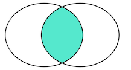
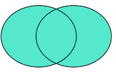

# SQL

## 前言

什么是 SQL？简单来说，SQL 就是访问和处理关系数据库的计算机标准语言。也就是说，无论用什么编程语言（Java、Python、C++...）编写程序，只要涉及到操作关系数据库，比如，一个电商网站需要把用户和商品信息存入数据库，或者一个手机游戏需要把用户的道具、通关信息存入数据库，都必须通过 SQL 来完成。

所以，现代程序离不开关系数据库，要使用关系数据库就必须掌握 SQL。

### NoSQL

你可能还听说过 NoSQL 数据库，也就是非 SQL 的数据库，包括 MongoDB、Cassandra、Dynamo 等等，它们都不是关系数据库。有很多人鼓吹现代 Web 程序已经无需关系数据库了，只需要使用 NoSQL 就可以。但事实上，SQL 数据库从始至终从未被取代过。回顾一下 NoSQL 的发展历程：

- 1970: NoSQL = We have no SQL
- 1980: NoSQL = Know SQL
- 2000: NoSQL = No SQL!
- 2005: NoSQL = Not noly SQL
- 2013: NoSQL = No, SQL!

今天，SQL 数据库仍然承担了各种应用程序的核心数据存储，而 NoSQL 数据库作为 SQL 数据库的补充钙，两者不再是二选一的问题，而是`主从关系`。所以，无论水用哪种编程语言，无论是 Web 开发、游戏开发还是手机开发，掌握 SQL，是所有软件开发人员所必须的。

## 关系数据库概述

为什么需要数据库？

因为应用程序需要保存用户的数据，比如 Word 需要把用户文档保存起来，以便下次继续编辑或者拷贝到另一台电脑。

要保存用户的数据，一个最简单的方法是把用户数据写入文件。例如，要保存一个班级所有学生的信息，可以向文件中写入一个 `CSV` 文件：

```bash
id,name,gender,score
1,小明,M,90
2,小红,F,95
3,小军,M,88
4,小丽,F,88
```

如果要保存学习所有班级的信息，可以写入另一个 CSV 文件。

但是，随着应用程序的功能越来越复杂，数据量越来越大，如何管理这些数据就成了大问题：

- 读写文件并解析出数据需要大量重复代码；
- 从成千上万的数据中快速查询出指定数据需要复杂的逻辑。

如果每个应用程序都各自自己写自己的读写数据的代码，一方面效率低，容易出错，另一方面，每个应用程序访问数据的接口都不相同，数据难以复用。

所以，数据库作为一种专门管理数据的软件就出现了。应用程序不需要自己管理数据，而是通过数据库软件提供的接口来读写数据。至于数据本身如何存储到文件，那是数据库软件的事情，应用程序自己并不关心：

```bash
┌──────────────┐
│ application  │
└──────────────┘
       ▲│
       ││
   read││write
       ││
       │▼
┌──────────────┐
│   database   │
└──────────────┘
```

这样一来，编写应用程序的时候，数据读写的功能就被大大地简化了。

### 数据模型

数据库按照数据结构来组织、存储和管理数据，实际上，数据库就一共有三种模型：

- 层次模型
- 网状模型
- 关系模型

层次模型就是以“上下级”的层次关系来组织数据的一种方式，层次模型的数据结构看起来就像一棵树：

```bash
            ┌─────┐
            │     │
            └─────┘
               │
       ┌───────┴───────┐
       │               │
    ┌─────┐         ┌─────┐
    │     │         │     │
    └─────┘         └─────┘
       │               │
   ┌───┴───┐       ┌───┴───┐
   │       │       │       │
┌─────┐ ┌─────┐ ┌─────┐ ┌─────┐
│     │ │     │ │     │ │     │
└─────┘ └─────┘ └─────┘ └─────┘
```

网状模型把每个数据节点和其他节点都连接起来，它的数据结构看起来就像很多城市之间的路网：

```bash
  ┌─────┐      ┌─────┐
   ┌─│     │──────│     │──┐
   │ └─────┘      └─────┘  │
   │    │            │     │
   │    └──────┬─────┘     │
   │           │           │
┌─────┐     ┌─────┐     ┌─────┐
│     │─────│     │─────│     │
└─────┘     └─────┘     └─────┘
   │           │           │
   │     ┌─────┴─────┐     │
   │     │           │     │
   │  ┌─────┐     ┌─────┐  │
   └──│     │─────│     │──┘
      └─────┘     └─────┘
```

关系模型把数据看作是一个二维表格，任何数据都可以通过行号 + 列号来唯一确定，它的数据类型看起来就是一个 Excel 表：

```bash
┌─────┬─────┬─────┬─────┬─────┐
│     │     │     │     │     │
├─────┼─────┼─────┼─────┼─────┤
│     │     │     │     │     │
├─────┼─────┼─────┼─────┼─────┤
│     │     │     │     │     │
├─────┼─────┼─────┼─────┼─────┤
│     │     │     │     │     │
└─────┴─────┴─────┴─────┴─────┘
```

随着时间的推移和市场竞争，最终，基于关系模型的关系数据库获得了绝对市场份额。

因为相比层次模型和网状模型，关系模型理解和使用起来最简单。（对于前端同学，可能 MongoDB 的层次模型更熟悉点）。

关系数据库的关系是基于数学理论建立的，复杂难懂。我们可以基于日常生活的来进行理解。我们以学校班级为例，一个班级的学生就可以用一个表格存起来，并且定义如下：

| ID  | 姓名 | 班级 ID | 性别 | 年龄 |
| --- | ---- | ------- | ---- | ---- |
| 1   | 小明 | 201     | M    | 9    |
| 2   | 小红 | 202     | F    | 8    |
| 3   | 小军 | 202     | M    | 8    |
| 4   | 小白 | 201     | F    | 9    |

其中，班级 ID 对应着另一个班级表：

| ID  | 名称       | 班主任 |
| --- | ---------- | ------ |
| 201 | 二年级一班 | 王老师 |
| 202 | 二年级二班 | 李老师 |

通过给定一个班级名称，可以查到一条班级记录，根据班级 ID，又可以查到多条学生记录，这样，<u>二维表就通过 ID 映射建立了“一对多”关系。</u>

### 数据类型

对于一个关系表，除了定义每一列的名称外，还需要定义每一列的数据类型。关系数据库支持的标准数据类型包括数值、字符串、时间等。

| 名称         | 类型           | 说明                                                                                       |
| ------------ | -------------- | ------------------------------------------------------------------------------------------ |
| INT          | 整型           | 4 字节整数类型，范围约+/-21 亿                                                             |
| BIGINT       | 长整型         | 8 字节整数类型，范围约+/-922 亿亿                                                          |
| REAL         | 浮点型         | 4 字节浮点数，范围约+/-1038                                                                |
| DOUBLE       | 浮点型         | 8 字节浮点数，范围约+/-10308                                                               |
| DECIMAL(M,N) | 高精度小数     | 由用户指定精度的小数，例如，DECIMAL(20,10)表示一共 20 位，其中小数 10 位，通常用于财务计算 |
| CHAR(N)      | 定长字符串     | 存储指定长度的字符串，例如，                                                               |  | CHAR(100)总是存储 100 个字符的字符串 |
| VARCHAR(N)   | 变长字符串     | 存储可变长度的字符串，例如，VARCHAR(100)可以存储 0~100 个字符的字符串                      |
| BOOLEAN      | 布尔类型       | 存储 True 或者 False                                                                       |
| DATE         | 日期类型       | 存储日期，例如，2018-06-22                                                                 |
| TIME         | 时间类型       | 存储时间，例如，12:20:59                                                                   |
| DATETIME     | 日期和时间类型 | 存储日期+时间，例如，2018-06-22 12:20:59                                                   |

上面的表中列举了最常用的数据类型。很多数据类型还有别名，例如，`REAL` 又可以写成 `FLOAT(24)`。还有一些不常用的数据类型，例如，`TINYINT` （范围在 0~255）。各数据库厂商还会主持特定的数据雷系你噶，例如 `JSON`。

<u>选择数据类型的时候，要根据业务规则选择合适的类型。</u>通常来说，`BIGINT` 能满足整数存储的需求，`VARCHAR(N)` 能满足字符串存储的需求，这两种类型是使用最广泛的。

### 主流数据库：

目前，主流的关系数据库主要分为以下几类：

1. 商用数据库，例如：[Oracle](https://www.oracle.com/)、SQL Server、DB2 等；
2. 开源数据库，例如：MySQL，PostgreSQL 等；
3. 桌面数据库，以微软 Access 为代表，适合桌面应用程序使用；
4. 嵌入式数据库，以 Sqlite 为代表，适合手机应用和桌面程序。

### SQL

什么是 SQL？SQL 是`结构化查询语言`（Structured Query Language）的缩写，用来访问和操作数据库系统。<u>SQL 语句既可以查询数据库中的数据，也可以添加、更新和删除数据库中的数据，还可以对数据库进行灌流和维护操作。</u>不同的数据库，都支持 SQL，这样，我们通过学习 SQL 这一种语言，就可以 i 操作各种不同的数据库。

虽然 SQL 已经被 ANSI 组织定义为标准，不幸的是，各个不同的数据库对标准的 SQL 支持不太一致。并且，大部分数据都在标准的 SQL 上做了扩展。也就是说，<u>如果只使用标准 SQL，理论上所有数据库都可以支持，</u>但如果使用某个特定数据库的扩展 SQL，换一个数据库就不能执行了。例如，Oracle 把自己扩展的 SQL 称为 `PL/SQL`，Microsoft 把自己扩展的 SQL 称为 `T-SQL`。

现实情况是，如果我们只使用标准 SQL 的核心功能，那么所有数据库通常都可以执行。不常用的 SQL 功能，不同的数据库的支持的程度都不一样。而各个数据库支持的各自扩展的功能，通常我们把它们称之为“方言”。

总的来说，SQL 语言定义了这么几种操作数据库的能力：

**DDL：Data Definition Language**

DDL 允许用户定义数据，也就是创建表、删除表、修改表结构这些操作。<u>通常，DDL 由数据库管理员执行。</u>

**DML：Data Manipulation Language**

DML 为用户提供添加、删除、更新数据的能力 i，这些是应用程序对数据库的日常操作。

**DQL：Data Query Language**

DQL 允许用户查询数据，这也是通常最频繁的数据库日常操作。

### 语法特点

SQL 语言关键字不区分大小写！！！但是，针对不同的数据库，对于表名和列名，有的数据库区分大小写，有的数据库不区分大小写。同一个数据库，有的在 Linux 上区分大小写，有的在 Windows 上不区分大小写。

所以，本教程约定：SQL 关键字总是大写，以示突出，表名和列名均使用小写。

## 关系模型

我们已经知道，关系数据库是建立在关系模型上的。而关系模型本质上就是若干个存储数据的二维表，可以把它们看作很多 Excel 表。

表的每一行称为`记录（Record）`，记录是一个逻辑意义上的数据。

表的每一列称为`字段（Column）`，同一个表的每一行记录都拥有相同的若干字段。

字段定义了数据类型（整型、浮点型、字符串、日期等），以及是否允许为 `NULL`。注意 `NULL` 表示字段数据不存在。一个整型字段如果为 `NULL` 不表示它的值为 `0`，同样的，一个字符串字段为 `NULL` 也不标水它的值为空串`''`。

⚠️：通常情况下，字段应该避免允许为 NULL。<u>不允许为 NULL 可以简化查询条件，加快查询速度，也利于应用程序读取数据后无需判断是否为 NULL。</u>

和 Excel 表有所不同的是，关系数据库的表和表之间需要建立`“一对多”`和 `“多对一”`、`“一对一”`的关系，这样才能够按照应用程序的逻辑来组织和存储数据。

例如，一个班级表：

| ID  | 名称       | 班主任 |
| --- | ---------- | ------ |
| 201 | 二年级一班 | 王老师 |
| 202 | 二年级二班 | 李老师 |

每一行对应着一个班级，而一个班级对应着多个学生，所以班级表和学生表的关系就是`“一对多”`。

| ID  | 姓名 | 班级 ID | 性别 | 年龄 |
| --- | ---- | ------- | ---- | ---- |
| 1   | 小明 | 201     | M    | 9    |
| 2   | 小红 | 202     | F    | 8    |
| 3   | 小军 | 202     | M    | 8    |
| 4   | 小白 | 201     | F    | 9    |

反过来，如果我们先在学生表中定位了一行记录，例如 `ID=1` 的小明，要确定他的班级，只需要根据他的“班级 ID”对应的值 `201` 找到班级表中 `ID=201` 的记录，即二年级一班。所以，学生表和班级表是`多对一`的关系。

如果我们把班级表分拆得细一点，例如，单独创建一个教师表：

| ID  | 名称   | 年龄 |
| --- | ------ | ---- |
| A1  | 王老师 | 26   |
| A2  | 张老师 | 39   |
| A3  | 李老师 | 32   |
| A4  | 赵老师 | 27   |

这样，一个班级总是对应一个教师，班级表和教师表就是“一对一”关系。

可以运用关系模型来编写 Web 视图界面，例如树结构与 tab 列表的联动。

在关系数据库中，关系是通过`主键`和`外键`来维护的。

### 主键

在关系数据库中，一张表中的每一行数据被称为一条记录。一条记录就是由多个字段组成的。例如，`students` 表的两行记录：

| id class_id | name | gender | score |
| ----------- | ---- | ------ | ----- |
| 1           | 1    | 小明   | M     | 90 |
| 2           | 1    | 小红   | F     | 95 |

每一条记录都包含若干定义好的字段。同一个表的所有记录都有相同的字段定义。

<u>对于关系表，有个很重要的约束，就是任意两条记录不能重复。不能重复不是指两条记录不完全相同，而是指能够通过某个字段唯一区分出不同的记录，这个字段被称为`主键`。</u>

例如，假设我们把 `name` 字段作为主键，那么通过名字 `小明` 或 `小红` 就能唯一确定一条记录。但是，这么设定，就没法存储同名的同学了，因为插入相同的主键的两条记录是不被允许的。

⚠️：<u>对主键的要求，最关键的一点是：记录一旦插入到表中，主键最好不要再修改，因为`主键是用来唯一定位记录的`，修改了主键，会造成一系列的影响。</u>

由于主键的作用十分重要，如何选取主键会对业务开发产生重要影响。如果我们以学生的身份证号作为主键，似乎能唯一定位记录。然而，身份证号也是一种业务场景。如果身份证号升位了，或者需要变更，作为主键，不得不修改的时候，就会对业务产生严重影响。

<u>所以，选取主键的一个基本原则是：不使用任何业务相关的字段作为主键。</u>

因此，身份证号、手机号、邮箱地址这些看上去可以唯一的字段，均`不可`用作主键。

作为主键最好是完全业务无关的字段，我们一般把这个字段命名为 `id`。常见的可作为 `id` 字段的类型有：

1. `自增整数类型`：数据库会在插入数据时自动为每一条记录分配一个自增整数，这样我们就完全不用担心主键重复，也不用自己预先生成主键；
2. `全局唯一 GUID 类型`：使用一种全局唯一的字符串作为主键，类似 `8f55d96b-8acc-4636-8cb8-76bf8abc2f57`。GUID 算法通过`网卡 MAC 地址`、`时间戳` 和`随机数`保证任意计算机在任意时间生成的字符串都是不同的，大部分编程语言都内置了 GUID 算法，可以自己预算出主键。

对于大部分应用来说，通常自增类型的主键就能满足需求。我们在 `students` 表中定义的主键也是 `BIGINT NOT NULL AUTO_INCREMENT` 类型。

⚠️ 如果使用 `INT` 自增类型，那么当一张表的记录树超过 2147483647（约 21 亿）时，会达到上限而出错。使用`BIGINT`自增类型则可以最多约 922 亿亿条记录。

#### 联合主键

官修数据库实际上还允许通过`多个字段唯一标识记录·，即两个或更多的字段都设置为主键，这种主键被称为联合主键。

对于联合主键，允许一列有重复，只要不是所有主键列都重复即可：

| id_num | id_type | other columns... |
| ------ | ------- | ---------------- |
| 1      | A       | ...              |
| 2      | A       | ...              |
| 2      | B       | ...              |

如果我们把上述表的 `id_num` 和 `id_type` 这两列作为联合主键，那么上面的 3 条记录都是允许的，因为没有两列主键组合起来是相同的。

没有必要的情况下，我们尽量不使用联合主键，因为它给关系表带来了复杂度的上升。

#### 小结

主键是关系表中记录的唯一标识。主键的选取非常重要：主键不要带有业务含义，而应用使用 BIGINT 自增或 GUID 类型。主键也不应用允许 `NULL`。

可以使用多个列作为联合主键，但联合主键并不常用。

### 外键

当我们用主键唯一标识记录时，我们就可以在 `stundents` 表中确定任意一个学生的记录：

| id  | name | other columns... |
| --- | ---- | ---------------- |
| 1   | 小明 | ...              |
| 2   | 小红 | ...              |

我们还可以在 `classes` 表中确定任意一个班级记录：

| id name | other columns... |
| ------- | ---------------- |
| 1       | 一班             | ... |
| 2       | 二班             | ... |

但是我们如何确定 `students` 表的一条记录，例如，`id=1` 的小明，属于哪个班级呢？

由于一个班级可以有多个学生，在关系模型中，这两个表的关系可以称为“一对多”，即一个 `classes` 的记录可以对应多个 `students` 表的记录。

为了表达这种一对多的关系，我们需要在 `students` 表中假如一列 `class_id`，让它的值与 `classes` 表的某条记录相对应：

| id  | class_id | name | other columns... |
| --- | -------- | ---- | ---------------- |
| 1   | 1        | 小明 | ...              |
| 2   | 1        | 小红 | ...              |
| 5   | 2        | 小白 | ...              |

这样，我们就可以根据 `class_id` 这个列直接定位出一个 `students` 表的记录应该对应到 `classes` 的哪条记录。

例如：

- 小明的 `class_id` 是 `1`，因此，对应的 `classes` 表的记录是 `id=1` 的一班；
- 小红的 `class_id` 是 `1`，因此，对应的 `classes` 表的记录是 `id=1` 的一班；
- 小白的 `class_id` 是 `2`，因此，对应的 `classes` 表的记录是 `id=1` 的一班。

在 `students` 表中，通过 `class_id` 的字段，可以把数据与另一张表关联起来，这种列称为 `外键`。

<u>外键并不是通过列名实现的，而是通过定义外键约束实现。</u>

```bash
ALTER TABLE students
ADD CONSTRAINT fk_class_id
FOREIGN KEY (class_id)
REFERENCES classes (id);
```

其中，外键约束的名称 `fk_class_id` 可以任意，`FOREIGN KEY (class_id)` 指定了 `class_id` 作为了外键，`REFERENCES classes (id)` 指定了这个外键将关联到 `classes` 表的 `id` 列（即 `classes` 表的主键）。

<u>通过定义外键约束，关系数据库可以保证无法插入无效的数据。</u>即如果 `classes` 表不存在 `id=99` 的记录，`students` 表就无法插入 `class_id=99` 的记录。

由于外键约束会降低数据库的性能，大部分互联网应用程序为了追求速度，并不设置外键约束，而是仅靠应用程序自身来保证逻辑的正确性。这种情况下，`class_id` 仅仅是一个普通的列，只是它起到了外键的作用而已。

要删除一个外键约束，也是通过 `ALTER TABLE` 实现的：

```bash
ALTER TABLE students
DROP FOREIGN KEY fk_class_id;
```

⚠️：删除外键约束并没有删除外键这一列。删除列是通过 `DROP COLUMN ...` 实现的。

#### 多对多

通过一个表的外键关联到另一个表，我们可以定义出一对多关系。有些时候，还需要定义“多对多”关系。例如，一个老师可以对应多个班级，因此，班级表和老师表存在多对多关系。

<u>多对多关系实际上是通过两个一对多关系实现的，即通过一个中间表，关联两个一对多关系，就形成了多对多关系：</u>

`teachers` 表：

| id  | name   |
| --- | ------ |
| 1   | 张老师 |
| 2   | 王老师 |
| 3   | 李老师 |
| 4   | 赵老师 |

`classes` 表：

| id  | name |
| --- | ---- |
| 1   | 一班 |
| 2   | 二班 |

中间表 `teacher_class` 关联两个一对多关系：

| id  | teacher_id | class_id |
| --- | ---------- | -------- |
| 1   | 1          | 1        |
| 2   | 1          | 2        |
| 3   | 2          | 1        |
| 4   | 2          | 2        |
| 5   | 3          | 1        |
| 6   | 4          | 2        |

通过中间表 `teacher_class` 可知 `teachers` 到 `classes` 的关系：

- `id=1` 的张老师对应 `id=1,2` 的一班和二班；
- `id=2` 的王老师对应 `id=1,2` 的一班和二班；
- `id=3` 的李老师对应 `id=1` 的一班；
- `id=4` 的赵老师对应 `id=2` 的二班。

同理可知 `classes` 到 `teachers` 的关系：

- `id=1` 的一班对应 `id=1,2,3` 的张老师、王老师和李老师；
- `id=2` 的二班对应 `id=1,2,4` 的张老师、王老师和赵老师；

因此，**通过`中间表`，我们就定义了一个 “多对多”关系。**

#### 一对一

一对一关系是指，<u>一个表的记录对应到另一个表的`唯一一个`记录。</u>

例如，`students` 表的每个学生可以有自己的联系方式，如果把联系方式存入另一个表 `contacts`，我们就可以得到一个“一对一”的关系：

| id  | student_id | mobile      |
| --- | ---------- | ----------- |
| 1   | 1          | 135xxxx6300 |
| 2   | 2          | 138xxxx2209 |
| 3   | 5          | 139xxxx8086 |

有细心的童鞋会问，既然是一对一关系，那为啥不给 `students` 表增加一个 `mobile` 列，这样就能合二为一了？

如果业务允许，完全可以把两个表合为一个表，<u>目的是把经常读取和不经常读取的字段分开，以获得更高的性能。</u>例如，把一个大的用户表分拆为用户基本信息表 `user_info` 表和用户详细信息表 `user_profiles`，大部分时候，只需要查询 `user_info` 表，并不需要查询 `user_profiles` 表，这样就提高了查询速度。

#### 小结

关系数据库通过外键可以实现一对多、多对多和一对一的关系。外键既可以通过数据库来约束，也可以不设置约束，仅依靠应用程序的罗就来保证。

在做前端应用的时候，也可以参考数据库的关系模型的思维，进行一对一、一对多、多对多的处理。

### 索引

在关系数据库中，如果有上万甚至上亿条记录，在查找记录的时候，想要获得非常快的速度，就需要索引。

索引是关系数据库中对某一列或多个列的值进行`预排序`的数据结构。通过使用索引，可以让数据库系统不必扫描整个表，而是直接定位到符合条件的记录，这样就大大加快了查询速度。

#### 唯一索引

#### 小结

通过对数据库表创建索引，可以提高查询速度。

通过创建唯一索引，可以保证某一列的值具有唯一性。

数据库索引对于用户和应用程序来说都是透明的。

## 查询数据

在关系数据库中，最常用的操作就是查询。

#### 准备数据

为了便于讲解和联系，我们先准备了一个 `students` 表和一个 `classes` 表，它们的结构和数据如下：

`students` 表存储了学生信息：

| id  | class_id | name | gender | score |
| --- | -------- | ---- | ------ | ----- |
| 1   | 1        | 小明 | M      | 90    |
| 2   | 1        | 小红 | F      | 95    |
| 3   | 1        | 小军 | M      | 88    |
| 4   | 1        | 小米 | F      | 73    |
| 5   | 2        | 小白 | F      | 81    |
| 6   | 2        | 小兵 | M      | 55    |
| 7   | 2        | 小林 | M      | 85    |
| 8   | 3        | 小新 | F      | 91    |
| 9   | 3        | 小王 | M      | 89    |
| 10  | 3        | 小丽 | F      | 85    |

`classes` 表存储了 班级信息：

| id  | name |
| --- | ---- |
| 1   | 一班 |
| 2   | 二班 |
| 3   | 三班 |
| 4   | 四班 |

#### MySQL

如果用 MySQL 练习，可以使用下面的脚本在命令行运行

```bash
$ mysql -u root -p < init-test-data.sql
```

就可以自动创建 `test` 数据库，并且在 `test` 数据库下创建 `students` 表和 `classes` 表，以及必要的初始化数据。

```sql
-- 如果test数据库不存在，就创建test数据库：
CREATE DATABASE IF NOT EXISTS test;

-- 切换到test数据库
USE test;

-- 删除classes表和students表（如果存在）：
DROP TABLE IF EXISTS classes;
DROP TABLE IF EXISTS students;

-- 创建classes表：
CREATE TABLE classes (
    id BIGINT NOT NULL AUTO_INCREMENT,
    name VARCHAR(100) NOT NULL,
    PRIMARY KEY (id)
) ENGINE=InnoDB DEFAULT CHARSET=utf8;

-- 创建students表：
CREATE TABLE students (
    id BIGINT NOT NULL AUTO_INCREMENT,
    class_id BIGINT NOT NULL,
    name VARCHAR(100) NOT NULL,
    gender VARCHAR(1) NOT NULL,
    score INT NOT NULL,
    PRIMARY KEY (id)
) ENGINE=InnoDB DEFAULT CHARSET=utf8;

-- 插入classes记录：
INSERT INTO classes(id, name) VALUES (1, '一班');
INSERT INTO classes(id, name) VALUES (2, '二班');
INSERT INTO classes(id, name) VALUES (3, '三班');
INSERT INTO classes(id, name) VALUES (4, '四班');

-- 插入students记录：
INSERT INTO students (id, class_id, name, gender, score) VALUES (1, 1, '小明', 'M', 90);
INSERT INTO students (id, class_id, name, gender, score) VALUES (2, 1, '小红', 'F', 95);
INSERT INTO students (id, class_id, name, gender, score) VALUES (3, 1, '小军', 'M', 88);
INSERT INTO students (id, class_id, name, gender, score) VALUES (4, 1, '小米', 'F', 73);
INSERT INTO students (id, class_id, name, gender, score) VALUES (5, 2, '小白', 'F', 81);
INSERT INTO students (id, class_id, name, gender, score) VALUES (6, 2, '小兵', 'M', 55);
INSERT INTO students (id, class_id, name, gender, score) VALUES (7, 2, '小林', 'M', 85);
INSERT INTO students (id, class_id, name, gender, score) VALUES (8, 3, '小新', 'F', 91);
INSERT INTO students (id, class_id, name, gender, score) VALUES (9, 3, '小王', 'M', 89);
INSERT INTO students (id, class_id, name, gender, score) VALUES (10, 3, '小丽', 'F', 85);

-- OK:
SELECT 'ok' as 'result:';
```

### 基本查询

要查询数据库表的数据，我们使用如下的 SQL 语句：

```bash
SELECT * from <表名>
```

使用 `SELECT * FROM students`时，`SELECT` 是关键字，表示将要执行一个查询，`*` 表示“所有列”，`FROM` 表示将要从哪个表查询，本例中是 `students` 表。

该 SQL 将查询出 `students` 表的所有数据。注意：查询结构也是一个二维表，它包含列名和每一行的数据。

要查询 `classes` 表的所有行，我们用如下 SQL 语句：

```bash
SELECT * FROM classes;
```

`SELECT` 语句其实并不要求一定要有 `FROM` 子句。

```bash
mysql> SELECT 100 + 200;
+-----------+
| 100 + 200 |
+-----------+
|       300 |
+-----------+
1 row in set (0.00 sec)
```

上述查询会直接计算出表达式的结果。虽然 `SELECT` 可以用作计算，但它并不是 SQL 的强项。但是，不带 `FROM` 子句的 `SELECT` 语句有一个有用的用途，就是用来判断当前到数据库的连接是否有效。许多检测工具会执行一条 `SELECT 1;` 来测试数据库连接。

#### 小结

使用 SELECT 查询的基本语句 `SELECT * FROM <表名>` 可以查询一个表的所有行和所有列的数据。

### 条件查询

使用 `SELECT * FROM <表名>` 可以查询到一张表的所有记录。但是，很多时候，我们并不希望获得所有记录，而是根据条件选择性地获取指定条件的记录，例如，查询分数在 80 分以上的学生记录。在一张表数百万记录的情况下，获取所有记录不仅费时，还费内存和带宽。

SELECT 语句可以通过 `WHERE` 条件来设定查询条件，查询结构是满足查询条件的记录。例如，要指定条件“分数在 80 分或以上的学生”，写成 `WHERE` 条件就是 `SELECT * FROM students WHERE score >= 80`。

其中，`WHERE` 关键字后面的 `score >= 80` 就是条件。`score` 是列名，该列存储了学生的成绩，因此，`score >=80` 就筛选出了指定条件的记录：

```bash
mysql> SELECT * FROM students WHERE score >= 80;
+----+----------+--------+--------+-------+
| id | class_id | name   | gender | score |
+----+----------+--------+--------+-------+
|  1 |        1 | 小明   | M      |    90 |
|  2 |        1 | 小红   | F      |    95 |
|  7 |        2 | 小林   | M      |    80 |
|  8 |        3 | 小新   | F      |    91 |
| 10 |        3 | 小丽   | F      |    80 |
+----+----------+--------+--------+-------+
5 rows in set (0.00 sec)
```

因此，条件查询的语法就是：

```bash
SELECT * FROM <表名> WHERE <条件表达式>
```

条件表达式可以用 `<条件1> AND <条件2>` 表达满足条件 1 并且满足条件 2。例如，符合条件“分数在 80 分或以上”，并且还符合条件“男生”，把这两个条件写出来：

- 条件 1：根据 score 列的数据判断：`score >= 80`；
- 条件 2：根据 gender 列的数据判断：`gender = 'M'`，注意 `gender` 列存储的是字符串，需要用单引号括起来。

就可以写出 `WHERE` 条件：`score >= 80 AND gender = 'M'`：

```bash
mysql> SELECT * FROM students WHERE score >= 80 AND gender = 'M';
+----+----------+--------+--------+-------+
| id | class_id | name   | gender | score |
+----+----------+--------+--------+-------+
|  1 |        1 | 小明   | M      |    90 |
|  7 |        2 | 小林   | M      |    80 |
+----+----------+--------+--------+-------+
2 rows in set (0.01 sec)
```

第二种条件是 `<条件1> OR <条件2>`，表示满足条件 1 或者满足条件 2。例如，把上述 `AND` 查询的两个条件改为 `OR`，查询结果就是 “分数在 80 分或以上” 或者 “男生”，满足任意之一的条件即选出该记录；

```bash
mysql> SELECT * FROM students WHERE score >= 80 OR gender = 'M';
+----+----------+--------+--------+-------+
| id | class_id | name   | gender | score |
+----+----------+--------+--------+-------+
|  1 |        1 | 小明   | M      |    90 |
|  2 |        1 | 小红   | F      |    95 |
|  3 |        1 | 小军   | M      |    78 |
|  6 |        2 | 小兵   | M      |    55 |
|  7 |        2 | 小林   | M      |    80 |
|  8 |        3 | 小新   | F      |    91 |
|  9 |        3 | 小王   | M      |    79 |
| 10 |        3 | 小丽   | F      |    80 |
+----+----------+--------+--------+-------+
8 rows in set (0.00 sec)
```

很显然 `OR` 条件比 `AND` 条件宽松，返回的符合条件的记录也更多。

第三种条件是 `NOT <条件>`，表示“不符合该条件”的记录。例如，写一个“不是 2 班的学生”这个条件，可以先写出“是 2 班的学生”：`class_id = 2`，再加上 `NOT: NOT class_id = 2`:

```bash
mysql> SELECT * FROM students WHERE NOT class_id = 2;
+----+----------+--------+--------+-------+
| id | class_id | name   | gender | score |
+----+----------+--------+--------+-------+
|  1 |        1 | 小明   | M      |    90 |
|  2 |        1 | 小红   | F      |    95 |
|  3 |        1 | 小军   | M      |    78 |
|  4 |        1 | 小米   | F      |    73 |
|  8 |        3 | 小新   | F      |    91 |
|  9 |        3 | 小王   | M      |    79 |
| 10 |        3 | 小丽   | F      |    80 |
+----+----------+--------+--------+-------+
7 rows in set (0.00 sec)
```

上述 `NOT` 条件 `NOT class_id = 2` 其实等价于 `class_id <> 2`，因此，`NOT` 查询不是很常用。

<u>要组合三个或者更多的条件，就需要用小括号 `()` 表示如何进行条件运算。</u>例如，编写一个复杂的条件：分数在 80 以下或者 90 以上，并且是男生：

```bash
mysql> SELECT * FROM students WHERE (score < 80 OR score > 90) AND gender = 'M';
+----+----------+--------+--------+-------+
| id | class_id | name   | gender | score |
+----+----------+--------+--------+-------+
|  3 |        1 | 小军   | M      |    78 |
|  6 |        2 | 小兵   | M      |    55 |
|  9 |        3 | 小王   | M      |    79 |
+----+----------+--------+--------+-------+
3 rows in set (0.00 sec)
```

如果不加括号，条件运算符按照 `NOT`、`AND`、`OR` 的优先级进行，即 `NOT` 优先级最高，其次是 `AND`，最后是 `OR`。加上括号可以改变优先级。

#### 常用的条件表达式

| 条件                   | 表达式举例 1    | 表达式举例 2     | 说明                                                  |
| ---------------------- | --------------- | ---------------- | ----------------------------------------------------- |
| 使用 = 判断相等        | score = 80      | name = 'abc'     | 字符串需要用单引号括起来                              |
| 使用 > 判断大于        | score > 80      | name > 'abc'     | 字符串比较根据 ASCII 码，中文字符比较根据数据库设置   |
| 使用 >= 判断大于或相等 | score >= 80     | name >= 'abc'    |                                                       |
| 使用 < 判断小于        | score < 80      | name <= 'abc'    |                                                       |
| 使用 <= 判断小于或相等 | score <= 80     | name <= 'abc'    |                                                       |
| 使用 <> 判断不相等     | score <> 80     | name <> 'abc'    |                                                       |
| 使用 LIKE 判断相似     | name LIKE 'ab%' | name LIKE '%bc%' | % 表示任意字符，例如 'ab%' 将匹配 'ab'，'abc'，'abcd' |

```bash
mysql> SELECT * FROM students WHERE name LIKE '%明';
+----+----------+--------+--------+-------+
| id | class_id | name   | gender | score |
+----+----------+--------+--------+-------+
|  1 |        1 | 小明   | M      |    90 |
+----+----------+--------+--------+-------+
1 row in set (0.00 sec)
```

### 投影查询

使用 `SELECT * FROM <表名> WHERE <条件>` 可以选出表中的若干条记录。我们注意到返回的二维表结构和原表是相同的，即结果集的所有列与原表的所有列都一一对应。如果我们只希望返回某些列的数据，而不是所有列的数据，我们可以用 `SELECT 列 1，列2，列 3 FROM ...`，让结果集仅包含指定列。这种操作称为`投影查询。`

例如，从 `students` 表中返回 `id`、`score` 和 `name` 这三列：

```bash
mysql> SELECT id, score, name FROM students;
+----+-------+--------+
| id | score | name   |
+----+-------+--------+
|  1 |    90 | 小明   |
|  2 |    95 | 小红   |
|  3 |    78 | 小军   |
|  4 |    73 | 小米   |
|  5 |    76 | 小白   |
|  6 |    55 | 小兵   |
|  7 |    80 | 小林   |
|  8 |    91 | 小新   |
|  9 |    79 | 小王   |
| 10 |    80 | 小丽   |
+----+-------+--------+
10 rows in set (0.01 sec)
```

这样返回的结果集就只包含了我们指定的列，并且，结果集的列的顺序和原表可以不一样。

使用 `SELECT 列 1, 列2, 列3 FROM ...` 时，还可以给每一列起个别名，这样，结果集的列名就可以与原表的列名不同。它的语法是 `SELECT 列1 别名1, 列2 别名2, 列3 别名3 FROM ...`。

例如，以下 `SELECT` 语句将列名 `score` 重命名为 `points`，而 `id` 和 `name` 列名保持不变；

```bash
mysql> SELECT id, score points, name FROM students;
+----+--------+--------+
| id | points | name   |
+----+--------+--------+
|  1 |     90 | 小明   |
|  2 |     95 | 小红   |
|  3 |     78 | 小军   |
|  4 |     73 | 小米   |
|  5 |     76 | 小白   |
|  6 |     55 | 小兵   |
|  7 |     80 | 小林   |
|  8 |     91 | 小新   |
|  9 |     79 | 小王   |
| 10 |     80 | 小丽   |
+----+--------+--------+
10 rows in set (0.00 sec)
```

投影查询同样可以接 `WHERE` 条件，实现复杂的查询：

```bash
mysql> SELECT id, score points, name FROM students WHERE gender = 'M';
+----+--------+--------+
| id | points | name   |
+----+--------+--------+
|  1 |     90 | 小明   |
|  3 |     78 | 小军   |
|  6 |     55 | 小兵   |
|  7 |     80 | 小林   |
|  9 |     79 | 小王   |
+----+--------+--------+
5 rows in set (0.00 sec)
```

#### 小结

使用 `SELECT *` 表示要查询表的所有列，使用 `SELECT 列1, 列2, 列3` 则可以仅返回指定列，这种操作称为`投影`。

`SELECT` 语句可以对结果集的列进行命名。

### 排序

我们使用 SELECT 查询时，细心的读者可能注意到，查询结果集通常是按照 `id` 排序的，也就是根据主键排序。这也是大部分数据库的做法。如果我们要根据其他条件排序怎么办？可以加上 `ORDER BY` 子句。例如按照成绩从低到高进行排序：

```bash
mysql> SELECT id, name, gender, score FROM students ORDER BY score;
+----+--------+--------+-------+
| id | name   | gender | score |
+----+--------+--------+-------+
|  6 | 小兵   | M      |    55 |
|  4 | 小米   | F      |    73 |
|  5 | 小白   | F      |    76 |
|  3 | 小军   | M      |    78 |
|  9 | 小王   | M      |    79 |
|  7 | 小林   | M      |    80 |
| 10 | 小丽   | F      |    80 |
|  1 | 小明   | M      |    90 |
|  8 | 小新   | F      |    91 |
|  2 | 小红   | F      |    95 |
+----+--------+--------+-------+
10 rows in set (0.01 sec)
```

如果要反过来，按照成绩从高到低排序，我们可以加上 `DESC` 表示 “倒序”：

```bash
mysql> SELECT id, name, gender, score FROM students ORDER BY score DESC;
+----+--------+--------+-------+
| id | name   | gender | score |
+----+--------+--------+-------+
|  2 | 小红   | F      |    95 |
|  8 | 小新   | F      |    91 |
|  1 | 小明   | M      |    90 |
|  7 | 小林   | M      |    80 |
| 10 | 小丽   | F      |    80 |
|  9 | 小王   | M      |    79 |
|  3 | 小军   | M      |    78 |
|  5 | 小白   | F      |    76 |
|  4 | 小米   | F      |    73 |
|  6 | 小兵   | M      |    55 |
+----+--------+--------+-------+
10 rows in set (0.01 sec)
```

如果 `score` 列有相同的数据，要进一步排序，可以继续添加列名。例如，使用 `ORDER BY score DESC, gender` 表示先按 `score` 列倒序，如果有相同分数的，再按 `gender` 列排序：

```bash
mysql> SELECT id, name, gender, score FROM students ORDER BY score DESC, gender;
+----+--------+--------+-------+
| id | name   | gender | score |
+----+--------+--------+-------+
|  2 | 小红   | F      |    95 |
|  8 | 小新   | F      |    91 |
|  1 | 小明   | M      |    90 |
| 10 | 小丽   | F      |    80 |
|  7 | 小林   | M      |    80 |
|  9 | 小王   | M      |    79 |
|  3 | 小军   | M      |    78 |
|  5 | 小白   | F      |    76 |
|  4 | 小米   | F      |    73 |
|  6 | 小兵   | M      |    55 |
+----+--------+--------+-------+
10 rows in set (0.00 sec)
```

对前端数据进行排序实现时，可以参考 SQL 语句的查询。

默认的排序规则是 `ASC`：“升序”，即从小到大。`ASC` 可以省略，即 `ORDER BY score ASC` 和 `ORDER BY score` 效果一样。

如果有 `WHERE` 子句，那么 `ORDER BY` 子句要放到 `WHERE` 子句后面。例如，查询一班的学生成绩，并按照倒序排序；

```bash
mysql> SELECT id, name, gender, score FROM students WHERE class_id = 1 ORDER BY score DESC;                                                                     +----+--------+--------+-------+
| id | name   | gender | score |
+----+--------+--------+-------+
|  2 | 小红   | F      |    95 |
|  1 | 小明   | M      |    90 |
|  3 | 小军   | M      |    78 |
|  4 | 小米   | F      |    73 |
+----+--------+--------+-------+
4 rows in set (0.01 sec)
```

这样，结果集仅包含符合 `WHERE` 条件的记录，并按照 `ORDER BY` 的设定排序。

#### 小结

使用 `ORDER BY` 可以对结果集进行排序；

可以对多列（例如先排序第一列、再根据第二列排序）进行升序、倒序排序。

### 分页查询

#### 分页

使用 SELECT 查询时，如果结果集数据量很大，比如几万行数据，放在一个页面显示的话数据量太大，不如分页显示，每次显示 100 条。要实现分页功能，<u>实际上就是从结果集中显示第 1 ～ 100 条记录作为第 1 页，显示第 101 ～ 200 条记录作为第 2 页，以此类推。</u>

因此，分页实际上就是从结果集中“截取”出第 M ～ N 条记录。这个查询可以通过 `LIMIT <M> OFFSET <N>` 子句实现。我们先把所有学生按照成绩从高到低进行排序：

```bash
mysql> SELECT id, name, gender, score FROM students ORDER BY score DESC;
+----+--------+--------+-------+
| id | name   | gender | score |
+----+--------+--------+-------+
|  2 | 小红   | F      |    95 |
|  8 | 小新   | F      |    91 |
|  1 | 小明   | M      |    90 |
|  7 | 小林   | M      |    80 |
| 10 | 小丽   | F      |    80 |
|  9 | 小王   | M      |    79 |
|  3 | 小军   | M      |    78 |
|  5 | 小白   | F      |    76 |
|  4 | 小米   | F      |    73 |
|  6 | 小兵   | M      |    55 |
+----+--------+--------+-------+
10 rows in set (0.01 sec)
```

现在，我们把结果集分页，每页 3 条记录。要获取第 1 页的记录，可以使用 `LIMIT 3 OFFSET 0`：

```sql
mysql> SELECT id, name, gender, score FROM students ORDER BY score DESC LIMIT 3 OFFSET 0;
+----+--------+--------+-------+
| id | name   | gender | score |
+----+--------+--------+-------+
|  2 | 小红   | F      |    95 |
|  8 | 小新   | F      |    91 |
|  1 | 小明   | M      |    90 |
+----+--------+--------+-------+
3 rows in set (0.01 sec)
```

上述查询 `LIMIT 3 OFFSET 0` 表示，对结果集从 0 号记录开始，最多取 3 条。`注意 SQL 记录集的索引从 0 开始`。

如果要查询第 2 页，那么我们只需要 “跳过” 头 3 条记录，也就是对结果集从 3 号记录开始查询，把 `OFFSET` 设定为 3：

```sql
mysql> SELECT id, name, gender, score FROM students ORDER BY score DESC LIMIT 3 OFFSET 3;
+----+--------+--------+-------+
| id | name   | gender | score |
+----+--------+--------+-------+
| 10 | 小丽   | F      |    80 |
|  7 | 小林   | M      |    80 |
|  9 | 小王   | M      |    79 |
+----+--------+--------+-------+
3 rows in set (0.00 sec)
```

类似的，查询第 3 页的时候，`OFFSET` 应该设定为 6：

```sql
mysql> SELECT id, name, gender, score FROM students ORDER BY score DESC LIMIT 3 OFFSET 6;
+----+--------+--------+-------+
| id | name   | gender | score |
+----+--------+--------+-------+
|  3 | 小军   | M      |    78 |
|  5 | 小白   | F      |    76 |
|  4 | 小米   | F      |    73 |
+----+--------+--------+-------+
3 rows in set (0.00 sec)
```

查询第 4 页的时候，`OFFSET` 应该设定为 9：

```sql

mysql> SELECT id, name, gender, score FROM students ORDER BY score DESC LIMIT 3 OFFSET 9;
+----+--------+--------+-------+
| id | name   | gender | score |
+----+--------+--------+-------+
|  6 | 小兵   | M      |    55 |
+----+--------+--------+-------+
1 row in set (0.00 sec)
```

由于第 4 页只有 1 条记录，因此最终结果集按实际数量 1 显示。`LIMIT 3` 表示的意思是 “最多 3 条记录”。

可见，分页查询的关键在于，首先要确定每页需要显示的结果数量 `pageSize` （这里是 3），然后根据当前页的索引 `pageIndex`（从 1 开始），确定 `LIMIT` 和 `OFFSET` 应用设定的值：

- `LIMIT` 总是设定为 `pageSize`；
- `OFFSET` 计算公式为 `pageSize * (pageIndex - 1)`。

这样就能正确查询出第 N 页的记录集。

如果原本记录集一共就 10 条记录，但我们把 `OFFSET` 设置为 20，会得到什么结果呢？

```bash
mysql> SELECT id, name, gender, score FROM students ORDER BY score DESC LIMIT 3 OFFSET 20;
Empty set (0.00 sec)
```

`OFFSET` 超过了查询的最大数量并不会报错，而是得到一个空的结果集。

#### 注意

`OFFSET` 是可选的，如果只写 `LIMIT 15`，那么相当于 `LIMIT 15 OFFSET 0`。

在 MySQL 中，`LIMIT 15 OFFSET 30` 还可以简写成 `LIMIT 30, 15`。

<u>使用 `LIMIT <M> OFFSET <N>`</u>分页时，随着 N 越来越大，查询效率越来越低。

#### 小结

分页的使用频率：几乎每个 Web 系统都会用到。

使用 `LIMIT <M> OFFSET <N>` 可以对结果集进行分页，每次查询返回结果集的一部分；

分页查询需要先确定每页的数量和当前页数，然后确定 `LIMIT` 和 `OFFSET` 的值。

#### 思考

在分页查询之前，如何计算一共有几页？

总页数：pages = 向上取整(sumElements / pageSize)

8 / 3 = 3 页
10 / 3 = 4 页

10 % 3 = 3...1

```sql
SELECT CEILING(COUNT(*) / 3) FROM students;
```

### 聚合查询

如果我们要统计一张表的数据量，例如，想查询 `students` 表一共有多少条记录，难道必须用 `SELECT * FROM students` 查出来然后再数一数有多少行吗？

这个方法当然可以，但是比较弱智。对于统计总数、平均数这类计算，SQL 提供了专门的聚合函数，使用聚合函数进行查询，就是聚合查询，它可以快速获得结果。

仍然以查询 `students` 表一共有多少条记录为例，我们可以使用 SQL 内置的 `COUNT()` 函数查询：

```sql
mysql> SELECT COUNT(*) FROM students;
+----------+
| COUNT(*) |
+----------+
|       10 |
+----------+
1 row in set (0.00 sec)
```

`COUNT(*)` 表示查询<u>所有列的行数，</u>要注意聚合的计算结果虽然是一个数字，但查询的结果仍然是一个二维表，只是这个二维表只有一行一列，并且列名是 `COUNT(*)`。通常，使用聚合查询时，我们应该给列名设置一个别名，便于处理结果：

```sql
mysql> SELECT COUNT(*) num FROM students;
+-----+
| num |
+-----+
|  10 |
+-----+
1 row in set (0.00 sec)

```

`COUNT(*)` 和 `COUNT(id)` 实际上是一样的效果。另外注意，聚合查询同样可以使用 `WHERE` 条件，因此我们可以方便地统计出有多少男生、多少女生、多少 80 分以上的学生等；

```sql
mysql> SELECT COUNT(*) num FROM students WHERE gender = 'M';
+-----+
| num |
+-----+
|   5 |
+-----+
1 row in set (0.00 sec)

```

除了 `COUNT()` 函数外，SQL 还提供了如下聚合函数：

| 函数 | 说明                                   |
| ---- | -------------------------------------- |
| SUM  | 计算某一列的合计值，该列必须为数值类型 |
| AVG  | 计算某一列的平均值，该列必须为数值类型 |
| MAX  | 计算某一列的最大值                     |
| MIN  | 计算某一列的最小值                     |

注意，`MAX()` 和 `MIN()` 函数并不限于数值类型。如果是字符类型，`MAX()` 和 `MIN()` 会返回排序最后和排序最前的字符。

要统计男生的平均成绩，我们用下面的聚合查询：

```sql
mysql> SELECT AVG(score) average FROM students WHERE gender = 'M';
+---------+
| average |
+---------+
| 76.4000 |
+---------+
1 row in set (0.00 sec)
```

要特别注意：如果聚合查询的 `WHERE` 条件没有匹配到任何行，`COUNT()` 会返回 0，而 `SUM()`、`AVG()`、`MAX()` 和 `MIN()` 会返回 `NULL`：

```sql
mysql> SELECT AVG(score) average FROM students WHERE gender = 'x';
+---------+
| average |
+---------+
|    NULL |
+---------+
1 row in set (0.00 sec)
```

每页 3 条记录，如何通过聚合查询获得总页数？

```bash
mysql> SELECT CEILING(COUNT(*)/3) FROM students;
+---------------------+
| CEILING(COUNT(*)/3) |
+---------------------+
|                   4 |
+---------------------+
1 row in set (0.01 sec)
```

#### 分组

如果我们要统计一班的学生数量，我们知道，可以用 `SELECT COUNT(*) num FROM students WHERE class_id = 1;`。如果要继续统计二班、三班的学生数量，难道必须不断修改 `WHERE` 条件来执行 `SELECT` 语句吗？

对于聚合查询，SQL 还提供了“分组聚合”的功能。我们观察下面的聚合查询：

```sql
mysql> SELECT COUNT(*) num FROM students GROUP BY class_id;
+-----+
| num |
+-----+
|   4 |
|   3 |
|   3 |
+-----+
3 rows in set (0.01 sec)
```

执行这个查询，`COUNT()` 的结果不再是一个，而是 3 个，这是因为，`GROUP BY` 子句指定了按 `class_id` 分组，因此，执行该 `SELECT` 语句时，会把 `class_id` 相同的列先分组，再分别计算，因此，得到了 3 行结果。

但是这 3 行结果分别是哪三个班级的，不好看出来，所以我们可以把 `class_id` 列也放入结果集中：

```sql
mysql> SELECT class_id, COUNT(*) num FROM students GROUP BY class_id;
+----------+-----+
| class_id | num |
+----------+-----+
|        1 |   4 |
|        2 |   3 |
|        3 |   3 |
+----------+-----+
```

这下结果集就可以一目了然地看出各个班级的学生人数。我们再试试把 `name` 放入结果集：

```sql
mysql> SELECT name, class_id, COUNT(*) num FROM students GROUP BY class_id;
ERROR 1055 (42000): Expression #1 of SELECT list is not in GROUP BY clause and contains nonaggregated column 'test.students.name' which is not functionally dependent on columns in GROUP BY clause; this is incompatible with sql_mode=only_full_group_by
```

不出意外，执行这条查询我们会得到一个语法错误，因为在任意一个分组中，只有 `class_id` 都相同，`name` 是不同的，SQL 引擎不能把多个 `name` 的值放入一行记录中。因此，聚合查询的列中，只能放入分组的列。

也可以使用多个列进行分组。例如，我们想统计各班的男生和女生人数：

```sql
mysql> SELECT class_id, COUNT(*) num FROM students GROUP BY class_id, gender;
+----------+-----+
| class_id | num |
+----------+-----+
|        1 |   2 |
|        1 |   2 |
|        2 |   1 |
|        2 |   2 |
|        3 |   2 |
|        3 |   1 |
+----------+-----+
6 rows in set (0.00 sec)
```

上述查询结果集一共有 6 条记录，分别对应各班级的男生和女生人数。这个在前端的展示中，则是显示为合并单元格的样式显示了。

#### 练习

请使用一条 SELECT 查询查出每个班级的平均分：

```sql
mysql> SELECT class_id, AVG(score) FROM students GROUP BY class_id;
+----------+------------+
| class_id | AVG(score) |
+----------+------------+
|        1 |    84.0000 |
|        2 |    70.3333 |
|        3 |    83.3333 |
+----------+------------+
3 rows in set (0.00 sec)
```

请使用一条 SELECT 查询查出每个班级男生和女生的平均分：

```sql
mysql> SELECT class_id, AVG(score) FROM students GROUP BY class_id, gender;
+----------+------------+
| class_id | AVG(score) |
+----------+------------+
|        1 |    84.0000 |
|        1 |    84.0000 |
|        2 |    76.0000 |
|        2 |    67.5000 |
|        3 |    85.5000 |
|        3 |    79.0000 |
+----------+------------+
6 rows in set (0.00 sec)
```

#### 小结

使用 SQL 提供的聚合查询，我们可以方便地计算总数、合计值、平均值、最大值和最小值。这也是为什么类似这些功能，更应该放到后端来做，可以方便地利用数据库提供的聚合函数。

聚合查询也可以添加 `WHERE` 条件。

可以使用聚合函数分组查询。

### 多表查询

SELECT 查询不但可以从一张表查询数据，还可以从多张表同时查询数据。查询多张表的语法是：`SELECT * FROM <表1> <表2>`。

例如，同时从 `students` 表和 `classes` 表的“乘积”，即查询数据，可以这么写：

```sql
mysql> SELECT * FROM students, classes;
+----+----------+--------+--------+-------+----+--------+
| id | class_id | name   | gender | score | id | name   |
+----+----------+--------+--------+-------+----+--------+
|  1 |        1 | 小明   | M      |    90 |  1 | 一班   |
|  1 |        1 | 小明   | M      |    90 |  2 | 二班   |
|  1 |        1 | 小明   | M      |    90 |  3 | 三班   |
|  1 |        1 | 小明   | M      |    90 |  4 | 四班   |
|  2 |        1 | 小红   | F      |    95 |  1 | 一班   |
|  2 |        1 | 小红   | F      |    95 |  2 | 二班   |
|  2 |        1 | 小红   | F      |    95 |  3 | 三班   |
|  2 |        1 | 小红   | F      |    95 |  4 | 四班   |
|  3 |        1 | 小军   | M      |    78 |  1 | 一班   |
|  3 |        1 | 小军   | M      |    78 |  2 | 二班   |
|  3 |        1 | 小军   | M      |    78 |  3 | 三班   |
|  3 |        1 | 小军   | M      |    78 |  4 | 四班   |
|  4 |        1 | 小米   | F      |    73 |  1 | 一班   |
|  4 |        1 | 小米   | F      |    73 |  2 | 二班   |
|  4 |        1 | 小米   | F      |    73 |  3 | 三班   |
|  4 |        1 | 小米   | F      |    73 |  4 | 四班   |
|  5 |        2 | 小白   | F      |    76 |  1 | 一班   |
|  5 |        2 | 小白   | F      |    76 |  2 | 二班   |
|  5 |        2 | 小白   | F      |    76 |  3 | 三班   |
|  5 |        2 | 小白   | F      |    76 |  4 | 四班   |
|  6 |        2 | 小兵   | M      |    55 |  1 | 一班   |
|  6 |        2 | 小兵   | M      |    55 |  2 | 二班   |
|  6 |        2 | 小兵   | M      |    55 |  3 | 三班   |
|  6 |        2 | 小兵   | M      |    55 |  4 | 四班   |
|  7 |        2 | 小林   | M      |    80 |  1 | 一班   |
|  7 |        2 | 小林   | M      |    80 |  2 | 二班   |
|  7 |        2 | 小林   | M      |    80 |  3 | 三班   |
|  7 |        2 | 小林   | M      |    80 |  4 | 四班   |
|  8 |        3 | 小新   | F      |    91 |  1 | 一班   |
|  8 |        3 | 小新   | F      |    91 |  2 | 二班   |
|  8 |        3 | 小新   | F      |    91 |  3 | 三班   |
|  8 |        3 | 小新   | F      |    91 |  4 | 四班   |
|  9 |        3 | 小王   | M      |    79 |  1 | 一班   |
|  9 |        3 | 小王   | M      |    79 |  2 | 二班   |
|  9 |        3 | 小王   | M      |    79 |  3 | 三班   |
|  9 |        3 | 小王   | M      |    79 |  4 | 四班   |
| 10 |        3 | 小丽   | F      |    80 |  1 | 一班   |
| 10 |        3 | 小丽   | F      |    80 |  2 | 二班   |
| 10 |        3 | 小丽   | F      |    80 |  3 | 三班   |
| 10 |        3 | 小丽   | F      |    80 |  4 | 四班   |
+----+----------+--------+--------+-------+----+--------+
40 rows in set (0.01 sec)

```

这种一次查询两个表的数据，查询的结果也是一个二维表，它是 `students` 表和 `classes` 表的“乘积”，即 `students` 表的每一行与 `classes` 表的每一行都两两拼在一起返回。结果集的列数是 `students` 表和 `classes` 表的列数之和，行数是 `students` 表和 `classes` 表的行数之积。

这种多表查询又称`笛卡尔查询`，使用笛卡尔查询时要非常小心，由于结果集是目标表的行数乘积，对两个各自有 100 行记录的表进行笛卡尔查询将返回 1 万条记录，对两个各自有 1 万行记录的表进行笛卡尔查询将返回 1 亿条记录。

你可能还注意到了，上述查询的结果集有两列 `id` 和两列 `name`，两列 `id` 是因为其中一列是 `students` 表的 `id`，而另一列是 `classes` 表的 `id`，但是在结果集中，不好区分。

两列 `name` 同理，要解决这个问题，我们仍然可以利用`投影查询的“设置列的别名”`来给两个表各自的 `id` 和 `name` 起别名：

```sql
SELECT
  s.id sid,
  s.name,
  s.gender,
  s.core
  c.id cid,
  c.name cname
FROM students s, classes c;
```

注意到 `FROM` 子句给表设置别名的语法是 `FROM <表名1> <别名1>, <表名 2> <别名2>`。这样我们用别名 `s` 和 `c` 分别表示 `students` 表和 `classes` 表 。

多表查询也是可以添加 `WHERE` 条件的，我们来试试：

```sql
mysql> SELECT
    ->     s.id sid,
    ->     s.name,
    ->     s.gender,
    ->     s.score,
    ->     c.id cid,
    ->     c.name cname
    -> FROM students s, classes c
    -> WHERE s.gender = 'M' AND c.id = 1;
+-----+--------+--------+-------+-----+--------+
| sid | name   | gender | score | cid | cname  |
+-----+--------+--------+-------+-----+--------+
|   1 | 小明   | M      |    90 |   1 | 一班   |
|   3 | 小军   | M      |    78 |   1 | 一班   |
|   6 | 小兵   | M      |    55 |   1 | 一班   |
|   7 | 小林   | M      |    80 |   1 | 一班   |
|   9 | 小王   | M      |    79 |   1 | 一班   |
+-----+--------+--------+-------+-----+--------+
5 rows in set (0.01 sec)


```

这个查询的结果集每行记录都满足条件 `s.gender = 'M'` 和 `c.id = 1` 。添加 `WHERE` 条件后结果集的数量大大减少了。

#### 小结

使用多表查询可以获取 `M x N` 行记录；

多表查询的结果集可能非常巨大，要小心使用过。

### 连接查询

连接查询是另一种类型的多表查询。连接查询对多个表进行 JOIN 运算，简单来说，<u>就是先确定一个主表作为结果集，然后，把其他表的行有选择性地“连接”在主表结果集上。</u>

例如，我们想要选出 `students` 表的所有学生信息，可以用一条简单的 SELECT 语句完成：

```sql
mysql> SELECT s.id, s.name, s.class_id, s.gender, s.score FROM students s;
+----+--------+----------+--------+-------+
| id | name   | class_id | gender | score |
+----+--------+----------+--------+-------+
|  1 | 小明   |        1 | M      |    90 |
|  2 | 小红   |        1 | F      |    95 |
|  3 | 小军   |        1 | M      |    78 |
|  4 | 小米   |        1 | F      |    73 |
|  5 | 小白   |        2 | F      |    76 |
|  6 | 小兵   |        2 | M      |    55 |
|  7 | 小林   |        2 | M      |    80 |
|  8 | 小新   |        3 | F      |    91 |
|  9 | 小王   |        3 | M      |    79 |
| 10 | 小丽   |        3 | F      |    80 |
+----+--------+----------+--------+-------+
10 rows in set (0.07 sec)
```

但是，假设我们希望结果集同时包含所在班级的名称，上面的结果集只有 `class_id` 列，缺少对应班级的 `name` 列。

现在问题来了，存放班级名称的 `name` 列存储在 `classes` 表中，只有根据 `students` 表的 `class_id`，找到 `classes` 表对应的行，再取出 `name` 列，就可以获得班级名称。

这时，连接查询就派上了用场。我们先使用最常用的一种内连接——INNER JOIN 来实现：

```sql
-- 选出所有学生，同时返回班级名称
mysql> SELECT s.id, s.name, s.class_id, c.name class_name, s.gender, s.score FROM students s INNER JOIN cc ON s.class_id = c.id;
+----+--------+----------+------------+--------+-------+
| id | name   | class_id | class_name | gender | score |
+----+--------+----------+------------+--------+-------+
|  1 | 小明   |        1 | 一班       | M      |    90 |
|  2 | 小红   |        1 | 一班       | F      |    95 |
|  3 | 小军   |        1 | 一班       | M      |    78 |
|  4 | 小米   |        1 | 一班       | F      |    73 |
|  5 | 小白   |        2 | 二班       | F      |    76 |
|  6 | 小兵   |        2 | 二班       | M      |    55 |
|  7 | 小林   |        2 | 二班       | M      |    80 |
|  8 | 小新   |        3 | 三班       | F      |    91 |
|  9 | 小王   |        3 | 三班       | M      |    79 |
| 10 | 小丽   |        3 | 三班       | F      |    80 |
+----+--------+----------+------------+--------+-------+
10 rows in set (0.00 sec)
```

注意 INNER JOIN 查询的写法是：

1. 先确定主表，仍然使用 `FROM <表1>` 的语法；
2. 再确定需要连接的表，使用 `INNER JOIN <表2>` 的语法；
3. 然后确定连接条件，使用 `ON <条件...>`，这里的条件水 `s.class_id = c.id`，表示 `students` 表的 `class_id` 列与 `classes` 表的 `id` 列相同的行需要连接；
4. 可选：加上 `WHERE` 子句、`ORDER BY` 等子句。

使用别名不是必须的，但可以更好地简化查询语句。

那什么是内连接（INNER JOIN）呢？先别着急，有内连接（INNER JOIN）就有外连接（OUTER JOIN）。我们把内连接查询改成外连接查询，看看效果：

```sql
mysql> SELECT s.id, s.name, s.class_id, c.name class_name, s.gender, s.score FROM students s RIGHT OUTER JOIN classes c ON s.class_id = c.id;
+------+--------+----------+------------+--------+-------+
| id   | name   | class_id | class_name | gender | score |
+------+--------+----------+------------+--------+-------+
|    1 | 小明   |        1 | 一班       | M      |    90 |
|    2 | 小红   |        1 | 一班       | F      |    95 |
|    3 | 小军   |        1 | 一班       | M      |    78 |
|    4 | 小米   |        1 | 一班       | F      |    73 |
|    5 | 小白   |        2 | 二班       | F      |    76 |
|    6 | 小兵   |        2 | 二班       | M      |    55 |
|    7 | 小林   |        2 | 二班       | M      |    80 |
|    8 | 小新   |        3 | 三班       | F      |    91 |
|    9 | 小王   |        3 | 三班       | M      |    79 |
|   10 | 小丽   |        3 | 三班       | F      |    80 |
| NULL | NULL   |     NULL | 四班       | NULL   |  NULL |
+------+--------+----------+------------+--------+-------+
11 rows in set (0.01 sec)
```

执行上述 RIGHT OUTER JOIN 可以看到，和 INNER JOIN 相比，RIGHT OUTER JOIN 多了一行，多出来的一行是“四班”，但是，学生相关的列如 `name`、`gender`、`score` 都为 `NULL`。

这也容易理解，因为根据 `ON` 条件 `s.class_id = c.id`, `classes` 表的 id = 4 的行正是“四班”，但是，`students` 表中并不存在 class_id = 4 的行。

有 RIGHT OUTER JOIN，就有 LEFT OUTER JOIN，以及 FULL OUTER JOIN。它们的区别是：

INNER JOIN 只返回同时存在于两张表的行数据，由于 `students` 表的 `class_id` 包含 1，2，3，`classes` 表的 `id` 包含 1，2，3，4，所以，INNER JOIN 根据条件 `s.class_id = c.id` 返回的结果集仅包含 1，2，3。

RIGHT OUTER JOIN 返回右表都存在的行。如果某一行仅在右表存在，那么结果集就会以 `NULL` 填充剩下的字段。

LEFT OUTER JOIN 返回右表都存在的行。如果我们给 students 表增加一行，并添加 class_id = 5，由于 classes 表并不存在 id=5 的行，所以，LEFT OUTER JOIN 的结果会增加一行，对应的 `class_name` 是 `NULL`：

```sql
--- 先增加一列 class_id = 5
mysql> INSERT INTO students (class_id, name, gender, score) values (5, '新生', 'M', 88);
Query OK, 1 row affected (0.09 sec)
--  使用 LEFT OUTER JOIN
mysql> SELECT s.id, s.name, s.class_id, c.name class_name, s.gender, s.score FROM students s LEFT OUTER JOIN classe
+----+--------+----------+------------+--------+-------+
| id | name   | class_id | class_name | gender | score |
+----+--------+----------+------------+--------+-------+
|  1 | 小明   |        1 | 一班       | M      |    90 |
|  2 | 小红   |        1 | 一班       | F      |    95 |
|  3 | 小军   |        1 | 一班       | M      |    78 |
|  4 | 小米   |        1 | 一班       | F      |    73 |
|  5 | 小白   |        2 | 二班       | F      |    76 |
|  6 | 小兵   |        2 | 二班       | M      |    55 |
|  7 | 小林   |        2 | 二班       | M      |    80 |
|  8 | 小新   |        3 | 三班       | F      |    91 |
|  9 | 小王   |        3 | 三班       | M      |    79 |
| 10 | 小丽   |        3 | 三班       | F      |    80 |
| 11 | 新生   |        5 | NULL       | M      |    88 |
+----+--------+----------+------------+--------+-------+
11 rows in set (0.00 sec)
```

最后，我们使用 FULL OUTER JOIN，它会把两张表的所有记录全部选择出来，并且，自动把对方不存在的列填充为 NULL：

```sql
SELECT s.id, s.name, s.class_id, c.name class_name, s.gender, s.score
FROM students s
FULL OUTER JOIN classes c -- mysql 8.0 无 FULL OUTER
ON s.class_id = c.id;

```

对于这么多种 JOIN 查询，到底应该用哪种呢？其实我们用图来表示结果集就一目了然了。

假设查询语句是：

```bash
SELECT ... FROM tableA ??? JOIN tableB ON tableA.column1 = tableB.column2;
```

我们把 tableA 看作左表，把 tableB 看成右表，那么
INNER JOIN 是选出两张表都存在的记录。



LEFT OUTER JOIN 是选出左表存在的记录：


RIGHT OUTER JOIN 是选出右表存在的记录：


FULL OUTER JOIN 泽水选出左右表都存在的记录：



#### 小结

JOIN 查询需要先确定主表，然后把另一个表的数据“附加”到结果集上；

INNER JOIN 是常用的一种 JSON 查询，它的语法是 `SELECT ... FROM <表1> INNER JOIN <表2> ON <条件...>`；

JOIN 查询仍然可以使用 `WHERE` 条件和 `ORDER BY` 排序。

## 修改数据

关系数据库的基本操作就是增删改查，即 CRUD：Create、Retrieve、Update、Delete。其中，对于查询，我们已经详细讲述了 `SELECT` 语句的详细用法。

而对于增、删、改，对应的 SQL 语句分别是：

- INSERT：插入新记录；
- UPDATE：更新已有记录；
- DELETE：删除已有记录。

我们将分别讨论这三种修改数据的语句的使用用法。

### INSERT

当我们需要向数据库中插入一条新纪录时，就必须用 `INSERT` 语句。

`INSERT` 语句的基本语法是：

```sql
INSERT INTO <表名> (字段1，字段2，...) VALUES (值1，值2，...);
```

假如，我们向 `students` 表插入一条新记录，先列举出需要插入的字段名称，然后在 `VALUES` 子句中依次写出对应字段的值：

```sql
-- 添加一条记录
mysql> INSERT INTO students (class_id, name, gender, score) VALUES (2, '大牛', 'M', 80);
Query OK, 1 row affected (0.14 sec)

-- 查询并观察结果；
mysql> SELECT * FROM students;
+----+----------+--------+--------+-------+
| id | class_id | name   | gender | score |
+----+----------+--------+--------+-------+
|  1 |        1 | 小明   | M      |    90 |
|  2 |        1 | 小红   | F      |    95 |
|  3 |        1 | 小军   | M      |    78 |
|  4 |        1 | 小米   | F      |    73 |
|  5 |        2 | 小白   | F      |    76 |
|  6 |        2 | 小兵   | M      |    55 |
|  7 |        2 | 小林   | M      |    80 |
|  8 |        3 | 小新   | F      |    91 |
|  9 |        3 | 小王   | M      |    79 |
| 10 |        3 | 小丽   | F      |    80 |
| 11 |        5 | 新生   | M      |    88 |
| 12 |        2 | 大牛   | M      |    80 |
+----+----------+--------+--------+-------+
12 rows in set (0.02 sec)

```

注意到我们并没有列出 `id` 字段，也没有列出 `id` 字段对应的值，这是因为 `id` 字段是一个自增主键，它的值可以由数据库自己推算出来。此外，如果一个字段有默认值，那么在 `INSERT` 语句中也可以不出现。

要注意，字段顺序不必和数据库表的字段顺序一致，但值的顺序必须和字段顺序一致，也就是说，可以写 `INSERT INTO students(score, gender, name, class_id)...`，但是对应的 `VALUES` 就得变成 `(80, 'M', '大牛', 2)`。

还可以一次性添加多条记录，只需要在你 `VALUES` 子句中指定多个记录值，每个记录是由 `(...)` 包含的一组值：

```sql
-- 一次性添加多条记录
mysql> INSERT INTO students (class_id, name, gender, score) VALUES
    -> (1, '大宝', 'M', 87),
    -> (2, '二宝', 'M', 81);
Query OK, 2 rows affected (0.11 sec)
Records: 2  Duplicates: 0  Warnings: 0

mysql> SELECT * FROM students;
+----+----------+--------+--------+-------+
| id | class_id | name   | gender | score |
+----+----------+--------+--------+-------+
|  1 |        1 | 小明   | M      |    90 |
|  2 |        1 | 小红   | F      |    95 |
|  3 |        1 | 小军   | M      |    78 |
|  4 |        1 | 小米   | F      |    73 |
|  5 |        2 | 小白   | F      |    76 |
|  6 |        2 | 小兵   | M      |    55 |
|  7 |        2 | 小林   | M      |    80 |
|  8 |        3 | 小新   | F      |    91 |
|  9 |        3 | 小王   | M      |    79 |
| 10 |        3 | 小丽   | F      |    80 |
| 11 |        5 | 新生   | M      |    88 |
| 12 |        2 | 大牛   | M      |    80 |
| 13 |        1 | 大宝   | M      |    87 |
| 14 |        2 | 二宝   | M      |    81 |
+----+----------+--------+--------+-------+
14 rows in set (0.01 sec)
```

#### 小结

使用 `INSERT`，我们就可以一次向一个表中插入一条或多条记录。

### UPDATE

如果要更新数据库表中的记录，我们就必须使用 `UPDATE` 语句。


`UPDATE` 语句的基本语法是：

```sql
UPDATE <表名> SET 字段1=值1, 字段2=值2, ... WHERE ...;
```

例如，我们想更新 `students` 表 `id=1` 的记录的 `name` 和 `score` 这两个字段，先写出 `UPDATE students SET name='大牛', score = 66`，然后在 `WHERE` 子句中写出需要更新的行的筛选条件 `id=1`：

```sql
-- 更新 id = 1 的记录
mysql> UPDATE students SET name='大牛', score=66 WHERE id=1;
Query OK, 1 row affected (0.10 sec)
Rows matched: 1  Changed: 1  Warnings: 0
-- 查询并观察结果
mysql> SELECT * FROM students WHERE id=1;
+----+----------+--------+--------+-------+
| id | class_id | name   | gender | score |
+----+----------+--------+--------+-------+
|  1 |        1 | 大牛   | M      |    66 |
+----+----------+--------+--------+-------+
1 row in set (0.00 sec)

mysql>

```

注意到 `UPDATE` 语句的 `WHERE` 条件和 `SELECT` 语句的 `WHERE` 条件其实是一样的，因此完全可以一次更新多条记录：

```sql
-- 更新 id = 5， 6， 7 的记录
mysql> UPDATE students SET name= '小牛', score = 77 WHERE id >= 5 AND id <= 7;
Query OK, 3 rows affected (0.11 sec)
Rows matched: 3  Changed: 3  Warnings: 0

-- 查询并观察结果
mysql> SELECT * FROM students;
+----+----------+--------+--------+-------+
| id | class_id | name   | gender | score |
+----+----------+--------+--------+-------+
|  1 |        1 | 大牛   | M      |    66 |
|  2 |        1 | 小红   | F      |    95 |
|  3 |        1 | 小军   | M      |    78 |
|  4 |        1 | 小米   | F      |    73 |
|  5 |        2 | 小牛   | F      |    77 |
|  6 |        2 | 小牛   | M      |    77 |
|  7 |        2 | 小牛   | M      |    77 |
|  8 |        3 | 小新   | F      |    91 |
|  9 |        3 | 小王   | M      |    79 |
| 10 |        3 | 小丽   | F      |    80 |
| 11 |        5 | 新生   | M      |    88 |
| 12 |        2 | 大牛   | M      |    80 |
| 13 |        1 | 大宝   | M      |    87 |
| 14 |        2 | 二宝   | M      |    81 |
+----+----------+--------+--------+-------+
14 rows in set (0.00 sec)


```

在 `UPDATE` 语句中，更新字段可以使用字段表达式。

```sql
-- 更新 id=5，6，7的记录
mysql> UPDATE students SET score=score + 10 WHERE score < 80;
Query OK, 7 rows affected (0.08 sec)
Rows matched: 7  Changed: 7  Warnings: 0
-- 查询并观察结果
mysql> SELECT * FROM students;
+----+----------+--------+--------+-------+
| id | class_id | name   | gender | score |
+----+----------+--------+--------+-------+
|  1 |        1 | 大牛   | M      |    76 |
|  2 |        1 | 小红   | F      |    95 |
|  3 |        1 | 小军   | M      |    88 |
|  4 |        1 | 小米   | F      |    83 |
|  5 |        2 | 小牛   | F      |    87 |
|  6 |        2 | 小牛   | M      |    87 |
|  7 |        2 | 小牛   | M      |    87 |
|  8 |        3 | 小新   | F      |    91 |
|  9 |        3 | 小王   | M      |    89 |
| 10 |        3 | 小丽   | F      |    80 |
| 11 |        5 | 新生   | M      |    88 |
| 12 |        2 | 大牛   | M      |    80 |
| 13 |        1 | 大宝   | M      |    87 |
| 14 |        2 | 二宝   | M      |    81 |
+----+----------+--------+--------+-------+
14 rows in set (0.01 sec)
```

其中，`SET score = score + 10` 就是给当前行的 `score` 字段的值加上了 10。

如果 `WHERE` 条件没有匹配到任何记录，`UPDATE` 语句不会报错，也不会有任何记录被更新。例如：

```sql
-- 更新 id=999 的记录
mysql> UPDATE students SET score=100 WHERE id=99;
Query OK, 0 rows affected (0.01 sec)
Rows matched: 0  Changed: 0  Warnings: 0
-- 查询并观察结果
mysql> SELECT * FROM students;
+----+----------+--------+--------+-------+
| id | class_id | name   | gender | score |
+----+----------+--------+--------+-------+
|  1 |        1 | 大牛   | M      |    76 |
|  2 |        1 | 小红   | F      |    95 |
|  3 |        1 | 小军   | M      |    88 |
|  4 |        1 | 小米   | F      |    83 |
|  5 |        2 | 小牛   | F      |    87 |
|  6 |        2 | 小牛   | M      |    87 |
|  7 |        2 | 小牛   | M      |    87 |
|  8 |        3 | 小新   | F      |    91 |
|  9 |        3 | 小王   | M      |    89 |
| 10 |        3 | 小丽   | F      |    80 |
| 11 |        5 | 新生   | M      |    88 |
| 12 |        2 | 大牛   | M      |    80 |
| 13 |        1 | 大宝   | M      |    87 |
| 14 |        2 | 二宝   | M      |    81 |
+----+----------+--------+--------+-------+
14 rows in set (0.00 sec)
```

最后，要特别小心的是，`UPDATE` 语句可以没有 `WHERE` 条件，例如：

```sql
UPDATE students SET score = 60;
```

这时，整个表的所有记录都会被更新。所以，在执行 `UPDATE` 语句时要非常小心，最好先用 `SELECT` 语句来测试 `WHERE` 条件是否筛选出了期望的记录集，然后再用 `UPDATE` 更新。

#### MySQL

在使用 MySQL 这类真正的关系数据库时，`UPDATE` 语句会返回更新的行数以及 `WHERE` 条件匹配的行数。

例如，更新 `id=1` 的记录时：

```sql
mysql> UPDATE students SET name='大宝' WHERE id=1;
Query OK, 1 row affected (0.09 sec)
Rows matched: 1  Changed: 1  Warnings: 0
```

MySQL 会返回 `1`，可以从打印的结果 `Row matched: 1 Changed: 1` 看到。

当更新 `id=999` 的记录时：

```sql
mysql> UPDATE students SET name='大宝' WHERE id=999;
Query OK, 0 rows affected (0.00 sec)
Rows matched: 0  Changed: 0  Warnings: 0
```

MySQL 会返回 `0`，可以从打印的结果 `Rows mathhed: 0 Changed: 0` 看到。

#### 小结

使用 `UPDATE`，我们就可以一次更新表中的一条或多条记录。

### DELETE

如果要删除数据库表中的记录，我们可以使用 `DELETE` 语句。


`DELETE` 语句的基本语法是：

```sql
DELETE FROM <表名> WHERE ...;
```

假如，我们想要删除 `students` 表中 `id=1` 的记录，就需要这么写：

```sql
-- 删除 id=1 的记录
mysql> DELETE FROM students WHERE id = 1;
Query OK, 1 row affected (0.08 sec)
-- 查询并观察结果
mysql> SELECT * FROM students;
+----+----------+--------+--------+-------+
| id | class_id | name   | gender | score |
+----+----------+--------+--------+-------+
|  2 |        1 | 小红   | F      |    95 |
|  3 |        1 | 小军   | M      |    88 |
|  4 |        1 | 小米   | F      |    83 |
|  5 |        2 | 小牛   | F      |    87 |
|  6 |        2 | 小牛   | M      |    87 |
|  7 |        2 | 小牛   | M      |    87 |
|  8 |        3 | 小新   | F      |    91 |
|  9 |        3 | 小王   | M      |    89 |
| 10 |        3 | 小丽   | F      |    80 |
| 11 |        5 | 新生   | M      |    88 |
| 12 |        2 | 大牛   | M      |    80 |
| 13 |        1 | 大宝   | M      |    87 |
| 14 |        2 | 二宝   | M      |    81 |
+----+----------+--------+--------+-------+
13 rows in set (0.00 sec)
```

注意到 `DELETE` 语句的 `WHERE` 条件也是用来筛选需要删除的行，因此和 `UPDATE` 类似，`DELETE` 语句也可以一次删除多条记录：

```sql
-- 删除 id=5,6,7 的记录
mysql> DELETE FROM students WHERE id >= 5 AND id <= 7;
Query OK, 3 rows affected (0.13 sec)

-- 查询并观察结果：
mysql> SELECT * FROM students;
+----+----------+--------+--------+-------+
| id | class_id | name   | gender | score |
+----+----------+--------+--------+-------+
|  2 |        1 | 小红   | F      |    95 |
|  3 |        1 | 小军   | M      |    88 |
|  4 |        1 | 小米   | F      |    83 |
|  8 |        3 | 小新   | F      |    91 |
|  9 |        3 | 小王   | M      |    89 |
| 10 |        3 | 小丽   | F      |    80 |
| 11 |        5 | 新生   | M      |    88 |
| 12 |        2 | 大牛   | M      |    80 |
| 13 |        1 | 大宝   | M      |    87 |
| 14 |        2 | 二宝   | M      |    81 |
+----+----------+--------+--------+-------+
10 rows in set (0.02 sec)
```

如果 `WHERE` 条件没有匹配到任何记录，`DELETE` 语句不会报错，也不会有任何记录被删除。例如：

```sql
-- 删除 id=999 的记录
mysql> DELETE FROM students WHERE id = 999;
Query OK, 0 rows affected (0.00 sec)
-- 查询并观察结果：
mysql> SELECT * FROM students;
+----+----------+--------+--------+-------+
| id | class_id | name   | gender | score |
+----+----------+--------+--------+-------+
|  2 |        1 | 小红   | F      |    95 |
|  3 |        1 | 小军   | M      |    88 |
|  4 |        1 | 小米   | F      |    83 |
|  8 |        3 | 小新   | F      |    91 |
|  9 |        3 | 小王   | M      |    89 |
| 10 |        3 | 小丽   | F      |    80 |
| 11 |        5 | 新生   | M      |    88 |
| 12 |        2 | 大牛   | M      |    80 |
| 13 |        1 | 大宝   | M      |    87 |
| 14 |        2 | 二宝   | M      |    81 |
+----+----------+--------+--------+-------+
10 rows in set (0.00 sec)
```

最后，要特别小心的是，和 `UPDATE` 类似，不带 `WHERE` 条件的 `DELETE` 语句会删除整个表的数据：

```sql
DELETE FROM students;
```

这时，整个表的所有记录都会被删除。所以，在执行 `DELETE` 语句时也要非常小心，<u>最好先用 `SELECT` 语句来测试 `WHERE` 条件是否筛选出了期望的记录集，然后再用 `DELETE` 删除。</u>

#### MySQL

在使用 MySQL 这类真正的关系数据库时，`DELETE`语句也会返回删除的行数以及 `WHERE` 条件匹配的行数。

例如，分别执行删除 `id=1` 和 `id=999` 的记录：

```sql
mysql> DELETE FROM students WHERE id = 1;
Query OK, 1 row affected (0.08 sec)

mysql> DELETE FROM students WHERE id = 999;
Query OK, 0 rows affected (0.00 sec)
```

#### 小结

使用 `DELETE`，我们就可以一次删除表中的一条或多条记录。

## MySQL

### 管理 MySQL

要管理 MySQL，可以使用可视化图形界面 [MySQL Workbench](https://dev.mysql.com/downloads/workbench/)。

MySQL Workbench 可以用可视化的方式查询、创建和修改数据库表，但是，归根结底，MySQL Workbench 是一个图形客户端，它对 MySQL 的操作<u>仍然是发送 SQL 语句并执行。</u>因此，本质上，MySQL Workbench 和 MySQL Client 命令行都是客户端，和 MySQL 交互，`唯一的接口就是 SQL`。

因此，MySQL 提供了大量的 SQL 语句用于管理。虽然可以使用 MySQL Workbench 图形界面来直接管理 MySQL，但是，很多时候，通过 SSH 远程连接时，只能使用 SQL 命令，所以 ，了解并掌握常用的 SQL 管理操作是必须的。

使用 Node.js 连接 mysql：

```js
const mysql = require("mysql2"); // mysql driver

const config = {
  host: "localhost",
  user: "root",
  password: "msthink2020",
  database: "test",
};

// Create the connection pool.
const pool = mysql.createPool(config).promise();
console.log("pool =>", pool);

async function main() {
  try {
    let rows, fields, results;
    [rows, fields] = await pool.query(
      "SELECT * FROM students WHERE score >= ?",
      80
    );

    for (let row of rows) {
      console.log(row);
    }

    [
      results,
      fields,
    ] = await pool.execute(
      "UPDATE students SET score = score - 5 WHERE score > ? AND score < ?",
      [80, 90]
    );
    console.log(`${results.changedRows} records are updated.`);

    pool.end();
  } catch (err) {
    console.log(err);
  }
}

main();
```

#### 数据库

在一个运行 MySQL 的服务器上，实际上可以创建多个数据库（Database）。要列出所有数据库，使用命令：

```sql
mysql> SHOW DATABASES;
+--------------------+
| Database           |
+--------------------+
| information_schema |
| learnjdbc          |
| mysql              |
| performance_schema |
| sys                |
| test               |
+--------------------+
6 rows in set (0.03 sec)
```

其中，`information_schema`、`mysql`、`performance_schema` 和 `sys` 是系统库，不要去改动它们。其他的是用户创建的数据库。

要创建一个新数据库，使用命令：

```sql
mysql> CREATE DATABASE test2;
Query OK, 1 row affected (0.07 sec)
```

要删除一个数据库，使用命令：

```sql
mysql> DROP DATABASE test2;
Query OK, 0 rows affected (0.26 sec)
```

注意 ⚠️：删除一个数据库将导致数据库该数据库的所有表全部被删除。

对一个数据库进行操作时，要首先将其切换到当前数据库：

```sql
mysql> USE test
Reading table information for completion of table and column names
You can turn off this feature to get a quicker startup with -A

Database changed
```

#### 表

列出当前数据库的所有表，使用命令：

```sql
mysql> SHOW TABLES;
+----------------+
| Tables_in_test |
+----------------+
| classes        |
| students       |
+----------------+
2 rows in set (0.04 sec)
```

要查看一个表的结构，使用命令：

```sql
mysql> DESC students;
+----------+--------------+------+-----+---------+----------------+
| Field    | Type         | Null | Key | Default | Extra          |
+----------+--------------+------+-----+---------+----------------+
| id       | bigint(20)   | NO   | PRI | NULL    | auto_increment |
| class_id | bigint(20)   | NO   |     | NULL    |                |
| name     | varchar(100) | NO   |     | NULL    |                |
| gender   | varchar(1)   | NO   |     | NULL    |                |
| score    | int(11)      | NO   |     | NULL    |                |
+----------+--------------+------+-----+---------+----------------+
5 rows in set (0.03 sec)
```

还可以使用以下命令查看创建表的 SQL 语句；

```sql
mysql> SHOW CREATE TABLE students;
+----------+--------------------------------------------------------------------------------------------------------------------------------------------------------------------------------------------------------------------------------------------------------------------------------+
| Table    | Create Table |
+----------+--------------------------------------------------------------------------------------------------------------------------------------------------------------------------------------------------------------------------------------------------------------------------------+
| students | CREATE TABLE `students` (
  `id` bigint(20) NOT NULL AUTO_INCREMENT,
  `class_id` bigint(20) NOT NULL,
  `name` varchar(100) NOT NULL,
  `gender` varchar(1) NOT NULL,
  `score` int(11) NOT NULL,
  PRIMARY KEY (`id`)
) ENGINE=InnoDB AUTO_INCREMENT=11 DEFAULT CHARSET=utf8 |
+----------+--------------------------------------------------------------------------------------------------------------------------------------------------------------------------------------------------------------------------------------------------------------------------------+
1 row in set (0.00 sec)

```

创建表使用 `CREATE TABLE` 语句，而删除表使用 `DROP TABLE` 语句：

```sql
mysql> DROP TABLE students;
```

修改表就比较复杂。如果要给 `students` 表新增一列 `birth`，使用：

```sql
ALTER TABLE students ADD COLUMN birth VARCHAR(10) NOT NULL;
```

要修改 `birth` 列，例如把列名改为 `birthday`，类型改为 `VARCHAR(20)`：

```sql
mysql> ALTER TABLE students CHANGE COLUMN birth birthday VARCHAR(20) NOT NULL;
Query OK, 0 rows affected (0.12 sec)
Records: 0  Duplicates: 0  Warnings: 0
```

要删除列，使用

```sql
mysql> ALTER TABLE students DROP COLUMN birthday;
Query OK, 0 rows affected (0.17 sec)
Records: 0  Duplicates: 0  Warnings: 0
```

#### 退出 MySQL

使用 `EXIT` 命令退出 MySQL：

```sql
mysql> EXIT
Bye
```

### 实用 SQL 语句

在编写 SQL 时，灵活运用一些技巧，可以大大简化程序逻辑。

#### 插入或替换

如果我们希望插入一条新纪录（INSERT），但如果记录已经存在，就先删除原记录，再插入新纪录。此时，可以使用 `REPLACE` 语句，这样就不必先查询，再决定是否先删除再插入：

```sql
mysql> REPLACE INTO students (id, class_id, name, gender, score) VALUES (1, 1, '小明', 'F', 99);
Query OK, 1 row affected (0.05 sec)

mysql> SELECT * FROM students;
+----+----------+--------+--------+-------+
| id | class_id | name   | gender | score |
+----+----------+--------+--------+-------+
|  1 |        1 | 小明   | F      |    99 |
|  2 |        1 | 小红   | F      |    95 |
|  3 |        1 | 小军   | M      |    88 |
|  4 |        1 | 小米   | F      |    83 |
|  8 |        3 | 小新   | F      |    91 |
|  9 |        3 | 小王   | M      |    89 |
| 10 |        3 | 小丽   | F      |    80 |
| 11 |        5 | 新生   | M      |    88 |
| 12 |        2 | 大牛   | M      |    80 |
| 13 |        1 | 大宝   | M      |    87 |
| 14 |        2 | 二宝   | M      |    81 |
+----+----------+--------+--------+-------+
11 rows in set (0.01 sec)

```

若 `id=1` 的记录不存在，`REPLACE` 语句将插入新记录，否则，当前 `id=1` 的记录将被删除，然后再插入新纪录。

#### 插入或更新

如果我们希望插入一条新纪录（INSERT），但如果记录已经存在，就更新该记录，此时，可以使用 `INSERT INTO ... ON DUPLICATE KEY UPDATE` 语句：

```sql
mysql> INSERT INTO students (id, class_id, name, gender, score) VALUES (1, 1, '小明', 'F', 99) ON DUPLICATE KEY UPDATE name='小明', gender='M', score=88;
Query OK, 2 rows affected (0.04 sec)

mysql> SELECT * FROM students;                                                                                  +----+----------+--------+--------+-------+
| id | class_id | name   | gender | score |
+----+----------+--------+--------+-------+
|  1 |        1 | 小明   | M      |    88 |
|  2 |        1 | 小红   | F      |    95 |
|  3 |        1 | 小军   | M      |    88 |
|  4 |        1 | 小米   | F      |    83 |
|  8 |        3 | 小新   | F      |    91 |
|  9 |        3 | 小王   | M      |    89 |
| 10 |        3 | 小丽   | F      |    80 |
| 11 |        5 | 新生   | M      |    88 |
| 12 |        2 | 大牛   | M      |    80 |
| 13 |        1 | 大宝   | M      |    87 |
| 14 |        2 | 二宝   | M      |    81 |
+----+----------+--------+--------+-------+
11 rows in set (0.00 sec)

```

若 `id=1` 的记录不存在，`INSERT` 语句将插入新纪录，否则，当前 `id=1` 的记录将被更新，更新的字段由 `UPDATE` 指定。

#### 插入或忽略

如果我们希望插入一条新纪录（INSERT），但如果记录已经存在，就什么也不干直接忽略，此时，可以使用 `INSERT IGNORE INTO ...` 语句：

```sql
mysql> INSERT INTO students (id, class_id, name, gender, score) VALUES (1, 1, '小明', 'F', 99);
ERROR 1062 (23000): Duplicate entry '1' for key 'PRIMARY' -- mysql 8.x
```

若 `id=1` 的记录不存在，`INSERT` 语句将插入新纪录，否则，不执行任何操作。

#### 快照

如果想要对一个表进行快照，即复制一份当前表的数据到一个新表，可以结合 `CREATE TABLE` 和 `SELECT`：

```sql
-- 对 class_id = 1 的记录进行快照，并存储为新表 students_of_class1:
mysql> CREATE TABLE students_of_class1 SELECT * FROM students WHERE class_id=1;
Query OK, 5 rows affected (0.26 sec)
Records: 5  Duplicates: 0  Warnings: 0

mysql> SELECT * FROM students_of_class1;
+----+----------+--------+--------+-------+
| id | class_id | name   | gender | score |
+----+----------+--------+--------+-------+
|  1 |        1 | 小明   | M      |    88 |
|  2 |        1 | 小红   | F      |    95 |
|  3 |        1 | 小军   | M      |    88 |
|  4 |        1 | 小米   | F      |    83 |
| 13 |        1 | 大宝   | M      |    87 |
+----+----------+--------+--------+-------+
5 rows in set (0.00 sec)
```

新创建的表结构和 `SELECT` 使用的表结构完全一致。

#### 写入查询结果集

如果查询结果集需要写入到表中，可以结合 `INSERT` 和 `SELECT`，将 `SELECT` 语句的结果集直接插入到指定表中。

例如，创建一个统计成绩的表 `statistics`，记录各班的平均成绩：

```sql
CREATE TABLE statistics (id BIGINT NOT NULL AUTO_INCREMENT, class_id BIGINT NOT NULL, average DOUBLE NOT NULL, PRIMARY KEY (id));
Query OK, 0 rows affected (0.06 sec)

mysql> SHOW TABLES;
+--------------------+
| Tables_in_test     |
+--------------------+
| classes            |
| statistics         |
| students           |
| students_of_class1 |
+--------------------+
4 rows in set (0.05 sec)
```

然后，我们就可以用一条语句写入各班的平均成绩：

```sql
mysql> INSERT INTO statistics (class_id, average) SELECT class_id, AVG(score) FROM students GROUP BY class_id;
Query OK, 4 rows affected (0.10 sec)
Records: 4  Duplicates: 0  Warnings: 0
```

确保 `INSERT` 语句的列和 `SELECT` 语句的列能一一对应，就可以在 `statistics` 表中直接保存查询的结果。

```sql
mysql> SELECT * FROM statistics;
+----+----------+--------------+
| id | class_id | average      |
+----+----------+--------------+
|  1 |        1 |         88.2 |
|  2 |        3 | 86.666666666 |
|  3 |        5 |           88 |
|  4 |        2 |         80.5 |
+----+----------+--------------+
4 rows in set (0.00 sec)
```

#### 强制使用指定索引

在查询的时候，数据库系统会自动分析查询语句，并选择一个最合适的索引。但是很多时候，数据库系统的查询优化器并不一定总是能使用最优索引。如果我们知道如何选择索引，可以使用 `FROM INDEX` 强制查询使用指定的索引，例如：

```sql
SELECT * FROM students FORCE INDEX (idx_class_id) WHERE class_id = 1 ORDER BY id  DESC;
```

指定索引的前提是索引 `idx_class_id` 必须存在。

## 事务

在执行 SQL 语句的时候，某些业务要求，一系列操作必须全部执行，而不能仅执行一部分。例如，一个转账工作。

```sql
-- 从 id=1 的账户给 id=2 的账户转账 100 元
-- 第一步：将 id = 1 的 A 账户余额减去 100
UPDATE accounts SET balance = balance - 100 WHERE id = 1;
-- 第二步：将 id=2 的 B 账户余额加上 100
UPDATE accounts SET balance = balance + 100 WHERE id = 2;
```

这两条 SQL 语句必须全部执行，或者，由于某些原因，如果第一条语句成功，第二条语句失败，就必须全部撤销。

这种把多条语句作为一个整体进行操作的功能，被称为数据库`事务`。数据库事务可以确保该事务范围内的所有操作都可以全部成功或者全部失败。如果事务失败，那么效果就和没有执行这些 SQL 一样，不会对数据库有任何改动。

可见，数据库事务具有 ACID 这 4 个特性：

- `A：Atomic`，原子性，将所有 SQL 作为原子工作单元执行，要么全部执行，要么全部不执行；
- `C：Consistent`，一致性，事务完成后，所有数据的状态都是一致的，即 A 账户追要减去了 100，B 账户则必定加上了 100；
- `I：Isolation`，隔离性，如果有多个事务并发执行，每个事务作出的修改必须与其他事务隔离；
- `D：Duration`，持久性，即事务完成后，对数据库的修改被持久化存储。

对于单条 SQL 语句，数据库系统自动将其作为一个事务执行，这种事务被称为 `隐式事务`。

要手动把多条 SQL 语句作为一个事务执行，使用 `BEGIN` 开启一个事务，使用 `COMMIT` 提交一个事务，这种事务被称为 `显式事务`，例如，把上述的转账操作作为一个显式事务：

```sql
BEGIN;
UPDATE accounts SET balance = balance - 100 WHERE id = 1;
UPDATE accounts SET balance = balance + 100 WHERE id = 2;
COMMIT;
```

很显然多条 SQL 语句要想作为一个事务执行，就必须使用显式事务。

`COMMIT` 是指提交事务，即试图把事务内的所有 SQL 所做的修改永久保存。如果 `COMMIT` 语句执行失败了，整个事务也会失败。

有些时候，我们希望主动让事务失败，这时，可以用 `ROLLBACK` 回滚事务，整个事务会失败；

```sql
BEGIN;
UPDATE accounts SET balance = balance - 100 WHERE id = 1;
UPDATE accounts SET balance = balance + 100 WHERE id = 2;
ROLLBACK;
```

数据库的事务是由数据库系统保证的，我们只需要根据业务逻辑使用它就可以。

#### 隔离级别

对于两个并发执行的事务，如果涉及到操作同一条记录的时候，可能会发生问题。因为并发操作会带来数据的不一致性，包括脏读、不可重复读、幻读等。数据库系统提供了隔离级别来让我们有针对性地选择事务的隔离级别，避免数据不一致的问题。

SQL 标准定义了 4 种隔离级别，分别对应可能出现的数据不一致的情况：

| Isolation Level  | 脏读（Dirty Read） | 不可重复读（Non Repeatable Read） | 幻读（Phantom Read） |
| ---------------- | ------------------ | --------------------------------- | -------------------- |
| Read Uncommitted | Yes                | Yes                               | Yes                  |
| Read Committed   | -                  | Yes                               | Yes                  |
| Repeatable Read  | -                  | -                                 | Yes                  |
| Serializable     | -                  | -                                 | -                    |

#### 小结

数据库事务具有 ACID，用来保证多条 SQL 的全部执行。

### Read Uncommitted

Read Uncommitted 是隔离级别最低的一种事务级别。<u>在这种隔离级别下，一个事务会读到另一个事务更新但未提交的数据，如果另一个事务回滚，那么当前事务读到的数据就是脏数据，这就是脏读（Dirty Read）。</u>

我们来看一个例子。

首先，我们准备好 `students` 表的数据：

```sql
mysql> SELECT * FROM students;
+----+----------+--------+--------+-------+
| id | class_id | name   | gender | score |
+----+----------+--------+--------+-------+
|  1 |        1 | 小明   | M      |    88 |
|  2 |        1 | 小红   | F      |    95 |
|  3 |        1 | 小军   | M      |    88 |
|  4 |        1 | 小米   | F      |    83 |
|  8 |        3 | 小新   | F      |    91 |
|  9 |        3 | 小王   | M      |    89 |
| 10 |        3 | 小丽   | F      |    80 |
| 11 |        5 | 新生   | M      |    88 |
| 12 |        2 | 大牛   | M      |    80 |
| 13 |        1 | 大宝   | M      |    87 |
| 14 |        2 | 二宝   | M      |    81 |
+----+----------+--------+--------+-------+
11 rows in set (0.01 sec)
```

然后，分别开启两个 MySQL 客户端连接，按顺序依次执行事务 A 和事务 B：

| 时刻 | 事务 A                                            | 事务 B                                            |
| ---- | ------------------------------------------------- | ------------------------------------------------- |
| 1    | SET TRANSACTION ISOLATION LEVEL READ UNCOMMITTED; | SET TRANSACTION ISOLATION LEVEL READ UNCOMMITTED; |
| 2    | BEGIN;                                            | BEGIN;                                            |
| 3    | UPDATE students SET name = 'Bob' WHERE id = 1;    |
| 4    |                                                   | SELECT \* FROM students WHERE id = 1;             |
| 5    | ROLLBACK;                                         |
| 6    |                                                   | SELECT \* FROM students WHERE id = 1;             |
| 7    |                                                   | COMMIT;                                           |

<p><iframe src="//player.bilibili.com/player.html?aid=56214070" style="width:100%;height:480px" scrolling="no" border="0" frameborder="no" framespacing="0"></iframe></p>

当事务执行完第 3 步时，它更新了 `id=1` 的记录，但未提交，而事务 B 在第 4 步读取到的数据就是未提交的数据。

随后，事务 A 在 第 5 步进行了回滚，事务 B 再次读取 `id=1` 的记录，发现和上一次读取到的数据不一致，这就是脏读。

可见，在 Read Uncommitted 隔离级别下，一个事务可能读取到另一个事务更新但未提交的数据，这个数据有可能是脏数据。

### Read Committed

在 Read Committed 隔离级别下，一个事务可能会遇到不可重复读（Non Repeatable Read）的问题。

不可重复度是指，<u>在一个事务内，多次读同一数据，在这个事务还没有结束时，如果另一个事务恰好修改了这个数据，那么，在第一个事务中，两次读取的数据就可能不一致。</u>

我们仍然先准备好 `students` 的数据：

```sql
mysql> SELECT * FROM students;
+----+----------+--------+--------+-------+
| id | class_id | name   | gender | score |
+----+----------+--------+--------+-------+
|  1 |        1 | 小明   | M      |    88 |
|  2 |        1 | 小红   | F      |    95 |
|  3 |        1 | 小军   | M      |    88 |
|  4 |        1 | 小米   | F      |    83 |
|  8 |        3 | 小新   | F      |    91 |
|  9 |        3 | 小王   | M      |    89 |
| 10 |        3 | 小丽   | F      |    80 |
| 11 |        5 | 新生   | M      |    88 |
| 12 |        2 | 大牛   | M      |    80 |
| 13 |        1 | 大宝   | M      |    87 |
| 14 |        2 | 二宝   | M      |    81 |
+----+----------+--------+--------+-------+
11 rows in set (0.02 sec)
```

然后，分别开启两个 MySQL 客户端连接，按顺序依次执行事务 A 和 事务 B：

| 时刻 | 事务 A                                          | 事务 B                                          |
| ---- | ----------------------------------------------- | ----------------------------------------------- |
| 1    | SET TRANSACTION ISOLATION LEVEL READ COMMITTED; | SET TRANSACTION ISOLATION LEVEL READ COMMITTED; |
| 2    | BEGIN;                                          | BEGIN;                                          |
| 3    |                                                 | SELECT \* FROM students WHERE id = 1;           |
| 4    | UPDATE students SET name = 'Bob' WHERE id = 1;  |
| 5    | COMMIT;                                         |                                                 |
| 6    |                                                 | SELECT \* FROM students WHERE id = 1;           |
| 7    |                                                 | COMMIT;                                         |

<p><iframe src="//player.bilibili.com/player.html?aid=56213994" style="width:100%;height:480px" scrolling="no" border="0" frameborder="no" framespacing="0"></iframe></p>

当事务 B 第一次执行第 3 步的查询时，得到的结果是 `小明`，随后，由于事务 A 在第 4 步更新了这条记录并提交，所以，事务 B 在第 6 步再次执行同样的查询时，得到的结果就变成 `Bob`，因此在 Read Committed 隔离级别下，事务不可重复读同一条记录，因为很可能读到的结果不一致。

### Repeatable Read

在 Repeatable Read 隔离级别下，一个事务可能会遇到幻读（Phantom Read）的问题。

幻读是指，在一个事务中，第一次查询某条记录，发现没有，但是，当试图更新这条不存在的记录时，竟然能成功，并且，再次读取同一条记录，它就神奇地出现了。

我们仍然先准备好 `students` 表的数据：

```sql
mysql> SELECT * FROM students;
+----+----------+--------+--------+-------+
| id | class_id | name   | gender | score |
+----+----------+--------+--------+-------+
|  1 |        1 | Alice  | M      |    88 |
|  2 |        1 | 小红   | F      |    95 |
|  3 |        1 | 小军   | M      |    88 |
|  4 |        1 | 小米   | F      |    83 |
|  8 |        3 | 小新   | F      |    91 |
|  9 |        3 | 小王   | M      |    89 |
| 10 |        3 | 小丽   | F      |    80 |
| 11 |        5 | 新生   | M      |    88 |
| 12 |        2 | 大牛   | M      |    80 |
| 13 |        1 | 大宝   | M      |    87 |
| 14 |        2 | 二宝   | M      |    81 |
+----+----------+--------+--------+-------+
11 rows in set (0.01 sec)

```

然后，分别开启两个 MySQL 客户端连接，按顺序依次执行事务 A 和事务 B：

| 时刻 | 事务 A                                              | 事务 B                                            |
| ---- | --------------------------------------------------- | ------------------------------------------------- |
| 1    | SET TRANSACTION ISOLATION LEVEL REPEATABLE READ;    | SET TRANSACTION ISOLATION LEVEL REPEATABLE READ;  |
| 2    | BEGIN;                                              | BEGIN;                                            |
| 3    |                                                     | SELECT \* FROM students WHERE id = 99;            |
| 4    | INSERT INTO students (id, name) VALUES (99, 'Bob'); |
| 5    | COMMIT;                                             |
| 6    |                                                     | SELECT \* FROM students WHERE id = 99;            |
| 7    |                                                     | UPDATE students SET name = 'Alice' WHERE id = 99; |
| 8    |                                                     | SELECT \* FROM students WHERE id = 99;            |
| 9    |                                                     | COMMIT;                                           |

<p><iframe src="//player.bilibili.com/player.html?aid=56214148" style="width:100%;height:480px" scrolling="no" border="0" frameborder="no" framespacing="0"></iframe></p>

事务 B 在第 3 步第一次读取 `id=99` 的记录时，读到的记录为空，说明不存在 `id=99` 的记录。随后，事务 A 在第 4 步插入了一条 `id=99` 的记录并提交。事务 B 在第 6 步再次读取 `id=99` 的记录时，读到的记录仍然为空，但是，事务 B 在第 7 步试图更新这条不存在的记录时，竟然成功了，并且，事务 B 在第 8 步再次读取 `id=99` 的记录时，记录出现了。

可见，<u>幻读就是没有读到的记录，以为不存在，但其实是可以更新成功的，并且，更新成功后，再次读取，就出现了。</u>

### Serializable

Serializable 是最严格的隔离级别。在 Serializable 隔离级别下，所有事务按照次序依次执行，因此，脏读、不可重复读、幻读都不会出现。

虽然 Serializable 隔离级别下的事务具有最高的安全性，<u>但是，由于事务是串行执行，所以效率会大大下降，应用程序的性能会急剧降低。</u>如果没有特别重要的情景，一般都不会用到 Serializable 隔离级别。

#### 默认隔离级别

如果没有指定隔离级别，数据库就会使用默认的隔离级别。在 MySQL 中，如果使用 InnoDB，默认的隔离级别是 Repeatable Read。

如何防止高并发，情况下的脏读、不可重复读、幻读呢？那就是系统的功能不单单靠数据库来实现，还有应用部分的验证。通过应用部分来避免数据库隔离层级的 bug。

## 数据库基础

### 什么是数据库

数据库（Database）是按照数据结构来组织、存储和管理数据的仓库（想象为一个文件柜 🗄️）。数据库保存有组织的数据的容器（通常是一个文件或一组文件），数据库是通过 DBMS（数据库管理系统）数据库软件创建和操纵的容器。直接访问文件的读写速度很慢，因此我们通常不直接访问数据库，而是使用 DBMS，替我们访问数据库。

### 关系型与非关系型


### 表

> 表是某种特定类型数据的结构化清单。

将资料放入自己的文件柜时，先在文件柜创建文件，然后将相关的资料放入特定的文件中。在数据库领域中，这种文件成为表。表是一种结构化的文件，可用来存储某种特定类型的数据，如顾客清单、产品目录等。

注意的是，**存储在表中的数据是一种类型的数据是一种类型的数据或一个清单。**例如，不应该把顾客的清单与订单的清单存储在同一个数据表中（后端接口的提供，通常也是基于数据库表的组织来订，如根据顾客 id 获取订单列表）。数据库中的每个表都有一个名字，用来表识自己。此名字是唯一的，这表示数据库中没有其他表具有相同的名字。

#### 模式（schema）

> 模式是关于数据库和表的布局及特性的信息。

表具有一些特性，这些特性定义了数据在表中如何存储，如可以存储什么样的数据，数据如何分解，各部分信息如何命名等，描述表的这组信息就是所谓的模式。

### 列和数据类型

> 列（column），表中的一个字段。所有表都是由一个或多个列组成的。

表由列组成，列中存储着表中某部分的信息。我们可以将数据库表想象为一个网格，网格中每一列存储着一条特定的信息。例如，在顾客表中，一个列存储着顾客编号，一个列存储着顾客名。

要学会分解数据，正确地将数九分解为多个列极为重要。例如，城市、州、邮政编码应该总是独立的列，好处是可以更加方便地对特定的列进行数据的排序和过滤。

#### 数据类型

> 数据类型（datatype）所容许的数据的类型，每个表列都有相应的数据类型，它限制（或容许）该该列中存储的数据（防止出现在数值字段录入字符值）。

### 行

表中的数据是按行存储的，所保存的每个记录存储在自己的行内。如，顾客表中可以每行存储一个顾客，表中的行数为记录的总数。

### 主键

> 主键（primary key）一列（或一组列），其值能够唯一区分表中每个行。

表中每一行都应该有可以唯一表识自己的一列（或一组列），这个称为主键。例如，一个顾客表可以使用顾客编号列，而订单表可以使用订单 ID。

没有主键，更新或删除表中特定的行很困难，因为没有安全的方法保证只涉及相关的行。因此，我们应该总是定义主键，每个表具有一个主键。主键通常定义再表的一列上，但这并不是必需的，也可以一起使用多个列作为主键，但是必须保证所有列值的组合是唯一的。

一些约定好习惯

- 不更新主键列中的值；
- 不重用主键列的值；
- 不在主键列中使用可能会更改的值。（例如，使用一个名字作为主键以标识用户。）

## 什么是 SQL

SQL 是结构化查询语言（Structured Query Language）的缩写。SQL 是一种专门用来与数据库通信的语言。

## RDBMS

现在我们使用关系型数据库管理系统（RDBMS）来存储和管理大数据量。所谓的关系型数据库，是建立在关系模型基础上的数据库，借助于集合代数等数学概念和方法来处理数据库中的数据。

RDBMS 即关系数据库管理系统（Relational Database Management System）的特点：

1. 数据以表格的形式出现
2. 每行为各种记录名称
3. 每列为记录名称所对应的数据域
4. 许多的行和列组成一张表单
5. 若干的表单组成 database。

- **数据库**：数据库是一些关联表的集合。
- **数据表**：表是数据的矩阵。在一个数据库中的表看起来像一个简单的电子表格。
- **列**：一列（数据元素）包含了相同类型的数据，例如邮政编码的数据。
- **行**：一行（=元组或记录）是一组相关的数据，例如一条用户订阅的数据。
- **冗余**：存储两倍数据，冗余降低了性能，但提高了数据的安全性。
- **主键**：主键是唯一的。一个数据表中只能包含一个主键。你可以使用主键来查询数据。
- **外键**：外键用于关联两个表。
- **复合键**：复合键（组合键）将多个列作为一个索引键，一个用于复合索引。
- **索引**：使用索引可快速访问数据库表中的特定信息。索引是对数据库表中一列或多列的值进行排序的一个结构。类似书籍的目录。
- **参照完整性**：参照的完整性要求关系中不允许引用不存在的**实体**。实体完整性是关系模型必须满足的完整性约束条件，目的是保证数据的一致性。
  MySQL 为关系型数据库，这种所谓的“关系型”可以理解为“表格”的概念，一个关系型数据库由一个或数个表格组成，如图所示的一个表格：
  
- 表头：每一列的名称；
- 列（col）：具有相同数据类型的数据的集合；
- 行（row）：每一行用来描述某条记录的具体信息；
- 值（value）：行的具体信息，每个值必须与该列的数据类型相同；
- 键（key）：键的值在当前列中具有唯一性。

## 数据字典功能

### 什么是数据字典

数据字典存储有关数据的来源、说明、与其他数据的关系、用途和格式等信息，它本身就
是一个数据库，存储“关于数据项的数据”。数据字典是个指南，它为数据库提供了“路线图”，
而不是“原始数据”。

### 建立数据字典的目的

1. 提高开发效率，降低研制成本。数据字典是数据库开发者、数据监管人和用户之间的共同
   约定，是系统说明书的一个重要组成部分。一个统一的数据字典有助于开发者建立数据模型
   以及程序和数据库之间的数据转换接口，为规范化设计和实施数据管理系统铺平了道路。
2. 促进数据共享，提高数据的使用效率。通过数据字典，用户可以方便地知道每项数据的意
   义，了解数据的来源和使用方法，从而帮助用户迅速地找到所需的信息，并按照正确的方法
   使用数据。
3. 控制数据的使用。在某些特定的场合，可以通过对数据字典的控制达到控制数据使用的目的。

### 一个完整的数据字典至少应当包括以下内容：

- 数据集（系统）名称 数据集（系统）的正式名称
- 数据库名称 数据库文件的名称
- 数据名称 数据项的名称
- 数据存储名称 数据字段的名称
- 数据类型 数据的类型，如数字类型等
- 数据说明 关于数据含义的说明
- 数据存储长度 在计算机中数据存储的空间，用字节(BYTE)表示
- 单位 数据的测量单位
- 代码说明 使用的代码体系及编码规则
- 精密度 有效数字最低位数的位置
- 准确度 有效数字位数
- 数据的下限 数据合理的下限
- 数据的上限 数据合理的上限
- 获得数据的手段 数据测量的方法或引用的来源
- 时间和/或环境 获得数据的时间和/或环境
- 数据的例子 一个数据的实例

- [数据字典功能](https://blog.csdn.net/weixin_42476601/article/details/84261992) -- 数据字典详细应用

## 实战

## 参考资料

- [Mongodb 分片集群搭建](https://www.cnblogs.com/chenmh/p/8832902.html) -- 理论实践结合。
- mongodb 的安全使用（如果把它当做成 rdbms 使用会有什么问题）
- [SQL 教程](https://www.liaoxuefeng.com/wiki/1177760294764384)
