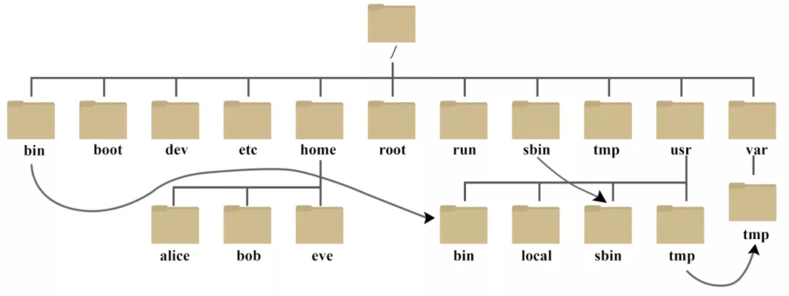

# Linux

## 基本操作

### Linux 的基础知识

`Linux` 是一个开源的操作系统（OS），是一系列 Linux 内核基础上开发的操作系统的总称（常见的有 Ubuntu、centos）。

Linux 系统通常包含以下部分：
- linux 内核（linus 团队管理）
- shell：用户与内核交互的接口
- 文件系统：ext3、ext4等。windows 有 fat32、ntfs
- 第三方应用软件

#### Shell 的基本知识

> shell 是系统的用户界面，提供了用户与内核进行交互操作的一种接口（命令解释器）

Shell 可以执行

- 内部命令
- 应用程序
- shell 脚本

用户输入命令 -> 提交给 Shell - > 是否为内置命令 -> 在系统中查找该命令的文件并调入内存执行 -> 内核中的系统功能调用

使用 `type` 命令可以**区分**内部命令和外部命令。

我们可以利用 Shell 做以下事情：

- 命令行解释器
- 命令的多种执行顺序
- 通配符
- 命令补全、别名机制、命令历史
- 管道（pipes）
- 命令替换（或 $() ）
- Shell 编程语言（Shell Script）

Shell 的主要版本有以下这么多：

- 我们常用的就是 bash（bourne again shell）

  | Bash（Bournce Again Shell） | bash 是大多数 Linux 系统的默认 Shell<br />bash 与 bsh 完全向后兼容，并且在 bsh 的基础上增加和增强了很多特性。<br />bash 也包含了很多 C Shell 和 Korn Shell 中的优点。<br />bash有很灵活和强大的编程接口，同时又有很友好的用户界面。 |
  | --------------------------- | ----------------------------------------------------------------------------------------------------------------------------------------------------------------------------------------------------------------------------------- |
  | Ksh（Korn Shell）           | Korn Shell （ksh）由 Dave Korn 所写。它是 UNIX 系统上的标准 Shell。<br />在 Linux 环境下有一个专门为 Linux 系统编写的 Korn Shell 的扩展版本，即 Public Domain Korn Shell（pdksh）。                                                 |
  | tcsh（csh 的扩展）          | tcsh 是 C Shell 的扩展。tcsh 与 csh 完全向后兼容，但它包含了更多的使用户感觉方便的新特性，其最大的提高是在命令行编辑和历史浏览方面。                                                                                                |

可以使用 `ps` 命令观察正在执行的 shell

```sh
$ ps
  PID TTY           TIME CMD
48775 ttys003    0:00.41 -bash
```

#### Linux 基本目录结构



Linux 文件系统是一个**目录树的结构**，文件系统结构从一个根目录开始，根目录下可以有任意多个文件和子目录，子目录又可以有任意多个文件和子目录

- **bin 存放二进制可执行文件（ls、cat、mkdir 等）**
- boot 存放用于系统引导时使用的各种文件
- dev 用于系统引导时使用的各种文件
- **etc 存放系统配置文件**，比如 hosts
- home 存放所有用户文件的根目录
- lib 存放跟文件系统中的程序运行所需要的共享库及内核模块
- mnt 系统管理员安装临时文件系统的安装点
- **opt 额外安装的可选应用程序包所放置的位置**
- proc 虚拟文件系统，存放当前内存的映射。
- **root 超级用户目录**
- sbin 存放二进制可执行文件，只有 root 才能访问
- tmp 用于存放各种临时的文件
- **usr 用于存放系统应用程序，比较重要的目录 /usr/local 本地管理员软件安装目录**
- **var 用于存放运行时需要改变数据的文件**

#### 命令基本格式

`cmd [options] [arguments]`，options 称为选项，arguments 称为参数

选项和参数都作为 Shell 命令执行时的输入，它们**之间用空格分隔开**。

- Linux 是**区分大小**写的
- 一般来说，后面跟的选项如果**单字符选项**前使用一个减号 `-`。 **单词选项**前使用两个减号 `--`。有些命令还是不归属这种规律的（相对较少）
  - `ls -a` 和 `ls -all` ，都是使用单个 `-`

在 Linux 中，**可执行的文件**也进行了分类：

- **内置命令**：出于效率的考虑，将一些常用命令的解释程序**构造在 Shell 内部**。
- **外置命令**：存放在 /bin、/sbin 目录下的命令。
- **实用程序**：存放在 /usr/bin、/usr/sbin、/usr/share、/usr/local/bin 等目录下的实用程序。
- **用户程序**：用户程序经过编译生成可执行文件后，可作为 Shell 命令运行
- **Shell 脚本**：由 Shell 语言编写的批处理文件，可作为 Shell 命令运行。

#### 通配符

在 Linux 中的通配符：

- *：匹配任何字符和任何数目的字符
- ?：匹配单一数目的任何字符
- []：匹配 [] 之内的任意一个字符
- [!]：匹配除了 [! ] 之外的任意一个字符，! 表示非的意思。

#### 文件的类型

在 Linux 下文件的类型有这么多：

- **普通文件** `-`
- **目录**`d`
- **符号链接**`l`
  - 硬链接：与普通文件没什么不同，inode 都指向同一个文件在硬盘中的区块
  - 软链接：保存了其代表的文件的绝对路径，是另外一种文件，在硬盘上有独立的区块，访问时替换自身路径（简单地理解为 Window 中常见的快捷方式）。
- 字符设备文件 `c`
- 块设备文件 `b`
- 套接字 `s`
- 命名管道 `p`

#### 用户主目录

Linux 是**多用户的网络系统**，所以我们可以在 linux 下创建多个用户，**每个用户都有自己专属的空间**。

- 用户组常用操作命令
  - 添加用户组 groupadd
  - 删除用户组 groupdel
  - 修改用户组信息 groupmod
- 用户组信息查看命令
  - groups 查看用户属于哪些用户组
  - newgrp 切换用户组
  - grpck 用户组配置文件检测
- 用户组管理命令 gpasswd 

### 常用的命令

- find
- grep
- hg
- less
- perl
- sh
- sort
- uniq
- xargs

## Linux 用户管理与操作

Linux 是**多用户的网络系统**

- Linux 允许使用者在 Linux 系统上通过规划不同类型、不同层级的用户，并公平地分配系统资源与工作环境。

- 而与 Windows 系统最大的不同，在于 Linux 允许不同的用户同时登录主机，同时使用主机的资源，因此 Linux 被称为是多用户系统。

### 安装 linux 系统

可以用 mac/window 安装 linux 虚拟机。

### md5sum 命令

md5sum 命令采用 MD5 报文摘要算法（128 位）计算和检查文件的校验和。一般来说，安装了 Linux 后，就会有 md5sum 这个工具，直接在命令行终端直接运行。在 mac 中，工具为 md5。

MD5 算法常常被用来验证网络文件传输的完整性，防止文件被人篡改。MD5 全称是报文摘要算法（Message-Digest Algorithm 5），此算法对任意长度的信息逐位进行计算，产生一个二进制长度为 128 位（十六进制长度就是 32 位）的“指纹”（或称“报文摘要”），不同的文件产生相同的报文摘要的可能性是非常非常之小的。

语法
md5sum(选项)(参数)
选项
-b：二进制模式读取文件；
-t 或--text：把输入的文件作为文本文件看待；
-c：从指定文件中读取 MD5 校验和，并进行校验；
--status：验证成功时不输出任何信息；
-w：当校验不正确时给出警告信息。
参数
文件：指定保存着文件名和校验和的文本文件。

实例
生成一个文件 insert.sql 的 md5 值：

[root@localhost ~]# md5sum insert.sql
bcda6cb5c704664f989703ac5a88f112 insert.sql
检查文件 testfile 是否被修改过：

首先生成 md5 文件：

md5sum testfile > testfile.md5
检查：

md5sum testfile -c testfile.md5
如果文件没有变化，输出应该如下：

forsort: OK
此时，md5sum 命令返回 0。

如果文件发生了变化，输出应该如下：

forsort: FAILED
md5sum: WARNING: 1 of 1 computed checksum did NOT match
此时，md5sum 命令返回非 0。

这里，检查用的文件名随意。如果不想有任何输出，则 md5sum testfile --status -c testfile.md5，这时候通过返回值来检测结果。

检测的时候如果检测文件非法则输出信息的选项:

md5sum -w -c testfile.md5
输出之后，文件异常输出类似如下：

md5sum: testfile.md5: 1: improperly formatted MD5 checksum line
md5sum: testfile.md5: no properly formatted MD5 checksum lines found
这里，testfile.md5 只有一行信息，但是我认为地给它多加了一个字符，导致非法。如果 md5 文件正常那么-w 有没有都一样。

### Linux 文件文件夹的压缩和解压

#### zip 命令

例如：zip -r mysql.zip mysql 该句命令的含义是：将 mysql 文件夹压缩成 mysql.zip

zip -r abcdef.zip abc def.txt 这句命令的意思是将文件夹 abc 和文件 def.txt 压缩成一个压缩包 abcdef.zip

#### unzip 命令

与 zip 命令相反，这是解压命令，用起来很简单。 如：unzip mysql.zip 在当前目录下直接解压 mysql.zip。

#### tar 命令

例如：tar -cvf 123.tar file1 file2 dir1 该句命令实现一个 tar 压缩，它是将两个文件（file1 和 file2）和一个文件夹(dir1)压缩成一个 123.tar 文件。

tar -zxvf apache-tomcat-7.0.75.tar.gz 该命令在解压安装 tomcat 时使用，是将 apache-tomcat.7.0.75.tar.gz 直接解压到当前目录下。tar 同时具有压缩的解压的功能，使用时根据参数和命令结构区分。

#### rar

针对 mac 的话，`brew install unrar`

- [不用压缩软件，Mac 如何一键轻松解压 rar 文件？](https://zhuanlan.zhihu.com/p/39753134)
- [Linux 下解压：tar、rar、7z 命令简单易懂的教程（含实例）](https://blog.csdn.net/AC_huang/article/details/23279641)

### Linux 的规划与安装

#### Linux 是什么

#### 主机规划与磁碟分割

#### 安装 CentOS 7.x 与多重开机技巧

#### 首次登入与线上求助

### Linxu 档案、目录与磁碟格式

### 学习 Shell 与 Shell Scripts

### Linux 使用者管理

### Linux 系统管理员

### 文件权限管理

`sudo chown -R \$(whoami) /usr/local/include /usr/local/lib /usr/local/lib/pkgconfig`

## 附录 Linux 命令

### 目录分布

### 服务器初始化

### 连接远程主机

#### 密钥文件

[PuTTY 的 ppk 密钥与 OpenSSH 密钥之间的相互转换](https://www.jianshu.com/p/7818b3ad1d72)

#### 连接登录

通过密钥文件 `.pem`，否则可能会出现格式不正确的问题。https://hostingwiki.cn/%E8%AE%BE%E7%BD%AE%E5%85%8D%E5%AF%86%E7%A0%81ssh%E5%90%8E%E5%87%BA%E7%8E%B0key_load_public-invalid-format/

```bash
sudo ssh -i 密钥地址 user@服务器地址 -p 端口号
```

查看 tomcat 启动状态

```bash
ps -ef|grep java
```

`ps -ef|grep java` 此条命令具体含义 ps:将某个进程显示出来

-A 　显示所有程序。

-e 　此参数的效果和指定"A"参数相同。

-f 　显示 UID,PPIP,C 与 STIME 栏位。

grep 命令是查找

如果显示以下相似信息，说明 Tomcat 还没有关闭

```bash
root      7010

     1  0 Apr19 ?        00:30:13 /usr/local/java/bin/java
     ....
     ....
     g.apache.catalina.startup.Bootstrap start
```

如果出现以下信息，则表示 Tomcat 已经关闭

```bash
root      7010    1  0 Apr19 ?        00:30:30 [java]
```

### 生成 SSH

```bash
ssh-keygen -t rsa
```

### 把公钥粘贴到服务器面板

```bash
# 打印到命令行上
cat ~/.ssh/id_rsa.pub
```

### 连接服务器

```bash
sudo ssh -i /path/to/id_rsa user@romoteserver # 或者
sudo ssh remoteserver -l name
```

### SSH 连接时出现 Host key verification failed 的原因及解决方法

#### 有关 .ssh/konw_hosts 的值

用`OpenSSH`的人都知`ssh`会把你每个你访问过计算机的公钥(public key)都记录在`~/.ssh/known_hosts`。当下次访问相同计算机时，`OpenSSH`会核对公钥。如果公钥不同，`OpenSSH`会发出警告，避免你受到`DNS Hijack`之类的攻击。
SSH 对主机的 public_key 的检查等级是根据 StrictHostKeyChecking 变量来配置的。默认情况下，

1. 最不安全的级别，当然也没有那么多烦人的提示了，相对安全的内网测试时建议使用。如果连接 server 的 key 在本地不存在，那么就自动添加到文件中（默认是 known_hosts），并且给出一个警告。

```bash
StrictHostKeyChecking=no
```

2. 默认的级别，就是出现刚才的提示了。如果连接和 key 不匹配，给出提示，并拒绝登录。

```bash
StrictHostKeyChecking=ask
```

3. 最安全的级别，如果连接与 key 不匹配，就拒绝连接，不会提示详细信息。

```bash
StrictHostKeyChecking=yes
```

#### 解决方法

- **法一：为了方便，选择最低的安全级别。在.ssh/config（或者/etc/ssh/ssh_config）中配置：**

```bash
StrictHostKeyChecking no
UserKnownHostsFile /dev/null
```

（注：这里为了简便，将 knownhostfile 设为/dev/null，就不保存在 known_hosts 中了）

- **法二：删除对应 ip 的相关 rsa 信息**

```bash
vi ~/.ssh/known_hosts
```

- **法三：删除整个`known_hosts` 文件**

```bash
rm known_hosts
```

### 账户与安全

#### 文件及目录权限

修改文档属性

```bash
(1) chmod
描述：改变文件或目录权限
用法：chmod[选项] 权限 文件或目录
chmod 命令参数中，u 代表文档所有者，g 代表所属组，o 代表所有人。
chmod g+w,o+rw xxxx
```

#### 本地上传文件到远程服务器

### 目录及文件的基本操作

#### ls

描述：显示目录与文件信息
用法：`ls [选项] [文件/目录]`

```bash
ls
ls -a # 显示所有的信息，包括隐藏文件与目录
ls -h # 人性化显示容量信息
ls -d # 显示目录本身的信息，而非目录下的资料信息
ls -l # 长格式显示容量信息
ls -c # 显示文件或目录属性最后修改的时间
ls -u # 显示文件或目录最后被访问的时间
ls -t # 以修改时间排序，默认按文件名称排序
```

#### mv

描述：移动（重命名）文件或目录

```bash
mv hello.txt hello.doc
mv hello.doc /root/
```

#### cp

linux 复制指定目录下的全部文件到另一个目录中
复制指定目录下的全部文件到另一个目录中
文件及目录的复制是经常要用到的。

linux 下进行复制的命令为 cp。

假设复制源目录 为 dir1 ,目标目录为 dir2。怎样才能将 dir1 下所有文件复制到 dir2 下了
如果 dir2 目录不存在，则可以直接使用即可。

```bash
cp -r dir1 dir2
```

如果 dir2 目录已存在，则需要使用

```bash
cp -r dir1/. dir2
```

如果这时使用 cp -r dir1 dir2,则也会将 dir1 目录复制到 dir2 中，明显不符合要求。
ps:dir1、dir2 改成对应的目录路径即可。

```bash
cp -r /home/www/xxx/statics/. /home/www/statics
```

如果存在文件需要先删除

```bash
rm -rf /home/www/statics/*
```

否则会一个个文件提示你确认，使用 cp -rf 也一样提示

---

linux 下 cp 整个文件夹的文件到另一个文件夹
cp -ri A/B/_ A1/B1/ 回车
若复制过程中询问是否覆盖，输入 y 按回车，若不想看到提示直接覆盖使用-rf
另外若 A A1 不在同一目录下，最好填绝对路径，就是/xxx/xxx/A/B/_ /xxx/A1/B1/

实例：

```bash
cp -ri /home/server/tomcat/* /home/server/test/

cp: target `/home/server/test/' is not a directory
```

需要先创建目标文件夹

```bash
mkdir /home/server/test
```

copy 命令的功能是将给出的文件或目录拷贝到另一文件或目录中，同 MSDOS 下的 copy 命令一样，功能十分强大。

语法： `cp [选项] 源文件或目录 目标文件或目录`

说明：该命令把指定的源文件复制到目标文件或把多个源文件复制到目标目录中。

该命令的各选项含义如下：

- a 该选项通常在拷贝目录时使用。它保留链接、文件属性，并递归地拷贝目录，其作用等于 dpR 选项的组合。
- d 拷贝时保留链接。
- f 删除已经存在的目标文件而不提示。
- i 和 f 选项相反，在覆盖目标文件之前将给出提示要求用户确认。回答 y 时目标文件将被覆盖，是交互式拷贝。
- p 此时 cp 除复制源文件的内容外，还将把其修改时间和访问权限也复制到新文件中。
- r 若给出的源文件是一目录文件，此时 cp 将递归复制该目录下所有的子目录和文件。此时目标文件必须为一个目录名。
- l 不作拷贝，只是链接文件。

需要说明的是，为防止用户在不经意的情况下用 cp 命令破坏另一个文件，如用户指定的目标文件名已存在，用 cp 命令拷贝文件后，这个文件就会被新源文件覆盖，因此，建议用户在使用 cp 命令拷贝文件时，最好使用 i 选项。


### 文件查看命令

more 命令

more 命令，功能类似 cat ，cat 命令是将整个文件的内容从上到下显示在屏幕上。 more 命令会一页一页的显示，方便使用者逐页阅读，而最基本的指令就是按空白键（space）往下一页显示，按 b 键就会往回（back）一页显示，而且还有搜寻字串的功能 。more 命令从前向后读取文件，因此在启动时就加载整个文件。
## 参考资料

- [Linux 下如何查看 tomcat 是否启动/系统日志等](https://blog.csdn.net/colin_yu/article/details/77853506)
- [鸟哥的私房菜](http://linux.vbird.org/linux_basic/#part6)
- [spell 库](https://github.com/jsoref/spelling)
- [Linux 下文件（文件夹）的压缩和解压](https://baijiahao.baidu.com/s?id=1640987338729787489&wfr=spider&for=pc)
- [Intro To Linux [For Beginners]](https://dev.to/ishandeveloper/intro-to-linux-for-beginners-g6l?utm_source=digest_mailer&utm_medium=email&utm_campaign=digest_email)
- [如何测试端口通不通(四种方法）](https://blog.csdn.net/swazer_z/article/details/64442730)
- [面试官：说说 linux系统下文件操作常用的命令有哪些？](https://mp.weixin.qq.com/s/Toh6XeoTZr-Oemh0h8CPdg)
- [看完这篇Linux基本的操作就会了](https://zhuanlan.zhihu.com/p/36801617)
- [一篇读懂 Linux 用户管理与操作](https://zhuanlan.zhihu.com/p/105482468)