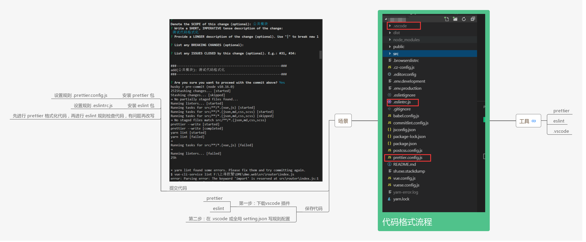

# 前端工程化

目前来说，Web 业务日益复杂化和多元化，前端开发已经由以 WebPage 模式为主转变为以 WebApp 模式为主了。现在随便找个前端项目，都已经不是过去的拼个页面+搞几个 jQuery 插件就能完成的了。工程复杂了就会产生许多问题，比如：如何进行高效的多人协作？如何保证项目的可维护性？如何提高项目的开发质量？...

前端工程化是前端架构中重要的一环，主要就是为了解决上述大部分问题的。而前端工程本质上是软件工程的一种，因此我们应该从软件工程的角度来研究前端工程。那么前端工程化需要考虑哪些因素？前端工程化主要应该从模块化、组件化、规范化、自动化四个方面来思考，下面一一展开。

学习前端工程化的目的在运用，在于实践，要逐步养成运用工程化思想的好习惯。

## 模块化

简单来说，模块化就是将一个大文件拆分成相互依赖的小文件，再进行统一的拼装和加载。只有这样，才有多人协作的可能。

### JS 的模块化

在 ES6 之前，JavaScript 一直没有模块系统，这对开发大型复杂的前端工程造成了巨大的障碍。对此社区制定了一些模块加载方案，如 CommonJS、AMD 和 CMD 等，某些框架也会有自己模块系统，比如 Angular1.x。

现在 ES6 已经在语言层面上规定了模块系统，完全可以取代现有的 CommonJS 和 AMD 规范，而且使用起来相当简洁，并且有静态加载的特性。

规范确定了，然后就是模块的打包和加载问题：

1. 用 Webpack+Babel 将所有模块打包成一个文件同步加载，也可以打成多个 chunk 异步加载；
2. 用 SystemJS+Babel 主要是分模块异步加载；
3. 用浏览器的 `<script type="module">`加载目前 Webpack 远比 SystemJS 流行。

### CSS 的模块化

虽然 SASS、LESS、Stylus 等预处理器实现了 CSS 的文件拆分，但没有解决 CSS 模块化的一个重要问题：选择器的全局污染问题。

**按道理，一个模块化的文件应该要隐藏内部作用域，只暴露少量接口给使用者。**而按照目前预处理器的方式，导入一个 CSS 模块后，已存在的样式有被覆盖的风险。虽然重写样式是 CSS 的一个优势，**但这并不利于多人协作**。

为了避免全局选择器的冲突，各厂都制定了自己的 CSS 命名风格：

- BEM 风格；
- Bootstrap 风格；
- Semantic UI 风格；
  但这毕竟是弱约束。选择器随着项目的增长变得越多越复杂，然后项目组里再来个新人带入自己的风格，就更加混乱了。

所以我很赞同这句话：

> 与其费尽心思地告诉别人要遵守某种规则，以规避某种痛苦，倒不如从工具层面就消灭这种痛苦。

从工具层面，社区又创造出 Shadow DOM、CSS in JS 和 CSS Modules 三种解决方案。

- Shadow DOM 是 WebComponents 的标准。它能解决全局污染问题，但目前很多浏览器不兼容，对我们来说还很久远；
- CSS in JS 是彻底抛弃 CSS，使用 JS 或 JSON 来写样式。这种方法很激进，不能利用现有的 CSS 技术，而且处理伪类等问题比较困难
- CSS Modules 仍然使用 CSS，只是让 JS 来管理依赖。它能够最大化地结合 CSS 生态和 JS 模块化能力，目前来看是最好的解决方案。**Vue 的 scoped style 也算是一种。**

### 资源的模块化

Webpack 的强大之处不仅仅在于它统一了 JS 的各种模块系统，取代了 Browserify、RequireJS、SeaJS 的工作。更重要的是它的万能模块加载理念，即所有的资源都可以且也应该模块化。

资源模块化后，有三个好处：

- 依赖关系单一化。所有 CSS 和图片等资源的依赖关系统一走 JS 路线，无需额外处理 CSS 预处理器的依赖关系，也不需处理代码迁移时的图片合并、字体图片等路径问题；
- 资源处理集成化。现在可以用 loader 对各种资源做各种事情，比如复杂的 vue-loader 等等。
- 项目结构清晰化。使用 Webpack 后，你的项目结构总可以表示成这样的函数：
  `dest = webpack(src, config)`

### Webpack sourceMap 的作用

## 组件化

首先，组件化 ≠ 模块化。好多人对这两个概念有些混淆。

模块化只是在文件层面上，对代码或资源的拆分；而组件化是在设计层面上，对 UI（用户界面）的拆分。

从 UI 拆分下来的**每个包含模板(HTML)+样式(CSS)+逻辑(JS)功能完备的结构单元**（比如 .vue 文件），我们称之为组件。

其实，组件化更重要的是一种**分治思想**。

> Keep Simple. Everything can be a component

这句话就是说页面上所有的东西都是组件。页面是个大型组件，可以拆成若干个中型组件，然后中型组件还可以再拆，拆成若干个小型组件，小型组件也可以再拆，直到拆成 DOM 元素为止。DOM 元素可以看成是浏览器自身的组件，作为组件的基本单元。<u>传统前端框架/类库的思想是先组织 DOM，然后把某些可复用的逻辑封装成组件来操作 DOM，是 DOM 优先；而组件化框架/类库的思想是先来构思组件，然后用 DOM 这种基本单元结合相应逻辑来实现组件，是组件优先。这是两者本质的区别。</u>

其次，组件化实际上是一种按照模板(HTML)+样式(CSS)+逻辑(JS)三位一体的形式对**面向对象的进一步抽象。**

所以我们除了封装组件本身，还要合理处理组件之间的关系，比如（逻辑）继承、（样式）扩展、（模板）嵌套和包含等，这些关系都可以归为**依赖**。

其实组件化不是什么新鲜的东西，以前的客户端框架，像 WinForm、WPF、Android 等，它们从诞生的那天起就是组件化的。而前端领域发展曲折，是从展示页面为主的 WebPage 模式走过来的，近两年才从客户端框架经验中引入了组件化思想。**其实我们很多前端工程化的问题都可以从客户端那里寻求解决方案**。

目前市面上的组件化框架很多，主要的有 Vue、React、Angular。

## 规范化

**模块化和组件化确定了开发模型，而这些东西的实现就需要规范去落实。**

规范化其实是工程化中很重要的一个部分，项目初期规范制定的好坏会直接影响到后期的开发质量。

我能想到的有以下一些内容：

- 目录结构的制定
- 编码规范
- 前后端接口规范
- 文档规范
- 组件管理
- Git 分支管理
- Commit 描述规范
- **定期 CodeReview**
- 视觉图标规范
- ...

其中编码规范最好采取 ESLint 和 StyleLint 等强制措施，配置 git hooks 可以实现 Lint 不过不能提交代码等机制，因为人是靠不住的。

### 使用 ESLint + Prettier 统一代码风格



> 参考资料：https://juejin.im/post/5b27a326e51d45588a7dac57

#### 三、配置 husky 和 lint-staged

由于直接使用 prettier 进行代码格式化仍存在一些弊端，例如：

一次性对所有文件进行格式化，如果是项目中途加入 prettier，会对一些早已经编写完成的代码进行格式化，可能会造成冲突或者一些不可预知的问题，降低项目稳定性。

每次都要键入 npm run format 进行代码格式化，多了额外的操作，开发体验不良好。

故此，我们可以修改代码格式化的时机，仅对本次提交的代码进行格式化，并且在代码提交之前进行格式化，确保存入仓库的代码都是格式化后的良好的代码。

- husky 是一款可以帮助我们使用 git hooks 的第三方库，可以根据 package.json 文件里定义的钩子和钩子执行的命令将要执行的操作写对应的钩子脚本里。

- lint-staged，官方说明是一款可以对 git 提交的代码使用 linter 的第三方库，其依赖于 husky 使用 git hooks。此处我们不仅仅可以利用其调用 linters，还可以调用 prettier 对代码进行格式化。

```json
{
  "husky": {
    "pre-commit": "lint-staged",
    "pre-push": "yarn test:unit"
  },
  "lint-staged": {
    "src/**/*.{vue,ts,scss}": ["prettier --write", "yarn lint", "git add"]
  }
}
```

## 自动化

作为一个优秀的程序员，需要秉持的一个理念是：

> 任何简单机械的重复劳动都应该让机器去完成。

所以，前端工程化的很多脏活累活都应该交给自动化工具来完成。

### 图标合并

- 不要再用 PS 拼雪碧图了，统一走 Webpack 吧；
- 不要再用 Icomoon 了，统一走 Webpack 吧。

### 利用 require.context 遍历目录所有图片

### 脚本自动加载 Vue 全局组件

### webpack require.context() 自动化

你还可以通过 require.context() 函数来创建自己的 context。

可以给这个函数传入三个参数：一个要搜索的目录，一个标记表示是否还搜索其子目录， 以及一个匹配文件的正则表达式。

```js
require.context(directory, (useSubdirectories = false), (regExp = /^\.\//));
```

demo

```js
require.context("./test", false, /\.test\.js$/);
// （创建出）一个 context，其中文件来自 test 目录，request 以 `.test.js` 结尾。
require.context("../", true, /\.stories\.js$/);
// （创建出）一个 context，其中所有文件都来自父文件夹及其所有子级文件夹，request 以 `.stories.js` 结尾。
```

### nodejs

文件下既有 ts 文件，又有 js 文件，所以需要针对这些文件打包时要进行对应的配置信息，之前是一个个手动敲的，我觉得这些完全可以写个工具自动生成

扫描文件夹 -》生成 rollup.config.js =》npm script

扫描文件夹，可以用 nodejs 读取文件夹的 api，和 webpack require.context 类似，但是比 require.context 强大，生成 rollup.config.js 其实也很简单，就是动态生成 js 字符串，然后写入到 js 文件里面去就 ok 了

### 持续集成

### 自动化构建

### 自动化部署

### 自动化测试

- [前端自动化测试](https://jecyu.github.io/Fe-Auto-Testing/)

## 项目实战

## 参考资料

- [谁能介绍下 web 前端工程化？](https://www.zhihu.com/question/24558375)
- [Vue 项目使用 eslint + prettier 规范代码风格](https://juejin.im/post/5b79a52651882543025ac6d7#heading-7)
