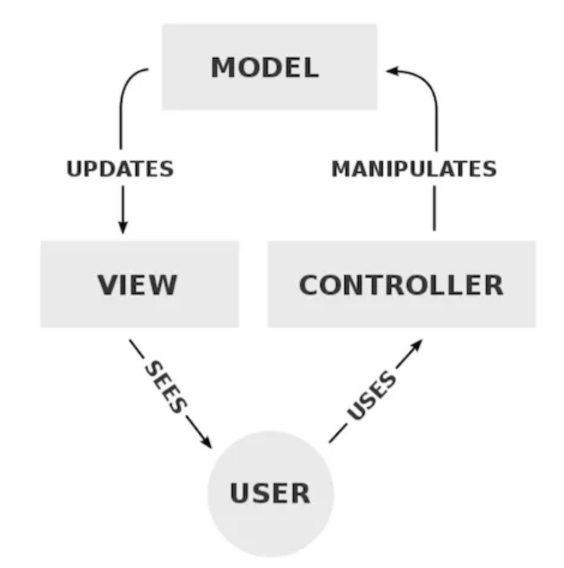

# 前端架构

## MV\*

一个组件的角度：
可以在一个组件里使用，当这个组件足够复杂时，可以把 `Model`，`View`，`Controller` 拆分成多个文件。

一个系统的角度：

## 领域驱动设计在前端中的应用

- 参考资料

- [透过现象看本质: 常见的前端架构风格和案例](https://mp.weixin.qq.com/s/m_twmahOfn2TuZpUbjndHA) --很全面的前端架构思想整理，从分层到微前端都有，至少在学习一些框架的时候能够快速理解背后的思想。
- [大型项目前端架构浅谈（8000 字原创）](https://juejin.im/post/5cea1f705188250640005472)
- [if 我是前端团队 Leader，怎么制定前端协作规范?](https://juejin.im/post/5d3a7134f265da1b5d57f1ed#heading-5) 项目规范
