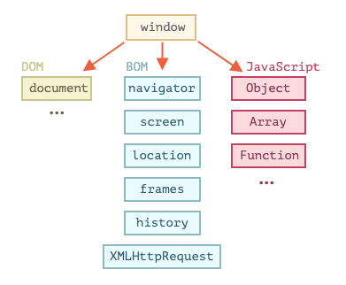

# 浏览器&HTML 基础

## 浏览器：文档，事件，接口

### Document

#### 浏览器环境，规格

有一个叫做 window 的“根”对象。它有两个角色：

首先，它是 JavaScript 代码的全局对象
其次，它代表“浏览器窗口”，并提供了控制它的方法

**文档对象模型（DOM）**

文档对象模型（Document Object Model），简称 DOM，将所有也没内容表示为可以修改的对象。

> *DOM 不仅仅用于浏览器*
> DOM 规范解释了文档的结构，并提供了操作文档的对象。有的非浏览器也使用 DOM。例如，下载 HTML 文件并对其进行处理的服务端脚本也可以使用 DOM。但它们可能仅支持部分规范中的内容。（比如在 nodejs 环境对一些前端组件进行 DOM 的测试）

> *用于样式的 CSSOM*
> 针对 CSS 规则和样式表的规范 [CSS Object Model (CSSOM)](https://www.w3.org/TR/cssom-1/)，这份规范解释了如何将 CSS 表示为对象，以及如何读写这些对象。CSSOM 和 DOM 是一起使用的，可以通过 JavaScript 或 CSS 类修改稿修改文档样式。

**浏览器对象模型（BOM）**

### 节点属性：type、tag 和 content
每个 DOM 节点都属于一个特定的类。这些类形成层次结构（hierarchy）。完整的属性和方法集是继承的结果。

主要的 DOM 节点属性有：

nodeType
我们可以使用它来查看节点是文本节点还是元素节点。它具有一个数值型值（numeric value）：1 表示元素，3 表示文本节点，其他一些则代表其他节点类型。只读。
nodeName/tagName
用于元素名，标签名（除了 XML 模式，都要大写）。对于非元素节点，nodeName 描述了它是什么。只读。
innerHTML
元素的 HTML 内容。可以被修改。
outerHTML
元素的完整 HTML。对 elem.outerHTML 的写入操作不会触及 elem 本身。而是在外部上下文中将其替换为新的 HTML。
nodeValue/data
非元素节点（文本、注释）的内容。两者几乎一样，我们通常使用 data。可以被修改。
textContent
元素内的文本：HTML 减去所有 <tags>。写入文本会将文本放入元素内，所有特殊字符和标签均被视为文本。可以安全地插入用户生成的文本，并防止不必要的 HTML 插入。
hidden
当被设置为 true 时，执行与 CSS display:none 相同的事。

## 网络请求

### XMLHttpRequest