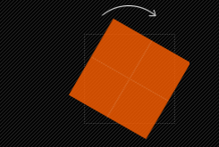

#   CSS 项目实战总结（持续更新）

#### normalize.css 与 reset.css 又何区别

- [normalize.css](https://github.com/necolas/normalize.css/blob/master/normalize.css): 会保留有用的样式，比如 h1 的字体大小

- [reset.css](https://github.com/jgthms/minireset.css/blob/master/minireset.css): 把所有样式都重置，比如 h1、h2、h3 的字体大小都进行了重置，保持了无样式

## 流、元素与基本尺寸

### 块级元素

### 内联元素

#### css font-size = 0 的妙用

有些时候，会不小敲一个空格，或者是为了排版漂亮加了空格。而空格是作为一个字符出现的。

 `inline`（`a`标签默认是display:inline） 和 `inline-block` (`.list-info` 设置的是 display:inline-block) 是内联布局，既然是内联那么就会受空白区域的影响。

解决方法：
1、给父元素设置font-size：0px；
2、取消掉换行符，如这样：<span>aaaa</span><span>aaaa</span><span>aaaa</span>连续。

```css
.devui-calendar {
  display: inline-block;
  text-align: center;
  font-size: 0; // 去除内联布局代码换行的空格影响
  &-sidebar {
    display: inline-block;
  }

  &-main {
    display: inline-block;
    font-size: 12px;
  }
}
```

**参考资料**

- [css font-size=0有什么妙用？](https://segmentfault.com/q/1010000008628181)

#### 内联盒模型

#### line-height

对于文本这样的纯内联元素，line-height 就是高度计算的基石。

#### vertical-align

- 线类，如 baseline、top、middle、bottom
- 文本类，如 text-top、text-bottom
- 上标下标类，如 sub、super
- 数值百分比类，如 20px、2em、20%等

## 字体排印

### 一行文本溢出

```scss
@mixin oneline {
  white-space: nowrap;
  overflow: hidden;
  text-overflow: ellipsis;
}
```

### 多行文本溢出

```scss
@mixin line-clamp($line: 2) {
  display: -webkit-box;
  word-break: break-all;
  text-overflow: ellispis;
  -webkit-line-clamp: $line;
  -webkit-box-orient: vertical;
}
```

## 结构与布局

### Flex

#### flex-basic

**flex-basis** 设置的是**元素在主轴上的初始尺寸**，**是 Flex 项目放入 Flex 容器之前的尺寸**，这是 Flex 项目的理想或者说假想尺寸。

有以下公式：

> content -> width -> flex-basis（受到 max|min-width 的制约）

- **最终尺寸**（final flex-basis）会受 `min-width` 和 `max-width` 属性限制。

- 如果未指定 `flex-basis`，`flex-basis` 将回退到 `width` 属性。如果未指定 `width` 属性，`flex-basis` 将回退到基于 Flex 项目内容的计算宽度值（computed width）。
- 最佳实践是使用 `flex-basis` 而非 `width` 或 `height`。特别是，Safari 浏览器上还有一个古老的 bug：在使用了 `height` 而非 `flex-basis` 属性的 Flex 项目上 `felx-shrink` 属性不会生效。

在 `flex-basis` 未指定的情况下，`width` 是它的回退方案，`min-width` 和 `max-width` 是限制了最终 尺寸的上限和下限。

而当 `flex-direction` 为 `column` 或 `column-reverse` 的时候，那就是 `flex-basis` 跟 `height` 的关系了。

**当空间不够的时候**

Flex 项目开始收缩以适应容器空间（变为每个 `125px`）。`flex-shrink` 用于控制收缩比例。可以通过给 `flex-shrink` 指定一个更大或更小的值来控制收缩的程度，甚至可以设置为 `0`，表示不许收缩

**当有剩余空间的时候**

我们可以指定我们的 Flex 项目在放入 Flex 容器之后伸展，来占据剩余空间，这是通过 `flex-grow` 属性控制的，此属性默认为 `0`，表示不会伸展。下例中，我们为每个 Flex 项目都设置了 `flex-grow: 1`（以相同比例伸展）来占据剩余空间。

- 剩余空间：x
- 假设有三个flex item元素，flex-grow 的值分别为a, b, c
- 每个元素可以分配的剩余空间为： a/(a+b+c) * x，b/(a+b+c) * x，c/(a+b+c) * x，这个公式的前提下是 flex-basic 为 0%，否则上面的公式还要加上元素初始尺寸的考虑。（初始尺寸越大的占比瓜分也越大）

**参考资料**

- [width 与 flex-basis 的区别](https://juejin.cn/post/6844903914148462599)
- [深入理解 flex-grow、flex-shrink、flex-basis](https://juejin.cn/post/6844904016439148551)

#### 均分布局


### Overflow

在 CSS 中的 `overflow` 主要作用是用来描述一个扩展到该框的边缘，即**内容边缘、填充边缘、边框边缘和外距边缘。**简单地来说就是如何用来控制溢出，从而不让溢出的内容来影响其他元素的布局。从规范中看（[**Level 3**](https://www.w3.org/TR/css-overflow-3/) 和 [**Level 4**](https://www.w3.org/TR/css-overflow-4/)），`overflow` 主要分为两种类型：**墨水溢出（lnk overflow）和可滚动的溢出（Scrollable overflow）**。

#### 墨水溢出

默认溢出的盒子是盒子的一部分，它的内容创造了一个视觉浆果以外的盒子的边框（border-box）。墨水溢出是绘画（Painting）的溢出，主要用来定义不影响布局或其他方式扩展滚动溢出（Scrollable overflow），比如 `box-shadow`、`border-image`、`text-decoration`和 `outline` 等。

#### 可滚动溢出

可滚动溢出（Scrollable Overflow）与墨水溢出相似，也有框的概念。滚动框的可滚动溢出是扩展到该矿的 `padding` 边缘之外的一组内容，需要为其提供滚动机制。

#### Overflow 模块属性的划分

- 用于控制盒子可滚动或剪切的属性：`overflow`、`overflow-x` 和`overflow-y`
- 流相关的属性：`overflow-block` 和 `ovrflow-inline`。
- 文本溢出（溢出省略号）属性 `text-overflow` 和指示块轴溢出属性 `block-overflow`。
- 分割溢出（Fragmenting Overflow）属性：`line-clamp`、`max-lines` 和 `continue`。

#### 滚动和剪切溢出属性

`overflow` 、`overflow-x` 和 `overflow-y` 是我们最熟悉，也最常用的溢出属性，这些属性可以指定容器中溢出的内容如何展示，是直接溢出容器，还是剪切溢出容器的内容，还是容器出现滚动条让溢出的内容在容器中显示。这三个属性都接受下面几个属性值：

- `visible`：默认值。溢出容器的内容不会被剪切，将溢出容器框之外。
- `hidden`：溢出容器的内容将被剪切，并且容器不会出现滚动条。
- `scroll`：内容是否溢出，容器都会出现滚动条，溢出的内容会被容器剪切，但可以通过滚动条来查看被溢出的内容。
- `auto`：取决于用户代理。如果内容适合填充框内部，则看起来与可见内容相同，但仍然会建立新的块格式化上下文。如果内容溢出，其行为和 `scroll`  类似。
- `inherit`：继承父元素的溢出属性。

其中 `overflow` 是 `overflow-x` 和 `overflow-y` 的简写属性。

**参考资料**

- [你所不知道的CSS Overflow Module](https://www.w3cplus.com/css/css-overflow-module.html?expire=1631527152&code=Z17mR4kj1Zk&sign=aec16d874ff18ed90dc61d7c0a8a25ad#paywall)

### Position

#### 什么时候才需要用 relative 处理 absolute 

**absolute元素的父元素并没有设置position属性，而其祖父元素设置了position属性，absolute元素则相对祖父元素进行移动**。最多到祖元素。待测试。

position css 属性设置元素在文档中的定位方式，top、right、left、bottom 决定了定位元素的最终位置。

- position：static | relative | absolute | fixed | center | page | sticky
  默认值：static，center、page、sticky是CSS3中新增加的值。

如何用

- static： 元素根据文档的正常流进行定位。top、right、bottom、left 和 z-index 属性不起作用。
- relative： 相对定位，对象遵循常规流，
  - 参照自身在常规流中的位置通过 top，right，bottom，left这4个定位偏移属性
  - 进行偏移时不会影响常规流中的任何元素。
- absolute 绝对定位，对象脱离常规流，
  - 偏移属性参照的是，**如果上上层的元素设置了 relative 会不会被影响？？？**会不会参照上上层定位
  - 盒子的偏移位置不影响常规流中的任何元素，其 margin 不与其他任何 margin 折叠。
- fixed ：元素从正常文档流中移除，不会在页面布局汇总为该元素创建空间。
  - **相对于 viewport 初始包含块定位，如果它的父容器设置了 `transform` 、`perspective`、`filter` 等属性值为非默认值的情况下，则相对于父容器。**
  - 当出现滚动条时，对象不会随着滚动。
- center： 与absolute一致，但偏移定位是以定位祖先元素的中心点为参考。盒子在其包含容器垂直水平居中。
- **page**：与absolute一致。元素在分页媒体或者区域块内，元素的包含块始终是初始包含块，否则取决于每个absolute模式
- sticky 对象在常态时遵循常规流。
  - 它就像是relative和fixed的合体，当在屏幕中时按常规流排版，当卷动到屏幕外时则表现如fixed。
  - 该属性的表现是现实中你见到的吸附效果

#### absolute

#### fixed 固定定位

#### 居中 

如果是居中文字，比如按钮之类的效果，可以不使用 flex，不给元素设置宽高，而是由文字撑开高度和宽度，并设置一定的 padding 即可。

这样可能没有直接设置宽高与设计稿精度一致。也可以，按照设计稿的 padding 也行。 需要结合 height。看情况处理。

## 过渡与动画

### 进度条

#### 圆环

### loading

#### 圆环

### CSS3 Transform

Transform 字面上就是变形，改变的意思。在 CSS3 中 transform 主要包括以下几种：**旋转 rotate**、**扭曲 skew**、**缩放 scale**和**移动 translate**以及**矩阵变形matrix**。

**语法**

```css
transform ： none | <transform-function> [ <transform-function> ]* 
/* 也就是：*/
transform: rotate | scale | skew | translate |matrix;
```

- `none`：表示不进行变换
- `<transform-funciton>`表示一个或多个变换函数，以空格分开；换句话说就是我们同时对一个元素进行 transform 的多种属性操作，例如 rotate、scale、translate 三种，但这里需要提醒大家的，以往我们叠加效果都是用逗号（“，”）隔开，但 transform 中使用多个属性时却需要有空格隔开。

#### 旋转 rotate

rotate(<angle)：通过指定的角度参数对原元素指定一个 2D rotation（2D 旋转 ），需先有 transform-origin 属性的定义。transform-origin 定义的是旋转的基点，其中 angle 是指旋转角度。如果设置的值为正数表示顺时针旋转，如果设置的值为负数，则表示逆时针旋转。如：transform: rotate(30deg)：



#### 改变元素基点 transform-origin

元素默认基点就是其中心位置，换句话说我们没有使用 `transform-origin` 改变元素基点位置的情况下，transform 进行的 rotate、translate、scale、skew、matrix 都等操作都是以元素自己中心位置进行变化的。但有时候我们需要在不同的位置对元素进行这些操作，那么我们就可以使用 transform-origin 来对元素进行基点位置改变，使元素基点不是在中心位置，以达到你需要的基点位置。

`transform-origin(X, Y)`：用来设置元素的运动的基点（参照点）。默认点是元素的中心点，其中 X 和 Y 的值可以是百分值，em、px，其中 X 也可以是字符参数值 left，center，right；Y 和 X 一样除了百分比还可以设置字符值 top、center、bottom，这样看上去有点像 `background-position` 设置一样。

1. top left | left top 等价于 0 0 | 0% 0%

2. top | top center | center top 等价于 50% 0

3. right top | top right 等价于 100% 0

4. left | left center | center left 等价于 0 50% | 0% 50%

5. center | center center 等价于 50% 50%（默认值）

6. right | right center | center right 等价于 100% 50%

7. bottom left | left bottom 等价于 0 100% | 0% 100%

8. bottom | bottom center | center bottom 等价于 50% 100%

9. bottom right | right bottom 等价于 100% 100%

参考资料：

- [CSS3 Transform](https://www.w3cplus.com/content/css3-transform?expire=1636865721&code=yXyM4uZPKOc&sign=239979c3280c5fa7265c867733527292#paywall)

### 获取滚动条宽度

### 一个元素的高度由哪些属性影响

自身的值
继承的值

### 盒子尺寸四大家族

#### margin 属性

##### margin 缩写

CSS样式上下、左右、上下左右缩写简写优化

一、记忆要领：
 上(top)
 左(left)                右(right)
 下(bottom)
 按照上面图形：顺时针排序
 即为 margin: top   right  bottom  left

二、举例说明

1. top   right  bottom  left（值都不同）
    margin-top: 10px;
    margin-right: 20px;
    margin-bottom:30px;
    margin-left: 40px;
    缩写：margin:10px  20px 30px 40px;
2. top   right  bottom  left（值相同）
    margin-top: 10px;
    margin-right: 10px;
    margin-bottom:10px;
    margin-left: 10px;
    缩写：margin:10px;
3. top   right  bottom  left   （right   left  值相同 ）
    margin-top: 10px;
    margin-right: 20px;
    margin-bottom:30px;
    margin-left: 20px;
    缩写：margin:10px 20px 30px;
    附加：
    原始：margin-top:5px; margin-bottom:6px; margin-left:4px
    缩写：margin:5px 0 6px 4px或margin:5px auto 6px 4px
4. top   right  bottom  left   （top   bottom  值相同 无）
    margin-top: 10px;
    margin-right: 20px;
    margin-bottom:10px;
    margin-left:30px;
    缩写：margin:10px 20px 30px;
    说明：应该没有此类缩写，上下一样有点不可实现上下一样的话就是垂直居中了对吧？不然和第3点缩写后都是3个值，看不出来是左右相同还是上下相同的缩写
    有不对的地方欢迎大家指正！
5. top   right  bottom  left   （top 和bottom 值相同，right  和left   值相同 ）
    margin-top: 10px;
    margin-right: 20px;
    margin-bottom:10px;
    margin-left:20px;
    缩写：margin:10px 20px;
    附加：
    margin:0 auto;横向居中；   （上下为0，左右自动，则水平居中）
    margin：auto 0；纵向居中；（左右为0，上下为0，则垂直居中

padding的距离设置缩写同理哦


作者：一笑倾城Tan
链接：https://www.jianshu.com/p/cd14bbb3748a
来源：简书
著作权归作者所有。商业转载请联系作者获得授权，非商业转载请注明出处。

##### margin 负值

我们可以给父容器添加 margin 属性，增加容器的可用宽度来实现。

```html
<!DOCTYPE html>
<html lang="en">
  <head>
    <meta charset="UTF-8" />
    <meta name="viewport" content="width=device-width, initial-scale=1.0" />
    <title>Document</title>
    <style>
      .container {
        margin: 0 auto;
        width: 500px;
        border: 1px #ccc solid;
      }
      ul {
        overflow: hidden;
        margin-right: -10px; 
        padding: 0;
      }
      ul > li {
        width: 92px;
        height: 92px;
        background-color: #ccc;
        float: left;
        margin-right: 10px;
        list-style: none;
      }
    </style>
  </head>
  <body>
    <div class="container">
      <ul>
        <li>我是一个列表</li>
        <li>我是一个列表</li>
        <li>我是一个列表</li>
        <li>我是一个列表</li>
        <li>我是一个列表</li>
      </ul>
    </div>
  </body>
</html>

```

此时的 `<ul>` 的宽度相当于 `100% + 10px` ，于是最后一个 li 标签的 `margin-right: 10px` 就多了 10 像素的使用空间，正好列表的右边缘就是父级 `ul` 容器 100% 宽度位置，两端对齐的效果就实现了。

### transition

盒子模型需要满足 block 属性才可以生效
```css
.box {
  /* display: block */
  display: inline-block; 
}
```

- [“更多|收起”交互中渐进使用transition动画](https://www.zhangxinxu.com/wordpress/2012/10/more-display-show-hide-tranisition/) —— 张鑫旭大大的折叠收起

### box-sizing 属性用来定义 user agent 如何计算元素的总宽度和总高度

- content-box，即是默认值。如果你设置一个元素的`width`为 100px，那么这个元素的内容会有 100px 宽，并且任何`border`和`padding`都会被增加到最后绘制出来的元素宽度中。
- border-box：告诉浏览器，你想要设置的`border`和`padding`的值是包含在`width`内。内容区实际的宽度是`content= width -(padding + border)`。

注意的是 `border-box` 是不包括 `margin`的。
一般情况下，我们会在全局设置 `box-sizing` 值为 `border-box`；这样在处理元素大小的时候方便得多，也避免了在布局内容时可能遇到的坑。

### 统一字体

采用 CSS3 的 @font-face 属性解决。
一般情况下电脑系统上的字体能够满足我们的基本需求，但往往还是会出现例外：客户电脑不支持我们整个网页设计的标准字体，这时最好的办法是在线下载，生成支持我们设定的字体。CSS3的 @font-face 就能帮助我们利用服务器端字体，达到支持设定字体的需求：（此处用区别较大的字体显示是否成功在线加载）
```css
@font-face: {
  font-family: 'custom-font',
  src: local('custom-font') url('xxxx/xxx.tff')
}
body {
  font-family: 'custom-font'
}
```
@font-face 中的font-family 相当于一个声明的效果，这里指定的字体是将会被用于 font 或 font-family 属性中，也就是说，当我们需要自定义一个字体时，是需要在这里声明一次，才能继续在 body 里的 fong-family 使用， 否则它还是一个系统找不到的字体。

### html css 文字过多用省略号代替，当鼠标 hover 时显示全部的文字

方案一：默认使用省略号，再加上 title 属性显示完全
缺点：反应不够灵敏
```css
.dgp-widget-right-sidebar .project-query-content .result-list .item .header {
  white-space: nowrap;
  text-overflow:ellipsis;
  overflow: hidden;
}
```

方案二：满足要求
```css
.dgp-widget-right-sidebar .project-query-content .result-list .item .header {
  white-space: nowrap;
  text-overflow:ellipsis;
  overflow: hidden;
}
.dgp-widget-right-sidebar .project-query-content .result-list .item .header:hover {
  text-overflow:inherit;
  overflow: visible;
  white-space: pre-line;
}
```

### Grid 布局（以 antd-design 为例）

## 视觉与效果

### 形状

mask 是 mask-image、mask-mode 等的属性缩写。

参考资料：

- [CSS 实现优惠券的技巧](https://juejin.cn/post/6945023989555134494)

### 绘制三角形

1. 向上的三角形

```scss
.top {
    width: 0;
    height: 0;
    border-width: 10px;
    border-color: transparent;
    border-bottom-color: blue;
    border-style: solid;
}
```

2. 向下的三角形

```scss
.bottom {
    width: 0;
    height: 0;
    border-width: 10px;
    border-color: transparent;
    border-top-color: blue;
    border-style: solid;
}
```

3. 向左的三角形
```scss
.left {
    width: 0;
    height: 0;
    border-width: 10px;
    border-color: transparent;
    border-left-color: blue;
    border-style: solid;
}
```
4. 向右的三角形
```scss

.right {
   width: 0;
   height: 0;
   border-width: 10px;
   border-color: transparent;
   border-right-color: blue;
   border-style: solid;
  }
```
- [用CSS绘制三角形](https://segmentfault.com/a/1190000002783179)

### 对链接应用样式

- 基于层叠对链接选择器进行排序
- 创建样式特殊的链接下划线
- 使用属性选择器对外部链接应用样式
- 使链接表现得像按钮
- 创建已访问链接样式
- 创建纯 CSS 的工具提示

#### 简单的链接样式

对链接应用样式最容易的方式是使用锚类型选择器。例如，以下规则使所有锚显示为红色：

```css
a { color: red; }
```

但是，锚可以作为内部引用，也可以作为外部链接，所以使用类型选择器不总是理想的。例如，下面的第一个锚包含一个片段标识符，当用户单击这个锚时，页面将跳到第二个锚的位置：

```html
<p>
  <a href="#mainContent">Skip to main content</a>
...  
</p>
<h1>
  <a name="mainContent">Welcome</a>
</h1>
```

虽然只想让真正的链接变成红色，但是标题的内容也成了红色的。为了避免这个问题，CSS 提供了两个特殊的选择器，称为链接伪类选择器。`:link` 伪类选择器用来寻找没有被访问过的链接，`:visited` 伪类选择器用来寻找被访问过的链接。所以，在下面的示例中，所有没有被访问过的链接将是蓝色的，所有被访问过的链接将是绿色的：

```css
a:link { color: blue; } /* Makes unvisited links blue */
a:visited { color: green; } /* Makes visited links green */
```

可以用来对链接应用样式的另外两个选择器是 `:hover` 和 `:active` 动态伪类选择器。`:hover` 动态伪类选择器用来寻找鼠标停留处的元素，`:active` 动态伪类选择器用来寻找被激活的元素。对于链接来说，激活发生在链接被单击时。

所以在下面的示例中，当鼠标停留在链接上或单击链接时链接将变成红色：

```css
a:hover, a:active {
  color: red;
}
```

大多数人最初使用这些选择器的目的之一是去掉链接的下划线，然后在鼠标停留在链接上或单击链接时打开下划线。实现的方法是将未访问和已访问的链接的 text-decoration 属性设置为 none，将鼠标停留和激活的链接的 text-decoration 属性设置为 underline：

```css
a:link, a:visited { text-decoration: none; } 
a:hover, a:active { text-decoration: underline; }
```

在前面的示例中，选择器的次序非常重要。如果次序反过来，鼠标停留和激活样式就不起作用了：

```css
a:hover, a:active { text-decoration: underline; }
a:link, a:visited { text-decoration: none; }
```

这是由层叠造成的。当两个规则具有相同的特殊性时，后定义的规则优先。在这个示例中，两个规则具有相同的特殊性，所有 `:link` 和 `:visited` 样式将覆盖 `:hover` 和 `:active` 样式。为了确保不会发生这种情况，最好按照以下次序应用链接样式：

```css
a:link, a:visited, a:hover, a:active
```

记住这个次序的简单方法是记住 LoVe:HAte，其中 L 代表 link，V 代表 visited，H 代表 hover，A 代表 active。

面包屑组件应用：


The **`:focus`** [CSS](dfile:///Users/kayliang/Library/Application Support/Dash/DocSets/CSS/CSS.docset/Contents/Resources/Documents/developer.mozilla.org/en-US/docs/Web/CSS.html) [pseudo-class](dfile:///Users/kayliang/Library/Application Support/Dash/DocSets/CSS/CSS.docset/Contents/Resources/Documents/developer.mozilla.org/en-US/docs/Web/CSS/Pseudo-classes.html) represents an element (such as a form input) that has received focus. It is generally triggered when the user clicks or taps on an element or selects it with the keyboard's Tab key.

```css
/* Selects any <input> when focused */
input:focus {
  color: red;
}
```

**参考资料**

- 《精通 CSS》

## 项目实战

### CSS Module

- Vue scoped 属性解决样式命名冲突的问题

没有使用嵌套选择器来处理，跟 vue scoped 很不同，不太习惯。需要一定的编写规范。

只会对类名和 id 进行 hash 转换。

css module 本身就是扁平化的处理，不需要通过嵌套来解决命名冲突的问题。

- 解决全局命名冲突问题 css modules 只关心组件本身 命名唯一
- 模块化 可以使用 composes 来引入自身模块中的样式以及另一个模块的样式
- 解决嵌套层次过深的问题 使用扁平化的类名

不需要像 Vue scoped 那样嵌套，Vue scoped 通过添加 data 属性来处理。

**1）css预处理器（less/sass） 支持模块引入**

```
存在问题：不能解决全局样式冲突问题
```

**（2）BEM（Block Element Modifier）解决命名冲突以及更好的语义化**

- Block：逻辑和页面功能都独立的页面组件，是一个可复用单元，特点如下：
  - 可以随意嵌套组合
  - 可以放在任意页面的任何位置，不影响功能和外观
  - 可复用，界面可以有任意多个相同Block的实例
- Element：Block的组成部分，依赖Block存在（出了Block就不能用）
- [可选]定义Block和Element的外观及行为，就像HTML属性一样，能让同一种Block看起来不一样

------

- **存在问题：对于嵌套过深的层次在命名上会给需要语义化体现的元素造成很大的困难 对于多人协作上，需要统一命名规范，这同样也会造成额外的effort**

Vue scope，里面子元素还是需要嵌套来区分应用范围。也就是进一步的处理。

```scss
<style lang="scss" scoped>
.svg-icon {
  vertical-align: -0.125em;
  line-height: 0;
  display: inline-block;
}
</style>
```

需要探索 Buttons 的元子处理。


## 最佳实践

## 总结

## 参考资料

- 书籍文档
  - 《CSS 权威指南》
  - 《精通 CSS 高级 Web 标准解决方案》
  - 《CSS 世界》
  - 《CSS 揭秘》
  - W3C CSS 规范 https://www.w3.org/TR/?tag=css&version=latest
- 网站
  - CSS-Tricks
  - Dev.to
  - Smashing Mane
  - CSS Weekly
  - SitePoint
  - 张鑫旭 老师的鑫空间，鑫生活
  - chokcoco 老师的 爱CSS（ICSS）
  - **MDN 网站**
  - **https://www.w3cplus.com/ 会员付费**
- [大学没学过数学也要理解 CSS3 transform 中的 matrix](https://mp.weixin.qq.com/s/128BBnRhj94Dy7L6VI44xg)

