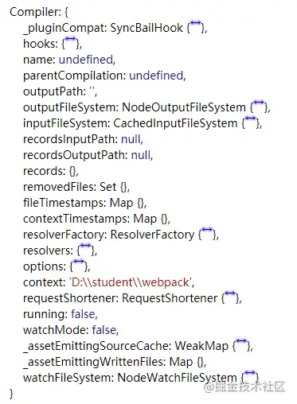
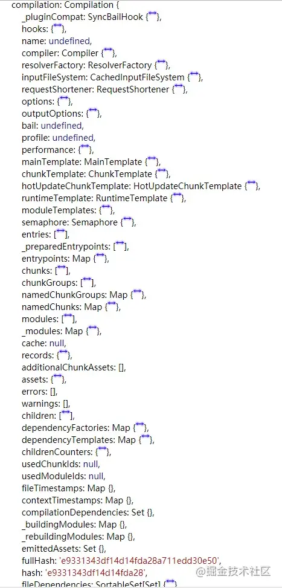

# webpack5

mkdir webpack-demo
cd webpack-demo
npm init -y
npm install webpack webpack-cli --save-dev

```js
const isWebpack5 = compiler.webpack
    ? parseInt(compiler.webpack.version, 10) === 5
    : false; // 判断版本

```


## Tree Shaking

DEC（Elimination）

代码不会被执行，不可到达

代码执行的结果不会被用到

代码只会影响死变量（只写不读）

```js
if (false) {
  console.log('这段代码永远不会执行')
}
```

利用 ES6 模块的特点

- 只能作为模块顶层的语句出现
- import 的模块名只能是字符串常量
- import binding 是 immutable 的

代码擦除：uglify 阶段删除无用代码

### 类处理

```js
// util.js
export default class Util {
  hello() {
    return "hello";
  }

  bye() {
    return "bye";
  }
}

//// index.js
import Util from './util'
let util = new Util()
let result1 = util.hello()
console.log(result1)
```

注意 webpack 对于类是整体进行标记的（标记为使用），而不是分别针对两个方法，因此最终打包的代码依然会包含 bye 方法。这表明 webpack tree shaking 只处理顶层内容，例如类和对象内部都不会再被分别处理。

这主要也是由于 JS 的动态语言特性所致。如果把 `bye()` 删除，考虑如下代码：

```js
// index.js
import Util from './util'
let util = new Util()
let result1 = util[Math.random() > 0.5 ? 'hello', 'bye']()
console.log(result1);
```

编译器并不能识别一个方法名字究竟是以直接调用的形式出现（util.hello()) 还是以字符串的形式（util['hello']） 或者其他更加离奇的方式。因此误删方法只会导致运行出错，得不偿失。

### 副作用

#### 模块引入带来的副作用

#### 方法调用带来的副作用

## 原理

#### 基本概念

- **Entry**：入口，Webpack 执行构建的第一步将从 Entry 开始，可抽象或输入。
- **Module**：模块，在 Webpack 里一切皆模块，一个模块对应一个文件。Webpack 会从配置的 Entry 开始，递归找出所有依赖的模块。
- **Chunk**：代码块，一个 Chunk 由多个模块组合而成，用于代码合并与分割。
- **Loader**：模块转换器，用于将模块的原内容按照需求转换成新内容。
- **Plugin**：扩展插件，在 Webpack 构建流程中的特定时机会广播对应的事件，插件可以监听这些事件的发生，在特定的时机做对应的事情。

### 工作原理概括

#### 流程概括

1. **初始化流程**：从配置文件和 `shell` 语句中读取与合并参数，使用参数实例化 `Compiler` 对象，加载所有配置的插件，执行对象的 `run` 方法开始编译
2. **编译构建流程**：根据配置确定 `entry` 文件，从入口文件出发，针对每个 `Module` 串行调用对应配置的` Loader` 去翻译文件内容，再找到该 `Module` 依赖的 `Module`，递归地进行编译处理，得到每个模块被翻译的内容和它们之间的依赖关系。
3. **输出流程**：根据入口和模块依赖关系，对编译后的 `Module` 组合成包含多个模块的 `Chunk`，再把每个 `Chunk` 转换成一个或多个文件，输出到文件系统。
4. 在以上过程，Webpakc 会在特定的时间点广播特定的事件，插件在监听到感兴趣的事件后会执行特定的逻辑，并且插件可以调用 Webpack 提供的 API 改变 Webpack 的运行结果。

#### 流程细节

##### 初始化阶段

| 事件名          | 解释                                                         |
| --------------- | ------------------------------------------------------------ |
| 初始化参数      | 从配置文件和 Shell 语句中读取与合并参数，得出最终的参数。在这个过程中还会执行配置文件中的插件实例化语句 `new Plugin()` |
| 实例化 Compiler | 用上一步得到的参数初始化 Compiler 实例，Compiler 负责文件监听和启动编译。在 Compiler 实例中包含了完整的 Webpack 配置，全局只有一个 Compiler 实例。 |
| 加载插件        | 依次调用插件的 `apply` 方法，让插件可以监听后续的所有事件节点。同时向插件传入 compiler 实例的引用，以方便插件通过 compiler 调用 Webpack 提供的 API |
| environment     | 开始应用 Node.js 风格的文件系统到 compiler 对象，以方便后续的文件寻找和读取 |
| entry-option    | 读取配置的 Entrys，为每个 Entry 实例化一个对应的 EntryPlugin，为后面该 Entry 的递归解析工作做准备 |
| after-plugins   | 调用完所有内置的和配置的插件 apply 方法                      |
| after-resolves  | 根据配置初始化 resolver，resolver 负责在文件系统中寻找指定路径的文件。 |

##### 编译阶段

| 事件名        | 解释                                                         |
| ------------- | ------------------------------------------------------------ |
| run           | 启动一次新的编译                                             |
| watch-run     | 和 run 类似，区别在于它是在监听模式下启动编译，在这个事件中可以获取是哪些文件发生了变化从而导致重新启动一次新的编译。 |
| compile       | 该事件是为了告诉插件一次新的编译将要启动，同时会给插件带上 compiler 对象 |
| compilation   | 当 Webpack 以开发模式运行时，每当检测到文件的变化，便有一次新的 Compilation 被创建。一个 Compilation 对象包含了当前的模块资源、编译生成资源、变化的文件等。Compilation 对象也提供了很多事件回调给插件进行扩展。 |
| make          | 一个新的 Compilation 创建完毕，即将从 Entry 开始读取文件，根据文件的类型和配置的 Loader 对文件进行编译，编译完后再找出该文件依赖的文件，递归地编译和解析 |
| after-compile | 一次 Compilation 执行完成                                    |
| invalid       | 当遇到文件不存在、文件编译错误等异常时会触发该事件，该事件不会导致 Webpack 退出。 |

##### 输出阶段

| 事件名      | 解释                                                         |
| ----------- | ------------------------------------------------------------ |
| should-emit | 所有需要输出的文件已经生成，询问插件有哪些文件需要输出，有哪些不需要输出 |
| emit        | 确定好要输出哪些文件后，执行文件输出，可以在这里获取和修改输出的内容 |
| after-emit  | 文件输出完毕                                                 |
| done        | 成功完成一次完整的编译和输出流程                             |
| failed      | 如果在编译和输出的流程中遇到异常，导致 Webpack 退出，就会直接跳转到本步骤，插件可以在本事件中获取具体的原因。 |

### 输出文件分析

### 编写 Loader

#### Loader 基础

Webpack 是运行在 Node.js 上的，一个 Loader 其实就是一个 Node.js 模块，这个模块需要导出一个函数。这个导出的函数的工作就是获得处理前的原内容，对原内容执行处理后，返回处理后的内容。

一个最简单的 Loader 源码如下：

```js
module.exports = function (source) {
  // source 为 compiler 传递给 Loader 的一个文件的源内容
  // 该函数需要返回处理后的内容
  return handle(source);
}
```

由于 Loader 运行在 Node.js 中，所以我们可以调用人一 Node.js 自带的 API，或者安装第三方模块进行调用：

```js
const sass = require('node-sass');
module.exports = function(source) {
  return sass(source);
}
```

#### Loader 的进阶

- 获得loader 的 options
- 返回其他结果
- 同步与异步
- 处理二进制数据
- 缓存假设

#### 实战—Spire-loader

#### 实战—注释 loader

```js
/**
 * 将在 JavaScript 代码中的注释语法：
 * // @require '../style/index.css'
 * 转换成
 * require('../style/index.css');
 * 该 Loader 的使用场景是正确加载针对 Fis3（http://fis.baidu.com/fis3/docs/user-dev/require.html）编写的 JavaScript，这些 JavaScript 中存在通过注释的方式加载依赖的 CSS 文件。
 */

// replace
// @require '../style/index.css'
// to
// require('../style/index.css');
function replace(source) {
  return source.replace(/(\/\/ *@require) +(('|").+('|")).*/, "require($2);");
}
module.exports = function(content) {
  return replace(content);
};

```

使用 

```js
const path = require("path");
const MiniCssExtractPlugin = require("mini-css-extract-plugin");

module.exports = {
  entry: "./src/index.js",
  output: {
    filename: "[name].boundle.js",
    path: path.resolve(__dirname, "dist"),
    clean: true,
  },
  module: {
    rules: [
      // 处理 js 文件
      {
        test: /\.js/,
        use: [path.resolve(__dirname, "loaders/comment-require-loader.js")],
      },
      //..
    ],
  },
  plugins: [new MiniCssExtractPlugin()],
};

```

index.js

```js
// @require './a.css'
```


#### 总结

一个 loader 在我们项目中 work 需要经历以下步骤：

- 创建 loader 的目录及模块文件
- 在 webpack 配置 rule 以及 loader 的解析路径，并且要注意 loader 的顺序，这样在 `require` 指定类型文件时，我们能让处理流经过指定 loader。
- 遵循原则设计和开发 loader。

### 编写插件

> 插件API：https://www.webpackjs.com/api/plugins/#tapable

一个最基础的 Plugin 的代码是这样的：

```js
class BasicPlugin {
  // 在构造函数中获取用户为该插件传入的配置
  constrctor(options) {}
  
  // Webpack 会调用 BasicPlugin 实例的 apply 方法为插件实例传入 compiler 对象
  apply(compiler) {
    compiler.plugin('compilation', function(compilation) {
    })
  }
}
module.exports = BasicPlugin
```

使用这个 Plugin

```js
const BasicPlugin = require('./BasicPlugin.js');
module.export = {
  plugins: [
    new BasicPlugin(options),
  ]
}
```

Webpack 启动后，在读取配置的过程中会先执行 `new BasicPlugin(options) `，初始化一个 `BasicPlugin` 并获得实例。在初始化 `compiler` 对象后，再调用 `basicPlugin.apply(compiler)` 为插件实例传入`compiler` 对象。插件实例在获取到 `compiler`  对象后，就可以通过  `compiler.plugin`（事件名称、回调函数）监听到 Webpack 广播的事件，并且可以通过 compiler 对象去操作 Webpack。

#### Compiler 和 Compilation

那么如果让我们站在一个编写插件者的角度上来看的话，是不是在编写的时候需要明确两件事情：

- 我要如何拿到完整的`webpack`环境配置呢？因为我在编写插件的时候肯定是要与`webpack`的主环境结合起来的
- 我如何告诉`webpack`我的插件是在什么时候发挥作用呢？在打包之前？还是之后？也就是我们经常听到的钩子。

在开发 Plugin 时最常用的两个对象就是 Compiler 和 Compilation，它们是 Plugin 和 Webpack 之间的桥梁。Compiler 和 Compilation 的含义如下：

- **Compiler** 对象包含了 Webpack 环境的所有配置信息，包含 options、loaders、plugins 等信息。这个对象在 Webpack 启动时被实例化，它是全局唯一的，可以简单地将它理解为 Webpack 实例。
- **Compilation** 对象包含了当前的模块资源、编译生成资源、变化的文件等。当 Webpack 以开发模式运行，每当检测到一个文件发生变化，便有一次新的 Compilation 被创建。Compilation 对象也提供了很多事件回调插件进行扩展。通过 Compilation 也能读取到 Compiler 对象。

Compiler 和 Compilation 的区别在于：Compiler 代表了整个 Webpack ，从启动到关闭的生命周期持续存在。**而 Compilation 只代表一次新的编译后的对象。**

**Compile** 包含的东西如下所示



**Compilation**



#### 事件流

Webpack 就像一条生产线，要经过一系列处理流程后才能将源文件转换成输出结果。这条生产线上的每个处理流程的职责都是单一的，多个流程之间存在依赖关系，只有完成当前处理后才能提交给下一个流程去处理。插件就像插入生产线中的某个功能，在特定的时机对生产线上的资源进行处理。

Webpack 通过 **Tapable**（https://github.com/webpack/tapable） 来组织这条复杂的生产线。Webpack 在运行的过程中会广播事件，插件只需要监听它所关心的事件，就能加入这条生产线中，去改变生产线的运作。Webpack 的事件流机制保证了插件的有序性，使得整个系统的扩展性良好。

Webpack 的事件流机制应用了观察者模式，和 Node.js 中的 EventEmitter 非常相似。**Compiler 和 Compilation 都继承自 Tapable，可以直接在 Compiler 和 Compilation 对象上广播和监听事件**，方法如下：

```js
// 传统形式的 compiler.plugin
/**
 * 广播事件
 * event-name为事件名称，主要不要和现有的事件重名
 * params 为附带的参数
 */
compiler.apply('event-name', params);

/**
 * 监听名称为 event-name 的事件，当 event-name 事件发生时，函数就会先被执行。
 * 同时函数中的 params 参数为广播事件时附带的参数。
 */
compiler.plugin('event-name', function(params) {})


// webpack5 新写法
compiler.hooks.done.tap("No1", () => { // 注册一个 done 的执行回调
  console.log(this.options.msg);
});
```

##### Tapable

> https://www.webpackjs.com/api/plugins/#tapable

tapable 这个小型 library 是 webpack 的一个核心工具，为 webpack提供了插件接口的支柱。

- Tapable 事件流机制保证了插件的有序性，使得整个系统扩展性良好。
- webpack 中许多对象扩展自 `Tapable` 类。这个类暴露 `tap`, `tapAsync` 和 `tapPromise` 等方法，可以使用这些方法，注入自定义的构建步骤，这些步骤将在整个编译过程中不同时机触发。

钩子的分类：

`Sync*`

- SyncHook：同步串行钩子，不关心返回值
- SyncbailHook： 同步串行钩子，如果返回值不为 null 则跳过之后的函数
- SyncLoopHook：同步循环，如果返回值为 true 则继续执行，返回值为 false 则跳出循环
- SyncWaterfallHook：同步串行，上一个函数返回值会传给下一个监听函数

`Async*`

- AsyncParallel*：异步并发
  - AsyncParallelBailHook -->  异步并发，只要监听函数的返回值不为 null，就会忽略后面的监听函数执行，直接跳跃到callAsync等触发函数绑定的回调函数，然后执行这个被绑定的回调函数
  - AsyncParallelHook --> 异步并发，不关心返回值
- AsyncSeries*：异步串行
  - AsyncSeriesHook --> 异步串行，不关心callback()的参数
  - AsyncSeriesBailHook --> 异步串行，callback()的参数不为null，就会忽略后续的函数，直接执行 callAsync 函数绑定的回调函数
  - AsyncSeriesWaterfallHook --> 异步串行，上一个函数的callback(err, data)的第二个参数会传给下一个监听函数

`tap、tapAsync、tapPromise`这三个方法是用于注入不同类型的自定义构建行为，因为我们的钩子可能有同步的钩子，也可能有异步的钩子，而我们在注入钩子的时候就得选对这三种方法了。

- `tap`：可以注册同步钩子也可以注册异步钩子
- `tapAsync`：回调方式注册异步钩子
- `tapPromise`：`Promise`方式注册异步钩子

#### 总结编写一个插件，只需要这么几步：

1. 明确你的插件是要怎么调用的，需不需要传递参数（对应着 `webpack.config.js` 中的配置）；

2. 创建一个构造函数，以此来保证用它能创建一个个插件实例；
3. 在构造函数原型对象上定义一个 apply 方法，并在其中利用 `compiler.plugin` /`compiler.hooks`注入自定义的构建步骤，这些步骤将在整个编译过程中不同时机触发。

```js
// 1. 创建一个构造函数
function No1WebpackPlugin(options) {
  this.options = options;
}
// 2. 重写构造函数原型对象上的 apply 方法
No1WebpackPlugin.prototype.apply = function(compiler) {
  console.log(compiler.hooks.done);
  // 传统写法
  // compiler.plugin('done', () => {
  //   console.log(this.options.msg)
  // })

  // 推荐写法
  compiler.hooks.done.tap("No1", () => { // 注册一个 done 的执行回调
    console.log(this.options.msg);
  });
};
// 3. 将我们的自定义插件导出
module.exports = No1WebpackPlugin;
```

在开发插件时，还需要注意以下两点：

- 只要能拿到 Compiler 或 Compilation 对象，就能广播新的事件，所以在新开发的插件中也能广播事件，为其他插件监听使用。**传给每个插件的 Compiler 和 Compilation 对象都是同一个引用。也就是说，若在一个插件中修改了 Compiler 或 Compilation 对象上的属性，就会影响到后面的插件。**

- 有些事件是异步的，这些异步的事件会附带两个参数，第 2 个参数为回调函数，在**插件处理完任务时需要调用回调通知 Webpack，才会进入下一个处理。**

  ```js
  compiler.hooks.run.tapAsync('MyPlugin', (compiler, callback) => {
    console.log('以异步方式触及 run 钩子。')
    callback()
  })
  
  compiler.hooks.run.tapPromise('MyPlugin', compiler => {
    return new Promise(resolve => setTimeout(resolve, 1000)).then(() => {
      console.log('以具有延迟的异步方式触及 run 钩子')
    })
  })
  ```

#### 常用的 API

##### 读取输出资源、代码块、模块及其依赖

##### 监听文件的变化

##### 修改输出资源

##### 判断 Webpack 使用了哪些插件

#### 插件案例

##### Watch-plugin 案例

##### fileList.md 案例

##### Decide-html-plugin 案例

##### Clean-plugin 案例

**明确需求**

- 当项目在开启观察者`watch`模式的时候，监听每一次资源的改动
- 当每次资源变动了，将改动资源的个数以及改动资源的列表输出到控制台中
- 监听结束之后，在控制台输出`"本次监听停止了哟～"`

首先为了满足第一个条件，我们得设计一条`watch`的指令，以保证使用`npm run watch`命令之后，会看到编译过程，但是不会退出命令行，而是实时监控文件。这也很简单，加一条脚本命令就可以了。

```json
{
  "script": "webpack --watch --mode development"
}
```

默认情况下 Webpack 只会监视入口和其依赖的模块是否发生变化，在有些情况下项目可能需要引入新的文件，例如引入一个 HTML 文件。 由于 JavaScript 文件不会去导入 HTML 文件，Webpack 就不会监听 HTML 文件的变化，编辑 HTML 文件时就不会重新触发新的 Compilation。 为了监听 HTML 文件的变化，我们需要把 HTML 文件加入到依赖列表中，为此可以使用如下代码：

```js
compiler.plugin('after-compile', (compilation, callback) => {
  // 把 HTML 文件添加到文件依赖列表，好让 Webpack 去监听 HTML 模块文件，在 HTML 模版文件发生变化时重新启动一次编译
    compilation.fileDependencies.push(filePath);
    callback();
})
```

### 调试 Webpack

## 参考资料

- [Webpack之treeShaking](https://mp.weixin.qq.com/s/Ue0kNOMQS7mH-2-9BhYk8Q) 很详细
- https://time.geekbang.org/course/detail/100028901-100679 视频
- 《深入浅出 Webpack》
- [《霖呆呆的六个自定义Webpack插件详解-自定义plugin篇(3)》](https://juejin.cn/post/6844904162405138445#heading-8)好文，值得跟着编写实践
- 插件API：https://www.webpackjs.com/api/plugins/#tapable