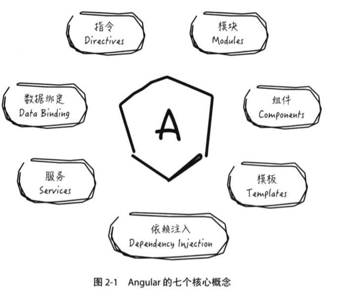
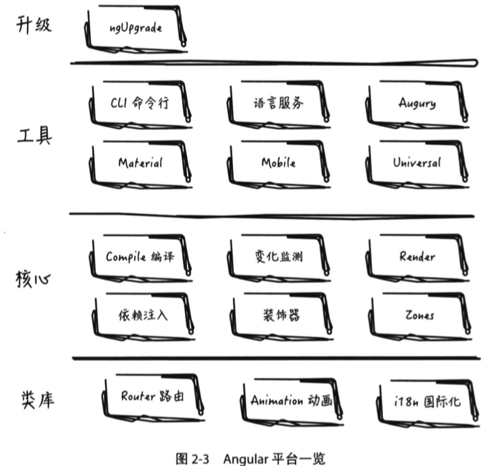
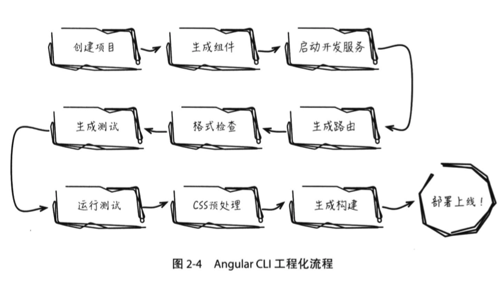
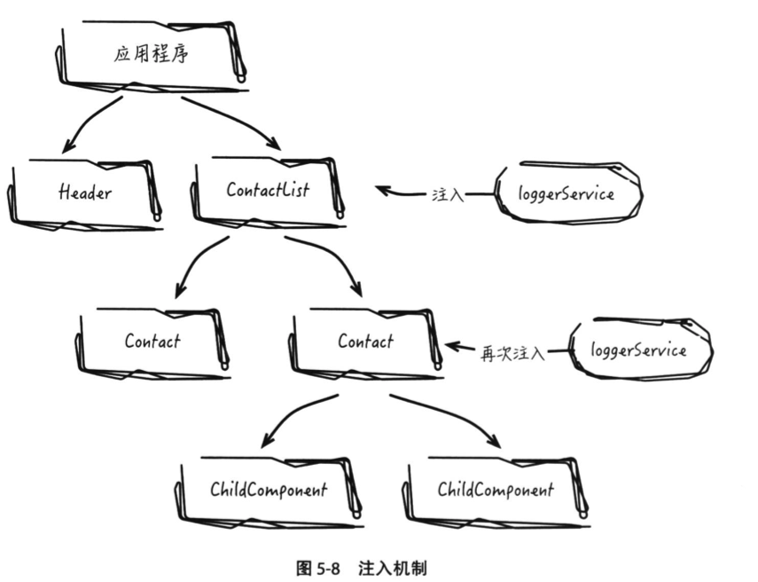
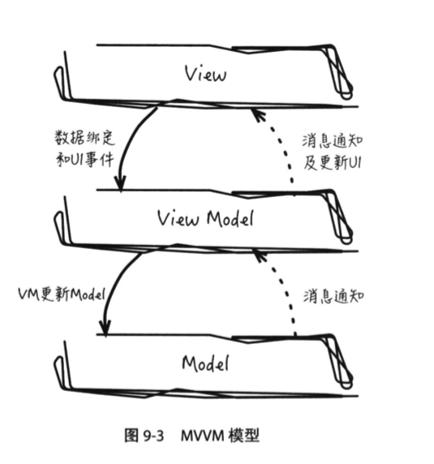

# Angular

Angular 的概览，实际上它已不仅仅是简单的框架，更像是个平台。不同的项目倾向的技术口味并不相同，技术选型时我们都希望性价比最大化，无论是React，还是Vue，抑或是Angular，都能解决我们的主要问题，而Angular提供更广泛的多端支持，一站式解决方案，加上精心的架构设计、成熟的 Angular 生态、对标准的拥抱，还有 Google 和微软的联手支持，这些都给了开发者足够的信心，Angular 将会是一个非常棒的平台，

- MVVM 模式
- 引入指令系统来扩展 HTML 的语义
- Service、Factory 和 Provider 等来为公共和数据逻辑提供抽象。
- 基于 ngModel 双向绑定的表单格式化和验证

作者：__ihhu
链接：https://juejin.cn/post/6844903475038388232
来源：掘金
著作权归作者所有。商业转载请联系作者获得授权，非商业转载请注明出处。

## Angular 简介







## 创建项目

首先安装cli工具

```sh
npm install -g @angular/cli
```

## Angular 架构总览

### 核心模块

#### 依赖注入

依赖注入是一种帮助开发者管理模块依赖的设计模式。在 Angular 中，依赖注入与 TypeScript 相结合提供了更好的开发体验。**在 TypeScript 中，对象通常被明确赋予类型，通过类型匹配，组件类便可知道该用哪种类型实例取赋值变量**。

```js
// angular 12
import { LoggerService } from './logger-service';

@Component({
  selector: 'contact-list',
  providers: [LoggerService]
})
export class ContactListComponent {
  constructor(private logger: LoggerService) {
    
  }
  
  doSomething() {
    this.logger.info('xxx');
  }
}
```

`@Component` 装饰器中的 `providers` 属性是依赖注入操作的关键，它会为该组件创建一个注入器对象，并新建 LoggerService 实例存储到这个注入器里。**组件在需要引入 LoggerService 实例时，通过 TypeScript 的类型匹配即可从注入器取出相应的实例对象，无须再重复显式实例化。**

需要注意的是，服务的每一次注入（也就是使用 providers）声明，该服务都会被创建出新的实例，组件的所有子组件均默认继承父组件的注入器对象，复用该注入器存储的服务实例，这种机制可保证服务以单例模式运行，除非某个子组件再次注入（即通过 providers声明）。

这种灵活的注入方法可以适应多变的应用场景，既可配置全局单例服务（在应用的根组件注入即可），也可按需注入不同层级的服务，彼此数据状态不会相互影响。



### 应用模块

Angular 引入模块机制，是对某些特定功能特性的封装，可能包含若干组件、指令、服务等，甚至拥有独立的路由配置。

每个 Angular 应用至少有一个模块，一般需要有一个模块作为应用的入口，这个入口模块称为根模块（Root Module），通过引导运行根模块来启动 Angular 应用。

通常会根据应用功能分区设计，不同的功能特性由不同的独立模块负责。在 Angular 中，除了根模块外其他的模块类型有：封装某个完整功能的特性模块（Feature Module），封装一些公共构件的共享模块（Shared Module），以及存放应用级别核心构件的核心模块（Core Module）。

通过将特性模块导入到根模块里即可实现对该特性功能的引入，而模块间如何交互无须开发者去关心，Angular 已经处理好了。这种交互关系对于不同的模块构件各不相同。

- **路由**：当特性模块导入到根模块后，特性模块的路由配置会自动与根模块里的路由配置合并。
- **组件和指令**：默认情况下模块内的组件和指令是私有的，也就是说特性模块 A 被导入到根模块内后，根模块依然不能使用特性模块 A 内里的组件和指令，除非特性模块 A 里显示暴露出了某些组件或指令，这些暴露出来的组件或指令相当于模块的 API。
- **服务**：服务的处理则有些特殊，通过依赖注入机制，服务同样可以注入到模块里，但跟组件里的依赖追的作用域并不相同。注入到组件里的服务只能在该组件及其子组件上，而注入到模块里的服务在整个应用里均能使用，因为所有模块都共享着同一个应用级别的根注入器。

Angular 已经封装了不少常用的特性模块。

- CommonModule：封装一些常用的内置指令和内置管道等。
- BrowserModule：封装在浏览器平台运行时的一些工具库，同时将 CommonModule 和 ApplicationModule 打包导出，所以通常在使用时引入 BrowserModule 就可以了。
- RouterModule：封装路由相关的组件指令等。

```js
// app.module.ts
import { NgModule } from '@angular/core';
import { BrowserModule } from '@angular/platform-browser';
import { RouterModule } from '@angular/router';
import { ReactiveFormsModule } from '@angular/forms';
import { HttpClientModule } from '@angular/common/http';

import { AppComponent } from './app.component';
import { TopBarComponent } from './top-bar/top-bar.component';
import { ProductListComponent } from './product-list/product-list.component';
import { ProductAlertsComponent } from './product-alerts/product-alerts.component';
import { ProductDetailsComponent } from './product-details/product-details.component';
import { CartComponent } from './cart/cart.component';

import { ShippingComponent } from './shipping/shipping.component';

@NgModule({
  imports: [
    BrowserModule,
    HttpClientModule,
    ReactiveFormsModule,
    RouterModule.forRoot([
      { path: '', component: ProductListComponent },
      { path: 'products/:productId', component: ProductDetailsComponent },
      { path: 'cart', component: CartComponent },
      { path: 'shipping', component: ShippingComponent }
    ])
  ],
  declarations: [
    // 所有使用到的组件都需要在这里进行声明
    AppComponent,
    TopBarComponent,
    ProductListComponent,
    ProductAlertsComponent,
    ProductDetailsComponent,
    CartComponent,
    ShippingComponent
  ],
  bootstrap: [AppComponent]
})
export class AppModule {}

/*
Copyright Google LLC. All Rights Reserved.
Use of this source code is governed by an MIT-style license that
can be found in the LICENSE file at https://angular.io/license
*/
```

## 组件编写

组件例子：

- https://stackblitz.com/edit/angular-25pxjj?file=src%2Fapp%2Fproduct-list%2Fproduct-list.component.html
- Guide https://angular.io/start#create-the-product-list


### **定义组件**

button.module.ts

button.component.ts|html|scss

```js
import { Component } from '@angular/core';

@Component({
  selector: 'hello-world', // 组件名
  // 可以通过路径引入进来
  template: `
    <h2>{{ message }}</h2>
    <p>This is my first component!</p>
    `,
  styleUrls: ['./d-button.component.scss'], // 样式
})
export class HelloWorldComponent {
  message = 'Hello, World'
  // The code in this class drives the component's behavior.
}
```

### **组件的输入/输出**

Angular 提供了输入 （@Input）和输出（@Ouput）语法来处理组件数据的流入流出。

```js
@Input() product: Product | undefined; // 输入，相当于 Vue 的 prop
@Output() notify = new EventEmitter<any>(); // 输出
```

```ts
import { Component, OnInit } from '@angular/core';
import { Input } from '@angular/core';
import { Output, EventEmitter } from '@angular/core';
import { Product } from '../products';

@Component({
  selector: 'app-product-alerts',
  templateUrl: './product-alerts.component.html',
  styleUrls: ['./product-alerts.component.css']
})
export class ProductAlertsComponent implements OnInit {
  @Input() product: Product | undefined;
  @Output() notify = new EventEmitter();
  constructor() {}

  ngOnInit() {}
}
```

父组件

```html
<h2>Products</h2>

<div *ngFor="let product of products">
  <h3>
    <a [title]="product.name + ' details'" [routerLink]="['/products', product.id]">
      {{ product.name }}
    </a>
  </h3>

  <p *ngIf="product.description">
    Description: {{ product.description }}
  </p>

  <button (click)="share()">Share</button>

  <app-product-alerts [product]="product" (notify)="onNotify()"></app-product-alerts>
</div>
```

### 模版

```html
<button
  [type]="type" // 绑定变量
  (click)="onClick($event)" // 绑定事件
>
  <span *ngIf="icon"></span> // if逻辑
  <ng-content></ng-content> // 内容插槽
</button>
<div [innerHTML]="data.tmw"></div> // 显示HTML内容
```

产品列表

product-list.component.html

```html
<h2>Products</h2>
<div *ngFor="let product of products">
  <h3>
    <a [title]="product.name + ' details'">
      {{ product.name }}
    </a>
  </h3>

  <p *ngIf="product.description">
    Description: {{ product.description }}
  </p>
  <button (click)="share()">Share</button>
</div>
```

### 管道

在 Angular 中，管道（Pipes）可以按照开发者指定的规则将模版内的数据进行转换。如日期类型（Date），默认会显示为 Mon Jun 06 2016 14:17:00 GMT+0800 (CST) 这样的形式，但不如 Jun 6, 2016 这样的形式直观，此时可以借助管道来实现这种转换效果。

#### 管道介绍

#### 内置管道

Angular 根据业务场景，封装了一些常用的内置管道。内置管道可以直接在任何模版表达式中被使用，不需要通过 import 导入和在模块中声明。

- [`DatePipe`](https://angular.io/api/common/DatePipe): Formats a date value according to locale rules.
- [`UpperCasePipe`](https://angular.io/api/common/UpperCasePipe): Transforms text to all upper case.
- [`LowerCasePipe`](https://angular.io/api/common/LowerCasePipe): Transforms text to all lower case.
- [`CurrencyPipe`](https://angular.io/api/common/CurrencyPipe): 将数值转成本地货币格式
- [`DecimalPipe`](https://angular.io/api/common/DecimalPipe): Transforms a number into a string with a decimal point, formatted according to locale rules.
- [`PercentPipe`](https://angular.io/api/common/PercentPipe): Transforms a number to a percentage string, formatted according to locale rules.

### **class/style 绑定**

### 组件通信

就是前面的输入与输出的具体细节。

#### 传数据到子组件

子组件

```js
// product-alerts.component.ts
import { Component, OnInit } from '@angular/core';
import { Input } from '@angular/core'; // 通过 Input 装饰器处理
import { Product } from '../../products';

@Component({
  selector: 'app-product-alerts',
  templateUrl: './product-alerts.component.html',
  styleUrls: ['./product-alerts.component.css']
})
export class ProductAlertsComponent implements OnInit {
  @Input() product!: Product; // 输入
  constructor() {}

  ngOnInit() {}
}
```

父组件

```html
<h2>Products</h2>

<div *ngFor="let product of products">
  <h3>
    <a [title]="product.name + ' details'">
      {{ product.name }}
    </a>
  </h3>

  <p *ngIf="product.description">
    Description: {{ product.description }}
  </p>

  <button (click)="share()">Share</button>

  <app-product-alerts [product]="product"></app-product-alerts>
</div>
```

注意的是， ProductAlertsComponent 需要到当前模块 app.module.ts 的 declarations 进行声明才能在上述父组件的 html 模版中使用。

```js
import { NgModule } from '@angular/core';
import { BrowserModule } from '@angular/platform-browser';
import { RouterModule } from '@angular/router';
import { ReactiveFormsModule } from '@angular/forms';

import { AppComponent } from './app.component';
import { TopBarComponent } from './top-bar/top-bar.component';
import { ProductListComponent } from './product-list/product-list.component';
import { ProductAlertsComponent } from './product-alerts/product-alerts.component';

@NgModule({
  imports: [
    BrowserModule,
    ReactiveFormsModule,
    RouterModule.forRoot([
      { path: '', component: ProductListComponent },
    ])
  ],
  declarations: [
    AppComponent,
    TopBarComponent,
    ProductListComponent,
    ProductAlertsComponent
  ],
  bootstrap: [
    AppComponent
  ]
})
export class AppModule { }


/*
Copyright Google LLC. All Rights Reserved.
Use of this source code is governed by an MIT-style license that
can be found in the LICENSE file at https://angular.io/license
*/
```

#### 传数据到父组件

孩子组件 ts

```js
import { Component, OnInit } from '@angular/core';
import { Input } from '@angular/core';
import { Output, EventEmitter } from '@angular/core'; // 传数据到父组件
import { Product } from '../products';

@Component({
  selector: 'app-product-alerts',
  templateUrl: './product-alerts.component.html',
  styleUrls: ['./product-alerts.component.css']
})
export class ProductAlertsComponent implements OnInit {
  @Input() product: Product | undefined;
  @Output() notify = new EventEmitter();
}

```

孩子组件 html

```html
<p *ngIf="product && product.price > 700">
  <button (click)="notify.emit()">Notify Me</button>
</p>
```

在父组件 ts. In `product-list.component.ts`, define an `onNotify()` method

```js
export class ProductListComponent {
  products = products;
  onNotify() {
    window.alert('You will be notified when the product goes on sale');
  }
}
```

在父模版中接收数据，监听 notify 事件，然后调用回调函数。

```html
<app-product-alerts
  [product]="product" 
  (notify)="onNotify()"> 
</app-product-alerts>
```

#### 多个组件之间进行通信

可以通过组件间共享同一服务实例来实现通信。

### 组件内容嵌入

内容嵌入（ng-content）是组件的一个高级功能特性，它能很好地扩充组件的功能，方便代码的复用。

内容嵌入通常用来创建可复用的组件，典型的例子是模态对话框或导航栏。在 开发 Web 应用的时候，模态对话框和导航栏是使用非常频繁的 UI 组件，而内容嵌入特性提供了一种复用的方式，使得这些组件具有一致的样式，但内容又可以自定义。

### 生命周期

组件的生命周期由 Angular 内部管理，从组件的创建、渲染，到数据变动事件的触发，再到组件从 DOM 中移除，Angular 都提供了一系列的钩子。

开发者可以实现一个或者多个生命周期钩子（接口），从而在生命周期的各阶段作出适当的处理。这些钩子接口包含在 @angular/core 中。每个接口都对应一个名为 “ng + 接口名” 的方法，例如 OnInit 接口有一个叫 ngOnInit 的钩子方法，示例代码如下：

```tsx
class ExampleInitHook implements OnInit {
  constructor() {}
  ngOnInit() {
    console.log('OnInit');
  }
}
```

以下是组件常用的生命周期钩子方法，Angular 会按以下的顺序依次调用钩子方法：

- **ngOnChanges**
- ngOnInit
- ngDoCheck
- **ngAfterContentInit**
- ngAfterContentChecked
- ngAfterViewInit
- ngAfterViewChecked
- **ngOnDestroy**

除此之外，有的组件还提供了自己特有的生命周期钩子，例如路由有 routerOnActiveate 钩子。

#### ngOnInit

ngOnInit 钩子用于数据绑定输入属性之后初始化组件。该钩子方法会在第一次 ngOnChanges 之后被调用。

使用 ngOnInit 有以下两个重要的原因：

- 组件构造后不久就要进行复杂的初始化。
- 需要在输入属性设置完成之后才构建组件。

在组件中，经常会使用 ngOnInit 获取数据。为什么不在组件构造函数中获取数据呢？首先，构造函数做的事，例如成员变量初始化，应该尽可能简单，这对于有经验的开发人员来说，已经是一种共识。

另外，这对于 Angular 自动化测试的一些场景也有非常重要的作用，把业务相关的初始化代码放到 ngOnInit 里可以很容易进行 Hook 操作，而构造函数不能被显式调用，因此无法进行 Hook 操作。

例子

```tsx
// splitter-bar.component.ts
ngOnInit(): void {
    let state;
    const resizeListener = this.resize.pressEvent
      .pipe(
        tap(this.stopPropagation),
        filter(() => this.splitter.isResizable(this.index)),
        tap(() => state = this.splitter.dragState(this.index)),
        switchMap(this.moveStream(this.resize))
      )
      .subscribe(({ pageX, pageY, originalX, originalY }) => {
        let distance;
        if (this.orientation === 'vertical') {
          distance = pageY - originalY;
        } else {
          distance = pageX - originalX;
        }
        this.splitter.setSize(state, distance);
      });
    this.subscriptions.add(resizeListener);
  }
```

#### ngOnChanges

用来响应组件输入值发生变化的事件。该方法接收一个 SimpleChange 对象，包含当前值和变化前的值。该方法在 ngOnInit 之前，或者当数据绑定输入属性的值发生变化时触发。

需要注意的是，ngOnChanges 当且仅当组件输入数据变化时被调用，这里的 “输入数据”指的是通过 @Input 装饰器显式指定的那些变量。

#### ngAfterContentInit

在组件使用 `<ng-content>` 将外部内容嵌入到组件视图后就会调用 `ngAfterContentInit`，它在第一次 `ngDoCheck` 执行后调用，且只执行一次。

#### ngOnDestroy

`ngOnDestroy` 在销毁指令/组件之前触发。那些不会被垃圾回收器自动回收的资源（比如已订阅的观察者事件、绑定过的 DOM 事件、通过 setTimeout 或 setInterval 设置过的计时器，等等）都应当在`ngOnDestroy` 中手动销毁掉，从而避免发生内存泄漏等问题。

### 操作DOM：渲染器 Renderer

> https://angular.io/api/core/Renderer2

渲染器是 Angular 为我们提供的一种内置服务，用于执行 UI 渲染操作。在浏览器中，渲染是将模型映射到视图的过程。模型的值可以是 JavaScript 中的原始数据类型、对象、数组或其它的数据对象。然而视图可以是页面中的段落、表单、按钮等其他元素，这些页面元素内部使用 DOM

```js
export abstract class Renderer2 {
  abstract createElement(name: string, namespace?: string|null): any;
  abstract createComment(value: string): any;
  abstract createText(value: string): any;
  abstract setAttribute(el: any, name: string, value: string,
    namespace?: string|null): void;
  abstract removeAttribute(el: any, name: string, namespace?: string|null): void;
  abstract addClass(el: any, name: string): void;
  abstract removeClass(el: any, name: string): void;
  abstract setStyle(el: any, style: string, value: any, 
    flags?: RendererStyleFlags2): void;
  abstract removeStyle(el: any, style: string, flags?: RendererStyleFlags2): void;
  abstract setProperty(el: any, name: string, value: any): void;
  abstract setValue(node: any, value: string): void;
  abstract listen(
      target: 'window'|'document'|'body'|any, eventName: string,
      callback: (event: any) => boolean | void): () => void;
}
```

需要注意的是在 Angular 6 版本，我们使用 `Renderer2` 替代 `Renderer`。通过观察 `Renderer` 相关的抽象类 (`Renderer`、`Renderer2`)，我们发现抽象类中定义了很多抽象方法，用来创建元素、文本、设置属性、添加样式和设置事件监听等。

#### 使用 Renderer

```ts
@Component({
  selector: 'exe-renderer',
  template: `
    <h3>Renderer Component</h3>
  `
})
export class ExeComponent {
  constructor(private renderer: Renderer2, el: ElementRef) {
    this.renderer.setProperty(el.nativeElement, 'author', 'danwang');
  }
}
```

#### 实例

- 一个给angular中组件移除`class`的方法

```ts
private removeClass(el: HTMLElement, classMap: object, renderer: Renderer2): void {
    for (const i in classMap) {
      if (classMap.hasOwnProperty(i)) {
        renderer.removeClass(el, i);
      }
    }
  }
```

- 添加`class`方法

```ts
private addClass(el: HTMLElement, classMap: object, renderer: Renderer2): void {
    for (const i in classMap) {
      if (classMap.hasOwnProperty(i)) {
        if (classMap[ i ]) {
          renderer.addClass(el, i);
        }
      }
    }
  }
```

### 其他

#### ng-template、ng-content、ng-container

**ng-container**

这个 ng-container 既不是Component 也不是 Directive，书写时就是个html标签，但是实际页面不会生成任何元素，一般都用作逻辑处理。

- 使用场景 ngFor 遍历元素时加入 ngIf 控制显示。ngFor 和 ngIf 不能同时使用这个时候就需要使用 ng-container了,例如:

```html
<ng-container *ngFor="let item of list;let i = index">
  <div *ngIf="i % 2 == 0">
    {{ item }} - {{i}}
  </div>
</ng-container>
```

**ng-content**

内容嵌入（ng-content）是组件的一个高级功能特性，它能很好地扩充组件的功能，方便代码的复用。

内容嵌入通常用来创建可复用的组件，典型的例子是模态对话框或导航栏。在 开发 Web 应用的时候，模态对话框和导航栏是使用非常频繁的 UI 组件，而内容嵌入特性提供了一种复用的方式，使得这些组件具有一致的样式，但内容又可以自定义。

## 模板

### 表单

## 指令

在 Angular 中，指令是一个重要的概念，它作用在特定的 DOM 元素上，可以扩展这个元素的功能，为元素增加新的行为。

指令的使用并不复杂，它与 HTML 元素属性的使用方式一致。不同的是，HTML 语法标准为 HTML 元素预定义了特定的属性，浏览器遵循这一语法标准，实现了这些属性的内置行为。语法标准预定义的属性是有限的、不可扩展的。

而 Angular 中的指令是可自定义的、可任意扩展的，这在一定程度上弥补了标准 HTML 元素属性功能的不足。

指令分类，**属性指令、结构指令和组件**。


```js
// Directive
@Directive({
  selector: 'myHelloWorld'
})
class HelloWorldDirective {
  //...
}
```

组件与指令的基本结构非常相似，**差别在于组件中包含了模版**。组件作为指令的一个子类，它的部分生命周期钩子与指令的相同。

| 钩子方法    | 作用                                                         |
| ----------- | ------------------------------------------------------------ |
| ngOninit    | 在 Angular 完成初始化输入属性的数据绑定后，初始化指令/组件   |
| ngOnChanges | 在 Angular 初始化输入属性的数据绑定前响应一次，之后当检测到数据绑定发生变化后就会被调用，这个方法接收一个包含当前和之前数据的 SimpleChanges 对象 |
| ngDoCheck   | 用于变化监测，该钩子方法会在每次变化监测发生时被调用         |
| ngOnDestroy | 在 Angular 销毁指令/组件之前执行清理工作，此时应注销观察者对象或者解绑事件处理器以避免内存泄漏 |

#### 内置指令

- 通用指令
- 路由指令
- 表单指令

### 自定义属性指令

#### 实现属性指令

#### 为指令绑定输入

#### 响应用户操作

```js
import { Directive, ElementRef, EventEmitter, Input, NgZone, OnDestroy, OnInit, Output } from '@angular/core';

@Directive({
  selector: '[dResize]'
})
export class ResizeDirective implements OnInit, OnDestroy {
  // 是否允许拖动
  @Input() enableResize = true;
  // 按下事件，mousedown，touchstart等
  @Output() pressEvent = new EventEmitter<any>();
  // 拖动中事件，mousemove，touchmove等
  @Output() dragEvent = new EventEmitter<any>();
 // 释放事件，mouseup，touchend等
  @Output() releaseEvent = new EventEmitter<any>();
  constructor(private el: ElementRef, private ngZone: NgZone) {}

  ngOnInit() {
    if (this.enableResize) {
      this.ngZone.runOutsideAngular(() => {
        this.bindEvent();
      });
    }
  }

  ngOnDestroy() {
    if (this.enableResize) {
      this.unbind(this.el.nativeElement, 'mousedown', this.mousedown);
      this.unbind(this.el.nativeElement, 'touchstart', this.touchstart);
    }
  }

  bind = (el, event, callback) => el.addEventListener && el.addEventListener(event, callback);

  unbind = (el, event, callback) => el && el.removeEventListener && el.removeEventListener(event, callback);

  bindEvent() {
    const element = this.el.nativeElement;
    // 绑定mousedown事件
    this.bind(element, 'mousedown', this.mousedown);
    // 绑定触屏事件
    this.bind(element, 'touchstart', this.touchstart);
  }

  mousedown = (e) => {
    this.bind(document, 'mousemove', this.mousemove);
    this.bind(document, 'mouseup', this.mouseup);
    this.pressEvent.emit(this.normalizeEvent(e));
  }

  mousemove = (e) => {
    this.dragEvent.emit(this.normalizeEvent(e));
  }

  mouseup = (e) => {
    this.unbind(document, 'mousemove', this.mousemove);
    this.unbind(document, 'mouseup', this.mouseup);
    this.releaseEvent.emit(this.normalizeEvent(e));
  }

  touchstart = (e) => {
    this.bind(document, 'touchmove', this.touchmove);
    this.bind(document, 'touchend', this.touchend);
    if (e.touches.length === 1) {
      this.pressEvent.emit(this.normalizeEvent(e));
    }
  }

  touchmove = (e) => {
    if (e.touches.length === 1) {
      this.dragEvent.emit(this.normalizeEvent(e));
    }
  }

  touchend = (e) => {
    this.unbind(document, 'touchmove', this.touchmove);
    this.unbind(document, 'touchend', this.touchend);
    if (e.touches.length === 0) {
      this.releaseEvent.emit(this.normalizeEvent(e));
    }
  }

  // 返回常用位置信息
  normalizeEvent(e) {
    // 判断事件类型，用于计算位置坐标
    if (e.type.match(/touch/)) {
      return {
          pageX: e.changedTouches[0].pageX,
          pageY: e.changedTouches[0].pageY,
          clientX: e.changedTouches[0].clientX,
          clientY: e.changedTouches[0].clientY,
          type: e.type,
          originalEvent: e,
          isTouch: true
      };
  }
    return {
        pageX: e.pageX,
        pageY: e.pageY,
        clientX: e.clientX,
        clientY: e.clientY,
        offsetX: e.offsetX,
        offsetY: e.offsetY,
        type: e.type,
        originalEvent: e
    };
}
}
```

### 自定义结构指令

## 服务与 RxJS

在 Angular 中，服务用于帮助开发者书写可重用的公共功能（如日志管理、权限管理等）和复杂业务逻辑，对于应用程序的模块化有很重要的意义。

### Angular 服务（管理数据）

> In Angular, **a service is an instance of a class** that you can make available to any part of your application using Angular's [dependency injection system](https://angular.io/guide/glossary#dependency-injection-di).

Angular  服务器一般是封装了某种特定功能的独立模块，它可以通过注入的方式供外部调用。服务在 Angular 中使用十分广泛，例如：

- 多个组件中出现重复代码时，把重复代码提取到服务中实现代码复用。
- 当组件中掺杂了大量的业务代码和数据处理逻辑时，把这些逻辑封装成服务供组件使用，组件只负责 UI 相关的逻辑，有利于后续的更新和维护。
- 把需要共享的数据存储在服务中，通过在多个组件中注入同一服务实例实现数据共享。

以下是 Angular 应用中常见的几种服务

- 和服务器通讯的数据服务。
- 检查用户输入的验证服务。
- 方便跟踪错误的日志服务。

（PS：很像 redux 每一个redux 做的东西。）

#### 使用场景

定义一个购物车服务

```js
import { Injectable } from '@angular/core';
import { Product } from './products';

@Injectable({ // 注入
  providedIn: 'root'
})
export class CartService {
  items: Product[] = [];
  constructor() {}

  addToCart(product: Product) {
    this.items.push(product);
  }

  getItems() {
    return this.items;
  }

  clearCart() {
    this.items = [];
    return this.items;
  }
}
```

在 `cart.component.ts` 导入服务，再在组件的构造函数中引入服务的实例，接着就可以在逻辑代码中调用服务的方法了。

```ts
import { Component, OnInit } from '@angular/core';
import { CartService } from '../cart.service';

@Component({
  selector: 'app-cart',
  templateUrl: './cart.component.html',
  styleUrls: ['./cart.component.css']
})
export class CartComponent implements OnInit {
  items = this.cartService.getItems();
  constructor(private cartService: CartService) {}

  ngOnInit() {}
}
```

### HTTP 服务

使用 Observable 处理异步操作是 Angular 推荐的方式，HTTP 服务的 API 接口返回的也是 Observable 对象。

### 响应式编程

#### 概述

**响应式编程（Reactive Programming）是一种面向数据流（Data Flows）和变化传播（the Propagation of Change）的编程范式。**

**面向变化传播就是看最初的数据是否会随着后续对应变量的变化而变化**，举一个例子，A + B = C。

比如在命令式编程中，当 B 的数值改变之后，C 的数值并没有随着 B 的数值改变而改变。而在响应式编程中，随着 B 的 改变，C 的数值也会随之变动。

同样，在 MVVM 中，存在一种 M（Model）到 V（View）的绑定关系



当 model1 由 model1 变为 model2 时，view 也随之进行了变化，由 view1 变为了view2.

**当监听一系列事件流并对这一系列事件流进行映射、过滤和合并等处理后，再响应整个事件流的回调，这过程便是属于面向数据流的编程**。比如 `ReactiveX` 的编程范式中，数据流被封装在一个叫做 `Observable` 的对象实例中，通过观察者模式，对数据流进行统一的订阅（`Subscribe`），并在中间插入像 `filter()` 这样的操作函数，从而对 `Observable` 所封装的数据流进行过滤处理。

```js
myObservable.filter(fn).subscribe(callback);
```

可以看到响应式编程清楚地表达了动态的异步数据流，而相关的计算模型也自动地将变化的值通过数据流的方式进行了传播。

#### ReactiveX

##### Observable 介绍

应用中产生的一步数据都需要先包装成 Observable 对象，Observable 对象的作用就是把这些一步的数据变换为数据流形式。所以生成的这些 Observable 对象相当于数据流的源头，后续的操作都是围绕着这些被转换的流动数据展开。

##### Operator 介绍

Operator 是 Rx 中 Observable 的操作符。在 Rx 中，每一个 Observable 对象，或者说数据流，都可以通过某个 operator 对该 Observable 对象进行变换、过滤、合并和监听等操作。同时，大多数的 operator 在对 Observable 对象处理后会返回一个新的 Observable 对象供下一个人 operator 进行处理。这样方便在各个 operator 之间通过链式调用的方式编写代码。

```js
observable.subscribe(observer)
```

##### **其他核心概念**

除了 Observable 以及 Operator，Rx 中还有一些其他的核心概念，例如

- Observer：对 Observable 对象发出的每个事件进行响应。
- Subscription：Observable 对象被订阅后返回的 Subscription 实例。
- Subject：EventEmitter 的等价数据结构，可以当作 Observable 被监听，也可以作为 Observer 发送新的事件。

### RxJS

Rx 基础自响应式编程范式，已经在多种编程语言中实现，而 RxJS 就是其在 JavaScript 层面上的实现。

#### 创建 Observable 对象

#### 使用 RxJS 处理复杂场景

用户在一个文本输入框进行输入时，需要对用户的输入

#### RxJS 和 Promise 的对比

能用 Promise 的场景 RxJS 都适用，RxJS 是作为 Promise 的超集存在。

#### “冷”模式下的 Observable

在 Rx 的理念中，Observable 通常可以实现成“热”（Hot）模式或者 “冷”（Cold）模式。在 “热”模式下，Observable 对象一旦创建，便会开始发送数据。而在“冷”模式下，Observable 对象会一直等到自己被订阅，才会开始数据流的发送。在 RxJS 中，Observable 实现的是“冷”模式。

#### RxJS 中的 Operator

#### Angular 中的 RxJS

> 在 React/Vue 应用中部分使用 Rx 是完全没有问题的。思路上来说就是把 React/Vue 组件的 local state 当做一个『中介』，在一个 Rx Observable 的 subscribe 回调里面更新组件状态。通过简单的绑定库支持，可以完全把 component state 作为一个实现细节封装掉，实现 Observable -> view 的声明式绑定。参考：
>
> \- Vue + Rx: [https://github.com/vuejs/vue-rx/](https://link.zhihu.com/?target=https%3A//github.com/vuejs/vue-rx/)
> \- React + Rx: [GitHub - belfz/fully-reactive-react-example](https://link.zhihu.com/?target=https%3A//github.com/belfz/fully-reactive-react-example)
>
> 我个人倾向于在适合 Rx 的地方用 Rx，但是不强求 Rx for everything。比较合适的例子就是比如**多个服务端实时消息流，通过 Rx 进行高阶处理，最后到 view 层就是很清晰的一个 Observable**，但是 view 层本身处理用户事件依然可以沿用现有的范式。
>
> 作者：尤雨溪
> 链接：https://www.zhihu.com/question/40195289/answer/85338699
> 来源：知乎
> 著作权归作者所有。商业转载请联系作者获得授权，非商业转载请注明出处

参考资料：

- [【第1340期】希望是最浅显易懂的RxJS教程](https://mp.weixin.qq.com/s/6RRK4Gb__cvCwg6CjykFrQ)

## 依赖注入

```js
// app.component.ts
import { Component } from '@angular/core'

// 1. 导入被依赖对象的服务
import { ContactService } from './shared/contact.service';
import { LoggerService } from './shared/logger/service';
import { UserService } from './shared/user.service';

@Component({
  moduleId: module.id,
  selector: 'contact-app',
  // 2. 在组件中配置注入器
  providers: [ContactService, UserService, LoggerService],
  templateUrl: './app.component.html',
  styleUrls: ['./app.component.css']
})

export class ContactAppComponent {
  // 3. 在组件构造函数中声明需要注入的依赖
  constructor(logger: LoggerService, contactService: ContactService, userService: UserService) {}
}
```


```js
import { Injectable } from '@angular/core';
import { Product } from './products';
import { HttpClient } from '@angular/common/http';

@Injectable({
  providedIn: 'root' // 注入到整个应用
})
export class CartService {
  items: Product[] = [];
  constructor(private http: HttpClient) {}

  addToCart(product: Product) {
    this.items.push(product);
  }

  getItems() {
    return this.items;
  }

  clearCart() {
    this.items = [];
    return this.items;
  }

  getShippingPrices() {
    return this.http.get<{ type: string; price: number }[]>(
      '/assets/shipping.json'
    );
  }
}

```

## 路由

```js
// app.module.ts
import { RouterModule } from '@angular/router';
import { ProductDetailsComponent } from './product-details/product-details.component';
import { ProductListComponent } from './product-list/product-list.component';

@NgModule({
  imports: [
    RouterModule.forRoot([
      { path: '', component: ProductListComponent },
      { path: 'products/:productId', component: ProductDetailsComponent}
    ])
  ],
  declarations: [
    AppComponent,
  ],
  bootstrap: [
    AppComponent
  ]
})
export class AppModule { }
```

然后在 `product-list.component.html` 定义路由

```html
  <a [title]="product.name + ' details'" [routerLink]="['/products', product.id]">
      {{ product.name }}
    </a>
```

- https://angular.io/start/start-routing

## 其他 

### NgZone

A zone is an execution context that persists across async tasks. You can think of it as [thread-local storage](https://en.wikipedia.org/wiki/Thread-local_storage) for JavaScript VMs. This guide describes how to use Angular's NgZone to automatically detect changes in the component to update HTML.

```js
import { NgZone} from '@angular/core';
  ngOnInit() {
    if (this.enableResize) {
      this.ngZone.runOutsideAngular(() => {
        this.bindEvent();
      });
    }
  }
```

这里的 ngZone.runOutsideAngular 的作用是什么？为什么要使用它？

**参考资料**：

- [NgZone](https://angular.io/guide/zone)

## 实战 DevUI

### **实现一个** **angular Splitter** **组件**

angular -》 vue3 步骤：

1. 从 HTML 结构入手，分析使用的 demo 基本用法，html 的结构怎么定义的，怎么使用。从这里可以分析父组件和子组件。（跟手写代码从测试用例入手很像）
2. 根据 HTML 完善 TS 逻辑，完善子组件。

#### 基本用法

##### Splitter

HTML

```html
<ng-content select="d-splitter-pane"></ng-content>
<ng-container *ngFor="let pane of panes; let index = index; let last = last">
  <d-splitter-bar
    dResize
    [style.order]="index * 2 + 1" // 利用 pane 的数量，动态安排 bar 的 order 为 1、3、5，保证处于中间。
    *ngIf="!last"
    [index]="index"
    [splitBarSize]="splitBarSize"
    [disabledBarSize]="disabledBarSize"
    [orientation]="orientation"
    [showCollapseButton]="showCollapseButton"
  >
  </d-splitter-bar>
</ng-container>

```

**CSS**

- flex 布局

```scs

```

**TS**

- input
  - orientation
  - splitBarSize

##### Spliter-bar

**ts**

- orientation

## 参考资料

- [半小时入门 Angular 2](https://juejin.cn/post/6844903475038388232)
- [手把手教你使用Vue/React/Angular三大框架开发Pagination分页组件](https://juejin.cn/post/6844904151730782221)

