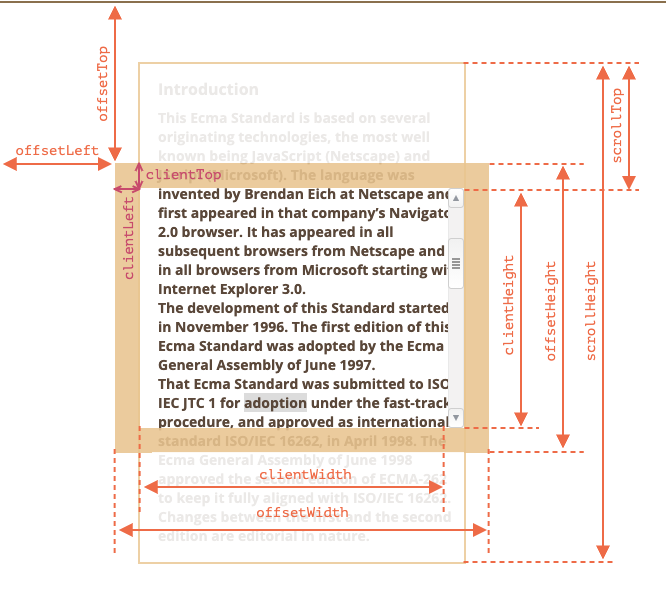
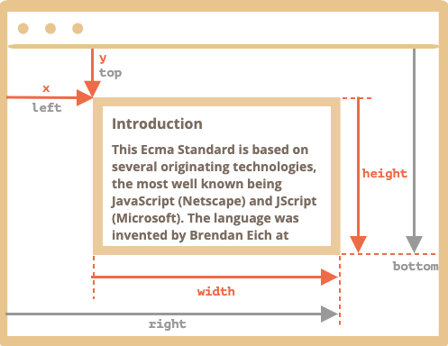

# JS

> https://github.com/stephentian/33-js-concepts#6-this-call-apply-%E5%92%8C-bind

[[toc]]

## 数据类型

### 数字类型

#### toString(base)

方法 `num.String(base)` 返回在给定 `base`进制数字系统中 `num` 的字符串表示形式。

举个例子：

```js
let num = 255;

alert( num.toString(16) );  // ff
alert( num.toString(2) );   // 11111111
```

`base` 范围可以从 `2` 到 `36`。默认情况下是 `10`。

常见的用例如下：

- **base=16** 用于十六进制颜色，字符编码等，数字可以是 `0...9` 或 `A...F`。

- **base=2** 主要用于调试按位操作，数字可以是 `0` 或 `1`。

- **base=36** 是最大进制，数字可以是 `0...9` 或 `A...Z`。对于 `36` 进制来说，一个有趣且有用的例子是，当我们需要将一个较长的数字标识符转换成较短的时候，例如做一个短的 URL。可以简单地使用基数为 `36` 的数字系统表示：

  ```js
  alert( 123456..toString(36) ); // 2n9c
  ```

  应用例子：

  ```js
  // js 生成一个随机字符串
  function random(n) {
    return Math.random().toString(36).slice(2, 2 + n);
  }
  ```

> ⚠️使用两个点来调用一个方法
>
> 请注意 `123456..toString(36)` 中的两个点不是打错了。如果我们想直接在一个数字上调用一个方法，比如上面例子中的 `toString`，那么我们需要在它后面放置两个点 `..`。
>
> 如果我们放置一个点：`123456.toString(36)` ，那么就会出现一个 error，因为 JavaScript 语法隐含了第一个点之后的部分为小数部分。如果我们再放一个点，那么 JavaScript 就知道小数部分为空，现在使用该方法。
>
> 也可以写成 `(123456).toString(36)`。

#### parseInt 和 parseFloat

使用加号 `+` 或 `Number()` 的数字转换是严格的。如果一个值不完全是一个数字，就会失败：

```js
alert( +"100px" ); // NaN
```

唯一的例外是字符串开头或结尾的空格，因为它们会被忽略。

但在现实生活中，我们经常会带有单位的值，例如 CSS 中的 `100px`或 `"12pt"`。并且，在很多国家，货币符号是紧随金额之后的，所以我们有 `19€` ，并希望从中提取出一个数值。

这就是 `parseInt` 和 `parseFloat` 的作用。

它们可以从字符串中“读取”数组，直到无法读取为止。如果发生 error，则返回收集到数字。函数 `parseInt` 返回一个整数，而 `parseFloat` 返回一个浮点数：

```js
alert( parseInt('100px') ); // 100
alert( parseFloat('12.5em') ); // 12.5

alert( parseInt('12.3') ); // 12，只有整数部分被返回了
alert( parseFloat('12.3.4') ); // 12.3，在第二个点出停止了读取
```

某些情况下，	`parseInt/parseFloat` 会返回 `NaN`。当没有数字可读时会发生这种情况。

```js
alert( parseInt('a123') ); // NaN，第一个符号停止了读取
```

⚠️**parseInt 的第二个参数**

1. `parseInt(value, radix)` 接收两个参数：
   
   - 第一个为数值或数值字符串，可以看作是字符串"abcd"
   - 第二个为基数，必须为`2～36`，如果不填或为 0 则默认为`10`
   
2. 如何计算`parseInt("abcd", e)` ? 
   - **关键是从小于 e 的那一位开始计算**，从右往左比较
   - 当 e 属于 `2~36` 时，比较 `abcd` 每位与 `e `的大小关系，有三种情况：
     - **都小于 e** => 如 parseInt("1024", 5)  = 4X5^0+2X5^1+0X5^2+1X5^3 = 139
     - **其中一个大于 e** => 
       - 位于中间，则跳过大于 e 本身的数字以及它后面的数字，从小于 e 的那一位开始计算，如 parseInt("1031", 2) = 0X2^0+1X2^1 = 2
       - 位于开头，parseInt("810", 2) => NaN, 8 大于 2 
     - **都大于或等于 e** => 如 parseInt("8", 5) = NaN 、parseInt("5", 5) = NaN
   
3. 回到 [1,2,3].map(parseInt)

      - [1,2,3].map 实际会传递三个参数：当前 item，当前 index 和当前数组 arr，所以 parseInt 接收 item, index 两个参数即：

        ```js
        [1,2,3].map((item, index, [1,2,3]) => {
          return parseInt(item, index)
        })
        parseInt(1, 0) => 1 * 10^0 = 1   radix = 0 看作 radix = 10
        parseInt(2, 1) => NaN
        parseInt(3, 2) => NaN
        ```

### 字符串

#### 访问字符

要获取 `pos` 位置的一个字符，可以使用方括号 `[pos]` 或者调用 [str.charAt(pos)](https://developer.mozilla.org/zh/docs/Web/JavaScript/Reference/Global_Objects/String/charAt) 方法。第一个字符从零位置开始：

```js
let str = `Hello`;

// 第一个字符
alert( str[0] ); // H
alert( str.charAt(0) ); // H

// 最后一个字符
alert( str[str.length - 1] ); // o
```

方括号是获取字符的一种现代化方法，而 `charAt` 是历史原因才存在的。

它们之间的唯一区别是，如果没有找到字符，`[]` 返回 `undefined`，而 `charAt` 返回一个空字符串：

```js
let str = `Hello`;

alert( str[1000] ); // undefined
alert( str.charAt(1000) ); // ''（空字符串）
```

我们也可以使用 `for...of` 遍历字符：

```js
for (let char of "Hello") {
  alert(char); // H,e,l,l,o（char 变为 "H"，然后是 "e"，然后是 "l" 等）
}
```

#### 总结

还有其他几种有用的字符串方法：

- `str.trim()` ——删除字符串前后的空格（“trims”）。**`trim()`** 方法会从一个字符串的两端删除空白字符。在这个上下文中的空白字符是所有的空白字符 (space, tab, no-break space 等) 以及所有行终止符字符（如 LF，CR等）。

  ```js
  const greeting = '   Hello world!   ';
  
  console.log(greeting); // expected output: "   Hello world!   ";
  
  console.log(greeting.trim()); // expected output: "Hello world!";
  ```

### 解构赋值

#### 数组解构

```js
// 我们有一个存放了名字和姓氏的数组
let arr = ["Ilya", "Kantor"]

// 解构赋值
// sets firstName = arr[0]
// and surname = arr[1]
let [firstName, surname] = arr;

alert(firstName); // Ilya
alert(surname);  // Kantor
```

##### 等号右侧可以是任何可迭代对象

……实际上，我们可以将其与任何可迭代对象一起使用，而不仅限于数组：
```js
let [a, b, c] = "abc"; // ["a", "b", "c"]
let [one, two, three] = new Set([1, 2, 3]);
```

##### 交换变量值的技巧

一个用于交换变量值的典型技巧：
```js
let guest = "Jane";
let admin = "Pete";

// 交换值：让 guest=Pete，admin=Jane
[guest, admin] = [admin, guest];

alert(`${guest} ${admin}`); // Pete Jane(成功交换！)
```

这里我们创建了一个由两个变量组成的临时数组，并且立即以交换了的顺序对其进行了解构。
我们可以用这种方式交换两个以上的变量。

#### 对象解构

### 日期和时间

#### 日期转化为数字，日期差值

当 `Date` 对象被转化为数字时，得到的是对应的时间戳，与使用 `date.getTime() `的结果相同。

```js
let date = new Date();
alert(+date); // 以毫秒为单位的数值，与使用 date.getTime() 的结果相同
```

有一个重要的副作用：日期可以相减，相减的结果是以毫秒为单位时间差。

```js
let start = new Date(); // 开始测量时间

// do the job
for (let i = 0; i < 100000; i++) {
  let doSomething = i * i * i;
}

let end = new Date(); // 结束测量时间

alert( `The loop took ${end - start} ms` );
```

### Map and Set（映射和集合）

#### 总结

**Map ——是一个<u>键值对</u>的集合**，就像一个 `Object` 一样。差别是`Map` 允许<u>任何类型</u>的键（key），比如使用对象作为键。（与对象不同，键不会被转换成字符串。）作为字典。

方法和属性如下：

- `new Map([iterable])`——创建 map，可选择带有 `[key, value] `对的 `iterable`（例如数组）来进行初始化
- `map.set(key, value)` ——根据键存储值。
- `map.get(key)` ——根据键来返回值，如果 `map` 中不存在对应的 `key`，则返回 `undefined`。
- `map.has(key)`——如果 `key` 存在则返回 `true`，否则返回 `false`。
- `map.delete(key)`——删除指定键的值。
- `map.clear()`——清空 map。
- `map.size`——返回当前元素个数。

如果要在 `map` 里使用循环，可以使用以下三个方法：

- `map.keys()`——遍历并返回所有的键（returns an iterable for keys）
- `map.values`——遍历并返回所有的值（returns an iterable for values）
- `map.entries()` ——遍历并返回所有的实体（returns an iterable for entries）`[key, value]`，`for...of` 在默认情况使用的就是这个。

```js
let recipeMap = new Map([
  ['cucumber', 500],
  ['tomatoes', 350],
  ['onion',    50]
]);

// 遍历所有的键（vegetables）
for (let vegetable of recipeMap.keys()) {
  alert(vegetable); // cucumber, tomatoes, onion
}

// 遍历所有的值（amounts）
for (let amount of recipeMap.values()) {
  alert(amount); // 500, 350, 50
}

// 遍历所有的实体 [key, value]
for (let entry of recipeMap) { // 与 recipeMap.entries() 相同
  alert(entry); // cucumber,500 (and so on)
}
```

除此之外，`Map` 有内置的 `forEach`方法，与 `Array` 类似

```js
// 对每个键值对 (key, value) 运行 forEach 函数
recipeMap.forEach( (value, key, map) => {
  alert(`${key}: ${value}`); // cucumber: 500 etc
});
```

**Set ——是一组唯一值的集合**。

方法和属性：

- `new Set([iterable])` ——创建 set，可选择带有 `iterable` （例如数组）来进行初始化。
- `set.add(value)`——添加一个值（如果 `value` 存在则不做任何修改），返回 set 本身。
- `set.delete(value)`——删除值，如果 `value` 在这个方法调用的时候存在则返回 `true`，否则返回 `false`。
- `set.has(value)`——如果 `value` 在 set 中，返回 `true` ，否则返回 `false`。
- `set.clear()` ——清空 set。
- `set.size`——元素的个数。

在 `Map` 和 `Set` 中迭代总是按照值插入的顺序进行的，所以我们不能说这些集合是无序的，但是我们不能对元素进行重新排序，也不能直接按其编号来获取元素。

###  Object.keys, values, entries

对于普通对象，下列这些方法是可用的：

- [Object.keys(obj)](https://developer.mozilla.org/zh/docs/Web/JavaScript/Reference/Global_Objects/Object/keys) —— 返回一个包含该对象所有的键的数组。
- [Object.values(obj)](https://developer.mozilla.org/zh/docs/Web/JavaScript/Reference/Global_Objects/Object/values) —— 返回一个包含该对象所有的值的数组。
- [Object.entries(obj)](https://developer.mozilla.org/zh/docs/Web/JavaScript/Reference/Global_Objects/Object/entries) —— 返回一个包含该对象所有 [key, value] 键值对的数组。

|          | Map          | Object                                  |
| :------- | :----------- | :-------------------------------------- |
| 调用语法 | `map.keys()` | `Object.keys(obj)`，而不是 `obj.keys()` |
| 返回值   | 可迭代项     | “真正的”数组                            |

```javascript
let user = {
  name: "John",
  age: 30
};
```

- `Object.key(user) = ["name", "age"]`
- `Object.values(user) = ["Jonh", 30]`
- `Object.entries(user) = [["name", "Jonh"], ["age", 30]]`

**Object.keys/values/entries 会忽略 symbol 属性**

> ⚠️就像 `for..in` 循环一样，这些方法会忽略使用 `Symbol(...)` 作为键的属性。通常这很方便。但是，如果我们也想要 Symbol 类型的键，那么这儿有一个单独的方法 [Object.getOwnPropertySymbols](https://developer.mozilla.org/zh/docs/Web/JavaScript/Reference/Global_Objects/Object/getOwnPropertySymbols)，它会返回一个只包含 Symbol 类型的键的数组。另外，还有一种方法 [Reflect.ownKeys(obj)](https://developer.mozilla.org/zh/docs/Web/JavaScript/Reference/Global_Objects/Reflect/ownKeys)，它会返回 **所有** 键。

## Object(对象)：基础知识

### 可选链 "?."

### 对象——原始值转换

当对象相加 `obj + obj2`，相减 `obj1 - obj2`，或者使用 `alert(obj)` 打印时会发生什么？

在这种情况下，对象会被自动转换为原始值，然后执行操作。

1. 所有的对象在布尔上下文（context）中均为 `true`。所以对于对象，不存在 `to-boolean` 转换，只有字符串和数值转换。
2. 数值转换发生在对象相减或应用数学函数时。例如，`Date` 对象可以相减，`date1-date2` 的结果是两个日期之间的差值。
3. 至于字符串转换——通常发生在我们像 `alert(obj)` 这样输出一个对象和类似的上下文中。

为了进行转换，JavaScript 尝试查找并调用三个对象方法：

1. 调用 `obj[Symbol.toPrimitive](hint)`—带有 symbol 键 `Symbol.toPrimitive` （系统 symbol）

#### Symbol.toPrimitive

我们可以使用

#### toString/valueOf

默认情况下，普通对象具有 `toString` 和 `valueOf` 方法：

- `toString` 方法返回一个字符串 `"[object Object]"`
- `valueOf` 方法返回对象自身

下面是一个示例：

```js
let user = {name: "John"};

alert(user); // [object Object]
alert(user.valueOf() === user); // true
```

#### 总结

对象到原始值的转换，是由许多期望以原始值作为值的内建函数和运算符自动调用的。

这里有三种类型（hint）：

- `string` （对于 `alert` 和其他需要字符串的操作）
- `number` （对于数学运算）
- `default` （少数运算符）

转换算法是：

1. 调用 `obj[Symbol.toPrimitive](hint)` 如果这个方法存在，
2. 否则，如果 hint 是 `"string"`
   - 尝试 `obj.toString()` 和 `obj.valueOf()`，无论哪个存在。
3. 否则，如果 hint 是`"number"`或者`"default"`
   - 尝试 `obj.valueOf()` 和 `obj.toString()`，无论哪个存在。

## 基础运算符，数学

### 数学

- 加法 `+`,
- 减法 `-`,
- 乘法 `*`,
- 除法 `/`,
- 取余 `%`,
- 求幂 `**`.

### 位运算符

位运算符把运算元当做 32 位整数，并在它们的二进制表现形式上操作。

这些运算符不是 JavaScript 特有的。大部分的编程语言都支持这些运算符。

下面是位运算符：

- 按位与（`&`）
- 按位或 （`|`）
- 按位异或（`^`）
- 按位非（`~`）
- 左移（`<<`）
- 右移（`>>`）
- 无符号右移（`>>>`）

| Operator                                                     | Usage     | Description                                                  |
| :----------------------------------------------------------- | :-------- | :----------------------------------------------------------- |
| [Bitwise AND](https://developer.mozilla.org/en-US/docs/Web/JavaScript/Reference/Operators/Bitwise_AND) | `a & b`   | Returns a one in each bit position for which the corresponding bits of both operands are ones. |
| [Bitwise OR](https://developer.mozilla.org/en-US/docs/Web/JavaScript/Reference/Operators/Bitwise_OR) | `a | b`   | Returns a zero in each bit position for which the corresponding bits of both operands are zeros. |
| [Bitwise XOR](https://developer.mozilla.org/en-US/docs/Web/JavaScript/Reference/Operators/Bitwise_XOR) | `a ^ b`   | Returns a zero in each bit position for which the corresponding bits are the same. [Returns a one in each bit position for which the corresponding bits are different.] |
| [Bitwise NOT](https://developer.mozilla.org/en-US/docs/Web/JavaScript/Reference/Operators/Bitwise_NOT) | `~ a`     | Inverts the bits of its operand.                             |
| [Left shift](https://developer.mozilla.org/en-US/docs/Web/JavaScript/Reference/Operators/Left_shift) | `a << b`  | Shifts `a` in binary representation `b` bits to the left, shifting in zeros from the right.<br />将二进制表示的 a 左移 b 位，从右移零。 |
| [Sign-propagating right shift](https://developer.mozilla.org/en-US/docs/Web/JavaScript/Reference/Operators/Right_shift) | `a >> b`  | Shifts `a` in binary representation `b` bits to the right, discarding bits shifted off. |
| [Zero-fill right shift](https://developer.mozilla.org/en-US/docs/Web/JavaScript/Reference/Operators/Unsigned_right_shift) | `a >>> b` | Shifts `a` in binary representation `b` bits to the right, discarding bits shifted off, and shifting in zeros from the left. |

#### 左移  a << b

比如 1 << 8 得到 256

## 网络请求

### ajax


代码例子，不借助任何库实现 `XMLHttpRequest`

```js
const xhr = new XMLHttpRequest();
// Step1: 监听状态
xhr.onreadystatechange = function() {
  if (xhr.readyState == 4) {
    // 异步调用完毕
    if ((xhr.status >= 200 && xhr.status < 300) || xhr.status == 304) {
      // 异步调用成功
      console.log(xhr.responseText);
    } else {
      alert("Request was unsuccessful: " + xhr.status);
    }
  }
};
// xhr.open(method: [get, post], url: string, async: [true, false])
// async: 默认是 true； 代表异步请求，不会阻塞页面 UI。
// 如果 async 为 false，代表同步请求，会阻塞页面直至请求成功后。
// Step2: 打开请求
xhr.open("GET", "README.md"); // GET // 相对路径
// Step3: 发送请求
xhr.send(null);
```

#### ajax 有没有破坏 JS 单线程机制

- ajax 设置为 异步
- ajax 设置为同步
  需要等待赋值成功后，再执行后就只能使用回调，可以使用 deferred 、 promise、 asycn/await ，但是注意滥用 async/await 有可能导致同步。

我们先看下浏览器线程机制，一般情况下，浏览器有如下四种线程：

- GUI 渲染线程
- javaScript 引擎线程
- 浏览器事件触发线程
- HTTP 请求线程

那么这么多线程，它们究竟是怎么同 JS 引擎线程交互的呢？

通常，它们的线程间交互**以事件的方式**发生，通过**事件回调方式**予以通知。<u>而事件回调，又是以先进先出的方式添加到`任务队列`的末尾</u>，等到 js 引擎空闲时，`任务队列`中排队的任务将会依次被执行。这些事件回调包括 setTimeout, setInterval, click, ajax 异步请求等回调。

**浏览器中，js 引擎线程会循环从`任务队列` 中读取事件并且执行，这种运行机制称作 `Event Loop`（事件循环）。**

浏览器中，js 引擎首先生成 `XMLHttpRequest` 实例对象，open 过后再调用 send 方法。至此，所有的语句都是同步执行。但从 send 方法内部开始，浏览器为将要发生的网络请求创建了**新的 http 请求线程**，这个线程独立于 js 引擎线程。于是网络请求异步被发送出去了。另一方面，js 引擎并不会等待 ajax 发起的 http 请求收到结果，而是直接顺序往下执行。

当 ajax 请求被服务器响应并且收到 response 后，浏览器事件触发线程捕获到 ajax 的回调事件 `onreadystatechange(当然也可能触发 onload，或者 onerror 等等)`。该回调事件并没有被立即执行，而是被添加到`任务队列`的末尾，直到 js 空闲了，`任务队列`的任务才被捞出来，按照添加顺序，挨个执行，当然也包括刚刚 append 到队列末尾的 `onreadystatechange` 事件。

在`onreadystatechange`事件内部，有可能对 dom 进行操作。此时浏览器便会挂起 js 引擎线程，转而执行 GUI 渲染线程，进行 UI 重绘（repaint）或者回流（reflow）。当 js 引擎重新执行时，GUI 渲染线程又会被挂起，GUI 更新将被保存起来，等到 js 引擎空闲时立即被执行。

以上整个 ajax 请求过程中，有涉及到浏览器的 4 种线程，其中除了 `GUI 渲染线程`和`js 引擎线程`是互斥的，其他线程相互之间，都是可以并行执行的，通过这样的一种方式，ajax 并没有破坏 js 的单线程机制。

然后要注意的是，当你设置 ajax 的 async 为 false 时（一般是为了先获取请求后的数据，给指定变量进行赋值或执行特点函数），这个时候进行的同步操作处理。这个时候并没有启动单独的线程，还是在 js 主线程执行，所以浏览器的 `GUI 渲染线程`会被阻塞掉。因此，针对这种情况的话，只能通过回调来处理。（deferred、promise 等）

### Fetch API

### URL 对象

#### 创建 URL 对象

#### SearchParams

#### 编码（encoding）

##### 编码字符串（在 URL 对象之前）

- [encodeURI](https://developer.mozilla.org/zh/docs/Web/JavaScript/Reference/Global_Objects/encodeURI) —— 编码整个 URL。
- [decodeURI](https://developer.mozilla.org/zh/docs/Web/JavaScript/Reference/Global_Objects/decodeURI) —— 解码为编码前的状态。
- [encodeURIComponent](https://developer.mozilla.org/zh/docs/Web/JavaScript/Reference/Global_Objects/encodeURIComponent) —— 编码 URL 组件，例如搜索参数，或者 hash，或者 pathname。
- [decodeURIComponent](https://developer.mozilla.org/zh/docs/Web/JavaScript/Reference/Global_Objects/decodeURIComponent) —— 解码为编码前的状态。

`encodeURIComponent` 和 `encodeURI` 之间有什么区别？我们什么时候应该使用哪个？

> https://site.com:8080/path/page?p1=v1&p2=v2#hash

在 URL 中 `:`，`?`，`=`，`&`，`#` 这类字符是被允许的，另一方面，对于 URL 的单个组件，例如一个搜索参数，则必须对这些字符进行编码，以免破坏 URL 的格式。

- `encodeURI` 仅编码 URL 中完全禁止的字符。
- `encodeURIComponent` 也编码这类字符，此外，还编码 `#`，`$`，`&`，`+`，`,`，`/`，`:`，`;`，`=`，`?` 和 `@` 字符。

所以，对于一个 URL 整体，我们可以使用 `encodeURI`：

```js
// 在 url 路径中使用西里尔字符
let url = encodeURI('http://site.com/привет');

alert(url); // http://site.com/%D0%BF%D1%80%D0%B8%D0%B2%D0%B5%D1%82
```

而对于 URL 参数，我们应该改用 `encodeURIComponent`：

```js
let music = encodeURIComponent('Rock&Roll');

let url = `https://google.com/search?q=${music}`;
alert(url); // https://google.com/search?q=Rock%26Roll
```

对于每个搜索参数，我们应该使用 `encodeURIComponent`，以将其正确地插入到 URL 字符串中。最安全的方式是对 name 和 value 都进行编码，除非我们能够绝对确保它只包含允许的字符。

浏览器：文档，事件，接口

## Document

### IntersectionObserver

**IntersectionObserver API是异步的，不随着目标元素的滚动同步触发，性能消耗极低。**

```js
const box = document.querySelector('.box');
const intersectionObserver = new IntersectionObserver((entries) => {
  entries.forEach((item) => {
    if (item.isIntersecting) {
      console.log('进入可视区域');
    }
  })
});
intersectionObserver.observe(box);
```

`callback`函数被调用时，会传给它一个数组，这个数组里的每个对象就是当前进入可视区域或者离开可视区域的对象(`IntersectionObserverEntry`对象).

**`IntersectionObserverEntry`对象**

这个对象有很多属性，其中最常用的属性是：

- `target`: 被观察的目标元素，是一个 DOM 节点对象
- `isIntersecting`: 是否进入可视区域
- `intersectionRatio`: 相交区域和目标元素的比例值，进入可视区域，值大于0，否则等于0

参考资料

### 特性和属性（Attributes and properties）

style 特性是字符串类型的，但 style 属性是一个对象：

#### [非标准的特性，dataset](https://zh.javascript.info/dom-attributes-and-properties#fei-biao-zhun-de-te-xing-dataset)

**所有以 “data-” 开头的特性均被保留供程序员使用。它们可在 `dataset` 属性中使用。**

```html
<body data-about="Elephants">
<script>
  alert(document.body.dataset.about); // Elephants
</script>
```

像 `data-order-state` 这样的多词特性可以以驼峰式进行调用：`dataset.orderState`。

```html
<style>
  .order[data-order-state="new"] {
    color: green;
  }

  .order[data-order-state="pending"] {
    color: blue;
  }

  .order[data-order-state="canceled"] {
    color: red;
  }
</style>

<div id="order" class="order" data-order-state="new">
  A new order.
</div>

<script>
  // 读取
  alert(order.dataset.orderState); // new

  // 修改
  order.dataset.orderState = "pending"; // (*)
</script>
```

使用 `data-*` 特性是一种合法且安全的传递自定义数据的方式。

请注意，我们不仅可以读取数据，还可以修改数据属性（data-attributes）

### 元素大小和滚动

#### 几何



### Window 大小和滚动

### 坐标



#### 元素坐标：getBoundingClientRect

参考资料：

- [你真的会用getBoundingClientRect吗？](https://github.com/zuopf769/notebook/blob/master/fe/%E4%BD%A0%E7%9C%9F%E7%9A%84%E4%BC%9A%E7%94%A8getBoundingClientRect%E5%90%97/README.md)

## UI 事件

### 滚动


## 模块

### Import *

通常，我们把要导入的东西列在花括号 `import {...}` 中，就像这样：

```js
// 📁 main.js
import {sayHi, sayBye} from './say.js';

sayHi('John'); // Hello, John!
sayBye('John'); // Bye, John!
```

但是如果有很多要导入的内容，我们可以使用 `import * as <obj>` 将所有内容导入为一个对象，例如：

```js
// 📁 main.js
import * as say from './say.js';

say.sayHi('John');
say.sayBye('John');
```

如果我们将所有东西 `*` 作为一个对象导入，那么 `default` 属性正是默认的导出：

```javascript
// 📁 main.js
import * as user from './user.js';

let User = user.default; // 默认的导出
new User('John');

// 或者通过 require
```

## 动画

### CSS 动画

## 基础

### 面向对象与原型


- **proto** 与 prototype 的区别e
- 构造器与原型的区别，两者的作用用于哪里，有哪些应用场景
- contructor
- 什么是原型链
- js 构建类与其他面向对象语言的区别如 C#、java
- 如何判断类型 typeof 与 instanceof
- in 操作符的使用
- 应用场景：一些库、旧项目？
  - vue 的原型链，给 vue 原型添加方法

### 函数

JS 中的函数调用

- 作为一个函数调用
- 函数作为方法调用
- 使用构造函数调用函数
- 作为函数方法调用函数

函数（function）是指一段可以直接被其名称调用的代码块，它可以传入一些参数进行处理并返回一些数据，所有传入函数的数据都是被明确定义。

方法指的是一段被它关联的对象通过它的名字调用的代码块，函数和方法有下面亮点区别。

1. 一个方法（method）会隐私的传递调用该方法的对象。
2. 一个方法可以可以处理包含在一个类里面的数据（记住一个对象是一个类的实例）

#### 闭包

##### 一个简单的闭包


我们在同一作用域中声明了变量 outerValue 及外部函数 outerFunction——本例中，是全局作用域。然后，执行外部函数。如图，<u>该函数可以“看见”并访问变量 outerValue</u>。这个便是一个简单的闭包。

因为外部变量 `outerValue` 和外部函数 `outerFunction` <u>都是在全局作用域中声明的，该作用域（实际上就是 i 一个闭包）从未消失（只要应用处于运行状态，这里可以 探讨为什么很多东西要 destroy）。这也不足为奇，该函数可以访问到外部变量，因为它仍然在作用域内并且是可见的。</u>

##### 回调函数

这里传入 callback 函数，并访问当前 traverseTree 的作用域变量，便是形成了闭包。闭包不是在创建的那一时刻的状态的快照，而是一个真实的状态封装，只有闭包存在，就可以对变量进行修改。

```ts
/**
 * @description: 遍历树
 * @param {Object} node
 * @param {Function} callback
 * @param {Object} parentNode
 * @return: null
 */
export const traverseTree = (
  node: any,
  callback: Function,
  parentNode: any
) => {
  if (node === null) {
    return;
  }
  callback && callback(node, parentNode);
  if (node.children && node.children.length > 0) {
    const children = node.children;
    for (let i = 0; i < children.length; i++) {
      node && traverseTree(children[i], callback, node);
    }
  }
};
```

##### 私有变量

##### 函数里返回函数

### 对象

### 事件

#### 事件阶段

- 事件冒泡
  事件从最开始时由最具体的元素（文档中嵌套层次最深的那个节点）接收，然后逐级向上传播较为不具体对的节点（文档）。

下面点击了页面中的 `<div>`元素后，click 事件首先在 `<div>`发生，然后 click 事件沿着 DOM 树向上传播，在每一级节点上都会发生，直至 document 对象。


- 事件捕获
  事件捕获的思想是不太具体的节点应该更早接收到事件，而最具体的节点应该最后接收到事件。

下面点击了页面中的 `<div>`元素后，click 事件首先在 `document`对象发生，然后 click 事件沿着 DOM 树向下传播，在每一级节点上都会发生，直至 `<div>`元素。


- DOM 事件流（现代浏览器）

下面点击了页面中的 `<div>`元素后，click 事件首先在 `document`对象发生，然后 click 事件沿着 DOM 树向下传播，在每一级节点上都会发生，直至 `<div>`元素，然后继续往上冒泡。


了解事件的传播有利于我们针对元素进行合适的事件监听。

#### 事件监听

现代浏览器的 DOM 2 级，事件流模型：捕获阶段-目标阶段-冒泡阶段

**DOM0 级事件处理程序**

<u>通过 JavaScript 指定事件处理程序的传统方式，就是将一个函数赋值给一个事件处理程序属性。</u>这种为事件处理程序赋值的方法是在第四代 Web 浏览器中出现的，而且至今仍然为所有现代浏览器所支持。原因一是简单，二是具有跨浏览器的优势。要使用 JavaScript 指定事件处理程序，首先必须取得一个要操作的对象的引用。

每个元素（包括 window 和 document）都有自己的事件处理程序属性，这些属性通常全部小写。例如 `onclick`。将这种属性的值设置为一个函数，就可以指定事件处理程序：

```js
const btn = document.getElementById("myBtn");
btn.onclick = function() {
  // this 指向当前元素
  alert("Clicked");
};

// 删除事件处理哦程序
btn.onclick = null;
```

以这种方式添加的事件处理程序会在事件流的冒泡阶段被处理。

**DOM2 事件处理程序**

```js
/**
 * @description: 事件监听
 * @param {String} 字符串，指定事件名
 * @param {Function} 指定要事件触发时执行的函数
 * @param {Boolean} 布尔值，指定事件是否在捕获或冒泡阶段执行
 * @return:
 */
element.addEventListener(event, function, userCapture)
```

```js
/**
 * @description: 事件移除
 * @param {String} 字符串，指定事件名
 * @param {Function} 指定要事件触发时执行的函数
 * @param {Boolean} 布尔值，指定事件是否在捕获或冒泡阶段执行
 * @return:
 */
element.removeEventListener(event, function, userCapture)
```

Internet Explorer 8 及更早 IE 版本: 目标阶段-冒泡阶段

```js
// 事件监听：
element.attatchEvent(event, function)
// 代码移除事件监听：
element.detachEvent(event, function)
```

#### 事件对象

- DOM 事件模型中的事件对象常用属性：
  - type 用于获取事件类型
  - target 获取事件目标
  - stopPropagation 阻止事件冒泡
  - preventDefault 阻止事件默认行为
- IE 事件模型中常见的事件对象常用属性
  - type 用于获取事件类型
  - srcElement 获取事件目标
  - cancelBubble 阻止事件冒泡
  - returnValue 阻止事件默认行为

#### 事件委托/代理

使用事件委托的原因：首先，在页面中添加了大量的事件处理程序，每个函数都是对象，都会占用内存；内存中的对象越多，性能就越差。其次，必须事先指定所有事件处理程序而导致的 DOM 访问次数，会延迟整个页面的交互就绪时间。

因此，对“事件处理程序过多”的问题解决方案就是事件委托，原理是利用了事件冒泡，只指定一个事件处理程序，就可以管理某一类型的所有事件。例如，click 事件会一直冒泡到 document 层次。也就是说，我们可以为整个页面指定一个 onclick 事件处理程序，而不必给每个可单击的元素分别添加事件处理程序。

常见的例子，是针对列表：

```html
<ul id="parent">
  <li class="child">one</li>
  <li class="child">two</li>
  <li class="child">three</li>
</ul>
<script>
  // 父元素
  const dom = document.querySelector("#parent");

  // 父元素绑定事件，代理子元素的点击事件
  dom.onclick = function(event) {
    const event = event || window.event;
    const curTarget = event.target || event.scrElement;

    if (curTarget.tagName.toLowerCase() === "li") {
      // 事件处理
    }
  };
</script>
```

总结：事件委托可以节省内存占用，减少事件注册；对于新增子对象时无需再次对其绑定事件，适合动态添加元素。除了事件委托外，在页面卸载时，我们要及时移除事件处理程序，避免造成内存泄漏。在移除 dom 元素时，先把它绑定的事件处理程序移除。

#### 实现事件模型

todo

#### 事件广播 📢

```js
const event = new Event('build');
// listener for the event
element.addEventListener('build', function(e) {...}, false);

// Dispatch the event
element.dispatchEvent(event); // 人工触发
```

### 创建一个类

#### 面向对象的方式（ES5）

组合使用构造函数模式与原型模式。构造函数模式用于定义实例属性，而原型模式用于定义方法和共享的属性。

```js
function Point(x, y) {
  this.x = x;
  this.y = y;
}

Point.prototype.toString = function() {
  return "(" + this.x + ", " + this.y + ")";
};

var p = new Point(1, 2);
```

#### ES6 的 class

```js
class Point {
  constructor(x, y) {
    this.x = x;
    this.y = y;
  }
  toString() {
    return "(" + this.x + ", " + this.y + ")";
  }
}
```

**函数声明**和**类声明**之间的一个重要区别是函数声明会提升，类声明不会。你首先需要声明你的类，然后访问它，否则像下面的代码会抛出一个`ReferenceError`：

```js
let p = new Rectangle();
// ReferenceError
class Rectangle {}
```

#### jQuery 的链式调用

模拟 JQuery 的链式调用

```js
function JQuery(selector) {
  this.elements = [];
  val nodeLists = document.getElementByTagName(selector);
  for (var i = 0; i < nodeLists.length; i++) {
    this.elements.push(nodeLists[i]);
  }
  return this;
}

JQuery.prototype = {
  eq: function(num) {
    this.elements = [this.elements[num]];
    return this;
  },
  css: function(prop, val) {
    this.elements.forEach(function(el) {
      el.style[prop] = val;
    })
    return this;
  },
  show: function() {
    this.css('display', 'block');
    return this;
  }
}

window.$ = function(selector) {
  return new JQuery(selector);
}

// 使用
$('div').eq(0).css('width', '200px').show();
```

jQuery 之所以能实现链式调用，关键就在于通过 `return this`，返回调用对象。

```js
var jQuery = {
  eq: function() {
    console.log('调用 eq 方法')；
    return this;
  },
  show: function() {
    console.log('调用 show 方法')；
    return this;
  }
}
jQuery.eq().show();
```

#### jQuery 插件

另外，了解这个链式调用原理，也有利于我们理解 jQuery 的插件开发，源码中 jquery.fn = jquery.prototype，也就说 `jquery.fn` 对象就是 `jQuery` 的原型对象，`jQuery` 插件就是用来扩展 `jQuery` 原型对象的一个方法，而`jQuery`插件的使用方法就是 `jQuery` 对象方法的调用。

```js
(function($) {
  $.fn.changeStyle = function(colorStr) {
    this.css("color", colorStr);
    return this; // 满足链式调用
  };
})(jQuery); // 使用了立即执行函数，避免 $ 符号的污染其他 js 库
```

参考资料：[掌握 jQuery 插件开发，这篇文章就够了](https://juejin.im/entry/57a1b817c4c971005af56343) -- 从概念到实战，讲清了 jQuery 插件的开发。

### 异常处理

#### 异常分类

- JS 语法错误、代码异常
- AJAX 请求异常
- 静态资源加载异常
- Promise 异常
- Iframe 异常
- 跨域 Script Error
- 崩溃和卡顿

#### Error 对象

- name
- message
- stack

#### try...catch


#### 全局 catch

- window.onerror
  - onerror 最好写在所有 JS 脚本的前面，否则有可能捕获不到错误；
  - onerror 无法捕获语法错误
- unhandledrejection（针对 promise）
- addEventListener('error')

##### Promise Catch

在 promise 中使用 catch 可以非常方便的捕获到异步 error。没有写 catch 的 Promise 中抛出的错误无法被 onerror 或 try-catch 捕获到，所以我们务必要在 Promise 中不要忘记写 catch 处理抛出的异常。

解决方案：为了防止有漏掉的 Promise 异常，建议在全局增加一个对 unhandlerejection 的监听，用来全局监听 Uncaught Promise 的 Error。使用方式：

```js
window.addEventListener("unhandledrejection", function(e) {
  // 补充一点：如果去掉控制台的异常显示，需要加上：
  e.preventDefault();
  console.log("捕获到异常：", e);
  return true;
});
```

#### axios 异常拦截

- Error
  - 请求 error
  - 响应 error
    - 响应 200 成功，返回不符合的约定码 error

```ts
import axios, {
  AxiosInstance,
  AxiosRequestConfig,
  AxiosResponse,
  AxiosError,
} from "axios";

interface Options {
  baseUrl: string;
  timeout: number;
  useInterceptors: boolean; // 安装拦截器
  withCredentials: boolean; // cookie?
  errorHook?: Function; // 异常钩子
}

const TIME = 10000; // 10s
const URL = "/";

export default class HttpRequest {
  public config: AxiosRequestConfig;
  public axiosInstance: AxiosInstance;
  public errorHook: Function;

  constructor({
    baseUrl = URL,
    timeout = TIME,
    useInterceptors = true,
    withCredentials = false,
    // eslint-disable-next-line @typescript-eslint/no-empty-function
    errorHook = () => {},
  }: Options) {
    this.config = {
      baseURL: baseUrl,
      timeout: timeout,
      withCredentials,
    };
    this.axiosInstance = axios.create(this.config);
    this.errorHook = errorHook;
    // 安装拦截器
    useInterceptors && this.interceptors();
  }
  // 拦截器
  interceptors(instance = this.axiosInstance) {
    // 请求拦截
    instance.interceptors.request.use(
      (config: AxiosRequestConfig) => {
        return config;
      },
      (error: Error) => {
        // console.log("请求 error =>", error);
        // 请求失败
        return Promise.reject(error);
      }
    );
    // 响应拦截
    instance.interceptors.response.use(
      (response: AxiosResponse) => {
        const { status } = response;
        console.log("response detail =>", response);

        if (status === 200) {
          // 请求成功
          const { data } = response;
          const { code, message } = data;

          // 后端约定
          if (code === 1000 || code === 200) {
            // 1000 为 电子资料管理系统，200 为元数据管理系统
            return Promise.resolve(data);
          } else {
            console.log("code 不符合约定的 error => ", error);
            const error = new Error(message);
            this.errorHook(error);
            return Promise.reject(error); // 把 message 传递出去，给 catch 后，弹框提示用的进一步处理，需要统一 error 传递的值
          }
        } else {
          return Promise.reject(status);
        }
      },
      (error: AxiosError) => {
        // console.log("响应 error => ", error);
        // axios捕获服务器异常
        this.errorHook(error); // 异常处理
        return Promise.reject(error);
      }
    );
  }
}
```

是否统一使用 errorHook 做弹框提醒，看业务需求。如果有某个业务需要在获取上一个接口的错误信息提醒给用户，然后由用户确定是否需要进一步请求。

```ts
try {
  const data = await PostUpdateOrCreateDataTypeDetail(param);
  if (data) {
    // 重置模块为显示状态
    module.operaMode = this.ysjModuleOperaMode.show;
    this.$Message.success("模版更新成功。");
  }
} catch (error) {
  const message = error.message;
  this.$Modal.confirm({
    title: "提示",
    content: `${message}，确定继续编辑？`,
    onOk: async () => {
      try {
        const data = await UpdateDataTypeDetailForce(param);
        if (data) {
          // 重置模块为显示状态
          module.operaMode = this.ysjModuleOperaMode.show;
          this.$Message.success("模版更新成功。");
        }
      } catch (err) {
        this.$Message.error(err.message);
      }
    },
  });
}
```

后续在 catch 是否需要重新抛出其他意料之外的错误呢？看具体的需要，是否还有外部的函数，如 window.onerror 进行统一处理了？

#### 小结

- 异步错误：没有 await 的异步函数、setInterval 等将来的函数不会被 try...catch 捕获，但是会被 window.onerror 和 process.on("uncaughtException")
- 实践证明，Promise 错误可以被 try...catch 捕获。

注意：在局部被 try...catch 的错误是不会继续向上抛出，除非继续 throw ，否则全局处理会捕获不到。


## 进阶

### 值比较

对象比较

### 深&浅拷贝

### 空值判断

### 高阶函数

#### 前言

高阶函数是一种以函数为参数的函数。它们都被用于映射（mapping）、过滤（filtering）、归档（folding）和排序（sorting）表。编写对各种情况都适用的高阶函数与为单一情况编写递归函数相比，可以使程序更具可读性。比如说，使用一个高阶函数来实现排序可以使得我们使用不同的条件来排序，<u>这就将`排序条件`和`排序过程`清除地划分开来。</u>函数 sort 具有两个参数，其一是待排序的表，其二是定序（Ordering） 的函数。

#### 函数式编程

在大多数简单的术语中，函数式是一种编程形式，你可以将函数作为参数传递给其他函数，并将它们作为值返回。（并输入对应一个输出）。在函数式编程中年，我们以`函数`的形式思考和编程。

#### 一等函数

在 JavaScript 及其他函数式编程，

```js
/////// JavaScript 函数是对象
function greeting() {
  console.log("Hello World");
}
greeting();

greeting.lang = "English";
assert.strictEqual(greeting.lang, "English");

//////// 将函数赋给变量
const square = function(x) {
  return x * x;
};
assert.strictEqual(square(5), 25);
// 也可以传递它们
const foo = square;
assert.strictEqual(foo(6), 36);

// 将函数作为参数传递给其他函数
function formalGreeting() {
  console.log("How are you?");
}
function casualGreeting() {
  console.log("What's up?");
}
function greet(type, greetFormal, greetCasual) {
  if (type === "formal") {
    // 这种还可以采用策略函数处理
    greetFormal();
  } else if (type === "casual") {
    greetCasual();
  }
}
// print "What's up?"
greet("casual", formalGreeting, casualGreeting);
```

#### 高阶函数

高阶函数英文叫做 Higher-order function。那么什么是高阶函数呢？

在数学和计算机科学中，高阶函数是至少满足下列一个条件的函数：

- 接受一个或多个函数作为输入
- 输出一个参数

```js
function add(x, y, f) {
  // 传入函数
  return f(x) + f(y);
}
```

##### map

map 它接受一个函数 f 作为参数，并返回接受一个列表并应用 f 到它的每个元素的一个函数。

假设我们有一个数字数组，我们想要创建一个新数组，其中包含第一个数组中每个值的两倍。让我们看看如何使用和不使用高阶函数来解决问题。

```js
// 不使用高阶函数
const arr1 = [1, 2, 3];
const arr2 = [];
for (let i = 0; i < arr1.length; i++) {
  arr2.push(arr1[i] * 2);
}
console.log("arr2 =>", arr2);

// 使用高阶函数 map
const arr3 = [1, 2, 3];
const arr4 = arr3.map(function(item) {
  // 或者使用箭头函数
  return item * 2;
});
// const arr4 = arr3.map(item => item*2);// 箭头函数
console.log("arr4 =>", arr4);
// 可以看到高阶函数代码简洁，并且把遍历与具体操作分开来。
```

##### reduce

reduce 方法对调用数组的每个元素执行回调函数，最后生成一个单一的值并返回。 reduce 方法接受两个参数：

- 1）reducer 函数（回调），
- 2）一个可选的 initialValue。

reducer 函数（回调）接受四个参数：accumulator，currentValue，currentIndex，sourceArray。

如果提供了 initialValue，则累加器将等于 initialValue，`currentValue 将等于数组中的第一个元素。

如果没有提供 initialValue，则累加器将等于数组中的第一个元素，currentValue 将等于数组中的第二个元素。

[x1, x2, x3, x4].reduce(f) = f(f(f(x1, x2), x3), x4)

```js
const arr = [5, 7, 1, 8, 4];
const sum = arr.reduce(
  (accumulator, currentValue) => accumulator + currentValue,
  10
);
// => sum 35
```

##### filter

filter 也是一个常用的操作，它用于把 Array 的某些元素过滤掉，然后返回剩下的元素。

和 `map()`类似，Array 的 `filter()` 也接收一个函数。和 `map()` 不同的是，`filter()` 把传入的函数依次作用于每个元素，然后根据返回值是 `true` 还是 `false 决定保留还是丢弃该元素。

##### 实现一个高阶函数：

```js
const strArray = ["JavaScript", "Python", "PHP", "Java", "C"];

function jecyuMap(arr, fn) {
  const newArray = [];
  for (let i = 0; i < arr.length; i++) {
    newArray.push(fn(arr[i], i));
  }
  return newArray;
}

const lenArray = jecyuMap(strArray, function(item) {
  return item.length;
});
console.log("lenArray =>", lenArray);
```

#### 应用场景

#### 小结

柯里化函数也是高阶函数的一种，在函数式编程中，返回另一个函数的高阶函数被称为 Curry 化的函数。高阶函数增强了模块化程度。你可以很容易定义高阶函数。当你编写函数时，更要在乎将其实现为更抽象的高阶函数，这样可以让你的代码能够`复用（reusable）`。

#### 前言

### 柯里化

#### 前言

柯里化为了惰性求值，先传入一部分参数，利用闭包的特性返回了一个记住前面的参数的新函数，在调用的时候，让这个新函数处理剩下的参数，也就是延迟执行。

#### 实现 Currying

原始版本

```js
function add(x, y) {
  return x + y;
}

// 假设实现效果
// curriedAdd(1)(3) === 4
```

curriedAdd 版本

```js
function curriedAdd(x) {
  return function(y) {
    return x + y;
  };
}

const increment = curriedAdd(1);
const result = increment(2);
console.assert(increment(2) === 3, "3成功");
```

进一步抽象，使柯里化更加通用，接收需要转换
在这个版本里，柯里化的函数柯里化的返回值是一个接收剩余参数并立即返回计算值的参数。返回的函数没有被柯里化。

```js
function currying(fn, ...arg1) {
  // 复用了 arg1 参数，并且延迟执行
  return function(...arg2) {
    return fn(...arg1, ...arg2);
  };
}
```

继续优化版本，通过递归实现可以无限接收剩余参数，返回柯里化函数。

```js
function trueCurrying(fn, ...args) {
  if (args.length >= fn.length) {
    // 当接收的参数数量大于等于被 Currying 函数的传入参数数量时，就返回计算结果，大于才需要延迟执行，复用参数
    return fn(...args);
  }
  return function(...arg2) {
    // 否则，就返回一个继续接收参数的函数
    return trueCurrying(fn, ...args, ...arg2);
  };
}

function add(x, y, z) {
  return x + y + z;
}
console.assert(trueCurrying(add, 1, 2, 3) === 6, "1+2+3 = 6"); // 浏览器可以使用这个断言测试，如果是node环境可以使用 assert 模块
assert.strictEqual(trueCurrying(add, 1, 2, 3), 6); // 错误才会提醒，严格相等才会有更具体的错误信息，实际值，期望值比较
assert.strictEqual(trueCurrying(add, 1, 2)(3), 6);
assert.strictEqual(trueCurrying(add, 1)(2)(3), 6);
```

#### 使用场景

##### 参数复用

固定第一个参数，第二个参数等，如上面的 add 的 1。

##### 延迟执行

在前端开发中，为标签绑定 onClick 事件，同时<u>考虑为绑定的方法传递参数。</u>

1. 通过 data 属性

```html
<data data-name="name" onClick="{handleOnClick}"><></data>
```

通过 `data` 属性本质只能传递字符串的数据，如果需要传递复杂对象，只能通过 `JSON.stringify(data)` 来传递满足 JSON 对象格式的数据，但对更加复杂的对象无法支持。（虽然大多数时候也无需传递复杂对象）

2. 通过 bind 方法：

```jsx
<div onClick={handleOnClick.bind(null, data)} />
```

bind 放啊放和以上实现 `currying` 方法，在功能上有极大的相似，在实现上也几乎差不多。可能唯一的不同就是 bind 需要强制绑定 context，也就是 bind 的第一个参数会作为原函数运行时的 this 指向。而 `curry` 不需要此参数。

跟 Vue 中的 emit 事件绑定的事件处理函数后，把参数传递的逻辑

```html
<EdButton
  @click.stop="HandleDeleteYSJModule(module, index)"
  style="margin-left: 0.56rem;"
  :disabled="module.operaMode === ysjModuleOperaMode.show"
  >x</EdButton
>
```

vue 做了处理 `HandleDeleteYSJModule(module, index)`，返回了一个新的函数接收了 moduel，index 参数，然后在触发事件执行，也执行了原来的函数。

```js
function xxx(fn, ...args) {
  // args => module, index
  return fn(...args); // HandleDeleteYSJModule
}
```

3. 箭头函数

```jsx
<div onClick={() => handleOnClick(data)}>
```

箭头函数能够实现延迟执行，同时也不像 bind 方法必须指定 context。可能唯一要顾虑的就是在 react 中，会有人反对在 jsx 标签内写箭头函数，这样子容易导致直接在 jsx 标签内写业务逻辑。

4. 通过 currying

```jsx
<div onClick={currying(handleOnClick, data)}>
```

#### 应用例子

原始版本

```js
export const GET = (url, serviceName, params, showErrorMessage) => {
  return get(instanceMap.base, url, serviceName, params, showErrorMessage);
};
```

存在的问题，但参数只有 instanceMap.base 不同，其他逻辑都一样，这个时候就需要考虑抽离函数。

手动更改原来的 GET 版本逻辑

```js
const generateGET = (instanceMap: any, serverName: string) => {
  return (url: string, serviceName: string, params?: any) => {
    const { axiosInstance } = instanceMap[serverName];
    return get(axiosInstance, url, serviceName, params);
  };
};
export const GET = generateGET(instanceMap, "base");
export const METADATA_GET = generateGET(instanceMap, "metaData");
```

上述代码复用了 instanceMap 的 axios 实例对象参数，并且在真正进行 GET 函数的调用才会执行，达到延迟执行的效果。

使用柯里化版本

```js
// 改写一部分原始函数，因为 instanceMap.base 是异步赋值的，所以直接传递 null 值，后续异步更新后就拿不到值
export const GET = (instanceMap, serverName, serviceName, params, showErrorMessage) => {
  const { axiosInstance } = instanceMap[serverName];
  return get(axiosInstance, url, serviceName, params, showErrorMessage);
};

export baseGET = currying(GET, instanceMap, "base");
export METADATA_GET = currying(GET, instanceMap, "metadata");
// 或者 bind 版本
export baseGET = GET.bind(instanceMap, instanceMap, "base")
```

这里不需要写成 generateGET 多一层函数了，但是要注意的是 curry 这里是对参数作了判断，因此上述的版本在生成环境下，不适合的。因此请求的时候，实际传入的参数会小于形参的数量，这样会导致一直返回新的函数，并没有执行函数。

```js
export function BuildArchive(param: ArchiveValidataDto) {
  return POST(`/rest/edms/archive/v1/build`, `建档`, param);
}
```

因此，需要添加一个是否递归标记。

```js
export const Currying = (isRecursion, fn, ...args) => {
  if (!isRecursion) {
    // 不递归转换，则直接返回
    return function() {
      return fn(...args);
    };
  }

  if (args.length >= fn.length) {
    // 当接收的参数数量大于等于被 Currying 函数的传入参数数量时，就返回计算结果，大于才需要延迟执行，复用参数
    return fn(...args);
  }
  return function(...arg2) {
    // 否则，就返回一个继续接收参数的函数
    return Currying(fn, ...args, ...arg2);
  };
};
```

#### 性能对比

- 箭头函数 > bind > currying > trueCurring

#### 到底需不需要 Currying

- 为了多参数复用性
- 为了函数式编程而生
  - 输入输出不受外部影响。

替代方案：bind

curry 提高了函数的复用性，把第一层、第二层等参数抽离了出来，而不是写死。像上面提到的 axios 实例请求。

### setTimeout, setInterval 和 requestAnimationFrame

### this, call, apply 和 bind

#### this 的指向

在 ES5 中，其实 this 的指向，始终坚持一个原理：**this 永远指向最后调用它的那个对象**

1. 例子：这里调用 `a` 的地方 `a()`;，前面没有调用的对象那么就是全局对象 `window`，这就相当于是 `window.a()`；注意，这里我们没有使用严格模式，如果使用严格模式的话，全局对象就是 `undefined`，那么就会报错 `Uncaught TypeError: Cannot read property 'name' of undefined。`

```js
var name = "windowsName";
function a() {
  var name = "Cherry";
  console.log(this.name); // windowsName
  console.log("inner:" + this); // inner: Window
}
a();
console.log("outer: " + this); // outer: Window
```

2. 例子： 函数 fn 是对象 a 调用的，所以打印的值就是 a 中的 name 的值，上下文对象调用。

```js
var name = "windowsName";
var a = {
  name: "Cherry",
  fn: function() {
    console.log(this.name); // Cherry
  },
};
a.fn(); // 上下文对象调用
```

3. 函数别名

```js
var name = "windowName";
var a = {
  name: "Cherry",
  fn: function() {
    console.log(this.name); // Cherry
  },
};
a.fn();

var b = a.fn;
b(); // undefined b 被全局对象调用
```

4. 例子：传入回调函数，参数赋值，在不使用箭头函数的情况下，是会报错的，因为最后调用 `setTimeout` 的对象是 `window`，但是在 `window` 中并没有 `func1` 函数。
   setTimeout 方法本身就是 window 对象的一个方法，所以`setTimeout`在调用的时候，本身就是`window`在调用它，方法体内的`this`根据【方法的 this 永远指向最后调用它的 this】,

```js
var name = "windowsName";
var a = {
  name: "Cherry",

  func1: function() {
    console.log(this.name);
  },

  func2: function() {
    setTimeout(function() {
      this.func1();
    }, 100);
  },
};
a.func2(); // this.func1 is not a function
```

#### 改变 this 的指向

##### 使用 ES6 的箭头函数

##### 在函数内部使用 `_this=this`

##### new 实例化一个对象

##### 使用`apply`、`call`、`bind`

1. apply
   - apply() 方法调用一个函数，其具有一个指定的 this 值，以及作为一个数组（或类似数组的对象）提供的参数。
   - `fun.apply(thisArg, [argsArray])`
     - thisArg: 在 fun 函数运行时指定的 this 值。需要注意的是，指定的 this 值并不一定是该函数执行时真正的 this 值，如果这个函数处于非严格模式下，则指定为 null 或 undefined 时会自动指向全局对象（浏览器中就是 window 对象），同时值为原始值（数字，字符串，布尔值）的 this 会指向该原始值的自动包装对象。
     - argsArray：一个数组或者类数组对象，其中的数组元素将作为单独的参数传给 fun 函数。如果该参数的值为 null 或 undefined，则表示不需要传入任何参数。

```js
var a = {
  name: "Cherry",
  fn: function(a, b) {
    console.log(a + b);
  },
};

var b = a.fn;
b.apply(a, [1, 2]); // 3
```

2. call
   - `fun.call(thisArg, [, arg1[, arg2[, ...]]])`
   - apply 和 call 的区别时只是传入的参数不同，call 方法接受的是若干个参数列表，而 apply 接受的是一个包含多个参数的数组。

```js
var a = {
  name: "Cherry",
  fn: function(a, b) {
    console.log(a + b);
  },
};

var b = a.fn;
b.call(a, 1, 2); // 3
```

3. bind[MDN bind](https://developer.mozilla.org/zh-CN/docs/Web/JavaScript/Reference/Global_Objects/Function/bind)

- `bind()` 方法创建一个新的函数，在`bind()`被调用时，这个新函数的`this`被 bind 的第一个参数指定，其余的参数将作为新函数的参数供调用时使用。

```js
const a = {
  name: "Cherry",
  fn: function(a, b) {
    console.log("a + b =", a + b);
  },
};
const b = a.fn;
b.apply(a, [1, 2]); // 3
b.call(a, 1, 2); // 3
const newFn = b.bind(a, 1, 2); // bind 是创建一个新的函数，我们必须手动去调用
newFn();
```

#### 小结

如果要判断一个运行中函数的 `this`绑定，**就需要找到这个函数的直接调用位置**。找到之后就可以顺序应用下面这四条规则来判断 this 的绑定对象。

1. 由 `new` 调用？<u>绑定到新创建的对象。</u>
2. 由 `call` 或者 `apply` （或者 `bind`）调用？<u>绑定到指定的对象</u>。
3. 由上下文对象调用？<u>绑定到那个上下文对象。</u>
4. 默认：在严格模式下绑定到 `undefined`，否则<u>绑定到全局对象</u>。

一定要注意，有些调用可能在无意中使用默认绑定规则。如果想“更安全”地忽略 `this` 绑定，你可以使用一个 DMZ 对象，比如 `⌀ = Object.create(null)`，以保护全局对象。
ES6 中的箭头函数不会使用四条标准的绑定规则，而是根据当前的词法作用域来决定 this，具体来说，箭头函数会继承外层函数调用的 this 绑定（无论 this 绑定到什么）。这其实和 ES6 之前代码中的 `self = this`机制一样。

### 实现一个 call 函数

### Promise

#### 回调

JavaScript 是单线程的，这意味者任何两句代码都不能同时运行，它们得一个接一个来。在浏览器中，JavaScript 和 其他任务共享一个线程，不同的浏览器略有差异，但大体上这些和 JavaScript 共享线程的任务包括重绘、更新样式、用户交互等，所有这些任务操作都会阻塞其他任务。

作为人类，你是多线程的。你可以用多个手指同时敲键盘，也可以一边开车一边听电话。唯一的全局阻塞函数是打喷嚏，打喷嚏期间所有其他事务都会暂停。

你应该用事件加回调的办法来处理这类情况：

```js
var img1 = document.querySelector(".img-1");

img1.addEventListener("load", function() {
  // woo yey image loaded
});

img1.addEventListener("error", function() {
  // argh everything's broken
});
```

上面的例子唯一的问题是，事件有可能在我们绑定监听器之前就已经发生，所以我们先要检查图片的 complete 属性：

```js
var img1 = document.querySelector(".img-1");

function loaded() {
  // woo yey image loaded
}

if (img1.complete) {
  loaded();
} else {
  img1.addEventListener("load", loaded);
}

img1.addEventListener("error", function() {
  // argh everything's broken
});
```

这样还不够，如果在添加监听函数之前图片加载发生错误，我们的监听函数还是白费，不幸的是 DOM 也没有为这个需求提供解决方法。而且，这只是处理一张图片的情况，如果有一堆图片要处理那就更麻烦了。

初次之外，你还可能会遇到这种情况，回调的不断嵌套。

```js
input.onblur = isUserTooYoung;
function isUserTooYoung(id, callback) {
  openDatabase(db, "users", function(col) {
    find(col, { id: id }, function(result) {
      result.filter(function(user) {
        callback(user.age < cutoffAge);
      });
    });
  });
}
```

#### Promise

事件不是万金油

事件机制最适合处理同一个对象上反复发生的事情——keyup、touchstart 等等。你不需要考虑当绑定监听器之前所发生的事情，当碰到异步请求成功/失败的时候，你想要的通常是这样：

```js
img1
  .callThisIfLoadedOrWhenLoaded(function() {
    // loaded
  })
  .orIfFailedCallThis(function() {
    // failed
  });

// and ..
whenAllTheseHaveLoaded([img1, img2])
  .callThis(function() {
    // all loaded
  })
  .orIfSomeFailedCallThis(function() {
    // one or more failed
  });
```

这就是 Promise。如果 HTML 图片元素有一个 ready() 方法的话，我们就可以这样：

```js
img1.ready().then(
  function() {
    // loaded
  },
  function() {
    // failed
  }
);

// and...
Promise.all([img1.ready(), img2.ready()]).then(
  function() {
    // all loaded
  },
  function() {
    // one or more failed
  }
);
```

基本上 Promise 还是有点像事件回调，除了：

- 一个 Promise 只能成功或失败一次，并且状态无法改变（不能从成功变为失败，反之亦然）
- 如果一个 Promise 成功或失败之后，你为其添加针对成功/失败的回调，则相应的回调函数会立即执行。

这些特性非常适合处理异步操作的成功/失败情景，你无需担心事件发生的时间点，而只需对其做出响应。

#### Promise 相关术语

`Promise` 是一个对象，它代表了一个异步操作的最终完成或者失败。
本质上，Promise 是一个被某些函数传出的对象，我们附加回调函数（callback）使用它，而不是将回调函数传入那些函数内部。

一个 Promise 的状态可以是：

- 确认（fulfilled）：成功了。
- 否定（rejected）：失败了。
- 等待（pending）：还没有确认活着否定，进行中。
- 结束（settled）：已经确认或者否定了。

#### 实战

- 显示一个加载指示图标
- 加载一篇小说的 JSON，包含小说名和每一章内容的 URL。
- 在页面中填上小说名
- 加载所有章节正文
- 在页面中添加章节正文
- 停止加载指示
  ...这个过程中如果发生了什么错误要通知用户，并且把加载指示停掉，不然它就会不停转下去。**这个模式是典型的 API 请求模式：获取多个数据，当它们全部完成之后再做一些事件。**

**将 Promise 用于 XMLHttpRequest**

```js
function get(url) {
  // 返回一个 Promise
  return new Promise(function(resolve, reject) {
    const req = new XMLHttpRequest();
    req.open("GET", url);

    req.onload = function() {
      if (req.status === 200) {
        resolve(req.response);
      } else {
        reject(Error(req.statusText));
      }
    };

    // 处理网络错误
    req.onerror = function() {
      reject(Error("Network Error"));
    };

    // 发起请求
    req.send();
  });
}

// 调用
get("story.json").then(
  function(response) {
    console.log("Success!", response);
  },
  function(error) {
    console.log("Failed! :", error);
  }
);
```

**链式调用：**

1. 处理值

```js
// 调用
get("story.json")
  .then(function(response) {
    console.log("Success!", response);
    return JSON.parse(response); // JSON 解析
  })
  .then(function(response) {
    console.log("Yey JSON!", response);
  });
```

2. 处理异步

```js
function getJSON(url) {
  return get(url).then(JSON.parse);
}
getJSON("story.json")
  .then(function(response) {
    console.log("Success!", response);
    return getJSON(response.chapterUrls[0]);
  })
  .then(function(response) {
    console.log("Got chapter 1", response);
  });
```

**错误处理**

```js
// 调用
getJSON("story.json")
  .then(function(response) {
    console.log("Success!", response);
    // return getJSON(response.chapterUrls[01])
    return getJSON(response.chapterUrls[03]); // 测试请求失败
    // 如果请求 story.chapterUrls[0] 失败（http 500 或者用户掉线什么的）了，它会跳过之后所有针对成功的回调，包括 getJSON 中将响应解析为 JSON 的回调，和这里把第一张内容添加到页面里的回调。JavaScript 的执行会进入 catch 回调。
  })
  .then(function(response) {
    console.log("Got chapter 1", response);
    addHtmlToPage(response.html);
  })
  .catch(function(err) {
    console.log(err);
    // 如果只是要捕捉异常做记录输出，不打算在用户界面上对错误进行反馈的话，只要抛出 Error 就行了
    // throw (err);
    addTexdtToPage("Failed to show chapter");
  })
  .then(function() {
    // 捕获完错误后，下面的代码继续执行
    document.querySelector(".spinner-border").style.display = "none";
  });
```

**串行请求**

```js
// 调用
getJSON("story.json")
  .then(function(response) {
    console.log("Success!", response);
    // 利用 reduce 及 Promise.resolve() 并法队列调用，按照加入的顺序，浏览器按顺序进行请求
    return response.chapterUrls.reduce(function(sequence, chapterUrl) {
      return sequence
        .then(function() {
          // 获取下一章节
          return getJSON(chapterUrl);
        })
        .then(function(chapter) {
          addHtmlToPage(chapter.html);
        });
    }, Promise.resolve());
  })
  .then(function(response) {
    addTextToPage("All done");
  })
  .catch(function(err) {
    console.log("err", err);
    addTextToPage("Failed to show chapter");
  })
  .then(function() {
    document.querySelector(".spinner-border").style.display = "none";
  });
```

**并行请求**

```js
// 调用
getJSON("story.json")
  .then(function(response) {
    console.log("Success!", response);
    return Promise.all(response.chapterUrls.map(getJSON));
  })
  .then(function(chapters) {
    chapters.forEach(function(chapter) {
      addHtmlToPage(chapter.html);
    });
    addTextToPage("All done");
  })
  .catch(function(err) {
    console.log("err", err);
    addTextToPage("Failed to show chapter");
  })
  .then(function() {
    document.querySelector(".spinner-border").style.display = "none";
  });
```

#### Promise 和 Generator

[Generator](https://developer.mozilla.org/en-US/docs/Web/JavaScript/Reference/Global_Objects/Generator)，允许函数在特定地方像 return 一样退出，但是稍后又能恢复到这个位置和状态上继续执行。

注意函数名前的星号，这表示该函数是一个 Generator。关键字 yield 标记了暂停/继续的位置

```js
function* addGenerator() {
  let i = 0;
  while (true) {
    i += yield i;
  }
}

const adder = addGenerator(); // 生成器对象
console.log(adder.next().value); // 0
console.log(adder.next(5).value); // 5
console.log(adder.next(5).value); // 10
console.log(adder.next(5).value); // 15
console.log(adder.next(50).value); // 65
```

这对 Promise 有什么用呢？可以使用这种暂停/继续的机制写出来和同步代码看起来差不多的代码，假设如下使用：

```js
function* main() {
  let ret = yield step1();

  try {
    ret = yield step2(ret);
  } catch (err) {
    ret = yield step2Failed(err);
  }

  ret = yield Promise.all([step3a(ret), step3b(ret), step3c(ret)]);

  yield step4(ret);
}
```

**具体实现**：

#### 手写 Promise

### Async/Await

#### 什么是 Async/Await

Async - 定义异步函数（`async function someName(）{...}`)

- 自动把函数转为 Promise
- 当调用异步函数时，函数返回值会被 resolve 处理
- 异步函数内部可以使用 await

Await - 暂停异步函数的执行（`var result = await someAsyncCall()`）

- 当使用在 Promise 前面时，`await`等待 Promise 完成，并返回 Promise 的结果。
- `await` 只能和 Promise 一起使用，不能和 callback 一起使用
- `await` 只能用在 `async` 函数中。

#### Async/Await 是否会取代 Promise

不会。

- Async/Await 底层依然使用了 Promise。
- 多个异步函数同时执行时，需要借助 `Promise.all`

每次遇到 await 关键字时，Promise 都会停下在，一直到运行结束。`await` 把异步代码变成了同步代码。

```js
(async function() {
  try {
    let story = await getJSON("story.json");
    addHtmlToPage(story.heading);

    // 1. 串行请求按顺序执行
    // for (let url of story.chapterUrls) {
    //   let chapter = await getJSON(url); // 返回 promise.resolve 的值
    //   addHtmlToPage(chapter.html);
    // }

    // 2. 并行请求
    let chapterPromises = story.chapterUrls.map(getJSON);
    const chapters = await Promise.all(chapterPromises);
    chapters.forEach((chapter) => {
      addHtmlToPage(chapter.html);
    });
    addTextToPage("All done");
  } catch (err) {
    addTextToPage("broken" + err.message);
  }
  document.querySelector(".spinner-border").style.display = "none";
})();
```

#### 捕获错误

```js
async function asyncAwaitTryCatch() {
  try {
    const api = new Api();
    const user = await api.getUser();
    const friends = await api.getFriend();

    await api.throwError();
    console.log("Error was not thrown");

    const photo = await api.getPhoto(user.id);
    console.log("async/await", { user, friends, photo });
  } catch (err) {
    console.log(err);
  }
}
```

#### 组合

- 调用 async 函数作为一个 promise 对象来返回数据

```js
async function getUserInfo() {
  const api = new Api()
  const user = await api.getUser()
  const friends= await api.getFriends(user.id)
  const photo = await api.getPhoto(user.id)
  return {user, friends, photo }
}

function promiseUserInfo() {
  getUserInfo().then({ user, friends, photo }) => {
    console.log('promiseUserInfo', { user, friends, photo })
  }
}

// 或者继续使用 async/await 语法
async function awaitUserInfo () {
  const { user, friends, photo } = await getUserInfo()
  console.log('awaitUserInfo', { user, friends, photo })
}
```

- 检索前十个用户的所有数据

```js
async function getLotsOfUserData() {
  const users = [];
  while (users.length < 10) {
    users.push(await getUserInfo());
  }
  console.log("getLotsOfUserData", users);
}
```

- 并发请求

```js
async function getLotsOfUserDataFaster() {
  try {
    const userPromises = Array(10).fill(getUserInfo());
    const users = await Promise.all(userPromises);
    console.log("getLotsOfUserDataFaster", users);
  } catch (err) {
    console.log(err);
  }
}
```

### 事件循环和任务队列

JavaScript 时单线程执行的，无法同时执行多段代码。当某一段代码正在执行的时候，所有后续的任务都必须等待，形成一个队列。一旦当前任务执行完毕，再从队列中取出下一个任务，这也常称为“阻塞式执行”。所以一次鼠标点击，或者计时器到达时间点，或是 Ajax 请求完成触发了回调函数，这些事件处理程序或回调函数都不会立即执行，而是立即排队，一旦线程有空闲就执行。

假如当前 JavaScript 线程正在执行一段很耗时的代码，此时发生了一次鼠标点击，那么事件处理程序就被阻塞，用户也无法立即看到反馈，事件处理程序会被放入任务队列，直到前面的代码结束以后才会开始执行。如果代码中设定了一个 `setTimeout`，那么浏览器便会在合适的时间，将代码插入任务队列，如果这个时间设为 0，就代表立即插入队列，但不是立即执行，仍然要等待前面代码执行完毕。所以 `setTimeout` 并不能保证执行的时间，是否及时执行取决于 JavaScript 线程是拥挤还是空闲。

由上可知，`setTimeout`并不是异步的，而是将其操作插入到 js 线程中，排队执行，造成异步的假象，这时 setTimeout 立即将 ajax 排到 js 线程中，仍然会造成 ui 阻塞。

### 闭包

#### 变量的作用域

要理解闭包，首先必须理解 JavaScript 特殊的变量作用域。

变量的作用域无非就是两种：全局变量和局部变量。

JavaScript 语言的特殊之处，就在于函数内部可以直接读取全局变量。

```js
var n = 999;
function f1() {
  alert(n);
}
f1(); // 999
```

另一方面，在函数外部无法读取函数内的局部变量

```js
function f2() {
  var m = 888; // 这里要注意，函数内部声明变量的时候，一定要用 var 命令。如果不用的话，你实际上声明了一个全局变量。
}
alert(m); // error
```

#### 如何从外部读取局部变量

出于种种原因，我们有时候需要得到函数内的局部变量。但是，前面已经说过了，正常情况下，这是办不到的，只有通过变通方法才能实现。

那就是在函数的内部，再定义一个函数。

```js
function f1() {
  var n = 999;

  function f2() {
    alert(n);
  }
}
```

在上面的代码中，函数 f2 就被包括在函数 f1 内部，这时 f1 内部的所有局部变量，对 f2 都是可见的。但是反过来就不行，f2 内部的局部变量，对 f1 就是不可见的。这就是 JavaScript 语言特有的“链式作用域”结构（chain scope），子对象会一级一级地向上寻找所有父对象的变量。所以，父对象的所有变量，对子对象都是可见的，反之则不成立。

既然 f2 可以读取 f1 中的局部变量，那么只要把 f2 作为返回值，我们不就可以在 f1 外部读取它的内部变量了吗！

```js
function f1() {
  var n = 999;
  // 函数f2就被包括在函数f1内部，这时f1内部的所有局部变量，对f2都是可见的。
  // 但是反过来就不行，f2内部的局部变量，对f1就是不可见的
  function f2() {
    alert(n);
  }
  // 既然f2可以读取f1中的局部变量，那么只要把f2作为返回值，我们不就可以在f1外部读取它的内部变量了吗！
  return f2;
}
var result = f1();
result(); // 999
```

#### 闭包的概念

上一节代码中的 f2 函数，就是闭包。<u>闭包就是能够读取其他函数内部变量的函数。</u>由于在 JavaScript 语言中，只有函数内部的子函数才能读取局部变量，因此可以把闭包简单理解成“定义在一个函数内部的函数”。所以，在本质上，闭包就是将函数内部和函数外部连接起来的一座桥梁。

#### 闭包的用途

##### 回调函数


如图，这里的匿名函数以及函数外部的三个变量所在的作用域形成了闭包，引擎通过坏境变量记录了这时候的状态，从而在执行栈执行该匿名函数的时候能够访问到这三个变量。

闭包可以用在许多地方。它的最大用处有两个，一个是前面提到的可以读取函数内部的变量，另一个就是让这些变量的值始终保持在内存中。（高阶函数）

```js
function f1() {
  var n = 999;
  nAdd = function() {
    n += 1;
  };
  function f2() {
    alert(n);
  }
  return f2;
}
var result = f1();
result(); // 999
nAdd();
result(); // 1000
```

在这段代码中，result 实际上就是闭包 f2 函数，它一共运行了两次，第一次的值是 999，第二次的值是 1000。这证明了，函数 f1 中的局部变量一直保存在内存中，并没有在 f1 调用后被自动清除。

为什么回这样呢？<u>原因就在于 f1 是 f2 的父函数，而 f2 被赋给了一个全局变量，这导致 f2 始终在内存中，而 f2 的存在依赖于 f1，因此 f2 也始终内存中，不会在调用结束后，被垃圾回收机制（garbage collection）回收。</u>

这段呢代码中另一个值得注意的地方，就是`nAdd=function() { n + 1}` 这一行，首先在 nAdd 前面没有使用 var 关键字，因此 nAdd 是一个全局变量，而不是局部变量。其次，nAdd 的值是一个匿名函数（anonymous function），而这个匿名函数本身也是一个闭包，所以 nAdd 相当于是一个 setter，可以在函数外部对函数内部的局部变量进行操作。

#### 使用闭包的注意点

1. 由于闭包会使得函数中的变量都被保存在内存中，内存消耗很大，所以不能滥用闭包，否则会造成网页的性能问题。解决方法是，在退出函数之前，将不使用的局部变量全部删除。
2. 闭包回在父函数外部，改变父函数内部变量的值。所以，如果你把父函数当作对象（object）使用，把闭包当作它的公用方法（Public Method），把内部变量当作它的私有属性（private value），这时一定要小心，不要随便改变父函数内部变量的值。

如立即执行函数 + 闭包，实现模块的基本方法。

```js
const module = (function() {
  const privateName = "inner"; // 私有变量
  const privateFunc = function() {
    console.log("私有函数"); // 私有函数
  };
  return {
    sayName: function() {
      // 在函数外部是无法访问
      // 公有函数
      console.log(privateName);
    },
  };
})();
```

#### 闭包引起内存泄漏

## 模块


#### 抛出问题

- 在开发中在导入模块时经常使用 `require` 和 `import`；
- 导出模块时使用 `module.exports/exports` 或者 `export/export default`;
- 有时候为了引用一个模块会使用 `require` 奇怪的是也可以使用`import`？它们之间有何区别？

#### 追溯根源，来到 Js 模块化规范

随着网站逐渐互联网应用程序，嵌入网页的 JavaScript 代码越来越判断
网页越来越像桌面程序，需要一个团队分工协作、进度管理、单元测试等等......开发者不得不使用软件工程的方法，管理网页的业务逻辑。

JavaScript 模块化编程，已经成为一个迫切的需求。理想情况下，<u>开发者只需要实现核心的业务逻辑，其他都可以加载别人已经写好的业务逻辑。</u>

前端模块化，主要解决两个问题——“命名空间冲突”，“文件依赖管理”。

1. **坑——命名空间冲突**
   - 我自己测试好的代码和大家合并后怎么起冲突了？
   - 页面脚本的变量或函数覆盖了公有脚本的。
2. **坑——文件依赖管理**
   - 明明项目需要引入的包都引进来了怎么还报缺少包？
   - 手动管理依赖，有天要更换某个插件，要深入代码内部进行修改。
   - 如下，在 F.js 中，分不清某个变量是来自 C.js，还是 E.js 。
     ```html
     <script src="A.js"></script>
     <script src="B.js"></script>
     <script src="C.js"></script>
     <script src="D.js"></script>
     <script src="E.js"></script>
     <script src="F.js"></script>
     ```
   - 两次加载同一个模块。比如引入了两遍 JQ。
3. **其他的坑**

   - 为了实现脚本复用，将一个很大的公用 `public` 文件引入各个页面中，其中的某些函数，只有个别页面用到。（资源浪费）
   - 某个功能的函数群函数，与另一个功能的函数群摆在一起，使用注释来分隔。

4. **目前解决的方法是：模块化**
   - 命名空间：各个模块的命名空间独立。A 模块的变量 x 不会覆盖 B 模块的变量 x。
   - 模块的依赖关系：通过模块管理工具如 webpack/require/browserify 等管理。

#### 原始写法

模块就是实现特定功能的一组方法。
只要把不同的函数（以及记录状态的变量）简单放在一起，就算是一个模块。

```js
function m1() {
  //...
}
function m2() {
  //...
}
```

上面的函数 m1() 和 m2()，组成一个模块。使用的时候，直接调用就好了。
这种做法的缺点很明显：“污染”了全局变量，无法保证不与其他模块发生变量名冲突，而且模块成员之间看不出直接关系，这样子使得每想命名一个变量的时候都要三思。

#### 使用命名空间——对象写法

```js
const module1 = {
  _count: 0,
  m1: function() {
    //...
  },
  m2: function() {
    //...
  },
};
```

上面的函数 m1() 和 m2()，都封装在 module1 对象里。使用的时候，就是调用这个对象的属性。

```js
module1.m1();
```

但是，这样的写法会暴露所有模块成员，内部状态可以被外部改写。比如，外部代码可以直接改变内部计数器的值。

```js
module1._count = 5;
```

#### 立即执行函数 + 闭包（实现模块的基本方法）

立即函数可以创建作用域，闭包则可以形成私有变量和函数。

```js
// 创建
const module = (function() {
  const privateName = "inner"; // 私有变量
  const privateFunc = function() {
    console.log("私有函数"); // 私有函数
  };
  return {
    name: "Jecyu", // 公有属性
    sayName: function() {
      // 公有函数
      console.log(this.name);
    },
  };
})();
// 使用
module.sayName(); // Jecyu
```

总结：这是目前比较常用的模块定义方式，可以区分私有成员和公有成员。公有变量和方法，和之前一样可以直接通过 `module.name` 的方式修改。私有变量和方法，是无法访问的，除非给你个修改私有成员的公有方法。

#### 放大模式

如果一个模块很大，必须分成几个部分，或者一个模块需要继承另一个模块，这时就有必要采用“放大模式”。

```js
const module1 = (function(mod) {
  const privateName = "inner1"; // 私有变量
  const privateFunc = function() {
    console.log("私有函数1"); // 私有函数
  };
  return {
    name: "Jecyu1", // 公有属性
    sayName: function() {
      // 公有函数
      console.log(this.name);
    },
    anotherName: mod.name, // 另一个模块上的公用参数
    sayAnotherName: mod.sayname, // 另一个模块上的公有方法
  };
})(anotherModule); // 引入了另一个模块
// 使用
module1.sayOtherName;
```

除了上面这种外，在浏览器环境中，模块的各个部分通常都是从网上获取的，有时无法知道哪个部分会先加载。一次，避免第一个执行的部分有可能加载一个不存在空对象，这时就采用“宽放大模式”。

```js
const module1 = (function()(mod) {
  // ...
}(window.anotherModule || {}))
```

可以看 Vue.js 的文件即是一个立即执行函数 + 闭包的模式，[https://cdn.jsdelivr.net/npm/vue/dist/vue.js](https://cdn.jsdelivr.net/npm/vue/dist/vue.js)。

#### 告别刀耕火种的时代——模块化构建工具（解决依赖管理）

js 模块是从立即执行函数开始的，但是等到真正使用构建工具的时候，业界采用的模块化方案，却并非是一个一个由立即函数+闭包形成的集群。而是采用了诸如 AMD/CMD/CommonJS/ES6 等模块化实现。

这里面的原因可能有这几个：

- 闭包的性能问题。（使用闭包十分容易导致浏览器的内存泄漏，严重情况下会是浏览器挂死。）
- 当模块增多的时候，需要解决模块间依赖管理问题。关于依赖管理，如下：
  `html <script src="A.js"></script> <script src="B.js"></script> <script src="C.js"></script> <script src="D.js"></script> <script src="E.js"></script> <script src="F.js"></script>`
  HTML 中引入了两遍的 JQ，导致脚本报错。有个公用脚本，包含了 N 多的公用模块。有些页面明明只用到了一个模块，也必须全部加载一遍。
  综上，必须使用模块化管理工具。

**几个概念：**

ES6 规范/webpack/rollup 模块化处理
| 包管理工具 | 模块化构建工具 |模块化规范|
| --- | --- | --- |
|npm|webpack|es6 模块 |
|bower（被干掉了）|requireJS/seaJS/browserify（正在衰落）|AMD/CMD/CommonJS|

- **包管理工具**：安装、卸载、更新、查看、搜索、发布包。比如你需要按照个 jq 等，通过 npm 来安装。npm 里有依赖管理，假如 jq 或者说 express 升级了，原来代码不能用了，帮助你解决这个问题的就是 npm。
- **模块化构建工具**：webpack/requireJS/seaJS，等是用来组织前端模块的构建工具（加载器）。通过使用模块化规范（AMD/CMD/CommonJS/es6）的语法来实现<u>按需加载</u>。举个例子，如果有有一天你不用维护一个很长很长的公用脚本文件，这得感谢它。
- **模块化规范**：AMD/CMD/CommomJS/es6 模块等规范，规范了如何来组织你的代码。一般这种方式写的代码浏览器不认，需要用模块化构建工具来打包编译成浏览器可以识别的文件。

**npm 与 bower 比较**

- 原来 bower 的使用优势就是适合前端模块管理，而 npm 被视为只适合后端的管理。但是随着 webpack 的流行，这个已经 npm 胜出了。npm + webpack，可以实现良好的前端模块管理。

**webpack 与 requireJS 比较**：
|构建工具|支持的规范|特点|
|---|---|---|
|webpack|AMD/CMD/CommonJS/es6 模块|功能强大，一统江湖|
|requireJS|AMD|每个页面必须引入 require.js，移动端不友好|
|seaJS|CMD|与 requireJS 类似，推崇依赖后置。社区衰微，不建议入|
|browserify|CommonJS|仅适合后端|

**几种模块化规范比较：**
|模块化规范|怎样加载模块|缺点|场景|
|---|---|---|---|
|es6 模块|依赖在编译时完成的（最佳）|目前对 es6 支持还不够，使用时需要用 babel 等转义|未来前端模块管理的规范|
|AMD|异步加载模块，依赖前置（依赖必须一开始写好）|写法冗余，依赖多的时候，很痛苦。|前端残留势力|
|CMD|异步假装模块，依赖后置（依赖可以就近书写）|与 AMD 类似|被创始人说已死的规范|
|CommonJS|同步加载|仅适合后端，浏览器端同步假装页面会阻塞的|Node.js 默认支持，而且不完全按 CommonJS 的标准来实现|

**CommonJS 规范（同步加载模块）**

- 允许模块通过 require 方法来同步加载所要依赖的其他模块，然后通过 exports 或 module.exports 来导出需要暴露的接口。
- 使用方式
  ```js
    // 导入
    require("module");
    require("../app.j");
    // 导出
    export.getStoreInfo = function() {};
    module.exports = someValue;
  ```
- 优点：
  - 简单容易使用
  - 服务端模块便于复用

**AMD（异步加载模块）**

- 采用异步方式加载模块，模块的加载不影响后面语句的运行。所有依赖模块的语句，都定义在一个回调函数中，等到加载完成之后，回调函数才执行。
  ```js
    // 定义
    define("module", ["dep1", "dep2"], function(d1, d2) {...});
    // 加载模块
    require["moduel", ".../app]", function(module, app) {...});
  ```
- 加载模块 `require([module], callback)`；第一个参数[module]，是一个数组，里面的成员就是要加载的模块；第二个参数 callback 是加载成功之后的回调函数。
- Require.js 执行过程：
  1. require 函数检查依赖的模块，根据配置文件，获取 js 问及爱你的实际路径。
  2. 根据 js 文件实际路径，在 dom 中插入 script 节点，并绑定呢 onload 事件来获取该模块加载完成的通知。
  3. 依赖 script 全部加载完成后，调用回调函数。
     通过上面的步骤后，就真正解决的之前的文件依赖管理问题。

**UMD**

- UMD 是 AMD 和 CommonJS 的糅合。
- AMD 以浏览器第一原则发展异步加载模块。
- CommonJS 模块以服务器第一原则发展，选择同步假装，它的模块无需包装。
- UMD 先判断是否支持 Node.js 的模块（exports）是否存在，存在则使用 Node.js 模块模式；在判断是否支持 AMD（define 是否存在），存在则使用 AMD 方式加载模块。

```js
(function(window, factory) {
  if (typeof exports === "object") {
    module.exports = factory();
  } else if (typeof defiine === "function" && define.amd) {
    define(factory);
  } else {
    window.eventUtil = factory();
  }
})(this, function() {
  // module...
});
```

像 vue.js 文件

```js
(function (global, factory) {
  typeof exports === 'object' && typeof module !== 'undefined' ? module.exports = factory() :
  typeof define === 'function' && define.amd ? define(factory) :
  (global = global || self, global.Vue = factory());
}(this, function (){});
```

**ES6 模块化**

- ES6 在语言标准的层面上，实现了模块功能，而且实现得相当简单，完全可以取代 CommonJS 和 AMD 规范，成为浏览器和服务器通用的模块解决方案。
- ES6 模块设计思想：尽量的静态化、使得编译时就能确定模块的依赖关系，以及输入和输出的变量。？（CommonJS 和 AMD 模块，都只能在运行时确定这些东西。）
- 使用方式
  ```js
    // 导入
    import "/app";
    import React from "react";
    // 导出
    export function multiply() {...};
    export const year = "2018";
  ```
- 优点：
  - 容易进行静态分析。
  - 面向未来的 ECMAScript 标准
- 缺点：
  - 原生浏览器端还没有实现该标准。
  - 全新的命令字，新版的 Node.js 才支持。

综上结论，就是使用搭配：**npm + webpack + es6 模块。**

#### 回到问题“require 与 import 的区别“

- require 使用于 CommonJS 规范，import 使用于 ES6 模块规范，两种的区别实质是两种规范的区别。
- CommonJS
  - 对于基本数据类型，属于复制。即会被模块缓存；同时，在另一个模块可以对该模块输出的变量重新赋值。
  - 对于复杂数据类型，属于浅拷贝。由于两个模块引用的对象指向同一个内存地址，因此对该模块的值做修改时会影响另一个模块。
  - 当使用 require 命令加载某个模块时，就会运行整个模块的代码。
  - 当使用 require 命令加载同一个模块时，不会再执行该模块，而是取到缓存之中的值。也就是说，CommonJS 模块无论加载多少次，都只会再第一次加载时运行一次，以后再加载，就会烦第一次运行的结果，除非手动清除系统缓存。
  - 循环加载时，属于加载时执行。即脚本代码在 require 的时候，就会全部执行。一旦出现某个模块被“循环加载”，就只输出已经执行的部分，还未执行的部分不会输出。
- ES6 模块

  - ES6 模块中的值属于【动态引用】，而 CommonJS 的值属于拷贝，即针对模块内部的值改变是否会影响已经导出的值。如果是 ES6 模块的值改变则会影响，而 CommonJS 的值不会影响。还有就是如果是引用类型的值，则无论是 CommonJS 还是 ES6 都会受到影响。
    CommonJS 写法

    ```js
    // 输出模块 counter.js
    var counter = 3;
    function incCounter() {
      counter++;
    }
    module.exports = {
      counter: counter,
      incCounter: incCounter,
    };
    
    // 引入模块 main.js
    var mod = require("./counter");
    
    console.log(mod.counter); // 3
    mod.incCounter(); // 这里内部的值改变不会影响输出的 mod.counter 值。
    console.log(mod.counter); // 3
    ```

    ES6 写法

    ```js
    // counter.js
    export let counter = 3;
    export function incCounter() {
      counter++;
    }
    
    // main.js
    import { counter, incCounter } from "./counter";
    console.log(counter); // 3
    incCounter();
    console.log(counter); // 4
    ```

    CommonJS 输出引用类型

    ```js
    // 输出模块 counter.js
    var counter = {
      value: 3,
    };
    
    function incCounter() {
      counter.value++;
    }
    module.exports = {
      counter: counter,
      incCounter: incCounter,
    };
    // 引入模块 main.js
    var mod = require("./counter.js");
    
    console.log(mod.counter.value); // 3
    mod.incCounter();
    console.log(mod.counter.value); // 4
    ```

  - 对于 ES6 模块引用只读的意思是对（const）来说的，即不允许修改引入变量的值，import 的变量是只读的，无论是基本数据类型还是复杂数据类型，也就是说不能这样做
    ```js
    import { baseType, RefType } from "xxxx.js";
    baseType = "xxx";
    RefType = "xxx";
    // 针对引用类型，可以这样改
    RefType.age = "";
    ```
    而 commonJS 的可以进行根据情况选择 const 或 let：
    ```js
    const user = require("./a.js");
    let username = require("./a.js");
    ```
  - 当模块遇到 import 命令时，就会生成一个只读引用。等到脚本真正执行时，再根据这个只读引用，到被加载的那个模块里去取值。

  - 循环加载时，ES6 模块是动态引用。只要两个模块之间存在某个引用，代码就能够执行。
  - 最后：require/exports 是必要通用且必须的；**因为事实上，目前你编写的 `import/export` 最终都是编译为 `require/exports` 来执行的。**

你会发现 Babel 只是把 ES6 模块语法转为 CommonJS 模块语法，然而浏览器是不支持这种模块语法的，所以直接跑在浏览器会报错的，如果想要在浏览器中运行，还是需要使用打包工具将代码打包。

Babel 将 ES6 模块转为 CommonJS 后， webpack 又是怎么做的打包的呢？它该如何将这些文件打包在一起，从而能保证正确的处理依赖，以及能在浏览器中运行呢？
首先为什么浏览器中不支持 CommonJS 语法呢？
这是因为浏览器环境中并没有 module、 exports、 require 等环境变量。
换句话说，webpack 打包后的文件之所以在浏览器中能运行，就是靠模拟了这些变量的行为。

所以直接通过下面的代码是不能通过 es6 方式引用一个 umd 文件的，会提示找不到 add 。

```js
// math
(function(window, factory) {
  if (typeof exports === "object") {
    module.exports = factory();
  } else if (typeof define === "function" && define.amd) {
    define(factory);
  } else {
    window.eventUtil = factory();
  }
})(this, function() {
  // module...
  // math
  // return math ...
});
```

```html
<script type="module">
  import { add } from "../utils/math";
</script>
```

除非把 umd 文件改成 es6 直接暴露出来：

```js
// math
export const add = function() {...}
```

**webpack/rollup 最终打包后的文件里，是如何解决依赖关系的，还会使用到闭包么？**

webpack 的打包成一个文件，也可以打包为多个文件，它跟 require.js 的实现有什么不同的？

#### npm + webpack + es6

**使用 es6 模块语法**

webpack 可以支持 es6 模块语法。我们需要先下载和配置 babel。
下载

```bash
yarn add babel-cli babel-core babel-eslin babel-loader babel-plugin-add-module-exports babel-plugin-transform-es2015-modules-umd babel-preset-env --dev
```

配置

```js
const config = {
  mode: "production",
  entry: __dirname + "/src/js/index.js",
  devtool: "source-map",
  output: {
    path: __dirname + "/examples", // 打包文件的输出目录
    filename: outputFile,
    library: libraryName,
    libraryTarget: "umd", // umd
    umdNamedDefine: true,
  },
  module: {
    rules: [
      {
        test: /(\.jsx|\.js)$/,
        loader: "babel-loader",
        exclude: /(node_modules)|bower_components/,
      },
    ],
  },
};
```

之后就可以使用 `import/export` 语法了，最终使用 webpack 打包后的文件。
sum.js

```js
export default function(a, b) {
  return a + b;
}
```

app.js

```js
/**
 * webpack支持ES6、CommonJs和AMD规范
 */

// ES6
import sum from "./vendor/sum";
console.log("sum(1, 2) = ", sum(1, 2));

// CommonJs
var minus = require("./vendor/minus");
console.log("minus(1, 2) = ", minus(1, 2));

// AMD
require(["./vendor/multi"], function(multi) {
  console.log("multi(1, 2) = ", multi(1, 2));
});
```

#### webpack 是如何实现各种模块化方案的？

通过打包工具快速实现各种模块化方案，前端就可以实现整个模块的封装，模块里包括封装数据、封装实现、封装类型、封装变化。
[]链接

## 底层原理

### v8 垃圾回收机制

- 内存泄漏
- 全局变量
- 闭包
- 慎将内存做为缓存
- 模块私有变量内存永驻
- 事件重复监听
- 其他注意事项

### 参考资料

- [ES6 系列之模块加载方案](https://juejin.im/post/5bea425751882508851b45d6#heading-11) -- 从模块说到 webpack 打包、babel 有比较深的探讨。

## 最佳实践

## 文件上传与下载

- [纯前端 JS zip 打包文件并下载](https://www.zhangxinxu.com/wordpress/2019/08/js-zip-download/)

## 代码规范

## 工具函数大全

### 类型判断

#### 判断字符串类型是否为数字

```js
const isNumberStr = function(str) {
  return !isNaN(Number(str));
};
```

### 数组

> 参考实现：lodash https://lodash.com/docs/4.17.15#intersection

#### 求交集和并集

```js
let intersection = a.filter((v) => b.includes(v));
let difference = a.concat(b).filter((v) => !a.includes(v) || !b.includes(v));
```

#### 用 apply 将数组添加到另一个数组

```js
const array = ["a", "b"];
const elements = [0, 1, 2];
array.push.apply(array, elements);
console.info(array); // ['a', 'b', 0, 1, 2]
```

#### 遍历树结构返回新树

```js
// 处理数据给后端 { title: xxxx, children: []} // 父子关系
function recursive(node, parentNode) {
  if (node === null) {
    return;
  }
  if (node.children && node.children.length > 0) {
    parentNode.children = [];
    for (let i = 0; i < node.children.length; i++) {
      let obj = {}; // 先建立节点 new node()
      obj.title = node.children[i].title;
      parentNode.children.push(obj);
      recursive(node.children[i], obj);
    }
  }
}
this.indicators.forEach((val) => {
  let obj = {}; // 新建节点
  obj.title = val.title;
  category.push(obj);
  recursive(val, obj);
});
```

### 浏览器操作及其它

#### 检查是否位浏览器环境

此代码段可用于确定当前运行环境是否为浏览器。这有助于避免在服务器（节点）上运行前端模块时出错。

```js
const isBrowser = () => ![typeof window, typeof document].includes("undefined");
isBrowser(); // true(browser)
isBrowser(); // fasle (Node)
```

#### 返回指定函数的生效样式

```js
const getStyle = (el, ruleName) => getComputedStyle(el)[ruleName];
getStyle(document.querySelector("p"), "font-size");
```

#### smoothScroll: 滚动到指定元素区域

该代码块可将指定元素滚动到浏览器窗口的可见区域。

```js
const smoothScroll = (element) => {
  document.querySeletor(element).scrollIntoView({
    behavior: "smooth",
  });
};
smoothScroll("#fooBar");
smoothScroll(".fooBar");
```

### 深拷贝

### 字符串拼接

```js
[1, 2, 3, 4, 5].join();
```

### JS 生成某个范围的随机整数

> js 没有提供一个现成的函数直接生成某个范围的随机数。
> js 只有一个 Math.random() 函数返回一个浮点, 伪随机数在范围[0，1)。

我们只有利用 Math.random() 函数，自己封装一些函数，实现生成某个范围的随机数。
实现生成某个范围色随机数也需要与一下函数配合使用：

- Math.ceil() 向上取整
- Math.floor() 向下取整
- Math.round() 四舍五入

#### 以 0 ～ 10 为例理解生成某个范围的随机数

首先我们以 0 ～ 10 为例，对生成某一个返回有一个简单的理解：
Math.random() \* 10 会随机生成[0, 10]，但是是浮点数；

生成[0,10]的随机整数，Math.round(Math.random()_10)，通过四舍五入可以将大于 9.5 的数值转换为 10；
生成[0,10)的随机整数，Math.floor(Math.random() _ 10); // 向下取整数
生成(0,10]的随机整数，Math.ceil(Math.random() \* 10); // 向上取整数

#### 生成随机整数的四种情况

1. min≤r≤max

```js
function Random(min, max) {
  return Math.round(Math.random() * (max - min)) + min;
}
```

### 内存管理

## 参考资料

- https://zh.javascript.info
- 面试题  
  - [Web-interview](https://github.com/luxiangqiang/Web-interview)
  - [动画：《大前端吊打面试官系列》 之原生 JavaScript 精华篇](https://blog.csdn.net/qq_36903042/article/details/104207646)
- 月影 JavaScript 基础  https://ppt.baomitu.com/d/218977d1#/7
- 操作运算符
  - [可选链操作符](https://developer.mozilla.org/zh-CN/docs/Web/JavaScript/Reference/Operators/%E5%8F%AF%E9%80%89%E9%93%BE)
  - [JavaScript 中圆括号()和方括号`[]`的特殊用法疑问解答](http://www.gimoo.net/t/1405/541b9f4d57767.html)
- 浏览器原理
  - [从多线程到 Event Loop 全面梳理](https://juejin.im/post/5d5b4c2df265da03dd3d73e5#heading-15) —— 少有的从计算机方面讲解逐步引申到浏览器的线程文章。
- 临时
  - [如何写出一个惊艳面试官的深拷贝?](https://juejin.im/post/5d6aa4f96fb9a06b112ad5b1?utm_source=gold_browser_extension#heading-13)
  - [JavaScript 工具函数大全（新）](https://juejin.im/post/5da1a04ae51d45783d6122bf?utm_source=gold_browser_extension#heading-36)
  - [v8](https://github.com/v8/v8)
- 作用域
  - [this, appy, call, bind](https://juejin.im/post/59bfe84351882531b730bac2#comment) —— 作者一步步讲解，浅显易懂。
- http 请求
  - [Ajax 知识体系大梳理](https://juejin.im/post/58c883ecb123db005311861a#heading-61)—— 这是一篇万字长文, 系统梳理了 ajax 相关的知识体系, 几乎囊括了所有 ajax 的知识点.
  - [JavaScript Promise：去而复返](https://www.cnblogs.com/rubylouvre/p/3495286.html) -- 目前看过最好的 Promise 文章，讲解从为什么到怎么做。
  - [Jquery ajax 同步阻塞引起的 UI 线程阻塞的坑（loading 图片显示不出来，layer.load 延迟）](https://blog.csdn.net/lianzhang861/article/details/79426385) -- ajax 设置为同步请求时的分析。
- 模块化
  - [前端模块化——技术选型](https://segmentfault.com/a/1190000006966358#articleHeader2) -- 说明模块化要解决的问题以及使用模块化构建工具解决依赖管理。
  - [npm + webpack + es6 初体验](https://segmentfault.com/a/1190000006968235) -- 前端工程化是大势所趋，我们将不再人工去实现 依赖管理，代码压缩混淆，测试，上线等开发流程，转而交由工具去完成
  - [Javascript 模块化编程（一）：模块的写法](http://www.ruanyifeng.com/blog/2012/10/javascript_module.html) -- 简洁、清晰、透彻
  - [谈谈 Js 前端模块化规范](https://segmentfault.com/a/1190000015991869#articleHeader0) -- 详细的 JS 模块化规范对比。
- 书籍
  - 《JavaScript 核心原理解析》
  - 《重学前端》
  - 《全栈修仙之旅》
  - 《JavaScript 忍者秘籍》
  - [JavaScript 开发者应懂的 33 个概念(中文版)](https://github.com/stephentian/33-js-concepts)
  - [JavaScript 开发者应懂的 33 个概念(英文版)](https://github.com/leonardomso/33-js-concepts)
- JS 垃圾回收机制
  - [https://developer.mozilla.org/en-US/docs/Glossary/Primitive](https://developer.mozilla.org/en-US/docs/Glossary/Primitive)
  - [内存管理速成教程](https://mp.weixin.qq.com/s/sVcGRUZqILCVgfhzRyODTg) —— 漫画式讲解 JS 内存管理。
  - [Javascript 的匿名函数与自执行](https://juejin.im/entry/57fee360a22b9d005b1d9ae3) -- 匿名函数与闭包。
  - [前端面试：谈谈 JS 垃圾回收机制](https://segmentfault.com/a/1190000018605776#comment-area) 图例说得不错。
  - [JavaScript 内存泄漏教程](http://www.ruanyifeng.com/blog/2017/04/memory-leak.html)
  - [4 种 JavaScript 内存泄漏浅析及如何用谷歌工具查内存泄露](https://www.jianshu.com/p/24874469dafd)
  - [垃圾回收 (计算机科学)](<https://zh.wikipedia.org/wiki/%E5%9E%83%E5%9C%BE%E5%9B%9E%E6%94%B6_(%E8%A8%88%E7%AE%97%E6%A9%9F%E7%A7%91%E5%AD%B8)>)
  - [使用 chrome-devtools Memory 面板](https://zhuanlan.zhihu.com/p/80792297)
  - [解决内存问题](https://developers.google.com/web/tools/chrome-devtools/memory-problems?hl=zh-cn#%E4%BD%BF%E7%94%A8%E5%88%86%E9%85%8D%E6%97%B6%E9%97%B4%E7%BA%BF%E7%A1%AE%E5%AE%9A_js_%E5%A0%86%E5%86%85%E5%AD%98%E6%B3%84%E6%BC%8F)
  - [JS 内存泄漏实例解析](https://juejin.im/post/5a8e7f6df265da4e832677ec)
- 异常处理
  - [前端错误收集以及统一异常处理](https://juejin.im/post/5be2b0f6e51d4523161b92f0?utm_source=gold_browser_extension#heading-15)
  - [异常处理，"try..catch"](https://mp.weixin.qq.com/s/jHSk4UeNmQ1ih_F5vs0jdw)
  - [如何优雅处理前端异常？](https://blog.fundebug.com/2018/12/07/how-to-handle-frontend-error/)
- 柯里化
  - [大佬，JavaScript 柯里化，了解一下？](https://juejin.im/post/5af13664f265da0ba266efcfs)
- 高阶函数
  - [理解 JavaScript 中的高阶函数](https://zhuanlan.zhihu.com/p/49579052)
  - [高阶函数](https://deathking.github.io/yast-cn/contents/chapter8.html)
  - [高阶函数](https://www.liaoxuefeng.com/wiki/1022910821149312/1023021271742944) 廖雪峰博客
  - [wiki 百科高阶函数](https://zh.wikipedia.org/zh-hans/%E9%AB%98%E9%98%B6%E5%87%BD%E6%95%B0)
- 对象
  - [深入探究 Function & Object 鸡蛋问题](https://github.com/yygmind/blog/issues/35)
  - [【进阶 5-2 期】图解原型链及其继承优缺点](https://github.com/yygmind/blog/issues/35)
  - [【进阶 5-1 期】重新认识构造函数、原型和原型链](https://juejin.im/post/5c6a9c10f265da2db87b98f3)
