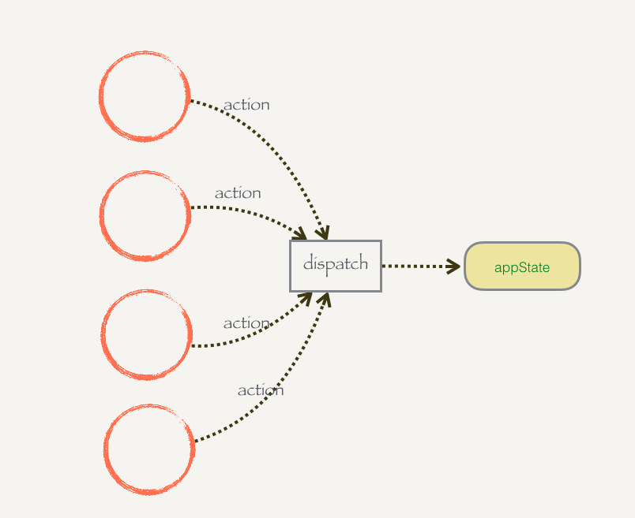
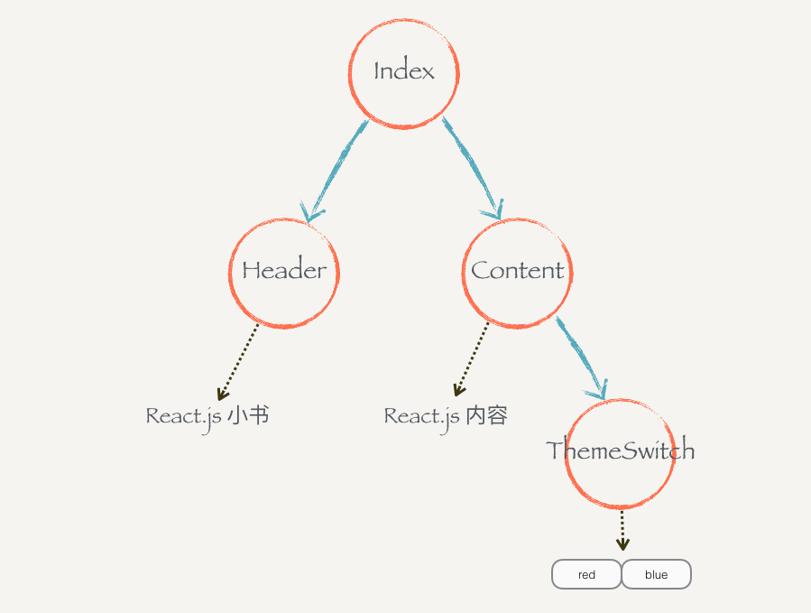
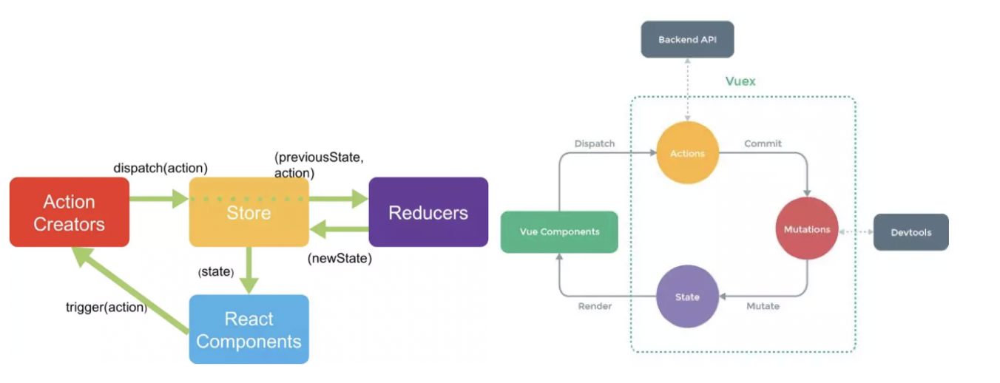

# React

<!-- 最好的方式，记录 React/Vue，就是创建一个相似的轮子出来。 -->

- React 核心
  - JSX
  - 虚拟 DOM
- React 组件化
- React 全家桶
- React 最佳实践
- React 原理剖析

一个组件有自己的显示形态（HTML 结构和内容）行为，组件的显示形态和行为可以由数据状态（state）和配置参数（props）共同决定。数据状态何配置参数的改变都会影响到这个组件的显示形态。React.js 也提供了一种非常高效的方式帮助我们做到了数据和组件显示形态之间的同步。

React.js 是一个帮助你构建页面的 UI 的库。React.js 不是一个框架，它只是一个库。它只提供 **UI （view）**层面的解决方案。React.js 将帮助我们将界面分成了各个独立的小块，每一个块就是组件，这些组件之间可以组合、嵌套，就成了我们的页面。

在实际的项目中，它并不能解决我们所有的问题，需要结合其他的库，例如 Redux、React-route 等来协助完整的解决方法。
通过命令快速生成一个 React 应用。

```bash
npx create-react-app comment-app
```

[[toc]]

## 1. 入门

### 前端组件化（一）：从一个简单的例子讲起

```html
<div class="wrapper">
  <button class="like-btn">
    <span class="like-text">点赞</span>
    <span>👍</span>
  </button>
</div>
```

```js
const button = document.querySelector(".like-btn");
const buttonText = button.querySelector(".like-text");
let isLiked = false;
button.addEventListener(
  "click",
  () => {
    isLiked = !isLiked;
    if (isLiked) {
      buttonText.innerHTML = "取消";
    } else {
      buttonText.innerHTML = "点赞";
    }
  },
  false
);
```

功能和实现都很简单，按钮已经可以提供点赞和取消点赞的功能。这时候你的同事跑过来了，说他很喜欢你的按钮，他也想用你写的这个点赞功能。这时候问题来了，你就会发现这种实现方式很致命：你的同事要把这个 `button` 和里面的结构复制过去，还有整段 JavaScript 代码也要复制过去。<u>这样的实现方式没有任何可复用性。</u>

痛点：无法结构复用

#### 结构复用

现在我们来重新编写这个点赞功能，让它具备一定的可复用。这次我们先写一个类，这个类有 `render` 方法，这个方法里面直接返回一个表示 HTML 结构的字符串：

```js
class LikeButton {
  render() {
    return `
          <button id='like-btn'>
            <span class="like-text">赞</span>
            <span>👍</span>
          </button>
        `;
  }
}
```

然后可以用这个类来构建不同的点赞功能的实例，然后把它们插到页面中。

```js
const wrapper = document.querySelector(".wrapper");
const likeButton1 = new LikeButton();
wrapper.innerHTML = likeButton1.render();

const likeButton2 = new LikeButton();
wrapper.innerHTML += likeButton2.render();
```

这里非常暴力地使用了 `innerHTML`，把两个按钮粗鲁地插入了 wrapper 当中。虽然你可能会对这种实现方式非常不满意，但我们还是勉强了实现了结构的复用。

解决：勉强的复用
痛点：无法组件化

#### 实现简单的组件化

你一定发现，现在按钮是死的，你点击它它根本不会有什么反应。因为根本没有往上面添加事件 。但是问题来了， `LikeButton` 类里面虽然说有一个 `button`，但是这玩意根本就是在字符串里面的。<u>你怎么能往一个字符串里面添加事件呢？DOM 事件 的 API 只有 DOM 结构才能用。</u>

我们需要 DOM 结构，准确来说：**我们需要这个点赞功能的 HTML 字符串表示的 DOM 结构。**假设我们现在有一个函数 `createDOMFromString`，你往这个函数传入 HTML 字符串，但是它会把相应的 DOM 元素返回给你。这个问题就可以解决了。

```js
// 我们需要这个点赞功能的 HTML 字符串表示的 DOM 结构，才能添加事件
const createDOMFromString = (domString) => {
  const div = document.createElement("div");
  div.innerHTML = domString;
  return div;
};
```

先不管这个函数应该怎么实现，先知道它是干嘛的。拿来用就好，这时候用它来改写一下 `LikeButton` 类。

```js
class LikeButton {
  render() {
    this.el = createDOMFromString(
      `
            <button id='like-btn'>
              <span class="like-text">点赞</span>
              <span>👍</span>
            </button>
          `
    );
    this.el.addEventListener(
      "click",
      () => {
        console.log("click");
      },
      false
    );
    return this.el;
  }
}
```

现在 `render()` 返回的不是一个 html 字符串了，而是一个由这个 html 字符串所生成的 DOM。在返回 DOM 元素之前会先给这个 DOM 元素上添加事件再返回。

因为现在 `render` 返回的是 DOM 元素，所以不能用 `innerHTML` 暴力地插入 wrapper。而是要用 DOM API 插进去。

```js
const wrapper = document.querySelector(".wrapper");
const likeButton1 = new LikeButton();
wrapper.appendChild(likeButton1.render());

const likeButton2 = new LikeButton();
wrapper.appendChild(likeButton2.render());
```

现在你点击这两个按钮，每个按钮都会在控制台打印 `click`，说明事件绑定成功了。但是按钮上的文本还是没有发生改变，只要稍微改动一下 `LikeButton` 的代码就可以完成完整的功能：

```js
class LikeButton {
  constructor() {
    this.state = { isLiked: false };
  }
  changeLikeText() {
    const likeText = this.el.querySelector(".like-text");
    this.state.isLiked = !this.state.isLiked;
    likeText.innerHTML = this.state.isLiked ? "取消" : "点赞";
  }
  render() {
    this.el = createDOMFromString(
      `
            <button id='like-btn'>
              <span class="like-text">点赞</span>
              <span>👍</span>
            </button>
          `
    );
    this.el.addEventListener("click", this.changeLikeText.bind(this), false);
    return this.el;
  }
}
```

这里的代码稍微长了一些，但是还是很好刘鹗 ii。只不过是在给 `LikeButton`类添加了构造函数，这个构造函数会给每一个 `LikeButton` 的实例添加一个对象 `state`，`state` 里面保存了每个按钮自己是否点赞的状态。还改写了原来的事件绑定函数：原来只打印 `click`，现在点击的按钮的时候会调用 `changeLikeText` 方法，这个方法会根据 `this.state` 的状态改变点赞按钮的文本。

现在这个组件的可复用性已经很不错了，你的同事们只要实例化一下然后插入到 DOM 里面去就好了。

**本地修改**

- 解决的问题：简单的组件化。
- 存在的痛点：dom 操作很多，复杂 changeLikeText。

### 前端组件化（二）：优化 DOM 操作

看看上一节我们的代码，仔细留意一下 `changeLikeTest` 函数，这个函数包含了 DOM 操作，现在看起来比较简单，那是因为现在只有 `isLiked` 一个状态。由于数据改变会导致需要我们去更新页面的内容，所以假想一下，如果你的组件依赖了很多状态，那么你的组件基本全部都是 DOM 操作。

<u>一个组件的显示状态由多个状态决定的情况非常常见。代码中混杂着对 DOM 的操作其实是一种不好的实践，手动管理数据和 DOM 之间的关系会导致代码可维护性变差、容易出错。</u>所以我们的例子这里还有优化的空间：如何尽量减少这种手动 DOM 操作？

#### 状态改变 -> 构建新的 DOM 元素更新页面

这里要提出的一种解决方案：**一旦状态发生改变，就重新调用 `render` 方法，构建一个新的 DOM 元素。**这样做的好处是上面呢？好处是你可以在 `render` 方法里面使用最新的 `this.state` 来构造不同的 HTML 结构的字符串，并且通过这个字符串构造不同的 DOM 元素。页面就更新了。

```js
class LikeButton {
  constructor() {
    this.state = { isLiked: false };
  }

  setState(state) {
    this.state = state;
    this.el = this.render();
  }

  changeLikeText() {
    this.setState({
      isLiked: !this.state.isLiked,
    });
  }

  render() {
    this.el = createDOMFromString(`
        <button class='like-btn'>
          <span class='like-text'>${this.state.isLiked ? "取消" : "点赞"}</span>
          <span>👍</span>
        </button>
      `);
    this.el.addEventListener("click", this.changeLikeText.bind(this), false);
    return this.el;
  }
}
```

其实只是改了几个小地方：

1. `render` 函数里面的 HTML 字符串会根据 `this.state` 不同而不同。
2. 新增一个 `setState` 函数，这个函数接受一个对象作为参数；它会设置实例的 `state` ，传入 `setState` 函数当中。

这样的结果就是，用户每次点击，`changeLikeText` 会构建新的 `state` 对象，这个新的 `state`，传入 `setState` 函数当中。

也就是说，**你只要调用 `setState`，组件就会重新渲染。**我们顺利地消除手动的 DOM 操作。

changeLikeText ➡️ setState ➡️ render（user-》model-》view）

#### 重新插入新的 DOM 元素

上面的改进不会有什么效果，因为你仔细看一下就会发现，其实重新渲染的 DOM 元素并没有插入到页面当中。所以在这个组件外面，你需要知道这个组件发生了改变，并且把新的 DOM 元素更新到页面当中。

```js
/**
 *
* @description: 设置实例的 state，然后重新调用一下 render 方法，
只要调用 setState() 组件就会重新渲染，这样就不用手动操作 dom 了。
* @param {Object}
* @return: null
*/
setState(state) {
  const oldEl = this.el;
  this.state = state;
  this.el = this.render();
  if (this.onStateChange) this.onStateChange(oldEl, this.el)
}
```

使用这个组件的时候：

```js
const wrapper = document.querySelector(".wrapper");
const likeButton = new LikeButton();
wrapper.appendChild(likeButton.render());
likeButton.onStateChange = (oldEl, newEl) => {
  wrapper.insertBefore(newEl, oldEl); // 插入新的元素
  wrapper.removeChild(oldEl); // 删除旧的元素
};
```

#### 小结

- 解决：每当 `setState` 构造完新的 DOM 元素后，就会通过 `onStateChange` 告知外部插入新的 DOM 元素，然后删除旧的元素，页面就更新了。不再需要手动更新。
- 这里每次 `setState` 都重新构造、新增、删除 DOM 元素，会导致浏览器进行大量的重排，严重影响性能，但是可以通过 Virtual-DOM 的策略规避掉。
- 痛点：如果需要另外做一个新组件，譬如说评论组件，那么里面的这些 setState 方法要重新写一遍，其实这些东西都可以抽出来，变成一个通用的模式。

### 前端组件化（三）：抽象出公共组件类

抽象公共组件类，不需要说实现其他组件，也要重新 setState 等方法。我们把这种模式抽象出来，放到一个 `Component` 类当中：

```js
class Component {
  constructor(props) {
    this.props = props; // 定制化配置
  }
  setState(state) {
    const oldEl = this.el;
    this.state = state;
    this._renderDOM();
    if (this.onStateChange) this.onStateChange(oldEl, this.el);
  }
  /**
   * @description: 构建 DOM 元素并监听 onClick 事件
   * @param {type}
   * @return: el
   */
  _renderDOM() {
    this.el = createDOMFromString(this.render());
    if (this.onClick) {
      this.el.addEventListener("click", this.onClick.bind(this), false);
    }
    return this.el;
  }
}
```

这个是一个组件父类 `Component` ，所有的组件都可以继承这个父类来构建。它定义的两个方法，一个是我们已经很熟悉的 `setState`；一个是私有方法 `_renderDOM`。`_renderDOM` 方法会调用 `this.render` 来构建 DOM 元素并且监听 `onClick` 事件。所以，组件子类继承的时候只需要实现一个返回 HTML 字符串的 `render` 方法就可以了。

下面是工具方法 `createDOMFromString` 和 `mount`。

```js
// 我们需要这个点赞功能的 HTML 字符串表示的 DOM 结构，才能添加事件
const createDOMFromString = (domString) => {
  const div = document.createElement("div");
  div.innerHTML = domString;
  return div;
};

/**
 * @description: 把组件的 DOM 元素插入到页面中
 * @param {Object}
 * @param {Object}
 * @return: null
 */
const mount = (component, wrapper) => {
  wrapper.appendChild(component._renderDOM());
  component.onStateChange = (oldEl, newEl) => {
    // 状态监听
    wrapper.insertBefore(newEl, oldEl);
    wrapper.removeChild(oldEl);
  };
};
```

业务组件类：

```js
class LikeButton extends Component {
  constructor(props) {
    super(props); // 调用父类的构造函数
    this.state = { isLiked: false };
  }
  onClick() {
    this.setState({
      isLiked: !this.state.isLiked,
    });
  }
  /**
   * @description: 返回 HTML 字符串
   * @param {type}
   * @return:
   */
  render() {
    return `
        <button id='like-btn' style="background-color: ${this.props.bgColor}">
          <span class="like-text">${this.state.isLiked ? "取消" : "点赞"}</span>
          <span>👍</span>
        </button>
      `;
  }
}

class RedBlueButton extends Component {
  constructor(props) {
    super(props);
    this.state = {
      color: "red",
    };
  }
  onClick() {
    this.setState({ color: "blue" });
  }
  render() {
    return `
        <div style="color: ${this.state.color};">${this.state.color}</div>
      `;
  }
}
```

实际应用：

```js
const wrapper = document.querySelector(".wrapper");
mount(new LikeButton({ bgColor: "green" }), wrapper);
mount(new RedBlueButton(), wrapper);
```

流程：挂载 ➡️ 状态变化 ➡️ 视图更新

- 初始化：`mount()` ➡️ `component._renderDOM()` ➡️ `render()`
- 交互： `setState` ➡️ `_renderDOM()` ➡️ `onStateChange()` ➡️ restartRender

需要手动调用 setState 驱动视图更新，而 vue 直接双向绑定更新。

#### 总结

我们用了很长的篇幅来讲一个简单的点赞的例子，并且在这个过程里面一直在优化编写的方式。最后抽离出来了一个类，可以帮助我们更好的微组件化。在这个过程里面我们学到了什么？

组件化可以帮助我们解决前端结构的复用性问题，整个页面可以由这样的不同的组件组合、嵌套构成。

一个组件有自己的显示形态（上面的 HTML 结构和内容）行为，组件的显示形态和行为可以由数据状态（state）和配置参数（props）共同决定。数据状态和配置参数的改变都会影响到这个组件的显示形态。

当数据变化的时候，组件的显示需要更新。所以如果组件化的模式能提供一种高效的方式自动化地帮助我们更新页面，那也就可以大大地降低我们代码的复杂度，带来更好的可维护性。

上面的 `Component` 类和 React 的 `Component` 使用方式很类似。掌握了这几节的课程，你基本就掌握了基础的 React.js 的概念。

接下来我们开始正式进行进入主题，开始正式介绍 React.js 。

## 2. 基础

### React.js 基本环境安装

#### 安装 React.js

React.js 单独使用基本上是不可能的事情。不要指望着类似 jQuery 下载到 `<head />` 标签就开始使用。使用 `React.js` 不管在开发阶段生产阶段都需要一堆工具和库辅助，编译阶段你需要借助 Babel；需要 Redux 等第三方的状态管理工具来组织代码；如果你要写单页面应用那么你需要 React-router。这就是所谓的 “React.js 全家桶”。

我们这里会直接使用 React.js 官网所推荐使用的工具 `create-react-app` 工具。它可以帮助我们一键生成所需要的工程目录，并帮我们做好各种配置和依赖，也帮我们隐藏了这些配置的细节。也就是所谓的 “开箱即用”。

```bash
npm install -g create-react-app
```

这条命令会往我们的机器上安装一条叫 `create-react-app` 的命令，安装好以后就可以直接使用它来构建一个 react 的前端工程：

```bash
create-react-app hello-react
```

这条命令会帮我们构建一个叫 `hello-react` 的工程，并且会自动地帮助我们安装所需要的依赖。

### 使用 JSX 描述 UI 信息

这一节，我们通过一个简单的例子讲解 React.js 描述页面 UI 的方式。把 `src/index.js` 中的代码改成：

```js
import React, { Component } from "react";
import ReactDOM from "react-dom";
import "./index.css";

class Header extends Component {
  render() {
    return (
      <div>
        <h1>React 小书</h1>
      </div>
    );
  }
}

ReactDOM.render(<Header />, document.getElementById("root"));
```

我们在文件头部从 `react` 的包当中引入了 `React` 和 React.js 的组件父类 `Component` 。记住，只要你写 React.js 组件，那么就必须引入这两个东西。

<u>`ReactDOM` 可以帮助我们把 React 组件渲染到页面上去，没有其他的作用了。</u>你可以发现它是从 `react-dom` 中引入的，而不是从 `react` 引入。有些朋友可能会疑惑，为什么不把这些东西都包含在 `react` 包当中呢？我们稍后会回答这个问题。

接下来的代码你看起来会比较熟悉，但又会有点陌生。你看其实它跟我们前几节里面讲的内容其实很类似，一个组件继承 `Component` 类，有一个 `render` 方法，并且把这个组件的 HTML 结构返回；这里 return 的东西就比较奇怪了，它并不是一个字符串，看起来像是纯 HTML 代码写在 JavaScript 代码里面。你也许会说，这不就是语法错误了么？这完全不是合法的 JavaScript 代码。这种看起来“在 JavaScript 写的标签的” 语法叫 JSX。

#### JSX 原理


```html
<div class="box" id="content">
  <div class="title">Hello</div>
  <button>Click</button>
</div>
```

每个 DOM 元素的结构都可以用 JavaScript 的对象来表示。一个 DOM 元素包含的信息其实只有三个：标签名，属性，子元素。

```js
const dom = {
  tag: "div",
  attrs: { className: "box", id: "content" },
  children: [
    {
      tag: "div",
      arrts: { className: "title" },
      children: ["Hello"],
    },
    {
      tag: "button",
      attrs: null,
      children: ["Click"],
    },
  ],
};
```

1. JSX 是 JavaScript 语言的一种语言扩展，长得像 HTML，但不是 HTML。
2. React.js 可以用 JSX 来描述你的组件长什么样的。
3. JSX 在编译的时候会变成相应的 JavaScript 对象描述。
4. `react-dom` 负责把这个用来描述 UI 信息的 JavaScript 对象变成 DOM 元素，并且渲染到页面上。

React 的 JSX 代码经过 babel + react 编译。

```jsx
<MyButton color="blue" shadowSize={2}>
  Click Me
</MyButton>
```

会编译为：

```js
React.createElement(MyButton, { color: "blue", shadowSize: 2 }, "Click Me");
```

#### 小结

要记住几个点：

1. JSX 是 JavaScript 语言的一种语法扩展，长的像 HTML，但并不是 HTML。
2. React.js 可以用 JSX 来描述你的组件长什么样的。
3. JSX 在编译的时候会变成相应的 JavaScript 对象描述。
4. `react-dom` 负责把这个用来描述 UI 信息的 JavaScript 对象变成 DOM 元素，并且渲染到页面上。

### 组件的 Render 方法

一个组件必须要实现一个 `render`方法，这个 `render` 方法必须要返回一个 `JSX`元素。但这里要注意的是，必须要用外层的 JSX 元素把所有内容包裹起来。

```js
...
render() {
  return (
    <div>
      <div>第一个</div>
      <div>第二个</div>
    </div>
  )
}
```

#### 表达式插入

在 JSX 当中通过 `{}` 插入 JavaScript 的表达式，包括变量、表达式计算、函数执行，`render` 会把这些代码渲染到页面上。

```js
render() {
  const word = 'is good'
  return (
    <div>
      <h1>React {word}</h1>
    </div>
  )
}
```

表达式不仅仅可以用在标签内部，也可以用在标签的属性上，例如：

```js
render() {
  const className = 'header'
  return (
    <div className={className}>
      <h1>React 小书</h1>
    </div>
  )
}
```

注意，直接使用`class` 在 React.js 的元素上添加类名如 `<div class="xxx"></div>`这种方式是不合法的。因为 `class` 是 JavaScript 的关键字，所以 `React.js` 中定义了一种新的方式：`className` 来帮助我们给元素添加类名。

还有一个特例是 `for` 属性，例如`<label for='male'>Male</label>`，因为 `for` 也是 JavaScript 的关键字，所以在 JSX 用 `htmlFor` 替代，即`<label htmlFor='male'>Male</label>`。而其他的 HTML 属性例如 ` style``data-* ` 等就可以像普通的 HTML 属性那样直接添加上去。

#### 条件返回

`{}` 可以放置任何表达式内容。我们可以在 `render` 函数内部根据不同条件返回不同的 JSX。例如：

```js
render() {
  cosnt isGoodWord = true
  return (
    <div>
      <h1>
        React 小书
        {isGoodWord ?
          <strong>is good</strong>
          : <span>is not good</span>
        }
      </h1>
    </div>
  )
}
```

如果在表达式插入里面返回`null`，那么 React.js 会什么都不显示，相当于忽略了该表达式插入。结合条件返回的话，我们就可以做到显示或者隐藏某些元素：

```js
...
render() {
  const isGoodWord = true
  <div>
    <h1>
      React 小书
      {isGoodWord}
        ? <strong>is good</strong>
        : null
    </h1>
  </div>
}
...
```

另外，布尔类型、Null 以及 Undefined 将会忽略，`false`，`null`，`undefined`，`true`都是合法的子元素，但它们不会被渲染，这有助于我们根据特定条件渲染其他的 React 元素。注意的是，有一些"falsy"值，如数字 0，仍然会被 React 渲染。因此，需要确保把它转为布尔类型。

```jsx
<div>{props.messages.length && <span>{props.messages}</span>}</div>
```

#### JSX 元素变量

JSX 元素就是 JavaScript 对象，因此 JSX 元素其实可以像 JavaScript 对象那样自由地赋值给变量，或者作为函数参数传递、或者作为函数的返回值。

```js
render() {
    const isGoodWord = true
    const className = 'header'
    const goodWord = <strong>is good</strong>
    const badWord = <strong>is not good</strong>
    return (  // 直接返回 HTML 代码，JSX 写法，需要经过编译成果 JavaScript 对象
      <div className={className}>
        <h1>React 小书 {isGoodWord ? goodWord : badWord}</h1>
      </div>
    )
  }
```

接收两个 JSX 元素作为参数

```js
 render() {
    const isGoodWord = true
    const className = 'header'
    const goodWord = <strong>is good</strong> // JSX 直接赋值给两个变量
    const badWord = <strong>is not good</strong>
    return (  // 直接返回 HTML 代码，JSX 写法，需要经过编译成果 JavaScript 对象
      <div className={className}>
        <h1>React 小书 {isGoodWord ? goodWord : badWord}</h1>
        <h1>React 小书 {this.renderGoodWord(goodWord, badWord)}</h1>
      </div>
    )
  }
  renderGoodWord(goodWord, badWord) {
    const isGoodWord = true;
    return isGoodWord ? goodWord : badWord
  }
```

### 组件组合、嵌套和组件树

组件组合，自定义的组件都必须要用大写字母开头，普通的 HTML 标签都用小写字母开头。

```js
class Title extends Component {
  render() {
    return <h1>Jecyu</h1>;
  }
}

class Header extends Component {
  // 继承 React.js 的组件父类 Component
  render() {
    const className = "header";
    return (
      // 直接返回 HTML 代码，JSX 写法，需要经过编译成果 JavaScript 对象
      <div className={className}>
        <Title />
        {/* 自定义的组件都必须要用大写字母开头，另外如果没有子元素，则可以自闭合标签 */}
      </div>
    );
  }
}
```

把组建组合起来，构成一个组件树。下面的页面是由`Header`，`Main`，`Footer` 几个部分组成，由一个 `Index` 把它们组合起来。

```js
class Title extends Component {
  render() {
    return <h1>Jecyu</h1>;
  }
}

class Header extends Component {
  // 继承 React.js 的组件父类 Component
  render() {
    // const isGoodWord = true
    const className = "header";
    return (
      // 直接返回 HTML 代码，JSX 写法，需要经过编译成果 JavaScript 对象
      <div className={className}>
        <Title />
        <h2>This is Header</h2>
      </div>
    );
  }
}

class Main extends Component {
  render() {
    return (
      <div>
        <h2>This is main content</h2>
      </div>
    );
  }
}

class Footer extends Component {
  render() {
    return (
      <div>
        <h2>This is footer</h2>
      </div>
    );
  }
}

class Index extends Component {
  render() {
    return (
      <div>
        <Header />
        <Main />
        <Footer />
      </div>
    );
  }
}
// ReactDOM 可以帮助我们把 React 组件渲染到页面中
ReactDOM.render(<Index />, document.getElementById("root"));
```


理解组件树的概念有利于我们理解数据是如何在组件树内自上而下流动过程。

### 事件监听

在 React.js 只需要给需要监听事件的元素加上属性类似于 `on*` 的属性，`on*`紧接着一个表达式插入，这表达式返回一个`Title`自己的一个实例方法。这些事件属性的名都必须用驼峰命名法。没有经过特殊处理的话，这些`on*`的事件监听智能用到普通的 HTML 标签上，而不能用在组件标签上。（ [SyntheticEvent - React](https://reactjs.org/docs/events.html#supported-events)——React 封装了不同类型的事件，不需要我们考虑不同浏览器兼容的问题。）

```js
class Title extends Component {
  handleClickOnTitle() {
    console.log("Click on title");
  }
  render() {
    return <h1 onClick={this.handleClickOnTitle}>Jecyu</h1>;
  }
}
```

注意：没有经过特殊处理的话，这些 `on~`的事件监听只能用在普通的 HTML 的标签上，而不能用在组件标签上。也就是说，`<Header onClick={…} />`这样的写法不会有什么效果的。

### event 对象

和普通浏览器一样，事件监听函数会被自动传入一个 event 对象，这个对象和普通的浏览器 event 对象所包含的方法和属性都基本一致。不同的是 React.js 中的 event 对象并不是浏览器提供的，而是它自己内部所构建的。

React.js 会给每个事件监听传入一个 event 对象，这个对象提供的功能和浏览器提供的功能一致，而且它是兼容所有浏览器的。

### 关于事件中的 this

一般在某个类的实例方法里面的`this`指的是这个实例本身。但是在 `handleClickOnTitle`打印的 `this`是 `null`或者`undefined`。

```js
...
handleClickOnTitle() {
  console.log('this :', this); // null
}
...
```

这是因为 React.js 调用你所传给它的方法的时候，并不是通过对象方法的方式调用（`this.handleClickOnTitle`），而是直接通过函数调用（`handleClickOnTitle`），所以以事件监听函数内并不能通过 `this`获取实例。

如果你想在事件函数当中使用当前的实例，你需要手动地将实例方法 `bind` 到当前实例上再传入给 React.js。

```js
class Title extends Component {
  handleClickOnTitle(word, event) {
    console.log("event.target.innerHTML :", event.target.innerHTML);
    console.log("this :", this);
    console.log(this, word);
  }
  render() {
    return (
      <h1 onClick={this.handleClickOnTitle.bind(this, "Hello")}>Jecyu</h1> // 把实例方法绑定到当前实例上，这样才可以在事件函数当中使用当前的实例
    );
  }
}
```

React.js 的事件监听方法需要手动 bind 到当前实例，这种模式在 React.js 中非常常用。

### 组件的 state 和 setState

#### state

一个组件的显示状态是可以由它**数据状态和配置参数**决定的。一个组件可以拥有自己的状态，就像一个点赞按钮，可以有“已点赞”和“未点赞”状态，并且可以在这两种状态之间进行切换。React.js 的 `state` 就是用来存储这种可变化的状态的。

```js
// 点赞、取消按钮
class LikeButton extends Component {
  constructor() {
    super();
    this.state = { isLiked: false };
  }
  handleClickOnLikeButton() {
    this.setState({
      isLiked: !this.state.isLiked,
    });
  }
  render() {
    return (
      <button onClick={this.handleClickOnLikeButton.bind(this)}>
        {this.state.isLiked ? "取消" : "点赞"}
      </button>
    );
  }
}
```

#### setState 接受对象参数

`setState` 方法由父类`Component`提供。当我们调用这个函数的时候，React.js 会更新组件的状态`state`，并且重新调用`render`方法，然后再把`render`方法渲染的最新的内容显示到页面上。

注意，当我们要改变组件的状态的时候，不能直接用`this.state=xxx`这种方式来修改，如果这样做 React.js 就没办法知道你修改了组件的状态，它也就没有办法更新页面。所以，一定要使用 React.js 提供的 `setState` 方法，它接受一个对象或者函数作为参数。

传入一个对象的时候，这个对象表示改组件的新状态。但你只需要传入需要更新的部分就可以了，而不需要传入整个对象。

```js
...
  constructor() {
    super()
    this.state = { name: 'Jecyu', isLiked: false }
  }
  handleClickOnLikeButton() {
    this.setState({
      isLiked: !this.state.isLiked  /// name 不需要传入
    })
  }
...
```

#### setState 接受函数参数

这里还有要注意的是，当你调用 `setState` 的时候，React.js 并不会马上修改 state。而是把这个对象放到一个更新队列里面，稍后才会从队列当中把新的状态提取出来合并到 state 当中，然后再触发组件更新。

```js
....handleClickOnLikeButton() {
  this.setState({ count: 0}) // => this.state.counte 还是 undefined
  this.setState({ count: this.state.count + 1}) // => undefined + 1 = NaN
  this.setState({ count: this.state.count + 2}) // => undefined + 2 = NaN
}
```

上面的代码的运行结果并不能达到我们的预期，我们希望 `count` 的运行结果是 3，最后得到却是 `NaN`。但是这种后续操作依赖前一个 `setState` 的结果的情况并不罕见。

因此，这里引出 `setState` 的第二种使用方式，可以接受一个函数作为参数。React.js 会把上一个 `setState` 的结果传入这个函数，你就可以使用该结果进行运算、操作，然后返回一个对象作为更新 `state` 的对象

```js
....handleClickOnLikeButton() {
  this.setState(prevState => return { count: 0}) // => this.state.counte 还是 undefined
  this.setState(prevState => return { count: prevState.count + 1}) // => undefined + 1 = NaN
  this.setState(prevState => return { count: prevState.count + 2}) // => undefined + 2 = NaN
}
```

#### setState 合并

上面我们进行了三次 `setState`，但是实际上组件只会重新渲染一次，而不是三次；**这是因为在 React.js 内部会把 JavaScript 事件循环中的消息队列的同一个消息中的`setState`都进行合并以后再重新更新渲染组件**。因此，在使用 React.js 的时候，并不需要担心多次进行 `setState` 会带来性能问题。

### 配置组件的 props

组件是相互独立、可复用的单元，一个组件可能在不同地方被用到。但是在不同的场景下对这个组件的需求可能会根据情况有所不同，例如一个点赞按钮上面显示的文本。如何让组件能适应不同场景下的需求，我们就需要让组件具有一定的“可配置”性。

React.js 的 `props` 就可以帮助我们达到这个效果。每个组件都可以接受一个 `props` 参数，它是一个对象，包含了所有你对这个组件的配置。（相对于 vue，还是 vue 的默认配置 default, required 等声明式好用。react 重用更灵活，vue 更容易上手）

```js
...
render() {
    const likedText = this.props.likedText || '取消';
    const unlikedText = this.props.unlikedText || '点赞';
    return (
      <button onClick={this.handleClickOnLikeButton.bind(this)}>
        {this.state.isLiked ? likedText : unlikedText}
      </button>
    )
  }
...
```

从 `rendner` 函数可以看出，组件内部是通过 `this.props` 的方式获取组件的参数的，如果 `this.props` 里面有需要的属性我们就采用相应的属性，没有的话就用默认的属性。

那么，怎么把 `props` 传进去呢？在使用一个组件的时候，可以把参数放在标签的属性当中，所有的属性都会作为 `props` 对象的键值：

```js
class Index extends Component {
  render() {
    return (
      <div>
        <LikeButton likedText="已赞" unlikedText="赞" />
      </div>
    );
  }
}
```

就像你在用普通的 `HTML` 标签的属性一样，可以把参数放在表示组件的标签上，组件内部就可以通过 `this.props` 来访问这些配置参数。前面说过 JSX 的表达式可以在标签属性上使用。因此可以把任何类型的数据作为组件的参数，包括字符串、数字、对象、数组、甚至是函数等等。

```js
class LikeButton extends Component {
  constructor() {
    super();
    this.state = { name: "Jecyu", isLiked: false };
  }
  handleClickOnLikeButton() {
    this.setState({
      isLiked: !this.state.isLiked,
    });
  }
  render() {
    const wordings = this.props.wordings || {
      likedText: "取消",
      unlikedText: "点赞",
    };
    return (
      <button onClick={this.handleClickOnLikeButton.bind(this)}>
        {this.state.isLiked ? wordings.likedText : wordings.unlikedText}
      </button>
    );
  }
}
```

```js
class Index extends Component {
  render() {
    return (
      <div>
        <LikeButton
          wordings={{ likedText: "已赞", unlikedText: "赞" }}
          onClick={() => console.log("Click on like button!")}
        />
      </div>
    );
  }
}
```

当每次点击按钮的时候，控制台显示'Click on like button!'。但这个行为不是点赞组件自己实现的，而是我们传进去的。所以，一个组件的行为、显示形态都可以用`props`来控制，就可以达到很好的可配置性。

#### 默认配置 defaultProps

上面的组件默认配置我们是通过 `||`操作符来实现。这种需要默认配置的情况在 React.js 中非常常见，所以 React.js 提供了一种方式 `defaultProps`，可以方便做到默认配置。

```js
class LikeButton extends Component {
  // 默认配置 defaultProps
  static defaultProps = {
    wordings: {
      likedText: "取消",
      unlikedText: "点赞",
    },
  };

  constructor() {
    super();
    this.state = { name: "Jecyu", isLiked: false };
  }
  handleClickOnLikeButton() {
    this.setState({
      isLiked: !this.state.isLiked,
    });
  }
  render() {
    return (
      <button onClick={this.handleClickOnLikeButton.bind(this)}>
        {this.state.isLiked
          ? this.props.wordings.likedText
          : this.props.wordings.unlikedText}
      </button>
    );
  }
}
```

`defaultProps` 作为点赞按钮组件的类属性，里面是对`props`中各个属性的默认配置。这样我们就不需要判断配置属性是否传进来了：如果没有传进来，会直接实用 `defaultProps` 中的默认属性。所以，在 `render` 函数中，我们会直接实用 `this.props` 而不需要再做判断。

#### props 不可变

`props` 一旦传入进来就不改变。**但是如果这个 props 是引用类型的话，则可以改变它的子属性。直接赋值才会报错。**

```js
...
handleClickOnLikeButton() {
    // this.props.wordings = {} // 报错
    // this.props.wordings.likedText = '暂时' // 不会报错
    this.setState({
      isLiked: !this.state.isLiked
    })
  }
...
```

你不能改变一个组件被渲染的时候传进来的 `props`。React.js 希望一个组件在输入确定的 `props` 的时候，能够输出确定的 UI 显示形态。如果 `props` 渲染过程中可以被修改，那么就会导致这个组件显示形态喝行为变得不可预测，这样可能给组件使用者带来困惑。

但这并不意味着由 `props` 形态不能被修改，组件的使用者可以主动地通过重新渲染的方式把新的 `props` 传入组件当中，这样这个组件由 `props` 决定的显示形态也会得到相应的改变。

```js
class Index extends Component {
  constructor() {
    super();
    this.state = {
      likedText: "已赞",
      unlikedText: "赞",
    };
  }

  handleClickOnChange() {
    this.setState({
      likedText: "取消",
      unlikedText: "点赞",
    });
  }

  render() {
    return (
      <div>
        <LikeButton
          likedText={this.state.likedText}
          unlikedText={this.state.unlikedText}
        />
        <div>
          <button onClick={this.handleClickOnChange.bind(this)}>
            修改 wordings
          </button>
        </div>
      </div>
    );
  }
}
```

通过 setState 重新渲染，所以 `LikeButton` 会接收到新的 `props`，并且重新渲染，于是它的显示形态也会得到更新。（这个跟 Vue 是不一样的）

### state `vs` props

`state` 的主要作用是用于保存、控制、修改自己的可变状态。`state` 在组件内部初始化，可以被组件自身修改，而外部不能访问也不鞥修改。你可以认为 `state` 是一个局部的、只能被组件自身控制的数据源。`state`中状态可以通过 `this.setState` 方法进行更新，`setState` 会导致组件的重新渲染。

`props` 的主要作用是让使用该组件的父组件可以传入参数来配置该组件。它是外部传进来的配置参数，组件内部无法控制也无法修改。除非外部组件主动传入新的 `props`，否则组件的 `props` 永远保持不变。

`state` 和 `props` 有着千丝万缕的关系。它们都可以决定组件的行为和显示形态。一个组件的 `state` 中的数据可以通过 `props` 传给子组件，一个组件可以使用外部传入的 `props` 来初始化自己的 `state`。**但是它们的职责其实非常清晰分明：`state`是让组件控制自己的状态，`props` 是让外部对组件自己进行配置。**

尽量少用 `state`，尽量多用 `props`。

没有 `state` 的组件叫无状态组件（stateless component），设置了 `state` 的叫做有状态组件（stateful component）。因为状态回带来管理的复杂性，我们尽量多写无状态组件，尽量少地写有状态的组件。这样会降低代码维护的难度，也会在一定程度上增强组件的可复用性。

React.js 非常鼓励无状态组件，引入了一种定义不能使用 `state` 组件，例如一个原来这样写的组件：

```js
class HelloWorld extends Component {
  constructor() {
    super();
  }

  sayHi() {
    alert("Hello World");
  }

  render() {
    return <div onClick={this.sayHi.bind(this)}>Hello World</div>;
  }
}
```

用函数式组件的编写方式就是：

```js
const HelloWorld = (props) => {
  const sayHi = (event) => alert("Hello World");
  return <div onnClick={sayHi}>Hello World</div>;
};
```

以前一个组件是通过继承 `Component` 来构建，一个子类就是一个组件。而用函数式的组件编写方式就是一个函数就是一个组件，你可以和以前一样通过`<HelloWorld/>` 使用该组件。不同的是，函数式组件只能接受 `props` 而无法像类组件一样可以在 `contructor`里面初始化 `state`。函数式组件就是一种只能接受 `props` 合提供 `render` 方法的类组件。

### 渲染列表数据

#### 渲染存放 JSX 元素的数组

假设现在我们有这么一个用户列表数据，存放在一个数组当中：

```js
const users = [
  {
    username: "Jerry",
    age: 21,
    gender: "male",
  },
  {
    username: "Crazy",
    age: 19,
    gender: "male",
  },
  {
    username: "Lily",
    age: 221,
    gender: "female",
  },
];
```

如果现在要把这个数组里面的数据渲染页面上要怎么做？回忆下，JSX 的表达式插入 `{}` 里面可以放任何数据，如果我们往 `{}` 里面存放一个 `JSX` 元素的数组会怎么样？

```js
...
class Index extends Component {
  constructor() {
    super()
    this.state = {
      likedText: '已赞',
      unlikedText: '赞'
    }
  }
  handlClickOnChange() {
    this.setState({
      likedText: '取消',
      unlikedText: '点赞'
    })
  }
  render() {
    return (
      <div>
         {
           [
             <span>React.js</span>,
             <span>is</span>,
             <span>good</span>
           ]
         }
      </div>
    )
  }
}
...
```

我们往 JSX 里面塞了一个数组，这个数组里面放了一些 JSX 元素（其实就是 JavaScript 对象）。到浏览器中，在页面上将会被渲染。

```html
<div>
  <span>React.js</span>
  <span>is</span>
  <span>good</span>
</div>
```

React.js 把插入表达式数组里面的每一个 JSX 元素一个个罗列下来，渲染到页面上。所以这里有个关键点：如果你往`{}`放一个数组，React.js 会帮你把数组里面一个个元素罗列并且渲染出来。

#### 使用 map 渲染列表数据

知道这一点以后你就可以知道怎么用循环把元素渲染到页面上：循环上面用户数组里面的每一个用户，为每个用户数据构建一个 JSX，然后把 JSX 放到一个新的数组里面，再把新的数组插入 `render` 方法的 JSX 里面。

```js
class User extends Component {
  render() {
    const { user } = this.props;
    return (
      <div>
        <div>姓名：{user.username}</div>
        <div>年龄：{user.age}</div>
        <div>性别：{user.gender}</div>
      </div>
    );
  }
}
class Index extends Component {
  constructor() {
    super();
    this.state = {
      likedText: "已赞",
      unlikedText: "赞",
    };
  }
  render() {
    return (
      <div>
        <div>
          {users.map((user, index) => (
            <User user={user} key={index} />
          ))}
        </div>
      </div>
    );
  }
}
```

### 实战分析：评论功能（一）

### ref 和 React.js 中的 DOM 操作

React.js 当中提供了 `ref` 属性来帮助我们获取已经挂载元素的 DOM 节点，你可以给某个 JSX 元素加上 `ref` 属性：

```js
class AutoFocusInput extends Component {
  componentDidMount() {
    this.input.focus();
  }
  render() {
    return (
      <input ref={(input) => this.input = input} />
    )
  }
}
ReactDOM.render(
  <AutoFocusInput />,
  document.getElementById('root');
)
```

可以 i 看到我们给 `input` 元素加了一个 `ref` 属性，这个属性值是一个函数。当 `input` 元素在页面上挂载完成以后，React.js 就会调用这个函数，并且把这个挂载以后的 DOM 节点传给这个函数。在函数中我们把这个 DOM 元素设置为组件实例的一个属性，这样以后我们就可以通过 `this.input` 获取到这个 DOM 元素。

### 前端应用状态管理——状态提升

### dangerouslySetHTML 和 style 属性

#### dangerouslySetHTML

出于安全考虑的原因（XSS 攻击），在 React.js 当中所有的表达式插入的内容都会被自动转义，就相当于 jQuery 里面的 `text(...)` 函数一样，任何的 HTML 格式都会被转义掉。

```js
<div
  className="daily-article-content"
  dangerouslySetInnerHTML={{ __html: this.state.data.body }}
>
  {/* { this.state.data.body }; */}
</div>
```

#### 组件划分

React.js 中一切都是组件，用 React.js 构建的功能其实也就是由各种组件组合而成。所以拿到一个需求以后，我么要做的第一件事就是理解需求、分析需求、划分这个需求由哪些组件构成。

组件的划分没有特别明确的标准。划分组件的目的性是为了代码可复用性、可维护性。只要某个部分有可能复用到别的地方，你都可以把它抽离出来当成一个组件；或者把某一部分抽离出来对代码的组织和管理带来帮助，你也可以毫不犹豫地把它抽离出来。

### PropTypes 和组件参数验证

```js
import PropTypes from "prop-types";

class Index extends Component {
  static childContextTypes = {
    themeColor: PropTypes.string,
  };

  constructor() {
    super();
    this.state = { themeColor: "red" };
  }

  getChildContext() {
    return { themeColor: this.state.themeColor };
  }

  render() {
    return (
      <div>
        <Header />
        <Main />
      </div>
    );
  }
}
```

### 生命周期

### 高阶组件（Higher-Order Components）

高阶组件是一个概念上很简单，但却非常常用、实用的东西，被大量 React.js 相关的第三方库频繁地使用。在前端的业务开发当中，你不掌握高阶组件其实也可以完成项目的开发，但是如果你能够灵活地使用高阶组件，可以让你代码更加优雅，复用性、灵活性更强。

#### 什么是高阶组件

高阶组件就是一个函数，传给它一个组件，它返回一个新的组件。

```js
const NewComponent = higherOrderComponent(OldComponent);
```

```js

```

#### 总结

**高阶组件是一个函数，传给它一个组件，它返回一个新的组件。**新的组件使用传入的组件作为子组件。

**高阶组件的作用是用于代码复用，**可以把组件之间可复用的代码、逻辑抽离到高阶组件当中。**新组件和传入的组件通过 `props` 传递消息。**

高阶组件有助于提高我们代码的灵活性，逻辑的复用性。灵活和熟练地掌握高阶组件的用法需要经验的积累还有长时间的思考和练习。

### React.js 的 context

了解 context 对理解 React-redux 很有好处。


React.js 的 context 就是这么一个东西，某个组件只要往自己的 context 里面放了某些状态，这个组件之下的所有子组件都直接访问这个状态而不需要通过中间组件的传递。一个组件的 context 只有它的子组件能够访问，它的父组件是不能访问的，你可以理解每个组件的 context 就是瀑布的源头，只能往下流而不能往上飞。

```js
import React, { Component } from "react";
import PropTypes from "prop-types";
import "./App.css";

class Index extends Component {
  static childContextTypes = { // 验证 getChildContext 返回的对象
    themeColor: PropTypes.string,
  };

  constructor() {
    super();
    this.state = { themeColor: "red" };
  }

  getChildContext() {
    return { themeColor: this.state.themeColor };
  }

  componentWillMount() {
    this.setState({ themeColor: "green" });
  }

  render() {
    return (
      <div>
        <Header />
        <Main />
      </div>
    );
  }
}

class Header extends Component {
  render() {
    return (
      <div>
        <h2>This is header</h2>
        <Title />
      </div>
    );
  }
}

class Main extends Component {
  render() {
    return (
      <div>
        <h2>This is main</h2>
        <Content />
      </div>
    );
  }
}

class Title extends Component {
  static contextTypes = {
    themeColor: PropTypes.string,
  };
  render() {
    return (
      <h1 style={{ color: this.context.themeColor }}>React.js 小书标题</h1>
    );
  }
}

class Content extends Component {
  render() {
    return (
      <div>
        <h2>React.js 小书内容</h2>
      </div>
    );
  }
}

function App() {
  return <Index />;
}

export default App;
```

#### 总结

一个组件可以通过 `getChildContext` 方法返回一个对象，这个对象就是子树的 context，提供 context 的组件必须提供 `childContextTypes` 作为 `context` 的声明和验证（这个跟 Vue 的 provide/inject 很像）。

如果一个组件设置了 context，那么它的子组件都可以直接访问到里面的内容，它就像这个组件为根的子树的全局变量。任意深度的子组件都可以通过 `contextTypes` 来声明你想要的 context 里面的哪些状态，然后可以通过 `thsi.context` 访问到那些状态。

context 打破了组件和组件之间通过 `props` 传递数据的规范，极大地增强了组件之间的耦合性。而且，就如全局变量一样，**context 里面的数据能被随意接触就能被随意修改，**每个组件都能够改 context 里面的内容会导致程序的运行不可预料。

但是这种机制对于前端应用状态管理来说是很有帮助，因为毕竟很多状态都会在组件之间共享，context 会给我们带来很大的方便。一些第三方的前端应用状态管理的库（例如 Redux）就是充分地利用了这种机制给我们提供便利的状态管理服务。但我们一般不需要手动写 context，也不要用它，只需要用好这些第三方的应用状态管理库就行了。

### 动手实现 Redux

#### 动手实现 Redux（一）：优雅地修改共享状态

要注意的是，Redux 和 React-redux 并不是同一个东西。**Redux 是一种架构模式（Flux 架构的一种变种），它不关注你到底用什么库，你可以把它应用到 React 和 Vue，甚至跟 jQuery 结合都没有问题**。**而 React-redux 就是把 Redux 这种架构模式和 React.js 结合起来的一个库，就是 Redux 架构在 React.js 中的体现。**


我们很难把控每一根指向 `appState` 的箭头，`appState` 里面的东西就无法把控。但现在我们必须通过一个“中间人”——`dispatch`，所有的数据修改必须通过它，并且你必须用 `action` 大声告诉它要修改什么，只有它允许的才能修改：



我们再也不用担心共享数据状态的修改的问题，我们只要把控了 `dispatch`，所有的对 `appState` 的修改就无所遁形，毕竟只有一根箭头指向 `appState` 了。

```js
let appState = {
  title: {
    text: "React.js 小书",
    color: "red",
  },
  content: {
    text: "React.js 小书内容",
    color: "blue",
  },
};

function dispatch(action) {
  switch (action.type) {
    case "UPDATE_TITLE_TEXT":
      appState.title.text = action.text;
      break;
    case "UPDATE_TITLE_COLOR":
      appState.title.color = action.color;
      break;
    default:
      break;
  }
}

function renderApp() {
  renderTitle(appState.title);
  renderContent(appState.content);
}

function renderTitle(title) {
  const titleDOM = document.getElementById("title");
  titleDOM.innerHTML = title.text;
  titleDOM.style.color = title.color;
}

function renderContent(content) {
  const contentDOM = document.getElementById("content");
  contentDOM.innerHTML = content.text;
  contentDOM.style.color = content.color;
}

renderApp(appState); // 首次渲染页面
dispatch({ type: "UPDATE_TITLE_TEXT", text: "《React.js 小书》" }); // 修改标题文本
dispatch({ type: "UPDATE_TITLE_COLOR", color: "blue" }); //修改标题颜色
renderApp(appState); // 把新的数据渲染到页面上
```

#### 动手实现 Redux（二）：抽离 store 和监控数据变化

#### 抽离 store

专门生产这种 `state` 和 `dispatch` 的集合

```js
function createStore(state, stateChanger) {
  const getState = () => state;
  const dispatch = (action) => stateChanger(state, action);
  return { getState, dispatch };
}
```

```js
let appState = {
  title: {
    text: "React.js 小书",
    color: "red",
  },
  content: {
    text: "React.js 小书内容",
    color: "blue",
  },
};

function stateChanger(state, action) {
  switch (action.type) {
    case "UPDATE_TITLE_TEXT":
      state.title.text = action.text;
      break;
    case "UPDATE_TITLE_COLOR":
      state.title.color = action.color;
      break;
    default:
      break;
  }
}

function createStore(state, stateChanger) {
  const getState = () => state;
  const dispatch = (action) => stateChanger(state, action);
  return { getState, dispatch };
}

function renderApp() {
  renderTitle(appState.title);
  renderContent(appState.content);
}

function renderTitle(title) {
  const titleDOM = document.getElementById("title");
  titleDOM.innerHTML = title.text;
  titleDOM.style.color = title.color;
}

function renderContent(content) {
  const contentDOM = document.getElementById("content");
  contentDOM.innerHTML = content.text;
  contentDOM.style.color = content.color;
}

const store = createStore(appState, stateChanger);

renderApp(store.getState()); // 首次渲染页面

store.dispatch({ type: "UPDATE_TITLE_TEXT", text: "《React.js 小书》" }); // 修改标题文本
store.dispatch({ type: "UPDATE_TITLE_COLOR", color: "blue" }); //修改标题颜色
renderApp(store.getState()); // 把新的数据渲染到页面上
```

#### 监控数据变化

```js
function createStore(state, stateChanger) {
  const listeners = [];
  const subscribe = (listener) => listeners.push(listener);
  const getState = () => state;
  const dispatch = (action) => {
    stateChanger(state, action);
    listeners.forEach((listener) => listener());
  };
  return { getState, dispatch, subscribe };
}
```

我们只需要 `subscribe` 一次，后面不管如何 `dispatch` 进行修改数据，`renderApp` 函数都会被重新调用，页面就会重新渲染。这样的订阅方式还有好处就是，以后我们还可以拿同一块数据渲染别的页面，这时 `dispatch` 导致的变化也会让每个页面都重新渲染。

```js
const store = createStore(appState, stateChanger)
store.subscribe(() => renderApp(store.getState()))
store.subscribe(() => renderApp2(store.getState()))
store.subscribe(() => renderApp3(store.getState()))
...
```

```js
let appState = {
  title: {
    text: "React.js 小书",
    color: "red",
  },
  content: {
    text: "React.js 小书内容",
    color: "blue",
  },
};

function stateChanger(state, action) {
  switch (action.type) {
    case "UPDATE_TITLE_TEXT":
      state.title.text = action.text;
      break;
    case "UPDATE_TITLE_COLOR":
      state.title.color = action.color;
      break;
    default:
      break;
  }
}

function createStore(state, stateChanger) {
  const listeners = [];
  const subscribe = (listener) => listeners.push(listener);
  const getState = () => state;
  const dispatch = (action) => {
    stateChanger(state, action);
    listeners.forEach((listener) => listener());
  };
  return { getState, dispatch, subscribe };
}

function renderApp() {
  renderTitle(appState.title);
  renderContent(appState.content);
}

function renderTitle(title) {
  const titleDOM = document.getElementById("title");
  titleDOM.innerHTML = title.text;
  titleDOM.style.color = title.color;
}

function renderContent(content) {
  const contentDOM = document.getElementById("content");
  contentDOM.innerHTML = content.text;
  contentDOM.style.color = content.color;
}

const store = createStore(appState, stateChanger);

// 首次渲染页面
store.subscribe(() => renderApp(store.getState()));
store.dispatch({ type: "UPDATE_TITLE_TEXT", text: "《React.js 小书》" }); // 修改标题文本
store.dispatch({ type: "UPDATE_TITLE_COLOR", color: "blue" }); //修改标题颜色
```

#### 总结

现在我们有了一个比较通用 `createStore`，它可以产生一种我们新定义的数据类型 `store`，通过 `store.getState` 我们获取共享状态，而且我们约定只能通过 `store.dispatch` 修改共享状态。`store` 也允许我们通过 `store.subscribe` 监听数据状态被修改了，并且进行后续的例如重新渲染页面的操作。

#### 动手实现 Redux（三）：纯函数（Pure Function）简介

简单来说，**一个函数的返回结果只依赖于它的参数，并且在执行过程里面没有副作用，我们就把这个函数叫做纯函数。**

1. 函数的返回结果只依赖于它的参数。
2. 函数执行过程里面没有副作用。

#### 函数的返回结果只依赖于它的参数

#### 函数执行过程没有副作用

一个函数执行过程对产生了**外部可观察的变化**那么就说这个函数是有副作用的。

```js
const a = 1;
const foo = (obj, b) => {
  obj.x = 2;
  return obj.x + b;
};
const counter = { x: 1 };
foo(counter, 2); // => 4
counter.x; // => 2
```

现在情况发生了变化，我在 `foo` 内部加了一句 `obj.x = 2`，计算前 `counter.x` 是 1，但是计算以后 `counter.x` 是 2。 `foo` 函数的执行对外部的 `counter` 产生了影响，它产生了**副作用**，因为它修改了外部传进来的对象，现在它是不纯的。

但是你在函数内部构建的变量，然后进行数据的修改不是副作用。

```js
const foo = (b) => {
  const obj = { x: 1 };
  obj.x = 2;
  return obj.x + b;
};
```

虽然 `foo` 函数内部修改了 `obj`，但是 `obj` 是内部变量，外部程序根本观察不到，修改 `obj` 并不会产生外部可观察的变化，这个函数是没有副作用的，因此它是一个纯函数。

除了修改外部的变量，一个函数在执行过程中还有很多方式产生**外部可观察的变化**，比如说调用 DOM API 修改页面，或者你发送了 Ajax 请求，还有调用 `window.reload` 刷新浏览器，甚至是 `console.log` 往控制台打印数据也是副作用。

#### 总结

一个函数的返回结果只依赖于它的参数，并且在执行过程里面没有副作用，我们就把这个函数叫做纯函数。

为什么要煞费苦心地构建纯函数？因为纯函数非常“靠谱”，执行一个纯函数你不用担心它会干什么坏事，它不会产生不可预料的行为，也不会对外部产生影响。不过何时何地，你给它什么它就会乖乖地吐出什么。如果你的应用程序大多数函数都是由纯函数组成，那么你的程序测试、调试起来非常方便。

#### 动手实现 Redux（四）：共享结构的对象提高性能

```js
state.title.text = action.text;
```

##### 共享结构的对象

##### 优化性能

修改 `stateChanger` ，让它修改数据的时候，并不会直接修改原来的数据 `state` ，而是产生上述的共享结构的对象

取而代之，我们新建一个 `appState`，新建 `appState.title` ，新建 `appState.title.text`：

```js
let newAppState = {
  // 构建新的对象 newAppState
  ...appState, // 复制 appState 里面的内容
  title: {
    // 用一个新对象覆盖原来的 title 属性
    ...appState.title, // 复制原来 title 对象里面的内容
    text: "《React.js 小书》", // 覆盖 text 属性
  },
};
```


`appState` 和 `newAppState` 其实是两个不同的对象，因为对浅复制的缘故，其实它们里面的属性 `content` 指向的是同一个对象；但是因为 `title` 被一个新的对象覆盖了，所以它们的 `title` 属性指向的对象是不同的。

```js
function createStore(state, stateChanger) {
  const listeners = [];
  const subscribe = (listener) => listeners.push(listener);
  const getState = () => state;
  const dispatch = (action) => {
    state = stateChanger(state, action);
    listeners.forEach((listener) => listener());
  };
  return { getState, dispatch, subscribe };
}

function renderApp(newState, oldAppState = {}) {
  // 防止 oldAppState 没有传入
  `if (newState === oldAppState) return;`; // 数据没有变化就不渲染
  console.log("render app...");
  renderTitle(newState.title, oldAppState.title);
  renderContent(newState.content, oldAppState.content);
}

function renderTitle(newTitle, oldTitle = {}) {
  if (newTitle === oldTitle) return; // 数据没有变化就不渲染了
  console.log("render title...");
  const titleDOM = document.getElementById("title");
  titleDOM.innerHTML = newTitle.text;
  titleDOM.style.color = newTitle.color;
}

function renderContent(newContent, oldContent = {}) {
  if (newContent === oldContent) return; // 数据没有变化就不渲染了
  console.log("render content...");
  const contentDOM = document.getElementById("content");
  contentDOM.innerHTML = newContent.text;
  contentDOM.style.color = newContent.color;
}

let appState = {
  title: {
    text: "React.js 小书",
    color: "red",
  },
  content: {
    text: "React.js 小书内容",
    color: "blue",
  },
};

function stateChanger(state, action) {
  switch (action.type) {
    case "UPDATE_TITLE_TEXT":
      return {
        // 构建新的对象并返回
        ...state,
        title: {
          ...state.title,
          color: action.color,
        },
      };
    case "UPDATE_TITLE_COLOR":
      return {
        // 构建新的对象并且返回
        ...state,
        title: {
          ...state.title,
          color: action.color,
        },
      };
    default:
      return state; // 没有修改，返回原来的对象
  }
}

const store = createStore(appState, stateChanger);
let oldState = store.getState(); // 缓存旧的 state
store.subscribe(() => {
  const newState = store.getState(); // 数据可能变化，获取新的 state
  renderApp(newState, oldState);
  oldState = newState; // 渲染完以后，新的 newState 变成了旧的 oldState，等待下一次更新
});

// 首次渲染页面
renderApp(store.getState()); // 首次渲染页面
store.dispatch({ type: "UPDATE_TITLE_TEXT", text: "《React.js 小书》" }); // 修改标题文本
store.dispatch({ type: "UPDATE_TITLE_COLOR", color: "blue" }); //修改标题颜色
```

并不需要担心每次修改都新建共享结构对象会有性能、内存问题，因为构建对象的成本非常低，而且我们最多保存两个对象引用 `oldState` 和 `newState` ，其余旧的对象都会被垃圾回收掉。

#### 动手实现 Redux（五）：不要问为什么的 reducer

stateChanger 现在既充当了获取初始化数据的功能，也充当了生成更新数据的功能。如果有传入 state 就生成更新数据，否则就是初始化数据。

```js
function stateChanger(state, action) {
  if (!state) {
    return {
      title: {
        text: "React.js 小书",
        color: "red",
      },
      content: {
        text: "React.js 小书内容",
        color: "blue",
      },
    }
  }
  switch (action.type) {
    case "UPDATE_TITLE_TEXT":
      return { // 构建新的对象并返回
        ...state,
        title: {
          ...state.title,
          color: action.color
        }
      }
    case "UPDATE_TITLE_COLOR":
      return { // 构建新的对象并且返回
        ...state,
        title: {
          ...state.title,
          color: action.color
        }
      }
    default:
      return state; // 没有修改，返回原来的对象
  }
}
```

更改 createStore

```js
function createStore(stateChanger) {
  let state = null;
  const listeners = [];
  const subscribe = (listener) => listeners.push(listener);
  const getState = () => state;
  const dispatch = (action) => {
    state = stateChanger(state, action);
    listeners.forEach((listener) => listener());
  };
  dispatch({}); // 初始化 state
  return { getState, dispatch, subscribe };
}
```

更改 stateChanger 为 reducer

#### reducer

`createStore` 接受一个叫 reducer 的函数作为参数，**这个函数规定是一个纯函数**，它接受两个参数，一个是 `state`，一个是 `action`。

如果没有传入 `state` 或者 `state` 是 `null`，那么它就会返回一个初始化的数据。如果有传入 `state` 的话，就会根据 `action` 来“修改”数据，但其实它没有、也规定不能修改 `state`，而是通过上节说的把修改路径的对象都复制一遍，然后产生一个新的对象返回。如果它不能识别你的 `action`，它就不会产生新的数据，而是（在 `default` 内部）把 `state` 原封不动地返回。

reducer 是不允许有副作用的。你不能在里面操作 DOM，也不能发 Ajax 请求，更不能直接修改 `state`，它要做的仅仅是 —— **初始化和计算新的 `state`**。

```js
function createStore(reducer) {
  let state = null;
  const listeners = [];
  const subscribe = (listener) => listeners.push(listener);
  const getState = () => state;
  const dispatch = (action) => {
    state = reducer(state, action);
    listeners.forEach((listener) => listener());
  };
  dispatch({}); // 初始化 state

  return { getState, dispatch, subscribe };
}

function themeReducer(state, action) {
  if (!state)
    return {
      themeName: "Red Theme",
      themeColor: "red",
    };
  switch (action.type) {
    case "UPATE_THEME_NAME":
      return { ...state, themeName: action.themeName };
    case "UPATE_THEME_COLOR":
      return { ...state, themeColor: action.themeColor };
    default:
      return state;
  }
}
const store = createStore(themeReducer);
```

#### 动手实现 Redux（六）：Redux 总结

createStore 创建状态管理库

> flux 架构之 Redux 模式

- 参数：

  - reducer：初始化和计算新的 `state`

    - ```js
      function themeReducer(state, action) {
        if (!state)
          return {
            themeName: "Red Theme",
            themeColor: "red",
          };
        switch (action.type) {
          case "UPATE_THEME_NAME":
            return { ...state, themeName: action.themeName };
          case "UPATE_THEME_COLOR":
            return { ...state, themeColor: action.themeColor };
          default:
            return state;
        }
      }
      ```

- 返回值：

  - dispatch：更新 state（核心）

    -  ```js
      const dispatch = (action) => {
          state = reducer(state, action);
          listeners.forEach((listener) => listener());
      };
      ```

  - getState（获取状态）

    - ```js
      const getState = () => state;
      ```

  - subscribe（订阅者）

    - ```js
      const subscribe = (listener) => listeners.push(listener);
      ```

1. 解决共享的状态被任意修改，必须通过 `dispatch` 执行某些允许的修改操作，而且必须大张旗鼓的在 `action`里声明。
2. 抽离 createStore 模式
   3. 使用 store.subscribe 订阅数据，解决手动渲染
   2. 引入“共享结构的对象”解决重新渲染性能问题

```js
// 定义一个 reducer
function reducer(state, action) {
  /* 初始化 state 和 switch case */
}

// 生成 store
const store = createStore(reducer)

// 监听数据变化重新渲染页面
store.subscribe(() => renderApp(store.getState()))

// 首次渲染页面
renderApp(store.getState())

// 后面可以随意 dispatch 了，页面自动更新
store.dispatch(...)
```

### 动手实现 React-redux

#### 动手实现 React-redux（一）：初始化工程

前端中应用的状态存在的问题：一个状态可能被多个组件**依赖**或者**影响**，而 React.js 并没有提供好的解决方案，我们只能把状态提升到**依赖**或者**影响**，而 React.js 并没有提供好的解决方案，我们只能把状态提升到**依赖**或者**影响**这个状态的所有组件的公共父组件上，我们把这种行为叫做状态提升。但是需求不停变化，共享状态没完没了地提升也不是办法。

后面我们在 React.js 的 context 中提升出，我们可用把共享状态放到父组件的 context 上，这个父组件下所有的组件都可以从 context 中直接获取到状态而不需要一层层地进行传递了。但是直接从 context 里面存放，获取数据增强了组件的耦合性；并且所有组件都可以修改 context 里面的状态就像谁都可以修改共享状态一样，导致程序运行的不可预料。

既然这样，为什么不**把 context 和 store 结合起来**？毕竟 store 的数据不是谁都能修改，而是约定只能通过 `dispatch` 来进行修改，这样的话每个组件既可以去 context 里面获取 store 从而获取状态，又不用担心它们乱改数据了。

（在 Vue 一些基础组件虽然没有使用 prodive/inject 或 vuex，但是同样使用了 redux 这样的思想）



#### 动手实现 React-redux （二）：结合 context 和 store

1. 父组件初始化 store，并通过 context 向下传递

```js
import React, { Component } from "react";
import PropTypes from "prop-types";
import "./App.css";
import Header from "./Header";
import Content from "./Content";

function createStore(reducer) {
  let state = null;
  const listeners = [];
  const subscribe = (listener) => listeners.push(listener);
  const getState = () => state;
  const dispatch = (action) => {
    state = reducer(state, action);
    listeners.forEach((listener) => listener());
  };
  dispatch({}); // 初始化 state

  return { getState, dispatch, subscribe };
}

function themeReducer(state, action) {
  if (!state)
    return {
      themeColor: "red",
    };
  switch (action.type) {
    case "CHANGE_COLOR":
      return { ...state, themeColor: action.themeColor };
    default:
      return state;
  }
}

const store = createStore(themeReducer);

class Index extends Component {
  static childContextTypes = {
    store: PropTypes.object,
  };

  getChildContext() {
    return {
      store,
    };
  }

  render() {
    return (
      <div>
        <Header />
        <Content />
      </div>
    );
  }
}

function App() {
  return <Index />;
}

export default App;
```

2. 子组件通过 contextTypes 声明接收：

```js
import React, { Component } from "react";
import Protypes from "prop-types";

class Header extends Component {
  static contextTypes = {
    store: Protypes.object,
  };
  constructor() {
    super();
    this.state = {
      themeColor: "",
    };
  }

  componentWillMount() {
    const { store } = this.context;
    this._updateThemeColor();
    store.subscribe(() => this._updateThemeColor());
  }

  _updateThemeColor() {
    const { store } = this.context;
    const state = store.getState();
    this.setState({ themeColor: state.themeColor });
  }

  render() {
    return <h1 style={{ color: this.state.themeColor }}>React.js 小书</h1>;
  }
}
export default Header;
```

3. store 数据更改：

```js
import React, { Component } from "react";
import PropTypes from "prop-types";

class ThemeSwitch extends Component {
  static contextTypes = {
    store: PropTypes.object,
  };

  constructor() {
    super();
    this.state = {
      themeColor: "",
    };
  }

  componentWillMount() {
    const { store } = this.context;
    this._updateThemeColor();
    store.subscribe(() => this._updateThemeColor()); // 更新 state，重新渲染数据
  }

  _updateThemeColor() {
    const { store } = this.context;
    const state = store.getState();
    this.setState({ themeColor: state.themeColor });
  }

  // dispatch action 去改变颜色
  handleSwitchColor(color) {
    const { store } = this.context;
    store.dispatch({  // 更改数据
      type: "CHANGE_COLOR",
      themeColor: color,
    });
  }

  render() {
    return (
      <div>
        <button
          style={{ color: this.state.themeColor }}
          onClick={this.handleSwitchColor.bind(this, "red")}
        >
          Red
        </button>
        <button
          style={{ color: this.state.themeColor }}
          onClick={this.handleSwitchColor.bind(this, "blue")}
        >
          Blue
        </button>
      </div>
    );
  }
}

export default ThemeSwitch;
```


#### 动手实现 React-redux（三）：connect 和 mapStateToProps

我们来观察一下刚写的这几个组件，可以轻易地发现它们有两个重大的问题：

1. **有大量重复的逻辑**：
2. **对 context 依赖性过强**：（connect 解决）


```js
export const connect = (WrappedComponent) => {
  class Connect extends Component {
    static contextTypes = {
      store: PropTypes.object,
    };
		// TODO：如何从 store 获取数据
    render() {
      return <WrappedComponent />;
    }
  }
  return Connect;
};
```

`connect` 函数接受一个组件 `WrappedComponent` 作为参数，把这个组件包含在一个新的组件 `Connect` 里面，`Connect` 会去 `context` 里面取出 store。现在要把 store 里面的数据取出来通过 `props` 传给 `WrappedComponent`。

但是每个传进去的组件需要 store 里面的数据都是不一样的，所以除了给高阶组件传入 Dumb 组件以外，还要告诉高级组件我们需要什么数据，高阶组件才能正确地去取数据。为了解决这个问题，我们可以给高阶组件传入类似下面这样的函数：

```js
const mapStateToProps = (state) => {
  return {
    themeColor: state.themeColor,
  };
};
```

```js
export const connect = (mapStateToProps) => (WrappedComponent) => {
  class Connect extends Component {
    static contextTypes = {
      store: PropTypes.object,
    };

    render() {
      const { store } = this.context;
      let stateProps = mapStateToProps(store.getState());
      // {...stateProps} 意思是把这个对象里面的属性全部通过 `props` 方式传递进去
      return <WrappedComponent {...stateProps} />;
    }
  }
};
```

使用:

```js
import React, { Component } from "react";
import Protypes from "prop-types";
import { connect } from "./react-redux";

class Header extends Component {
  static propsTypes = {
    themeColor: Protypes.string,
  };
	// 删除大部分关于 context 的代码
  //   componentWillMount() {
  //     const { store } = this.context;
  //     this._updateThemeColor();
  //     store.subscribe(() => this._updateThemeColor())
  //   }

  //   _updateThemeColor() {
  //     const { store } = this.context;
  //     const state = store.getState();
  //     this.setState({ themeColor: state.themeColor });
  //   }

  render() {
    return <h1 style={{ color: this.props.themeColor }}>React.js 小书</h1>;
  }
}

const mapStateToProps = (state) => {
  return {
    themeColor: state.themeColor,
  };
};

Header = connect(mapStateToProps)(Header);

export default Header;
```

给 connect 增加事件监听数据变化：

```js
import React, { Component } from "react";
import PropTypes from "prop-types";

export const connect = (mapStateToProps, mapDispatchToProps) => (WrappedComponent) => {
  class Connect extends Component {
    static contextTypes = {
      store: PropTypes.object,
    };

    constructor() {
      super();
      this.state = { allProps: {} }; // 1.用来保存需要传给被包装组件的所有的参数
    }

    componentWillMount() {
      const { store } = this.context;
      this._updateProps(); // 初始化 Props
      store.subscribe(() => this._updateProps()); // 2.监听数据变化，重新调用 _updateProps
    }

    _updateProps() {
      const { store } = this.context;
      // 3. 可以把传给 Connect 组件的 props 参数也传给它，props + state 生成被包装组件的参数
      let stateProps = mapStateToProps ? mapStateToProps(store.getState(), this.props) : {}; // 防止 mapStateToProps 没有传入
      this.setState({
        allProps: {
          // 整合普通的 props 和从 state 生成的 props
          ...stateProps,
          ...this.props,
        },
      });
    }

    render() {
      // 传递 props 数据
      return <WrappedComponent {...this.state.allProps} />; 
    }
  }
  return Connect;
};

```

#### 动手实现 React-redux（四）：mapDispatch

既然可以通过 `connect` 函数传入 `mapStateProps` 来告诉它如何获取，我们也可以想到，可以给它传入另外一个参数来告诉它我们的组件需要如何触发 `dispatch`。我们把这个参数叫 `mapDispatchToProps`：

```js
const mapDispatchProps = (dispatch) => {
  return {
    onSwitchColor: (color) => {
      dispatch({ type: "CHANGE_COLOR", themeColor: color });
    },
  };
};
```

现在我们 改造 connect 组件，以接收 mapDispatchToProps 参数。

```js
import React, { Component } from "react";
import PropTypes from "prop-types";

export const connect = (mapStateToProps, mapDispatchToProps) => (
  WrappedComponent
) => {
  class Connect extends Component {
    static contextTypes = {
      store: PropTypes.object,
    };

    constructor() {
      super();
      this.state = { allProps: {} };
    }

    componentWillMount() {
      const { store } = this.context;
      this._updateProps();
      store.subscribe(() => this._updateProps());
    }

    _updateProps() {
      const { store } = this.context;
      let stateProps = mapStateToProps
        ? mapStateToProps(store.getState(), this.props)
        : {}; // 防止 mapStateToProps 没有传入
      let dispatchProps = mapDispatchToProps
        ? mapDispatchToProps(store.dispatch, this.props)
        : {}; // 防止 mapDispatchProps 没有传入
      this.setState({
        allProps: {
          // 整合普通的 props 和从 state 生成的 props
          ...stateProps,
          ...dispatchProps,
          ...this.props,
        },
      });
    }

    render() {
      // 在 render 中传递出去
      return <WrappedComponent {...this.state.allProps} />; 
    }
  }
  return Connect;
};
```

改造 ThemeSwitch 组件

```js
import React, { Component } from "react";
import PropTypes from "prop-types";
import { connect } from "./react-redux";

class ThemeSwitch extends Component {
  static contextTypes = {
    themeColor: PropTypes.string,
  };

  constructor() {
    super();
    this.state = {
      themeColor: "",
    };
  }

  // dispatch action 去改变颜色
  handleSwitchColor(color) {
    if (this.props.onSwitchColor) {
      this.props.onSwitchColor(color);
    }
  }

  render() {
    return (
      <div>
        <button
          style={{ color: this.props.themeColor }}
          onClick={this.handleSwitchColor.bind(this, "red")}
        >
          Red
        </button>
        <button
          style={{ color: this.props.themeColor }}
          onClick={this.handleSwitchColor.bind(this, "blue")}
        >
          Blue
        </button>
      </div>
    );
  }
}

const mapStateProps = (state) => {
  return {
    themeColor: state.themeColor,
  };
};

const mapDispatchProps = (dispatch) => {
  return {
    onSwitchSwolor: (color) => {
      dispatch({ type: "CHANGE_COLOR", themeColor: color });
    },
  };
};

ThemeSwitch = connect(mapStateProps, mapDispatchProps)(ThemeSwitch);

export default ThemeSwitch;
```

React-redux 与直接在 vuex 声明 action 不同，它可以按需传递 mapDispatchToProps的。比 vue 组件直接依赖 vuex 灵活干净，光看 ThemeSwitch 内部，是非常清爽干净的，只依赖外界传进来的 `themeColor` 和 `onSwitchColor`。**但 `ThemeSwitch`内部并不知道这两个参数其实都是我们去 `store` 里面取的**，它是 Dumb 的。这时候三个组件的重构都已经完成了，代码大大减少、不依赖 context，并且功能和原来一样。

#### 动手实现 React-redux（五）：Provider

我们要把 context 相关的代码从所有业务组件中清除出去，现在的代码里面还有一个地方是被污染的。那就是 `src/index.js` 里面的 `Index：

```js
class Index extends Component {
  static childContextTypes = {
    store: PropTypes.object,
  };

  getChildContext() {
    return {
      store,
    };
  }

  render() {
    return (
      <div>
        <Header />
        <Content />
      </div>
    );
  }
}
```

其实它要用 `context` 就是因为要把 `store` 存放到里面，好让子组件 `connect` 的时候能够取到 `store`。我们可以额外构建一个组件来做这种脏活，然后让这个组件成为组件树的根节点，那么它的子组件都可以获取 context 了。

我们把这个组件叫 `Provider`，因为它提供（provide）了 `store`：


Provider 做的事情也很大简单，它就是一个容器组件，会把嵌套的内容原封不动作为自己的子组件渲染出来。它还会把外界传给它的 `props.store` 放到 context，这样子组件 `connect` 的时候都可以获取到。

```js
export class Provider extends Component {
  static propTypes = {
    store: PropTypes.object,
    children: PropTypes.any,
  };

  static childContextTypes = {
    store: PropTypes.object,
  };

  getChildContext() {
    return {
      store: this.props.store,
    };
  }

  render() {
    return <div>{this.props.children}</div>;
  }
}
```

使用：

```js
ReactDOM.render(
    <Provider store={store}> // 把 Provider 做诶组件树的根节点
      <Index />
    </Provider>,
	document.getElementById('root')
)

```

#### 动手实现 React-redux（六）：React-redux 总结

React.js 除了状态提升以外并没有更好的办法帮助我们解决组件之间共享状态的问题，而使用 context 全局变量让程序变得不可预测。通过 Redux 的章节，我们知道 store 里面的内容是不可以随意修改的，而是通过 dispatch 才能变更里面的 state。所以我们尝试把 store 和 context 结合起来使用，可以**兼顾组件之间共享状态问题和共享状态可能被任意修改**的问题。

1. store + context
2. connect + context
3. contect：mapStateToProps + mapDispatchProps
4. Provider

#### 使用真正的 Redux 和 React-redux


在工程目录下使用 npm 安装 Redux 和 React-redux 模块：

```sh
npm install redux react-redux --save
```

把 src/ 目录下 Header.js、ThemeSwitch.js、Content.js 的模块导入中的：

```js
import { connect } from "./react-redux";
```

改成：

```js
import { connect } from "react-redux";
```

也就是本来从本地 ./react-redux 导入的 connect 改成从第三方 react-redux 模块中导入。

实战分析

### React-Redux vs Vuex


### Dva

Dva = React + React-Router + React-Saga


### 性能优化

### 通信

#### 父子通信

#### 兄弟组件通信

#### 跨多层次组件通信

#### 任意组件

### React 状态管理

## 3. 项目实战

 React 开发总结持续更新

目标读者：

reactjs 怎么实现监听数据对象
https://github.com/ant-design/ant-design/issues/26890

### 个人博客系统

### React 后台运维管理系统

1. 运维系统由于历史原因，采用的是 react 技术栈。本周在实现用户同步时，遇到一个 modal 的显示/隐藏问题，因为习惯了 vue 的写法，以为传入 visible 后，不需要手动改变 visible 的值，点击关闭 close 即可实现，让组件内部进行更改 visible 的属性。但是 react 不允许这样做，必须让调用者显式使用 `setState({ vsible: false })`，才能关闭。如下图，必须要给 onCancel 填入回调函数，即使你没有取消的按钮。因为 close icon 也会调用。

  

​    这是因为 react 中并没有实现双向绑定，而 vue 实现了双向绑定，但是这并不是他们的设计区别，因为双向绑定只不过是 value 的单向绑定 + onChange 事件侦听的一个语法糖，在组件 modal 内部更新了 visible 的值，而 vue 是响应式的，这是会重新渲染视图。而因为 React 的目标不是让开发者写更少的代码，二是让代码结构更加清晰易于维护，因此需要你手动调用 setState 明确告诉它来重新刷行。vue 双向绑定有时候加大状态的维护调试成本，但是对于基础组件来说双向绑定却挺好用。

2. 运维前端应用依赖的状态管理库。本周在实现运维用户加载优化时专门去研究运维的状态工具 react-redux、dva（dva是对（redux + react-router + redux-sage）的轻量封装），实现一个简单的 react-redux，发现它们跟 vuex 挺类似，都是使用 flux 数据流思想。（redux-vuex）



#### 单向数据流与双向绑定

在实现 NrSlidePanelNew，就使用了 v-model 双向绑定，但是这样违反了 react 的原则，它只是一个视图层，render 函数的接收应该遵循输入与输出一致，内部不应该改变外部的 prop 状态，应该是无副作用的。

这个不是正常行为吗，不改变 visible 的状态怎么控制 Modal 的打开和关闭，具体就是不能双向绑定了。但是逻辑清晰。
[react 不实现双向绑定的原因是什么呢，提高用户动手能力？](https://www.zhihu.com/question/300849926)

```js
import React from "react";
import ReactDOM from "react-dom";
import "antd/dist/antd.css";
import "./index.css";
import { Modal, Button } from "antd";

class App extends React.Component {
  state = { visible: false };

  showModal = () => {
    this.setState({
      visible: true,
    });
  };

  handleOk = (e) => {
    console.log(e);
    this.setState({
      visible: false,
    });
  };

  // react 需要手动设置 setState 回调，不能在组件内部更新 visible 吗？
  handleCancel = (e) => {
    console.log(e);
    this.setState({
      visible: false,
    });
  };

  render() {
    return (
      <>
        <Button type="primary" onClick={this.showModal}>
          Open Modal
        </Button>
        <Modal
          title="Basic Modal"
          visible={this.state.visible}
          onOk={this.handleOk}
          // onCancel={this.handleCancel}
          footer={null}
        >
          <p>Some contents...</p>
          <p>Some contents...</p>
          <p>Some contents...</p>
        </Modal>
      </>
    );
  }
}

ReactDOM.render(<App />, document.getElementById("container"));
```

connect 状态。

#### Dva 状态管理

## 4. 底层原理

### 理念篇

### 架构篇之 render 阶段

### 架构篇之 commit 阶段

### 实现篇之 Diff 算法

### 实现篇之状态更新

### 实现篇之 Hooks

### 实现篇之 Concurrent Mode

## 常见问题

### 使用 react，实现类似 vue 的指令 v-html 的功能

```jsx
<div
  className="daily-article-content"
  dangerouslySetInnerHTML={{ __html: this.state.data.body }}
>
  {/* { this.state.data.body }; */}
</div>
```

### 在 React 中使用原生事件

由于原生事件需要绑定在真实 DOM 上，所以一般是在 componentDidMount 阶段/ref 的函数执行阶段进行绑定操作，在 componentWillUnmount 阶段进行解绑操作以避免内存泄漏。如果涉及到跨组件的话，如在父组件里监听子组件的事件，可以通过 `props` 把父组件的函数传递给子组件，如下面这个例子：

```jsx
// parent
list.stories.map((item) => (
  <Item
    key={item.id}
    data={item}
    onClick={
      // 传递 onClick 属性给组件
      this.handleClick.bind(this, item.id)
    }
  ></Item>
));
```

child

```js
import "./index.scss";
import $ from "../../utils/base";
import React, { Component } from "react";
import ReactDOM from "react-dom";

class Item extends Component {
  static defaultProps = {
    data: {},
  };
  constructor(props) {
    super(props);
    this.state = {
      imgPath: $.imgPath,
    };
  }
  componentDidMount() {
    // 获取当前真实 DOM 元素
    const thisDOM = ReactDOM.findDOMNode(this);
    thisDOM.addEventListener("click", this.props.onClick, false);
  }
  componentWillUnmount() {
    const thisDOM = ReactDOM.findDOMNode(this);
    thisDOM.removeEventListener("click", this.props.onClick);
  }
  render() {
    return (
      <a className="daily-item">
        {this.props.data.images ? (
          <div className="daily-img">
            
          </div>
        ) : null}
        <div
          className="daily-title"
          className={!this.props.data.images ? "noImg" : null}
        >
          {this.props.data.title}
        </div>
      </a>
    );
  }
}

export default Item;
```

Redux 有很多的 Reducer，对于大型应用来说，State 必然十分庞大，导致 Reducer 函数也十分庞大，所以需要做拆分。Redux 里每一个 Reducer 负责维护 State 树里面的一部分数据，多个 Reducer 可以通过 combineReducers 方法合成一个根 Reducer，这个根 Reducer 负责维护整个 State。

### 中间件

#### 处理异步

Redux 

Dva 的研究使用

## 5. 小结

## 参考资料

- [reactjs 怎么实现监听数据对象](reactjs怎么实现监听数据对象)
- 手动实现 redux，再阅读：[前端状态管理 Vuex、Flux、Redux、Redux-saga、Dva、MobX](https://mp.weixin.qq.com/s/T3UeN2-RjSNP0mGjJr0PDw)，效果棒棒
- [深入 JSX](https://zh-hans.reactjs.org/docs/jsx-in-depth.html#___gatsby)
- [React 小书](http://huziketang.mangojuice.top/books/react/lesson3)
- [Vue 与 React 的对比](https://www.cnblogs.com/Tohold/p/9511679.html)
- [Vue 进阶必学之高阶组件 HOC](https://juejin.im/post/6844904116603486221?utm_source=gold_browser_extension#heading-4)
- [「React进阶」 React全部api解读+基础实践大全(夯实基础2万字总结)
  https://juejin.cn/post/6950063294270930980?utm_source=gold_browser_extension#heading-43]