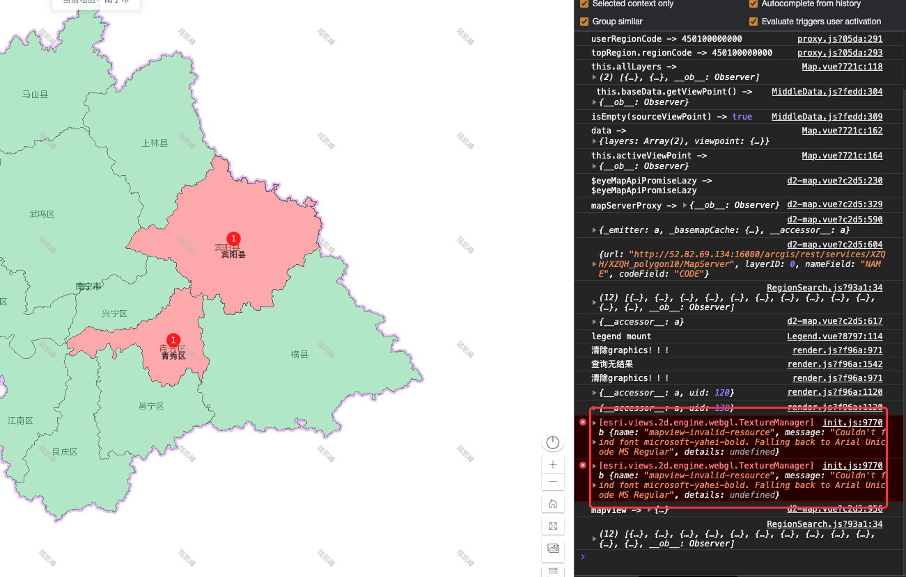

# Arcgis 本地部署字体样式文件




（时间轴）路线：先是获取官方字体，再是进行字体的转换处理。

即使已经有 arial unicode 字体，它还是会先请求 microsoft-yahei-bold，这样会推迟响应，以及让测试人员觉得是程序的错误。

作一篇文章。

- arcgis api for js 什么时候渲染会使用到自定义的字体显示（symbol 的设置）。为什么在 css 全局设置字体不行呢？
- Arcgis 渲染时需要加载字体有哪些
- 在哪里下载
- 如何转换为 pbf

Convertio 扩展，可以把 ttc 转换为 ttf 字体。如果你的 window 里下载的字体是 ttc 结尾的话。

https://github.com/sabas/genfontgl
https://github.com/mapbox/node-fontnik

```js
/*
 * @Author: Jecyu
 * @Date: 2021-01-05 17:13:22
 * @LastEditors: Jecyu
 * @LastEditTime: 2021-01-05 18:51:19
 * @FilePath: /examples/7-gis/字体/convert.js
 * @Description:
 */
const fontnik = require("fontnik");
const fs = require("fs");
const path = require("path");

const convert = function(fileName, outputDir) {
  const font = fs.readFileSync(path.resolve(__dirname + "/", fileName));
  output2pbf(font, 0, 255, outputDir);
};

function output2pbf(font, start, end, outputDir) {
  if (start > 65535) {
    console.log("done!");
    return;
  }
  fontnik.range({ font, start, end }, (err, res) => {
    if (err) {
      console.error(err);
    }
    const outputFilePath = path.resolve(
      `${__dirname}/${outputDir}/${start}-${end}.pbf`
    );
    fs.writeFile(outputFilePath, res, function(err) {
      if (err) {
        console.error(err);
      } else {
        output2pbf(font, end + 1, end + 1 + 255, outputDir);
      }
    });
  });
}

// convert(
//   "./fonts/microsoft-yahei-regular.ttf",
//   "./fonts/pbf/microsoft-yahei-regular"
// );
convert("./fonts/microsoft-yahei-bold.ttf", "./fonts/pbf/microsoft-yahei-bold");
```

让 ArcGIS 字体库 本地化部署。在升级 API 为 4.12 的时候，文字渲染时会去请求 https://static.arcgis.com/fonts 的字体文件，而由于在正式环境中，内网是无法请求到这个资源的。于是会出现以下的报错，导致气泡上的文字无法显示：

        这个时候，只能是把这些字体文件下载下来，部署在内网的服务器上即可。于是我到官网社区上找到以下说明：

        一句话：我们没提供下载，你自己看着办。看看那些字体文件这么多的网络请求，总不能一条一条的去请求保存浏览器吧。
        分割线：================================================
        为什么使用 .pbf 格式，通常的字体库都是以 ttf 等格式的，但是 ttf 文件通常都比较大，比如宋体的 ttf 文件大小为 17.3 M，每次请求都要加载 17.3 M 的数据并且还要去解析，这个对于客户端以及服务端的压力都非常大。而 pbf（protocol buffer 是 google 的一个开源项目，用于结构化数据串行化。）分批请求，大大减小请求压力。

如果你认真的看下前面的图，你可以发现一些规律，0-255、40448-40703 等，以 255 的间隔去分割。这是根据字符编码范围进行分段的，Unicode
采用 2 个字节编码，所以字符的范围是 [0, 65525]，然后每一段的字体请求的命名方式为 `start-end.pdf`。是时候祭出 node 了。

参考资料

- https://www.jianshu.com/p/23634e54487e
- [Mapbox GL JS 学习笔记六：Mapbox 样式字体本地化方法](https://zhuanlan.zhihu.com/p/31419736)
- https://github.com/mapbox/tiny-sdf/security
- https://www.npmjs.com/package/fontnik
- [mapbox/node-fontnik工具使用介绍](https://www.jianshu.com/p/23634e54487e)