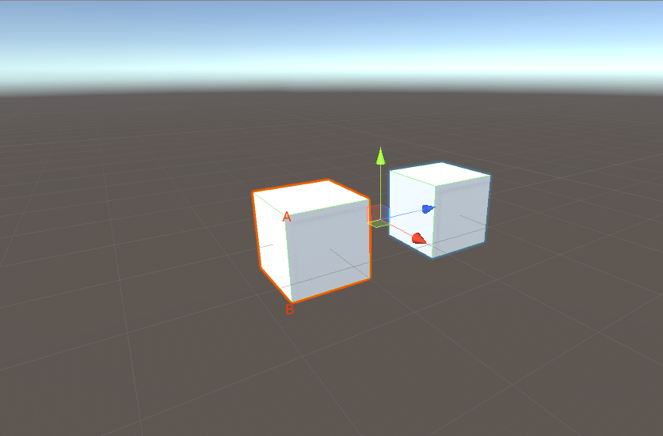
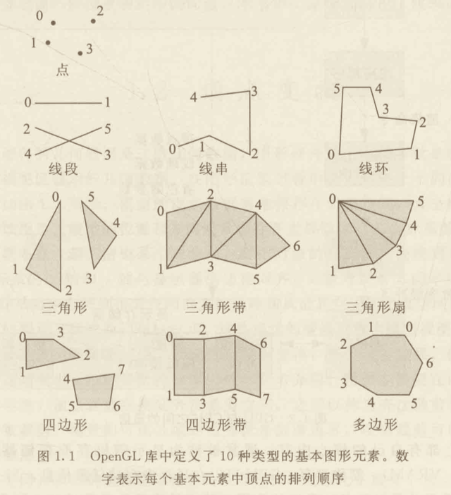
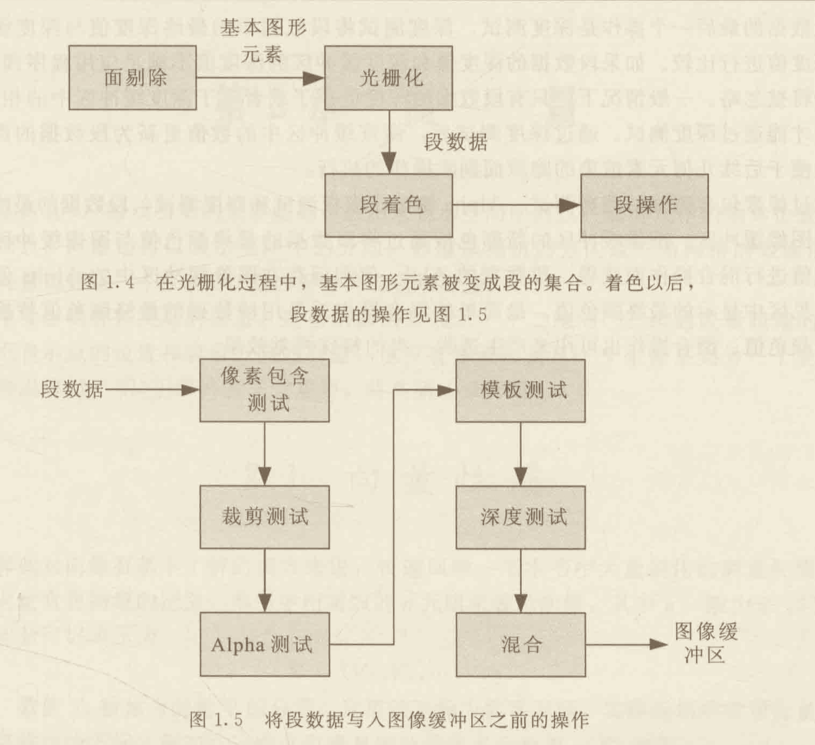

# 3D 游戏与计算机图形学中的数学方法

## 渲染管线

### 图形处理器

一个渲染成 3D 图形的典型场景通常由`许多独立物体`组成，<u>物体的几何形状都被表示成`顶点集合`和表示顶点连接关系的特定`图形元素`。</u>

通过特定的顶点组合以及光影效果形成真实的立方体 3D 模型。

<u>图形硬件可以渲染单个顶点集合、连串的线段和一组填充多边形。在多数情况下，3D 模型的表面表示成三角形列表，其中的每个三角形引用顶点列表中的 3 个顶点。</u>

一般的 3D 图形卡都有<u>图形处理单元（Graphics Processing Unit，GPU），GPU的指令独立于中央处理器（Central Processing Unit，CPU）执行。GPU 接收到 CPU 的命令执行渲染操作，CPU 则继续执行其他任务，这被称为异步操作。</u>当几何信息提交到 OpenGL 一类的渲染库时，从请求渲染操作的函数调用开始，到 GPU 完成图形渲染之间通常会有dealing时间，该时间为滞后时间，也就是提交渲染命令到完成渲染操作之间的时间。现在的 OpenGL 扩展库允许 CPU 上执行的程序确定一组渲染完成时，该同步操作很可能降低 3D 图形应用的效率，因此对于效率要求高的应用应避免该操作。

<u>应用程序通过向`渲染库`（如 OpenGL）发送命令实现与 GPU 的通信，渲染库将接收到的命令转发的驱动程序，`驱动程序`用 GPU 专用指令与 GPU 交互。</u>由于 OpenGL 包含渲染场景的函数集，并且这些函数适用于任意支持 OpenGL 架构的图形硬件，所以 OpenGL 接口被称为`硬件抽象层`。

驱动程序负责将 OpenGL 函数调用转换成 GPU 可识别的代码。3D  图形驱动程序通常直接实现 OpenGL 函数以降低渲染命令的负载。

3D 图形卡上都有自己的核心内存，通常被称为`显示随机存储器（Video Random Access Memory，VRAM），简称显存。`

GPU 可以在显存中存储任意信息，当一个 3D 图形应用运行时，显存中几乎总是出现多种类型的数据，其中最重要的是<u>前后两个图形缓冲区。</u>`前缓冲区`包含视见区可见的准确像素数据，`视见区`是包含渲染图像的显示器的某一区域，可以是某个窗口的一部分或者全部，也可以是整个显示区域。`后图像缓冲区`是保存 GPU 当前场景渲染结果的地方，后缓冲区不可见，它保证场景在呈献给用户之前被全部渲染，一旦一幅图像被完全渲染，前后图像缓冲区就会交换，该操作被称为`缓冲区切换`。

显存中还包含被称为`深度缓冲区`或者 `z~缓冲区`的数据块。相对图像缓冲区的每个像素，深度缓冲区中保存了该像素在图像中的深度值，表示该像素离`虚拟相机`多远。深度缓冲区用于隐藏面剔除操作，它只允许显示深度值小于图像缓冲区相应像素的深度值的像素。<u>深入值从观察渲染场景的虚拟相机的位置开始测量。之所以称为 z~ 缓冲区，是因为在虚拟相机的局部坐标系中，它的 z 坐标轴指向显示屏幕的外面。</u>

对于多数的 3D 渲染应用来说，纹理映射图占用了大量显存。纹理映射图是应用到物体表面产生大量视觉细节的图像。在高级渲染应用中，纹理不仅包含单个像素的图像信息，如凹凸映射还包含表示物体表面不同位置的斜率的向量。

#### 独立显卡和集成显卡

### 顶点变换

传递到图形硬件的几何数据是三维几何数据，图形硬件的一个任务就是<u>将这些三维数据转换为可在二维的视见区显示的几何数据。</u>在图形渲染过程中会用到多个不同的坐标系，这些坐标系之间的关系如图：

模型的`顶点数据`通常保存在`对象空间`，其坐标系对应某个局部模型并且仅用于该模型。模型的`位置`和`方向`通常保存在`世界空间`，其坐标系是一个`全局坐标系`，将所有对象空间联系在一起。<u>渲染某个对象前，要把对象的顶点坐标变换到`相机空间`（也称观察空间），其坐标系的 x 轴和 y 轴与显示器的边框对齐，z 轴与观察方向平行。</u>通过合并从那个对象空间到世界空间的变换矩阵和从世界空间到相机空间的变换矩阵，可以直接将对象空间的顶点坐标变换到相机空间，这些连续的变换被称为`模型视图变换`。

`模型顶点`变换到`虚拟相机空间`后，继续进行`投影变换`，产生`透视效果`，<u>使几何体随着到相机距离的增大而逐渐变小。</u>投影变换要在四维奇次坐标系中执行，经过投影变换，顶点就被变换到齐次裁剪空间。之所以称为`齐次裁剪空间`，是因为该空间的图形元素将被裁剪，场景的可视区域的边界就是裁剪边界，<u>经该裁剪可以确保视见区以外的图形元素不会被渲染。</u>

在齐次裁剪空间，顶点的坐标是规格化的设备坐标，规格化是指每个定的 x，y 和 z 坐标的取值范围为 [-1, 1]，可反映顶点在视见区显示的位置。对齐次裁剪空间中的顶点继续进行所谓爱的视见区变换，把规格化坐标变换为视见区覆盖的图像空间的实际像素坐标。而 z 坐标通常被变换成 [0， 1] 区间的一个浮点数，最后变成与深度缓冲区采用的像素比特数对应的 整数。经过视见区变换，顶点就被变换到`窗口空间`。

- 虚拟相机
- x、y 与显示器对齐，与观察者视线平行为 z。

渲染 2D、3D 图形。

在窗口空间里的元素，坐标是世界坐标的，包括了 z 轴。

#### CSS 像素是在窗口空间上？ 

### 光栅化与段操作

光栅化阶段：该阶段主要是确定几何阶段输出的各个图元 primitive 所覆盖的像素以及每个像素的颜色。

<u>几何模型的顶点经过裁剪并转换到窗口空间后，GPU 必须确定视见区内的哪些像素被图形像素覆盖。</u>

对几何元素覆盖的像素的水平填充过程称为`光栅化`。GPU 计算出的每个像素的深度、来自顶点插值的颜色、差值得出的纹理坐标与像素自己的位置合称`段数据`。

在光栅化过程中，图形应用程序可以决定利用段数据计算每个像素最终颜色和深度的方法，该过程被称为`段着色`或者`像素着色`。

图像缓冲区最终被 GPU 进行渲染显示到显示器上。

## 向量

向量是所有 3D 游戏引擎的重要基础，被用来表示空间中的点，如游戏中国的物体位置或者三角网格的顶点。

向量把多个数字存储为一个单元。例如，Vector3 有 3 个数字（称为 X，Y，Z）。

- 分量
- 标量

### 向量性质

用实数的 n 元组来表示向量，其中 n 一般为 2、3 或者 4.一个 n 维向量可以表示为：

`V = <V1, V2, ..., Vn></V1,>`

其中男，数值 Vi 被称为向量 V 的分量。这里的下标为数字下标，实际应用中常用分量对应的坐标轴的名称作为下标。例如，三维点向量 P 的分量常表示为 Px，Py 和 Pz。

向量可以乘以一个`标量`变成一个新的向量，而向量中各个分量的相对比值不变。标量 a 与向量 V 的乘积定义如下：

`aV = Va = <aV1, aV2, ..., aVn>`

当 a = -1时，用简化符号 -V 表示向量 V 的反向量。

向量的加法和减法是按分量逐个相加或相减完成的。因此，给定两个向量 P 和 Q，它们的和 P + Q 可定义为：

`P + Q = <P1 + Q1, P2 + Q2, ..., Pn + Qn>`

这两个向量的差可以写作 P - Q，实际上是两个向量和 P + （-Q）的简化表示。基于以上定义，下面开始分析向量运算的基本性质。

定理 2.1 给定任意两个标量 a 和 b，三个向量 P、Q 和 R，以下性质成立。

1. P + Q = Q + P
2. (P + Q) + R = P + (Q + R)
3. (ab)P = a(b)P
4. a(P + Q) = aP + aQ
5. (a + b)P = aP + bP

利用实数的交换律和结合律，以上性质可以通过直接计算得到验证。

### 内积

### 外积

### 向量在游戏开发中的应用

利用小人运动的速度的方向来判定是否启用碰撞体，速度方向向上时禁用碰撞体，速度方向向下时启用碰撞体，这里就利用了向量的方向性质。

### 小结

## 坐标变换

### 四元数（Quaternion）

四元数是一种描述旋转的不同的数学概念。它是高等数学中一个晦涩的概念，涉及通过四维表示运动。

对于为什么四元数用于表示旋转有个比较简单的解释：使用四元数在旋转值之间插值（就是通过一些中间值来慢慢从一个值变为另一个值）看起来更平滑和自然。

### 欧拉角（Euler angle）

描述旋转的方法便是欧拉角。

## 附录

### 术语

## 参考资料

- [电脑有独立显卡和没有独立显卡有什么区别](https://zhidao.baidu.com/question/744523442069143452.html)
- [是独立显卡好还是集成显卡好？](https://www.zhihu.com/question/24272857)
- [标量](https://zh.wikipedia.org/wiki/%E6%A0%87%E9%87%8F)
- [【《Real-Time Rendering 3rd》 提炼总结】(三) 第三章 · GPU渲染管线与可编程着色器](https://zhuanlan.zhihu.com/p/26894962)
- [GPU 渲染管线简单总结](https://juejin.im/post/5ad04f7e518825619d4d2ed4#heading-1)
- [[Unity游戏开发]向量在游戏开发中的应用（一）](https://www.jianshu.com/p/f0fad8ea12c1) 向量在游戏开发中是非常实用的，我们在学校学完向量的知识后，只知道向量的基本知识，但对于如何将所学到的向量知识运用到实际的游戏开发中却不知所措。