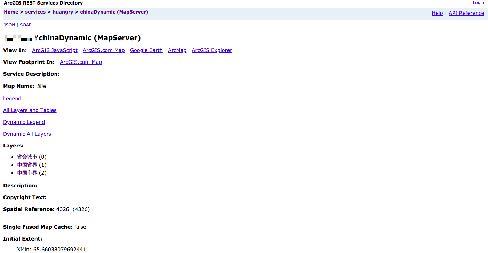
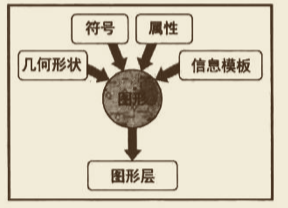

# Arcgis for JavaScript 构建 WebGIS 应用

版本使用：4.x

## 创建地图和添加图层

### 使用 ArcGIS API for JavaScript 创建应用程序的基本步骤

1. 创建页面 HTML 代码。
2. 引用 ArcGIS API for JavaScript 和样式表。
3. 加载模块。
4. 确保 DOM 可用。
5. 创建地图。
6. 定义页面内容。
7. 页面样式。

通过上面的步骤可以得知，可以使用任何的前端框架不限于 React、Vue、Angular ，它们生成相关 DOM 代码，再引入 ArcGIS API for JavaScript 和样式即可进行地图的创建。下面以 Vue 为例子：

#### 1. 创建 Web 页面 HTML 代码

创建主页面

```html
<template>
  <div id="app">
    <router-view />
  </div>
</template>

<style>
  html,
  body,
  #app {
    width: 100%;
    height: 100%;
  }
</style>
```

#### 2. 引用 ArcGIS API for JavaScript

**第一步：loadMap.js 工具类。**

```js
import {
  loadCss,
  loadScript,
  loadModules as esriLoadModules
} from 'esri-loader';

// load EyeMapApi(type:arcgis-js)
export const loadMapApi = async url => {
  // await loadEchartsArcGISApi();
  const jsUrl = url + '/init.js';
  const cssUrl = url + '/esri/css/main.css';
  return new Promise((resolve, reject) => {
    try {
      loadCss(cssUrl);
      loadScript({
        url: jsUrl
      }).then(resolve);
    } catch (error) {
      reject(error);
    }
  });
};

export const loadModules = async (...args) => {
  const reponseModules = {};
  const res = await esriLoadModules(args);
  res.forEach((module, idx) => {
    let key = args[idx].replace(/.*\/([a-zA-Z]+)/, '$1');
    if (key.indexOf('-') >= 0) {
      key = key.replace(
        key.substr(key.indexOf('-'), 2),
        key.substr(key.indexOf('-') + 1, 1).toUpperCase()
      );
    }
    reponseModules[key] = module;
  });
  return reponseModules;
};
```

**第二步：程序主逻辑文件**
main.js 引用 ArcGIS API for JavaScript 和样式表。

```js
import Vue from 'vue';
import App from './App.vue';
import router from './router';
import store from './store';

import ViewUI from 'view-design';
import 'view-design/dist/styles/iview.css';

import { loadMapApi, loadModules } from './loadMap';

Vue.config.productionTip = false;

Vue.use(ViewUI);

// 加载 arcgis api
const ARCGISURL = 'http://52.83.103.252:8086/dgp_js_api49';
loadMapApi(ARCGISURL);

Vue.prototype.$loadModules = loadModules;

new Vue({
  router,
  store,
  render: h => h(App)
}).$mount('#app');
```

#### 3. 加载模块

`Map.vue` 中，使用 import ES 模块规范导入资源。

```html
<script>
  import loadModules from '@/utils/loadModules';
  export default {
    methods: {
      async initMapApp() {
        // 加载模块
        const { Map, MapView, Basemap } = await loadModules(
          'esri/Map',
          'esri/views/MapView',
          'esri/Basemap'
        );
      }
    }
  };
</script>
```

#### 4. 确保 DOM 可用

把 `initMapApp()` 放入 mounted 生命周期函数。

```html
<script>
  import loadModules from '@/utils/loadModules';
  export default {
    mounted() {
      this.initMapApp();
    },
    methods: {
      async initMapApp() {
        // 加载模块
        const { Map, MapView, Basemap } = await loadModules(
          'esri/Map',
          'esri/views/MapView',
          'esri/Basemap'
        );
      }
    }
  };
</script>
```

#### 5. 创建地图

通过 Map、MapView、BaseMap 生成一个带有底图的地图

```html
<script>
  export default {
    async initMapApp() {
      const { Map, MapView, Basemap } = await loadModules(
        'esri/Map',
        'esri/views/MapView',
        'esri/Basemap'
      );
      // 创建一个新的basemap对象。
      // https://developers.arcgis.com/javascript/latest/api-reference/esri-Basemap.html
      // 有三種方式：portalItem，或一個已知的 id，以及下面這種方式
      const baseLayers = await this.createBaseMapLayers();
      const basemap = new Basemap({
        baseLayers: baseLayers,
        title: 'basemap',
        id: 'basemap'
      });

      let options = {}; // 地图配置 extent, center
      this.map = new Map({ basemap: basemap });
      this.mapView = new MapView({
        container: this.$refs.mapNode, // 承载地图 MapView
        map: this.map, // 地图
        ...options
      });
      this.$emit('map-ready', {
        map: this.map
      });
    },
    /**
     * 創建底圖圖層
     * @return {Array} 數組元素[MapImageLayer, WebTileLayer]
     */
    async createBaseMapLayers() {
      const baseLayers = [];
      if (this.baseLayerUrls && this.baseLayerUrls.length > 0) {
        for (const layerItem of this.baseLayerUrls) {
          const layer = await createLayer(layerItem);
          console.log(layer);
          baseLayers.push(layer);
        }
      }
      return baseLayers;
    }
  };
</script>
```

#### 6. 创建页面内容

Map.vue 地图组件，使用 ref 引用 mapNode

```html
<template>
  <div :class="wrappCls">
    <div class="ljy-map-instance" ref="mapNode"></div>
  </div>
</template>
```

#### 7. 页面样式

高度、和宽度都设置 100%

```html
<style lang="scss" scoped>
  .ljy-map {
    height: 100%;
    width: 100%;
    &-instance {
      height: 100%;
      width: 100%;
    }
  }
</style>
```

#### 完整代码

Map.vue

```html
<template>
  <div :class="wrappCls">
    <div class="ljy-map-instance" ref="mapNode"></div>
  </div>
</template>

<script>
  import loadModules from "@/utils/loadModules";
  import layer from "./layerMixin/layer.js";
  import { createLayer, getLayerRenderer } from "../../utils/mapUtil.js";
  const prefix = "ljy-map";
  export default {
    name: "LJYMap",
    mixins: [layer],
    props: {
      baseLayerUrls: {
        type: Array,
        default: () => []
      }
    },
    data() {
      return {
        map: null,
        mapView: null // 视图
      };
    },
    computed: {
      wrappCls() {
        return [prefix];
      }
    },
    mounted() {
      this.initMapApp();
    },
    methods: {
      async initMapApp() {
        const { Map, MapView, Basemap } = await loadModules(
          "esri/Map",
          "esri/views/MapView",
          "esri/Basemap"
        );
        // 创建一个新的basemap对象。
        // https://developers.arcgis.com/javascript/latest/api-reference/esri-Basemap.html
        // 有三種方式：portalItem，或一個已知的 id，以及下面這種方式
        const baseLayers = await this.createBaseMapLayers();
        const basemap = new Basemap({
          baseLayers: baseLayers,
          title: "basemap",
          id: "basemap"
        });
        this.map = new Map({ basemap: basemap });
        this.mapView = new MapView({
          container: this.$refs.mapNode,
          map: this.map
        });
        this.$emit("map-ready", {
          map: this.map
        });
      },
      /**
       * 創建底圖圖層
       * @return {Array} 數組元素[MapImageLayer, WebTileLayer]
       */
      async createBaseMapLayers() {
        const baseLayers = [];
        if (this.baseLayerUrls && this.baseLayerUrls.length > 0) {
          for (const layerItem of this.baseLayerUrls) {
            const layer = await createLayer(layerItem);
            console.log(layer);
            baseLayers.push(layer);
          }
        }
        return baseLayers;
      }
  };
</script>

<style lang="scss" scoped>
  .ljy-map {
    height: 100%;
    width: 100%;
    &-instance {
      height: 100%;
      width: 100%;
    }
  }
</style>
```

## 使用地图服务图层

一幅没有数据图层的地图就像一个画家的空白画板一样。添加到地图中的数据图层让其有意义并为分析奠定了基础。提供数据图层添加导地图中主要有两种类型的地图服务：动态地图服务图层和切片地图服务图层。

动态地图服务图层在运行时创建地图图片并引用地图服务，然后返回图片导应用程序中。这种类型的地图服务或许由一个或多个图层信息构成。



客户端应用程序将话费更多时间，因为它们必须是动态生成的，所以动态地图服务层服务比切片地图服务图层拥有更多功能。在动态地图服务图层中，你可以通过控制图层定义显示的特征，设置地图服务中各图层的可见性定义图层的瞬时信息。例如，在前面描述的 china 地图服务图层，你可以选择在你的应用程序中只显示省会城市，这是一种通过动态地图服务图层提供的功能，而在切片地图服务图层中则没有这样的功能。

切片地图服务图层引用的是一个预定义好的地图切片缓存而不是动态加载的图片。用最简单的方法来理解切片地图服务，就是将它认为是覆盖在地图表面的网格。网格中的每个单元格同样大小，用来将地图分割成单独的图片文件，从而成为切片。单个的为切片是服务器上存储的图像文件，当需要的时候根据地图范围和比例尺来检索。在不同的地图比例尺下，这个过程会重复执行。

这些切片或者缓存地图图层通常用作底图，包括影像图、街道图、地形图或者不常发生变化的数据图层。切片地图服务显示速度更快，因为每次运行呢时向地图发送一个请求而并无创建图片的开销。

**操作图层**常覆盖在切片地图上面，这些图层通常为动态图层。虽然它们在执行时慢一点，但是动态地图服务图层有着在运行时仍可以定义外观的优势。

### gis 渲染方式

各种服务很多如切片服务、动态服务、影像服务，但是通过 arcgis js api 渲染图层方式通常为两种：后端渲染和前端渲染。

- 后端渲染
  - 浏览器发送请求，GIS Server 接收到请求后，按需求生成图，动态服务先看缓存，没有则实时生成；切片服务器则根据请求参数找到对应切片。
  - 浏览器接到响应图片，调用 ArcGIS JS API 对图片加载完成渲染。
- 前端渲染
  - 浏览器发送请求，GIS Server 接收请求后，按需求生成 json 或其他数据文件，json 数据包含请求所需的各个图层的要素信息 geometry。- 浏览器接收后，调用 ArcGIS JS API 读取要素集合，按照默认的或者自定义的方式（定义 symbol）使用 `graphicsLayer` 进行渲染。

应用场景：当要素超过一定数量（待具体测试）的时候，前端渲染会出现卡顿、刷新慢等问题。只要数据量不大，应用需要对要素进行频繁交互时，就考虑前端渲染。否则，就考虑后端渲染（当然它也会跟 ArcGIS Server 软件的性能有关），虽然返回是张图片，也可以通过 identify 等方式进行查询以及 Dynamic Layers: 来设置专题渲染和图层标注。

动态服务、切片服务、影像服务等通过返回图片的形式是通过后端渲染，而要素服务、Graphic 图形服务或动态服务等通过前端查询要素的形式，进行渲染的，则是通过前端渲染。

### 使用图层类

Layers
|–MapImageLayer
|–TileLayer
|–GraphicsLayer
|-FeatureLayer

### 切片地图服务图层

```js
/**
 * 创建图层
 * @param {String} layerType 图层类型
 * @param {Object} layerOption 图层的属性配置：type, url, opactiy, visible
 * @return 返回图层
 */
export const createLayer = async (layerType, layerOption) => {
  const { url } = layerOption;
  const { TileLayer } = await loadModules('esri/layers/TileLayer');
  const LayerConfig = {
    tileLayer(option) {
      return new TileLayer(option);
    }
  };
  if (LayerConfig[layerType]) {
    return LayerConfig[layerType](layerOption);
  } else {
    throw new Error(`创建图层${url}失败！`);
  }
};
```

### 动态底图服务图层

动态地图服务图层能用来执行多种类型的操作，包括查询、设置定义表达式和更多其他操作。

```js
/**
 * 创建图层
 * @param {String} layerType 图层类型
 * @param {Object} layerOption 图层的属性配置：type, url, opactiy, visible
 * @return 返回图层
 */
export const createLayer = async (layerType, layerOption) => {
  const { url } = layerOption;
  const { MapImageLayer } = await loadModules('esri/layers/MapImageLayer');
  const LayerConfig = {
    dynamicLayer(option) {
      return new MapImageLayer(option);
    }
  };
  if (LayerConfig[layerType]) {
    return LayerConfig[layerType](layerOption);
  } else {
    throw new Error(`创建图层${url}失败！`);
  }
};
```

### 地图服务设置可见图层

切片图层可以直接设置 `layer.visible = false/true` 来设置，而不能动态设置它的 sublayers 里面的可见性。只有动态底图服务图层，才可以动态设置子图层的可见性。

```js
if (layer.sublayers && layer.sublayers.items) {
  layer.sublayers.items[layerIndex].visible
    ? (layer.sublayers.items[layerIndex].visible = false)
    : (layer.sublayers.items[layerIndex].visible = true);
}
```

### 设置定义表达式

在 ArcGISforDesktop 中，可以使用定义表达式来限制数据图层特征的显示。一个定义表达式就是一个图层中针对行和列的简单 SQL 查询。仅满足查询条件的特征才会显示。

假如只想显示 PM2.5 大于 100 的城市，表达式为 `PM2p5_Rmvd > 1000000`。要素图层

```js
// 图层表达式过滤，
layer.definitionExpression = 'PM2p5_Rmvd > 100'; // 只显示 pm2.5 的值
```

可以点击下面链接查看，最终是通过 query 功能实现，表达式填写导 where 里。如果是动态服务的话，就进入它的子图层进行设置。这个属性跟 地图的 export 属性 `Layer Definitions`是不同概念的。
[https://services.arcgis.com/V6ZHFr6zdgNZuVG0/arcgis/rest/services/Landscape_Trees/FeatureServer/0/query?...](https://services.arcgis.com/V6ZHFr6zdgNZuVG0/arcgis/rest/services/Landscape_Trees/FeatureServer/0/query?f=html&geometry=%7B%22spatialReference%22%3A%7B%22latestWkid%22%3A3857%2C%22wkid%22%3A102100%7D%2C%22xmin%22%3A-9177335.364031991%2C%22ymin%22%3A4246841.291526269%2C%22xmax%22%3A-9176723.86780571%2C%22ymax%22%3A4247452.78775255%7D&maxRecordCountFactor=3&outFields=C_Storage%2CFID&outSR=102100&quantizationParameters=%7B%22extent%22%3A%7B%22spatialReference%22%3A%7B%22latestWkid%22%3A3857%2C%22wkid%22%3A102100%7D%2C%22xmin%22%3A-9177335.364031991%2C%22ymin%22%3A4246841.291526269%2C%22xmax%22%3A-9176723.86780571%2C%22ymax%22%3A4247452.78775255%7D%2C%22mode%22%3A%22view%22%2C%22originPosition%22%3A%22upperLeft%22%2C%22tolerance%22%3A1.1943285669555674%7D&resultType=tile&returnExceededLimitFeatures=false&spatialRel=esriSpatialRelIntersects&where=PM2p5_Rmvd%20%3E%20100&geometryType=esriGeometryEnvelope&inSR=102100)

动态图层

```js
layerItem = new MapImageLayer({
  id: info.url + '_shadow_' + info.layerID,
  url: info.url,
  sublayers: [
    {
      id: info.layerID,
      visible: true,
      definitionExpression: filter
    }
  ],
  opacity: opacity
});
```

### 地图导航

导航工具栏，如放大和缩小、平移、全图、前一视图和后一视图。

#### 使用鼠标和键盘进行地图导航

#### 获取和设置地图范围

应用程序中默认的初始地图范围是最后一次你在创建底图服务时保存的地图文档文件（.mxd）的范围。

可以通过 center 以及 extent 来设置默认以外地图的范围，而且有时候应用程序会使用多地图服务。

```js
const layer = await createLayer(layerType, layerOption);
this.map.add(layer);
// 设置范围
this.mapView.whenLayerView(layer).then(layerView => {
  // layerView.layer.fullExtent.spatialReference = this.mapView.spatialReference; 设置图层坐标参考系为整个地图的坐标参考系
  layerView.layer.fullExtent = layerView.layer.fullExtent.expand(2);
  this.mapView // 让地图视窗，移动到图层视窗的范围
    .goTo([layerView.layer.fullExtent], {
      duration: 200
    })
    .then(() => {
      resolve(layer);
    });
});
```

### 地图事件

通过发布订阅模式

### 小结

## 添加图形到地图



图形是绘制到地图图层上的点、线或面，它独立于地图服务相关的任何其他数据图层。很多人会认为图形对象就是显示在地图上代表图形的符号。然而 ArcGIS Server 中的每个图形都是由四个对象组成，分别是几何图形（Geometry）、与图形相关的符号（Symbol）、描述图形的属性（Attribute）和定义当图形单击后出现的信息框格式的信息模版（popup template）。虽然图形由四个对象构成，但不是必需的。

图形是临时的对象，它存储在地图上一个独立的图层中。图形在应用程序使用的时候显示，当会话完成后移除。那个独立的图层会存储和地图相关的所有图形信息，我们称之为图形图层（GraphicsLayer）。

与 FeatureLayer 和 MapImageLayer 不同，GraphicsLayer 没有模式。 因此，组成 GraphicsLayer 的图形可能具有多个几何类型（点，线或多边形）。
由于 GraphicsLayer 无法具有关联的渲染器，因此每个图形都必须具有自己的符号。 图形也可能包含彼此不同的属性架构。

图形显示在应用程序中用于呈现的任何其他图层之上，这些图形可以通过用户创建（手绘）或者提交应用程序响应任务进行绘制（查询服务获取）。比如，一个商业分析应用程序可能提供这样一个工具，它允许用户手绘多边形来代表一个潜在的交易地区。

该多边形图形显示在地图的最上面，然后可以作为地理处理任务的输入，用于提取潜在贸易地区的人口统计信息。

很多 ArcGIS Server 任务以图形形式返回结果。QueryTask 对象可执行属性和空间查询。查询的结果以 FeatureSet 对象返回，即以简单的 features 数组形式返回给应用程序。<u>然后你可以图形访问每一个 features 并使用循环结构将其绘制到地图上。</u>假如想找到并显示所有和百年长期洪水泛滥的平原想叫的地块，QueryTask 对象可以用来执行空间查询并且将结果返回到应用程序中，然后以多边形图形显示在地图上。


图形具有描述所在地的几何表示，几何信息和符号一起定义了图形如何显示。图形也有提供信心的属性。属性定义的是一系列的名称-值对。比如，一个用来描述野火位置的图形包括火灾的名称和烧毁面积的英亩属数属性。<u>信息模版定义了当图形出现时信息窗口中显示哪一个属性以及如何显示</u>当以上内容创建后，图形对象显示在地图之前必须存储在 GraphicsLayer 对象（或 4.x MapView.graphics）当中。这个 GraphicsLayer 对象将作为显示所有图形的容器。

图形的所有组成元素都是可选项。然而，<u>图形的几何信息和符号总是需要指定的，没有这两项的话，地图上不会有任何显示，除非你让它显示出来，否则没有多大意义。</u>

步骤：

1. 创建几何图形 geometry。
2. 图形符号化
3. 图形分配属性。
4. 信息模版中展示图形属性。
5. 创建图形 graphic。
6. 添加图形到图形图层。

### 创建几何图像

图形总是由一个几何对象组成，用来放置在地图上面。这些几何对象可以是点、多点、线、面或者多边形。你可以通过这些对象的构造函数以编程的方式进行创建，或者从一个任务（比如查询）来返回输出结果。

设置参考坐标系，给予 x，y 坐标定义位置。

```js
// 1. 创建一个几何对象
const centerPoint = this.$refs.map.mapView.extent.center; // 取得地图的平面坐标中心点
const point = {
  type: 'point', // autocasts as new Point()
  x: centerPoint.x,
  y: centerPoint.y,
  spatialReference: this.$refs.map.mapView.spatialReference // 必须要设置一致参考坐标系，否则 x,y 定位不起作用
};
```

### 图形符号化

我们创建的每一个图形都可以通过 API 中多种符号类中的某一个进行符号化。

```js
// 2. 符号化几何对象
const markerSymbol = {
  type: 'simple-marker', // autocasts as new SimpleMarkerSymbol()
  size: 50,
  color: [226, 119, 40],
  outline: {
    // autocasts as new SimpleLineSymbol()
    color: [255, 255, 255],
    width: 2
  }
};

// 3. 图形分配属性
const pointAtt = {
  Region: '海珠区',
  Number: '888',
  Price: '5000000'
};

// 4. 信息模版中展示图形属性
const popupTemplate = {
  title: '{Region}',
  content: [
    {
      type: 'fields',
      fieldInfos: [
        {
          fieldName: 'Region'
        },
        {
          fieldName: 'Number'
        },
        {
          fieldName: 'Price'
        }
      ]
    }
  ]
};
// 5. 创建图形
const graphic = {
  geometry: point,
  symbol: markerSymbol,
  attributes: pointAtt,
  popupTemplate: popupTemplate
};

// 6. 添加图形到地图上
await addGraphic([graphic], true); // 添加到 mapView.graphics 层

/**
  * 添加图形到地图上
  * @param {Array} graphicOptions
  * @param {Boolean} isUseMapViewGraphics
  */
 const addGraphic = async (graphicOptions, isUseMapViewGraphics = true) => {
   // return new Promise((resolve, reject) => {})
   const graphics = [];
   if (graphicOptions && Array.isArray(graphicOptions)) {
     for (const option of graphicOptions) {
       const graphic = await createGraphic(option);
       if (graphic) {
         graphics.push(graphic);
       }
     }
   }
   if (isUseMapViewGraphics) { 
     this.mapView.graphics.addMany(graphics);
   } else {
     const graphicsLayer = await this.addLayer({ type: "graphicsLayer" });
     graphicsLayer.addMany(graphics);
   }
 },
```


## ArcGIS 任务

一个任务操作所需要的步骤：
1. 实例化一个执行对象；
2. 设置执行对象的参数对象；
3. 设置执行成功和失败的处理函数，这两个函数的本质其实就是回调函数，执行对象分别有运行失败和成功的事件，当这两个事件被触发，系统自动回调相应的函数，并传入相关信息；
4. 如果失败，根据错误信息，对程序进行排错处理；
5. 如果成功，从返回结果中得到我们想要的信息。

### 空间查询和属性查询


统计查询

### 查询检索

#### QueryTask

```js
/**
 * query 查询任务
 * @param {String} url
 * @param {String} where 属性查询
 * @param {Array} outField 返回字段
 * @param {Object} geometry 空间查询
 * @param {Boolean} returnGeometry 返回几何对象
 * @param {Object} option 其他配置 如 returnDistinctValues
 */
export const query = async (
  url,
  where,
  outField = ["*"],
  geometry = null,
  returnGeometry = true,
  option
) => {
  // 1. 引入资源
  const { Query, QueryTask } = await loadModules(
    "esri/tasks/support/Query",
    "esri/tasks/QueryTask"
  );
  return new Promise(async (resolve, reject) => {
    // 2. 查询对象，获取查询参数
    const query = new Query({
      where,
      outField,
      geometry,
      returnGeometry,
      ...option
    });
    // 3. 新建查询任务
    const queryTask = new QueryTask({ url });
    try {
      // 4. 执行查询任务
      const results = await queryTask.execute(query);
      resolve(results);
    } catch (err) {
      reject(err);
    }
  });
};
```

#### FindTask

#### IdentifyTask

## 要素（特征）图层与专题图

## GIS 坐标系统与投影

- 空间数据与其它数据的最大区别在于空间数据具有空间位置信息。
- 空间位置可以由不同的坐标系统来描述，同一实体，在不同坐标系统中具有不同坐标值。
- 坐标系统分地理坐标系统（Geographic Coordinate System，GCS）和投影坐标系统（Projected Coordinate System，PCS）两大类型，每一类型下又可进一步细分。


### GIS 坐标系统定义的基础

#### 地球椭球体

#### 大地基准面 

#### 地图投影

- 地理坐标系
- 投影坐标系
- 坐标系统与投影变换

### 地理坐标系统（GCS）

以经度和纬度表示任何一点的位置。**经度是观测点所在子午面与初始子午面之间的角度**，大多数GCS以通过格林威治的子午面为初始子午面，也有一些国家选用其他地方为初始子午面；纬度是观测点与地球球心的连线和赤道面之间的角度。

**由于地球是一个不规则的椭球体，经纬度的测量首先是要建立地球椭球体模型，即大地测量基准（Datum） 。**大地测量基准包括如下参数：
地球椭球体的形状与大小，一般用长半径a（赤道半径）、短半径b（极轴半径）以及扁率f =（(a-b)/a）来定义。
地球椭球体的指向（正北点的位置）。
大地原点，是指大地测量控制网起算点，地球椭球体模型与实际地球在该点是完全重合。


大地基准是和椭球体是密切相关的。

### 坐标系统与投影变换

- 动态投影
- 坐标系统描述
- 投影变换
