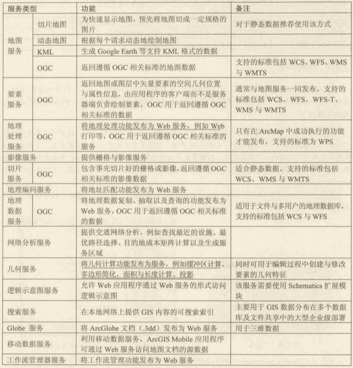
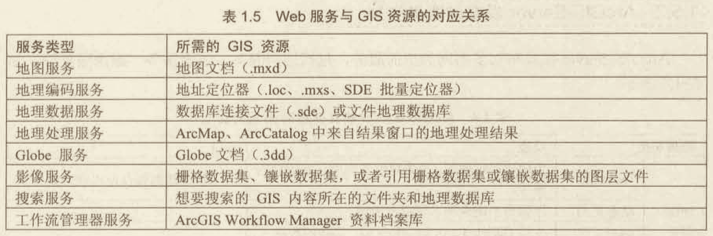

# Arcgis Server

## 什么是 ArcGIS Server?

**ArcGIS Server 软件使你的地理信息可供组织中的其他人使用，也可以选择使其供具有 Internet 连接的任何人使用。**这可通过 Web
服务完成，从而使功能强大的服务器计算机能够接收和处理其他设备发出的信息请求。也就是说，经过 Arcgis Server 处理后的地理信息数据（这些地理信息通常由 ArcGIS Desktop 软件处理），可以给其他设备通过网络请求访问。

## 发布 GIS Web 服务

可以在 ArcGIS Desktop 中制作地图、地理处理模型、镶嵌数据集以及其他 GIS 数据源，并使用简单的向导来将其作为 Web 服务共享。地图服务是一种通过 ArcGIS 使地图、要素和属性数据可被访问的方法。

可将下列资源类型发布到 ArcGIS Server：

|GIS 资源| 该资源在 ArcGIS Server 中的作用| 创建该资源的 ArcGIS Desktop 应用程序|
|--|--|--|
|地图文档|制图、网络分析、网络覆盖服务（WCS）发布、网络要素服务（WFS）发布、网络地图切片服务（WMTS）发布、KML发布、地理数据库数据提取和复制、要素访问发布、Schematics发布| Arcmap|
|地址定位器|地理编码|ArcCatalog 或 ArcMap 中的目录窗口|
|地图数据库|地理数据库查询、提取及辅助；WCS 发布；WFS 发布|ArcCatalog 或 Arcmap 中的目录窗口|
|地理处理模型或工具|地理处理、网络处理服务（WPS）发布|ArcMap （结果窗口中的地理处理结果）|
|栅格数据集、镶嵌数据集，或者引用栅格数据集或镶嵌数据集的图层文件|影响发布、WCS或VMS 发布|ArcCatalog 或 ArcMap 中年的目录窗口|
|GIS 内容所在的文件夹和地理数据库|创建组织的 GIS 内容的可搜索索引|ArcMap|

如果不希望立即发布（例如，如果你无法直接访问服务器计算机），可改为保存服务定义文件并稍后发布。<u>服务定义中包括稍后发布服务所需的所有数据路径和属性。</u>你甚至可以选择包含所有源数据，使你能够真正将服务打包成一个可传输的文件。

## ArcGIS Server 组件

ArcGIS Server 上提供的 GIS 资源（例如地图）称为服务。ArcGIS Server 站点的作用是接收服务请求，满足请求以及将结果发回需要使用这些服务的客户端应用程序。

## 实战

### 发布服务

#### 什么是地图服务

地图服务是一种利用 ArcGIS 使地图可通过 Web 进行访问的方法。你首先在 ArcMap 中制作地图，然后将地图作为服务发布到 ArcGIS Server 站点上。之后，Internet 或 Intranet 用户便可在 Web 应用程序、ArcGIS Desktop、ArcGIS Online 以及其他客户端应用程序中使用此地图服务。