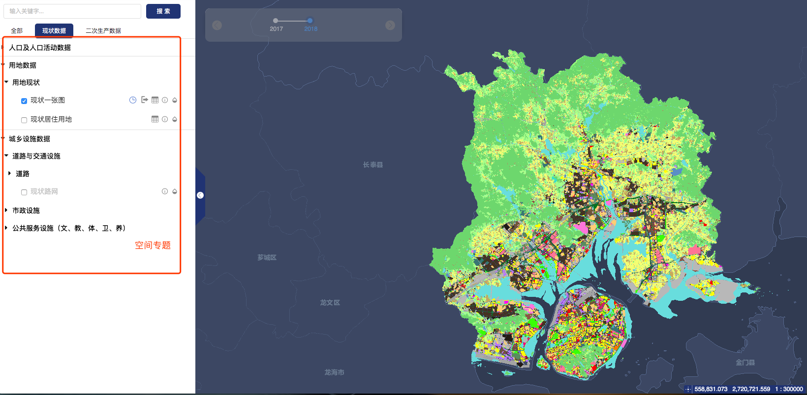
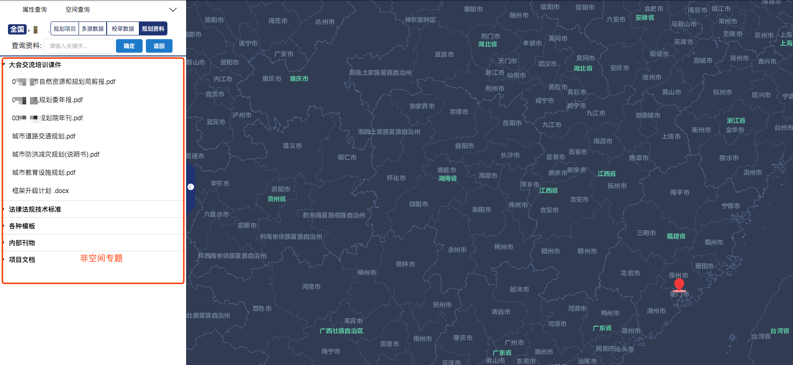
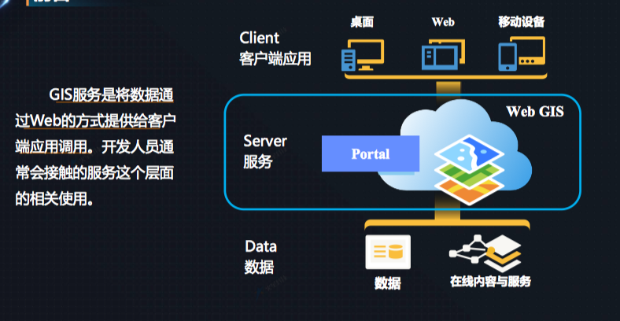
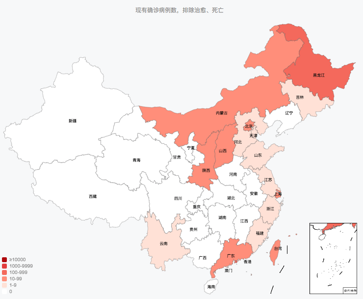
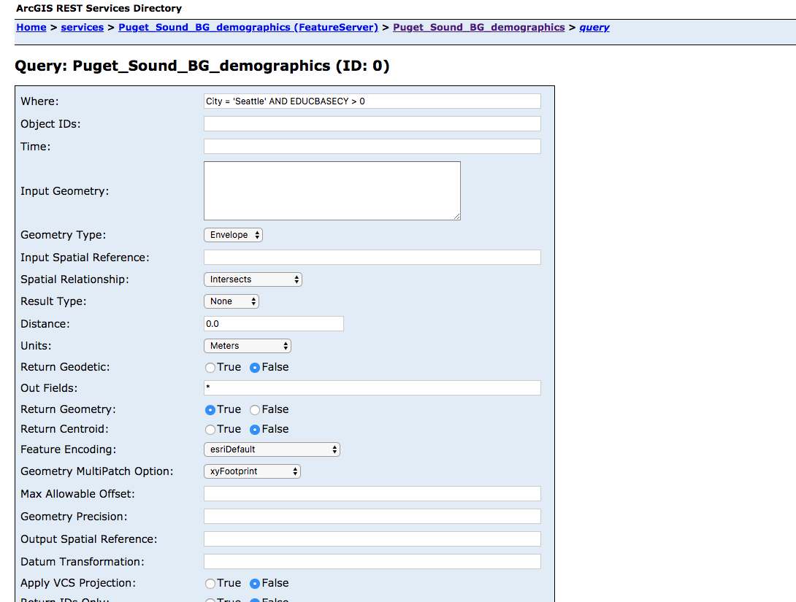
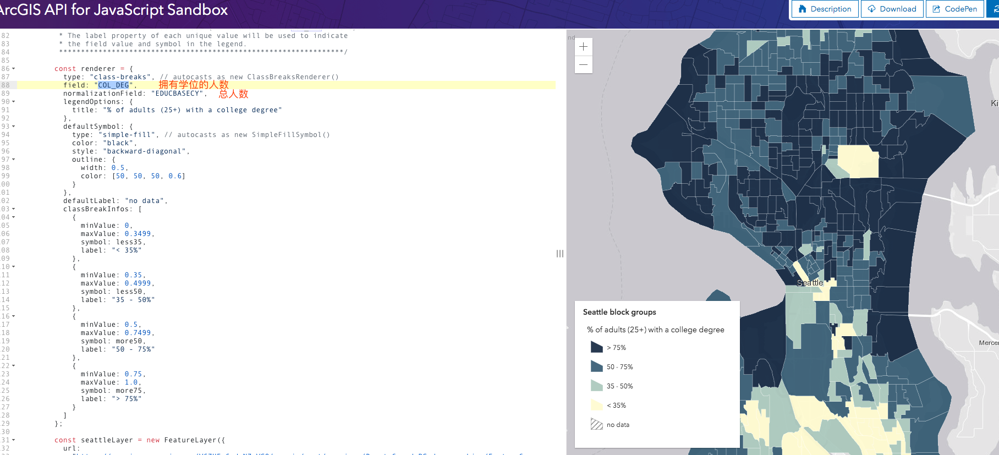
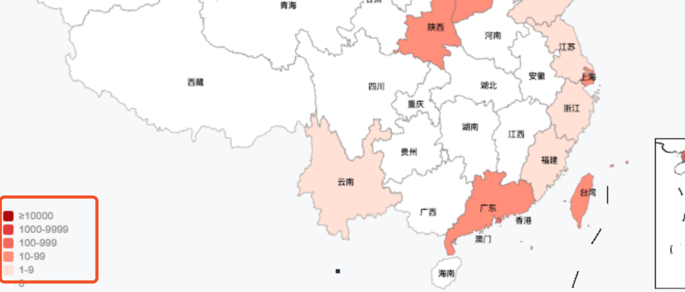
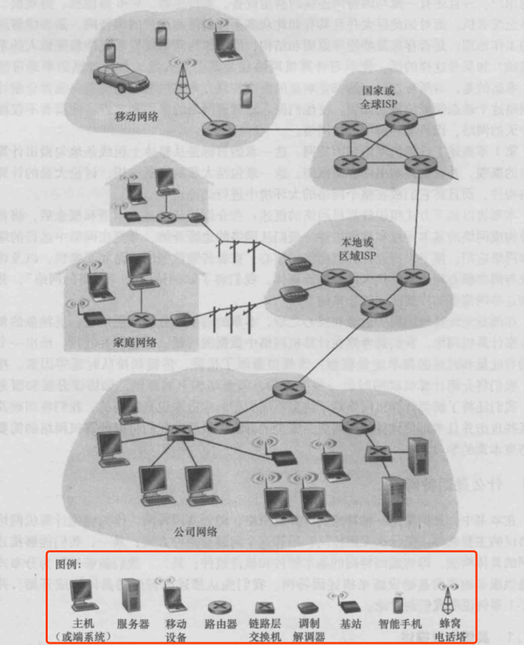
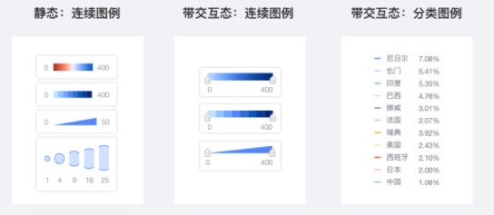

# GIS 专题概念与应用

- 面向读者，非 gis 出身，但是需要开发 gis 应用的前端工程师。
- 确定范围：
  - 主要是专题的概念、专题的产生、专题是 gis 应用地位。
  - 专题与专题地图。
  - 至于专题制图、导出等如何操作后续再考虑补充。

## 前言

如果有一个人跟你说起`“专题”`这二字，你脑海中会想起哪些关联的东西？不同的人有不同的印象。普通人听过最多的应该是淘宝商家、某某商场、一些游乐场出的圣诞专题、新年专题等等活动。如果你是一个软件工程师，你可能会想到软件性能专题、安全专题等。那么专题是什么呢，接下将会从普通的专题概念说到 gis 应用相关的专题。

本文主要讲述以下几点内容：

- 专题的概念，什么是 gis 专题
  - 专题的分类
  - 专题用来解决什么问题？辅助地图工作者中解决什么问题？
  - 专题的产生
- 什么是图例
- 专题的应用场景

数据 -》服务 -》客户端专题产生（专题策划） -》辅助查询、定位、统计、制图

## 什么是专题

所谓[专题](https://baike.baidu.com/item/%E4%B8%93%E9%A2%98)，是针对某个特定对象收集制作而成的一种集中作品，这个对象可以是具体的某个人物或者某个食物，也可以是某个抽象的范围或领域。在网络上这种作品一般表现为游戏专题或则新闻专题，其中的新闻专题又包括人物专题和热点专题。——百度百科。

简单来说，专题就是一种具有相同的特征大量信息的聚合，它的表现形式可以是文字、评论、视频、图片等，比如像《肺炎疫情：新型冠状病毒专题报道》在 2020 年 就是一个很多人关注的热点专题。


专题的价值在哪里？对于用户来说，用户可以快速找到自己关心的事情，节省寻找信息的时间。对于内容输出者（公司、机构），可以建立、巩固品牌。因此很多网站也出现了专题这个功能，借鉴了传统媒体如新闻报纸的专题报道。

## gis 应用的专题

gis 应用中的专题跟上面提到的概念一样，同样是对相关信息数据的聚合，只不过它针对的不仅仅是常见文章或者视频等。对于空间专题，它的针对对象是 gis 服务图层（如果你对 gis 服务图层不清楚的，可以看看之前我写的这篇文章[《GIS 图层概念及应用》](https://juejin.im/post/5d3ff32ef265da03986bcd21#heading-1)），如果是非空间专题则是一些地图数据相关的项目文件（图片、word、视频等）。

如果为了方便用户，也会有空间专题于非空间专题混合的目录情况。接下里我们先说说空间专题。

### 空间专题



<!-- 这两张图片，如果有涉及项目暴露的。后续再用 arcgis online demo 的截图。 -->

如图为空间专题，里面的叶子节点就是可以打开或关闭的图层，目前打开的图层已经显示在地图上。因此后面说的专题，其实也可以是指专题目录这样一棵树。

Gis 应用说到底是操作不同的图层服务，而专题作为图层的装载器，显然很重要。我们可以通过专题打开各种图层，加载到地图上，随后就可以对图层进行各种操作，如统计、分析、定位、查询，在 gis 应用的整个生命周期中几乎都会跟专题打交道。

### 非空间专题



如图是非空间专题，可以看到的都是一些规划相关的项目资料，这些文件可以预览、下载等。

说到这里，可能有人问：空间专题与非空间专题有什么联系吗？我们可以在空间专题目录节点上添加上各种附件，也可以在非空间专题的文件上添加上空间数据的属性，使用户可以查询项目资料的同时也知道它相关的地理位置信息。

### 专题的产生

知道了专题的概念及分类后，我们说说专题是如何产生的。在这里，有必要先回顾 GIS 应用的组成。



可以看到一个 gis 应用的产生，首先是 gis 数据的产生 -> 接着通过 gis 服务器发布了一系列的 restful 服务 -> 最后客户端进行调用。

对于空间专题来说，gis 应用端可以直接请求一个 gis 发布的服务，形成一个专题。
也可以通过运维端进行进行服务的配置，之后 gis 应用端请求服务端获得在运维里配置的专题，进行分类显示。


对于非空间专题也可以直接通过运维端进行配置，只不过它可以不用依赖 gis 发布的图层服务数据，仅仅是一些项目文档，在运维端可以添加上标签（非空间专题、空间专题的区分）


### 专题（地）图

说完了专题目录，再谈谈专题地图是什么呢？专题地图与 gis 专题目录一样离不开“专题“的功能，只不过专题是把图层服务聚合到一棵树上，而专题地图则是把相关的信息聚合到一张图上。

专题地图跟普通的地图不同的是，它可以让用户看出从数据记录上难以发现的模式和趋势。例如 2020 年的某一时间下的新冠肺炎的疫情地图，对各个地图的感染人口分布。



这些专题地图是怎么制作的呢？它是根据某个特定专题对要素图层进行渲染。所谓的专题渲染，就是以某种图案或颜色填充来表明要素对象的某些信息，使它们围绕着某一主题进行显示，上面的疫情地图则是根据感染人数。

那在 webgis 开发中要怎么制作呢？我们可以访问 gis 服务的图层，里面不仅仅只有地理数据，还附带了很多属性数据。我们就可以根据这些属性数据进行聚合分类渲染，从而创建成一个个专题图。

举个例子，下图是 arcgis 的一个在线地图服务，https://services.arcgis.com/V6ZHFr6zdgNZuVG0/arcgis/rest/services/Puget_Sound_BG_demographics/FeatureServer/0，可以通过这个地图服务查询 `COL_DEG` 属性字段，得出西雅图各个街区的拥有大学学位的成年人数，可以点击[这里](https://services.arcgis.com/V6ZHFr6zdgNZuVG0/arcgis/rest/services/Puget_Sound_BG_demographics/FeatureServer/0/query?where=City+%3D+%27Seattle%27+AND+EDUCBASECY+%3E+0&objectIds=&time=&geometry=&geometryType=esriGeometryEnvelope&inSR=&spatialRel=esriSpatialRelIntersects&resultType=none&distance=0.0&units=esriSRUnit_Meter&returnGeodetic=false&outFields=*&returnGeometry=true&returnCentroid=false&featureEncoding=esriDefault&multipatchOption=xyFootprint&maxAllowableOffset=&geometryPrecision=&outSR=&datumTransformation=&applyVCSProjection=false&returnIdsOnly=false&returnUniqueIdsOnly=false&returnCountOnly=false&returnExtentOnly=false&returnQueryGeometry=false&returnDistinctValues=false&cacheHint=false&orderByFields=&groupByFieldsForStatistics=&outStatistics=&having=&resultOffset=&resultRecordCount=&returnZ=false&returnM=false&returnExceededLimitFeatures=true&quantizationParameters=&sqlFormat=none&f=html&token=)。



然后使用 Arcgis Api for JavaScript，根据属性数据中特定 的值来赋给要素对象颜色、图案或符号，从而创建不同的专题图。



如图中实现的便是范围专题地图，具体运行沙箱地址为。专题可以是一个或多个专题变量组合，所谓专题变量就是指在地图上显示的数据，一个专题变量可以是一个字段或表达式。除了使用 class-break 渲染技术实现的范围专题，还有点密度专题、唯一值专题、多比例尺专题等。

## 什么是图例（legend）

说完了专题地图，这里顺便补充下图例的知识。不知道你发现了没有，前面说到的专题地图的两张图片，左下角都有一个面板，用来说明地图中的各种符号的代表意义。一来可以让用户更加方便地看懂地图，二来来制作地图时也是一个参考的标准，地图上应该包含哪些东西。例如疫情专题地图，文字配合颜色的深浅，用户在查看时便可快速知道当前各个地区的感染状况。



其实不仅仅是地图中有图例，任何一张图片，如果有必要都可以添加图例。例如，计算机网络的部件图：



当然图例不仅仅是静态的，还可以带有交互态。在一些常见的图表库便可以看到。



可以说，图例是专题的导航仪，要看懂地图，看懂专题，必须先认识图例。所以在 webgis 应用中，图例是不可缺少的功能，可以分为`要素图例`和`渲染图例`。要在地图中添加图例，可以使用 Arcgis for Js Api 提供的 api 进行实现：

```js
// Since: ArcGIS API for JavaScript 4.0
const legend = new Legend({
  view: view,
  layerInfos: [{
    layer: featureLayer,
    title: "Legend"
  }]
});

view.ui.add(legend, "bottom-right");
```
Legend Widget 会根据图层的 Renderer 渲染器设置的值进行对应的显示，这里有个官方 [demo](https://developers.arcgis.com/javascript/latest/sample-code/sandbox/index.html?sample=widgets-legend) 地址。

也可以自己获取图例信息，从图层服务地址中获取。进行自定义的渲染，如 vue 模版中：

```html
<legend-list>
  <legend-item
    :legendData="item"
    v-for="item in legendList"
    :key="item.uid"
  ></legend-item>
</legend-list>
```

## 应用场景

前面说了很多理论知识，下面看看 gis 应用中与专题交互的功能，这里的专题包括专题目录、专题里面的图层（有时候如果该图层是针对某个主题发布的服务，也可以称之为专题）、专题地图，空间专题与非空间专题。

<!-- 实战应用更多是功能的链接以及思路、资源。 -->

### 专题目录树

对于专题目录树，一些主要的功能：
- 通过打开图层，加载到地图中，就可以使用定位、查询、分析的功能。
- 专题可以通过运维系统进行个性化的配置，然后根据用户的权限所属，切换不同的专题方案。
- 可以打开不同的专题进行分屏对比，也可以展示不同年份的专题。
- 也可以在前端进行失效服务的定时检测，如果服务恢复则恢复专题树中对应的专题，也就是更新机制提示标志和 bug 修复
- 专题目录树懒加载模式，解决很多专题时，进入含有专题模块的缓慢问题。

### 专题制图

渲染的专题地图，最终为了打印输出为图片、PDF 等格式。内容包括地图内容、图例排版、标题大小、透明度调整、属性表格等。客户端出图可以使用 html2Canvas 库，也可以调用 arcgis server api 的导出服务。

- 原来的专题预览打印是前端给参数给计算，计算负责出图，如果只是地图内容还好，但是还包含了图例排版，标题大小，表格导出等界面，导致前面几乎不可能和计算导出的图片一致，所以现在修改成，前端自己合成图片，计算只负责导图地图内容，这样就可以保证预览界面的图片和导出的图片一致。这里有点不懂。


### 专题附件预览

无论是空间专题或非空间专题都可以包括一系列的文件如 shp 文件、doc、pdf 等，这时候就需要一些技术进行在线预览，文件在线预览项目方案如 [kkfileview](https://www.oschina.net/p/file-online-preview)  、[Microsoft Office Online](https://docs.microsoft.com/zh-cn/OfficeOnlineServer/office-online-server-overview)等。

## 总结

本文从专题的概念、分类、作用都作了描述，顺便提及了与专题相关的图例。专题是相关信息的聚合和分类。gis 应用中，空间专题是图层的装载器，非空间专题是地图相关的项目文件容器。而专题地图则是对 gis 要素的进一步聚合。相信看到这里的你，下次别人提起专题的时候能够知道他在说什么。更多的细节信息，你可以去 Arcgis 官网或者去看看公司项目的实现。

（本文完，感谢阅读）

## 参考资料

- [欢迎使用地理信息系统原理在线教程](https://www.osgeo.cn/gis_tutorial/index.html#id1)
- [GIS 基础知识](https://ke.qq.com/course/468445?taid=4197089286759901) 腾讯课堂的视频，附带的 ppt 挺不错。
- 《Web GIS 从基础到开发实践（基于 ArcGIS API FOR JavaScript）》
- [Web开发中的文档在线预览解决方案，支持多种文件格式](https://youyou-tech.com/2019/07/12/Web%E5%BC%80%E5%8F%91%E4%B8%AD%E7%9A%84%E6%96%87%E6%A1%A3%E5%9C%A8%E7%BA%BF%E9%A2%84%E8%A7%88%E8%A7%A3%E5%86%B3%E6%96%B9%E6%A1%88%EF%BC%8C%E6%94%AF%E6%8C%81/)
