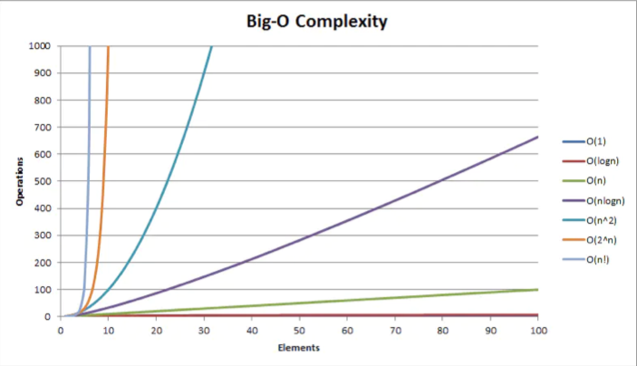
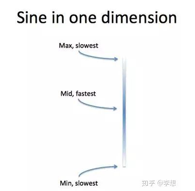
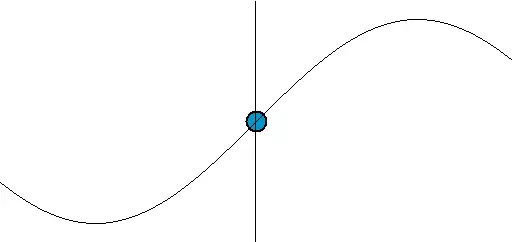

# 数学

以前高中的时候，学校并没有编程这门课程。所以导致学这些函数仅仅为了高考，也没有去了解它能够解决什么问题。学习数学更多的演变成空洞的解题训练，导致缺少真正的理解与深入的独立思考。学习数学要去了解数学的应用以及与其他领域的联系，例如计算机科学。

## 代数

1+2 叫做算术；
a+b 叫做代数；
f（a），f（b）叫做高等代数。

不确定也不需确定的因素越来越多，解决力却越来越强

数学中的代数跟编程中的函数很类似，更准确地说是函数式编程。不改变任何东西，不改变输入的参数，只是返回一个新的值。

```cs
y=f(x)=5x^2+4x+31
y=g(x)=2f(x)+5=10x^2+8x+11
y=h(x)=f(x)+g(x)=15x^2+12x+14
```

假设 f(x) 是一个函数，g(x) 是第二个函数，ba f(x) 这个函数套下来，并展开。

## 变量和函数

### 变量和函数

数学对象，常常是由对象组成的整个<u>集合</u>s 中任意选取的。我们称这样的对象为**变域**或**定义域** S 内 的一个**变量**。

习惯上，用<u>英文字母</u>表中后面一部分字母表示变量。这样，如果 S 表示<u>所有</u>整数组成的集，则变域 S 内的变量 X 表示任意一个整数。我们说，“变量 X 在集 S 上变动”。

注意：编程语言中常常用 `Array` 或 `List` 表示集合)

一个变量 X 的变域 S 并不要求必须是数集。例如，S 可以是<u>平面</u>上<u>所有</u>圆组成的集，这时 X 表示任意一个圆。S 也可以表示平面上所有的闭<u>多边形</u>组成的集，X 就是任意一个多边形，也不要求变量的变域一定要有无限多个元素。例如，X 可以表示某<u>城市</u>一定时期内<u>居民</u> S 中的任意一员；或 X 可以表示整数被 5 除后可能出现的任意一个余数，在这种情形，变域 S 由五个数 0，1，2，3，4 组成。

变量的变域 S 为<u>实数</u>轴上的一个区间（a ≤ x ≤ b）是数值变量的最重要的情形。<u>在这种情形时，习惯上变量用小写字母 x 表示，这时我们称 x 是区间内的**连续变量**</u>。连续变量变动的范围可以扩展到无穷。例如，S 可以是所有的正实数集 x > 0，或者甚至是全部**实数**集。类似的，我们可以认为 X 的值是平面上的点或平面上某个给定区域内的点，如一个矩形或圆内的点。由于对固定的一对坐标轴，平面上的点可由它的两个坐标 x，y 确定，所以在这种情形我们通常说有**一对连续变量 x 和 y。**

可能有这样的情形：<u>对于变量 X 的任意一个值，都存在另一个变量 U 的确定的值与它相联系，这时 U 就称作 X 的`函数`。</u>U 和 X 的这个联系方式可以用一个如：

<center>U = F(X)</center>

（注：编程算法中的时间复杂度和空间复杂度计算也跟这里的很类似。O(1)、O(n^2)）

的符号表示，如果 X 的变动范围是集 S，那么<u>变量 U 的变动范围将是另一个集 T。</u>例如，如果 S 是<u>平面</u>内<u>所有</u>三角形 X 的集，那么由每个三角形 X 对应其周长 U，就可以<u>定义</u>三角形 X 的一个函<u>数</u>，U = F(X)；这时 T 是整个正数集。这里，我们注意到 ˉ 两个不同的三角形 X1 和 X2 可以周长相等，也就是虽然 X1 ≠ X2，但等式 F(X1) = F(X2) 可能成立。

对于 S 内每一个点 X，T 内都有唯一的点 U 按一定的<u>规律</u>和它对应，这个规律我们可以用函数符号 U = F(X) 来表示。在这种情形，只要 X1 ≠ X2，就有 F(X1) ≠ F(X2)。这时我们说 S 到 T 上的<u>映射</u>是**一一对应**的。

<u>连续变量的函数常用代数式来定义。</u>。例如，函数

<center>u = x^2, u = 1/x, u = 1/(1+x^2)</center>

在第一个式子和最后一个式子中，x 的变化范围可以是整个<u>实数</u>集；而在第二个式子，x 的变化范围可以是除 0 以外的整个实数集 —— 0 被去掉是因为 1/0 不是一个数（这里很像编程中函数对参数的要求）。

如果 U = F(X)，则我们常称 X 为`自变量`，而 U 称为`因变量`，因为它的值依赖于 X 所取的值。

有时也可能对于<u>所有</u>的 X 的值，U 都取同一个值，这时集合 T 就只由一个元素组成。对这种特殊情形，函数的值 U 实际没有变化。也就是说，U 是`常数`。一般的函数概念将包括这种特殊情形，虽然对初学者来说，这似乎是奇怪的；在他们心目中，<u>自然地</u>会强调当 X 变化时 U 是跟着变化的。但是，把<u>常数看作是变量（其“变动范围”只由一个元素组成）的特殊情况并没什么坏处，而且事实上将是有用的。</u>（备注：编程中，也有函数每次都返回相同的结果，如用户信息。）

不仅在纯数学上，而且在实际应用中，函数概念都是非常重要的。物理<u>规律</u>不是别的，<u>只是这样一些命题，这些命题说明了某些量中有些变动时，其他一些量是如何跟着变动的。</u>例如，弦的音调的高低依赖于弦的长度、<u>重量</u>和张力，大气压强依赖于高度，<u>枪弹</u>的<u>能量</u>依赖于它的质量和速度。物理学家的任务就是精确或近似地确这些函数关系。

<u>函数概念可以给运动以确切的数学描述，</u>如果一个运动的<u>质点</u>集中在<u>空间</u>一点，其坐标是 x，y，z，并且用 t 表示时间，那么，质点的<u>运动</u>完全由作为时间 t 的函数的它的坐标 x，y，z 来描述，

<center>x = f(t), y = g(t), z = h(t)</center>

这样，如果一个<u>质点</u>只在<u>重力</u>的作用下，沿垂直的 z 轴自由下落，那么

<center> x = 0， y = 0， z = -1/2 gt^</center>

这里，g 是重力加速度。如果质点在 x，y-平面内的一个单位圆上匀速转动，这个<u>运动</u>就可用函数

<center>x = cos 𝓌t， y = sin 𝓌t</center>

描述，这里 𝓌 是常数，即所谓的运动的<u>角速度</u>。

有时候，数学家和物理学家对函数强调的地方是有所不同的。前者通常强调的是`对应规律`，<u>即应用在自变量 x 上，就得到因变量 u 的数学运算。</u>就这个意思来说，f() 是一个`数学运算`的符号。另一方面，物理学家通常更感兴趣的，是`量 u`而不是（通过 x 能）计算出 u 的值的任何数学程序。例如，<u>空气</u>对运动物体的`阻力 u` 和 <u>速度</u> v 有关，并且可以通过实验求出来，而不管是否又一个已知的可以计算的明显的数学公式 u = f(v)。物理学家最感兴趣的是实际的阻力而不是任何具体的数学公式，除非研究这样的公式能够有助于<u>分析</u> 量 u 的性质。<u>当人们把数学用到物理或工程上的时候，通常就是采用这种态度的。</u>

在用函数作更高等的计算时，有时只有搞清楚人们究竟指的是由 x 得到量 u = f(x) 的运算 f()，还是量 u 本身，才可以避免混乱。<u>因为量 u 本身还可以被认为是用别的方式而依赖于其他的变量 z。</u>例如，圆的面积可以由函数 u = f(x) = 𝜋x^2 给定，这里 x 是半径，也但也可以由函数

<center> u = g(z) = z^2/4𝜋</center>

给定，这里 z 是圆的周长。

### 角的弧度制

为了各种实际上的需要，<u>角的度量单位是把直角分为许多相等部分而得到的。如果分成的份数为 90，</u>那么单位就是熟知的“度”。分为 100 份，似乎应当更适合于我们的十进制，但是仍旧代表的是同一个度量原则。对于<u>理论</u>上的目的来说，最好是应用一个本质上不同的方法来刻划角的大小，这就是<u>所谓的弧度制。</u>有关角的三角函数的许多重要公式，在弧度制中，比用度的形式简单的多。

为了求一个角的弧度，我们<u>以角的顶点为圆心作一个半径为 1 的圆。</u>一个角在圆周上切割出一段弧 s，我们就定义这段弧的长度作为该角的`弧度`。因为半径为 1 的圆周长是 2𝜋，所以圆角 360° 就有 2𝜋 弧度。由此可见若 𝑥 表示一个角的弧度，而 y 是角的度数，那么 x 和 y 之间的关系是

<center> 𝑦/360 = 𝑥/2𝜋</center>

或 <center>𝜋𝑦 = 180𝑥</center>

于是 90° 角（𝑦 = 90）的弧度是

<center>𝑥 = 90𝜋/180 = 𝜋/2</center>

等等。另一方面，1 弧度的角（弧度 𝑥 = 1 的角）表示它所切割的弧等于圆的半径，这个角的度数是

<center>𝑦 = 180/𝜋 = 57.2957</center>

度。为了得到角的度数 y，我们必须用因子 180/𝜋 乘以角的弧度 𝑥。

为避免混淆，今后角 𝑥 就是指角的弧度是 𝑥，而一个度数是 𝑥 的角将写为 𝑥°。

### 函数的图像 反函数

函数的性态，常可用几何图像清楚地显示出来。如果 𝑥 、𝑢 是关于<u>平面</u>上直角<u>坐标系</u>的坐标，那么线性函数

<center>𝑢 = a𝑥 + b</center>

可以由<u>直线</u>表示；二次函数

<center>𝑢 = a𝑥^2 + b𝑥 + c</center>

可以由抛物线表示；函数

<center>𝑢 = 1/𝑥</center>

可以由双曲线表示；等等。由<u>定义</u>可知，任何函数 𝑢 = f(𝑥) 的`图像`，是由<u>平面内其坐标 𝑥，𝑢 满足关系 𝑢 = f(𝑥) 的所有的点组成的。</u>

函数 sin 𝑥，cos 𝑥，tg 𝑥 表示称图 151 和图 152 中的曲线。这些图像能很清楚的显示出，当 𝑥 变化时函数值是如何增加和减少的。


#### 编程的应用

算法的复杂度也是一个个函数也可以表示为各种不同的图像。



### 三角函数

三角函数（Trigonnometric）是数学中常见的一类关于角度的函数。

#### 正弦函数

正弦是一种自然摆动，象征着平滑，它使得圆很“圆”，如同直线使得正方形很“方”。

标准的纯正弦函数公式为

`𝑦 = sin(𝑥)`

sin(𝑥) 为正弦函数。

#### 正弦曲线

`周期`是从一个最高点到下一个最高点（或任何一点到下一个相对点）：


`振幅`是从中（平）线到最高点的高度（或到最低点），也是从最高点到最低点的距离除以 2。


`相移`是函数比通常的位置水平向右移了多远。


`垂直位移`是函数比通常的位置垂直向上移了多远。

而一般应用的正弦曲线公式为

`𝑦 = A ∙ sin(𝓌t ± 𝜃)`

以下的公式则拥有全部的可用参数

`𝑦 = A ∙ sin(k𝑥 - 𝓌t - 𝜃) + D`

- 振幅是 A 为波幅（纵轴），振幅，当物体作轨迹符合正弦曲线的直线往复运动时，其值为行程的 1/2。
- (ωt+𝜃)——相位，反映变量 y 所处的状态（即 y 在波峰、波谷）。
  - 𝓌 为角频率/速度，（控制正弦周期，单位弧度内震动的次数），
  - t 为时间（横轴），
  - 𝜃 为相偏移（横轴左右），x = 0 时的相位；反映在坐标系上则为图像的左右移动。
- k 为波数（周期密度）

因为 `cos 𝑥 = sin(𝑥 + 𝜋/2)`，所以余弦波也是正弦波。

上面的公式可以简化为：`A ∙ sin(B𝑥 + C) + D`

- 振幅是 A
- 周期是 2π/B
- 相移是 −C/B
- 垂直移位是 D

##### 例子 1：sin(x)

这是正弦的基本公式。A = 1, B = 1, C = 0 and D = 0
所以振幅是 1，周期是 2π，没有相移或垂直移位：


##### 例子 2：2 sin（4x − 2） + 3

- 振幅 A = 2
- 周期 2𝜋/B = 2𝜋/4 = 𝜋/2
- 相移 -C/B = -(-2)/4 = 1/2
- 垂直移位 D = 3


用文字写出来：

- 2 告诉我们它是比一般高了一倍，所以振幅 = 2
- 一般周期是 2𝜋，但在这例子它是“加快了”（短了）4 倍，所以周期 = 𝜋/2。
- -2 代表函数向右移（正向左，负向右），但因为它也“加快”了 4 倍，所以函数只是移动了 1/2，故此相移 = 1/2。
- 最后，+3 的意思是中（平）线是 y = +3，所以垂直位移 = 3

##### 频率

频率是在一个时间单位里发生多少次（每 “1”）。

例子：这个正弦函数在 0 到 1 之间重复了 4 次。


所以频率是 4，周期是 1/4。

其实周期和频率是相连的：

- 频率 = 1/周期
- 周期= 1/频率

当频率的单位是每秒时，这个单位便称作“赫兹”。50 赫兹的意思是每秒 50 周。

**正弦是一维的**


正弦波在 1 个维度摆动。现实中，我们常常把正弦波画在`时间轴`上，而且正弦运动的物体有时确实是在向前移动的。这给我们造成了一个假象：正弦运动是 2 维的。但并非如此！在 1 个维度弹跳的弹簧做得就是完美的正弦运动。

前端 CSS 动画中，很多的平滑效果便是做得正弦运动。（或者说是插值运动，正弦属于插值的一种。）





`𝑦 = A ∙ sin(k𝑥 - 𝓌t - 𝜃) + D`，这里 x 为 0，但是其他变量不为 0。

在游戏中，可以让敌人以正弦或余弦曲线进行波形运动。这里需要添加上 y 的运动后，敌人的 x 轴的正弦曲线向前运动了。

```cs
class Enemy_1: Enemy {
  // 完成一个完整的正弦曲线周期所需的时间
  public float waveFrequency = 2;
  private float birthTime;

  void Start() {
    birthTime = Time.time;
  }

  public override void Move() {
    float age = Time.time - birthTime;
    float theta = Mathf.PI * 2 * age / waveFrequency;
    float sin = Mathf.Sin(theta);
    temPos.x = x0 + waveWidth * sin;
    temPos.y -= speed * Time.deltaTime;
  }

  void Update()
  {
    Move();
  }
}

```


具体分析，一步步转换为原来的公式：
```cs
x = x0 + waveWidth * sin
  = x0 + waveWidth * Mathf.Sin(theta) // theta 为角度
  = x0 + waveWidth * Mathf.Sin(Math.PI * 2 * age/waveFrequency)
  = D + A * Sin(C + B𝑥) 
  // 因为 B = 2𝜋/周期，
  // 所以 2𝜋/waveFrequency = B，age 则为 x 变量，为消耗的时间长度
  // 如果使用单位圆来理解是这样：
  = D + A * Sin(𝜃 + 2𝜋k) // k 为旋转的单位圈数，𝜃 = 0
  = D + A * Sin(2𝜋k) // k 为旋转的单位圈数 = age 时间/做完一个正弦曲线需要花费的时间即周期
  = D + A * Sin(2𝜋 * 总t/单位周期)
  
```

在游戏实现中，通常是考虑 `𝜃 + 2𝜋k` 比较方便，使用 waveFrequency 周期决定一个完整曲线的占用时间。

三角函数在单位圆中的定义才好分析，三角函数也可以依据直角坐标系 xOy 中半径为1，圆心为原点 O 的单位圆来定义。给定一个角度 𝜃，设 A（1，0）为起始点，如果 𝜃 > 0 则将 OA 逆时针为起始点，如果 𝜃 > 0 则将 OA 逆时针转动，如果 𝜃 < 0 则顺时针移动，直到转过的角度等于 𝜃 为止。舍最终点 A 的位置为 P(x, y)，那么


|正弦|余弦|正切|余切|正割|余割|
|--|--|--|--|--|--|
|sin𝜃 = y| cos𝜃 = x|tan𝜃 = y/x| cot𝜃 = x/y| sec𝜃 = 1/x|csc𝜃 = 1/y|

- sin 𝜃 = sin(𝜃 + 2𝜋k), ∀𝜃 ∈ R，k ∈ Z
- cos 𝜃 = cos(𝜃 + 2𝜋k), ∀𝜃 ∈ R，k ∈ Z

周期函数的最小周期叫做这个函数的基本周期。正弦、余弦、正割或余割的基本周期是 2𝜋弧度或者 360°；正切或余切的基本周期是 𝜋弧度或 180°。

### 余弦函数

### 正切函数

## 对数

## 向量

向量（英语：euclidian vector，物理、工程等也称作矢量 欧几里得向量）是数学、物理学和工程学等多个自然科学中的基本概念。<u>指一个同时具有大小和方向，且满足平行四边形法则的几何对象。</u>理论数学中向量的的定义为任何在向量空间中的元素。一般地，同时满足具有大小和方向两个性质的几何对象即可认为是向量（特别地，电流属既有大小、又有正负方向的量，但由于其运算不满足**平行四边形法则**，公认为其不属于向量）。向量常常在以符号加箭头标示以区别于其他量。与向量相对的概念称标量或数量，即只有大小、绝大多数情况下没有方向（电流是特例）、不满足平行四边形法则的量。

### 二维向量

### 三维向量

### 应用

游戏编程中，常常需要计算起点和终点的距离和方向，即是计算它们的向量差，从而确定位置和方向。

<!-- ```cs

``` -->

## 插值

数学的数值分析领域中，`内插`或称插值（英语：interpolation）是一种通过已知的、`离散`的`数据`点，在范围内推求新年数据点的过程或方法。

求解科学和工程的问题时，通常有许多数据点借由`采样`、`实验`等方法获得，这些数据可能代表了有限个数值函数，其中自变量的值。而根据这些数据，我们往往希望得到一个`连续`的`函数`（也就是`曲线`）；或者更密集的离散方程与已知数据互相吻合，这个过程叫做`拟合`。

<u>内插是曲线必须通过已知点的拟合。</u>

### 为什么需要做插值这种事？

这个答案很简单，无非两条：

首先，这个点傻姑娘它没有数据或者数据不能用：
1. 没采集到

有许多不同的插值方法，在选择适当的算法时需要考虑的一些问题是：方法有多准确？它的计算成本有多高？插值有多平滑？需要多个数据点？

对于实际工程应用来说，其实只要能够知道插值的思想，然后知道插值函数的调用方法即可，不需要记这些复杂的公式，毕竟我们主要目标是解决问题而不是去做数学家。

其次，如果这个点上它没有数据的话，会对我们的建立的数据模型产生不好的影响，或者说我们需要生成这样的中间值来实现一些效果，比如获取介于两个颜色之间的颜色、或者实现一些值的渐变效果如前端的动画。我们不得不想办法在这个缺失的点上给它想办法插上一个数据。

这个事，有点像下面这个木桶，它少一个板就没法用，我们想办法再找一个版给它插到原来的地方，虽然可能没有原装的木板美观好看，但至少这个木桶它能使用了。


那我们又不是神仙，怎样知道不存在数据的那个点上它的数据是个什么鬼呢？好在世间万物都不是孤立存在的，都会存在或多或少的联系，说的直白一点我们就靠这些联系来把这个`缺少的值`给猜出来。

还是以上面那个木桶为例，我们要插入的多高多长的木板才能保证木桶盛的水最多且不漏出来呢？我们可以量一量缺少的那个板子它前后的板子的高度，然后取这两个高度的中间值作为插入的板子的高度，或者用整个桶的平均高度，还有什么众数、固定值等。

常用的方能发有：

|插值方法|描述|
|--|--|
|均值/中位数/众数|取已知值的平均数/中位数/众数进行插补|
|固定值|使用一个常量。好比缺考的考生全部算 0 分|
|最近邻插值|离缺样本最近的那个完整点的值来插补|
|回归|建立一个回归模型，然后预测这个点上的缺少值|
|插值法|构建一种插值函数，比如拉格朗日插值、牛顿插值|

或者我们定义一个看上去比较高大上的算法公式来确定这个板子的高度，比如用回归方法、拉格朗日插值法（根据已知点和拉格朗日插值理论就可以得出对应计算这些点的插值函数）

### 应用


## 参考资料

- [向量](https://zh.wikipedia.org/wiki/%E5%90%91%E9%87%8F) 维基百科向量
- 《什么是数学》
- [正弦曲线/正弦波的直观解释](https://zhuanlan.zhihu.com/p/45761661)
- [三角函数](https://zh.wikipedia.org/wiki/%E4%B8%89%E8%A7%92%E5%87%BD%E6%95%B0)
- [正弦曲线](https://zh.wikipedia.org/wiki/%E6%AD%A3%E5%BC%A6%E6%9B%B2%E7%B7%9A)
- [振幅、周期、相移和频率](https://www.shuxuele.com/algebra/amplitude-period-frequency-phase-shift.html)
- [插值](https://zh.wikipedia.org/wiki/%E6%8F%92%E5%80%BC)
- [拉格朗日插值定理的理论基础](https://mp.weixin.qq.com/s/pkorYWnUWSyJ_Xmt8sO2uw)
- [一个简单的例子学明白用Python插值](https://mp.weixin.qq.com/s/I0zgLUxlSN9r-A3hBK1y2g)