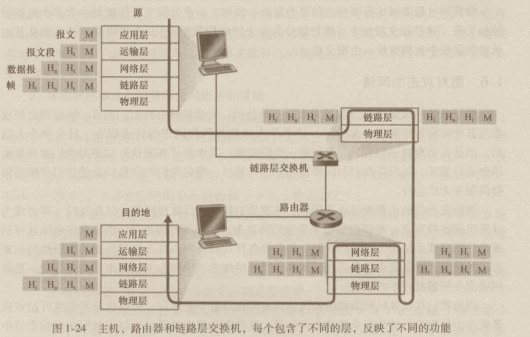
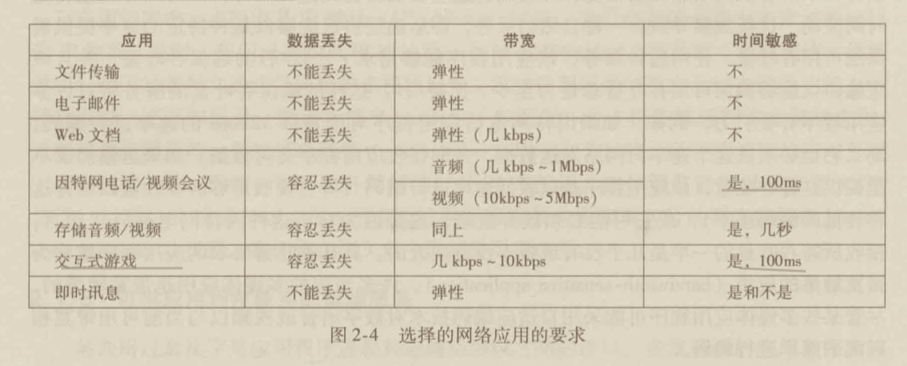
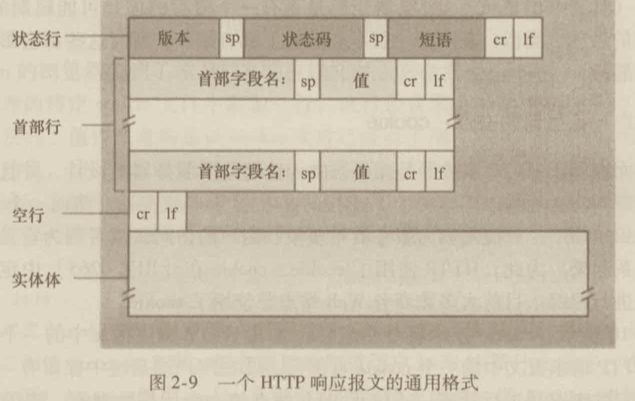
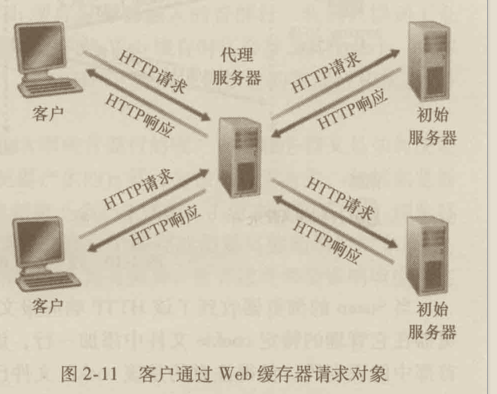

# 计算机网络

<!-- <TOC /> -->
[[toc]]

计算机网络是什么、怎么样和为什么

网络领域已经发展得相当成熟，许多基础性得重要问题能够认识清楚。例如，在运输层，基础性问题包括建立在不可靠得网络层上得可靠通信、连接建立/拆除与握手、拥塞和流量控制以及多路复用。两个非常重要的网络层问题是，在两台路由器之间找到“好的”路径和互联大量的异构网络。在数据链路层，基础性问题是共享多路访问信道。在网络安全中，提供机密性、鉴别和报文完整性的技术都基于密码学基本理论。

应用层-传输层-网络层-链路层-物理层

## 计算机网络和因特网

### 什么是因特网

什么是因特网，回答这个问题有两种方式：其一，我们能够描述因特网的具体构成，即构成因特网的基本硬件和软件组件；其二，我们能够根据为分布式应用提供服务的联网基础设施来描述因特网。


#### 具体构成描述

<u>因特网是一个世界范围的计算机网络，即它是一个互联了遍及全世界的数以亿计的计算机设备的网络。</u>在不久前，这些计算设备多数是传统的桌面PC、Linux 工作站以及所谓的服务器（它们用于存储和传输 Web 页面和电子邮件报文等信息）。然而，越来越多的非传统的因特网端系统（如便携机、智能手机、平板电脑、电视、游戏机、Web 相机、汽车、环境传感设备、数字相框、家用电器）和安全系统，正在与因特网相连。<u>用因特网术语来说，所有这些设备都称为主机（host）或端系统（end system）。</u>

端系统通过**通信链路**（communication link）和**分组交换机**（packet switch）连接到一起。通信链路由不同的不同类型的物理媒体组成。这些物理媒体包括同轴电缆、铜线、光纤和无无线电频谱。不同的链路能够以不同的速率传输数据，链路的**传输速率**以比特/秒度量（bit/s，或bps）。当一台端系统要向另一台端系统发送数据时，<u>发送端系统将数据分段，并为每段加上首部字节。由此形成的信息包用计算机网络的术语称为**分组**（packet）。</u>这些分组通过网络发送到目的端系统，在那里被你装配成初始数据。

分组交换机从它的一条入通信链路接收到达的分组，并从它的一条出通信链路转发该分组。市面上流行着各种类型、各具特色的分组交换机，但在当今的因特网中，两种最著名的类型是<u>**路由器**（router）和**链路层交换机**（link-layer switch）。这两种类型的交换机朝着最终目的地转发分组。</u>链路层交换机通常用于接入网中，而路由器通常用于网络核型中。从发送端系统到接收端系统，<u>一个分组所经历的一系列通信链路和分组交换机称为通过该网络的路径（route或path）。</u>

例子：如下面的图片，古代的大明邮差使用马匹运输物品。


图片来源：《码农翻身》

端系统通过因特**网服务提供商**（Internet Service Provider，ISP）接入因特网，包括如本地电缆或电话公司那样的住宅区 ISP、公司 ISP、大学 ISP，以及那些在机场、旅馆、咖啡店和其他公共场所提供 WiFi 接入的 ISP。<u>每个 ISP 是一个由多个分组交换机和多段通信链路组成的网络。</u>各 ISP 为端系统提供了各种不同类型的网络接入，包括如<u>线缆调制解调器或DSL 那样的住宅宽带接入、高度局域网接入、无线接入和56 kbps 拨号调制解调器接入。</u>ISP 也为内容提供者提供因特网接入服务，将 Web 站点直接接入因特网。因特网就是将端系统彼此互联，因此为端系统提供接入的 ISP 也必须互联。低层的 ISP 通过国家的、国际的高层 ISP（如 Level3 Communication、AT&T、Sprint和 NTT）互联起来。高层ISP 是由通过高速光纤链路互联的高速路由器组成的。<u>无论是高层还是低层 ISP 网络，它们每个都是独立管理的，运行着 IP 协议，遵从一定的命名和地址习惯。</u>

端系统、分组交换机和其他因特网部件都要运行一系列协议（protocol），这些协议控制因特网中信息的接收和发送。TCP（Transmission Control Protocol，传输控制协议）和 IP （Internet Protocol，网际协议）是因特网中两个最重要的协议。IP 协议定义了在路由球和端系统之间发送和接收的分组格式。

鉴于因特网协议的重要性，每个人就各个协议及其作用取得一致认识是很重要的，这样人们就能够创造协同工作的系统和产品。这正是标准发挥作用的地方。**因特网标准（Internet standard）**由**因特网工程任务组**（Internet Engineering Task Force，IETF）研发。IETF 的标准文档称为**请求评论**（Request For Comment，RFC）。它们定义了 TCP、IP、HTTP（用于 Web）和 SMTP（用于电子邮件）等协议。

#### 服务描述

前面的讨论已经辨识了构成因特网的许多部件。但是我们也能从一个完全不同的角度，即从<u>应用程序提供服务的基础设施的角度来描述因特网。</u>这些应用程序包括电子邮件、Web 冲浪、即时信息、社交网络、IP 语音（VoIP）、流式视频、分布式游戏、对等（peer-to-peer，P2P）文件共享、因特网电视、远程注册等等。<u>这些应用程序称为**分布式应用程序**（distributed application），因为它们涉及多台相互交换数据的端系统。</u>重要的水，因特网应用程序运行在端系统上，即它们并不运行在网络核心中的分组交换机中。尽管分组交换机促进端系统之间的数据交换，但它们并不关心作为数据的源或宿的应用程序。运行在一个端系统上的应用程序怎样才能指令因特网向运行在另一个端系统上的软件发送数据呢？

与因特网相连的端系统提供了一个**应用程序编程接口**（Application Programming Interface，API），<u>该 API 规定了运行在一个端系统上的软件请求因特网基础设施向运行在另一个端系统上的特定目的地软件交付数据的方式。</u>因特网 API 是一套发送软件必须遵循的规则集合，因此因特网能够将数据交付给目的地。此时，我们做一个简单的类比，假定 Alice 使用邮政服务向 Blob 发一封信。当然，Alice 不能只是写了这风细腻（相关数据）然后把该信丢出窗外。相反，<u>邮政服务要求 Alice 将信放入一个信封中；在信封的中央写上 Bob 的全名、地址和邮政编码；</u>封上信封；在信封的右上角贴上邮票；最后将该信封丢进一个邮局的邮政服务邮箱中。因此，该邮政服务有自己的”邮政服务 API“ 或一套规则，这是 Alice 必须遵循的，这样邮政服务才能将自己的信件交付给 Bob。同理，<u>因特网也有一个发送数据的程序必须遵循的 API，使因特网向接收数据的程序交付数据。</u>

当然，邮政服务向顾客提供了多种服务，如特快专递、挂号、普通服务等。同样的，因特网向应用程序提供了多种服务。<u>当你研发一种因特网应用程序时，也必须为你的应用程序选择其中的一种因特网服务。</u>

#### 什么是协议

也许理解计算机网络协议概念的一个最容易办法是，先与某些人类活动进行类比，因为我们人类无时不刻在执行协议。如果人们使用不同的协议（例如，如果一个人讲礼貌，而另一人不讲礼貌，或一个人明白时间这个概念，而另一个却不知道），该协议就不能互动，因而不能完成有用的工作。在网络中这个道理同样成立。即为了完成一项工作，要求两个（或多个）通信实体运行相同的协议。

我们再考虑第二个人类类比的例子。假定你正在大学课堂上上课（假如上的是计算机网络课程）。教师正在唠唠叨叨地讲述协议，而你困惑不解。这名教师停下来问：“同学们有什么问题吗？”（教师发送出一个报文，该报文被所有没有睡觉的学生接收到了。）你举起了手（向教师发送了一个隐含的报文），这位教师面带微笑地示意你说：“请讲......”（教师发出这个报文鼓励你提出问题，教师喜欢被问问题。）接着你就问了问题（即向该教师传输了你的报文）。教师听取了你的问题（即接收了你问题报文）并加以回答（向你传输了回答报文）。<u>我们再一次看到了报文的发送和接收，以及这些报文发送和接收时所采取的一系列约定俗成的动作，这些是这个“提问与回答”协议的核心。</u>

##### 网络协议

网络协议类似于人类协议，除了交换报文和采取动作的实体是某些设备的硬件或软件组件（这些设备可以是计算机、智能手机、平板电脑、路由器或其他具有网络能力的设备）。在因特网中，凡是涉及两个或多个远程通信实体的所有活动都受协议的制约。

以大家可能熟悉的一个计算机网络协议为例，考虑当你向一个 Web 服务器发出请求（即你在 Web 浏览器键入一个 Web 网页的 URL）时所发生的情况。首先，你的计算机将向该 Web 服务器发送一条连接请求报文，并等待回答。该 Web 服务器将最终能接收到连接请求报文，并返回一条连接响应报文。得知请求该Web 文档正常以后，计算机则在一条 GET 报文中发送要从这台 Web 服务器上取回的网页名字。最后，Web 服务器向计算机返沪该 Web 网页（文件）。

从上述的人类活动和网路例子中可见，报文的交换以及发送和接收这些报文时所采取的动作是定义一个协议的关键元素：

<u>一个**协议**定义了在两个或多个通信实体之间交换的报文格式和次序，以及报文发送和/或接收一条报文或其他事件所采取的动作。</u>

因特网（更一般地说是计算机网络）广泛地使用了协议。不同的协议用于完成不同的通信任务。**掌握计算机网络领域知识的过程就是立即理解网络协议的构成、原理和工作方式的过程。**

### 网络边缘

端系统也称为主机，因为它们容纳（即运行）应用程序，如 Web 浏览器程序、Web 服务器程序、电子邮件阅读程序或电子邮件服务器程序等。主机有时又被进一步划分为两类：**客户**（client）和**服务器**（server）。客户非正式地等同于桌面 PC、移动 PC 和智能手机等，而服务器非正式地等同于更为强大的机器，用于存储和发布 Web 页面、流视频、中继电子邮件等。今天，<u>大部分提供搜索结果、电子邮件、Web 页面和视频的服务器都属于大型**数据中心**（data center）。</u>例如，谷歌公司（Google）拥有 30～50个数据中心，其中许多数据中心都有10万台以上的服务器。

#### 接入网

##### 1. 家庭接入：DSL、电缆、FTTH、拨号和卫星

今天，宽度住宅接入有两种最流行的类型：**数字用户线**（Digital Subscriber Line，DSL）和电缆。住户通常从提供本地电话接入的本地电话公司处获得 DSL 因特网接入。

##### 2. 企业（和家庭）接入：以太网和 WiFi

在公司和大学校园以及在越来越多的家庭环境中，<u>通常是用局域网（LAN）将端用户连接到边缘路由器。</u>尽管有许多不同的局域网技术，但是以太网到目前为止是当前公司、大学和家庭网络中最为流行的接入技术。


##### 3. 广域无线接入：3G 和 LTE

#### 物理媒体

为了定义物理媒体所表示的内容，我们仔细思考一下比特的短暂历程。<u>考虑一个比特从一个端系统开始传输，通过一系列链路和路由器，到达另一个端系统。</u>这个比特被传输许许多多次！源端系统首先传输这个比特，不久后其中的第一台路由器接收该比特；第一台路由器传输该比特，接着不久后第二台路由器接收该比特；等等。因此，这个比特从源到目的地传输时，通过一系列<u>“传输器-接收器”</u>对。对于每个传输器 - 接收器对，通过跨越一种**物理媒体**（physical medium）传播电磁波或光脉冲来发送该比特。

物理媒体的例子包括双胶铜线、同轴电缆、多模光纤缆、陆地无线电频谱和卫星无线电频谱。物理媒体划分为两类：**导引型媒体**（guided media）和**非导引型媒体**（unguided media）。对于导引型媒体，电波沿着固体媒体前行，如光缆、双胶铜线
或同轴电缆。对于非导引型媒体，电波在空气或外层空间中传播，例如在无线局域网或数字卫星频谱中。

### 网络核心

在考察了因特网边缘后，我们现在更深入地演技亏网络核心，即由互联网端系统的分组交换机和链路构成的网状网络。

#### 分组交换

在各网络应用中，端系统彼此交换**报文**（message）。报文能够包含协议设计者需要的任何东西。报文可以执行一种控制功能，也可以包含数据，例如电子邮件数据、JPEG 图像或 MP3 音频文件。<u>为了从源端系统向目的端系统发送一个报文，源将长报文划分为较小的数据块，称之为**分组**（packet）。</u>在源和目的之间，每个分组都通过通信链路和**分组交换机**（packet switch）（交换机主要有两类：**路由器**和**链路层交换机**）传送。分组以等于该链路最大传输速率的速度通过通信链路。因此，如果某源端系统或分组交换机经过一条链路<u>发送一个 L 比特的分组，链路的传输速率为 R 比特/秒，则传输该分组的时间为 L/R 秒。</u>

##### 1. 存储转发传输

多数分组交换机在链路的输入端使用**存储转发传输**（store-and-forward transmission）机制。<u>存储转发机制是指在交换机能够开始输出链路传输该分组的第一个比特之前，必须接收到整个分组。</u>

##### 2. 排队时延和分组丢失

每个分组交换就有多条链路与之相连。对于每条相连的链路，<u>该分组交换机具有一个**输出缓存**（output buffer）（也称为**输出队列** output queue），它用于存储路由器准备发往那条链路的分组。</u>该输出缓存在分组交换中起着重要的作用。如果到达的分组需要传输到某条链路，但发现链路正忙于传输其他分组，该到达分组必须在该输出缓存中等待。因此，除了存储转发时延以外，分组还要承受输出缓存的**排队时延**（queue delay）。这些时延时变化的，变化的程度取决于网络中的拥塞程度。因为缓存空间的大小是有限的，<u>一个到达的分组可能发现该缓存已被其他等待传输的分组完全充满了。在此情况下，将出现**分组丢失（丢包）**（packet lost）</u>，到达的分组或已经排队的分组之一将被丢弃。

#### 电路交换

#### 网络的网络

### 分组交换网中的时延、丢包和吞吐量

在理想情况下，我们希望因特网服务能够在任意两个端系统之间瞬间移动我们想要的大量数据而没有任何数据丢失。然而，这个一个极高的目标，实践中难以达到。与之相反，<u>计算机网络必定要限制在端系统之间的吞吐量（每秒能够传送的数据量），在端系统之间引入时延，而且实际上能够丢失分组。</u>

#### 分组交换网中的时延概述

前面讲过，分组从一台主机（源）出发，通过一系列路由器传输，在另一台主机（目的地）中结束它的历程。当分组从一个结点（主机或路由器）沿着这条路径到后继结点（主机或路由器），该分组在沿途的每个结点经受了几种不同类型的时延。这些时延最为重要的是**结点处理时延**（nodal processing delay）、排队时延（queuing delay）、传输时延（transmission delay）和传播时延（propagation delay），这些时延总体累加起来是**结点总时延**（total nodal delay）。许多因特网应用，如搜索、Web 浏览、电子邮件、地图、即时讯息和 IP 语音，它们的<u>性能受网络时延的影响都很大。</u>


#### 时延的类型

1. 处理时延

检查分组首部和决定将该分组导向何处所需要的时间是**处理时延**的一部分。

2. 排队时延
   
在队列中，当分组在链路上等待传输时，它经受**排队时延**。

3. 传输时延

假定分组以先服务方式传输，这在分组交换网中是常见的方式，仅当所有已经到达的分组被传输后，才能传输刚到达的分组。

4. 传播时延

一旦一个比特被推向链路，该比特需要向路由器 B 传播。从该链路的起点到路由器 B 传播所需要的时间是**传播时延**。该比特以该链路的传播速率传播。

5. 传输时延和传播时延的比较

传输时延是路由器将分组推出所需要的时间，它是分组长度和链路传输速率的函数，而与两台路由器之间的距离无关。另一方面，传播时延是一个比特从一台路由向另一台路由器传播所需要的时间，它是两台路由器之间距离的函数，而与分组长度或链路传输速率无关，跟链路速率有关。

#### 排队时延和丢包

什么时候排队时延大，什么时候又不大呢？该问题的答案很大程度取决于流量到达该队列的速率、链路的传输速率和到达流量的性质，即流量是周期性到达还是以突发形式到达。[演示动画](https://media.pearsoncmg.com/aw/ecs_kurose_compnetwork_7/cw/content/interactiveanimations/queuing-loss-applet/index.html)

##### 丢包

在现实中，一条链路前的队列只有有限的容量，尽管排队容量极大地依赖于路由器设计和成本。因为该排队容量是有限的，随着流量强度接近1，排队时延并不实际趋向无穷大。相反，到达的分组将发现一个满的队列。<u>由于没有地方存储这个分组，路由器将**丢弃**（drop）该分组，即该分组将会**丢失**（lost）</u>

从端系统的角度看，上述丢包现象看起来是一个分组已经传输到网络核心，但它绝不会从网络发送到目的地。分组丢失的份额随着流量强度增加而增加。因此，<u>一个结点的性能常常不仅根据时延来度量，而且根据分组丢失的概率来度量。</u>丢失的分组可能基于端到端的原则重传，以确保所有的数据最终从源传送到了目的地。

#### 端到端时延

<center>Dend-end = N(Dproc + Dtrans + Dprop</center>

##### 端系统、应用程序和其他时延


除了处理时延、传输时延和传播时延，端系统中还有其他一些重要时延。例如，作为它的协议的一部分，希望向共享媒体（例如在 WiFi 或电缆调制解调器情况下）传输分组的端系统可以 有意地延迟它的传输以其他端系统共享媒体。（百度云会员与非会员下载速率）

#### 计算机网络中的吞吐量

除了时延和丢包，计算机网络中另一个必不可少的性能测度是端到端吞吐量。为了定义吞吐量，考虑从主机A 到主机B跨域计算机传送一个大文件。在任何时间瞬间的**瞬时吞吐量**（Instantaneous throughput）是主机 B 接收到该文件的速率（以bps计）。如果该文件由 F 比特组成，主机 B 接收到所有 F 比特用去 T 秒，则文件传送的**平均吞吐量**（average throughput）是 F/T bps。

吞吐量不仅取决于沿着路径的传输速率，而且取决于干扰流量。特别是，如果许多其他的数据流也通过这条链路流动，一条具有高传输速率的链路仍然可能成为文件传输的瓶颈链路。

### 协议层次及其服务模型

#### 分层的体系结构

图1-22将航线功能划分为一些层次，提供了我们能够讨论航线旅行的框架。值得注意的是每个层次与其下面的层次结合在一起，实现了某些功能、服务。在票务层及以下，完成了一个人的航线柜台到航线柜台的转移。在行李层及以下，完成了人和行李的行李托运到行李认领的转移。在登机口层，完成了人和行李的离港登机口到到港登机口的转移。在起飞/着陆层，完成了一个人及其行李的跑到到跑到的转移。每个层次通过以下方式提供服务：1. 在这层中执行了某些动作（例如，在登记口层，某飞机的乘客登机和离机）；2. 使用直接下层的服务（例如，在登机口层，使用起飞/着陆层的跑到到跑道的旅客转移服务）。


<p style="text-align: center;">航线功能的水平分层</p>

利用分层的体系结构，我们可以讨论一个定义良好的、大而复杂系统的特定部分。<u>这种简化本身由于提供模块化而具有很高价值，这使实现由层所提供的服务易于改变。只要该层对其上面的层提供相同的服务，并且使用来自下面层次的相同服务，当某层的实现变化时，该系统的其余部分保持不变。</u>例如，如果登机口功能被改变了（例如让人们按身高登机和离机）；航线系统的其余部分将保持不变，因为登机口仍然提供相同的功能（人们登机和离机）；改变后，它仅是以不同的方式实现了该功能。<u>对于大而复杂且需要不断更新的系统，改变服务的实现而不影响系统其他组件是分层的另一个重要优点。</u>

##### 1. 协议分层

为了给网络协议的设计提供一个结构，网络设计者以**分层**（layer）的方式组织协议以及实现这些协议的网络硬件和软件。我们再次关注某层向它的上一层提供的**服务**（service），即所谓一层的**服务模型**（service model）。就像前面航线例子中的情况一样，每层通过在该层中执行某些动作或使用直接下层的服务来提供服务。

一个协议层能够用软件、硬件或两者的结合来实现。诸如 HTTP 和 SMTP 这样的应用层协议几乎总是在端系统中用软件实现的，运输层协议也是如此。

各层的所有协议被称为**协议栈**（protocol stack）。因特网的协议栈由5个层次组成：物理层、链路层、网络层、运输层和应用层。

（1）应用层

应用层是网络应用程序及它们的应用层协议存留的地方。因特网的应用层包括许多协议，例如 HTTP（它提供了 Web 文档的请求和传送），SMTP（它提供了电子邮件报文的传输）和 FTP （它提供两个端系统之间的文件传送）。

应用层协议分布在多个端系统上，一个端系统中的应用程序使用协议与另一个端系统中的应用程序交换信息的分组。我们把这种位于应用层的信息分组称为**报文**（message）。

（2）运输层

因特网的运输层在应用程序端点之间传送应用层报文。<u>在因特网中，有两个运输层协议，即 TCP 和 UDP，利用其中的任一个都能运输应用层报文。</u>TCP向它的应用程序提供了面向连接的服务。这种服务包括了应用层报文向目的地确保传递和流量控制<u>（即发送方/接收放速率匹配）。TCP 也将长报文划分为短报文，并提供拥塞控制机制，因此当网络拥塞时，源抑制其传输速率。</u>UDP 协议向它的应用程序提供无连接服务。这是一种不提供不必要服务的服务，没有可靠性，没有流量控制。我们把运输层分组称为**报文段**（segment）。

TCP 三次连接的思想也可以应用到 postMessage 的信息传递上。

（3）网络层

因特网的网络层负责将称为**数据报**（datagram）的网络层分组从一台主机移动到另一台主机。在一台源主机中的因特网<u>运输层协议（TCP 或 UDP）向网络层递交运输层报文段和目的地址，</u>就像你通过邮政服务寄信件提供一个目的地址一样。

因特网的网络层包括著名的 IP 协议，该协议定义了在数据报中的各个字段以及端系统和路由器如何作用于这些字段。仅有一个 IP 协议，所有具有网络层的因特网组件必须运行 IP 协议。因特网的网络层也包括决定路由的路由选择协议，它使得数据报根据该路由从源传输到目的地。因特网具有许多路由选择协议。

（4）链路层

因特网的网络层通过源和目的地之间的一系列路由器路由数据报。为了将分组从一个结点（主机或路由器）移动到路径上的下一个结点，网络层必须依靠链路层的服务。特别是在每个结点，网络层将数据报下传给链路层，链路层沿着路径将数据报传递给下一个结点。在下个结点，链路层将数据报上传给网络层。

由链路层提供的服务取决于应用于该链路的特定链路层协议。网络层将受到来自每个不同的链路层协议的不同服务。在这里，我们把链路层分组称为**帧**（frame）。

（5）物理层

虽然链路层的任何是将整个帧从一个网络元素移动到邻近的网络元素，而物理层的任务是将该帧中的一个一个比特从一个结点移动到下一个结点。在这层中的协议仍然是链路相关的，并且进一步与该链路（例如，双胶铜线、单模光纤）的实际传输媒体相关。例如，以太网具有许多物理协议：一个是关于双胶铜线的，另一个是关于同轴电缆的，还有一个是关于光纤的，等等。

#### 封装



在发送主机端，一个**应用层报文**（application-layer message）（图 1-24的 M）被传送到运输层。在最简单的情况下，运输层收取到报文并附上附加信息（所谓运输层首部信息，图 1-24 的 H1），该首部将被接收端的运输层使用。应用层报文和运输层首部信息一道构成了**运输层报文段**（transport-layer segment）。运输层报文段因此封装了应用层报文。附加的信息也许包括了下列信息：如允许接收端运输层向上适当的应用策划个女婿交付报文的信息；如差错检测位信息，该信息让接收放能够判断报文中的比特是否在途中已被改变。运输层则向网络层传递该报文段，网络层增加了<u>如源目的端系统等网络层首部信息（图 1-24 中的 Hn）</u>，产生了**网络层数据报**（network-layer datagram）。该数据报接下来被传递给链路层，链路层（自然而然）地增加它自己的链路层首部信息并创建**链路层帧**（link-layer frame）。<u>所以，我们看到在每一层，一个分组具有两种类型：首部字段和**有效载荷字段**（payload field）</u>有效载荷通常是来自上一层的分组。

封装的过程能够比前面描述的更为复杂。例如，一个大报文可能被划分为多个运输层的报文段（这些报文段每个可能被划分为多个网络层数据报）。在接收端，则必须从其连续的数据报中重构这样一个报文段。

### 面对攻击的网络

#### 1. 坏家伙能够经因特网将有害程序放入你的计算机中

#### 2. 坏家伙能够攻击服务器和网络基础设施

#### 3. 坏家伙能够嗅探分组

#### 4. 坏家伙能够伪装成你信任的人

### 计算机网络和因特网的历史

#### 分组交换的发展：1961～1972

#### 专用网络和网络互联：1972～1980

#### 因特网爆炸：20世纪90年代

#### 最新发展

### 小结

### 课后习题和问题

#### 1.2 节

4. 列出6种技术。将它们分类为住宅接入、公司接入或广域无线接入。

### Wireshark 实验 

[Wireshark 入门](https://github.com/moranzcw/Computer-Networking-A-Top-Down-Approach-NOTES/blob/master/WiresharkLab/Wireshark%E5%AE%9E%E9%AA%8C-Intro/Wireshark%E5%AE%9E%E9%AA%8C-Intro.md)

## 应用层

网络应用是计算机网络存在的理由，如果我们不能构想出任何有用的应用，也就没有任何必要去设计支持它们的网络协议了。

因特网应用包括20世纪70年代和80年代开始流行的】经典的基于文本的应用，如文本电子邮件、远程访问计算机、文本传输和新闻组；还包括20世纪90年代中期的招人喜爱的应用——万维网，包括 Web 冲浪、搜索和电子商务；还包括20世纪90年代中期的招人喜爱的应用——即即时讯息和对等（P2P）文件共享。自2000年来，我们见证了流行的语音和视频应用的爆炸，包括 IP 电话（VoIP）、IP 视频会议（如 Skype）；用户生成的视频分布（ru YouTube）；以及点播电影（如 Netflix）。与此同时，我们也看到了极有吸引力的多方在线游戏的出现，包括《第二人生》（Second Life）和《魔兽世界》（World of Warcraft）。最近，我们也已经看到了新一代社交网络应用如 Fackbook 和 Twitter，它们在因特网的路由器和通信链路网络引入入胜的人的网络。

### 应用层协议原理

研发网络应用程序的核心是写出能够运行在不同的端系统和通过网络彼此通信的程序。例如，该软件能够用 C、Java 或 Python 来编写。<u>重要的是，你不需要写在网络核心设备如路由器或链路层交换机上运行的软件。</u>即使你要为网络核心设备写应用程序软件，你也不能做到这一点。网络核心设备并不在应用层上起作用，而仅在较低层起作用，特别是位于网络层及下面层次。这种基本设计，也即将应用软啊就限制在端系统的方法，促进了大量的网络应用程序的迅速研发和部署。

#### 网络应用程序体系结构

当进行软件编码之前，应当对应用程序有一个宽泛的体系结构计划。记住应用程序的体系结构不同于网络的体系结构。从应用程序研发者的角度看，网络体系结构是固定的，并为应用程序提供了特定的服务集合。在另一方面，**应用程序体系结构**（application architecture）由应用程序研发者设计，规定了如何在各种端系统上组织该应用程序。在选择应用程序体系结构时，应用程序研发者很可能利用现代网络应用程序中所使用的两种主流体系结构之一：<u>客户 - 服务器体系结构或对等（P2P）体系结构。</u>

#### 进程通信

在构建网络应用程序前，还需要对运行在多个端系统上的程序是如何互相通信的情况有一个基本了解。在操作系统的术语中，进行通信的实际上是**进程**（process）而不是程序。一个进程可以被认为是运行在端系统中的一个程序。

在两个不同端系统上的进程，通过跨域计算机网络交换**报文**（message）而相互通信。发送进程生成并向网络中发送报文；接收进程接收这些报文并可能通过将报文发送回去并进行响应。

> 在给定的一对进程之间的通信会话昌吉ing中，发起通信（即在该会话开始时发起与其他进程的联系）的进程被标识为客户，在会话开始时等待联系的集成是服务器。

##### 1. **客户和服务器进程**


##### 2. **进程于计算机网络之间的接口**

多数应用程序是由通信进程对组成，每对中的两个进程互相发送报文。从一个进程向另一个进程发送的报文必须通过下面的网络。进程通过一个称为**套接字**（socket）的软件接口向网络发送报文和从网络接收报文。进程可以类比于一座房子，而它的套接字可以类比于它的门。

套接字是同一台主机内应用层与运输层之间的接口。由于该套接字是建立网络应用程序的可编程接口，因此套接字也称为应用程序和网络之间的**应用程序编程接口**（Application Programming Interface，API）。

##### 3. 进程选址

为了向特定目的地发送邮政邮件，目的地需要有一个地址。类似地，在一台主机上运行的进程为了向在另一台主机上运行的进程发送分组，接收进程需要有一个地址。为了标识该接收进程，需要定义两种信息：1. 主机的地址；2. 定义在目的主机中的接收进程的标识符。


<u>在因特网中，主机由其 **IP 地址**（IP address）标识。除了知道报文送往目的地主机地址外，发送进程还必须指定运行在接收主机上的接收进程（更具体地说，接收套接字）。因为一般而言一台主机能够运行许多网络应用，这些信息是需要的。目的地**端口号**（port number）用于这个目的。</u>

#### 可供应用程序使用的运输服务

前面讲过套接字是应用程序进程和运输层协议之间的接口。在发送端的应用程序将报文推进该套接字。在该套接字的另一侧，运输层协议复杂使该报文进行接收进程的套接字。

一个运输层协议能够为调用它的应用程序提供什么样的服务呢？我们大体能够从四个方面对应用程序服务要求进行分类：可靠数据传输、吞吐量、定时和安全性。

#### 因特网提供的运输服务



图 2-5 指出了一些流行的因特网应用所使用的运输协议。可以看到，电子邮件、远程终端应用、Web、文件传输都使用了 TCP。这些应用选择 TCP 的最主要原因是 TCP 提供了可靠数据传输服务，确保所有数据最终到达目的地。


#### 应用层协议

我们刚刚学习了通过把报文发送进套接字使网络进程间实现相互通信。但是如何构造这些报文？在这些报文中的各个字段的汉语是什么？进程何时发送这些报文？这些问题将我们带进应用层协议的范围。**应用层协议**（application-layer protocol）定义了运行在不同端系统上的应用程序进程如何相互传递报文。特别是应用层协议定义了：
- 交换的报文类型，例如请求报文和响应报文。
- 各种报文类型的语法，如报文中的各个字段及这些字段是如何描述的。
- 字段的语义，即这些字段中包含的信息的含义。
- 一个进程何时以及如何发送报文，对报文进行响应的规则。

区分网络应用和应用层协议是很重要的。应用层协议只是网络应用的一部分。我们来看一些例子。Web 是一种客户-服务器应用，它允许客户按照需要从 Web 服务器获得文档。该 Web 应用有很多组成部分，包括文档格式的标准（即 HTML）、Web 浏览器（如 Firefox和Microsoft Explorer）、Web 服务器（如 Apache、Microsoft 服务器程序），以及一个应用层协议。Web 应用层的协议是 HTTP，它定义了在浏览器和 Web 服务器之间传输的报文格式和序列。

#### 本书涉及的网络应用

- Web 
  - HTTP
- 文件传输
  - FTP
- 电子邮件
- 目录服务
  - DNS
- P2P

### Web 和 HTTP

到了20世纪90年代初期，一个主要的新型应用即万维网（World Wide Web）登上了舞台。Web 是一个引起公众注意的因特网应用，它极大地改变了人们与工作环境内外交流的方式。

也许对大多数用户来说，最具有吸引力的就是 Web 的按需操作。当用户需要时，就能得到所想要的内容。这不同于无线电广播和电视，迫使用户只能收听、收看内容提供者提供的节目。任何人使信息在 Web 上可用都非常简单，即只需要极低的费用就能成为出版人。

#### HTTP 概况

Web 的应用层协议是**超文本传输协议**（HyperText Transfer Protocol，HTTP），它是 Web 的核心。HTTP 由两个程序实现：一个客户程序和一个服务器程序。客户程序和服务器程序运行在不同的端系统中，<u>通过变换 HTTP 报文进行会话。HTPP 定义了这些报文的结构以及客户和服务器进行报文交换的方式。</u>

**Web 页面**（Web page）（也叫文档）是由对象组成的，一个**对象**（object）只是一个文件，诸如一个 HTML 文件、一个 JPEG 图形、一个 Java 小程序或一个视频片段这样的文件，且它们可以通过一个 URL 地址寻址。<u>多数 Web 页面含有一个 HTML 基本文件（base HTML file）以及几个引用对象。</u>例如，如果一个 Web 页面包含 HTML 文本和5 个 JPEG 图形，那么这个 Web 页面有6 个对象：一个 HTML 基本文件加5 个图形。<u>HTML 基本文件通过对象的 URL 地址引用页面中的其他对象。每个 URL 地址由两部分组成：存放对象的服务器主机名和对象的路径名。</u>例如，URL 地址 http://www.someSchool.edu/someDepartment/picture.gif，其中的 www.someSchool.edu 就是主机名，/someDepartment/picture.gif 就是路径名。因为 **Web 浏览器**（Web browser）（例如 Internet Explorer 和 Firefox）实现了 HTTP 的客户端，所以在 Web 环境中我们经常交替使用 “浏览器” 和 “客户” 这两个术语。**Web 服务器**（Web server）实现了 HTTP 的服务器端，它用于存储 Web 对象，每个对象由 URL 寻址。流行的 Web 服务器有 Apache 和 Microsoft Internet Information Server（微软互联网信息服务器）。

HTTP 定义了 Web 客户向 Web 服务器请求 Web 页面的方式，以及服务器向客户传送 Web 页面的方式。

HTTP 使用 TCP 作为它的支撑运输协议（而不是在 UDP 上运行）。HTTP 客户首先发起一个与服务器的 TCP 连接。一旦连接建立，该浏览器与服务器进程就可以通过套接字接口访问 TCP。客户端的套接字接口是客户进程与 TCP 连接之间的门，在服务器端的套接字接口则是服务器 i进程与 TCP 连接之间的门。<u>客户向它的套接字接口发送 HTTP 请求并从它的套接字接口接收 HTTP 响应报文。</u>类似地，服务器从它的套接字接口接收 HTTP 请求报文荷向它的套接字接口发送 HTTP 响应报文。一旦客户向它的套接字接口发送了一个请求报文，该报文就脱硫了客户控制并进入了 TCP 的控制。这里我们看到了分层体系结构最大的优点，即 HTTP 协议不用担心数据丢水，也不关注 TCP 从网络的数据丢失和乱序故障中恢复的细节。那是 TCP 以及协议栈较低层协议的工作。

<u>注意到下列现象很重要：服务器向客户发送被请求的文件，而不存储任何关于该客户的状态信息。</u>假如某个特定的客户在短短的几秒钟内两次请求同一个对象，服务器并不会因为刚刚为该客户提供了该对象就不再做出反应，而是重新发送该对象，就像服务器已经完全忘记不久之前所做过的事一样。<u>因为 HTTP 服务器并不保存关于客户的任何信息，所以我们说 HTTP 是一个** 无状态协议**（stateless protocol）。</u>

#### 非持续连接和持续连接

在许多因特网应用程序中，客户和服务器在一个相当长的时间范围内通信，其中客户发出一系列请求并且服务器对每个请求进行响应。依据应用程序以及应用程序的使用防水，这一系列请求可以以规则的间隔周期性地或者间断性地一个接一个发出。<u>当这种客户-服务器的交互是经 TCP 进行的，应用程序的研制者就需要做一个重要决定，即每个请求/响应对是经一个单独的TCP 连接发送，还是所有的请求及其响应经相同的 TCP 连接发送呢？</u>采用前一种方法，该应用程序被称为使用**非持续连接**（non-persistent-connection）；采用后一种方法，该应用程序被称为使用持续连接（persistent-connection）。

##### 采用非持续连接的 HTTP

我们看看在非连续连接情况下，从服务器向客户传送一个 Web 页面的步骤。假设该页面含有一个 HTML 基本文件和 10 个 JPEG 图形，并且这 11 个对象位于同一台服务器上。
该HTML 文件的 URL为：http://www.someSchool.edu/someDepartment/home.index

- HTTP 客户进程在端口号80 发起一个到服务器 www.someSchool.edu 的 TCP 连接，该端口号是 HTTP 的默认端口。在客户和服务器上分别有一个套接字与该连接相关联。
- HTTP 客户经它的套接字向该服务器发送一个 HTTP 请求报文。请求报文中包含了路径名 /someDepartment/home.index
- HTTP 服务器进程经它的套接字接收该请求报文，从其存储器（RAM 或磁盘）中检索出对象 www.someSchool.edu/someDepartment/home.index，在一个 HTTP 响应报文中封装对象，并通过其套接字向客户发送响应报文。
- HTTP 服务器进程通知 TCP 断开该 TCP 连接。（但是直到 TCP 确认客户已经完整地收到响应报文为止，它才会实际中断连接。）
- HTTP 客户接收响应报文，TCP 连接关闭。<u>该报文指出封装的对象是一个 HTML 文件，客户从响应报文中提取该文件，检查该 HTML 文件，得到对 10 个 JPEG 图形的引用。 </u>
- 对每个引用的 JPEG 图形对象重复前4个步骤。

值得注意的是每个 TCP 连接只传输一个请求报文和一个响应报文。

##### 采用持续连接的 HTTP

非持续连接有一些缺点。首先，必须为每一个请求你的对象建立和维护一个全新的连接。<u>对于每个这样的连接，在客户和服务器中都要分配 TCP 的缓冲区和保持 TCP 变量，这给 Web 服务器带来了严重的负担，</u>因为一台 Web 服务器可能同时服务于数以百计不同的客户的请求。第二，就像我们刚描述的那样，每一个对象经受两倍 RTT 的交付时延，即一个 RTT 用于创建 TCP，另一个 RTT 用于请求和接收一个对象。

#### HTTP 报文格式

##### 1. HTTP 请求报文

HTTP 请求报文的第一行叫做**请求行**（request line），其后继的行叫做**首部行**（header line）。请求行有3个字段：方法字段、URL字段和 HTTP 版本字段。

首部行 Host: www.someschool.edu 指明了对象所在的主机。该首部行提供的信息是 Web 代理高速缓存所要求的。


<u>HEAD 方法类似于 GET 方法。当服务器收到使用 HEAD 方法的请求时，将会用一个 HTTP 报文进行响应，但是并不返回请求对象。应用程序开发者常用 HEAD 方法进行调试跟踪。PUT 方法常与 Web 发行工具联合使用，它允许用户上传对象到指定的 Web 服务器上指定的路径（目录）。</u>PUT 也被那些需要向 Web 服务器上传对象的应用程序使用。 DELETE 方法允许用户或者应用程序删除 Web 服务器上的对象。

##### 2. HTTP 响应报文

它有三个部分：一个初始**状态行**（status line），6个**首部行**（header line），然后是**实体体**（entity body）。状态行有3个字段：协议版本字段、状态码和相应状态信息。

Last-Modified：首部行指示了对象创建或者最后修改的日期和时间。Last-Modified：首部行对既可能在本地客户也可能在网络缓存服务器上的对象缓存来说非常重要。




#### 用户与服务器的交互：cookie

我们前面提到了 HTTP 服务器是无状态的。这简化了服务器的设计，并且允许工程师们去开发可以同时处理数以千计的 TCP 连接的高性能 Web 服务器。<u>然而一个 Web 站点通常希望能够识别用户，可能是服务器希望限制用户的访问，或者因为它希望把内容与用户身份联系起来。</u>为此，HTTP 使用了 cookie。cookie 在 [REC 6265] 中定义，它允许站点对用户进行跟踪。目前大多数商务 Web 站点都使用了 cookie。

如图 2-10 所示，cookie 技术有4个组件：
1. 在 HTTP 响应报文中的一个 cookie 首部行；
2. 在 HTTP 请求报文中的一个 cookie 首部行；
3. 在用户端系统中保留有一个 cookie 文件，并由用户的浏览器进行管理；
4. 位于 Web 站点的一个后端数据库。


从上述讨论中我们看到，cookie 可以用于标识一个用户。用户首次访问一个站点时，可能需要提供一个用户标识（可能是名字）。在后继会话中，浏览器向服务器传递一个 cookie 首部，从而该服务器标识了用户。因此 cookie 可以在无状态的 HTTP 之上建立一个用户会话层。

尽管 cookie 常常能简化用户的因特网购物活动，但是它的使用仍具有争议，因为他们被认为是对用户隐私的一种侵害。如我们刚才所见，结合 cookie 和用户提供的账户信息，Web 站点可以知道许多有关用户的信息，并可能将这些信息卖给第三方。

#### Web 缓存

**Web 缓存器**（Web cache）也叫**代理服务器**（proxy server），它是能够代码初始 Web 服务器来满足 HTTP 请求的网络实体。<u>Web 缓存器有自己的磁盘存储空间，并在存储空间中保持最近请求过的对象的副本。</u>



值得注意的是 Web 缓存器是服务器同时又是客户。当它接收浏览器的请求并发回响应时，它是一个服务器。当它向初始服务器发出请求并接收响应时，它是一个客户。

Web 缓存器通常由 ISP 购买并安装。

在因特网上部署 Web 缓存器有两个原因。首先，Web 缓存器可以大大减少对客户请求的响应时间。其次，Web 缓存器能够大大减少一个机构的接入链路到因特网的通信量。通过减少通信量，该机构（如一家公司或者一所大学）就不必急于增加带宽，因此降低了费用。此外，Web 缓存器能从整体上大大减低因特网上的 Web 流量，从而改善了所有应用的性能。

通过使用**内容分发网路**（Content Distribution Network，CDN），Web 缓存器正在因特网中发挥着越来越重要的作用。CDN 公司在因特网上安装了许多地理上分散的缓存器，因而使大量流量实现了本地。有多个共享的 CDN（例如 Akamai 和 Limelight）和专用的 CDN（例如谷歌和微软）。

#### 条件 GET 方法

尽管高速缓存能减少用户感受到的响应时间，但也引入了一个新的问题，即存放在缓存器中的对象副本可能是陈旧的。幸运的是，HTTP 协议有一种机制，允许缓存器证实它的对象是最新的。这种机制就是**条件 GET**（conditional GET）方法。如果：1. 请求报文使用 GET 方法；并且2请求报文中包含一个 “If-Modified-Since”：首部行。那么，这个 HTTP 请求报文就是一个条件 GET 请求报文。

在客户端请求该对象，该缓存器通过发送一个条件 GET 执行给初始服务器最新检查。该条件 GET 报文告诉服务器，仅当指定日期之后该对象被修改过，才发送该对象。如果没有被修改，Web 服务器向该缓存器发送一个响应报文：

```bash
HTTP/1.1 304 Not Modifed
...
(empty entity body)
```

我们看到，作为对该条件 GET 方法的响应，该 Web 服务器仍发送一个响应报文，但并没有在该响应报文中包含所请求的对象。<u>包含该对象只会浪费带宽，并增加用户感受到的响应时间，特别是如果该对象很大的时候更是如此。</u>

### 文件传输协议：FTP

### 因特网中的电子邮件

#### SMTP

#### 与 HTTP 的对比

#### 邮件报文格式和 MIME

#### 邮件访问协议

### DNS：因特网的目录服务

#### DNS 提供的服务


DNS 服务器是谁来出钱维护的？
- 递归，运营商或公用 DNS 服务商自行代维；如域名解析（当前分配的DNS服务器是xxx xhttps://www.budongyun.com/domain/1879/）
- 权威，权威所有机构自行代维；
- 根的镜像，所在国家或地区的互联网管理机构代维；
- 根，ICANN 授权的单位代维。

#### DNS 工作机理概述


#### DNS 记录和报文

TTL 是记录的生存时间，它决定了资源记录应当从缓存中删除的时间。在下面给出的记录例子中，我们忽略掉 TTL 字段。Name 和 Value 的值取决于 Type：
- 如果 Type = A，则 Name 是主机名，Value 是该主机名对应的 IP 地址。因此，一条类型为 A 的资源记录提供了标准的主机名到 IP 地址的映射。
- 如果 Type = NS，则 Name 是个域（如 foo.com），而 Value 是个知道如何获得该域中主机 IP 地址的权威 DNS 服务器的主机名。这个记录用于沿着查询链来路由 DNS 查询。例如（foo.com，dns.foo.com，NS）就是一条类型为 NS的记录。
- 如果 Type = CNAME，则 Value 是别名为 Name 的主机对应的规范主机名。该记录能够向查询的主机提供一个主机名对应的规范主机名，例如（foo.com，relay1.bar.foo.com，CNAME）就是一条 CNAME 类型的记录。（也就是二级域名）
- 如果 Type = MX，则 Value 是别名为 Name 的邮件服务器的规范主机名。举例来说，（foo.com, mail.bar.foo.com，MX）就是一条 MX 记录。

### P2P 应用

#### P2P 文件分发

### 分布式散列表

### TCP 套接字编程

#### UDP 套接字编程

#### TCP 套接字编程

## Wireshark 实验：HTTP

在本实验中，我们将研究 HTTP 协议的几个方面：基本的 GET/回答交互，HTTP 报文格式，检索大 HTML 文件，检索具有内嵌 URL 的 HTML 文件，持续和非持续连接，HTTP 鉴别和安全性。

具体实验要求看：[Wireshark实验 - HTTP](https://github.com/moranzcw/Computer-Networking-A-Top-Down-Approach-NOTES/blob/master/WiresharkLab/Wireshark%E5%AE%9E%E9%AA%8C-HTTP/Wireshark%E5%AE%9E%E9%AA%8C-HTTP.md)

### 1.基本 HTTP GET/response

### 2.HTTP条件Get/response交互

大多数Web浏览器使用对象缓存，从而在检索HTTP对象时执行条件GET

1. 启动您的浏览器，并确保您的浏览器的缓存被清除，如上所述。
2. 启动Wireshark数据包嗅探器。
3. 在浏览器中输入以下URL http://gaia.cs.umass.edu/wireshark-labs/HTTP-wireshark-file2.html 您的浏览器应显示一个非常简单的五行HTML文件。
4. 再次快速地将相同的URL输入到浏览器中（或者只需在浏览器中点击刷新按钮）。
5. 停止Wireshark数据包捕获，并在display-filter-specification窗口中输入“http”，以便只捕获HTTP消息，并在数据包列表窗口中显示。
（注意：如果无法连接网络并运行Wireshark，则可以使用http-ethereal-trace-2数据包跟踪来回答以下问题；请参见上文注释。）

回答下列问题：

1. 检查第一个从您浏览器到服务器的HTTP GET请求的内容。您在HTTP GET中看到了“IF-MODIFIED-SINCE”行吗？

2. 检查服务器响应的内容。服务器是否显式返回文件的内容？ 你是怎么知道的？

3. 现在，检查第二个HTTP GET请求的内容。 您在HTTP GET中看到了“IF-MODIFIED-SINCE:”行吗？ 如果是，“IF-MODIFIED-SINCE:”头后面包含哪些信息？

4. 针对第二个HTTP GET，从服务器响应的HTTP状态码和短语是什么？服务器是否明确地返回文件的内容？请解释。

### 3. 检索长文件

在我们到目前为止的例子中，检索的文档是简短的HTML文件。 接下来我们来看看当我们下载一个长的HTML文件时会发生什么。 按以下步骤操作：

1. 启动您的浏览器，并确保您的浏览器缓存被清除，如上所述。
2. 启动Wireshark数据包嗅探器
3. 在您的浏览器中输入以下URL http://gaia.cs.umass.edu/wireshark-labs/HTTP-wireshark-file3.html 您的浏览器应显示相当冗长的美国权利法案。
4. 停止Wireshark数据包捕获，并在display-filter-specification窗口中输入“http”，以便只显示捕获的HTTP消息。
5. （注意：如果无法连接网络并运行Wireshark，则可以使用http-ethereal-trace-3数据包跟踪来回答以下问题；请参见上文注释。）在分组列表窗口中，您应该看到您的HTTP GET消息，然后是对您的HTTP GET请求的多个分组的TCP响应。这个多分组响应值得进行一点解释。回顾第2.2节（见文中的图2.9），HTTP响应消息由状态行组成，后跟标题行，后跟一个空行，后跟实体主体。在我们的HTTP GET这种情况下，响应中的实体主体是整个请求的HTML文件。在我们的例子中，HTML文件相当长，4500字节太大，一个TCP数据包不能容纳。因此，<u>单个HTTP响应消息由TCP分成几个部分，每个部分包含在单独的TCP报文段中</u>（参见书中的图1.24）。在Wireshark的最新版本中，Wireshark将每个TCP报文段指定为独立的数据包，并且单个HTTP响应在多个TCP数据包之间分段的事实由Wireshark显示的Info列中的“重组PDU的TCP段”指示。 Wireshark的早期版本使用“继续”短语表示HTTP消息的整个内容被多个TCP段打断。我们在这里强调，HTTP中没有“继续”消息！

回答下列问题：

1. 您的浏览器发送多少HTTP GET请求消息？哪个数据包包含了美国权利法案的消息？
2. 哪个数据包包含响应HTTP GET请求的状态码和短语？
3. 响应中的状态码和短语是什么？
4. 需要多少包含数据的TCP段来执行单个HTTP响应和权利法案文本？

### 4. 具有嵌入对象的 HTML 文档

现在我们已经看到Wireshark如何显示捕获的大型HTML文件的数据包流量，我们可以看看当浏览器使用嵌入的对象下载文件时，会发生什么，即包含其他对象的文件（在下面的例子中是图像文件） 的服务器。 执行以下操作：

1. 启动您的浏览器。
2. 启动Wireshark数据包嗅探器。
3. 在浏览器中输入以下URL http://gaia.cs.umass.edu/wireshark-labs/HTTP-wireshark-file4.html 您的浏览器应显示包含两个图像的短HTML文件。这两个图像在基本HTML文件中被引用。也就是说，图像本身不包含在HTML文件中；相反，图像的URL包含在已下载的HTML文件中。如书中所述，您的浏览器将不得不从指定的网站中检索这些图标。我们的出版社的图标是从 www.aw-bc.com 网站检索的。而我们第5版（我们最喜欢的封面之一）的封面图像存储在manic.cs.umass.edu服务器。
4. 停止Wireshark数据包捕获，并在display-filter-specification窗口中输入“http”，以便只显示捕获的HTTP消息。
5. （注意：如果无法连接网络并运行Wireshark，则可以使用http-ethereal-trace-4数据包跟踪来回答以下问题；请参见上文注释。）
   
回答下列问题：

1. 您的浏览器发送了几个HTTP GET请求消息？ 这些GET请求发送到哪个IP地址？

3个。

2. 浏览器从两个网站串行还是并行下载了两张图片？请说明。

串行

### 5. HTTP 认证

最后，我们尝试访问受密码保护的网站，并检查网站的HTTP消息交换的序列。URL http://gaia.cs.umass.edu/wireshark-labs/protected_pages/HTTP-wireshark-file5.html 是受密码保护的。用户名是“wireshark-students”（不包含引号），密码是“network”（再次不包含引号）。所以让我们访问这个“安全的”受密码保护的网站。执行以下操作：

1. 请确保浏览器的缓存被清除，如上所述，然后关闭你的浏览器，再然后启动浏览器
2. 启动Wireshark数据包嗅探器。
3. 在浏览器中输入以下URL http://gaia.cs.umass.edu/wireshark-labs/protected_pages/HTTP-wiresharkfile5.html 在弹出框中键入所请求的用户名和密码。
4. 停止Wireshark数据包捕获，并在display-filter-specification窗口中输入“http”，以便只显示捕获的HTTP消息。
5. （注意：如果无法连接网络并运行Wireshark，则可以使用http-ethereal-trace-5数据包跟踪来回答以下问题；请参见上文注释。）
现在来看看Wireshark输出。 您可能需要首先阅读HTTP身份验证相关信息，方法是在 http://frontier.userland.com/stories/storyReader$2159 上查看“HTTP Access Authentication Framework ”上的易读材料。

回答下列问题：

1. 对于您的浏览器的初始HTTP GET消息，服务器响应（状态码和短语）是什么响应？
2. 当您的浏览器第二次发送HTTP GET消息时，HTTP GET消息中包含哪些新字段？

您输入的用户名（wireshark-students）和密码（network）按照客户端HTTP GET消息中请求头的`“Authorization: Basic ”`的字符串（d2lyZXNoYXJrLXN0dWRlbnRzOm5ldHdvcms=）编码。虽然您的用户名和密码可能加密，但它们只是以一种称为Base64格式的格式进行编码。用户名和密码并没有加密！要确认这些，请访问 http://www.motobit.com/util/base64-decoder-encoder.asp 并输入 base64 编码的字符串 d2lyZXNoYXJrLXN0dWRlbnRz 并进行解码。瞧！您已从Base64编码转换为 ASCII 编码，因此应该看到您的用户名！要查看密码，请输入字符串 Om5ldHdvcms= 的剩余部分，然后按解码。因为任何人都可以下载像Wireshark这样的工具，而且可以通过网络适配器嗅探数据包（不仅仅是自己的），任何人都可以从Base64转换为ASCII（你刚刚就这么做了！），所以你应该很清楚，WWW 网站上的简单密码并不安全，除非采取其他措施。

## Wireshark 实验：DNS

在本实验中，我们仔细观察 DNS 的客户端（DNS 是用于将因特网主机名转换为 IP 地址的协议）。在 DNS 的客户角色是相当简单：客户向它的本地 DNS 服务器发送一个请求，并接收返回的响应。在此过程中发生的很多事情均不为 DNS 客户所见，如等级结构的 DNS 服务器 i互相通信递归地或迭代地解析该客户的 DNS 请求。然而，从 DNS 客户的角度而言，该协议是相当简单的，<u>即向本地 DNS 服务器发送一个请求，</u>从该服务器接收一个响应。在本实验中我们观察运转中的 DNS。

具体实验要求看：[Wireshark实验 - DNS](https://github.com/moranzcw/Computer-Networking-A-Top-Down-Approach-NOTES/blob/master/WiresharkLab/Wireshark%E5%AE%9E%E9%AA%8C-DNS/Wireshark%E5%AE%9E%E9%AA%8C-DNS.md)

### 1. nslookup

在本实验中，我们将大量使用 nslookup 工具，这个工具在现在的大多数Linux/Unix和Microsoft平台中都有。要在 Linux/Unix 中运行 nslookup，您只需在命令行中键入 nslookup 命令即可。要在Windows中运行，请打开命令提示符并在命令行上运行 nslookup。

<u>在这是最基本的操作，nslookup 工具允许主机查询任何指定的DNS服务器的DNS记录。</u>DNS 服务器可以是 根DNS服务器，顶级域 DNS 服务器，权威 DNS 服务器或中间 DNS 服务器（有关这些术语的定义，请参阅书本）。要完成此任务，nslookup 将 DNS 查询发送到指定的 DNS 服务器，然后接收 DNS 回复，并显示结果。

上面的屏幕截图显示了三个不同 nslookup 命令的结果（显示在 Windows 命令提示符中）。在此示例中，客户端主机位于布鲁克林理工大学校园，默认本地DNS服务器为 dns-prime.poly.edu。运行 nslookup 时，如果没有指定DNS服务器，则 nslookup 会将查询发送到默认的DNS服务器（在这种情况下为 dnsprime.poly.edu）。来看第一个命令：

```bash
nslookup www.mit.edu
```

说这个命令是说，请告诉我主机 www.mit.edu 的IP地址。如屏幕截图所示，此命令的响应提供两条信息：（1）提供响应的DNS服务器的名称和IP地址；（2）响应本身，即 www.mit.edu 的主机名和IP地址。虽然响应来自理工大学的本地DNS服务器，但本地DNS服务器很可能会迭代地联系其他几个DNS服务器来获得结果。

现在来看第二个命令：

```bash
nslookup -type=NS mit.edu
```

在这个例子中，我们添加了选项 `"-type=NS"` 和域名 `"mit.edu"`。这将使得nslookup将NS记录发送到默认的本地DNS服务器。换句话说，“请给我发送mit.edu的权威DNS的主机名” （当不使用-type选项时，nslookup使用默认值，即查询A类记录。）上述屏幕截图中，首先显示了提供响应的DNS服务器（这是默认本地DNS服务器）以及三个MIT域名服务器。这些服务器中的每一个确实都是麻省理工学院校园主机的权威DNS服务器。然而，nslookup也表明该响应是非权威的，这意味着这个响应来自某个服务器的缓存，而不是来自权威MIT DNS服务器。最后，响应结果还显示了麻省理工学院权威DNS服务器的IP地址。 （即使nslookup生成的NS类型查询没有明确要求IP地址，本地DNS服务器依然”免费“返回了这些信息，然后被nslookup显示出来。）

最后来看第三个命令：

```bash
nslookup www.aiit.or.kr bitsy.mit.edu
```

在这个例子中，我们希望将查询请求发送到DNS服务器 bitsy.mit.edu ，而不是默认的DNS服务器（dns-prime.poly.edu）。因此，查询和响应事务直接发生在我们的主机和 bitsy.mit.edu 之间。在这个例子中，DNS服务器 bitsy.mit.edu 提供主机 www.aiit.or.kr 的IP地址，它是高级信息技术研究所（韩国）的Web服务器。

在我们了解了一些示例，你可能想知道 nslookup 命令的一般语法。语法是：

```bash
nslookup -option1 -option2 host-to-find dns-server
```

一般来说，nslookup 可以不添加选项，或者添加一两个甚至更多选项。正如我们在上面的示例中看到的，dns-server也是可选的；如果这项没有提供，查询将发送到默认的本地DNS服务器。

现在我们提供了总览了nslookup，现在是你自己驾驭它的时候了。执行以下操作（并记下结果）：

1. 运行nslookup以获取一个亚洲的Web服务器的IP地址。该服务器的IP地址是什么？
2. 运行nslookup来确定一个欧洲的大学的权威DNS服务器。
3. 运行nslookup，使用问题2中一个已获得的DNS服务器，来查询Yahoo!邮箱的邮件服务器。它的IP地址是什么

### 2. ipconfig

`ipconfig`（对于Windows）和 `ifconfig`（对于Linux / Unix）是主机中最实用的程序，尤其是用于调试网络问题时。这里我们只讨论ipconfig，尽管Linux / Unix的 ifconfig与其非常相似。 <u>ipconfig可用于显示您当前的TCP/IP信息，包括您的地址，DNS服务器地址，适配器类型等。</u>例如，您只需进入命令提示符，输入
`
```bash
ipconfig /all
```

所有关于您的主机信息都类似如下面的屏幕截图所显示

`ipconfig` 对于管理主机中存储的DNS信息也非常有用。在第2.5节中，我们了解到主机可以缓存最近获得的DNS记录。要查看这些缓存记录，在 C:\> 提示符后输入以下命令：

```bash
ipconfig /displaydns
```

每个条目显示剩余的生存时间（TTL）（秒）。要清除缓存，请输入
```bash
ipconfig /flushdns
```

清除了所有条目并从 `hosts` 文件重新加载条目。


### 3. 使用 Wireshark 追踪 DNS

现在，我们熟悉nslookup和ipconfig，我们准备好了一些正经的事情。首先让我们捕获一些由常规上网活动生成的DNS数据包。

- 使用ipconfig清空主机中的DNS缓存。
- 打开浏览器并清空浏览器缓存。 （若使用Internet Explorer，转到工具菜单并选择Internet选项；然后在常规选项卡中选择删除文件。）
- 打开Wireshark，然后在过滤器中输入“ip.addr==your_IP_address”，您可以先使用ipconfig获取你的IP地址。此过滤器将删
- 既从你主机不发出也不发往你主机的所有数据包。
- 在Wireshark中启动数据包捕获。
- 使用浏览器访问网页： http://www.ietf.org
- 停止数据包捕获。

1. 找到DNS查询和响应消息。它们是否通过UDP或TCP发送？
2. DNS查询消息的目标端口是什么？ DNS响应消息的源端口是什么？
3. DNS查询消息发送到哪个IP地址？使用ipconfig来确定本地DNS服务器的IP地址。这两个IP地址是否相同？
4. 检查DNS查询消息。DNS查询是什么"Type"的？查询消息是否包含任何"answers"？
5. 检查DNS响应消息。提供了多少个"answers"？这些答案具体包含什么？
6. 考虑从您主机发送的后续TCP SYN数据包。 SYN数据包的目的IP地址是否与DNS响应消息中提供的任何IP地址相对应？
7. 这个网页包含一些图片。在获取每个图片前，您的主机是否都发出了新的DNS查询？
现在让我们玩玩nslookup（原文注：If you are unable to run Wireshark and capture a trace file, use the trace file dns-ethereal-trace-2 in the zip file http://gaia.cs.umass.edu/wireshark-labs/wireshark-traces.zip ）。

启动数据包捕获。
使用nslookup查询 www.mit.edu
停止数据包捕获。
你应该得到类似下图所示的捕获结果：

图3

我们从上面的屏幕截图看到，nslookup实际上发送了三个DNS查询，并收到了三个DNS响应。只考虑本次实验相关结果，在回答以下问题时，请忽略前两组查询/响应，因为nslookup的一些特殊性，这些查询通常不是由标准网络应用程序生成的。您应该专注于最后一个查询和响应消息。

1. DNS查询消息的目标端口是什么？ DNS响应消息的源端口是什么？
2. DNS查询消息的目标IP地址是什么？这是你的默认本地DNS服务器的IP地址吗？
3. 检查DNS查询消息。DNS查询是什么"Type"的？查询消息是否包含任何"answers"？
4. 检查DNS响应消息。提供了多少个"answers"？这些答案包含什么？
5. 提供屏幕截图。
6. 现在重复上一个实验，但换成以下命令：
   
```bash
nslookup -type=NS mit.edu
```
回答下列问题：

1. DNS查询消息发送到的IP地址是什么？这是您的默认本地DNS服务器的IP地址吗？
2. 检查DNS查询消息。DNS查询是什么"Type"的？查询消息是否包含任何"answers"？
3. 检查DNS响应消息。响应消息提供的MIT域名服务器是什么？此响应消息还提供了MIT域名服务器的IP地址吗？
4. 提供屏幕截图。
5. 现在重复上一个实验，但换成以下命令：

```bash
nslookup www.aiit.or.kr bitsy.mit.edu
```

回答下列问题：

1. DNS查询消息发送到的IP地址是什么？这是您的默认本地DNS服务器的IP地址吗？如果不是，这个IP地址是什么？
2. 检查DNS查询消息。DNS查询是什么"Type"的？查询消息是否包含任何"answers"？
3. 检查DNS响应消息。提供了多少个"answers"？这些答案包含什么？
4. 提供屏幕截图。

## 运输层

本章从网络层的在两个端系统之间的交付服务扩展到运行在两个不同端系统上的应用层进程之间的交付服务，主要解决两个计算机网络基本性的问题：
1. 两个实体怎样才能在一种会丢失或损坏数据的媒体上可靠地通信。
2. 控制运输层实体的传输速率以避免网络中的拥塞，或从拥塞中恢复过来。

### 概述和运输层服务

#### 运输层和网络层的关系

网络层提供主机之间的逻辑通信，

#### 因特网运输层概述

### 多路复用和多路分解

运输层的多路复用与多路分解，也就是将由网络层提供的主机到主机交付服务延伸到为运行在主机上的应用程序提供进程到进程的交付服务。

将运输层报文段中的数据交付到正确的套接字的工作称为**多路分解**（demultiplexing）。在源主机从不同套接字中收集数据块，并为每个数据块封装上首部信息（这将在以后用于分解）从而生成报文段，然后将报文段传递到网络层，所有这些工作称为**多路复用**（multiplexing）。

在主机上的每个套接字能够分配一个端口号，当报文段到达主机时，运输层检查报文段中的目的端口号，并将其定向到相应的套接字。然后报文段中的数据通过套接字进入其所连接的进程。

1. 无连接的多路复用与多路分解
2. 面向连接的多路复用与多路分解
3. Web 服务器与 TCP

### 无连接运输：UDP

### 面向连接的运输：TCP

### 拥塞控制原理

### TCP 拥塞控制

## 网络层

### 概述

### 虚电路和数据报网络

### 路由器工作原理

### 网际协议：因特网中的转发和编址

### 路由选择算法

### 因特网中的路由选择

### 广播和多播路由选择

### 小结

## 链路层：链路、接入网络和局域网

### 链路层概述

### 差错检测和纠正技术

### 多路访问链路和协议

### 交换局域网

### 链路虚拟化：网络作为链路层

### 数据中心网络

### 回顾：Web 页面请求的历程

## 无线网络和移动网络

## 多媒体网络

## 计算机网络中的安全

## 网络管理

## 术语

### 实体

实体：**具有具体而真实的形态或结构的事物，能够为人们所感知与亲手接触。从数据处理的角度看，现实世界中的客观事物称为实体，它是现实世界中任何可区分、可识别的事物。**实体可以指人，如教师、学生等，也可以指物，如书、仓库等。它不仅可以指能触及的客观对象，还可以指抽象的事件，如演出、足球赛等。它还可以指事物与事物之间的的联系，如学生选课、客户订货等。古希腊哲学家亚里士多德首创的一个重要哲学概念，也是后来西方哲学史上许多哲学家使用的重要哲学范畴。

#### 数据库层面

“实体是指现实世界中客观存在的并可以相互区分的对象或事物。就数据库而言,实体往往指某类事物的集合。可以是具体的人事物,也可以是抽象的概念、联系。 E-R称为实体-联系图，是描述概念世界、建立概念模型的实用工具。数据库的设计过程是先使用E-R图描述组织模式，再进一步转换成任何一种DBMS支持的数据模型。E-R图的三要素为实体、属性和联系，分别用矩形框、椭圆形和菱形框表示。

在划分实体和属性时，首先要按现实世界中事物的自然划分来定义实体和属性。如对职工的描述中，职工是实体，而姓名、年龄和民族等是职工的属性

#### 网络层面

介绍开放系统中的信息交换时，涉及实体（entity）、协议、服务这些基本概念。
在OSI模型中，表示进行发送或接收信息的硬件或软件进程称为实体。因此，每一层都可看成是由若干个实体组成。一个子系统内可以包含一个或一个以上的实体。实体是子系统中的活动元素。位于不同子系统的对等层交互实体则称为对等实体。

在网络分层体系结构中，**每一层都由一些实体组成，实体既可以是软件实体（如一个进程），也可以是硬件实体（如智能输入/输出芯片）**。不同的网络，其层的数量、各层的名字、内容和功能都不尽相同。然而，在所有的网络中，每一层的目的都是向它的上一层提供一定的服务，而把如何实现这一服务的细节对上一层加以屏蔽。

### 带宽

对于数字信号而言，[带宽](https://zh.wikipedia.org/wiki/%E5%B8%A6%E5%AE%BD)是指单位时间内链路能够通过的数据量。

### 分布式

多个实体交互数据，并且每个实体负责某一个部分。

### 负载均衡

### 扩展性

### 透明

一般来说，透明是允许光穿透的属性。也就是说能看得见，能被知道的。但是计算机中透明的意思其实完全相反，“xx对用户完全透明”是指用户看不到，甚至完全不知道有这东西的存在，这里的透明变成了黑盒子。

指客观存在并且运行着但是我们看不到的特性。客观存在的，但对于某些开发人员而言又不需要了解的东西，这就是计算机所指的透明性。**简单来说，透明g跟黑盒差不多，你只需要应用它给出的接口，而不需要了解内在机理。**只不过黑盒说的是这个东西是存在的只是你不知道他怎么运作，而透明说的是你根本不能感知到这个东西的存在。

### TCP/IP 协议

数据包的结构，传送数据包类似生活中的寄邮件。


### 参考资料

- [TCP/IP 协议到底在讲什么？](https://www.zhihu.com/question/51074319/answer/124733136) 学计算机网络协议先知道为什么做，比知道怎么做重要。
- [《计算机网络自顶向下方法与Internet特色》](https://book.douban.com/subject/1116437/)这本书对常见的网络协议的工作过程进行了分析，可读性很强。深入浅出，详略得当，伪代码给的恰到好处，课后实验也是一流的，让你把`wire shark`玩得溜溜的。
  - 配套网站 [https://wps.pearsoned.com/ecs_kurose_compnetw_6/216/55463/14198700.cw/index.html](https://wps.pearsoned.com/ecs_kurose_compnetw_6/216/55463/14198700.cw/index.html)
  - [《计算机网络－自顶向下方法》](https://github.com/moranzcw/Computer-Networking-A-Top-Down-Approach-NOTES)编程作业的解答和代码，Wireshark实验的官方文档的翻译。
- 《码农翻身》
- 《计算机网络——谢希仁》 大学教材，曾经的阴影。不知道现在重看还能不能看得懂。
