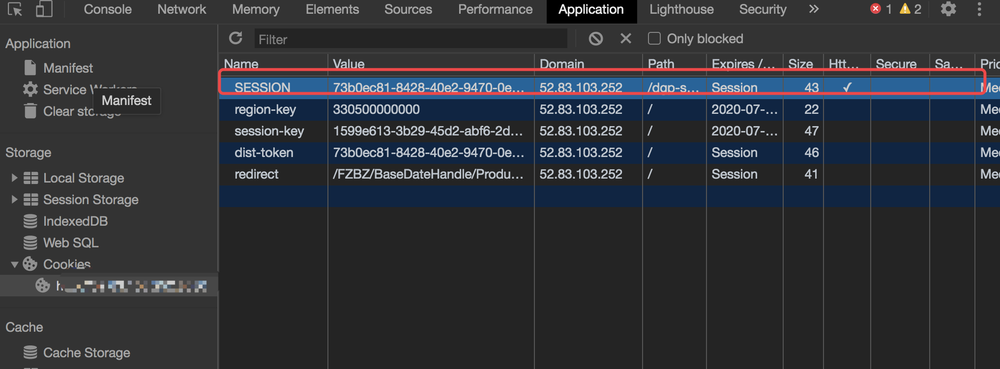

# Http

## HTTP 版本

### HTTP/0.9

这是 HTTP 最早大规模使用的版，现已过时。在这个版本中 只有 GET 一种请求方法，在 HTTP 通讯也没有指定版本号，也不支持请求头信息。该版本不支持 POST 等方法，因此客户端向服务器传递信息的能力非常有限。HTTP/0.9 的请求只有如下一行：

```
GET www.itbilu.com
```

### HTTP/1.0

这个版本是第一个在 HTTP 通讯中指定版本号的协议版本，HTTP/1.0 至今仍被广泛采用，特别是在代理服务器中。

HTTP/1.0 支持：GET、POST、HEAD 三种 HTTP 请求方法。

### HTTP/1.1

HTTP/1.1 是当前正在使用的版本。`该版本默认采用持久连接，并能很好地配合代理服务器工作。还支持以管道方式同时发送多个请求，以便降低线路负载，提高传输速度。`

HTTP/1.1 新增了：`OPTIONS、PUT、DELETE、TRACE、CONNECT`五种 HTTP 请求方法。

### HTTP/2

这个版本是最新发布的版本，于今年 5 月（2015 年 5 月）做 HTTP 标准正式发布。HTTP/2 通过支持请求与相应的多路重用来减少延迟，通过压缩 HTTP 头字段将协议开销降到最低，同时增加了对请求优先级和服务器端推送的支持。

## HTTP 请求方法

在 HTTP 的发展过程中，出现了很多 HTTP 版本，其中的大部分协议都是向下兼容的。在进行 HTTP 请求时，客户端在请求时会告诉服务器它采用的协议版本号，而服务器则会在使用相同或者更早的协议版本进行响应。

### 方法

名称解释：

- 幂等：对同一个系统，使用同样的条件，一次请求和重复的多次请求对系统资源的影响是一致的。

| 方法    | 说明                                                                                                                                                                                                                                                                                                                                               |
| ------- | -------------------------------------------------------------------------------------------------------------------------------------------------------------------------------------------------------------------------------------------------------------------------------------------------------------------------------------------------- |
| GET     | GET 请求会显示请求指定的资源。一般来说 GET 方法应该只用于数据的读取，而不应当用于会产生副作用的非幂等的操作中。它期望的应该是而且应该是安全的和幂等的。这里的安全指的是，请求不会影响到资源的状态。                                                                                                                                                |
| HEAD    | HEAD 方法与 GET 方法一样，都是向服务器发出指定资源的请求。但是，服务器在响应 HEAD 请求时不会回传资源的内容部分，即：响应主体。这样，我们可以不传输全部内容的情况下，就可以获取服务器的响应头信息。HEAD 方法常被用于客户端查看服务器的性能。                                                                                                        |
| POST    | POST 请求会 向指定资源提交数据，请求服务器进行处理，如：表单数据提交、文件上传等，请求数据会被包含在请求体中。POST 方法是非幂等的方法，因为这个请求可能会创建新的资源或/和修改现有资源。                                                                                                                                                           |
| PUT     | PUT 请求会身向指定资源位置上传其最新内容，PUT 方法是幂等的方法。通过该方法客户端可以将指定资源的最新数据传送给服务器取代指定的资源的内容。                                                                                                                                                                                                         |
| DELETE  | DELETE 请求用于请求服务器删除所请求 URI（统一资源标识符，Uniform Resource Identifier）所标识的资源。DELETE 请求后指定资源会被删除，DELETE 方法也是幂等的。                                                                                                                                                                                         |
| CONNECT | CONNECT 方法是 HTTP/1.1 协议预留的，能够将连接改为管道方式的代理服务器。通常用于 SSL 加密服务器的链接与非加密的 HTTP 代理服务器的通信。                                                                                                                                                                                                            |
| OPTIONS | OPTIONS 请求与 HEAD 类似，一般也是用于客户端查看服务器的性能。 这个方法会请求服务器返回该资源所支持的所有 HTTP 请求方法，该方法会用'\*'来代替资源名称，向服务器发送 OPTIONS 请求，可以测试服务器功能是否正常。**JavaScript 的 XMLHttpRequest 对象进行 CORS 跨域资源共享时，就是使用 OPTIONS 方法发送嗅探请求，以判断是否有对指定资源的访问权限。** |
| TRACE   | TRACE 请求服务器回显其收到的请求信息，该方法主要用于 HTTP 请求的测试或诊断。                                                                                                                                                                                                                                                                       |
| PATCH   | PATCH 方法出现的较晚，它在 2010 年的 RFC 5789 标准中被定义。PATCH 请求与 PUT 请求类似，同样用于资源的更新。二者有以下两点不同：1.PATCH 一般用于资源的部分更新，而 PUT 一般用于资源的整体更新。2.当资源不存在时，PATCH 会创建一个新的资源，而 PUT 只会对已在资源进行更新。                                                                          |

### 注意

- GET 可提交的数据量受到 URL 长度的限制，HTTP 协议规范没有对 URL 长度进行限制。这个限制是特定的浏览器及服务器对它的首先是。
- 理论上讲，POST 是没有大小限制的，HTTP 协议规范也没有进行大小限制，出于安全考虑，服务器软件在实现时会做一定的限制。

HTTP 协议 未规定 GET 和 POST 的长度限制
GET 的最大长度显示是因为 浏览器和 web 服务器限制了 URI 的长度
不同的浏览器和 WEB 服务器，限制的最大长度不一样
要支持 IE，则最大长度为 2083byte，若只支持 Chrome，则最大长度 **8182**byte

作者：izhongxia
链接：https://www.jianshu.com/p/512389822f8b
来源：简书
著作权归作者所有。商业转载请联系作者获得授权，非商业转载请注明出处。

## POST 请求

HTTP 协议中规定 POST 提交的数据必须在 body 部分中，但是协议中没有规定数据使用哪种编码方式或者数据格式。实际上，开发者完全可以自己决定消息主体的格式，只要最后发送的 HTTP 请求满足该有的格式就可以。

但是，数据发送出去，还要服务端解析成功才有意义。一般服务端语言如 php、python 等，以及它们的 framework，都内置了自动解析常见数据格式的功能。**服务端通常是根据请求头（headers）中的 `Content-Type` 字段来获知请求中的消息主体是何种方式编码，再对主体进行解析**。所以说到 POST 提交数据方案，包含了 Content-Type 和消息主体编码方式两部分。数据格式有：

### application/x-www-form-urlencoded

这应该是最常见的 POST 提交数据的方式。浏览器的原生 `<form>` 表单，如果不设置 `enctype` 属性，那么最终就会以 `application/x-www-form-urlencoded` 方式提交数据。

```
POST http://www.example.com HTTP/1.1
Content-Type: application/x-www-form-urlencoded;charset=utf-8

title=test&sub%5B%5D=1&sub%5B%5D=2&sub%5B%5D=3
```

首先，Content-Type 被指定为 application/x-www-form-urlencoded; 其次，提交的数据按照 `key1=val1&key2=val2`的方式进行编码，key 和 val 都进行了 URL 转码。可以看到 body 当中的内容和 GET 请求是完全相同的。大部分服务端语言都对这种方式都有很好的支持。

很多时候，我们用 Ajax 提交数据时，也是使用这种方式，例如过 JQuery 和 QWrap 的 Ajax，Content-Type 默认值都是 `application/x-www-form-urlencoded;charset=utf-8`。

### multipart/form-data

这又是一个常见的 POST 数据提交的方式。我们使用表单上传文件时，必须让`<form>` 表单的 enctype 等于 multipart/form-data。直接来看一个请求示例

```bash
POST http://www.example.com HTTP/1.1
Content-Type:multipart/form-data; boundary=----WebKitFormBoundaryrGKCBY7qhFd3TrwA

------WebKitFormBoundaryrGKCBY7qhFd3TrwA
Content-Disposition: form-data; name="text"

title
------WebKitFormBoundaryrGKCBY7qhFd3TrwA
Content-Disposition: form-data; name="file"; filename="chrome.png"
Content-Type: image/png

PNG ... content of chrome.png ...
------WebKitFormBoundaryrGKCBY7qhFd3TrwA--
```

首先生成了一个 boundary 用于分割不同的字段，为了避免与正文内容重复，boundary 很长很复杂。然后 Content-Type 里指明了数据是以 multipart/form-data 来编码，本次请求的 boundary 是什么内容。消息主体里按照字段个数又分为多个结构类似的部分，每部分都是以 --boundary 开始，紧接着是内容描述信息，然后是回车，最后是字段具体内容（文本或二进制）。如果传输的是文件，还要包含文件名和文件类型信息。消息主体最后以 --boundary-- 标示结束。

这种方式一般用来上传文件，各大服务端语言对它也有着良好的支持。

**上面提到的这两种 POST 数据的方式，都是浏览器原生支持的，而且现阶段标准中原生`<form>` 表单也只支持这两种方式（通过 `<form>` 元素的 `enctype` 属性指定，默认为 `application/x-www-form-urlencoded`。其实 `enctype` 还支持 `text/plain`，不过用得非常少）。**

随着越来越多的 Web 站点，尤其是 WebApp，全部使用 Ajax 进行数据交互之后，我们完全可以定义新的数据提交方式，给开发带来更多便利。

### application/json

`application/json` 这个 `Content-Type` 作为响应头大家肯定不陌生。实际上，现在越来越多的人把它作为请求头，用来告诉服务端消息主体是序列化后的 `JSON` 字符串。由于 JSON 规范的流行，除了低版本 IE 之外的各大浏览器都原生支持 `JSON.stringify`，服务端语言也都有处理 JSON 的函数，使用 JSON 不会遇上什么麻烦。

**JSON 格式支持比键值对复杂得多的结构化数据，这一点也很有用。**

```
POST http://www.example.com HTTP/1.1
Content-Type: application/json;charset=utf-8

{"title":"test","sub":[1,2,3]}   // chrome network 点击 view source 查看
```

这种方案，可以方便的提交复杂的结构化数据，特别适合 RESTful 的接口。各大抓包工具如 Chrome 自带的开发者工具、Firebug、Fiddler，都会以树形结构展示 JSON 数据，非常友好。

### text/xml

它是一种使用 HTTP 作为传输协议，`XML` 作为编码方式的远程调用规范。典型的 XML-RPC 请求是这样的：

```xml
POST http://www.example.com HTTP/1.1
Content-Type: text/xml

<?xml version="1.0"?>
<methodCall>
    <methodName>examples.getStateName</methodName>
    <params>
        <param>
            <value><i4>41</i4></value>
        </param>
    </params>
</methodCall>
```

XML-RPC 协议简单、功能够用，各种语言的实现都有。它的使用也很广泛，如 WordPress 的 XML-RPC Api，搜索引擎的 ping 服务等等。JavaScript 中，也有现成的库支持以这种方式进行数据交互，能很好的支持已有的 XML-RPC 服务。不过，XML 结构还是过于臃肿，一般场景用 JSON 还是会更灵活方便。

## ping

### 应用场景

在默认的请求上， 浏览器只能访问以下默认的 响应头

- Cache-Control

- Content-Language

- Content-Type

- Expires

- Last-Modified

- Pragma

如果想让浏览器能访问到其他的 响应头的话 需要在服务器上设置 Access-Control-Expose-Headers

- `Access-Control-Expose-Headers : 'Authorization'`

```bash
HTTP/1.1 200
X-Application-Context: application:prod:8080
Access-Control-Expose-Headers: Content-Disposition
Content-Disposition: attachment;filename=1586853275291.zip
Set-Cookie: SESSION=364deeec-505c-44f3-a75e-9875ef7bb46d; Path=/dgp-server-web-nr/; HttpOnly
Content-Type: application/x-msdownload; =;charset=utf-8
Transfer-Encoding: chunked
Content-Encoding: gzip
Vary: Accept-Encoding
Date: Tue, 14 Apr 2020 08:34:35 GMT
```

例如上面这里 `Content-Disposition` 对于前端保存二进制文件很重要，可以获取到该二进制文件的名称以及文件类型，从而进行保存。

```js
const reg = /filename=(\S.*?\.\w+)$/;
const fileInfo = headers["content-disposition"];
const filename = fileInfo && fileInfo.match(reg);
resolve({
  blob: data,
  name: filename ? decodeURI(filename[1]) : "DistTemplate",
});
const { blob, filename } = data;
saveAs(blob, filename);
```

因此针对下载的接口，服务端需要统一添加 `Access-Control-Expose-Headers: Content-Disposition`，前端需要获取这个头的信息，进行文件的保存。

- [Vuejs 之 axios 获取 Http 响应头](https://segmentfault.com/a/1190000009125333)

### 常见状态码

301，搜索引擎可以根据 301 更改失效的路径。

#### 100 ～ 199——信息性状态码

#### 200 ～ 299——成功状态码

客户端发起请求时，这些请求通常都是成功的。服务器有一组用来表示成功的状态码，分别对应不同类型的请求。

| 状态码 | 原因短语   | 含义                                                                                                                                     |
| ------ | ---------- | ---------------------------------------------------------------------------------------------------------------------------------------- |
| 200    | OK         | 请求没问题，实体的主体部分包含了所请求的资源                                                                                             |
| 204    | No Content | 响应报文中包含若干首部和一个状态行，但没有实体的主体部分。主要用于在浏览器不转为显示新文档的情况下，对其进行更新（比如刷新一个表单页面） |

#### 300 ～ 399——重定向状态码

#### 400 ～ 499——客户端错误

有时客户端会发送一些服务器无法处理的东西，比如格式错误的请求报文，或者是最常见的是，请求一个不存在的 URL。

浏览器网页时，我们都看过 404 Not Found 错误码——这只是服务器在告诉我们，它对我们请求的资源一无所知。

很多客户端错误都是由浏览器来处理的，甚至不会打扰到你。只有少量错误，比如 404，还是会穿过浏览器来到用户面前。

| 状态码 | 原因短语     | 含义                                                                                                                                                           |
| ------ | ------------ | -------------------------------------------------------------------------------------------------------------------------------------------------------------- |
| 400    | Bad Request  | 用于告知客户端它发送了一个错误的请求                                                                                                                           |
| 401    | Unauthorized | 与适当的首部一同返回，在这些首部中请求客户端在获取对资源的访问权之前，对自己进行认证。                                                                         |
| 403    | Forbidden    | 用于说明请求被服务器拒绝了。如果服务器想说明为什么拒绝请求，可以包含实体的主体部分来对你原因进行描述。但这个状态码通常是在服务器不想说明拒绝原因的时候使用的。 |

#### 500 ～ 599——服务器错误

## Cookie



## 参考资料

- [HTTP 请求方法详解](https://juejin.im/entry/5b004085f265da0b886daf7c)
- [MIME 类型](https://developer.mozilla.org/zh-CN/docs/Web/HTTP/Basics_of_HTTP/MIME_types) -- 浏览器通常使用 MIME 类型（而不是文件扩展名）来确定如何处理 URL。
- [聊一聊 cookie](https://segmentfault.com/a/1190000004556040)
