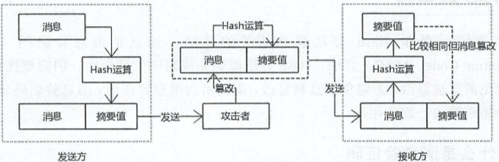

# HTTP

为了请求和响应数据，客户端和服务器通过 HTTP 来完成一系列的数据交换，不要认为 HTTP 负责数据传输，它实际上负责数据请求和响应，真正的数据传输由其他网络层处理。

Web 主要包括三个技术，分别是 HTML、URL、HTTP。

## HTTP 版本

### HTTP/0.9

这是 HTTP 最早大规模使用的版，现已过时。在这个版本中 只有 GET 一种请求方法，在 HTTP 通讯也没有指定版本号，也不支持请求头信息。该版本不支持 POST 等方法，因此客户端向服务器传递信息的能力非常有限。HTTP/0.9 的请求只有如下一行：

```
GET www.itbilu.com
```

### HTTP/1.0

这个版本是第一个在 HTTP 通讯中指定版本号的协议版本，HTTP/1.0 至今仍被广泛采用，特别是在代理服务器中。

HTTP/1.0 支持：GET、POST、HEAD 三种 HTTP 请求方法。

### HTTP/1.1

HTTP/1.1 是当前正在使用的版本。`该版本默认采用持久连接，并能很好地配合代理服务器工作。还支持以管道方式同时发送多个请求，以便降低线路负载，提高传输速度。`

HTTP/1.1 新增了：`OPTIONS、PUT、DELETE、TRACE、CONNECT`五种 HTTP 请求方法。

### HTTP/2

这个版本是最新发布的版本，于今年 5 月（2015 年 5 月）做 HTTP 标准正式发布。HTTP/2 通过支持请求与相应的多路重用来减少延迟，通过压缩 HTTP 头字段将协议开销降到最低，同时增加了对请求优先级和服务器端推送的支持。

## HTTP 请求方法

在 HTTP 的发展过程中，出现了很多 HTTP 版本，其中的大部分协议都是向下兼容的。在进行 HTTP 请求时，客户端在请求时会告诉服务器它采用的协议版本号，而服务器则会在使用相同或者更早的协议版本进行响应。

### 方法

名称解释：

- 幂等：对同一个系统，使用同样的条件，一次请求和重复的多次请求对系统资源的影响是一致的。

| 方法    | 说明                                                                                                                                                                                                                                                                                                                                               |
| ------- | -------------------------------------------------------------------------------------------------------------------------------------------------------------------------------------------------------------------------------------------------------------------------------------------------------------------------------------------------- |
| GET     | GET 请求会显示请求指定的资源。一般来说 GET 方法应该只用于数据的读取，而不应当用于会产生副作用的非幂等的操作中。它期望的应该是而且应该是安全的和幂等的。这里的安全指的是，请求不会影响到资源的状态。                                                                                                                                                |
| HEAD    | HEAD 方法与 GET 方法一样，都是向服务器发出指定资源的请求。但是，服务器在响应 HEAD 请求时不会回传资源的内容部分，即：响应主体。这样，我们可以不传输全部内容的情况下，就可以获取服务器的响应头信息。HEAD 方法常被用于客户端查看服务器的性能。                                                                                                        |
| POST    | POST 请求会 向指定资源提交数据，请求服务器进行处理，如：表单数据提交、文件上传等，请求数据会被包含在请求体中。POST 方法是非幂等的方法，因为这个请求可能会创建新的资源或/和修改现有资源。                                                                                                                                                           |
| PUT     | PUT 请求会身向指定资源位置上传其最新内容，PUT 方法是幂等的方法。通过该方法客户端可以将指定资源的最新数据传送给服务器取代指定的资源的内容。                                                                                                                                                                                                         |
| DELETE  | DELETE 请求用于请求服务器删除所请求 URI（统一资源标识符，Uniform Resource Identifier）所标识的资源。DELETE 请求后指定资源会被删除，DELETE 方法也是幂等的。                                                                                                                                                                                         |
| CONNECT | CONNECT 方法是 HTTP/1.1 协议预留的，能够将连接改为管道方式的代理服务器。通常用于 SSL 加密服务器的链接与非加密的 HTTP 代理服务器的通信。                                                                                                                                                                                                            |
| OPTIONS | OPTIONS 请求与 HEAD 类似，一般也是用于客户端查看服务器的性能。 这个方法会请求服务器返回该资源所支持的所有 HTTP 请求方法，该方法会用'\*'来代替资源名称，向服务器发送 OPTIONS 请求，可以测试服务器功能是否正常。**JavaScript 的 XMLHttpRequest 对象进行 CORS 跨域资源共享时，就是使用 OPTIONS 方法发送嗅探请求，以判断是否有对指定资源的访问权限。** |
| TRACE   | TRACE 请求服务器回显其收到的请求信息，该方法主要用于 HTTP 请求的测试或诊断。                                                                                                                                                                                                                                                                       |
| PATCH   | PATCH 方法出现的较晚，它在 2010 年的 RFC 5789 标准中被定义。PATCH 请求与 PUT 请求类似，同样用于资源的更新。二者有以下两点不同：1.PATCH 一般用于资源的部分更新，而 PUT 一般用于资源的整体更新。2.当资源不存在时，PATCH 会创建一个新的资源，而 PUT 只会对已在资源进行更新。                                                                          |

### 注意

- GET 可提交的数据量受到 URL 长度的限制，HTTP 协议规范没有对 URL 长度进行限制。这个限制是特定的浏览器及服务器对它的首先是。
- 理论上讲，POST 是没有大小限制的，HTTP 协议规范也没有进行大小限制，出于安全考虑，服务器软件在实现时会做一定的限制。

HTTP 协议 未规定 GET 和 POST 的长度限制
GET 的最大长度显示是因为 浏览器和 web 服务器限制了 URI 的长度
不同的浏览器和 WEB 服务器，限制的最大长度不一样
要支持 IE，则最大长度为 2083byte，若只支持 Chrome，则最大长度 **8182**byte

作者：izhongxia
链接：https://www.jianshu.com/p/512389822f8b
来源：简书
著作权归作者所有。商业转载请联系作者获得授权，非商业转载请注明出处。

## POST 请求

HTTP 协议中规定 POST 提交的数据必须在 body 部分中，但是协议中没有规定数据使用哪种编码方式或者数据格式。实际上，开发者完全可以自己决定消息主体的格式，只要最后发送的 HTTP 请求满足该有的格式就可以。

但是，数据发送出去，还要服务端解析成功才有意义。一般服务端语言如 php、python 等，以及它们的 framework，都内置了自动解析常见数据格式的功能。**服务端通常是根据请求头（headers）中的 `Content-Type` 字段来获知请求中的消息主体是何种方式编码，再对主体进行解析**。所以说到 POST 提交数据方案，包含了 Content-Type 和消息主体编码方式两部分。数据格式有：

### application/x-www-form-urlencoded

这应该是最常见的 POST 提交数据的方式。浏览器的原生 `<form>` 表单，如果不设置 `enctype` 属性，那么最终就会以 `application/x-www-form-urlencoded` 方式提交数据。

```
POST http://www.example.com HTTP/1.1
Content-Type: application/x-www-form-urlencoded;charset=utf-8

title=test&sub%5B%5D=1&sub%5B%5D=2&sub%5B%5D=3
```

首先，Content-Type 被指定为 application/x-www-form-urlencoded; 其次，提交的数据按照 `key1=val1&key2=val2`的方式进行编码，key 和 val 都进行了 URL 转码。可以看到 body 当中的内容和 GET 请求是完全相同的。大部分服务端语言都对这种方式都有很好的支持。

很多时候，我们用 Ajax 提交数据时，也是使用这种方式，例如过 JQuery 和 QWrap 的 Ajax，Content-Type 默认值都是 `application/x-www-form-urlencoded;charset=utf-8`。

### multipart/form-data

这又是一个常见的 POST 数据提交的方式。我们使用表单上传文件时，必须让`<form>` 表单的 enctype 等于 multipart/form-data。直接来看一个请求示例

```bash
POST http://www.example.com HTTP/1.1
Content-Type:multipart/form-data; boundary=----WebKitFormBoundaryrGKCBY7qhFd3TrwA

------WebKitFormBoundaryrGKCBY7qhFd3TrwA
Content-Disposition: form-data; name="text"

title
------WebKitFormBoundaryrGKCBY7qhFd3TrwA
Content-Disposition: form-data; name="file"; filename="chrome.png"
Content-Type: image/png

PNG ... content of chrome.png ...
------WebKitFormBoundaryrGKCBY7qhFd3TrwA--
```

首先生成了一个 boundary 用于分割不同的字段，为了避免与正文内容重复，boundary 很长很复杂。然后 Content-Type 里指明了数据是以 multipart/form-data 来编码，本次请求的 boundary 是什么内容。消息主体里按照字段个数又分为多个结构类似的部分，每部分都是以 --boundary 开始，紧接着是内容描述信息，然后是回车，最后是字段具体内容（文本或二进制）。如果传输的是文件，还要包含文件名和文件类型信息。消息主体最后以 --boundary-- 标示结束。

这种方式一般用来上传文件，各大服务端语言对它也有着良好的支持。

**上面提到的这两种 POST 数据的方式，都是浏览器原生支持的，而且现阶段标准中原生`<form>` 表单也只支持这两种方式（通过 `<form>` 元素的 `enctype` 属性指定，默认为 `application/x-www-form-urlencoded`。其实 `enctype` 还支持 `text/plain`，不过用得非常少）。**

随着越来越多的 Web 站点，尤其是 WebApp，全部使用 Ajax 进行数据交互之后，我们完全可以定义新的数据提交方式，给开发带来更多便利。

### application/json

`application/json` 这个 `Content-Type` 作为响应头大家肯定不陌生。实际上，现在越来越多的人把它作为请求头，用来告诉服务端消息主体是序列化后的 `JSON` 字符串。由于 JSON 规范的流行，除了低版本 IE 之外的各大浏览器都原生支持 `JSON.stringify`，服务端语言也都有处理 JSON 的函数，使用 JSON 不会遇上什么麻烦。

**JSON 格式支持比键值对复杂得多的结构化数据，这一点也很有用。**

```
POST http://www.example.com HTTP/1.1
Content-Type: application/json;charset=utf-8

{"title":"test","sub":[1,2,3]}   // chrome network 点击 view source 查看
```

这种方案，可以方便的提交复杂的结构化数据，特别适合 RESTful 的接口。各大抓包工具如 Chrome 自带的开发者工具、Firebug、Fiddler，都会以树形结构展示 JSON 数据，非常友好。

### text/xml

它是一种使用 HTTP 作为传输协议，`XML` 作为编码方式的远程调用规范。典型的 XML-RPC 请求是这样的：

```xml
POST http://www.example.com HTTP/1.1
Content-Type: text/xml

<?xml version="1.0"?>
<methodCall>
    <methodName>examples.getStateName</methodName>
    <params>
        <param>
            <value><i4>41</i4></value>
        </param>
    </params>
</methodCall>
```

XML-RPC 协议简单、功能够用，各种语言的实现都有。它的使用也很广泛，如 WordPress 的 XML-RPC Api，搜索引擎的 ping 服务等等。JavaScript 中，也有现成的库支持以这种方式进行数据交互，能很好的支持已有的 XML-RPC 服务。不过，XML 结构还是过于臃肿，一般场景用 JSON 还是会更灵活方便。

## ping

### 应用场景

在默认的请求上， 浏览器只能访问以下默认的 响应头

- Cache-Control

- Content-Language

- Content-Type

- Expires

- Last-Modified

- Pragma

如果想让浏览器能访问到其他的 响应头的话 需要在服务器上设置 Access-Control-Expose-Headers

- `Access-Control-Expose-Headers : 'Authorization'`

```bash
HTTP/1.1 200
X-Application-Context: application:prod:8080
Access-Control-Expose-Headers: Content-Disposition
Content-Disposition: attachment;filename=1586853275291.zip
Set-Cookie: SESSION=364deeec-505c-44f3-a75e-9875ef7bb46d; Path=/dgp-server-web-nr/; HttpOnly
Content-Type: application/x-msdownload; =;charset=utf-8
Transfer-Encoding: chunked
Content-Encoding: gzip
Vary: Accept-Encoding
Date: Tue, 14 Apr 2020 08:34:35 GMT
```

例如上面这里 `Content-Disposition` 对于前端保存二进制文件很重要，可以获取到该二进制文件的名称以及文件类型，从而进行保存。

```js
const reg = /filename=(\S.*?\.\w+)$/;
const fileInfo = headers["content-disposition"];
const filename = fileInfo && fileInfo.match(reg);
resolve({
  blob: data,
  name: filename ? decodeURI(filename[1]) : "DistTemplate",
});
const { blob, filename } = data;
saveAs(blob, filename);
```

因此针对下载的接口，服务端需要统一添加 `Access-Control-Expose-Headers: Content-Disposition`，前端需要获取这个头的信息，进行文件的保存。

- [Vuejs 之 axios 获取 Http 响应头](https://segmentfault.com/a/1190000009125333)

### 常见状态码

301，搜索引擎可以根据 301 更改失效的路径。

#### 100 ～ 199——信息性状态码

#### 200 ～ 299——成功状态码

客户端发起请求时，这些请求通常都是成功的。服务器有一组用来表示成功的状态码，分别对应不同类型的请求。

| 状态码 | 原因短语   | 含义                                                                                                                                     |
| ------ | ---------- | ---------------------------------------------------------------------------------------------------------------------------------------- |
| 200    | OK         | 请求没问题，实体的主体部分包含了所请求的资源                                                                                             |
| 204    | No Content | 响应报文中包含若干首部和一个状态行，但没有实体的主体部分。主要用于在浏览器不转为显示新文档的情况下，对其进行更新（比如刷新一个表单页面） |

#### 300 ～ 399——重定向状态码

#### 400 ～ 499——客户端错误

有时客户端会发送一些服务器无法处理的东西，比如格式错误的请求报文，或者是最常见的是，请求一个不存在的 URL。

浏览器网页时，我们都看过 404 Not Found 错误码——这只是服务器在告诉我们，它对我们请求的资源一无所知。

很多客户端错误都是由浏览器来处理的，甚至不会打扰到你。只有少量错误，比如 404，还是会穿过浏览器来到用户面前。

| 状态码 | 原因短语     | 含义                                                                                                                                                           |
| ------ | ------------ | -------------------------------------------------------------------------------------------------------------------------------------------------------------- |
| 400    | Bad Request  | 用于告知客户端它发送了一个错误的请求                                                                                                                           |
| 401    | Unauthorized | 与适当的首部一同返回，在这些首部中请求客户端在获取对资源的访问权之前，对自己进行认证。                                                                         |
| 403    | Forbidden    | 用于说明请求被服务器拒绝了。如果服务器想说明为什么拒绝请求，可以包含实体的主体部分来对你原因进行描述。但这个状态码通常是在服务器不想说明拒绝原因的时候使用的。 |

#### 500 ～ 599——服务器错误

## Cookie


## HTTP/1.1

## HTTPS

从 HTTP 升级到 HTTPS，并不是让 Web 服务器支持 HTTPS 协议这么简单，还需要考虑 CDN、负载均衡、反向代理等服务器。同时要考虑在何种设备上部署证书及私钥，涉及网络架构和应用架构的变化。这些都需要考虑合理性，尤其要兼顾访问速度与系统安全性。在部署的过程中还必须保持业务的连续性，不能中断业务，要稳定地响应用户请求，做好 HTTPS 和 HTTP 的过渡和兼容。还要考虑 Referer、Cookie 等数据如何保持一致，如何避免出现访问故障。


从上图可以看出，我们使用 HTTP 传输的内容很容易被中间人窃取、伪造和篡改，通常我们把这种攻击方式称为中间人攻击。

具体来讲，在将 HTTP 数据提交给 TCP 层之后，数据会经过用户电脑、WiFi 路由器、运营商和目标服务器，在这中间的每个环节中，数据都有可能被窃取或篡改。比如用户电脑被黑客安装了恶意软件，那么恶意软件就能抓取和篡改所发出的 HTTP 请求的内容。或者用户一不小心连接上了 WiFi 钓鱼路由器，那么数据也都能被黑客抓取或篡改。

对称加密：双方均有相同的秘钥，两边都知道如何将密文加密和解密。

非对称加密：有公钥和私钥之分，公钥加密，私钥解密。


**HTTP 的安全问题**：

- 数据没有加密
- 无法验证身份。
  - 由于通信双方无法确认对方，实现 HTTP 应用非常灵活，也产生了很多中间设备，比如代理服务器、网关服务器，这些中间设备对于丰富和加速 HTTP 网站有着巨大的作用。
- 数据容易纂改。（考虑哈希算法验证）

### 密码学

##### 四个目标

- 机密性
- 完整性
- 身份验证
- 不可抵赖性

##### OpenSSL

密码学原理是公开的，在工程上需要实现各种算法，最著名的就是 OpenSSL 项目，包括了底层密码库和命令行工具，大部分 Linux 发行版都预装了 OpenSSL 库。

#### 随机数

随机数的类型

| 名称                 | 生成类型 | 特性                                   | 说明               |
| -------------------- | -------- | -------------------------------------- | ------------------ |
| 真正的随机数生成器   | 硬件生成 | 效率高、随机性、不可预测性、不可重现性 | 需要从物理设备获取 |
| 伪随机数生成器       | 软件生成 | 效率高、随机性                         | 通过算法获取       |
| 密码学伪随机数生成器 | 软件生成 | 效率高、随机性、不可预测性             | 用于密码学         |

##### **随机数工作原理**

随机数生成器内部会维护一个状态（internal state），对于 TRNG（True Random Number Generator） 来说，内部状态的数值来自外部设备，称为熵（entrory），比如动态的时间、变化的温度、声音的变化、鼠标位置。

而对于 PRNG（Preudo Random Number Generator） 来说，内部状态的数值来自于模拟的数值，称为种子（seed）。随机数生成器每次生成随机数的时候，内部状态的值都会变化，这样才能产生不一样的随机数。如果每次熵和种子是一样的，生成的随机数也是相同的，所以熵和种子对于随机数生成器非常重要。

**密码学算法中的随机数**

| 名称             | 说明                                                         |
| ---------------- | ------------------------------------------------------------ |
| 密钥             | 对称加密算法、公开密钥算法、MAC 算法都会用到密钥，密钥本质上是一个随机数。 |
| 初始化向量（IV） | 块密码算法中很多迭代模式会使用 IV                            |
| nonce            | 块密码算法中的 CTR 模式、AEAD 加密模式也会用到 nonce         |
| salt             | 基于口令的加密算法会用到，通过 salt 生成一个密钥             |

#### Hash 算法

随机数生成算法和密码学 Hash 算法都是密码学中的基础算法，很多其他的密码学算法选择这两个算法作为加密基元（Cryptographic Primitives）。

| 算法名称           | 说明                                                         |
| ------------------ | ------------------------------------------------------------ |
| MAC 消息验证码     | HMAC 就是一个基于 Hash 算法实现的 MAC 算法                   |
| 伪随机数生成器     | 利用 Hash 算法的单一性特点，可以构造出一个随机数             |
| 基于口令的加密算法 | 可以通过口令和 Hash 算法生成一个密钥                         |
| 数字签名           | 数字签名算法对 Hash 算法生成的摘要值进行签名                 |
| 块密码和加密算法   | 基于 Hash 算法也能生成块密码加密算法，同时块密码加密算法也能生成一个 Hash 算法 |

**摘要/散列值/指纹 = hash（消息）**

从密码学的角度考虑，Hash 算法能够实现密码学的某个目标，那就是消息防篡改。

Hash 算法的用途

- 文件比较 MD5，比如下载的文件是否与官方的一致。
- 身份校验（存储口令的哈希到数据库，但也有安全风险）

#### 对称加密算法

所谓数据加密，就是将一段数据处理成无规则的数据，除非有关键的密钥，否则谁也无法得知规则数据的真实含义。

在密码学中，用于数据加密的算法主要有两种，分别是对称加密算法（Symmetric-key Algorithms）和非对称加密算法（Asymmetrical Cryptography）。

**什么是对称加密算法呢**？一般是通过一个算法和一个密钥（secret key）对明文（plaintext）进行处理，得到的不规则字符就是密文（ciphertext）。

```js
密文 = E (明文，算法，密钥)

明文 = D（密文，算法，密钥）
```

对称加密算法有两种类型，分别是块密码算法（block ciphers）和流密码算法（stream ciphers）。

**AES 算法是对称加密算法的标准算法**。

```js

```

#### 消息验证码

Hash 算法能够完成密码学目标之一的完整性校验，但却不能避免消息被篡改，为避免消息被篡改，需要用到消息验证码。


逻辑看上去没有问题，接收方校验摘要值是相同的，如果相同是否能够说明消息没有篡改？实际上攻击者可以对消息进行拦截，同时修改稿接口消息和消息的摘要值然后发送给接收方，接收方收到消息后，对接口消息计算摘要值，然后与接收到的摘要值进行比较，如果相同，接收方认为消息是完整的。



可实际呢？消息虽然是完整的，但被篡改了，或者说消息为伪装了，但对于接收方来说，仅仅通过摘要值无法验证消息是不是篡改了，这时候需要使用 MAC 算法。

**消息验证码算法的特点：**

- 证明消息没有被篡改，这和 Hash 算法类似。
- **消息是正确的发送者发送的**，也就是消息是经过验证的。

##### MAC 算法

注意，消息验证和身份验证是不同的概念。

1. 如果确保消息是特定人发送的呢？在通信双发可以维护同一个密钥，只有拥有者密钥的通信双发才能生生和验证消息验证码，消息验证码算法需要一个密钥，这和对称加密算法是一样的，**通信双方在消息传递之前需要获得同样的密钥**。
   - **消息验证码的模型很简单：`MAC 值 = mac(消息, 密钥)`**

2. MAC 值一般和原始信息一起传输，原始信息可以选择加密，也可以选择不加密，通信双方会以相同的方式生成 MAC 值，然后进行比较。


对称加密算法可以保证消息的机密性，MAC 算法可以保证消息的完整性，将两者结合起来，就可以保证消息同时具备机密性和完整性。

```php
// 加密密钥
$key = "000102030405060708090a0b0c0d0e0f";

// MAC 算法密钥，一般不同于加密密钥
$mackey = "2510c39011c5be704182423e3a695e91";

$obj = new AES128Encryptor($key); // 对称加密算法加密

// 加密值
$ciphertext = $obj->encrypt($plaintext);

// MAC 值
$mac = hash_hmac("sha256", $plaintext, $mackey);

// 发送的消息包含加密值和 MAC 值
$message = base64_encode($ciphertext . $mac);
echo $message;
```

#### 公开密钥算法

公开密钥算法（Public Key Cryptography），也称为非对称加密算法（Asymmetrical Cryptography），公开密钥算法不是一个算法而是一组算法，如果公开密钥算法用于加密解密运算，习惯上称为非对称加密算法。

公开加密算法和对称加密算法的一些异同

- 功能不一样
  - 对称加密算法虽然有很多的算法和加密机制，但主要用于加密和解密。而公开密钥算法的功能比较多，可以进行**加密解密、密钥协商、数字签名**
- 密钥是一对
  - 对称加密算法中，密钥是一串数字，加密者和解密者使用同样的一个密钥。公开密钥算法之所以包含公开两字，表示密钥可以部分公开，公开密钥算法的密钥是一对，分别是**公钥（public key）和私钥（private key）**，一般私钥由密钥对的生成方（比如服务器）持有，避免泄漏，而公钥任何人都可以持有，也不怕泄漏。
- 运算速度很慢
  - 公开密钥算法在密码学中一般进行密钥协商或者数字签名，因为这两者运算的数据相对较小。

公开密钥算法最重要和最广泛使用的算法就是 **RSA 算法**。


##### **RSA 加密算法的应用场景**

- 单步加密
  - 公钥是公开的，很多客户端知道，而私钥必须由服务器端保密，所以一般客户端用公钥加密的方式传递一些关键数据，比如客户端可以对自己的信用卡号加密，然后传递给服务器端，服务器端解密后无须回应，这就是单步加密的模式。
  - （PS：目前接触的项目中，普通的登陆就是单步加密）
- 双向加密
  - 在单步加密过程中，服务器端无法发送发送密文，如果服务端用私钥加密数据，然后发送给客户端，由于公钥是公开的，任何人都能解密，所以这个过程是不成立的。
  - 通过 RSA 算法如何真正做到加密呢？如何确保通信的过程中，服务器端和客户端能够互相发送加密消息呢？
  - 举个例子来解释什么是双向加密，完成的功能是用户要查询账户（身份证）下还有多少余额：
    - 客户端生成一对 RSA 密钥对，然后连接服务器端，并将自己的公钥（clientPublicKey）发给服务器端。
    - 服务器端接收请求后，保存客户端的公钥，然后生成另外一对 RSA 密钥对，并将公钥（serverPublicKey）发送给客户端。
    - 客户端使用服务器的公钥（serverPublicKey）加密身份证号，加密的数据发送给服务器端，期待服务器端返回自己的账户余额。
    - 服务器接收到数据后，用自己的私钥（serverPrivateKey）解密出客户端的身份证号，然后查询出用户的余额，并用客户端的公钥（clientPublicKey）加密余额，并发送给客户端。
    - 客户端用自己的私钥（ClientPrivateKey）解密接收到数据，这个数据就是自己账户下的余额。
  - **这就是双向加密，如果不考虑性能问题，RSA 算法确实可以完成数据加密。**

##### RSA 加密算法实践

1. OpenSSL

   - 使用 genrsa 子命令生成密钥对，密钥对是一个文件

   - 从密钥对中分离出公钥

   - 校验密码对文件是否正确

   - 显示公钥信息

   - RSA 加密

     ```sh
     echo "hello" >>plain.txt
     
     # 使用密钥对加密
     openssl rsautl -encrypt -inkey mykey.pem -in plain.txt -out cipher.txt
     
     # 使用公钥加密，务必有 -pubin 参数表明 -inkey 参数输入的是公钥文件
     openssl rsautl -encrypt -pubin -inkey mypubkey.pem -in plain.txt -out cipher.txt
     
     # 解密
     openssl rsautl -decrypt -inkey mykey.pem -in cipher.txt
     ```

2. PHP

#### 密钥

密钥是密码学中非常关键的概念，一般情况下，密钥一旦被截获，密文就能够被解密。密钥最重要的属性就是密钥的长度，密钥长度决定了密钥空间的大小，如果密钥长度过短，很容易受到暴力攻击。

密码学的算法是公开的，一般很难破解，密钥是攻击者可能采取的攻击手段，攻击者可以不断猜测密钥，最多经过 2^16 次运算（生成各种不同的密钥）就能破解密文，暴力攻击就是不断地迭代密钥进行攻击。

为了避免暴力破解，不同密码学的密钥应该保证一定长度，比如 AES 算法安全的密钥长度是 128 比特，密钥长度足够长也不代表安全，密钥应该是随机、无法预测的。

那么**密钥到底是什么？从两个维度来考虑：**

- 对称加密算法、MAC 算法使用的密钥就是一串数字。
- 公开密钥算法中的密钥是一对，由多个部分组成，但本质上也可以认为由多个数字组成。

密钥虽然是简单的数字，但在实际使用过程中还是复杂的，涉及密钥生成、存储、传输等一系列的工作。

##### **密钥的作用**

| 名称               | 作用                     | 说明                                                 |
| ------------------ | ------------------------ | ---------------------------------------------------- |
| 对称加密算法密钥   | 加密解密                 | 密钥不能泄露                                         |
| 非对称加密算法密钥 | 加密解密                 | 公钥可以公开，私钥不能泄露                           |
| MAC 算法的密钥     | 消息验证                 | 密钥不能泄露                                         |
| 数字签名算法的密钥 | 身份验证                 | 公钥可以公开，私钥不能泄露                           |
| 会话密钥           | 加密解密                 | 密钥不能泄露，该密钥一般配合对称加密算法进行加密解密 |
| 基于口令的密钥     | 进行权限校验、加密解密等 | 口令不能泄露                                         |

##### 生成密钥

在密码学中，为了生存密钥，一般采用两种方法：

- 基于伪随机生成器生成密钥。
- 基于口令的加密（Password-based Encryption，简称 PBE）算法产生密钥。

使用伪随机数生成器（PRNG）生成的密钥足够随机，很难预测，对于人类来说很难记住，同时由于不具备可预测性，攻击者很难对密钥本身进行攻击，除非该密钥泄露了。

PBE 算法生成的密钥一般情况下无须存储，因为使用同样的口令就能生成同样的密钥，这是其优点之一，PBE 算法生成的密钥有时候并不是为了使用该密钥，而有其他用途。

##### 口令和 PEB 算法

口令（password 或者 passphrase）也可以认为是一种密钥，都需要保密，不能泄露。口令和密钥最大的区别在于口令更容易生成、更容易记忆，一般情况下口令记录在人脑中，口令可以认为是一种弱密钥，由固定的字面、数字、符号组成的，攻击者可以生成所有可能的口令，然后使用口令迭代去解密，一旦成功解密，就表示口令被暴力破解了。

字典攻击本质上也是一种暴力攻击，只是能够加快破解效率（时间和空间），人类一般使用常见的字母、数字、符号组合成口令（比如很多人喜欢用字母 password 作为口令），攻击者可以将常见的口令保存在一张字典中，然后用字典中的口令迭代去解密密文。除了字典攻击，还有彩虹表攻击方式，破解的关键点就在于口令相对容易猜测和预测。

**1）口令用于身份校验**

##### 密钥存储和传输

**1）静态密钥**

有些密钥需要存储，有些密钥不需要存储，密钥可以存储到文件、数据库、专属的设备中，一旦密钥泄露了，面临的核心问题就是隐私被暴露了，密钥和密文是一样重要的，有了密钥相当于密文被解密了。<u>需要存储的密钥是静态不变的，也称为长期密钥，在一定时间内都是生效的，除非主动更新或者废弃密钥。</u>

对于个体、小范围团体的网络通信或非网络通信的应用来说，加密解密的操作者之间都是熟识的，可以通过简单的途径将密钥告诉给密钥使用者，一般有以下几种方式：

- **密钥硬编码在代码中。**
- **以口头、邮件的方式传输密钥。**（比如一些软件使用权？）

不管是将密钥硬编码在代码中还是通过邮件的方式传输，都要注意安全，静态密钥的有效期相对较长，密钥拥有者很难发现密钥泄露了，所以有必要经常更改密钥。

简单介绍下密钥硬编码的应用场景，开发者开发了一个**记事本应用**，需要将笔记保存到磁盘中，为了安全性，数据存储到磁盘的时候需要使用对称加密算法加密，从磁盘读取笔记的时候用同样的密钥进行解密，由于加密和解密的密钥局限于该应用，可以将密钥硬编码到代码中，密钥由于只有开发者知道，相对来说不存在泄露的可能。

再介绍一个**邮件传输密钥**的应用场景，开发者开发另一个 HTTP API 接口，为了保证机密性，使用对称加密算法加密该接口的内容，由于接口的使用方并不多，开发者也熟识使用方的身份，可以给每个使用方分配一个密钥，然后将密钥存储到数据库中，最后以邮件的方式告知每个使用者的密钥，这种分配、存储、传输密钥的解决方案相对来说非常简单有效，有一定的应用场景，但一旦邮件泄露，就存在很大的安全风险。

**2）动态密钥**

在 Web 应用中，不太适合使用长期静态密钥，互联网网站的用户非常多，来自世界各地，客户端和服务端可以采用加密算法保证数据机密性，而加密解密运算需要密钥，服务器如何将密钥安全传输给客户端呢？如果能够安全传输密钥，那也可以以同样的方式传输数据，为了安全传输密钥，难道对密钥也要进行加密保护吗？好像进入了死循环。

也就是说网络通信应用中，安全传输密钥是非常难以解决的问题：

- 对于一个网站来说，客户端用户非常多，服务器不可能给每个客户端分配同样的密钥，因为如果密钥相同，一个客户端就可以解密另一个客户端传输的数据，如果给每个客户端分配不同的密钥，那么密钥存储的数据库容量就非常大，不存在可操作性。
- 对于一个网站来说，服务器端根本不知道客户端是谁，也不认识这些客户端，无法以邮件这样的方式通知每一个客户端。
- 对于一个网站来说可，加密解密需要的密钥需要通过其他的方式进行传输，每个 TCP 连接传输的密钥不一样，这就是动态密钥。

为了在网络通信中传输动态密钥，可以采用密码学的密钥协商算法。

#### 密钥协商算法

公开密钥算法的另外一种算法就是密钥协商算法，在网络通信应用中，密钥的管理和分配是个难题，尤其是生成一个动态密钥更难，而密钥协商算法就可以解决密钥分配、存储、传输等问题。

在网络通信中，为了加密解密数据，可以采用动态密钥，也叫做**会话密钥**，这个密钥有以下一些特点：

- 会话密钥的作用就是为了加密解密通信数据，也就是对称加密算法可以使用会话密钥进行加密和解密。
- 在加密解密通信数据之前，客户端和服务端需要协商出会话密钥，而会话密钥只有服务器端和特定的客户端才能知晓，不能泄露，这可以采用**密钥协商算法解决。**
- **会话密钥的意思就是该密钥不用存储，一旦客户端和服务器端的连接关闭，该密钥就会消失，也就是说密钥存储在客户端和服务器端的内存中，由于密钥不用存储，安全性就得到了很大的保障**。

常见会话密钥可以使用伪随机数生成器生成，数量也可以无限多，会话密钥也不用存储，**最关键的是会话密钥能够在不安全的网络通信中进行安全传输。**

##### RSA 密钥协商算法

RSA 密钥协商算法如何工作：

- 客户端初始化连接服务端，服务器发送 RSA 密钥对的公钥给客户端。
- 客户端生成一个随机值，这个值必须是随机的，不能被攻击者猜出，这个值就是**会话密钥**。
- 客户端使用服务器 RSA 密钥对的公钥加密会话密钥，并发送给服务器端，**由于攻击者没有服务器的私钥**，所以无法解密会话密钥。
- 服务器端用它的私钥解密出会话密钥。
- 至此双发完成连接，接下来服务器端和客户端可以使用对称加密算法和会话密钥加密解密数据。

RSA 密钥协商算法有几个优点：

- 每次连接解决的会话密钥是不同的，无须存储到设备中，连接关闭后会话密钥就会消失。
- 每次连接中的会话密钥是不同的，避免了繁琐的会话密钥分配问题。
- 虽然 RSA 运算很慢，但由于会话密钥长度相对很小，计算的数据量并不大，所以性能消耗相对可控。

这个方案用途非常广泛，HTTPS 本身也是借鉴了这个方案，只是在设计上更严谨。

RSA 密钥协商算法也有缺点：

- 获取会话密钥过程中其实并不能称为协商，完全是由客户端决定的，只能称为密钥传输。如果客户端生成会话密钥没有使用标准的算法，可能会带来安全隐患。比如说客户端每次随机从 26 个字母选取 4 个字母作为会话密钥，那么很容易受到暴力攻击。攻击者不会去破解 RSA 加密算法的私钥，直接暴力破解会话密钥就能反解开出明文。
- 最大的问题就是不能提供前向安全性，前向安全性是 HTTPS 中非常重要的概念。

##### DH 密钥协商算法实践

Diffie-Hellman 算法，简称 DH 算法，是 Whitfield Diffie 和 Martin Hellman 在 1976 年公布的一个公开密钥算法。

使用 RSA 密钥协商算法传输会话密钥的时候，会话密钥完全由客户端控制，并没有服务器的参与，所以叫做密钥传输。

而 DH 算法确切地说，实现的是密钥交换或者密钥协商，DH算法在进行密钥协商的时候，通信双方的任何一方无法独立计算出一个会话密钥，通信双方各自保留一部分关键信息，再将另外一部分信息告诉对方，**双方有了全部信息才能共同计算出相同的会话密钥**。

客户端和服务器协商会话密钥的时候，需要互相传递消息，消息即使背挟持，攻击者也无法计算出会话密钥，因为攻击者没有足够的信息（通信双方各自保留的信息）计算出同样的会话密钥。

DH 算法处理过程：


- 通信双方的任何一方可以生成公共参数 p 和 g，这两个数时公开的，被截获了也没有任何关系，一般情况下由通信双方的服务器端计算。
- 客户端连接服务器端，服务器端将参数发送给客户端。
- 客户端根据公开参数生成一个随机数 a，这个随机数是私钥，只有客户端知道，且不会进行发送，然后计算 Yc = (g ^ a) mod p，Yc 就是公钥，需要发送给服务端。
- 服务器根据公开参数生成一个随机数 b，这个随机数是私钥，需要服务器端保密，然后计算 Ys = (g ^ b) mod p，Ys 是公钥，需要发送给客户端。
- 客户端发送 Yc 数值给服务器端，服务器端计算 Z = (Yc ^ b) mod p。
- 服务器端发送 Ys 数值给客户端，客户端计算 Z = (Ys ^ a) mod p。
- 服务器端和客户端生成的 Z 就是会话密钥，协商完成。

**这里的关键点就是私钥 a 和 b 不应该泄露，分别由通信双方维护，另外 Ys 和 Yc 进行互换才能完成协商，这两个值被截获堆攻击者来说没有任何价值。换句话说，只要私钥不发生泄露，攻击者即使有了 Ys 和 Yc 也不会计算出会话密钥。**

2）临时 DH 算法

在每次初始化连接的时候，服务器都会重新生成 DH 密钥对，DH 密钥对仅仅保存在内存中，不像 RSA 那样私钥是保存在磁盘中的，攻击者即使从内存中破解了私钥，也仅仅影响了本次通信，因为每次初始化的时候密钥对是动态变化的。更安全的是，协商出会话密钥后，a 和 b 两个私钥可以丢弃，进一步提升了安全性，在有限的时间、有效的空间生成了密钥对。

```sh
# 通信双方的任何一方生成 DH 的参数文件，可以对外公开
openssl genpkey -genparam -algorithm DH -out dhp.pem

# 查看参数文件的内容，包括 p 和 g 等参数
openssl pkeyparam -in dhp.pem -text

# 发送方 A 基于参数文件生成一个密钥对
openssl genpkey -paramfile dhp.pem -out akey.pem

# 查看密钥对内容
openssl pkey -in akey.pem -text -noout

# 发送方 B 基于参数文件生成一个密钥对
openssl genpkey -paramfile dhp.pem -out bkey.pem

# 查看密钥对内容
openssl pkey -in bkey.pem -text -noout

# 发送方 A 拆除公钥文件 akey_pub.pem，私钥自己保存
openssl pkey -in akey.pem -pubout -out akey_pub.pem

# 发送方 B 拆出公钥文件 bkey_pub.pem，私钥自己保存
openssl pkey -in bkey.pem -pubout -out bkey_pub.pem

# 发送方 A 收到 B 发送过来的公钥，将协商出的密钥保存到 data_a.txt 文件
openssl pkeyutl -derive -inkey akey.pem -peerkey bkey_pub.pem -out data_a.txt

# 发送方 B 收到 A 发送过来的公钥，将协商出的密钥保存到 data_b.txt 文件
openssl pkeyutl -derive -inkey bkey.pem -peerkey akey_pub.pem -out data_b.txt
```

最终会发现 data_a.txt 和 data_b.txt 两个二进制文件是相同的，表示**协商出同一个会话密钥**。

在该例子中，不管客户端还是服务端每次生成的密钥对是不一样的，也就是能提供前向安全性，这种算法也称为临时 DH 算法。

#### 椭圆曲线密码学

#### 数字签名

公开密钥算法的另外一种用途就是数字签名技术。提到签名，大家可能会想到现实世界中的合同签名，按照这个思路理解就对了。数字签名技术有多种解决方案，RSA 签名算法和 DSA 签名算法都可以实现数字签名。

##### 数字签名的用途

**对称加密算法、公开密钥算法都不能防止抵赖**。

先解释为什么消息可能被篡改，比如 A、B、C 三个人共享一个对称加密算法密钥，现在 A 和 B 互相通信，A 和 B 一直认为是双方在发送消息。由于 C 也有同样的密钥，它可以拦截 A 发往 B 的消息，然后篡改消息并用同样的密钥加密后发送给 B，B 能够正确解密，但是该消息其实已经被篡改。

接下来解释为什么不能防止抵赖，还是用同样的例子说明，A、B、C 三个共享一个对称加密密钥，A 向 B 发送了一条消息，但是 A 可以抵赖说这条消息并不是他发送的，理由就是 C 也有同样的密钥，这条加密消息可能是 C 发送给 B 的，B 无法向第三方证明是 A 给他发送了消息。

在公开密钥算法中，如果算法用于加密解密，也同样不能防止抵赖，以 RSA 加密算法举例，由于 RSA 的公钥是完全公开的，RSA 私钥拥有者虽然能够解密，但是并不能确认是哪个客户端发送的消息，同理任何人都可以抵赖。

**抵赖的根本原因就在于通信双发无法确认对方的身份**，也就是不能进行身份验证，那么在密码学中有没有对应的解决方案呢？可以使用**数字签名技术抵赖。**

在现实世界中，有哪些行为或者约定可以防止人抵赖呢？最明显就是合同，合同一般需要人签字或者按指纹，考虑签字可以伪造，这里重点用指纹签署的合同来解释。合同一旦由指纹签署了，就可以被复印多份。有了合同，合同签署人就无法否认合同的合法性，原因就在于法律规定，指纹具备唯一性，每个人的指纹是不同的，或者说指纹就代表了一个人。

回到密码学中，如果一个消息也含有特殊的指纹，那么它是否就不能抵赖呢？**仔细回忆 RSA 密钥对，私钥只有密钥对的生成者持有，如果不考虑密钥泄露的问题，私钥拥有者使用密钥（注意不是加密操作）签署一条消息，然后发送给任意的接收方，接收方只要拥有私钥对应的公钥，就能成功反解签署消息，由于只有私钥持有者才能“签署”消息，不能抵赖说这条签署消息不是他发送的，这就是数字签名技术的全部。**

##### 数字签名的流程

数字签名处理流程主要分为**签名生成和签名验证**，接下来分别描述两个过程。

**签名生成流程**

- 发送者对消息计算摘要值。
- 发送者**用私钥对摘要值进行签名**得到签名值。
- 发送者将原始消息和签名值一同发给接收者。

**签名验证流程**

- 接收者接收到消息后，拆分出消息和消息签名值 。
- 接收者对消息进行 Hash 运算得到摘要值 **A**。
- 接收者使用公钥对签名值计算得到摘要值 **B**。
- 接收者对摘要值 B 和摘要值 A 进行比较，如果相同表示签名验证成功，否则就是验证失败。

 


签名生成和签名验证流程很简单，思考一个问题，为什么不直接对消息进行签名，而是对消息的摘要值进行签名？签名值除了比较之外并没有其他用途，那么基于消息生成签名和基于消息摘要值生成签名并无区别，考虑到公开密钥算法运行是相对缓慢的，数字签名算法建议对消息摘要值进行签名，因为摘要值的长度是固定的，运算的时候速度会比较快。

####  算法安全性和性能


### 宏观理解 TLS

在理解密码学算法后，可以思考如何利用密码学解决实际的问题。解决 HTTP 三大问题的通用解决就是  TLS 协议。

主要内容如下：

- 了解 TLS 协议的历史，其和 HTTPS、OpenSSL 库的关系。
- 了解 TLS 协议如何组合各类密码学算法，明白 TLS 协议关键步骤。
- 了解 TLS 协议中一些关键概念，比如握手、密码套件、证书等。
- 了解开发者构建 HTTPS 网站的一些基本要素。
- 了解普通用户是如何认知 HTTPS 的。

#### TLS/SSL 协议的历史

TLS（Transport Layer Security）与 SSL（Secure Socket Layer）协议，在理解的时候可以认为两者是一样的，TLS 协议是 SSL 协议的升级。

说到安全协议，先要正确地理解密码学算法，每个密码学算法只能解决特定的问题，实际应用算法的时候可能会有很多陷阱，理解密码学算法的应用标准很重要。

那么什么是协议呢？协议是解决方案、标准，能够解决很多普适性的问题，TLS/SSL 协议是一系列算法的组合，相比密码学算法来说，TLS/SSL 协议的复杂性就更大了，主要体现在以下方面：

- 协议设计的复杂性：一个完整的解决方案考虑的问题非常多，需要考虑扩展性、适用性、性能等方面，一旦方案设计不充分，攻击者不用攻击特定的密码学算法，而会基于协议进行攻击。
- 协议实现的严谨性：即使协议设计是完美的，在实现协议的时候，也可能犯错误；如果不充分理解密码学算法应用标准，最终实现的协议就会存在安全漏洞。

TSL/SSL 协议有四个目标：

- 数据是机密的
- 互操作性
- 可扩展性
- 效率

TLS/SSL 协议是设计规范，设计规范和设计思路可以通过 RFC 文档查看，TLS/SSL 协议的具体实现有很多，比如 OpenSSL、LibreSSL、BoringSSL。

##### HTTPS 和 TLS/SSL 的关系

对于大部分普通用户来说，HTTPS 这个词相对 TLS/SSL 协议更常见，那么两者的关系是什么呢？构建在 TCP 之上的应用层协议（比如 HTTP）都能结合 TLS/SSL 协议，**TLS/SSL 协议和应用层协议无关，它只是加密应用层协议（比如 HTTP）并传递给下层的 TCP**。

HTTP 和 TLS/SSL 协议组合在一起就是 HTTPS，HTTPS 等同于 HTTP + TLS/SSL，就是说 HTTPS 拥有 HTTP 所有的特征，并且 HTTP 消息由 TLS /SSL 协议进行安全保护。

#### TLS/SSL 协议背后的算法

TLS/SSL 协议包含以下一些关键步骤：

- **传输的数据必须具有机密性和完整性**，
  - 一般采用对称加密算法和 HMAC 算法，这两个算法需要一系列的密钥块（key_block），比如对称加密算法的密钥、HMAC 算法的密钥，如果是 AES-128-CBC-PKCS#7 加密标准，还需要初始化向量。
- **所有的加密块都由主密钥（Master Secret）生成**，
  - 主密钥就是**会话密钥**，使用密码衍生算法讲主密钥转换为多个密码块。
- **主密钥来自预备主密钥（Premaster Secret）**，
  - 预备主密钥采用同样的密钥衍生算法转换为主密钥，**预备主密钥采用 RSA 或者 DH （ECDH）算法协商而来**。
  - 不管采用哪种密钥协商算法，服务器必须有一对密钥，公钥发给客户端，私钥自己保留。
- 通过这些关键技术，好像 TLS/SSL 协议的任务已经结束，但这种方案会遇到中间人攻击，这是 TLS/SSL 协议无法解决的问题，必须结合 PKI 的技术进行解决，**PKI 的核心是证书，证书背后的密码学算法是数字签名技术**。
  - 对于客户端来说，需要校验证书，确保接收到的服务器公钥匙经过认证的，不存在伪造，也就是客户端需要对服务器的身份进行验证。

TLS/SSL 协议核心就三大步骤：**认证、密钥协商、数据加密**。

##### 前向安全性

##### 中间人攻击

通过 RSA 或者 DH 密钥协商算法，服务器需要提哦那个一对密钥，可以是 RSA 密钥对或 ECDSA 密钥对，上面的方案看上去无懈可击，却存在最致命的问题，那就是中间人攻击。

**所谓中间人攻击就是服务器传递给客户端的公钥可能被攻击者替换，这样安全性就荡然无存了。**

接下来用例子说明如何产生攻击，例子中使用 RSA 密钥协商算法协商出密钥块，然后客户端和服务器端分别使用 AES 对称加密算法结合密钥块加密解密数据。


- 客户端向服务器发起连接请求，期望获取服务器的 RSA 公钥，**攻击者劫持了这个请求**。
- 攻击者自己生成一对 RSA 密钥对，然后将攻击者的 RSA 公钥发送给客户端。
- 攻击者然后再想服务器端发送请求，服务器生成 RSA 密钥对，将 RSA 公钥发送给客户端，**实际上是发送给攻击者**。
- 客户端通过攻击者的公钥加密密钥块并发送给服务器，**实际上是发送给攻击者**。
- 攻击者用自己的 RSA 密钥解密了密钥块 A，然后自己生成一个密钥块 B，用服务器的 RSA 公钥加密后发送给服务器端。
- 服务器端收到请求后，用自己的 RSA 私钥解密出攻击者的密钥块 B。
- 客户端使用攻击者的密钥块 A，采用 AES 算法加密数据并发送给服务器端，**实际上是发送给攻击者。**
- 攻击者使用自己的密钥块 A、采用 AES 算法解密出明文，客户端相当于泄露了隐私，攻击者使用密钥块 B，采用 AES 算法加密明文后发送给服务器。
- 服务器使用密钥块 B，采用 AES 算法加密数据并发送给攻击者。
- 攻击者使用密钥块 B，采用 AES 算法解密出明文数据，此时客户端和服务器端的加密数据被成功破解。

这就是中间人攻击，在 TLS/SSL 协议中，客户端无法确认服务器端的真实身份，客户端访问 https://www.example.com，接收到一个服务器公钥，但是无法确认公钥是不是真正属于 www.example.com。公钥只是一串数字，需要有一种手段去认证公钥的真正主人，解决方案就是 PKI。

公开密钥算法中，所有的网络通信都存在中间人攻击，在 HTTPS 协议中必须引入 PKI 技术解决身份认证的那天，PKI 技术的核心就是证书。

##### PKI

类比：

- 服务器实体——公民
- 证书——身份征
- 浏览器——银行
- CA 机构——国家

**申请证书的流程**：

- 服务器实体希望发布一个 HTTPS 网站（https://www.example.com）。
- 服务器实体生成公开密钥算法的一对密钥，比如**一对 RSA 密钥**。
- 服务器实体生成一个 CSR（Cerificate Signing Request）文件，CSR 是证书签名请求文件，其中包含的重要信息是网站的域名（www.example.com）、RSA 密钥对的公钥、营业执照，然后将 CSR 文件发送给 CA 机构申请证书。
- CA 机构收到 CSR 文件后，核实申请者的身份，最简单的核实就是校验域名（www.example.com） 的拥有者是不是证书申请者。
- 一旦审核成功，**CA 机构用自己的密钥对（比如 ECDSA 密钥对）的私钥签名 CSR 文件的内容得到签名值，然后将签名值附在 CSR 文件后面得到证书文件**，证书文件中除了包含申请者的信息，还包含 CA 机构的信息，比如包括 CA 机构采用的签名算法、CA机构的名称。
- 最终 CA 机构将证书文件发送给服务器实体。

**客户端如何校验证书**：

- 浏览器向服务器端发送连接请求 https://www.example.com
- 服务器接收到请求后，将证书文件和 RSA 密钥对的公钥发送给浏览器。
- 浏览器接收到证书文件，从中判断出是某 CA 机构签发的证书，并且知道了证书签名算法是 ECDSA 算法，**由于浏览器内置了该 CA 机构的根证书，根证书包含了 CA 机构的 ECDSA 公钥，用于验证签名**。
- 浏览器一旦验证签名成功，**代表该证书确实是合法 CA 机构签发的。**
- 浏览器接着校验证书申请者的身份，从证书中取出 **RSA 公钥**（注意不是 CA 机构的公钥）和主机名，**假设证书包含的主机也是 www.example.com（证明身份证是本人）**，且连接**阶段收到的 RSA 公钥等同于证书中包含的 RSA 公钥**，则表示浏览器成功校验了服务器的身份，连接的服务器确实是 www.example.com 主机的拥有者。

一旦服务器身份校验成功，接下来就是进行密钥协商，协商出密钥块。

##### HTTPS 总结

**握手**

认证

密码套件协商

握手信息完整性校验

**加密**

流密码加密模式

分组加密模式

AEAD 模式

##### 实施 HTTPS 网站的必备条件

证书和密钥对

部署和配置 HTTPS

全站 HTTPS 策略

- 使用 301、302  重定向技术
- 使用 HSTS 技术，相比 301 重定向，更能保证安全性
- 使用其他的 HTTP 头部，比如 Content-Security-Plicy

## HTTP2

《HTTP/2基础教程》

## 参考资料

- [半小时搞懂 HTTP、HTTPS和HTTP2](https://juejin.cn/post/6894053426112495629#heading-36)
- [HTTP 请求方法详解](https://juejin.im/entry/5b004085f265da0b886daf7c)
- [MIME 类型](https://developer.mozilla.org/zh-CN/docs/Web/HTTP/Basics_of_HTTP/MIME_types) -- 浏览器通常使用 MIME 类型（而不是文件扩展名）来确定如何处理 URL。
- [聊一聊 cookie](https://segmentfault.com/a/1190000004556040)
- 《深入浅出 HTTPS从原理到实战》
- [消息认证码是怎么一回事？](https://halfrost.com/message_authentication_code/)
