# C#

## 基础知识

### 第一章 简介

C# 是一个现代的、通用的、面向对象的编程语言，它是由微软（Microsoft）开发的，由 Ecma 和 ISO 核准认可的。

C# 是由 Anders Hejlsberg 和他的团队在 .Net 框架开发期间开发的。

C# 是专为公共语言基础结构（CLI）设计的。CLI 由可执行代码和运行时环境组成，允许在不同的计算机平台和体系结构上使用各种高级语言。

下面列出了 C# 成为一种广泛应用的专业语言的原因：

- 现代的、通用的编程语言。
- 面向对象。
- 面向组件。
- 容易学习。
- 结构化语言。
- 它产生高效率的程序。
- 它可以在多种计算机平台上编译。
- .Net 框架的一部分。

- 布尔条件（Boolean Conditions）
- 自动垃圾回收（Automatic Garbage Collection）
- 标准库（Standard Library）
- 组件版本（Assembly Versioning）
- 属性（Properties）和事件（Events）
- 委托（Delegates）和事件管理（Events Management）
- 易于使用的泛型（Generics）
- 索引器（Indexers）
- 条件编译（Conditional Compilation）
- 简单的多线程（Multithreading）
- LINQ 和 Lambda 表达式
- 集成 Window

### 环境：C#和 .NET 框架

C# 是在为微软公司的 .NET 框架上开发程序而设计的，它属于 .NET 框架的一部分。


编程工具涵盖了编码和调试需要的一切，包括一下几点：

- Visual Studio 集成开发环境（IDE）。
- .NET 兼容的编译器（例如：C#、Visual Basic .NET、F#、IronRuby 和托管的 C++）
- 调试器
- 网站开发服务端技术，比如 ASP.NET 或 WCF。

BCL （Base Class Libray，基类库）是 .NET 框架使用的一个大的类库，而且也可以在你的程序中使用。

.Net 框架是一个创新的平台，能帮您编写出下面类型的应用程序：

- Windows 应用程序
- Web 应用程序
- Web 服务
- .Net 框架应用程序是多平台的应用程序。框架的设计方式使它适用于下列各种语言：C#、C++、Visual Basic、Jscript、COBOL 等等。所有这些语言可以访问框架，彼此之间也可以互相交互。

.Net 框架由一个巨大的代码库组成，用于 C# 等客户端语言。下面列出一些 .Net 框架的组件：

- 公共语言运行库（Common Language Runtime - CLR）
- .Net 框架类库（.Net Framework Class Library）
- 公共语言规范（Common Language Specification）
- 通用类型系统（Common Type System）
- 元数据（Metadata）和组件（Assemblies）
- Windows 窗体（Windows Forms）
- ASP.Net 和 ASP.Net AJAX
- ADO.Net
- Windows 工作流基础（Windows Workflow Foundation - WF）
- Windows 显示基础（Windows Presentation Foundation）
- Windows 通信基础（Windows Communication Foundation - WCF）
- LINQ

#### 大大改进的编程环境

1. 面向对象的开发环境
2. 自动垃圾收集
3. 互操作性
4. 不需要 COM
5. 简化的部署，不需要使用注册表注册。
6. 类型安全性。
7. 基类库（Base Class Library，BCL）。在写自己的程序时，可以使用其中的类：
   - 通用基础类。文件操作、字符串操作、安全和加密。
   - 集合类。列表、字典、散列表以及位数组。
   - 线程和同步类。创建多线程。
   - XML 类。操作 XML 文档。

#### 编译成 CIL

.NET 语言的编译器接受源代码文件，并生成名为程序集的输出文件。

- 程序集要么是可执行的，要么是 DLL。
- 程序集里的代码并不是本机代码，而是一种名称为 CIL（Common Intermediate Language，公共中间语言）的中间语言。
- 程序集包含的信息中，包括下列项目：
  - 程序的 CIL；
  - 程序中使用的类型的元数据；
  - 对其他程序集引用的元数据。


#### 编译成本机代码并执行

程序的 CIL 直到它被调用时才会被编译成本机代码。在运行时，CLR 执行下面的步骤：

1. 检查程序集的安全特性；
2. 在内存中分配空间。
3. 把程序集中的可执行代码发送给实时（Just-in-Time，JIT）编译器，把其中的一部分编译成本机代码。


一旦 CIL 被编译成本机代码，CLR 就在它运行时管理它，执行像释放无主内存、检查数组边界、检查参数类型和管理异常之类的任务。

#### 编译时和运行时


#### CLR

.NET 框架的核心组件是 CLR，它在操作系统的顶层，负责管理程序的执行。CLR 还提供下列服务：

- 自动垃圾收集；
- 安全和认证；
- 通过访问 BCL 得到广泛的编程功能呢，包括如 Web 服务和数据服务之类的功能。


#### CLI

CLI（Common Language Infrastructure，公共语言基础结构），它把所有 .NET 框架的组件连结成一个内聚的、一致的系统。

- 公共语言运行库（CLR）
- 公共语言规范（CLS）
- 基类库（BCL）
- 元数据定义及语义
- 公共类型系统（CTS）
- 公共中间语言（CIL）指令组

CLI 是一组阐述了系统的架构、规则和约定的规范。

#### CLI 的重要组成部分

1. 公共类型系统
   CTS （Common Type System，公共类型系统内）定义了那些在托管代码中一定会使用的类型的特征。

- CTS 定义了一组丰富的内置类型，以及每种类型固有的、独有的特性。
- .NET 兼容编程语言提供的类型通常映射到 CTS 中已定义的内置类型集的某一个特殊子集。
- **CTS 最重要的特征之一是所有类型都继承自公共的基类——object。**
- **使用 CTS 可以确保系统类型和用户自定义类型能够被任何 .NET 兼容的语言所使用。**

2. 公共语言规范。
   CLS （Common Language Specification，公共语言规范）详细说明了一个 .NET 兼容编程语言的规则、属性和行为，其主题包括数据类型、类结构和参数传递。

#### C# 的演化

c# 最新版是 8.0，每个新版本在新添加的特性中都有一个焦点特性。详细版本记录可以看[C# 发展历史](https://docs.microsoft.com/zh-cn/dotnet/csharp/whats-new/csharp-version-history)

- 8.0 异步流
- 7.0 Out 变量、元组和析构函数
- 6.0 提升效率的小功能 静态导入、异常筛选
- 5.0 异步
- 4.0 命名参数和可选参数
- 3.0 LINQ（语言集成查询）
- 2.0 范型
- 1.0 C#

学习 C# 不仅是学习简单的编程，更是学习编程的方法。JavaScript 对使用者在编程时的严谨性要求不高，这实际上会减慢开发的速度。C#在这方面则要严格得多（通过强类型变量等内容），这不仅有助于使用者成为更出色的程序员，同时也会提升编程速度（比如强类型提供代码自动完成的提示，让使用者更快速、更准确地编程。）

### C# 编程概述

#### 一个简单的 C# 程序

一个 C# 程序主要包括以下部分：

- 命名空间声明（Namespace declaration）
- 一个 class
- Class 方法
- Class 属性
- 一个 Main 方法
- 语句（Statements）& 表达式（Expressions）
- 注释

如一个 SimpleProgram.cs。

```cs
using System; // 告诉编译器这个程序使用 System 命名空间的类型

namespace start // 声明一个新命名空间，名称微 start
{
    class MainClass { // 声明一个新的类类型，名称为 MainClass
        public static void Main(string[] args) // 声明一个名称为 Main 的方法作为类 MainClass 的成员
        // Main 是一个特殊函数，编译器用它作为程序的起始点
        {
            Console.WriteLine("Hello, Jeycu!"); // 这条语句使用命名空间 System 中的一个名称为 Console 的类将消息输出到屏幕窗口，没有第1行的 using 语句，编译器就不会知道在哪里寻找类 Console
        }
    }
}
```

- 程序的第一行 **using System**; - **using** 关键字用于在程序中包含** System** 命名空间。 一个程序一般有多个 **using **语句。
- 下一行是 **namespace** 声明。一个 **namespace** 里包含了一系列的类。HelloWorldApplication 命名空间包含了类 MainClass。
- 下一行是 **class** 声明。类 **MainClass** 包含了程序使用的数据和方法声明。类一般包含多个方法。方法定义了类的行为。在这里，HelloWorld 类只有一个 Main 方法。
- 下一行定义了 **Main** 方法，是所有 C# 程序的 **入口点**。**Main** 方法说明当执行时 类将做什么动作。
- 下一行 /_..._/ 将会被编译器忽略，且它会在程序中添加额外的 注释。
- Main 方法通过语句 **Console.WriteLine("Hello Jecyu!");** 指定了它的行为。
- WriteLine 是一个定义在 System 命名空间中的 Console 类的一个方法。该语句会在屏幕上显示消息 "Hello, Jecyu!"。
- 最后一行 **Console.ReadKey()**; 是针对 VS.NET 用户的。这使得程序会等待一个按键的动作，防止程序从 Visual Studio .NET 启动时屏幕会快速运行并关闭。

**补充说明**

C# 程序是由一个或多个类型声明组成。程序中的类型可以以任何顺序声明。在上述程序中，只声明了 class 类型。

**命名空间是与某个名称相关联的一组类型声明。**SimpleProgram 使用两个命名空间。它创建了一个名称为 Simple 的新命名空间，并在其中声明了期类型（类 MainClass），还使用了 System 命名空间定义的 Console 类。

以下几点值得注意：

- C# 是大小写敏感的。
- 所有的语句和表达式必须以分号（;）结尾。
- 程序的执行从 Main 方法开始。
- 与 Java 不同的是，文件名可以不同于类的名称。

#### 编译 & 执行 C# 程序

如果您使用 Visual Studio.Net 编译和执行 C# 程序，请按下面的步骤进行：

1. 启动 Visual Studio。
2. 在菜单栏上，选择 File -> New -> Project。
3. 从模板中选择 Visual C#，然后选择 Windows。
4. 选择 Console Application。
5. 为您的项目制定一个名称，然后点击 OK 按钮。
6. 新项目会出现在解决方案资源管理器（Solution Explorer）中。
7. 在代码编辑器（Code Editor）中编写代码。
8. 点击 Run 按钮或者按下 F5 键来运行程序。会出现一个命令提示符窗口（Command Prompt window），显示 Hello World。

您也可以使用命令行代替 Visual Studio IDE 来编译 C# 程序：

1. 打开一个文本编辑器，添加上面提到的代码。
2. 保存文件为 `helloworld.cs`。
3. 打开命令提示符工具，定位到文件所保存的目录。
4. 键入 `csc helloworld.cs` 并按下 enter 键来编译代码。csc 是指“C-Sharp 编译器”
5. 如果代码没有错误，命令提示符会进入下一行，并生成 helloworld.exe 可执行文件。
6. 接下来，键入 `helloworld` 来执行程序。
7. 您将看到 "Hello World" 打印在屏幕上。

#### 标识符

标识符是一种字符串，用来命名如变量、方法、参数和许多后面将要阐述的其他程序结构。

可以通过把有意义的词连接成一个单独的描述性名称来创建自文档化（self-documenting）的标识符。某些字符能否在标识符中特定的位置出现是有规定的：

- 字母和下划线（a-z、A-Z 和\_）可以用在任何位置。
- 数字不能放在首位，但可以放在其他的任何地方。
- @字符只能放在标识符的首位。虽然允许使用，但不推荐。

#### 关键字

- 关键字不能被用做变量名或任何其他形式的标识符，除非以@字符开始。
- 所有 C#关键字全部都由小写字母组成（但是 .NET 类型名使用 Pascal 大小写约定）。

#### Main：程序的起始点

每个 C# 程序必须有一个类带有 Main 方法（函数）。

- 每个 C# 程序的可执行起始点在 Main 中的第一条指令。
- Main 必须首字母大写。

```cs
static void Main() {
    // 更多语句
}
```

#### 空白

程序中的空白指的是没有可视化输出的字符。程序员在源代码中使用的空白将被编译器忽略，但使代码更清晰易读。空白字符包括：

- 空格（Space）；
- 制表符（Tab）；
- 换行符；
- 回车符。

#### 语句

语句是描述一个类型或告诉程序去执行某个动作的一条源代码指令。

- 简单语句以一个分号结束。

#### 从程序中输出文本

控制台窗口是一种简单的命令提示窗口，允许程序显示文本并从键盘接受输入。BCL 提供了一个名称为 Console 的类（在 System 命名空间中），该类包含了输入和输出数据到控制台窗口的方法。

##### Write

Write shi Console 类的成员，它把一个文本字符发送到程序的控制台窗口。、

##### WriteLine

WriteLine 是 Console 的另外一个成员，它和 Write 实现相同的功能，但会在每个输出字符串的结尾添加一个换行符。

##### 格式字符串

Write 语句和 WriteLine 语句的常规形式中可以有一个以上的参数。

- 如果不只一个参数，参数间用逗号分隔。
- 第一个参数必须总是字符串，称为格式字符串。格式字符串可以包含替代标记。
  - 替代标记在格式化字符串中标出位置，在输出串中该位置将用一个值来替代。
  - 替代标记由一个整数及括住它的一对大括号组成，其中整数就是替换值的数字位置。
    跟着格式字符串的参数称为替换值，这些替换值从 0 开始编号。

```cs
Console.WriteLine("Two smaple integers are {0} and {1}.", 3, 6); // Two smaple integers are 3 and 6.
```

另外，在 C# 中可以使用任意数量的替代标记和任意数量的值。

```cs
Console.WriteLine("Two smaple integers are {1}, {0} and {1}.", 3, 6);
```

注意的是，标记不能引用超出替换值列表长度以外位置的值。如果引用了，不会产生编译错误，但会产生运行时错误（称为异常）。

```cs
Console.WriteLine("Two smaple integers are {1}, {0} and {2}.", 3, 6);
```

##### 格式化数字字符串

`{index, alignment:format}`

- index 使用列表中的第 index 项
- alignment 对齐说明符表示了字段中字符的最小宽度。
  - 对齐说明符是可选的，并且使用逗号来和索引号分离。
  - 它由一个正整数或负整数组成。
    - 整数表示了字段使用字符的最少数量。
    - 符号表示了右对齐或左对齐。正数表示右对齐，负数表示左对齐。
- format 格式字段指定了数字应该以哪种形式表示。例如，应当被当作货币、十进制数字、十六进制数字还是定点符号来表示？
  - 冒号必须紧跟着格式说明符，中间不能有空格。
  - 格式说明符是一个字母字符，是 9 个内置字符格式之一。
  - 精度说明符是可选的，由 1 ～ 2 位数字组成。它的实际意义取决于格式说明符。

```cs
Console.WriteLine("The value: {0}.", 500);
Console.WriteLine("The value: {0:C}.", 500);  // 格式化为货币
Console.WriteLine("The value: {0, -10:C}.", 500);
// The value: 500.
// The value: HK$500.00.
// The value: HK$500.00 .
```

#### 注释：为代码添加注解

- 单行注释：`//`
- 分隔符注释：`/*...*/`
- 文档注释
  - 文档注释包括 XML 文本，可以用于产生程序文档。这种类型的注释看起来像单行注释，但它们由三个斜杠而不是两个。
  - 如下
    ```cs
    // <summary>
    // This class does...
    // </summary>
    class {
        ...
    }
    ```

注意：

- 对于单行注释，一直到行结束都有效。
- 对于带分隔符的注释，直至遇到第一个结束分隔符都有效。

### 类型、存储和变量

#### C# 程序是一组类型声明

C 程序是一组函数和数据类型，C++ 程序是一组函数和类型，然而 C# 程序是一组类型声明。

- C# 程序或 DLL 的源代码是一组一种或多种类型声明。
- 对于可执行程序，<u>类型声明中必须有一个包含 Main 方法的类。</u>
- 命名空间是一种把相关的类型声明分组并命名的方法。既然程序是一组相关的类型声明，那么通常会把程序声明在你创建的命名空间内部。

下面是一个由 3 个类型声明组成的程序。这 3 个类型被声明在一个名称为 MyProgram 的新命名空间内部。

```cs
namespace MyProgram { //  创建新的命名空间
  DeclarationOfTypeA // 声明类型
  DeclarationOfTypeB // 声明类型
  class C { // 声明类型
    static void Main() {
      ...
    }
  }
}
```

#### 类型是一种模版

既然 C# 程序就是一组类型声明，那么学习 C# 就是学习如何创建和使用类型。
可以把类型想象成一个用来创建数据结构的模版。模版本身并不是数据结构，但它详细说明了由该模版构造的对象的特征。

类型由下面的元素定义：

- 名称；
- 用于保存数据成员的数据结构；
- 一些行为及约束条件。


上图阐明了 short 类型和 int 类型的组成元素。

#### 实例化类型

从某个类型模版创建实际的对象，称为实例化该类型。

- 通过实例化类型而创建的对象被称为类型的对象或类型的实例。
- **在 C# 程序中，每个数据项都是某种类型的实例**。这些类型可以是语言自带的，可以是 BCL 或其他库提供的，也可以是程序员定义的。


#### 数据成员和函数成员

**像 short、int 和 long 等这样的类型称为简单类型**。这种类型只能存储一个数据项。
其他的类型可以存储多个数据项。比如数组（array）类型就可以存储多个同类型的数据项。

##### 成员的类别

然而另外一些类型可以包含许多不同类型的数据项。这些类型中的数据项个体称为成员，并且与数组中使用数字来引用成员不同，这些成员有独特的名称。

有两种成员：数据成员和函数成员。

- 数据成员：保存了与这个类的对象或作为一个整体的类相关的数据。
- 函数成员：执行代码。函数成员定义类型的行为。


图 3-3 列出了类型 XYZ 的一些数据成员和函数成员。

#### 预定义类型

C# 提供了 16 种预定义类型，其中包括 13 种简单类型和 3 种非简单类型。

所有预定义类型的名称都由全小写的字母组成。预定义的简单类型包括以下 3 种。

- 11 种数值类型。
  - 不同长度的有符号和无符号整数类型。
  - 浮点数类型 float 和 double。
  - 一种称为 decimal 的高精度小数类型。与 float 和 double 不同，decimal 类型可以准确地表示分数。decimal 类型常用于货币的计算。
- 一种 Unicode 字符类型 char。
- 一种布尔类型 bool。bool 类型表示布尔值并且必须为 true 或 false。

3 种非简单类型如下。

- string，它是一个 Unicode 字符数组。
- object，它是所有其他类型的基类。
- dynmaic，使用动态语言编写的程序集时使用。


#### 用户定义类型

除了 C# 提供的 16 种预定义类型，还可以创建自己的用户定义类型。有 6 种类型可以由用户自己创建，它们是：

- 类类型（class）；
- 结构类型（struct）；
- 数组类型（array）；
- 枚举类型（enum）；
- 委托类型（delegate）；
- 接口类型（interface）；

类型通过类型声明创建，类型声明包含以下信息：

- 要创建的类型的种类；
- 新类型的名称；
- 对类型中每个成员的声明（名称和规格）。array 和 delegate 除外，它们不含有命名成员。

一旦声明了类型，就可以创建和使用这种类型的对象，就像它们是预定义类型一样。


#### 栈和堆

##### 栈

栈是一个内存数组，是一个 LIFO（Last-In-First）的数据结构。栈存储几种类型的数据：

- 某些类型变量的值；
- 程序当前执行的环境；
- 传递给方法的参数。


##### 堆

堆是一块内存区域，在堆里可以分配大块的内存用于存储某类型的数据对象。与栈不同，堆里的内存能够以任意顺序存入和移除。
虽然程序可以在堆里保存数据，但是不能显示删除它们。CLR 的自动 GC（Garbage Collector，垃圾收集器）在判断出程序的代码将不会再访问某数据项时，自动清除无主的堆对象。


#### 值类型和引用类型

数据项的类型定义了存储数据需要的内存大小及组成该类型的数据成员。类型还决定了对象在内存中的存储位置——栈或堆。

类型被分为两种：值类型和引用类型，这两种类型的对象在内存中的存储方式不同。

- 值类型只需要一段单独的内存，用于存储实际的数据。
- 引用类型需要两段内存。
  - 第一段存储实际的数据，它总是位于堆中。
  - 第二段是一个引用，指向数据在堆中的存放位置。


##### 存储引用类型对象的成员

- 引用对象的数据部分始终存放在堆里。
- 值类型对象，或引用类型数据的引用部分可以放在堆里，也可以放在栈里，这依赖于实际环境。


- 尽管成员 A 是值类型，但它也是 MyType 实例数据的一部分，因此和对象的数据一起被存放在堆里。
- 成员 B 是引用类型，所以它的数据部分会始终存放在堆里。不同的是，它的引用部分也被存放在堆里。

##### C# 类型分类


#### 变量

一种多用途的编程语言必须允许程序存取数据，而这正是通过变量实现的。

- 变量是一个名称，表示程序执行时存储在内存中的数据。
- C# 提供了 4 种变量。
  - 本地变量，在方法的作用域保存临时数据，不是类型的成员
  - 字段，保存和类型或类型实例相关的数据，是类型的成员
  - 参数
  - 数组元素

##### 变量声明

变量在使用之前必须声明。变量声明定义了变量，并完成了两件事：

- 给变量命名，并为它关联一种类型。
- 让编译器为它分配一块内存。

```cs
int var2;
```

除声明变量的名称和类型以外，声明还能把它的内存初始化为一个明确的值。

```cs
int var2 = 17;
```

无初始化语句的本地变量有一个未定义的值，在未赋值之前不能使用。试图使用未定义的本地变量会导致编译器产生一条错误信息。

##### 自动初始化

一些类型的变量如果在声明时没有被初始化，那么就会被自动设为默认值，而另一些却不能。

##### 多变量声明

##### 使用变量的值

#### 静态类型和 dynmaic 关键字

每一个变量都包含变量类型，这样编译器就可以确定运行时需要的内存总量以及哪些部分应该存在栈上，哪些部分应该存在堆上。变量的类型在编译的时候确定并且运行时不能修改，这叫做静态类型。

但是不是所有的语言都是静态类型的，诸如 IronPython 和 IronRuby 之类的脚本语言是动态类型的。也就是说，变量的类型直到运行时才能被解析。C# 提供 dynamic ，代表一个特定的、实际的 C# 类型，它知道如何在运行时解析自身。

在编译时，编译器不会对 dynamic 类型的变量进行类型检查。

#### 可空类型

### 类的基本概念

当你定义一个类时，你定义了一个数据类型的蓝图。这实际上并没有定义任何的数据，但它定义了类的名称意味着什么，也就是说，类的对象由什么组成及在这个对象上可执行什么操作。对象是类的实例。构成类的方法和变量成为类的成员。

#### 类的概述

##### 类是一种活动的数据结构

类是一个能存储数据并执行代码的数据结构。它包含数据成员和函数成员。

- 数据成员，它存储与类或类的实例相关的数据。数据成员通常模拟该类所表示的现实世界事物的特性。
- 函数成员，它执行代码。通常会模拟所表示的现实世界事物的功能和操作。

#### 声明类

类的定义是以关键字 class 开始，后跟类的名称。类的主体，包含在一对花括号内。下面是类定义的一般形式：

```cs
<access specifier> class  class_name
{
    // member variables
    <access specifier> <data type> variable1;
    <access specifier> <data type> variable2;
    ...
    <access specifier> <data type> variableN;
    // member methods
    <access specifier> <return type> method1(parameter_list)
    {
        // method body
    }
    <access specifier> <return type> method2(parameter_list)
    {
        // method body
    }
    ...
    <access specifier> <return type> methodN(parameter_list)
    {
        // method body
    }
}
```

请注意：

- 访问标识符 `<access specifier>` 指定了对类及其成员的访问规则。如果没有指定，则使用默认的访问标识符。类的默认访问标识符是 internal，成员的默认访问标识符是 private。
- 数据类型 `<data type>` 指定了变量的类型，返回类型 `<return type>` 指定了返回的方法返回的数据类型。
- 如果要访问类的成员，你要使用点`（.）`运算符。
- 点运算符链接了对象的名称和成员的名称。

#### 类成员

##### 字段

##### 方法

#### 创建变量和类的实例

类的声明只是用于创建类的实例的蓝图。一旦类被声明，就可以创建类的实例。

#### 为数据分配内存

声明类类型的变量所分配的内存是用来保存引用的，而不是用来保存类对象实际数据的。要为实际数据分配内存，需要使用 `new` 运算符。

- new 运算符为任意指定类型的实例分配并初始化内存。

#### 实例成员

类成员相当于蓝图，通过这个蓝图想创建多少个类的实例都可以。

- 实例成员 类的每个实例都是不同的实体，它们都有自己的一组数据成员，不同于同一类的其他实例。因为这些数据成员都和类的实例相关，所以被称为实例成员。
- 静态成员 实例成员是默认类型，但也可以声明与类而不是与实例相关的成员，称为静态成员。

#### 访问修饰符

- 私有的（private）
- 公有的（public）
- 受保护的（protected）
- 内部的（internal）
- 受保护内部（protected internal）

##### 私有成员和公有访问

私有成员只能从声明它的类的内部访问，其他的类不能看见或访问它们。


```cs
using System;
// 公有访问和私有访问
//
namespace BoxApplication2
{
    class Box
    {
        private double length; // 长度
        private double breadth; // 宽度
        private double height; // 高度

        public void setLength(double len)
        {
            length = len;

        }

        public void setBreadth(double bre)
        {
            breadth = bre;

        }

        public void setHeight(double hei)
        {
            height = hei;

        }

        public double getVolume()
        {
            return length * breadth * height;

        }
    }
    class Boxtester
    {
        public static void main()
        {

            Box Box1 = new Box();
            Box Box2 = new Box();
            double volume; // 默认为 0

            // Box1 详述
            Box1.setLength(6.0);
            Box1.setBreadth(7.0);
            Box1.setHeight(5.0);

            // Box2 详述
            Box2.setLength(10.0);
            Box2.setBreadth(12.0);
            Box2.setHeight(13.0);

            // Box1 的体积
            volume = Box1.getVolume();
            Console.WriteLine("Box1 的体积： {0}", volume);

            // Box2 的体积
            volume = Box2.getVolume();
            Console.WriteLine("Box2 的体积： {0}", volume);
            Console.ReadKey();
        }
    }

}
```

##### 从类的外部访问成员

要从类的外部访问实例成员，必须包括变量名称和成员名称，中间用句点（.）分隔。这称为点运算符（dot-syntax notation）。

```cs
DaysTemp myDt = new DaysTemp(); // 创建类的对象
float fValue = myDt.Average(); // 从外部访问
```

##### 综合例子

```cs
using System;
namespace BoxApplication
{
    class Box
    {
        // 声明字段
        public double length; // 长度
        public double breadth; // 宽度
        public double height; // 高度

    }
    class Boxtester
    {
        public static void main()
        {

            Box Box1 = new Box();
            Box Box2 = new Box();
            double volume; // 默认为 0

            // Box1 详述
            Box1.length = 6.0;
            Box1.breadth = 7.0;
            Box1.height = 5.0;

            // Box2 详述
            Box2.length = 10.0;
            Box2.breadth = 12.0;
            Box2.height = 13.0;

            // Box1 的体积
            volume = Box1.length * Box1.breadth * Box1.height;
            Console.WriteLine("Box1 的体积： {0}", volume);

            // Box2 的体积
            volume = Box2.length * Box2.breadth * Box2.height;
            Console.WriteLine("Box2 的体积： {0}", volume);
            Console.ReadKey();
        }
    }

}
```

### 方法

#### 方法内部的执行

方法体是一个块，是大括号括起的语句序列。块可以包含以下项目：

- 本地变量；
- 控制流结构；
- 方法调用；
- 内嵌的块。

#### 本地变量

字段通常保存和对象状态有关的数据，而创建本地变量经常是用于保存本地或临时的计算数据。

- 本地变量的存在性和生存期仅限于创建它的块及其内嵌的块。
  - 它从声明它那一点开始存在。
  - 它在块完成执行时结束存在。
- 可以在方法体内任意位置声明本地变量，但必须在使用它们前声明。


##### 类型判断和 var 关键字

var 关键字

##### 嵌套在块中的本地变量

注意：在 C# 中不管嵌套级别如何，都不能在第一个名称的有效范围内声明另一个同名的本地变量。


#### 本地常量

- 常量在声明时必须初始化。
- 常量在声明后不能改变。

常量的语法与字段或变量的声明相同，除了下面内容。

- 在类型之前增加关键字 const。
- 必须有初始化语句，初始化值必须在编译期决定，通常是一个预定义的简单类型或由其组成的表达式。它还可以是 null 引用，但不能是某对象的引用，因为对象的引用是在运行时决定的。

#### 方法调用

- 当前方法的执行在调用点被挂起；
- 控制转移到被调用方法的开始；
- 被调用方法执行直到完成；
- 控制回到发起调用的方法。


#### 返回值

方法可以向调用代码返回一个值。返回的值被插入到调用代码中发起调用的表达式所在的位置。

- 要返回值，方法必须在方法名前面声明一个类型。
- 如果方法不返回值，它必须声明 void 返回类型。

#### 参数

##### 形参

形参是本地变量，它声明在方法的参数列表中，而不是在方法体中。

```cs
public void PrintSum(int x, float y) {
    ...
}
```

- 因为形参是变量，所以它们有类型和名称，并能被写入和读取。
- 和方法中的其他本地变量不同，参数在方法体的外面定义并在方法开始之前初始化（但有一种类型除外，称为输出参数）。
- 参数列表中可以有任意数目的形参声明，而且声明必须用逗号隔开。

```cs
public void PrintSum(int x, float y) {
  int sum = x + y;
}
```

##### 实参

当代码调用一个方法时，形参的值必须在代码开始执行之前被初始化。

- 用于初始化形参的表达式或变量称作实参（actual parameter，有时也称 argument）。
- 实参位于方法调用的参数列表中。
- 每一个实参必须与对应形参的类型相匹配，或是编译器必须能够把实参隐式转换为那个类型。

当方法被调用时，每个实参的值都被用于初始化相应的形参，方法体随后被执行。


实参的数量必须与形参的数量一致，并且每个实参的类型也必须和所对应的形参类型一致。这种形式的参数叫做位置参数。

#### 值参数

值参数是把实参的值复制给形参。使用值参数，通过将实参的值复制到形参的方式把数据传递给方法。方法被调用时，系统做如下操作：

- 在栈中为形参分配空间。
- 将实参的值复制给形参。

```cs
using System;
namespace classdemo
{
    class MyClass
    {
        public int Val = 20;

    }
    class MainClass
    {
        static void MyMethod(MyClass f1, int f2)
        {
            f1.Val += 5;
            f2 += 5;
            Console.WriteLine("f1.Val: {0}, f2: {1}", f1.Val
            , f2);

        }
        public static void Main(string[] args)
        {
            MyClass a1 = new MyClass();
            int a2 = 10;
            MyMethod(a1, a2); // 复制 a1 引用，复制 a2 的值
            Console.WriteLine("f1.Val: {0}, f2: {1}", a1.Val, a2);
        }
    }
}

```

- 在方法被调用前，用作实参的变量 a2 已经在栈里了。
- 在方法开始时，系统在栈中为形参分配空间，并从实参复制值。
  - 因为 a1 是引用类型的，所以引用被复制，结果实参和形参都引用堆中的同一个对象。
  - 因为 a2 是值类型的，所以值被复制，产生了一个独立的数据项。
- 在方法的结尾，f2 和对象 f1 的字段都被加上了 5。
  - 方法执行后，形参从栈中弹出。
  - a2，值类型，它的值不受方法行为的影响。

#### 引用参数

- 使用引用参数时，必须在方法的声明中和调用中都使用 `ref` 修饰符。
- 实参必须是变量，在用作实参前必须被赋值。如果是引用类型变量，可以赋值为一个引用或 null。

```cs
using System;
namespace MyClass
{
    public class MyClass2
    {
        public int Val = 20;

    }
    class Program2
    {
        static void MyMethod(ref MyClass2 f1, ref int f2)
        {
            f1.Val += 5;
            f2 += 5;
            Console.WriteLine("f1.Val: {0}, f2: {1}", f1.Val
            , f2);

        }
        public static void main()
        {
            MyClass2 a1 = new MyClass2();
            int a2 = 10;
            MyMethod(ref a1, ref a2); // 变量 f1 和 a1 引用相同的内存位置，a2 和 f2 引用相同的内存位置。
            Console.WriteLine("引用参数：f1.Val: {0}, f2: {1}", a1.Val, a2);
        }
    }
}

```

注意：记得要在方法的声明和调用上都使用 ref 关键字。

对于值参数，系统在栈上为形参分配内存。相反，引用参数具有以下特征：

- 不会为形参在栈上分配内存。
- 实际情况是，形参的参数名将作为实参变量的别名，指向相同的内存位置。

由于形参名和实参名的行为就好像指向相同的内存位置，所以在方法的执行过程中对形参作的任何改变在方法完成后依然有效（表现在实参变量上。）

##### 引用类型作为值参数和引用参数

- 将引用类型作为值参数传递：如果在方法内创建一个新对象并赋值给形参，将切断形参与实参之间的关联，并且在方法调用结束后，新对象也不复存在。
- 将引用类型作为引用参数传递：

作为值参数：

```cs
// 将引用类型作为值参数传递
using System;
namespace MyClass
{
    public class MyClass3
    {
        public int Val = 20;

    }
    class Program3
    {
        static void RefAsParameter(MyClass3 f1)
        {
            f1.Val = 50;
            Console.WriteLine("After member assignment: {0}", f1.Val);  // 50
            f1 = new MyClass3();
            Console.WriteLine("After new object creation: {0}", f1.Val); // 20

        }
        public static void main()
        {
            MyClass3 a1 = new MyClass3();
            Console.WriteLine("Before method call: {0}", a1.Val); // 20
            RefAsParameter(a1); // 复制 a1 引用
            Console.WriteLine("After method call: {0}", a1.Val); // 50
        }
    }
}
```

作为引用参数：除了方法声明和方法调用要使用 `ref` 关键字外，其他代码与上面相同。

```cs
// 将引用类型作为引用参数传递
using System;
namespace MyClass
{
    public class MyClass4
    {
        public int Val = 20;

    }
    class Program4
    {
        static void RefAsParameter(ref MyClass4 f1)
        {
            f1.Val = 50;
            Console.WriteLine("After member assignment: {0}", f1.Val); // 50
            f1 = new MyClass4();
            Console.WriteLine("After new object creation: {0}", f1.Val); // 20

        }
        public static void main()
        {
            MyClass4 a1 = new MyClass4();
            Console.WriteLine("Before method call: {0}", a1.Val); // 20
            RefAsParameter(ref a1); // 复制 a1 引用
            Console.WriteLine("After method call: {0}", a1.Val); // 20
        }
    }
}

```

引用参数的行为就像是将实参作为形参的别名。

#### 输出参数

输出参数用于从方法体内把数据传出到调用代码，它们的行为与引用参数非常类似。

- 必须在声明和调用中都使用修饰符。输出参数的修饰法是 `out`。
- 和引用参数相似，实参必须是变量，而不是其他类型的表达式。这是有道理的，因为方法需要内存位置保存返回值。

```cs
// 输出参数
using System;
namespace MyClass
{
    public class MyClass5
    {
        public int Val = 20;

    }
    class Program5
    {
        static void MyMethod(out MyClass4 f1, out int f2)
        {
            f1 = new MyClass4(); // 创建一个类变量
            f1.Val = 25;
            f2 = 15;
        }
        public static void main()
        {
            MyClass4 a1 = null;
            int a2;
            MyMethod(out a1, out a2);
            Console.WriteLine("After method call: {0}, {1}", a1.Val, a2);
        }
    }
}
```

对于输出参数，形参就好像是实参的别名一样，但是还有一个需求，那就是它必须在方法内进行赋值。

#### 参数数组

参数数组允许零个或多个实参对应一个特殊的形参。

- 在一个参数列表中只能有一个参数数组。
- 由参数数组表示的所有参数都必须具有相同的类型。

声明一个参数数组必须做的事如下。

- 在数据类型前使用 `params` 修饰符。
- 在数据类型后放置一组空的方括号。

##### 方法调用

```cs
// 参数数组
using System;
namespace MyClass
{
    class MyClass6
    {
        public void listInts(params int[] inVals)
        {
            if ((inVals != null) && (inVals.Length != 0) ) {
                for (int i = 0; i < inVals.Length; i++) // 处理数组
                {
                    inVals[i] = inVals[i] * 10;
                    Console.WriteLine("{0}", inVals[i]); // 显示新值

                }

            }

        }

    }
    class Program6
    {
        public static void main()
        {
            int first = 5;
            int second = 6;
            int third = 7;
            MyClass6 mc = new MyClass6();
            mc.listInts(first, second, third);
            Console.WriteLine("After method call: {0}, {1}, {2}", first, second, third);
        }
    }
}

```

在使用一个为参数数组分离的调用时，编译器做下面的事：

- 接受实参列表，用它们在堆中创建并初始化一个数组。
- 把数组的引用保存到栈中的数组。
- 如果在对应的形参数组的位置没有实参，编译器会创建一个有零个元素的数组来使用。

##### 用数组作实参

也可以在方法调用之前创建并组装一个数组，把单一的数组变量作为实参传递。这种情况下，编译器使用你的数组而不是创建一个。

##### 参数类型总结


#### 方法重载

一个类中可以有一个以上的方法具有相同的名称，这叫做方法重载（method overload）。使用相同名称的每个方法必须有一个和其他方法相同的签名（signature）。

- 方法的签名由下列信息组成：
  - 方法的名称；
  - 参数的数目；
  - 参数的数据类型和顺序；
  - 参数修饰符。
- 返回类型不是签名的一部分。
- 请注意，形参的名称也不是签名的一部分。

#### 命名参数

至今我们所有用到的参数都是位置参数，也就是说每一个实参的位置都必须与相应的形参位置一一对应。
此外，C# 还允许我们使用命名参数（named parameter）。只要显式指定参数的名字，就可以以任意顺序在方法调用中列出实参。

- 方法的声明没有什么不一样。形参已经有名字了。
- 不过在方法调用的时候，形参的名字后面跟着冒号和实际的参数值或表达式。

```cs
class MyClass {
    double GetCylinderVolume(double radius, double height) {
        return 3.1416 * radius * radius * height;
    }
    static void Main(string[] args) {
        MyClass mc = new MyClass();
        double volume;
        volume = mc.GetCylinderVolume(3.0, 4.0);
        volume = mc.GetCylinderVolume(radius: 3.0, height: 4.0); // 更多信息
    }
}
```

#### 可选参数

C# 还允许可选参数（optional parameter）。所谓可选参数就是我们可以在调用方法的时候包含这个参数，也可以省略它。

对于可选参数的声明，我们需要知道如下几种重要事项：

- 不是所有的参数都可作为可选参数。
  - 只要值类型的默认值在编译的时候可以确定，就可以使用值类型作为可选参数。
  - 只有默认值是 null 的时候，引用类型才可以作为可选参数来使用。


- 所有必填参数（required parameter）必须在可选参数声明之前声明。如果有 parameter 参数，必须在所有可选参数之后声明。


注意：

- 不能随意省略可选参数的组合，避免使用哪些可选参数不明确。你可以省略最后 n 个可选参数，但是不可以随意选择省略任意的可选参数，省略必须从最后开始。
- 如果需要随意省略可选参数列表中的可选参数，而不是从列表的最后开始，那么必须使用可选参数的名字来消除赋值的歧义。

#### 栈桢（调用栈）

在调用方法的时候，内存从栈的顶部开始分配，保存和方法关联的一些数据项。这块内存叫做方法的栈帧（stack frame）。

- 栈桢的内存保存如下内容：
  - 返回地址，也就是方法退出的时候继续执行的位置；
  - 这些参数分配的内存，也就是方法的值参数，或者还可能是参数数组（如果有的话）。
  - 各种和方法调用相关的其他数据管理项。
- 在方法调用时，整个栈桢都会压入栈。
- 在方法退出的时候，整个栈帧都会压入栈。弹出栈帧有的时候也叫做栈展开（unwind）。


#### 递归

除了调用其他方法，方法也可以调用自身。这叫做递归。递归会产生很优雅的代码。调用方法自身的机制和调用其他方法其实是完全一样的。都是为每一次调用把新的栈帧压入栈顶。

### 深入理解类

#### 类成员


#### 成员修饰符的顺序

类成员声明语句由下列部分组成：核心声明、一组可选的修饰符和一组可选的特性（attribute）。用于描述这个结构的语法如下：

【特性】【修饰符】核心声明

- 修饰符
  - 如果有修饰符，必须放在核心声明之前。
  - 如果有多个修饰符，可以是任意顺序。
- 特性
  - 如果有特性，必须放在修饰符和核心声明之前。
  - 如果有多个特性，可以是任意顺序。

#### 实例类成员

类的每个实例拥有自己的各个类成员的副本，这些成员称为实例成员。改变一个实例字段的值不会影响任何其他实例中成员的值。

#### 静态字段

除了实例字段，类还可以拥有静态字段。

- 静态字段被类的所有实例共享，所有实例都访问同一内存位置。因此，如果该内存位置的值被一个实例改变了，这种改变对所有的实例都可见。
- 可以使用 `static` 修饰符将字段声明为静态。

```cs
class D {
    int Mem1; // 实例字段
    static int Mem2; // 静态字段
}
```

注意：静态成员 Mem2 是与所有实例的存储分开保存的，所以不能通过实例名字访问该静态成员。

#### 从类的外部访问静态成员

在前一章中，我们可以使用点运算符可以从类的外部访问 public 实例成员。点运算符由实例名、点和成员组成。

就像实例成员，静态成员也可以使用点运算符从类的外部访问。但因为没有实例，所以必须使用类名。

```cs
// 静态字段
using System;
namespace MyClass
{
    class MyClass7
    {
        int Mem1; // 实例字段
        public static int Mem2;  // 静态字段
    }
    class Program7
    {
        public static void main()
        {

            MyClass7 d1 = new MyClass7();
            MyClass7 d2 = new MyClass7();
            MyClass7.Mem2 = 10;
            Console.WriteLine("After method call: {0}", MyClass7.Mem2);
        }
    }
}
```

##### 静态成员的生存期

静态成员的生命期与实例成员的不同。

- 之前我们已经看到了，只有实例创建之后才产生实例成员，在实例销毁之后实例成员也就不存在了。
- 但是即使类没有实例，也存在静态成员，并且可以访问。

```cs
using System;
namespace MyClass
{
    class MyClass7
    {
        int Mem1; // 实例字段
        public static int Mem2;  // 静态字段
    }
    class Program7
    {
        public static void main()
        {

            MyClass7.Mem2 = 10;
            Console.WriteLine("After method call: {0}", MyClass7.Mem2);
        }
    }
}
```

#### 静态函数成员

除了静态字段，还有静态函数成员。

- 如同静态字段，静态函数成员独立于任何实例。即使没有类的实例，仍然可以调用静态方法。
- 静态函数成员不能访问实例成员。然而，它们能访问其他静态成员。


#### 其他静态成员


#### 成员常量

成员变量类似前一章所述的本地常量，只是它们被声明在类声明中而不是方法内。

```cs
class MyClass {
    const int IntVal = 100;
}
```

与 C 和 C++ 不同，在 C# 中没有全局变量。每个常量都必须声明在类型内。

#### 常量与静态量

然而，成员常量比本地常量更有趣，因为它们表现得像静态值。它们对类的每个实例都是“可见的”，而且即使没有类的实例也可以使用。与真正的静态量不同，常量没有自己的存储位置，而且是编译时被编译器替换。

```cs
// 静态字段
using System;
namespace MyClass
{
    class MyClass7
    {
        int Mem1; // 实例字段
        public static int Mem2;  // 静态字段
        public const int intVal = 100;
    }
    class Program7
    {
        public static void main()
        {

            MyClass7.Mem2 = 10; // 可以访问静态字段
            Console.WriteLine("After method call: {0}, {1}", MyClass7.Mem2, MyClass7.intVal); // 10 100
        }
    }
}
```

#### 属性

属性是代表类的实例或类中的一个数据项的成员。使用属性看起来非常像写入或读取一个字段，语法是相同的。从语法上无法区分它们。

```cs
MyClass mc = new MyClass();
mc.MyField = 5; // 给字段赋值
mc.MyProperty = 10; // 给属性赋值
```

与字段类似，属性有如下特征：

- 它是命名的类成员。
- 它有类型。
- 它可以被赋值和读取。

**然而与字段不同，属性是一个函数成员。**

- 它不为数据存储分配内存。
- 它执行代码。

属性是指定的一组两个匹配的、称为访问器的方法。

- set 访问器为属性赋值。
- get 访问器从属性获取值。

```cs
int Value {
    set {
        SetAccessorCode
    }
    get {
        GetAccessorCode
    }
}
```

##### 属性声明和访问器

set 和 get 访问器有预定义的语法。可以把 set 访问器想象成一个方法，带有单一的参数“设置”属性的值。get 访问器没有参数并从属性返回一个值。

- set 访问器总是：
  - 拥有一个单独的、隐式的值参，名称为 `value`，与属性的类型相同；
  - 拥有一个返回类型的 `void`。
- get 访问器总是：
  - 没有参数；
  - 拥有一个与属性类型相同的返回类型。

set 访问器中的隐式参数 `value` 是一个普通的值参。和其他值参一样，可以用它发送数据到方法体或这种情况中的访问器块。在块的内部，可以像普通变量那样使用 value，包括对它赋值。

访问器的其他重点如下：

- get 访问器的所有执行路径必须包含一条 `return` 语句，返回一个属性的值。
- 访问器 `set` 和 `get` 可以以任何顺序声明，并且，除了这两个访问器外在属性上不允许有其他方法。

##### 使用属性

```cs
// 属性
using System;
namespace MyClass
{
  class MyClass8
  {
    private int TheRealValue; // 后备字段：内存分配
    public int MyValue // 属性：未分配内存
    {
      set
      {
        TheRealValue = value;
      }
      get
      {
        return TheRealValue;
      }
    }
  }
  class Program8
  {
    public static void main()
    {

      MyClass8 mc = new MyClass8();
      mc.MyValue = 5; // 赋值：隐式调用 set 方法
      int test = mc.MyValue; // 表达式：隐式调用 get 方法
      Console.WriteLine("After Property set: {0}, {1}", mc.MyValue, test);
    }
  }
}
```

##### 属性和关联字段

（PS：这个属性的作用跟 vue 的计算属性的作用和相似。）属性常和字段关联，如上面的一节。一种常见的方式是在类中将字段声明为 `private` 以封装该字段，并声明一个 `public` 属性来控制从类的外部对该字段的访问。和属性关联的字段被称为后备字段或后备存储。

##### 执行其他计算

属性访问符并不局限于仅仅对关联的后备字段传进传出数据。访问器 get 和 set 能执行任何计算，或不执行任何计算。唯一必须的行为是 get 访问器需要返回一个属性类型的值。

```cs
// 属性
using System;
namespace MyClass
{
  class MyClass8
  {
    private int TheRealValue; // 后备字段：内存分配
    public int MyValue // 属性：未分配内存
    {
      set
      {
        TheRealValue = value > 100 ? 100 : value;
      }
      get
      {
        return TheRealValue;
      }
    }
  }
  class Program8
  {
    public static void main()
    {

      MyClass8 mc = new MyClass8();
      mc.MyValue = 5; // 赋值：隐式调用 set 方法
      int test = mc.MyValue; // 表达式：隐式调用 get 方法
      Console.WriteLine("After Property set: {0}, {1}", mc.MyValue, test);
    }
  }
}
```

##### 只读和只写属性

要想不定义属性的某个访问器，可以忽略访问器的声明。

- 只有 get 访问器的属性称为只读属性。只读属性是一种安全的，把一项数据从类或类的实例中传出，而不允许太多访问方法。
- 只有 set 访问器的属性称为只写属性。只写属性是一种安全的，把一项数据从类的外部传入类，而不允许太多访问的方法。
- 两个访问器中至少有一个必须定义，否则编译器会产生一条错误信息。

##### 属性与公共字段

##### 自动实现属性

##### 静态属性

#### 实例构造函数

实例构造函数是一个特殊的方法，它在创建类的每个新实例时执行。

- 构造函数用于初始化类实例的状态。
- 如果希望从类的外部创建类的实例，需要将构造函数声明为 `public`。

```cs
class MyClass {
  public MyClass() { // 没有返回类型
  }
}
```

- 构造函数的名称和类名相同。
- 构造函数不能有返回值。

##### 带参数的构造函数

构造函数在下列方法和其他方法相似。

- 构造函数可以带参数。参数的语法和其他方法完全相同。
- 构造函数可以被重载。

在使用创建对象表达式创建类的新实例时，要使用 new 运算符，后面跟着类的某个构造函数。new 运算符使用该构造函数创建类的实例。

```cs
// 实例构造函数
using System;
namespace MyClass
{
  class Class10
  {
    int Id;
    string Name;
    public Class10()
    {
      Id = 28;
      Name = "Jecyu";
    }
    public Class10(int Val) // 设置 public 在类的外部也能创建类的实例
    {
      Id = Val;
      Name = "Jecyu";
    }
    public Class10(String name)
    {
      Name = name;
    }
    public void SoundOff()
    {
      Console.WriteLine("Name {0}, Id {1}", Name, Id);
    }
  }
  class Program10
  {
    public static void main()
    {

      Class10 mc1 = new Class10();
      Class10 mc2 = new Class10(7);
      Class10 mc3 = new Class10("linjy");
      mc1.SoundOff();
      mc2.SoundOff();
      mc3.SoundOff();

    }
  }
}

```

##### 默认构造函数

如果在类的声明中没有显式地提供实例构造函数，那么编译器会提供一个隐式的默认构造函数，它有以下特征：

- 没有参数。
- 方法体为空。

如果你为类声明了任何构造函数，那么编译器就不会为该类定义默认构造函数。

- 因为已经至少有一个显式定义的构造函数，编译器不会创建任何额外的构造函数。
- 在 Main 中，试图使用不带参数的构造函数创建新的实例。因为没有无参数的构造函数，所以编译器会产生一条错误信息。

#### 静态构造函数

构造函数也可以声明为 `static`。实例构造函数初始化类的每个新实例，而 static 构造函数初始化类级别的项。通常，静态构造函数初始化类的静态字段。

- 初始化类级别的项。
  - 在引用任何静态成员之前。
  - 在创建类的任何实例之前。
- 静态构造函数在以下方面与实例构造函数相似。
  - 静态构造函数的名称必须和类名相同。
  - 构造函数不能返回值。
- 静态构造函数在以下方面与实例构造函数不同。
  - 静态函数声明中使用 `static` 关键字。
  - 类只能有一个静态构造函数，而且不能带参数。
  - 静态构造函数不能有访问修饰符。

```cs
// 静态构造函数
using System;
namespace MyClass
{
  class RandomNumberClass
  {
    private static Random RandomKey; // 私有静态字段
    static RandomNumberClass() // 静态构造函数
    {
      RandomKey = new Random(); // 初始化 RandomKey
    }
    public int GetRandomNumber()
    {
      return RandomKey.Next();
    }
  }
  class Program11
  {
    public static void main()
    {

      RandomNumberClass mc1 = new RandomNumberClass();
      RandomNumberClass mc2 = new RandomNumberClass();

      Console.WriteLine("Next Random #: {0}", mc1.GetRandomNumber());
      Console.WriteLine("Next Random #: {0}", mc2.GetRandomNumber());
    }
  }
}

```

关于静态函数的其他重要内容。

- 类既可以有静态构造函数也可以有实例构造函数。
- 如同静态方法，静态构造函数不能访问所在类的实例成员，因此也不能使用 this 访问器。
- 不能从程序显式调用静态构造函数，系统会自动调用它们，在：
  - 类的任何实例被创建之前；
  - 类的任何静态成员被引用之前。

#### 对象初始化语句

在此之前的内容中你已经看到，对象创建表达式由关键字 `new` 后面跟着一个类构造函数及其参数列表组成。**对象初始化语句**扩展了创建语法，在表达式的尾部放置了一组成员初始化语句。这允许你在创建新的对象实例时，设置字段和属性的值。

该语法有两种形式，一种形式包括构造函数的参数列表，另一种不包括。

```bash
new TypeName  {FieldOrProp = InitExpr, FieldOrProp = InitExpr, ...}
new TypeName(ArgList)  {FieldOrProp = InitExpr, FieldOrProp = InitExpr, ...}
```

关于对象初始化语句要了解的重要内容如下：

- 创建对象的代码必须能够访问要初始化的字段和属性。例如，在下面的代码中，X，Y 必须设置 public 。
- 初始化发生在构造方法执行之后，因此在构造方法中设置的值可能会在之后对象初始化中重置为相同或不相同的值。

```cs
// 对象初始化语句
using System;
namespace MyClass
{
  class Point
  {
    public int X = 1;
    public int Y = 2;
  }
  class Program12
  {
    public static void main()
    {

      Point mc1 = new Point();
      Point mc2 = new Point { X = 5, Y = 6 };

      Console.WriteLine("Next Random #: {0}, {1}", mc1.X, mc1.Y); // 1，2
      Console.WriteLine("Next Random #: {0}, {1}", mc2.X, mc2.Y); // 5，6
    }
  }
}

```

#### 析构函数

析构函数（destructor）执行在类的实例被销毁之前需要的清理或释放非托管资源的行为。非托管资源是指通过 Win32 API 获得的文件句柄，或非托管模块。

#### readonly 修饰符

字段可以用 `readonly` 修饰符声明。其作用类似于将字段声明为 const，一旦值被设定就不能被改变。

- const 字段只能在字段的声明初始化语句中初始化，而 readonly 字段可以在下列任意位置设置它的值。
- const 字段的值必须在编译时决定，而 readonly 字段的值可以在运行时决定。这种增加的自由性允许你在不同的环境或不同的构造函数中设置不同的值。
- 它可以是实例字段，也可以是静态字段。
- 它在内存中有存储位置。

#### this 关键字

this 关键字在类中使用，是对当前实例的引用。它只能被用在下列类成员的代码块中。

- 实例构造函数。
- 实例方法。
- 属性和索引器的实例访问器。

很明显，因为静态成员不是实例的一部分，所以不能在任何静态函数成员的代码中使用 this 关键字。更适当地说，this 用于下列目的：

- 用于区分类的成员和本地变量或参数；
- 作为调用方法的实参。

```cs
// this 关键字
using System;
namespace MyClass
{
  class MyClass13
  {
    int Var1 = 10;
    public int ReturnMaxSum(int Var1)
    {
      return Var1 > this.Var1 ? Var1 : this.Var1;
    }
  }
  class Program13
  {
    public static void main()
    {

      MyClass13 mc = new MyClass13();
      Console.WriteLine("Max: {0}", mc.ReturnMaxSum(30));
      Console.WriteLine("Max: {0}", mc.ReturnMaxSum(5));

    }
  }
}

```

#### 索引器

##### 什么是索引器

索引器是一组 get 和 set 访问器，与属性类似。

##### 索引器和属性

索引器和属性有很多方面是相似的。
- 和属性一样，索引器不用分配内存来存储。
- 索引器和属性都主要用来访问其他数据成员，它们与这些成员关联，并为它们提供获取和设置访问。
  - 属性通常表示单独的数据成员。
  - 索引器通常表示多个数据成员。

说明：可以认为索引器是为类的多个数据成员提供 set 和 get 的属性。通过提供索引器，可以在许多可能的数据成员进行选择。索引器本身可以是任何类型，不仅仅是数值类型。

关于索引器，还有一些注意事项如下。
- 和属性一样，索引器可以只有一个访问器，也可以两个都有。
- 索引器总是实例成员，因此不能声明为 `static`。
- 和属性一样，实现 get 和 set 访问器的代码不必一定要关联到某个字段或属性。这段代码可以做任何事情或者什么也不做，只要 get 访问器返回某个指定类型的值即可。

##### 声明索引器

声明索引器的语法如下：
- 索引器没有名称。在名称的位置是关键字 this。
- 参数列表在参数中间。
- 参数列表中必须至少声明一个参数。

```cs
ReturnType this [Type param1, ...] {
  get {}
  set {}
}
```

##### 索引器的 set 访问器

当索引器被用于赋值时，set 访问器被调用，并接受两项数据。如下：
- 一个隐式参数，名称为 value，value 持有要保存的数据；
- 一个或更多索引参数，表示数据要保存到哪里。

在 set 的访问器中的代码必须检查索引参数，以确定数据应该存往何处，然后保存它。
- 它的返回类型为 void。
- 它使用的参数列表和索引器声明中的相同。
- 它有一个名称 value 的隐含参数，值参类型和索引类型相同。


##### 索引器的 get 访问器

当使用索引器获取值时，可以通过一个或多个索引参数，确定它表示的是哪个字段，并返回该字段的值。


##### 关于索引器的补充

和属性一样，不能显式调用 get 和 set 访问器。取而代之，当索引器用在表达式取值时，将自动调用 get 访问器。当使用赋值语句对索引器赋值时，将自动调用 set 访问器。

##### 一个示例

```cs
// 索引器
using System;
namespace MyClass
{
  class Employee
  {
    public string LastName; // 调用字段 0
    public string FirstName; // 调用字段 1
    public string CityOfBirth; // 调用字段 2
    public string this[int index]
    {
      set
      {
        switch (index)
        {
          case 0:
            LastName = value;
            break;
          case 1:
            FirstName = value;
            break;
          case 2:
            CityOfBirth = value;
            break;
          default:
            throw new ArgumentOutOfRangeException(nameof(index));
        }
      }
      get
      {
        switch (index)
        {
          case 0: return LastName;
          case 1: return FirstName;
          case 2: return CityOfBirth;
          default: throw new ArgumentOutOfRangeException(nameof(index));
        }
      }
    }
  }
  class Program14
  {
    public static void main()
    {

      Employee mc = new Employee();
      mc[0] = "Lin";
      mc[1] = "Jecyu";
      mc[2] = "WC";
      Console.WriteLine("Person: {0}, {1}, {2}", mc[0], mc[1], mc[2]);
    }
  }
}
```

##### 索引器重载

只要索引器的参数列表不同，类就可以有任意多个索引器。这叫做索引器重载，因为所有的索引器都有相同的“名称”：this 访问引用。

```cs
class MyClass { 
  public string this [int index] {
    get {...}
    set {...}
  }
  public string this [int index1, int index2] {
    get {...}
    set {...}
  }
  public int this [float index] {
    get {...}
    set {...}
  }
}
```

请记住，类中重载的索引器必须有不同的参数列表。

#### 访问器的访问修饰符

默认情况下，成员的两个访问器有自身相同的访问级别。也就是说，如果一个属性有 public 级别，那么它的两个访问器都有同样的访问级别，对索引也一样。

不过，你可以为两个访问器分配不同的访问级别。如下代码为 set 访问器声明为 `private`，为 get 访问器声明为 public。注意，在这段代码中，尽管可以从类的外部读取属性，但却只能在类的内部设置它。这是一个非常重要的封装工具。

```cs
class Person {
  public string Name {
    get;
    private set;
  }
  public Person(string name) {
    Name = name;
  }
}

class Program {
  static public void Main() {
    Person p = new Person("Jecyu");
    Console.WriteLine("Person's name is {0}", p.Name)
  }
}
```

访问器的访问修饰符有几个限制：
- 仅当成员（属性或索引器）既有 get 访问器也有 set 访问器时，其访问器才能有访问修饰符。
- 虽然两个访问器都必须出现，但它们中只能有一个访问修饰符。
- 访问器的访问修饰符必须比成员的访问级别有更严格的限制性。


如果一个属性的访问级别是 `public`，在图里较低的4个级别中，可以把任意的一个级别给它的一个访问器。但如果属性的访问级别是 `protected`，唯一能够对访问器使用的访问修饰符是 `private`。

#### 分部类和分部类型

类的声明可以分割为几个类的声明。
- 每个分部类的声明都包含一些类成员的声明。
- 类的分部类声明可以在同一个文件也可以在同一个文件中。

每个局部声明必须被标为 `partial class`，而不是单独的关键字 `class`。分部类声明看起来和普通类声明相同，除了那个附加的类型修饰符 `partial`。

```cs
// 分部方法
using System;
namespace MyClass
{
  partial class MyClass15
  {
    partial void PrintSum(int x, int y); // 定义分部方法
    public void Add(int x, int y)
    {
      PrintSum(x, y);
    }
  }

  partial class MyClass15
  {
    partial void PrintSum(int x, int y) // 实现分部方法
    {
      Console.WriteLine("Sum is {0}", x + y);

    }
  }

  class Program15
  {
    public static void main()
    {
      MyClass15 mc = new MyClass15();
      mc.Add(5, 6);
    }
  }
}

```

#### 分部方法

分部方法是声明在分部类中不同部分的方法。分部部分的不同部分可以声明在不同的分部类中，也可以声明在同一个类中。分部方法的两个部分如下：
- 定义分部方法声明。
  - 给出签名和返回类型。
  - 声明的实现部分只是一个分号。
- 实现分部方法声明。
  - 给出签名和返回类型。
  - 是以正常形式的语句块实现。

关于分部方法需要了解的重要内容如下：
- 定义声明和实现声明的签名和返回类型必须匹配。签名和返回类型有如下特征：
  - 返回类型必须是 void。
  - 签名不能包括访问修饰符，这使部分方法是隐式私有的。
  - 参数列表不能包含有 out 参数。
  - 在定义声明和实现声明中都必须包含上下文关键字 `partial`，直接放在关键字 void 之前。
- 可以有定义部分而没有实现部分。在这种情况下，编译器把方法的声明以及方法内部任何对方法的调用都移除。不能只有分部方法的实现部分而没有定义部分。

### 类和继承

#### 类继承

通过继承我们可以定义一个新类，新类纳入一个已经声明的类并进行扩展。

- 可以使用一个已经存在的类作为新类的基础。已存在的类称为基类（base class），新类称为派生类（derived class）。派生类的组成成员如下：
  - 本身声明中的成员；
  - 基类的成员。
- 要声明一个派生类，需要在类名后加入基类规格说明。**基类规格说明由冒号和后面用作基类的类名称组成。**派生类被描述为直接继承自列出的基类。
- 派生类扩展它的基类，因为它包含了基类的成员，加上它在本身声明中的新增功能。、

```cs
class otherClass : SomeClass {
  ...
}
```

#### 访问继承的成员

继承的成员可以被访问，就像它们是派生类自己声明一样。

```cs
// 类和继承——访问继承的成员
using System;
namespace MyClass
{
  class SomeClass // 基类
  {
    public string Field1 = "base class field";
    public void Method1(string value)
    {
      Console.WriteLine("Base class--Method1:  {0}", value);
    }
  }
  class otherClass : SomeClass // 派生类
  {
    public string Field2 = "derived class field";
    public void Method2(string value)
    {
      Console.WriteLine("Derived class--Method2: {0}", value);
    }

  }


  class Program16
  {
    public static void main()
    {
      otherClass mc = new otherClass();
      mc.Method1(mc.Field1); // 以基类字段为参数的基类方法
      mc.Method1(mc.Field2); // 以派生字段为参数的基类方法
      mc.Method2(mc.Field1); // 以基类字段为参数的派生方法
      mc.Method2(mc.Field2);  // 以派生字段为参数的派生方法
    }
  }
}

```

#### 所有类都派生自 object

除了特殊的类 `object` ，所有类都是派生类，即使它们没有基类规格说明。类 object 是唯一的非派生类，因为它是继承层次结构的基础。

没有基类规格说明的类隐式地直接派生自类 `object`。不加基类规格说明只是指定 obecjt 为基类的简写。

```cs
class SomeClass{}

// 等价于
class SomeClass : object {}
```

关于类继承的其他重要内容如下：
- 一个类声明的基类规格说明中只能有一个单独的类，这称为单独类。
- 虽然类只能直接继承一个基类，但是继承的层次没有限制。也就是说作为基类的类可以派生自另外一个类，而这个类又派生自另外一个类，一直下去，直至最终达到 `object`。
- 所以，通常我们称一个类为派生类时，我们的意思是它直接派生自某类而不是 object。

```cs
class SomeClass{}
class OtherClass : SomeClass {}
class MyNewClass : OtherClass {}
```

#### 屏蔽基类的成员

虽然派生类不能删除它继承的任何成员，但可以用与基类成员名称相同的成员来屏蔽（mask）基类成员。这是继承的主要功能之一，非常实用。

例如，我们要继承包含某个特殊方法的基类。该方法适合声明它的类，但却不一定适合派生类。在这种情况下，我们希望在派生类中声明新成员以屏蔽基类的方法。在派生类中屏蔽基类成员的一些要点如下：
- 要屏蔽一个继承的数据成员，需要声明一个新的相同类型的成员，并使用相同的名称。
- 通过在派生类中声明新的带有相同签名的函数成员，可以隐藏或屏蔽继承的函数成员。请记住，签名由名称和参数列表组成，不包括返回类型。
- <u>要让编译器知道你在故意屏蔽继承的成员，使用 new 修饰符。否则，程序可以成功编译，但编译器会警告你隐藏了一个继承的成员。</u>
- 也可以屏蔽静态成员。

```cs
// 类和继承——屏蔽基类的访问
using System;
namespace MyClass
{
  class SomeClass2 // 基类
  {
    public string Field1 = "base class field";
    public void Method1(string value)
    {
      Console.WriteLine("Base class--Method1:  {0}", value);
    }
  }
  class otherClass2 : SomeClass // 派生类
  {
    new public string Field1 = "derived class field";
    new public void Method1(string value)
    {
      Console.WriteLine("Derived class--Method2: {0}", value);
    }

  }


  class Program17
  {
    public static void main()
    {
      otherClass2 mc = new otherClass2();
      mc.Method1(mc.Field1); // 以基类字段为参数的基类方法
    }
  }
}

```

#### 基类的访问

如果派生类必须完全地访问被隐藏的继承成员，可以使用基类访问（base access）表达式访问隐藏的继承成员。基类访问表达式由关键字`base`后面跟一个点和成员的名称组成，如下：

```cs
// 类和继承——屏蔽基类的访问
using System;
namespace MyClass
{
  class SomeClass2 // 基类
  {
    public string Field1 = "base class field";
    public void Method1(string value)
    {
      Console.WriteLine("Base class--Method1:  {0}", value);
    }
  }
  class otherClass2 : SomeClass // 派生类
  {
    new public string Field1 = "derived class field";
    new public void Method1(string value)
    {
      Console.WriteLine("Derived class--Method2: {0}", value);
    }
    public void PrintField1()
    {
      Console.WriteLine(Field1); // 访问派生类
      Console.WriteLine(base.Field1); // 访问基类
    }

  }


  class Program17
  {
    public static void main()
    {
      otherClass2 mc = new otherClass2();
      mc.Method1(mc.Field1); // 以基类字段为参数的基类方法
      mc.PrintField1();
    }

  }
}

```

如果你的程序代码经常使用这个特性（即访问隐藏的继承成员），你可能想要重新评估类的设计。一般来说能有更好的设计，但是没有其他办法的时候也可以使用这个特性。

#### 使用基类的引用

派生类的实例由基类的实例加上派生类新增的成员组成。派生类的引用指向整个类对象，包括基类部分。

如果一个派生类对象的引用，就可以获取该对象基类部分的引用（使用类型转换运算符把该引用转换为基类类型）。类型转换运算符放置在对象引用的前面，由圆括号括起的要被转换成的类名组成。

```cs
// 类和继承——使用基类的引用
using System;
namespace MyClass
{
  class MyBaseClass // 基类
  {
    public void Print()
    {
      Console.WriteLine("This is the base class.");
    }
  }
  class MyDerivedClass : MyBaseClass
  {
    new public void Print()
    {
      Console.WriteLine("This is the derived class.");
    }
  }

  class Program18
  {
    public static void main()
    {
      MyDerivedClass derivedClass = new MyDerivedClass();
      MyBaseClass mybc = (MyBaseClass)derivedClass; // 转换成基类
      derivedClass.Print(); // 从派生类部分调用 Print
      mybc.Print(); // 从基类部分调用 Print
    }

  }
}

```

##### 虚方法和覆写方法

在上一节看到，当使用基类引用派生类对象时，得到的是基类的成员。虚方法可以使基类的引用“升至”派生类内。

可以使用基类的引用调用派生类（derived class）的方法，只需满足下面的条件：
- 派生类的方法和基类的方法有相同的签名和返回类型。
- 基类的方法使用 `virtual` 标注。
- 派生类的方法使用 `override` 标注。

```cs
// 类和继承——使用基类的引用
using System;
namespace MyClass
{
  class MyBaseClass2 // 基类
  {
    virtual public void Print()
    {
      Console.WriteLine("This is the base class.");
    }
  }
  class MyDerivedClass2 : MyBaseClass2
  {
    override public void Print()
    {
      Console.WriteLine("This is the derived class.");
    }
  }

  class Program19
  {
    public static void main()
    {
      MyDerivedClass2 derivedClass = new MyDerivedClass2();
      MyBaseClass2 mybc = (MyBaseClass2)derivedClass;
      derivedClass.Print();
      mybc.Print(); // 调用了 MyDerivedClass2 的方法
    }

  }
}

```


其他关于 `virtual` 和 `override` 修饰符的重要信息如下：
- 覆写和被覆写的方法必须有相同的可访问性。换一种说法，被覆写的方法不能是 `private`，而覆写的方法是 `public`。
- 不能覆写 `static` 方法或非虚方法。
- 方法、属性和索引器，以及另一种成员类型事件，都可以被声明为 `virtual` 和 `override`。

##### 覆写标记为 override 的方法

覆写方法可以在继承的任何层次出现。
- 当使用对象基类部分的引用调用一个覆写的方法时，方法的调用被沿派生层次上溯执行，一直到标记为 `override` 的方法的最高派生（most-derived）版本。
- 如果在更高的派生级别有该方法的其他声明，但没有被标记为 `override`，那么它们不会被调用。

```cs
// 类和继承——使用基类的引用
using System;
namespace MyClass
{
  class MyBaseClass3 // 基类
  {
    virtual public void Print()
    {
      Console.WriteLine("This is the base class.");
    }
  }
  class MyDerivedClass3 : MyBaseClass3
  {
    override public void Print()
    {
      Console.WriteLine("This is the derived class.");
    }
  }
  class SecondDerivedClass : MyDerivedClass3
  {
    override public void Print()
    {
      Console.WriteLine("This is the Second derived class.");
    }
  }
  class Program20
  {
    public static void main()
    {
      SecondDerivedClass derivedClass = new SecondDerivedClass();
      MyBaseClass3 mybc = (MyBaseClass3)derivedClass;
      derivedClass.Print(); // This is the Second derived class.
      mybc.Print(); // This is the Second derived class.
    }

  }
}

```

##### 覆盖其他成员类型

在之前的几节中，我们已经学习了如何在方法上使用 `virtual/override`。其实在属性事件以及索引器也是一样的。

```cs
// 类和继承——覆盖其他成员类型
using System;
namespace MyClass
{
  class MyBaseClass4 // 基类
  {
    private int _myInt = 5;
    virtual public int MyProperty
    {
      get
      {
        return _myInt;
      }
    }
  }
  class MyDerivedClass4 : MyBaseClass4
  {
    private int _myInt = 10;
    public override int MyProperty
    {
      get
      {
        return _myInt;
      }
    }

  }
  class Program21
  {
    public static void main()
    {
      MyDerivedClass4 derivedClass = new MyDerivedClass4();
      MyBaseClass4 mybc = (MyBaseClass4)derivedClass;
      Console.WriteLine(derivedClass.MyProperty); // 10
      Console.WriteLine(mybc.MyProperty); // 10
    }

  }
}

```

#### 构造函数的执行

- 继承层次链中每个类在执行它自己的函数构造函数体之前执行它的基类构造函数。
- 要创造对象的基类对象部分，需要隐式调用基类的某个构造函数作为创建实例过程的一部分。

创建一个实例过程中完成的第一件事就是初始化对象的所有实例成员。在此之后，调用基类的构造函数，然后才执行该类自己的构造函数体。


```cs
class MyDerivedClass: MyBaseClass {
  int MyField1 = 5; // 1. 成员初始化
  int MyField2;  // 成员初始化

  public MyDerivedClass() {}  // 3. 构造函数体执行
}

class MyBaseClass {
  public MyBaseClass {  // 2. 基类构造函数调用

  }
}
```

##### 构造函数初始化语句

默认情况下，在构造对象时，将调用基类的无参构造函数。但构造函数可以重载，所以基类可能有一个以上的构造函数。如果希望派生类使用一个指定的基类构造函数而不是无参构造函数，必须在构造函数初始化语句中指定它。

有两种形式的构造函数初始化语句。
- 第一种形式使用关键字 base 并指明使用哪一个基类构造函数。
- 第二种形式使用关键字 this 并指明应该使用当前类的哪一个构造函数。

基类构造函数初始化语句放在冒号后面，冒号紧跟着类的构造函数声明的参数列表。构造函数初始化语句由关键字 base 和要调用的基类构造函数的参数列表组成。

```cs
public MyDerivedClass(int x, string s) : base(s, x) {
  ...
}
```

另一种方式（后续补充）

##### 类访问修饰符

类可以被系统其他类看到并访问。

可访问的（accessible）有时也称为可见的（visible），它们可以互换使用。类的可访问性有两个级别：`public` 和 `internal`。
- 标记为 `public` 的类可以被系统内任何程序集中的代码访问。要使一个类对其他`程序集`可见，使用 `public` 访问修饰符。
- 标记为 `internal` 类只能被它自己所在的程序集内的看到。
  - 这是默认的可访问级别，所以，除非在类的声明中显式的指定修饰符 `public`，程序集外部的代码不能访问该类。
  - 可以使用 `inernal` 访问修饰符显式地声明一个类为内部的。

```cs
public class MyBaseClass {}
internal class MyBaseClass {}
```


#### 程序集间的继承

1. 选中当前的项目，编辑器选择项目-》编辑引用-》勾选要继承的程序集
2. 要继承的项目程序集，声明为 `public` 。
3. 在要使用的项目文件中，using 命名空间使用即可。

```cs
// 源文件名称 Assembly1.cs
using System;
namspace BaseClassNS {
  public class MyBaseClass {
    public void PrintMe() {
      Console.WriteLine("I am MyBaseClass.")
    }
  }
}
```

```cs
// 源文件名称 Assembly2.cs
using System;
using BaseClassNS;
class MyDerivedClass: MyBaseClass { // 在其他程序集的基类

}
```

#### 成员访问修饰符

声明在类中的每个成员对系统的不同部分可见，这依赖于类声明中指派给它的访问修饰符
- 所有显式声明在类声明中的成员是互相可见的，无论它们的访问性如何。
- 继承的成员不在类的声明中显式声明，所以，如你所见，继承的成员对派生类的成员可以是可见的，也可以是不可见的。
- 以下是5个成员访问级别的名称。
  - public
  - private
  - protected
  - internal
  - protected internal
- 必须对每个成员指定成员访问级别。如果不指定某个成员的访问级别，它的隐式访问级别为 `private`。
- 成员不能比它的类有更高的可访问性。也就是说，如果一个类的可访问性限于它所在的程序集，那么类的成员个体也不能从程序集的外部看到，无论它们的访问修饰符是什么，`public` 也不例外。

##### 访问成员的区域

类通过成员的访问修饰符指明了哪些成员可以被其他类访问。

```cs
public class MyClass {
  public int Member1;
  private int Member2;
  protected int Member3;
  internal int Member4;
  protected internal int Member5;
}
```

另一个类（如类B）能否访问这些成员取决于该类的两个特征：
- 类 B 是否派生自 MyClass 类。
- 类 B 是否和 MyClass 类在同一程序集。

这两个特征划分出4个集合。
- 在同一程序集且继承 MyClass。
- 在同一程序集但不继承 MyClass。
- 在不同的程序集且继承 MyClass。
- 在不同的程序集但不继承 MyClass。

##### 公有成员的可访问性

`public` 访问级别是限制性最少的。所有的类，包括程序集内部的类和外部的类都可以自由地访问成员。
公有类的公有成员对同一程序集或其他程序集的所有类可见。

##### 私有成员的可访问性

私有成员的限制级别是最严格的。
- `private` 类成员只能被它自己的类成员访问。它不能被其他的类访问，包括继承它的类。
- 然而，`private` 成员能被嵌套在它的类中的类成员访问。

任何类的私有成员只对它自己的类（或嵌套类）的成员可见。

##### 受保护成员的可访问性

`protected` 访问级别如同 `private` 访问级别，除了一点，它允许派生自该类的类访问该成员。


##### 内部成员的可访问性

标记为 `internal` 的成员对程序集内部的所有类可见，但对程序集外部的类不可见。


##### 受保护内部成员的可访问性

标记为 `protected internal` 的成员对所有继承该类的类以及所有程序集内部的类可见。注意，这是`protected` 和 `internal` 的并集，不是交集。


##### 成员访问修饰符小结


#### 抽象成员

抽象成员是指设计为被覆写的函数成员。
- 必须是一个函数成员。也就是说，字段和常量不能为抽象成员。
- 必须用 `abstract` 修饰符标记。
- 不能有实现代码块。

```cs
abstract public void PrintStuff(string s) {};
abstract public int MyProperty {
  get; // 分号替换实现
  set; // 分号替换实现
}
```

抽象成员只可以在`抽象类`中声明。一共有4个类型的成员可以声明为抽象的：
- 方法；
- 事件；
- 属性；
- 索引。

关于抽象成员的其他重要事项如下：
- 尽管抽象成员必须在派生类中用相应的成员覆写，但不能把 `virtual` 修饰符附加到 `abstract` 修饰符。
- 类似虚成员，派生类中抽象成员的实现必须指定 `override` 修饰符。


#### 抽象类

抽象类就是指设计为被继承的类。抽象类只能被用作其他类的基类。
- 不能创建抽象类的实例。
- 抽象类使用 `abstract` 修饰符声明。
- 抽象类可以包含抽象成员或普通的非抽象成员。抽象类的成员可以是抽象员和普通带实现的成员的任意组合。
- 抽象类自己可以派生自另一个抽象类。

```cs
// 类和继承——抽象类
using System;
namespace MyClass
{
  abstract class AbClass // 抽象类
  {
    public void IdentifyBase() // 普通方法
    {
      Console.WriteLine("I am AbClass.");
    }
    abstract public void IdentifyDerived(); // 抽象方法
  }

  class DerivedClass : AbClass
  {
    override public void IdentifyDerived()
    {
      Console.WriteLine("I am DerivedClass.");
    }
  }

  class Program23
  {
    public static void main()
    {
      DerivedClass mc = new DerivedClass();
      mc.IdentifyBase();
      mc.IdentifyDerived();
    }

  }
}

```

#### 密封类

在上一节中，你看到抽象类必须用作基类，它不能像独立的类那样被实例化。密封类与它相反。
- 密封类只能被用作独立的类，它不能被用作基类。
- 密封类使用 `sealed` 修饰符标注。

```cs
sealed class MyClass {
  ...
}
```

#### 静态类

静态类中所有成员都是静态的。静态类用于存放不受实例数据影响的数据和函数。静态类的一个常见用途可能就是创建一个包含一组数学方法和值的数学库。
- 类本身必须标记为 `static`。
- 类的所有成员必须是静态的。
- 类可以有一个静态构造函数，但不能有实例构造函数，不能创建该类的实例。
- 静态类是隐式密封的，也就是说，不能继承静态类。

```cs
// 类和继承——静态类
using System;
namespace MyClass
{
  static public class MyMath
  {
    public static float PI = 3.14f;
    public static bool IsOdd(int x)
    {
      return x % 2 == 1;
    }
    public static int Times2(int x)
    {
      return x * 2;
    }
  }

  class Program24
  {
    public static void main()
    {
      int val = 3;
      Console.WriteLine("{0} is odd is {1}.", val, MyMath.IsOdd(3));
      Console.WriteLine("{0} * 2 = {1}.", val, MyMath.Times2(3));
    }

  }
}

```

#### 扩展方法

在迄今为止的内容中，你看到的每个方法都和声明它的类关联。<u>扩展方法特性扩展了这个边界，允许编写的方法和声明它的类之外的类关联。</u>

想知道如何使用这个特性，请看下面的代码。它包含类 MyData，该类存储3个 double 类型的值，并含有一个构造函数和一个名称为 Sum 的方法，该方法返回3个存储值的和。

```cs
// 类和继承——扩展方法
using System;
namespace MyClass
{
  sealed class MyData // 密封类
  {
    private double D1, D2, D3;
    public MyData(double d1, double d2, double d3)
    {
      D1 = d1;
      D2 = d2;
      D3 = d3;
    }
    public double Sum()
    {
      return D1 + D2 + D3;
    }
  }


  static class ExtendMyData
  {
    public static double Average(this MyData md)
    {
      return md.Sum() / 3;
    }
  }
  class Program25
  {
    public static void main()
    {
      MyData md = new MyData(3, 4, 5);
      Console.WriteLine("Sum: {0}", md.Sum());
      Console.WriteLine("Average: {0}", md.Average());
    }
  }
}
```

#### 命名约定


### 表达式和运算符

#### 表达式

运算符是一个符号，它表示返回单个结果的操作。操作数（operand）是指作为运算符输入的数据元素。一个运算符会：
- 将操作数作为输入；
- 执行某个操作；
- 基于该操作返回一个值。

表达式是运算符和操作数的字符串。可以作为操作数的结构有：
- 字面量；
- 常量；
- 变量；
- 方法调用；
- 元素访问器，如数组访问器和索引器；
- 其他表达式。

表达式可以使用运算符连接以创建其他表达式。

表达式求值（evaluate）是将每个运算符应用到它的操作数的过程，以适当的顺序产生一个值。
- 值被返回到表达式求值的位置。在那里，它可能是一个封闭的表达式的操作数。
- 除了返回值以外，一些表达式还有副作用，比如在内存中设置一个值。

#### 字面量

**字面量**（literal）是源代码中键入的数字或字符串，表示一个指定类型的明确的、固定的值。
```cs
static void Main() {
  Console.WriteLine("{0}", 1024); // 整数字面量
  Console.WriteLine("{0}", 3.1416）; // 双精度字面量
  Console.WriteLine("{0}", 3.1416F）; // 浮点型字面量
  Console.WriteLine("{0}", true）; // 布尔型字面量
  Console.WriteLine("{0}", 'x'）; // 字符型字面量
  Console.WriteLine("{0}", 'Hi there'）; // 字符串字面量
}
```

因为字面量是写进源代码，所以它们的值必须在编译时可知。
- bool 有两个字面量：true 和 false。
- 对于引用类型变量，字面量 null 表示变量没有设置为内存中的数据。

##### 整数字面量

- 没有小数点；
- 带有可选的后缀，指明整数的类型。

##### 实数字面量

- 十进制数字；
- 一个可选的小数点；
- 一个可选的指数部分；
- 一个可选的后缀。

```cs
float f1 = 236F;
double d1 = 236.714;
double d2 = .35192;
double d3 = 6.338e-26;
```

##### 字符字面量

字符字面量由两个单引号内的字符组成。字符字面量可以是下面任意一种：单个字符、一个简单转义序列、一个十六进制转义序列或一个 Unicode 转义序列。

- 字符字面量的类型是 char。
- 简单转义序列是一个反斜杠后面跟着单个字符。
- 十六进制转义序列是一个反斜杠，后面跟着一个大写或小写的 x，后面再跟着4个十六进制数字。
- Unicode 转义序列是一个反斜杠，后面跟着一个大写或小写的 u，后面再跟着4个十六进制数字。

例如，下面的代码展示了字符字面量的不同格式：
```cs
char c1 = 'd'; // 单个字符
char c2 = '\n'; // 简单转义字符
char c3 = '\x0061'; // 十六进制转义字符
char c4 = '\u005a';  // Unicode 转义字符
```

##### 字符串字面量

字符串字面量使用双引号标记，不同于字符字面量使用单引号。有两种字符串字面量类型：
- 常规字符串字面量；
- 逐字字符串字面量。

常规字符串字面量由双引号内的字符序列组成。规则字符串字面量可以包含：
- 字符；
- 简单转义序列；
- 十六进制和 Unicode 转义序列。

例如：
```cs
string st1 = "Hi there";
string st2 = "Val1\t5, Val2\t10";
string st3 = "Add\x000ASome\u0007Interest";
```

逐字字符串字面量的书写如同常规字符串字面量，但它以一个`@`字符为前缀。逐字字符串字面量有如下特征：
- 逐字字面量与常规字符串字面量区别在于转义字符串不会被求值。在双引号中间的所有内容，包括通常被认为是转义序列的内容，都被严格按字符串中列出的那样打印。
- 逐字字面量的唯一例外是相邻的双引号组，它们被解释为单个双引号字符。

#### 求值顺序

表达式可以由许多嵌套的子表达式构成。子表达式的求值顺序可以使表达式的最终值发生变化。

##### 优先级


##### 结合性

假设编译器正在计算一个表达式，且该表达式中所有运算符都有不同的优先级，那么编译器将计算每个子表达式，从级别最高的开始，按照优先级一直计算下去。

但如果两个连续的运算符具有相同的优先级别怎么办？例如，已知表达式`2/6*4`。

当连续的运算符有相同的优先级时，求值顺序由操作结合性决定。也就是说，已知两个相同优先级的运算符，依照运算符的结合性，其中的一个或另一个优先。运算符结合性的一些重要特征如下：
- 左结合运算符从左到右求值。
- 右结合运算符从右到左求值。
- 除赋值运算符以外，其他二元运算符是左结合的。
- 赋值运算符和条件运算符是右结合的。

| 运算符类型     | 结合性 |
| -------------- | ------ |
| 赋值运算符     | 右结合 |
| 其他二元运算符 | 左结合 |
| 条件运算符     | 右结合 |

可以使用圆括号显式地设定子表达式的求值顺序。括号内的子表达式：
- 覆盖优先级和结合性规则；
- 求值顺序从嵌套的最内层到最外层。

#### 简单算术运算符

| 运算符 | 名称 | 描述                                                       |
| ------ | ---- | :--------------------------------------------------------- |
| +      | 加   | 计算两个操作数的和                                         |
| -      | 减   | 从第一个操作数中减去第二个操作数                           |
| *      | 乘   | 求两个操作数的和                                           |
| /      | 除   | 用第二个操作数除第一个。整数除法，截取整数部分到最近的整数 |

#### 求余运算符

求余运算符（%）用第二个操作数除第一个操作数，忽略掉商，并返回余数。

| 运算符 | 名称 | 描述                                   |
| ------ | ---- | :------------------------------------- |
| %      | 求余 | 用第二个操作数除第一个操作数并返回余数 |

求余运算符还可以用于实数以得到实余数。

#### 关系比较运算符和相等比较运算符

关系比较运算符和相等比较运算符是二元运算符，比较它们的操作数并返回 bool 型值。

| 运算符 | 名称     | 描述                                                            |
| ------ | -------- | :-------------------------------------------------------------- |
| <      | 小于     | 如果第一个操作数小于第二个操作数，返回 true，否则返回 false     |
| >      | 大于     | 如果第一个操作数大于第二个操作数，返回 true，否则返回 false     |
| <=     | 小于等于 | 如果第一个操作数小于等于第二个操作数，返回 true，否则返回 false |
| >=     | 大于等于 | 如果第一个操作数大于等于第二个操作数，返回 true，否则返回 false |
| ==     | 等于     | 如果第一个操作数等于第二个操作数，返回 true，否则返回 false     |
| !=     | 不等于   | 如果第一个操作数不等于第二个操作数，返回 true，否则返回 false   |

说明：与 C 和 C++ 不同，在 C# 中数字不具有布尔意义。

##### 比较操作和相等性操作

对于大多数引用类型来说，比较它们的相等性时，将只比较它们的引用。
- 如果引用相等，也就是说，如果它们指向内存中相同对象，那么相等性比较为 true，否则为 false，即使内存中两个分离的对象在所有其他方面都完全相等。
- 这称为浅比较。

string 类型对象也是引用类型，但它的比较方式不同。比较字符串的相等性时，将比较它们的长度和内容（区分大小写）。
- 如果两个字符串有相同的长度和内容（区分大小写），那么相等性比较返回 true，即使它们占用不同的内存区域。
- 这称为深比较（deep comparcomparison）

委托也是引用类型，比较委托的相等时，如果两个委托都是 null，或两者的调用列表中有相同数目的成员，并且调用列表相匹配，那么返回 true。

比较数值表达式时，将比较类型和值。比较 enum 类型时，比较操作数的实际值。

#### 递增运算符和递减运算符

递增运算符对操作数加1。递减运算符对操作数减1。


| 运算符        | 名称                                     | 描述                             |
| ------------- | ---------------------------------------- | :------------------------------- |
| ++            | 前置递增++var                            | 变量的值+1并保存，返回变量的新值 |
| 后置递增var++ | 变量的值+1并保存，返回变量递增之前的旧值 |
| --            | 前置递减--var                            | 变量的值-1并保存，返回变量的新值 |
| 后置递增var-- | 变量的值-1并保存，返回变量递增之前的旧值 |

比较这两种运算符的前置和后置形式
- 无论运算符使用前置形式还是后置形式，在语句执行之后，最终存放在操作数的变量中的值是相同的。
- 唯一不同的是运算符返回给表达式的值。

| 运算符   | 表达式：x=10 | 返回给表达式的值 | 计算后变量的值 |
| -------- | ------------ | ---------------- | -------------- |
| 前置递增 | ++x          | 11               | 11             |
| 后置递增 | x++          | 10               | 11             |
| 前置递减 | --x          | 9                | 9              |
| 后置递增 | x--          | 10               | 9              |

#### 条件逻辑运算符

逻辑运算符用于比较或否定它们的操作数的逻辑值，并返回结果逻辑值。

逻辑与（AND）和逻辑或（OR）运算符是二元左结合运算符。逻辑非（NOT）是一元运算符。

| 运算符 | 名称 | 描述                                                 |
| ------ | ---- | ---------------------------------------------------- |
| &&     | 与   | 如果两个操作数都是 true，结果为 true；否则为 fale    |
| \|\|   | 或   | 如果至少一个操作数是 true，结果为 true；否则为 false |
| !      | 非   | 如果操作数是 false，结果为 true；否则为 false        |

条件逻辑运算符使用“短路”（short circuit）模式操作，意思是，如果计算 Expr1 之后结果已经确定，那么它就会跳过 Expr2 的值。

由于这种短路行为，不要在 Expr2 中放置带副作用的表达式（比如改变一个值），因为可能不会计算。

```cs
bool bVal; 
int iVal = 10;
bVal = (1 == 2) && (9 == iVal++); // 结果 bVal = false，iVal = 10
```

#### 逻辑运算符

按位逻辑运算符常用于设置位置组（bit pattern）的方法参数。这些运算符，除按位非运算符以外，都是二元左结合运算符，按位非是一元运算符。

| 运算符 | 名称 | 描述 |
| ------ | ---- | ---- ||
| &      | 位与   | 产生两个操作数的按位与。仅当两个操作位都为1时结果位才是1                                                                           |
| \|     | 位或   | 产生两个操作数的按位或。只要任意一个操作位为1结果位就是1                                                                           |
| ^      | 位异或 | 产生两个操作数的按位异或。仅当一个而不是两个操作数为1时结果位为1                                                                   |
| ~      | 位非   | 操作数的每个位都取反。该操作得到操作数的二进制反码（数字的反码是其二进制形式按位取反的结果。也就是说，每个0都变成1，每个1都变成0） |


#### 移位运算符

按位移位运算向左或向右把位组移动指定数量个位置，空出的位用0或1填充。

移位运算符是二元左结合运算符。按位移位运算符如下所示。移动的位置数由 Count 给出。
```cs
Operand << Count // 左移
Operand >> Count // 右移
```

| 运算符 | 名称 | 描述 |
| ------ | ---- | ---- ||
| <<     | 左移 | 将位组向左移动给定数目个位置。位从左边移出并丢失。右边打开的位位置用0填充 |
| >>     | 右移 | 将位组向右移动给定数目个位置。位从右边移出并丢失                          |
 
#### 赋值运算符

赋值运算符对运算符右边的表达式求值，并用该值设置运算符左边的变量表达式的值。

| 运算符 | 描述                                                           |
| ------ | -------------------------------------------------------------- |
| =      | 简单赋值，计算右边表达式的值，并把返回值赋给左边的变量或表达式 |
| *=     | 复合赋值，var*=expr 等价于 var = var*(expr)                    |
| /=     | 复合赋值，var/=expr 等价于 var = var/(expr)                    |
| %=     | 复合赋值，var%=expr 等价于 var = var%(expr)                    |
| +=     | 复合赋值，var+=expr 等价于 var = var+(expr)                    |
| -=     | 复合赋值，var-=expr 等价于 var = var-(expr)                    |
| <<=    | 复合赋值，var<<=expr 等价于 var = var<<(expr)                  |
| >>=    | 复合赋值，var>>=expr 等价于 var = var>>(expr)                  |
| &=     | 复合赋值，var&=expr 等价于 var = var&(expr)                    |
| ^=     | 复合赋值，var^=expr 等价于 var = var^(expr)                    |
| \|=    | 复合赋值，var\|=expr 等价于 var = var\|(expr)                  |

#### 条件运算符

条件运算符是一种强大且简洁的方法，基于条件的结果，返回两个值之一。

| 运算符 | 名称 | 描述 |
| ------ | ---- | ---- ||
| ?:     | 条件运算符 | 对一个表达式求值，并根据表达式是否返回 true 或 false，返回两个值之一 |

条件运算符的语法如下所示。它有一个测试表达式和两个结果表达式。
- Condition 必须返回一个 bool 类型的值。
- 如果 Condition 求值为 true，那么对 Expression1 求值并返回。否则，对 Expression2 求值并返回。

`Condition ? Expression1 : Expression2`

说明：`if...else` 语句是控制流语句，它应当用来做两个行为中的一个。条件运算符返回一个表达式，它应当用于返回两个值中的一个。

#### 一元算术运算符

一元算数运算符设置数字值的符号。
- 一元正运算符简单返回操作数的值。
- 一元负运算符返回减操作数得到的值。

| 运算符 | 名称 | 描述 |
| ------ | ---- | ---- ||
| +      | 正号 | 返回操作数的数值     |
| -      | 负号 | 返回减操作数得到的值 |

```cs
int x = +10; // x = 10
int y = -x; // y = -10
int z = -y; // z = 10
```

#### 用户定义类型的转换

- 可以为自己的类和结构定义隐式转换和显式转换。这允许把用户定义类型的对象转换成某个其他类型，反之亦然。
- C# 提供隐式转换和显式转换。
  - 对于`隐式转换`，当决定在特定上下文中使用特定类型时，如有必要，编译器会自动执行转换。
  - 对于`显式转换`，编译器只在使用显式转换运算符时才执行转换。


#### 运算符重载

如你所见，C#运算符被定义为使用预定义类型作为操作数来工作。如果面对一个用户定义类型，运算符还不知道如何处理它。运算符重载允许你定义 C# 运算符应该如何操作自定义类型的操作数。
- 运算符重载只用于类和结构。

详细内容后续补充。

#### typeof 运算符

`typeof` 运算符返回其参数的任何类型的 `System.Type` 对象。通过这个对象，可以了解类型的特征。`typeof`是一元运算符。

| 运算符 | 描述                          |
| ------ | ----------------------------- |
| typeof | 返回已知类型的 System.Type 值 |

```cs
// typeof 运算符
using System;
using System.Reflection; // 使用反射命名空间来全面利用检测类型信息的功能
namespace classdemo.expressionsOperators
{
  class SomeClass
  {
    public int Field1;
    public int Field2;
    public void Method1()
    {

    }
    public int Method2()
    {
      return 1;
    }
  }
  class Program
  {
    public static void main()
    {
      Type t = typeof(SomeClass);
      FieldInfo[] fi = t.GetFields();
      MethodInfo[] mi = t.GetMethods();
      foreach (FieldInfo f in fi)
      {
        Console.WriteLine("Field: {0}", f.Name);
      }
      foreach (MethodInfo m in mi)
      {
        Console.WriteLine("Method: {0}", m.Name);
      }
      SomeClass s = new SomeClass();
      Console.WriteLine("Type s: {0}", s.GetType().Name); 
    }
  }
}

// 输出
// Field: Field1
// Field: Field2
// Method: Method1
// Method: Method2
// Method: Equals
// Method: GetHashCode
// Method: GetType
// Method: ToString
// Type s: SomeClass

```

#### 其他运算符

### 语句

#### 什么是语句

C# 中的语句跟 C 和 C++ 中的语句非常类似。
- 语句是描述某个类型或让程序执行某个动作的源代码指令。
- 语句的种类主要有3种，如下所示：
  - 声明语句 声明类型和变量；
  - 嵌入语句 执行动作或管理控制流。
  - 标签语句 控制跳转。

嵌入语句，它不声明类型、变量或实例。相反，它们使用表达式和控制流结构与由声明语句声明的对象一起工作。
- 简单语句由一个表达式和后面跟着的分号组成。
- `块`是由一对大括号括起来的语句序列。括起来的语句可以包括：
  - 声明语句；
  - 嵌入语句；
  - 标签语句；
  - 嵌套块。

```cs
int x = 10; // 简单声明
int z; // 简单声明
{ // 块
  int y = 20; // 简单声明
  z = x + y; // 嵌入语句
  top: y = 30; // 标签语句
  ... 
  {

  }
}
```

说明：块在语法上算作一个单条嵌入语句。在任何语法上需要一个嵌入语句的地方，都可以使用块。

`空语句` 仅由一个分号组成。可以把空语句用在以下情况的任意位置：语言的语法需要一条嵌入语句而程序逻辑又不需要任何动作。
```cs
if (x < y) {
  ;
} else {
  z = a + b;
}
```

#### 表达式语句

表达式返回值，但它们也有副作用。
- 副作用是一种影响程序状态的行为。
- 许多表达式求值只是为了它们的副作用。

可以在表达式后面放置语句终结符（分号）来创建一个表达式创建一条语句。表达式返回的任何值都会被丢弃。例如，下面的代码展示了一个表达式语句。它由赋值表达式（一个赋值运算符和两个操作数）和后面跟着的一个分号组成。它做下面两件事。
- 该表达式把运算符右边的值赋值给变量 x 引用的内存位置。虽然这可能是这条语句的主要动机，但却被视为副作用。
- 设置了 x 的新值之后，表达式返回 x 的新值。但没有什么东西接收这个返回值，所以它被忽略了。

```cs
x = 10; // 计算这个表达式的全部原因就是完成这个副作用。
```

#### 控制流语句

C# 提供与现代编程语言相同的控制流结构。
- `条件执行`依据一个条件执行或跳过一个代码片段。条件执行语句如下：
  - if；
  - if...else；
  - switch
- `循环语句`重复执行一个代码片段。
  - while；
  - do；
  - for；
  - foreach；
- `跳转语句`把控制流从一个代码片段改变到另一个代码片段中的指定语句。
  - break；
  - continue；
  - return；
  - goto；
  - throw。

说明：与 C 和 C++ 不同，测试表达式必须返回 bool 型值。数字在 C# 中没有布尔意义。

#### if 语句

`if` 语句实现按条件执行。
- TestExpr 必须计算成 bool 型值。
- 如果 TestExpr 求值为 true，执行 Statement。
- 如果求值为 false，则跳过 Statement。

#### if...else 语句

`if...else` 语句实现双路分支。`if...else` 语句的语法如下。
- 如果 TestExpr 求值为 true，执行 Statement1。
- 如果求值为 false，执行 Statement2。

```cs
if (TestExpr)
  Statement1
else 
  Statement2
```

#### while 循环

`while` 是一种简单循环结构，其测试表达式在循环的顶部执行。
- 首先对 TestExpr 求值。
- 如果 TestExpr 求值为 false，将继续执行在 while 循环结尾之后的语句。
- 否则，当 TestExpr 求值为 true 时，执行 Statement，并且再次对 TestExpr 求值。每次 TestExpr 求值为 true 时，Statement 都要再执行一次。循环在 TestExpr 求值为 true 时结束。


```cs
int x = 3;
while (x > 0) {
  Console.WriteLine("x: {0}", x);
  x--;
}
Console.WriteLine("Out of loop.");
```

#### do 循环

`do` 循环是一种简单循环结构，其测试表达式在循环的底部执行。
- 首先，执行 Statement。
- 然后，对 TestExpr 求值。
- 如果 TestExpr 返回 true，那么再次执行 Statement。
- 每次 TestExpr 返回 true，都将再次执行 Statement。
- 当 TestExpr 返回 false 时，控制传递到循环结构结尾之后的那条语句。


do 循环有几个特征，使它与其他控制流结构相区分。
- 循环体 Statement 至少执行一次，即使 TestExpr 初始化为 false，这是因为在循环底部才会对 TestExpr 求值；
- 在测试表达式的关闭圆括号之后需要一个分号。

```cs
// 结构
do
  Statement;
while( TestExpr );

// 实例
int x = 0;
do 
  Console.WriteLine("x is {0}", x++)
while( x > 3); // 分号必须加上
```

#### for 循环

只要测试表达式在循环体顶端计算时返回 true， for 循环结构就会执行循环体。
- 在 for 循环的开始，执行一次 Initializer。
- 然后对 TestExpr 求值。
- 如果它返回 true，执行 Statement，接着是 IterationExpr。
- 然后返回到循环的顶端，再次对 TestExpr 求值。
- 只要 TestExpr 返回 true，Statement 和 IterationExpr 都将被执行。
- 一旦 TestExpr 返回 false，就继续执行 Statement 之后的语句。

```cs
for (Initializer; TextExpr; IterationExpr)
  Statement
```

语句中的一些部分是可选的，其他部分是必需的。
- Initializer、TestEpr 和 IterationExpr 都是可选的。它们的位置可以空着。如果 TestExpr 位置是空的，那么测试就被假定返回 true。因此，要避免进入无限循环，必须有某种其他退出该语句的方法。
- 作为字段分隔符，两个分号是必需的，即使其他部分都省略了。


- Initializer 只执行一次，在 for 结构的任何其他部分之前。它常被用于声明和初始化循环中使用的本地变量。
- 对 TestExpr 求值以后决定应该执行 Statement 还是跳过。它必须计算成 bool 类型的值。如前所述，如果 TestExpr 为空白，将永远返回 true。
- IterationExpr 在 Statement 之后并且在返回循环顶端 TestExpr 之前立即执行。

```cs
for (int i = 0; i < 3; i++) {
  Console.WriterLine("Inside loop. i: {0}", i);
}
```

##### for 循环语句中变量的作用域

任何声明在 initializer 中的变量只在该 for 语句的内部可见。
- 这与 C 和 C++ 不同，C 和 C++ 中声明把变量引入到外围的块。

##### 初始化和迭代表达式中的多表达式

初始化表达式和迭代表达式都可以包含多个表达式，只要它们用逗号隔开。

```cs
static void Main() {
  const int MaxI = 5;
  for (int i = 0, j = 10; i < MaxI; i++, j += 10) {
    Console.WriteLine("{0}, {1}", i, j);
  }
}
```

#### switch 语句

`switch` 语句实现多路分支。
- `switch` 语句包含0个或多个分支。
- 每个分支以一个或多个分支标签开始。
- 每个分支的末尾必须为 break 语句或其他4种跳转语句。
  - 跳转语句包括 break、return、continue、goto 和 throw。
  - 对于这5种跳转语句，break 最常用于 switch 分支的末尾。break 语句将执行过程跳转到 `switch` 语句的尾部。

分支标签将按顺序求值。如果是某个标签与测试表达式的值匹配，就执行该分支，然后跳转到 `switch` 语句的尾部。


switch 标签的形式如下：
`case ConstantExpression:`
- 测试表达式 TestExpr 在结构的顶端求值。
- 如果 TestExpr 的值等于第一个分支标签中的常量表达式 ConstExpr1 的值，将执行该分支标签后面的语句列表，直到遇到一个跳转语句结束。
- default 分支是可选的，但如果包括了，就必须以一条跳转语句结束。通常用于处理异常。

#### 跳转语句

当控制流到达跳转语句时，程序执行被无条件转移到程序的另一部分。跳转语句包括：
- break；
- continue；
- return；
- goto；
- throw。

#### break 语句

break 语句除了可以被用到 swtich 语句中，还可以被用在下列语句中：
- for；
- foreach；
- while；
- do。

在这些语句体中，break 导致执行`跳出`最内层封装语句（innermost enclosing statement）。

```cs
int x = 0;
while (true) {
  x++;
  if ( x >= 3) {
    break;
  }
}
```

#### continue 语句

continue 语句导致程序执行转到下列类型循环的最内层封装语句的顶端。
- for；
- foreach；
- while；
- do。

```cs
for (int x = 0; x < 5; i++) { // 执行循环5次
  if (x < 3) { // 先执行3次
    continue; // 直接回到循环开始处
  }
  // 当 x >= 3 时执行下面的语句
  Console.WriteLine("Value of x is {0}", x);
}
```

#### 标签语句

标签语句由一个标识符后面跟着一个冒号再跟着一个语句组成。它有下面的形式。

```bash
Identifier: Statement
```

标签语句的执行完全如同标签不存在一样，并仅执行 Statement 部分。
- 给语句增加一个标签允许控制从代码的其他部分转移到该语句。
- 标签语句只允许用在块内部。

##### 标签

标签它们有自己的命名空间，所以标签语句中的标识符可以是任何有效的标识符，包括那些可能已经在重叠的作用域内声明的标识符，比如本地变量和参数。

```cs
int xyz = 0;
xyz: Console.WriteLine("No problem.");
```

然而，也存在一些限制。该标识符不能是：
- 关键字；
- 在重叠范围内和另一个标签标识符相同。

##### 标签语句的作用域

标签语句不能从它的声明所在的块的外部可见（或可访问）。标签语句的作用域为：
- 它声明所在的块；
- 任何嵌套在该块内部的块。


#### goto 语句

`goto` 语句无条件转移控制到一个标签语句。它的一般形式如下，其中 `Identifier` 是标签语句的标识符：
```cs
goto Identifier;
```

例子：
```cs
bool thingsAreFine;
while(true) {
  thingsAreFine = GetNuClearReactorCondition();
  if (thingsAreFine) {
    Console.WriteLine("Things are fine.");
  } else {
    goto NotSoGood;
  }
}
NotSoGood: Console.WriteLine("We have a problem.");
```

goto 语句必须在标签语句的作用域之内。
- goto 语句可以跳到它本身所在块内的任何标签内，或跳出到任何它被嵌套的块内的标签语句。
- goto 语句不能跳入任何嵌套在该语句本身所在块内部的任何块。

警告：使用 goto 语句是非常不好的，因为它会导致弱结构化、难以调试和维护代码。

##### goto 语句在 switch 语句内部

还有另外两种 goto 语句的形式，用在 switch 语句内部。这些 goto 语句把控制转移到 switch 语句内部相应命名的分支标签。
```bash
goto case ConstantExpression;
got default;
```

#### using 语句

某些类型的非托管对象有数量限制或很耗费系统资源。在代码使用完它们后，尽可能快地释放它们是非常重要。using 语句有助于简化该过程并确保这些资源被适当地处置（dispose）。

资源是指一个实现了 `System.IDisposable` 接口的类或结构。
- 分配资源；
- 使用资源；
- 处置资源。

##### 资源的包装使用

##### 多个资源和嵌套

##### using 语句的另一种形式

#### 其他语句

| 语句                | 描述                                           |
| ------------------- | ---------------------------------------------- |
| checked、unchecked  | 控制溢出检查上下文                             |
| foreach             | 遍历一个集合的每个成员                         |
| tyr、throw、finally | 处理异常                                       |
| return              | 将控制返回到调用函数的成员，而且还能返回一个值 |
| yield               | 用于迭代                                       |

### 结构

#### 什么是结构

结构是程序员定义的数据类型，与类非常类似。它们有数据成员和函数成员。虽然与类相似，但是有许多重要的区别。最重要的区别是：
- 类是引用类型而结构是值类型；
- 结构是隐式密封的，这意味着它们不能被派生。

声明结构和声明类类似：
```cs
struct StructName {
  MemberDeclarations
}
```

```cs
using System;
namespace classdemo.Struct
{
  struct Point
  {
    public int X;
    public int Y;
  }
  class Program
  {
    public static void main()
    {
      Point first, second, third;
      first.X = 10;
      first.Y = 10;
      second.X = 20;
      second.Y = 20;
      third.X = first.X + second.Y;
      third.Y = first.Y + second.Y;
      Console.WriteLine("first: {0}, {1}", first.X, first.Y);
      Console.WriteLine("second: {0}, {1}", second.X, second.Y);
      Console.WriteLine("third: {0}, {1}", third.X, third.Y);
    }
  }
}

```

#### 结构是值类型

和所有值类型一样，结构类型变量含有自己的数据。因此：
- 结构类型的变量不能为 null；
- 两个结构变量不能引用同一对象。

```cs
class CSimple {
  public int x;
  public int y;
}

struct Simple {
  public int x;
  public int y;
}

static void Main() {
  CSimple cs = new CSimple();
  Simple ss = new Simple();
}
```


#### 对结构赋值

把一个结构赋值给另一个结构，就将一个结构的值复制给另一个结构。这和复制变量不同，复制类变量时只复制引用。

```cs
using System;
namespace classdemo.Struct
{
  class CSimple
  {
    public int X;
    public int Y;
  }

  struct Simple
  {
    public int X;
    public int Y;
  }
  class Program2
  {
    public static void main()
    {
      CSimple cs1 = new CSimple();
      CSimple cs2 = null;
      Simple ss1 = new Simple();
      Simple ss2 = new Simple();

      cs1.X = ss1.X = 5;
      cs1.Y = ss1.Y = 10;

      cs2 = cs1; // 赋值结构实例
      ss2 = ss1; // 赋值类实例
    }
  }
}

```

#### 构造函数和析构函数

结构可以允许有实例构造函数和静态构造函数，但不允许有析构函数。

##### 实例构造函数

语言隐式地为每个结构提供一个无参数的构造函数。这个构造函数把结构的每个成员设置为该类型的默认值。值成员设置成它们的默认值，引用成员设置成 null。

预定义的无参数构造函数对每个结构都存在，而且不能删除或重定义。但是，可以创建另外的构造函数，只要它们有参数。注意，这和类不同。对于类，编译器只在没有其他构造函数声明时提供隐式的无参数构造函数。

调用一个构造函数，包括隐式无参数构造函数，要使用 new 运算符。注意，即使不从堆中分配内存也要使用 new 运算符。

```cs
using System;
namespace classdemo.Struct
{

  struct Simple2
  {
    public int X;
    public int Y;
    public Simple2(int a, int b) // 带有参数的构造函数
    {
      X = a;
      Y = b;
    }
  }
  class Program3
  {
    public static void main()
    {
      Simple2 s1 = new Simple2(); // 调用隐式构造函数
      Simple2 s2 = new Simple2(5, 10);
      Console.WriteLine("s1: {0}, {1}", s1.X, s1.Y);
      Console.WriteLine("s1: {0}, {1}", s2.X, s2.Y);
      // s1: 0, 0
      // s1: 5, 10
    }
  }
}

```

也可以不使用 new 运算符创建结构的实例。然而，如果这样做，有一些限制，如下：
- 在显式设置数据成员之后，才能使用它们的值；
- 在对所有数据成员赋值之后，才能使用任何函数成员。

```cs
struct Simple {
  public int X;
  public int Y;
}

class Program {
  static void Main() {
    Simple s1, s2;
    Console.WriteLine("{0}, {1}", s1.X, s2Y); // 编译错误

    s2.X = 5；
    s2.Y = 10;
    Console.WriteLine("{0}, {1}", s2.X, s2.Y); // 没问题
  }
}
```

##### 静态构造函数

与类相似，结构的静态构造函数创建并初始化静态数据成员，而且不能引用实例成员。结构的静态构造函数遵从与类的静态构造函数一样的规则。
以下两种行为，任意一种发生之前，将会调用静态构造函数。
- 调用显式声明的构造函数。
- 引用结构的静态成员。

#### 字段初始化语句是不允许的

在结构中字段初始化语句是不允许的，如下所示。
```cs
struct Simple {
  public int x = 0; // 编译错误
  public int y = 0; // 编译错误
}
```

#### 结构是密封的

结构总是隐式密封的，因此，不能从它们派生其他结构。

由于结构不支持继承，个别类成员修饰符用在结构成员上将没有意义。因此不能在结构声明时使用。不能用于结构的修饰符如下：
- protected
- internal
- abstract
- virtual

结构本身派生自 `System.ValueType`，`System.ValueType` 派生自 `object`。

#### 装箱和拆箱

如同其他值类型数据，如果想将一个结构实例作为引用类型对象，必须创建装箱（boxing）的副本。装箱的过程就是制作值类型变量的引用类型副本。装箱和拆箱（unboxing）后续再作详细阐述。

#### 结构作为返回值和参数

结构可以用作返回值和参数。
- 返回值 当结构用作返回值时，将创建它的副本并从函数成员返回。
- 值参数 当结构被用作值参数时，将创建实参结构的副本。该副本用于方法的执行中。
- ref 和 out 参数 如果把一个结构用作 `ref` 或 `out` 参数，传入方法的是该结构的一个引用，这样就可以修改其数据成员。

#### 关于结构的其他信息

对结构进行分配比创建类的实例开销小，所以使用结构代替类有时可以提高性能，但要注意到装箱和拆箱的高代价。

最后，关于结构，需要知道的最后一些事情如下：
- 预定义简单类型（int、short、long，等等），尽管在 .NET 和 C# 中被视为原始类型，它们实际上在 .NET 都实现为结构。
- 可以使用与声明分部类相同的方法声明分部结构。
- 结构和类一样，可以实现接口。后续作阐述。

### 枚举

#### 枚举

枚举是由程序员定义的类型，与类或结构一样。
- 与结构一样，枚举是值类型，因此直接存储它们的数据，而不是分开存储成引用和数据。
- 枚举只有一种类型的成员：命名的整数值常量。

每个枚举类型都有一个底层整数类型，默认为 `int`。
- 每个枚举成员都被赋予一个底层类型的常量值。
- 在默认情况下，编译器把第一个成员赋值为0，并对每一个后续成员赋的值比前一个成员多1。

```cs
using System;
namespace classdemo.Enum
{
  enum TrafficLight
  {
    Green, // 逗号分隔，没有分号
    Yellow,
    Red
  }
  class Program
  {
    public static void main()
    {
      // 可以把枚举值赋给变量
      TrafficLight t1 = TrafficLight.Green;
      TrafficLight t2 = TrafficLight.Yellow;
      TrafficLight t3 = TrafficLight.Red;
      Console.WriteLine("{0}, \t{1}", t1, (int)t1); // Green, 	0
      Console.WriteLine("{0}, \t{1}", t2, (int)t2); // Yellow, 	1
      Console.WriteLine("{0}, \t{1}", t3, (int)t3); // Red, 	2
    }
  }
}

```

##### 设置底层类型和显式值

可以把冒号和类型名称放在枚举名之后，这样就可以使用 int 以外的整数类型。类型可以是任何整数类型。所有成员常量都属于枚举的底层类型。

```cs
using System;
namespace classdemo.Enum
{
  enum TrafficLight : ulong
  {
    Green = 10,
    Yellow = 15,
    Red = 15
  }
}

```

成员常量的值可以是底层类型的任何值。要显式地设置一个成员的值，在枚举声明中的变量名之后使用初始化表达式。尽管不能有重复的名称，但可以有重复的值。

##### 隐式成员编号

可以显式地赋值给任何成员常量。如果不初始化一个成员常量，编译器隐式地给它赋一个值。

```cs
enum FaceCards {
  // Member
  Jack = 11,
  Queen, // 12
  King, // 13
  Ace, // 14
  NumberOfFaceCards = 4,
  SomeOtherValue,
  HighestFaceCard = Ace // 14，以上定义 ACE
}
```


#### 位标志

后续补充

##### Flags 特性

##### 使用位标志的示例 

#### 关于枚举的补充

枚举只有单一的成员类型：声明的成员常量。
- 不能对成员使用修饰符。它们都隐式地具有和枚举相同的访问性。
- 由于成员是常量，即使在没有该枚举类型的变量时它们也可以访问。使用枚举类型名，跟着一个点和成员名。
- 枚举类型是一个独特的类型，比较不同枚举类型的成员会导致编译时错误。

.NET Enum 类型（enum 就是基于该类型的）还包括一些有用的静态方法：
- GetName 方法以枚举类型对象和整数为参数，返回响应的枚举成员的名称；
- GetNames 方法以枚举类型对象为参数，返回该枚举中所有成员的全部名称。

### 数组

数组实际上是由一个变量名称表示的一组同类型的数据元素。每个元素通过变量名称和一个或多个方括号中的索引来访问。

```cs
MyArray[4]
```

#### 定义

让我们从 C# 中与数组有关的一些重要定义开始。
- 元素 数组的独立数据项称作元素。数组的所有元素必须是相同类型的，或继承自相同的类型。
- 秩/维度 数组可以有任何正数的维度数。数组的维度称作秩（rank）。
- 维度长度 数组的每一个维度有一个长度，就是这个方向的位置个数。
- 数组长度 数组的所有维度中的元素的总和称为数组的长度。

#### 重要细节

- 数组一旦创建，大小就固定了。C# 不支持动态数组。
- 数组索引号是从0开始的。也就是说，如果维度长度是n，索引号范围是从0到n-1。


#### 数组的类型

C# 提供了两种类型的数组。
- 一维数组可以认为是单行元素或元素向量。
- 多维数组是由主向量中的位置组成的，每一个位置本身又是一个数组，称为子数组（sub-array）。子数组向量中的位置本身又是一个子数组。

另外，有两种类型的多维度数组：矩形数组（rectangular array）和交错数组（jagged array）。它们有如下特性：
- 矩形数组。
  - 某个维度的所有子数组有相同长度的多维数组。
  - 不管有多少维度，总是使用一组方括号。
    `int x = myArray[4, 6, 2]`
- 交错数组
  - 每一个子数组都是独立数组的多维度数组。
  - 可以有不同长度的子数组。
  - 为数组的每一个维度使用一对方括号。
    `jagArray[2][7][4]`


#### 数组是对象

数组实例是从 `System.Array` 继承的对象。由于数组从 BCL 基类继承，它们也继承了很多有用的方法，如下所示：
- Rank 返回数组维度数的属性。
- Length 返回数组长度（数组中所有元素的个数）的属性。

数组是引用类型，与所有引用类型一样，有数据的引用以及数据对象本身。引用在栈或堆上，而数组对象本身总是在堆上。


尽管数组总是引用类型，但是数组的元素可以是值类型也可以是也可以是引用类型。
- 如果存储的元素都是值类型，数组被称作值类型数组。
- 如果存储在数组中的元素都是引用类型对象，数组被称作引用类型数组。

#### 一维数组和矩形数组

一维数组矩形数组的语法非常类似，因此把它们放在了一起。

##### 声明一维数组或矩形数组

要声明一维数组或矩形数组，可以在类型和变量名称之间使用一对方括号。

方括号内的逗号就是`秩说明符`，它们指定了数组的维度数。秩就是逗号数量加1。比如没有逗号代表一维数组，一个逗号代表二维数组，以此类推。

基类和秩说明符构成了数组类型。例如，如下代码行声明了 `long` 的一维数组。数组类型的是 `long[]` ，读作“long 数组”。

```cs
long[] secondArray;
```

如下代码展示了矩形数组声明的示例。注意以下几点：
- 可以使用任意多的秩说明符。
- 不能在数组类型区域中方数组长度。秩是数组类型的一部分，而维度长度不是类型的一部分。
- 数组声明后，维度数就是固定的了。然而，维度长度直到数组实例化时才确定。

```cs
int[,,] firstArray; // 数组类型：三维整型数组
int[,] arr1; // 数组类型：二维整型数组
long[,,] arr1; // 数组类型：三维long型数组
long[3,2,6] SecondArray; // 编译错误
```

说明：和C/C++ 不同，方括号在基类型后，而不在变量名称后。

#### 实例化一维数组或矩形数组

要实例化数组，我们可以使用`数组创建表达式`。数组创建表达式由 `new` 运算符构成，后面是基类名称和一对方括号。方括号中以逗号分隔每一维度的长度。

- arr2 数组是包含4个 int 的一维数组。
- mcArr 数组是包含4个 MyClass 引用的一维数组。

```cs
int[] arr2 = new int[4];
MyClass[] mcArr = new MyClass[4];
```

说明：与对象创建表达式不一样，数组创建表达式不包含圆括号——即使是对于引用类型数组。

#### 访问数组元素

在数组中使用整型值作为索引来访问数组元素。
- 每一个维度的索引从0开始。
- 方括号内的索引在数组名称之后。

如下代码给出了声明、写入、读取一维数组和二维数组的示例。
```cs
int[] intArr1 = new int[15]; // 声明一维数组
intArr1[2] = 10; // 向第3个元素写入值
int var1 = intArr1[2]; // 从第3个元素读取值

int[,] intArr2 = new int[5, 10]; // 声明二维数组
intArr2[2, 3] = 7; // 向数组写入数据
int var2 = intArr2[2, 3]; // 向数组读取数据
```

#### 初始化数组

当数据被创建之后，每一个元素被自动初始化为类型的默认值。对于预定义的类型，整型默认值是0。对于预定义的类型，整数默认值是0，浮点型的默认值为 0.0，布尔值的默认值为 false，而引用类型的默认值则是 null。

```cs
int[] intArr = new int[4]; // 0 0 0 0
```

##### 显式初始化一维数组

对于一维数组，要设置显式初始值，我们可以在数组实例化的数组创建表达式之后加上一个初始化列表（initialization List）。
- 初始值必须以逗号分隔，并封闭在一组大括号内。
- 不必输入维度长度，因为编译器可以通过初始化值的个数来推断长度。
- 注意，在数组创建表达式和初始化列表中间没有分隔符。也就是说，没有等号或其他连接运算符。

```cs
int[] intArr = new int[]{10, 20, 30, 40};
```

##### 显式初始化二维数组

要显式初始化矩形数组，需要遵守以下规则：
- 每一个初始值向量必须封闭在大括号内。
- 每一个维度也必须嵌套并封闭在大括号内。
- 除了初始值，每一个维度的初始化列表和组成部分也必须使用逗号分隔。

```cs
int[,] intArray2 = new int[,] {{10, 1}, {2, 10}, {11, 9}};
```


##### 快捷语法

在一条语句中声明、数组创建和初始化时，我们可以省略语法的数组创建表达式部分，只提供初始化部分。

```cs
int[] arr = new int[3]{10, 20, 30};  // 等价下面
int[] arr = {10, 20, 30};

int[,] arr = new int[2, 3]{{0, 1, 2}, {11, 12, 13}} // 等价下面
int[,] arr = {{0, 1, 2}, {11, 12, 13}};
```

##### 隐式类型数组

直到现在，我们一直都在数组声明的开始处显式指定数组类型。然而，和其他局部变量一样，数组可以是隐式类型的。也就是说存在以下情况。
- 当初始化数组时，我们可以让编译器根据初始化语句的类型来推断数组类型。只要所有初始化语句能隐式转换为单个类型，就可以这么做。
- 和隐式类型的局部变量一样，使用 `var` 关键字来替代数组类型。

```cs
int[] intArr1 = new int[]{10, 20, 30, 40}; // 显式
var intArr1 = new []{10, 20, 30, 40}; // 隐式

int[,] intArr2 = new int[,]{ {10, 1}, {2, 10}, {11, 9} }; // 显式
var intArr2 = new [,]{ {10, 1}, {2, 10}, {11, 9} }; // 隐式

string[] sArr1 = new string[]{"life", "liberty", "pursuit of happiness"};
var sArr1 = new []{"life", "liberty", "pursuit of happiness"};
```

##### 综合内容

创建一个矩形数组，并对其进行初始化。

```cs
// 声明、创建和初始化一个隐式类型的数组
var arr = new int[,]{{0, 1, 2}, {10, 11, 12}};

// 输出值
for (int i = 0; i < 2; i++) {
  for (int j = 0; j < 3; j++) {
    Console.WriteLine("{0}, {1} is {2}", i, j, arr[i, j]);
  }
}
```

#### 交错数组

交错数组是数组的数组。与矩形数组不同，交错数组的子数组的元素个数可以不同。


##### 声明交错数组（性能优化）

交错数组的声明语法要求每一个维度都有一对独立的方括号。数组变量声明中的方括号数决定了数组的秩。
- 交错数组可能的维度可以是大于1的任意整数。
- 和矩形数组一样，维度长度不能包括在数组类型的声明部分。

```cs
int[][] someArr; // 秩等于2
int[][][] otherArr; // 秩等于3
```

##### 快捷实例化

我们可以将用数组创建表达式创建的顶层数组和交错数组的声明相结合。

```cs
int[][] jagArr = new int[3][];
// 不能在声明语句中初始化顶层数组之外的数组
int[][] jagArr = new int[3][4]; // 编译错误
```

##### 实例化交错数组

和其他类型的数组不一样，交错数组的完全初始化不能在一个步骤中完成。由于交错数组是独立数组的数组——每一个数组必须独立创建。实例化完整的交错数组需要如下步骤：
- 首先，实例化顶层数组。
- 其次，分别实例化每一个子数组，把新建数组的引用赋给它们所属数组的合适元素。

```cs
int[][] arr = new int[3][]; // 1. 实例化顶层数组
arr[0] = new int[]{10, 20, 30}; // 2. 实例化子数组
arr[1] = new int[]{40, 50, 60, 70}; // 3. 实例化子数组
arr[2] = new int[]{80, 90, 100, 110, 120}; // 4. 实例化子数组
```

##### 交错数组中的子数组

由于交错数组中的子数组本身就是数组，因此交错数组中也可能有矩形数组。例如，如下代码创建了一个有3个二维矩形数组的交错数组，并将它们初始化，然后显示了它们的值。

```cs
using System;
namespace classdemo.Array
{
  class Program
  {
    public static void main()
    {
      int[][,] arr; // 带有二维数组的交错数组
      arr = new int[3][,]; // 实例化带有3个二维数组的交错数组
      arr[0] = new int[,] { { 10, 20 }, { 100, 200 } };
      arr[1] = new int[,] { { 30, 40, 50 }, { 300, 400, 500 } };
      arr[2] = new int[,] { { 60, 70, 80, 90 }, { 600, 700, 800, 900 } };
      for (int i = 0; i < arr.GetLength(0); i++) // 获取 arr维度0的长度
      {
        for (int j = 0; j < arr[i].GetLength(0); j++) // 获取 arr[i] 维度0 的长度
        {
          for (int k = 0; k < arr[i].GetLength(1); k++) // 获取 arr[i] 维度1 的长度
          {
            Console.WriteLine("[{0}][{1}, {2}] = {3}", i, j, k, arr[i][j, k]);
          }
          Console.WriteLine("");
        }
        Console.WriteLine("");
      }
    }
  }
}

// [0][0, 0] = 10
// [0][0, 1] = 20

// [0][1, 0] = 100
// [0][1, 1] = 200


// [1][0, 0] = 30
// [1][0, 1] = 40
// [1][0, 2] = 50

// [1][1, 0] = 300
// [1][1, 1] = 400
// [1][1, 2] = 500


// [2][0, 0] = 60
// [2][0, 1] = 70
// [2][0, 2] = 80
// [2][0, 3] = 90

// [2][1, 0] = 600
// [2][1, 1] = 700
// [2][1, 2] = 800
// [2][1, 3] = 900

```

#### 比较矩形数组和交错数组

矩形数组和交错数组的结构区别非常大。例如，下图演示了3x3的矩形数组以及一个由3个长度为3的一维数组构成的交错数组的结构。
- 两个数组都保存了9个整数，但是它们的结构却很不相同。
- 矩形数组只有单个数组对象，而交错数组有4个数组对象。


在 CIL 中，一维数组有特定的指令用于性能优化。矩形数组没有这些指令，并且不在相同级别进行优化。因此，有时使用一维数组（可以被优化）的交错数组比矩形数组（不能被优化）更有效率。

另一方面，矩形数组的编程复杂度要小得多，因为它会被作为一个单元而不是数组的数组。

#### foreach 语句

`foreach` 语句允许我们连续访问数组中的每一个元素。其实它是一个比较普遍的结构，因为可以和其他集合类型一起使用——但是在这部分内容中，我们只会讨论它和数组的使用。

有关`foreach` 语句的重点如下所示：
- 迭代变量是临时的，并且和数组中元素的类型相同。`foreach` 语句使用`迭代变量`来相继表示数组中的每一个元素。
- Type 是数组中元素的类型。我们可以显式提供它的类型。或者，也可以使用 `var` 让其成为隐式类型并通过编译器来推断，因为编译器知道数组的类型。
- Identifier 是迭代变量的名字。
- ArrayName 是要处理的数组的名字。
- Statement 是要为数组中的每一个元素执行一次的单条语句或语句块。

```cs
foreach(Type Identifier in ArrayName) // 显式类型迭代变量声明
  Statement;
foreach(var Identifier in ArrayName) // 隐式类型迭代变量声明
  Statement;
```

`foreach` 语句以如下方式工作。
- 从数组的第一个元素开始并把它赋值给迭代变量。
- 然后执行语句主体。**在主体中，我们可以把迭代变量作为数组元素的只读别名。**
- 在主体执行之后，`foreach` 语句选择数组中的下一个元素并重复处理。

这样，它就循环遍历了数组，允许我们逐个访问每一个元素。

```cs
using System;
namespace classdemo.Array
{
  class Program2
  {
    public static void main()
    {
      int[] arr1 = { 10, 20, 30, 40 };
      foreach (int item in arr1)
      {
        Console.WriteLine("Item Value: {0}", item); // 10, 20, 30, 40
      }
    }
  }
}

```

##### 迭代变量是只读的

由于迭代变量的值是只读的，所以它不能改变。但是，对于值类型数组和引用类型数组而言效果不一样。

对于值类型数组，这意味着在用迭代变量表示数组元素的时候，我们不能改变它们。例如，在如下的代码中，尝试改变迭代变量中的数据产生了编译时错误信息：
```cs
int[] arr1 = {10, 11, 12, 13};
foreach(int item in arr1) {
  item++;  // 编译错误。不得改变变量值。
}
```

对于引用类型数组，我们仍然不能改变迭代变量，但是迭代变量只是保存了数据的引用，而不是数据本身。因此，**虽不能改变引用，但我们可以通过迭代变量改变数据。**

如下代码中，创建了一个有4个 SomeClass 对象的数组并将其初始化。

```cs
// foreach-改变引用类型的数据
using System;
namespace classdemo.Array
{
  class Program3
  {
    class SomeClass
    {
      public int MyField = 0;
    }

    public static void main()
    {
      SomeClass[] mcArr = new SomeClass[4]; // 创建数组
      for (int i = 0; i < 4; i++)
      {
        mcArr[i] = new SomeClass
        {
          MyField = i // 设置字段
        }; // 创建类对象
      }
      foreach (SomeClass item in mcArr)
      {
        item.MyField += 10; // 改变数据
      }
      foreach (SomeClass item in mcArr)
      {
        Console.WriteLine("{0}", item.MyField); // 读取改变的数据
      }
    }
  }
}

```

##### foreach 语句和多维数组

在多维数组，元素的处理次序是最右边的索引号最先递增。当索引从0到长度减1时，开始递增它左边的索引，右边的索引被重置为0。

1. 矩形数组的示例

```cs
// foreach 语句和多维数组
using System;
namespace classdemo.Array
{
  class Program4
  {

    public static void main()
    {
      int total = 0;
      int[,] arr1 = { { 10, 11 }, { 12, 13 } };
      foreach (var element in arr1)
      {
        total += element;
        Console.WriteLine("Element: {0}, Current Total: {1}", element, total);
      }
    }
  }
}
// 输出
// Element: 10, Current Total: 10
// Element: 11, Current Total: 21
// Element: 12, Current Total: 33
// Element: 13, Current Total: 46

```

2. 交错数组的示例

一个交错数组是数组的数组，我们必须为交错数组中的每一个维度使用独立的 `foreach` 语句。`foreach` 语句必须嵌套以确保每一个嵌套数组都被正确处理。

```cs
// foreach 语句和多维数组
using System;
namespace classdemo.Array
{
  class Program5
  {

    public static void main()
    {
      int total = 0;
      int[][] arr1 = new int[2][];
      arr1[0] = new int[] { 10, 11 };
      arr1[1] = new int[] { 12, 13, 14, 15 };
      foreach (int[] array in arr1)
      {
        Console.WriteLine("Starting new array."); // 处理顶层数组
        foreach (int item in array)
        {
          total += item;
          Console.WriteLine(" Item: {0}, Current Total: {1}", item, total);
        }
      }
    }
  }
}
// 输出
// Starting new array.
//  Item: 10, Current Total: 10
//  Item: 11, Current Total: 21
// Starting new array.
//  Item: 12, Current Total: 33
//  Item: 13, Current Total: 46
//  Item: 14, Current Total: 60
//  Item: 15, Current Total: 75

```

#### 数组协变

待补充

#### 数组继承的有用成员

##### Clone 方法

#### 比较数组类型


### 委托

#### 什么是委托

可以认为委托是持有一个或多个方法的对象。当然，正常情况下你不会想要“执行”一个对象，但委托与典型的对象不同。可以执行委托，这时委托会执行它所“持有” 的方法。

解决的问题：如何使用委托将可执行的代码从一个方法传递到另一个，以及为什么这样做是非常有用的。

```cs
using System;
namespace classdemo.Delegate
{
  delegate void MyDel(int value); // 1.声明委托类型
  class Progarm
  {
    void PrintLow(int value)
    {
      Console.WriteLine("{0} - Low Value", value);
    }
    void PrintHigh(int value)
    {
      Console.WriteLine("{0} - High Value", value);
    }
    public static void main()
    {
      Progarm program = new Progarm();
      MyDel del; // 2.声明委托变量

      // 创建随机整数生成器对象，并得到0到99之间的一个随机数
      Random rand = new Random();
      int randomValue = rand.Next(99); // 0-99

      // 3. 创建一个包含 PrintLow 或 PrintHigh 的委托对象并将其赋值给 del 变量
      del = randomValue < 50
        ? new MyDel(program.PrintLow)
        : new MyDel(program.PrintHigh);
      del(randomValue); // 4.执行委托
    }
  }
}

```

#### 委托概述

委托和类一样，是一种用户自定义的类型。但类表示的是数据和方法的集合，**而委托则持有一个或多个方法，以及一系列预定义操作**。

可以通过以下操作步骤来使用委托。
1. 声明一个委托类型。委托声明看上去和方法声明类似，只是没有实现块。
2. 使用该委托类型声明一个委托变量。
3. 创建委托类型的对象，把它赋值给委托变量。新的委托对象包括指向某个方法的引用，这个方法和第一步定义的签名和返回类型一致。
4. 你可以选择为委托对象增加其他方法。这些方法必须与第一步中定义的委托类型有相同的签名和类型。
5. 在代码中你可以像调用方法一样调用委托。在调用委托的时候，其包含的每一个方法都会被执行。


你可以把 `delegate` 看做一个包含有序方法列表的对象，这些方法具有相同的签名和返回类型。
- 方法的列表称为调用列表。
- 委托保存的方法可以来自任何类或结构，只要它们在下面两点匹配：
  - 委托的返回类型；
  - 委托的签名（包括 ref 和 out 修饰符）。
- 调用列表中的方法可以是实例方法也可以是静态方法。
- 在调用委托的时候，会执行其调用列表中的所有方法。


#### 声明委托类型

正如上面所述，委托是类型，就好像类是类型一样。与类一样，委托类型必须在被用来创建变量以及类型的对象之前声明。如下示例代码声明了委托类型。
```cs
delegate void MyDel(int value);
```

委托类型的声明看上去与方法的声明很类似，有返回类型和签名。返回类型和签名指定了委托接受的方法的形式。

委托类型声明在两个方面与方法声明不同。委托类型声明：
- 以 delegate 关键字开头；
- 没有方法主体。

说明：虽然委托类型声明看上去和方法的声明一样，但它不需要在类内部声明，因为它是类型声明。

#### 创建委托对象

委托是引用类型，因此有引用和对象。在委托类型声明之后，我们可以声明变量并创建类型的对象。如下代码演示了委托类型的变量声明：

```cs
MyDel delVar;
```

有两种创建委托对象的方式，第一种是使用带 `new` 运算符的对象创建表达式，如下面代码所示。`new` 运算符的操作数的组成如下。
- 委托类型名。
- 一组圆括号，其中包含作为调用列表中第一个成员的方法的名字。方法可以是实例方法或静态方法。

```cs
delVar = new MyDel(myInsObj.MyM1);
dVar = new MyDel(SClass.otherM2); // 创建委托并保存引用
```

第二种使用快捷语法，它仅由方法说明符构成。这种快捷语法能够工作是因为在方法名称和其相应的委托类型之间存在隐式转换。

```cs
delVar = myInsObj.MyM1;
dVar = SClass.otherM2; // 创建委托并保存引用
```

#### 给委托赋值

由于委托是引用类型，我们可以通过给它赋值来改变包含在委托变量中的引用。旧的委托对象会被垃圾回收器回收。

```cs
MyDel delVar;
delVar = myInsObj.MyM1; // 创建委托对象并赋值
delVar = SClass.OtherM2; // 创建新的委托对象并赋值
```

#### 组合委托

迄今为止，我们见过的所有委托在调用列表中都只有一个方法。委托可以使用额外的运算符来“组合”。这个运算最终会创建一个新的委托，其调用列表连接了作为操作数的两个委托的调用列表副本。

例如，如下代码创建了3个委托。第3个委托由前两个委托组合而成。

```cs
MyDel delA = myInstObj.MyM1;
MyDel delB = SClass.OtherM2;

MyDel delC = delA + delB; // 组合调用列表
```

尽管术语组合委托（combing delegate）让我们觉得好像操作数委托被修改了，其实它们并没有被修改。事实上，委托是恒定的。委托对象被创建后不能再被改变。


#### 为委托添加方法

尽管通过上一节的内容我们知道了委托其实是不变的，不过 C# 提供了看上去可以为委托添加方法的语法，即使用 `+=` 运算符。

例如，如下代码为委托的调用列表“增加” 了两个方法。方法加在了调用列表的底部。
```cs
MyDel delVar = inst.MyM1; // 创建并初始化
delVar += SCl.m3; // 增加方法
delVar += X.Act; // 增加方法
```

在使用 `+=` 运算符时，实际发生的是创建了一个新的委托，其调用列表是左边的委托加上右边方法的组合。然后将这个新的委托赋值给 delVar。

你可以委托添加多个方法。每次添加都会调用列表中创建一个新的元素。

#### 从委托移除方法

我们还可以用`-=`运算符从委托解除方法。如下代码演示了`-=` 运算符的使用。

```cs
delVar -= SCl.m3; // 从委托移除方法
```

与为委托增加方法一样，其实是创建了一个新的委托。新的委托是旧的委托的副本——只是没有了已经被移除方法的引用。

如下是移除委托时需要记住的一些事项：
- 如果在调用列表中的方法有多个实例，`-=` 运算符将从列表最后开始搜索，并且移除第一个与方法匹配的实例。
- 试图删除委托中不存在的方法没有效果。
- 试图调用空委托会抛出异常。我们可以通过把委托和`null` 进行比较来判断委托的调用列表是否为空。如果调用列表为空，则委托是`null`。

#### 调用委托

可以像调用方法一样简单调用委托。用于调用委托的参数将会用于调用调用列表中的每一个方法。（除非有输出参数）

```cs
MyDel delVar = inst.MyM1;
delVar += SCl.m3;
delVar += X.Act;
...
delVar(55);
```


如果一个方法在调用列表中出现多次，当委托被调用时，每次在列表中遇到这个方法时它都会被调用一次。

#### 委托的示例

```cs
using System;
namespace classdemo.Delegate
{
  // 定义一个没有返回值和参数的委托类型
  delegate void PrintFunction(); // 1.声明委托类型
  class Test
  {
    public void Print1()
    {
      Console.WriteLine("Print1-- instance.");
    }
    public static void Print2()
    {
      Console.WriteLine("Print2 -- static.");
    }
  }
  class Progarm2
  {
    public static void main()
    {
      Test t = new Test(); // 创建一个测试类的实例
      PrintFunction pf; // 创建一个空委托
      pf = t.Print1; //3. 实例化并初始化该委托；

      // 给委托添加另外3个方法
      pf += Test.Print2;
      pf += t.Print1;
      pf += Test.Print2;

      // 4.执行委托
      if (null != pf)
      {
        pf();
      }
      else
      {
        Console.WriteLine("Delegate is empty.");
      }
    }
  }
}
// 输出
// Print1-- instance.
// Print2 -- static.
// Print1-- instance.
// Print2 -- static.


```

#### 调用带返回值的委托

如果委托有返回值并且在调用列表中有一个以上的方法，会发生下面的情况：
- 调用列表中最后一个方法返回的值就是委托调用返回的值。
- 调用列表中所有其他方法的返回值都会被忽略。

```cs
// 委托——调用带返回值的委托
using System;
namespace classdemo.Delegate
{
  // 定义一个没有返回值和参数的委托类型
  delegate int MyDel2(); // 1.声明带有返回值的委托类型
  class Test2
  {
    int IntValue = 5;
    public int Add2()
    {
      IntValue += 2;
      return IntValue;
    }
    public int Add3()
    {
      IntValue += 3;
      return IntValue;
    }
  }
  class Progarm3
  {
    public static void main()
    {
      Test2 t = new Test2(); // 创建一个测试类的实例
      MyDel2 mDel = t.Add2; //2. 实例化并初始化该委托；
      mDel += t.Add3;
      mDel += t.Add2;


      // 3.执行委托
      if (null != mDel)
      {
        Console.WriteLine("Value: {0}", mDel());
      }
      else
      {
        Console.WriteLine("Delegate is empty.");
      }
    }
  }
}
// 输出：
// Value: 12

```

#### 调用带引用参数的委托

如果委托有引用参数，参数值会根据调用列表中的一个或多个方法的返回值而改变。
- 在调用委托列表中的下一个方法时，参数的新值（不是初始值）会传给下一个方法。

例如，如下代码调用了具有引用参数的委托。

```cs
// 委托——调用带引用参数的委托
using System;
namespace classdemo.Delegate
{
  // 定义一个没有返回值和参数的委托类型
  delegate void MyDel3(ref int X); // 1.声明带有返回值的委托类型
  class Progarm4
  {
    public void Add2(ref int x)
    {
      x += 2;
    }
    public void Add3(ref int x)
    {
      x += 2;
    }
    public static void main()
    {
      Progarm4 program = new Progarm4();
      MyDel3 mDel = program.Add2;
      mDel += program.Add3;
      mDel += program.Add2;

      int x = 5;
      // 执行委托
      if (null != mDel)
      {
        mDel(ref x);
        Console.WriteLine("Value: {0}", x);
      }
      else
      {
        Console.WriteLine("Delegate is empty.");
      }
    }
  }
}

```

#### 匿名方法

至此，我们已经见过了使用静态方法或实例方法来初始化委托。对于这种情况，方法本身可以被代码的其他部分显式调用。当然，这个部分也必须是某个类或结构的成员。

然而，如果方法只会被使用一次——用来初始化委托会怎么样呢？在这种情况下，除了创建委托的语法需要，没有必要创建独立的具名方法。匿名方法允许我们避免使用独立的具名方法。
- 匿名方法（anonymous method）是在初始化委托时内联（inline）声明的方法。


##### 使用匿名方法

我们可以在以下地方使用匿名方法。
- 声明委托变量时作为初始化表达式。
- 组合委托时在赋值语句的右边。
- 为委托增加事件时在赋值语句的右边。

##### 匿名方法的语法

匿名方法表达式的语法包含以下组成部分：
- delegate 类型关键字。
- 参数列表，如果语句块没有任何使用参数则可以省略。
- 语句块，它包含了匿名方法的代码。

```cs
delegate (Parameters) { ImplementationCode}
```

1. 匿名方法不会显式声明返回值。然而，实现代码本身的行为必须通过返回一个在类型上与委托的返回类型相同的值来匹配委托的返回类型。如果委托有 `void` 类型的返回值，匿名方法就不能返回值。
2. **参数**
除了数组参数，匿名方法的参数必须在如下方面与委托匹配：
- 参数数量；
- 参数类型及位置；
- 修饰符。

我们可以通过使圆括号为空或省略圆括号来简化匿名方法的参数列表，但必须满足以下两个条件：
- 委托的参数列表不包含任何 out 参数；
- 匿名方法不使用任何参数。

例如，如下代码声明了没有任何 out 参数的委托，匿名方法也没有使用任何参数。由于两个条件都满足了，我们就可以省略匿名方法的参数列表。
```cs
delegate void SomeDel( int X); // 声明委托类型
SomeDel SDel = delegate { // 省略的参数列表
  PrintMessage(); 
  CleanUp();
}
```

3. params 参数

如果委托声明的参数列表包含了 params 参数，那么匿名方法的参数列表将忽略 params 关键字。例如，在如下列代码中：
- 委托类型声明指定最后一个参数为 params 类型的参数；
- 然而，匿名方法列表忽略了 params 关键字。

```cs
delegate void SomeDel(int X, params int[] Y);
SomeDel mDel = delegate(int X, int[] Y) {};
```

##### 变量和参数的作用域

变量以及声明在匿名方法内部的局部变量的作用域限制在实现方法的主体内。
1. 外部变量

- 与委托的具名方法不同，匿名方法可以访问它们外围作用域的局部变量和环境。
- 外围作用域的变量叫做`外部变量（outer variable）`。
- 用在匿名方法实现代码中的变量称为方法`捕获（captured）`。


2. 捕获变量的生命周期的扩展。
只要捕获方法还是委托的一部分，即使变量已经离开了作用域，捕获的外部变量也会一直有效。

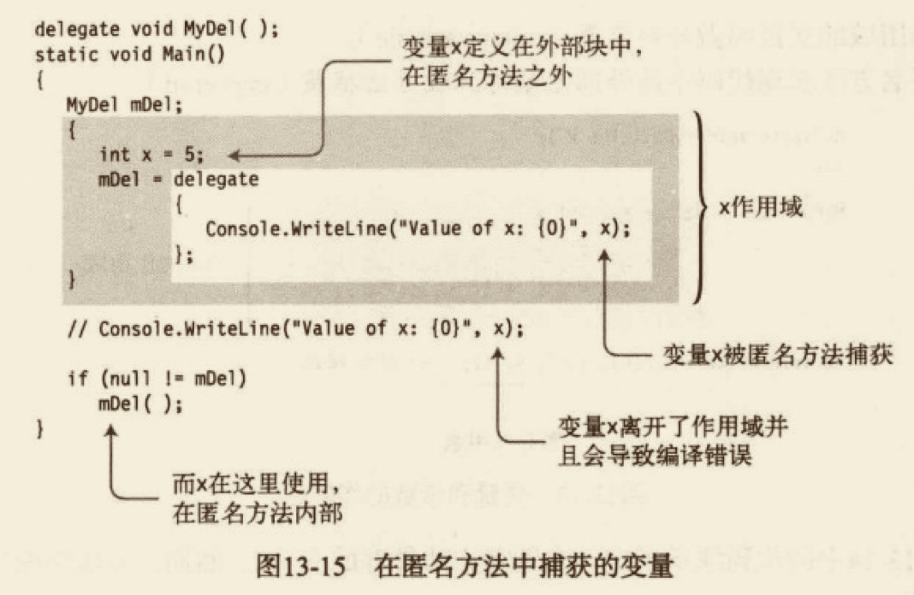

#### Lambda 表达式 

我们刚刚已经看到了，C# 2.0 引入了匿名方法。然而它的语法有一点麻烦，而且需要一些编译器已经知道的信息。C# 3.0 引入了 Lambda 表达式，简化了匿名方法的语法，从而避免包含这些多余的信息。

在匿名方法的语法中，delegate 关键字是有点多余，因为编译器已经知道我们在将方法赋值给委托。我们可以很容易通过以下步骤把匿名方法转换为 Lambda 表达式。
- 删除 delegate 关键字。
- 在参数列表和匿名方法主体之间方 Lambda 运算符`=>`。Lambda 运算符读作“goes to”。


编辑器还可以从委托的声明中知道委托参数的类型，因此 Lambda 表达式允许我们省略类型参数，如 le2 的赋值代码所示。
- 带有参数类型的参数列表称为显式类型。
- 省略类型的参数列表称为隐式类型。
- 如果只有一个隐式参数，我们可以省略周围的圆括号，如 le3 的赋值代码所示。
- 最后，Lambda 表达式允许表达式的主体是语句块或表达式。如果语句块包含了一个返回语句，我们可以将语句替换为 `return` 关键字后的表达式，如 le4 的赋值代码表达式。

```cs
// 委托——匿名方法和 Lambda 表达式
using System;
namespace classdemo.Delegate
{
  // 定义一个有返回值和参数的委托类型
  delegate double MyDel4(int par); // 1.声明带有返回值的委托类型
  class Progarm5
  {
    public static void main()
    {
      MyDel4 del = delegate (int x) { return x + 1; }; // 匿名方法
      MyDel4 le1 = (int x) => { return x + 1; }; // Lambda 表达式
      MyDel4 le2 = (x) => { return x + 1; };
      MyDel4 le3 = x => { return x + 1; };
      MyDel4 le4 = x => x + 1;
      // 执行委托 
      if (null != del)
      {
        Console.WriteLine("Value: {0}", del(12));
        Console.WriteLine("Value: {0}", le1(12));
        Console.WriteLine("Value: {0}", le2(12));
        Console.WriteLine("Value: {0}", le3(12));
        Console.WriteLine("Value: {0}", le4(12));
      }
      else
      {
        Console.WriteLine("Delegate is empty.");
      }
    }

  }
}

```

- 表达式的参数列表的参数不一定需要包含类型（隐式类型），除非委托有 `ref` 或 `out` 参数。——此时必须注明类型（显式类型）。
- 如果只有一个参数，并且是隐式类型的，周围的圆括号可以被省略，否则必须有括号。
- 如果没有参数，必须使用一组空的圆括号。 

### 事件

#### 发布者和订阅者

很多程序都有一个共同的需求，即当一个特定的程序事件发生时，程序的其他部分可以得到该事件已经发生的通知。

`发布者/订阅者模式（publisher/subscriber pattern）`可以满足这种需求。在这种模式中，`发布者`类定义了一系列程序的其他部分可能感兴趣的事件。其它类可以`”注册“`，以便在这些事件发生时发布者可以通知它们。这些`订阅者`类通过向发布者提供一个方法来“注册”以获取通知。当事件发生时，发布者`“触发事件”`，然后执行订阅者提交的所有事件。

由订阅者提供的方法称为`回调方法`，因为发布者通过执行这些方法来“往回调用订阅者的方法”。还可以将它们称为事件处理程序，因为它们是为处理事件而调用的代码。


下面是一些有关事件的重要事项：
- **发布者（publisher）**发布某个事件的类或结构，其他类可以在该事件发生时得到通知。
- **订阅者（subscriber）**注册并在事件发生时得到通知的类或结构。
- **事件处理程序（event handler）**由订阅者注册到事件的方法，在发布者触发事件时执行。
- **触发（raise）事件、调用（invoke）或触发（fire）事件的术语** 当事件触发时，所有注册到它的方法都会被依次调用。

前面一章介绍了委托。事件的很多部分都与委托类似。实际上，事件就像是专门用于某种特殊用途的简单委托。委托和事件的行为之所以相似，是有充分理由的。事件包含了一个私有的委托。


有关事件的私有委托需要了解的重要事项如下：
- 事件提供了对它的私有控制委托的结构化访问。也就是说你无法直接访问委托。
- 事件中可用的操作比委托要少，对于事件我们只可以添加、删除或调用事件处理程序。
- 事件被触发时，它调用委托来依次调用调用列表中的方法。


 
#### 源代码组件概览

需要在事件中使用的代码有5部分。
- **委托类型声明** 事件和事件处理程序必须有共同的签名和返回类型，它们通过委托类型进行描述。
- **事件处理程序声明** 订阅者类会在事件触发时执行的方法声明。它们不一定是有显式命名的方法，还可以是匿名方法或 Lambda 表达式。
- **事件声明** 发布类必须声明一个订阅者可以注册的事件成员。当声明的事件为 `public` 时，称为发布了事件。
- **事件注册** 订阅者必须订阅事件才能在它被触发时得到通知。
- **触发事件的代码** 发布者类中“触发”事件并导致调用注册的所有事件处理程序的代码。


#### 声明事件

发布者类必须提供事件对象。创建事件比较简单——只需要委托类型和名字。事件声明的语法如下代码所示，代码中声明了一个叫做 CountedADozen 的事件。注意如下有关 CountedADozen 事件的内容。
- 事件声明在一个类中。
- 它需要委托类型的名称，任何附加到事件（如注册）的处理程序都必须与委托类型的签名和返回类型相匹配。
- 它声明为 `public`，这样其他类和结构可以在它上面注册事件处理程序。
- 不能使用对象创建表达式（new 表达式）来创建它的对象。

##### 事件是成员

一个常见的误解是把事件认为是类型，然而它不是。和方法、属性一样，事件是类或结构的成员，这一点引出了几个重要的特性。
- 由于事件是成员：
  - 我们不能在一段可执行代码中声明事件；
  - 它必须声明在类或结构中，和其他成员一样。
- 事件成员被隐式自动初始化 null。
事件声明需要委托类型的名字，我们可以声明一个委托类型或者使用已存在的。如果我们声明一个委托类型，它必须指定事件保存的方法的签名和返回类型。

BCL 声明了一个叫做 `EventHandler` 的委托，专门用于系统事件。

#### 订阅事件

订阅者向事件添加事件处理程序。对于一个要添加到事件的事件处理程序来说，它必须具有与事件的委托相同的返回类型和签名。
- 使用 `+=` 运算符来为事件增加事件处理程序，如下面代码所示。事件处理程序位于该运算符的右边。
- 事件处理程序的规范可以是以下任意一种：
  - 实例方法的名称；
  - 静态方法的名称；
  - 匿名方法；
  - Lambda 表达式。

```cs
incrementer.CountedADozen += IncrementDozensCount; // 实例方法
incrementer.CountedADozen += Class.CounterHandleB; // 静态方法
...
```

#### 触发事件

事件成员本身只是保存了需要被调用的事件处理程序。如果事件没有被触发，什么都不会发生。我们需要确保在合适的时候有代码来做这事情。

- 在触发事件之前和`null` 进行比较，从而查看是否包含事件处理程序，如果事件是 `null`，则表示没有，不能执行。
- 触发事件的语法和调用方法一样：
  - 使用事件名称，后面跟的参数列表包含在圆括号中；
  - 参数列表必须与事件的委托类型相匹配。

```cs
using System;
namespace classdemo.Event
{
  delegate void Handler(); // 1. 声明委托
  // 发布者
  class Incrementer
  {
    public event Handler CountedADozen; // 2. 创建事件并发布
    public void DoCount()
    {
      for (int i = 1; i < 100; i++)
      {
        if (i % 12 == 0 && CountedADozen != null)
        {
          CountedADozen(); // 5. 每增加12个计数触发事件一次
        }
      }
    }
  }
  // 订阅者
  class Dozens
  {
    public int DozensCount
    {
      get;
      private set;
    }
    // 构造函数
    public Dozens(Incrementer incrementer)
    {
      DozensCount = 0;
      incrementer.CountedADozen += IncrementDozensCount; // 3. 订阅事件
    }
    // 4. 声明事件处理程序
    void IncrementDozensCount() 
    {
      DozensCount++;
    }
  }
  class Program
  {
    public static void main()
    {
      Incrementer incrementer = new Incrementer();
      Dozens dozensCounter = new Dozens(incrementer); // 注册事件
      incrementer.DoCount(); // 触发事件
      Console.WriteLine("Number of dozens = {0}", dozensCounter.DozensCount); // 8
    }
  }
}

```

#### 标准事件的用法

GUI 编程是事件驱动，也就是说在程序运行时，它可以在任何时候被事件打断，比如点击按钮、按下按键或系统定时器。在这些情况发生时，程序需要处理事件然后继续其他事情。

显然，程序事件的异步处理是使用 C# 事件的绝佳场景。Window GUI 编程如此广泛地使用了事件，对于事件的使用，.NET 框架提供了一个标准模式。事件使用的标准模式的根本就是 `System` 命名空间的 `EventHandler` 委托类型。`EventHandler` 委托类型的声明如下代码所示。关于声明需要注意以下几点：
- 第一个参数用于保存触发事件的对象的引用。由于是 `object` 类型的，所以可以匹配任何类型的实例；
- 第二个参数用来保存状态信息，指明什么类型适用于该应用程序。
- 返回类型是 `void`。

```cs
public delegate void EventHandler(object sender, EventArg e);
```

`EventHandler` 第二个参数是 `EventArgs` 类的对象，它声明在 System 命名空间中。你可能会想，既然第二个参数用于传递数据，`EventArgs` 类的对象应该可以保存一些类型的数据，你可能错了。
- `EventArgs` 设计为不能传递任何数据。它用于不需要传递数据的事件处理程序——通常会被忽略。
- 如果你希望传递数据，必须声明一个派生自 `EventArgs` 的类，使用合适的字段来保存需要传递的数据。

尽管`EventArgs` 类实际上并不传递数据，但它是使用 `EventHandler` 委托模式的重要部分。不管参数使用的实际类型是什么，object 类和 EventArgs 总是基类。这样 EventHandler 就能提供一个对所有事件和事件处理器都通用的签名，只允许两个参数，而不是各自都有不同签名。

```cs
using System;
namespace classdemo.Event
{
  // 发布者
  class Incrementer2
  {
    // 使用系统定义的 EventHandler 委托
    public event EventHandler CountedADozen; // 创建事件并发布
    public void DoCount()
    {
      for (int i = 1; i < 100; i++)
      {
        if (i % 12 == 0 && CountedADozen != null)
        {
          // 触发事件时使用 EventHandler 的参数
          CountedADozen(this, null); // 每增加12个计数触发事件一次
        }
      }
    }
  }
  // 订阅者
  class Dozens2
  {
    public int DozensCount
    {
      get;
      private set;
    }
    // 构造函数
    public Dozens2(Incrementer2 incrementer)
    {
      DozensCount = 0;
      incrementer.CountedADozen += IncrementDozensCount;
    }
    // 声明事件处理程序
    void IncrementDozensCount(object source, EventArgs e) // 事件处理程序的签名必须与委托的签名匹配
    {
      DozensCount++;
    }
  }
  class Program2
  {
    public static void main()
    {
      Incrementer2 incrementer = new Incrementer2();
      Dozens2 dozensCounter = new Dozens2(incrementer); // 注册事件
      incrementer.DoCount(); // 触发事件
      Console.WriteLine("Number of dozens = {0}", dozensCounter.DozensCount); // 8
    }
  }
}

```

##### 通过扩展 EventArgs 来传递数据

待泛型篇章后补充。

##### 移除事件处理程序

在用完了事件处理程序之后，可以从事件中把它移除。可以利用 `-=` 运算符把事件处理程序从事件中移除，如下所示：
```cs
p.SimpleEvent -= s.MethodB;
```

#### 事件访问器

之前提过，`+=` 和 `-=` 运算符是事件允许的唯一运算符。看到这里我们应该知道，这些运算符有预定义的行为。

然而，我们可以修改这些运算符的行为，并且使用它们时可以让事件执行任何我们希望的自定义代码。

要改变这两个运算符的操作，可以为事件定义事件访问器。
- 有两个访问其：add 和 remove。
- 声明事件的访问器看上去和声明一个属性差不多。

下面的示例演示了具有访问器的事件声明。两个访问器都有叫做`value` 的隐式值参数，它接受实例或静态方法的引用。
```cs
public event EventHandler CountedADozen {
  add{} // 执行 += 运算符的代码
  remove {} // 执行 -= 运算符的代码
}
```

声明了事件访问器之后，事件不包含任何内嵌委托对象。我们必须实现自己的机制来存储和移除事件注册的方法。

事件访问器表现为 void 方法，也就是不能使用包含返回值的 return 语句。

### 接口

#### 什么是接口

接口是指定一组函数成员而不实现它们的引用类型。所以只能类和结构来实现接口。这种描述听起来有点抽象，因此我们先来看看接口能够帮助我们解决的问题，以及是如何解决的。

以下面的代码为例。观察 Program 类的 Main 方法，它创建并初始化了一个 CA 类的对象，并将该对象传递给 PrintInfo 方法。PrintInfo 需要一个 CA 类型的对象，并打印包含在对象中的信息。

```cs
class CA {
  public string Name;
  public int Age;
}

class CB {
  public string First;
  public string Last;
  public double PersonAge;
}

class Program {
  static void PrintInfo(CA item) {
    Console.WriteLine("Name: {0}, Age {1}", item.Name, item.Age);
  }
  static void Main() {
    CA a = new CA(){ Name = "Jecyu Lin", Age = 25 };
    PrintInfo(a);
  }
}
```

只要传入的是 CA 类型的对象，PrintInfo 就能正常工作。但如果传入的是CB类（同样是见上面的代码），就不行了。<u>假设 PrintInfo 方法中的算法非常有用，我们能用它操作不同类的对象。</u>

现在的代码不能满足上面的需求，原因有很多。<u>首先，PrintInfo 的形参指明了实参必须为 CA 类型的对象，因此传入 CB 或其他类型的对象将会导致编译错误。</u>但即使我们能绕开这一点使其接受 CB 类型的对象还是会有问题，因为 CB 的结构与 CA 的不同。字段的名称和类型与 CA 不一样，PrintInfo 对这些字段一无所知。

<u>我们能不能创建一个能够成功传入 PrintInfo 的类，并且不管该类是什么样的结构，PirntInfo 都能正常处理呢？接口使这种设想变为可能。</u>

如下代码所示。
- 首先，它声明了一个 IInfo 接口，包含两个方法——GetName 和 GetAge，每个方法都返回 string。
- 类 CA 和类 CB 各自实现了 IInfo 接口（将其放到基类列表中），并实现了该接口所需的两个方法。
- Main 创建了 CA 和 CB 的实例，并传入 PrintInfo。
- 由于类实例实现了接口，PrintInfo 可以调用那两个方法，每个类实例执行各自的方法，就好像执行自己类声明的方法。

```cs
// 用接口使 PrintInfo 方法能够用于多个类
using System;
namespace classdemo.JecyuInterface
{
  interface IInfo // 1. 声明接口
  {
    string GetName();
    string GetAge();
  }
  class CA : IInfo // 2. 声明实现了接口的 CA 类
  {
    public string Name;
    public int Age;
    public string GetName()
    {
      return Name;
    }
    public string GetAge()
    {
      return Age.ToString();
    }
  }
  class CB : IInfo // 3. 在 CB 类中实现两个接口方法
  {
    public string First;
    public string Last;
    public double PersonsAge;
    public string GetName()
    {
      return First + " " + Last;
    }
    public string GetAge()
    {
      return PersonsAge.ToString();
    }
  }
  class Program
  {
    static void PrintInfo(IInfo item) // 4. 传入接口的引用 
    {
      Console.WriteLine("Name: {0}, Age {1}", item.GetName(), item.GetAge());
    }
    public static void main()
    {
      CA a = new CA() { Name = "Jecyu Lin", Age = 25 };
      CB b = new CB() { First = "Jecyu", Last = "Lin", PersonsAge = 25 };
      // 5. 对象的引用能自动转换为它们实现的接口的引用
      PrintInfo(a);
      PrintInfo(b);
    }
  }
}

```

##### 使用 IComarable 接口的示例

我们已经了解了接口能够解决的问题，接下来看第二个示例并深入一些细节。我们先来看看如下代码，它接受了一个没有排序的整数数组并且按升序进行排序。这段代码的功能如下：

- 第一行代码创建了包含了5个无序整数的数组；
- 第二行代码使用了 Array 类的静态 Sort 方法来排序元素；
- 用 foreach 循环输出它们，显示以升序排序的数字。

```cs
int[] myInt = new int[] {20, 4, 16, 9, 2}; // 创建 int
Array.Sort(myInt); // 按大小排序
foreach(int i in myInt) {
  Console.WriteLine("{0}", i); // 输出它们
} 

// 输出
// 2 4 9 16 20 
```

Sort 方法在 int 数组上工作得很好，但是如果我们尝试在自己的类上使用会发生什么呢？如下所示：
```cs
class MyClass {  // 声明一个简单类
  public int TheValue;
}
...
MyClass[] mc  = new MyClass[5]; // 声明一个有5个元素的数组
... // 创建并初始化元素
Array.Sort(mc); // 尝试使用 Sort 排序抛出异常
```

如果你尝试运行这段代码的话，不会得到排序而是会得到一个异常。<u>Sort 并不能针对 MyClass 对象数组进行排序的原因是它不知道如何比较用于自定义的对象以及如何进行排序。Array 类的 Sort 方法其实依赖于一个叫做 `IComparable` 的接口，它声明在 BCL中，包含唯一的方法 CompareTo。</u>

下面的代码展示了 IComparable 接口的声明。<u>注意，接口主体包含 CompareTo 方法的声明，指定了它接受一个 object 类型的参数。尽管方法具有名称、参数和返回类型，但却没有实现。</u>它的实现用一个分号表示。
```cs
public interface IComparable {
  int CompareTo(object obj);
}
```

尽管在接口声明中没有为 CompareTo 方法提供实现，但 IComparable 接口的 .NET 文档中描述了该方法应该做的事情，可以在创建实现接口的类或结构时参考。文档中写道，在调用 CompareTo 方法时，它应该返回以下几个值之一：
- 负数值 当前对象小于参数对象
- 正数值 当前对象大于参数对象
- 零 两个对象在比较时相等

Sort 使用的算法依赖于元素的 CompareTo 方法来决定两个元素的次序。int 类型实现了 IComparable，但是 MyClass 没有，因此当 Sort 尝试调用 MyClass 不存在的 CompareTo 方法时会抛出异常。

我们可以通过让类实现 IComparable 来使 Sort 方法可以用于 MyClass 类型的对象。要实现一个接口，类或结构必须做两件事情：
- 必须在基类列表后面列出接口名称；
- 必须为接口的每一个成员提供实现。

如下代码所示
```cs
  class MyClass : IComparable // 类实现引用
  {
    public int TheValue;
    public int CompareTo(object obj)
    {
      MyClass mc = (MyClass)obj; // 参数类
      if (this.TheValue < mc.TheValue) // this 当前的实例类，mc 为传进来的类
      {
        return -1;
      }
      if (this.TheValue > mc.TheValue)
      {
        return 1;
      }
      return 0;
    }
  }
```

下面显示了更新后的完整代码
```cs
// 用接口使 PrintInfo 方法能够用于多个类
using System;
namespace classdemo.JecyuInterface
{
  class MyClass : IComparable // 类实现引用
  {
    public int TheValue;
    public int CompareTo(object obj)
    {
      MyClass mc = (MyClass)obj; // 参数类
      if (this.TheValue < mc.TheValue) // this 当前的实例类，mc 为传进来的类
      {
        return -1;
      }
      if (this.TheValue > mc.TheValue)
      {
        return 1;
      }
      return 0;
    }
  }
  class Program2
  {
    static void PrintOut(string s, MyClass[] mc)
    {
      Console.Write(s);
      foreach (var m in mc)
      {
        Console.WriteLine("{0}", m.TheValue);
      }
      Console.WriteLine("");
    }
    public static void main()
    {
      var myInt = new[] { 20, 4, 16, 9, 2 };
      MyClass[] mcArr = new MyClass[5]; // 创建 MyClass 对象的数组
      for (int i = 0; i < 5; i++)
      {
        mcArr[i] = new MyClass();
        mcArr[i].TheValue = myInt[i];
      }

      PrintOut("Initial Order: ", mcArr); // 输出初始数组
      Array.Sort(mcArr);
      PrintOut("Sorted order: ", mcArr); // 输出排序后的数组
    }
  }
}

```

#### 声明接口

上一节使用的是 BCL 中已经声明的接口。在这部分内容中，我们将来看看如何声明接口。关于声明接口，需要知道的重要事项如下：
- 接口声明不能包含以下成员
  - 数据成员。
  - 静态成员。
- 接口声明只能包含以下类型的非静态成员函数的声明：
  - 方法；
  - 属性；
  - 事件；
  - 索引器。
- <u>这些函数成员的声明不能包含任何实现代码，而在每一个成员声明的主体后必须使用分号。</u>
- <u>按照惯例，接口名称必须从大写的 I 开始（比如 ISaveable）</u>
- <u>与类和结构一样，接口声明还可以分隔成分部接口声明。</u>

例如，下面的代码演示了具有两个方法成员接口的声明：
```cs
interface IMyInterface1 {
  int DoStuff(int nVar1, long lVar2);
  double DoOtherStuff(string s, long x);
}
```

接口的访问性和接口成员的访问性之间有一些重要区别。
- 接口声明可以有任何的访问修饰符 public、protected、internal 或 private。
- <u>然而，接口的成员是隐式 public的，不允许有任何访问修饰符，包括 public。</u>

```cs
public interface IMyInterface2 { // 接口允许访问修饰符
  private int Method1(int nVal1, long lVar2) { // 错误，接口成员不允许访问修饰符
  }
}
```

#### 实现接口

只有类和结构才能实现接口。如 Sort 示例所示，要实现接口，类和结构必须：
- 在基类列表中包括接口名称；
- 为每一个接口的成员提供实现。

```cs
class MyClass : IMyInterface1 {
  int DoStuff(int nVar1, long lVar2) {
    ...
  }
  double DoOtherStuff(string s, long x) {
    ...
  }
}
```

关于实现接口，需要了解的重要事项如下：
- 如果类实现了接口，它必须实现接口的所有成员。
- <u>如果类从基类继承并实现了接口，基类列表中的基类名称必须放在所有接口之前，如下所示（注意，只能有一个基类，所以列出的其他类型必须为接口名。）</u>

```cs
class Derived: MyBaseClass, IIfc1, IEnumerable, IComparable {
  ...
}
```

#### 接口是引用类型

接口不仅仅是类或结构要实现的成员列表。它是一个引用类型。

我们不能直接通过类对象的成员访问接口。<u>然而，我们可以通过把类对象引用强制转换为接口类型来获取指向接口的引用。一旦有了接口的引用，我们就可以使用点号来调用接口的方法。</u>

例如，如下代码给出了一个从类对象引用获取接口引用的示例。
- 在第一个语句中，mc 变量是一个实现了 IIfc1 接口的类对象的引用。语句将该引用强制转换为指向接口的引用，并把它赋值给变量 ifc。
- 在第二个语句中，使用指向接口的引用来调用方法。

```cs
IIfc1 ifc = (IIfc1)mc; // 将类对象的引用转换为接口类型的引用
ifc.PrintOut("interface"); // 调用引用方法
```

完整代码如下：
```cs
// 接口是引用类型
using System;
namespace classdemo.JecyuInterface
{
  interface IIfc1
  {
    void PrintOut(string s);
  }
  class MyClass2 : IIfc1 // 类实现引用
  {
    public void PrintOut(string s)
    {
      Console.WriteLine("Calling through: {0}", s);
    }

  }
  class Program3
  {

    public static void main()
    {
      MyClass2 mc = new MyClass2(); // 创建类对象
      mc.PrintOut("object"); // 调用类对象的实现方法

      IIfc1 ifc = (IIfc1)mc; // 将类对象的引用转换为接口类型的引用
      ifc.PrintOut("interface"); // 调用引用方法

    }
  }
}

```

#### 接口和 as 运算符

在上一节中，我们已经知道了<u>可以使用强制转换运算符来获取对象接口的引用，另一个更好的方式是使用 `as` 运算符。</u>

如果我们尝试将类对象引用强制转换类未实现的接口的引用，强制转换操作会抛出一个异常。我们可以通过使用 as 运算符来避免这个问题。具体方法如下所示：
- 如果类实现了接口，表达式返回指向接口的引用；
- 如果类没有实现接口，表达式返回 null 而不是抛出异常。

```cs
//IIfc1 ifc = (IIfc1)mc; // 将类对象的引用转换为接口类型的引用
  IIfc1 ifc = mc as IIfc1; // 使用 as 运算符
  if (ifc != null)
  {
    ifc.PrintOut("interface"); // 调用引用方法
  }
```

#### 实现多个接口

到目前为止，类只实现了单个引用。
- 类或结构可以实现任意数量的接口。
- 所有实现的接口必须列在基类列表中并以逗号分隔。（如果有基类名称，则在其之后）。

```cs
// 实现多个接口
using System;
namespace classdemo.JecyuInterface
{
  interface IDataRetrieve
  {
    int GetData();
  }
  interface IDataStore
  {
    void SetData(int x);
  }
  class MyData : IDataRetrieve, IDataStore
  { // 声明类
    int Mem1;
    public int GetData()
    {
      return Mem1;
    }
    public void SetData(int x)
    {
      Mem1 = x;
    }
  }
  class Program4
  {
    public static void main()
    {
      MyData data = new MyData();
      data.SetData(5);
      Console.WriteLine("Value = {0}", data.GetData());
    }
  }
}

```

#### 实现具有重复成员的接口

由于类可以实现任意数量的接口，有可能两个或多个接口都有相同的签名和返回类型。编译器如何处理这样的情况呢？

例如，假设我们有两个接口 IIfc1 和 IIfc2，如下所示。每一个接口都有一个名称为 PrintOut 的方法，具有相同的签名和返回类型。如果我们要创建实现两个接口的类，怎么样处理重复接口的方法呢？

```cs
interface IIfc1 {
  void PrintOut(string s);
}
interface IIfc2 {
  void PrintOut(string s);
}
```

答案是：如果一个类实现了多个接口，并且其中一些接口有相同签名和返回类型的成员，那么类可以实现单个成员来满足所有包含重复成员的接口。

```cs
interface IIfc1 {
  void PrintOut(string s);
}
interface IIfc2 {
  void PrintOut(string s);
}
class MyClass: IIfc1, IIfc2 {
  public void PrintOut(string s) {
    Console.WriteLine("Calling through: {0}", s);
  }
}
```

#### 多个接口的引用

我们已经在之前的内容知道了接口是引用类型，并且可以通过将对象引用强制转换为接口类型的引用。如果类实现了多个接口，我们可以获取每一个接口的独立引用。

例如，下面的类实现了两个具有单个 PrintOut 方法的接口。Main 中的代码以3种方式调用了 PrintOut。
- 通过类对象。
- 通过指向 IIfc1 接口的引用。
- 通过指向 IIfc2 接口的引用。

```cs
interface IIfc1 {
  void PrintOut(string s);
}
interface IIfc2 {
  void PrintOut(string s);
}
class MyClass: IIfc1, IIfc2 {
  public void PrintOut(string s) {
    Console.WriteLine("Calling through: {0}", s);
  }
}

class Progarm {
  public static void Main() {
    MyClass mc = new MyClass();
    IIfc1 ifc1 = (IIfc1) mc;
    IIfc2 ifc2 = (IIfc2) mc;
    mc.PrintOut("object");
    ifc1.PrintOut("object");
    ifc2.PrintOut("object");
  }
}
```

#### 派生成员作为实现

<u>实现接口的类可以从它的基类继承实现的代码。</u>例如，如下的代码演示了类从它的基类代码继承了实现。
- IIfc1 是一个具有 PrintOut 方法成员的接口；
- MyBaseClass 包含了一个叫做 PrintOut 的方法，它和 IIfc3 的方法相匹配。
- Derived 类有一个空的声明主体，但它派生自 MyBaseClass，并在基类列表中包含了 IIfc3。
- 即使 Derived 的声明主体是空的，基类中的代码还是能满足实现接口方法的需求。

```cs
// 派生成员作为实现
using System;
namespace classdemo.JecyuInterface
{
  interface IIfc3
  {
    void PrintOut(string s);
  }
  class MyBaseClass
  {
    public void PrintOut(string s)
    {
      Console.WriteLine("Calling through: {0}", s);
    }
  }
  class Derived : MyBaseClass, IIfc3
  {

  }
  class Program5
  {
    public static void main()
    {
      Derived d = new Derived(); // 创建类对象
      d.PrintOut("object."); // 调用方法
    }
  }
}


```

#### 显式接口成员实现

在上一节中，我们已经看到单个类可以实现多个接口需要的成员。

但是，如果我们希望为每一个接口分离实现该怎么做呢？在这种情况下，我们可以创建显式接口成员实现。显式接口成员实现有如下特性：
- 与所有接口实现类似，位于实现了接口的类或结构中；
- <u>它使用限定接口名称来声明，由接口名称和成员名称以及它们中间的点分隔符号构成。</u>

```cs
// 显式接口成员实现
using System;
namespace classdemo.JecyuInterface
{
  interface IIfc4
  {
    void PrintOut(string s);
  }
  interface IIfc5
  {
    void PrintOut(string s);
  }
  class MyClass6 : IIfc4, IIfc5
  {
    void IIfc4.PrintOut(string s) // 显式接口成员实现
    {
      Console.WriteLine("IIfc4: {0}", s);
    }
    void IIfc5.PrintOut(string s) // 显式接口成员实现
    {
      Console.WriteLine("IIfc5: {0}", s);
    }
  }
  class Program6
  {
    public static void main()
    {
      MyClass6 mc = new MyClass6(); // 创建类对象

      IIfc4 ifc4 = (IIfc4)mc;
      IIfc5 ifc5 = (IIfc5)mc;
      ifc4.PrintOut("interface 1");
      ifc5.PrintOut("interface 2");
    }
  }
}


```

#### 接口可以继承接口

之前我们已经知道接口实现可以从基类被继承，而接口本身也可以从一个或多个接口继承。
- 要指定某个接口继承其他接口，应在接口声明中把基类以逗号分隔的列表形式放在接口名称的冒号之后，如下所示：

```cs
// 接口可以继承接口
using System;
namespace classdemo.JecyuInterface
{
  interface IDataRetrieve2
  {
    int GetData();
  }
  interface IDataStore2
  {
    void SetData(int x);
  }
  // 从前两个接口继承
  interface IDataIO : IDataRetrieve2, IDataStore2
  {

  }
  class MyClass7 : IDataIO
  {
    int nPrivateData;
    public int GetData()
    {
      return nPrivateData;
    }
    public void SetData(int x)
    {
      nPrivateData = x;
    }
  }
  class Program7
  {
    public static void main()
    {
      MyClass7 mc = new MyClass7(); // 创建类对象

      mc.SetData(5);
      Console.WriteLine("{0}", mc.GetData());
    }
  }
}


```

与类不同，它在基类列表中只能有一个类名，而接口可以在基接口列表中有多个接口。
- 列表中的接口本身可以继承其他接口。
- 结果接口包含它声明的所有接口和所有接口的成员。

#### 不同类实现同一个接口的示例

如下代码演示了已经介绍过的接口的一些方面。程序声明了一个名称为 Animal 的类，它被作为其他一些类的基类来表示各种类型的动物。它还声明了一个叫做 ILiveBirth 的接口。

Cat、Dog 和 Bird 都从 Animal 基类继承。Cat 和 Dog 都实现了 ILiveBirth 接口，而 Bird 类没有。

在 Main 中，程序创建了 Animal 对象的数组并对3个动物类的对象进行填充。最后，程序遍历数组并使用 as 运算符获取指向 ILiveBirth 接口的引用，并调用了 BabyCalled 方法。

```cs

using System;
namespace classdemo.JecyuInterface
{
  interface ILiveBirth
  {
    string BabyCalled();
  }
  class Animal { } // 基类
  class Cat : Animal, ILiveBirth // 声明 Cat 类
  {
    string ILiveBirth.BabyCalled()
    {
      return "Kitten";
    }
  }
  class Dog : Animal, ILiveBirth // 声明 Dog 类
  {
    string ILiveBirth.BabyCalled()
    {
      return "puppy";
    }
  }
  class Bird : Animal // 声明 Bird 类
  {

  }

  class Program8
  {
    public static void main()
    {
      Animal[] animals = new Animal[3];
      animals[0] = new Cat();
      animals[1] = new Dog();
      animals[2] = new Bird();
      foreach (Animal a in animals)
      {
        ILiveBirth b = a as ILiveBirth;
        if (b != null)
        {
          Console.WriteLine("Baby is called: {0}", b.BabyCalled());
        }
      }
    }
  }
}

```

### 转换

#### 什么是转换

要理解什么是转换，让我们先从声明两个不同类型的变量，然后把一个变量（源）的值赋值给另外一个变量（目标）的简单示例开始讲起。<u>在赋值之前，源的值必须转换成目标类型的值。</u>


- <u>转换（conversion）是接受一个类型的值并使用它作为另一个类型的等价值的过程。</u>
- <u>转换后的值应和源值一样的，但其类型为目标类型。</u>

例如，图16-2中的代码给出了两个不同类型的变量的声明。


- var1 是 short 类型的16位有符号整数，初始值为5。var2 是 sbyte 类型的8位有符号整数，初始值为10。
- 第三行代码把 var1 赋值给 var2。由于它们是两种不同的类型，<u>在进行赋值之前，var1 的值必须先转换与 var2 类型相同的值类型。</u>
- 还要注意，<u>var1 的类型和值都没有改变。尽管称之为转换，但只是代表源值作为目标类型来使用，不是源值转换为目标类型。</u>


#### 隐式转换

有些类型的转换不会丢失数据或精度。例如，将8位的值转换为16位是非常容易的，而且不会丢失数据。
- 语言会自动做这些转换，这叫做`隐式转换`。
- 从位数更少的源转换为位数更多的目标类型时，目标中多出来的位需要用0或1填充。
- 当从更小的无符号类型转换为更大的无符号类型时，目标类型多出来的最高位都以0填充，这叫`零扩展（zero extension）`。

对于有符号类型的转换而言，额外的高位用源表达式的符号位进行填充。
- 这样就维持了被转换的值的正确符号和大小。
- 这叫做`符号扩展（sign extension）`


#### 显式转换和强制转换

如果要把短类型转换为长类型，对于长类型来说，保存所有短类型的字符很简单。然而，在其他情况下，目标类型也许无法在不损失数据的情况下提供源值。

例如，假设我们希望把 ushort 的值转化为 byte。
- ushort 可以保存任何 0～65535 之间的值。
- byte 只能保存 0～255 之间的值。
- 只要希望转换的 ushort 值小于256，那么就不会丢失数据。然而，如果更大，最高位的数据会丢失。


很明显，只有当无符号16位 ushort 的值是一个相对小一些的数字（0.4%）时，才能在不损失数据的情况下安全转换为无符号8位 byte 类型。数据中的其他结果会溢出（overflow），产生其他值。

##### 强制转换

对于预定义的类型，C# 会自动将一个数据类型转换为另一个数据类型，但只是针对那些从源类型到目标类型时会丢失值的情况。也是说，<u>对于源类型的任意值在被转换成目标类型时会丢失值的情况，语言是不会提供这两种类型的自动转换的。</u>如果希望对这样的类型进行转换，就必须使用显式转换。这叫做`强制转换表达式`。

如下代码给出了一个强制转换表达式的示例。它把 var1 的值转换为 sbyte 类型。强制转换表达式的构成如下所示：
- 一对圆括号，里面是目标类型。
- 圆括号后是源表达式。

```cs
(sbyte) var1;
```

如果我们强制转换表达式，就意味着要承担执行操作可能引起的丢失数据的后果。它从本质上是在说：“不管是否会发生数据丢失，我知道在做什么，总之进行转换吧。”

```cs
using System;
namespace classdemo.JecyuConversion
{
  public class Program
  {
    public static void main()
    {
      ushort sh = 10;
      byte sb = (byte)sh;
      Console.WriteLine("sb: {0} = Ox{0:X}", sb);

      sh = 1365;
      sb = (byte)sh;
      Console.WriteLine("sb: {0} = 0x{0:X}", sb);
    }
  }
}
// 输出
// sb: 10 = OxA
// sb: 85 = 0x55

```

#### 转换的类型

有很多标准的、预定义的用于数字和引用类型的转换。下图演示了不同的转换类型。


- 除了标准转换，还可以为自定义类型定义隐式转换和显式转换。
- 还有一个预定义的转换类型，叫做装箱，可以将任何值类型转换为：
  - object 类型；
  - System.ValueType 类型。
- 拆箱可以将一个装箱的值转换为原始类型。


#### 数字的转换

任何数字类型都可以转换为其他数字类型。如图所示，一些转换是隐式，而另外一些转换则必须是显式。


##### 隐式数字转换

图16-9 演示了隐式数字转换。
- 如果有路径，从源类型到目标类型可以按照箭头进行隐式转换。
- 任何从源类型到目标类型的箭头方向上没有路径的数字转换都必须是显式转换。

图中所示的，正如我们期望的那样，占据较少位的数字类型可以隐式转换为占据较多位的数字类型。

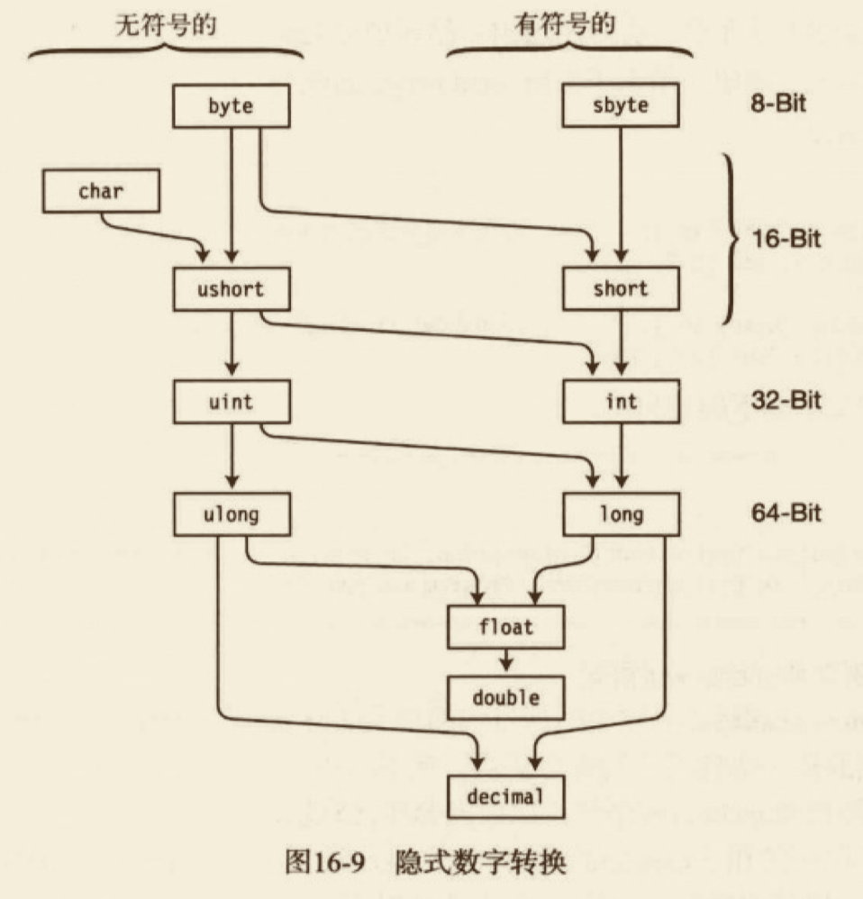

##### 溢出检测上下文

我们已经知道了，显式转换可能会丢失数据并且不能在目标类型中同等地表示源值。<u>对于整数类型，C# 给我们提供了选择运行时是否应该在进行进行类型转换时检测结果溢出的能力。这将通过 `checked` 运算符和`checked` 语句实现。</u>

- 代码片段是否被检查称作溢出检测上下文。
  - 如果我们指定一个表达式或一段代码为 `checked`，CLR 会在转换产生溢出时抛出一个 `OverflowException` 异常。
  - 如果代码不是 `checked`，转换会继续而不管是否产生溢出。
- 默认的溢出检测是不检查的。

1. checked 和 unchecked 运算符
checked 和 unchecked 运算符控制表达式的溢出检测上下文。表达式放置在一对圆括号内并不能是一个方法。语法如下所示：

```cs
checked (表达式)
unchecked (表达式)
```

例如，如下代码执行了相同的转换——第一个在 checked 运算符内，第二个在 unchecked 运算符内。

- 在 unchecked 上下文中，会忽略溢出，结果值是 208。
- 在 checked 上下文中，抛出了 OverflowException 异常。

```cs
using System;
namespace classdemo.JecyuConversion
{
  public class Program2
  {
    public static void main()
    {
      ushort sh = 2000;
      byte sb;

      sb = unchecked((byte)sh);
      Console.WriteLine("sb: {0}", sb);

      sb = checked((byte)sh);
      Console.WriteLine("sb: {0}", sb);
    }
  }
}

```

2. checked 语句和 unchecked 语句
checked 和 unchecked 运算符用于圆括号内的单个表达式。而 checked 和 unchecked 语句执行相同的功能，但控制的是一块代码中的所有转换，而不是单个表达式。
- checked 语句和 unchecked 语句可以被嵌套在任意层次。

```cs
ushort sh = 2000;
byte sb;
unchecked {
  sb = (byte)sh;
  Console.WriteLine("sb: {0}", sb);
  sb = (byte)sh;
  Console.WriteLine("sb: {0}", sb);
}
```

##### 显式数字转换

我们已经知道了，隐式转换之所以能自动从源表达式转换到目标类型是因为不可能丢失数据。<u>然而，对于显式转换而言，就可能丢失数据。因此，作为一个程序员，知道发生数据丢失时转换会如何处理很重要。</u>


1. 整数类型到整数类型

图16-11 显示了从整数到整数的显式转换的行为。在 checked 的情况下，如果转换会丢失数据，操作会抛出一个 OverflowExveption 异常。在 unchecked 的情况下，丢失的位不会发出警告。


2. float 或 double 转到整数类型
   
当把浮点类型转换为整数类型时，值会舍掉小数截断为最接近的整数。如果截断后的值不在目标类型的范围内：
- 如果溢出检测上下文是 checked，则 CLR 会抛出 OverflowException 异常；
- 如果上下文是 unchecked，则 C# 将不定义它的值是什么。

3. decimal 到整数类型

当从 decimal 转换到整数类型时，如果结果值不在目标类型的范围内，则 CLR 会抛出 overflowException。

4. double 到 float 

float 类型的值占32位，而 double 类型的值占64位。double 类型的值被舍入到最接近的 float 类型的值。
- 如果值太小而不能用 float 表示，那么值会被设置为正或负0；
- 如果值太大而不能用 float 表示，那么值会被设置为正无穷大或负无穷大。

5. float 或 double 到 decimal

- 如果值太小而不能用 decimal 类型表示，那么值就会被设置为 0。
- 如果值太大，那么 CLR 就会抛出 overflowException 异常。

6. decimal 到 float 或 double

从 decimal 类型转换到 float 类型总是会成功。然而，可能损失精度。

#### 引用转换

我们已经知道引用类型对象由内存中的两部分组成：引用和数据。
- 由引用保存的那部分信息是它指向的数据类型。
- <u>引用转换接受源引用并返回一个指向堆中同一位置的引用，但是把引用“标记”为其他类型。</u>

##### 隐式引用转换

与语言为我们自动实现的隐式数字转换类似，还有隐式引用转换。如图16-18 所示。
- 所有引用类型可以被隐式转换为 object 类型。
- 任何类型可以隐式转换到它继承的接口。
- 类可以隐式转换到：
  - 它继承链中任何类；
  - 它实现的任何接口。

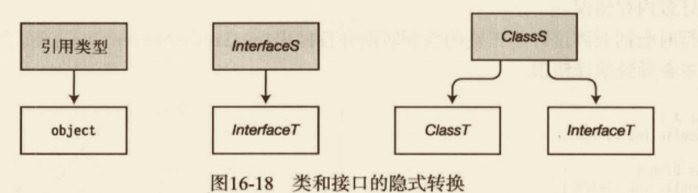

委托可以隐式转换成图16-19所示的 .NET BCL 类和接口。Array 数组，其中的元素是 Ts 类型，可以隐式转换成：
- 图16-19所示的 .NET BCL 类和接口；
- 另一个数组 ArrayT，其中的元素是 Tt 类型（如果满足下面条件）
  - 两个数组具有一样的维度；
  - 元素类型 Ts 和 Tt 都是引用类型，不是值类型。
  - 在类型 Ts 和 Tt 存在隐式转换。

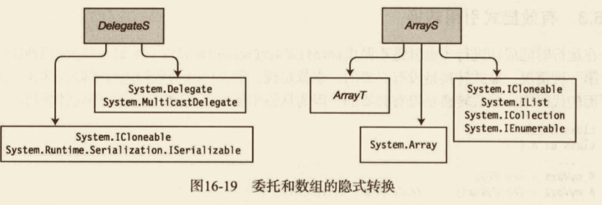

##### 显式引用转换

显式引用转换是从一个普通类型到一个更精确类型的引用转换。
- 显式转换包括：
  - 从 object 到任何引用类型的转换；
  - 从基类到它继承的类的转换。

如果转换的类型不受限制，很可能会导致我们很容易尝试引用在内存中实际不存在的类成员。然而，编译器确实允许这样的转换，到那时，如果系统在运行时遇到它们则会抛出一个异常。

```cs
// 引用转换
using System;
namespace classdemo.JecyuConversion
{
  class A
  {
    public int Field1;
  }
  class B : A
  {
    public int Field2;
  }
  public class Program3
  {
    public static void main()
    {
      A myVal1 = new A();
      B myVal2 = (B)myVal1; // 不存在，在运行时抛出异常
    }
  }
}

```

##### 有效显式转换

在运行时能成功进行有3种情况（也就是不抛出 InvalidCastException 异常）的显式转换有3种情况。
1. 第一种情况：显式转换是没有必要的。也就是说，语言已经为我们进行了隐式转换。例如
```cs
class A {
}
class B: A {}
B myVar1 = new B();
A myVar2 = (A) myVar1; // 不必转换，因为 A 是 B的基类
```

2. 源引用是 null。例如在下面的代码中，即使转换基类的引用到衍生类的引用通常是不安全的，但是由于源引用是 null，这种转换还是允许的。

```cs
class A {}
class B: A {}
...
A myVal1 = null;
B myVar2 = (B)myVal1; // 允许转换，因为 myVar1 为空
```

3. 由源引用指向的实际数据可以被安全地进行隐式转换。

```cs
B myVal1 = new B();
A myVar2 = myVal1; // 将 myVal1 隐式转换为 A 类型
B myVar3 = (B)myVal2;  // 该转换是允许的，因为数据是B类型的
```

#### 装箱转换

包括值类型在内的所有 C# 类型都派生自 object 类型。然而，值类型是高效轻量的类型，因为默认情况下在堆上不包括它们的对象组件。然而，如果需要对象组件，我们可以使用装箱（boxing）。<u>装箱是一种隐式转换，它接受值类型的值，根据这个值在堆上创建一个完整的引用类型对象并返回对象引用。</u>

例如，图16-22演示3行代码。
- 前两行代码声明并初始化了值类型变量i 和引用类型变量oi。
- 在代码的第三行，我们希望把变量 i 的值赋给 oi。<u>但是 oi 是引用类型的变量，我们必须在堆上分配一个对象的引用。然而，变量 i 是值类型，不存在指向堆上某对象的引用。</u>
- 因此，系统将 i 的值装修如下：
  - 在堆上创建了 int 类型的对象；
  - 将 i 的值复制给 int 对象；
  - 返回 int 对象的引用，让 oi 作为引用保存。

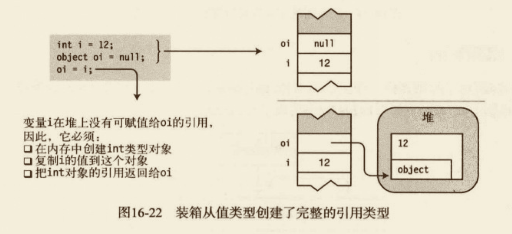

##### 装箱是创建副本

装箱返回的是值的引用类型副本。在装箱产生后，该值有两份副本——原始值类型和引用类型副本，每一个都可以独立操作。

```cs
// 装箱转换——装箱创建副本
using System;
namespace classdemo.JecyuConversion
{
  public class Program4
  {
    public static void main()
    {
      int i = 10; // 创建并初始化值类型
      object oi = i; // 对 i 装箱并把引用赋值给 oi
      Console.WriteLine("i: {0}, oi: {1}", i, oi); // i: 10, oi: 10
    }
  }
}

```

##### 装箱转换

任何值类型 ValueType 都可以被隐式转换为 object 类型、System.ValueType 或 Interface（如果 ValueType 实现了 Interface）

#### 拆箱转换

拆箱（unboxing）是把装箱后的对象转换回值类型的过程。
- 拆箱是显式转换。
- 系统把值拆箱成 ValueType 时执行了如下的步骤：
  - 它检测到要拆箱的对象实际是 ValueType 的装箱值；
  - 它把对象的值复制到变量。

```cs
// 装箱转换——装箱创建副本
using System;
namespace classdemo.JecyuConversion
{
  public class Program4
  {
    public static void main()
    {
      int i = 10; // 创建并初始化值类型
      object oi = i; // 对 i 装箱并把引用赋值给 oi
      Console.WriteLine("i: {0}, oi: {1}", i, oi); // i: 10, oi: 10

      i = 12;
      oi = 15;
      Console.WriteLine("i: {0}, oi: {1}", i, oi); // i: 12, oi: 15
      int j = (int)oi; // 对 oi 拆箱并把值赋值给 j
      Console.WriteLine("i: {0}, oi: {1}, j: {2}", i, oi, j); // i: 12, oi: 15, j: 15
    }
  }
}
```

#### 用户自定义转换

除了标准转换，我们还可以为类和结构定义隐式和显式转换。
用户自定义转换的语法如下代码所示：
- 除了 implicit 和 explicit 关键字之外，隐式和显式转换的声明语法是一样的。
- 需要 public 和 static 修饰符。

```cs
public static implicit operator TargetType(SourceType Identifier) {
  return ObjectOfTargetType;
}
```

示例：
```cs
public static implicit operator int(Person p) // 将 person 转换为 int
{
  return p.Age;
}
```

##### 用户自定义转换的约束

用户自定义转换有一些重要的约束，最重要的如下所示：
- 只可以为类和结构定义用户自定义转换。
- 不能重定义标准隐式转换和显式转换。
- 对于源类型 S 和目标类型 T，如下命题为真：
  - S 和 T 必须是不同类型。
  - S 和 T 不能通过继承关联。
  - S 和 T 都不能是接口类型或者 object 类型。
  - 转换运算符必须是 S 或 T 的成员。
- 对于相同的源和目标类型，我们不能声明隐式转换和显式转换。

##### 用户自定义转换的示例

```cs
// 用户自定义转换的示意
using System;
namespace classdemo.JecyuConversion
{

  class Person
  {
    public string Name;
    public int Age;
    public Person(string name, int age)
    {
      Name = name;
      Age = age;
    }
    public static implicit operator int(Person p) // 将 person 转换为 int
    {
      return p.Age;
    }
    public static implicit operator Person(int i) // 将 int 转换为 person
    {
      return new Person("bill", i);
    }
  }
  class Program5
  {
    public static void main()
    {
      Person jecyu = new Person("Jecyu", 25);
      // 把 Person 对象转换为 int
      int age = jecyu;
      Console.WriteLine("Person Info: {0}, {1}", jecyu.Name, age);

      // 把 int 转换为 Person 对象
      Person bill = 26;
      Console.WriteLine("Person Info: {0}, {1}", bill.Name, bill.Age);
    }
  }
}

```

##### 评估用户自定义转换

到目前为止讨论的用户自定义转换都是在单步内直接把源类型转换为目标类型对象，如图：


但是，用户自定义转换在完整转换中最多可以有3个步骤，它们包括：
- 预备标准转换；
- 用户自定义转换；
- 后续标准转换。

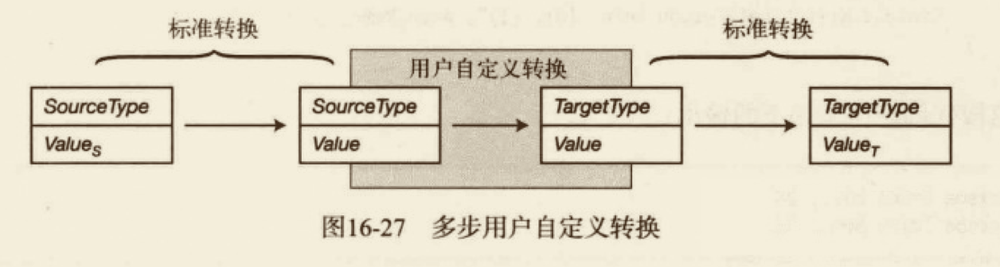


##### 多步用户自定义转换的示例

- 由于 Employee 继承自 Person，从 Employee 到 Person 有标准转换。
- 从 int 到 float 是隐式数字转换，也是标准转换。

```cs
// 多步用户自定义转换的示例
using System;
namespace classdemo.JecyuConversion
{

  class Person2
  {
    public string Name;
    public int Age;
    public static implicit operator int(Person2 p) // 将 person 转换为 int
    {
      return p.Age;
    }
  }
  class Employee : Person2 { }
  class Program6
  {
    public static void main()
    {
      Employee bill = new Employee
      {
        Name = "William",
        Age = 25
      };
      // 把 Employee 类型转换 float 
      float fVar = bill;
      Console.WriteLine("Person Info: {0}, {1}", bill.Name, fVar);
    }
  }
}

```

#### is 运算符

之前说过了，有些转换是不成功的，并且会在运行时抛出一个 InvalidCastException 异常。我们可以使用 is 运算符来检查转换是否会成功完成，从而避免盲目尝试转换。

is 运算符的语法如下，Expr 是源表达式：
```cs
Expr is TargetType
```

```cs
// 多步用户自定义转换的示例
using System;
namespace classdemo.JecyuConversion
{

  class Person3
  {
    public string Name = "Anonymous";
    public int Age = 25;
  }
  class Employee2 : Person3 { }
  class Program7
  {
    public static void main()
    {
      Employee2 bill = new Employee2();
      Person3 p;

      // 检测变量 bill 是否能够转换为 Person 类型
      if ((bill != null) && (bill is Person3))
      {
        p = bill;
        Console.WriteLine("Person Info: {0}, {1}", p.Name, p.Age);
      }
    }
  }
}

```


#### as 运算符

as 运算符和强制转换运算符类似，只是它不抛出异常。如果转换失败，它返回 null 而不是抛出异常。

as 运算符的语法如下：
- Expr 是源表达式；
- TargetType 是目标类型，它必须是引用类型。

```cs
Expr as TargetType
```

```cs
// 多步用户自定义转换的示例
using System;
namespace classdemo.JecyuConversion
{

  class Person3
  {
    public string Name = "Anonymous";
    public int Age = 25;
  }
  class Employee2 : Person3 { }
  class Program7
  {
    public static void main()
    {
      Employee2 bill = new Employee2();
      Person3 p;

      // 检测变量 bill 是否能够转换为 Person 类型
      //if (bill is Person3)
      //{
      //  p = bill;
      //  Console.WriteLine("Person Info: {0}, {1}", p.Name, p.Age);
      //}

      // as 运算符
      p = bill as Person3;
      if (p != null)
      {
        Console.WriteLine("Person Info: {0}, {1}", p.Name, p.Age);
      }
    }
  }
}

```

### 泛型

#### 什么是泛型

使用已经学习的语言结构，我们已经可以建立多种不同类型的强大对象。大部分情况下是声明类，然后封装需要的行为，最后创建这些类的实例。

到现在为止，所有类声明中用到类型都是特定的类型——或许是程序员定义的，或许是语言或 BCL 定义的。然而，很多时候，<u>我们可以把类的行为提取或重构出来，使之不仅能应用到它们编码的数据类型上，而且还能应用到其他类型上的话，类就会更有用</u>。

有了泛型就可以做到这一点了。我们可以重构代码并且额外增加一个抽象层，对于这样的代码来说，数据类型就不用硬编码了。这是专门为多段代码在不同的数据类型上执行相同指令的情况专门设计的。

也许听起来很抽象，让我们看一个示例，这样更清晰：

##### 一个栈的示例

假设我们首先创建了如下的代码，它声明了一个叫做 MyIntStack 的类，该类实现了一个 int 类型的栈。它允许我们把 int 压入栈中，以及把它们弹出。

```cs
class MyIntStack  // int 类型的栈
{
  int StackPointer = 0;
  int[] StackArray; // int 类型数组

  public void Push(int x) {} // 参数类型 int 
  public int Pop() // 返回类型 innt 
}
```

假设现在希望将相同的功能应用于 float 类型的值，可以有一种方式来实现，一种方式是按照下面的步骤产生后续的代码。
- 剪切并粘贴 MyIntStack 类的代码。
- 把类名改为 MyFloatStack。
- 把整个类声明中相应的 int 声明改为 float 声明。

```cs
class MyFloatStack  // int 类型的栈
{
  int StackPointer = 0;
  float[] StackArray; // int 类型数组

  public void Push(float x) {} // 参数类型 int 
  public float Pop() // 返回类型 innt 
}
```

这个方法当然可行，但是很容易出错而且有如下缺点：
- 我们需要仔细检查类的每一个部分来看哪些类型的声明需要修改，哪些类型的声明需要保留。
- 每次需要新类型（long、double、string 等）的栈类时，我们都需要重复这个过程。
- 在这些过程后，我们有了很多几乎相同代码的副本，占据了额外的空间。
- 调试和维护这些相似的实现不但复杂而且容易出错。

#### C# 中的泛型

泛型（generic）特性提供了一种更优雅的方式，可以让多个类型共享一组代码。泛型允许我们声明类型参数化（type-parametertype-parameterized）的代码，可以用不同的类型进行实例化。也就是说，<u>我们可以用“类型占位符”来写代码，然后创建类的实例时指明真实的类型。</u>

读到这里，我们应该很清楚类型不是对象而是对象的模版这个概念了。同样地，<u>泛型类型也不是类型，而是类型的模版。</u>


C# 提供了5种泛型：类、结构、接口、委托和方法。注意，前面4个是类型，而方法是成员。


##### 继续栈的例子

在栈的示例中，MyIntStack 和 MyFloatStack 两个类的主体声明都差不多，只不过在处理由栈保存的类型时有不同。
- 在 MyIntStack 中，这些位置使用 int 类型占据。
- 在 MyFloatStack 中，这些位置被 float 占据 。

通过如下步骤我们可以从 MyIntStack 创建一个泛型类。
1. 在 MyIntStack 类定义中，使用类型占位符 T 而不是 float 来替换 int。
2. 修改类名称为 MyStack。
3. 在类名后放置`<T>`。

结果就是如下的泛型声明。<u>由尖括号和T构成的字符串表明T是类型的占位符。（也不一定是字母 T，它可以是任何标识符。）</u>在类声明的主体中，每一个T都会被编译器替换为实际类型。

```cs
class MyStack<T> {
  int StackPointer = 0;
  T[] StackArray;
  public void Push(T x) {...}
  public T Pop() {...}
}
```

#### 泛型类

既然已经见过泛型类，让我们再来详细了解一下它，并看看如何创建和使用它。

创建和使用常规的、非泛型的类有两个步骤：声明类和创建类的实例。但是泛型类不是实际的类，而是类的模版，所以我们必须先从它们构建实际类实例。


#### 声明泛型类

声明一个简单的泛型类和声明普通类差不多，区别如下。
- 在类名之后放置一组尖括号。
- 在尖括号中用逗号分隔的占位符字符串来表示希望提供的类型。这叫做类型参数（type parameter）。
- 在泛型声明的主体中使用类型参数来表示应该替代的类型。

```cs
class SomeClass<T1, T2>
{
  public T1 SomeVar = new T1();
  public T2 OtherVar = new T2();
}
```
 
#### 创建构造类型

一旦创建了泛型类型，我们就需要告诉编译器能使用哪些真实类型来替代占位符。（类型参数）编译器获取这些真实类型并创建构造类型（用来创建真实类对象的模版）。

创建构造类型的语法如下，包括列出类名并在尖括号中提供真实类型来替代类型参数。要替代类型参数的真实参数叫做类型实参（type argument）。

```cs
SomeClass<int, short>
```

编译器接受了类型实参并且替换泛型类主体中的相应类型参数，产生了构造类型——从它创建真实类型的实例。

#### 创建变量和实例

```cs
using System;
namespace classdemo.JecyuGeneric
{

  class MyStack<T>
  {
    T[] StackArray;
    int StackPointer = 0;

    public void Push(T x)
    {
      if (!IsStackFull)
      {
        StackArray[StackPointer++] = x;
      }
    }
    public T Pop()
    {
      return (!IsStackEmpty)
        ? StackArray[--StackPointer]
        : StackArray[0];
    }

    const int MaxStack = 10;
    // 是否满
    bool IsStackFull
    {
      get
      {
        return StackPointer >= MaxStack;
      }
    }
    // 是否为空
    bool IsStackEmpty
    {
      get
      {
        return StackPointer <= 0;
      }
    }
    public MyStack()
    {
      StackArray = new T[MaxStack];
    }
    public void Print()
    {
      for (int i = StackPointer - 1; i >= 0; i--)
      {
        Console.WriteLine(" Value: {0}", StackArray[i]);
      }
    }

  }
  class Program
  {
    public static void main()
    {
      MyStack<int> StackInt = new MyStack<int>();
      MyStack<string> StackString = new MyStack<string>();

      StackInt.Push(3);
      StackInt.Push(5);
      StackInt.Push(7);
      StackInt.Push(9);
      StackInt.Print();

      StackString.Push("This is fun");
      StackString.Push("Hi there");
      StackString.Print();
    }
  }
}

```

##### 比较泛型和非泛型栈


#### 类型参数的约束

在泛型栈的示例中，栈除了保存和弹出它包含的一些项之外没有做任何事情。它不会尝试添加、比较或做其他任何需要用到项本身的运算符的事情。理由还是很恰当的，由于泛型栈不会知道它们保存的项的类型是什么。理由还是很恰当的，<u>由于泛型栈不会知道它们保存的项的类型是什么，它不会知道这些类型实现的成员。</u>

<u>然而，所有的 C# 对象最终都从 object 类继承，因此，栈可以确认的是，这些保存的项都实现了 object 类的成员。它们包括 ToString、Equals以及 GetType</u>。除了这些，它不知道还有哪些成员可用。

只要我们的代码不妨问它处理的一些类型的对象（或者只要它始终是object 类型的成员），泛型类就可以处理任何类型。符合约束的类型参数叫做未绑定的类型参数（unbounded type parameter）。然而，<u>如果代码尝试使用其他成员，编译器就会产生一个错误信息。</u>

例如，如下代码声明了一个叫做 Simple 的类，它有一个叫做 LessThan 的方法，接受了两个泛型类型的变量。<u>LessThan 尝试用小于运算符返回的结果。但是由于不是所有的类都实现了小于运算符，也就不能用任何类代替T，所以编译器会产生一个错误信息。</u>

```cs
class Simple<T> {
  static public bool LessThan(T i1, T i2) {
    return i1 < i2;
  }
}
```

要让泛型变得更有用，我们需要提供额外的信息让编译器知道参数可以接受哪些类型。这些额外的信息叫做`约束（constrain）`。只有符合约束的类型才能替代给定的类型参数，来产生构造类型。

##### Where 子句

约束使用 `where` 子句列出。
- 每一个有约束的类型参数有自己的 where 子句。
- 如果形参有多个约束，它们在 where 子句中使用逗号分隔。

where 子句的语法如下：
`where TypeParam: constraint, constrain, ...`

有关 where 语句的要点如下：
- 它们在类型参数列表的关闭尖括号之后。
- 它们不使用逗号或其他符号分隔。
- 它们可以以任何次序列出。
- where 是上下文关键字，所以可以在其他上下文使用。

例如，如下泛型类有3个类型参数。T1 是未绑定的，对于 T2，只有 Customer 类型或从 Customer 继承的类型的类才能用作类型实参，而对于 T3，只有实现了 IComparable 接口的类才能用于类型实参。

```cs
class MyClass<T1, T2, T3>
          where T2: Customer // T2 的约束
          where T3: IComparable // T3 的约束
```

##### 约束类型和次序

共有5种类型的约束。

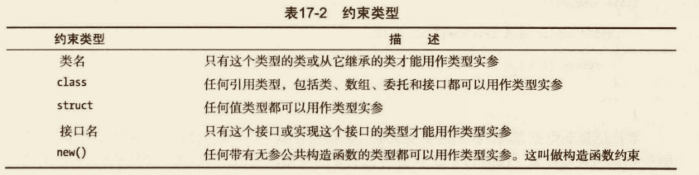

where 语句可以以任何次序列出。然而，where 子语句中的约束必须有特定的顺序。
- 最多只能有一个主约束，如果有则必须放在第一位。
- 可以有任意多的接口名约束。
- 如果存在构造函数约束，则必须放在最后。

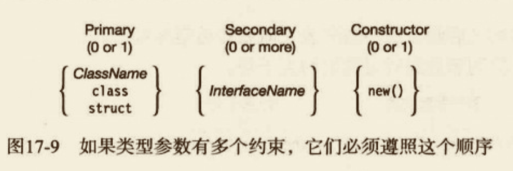

#### 泛型方法

```cs
// 泛型方法
using System;
namespace classdemo.JecyuGeneric
{

  class Simple  // 非泛型类
  {
    public static void ReverseAndPrint<T>(T[] arr) // 泛型方法
    {
      Array.Reverse(arr);
      foreach (T item in arr)
      {
        Console.Write("{0} ", item.ToString());
      }
      Console.WriteLine("");
    }
  }
  class Program2
  {
    public static void main()
    {
      // 创建各种类型数组
      int[] intArray = new int[] { 3, 5, 7, 9, 11 };
      string[] stringArray = new string[] { "first", "second", "third" };
      double[] doubleArray = new double[] { 3.567, 7.891, 2.345 };

      Simple.ReverseAndPrint<int>(intArray); // 调用方法
      Simple.ReverseAndPrint(intArray); // 推断类型并调用

      Simple.ReverseAndPrint<string>(stringArray);
      Simple.ReverseAndPrint(stringArray); // 推断类型并调用

      Simple.ReverseAndPrint<double>(doubleArray);
      Simple.ReverseAndPrint(doubleArray);
    }
  }
}

```

#### 扩展方法和泛型类

```cs
// 泛型——扩展方法
using System;
namespace classdemo.JecyuGeneric
{

  static class ExtendHolder
  {
    public static void Print<T>(this Holder<T> h)
    {
      T[] vals = h.GetValues();
      Console.WriteLine("{0},\t{1}, \t{2}", vals[0], vals[1], vals[2]);
    }
  }
  class Holder<T>
  {
    T[] Vals = new T[3];
    public Holder(T v0, T v1, T v2)
    {
      Vals[0] = v0;
      Vals[1] = v1;
      Vals[2] = v2;
    }
    public T[] GetValues()
    {
      return Vals;
    }
  }
  class Program3
  {
    public static void main()
    {
      Holder<int> intHolder = new Holder<int>(3, 5, 7);
      Holder<string> stringHolder = new Holder<string>("a1", "b2", "c3");
      intHolder.Print();
      stringHolder.Print();
    }
  }
}

```

#### 泛型结构

```cs
// 泛型结构
using System;
namespace classdemo.JecyuGeneric
{
  struct PieceOfData<T>
  {
    public PieceOfData(T value)
    {
      _data = value;
    }
    private T _data;
    public T Data
    {
      get
      {
        return _data;
      }
      set
      {
        _data = value;
      }
    }
  }

  class Program4
  {
    public static void main()
    {
      PieceOfData<int> intData = new PieceOfData<int>(10);
      PieceOfData<string> stringData = new PieceOfData<string>("Hi there.");

      Console.WriteLine("intData = {0}", intData.Data);
      Console.WriteLine("stringData = {0}", stringData.Data);
    }
  }
}

```

#### 泛型委托

```cs
// 泛型委托
using System;
namespace classdemo.JecyuGeneric
{
  delegate void MyDelegate<T>(T value);// 泛型委托
  class Simple2
  {
    static public void PrintString(string s) // 方法匹配委托
    {
      Console.WriteLine(s);
    }
    static public void PrintUpperString(string s) // 方法匹配委托
    {
      Console.WriteLine("{0}", s.ToUpper());
    }
  }
  class Program5
  {
    public static void main()
    {
      MyDelegate<string> myDel = new MyDelegate<string>(Simple2.PrintString); // 创建委托的实例
      myDel += Simple2.PrintUpperString; // 添加方法

      myDel("Hi there."); // 调用委托
    }
  }
}

```

##### 添加上返回类型的泛型

```cs
// 泛型委托
using System;
namespace classdemo.JecyuGeneric
{
  delegate TR Func<T1, T2, TR>(T1 p, T2 p2);// 泛型委托
  class Simple3
  {
    public static string PrintString(int p1, int p2) // 方法匹配委托
    {
      int total = p1 + p2;
      return total.ToString();
    }
  }
  class Program6
  {
    public static void main()
    {
      Func<int, int, string> myDel = new Func<int, int, string>(Simple3.PrintString); // 创建委托的实例
      Console.WriteLine("Total: {0}", myDel(15, 13));
    }
  }
}

```

#### 泛型接口

```cs
// 泛型接口
using System;
namespace classdemo.JecyuGeneric
{
  interface IMyfc<T> // 泛型接口
  {
    T ReturnIt(T intValue);
  }
  // 非泛型类
  class Simple4 : IMyfc<int>, IMyfc<string> // 源于同一泛型接口的两个不同接口
  {
    public int ReturnIt(int intValue)
    {
      return intValue;
    }
    public string ReturnIt(string stringValue)
    {
      return stringValue;
    }
  }
  class Program7
  {
    public static void main()
    {
      Simple4 trival = new Simple4();
      Console.WriteLine("{0}", trival.ReturnIt(5));
      Console.WriteLine("{0}", trival.ReturnIt("Hi there."));
    }
  }
}

```


#### 协变

后续补充

#### 逆变

##### 接口的协变和逆变

##### 有关可变性的更多内容

### 枚举器和迭代器

#### 枚举器和可枚举类型

在前面，我们已经知道可以使用 foreach 语句来遍历数组中的元素。在本章中，我们会进一步探讨数组，来看看为什么它们可以被foreach 语句处理。我们还会研究如何用迭代器为用户自定义的类增加这个功能。

##### 使用 foreach 语句

当我们为数组使用 foreach 语句时，这个语句为我们依次取出了数组中的每一个元素，允许我们读取它的值。例如，如下的代码声明了一个有4个元素的数组，然后使用 foreach 来循环打印这些项的值：

```cs
int[] arr1 = {10, 11, 12, 13}; // 定义数组
foreach(int item in arr1) {
  Console.WriteLine("Item value: {0}", item);
}
// 输出
// Item value：10
// Item value：11
// Item value：12
// Item value：13
```

为什么数组可以这么做？<u>原因是数组可以按需提供一个叫做枚举器（enumerator）的对象。</u>枚举器可以依次返回请求的数组中的元素。枚举器“知道”项的次序并且跟踪它在列中的位置，然后返回请求的当前项目。

对于有枚举器的类型而言，必须有一个方法来获取它。<u>获取一个对象枚举器的方法是调用对象的 `GetEnumerator` 方法。实现 `GetEnumerator` 方法的类型叫做可枚举类型（enumerable type 或 enumerable）。</u>数组是可枚举类型。


foreach 结构设计用来和可枚举类型一起使用。只要它的遍历对象是可枚举类型，比如数组，它就会执行如下行为：
- 通过调用 GetEnumerator 方法获取对象的枚举器；
- 从枚举器中请求每一项并且把它作为迭代变量（ieration variable），代码可以读取该变量但不可以改变。

#### IEumerator 接口

实现了 IEnumerator 接口的枚举器包含3个函数成员：Current、MoveNext以及 Reset。
- Current 是返回序列中当前位置项的属性。
  - 它是只读属性；
  - 它返回 object 类型的引用，所以可以返回任何类型。
- MoveNext 是把枚举器位置前进到集合中下一项的方法。它也返回布尔值，指示新的位置是有效位置还是已经超过了序列的尾部。
  - 如果新的位置还是有效，方法返回 true。
  - 如果新的位置是无效的（比如当前位置到达了尾部），方法返回 false。
  - 枚举器的原始位置在序列中的第一项之前，因此 MoveNext 必须在第一次使用 Current 之前调用。
- Reset 是把位置重置为原始状态的方法。

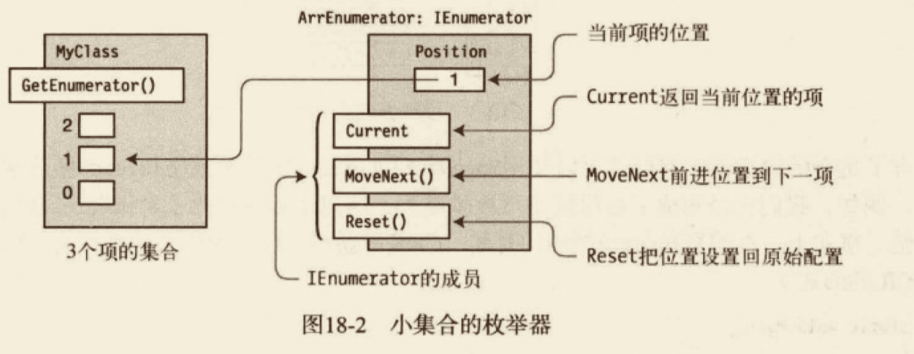

枚举器与序列中的当前项保持联系的方式完全取决于实现。可以通过对象引用、索引值或其他方式来实现。对于内置的一维数组来说，就使用项的索引。对于内置的一维数组，就使用项的索引。


有了集合的枚举器，我们就可以使用 MoveNext 和 Current 成员来模仿 foreach 循环遍历中的项。如下。

```cs
using System;
using System.Collections;

namespace classdemo.JecyuEnumerator
{
  class Program
  {
    public static void main()
    {
      int[] MyArray = new int[] { 10, 11, 12, 13 };
      IEnumerator ie = MyArray.GetEnumerator();

      while (ie.MoveNext()) // 手动模拟
      {
        int i = (int)ie.Current;
        Console.WriteLine("{0}", i); // 输出
      }
    }
  }
}

```

#### IEnumerable 接口

可枚举类型是指实现了 IEnumerable 接口的类。IEnumerable 只有一个成员——GetEnumerator方法，它返回对象的枚举器。

下面的代码展示了一个可枚举类的完整示例，该类叫做 Spectrum，它的枚举器类为 Color-Enumerator。Program 类在 Main 方法中创建了一个 Spectrum 实例，用于 foreach 循环。

```cs
using System;
using System.Collections;
using System.Collections.Generic;

namespace classdemo.JecyuEnumerator
{
  // 枚举器
  class ColorEnumerator : IEnumerator
  {
    string[] _colors;
    int _position = -1;
    // 构造函数
    public ColorEnumerator(string[] theColors)
    {
      _colors = new string[theColors.Length]; // 构造函数
      for (int i = 0; i < theColors.Length; i++)
      {
        _colors[i] = theColors[i];
      }
    }
    // 当前项
    public object Current
    {
      get
      {
        if (_position == -1)
        {
          throw new InvalidCastException();
        }
        if (_position >= _colors.Length)
        {
          throw new InvalidCastException();
        }
        return _colors[_position];
      }
    }
    // 移动到下一项
    public bool MoveNext()
    {
      if (_position < _colors.Length - 1)
      {
        _position++;
        return true;
      }
      else
      {
        return false;
      }
    }
    // 重置状态
    public void Reset() // 实现 reset
    {
      _position = -1;
    }
  }
  // 可枚举类
  class Spectrum : IEnumerable
  {
    string[] colors = { "violet", "blue", "cyan", "green", "yellow", "orange", "red" };
    public IEnumerator GetEnumerator()
    {
      return new ColorEnumerator(colors);
    }
  }
  class Program2
  {
    public static void main()
    {
      Spectrum spectrum = new Spectrum();
      foreach (string color in spectrum)
      {
        Console.WriteLine(color);
      }
    }
  }
}

```

#### 泛型枚举接口

目前我们描述的都是非泛型版本。实际上，在大多数情况下你应该使用泛型 `IEnumerable<T>` 和 `IEnumerator<T>`。它们叫做泛型是因为使用了 C# 泛型。

两者的本质区别如下所示。
- 对于非泛型接口形式：
  - IEnumberable 接口的 GetEnumerator 方法返回实现 IEnumerator枚举器类的实例。
  - 实现 IEnumerator 的类实现了 Current 属性，它返回 object 的引用，然后我们必须把它转化为实际类型的对象。
- 对于泛型接口形式：
  - `IEnumberable<T>`接口的 GetEnumerator 方法返回实现 `IEnumerator<T>`枚举器类的实例。
  - 实现 `IEnumerator<T>` 的类实现了 Current 属性，它返回实际类型的对象，而不是 object 基类的引用。

需要重点注意的是，我们目前看到的所有的非泛型接口的实现不是类型安全的。<u>它们返回 object 类型的引用，然后必须转换为实际类型。</u>

<u>而泛型接口的枚举器是安全的，它返回实际类型的引用。</u>如果要创建自己的可枚举类，应该实现这些泛型接口。非泛型版本可用于C# 2.0 以前没有泛型的遗留代码。

实现代码待后续补充。

#### 迭代器

可枚举类和枚举器在 .NET 集合类中被广泛使用，所以熟悉它们如何工作重要。不过，虽然我们已经知道如何创建自己的可枚举类和枚举器了，但是我们还是很高兴听到，C#从2.0版本开始提供了更简单的创建枚举器和可枚举类型的方式。<u>实际上，编译器将为我们创建它们。这种结构叫做迭代器。我们可以把手动编码的可枚举类型和枚举器替换为由迭代器生成的可枚举类型和枚举器。</u>

在解释细节之前，我们先来看两个示例。下面的方法声明了一个产生和返回枚举器的迭代器。
- 迭代器返回一个泛型枚举器，该枚举器返回3个 string 类型的项。
- yield return 语句声明这是枚举中的下一项。

```cs
public IEnumerator<string> BlackAndWhite() // 迭代器
{
  yield return "black";
  yield return "gray";
  yield return "white";
}
```

##### 迭代器块

迭代器块是有一个或多个 yield 语句的代码块。
- 方法主体；
- 访问器主体；
- 运算符主体。

##### 使用迭代器来创建枚举器

```cs
// 泛型枚举器
using System;
using System.Collections.Generic; // 引入泛型

namespace classdemo.JecyuEnumerator
{
  class MyClass
  {
    // 返回泛型枚举器，它返回的是字符串对象
    public IEnumerator<string> GetEnumerator()
    {
      return BlackAndWhite(); // 返回枚举器
    }
    public IEnumerator<string> BlackAndWhite() // 迭代器
    {
      yield return "black"; // 如果方法在第一个 yield 返回，后面两条语句永远不会达到
      yield return "gray";  
      yield return "white";
    }
  }
  class Program4
  {
    public static void main()
    {
      MyClass mc = new MyClass();
      foreach (string shade in mc)
      {
        Console.WriteLine(shade);
      }
    }
  }
}

```

##### 使用迭代器来创建可枚举类型

```cs
// 泛型枚举器
using System;
using System.Collections.Generic; // 引入泛型

namespace classdemo.JecyuEnumerator
{
  class MyClass
  {
    // 返回泛型枚举器，它返回的是字符串对象
    public IEnumerator<string> GetEnumerator()
    {
      // 引用可枚举类型的接口对象
      IEnumerable<string> myEnumerable = BlackAndWhite(); // 获取可枚举类型
      return myEnumerable.GetEnumerator(); // 获取枚举器
    }
    // 返回可枚举类型
    public IEnumerable<string> BlackAndWhite() 
    {
      yield return "black"; // 如果方法在第一个 yield 返回，后面两条语句永远不会达到
      yield return "gray";  
      yield return "white";
    }
  }
  class Program4
  {
    public static void main()
    {
      MyClass mc = new MyClass();
      foreach (string shade in mc)
      {
        Console.WriteLine(shade);
      }

      foreach (string shade in mc.BlackAndWhite())
      {
        Console.WriteLine(shade);
      }
    }
  }
}
```

#### 常见迭代器模式

前面两节的内容显示了，我们可以创建迭代器返回可枚举类型或枚举器。
- 当我们实现返回枚举器的迭代器时，必须通过实现 GetEnumerator 让类可枚举，它返回由迭代器返回的枚举器。
- 如果我们在类中实现迭代器返回可枚举类型，我们可以让类实现 GetEnumerator 来让类本身可被枚举，或不实现 GetEnumerator，让类不可枚举。
  - 如果实现 GetEnumerator ，让它调用迭代器方法以获取自动生成的实现 IEnumerable 的类实例。然后，从 IEnumerable 对象返回由 GetEnumerator 创建的枚举器。
  - 如果通过不实现 GetEnumerator 使类本身不可枚举，仍然可以使用由迭代器返回的可枚举类，只需要直接调用迭代器方法。

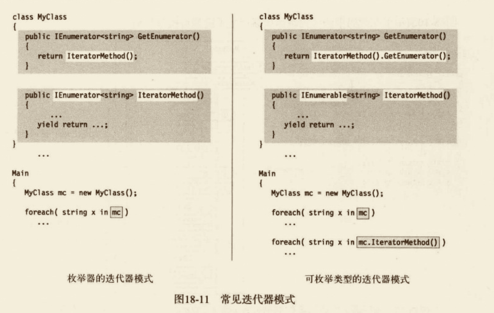

#### 产生多个可枚举类型

#### 将迭代器作为属性

#### 迭代器的实质

### LINQ

#### 什么是 LINQ

在关系型数据库系统中，数据被组织放入规范化很好的表中，并且通过简单而又强大的语法 SQL 来进行访问。SQL 可以和数据库中的任何数据配合使用，因为数据被放入表中，并遵从一些严格的规则。

<u>然而，在程序中却与数据库相反，保存在类对象或结构中的数据差异很大。</u>因此，没有通用的查询语言从数据结构中获取数据。从对象获取数据的方法一直都是作为程序的一部分而设计的。然而使用 LINQ 可以很轻松地查询对象集合。

如下是 LINQ 的重要高级特性。
- LINQ（发音 link）代表语言集成查询（Language Intergrated Query）。
- <u>LINQ是 .NET 框架的扩展，你可以从数据库、程序对象的集合以及 XML 文档中查询数据。</u>
- <u>使用 LINQ，你可以从数据库、程序对象的集合以及 XML 文档中查询数据。</u>

如下代码演示了一个简单的使用 LINQ 的示例。在这段代码中，被查询的数据是简单的 int 数组。<u>语句中查询的定义就是 from 和 select 关键字。尽管查询在语句中定义，但直到最后的 foreach 语句请求结果的时候才执行。</u>

```cs
using System;
using System.Collections.Generic;
using System.Linq;

namespace classdemo.JecyuLINQ
{
  public class Program
  {
    public static void main()
    {
      int[] numbers = { 2, 12, 5, 15 }; // 数据源
      IEnumerable<int> lowNums = from n in numbers
                                 where n < 10
                                 select n;
      foreach (int x in lowNums)
      {
        Console.Write("{0}, ", x);
      }
    }
  }
}
```

#### LINQ 提供程序

在之前的示例中，数据源只是 int 数组，它是程序在内存中的对象。然而，LINQ 还可以和各种类型的数据源一起工作，比如 SQL 数据库、XML 文档，等等。然而，<u>每一种数据类型，在其背后一定有根据该数据源类型实现 LINQ 查询的代码块。这些代码模块叫做 LINQ 提供程序（provider）。</u>有关 LINQ 的要点如下：
- 微软为一些常见的数据源类型提供了 LINQ 程序，如图所示。
- 我们可以使用任何支持 LINQ 的语言（在着这里是 C#）来查询有 LINQ 提供程序的数据源类型。
- 第三方在不断提供对各种数据源类型的 LINQ 提供程序。 


##### 匿名类型

在介绍LINQ 查询特性之前，让我们先学习一个允许我们创建无名类类型的特性。不足为奇，它叫做“anonymous type”。匿名类型经常用于 LINQ 查询的结果之中。

前面介绍了`对象初始化语句`，它允许我们在使用对象创建表达式时初始化新类实例的字段和属性。只是提醒一下，这种形式的对象创建表达式由三部分组成：<u>new 关键字、类名或构造函数以及对象初始化语句。</u>对象初始化语句在一组大括号内包含了以逗号分隔的成员初始化列表。

创建匿名类型的变量使用相同的形式，但是没有类名和构造函数。如下的代码行演示了匿名类型的对象创建表达式。

`new {FieldProp = InitExpr, FieldProp = InitExpr, ...}` 

如下代码给出了一个创建和使用匿名类型的示例。它创建了一个叫做 student 的变量，这是一个有3个 `string` 属性和一个 `int` 属性的匿名类型。注意，在 WriteLine 语句中， 可以像访问具名类型的成员那样访问实例的成员。

```cs
using System;
using System.Collections.Generic;
using System.Linq;

namespace classdemo.JecyuLINQ
{
  public class Program2
  {
    public static void main()
    {
      var student = new { Name = "Jecyu", Age = 22, Major = "Digital" };
      Console.WriteLine("{0}, Age:{1}, Major:{2}", student.Name, student.Age,
      student.Major);
    }
  }
}
// Jecyu, Age:22, Major:Digital
```

需要了解的有关匿名类型的重要事项如下：
- 匿名类型只能和局部变量配合使用，不能用于类成员。
- 由于匿名类型没有名字，我们必须使用 var 关键字作为变量类型。
- 不能设置匿名类型对象的属性。编译器为匿名类型创建的属性是只读的。

<u>当编译器遇到匿名类型的对象初始化语句时，它创建了一个有名字的新类类型。</u>对于每一个成员初始化语句，它推断其类型并创建一个只读属性来访问它的值。属性和成员初始化语句具有相同的名字。<u>匿名类型被构造后，编译器创建了这个类型的对象。</u>

除了对象初始化语句的赋值形式，匿名类型的对象初始化语句还有其他两种允许的形式：<u>简单标识符和成员访问表达式。</u>这两种形式叫做`投影初始化语句（projection initializer）`

下面的变量声明演示了所有的3种形式。第一个成员初始化语句是赋值形式，第二个是成员访问表达式，第三个是标识符形式。

```cs
var student = new {Age = 19, Other.Name, Major }; // 赋值形式 Age = 19，成员访问 Other.Name，标识符 Major
```

例如，如下代码使用了所有的3种类型。注意，投影初始化语句必须定义在匿名类型声明之前。Major 是一个局部变量，Name 是 Other 类的静态字段。

```cs
using System;
namespace classdemo.JecyuLINQ
{
  class Other
  {
    static public string Name = "Jecyu";
  }
  public class Program3
  {
    public static void main()
    {
      string Major = "History";
      var student = new { Age = 19, Other.Name, Major };
      Console.WriteLine("{0}, Age:{1}, Major:{2}", student.Name, student.Age,
   student.Major);
    }
  }
}
```

刚才演示的映射初始化语句形式和这里给出的赋值形式的结果一样：
```cs
var student = new {Age = 19, Name = Other.Name, Major = Major}; // 赋值形式 Age = 19，成员访问 Other.Name，标识符 Major
```

如果编译器遇到了另一个具有相同的参数名、相同的推断类型和相同顺序的匿名类型，它会重用这个类型并直接创建新的实例，不会创建新的匿名类型。

#### 方法语法和查询语法

我们在写 LINQ 查询时可以使用两种形式的语法：查询语法和方法语法。
- 方法语法（method syntax）使用标准的方法调用。这些方法是一组叫做标准查询运算符的方法，本章稍后介绍。
- 查询语法（query syntax）看上去和 SQL 语句很相似，使用查询表达式形式书写。
- 在一个查询中可以组合两种形式。

<u>查询语法是声明式（declarative）的，也就是说，查询描述的是你想要返回的东西，但并没有指明如何执行这个查询。方法语法是命令式（imperative）的，它指明了查询语法调用的顺序。</u>**编译器会将使用查询语法表示的查询翻译为方法调用的形式。这两种形式在运行时没有性能的差异。**

微软推荐使用查询语法，因为它更易读，能更清晰地表明查询意图，因此也更不容易出错。然而，有些运算符必须使用方法语法来书写。

如下代码演示了这两种形式以及它们的组合。对于方法语法的那部分代码，注意 Where 方法的参数使用了 Lambda 表达式。

```cs
using System;
using System.Linq;

namespace classdemo.JecyuLINQ
{

  public class Program4
  {
    public static void main()
    {
      int[] numbers = { 2, 5, 28, 31, 17, 16, 42 };
      var numsQuery = from n in numbers // 查询语法
                      where n < 20
                      select n;
      var numsMethod = numbers.Where(x => x < 20); // 方法语法
      int numsCount = (from n in numbers // 两种形式的结合
                       where n < 20
                       select n).Count();
      foreach (var x in numsQuery)
      {
        Console.Write("{0} ", x);
      }
      Console.WriteLine("");
      foreach (var x in numsMethod)
      {
        Console.Write("{0} ", x);
      }
    }
  }
}

```

#### 查询变量

LINQ 查询可以返回两种类型的结果——可以是一个`枚举`，它满足查询参数的项列表；也可以是一个叫做`标量（scalar）`的单一值，它是满足查询条件的结果的某种摘要形式。

如下示例代码进行了这些工作。
- 第一个语句创建了 int 的数组并且使用3个值进行初始化。
- 第二个语句返回一个 IEnumerable 对象，它可以用来枚举查询的结果。
- 第三个语句执行一个查询，然后调用一个方法（Count）来返回从查询返回的总数。

```cs
int[] numbers = { 2, 5, 28 }; // 数据源
  IEnumerable<int> lowNums = from n in numbers
                             where n < 20
                             select n;
int numsCount = (from n in numbers // 两种形式的结合
                 where n < 20
                 select n).Count();
```

<u>第二条和第三条语句等号左边的变量叫做查询变量。</u>

理解查询变量的用法很重要。在执行前面的代码，<u>lowNums 查询变量不会包含查询的结果。</u>相反，编译器会创建能够执行这个查询的代码。

查询变量 numCount 包含的是真实的整数值，它只能通过真实运行查询后的结果。区别在于查询执行的时间，可以总结如下。
- <u>如果查询表达式返回枚举，查询一直到处理枚举时才会执行。</u>
- <u>如果枚举被处理多次，查询就会执行多次。</u>
- 如果在进行遍历之后，查询执行之前数据有改动，则查询会使用新的数据。
- <u>如果查询表达式返回标量，查询立即执行，并且把结果保存在查询变量中。</u>

#### 查询表达式的结构

如图19-2所示，查询表达式由查询体后的 from 子句组成。有关查询表达式需要了解的一些重要事项如下。
- 子句必须按照一定的顺序出现。
- <u>`from` 子句和`select...group` 子句这两部分是必需的。</u>
- 其他子句是可选的。
- <u>在 LINQ 查询表达式中，`select` 子句在表达式最后。这与SQL的 SELECT语句在查询的开始处不一样。C#这么做的原因之一是让 Visual Studio 智能感应能在我们输入代码时给我们更多选项。</u>
- 可以有任意多的 `from...let...where` 子句，如图19-2所示。


##### from 子句

##### join 子句

#### 标准查询运算符

标准查询运算符由一系列API方法组成，它能让我们查询任何 .NET 数组或集合。有关标准查询运算符的重要性如下。
- 被查询的集合对象叫做序列，它必须实现 `1IEnumerable<T>` 接口，T是类型。
- 标准查询运算符使用方法语法。
- <u>一些运算符返回 `Ienumerable` 对象（或其他序列），而其他的一些运算符返回标量。返回标量的运算符立即执行，并返回一个值，而不是可枚举类型对象。</u>
- 很多操作符都以一个谓词作为参数。谓词是一个方法，它以对象作为参数，根据对象是否满足某个条件而返回 `true` 或 `false`。

```cs
using System;
using System.Linq;

namespace classdemo.JecyuLINQ
{

  class Program5
  {
    static int[] numbers = new int[] { 2, 4, 6 };
    public static void main()
    {
      int total = numbers.Sum();
      int howMany = numbers.Count();
      Console.WriteLine("Total: {0}, Count: {1}", total, howMany);
    }
  }
}

// Total: 12, Count: 3

```

##### 将委托作为参数

- 泛型委托用于给运算符提供用户自定义的代码。

#### LINQ to XML

可扩展标记语言（XML）是存储和交换数据的重要方法。LINQ 为语言增加了一些特性，使得 XML 用起来比 XPath 和 XSLT 容易得多。如果你熟悉这些方法的话，会很高兴 LINQ to XML 在许多方面简化了 XML 的创建、查询和操作。当然，还包括以下几个方面。
- 我们可以使用单一语句自顶向下创建 XML 树。
- 我们可以不使用包含数的 XML 文档在内存中创建并操作 XML。
- 我们可以不使用 Text 子节点来创建和操作字符串节点。
- <u>一个最大的不同（改进）是，在搜索一个 XML 树时，不需要遍历它。相反只需要查询树并让它返回想要的结果。</u>

尽管我不会完整介绍 `XML`，但是在介绍一些 LINQ 提供的 XML 操作特性之前，我会先简单介绍一下 `XML`。

##### 标记语言

标记语言（markup language）是文档中的一组标签，它提供有关稳定的信息并组织其内容。也就是说，<u>标记标签不是文档的数据——它们包含关于数据的数据。有关数据的数据称为元数据。</u>

<u>标记语言是被定义的一组标签，旨在传递有关文档内容的特定类型的元数据。</u>

##### XML 基础

##### XML 类

##### 使用 XML 特性

##### 节点的其他类型

##### 使用 LINQ to XML 的 LINQ查询

### 异步编程

#### 什么是异步

#### async/await 特性的结构

#### 什么是异步方法

##### 异步方法的控制流

##### await 表达式

##### 取消一个异步操作

##### 异步处理和 await 表达式

##### 在调用方法中同步地等待任务

##### 在异步方法中异步地等待任务

##### Task.Delay 方法

#### GUI 程序中的异步操作

#### 使用异步的 Lambda 表达式

#### 一个完整的 GUI 示例

#### BackgroundWorker 类

#### 并行循环

#### 其他异步编程模式

#### BeginInvoke 和 EndInvoke

#### 计时器

### 命名空间和程序集

在第一章中，我们在高层次上观察了编译过程。<u>编译器接受源代码文件并生成名称为程序集的输出文件</u>。这一章中，我们将详细阐述程序集以及它们是如何生成和部署的。你还会看到命名空间是如何帮助组织类型的。

在迄今为止所看到的所有程序中，大部分都声明并使用它们自己的类。然而，在许多项目中，你会想使用来自其他程序集的类或类型。<u>这些其他的程序集可能来自 BCL，或来自一个第三方供应商，或你自己创建了它们。这些程序集称为类库，而且它们的程序集文件的名称通常以 `.dll` 扩展名结尾而不是 `.exe` 扩展名。</u>

例如，假设你想创建一个类库，它包含可以被其他程序集使用的类和类型。一个简单库的源代码如下面示例中所示，它包含在名称 SuperLib.cs 的文件中。该库含有单独一个名称为 `SquareWidget` 的公有类。

```cs
using System;
namespace JecyuLib
{
  public class SquareWidget
  {
    public double SideLength = 0;
    public double Area
    {
      get
      {
        return SideLength * SideLength;
      }
    }

    public double SideLegth { get; set; }
  }
}

```

`SuperLib.cs` ➡️ C# 编译器 ➡️ SuperLib程序集（SuperLib.dll）

要使用 Visual Studio 创建类库，在已安装的 Windows 模版中创建类库模版。具体来说，在 Visual Studio 中进行的操作步骤如下。
1. 选择 File➡New➡Project，然后会打开 New Project 窗口。
2. 左边的面板，在 Installed ➡ Templates 面板中找到 Visual C# 节点并选中。
3. 在中间的面板中选择 Class Library 模版。

#### 引用其他程序集

假设你还要写一个名称为 MyWidgets 的程序，想要使用 SquareWidget 类。程序的代码在一个名称为 MyWidget.cs 的文件中，如下面的示例所示。这段代码简单创建一个类型为 SquareWidget 的对象并使用该对象的成员。

```cs
using System;
{
  class Program
  {
    public static void main()
    {
      SquareWidget sq = new SquareWidget(); // 来自 SuperLib 类库
      sq.SideLength = 5.0;
      Console.WriteLine(sq.Area);
    }
  }
}

```

注意，这段代码没有声明类 SquareWidget。相反，使用的是定义在 SuperLib 的类。然而，当你编译 MyWidgets 程序时，编译器必须知道你的代码在使用程序集 SuperLib，这样它才能得到关于类 SquareWidget 的信息。要实现这点，需要给编译器一个到该程序集的引用，给出它的名称和位置。

在 Visual Studio 中，可以用下面的方法把引用添加到项目。
- 选择 Solution Explorer，并在该项目名下找到 References 目录。References 目录包含项目使用的程序集的列表。
- 右键单击 References 目录并选择 Add Reference。有5个可以从中选择的标签页，允许你以不同的方法找到类库。
- 对于我们的程序，选择 Browser 标签，浏览到包含 SquareWidget 类定义的 DLL 文件，并选择它。
- 点击 OK 按钮，引用就被加入到项目了。

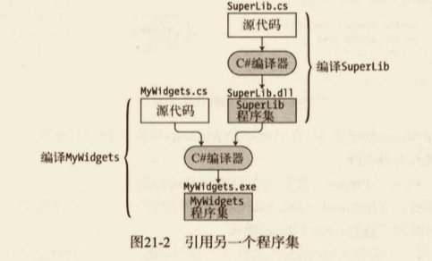

现在假设你的程序已经很好地用 SuqareWidget 类工作了，但你想扩展它的能力以使用一个名称为 CircleWidget 的类，它被定义在另一个名称为 UltraLib 的程序集中。MyWidgets 的源代码看上去像下面这样。它创建一个 SquareWidget 对象和一个 CircleWidget 对象，它们分别定义在 SuperLib 中和 UltraLib 中。

```cs
class WidgetProgram {
  static void Main() {
    SquareWidget q = new SquareWidget(); // 来自 SuperLib
    CircleWidget circle = new CircleWidget(); // 来自 UltralLib
  }
}
```

类库 UltralLib的源代码如下面的示例所示。注意，除了类 CircleWidget 之外，就像库 SuperLib，它还声明了一个名称为 SquareWidget 的类。

```cs
public class SquareWidget {
  ...
}
public class CircleWidget {
  public double Radius = 0;
  public double Area {
    get {...}
  }
}
```

因为两个库都含有名称 SquareWidget 的类，当你试图编译程序 MyWidgets 时，编译器产生一条错误消息，因为它不知掉使用类 SquareWidget 的哪个版本。

#### 命名空间

在 MyWidget 示例中，由于你有源代码，你能通过在 SuperLib 源代码或 UltralLib 源代码仅仅改变 SquareWidget 类的名称来解决命名冲突。<u>但是，如果这些类是由不同的公司开发的，而且你还不能拥有源代码会怎么样呢？</u>假设 SuperLib 由一个名称为 MyCorp 的公司生产，UltralLib 由ABCCorp 公司生产。在这种情况下，如果你使用任何有冲突的类或类型，你将不能把这两个库放在一起使用。

但是，假设 MyCorp 有一个策略，让所有类的前缀都是公司名字加上类产品名和描述名。并且进一步假设 ABCCorp 也有相同的策略。这样的话，我们示例中的3个类名就可能是 MyCorpSquareWidget、ABCCorpSquareWidget和 ABCCorpCircleWidget。

但是，在我们的示例程序中，需要使用冗长的名字，看上去如下所示。

```cs
class WidgetProgram {
  static void Main() {
    SquareWidget q = new MyCorpSquareWidget(); // 来自 SuperLib
    CircleWidget circle = new ABCCorpCircleWidget(); // 来自 UltralLib
  }
}
```

尽管这可以解决冲突问题，但是即使有智能感知，这些新的、已消除歧义的名字还是难以阅读。

不过，假设除了标识符中一般允许的字符，还可以在字符串中使用点——尽管不是在类名的最前面或最后面，那么这些名字就更好理解了，比如 MyCorp.SquareWidget。

**这就给了我们命名空间名和命名空间的定义。**
- 你可以把命名空间视为一个字符串（在字符串中可以使用点），它加在类名或类型名的前面并且通过点进行分隔。
- 包括命名空间名、分隔点，以及类名的完整字符串叫做类的完全限定名。
- 命名空间是共享命名空间名的一组类和类型。

你可以使用命名空间垃圾把一组类型组织在一起并且给它们起一个名字。一般而言，命名空间名描述的是命名空间中包含的类型，并且和其他命名空间名不同。

<u>你可以通过在包含你的类型声明的源文件中声明命名空间，从而创建命名空间。</u>如下代码演示了声明命名空间的语法。然后在命名空间声明的大括号中声明牛的所有类和其他类型。那么这些类型就是这个命名空间的成员了。

```cs
namespace NamespaceName {
  TypeDeclaratiions
}
```

##### 命名空间名称

如你所见，命名空间的名称可以包含创建该程序集的公司的名称。除了标识公司以外，该名称还用于帮助程序快速了解定义在命名空间内的类型的种类。

关于命名空间名称的一些要点如下：
- 命名空间名称可以是任何有效标识符。
- 另外，命名空间名称可以包含句点符号，用于把类型组织成层次。

下面是命名空间命名指南：
- 使用公司名开始命名空间名称；
- 在公司名之后跟着技术名称；
- 不要把命名命名为与类或类型相同的名称。

例如，Acme Widget 公司的软件开发部门在下面3个命名空间中开发软件，如下面的代码所示：
- AcmeWidgets.SuperWidget
- AcmeWidgets.Media
- AcmeWigets.Games

##### 命名空间的补充

关于命名空间，有其他几个要点应该知道。
- 在命名空间内，每个类型名必须有别于所有其他类型。
- <u>命名空间内的类型称为命名空间的成员。</u>
- 一个源文件可以包含任意数目的命名空间声明，可以顺序也可以嵌套。

.NET 框架BCL 提供了数千个已定义的类和类型以供生成程序时选择。为了帮助组织这组有用的功能，相关功能的类型被声明在相同的命名空间里。BCL 使用超过100个命名空间来组织它的。类型。

##### 命名空间跨文件扩展

<u>命名空间不是封闭的。这意味着可以在源文件的后面或另一个源文件中再次声明它，以对它增加更多的类型声明。</u>

##### 嵌套命名空间

命名空间可以被嵌套，从而产生嵌套的命名空间。嵌套命名空间允许你创建类型的概念层次。有两种方法声明一个嵌套的命名空间，如下所示。
- 原文嵌套 可以把命名空间的声明放在一个封装的命名空间声明体内部，从而创建一个嵌套的命名空间。
- 分离的声明 也可以为嵌套命名空间创建分离的声明，但必须在声明中使用它的完全限定名称。


<u>虽然嵌套命名空间位于父命名空间内部，但是其成员并不属于包裹的父命名空间。有一个常见的误区，认为既然嵌套的命名空间位于父命名空间内部，其成员也父命名空间的子集，这是不正确的，命名空间之间是相互独立的。</u>

#### using 指令

完全限定名可能相当长，在代码中通篇使用它们会变得十分乏味。然而，有两个编译器指令，可以使你避免不得不使用完全限定名：`using 命名空间指令和 using 别名指令`。

关于 using 指令的两个要点如下：
- 它们必须放在源文件的顶端，在任何类型声明之前。
- 它们应用于当前源文件的所有命名空间。

##### using 命名空间指令

using 命名空间指令通知编译器你将要使用来自某个指定命名空间的类型。然后你可以继续，并使用简单类名而不必全路径修饰它们。

当编译器遇到一个不在当前命名空间的名称时，它检查在 using 命名空间指令中给出的命名空间列表，并把该未知名称加到列表中的第一个命名空间后面。如果结果完全限定名称匹配了这个程序集或引用程序集中的一个类，编译器将使用那个类。如果不匹配，那么它试验列表中下一个命名空间。

```cs
using System;
```

##### using 别名指令

using 别名指令允许起一个别名给：
- 命名空间；
- 命名空间内的一个类型。

例如，下面的代码展示了两个 using 别名指令的使用。第一个指令告诉编译器标识符 Syst 是命名空间 System 的别名。第二个指令标识符 SC 是类 System.Console 的别名。

```cs
using Syst = System;
using SC = System.Console;
```

#### 程序集的结构

如你在第1章看到的，程序就不包含本地机器代码，<u>而是公共中间语言代码。它还包含实时编译器（JIT）在运行时转换 CIL 到本机代码所需的一切，包括对它所引用的其他程序集的引用。</u>

程序集的文件扩展名通常为 .exe 或 .dll。 

大部分程序集由一个单独的文件构成。


程序集代码文件称为模块。尽管大部分程序集由文件组成，但有些也有多个文件。对于有多个模块的程序集，一个文件是主模块（primary module），而其他的是次要模块（secondary modules）。
- 主模块含有程序集的清单和到次要模块的引用。
- 次要模块的文件名以扩展名 .netmodule 的结尾。
- 多文件程序集被视为一个单一单元。它们一起部署并一起定版。


#### 程序集标识符

在 .NET 框架中，程序集的文件名不像在其他操作系统和环境中那么重要，更重要的是程序集的标识符（identity）。

程序集的标识符有4个组成部分，它们一起唯一标识了该程序集，如下所示。
- 简单名 这只是不带扩展名的文件名。每个程序集都有一个简单名。它也被称为程序集名或友好名称（friendly name）。
- 版本号 它由4个句点分开的整数字符串组成，形式为 MajorVersion.MinorVersion.Buiild.Revisioin，例如 2.0.35.9。
- 文化信息 它是一个字符串，由2～5个字符组成，代表一种语言，或代表一种语言和一个国家或地区。例如，在美国使用英语的文化名是 en-US。在德国使用德语，它是 de-DE。
- 公钥 这个128字节字符串应该是生产该程序集的公司唯一的。

#### 强命名程序集

<u>强命名（strongly named）程序集有一个唯一的数字签名依附于它。</u>强命名程序集比没有强名称的程序集更加安全，原因有以下几点：
- 强名称唯一标识了程序集。没有其他人能创建一个与之有相同名称的程序集，所以用户可以确信该程序集来自于其声称的来源。
- 没有 CLR 安全组件来捕获更改，带强名称的程序集的内容不能被改变。

程序员不产生强名称。编译器产生它，接受关于程序集的信息，并散列化这些信息以创建一个唯一的数据签名依附到该程序集。它在散列处理中使用的信息如下：
- 组成程序集的字节序列；
- 简单名称；
- 版本号；
- 文化信息；
- 公钥/私钥对。

##### 创建强命名程序集

要使用 Visual Studio 强命名一个程序集，必须有一份公钥/私钥对文件的副本。如果没有密钥文件，可以让 Visual Studio 产生一个。可以实行以下步骤。
1. 打开工程的属性。
2. 选择签名页。
3. 选择 Sign the Assembly 复选框并输入密钥文件的位置或创建一个新的。
   
在编译代码时，编译器会生存一个强命名的程序集。


#### 程序集的私有方式部署

在目标机器上部署一个程序就像在该机器上创建一个目录并把应用程序复制过去一样简单。如果应用程序不需要其他程序集（比如 DLL），或如果所需的 DLL 在同一目录下，那么程序应该会就在它所在的地方良好工作。<u>这种方法部署的程序集称为`私有程序集`，而且这种部署方法称为复制文件（XCopy）部署。</u>

私有程序集几乎可以被放在任何目录中，而且只要它们依赖的文件都在同一目录或子目录下几句足够了。事实上，可以在文件系统的不同部分有多个目录，每个目录都有同样的一组程序集，并且它们都会各自不同的围追良好工作。

关于私有程序集部署的一些重要事情如下：
- 私有程序集所在的目录被称为应用程序目录。
- 私有程序集可以是强命名的也可以是弱命名的。
- 没有必要在注册表中注册组件。
- 要卸载一个私有程序集，只要从文件系统中删除它即可。

#### 共享程序集和 GAC

私有程序集是非常有用的，但有时你会想把一个 DLL 放在一个中心位置，这样一个单独的复制就能被系统中其他的程序集共享。<u>.NET 有这样的贮藏库，称为全局程序集缓存（GAC）。放进 GAC 的程序集称为共享程序集。</u>

关于 GAC 的一些重要内容如下：
- 只有强命名程序集能被添加到 GAC。
- GAC 的早期版本支接受带 .dll 扩展名的文件，现在也可以添加带 .exe 扩展名的程序集了。
- GAC 位于 Windows 系统目录的子目录中。.NET 4.0 之前位于 \Windows\Assembly 中，从 .NET 4.0 开始位于 \Windows\Microsoft.NET\assembly 中。

##### 把程序集安装 GAC

当试图安装一个程序集到 GAC 时，CLR 的安全组件首先必须检验程序集上的数字签名是否有效。如果没有数据签名，或它是无效，系统将不会把它安装到 GAC。

`gacutil.exe` 命名行工具允许从 GAC 添加或删除程序集，并列出 GAC 包含的程序集。它的3个最有用的参数标记如下所示：
- /i：把一个程序集插入 GAC。
- /u：从 GAC 卸载一个程序集。
- /l：列出 GAC 中的程序集。

##### GAC 内的并肩执行

在程序集部署到 GAC 之后，它就能被系统中其他程序集使用了。然而，请记住程序集的标识符由完全限定名称的全部4个部分组成。所以，如果一个库的版本号改变了，或如果它有一个不同的程序集。

结果就是在 GAC 中可以有许多不同的程序集，它们把相同的文件名。虽然它们有相同的文件名，但它们是不同的程序集而且在 GAC 中完美地共存。<u>这使不同的应用程序在同一时间很容易使用不同版本的同一 DLL，因为它们是带不同标识符的不同程序集。这就被称为并肩执行（side-by-side Execution）</u>。

#### 配置文件

配置文件含有关于应用程序的信息，供 CLR 在运行时使用。它们可以指示 CLR 去做这样的事情，比如使用一个不同版本的 DLL，或搜索程序引用的 DLL 时在附加目录中寻找。

<u>配置文件由 XML 代码组成，并不包含 C# 代码。</u>它们的一种用途是更新一个应用程序集以使用新版本的 DLL。

例如，假设有一个应用程序引用了 GAC 中的一个 DLL。在应用程序的清单中，该引用的标识符必须完全匹配 GAC 中。如果一个新版本的 DLL 发布了，它可以被添加到 GAC 中，在那里它可以幸福和老版本共存。

<u>然而，如果你不想重新编译程序但又希望它使用新的 DLL，那么你就可以创建一个配追文件告诉 CLR 去使用新的版本而不是旧版本。配置文件被放在应用程序目录中。</u>

#### 延迟签名

公司小心地保护它们官方的`公钥/私钥对`是非常重要的，否则，如果不可靠的人得到了它，就可以发布伪装成该公司的代码。为了避免这种情况公司显然不能允许自由访问含有它们的`公钥/私钥对`的文件。**在大公司中，最终程序集的强命名经常在开发过程的最尾部由特殊的有密钥访问权限的小组执行。**

可是，由于个别原因，这会在开发和测试过程中导致问题。首先，由于公钥是程序集标识符的4个部分之一，所以直到提供了公钥它才能被设置。而且，弱命名的程序集不能被部署到 GAC。开发人员和测试人员都需要有能流编译和测试该代码，并使用它将要被部署发布的方式，包括它的标识符和在 GAC 中的位置。

<u>为了允许这个，有一种修改了的赋值强命名的形式，称为延迟签名（delayed signing）或部分签名（partial signing），它克服了这些问题，而且没有释放过对私钥的访问。</u>


### 异常

#### 什么是异常

<u>异常是程序中的运行时错误，它违反了系统约束或应用程序约束，或出现了在正常操作时未预料的情形。</u>例如，程序试图除以0或试图写出一个只读文件。当这些发生后，系统捕获这个错误，并抛出一个异常：

```cs
using System;
namespace classdemo.JecyuException
{
  class Program
  {
    public static void main()
    {
      int x = 10;
      int y = 0;
      x /= y;
    }
  }
}
// 异常信息：
// Unhandled Exception:
// System.DivideByZeroException: Attempted to divide by zero.
//   at classdemo.JecyuException.Program.main () [0x00006] in /Users/linjy/Documents/Developer/Game-Development/Learn-C-Sharp-Demo/start/class-demo/JecyuException/Exception1.cs:10 
```

#### try 语句

<u>try 语句用来指明为避免出现异常而被保存的代码段，并在发生异常时提供代码处理异常。</u>try 语句由3个部分组成，如图22-1所示。
- try 块包含为避免出现异常而被保护的代码。
- catch 子句部分含有一个或多个 catch 子句。这些是处理异常的代码段，它们也称为是异常处理程序。
- finally 块含有在所有情况下都要被执行的代码，无论有没有异常发生。


##### 处理异常

前面的示例显示了除以0会导致一个异常。可以修改此程序，把那段代码放在一个 try 块中，并提供一个简单的 catch 子句，以处理该异常。当异常发生时，它被捕获并在 catch 块中处理。

```cs
using System;
namespace classdemo.JecyuException
{
  class Program2
  {
    public static void main()
    {
      int x = 10;
      try
      {
        int y = 0;
        x /= y;
      }
      catch
      {
        Console.WriteLine("Handing all exception - Keep on Running.");
      }

    }
  }
}
// 输出
// Handing all exception - Keep on Running.
```

#### 异常类

有许多不同类型的异常可以在程序中发生。BCL 定义了许多类，每一个类代表一个指定的异常类型。当一个异常发生时，CLR：
- 创建该类型的异常对象；
- 寻找适当的 catch 子句以处理它。


异常对象含有只读属性，带有导致该异常的信息。这些属性的其中一些如表所示。

|属性|类型|描述|
|--|--|
|Message | string | 这个属性含有解释异常原因的信息 |
|StackTrace | string | 这个属性含有描述异常发生在何处的信息|
|InnerException | Exception | 如果当前异常是由另一个异常引起的，这个属性包含前一个异常的引用|
|HelpLink|string|这个属性可以被应用程序定义的异常设置，为异常原因信息及提供 URN 或 URL|
|Source| string| 如果没有被应用程序定义的异常设定，那么这个属性含有异常所在的成许久的名称|

#### catch 子句

catch 子句处理异常。它有3种形式，允许不同级别的处理。

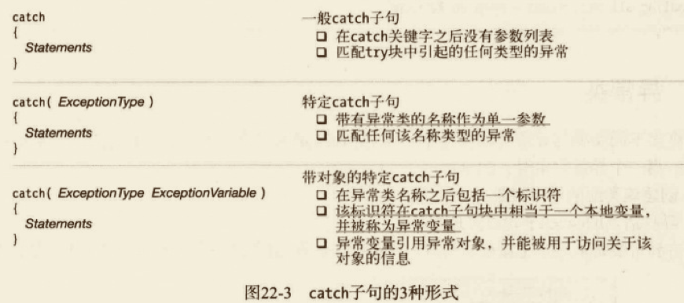

#### 使用特定 catch 子句的示例

回到除以0的示例，下面的代码把前面的 catch 子句修改为指定处理 DivideByZeroException 类的异常。在前面的示例中，catch 子句会处理所在 try 块中引起的任何异常，而这个示例将只处理 DivideByZeroException 类的异常。

```cs
// try...catch 处理异常
using System;
namespace classdemo.JecyuException
{
  class Program3
  {
    public static void main()
    {
      int x = 10;
      try
      {
        int y = 0;
        x /= y;
      }
      catch (DivideByZeroException e)
      {
        Console.WriteLine("Message: {0}", e.Message);
        Console.WriteLine("Source: {0}", e.Source);
        Console.WriteLine("Stack: {0}", e.StackTrace);
      }
      finally
      {
        Console.WriteLine("In finally statement.");
      }
    }
  }
}

```

#### catch 子句段

catch 子句的目的是允许你以一种优雅的方式处理异常。如果你的 catch 子句接受一个参数，那么系统会把这个异常变量设置为异常对象，这样你就可以检查并确定异常的原因。如果异常是前一个异常引起的，你可以通过异常变量的 InnerException 属性来获得对前一个异常对象的引用。

catch 子句段可以包含多个 catch 子句。

当异常发生时，系统按顺序搜索 catch 子句的列表，第一个匹配该异常对象类型的 catch 子句被执行。因此，catch 子句的排序有两个重要的规则。具体如下。、
- 特定 catch 子句必须以一种顺序排列，最明确的异常类型第一，直到最普通的类型。例如，如果声明了一个派生自 NullReferenceException 的异常类，那么派生异常类型的 catch 子句应该被列在 NullReferenceException 的 catch 子句之前。
- <u>如果有一个一般 catch 子句，它必须是最后一个，并且在所有特定 catch 子句之后。</u>不鼓励使用一般 catch 子句，因为它允许程序继续执行隐藏错误，让程序处于一种未知的状态。应尽可能使用特定子句。


#### finally 块

如果程序的控制流进入了一个带 finally 块的 try 语句，那么 finally 始终会被执行。
- 如果在 try 块内部没有异常发生，那么在 try 块的结尾，控制流跳过任何 catch 子句并到 finally 块。
- 如果在 try 块内部发生了异常，那么在 catch 子句段中无论哪一个适当的 catch 子句被执行，接着就是 finally 块的执行。

即使 try 块中有 return 语句或在 catch 块中抛出一个异常，finally 块也总是会在返回到调用代码之前执行。

#### 为异常寻找处理代码

当程序产生一个异常时，系统查看该程序是否为它提供了一个处理代码。
- 如果在 try 块内发生了异常，系统会查看是否有任何一个 catch 子句能处理该异常。
- 如果找到了适当的 catch 子句，以下3项的1项会发生。
  - 该 catch 子句被执行。
  - 如果有 finally 块，那么它被执行。
  - 执行在 try 语句的尾部继续（也就是说，在finally 块之后，或如果没有 finally 块，就在最后一个 catch 子句之后。）

```cs
// try...catch 处理异常
using System;
namespace classdemo.JecyuException
{
  class Program3
  {
    public static void main()
    {
      int x = 10;
      try
      {
        int y = 0;
        x /= y;
      }
      catch (DivideByZeroException e)
      {
        Console.WriteLine("Message: {0}", e.Message);
        Console.WriteLine("Source: {0}", e.Source);
        Console.WriteLine("Stack: {0}", e.StackTrace);
      }
      finally
      {
        Console.WriteLine("In finally statement.");
      }
    }
  }
}

```

#### 更进一步搜索

如果异常在一个没有被 try 语句保护的代码段产生，或如果 try 语句没有匹配的异常处理程序，系统将不得不更进一步寻找匹配的处理代码。为此它会按顺序搜索调用栈，以看看是否存在带匹配的处理程序的封装 try 块。

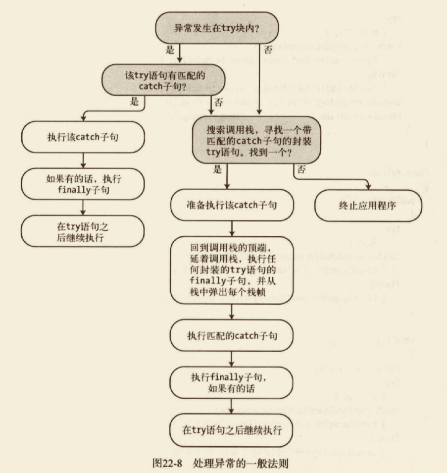

##### 搜索调用栈的示例

在下面的代码中，Main 开始执行并调用方法 A，A调用方法B。

```cs
// try...catch 处理异常，搜索调用栈
using System;
namespace classdemo.JecyuException
{
  class MyClass
  {
    public void A()
    {
      try
      {
        B();
      }
      catch (System.NullReferenceException)
      {
        Console.WriteLine("catch clause in A()");
      }
      finally
      {
        Console.WriteLine("finally clause in A()");
      }
    }
    void B()
    {
      int x = 10, y = 0;
      try
      {
        x /= y;
      }
      catch (System.IndexOutOfRangeException)
      {
        Console.WriteLine("catch clause in B()");
      }
      finally
      {
        Console.WriteLine("finally clause in B()");
      }
    }
  }
  class Program4
  {
    public static void main()
    {
      MyClass mc = new MyClass();
      try
      {
        mc.A();
      }
      catch (DivideByZeroException)
      {
        Console.WriteLine("catch clause in Main()");
      }
      finally
      {
        Console.WriteLine("finally clause in Main()");
      }
      Console.WriteLine("After try statement in Main.");
      Console.WriteLine("   --keep running.");
    }
  }
}
// 输出
// finally clause in B()
// finally clause in A()
// catch clause in Main()
// finally clause in Main()
// After try statement in Main.
//    --keep running.
```

#### 抛出异常

可以使用 `throw` 语句使代码显式地引发一个异常。`throw` 语句的语法如下：
`throw ExceptionObject`

例如，下面的代码定义了一个名称为 PrintArg 的方法，它带一个 string 参数并把它打印出来。在 try 块内部，它首先检查以确认该参数不是 null。如果是 null，它创建一个 ArgumentNullException 实例并抛出它。该异常实例在 catch 语句中被捕获，并且该出错信息被打印。Main 调用该方法两次：一次用 null 参数，然后用一个有效参数。

```cs
// 抛出异常
using System;
namespace classdemo.JecyuException
{
  class MyClass2
  {
    public static void PrintArg(string arg)
    {
      try
      {
        if (arg == null)
        {
          ArgumentNullException myEx = new ArgumentNullException("arg");
          throw myEx;
        }
        Console.WriteLine(arg);
      }
      catch (ArgumentNullException e)
      {
        Console.WriteLine("Message: {0}", e.Message);
      }
    }
  }
  class Program5
  {
    public static void main()
    {
      string s = null;
      MyClass2.PrintArg(s);
      MyClass2.PrintArg("Hi there!");
    }
  }
}

```

#### 不带异常对象的抛出

`throw` 语句还可以不带异常对象使用，在 catch 块内部。
- 这种形式重新抛出当前异常，系统继续它的搜索，为该异常寻找另外的处理代码。
- 这种形式只能用在 catch 语句内部。

例如，下面的代码从第一个 catch 子句内部重新抛出异常；

```cs
// 抛出异常
using System;
namespace classdemo.JecyuException
{
  class MyClass3
  {
    public static void PrintArg(string arg)
    {
      try
      {
        try
        {
          if (arg == null)
          {
            ArgumentNullException myEx = new ArgumentNullException("arg");
            throw myEx;
          }
          Console.WriteLine(arg);
        }
        catch (ArgumentNullException e)
        {
          Console.WriteLine("inner catch: {0}", e.Message);
          throw; // 重新抛出异常，没有附加参数
        }

      }
      catch
      {
        Console.WriteLine("Outer Catch: Handling an Exception.");
      }
    }
  }
  class Program6
  {
    public static void main()
    {
      string s = null;
      MyClass3.PrintArg(s);
    }
  }
}
// 输出
// inner catch: Value cannot be null.
// Parameter name: arg
// Outer Catch: Handling an Exception.

```

### 预处理指令

源代码指定了程序的定义，预处理指令（preprocessor directive）指示编译器如何处理源代码。

#### 什么是预处理指令

#### 基本规则

#### #define 和 #undef 指令

#### 条件编译

#### 诊断指令

#### 行号指令

#### 区域指令

#### #pragma warning 指令

### 反射和特性

#### 元数据和反射

大多数程序都要处理数据，包括读、写、操作和显示数据。（图形也是一种数据的形式。）然而，对于某些程序来说，它们操作的数据不是数字、文本或图形，而是程序和程序类型本身的信息。

#### Type 类

#### 获取 Type 对象

#### 什么是特性

#### 应用特性

#### 预定义的保留的特性

#### 有关应用特性的更多内容

#### 自定义特性

#### 访问特性

### 其他主题

#### 概述

#### 字符串

```cs
// 字符串
using System;
namespace classdemo.JecyuOther
{
  public class Program
  {
    public static void main()
    {
      string s1 = "hi there! this, is: a string.";
      char[] delimiters = { ' ', '!', ',', ':', '.' };
      string[] words = s1.Split(delimiters, StringSplitOptions.RemoveEmptyEntries);
      Console.WriteLine("Word Count: {0}\n\rThe Words...", words.Length);
      foreach (string s in words)
      {
        Console.WriteLine(" {0}", s);
      }
    }
  }
}
```

#### 使用 StringBuilder 类

```cs
// 字符串
using System;
using System.Text;
namespace classdemo.JecyuOther
{
  public class Program2
  {
    public static void main()
    {
      StringBuilder sb = new StringBuilder("Hi there.");
      Console.WriteLine("{0}", sb.ToString());

      sb.Replace("Hi", "Hello"); // 替换子字符串
      Console.WriteLine("{0}", sb.ToString());
    }
  }
}
```

#### 把字符串解析为数据值

```cs
// 把字符串解析为数据值
using System;
using System.Text;
namespace classdemo.JecyuOther
{
  public class Program3
  {
    public static void main()
    {
      string s1 = "25.873";
      string s2 = "36.240";

      double d1 = double.Parse(s1);
      double d2 = double.Parse(s2);

      double total = d1 + d2;
      Console.WriteLine("Total: {0}", total);
    }
  }
}
```

```cs
// 把字符串解析为数据值 TryParse
using System;
using System.Text;
namespace classdemo.JecyuOther
{
  public class Program4
  {
    public static void main()
    {
      string parseResultSummary;
      string stringFirst = "28";
      int intFirst;

      bool success = int.TryParse(stringFirst, out intFirst);
      parseResultSummary = success
                             ? "was successfully parsed"
                             : "was not successfully parsed";
      Console.WriteLine("String {0} {1}", stringFirst, parseResultSummary);

      string stringSecond = "vt750";
      int intSecond;
      success = int.TryParse(stringSecond, out intSecond);
      parseResultSummary = success
                            ? "was successfully parsed"
                            : "was not successfully parsed";
      Console.WriteLine("String {0} {1}", stringSecond, parseResultSummary);
    }
  }
}
```

#### 关于可空类型的更多内容

##### 为可空类型赋值

##### 使用空接合运算符

##### 使用可空用户自定义类型

#### Main 方法

#### 文档注释

#### 嵌套类型

```cs
// 嵌套类的示例
using System;
namespace classdemo.JecyuOther
{
  class MyClass
  {
    class MyCounter // 嵌套类
    {
      public int Count
      {
        get;
        private set;
      }
      public static MyCounter operator ++(MyCounter current)
      {
        current.Count++;
        return current;
      }
    }
    private MyCounter counter; // 嵌套类类型的字段
    public MyClass() // 构造函数
    {
      counter = new MyCounter();
    }
    // 增量方法
    public int Incr()
    {
      return (counter++).Count;
    }
    // 获取计数值
    public int GetValue()
    {
      return counter.Count;
    }
  }
  class Program5
  {
    public static void main()
    {
      MyClass mc = new MyClass();
      mc.Incr();
      mc.Incr();
      mc.Incr();
      mc.Incr();
      mc.Incr();
      mc.Incr();
      Console.WriteLine("Total: {0}", mc.GetValue());
    }
  }
}

```

#### 析构函数和处置模式

#### 和 COM 的互操作

## 进阶活用

<!-- 进阶可以引用博客文章 -->

### 修改事件运算符的行为

## 项目实战

## 底层原理

