# C#

## 基础知识

### 简介

C# 是一个现代的、通用的、面向对象的编程语言，它是由微软（Microsoft）开发的，由 Ecma 和 ISO 核准认可的。

C# 是由 Anders Hejlsberg 和他的团队在 .Net 框架开发期间开发的。

C# 是专为公共语言基础结构（CLI）设计的。CLI 由可执行代码和运行时环境组成，允许在不同的计算机平台和体系结构上使用各种高级语言。

下面列出了 C# 成为一种广泛应用的专业语言的原因：

- 现代的、通用的编程语言。
- 面向对象。
- 面向组件。
- 容易学习。
- 结构化语言。
- 它产生高效率的程序。
- 它可以在多种计算机平台上编译。
- .Net 框架的一部分。

- 布尔条件（Boolean Conditions）
- 自动垃圾回收（Automatic Garbage Collection）
- 标准库（Standard Library）
- 组件版本（Assembly Versioning）
- 属性（Properties）和事件（Events）
- 委托（Delegates）和事件管理（Events Management）
- 易于使用的泛型（Generics）
- 索引器（Indexers）
- 条件编译（Conditional Compilation）
- 简单的多线程（Multithreading）
- LINQ 和 Lambda 表达式
- 集成 Window

### 环境：C#和 .NET 框架

C# 是在为微软公司的 .NET 框架上开发程序而设计的，它属于 .NET 框架的一部分。


编程工具涵盖了编码和调试需要的一切，包括一下几点：

- Visual Studio 集成开发环境（IDE）。
- .NET 兼容的编译器（例如：C#、Visual Basic .NET、F#、IronRuby 和托管的 C++）
- 调试器
- 网站开发服务端技术，比如 ASP.NET 或 WCF。

BCL （Base Class Libray，基类库）是 .NET 框架使用的一个大的类库，而且也可以在你的程序中使用。

.Net 框架是一个创新的平台，能帮您编写出下面类型的应用程序：

- Windows 应用程序
- Web 应用程序
- Web 服务
- .Net 框架应用程序是多平台的应用程序。框架的设计方式使它适用于下列各种语言：C#、C++、Visual Basic、Jscript、COBOL 等等。所有这些语言可以访问框架，彼此之间也可以互相交互。

.Net 框架由一个巨大的代码库组成，用于 C# 等客户端语言。下面列出一些 .Net 框架的组件：

- 公共语言运行库（Common Language Runtime - CLR）
- .Net 框架类库（.Net Framework Class Library）
- 公共语言规范（Common Language Specification）
- 通用类型系统（Common Type System）
- 元数据（Metadata）和组件（Assemblies）
- Windows 窗体（Windows Forms）
- ASP.Net 和 ASP.Net AJAX
- ADO.Net
- Windows 工作流基础（Windows Workflow Foundation - WF）
- Windows 显示基础（Windows Presentation Foundation）
- Windows 通信基础（Windows Communication Foundation - WCF）
- LINQ

#### 大大改进的编程环境

1. 面向对象的开发环境
2. 自动垃圾收集
3. 互操作性
4. 不需要 COM
5. 简化的部署，不需要使用注册表注册。
6. 类型安全性。
7. 基类库（Base Class Library，BCL）。在写自己的程序时，可以使用其中的类：
   - 通用基础类。文件操作、字符串操作、安全和加密。
   - 集合类。列表、字典、散列表以及位数组。
   - 线程和同步类。创建多线程。
   - XML 类。操作 XML 文档。

#### 编译成 CIL

.NET 语言的编译器接受源代码文件，并生成名为程序集的输出文件。

- 程序集要么是可执行的，要么是 DLL。
- 程序集里的代码并不是本机代码，而是一种名称为 CIL（Common Intermediate Language，公共中间语言）的中间语言。
- 程序集包含的信息中，包括下列项目：
  - 程序的 CIL；
  - 程序中使用的类型的元数据；
  - 对其他程序集引用的元数据。


#### 编译成本机代码并执行

程序的 CIL 直到它被调用时才会被编译成本机代码。在运行时，CLR 执行下面的步骤：

1. 检查程序集的安全特性；
2. 在内存中分配空间。
3. 把程序集中的可执行代码发送给实时（Just-in-Time，JIT）编译器，把其中的一部分编译成本机代码。


一旦 CIL 被编译成本机代码，CLR 就在它运行时管理它，执行像释放无主内存、检查数组边界、检查参数类型和管理异常之类的任务。

#### 编译时和运行时


#### CLR

.NET 框架的核心组件是 CLR，它在操作系统的顶层，负责管理程序的执行。CLR 还提供下列服务：

- 自动垃圾收集；
- 安全和认证；
- 通过访问 BCL 得到广泛的编程功能呢，包括如 Web 服务和数据服务之类的功能。


#### CLI

CLI（Common Language Infrastructure，公共语言基础结构），它把所有 .NET 框架的组件连结成一个内聚的、一致的系统。

- 公共语言运行库（CLR）
- 公共语言规范（CLS）
- 基类库（BCL）
- 元数据定义及语义
- 公共类型系统（CTS）
- 公共中间语言（CIL）指令组

CLI 是一组阐述了系统的架构、规则和约定的规范。

#### CLI 的重要组成部分

1. 公共类型系统
   CTS （Common Type System，公共类型系统内）定义了那些在托管代码中一定会使用的类型的特征。

- CTS 定义了一组丰富的内置类型，以及每种类型固有的、独有的特性。
- .NET 兼容编程语言提供的类型通常映射到 CTS 中已定义的内置类型集的某一个特殊子集。
- **CTS 最重要的特征之一是所有类型都继承自公共的基类——object。**
- **使用 CTS 可以确保系统类型和用户自定义类型能够被任何 .NET 兼容的语言所使用。**

2. 公共语言规范。
   CLS （Common Language Specification，公共语言规范）详细说明了一个 .NET 兼容编程语言的规则、属性和行为，其主题包括数据类型、类结构和参数传递。

#### C# 的演化

c# 最新版是 8.0，每个新版本在新添加的特性中都有一个焦点特性。详细版本记录可以看[C# 发展历史](https://docs.microsoft.com/zh-cn/dotnet/csharp/whats-new/csharp-version-history)

- 8.0 异步流
- 7.0 Out 变量、元组和析构函数
- 6.0 提升效率的小功能 静态导入、异常筛选
- 5.0 异步
- 4.0 命名参数和可选参数
- 3.0 LINQ（语言集成查询）
- 2.0 范型
- 1.0 C#

学习 C# 不仅是学习简单的编程，更是学习编程的方法。JavaScript 对使用者在编程时的严谨性要求不高，这实际上会减慢开发的速度。C#在这方面则要严格得多（通过强类型变量等内容），这不仅有助于使用者成为更出色的程序员，同时也会提升编程速度（比如强类型提供代码自动完成的提示，让使用者更快速、更准确地编程。）

### C# 编程概述

#### 一个简单的 C# 程序

一个 C# 程序主要包括以下部分：

- 命名空间声明（Namespace declaration）
- 一个 class
- Class 方法
- Class 属性
- 一个 Main 方法
- 语句（Statements）& 表达式（Expressions）
- 注释

如一个 SimpleProgram.cs。

```cs
using System; // 告诉编译器这个程序使用 System 命名空间的类型

namespace start // 声明一个新命名空间，名称微 start
{
    class MainClass { // 声明一个新的类类型，名称为 MainClass
        public static void Main(string[] args) // 声明一个名称为 Main 的方法作为类 MainClass 的成员
        // Main 是一个特殊函数，编译器用它作为程序的起始点
        {
            Console.WriteLine("Hello, Jeycu!"); // 这条语句使用命名空间 System 中的一个名称为 Console 的类将消息输出到屏幕窗口，没有第1行的 using 语句，编译器就不会知道在哪里寻找类 Console
        }
    }
}
```

- 程序的第一行 **using System**; - **using** 关键字用于在程序中包含** System** 命名空间。 一个程序一般有多个 **using **语句。
- 下一行是 **namespace** 声明。一个 **namespace** 里包含了一系列的类。HelloWorldApplication 命名空间包含了类 MainClass。
- 下一行是 **class** 声明。类 **MainClass** 包含了程序使用的数据和方法声明。类一般包含多个方法。方法定义了类的行为。在这里，HelloWorld 类只有一个 Main 方法。
- 下一行定义了 **Main** 方法，是所有 C# 程序的 **入口点**。**Main** 方法说明当执行时 类将做什么动作。
- 下一行 /_..._/ 将会被编译器忽略，且它会在程序中添加额外的 注释。
- Main 方法通过语句 **Console.WriteLine("Hello Jecyu!");** 指定了它的行为。
- WriteLine 是一个定义在 System 命名空间中的 Console 类的一个方法。该语句会在屏幕上显示消息 "Hello, Jecyu!"。
- 最后一行 **Console.ReadKey()**; 是针对 VS.NET 用户的。这使得程序会等待一个按键的动作，防止程序从 Visual Studio .NET 启动时屏幕会快速运行并关闭。

**补充说明**

C# 程序是由一个或多个类型声明组成。程序中的类型可以以任何顺序声明。在上述程序中，只声明了 class 类型。

**命名空间是与某个名称相关联的一组类型声明。**SimpleProgram 使用两个命名空间。它创建了一个名称为 Simple 的新命名空间，并在其中声明了期类型（类 MainClass），还使用了 System 命名空间定义的 Console 类。

以下几点值得注意：

- C# 是大小写敏感的。
- 所有的语句和表达式必须以分号（;）结尾。
- 程序的执行从 Main 方法开始。
- 与 Java 不同的是，文件名可以不同于类的名称。

#### 编译 & 执行 C# 程序

如果您使用 Visual Studio.Net 编译和执行 C# 程序，请按下面的步骤进行：

1. 启动 Visual Studio。
2. 在菜单栏上，选择 File -> New -> Project。
3. 从模板中选择 Visual C#，然后选择 Windows。
4. 选择 Console Application。
5. 为您的项目制定一个名称，然后点击 OK 按钮。
6. 新项目会出现在解决方案资源管理器（Solution Explorer）中。
7. 在代码编辑器（Code Editor）中编写代码。
8. 点击 Run 按钮或者按下 F5 键来运行程序。会出现一个命令提示符窗口（Command Prompt window），显示 Hello World。

您也可以使用命令行代替 Visual Studio IDE 来编译 C# 程序：

1. 打开一个文本编辑器，添加上面提到的代码。
2. 保存文件为 `helloworld.cs`。
3. 打开命令提示符工具，定位到文件所保存的目录。
4. 键入 `csc helloworld.cs` 并按下 enter 键来编译代码。csc 是指“C-Sharp 编译器”
5. 如果代码没有错误，命令提示符会进入下一行，并生成 helloworld.exe 可执行文件。
6. 接下来，键入 `helloworld` 来执行程序。
7. 您将看到 "Hello World" 打印在屏幕上。

#### 标识符

标识符是一种字符串，用来命名如变量、方法、参数和许多后面将要阐述的其他程序结构。

可以通过把有意义的词连接成一个单独的描述性名称来创建自文档化（self-documenting）的标识符。某些字符能否在标识符中特定的位置出现是有规定的：

- 字母和下划线（a-z、A-Z 和\_）可以用在任何位置。
- 数字不能放在首位，但可以放在其他的任何地方。
- @字符只能放在标识符的首位。虽然允许使用，但不推荐。

#### 关键字

- 关键字不能被用做变量名或任何其他形式的标识符，除非以@字符开始。
- 所有 C#关键字全部都由小写字母组成（但是 .NET 类型名使用 Pascal 大小写约定）。

#### Main：程序的起始点

每个 C# 程序必须有一个类带有 Main 方法（函数）。

- 每个 C# 程序的可执行起始点在 Main 中的第一条指令。
- Main 必须首字母大写。

```cs
static void Main() {
    // 更多语句
}
```

#### 空白

程序中的空白指的是没有可视化输出的字符。程序员在源代码中使用的空白将被编译器忽略，但使代码更清晰易读。空白字符包括：

- 空格（Space）；
- 制表符（Tab）；
- 换行符；
- 回车符。

#### 语句

语句是描述一个类型或告诉程序去执行某个动作的一条源代码指令。

- 简单语句以一个分号结束。

#### 从程序中输出文本

控制台窗口是一种简单的命令提示窗口，允许程序显示文本并从键盘接受输入。BCL 提供了一个名称为 Console 的类（在 System 命名空间中），该类包含了输入和输出数据到控制台窗口的方法。

##### Write

Write shi Console 类的成员，它把一个文本字符发送到程序的控制台窗口。、

##### WriteLine

WriteLine 是 Console 的另外一个成员，它和 Write 实现相同的功能，但会在每个输出字符串的结尾添加一个换行符。

##### 格式字符串

Write 语句和 WriteLine 语句的常规形式中可以有一个以上的参数。

- 如果不只一个参数，参数间用逗号分隔。
- 第一个参数必须总是字符串，称为格式字符串。格式字符串可以包含替代标记。
  - 替代标记在格式化字符串中标出位置，在输出串中该位置将用一个值来替代。
  - 替代标记由一个整数及括住它的一对大括号组成，其中整数就是替换值的数字位置。
    跟着格式字符串的参数称为替换值，这些替换值从 0 开始编号。

```cs
Console.WriteLine("Two smaple integers are {0} and {1}.", 3, 6); // Two smaple integers are 3 and 6.
```

另外，在 C# 中可以使用任意数量的替代标记和任意数量的值。

```cs
Console.WriteLine("Two smaple integers are {1}, {0} and {1}.", 3, 6);
```

注意的是，标记不能引用超出替换值列表长度以外位置的值。如果引用了，不会产生编译错误，但会产生运行时错误（称为异常）。

```cs
Console.WriteLine("Two smaple integers are {1}, {0} and {2}.", 3, 6);
```

##### 格式化数字字符串

`{index, alignment:format}`

- index 使用列表中的第 index 项
- alignment 对齐说明符表示了字段中字符的最小宽度。
  - 对齐说明符是可选的，并且使用逗号来和索引号分离。
  - 它由一个正整数或负整数组成。
    - 整数表示了字段使用字符的最少数量。
    - 符号表示了右对齐或左对齐。正数表示右对齐，负数表示左对齐。
- format 格式字段指定了数字应该以哪种形式表示。例如，应当被当作货币、十进制数字、十六进制数字还是定点符号来表示？
  - 冒号必须紧跟着格式说明符，中间不能有空格。
  - 格式说明符是一个字母字符，是 9 个内置字符格式之一。
  - 精度说明符是可选的，由 1 ～ 2 位数字组成。它的实际意义取决于格式说明符。

```cs
Console.WriteLine("The value: {0}.", 500);
Console.WriteLine("The value: {0:C}.", 500);  // 格式化为货币
Console.WriteLine("The value: {0, -10:C}.", 500);
// The value: 500.
// The value: HK$500.00.
// The value: HK$500.00 .
```

#### 注释：为代码添加注解

- 单行注释：`//`
- 分隔符注释：`/*...*/`
- 文档注释
  - 文档注释包括 XML 文本，可以用于产生程序文档。这种类型的注释看起来像单行注释，但它们由三个斜杠而不是两个。
  - 如下
    ```cs
    // <summary>
    // This class does...
    // </summary>
    class {
        ...
    }
    ```

注意：

- 对于单行注释，一直到行结束都有效。
- 对于带分隔符的注释，直至遇到第一个结束分隔符都有效。

### 类型、存储和变量

#### C# 程序是一组类型声明

C 程序是一组函数和数据类型，C++ 程序是一组函数和类型，然而 C# 程序是一组类型声明。

- C# 程序或 DLL 的源代码是一组一种或多种类型声明。
- 对于可执行程序，<u>类型声明中必须有一个包含 Main 方法的类。</u>
- 命名空间是一种把相关的类型声明分组并命名的方法。既然程序是一组相关的类型声明，那么通常会把程序声明在你创建的命名空间内部。

下面是一个由 3 个类型声明组成的程序。这 3 个类型被声明在一个名称为 MyProgram 的新命名空间内部。

```cs
namespace MyProgram { //  创建新的命名空间
  DeclarationOfTypeA // 声明类型
  DeclarationOfTypeB // 声明类型
  class C { // 声明类型
    static void Main() {
      ...
    }
  }
}
```

#### 类型是一种模版

既然 C# 程序就是一组类型声明，那么学习 C# 就是学习如何创建和使用类型。
可以把类型想象成一个用来创建数据结构的模版。模版本身并不是数据结构，但它详细说明了由该模版构造的对象的特征。

类型由下面的元素定义：

- 名称；
- 用于保存数据成员的数据结构；
- 一些行为及约束条件。

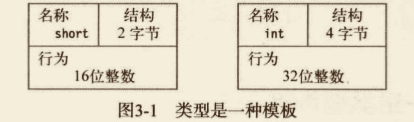

上图阐明了 short 类型和 int 类型的组成元素。

#### 实例化类型

从某个类型模版创建实际的对象，称为实例化该类型。

- 通过实例化类型而创建的对象被称为类型的对象或类型的实例。
- **在 C# 程序中，每个数据项都是某种类型的实例**。这些类型可以是语言自带的，可以是 BCL 或其他库提供的，也可以是程序员定义的。


#### 数据成员和函数成员

**像 short、int 和 long 等这样的类型称为简单类型**。这种类型只能存储一个数据项。
其他的类型可以存储多个数据项。比如数组（array）类型就可以存储多个同类型的数据项。

##### 成员的类别

然而另外一些类型可以包含许多不同类型的数据项。这些类型中的数据项个体称为成员，并且与数组中使用数字来引用成员不同，这些成员有独特的名称。

有两种成员：数据成员和函数成员。

- 数据成员：保存了与这个类的对象或作为一个整体的类相关的数据。
- 函数成员：执行代码。函数成员定义类型的行为。

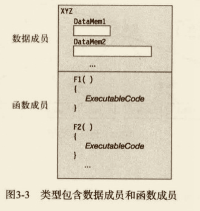

图 3-3 列出了类型 XYZ 的一些数据成员和函数成员。

#### 预定义类型

C# 提供了 16 种预定义类型，其中包括 13 种简单类型和 3 种非简单类型。

所有预定义类型的名称都由全小写的字母组成。预定义的简单类型包括以下 3 种。

- 11 种数值类型。
  - 不同长度的有符号和无符号整数类型。
  - 浮点数类型 float 和 double。
  - 一种称为 decimal 的高精度小数类型。与 float 和 double 不同，decimal 类型可以准确地表示分数。decimal 类型常用于货币的计算。
- 一种 Unicode 字符类型 char。
- 一种布尔类型 bool。bool 类型表示布尔值并且必须为 true 或 false。

3 种非简单类型如下。

- string，它是一个 Unicode 字符数组。
- object，它是所有其他类型的基类。
- dynmaic，使用动态语言编写的程序集时使用。


#### 用户定义类型

除了 C# 提供的 16 种预定义类型，还可以创建自己的用户定义类型。有 6 种类型可以由用户自己创建，它们是：

- 类类型（class）；
- 结构类型（struct）；
- 数组类型（array）；
- 枚举类型（enum）；
- 委托类型（delegate）；
- 接口类型（interface）；

类型通过类型声明创建，类型声明包含以下信息：

- 要创建的类型的种类；
- 新类型的名称；
- 对类型中每个成员的声明（名称和规格）。array 和 delegate 除外，它们不含有命名成员。

一旦声明了类型，就可以创建和使用这种类型的对象，就像它们是预定义类型一样。


#### 栈和堆

##### 栈

栈是一个内存数组，是一个 LIFO（Last-In-First）的数据结构。栈存储几种类型的数据：

- 某些类型变量的值；
- 程序当前执行的环境；
- 传递给方法的参数。


##### 堆

堆是一块内存区域，在堆里可以分配大块的内存用于存储某类型的数据对象。与栈不同，堆里的内存能够以任意顺序存入和移除。
虽然程序可以在堆里保存数据，但是不能显示删除它们。CLR 的自动 GC（Garbage Collector，垃圾收集器）在判断出程序的代码将不会再访问某数据项时，自动清除无主的堆对象。

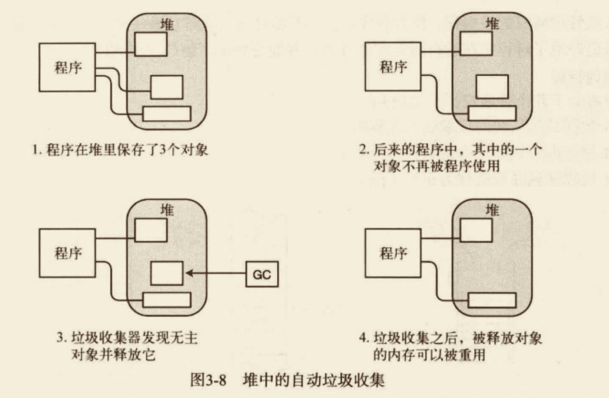

#### 值类型和引用类型

数据项的类型定义了存储数据需要的内存大小及组成该类型的数据成员。类型还决定了对象在内存中的存储位置——栈或堆。

类型被分为两种：值类型和引用类型，这两种类型的对象在内存中的存储方式不同。

- 值类型只需要一段单独的内存，用于存储实际的数据。
- 引用类型需要两段内存。
  - 第一段存储实际的数据，它总是位于堆中。
  - 第二段是一个引用，指向数据在堆中的存放位置。

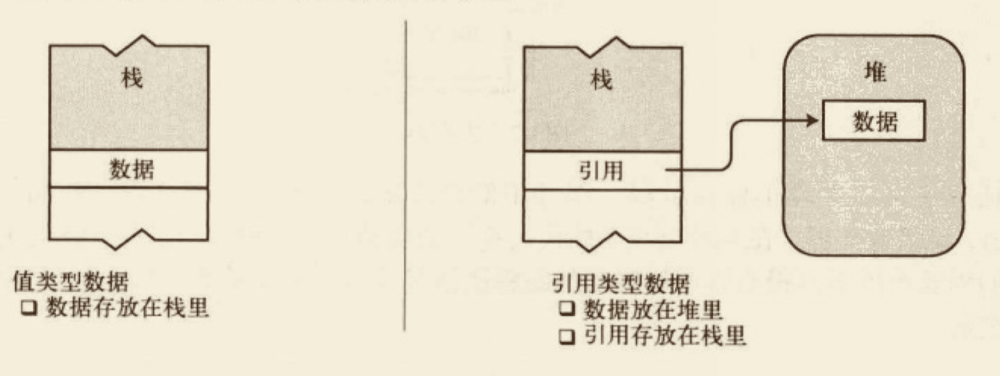

##### 存储引用类型对象的成员

- 引用对象的数据部分始终存放在堆里。
- 值类型对象，或引用类型数据的引用部分可以放在堆里，也可以放在栈里，这依赖于实际环境。


- 尽管成员 A 是值类型，但它也是 MyType 实例数据的一部分，因此和对象的数据一起被存放在堆里。
- 成员 B 是引用类型，所以它的数据部分会始终存放在堆里。不同的是，它的引用部分也被存放在堆里。

##### C# 类型分类


#### 变量

一种多用途的编程语言必须允许程序存取数据，而这正是通过变量实现的。

- 变量是一个名称，表示程序执行时存储在内存中的数据。
- C# 提供了 4 种变量。
  - 本地变量，在方法的作用域保存临时数据，不是类型的成员
  - 字段，保存和类型或类型实例相关的数据，是类型的成员
  - 参数
  - 数组元素

##### 变量声明

变量在使用之前必须声明。变量声明定义了变量，并完成了两件事：

- 给变量命名，并为它关联一种类型。
- 让编译器为它分配一块内存。

```cs
int var2;
```

除声明变量的名称和类型以外，声明还能把它的内存初始化为一个明确的值。

```cs
int var2 = 17;
```

无初始化语句的本地变量有一个未定义的值，在未赋值之前不能使用。试图使用未定义的本地变量会导致编译器产生一条错误信息。

##### 自动初始化

一些类型的变量如果在声明时没有被初始化，那么就会被自动设为默认值，而另一些却不能。

##### 多变量声明

##### 使用变量的值

#### 静态类型和 dynmaic 关键字

每一个变量都包含变量类型，这样编译器就可以确定运行时需要的内存总量以及哪些部分应该存在栈上，哪些部分应该存在堆上。变量的类型在编译的时候确定并且运行时不能修改，这叫做静态类型。

但是不是所有的语言都是静态类型的，诸如 IronPython 和 IronRuby 之类的脚本语言是动态类型的。也就是说，变量的类型直到运行时才能被解析。C# 提供 dynamic ，代表一个特定的、实际的 C# 类型，它知道如何在运行时解析自身。

在编译时，编译器不会对 dynamic 类型的变量进行类型检查。

#### 可空类型

### 类的基本概念

当你定义一个类时，你定义了一个数据类型的蓝图。这实际上并没有定义任何的数据，但它定义了类的名称意味着什么，也就是说，类的对象由什么组成及在这个对象上可执行什么操作。对象是类的实例。构成类的方法和变量成为类的成员。

#### 类的概述

##### 类是一种活动的数据结构

类是一个能存储数据并执行代码的数据结构。它包含数据成员和函数成员。

- 数据成员，它存储与类或类的实例相关的数据。数据成员通常模拟该类所表示的现实世界事物的特性。
- 函数成员，它执行代码。通常会模拟所表示的现实世界事物的功能和操作。

#### 声明类

类的定义是以关键字 class 开始，后跟类的名称。类的主体，包含在一对花括号内。下面是类定义的一般形式：

```cs
<access specifier> class  class_name
{
    // member variables
    <access specifier> <data type> variable1;
    <access specifier> <data type> variable2;
    ...
    <access specifier> <data type> variableN;
    // member methods
    <access specifier> <return type> method1(parameter_list)
    {
        // method body
    }
    <access specifier> <return type> method2(parameter_list)
    {
        // method body
    }
    ...
    <access specifier> <return type> methodN(parameter_list)
    {
        // method body
    }
}
```

请注意：

- 访问标识符 `<access specifier>` 指定了对类及其成员的访问规则。如果没有指定，则使用默认的访问标识符。类的默认访问标识符是 internal，成员的默认访问标识符是 private。
- 数据类型 `<data type>` 指定了变量的类型，返回类型 `<return type>` 指定了返回的方法返回的数据类型。
- 如果要访问类的成员，你要使用点`（.）`运算符。
- 点运算符链接了对象的名称和成员的名称。

#### 类成员

##### 字段

##### 方法

#### 创建变量和类的实例

类的声明只是用于创建类的实例的蓝图。一旦类被声明，就可以创建类的实例。

#### 为数据分配内存

声明类类型的变量所分配的内存是用来保存引用的，而不是用来保存类对象实际数据的。要为实际数据分配内存，需要使用 `new` 运算符。

- new 运算符为任意指定类型的实例分配并初始化内存。

#### 实例成员

类成员相当于蓝图，通过这个蓝图想创建多少个类的实例都可以。

- 实例成员 类的每个实例都是不同的实体，它们都有自己的一组数据成员，不同于同一类的其他实例。因为这些数据成员都和类的实例相关，所以被称为实例成员。
- 静态成员 实例成员是默认类型，但也可以声明与类而不是与实例相关的成员，称为静态成员。

#### 访问修饰符

- 私有的（private）
- 公有的（public）
- 受保护的（protected）
- 内部的（internal）
- 受保护内部（protected internal）

##### 私有成员和公有访问

私有成员只能从声明它的类的内部访问，其他的类不能看见或访问它们。


```cs
using System;
// 公有访问和私有访问
//
namespace BoxApplication2
{
    class Box
    {
        private double length; // 长度
        private double breadth; // 宽度
        private double height; // 高度

        public void setLength(double len)
        {
            length = len;

        }

        public void setBreadth(double bre)
        {
            breadth = bre;

        }

        public void setHeight(double hei)
        {
            height = hei;

        }

        public double getVolume()
        {
            return length * breadth * height;

        }
    }
    class Boxtester
    {
        public static void main()
        {

            Box Box1 = new Box();
            Box Box2 = new Box();
            double volume; // 默认为 0

            // Box1 详述
            Box1.setLength(6.0);
            Box1.setBreadth(7.0);
            Box1.setHeight(5.0);

            // Box2 详述
            Box2.setLength(10.0);
            Box2.setBreadth(12.0);
            Box2.setHeight(13.0);

            // Box1 的体积
            volume = Box1.getVolume();
            Console.WriteLine("Box1 的体积： {0}", volume);

            // Box2 的体积
            volume = Box2.getVolume();
            Console.WriteLine("Box2 的体积： {0}", volume);
            Console.ReadKey();
        }
    }

}
```

##### 从类的外部访问成员

要从类的外部访问实例成员，必须包括变量名称和成员名称，中间用句点（.）分隔。这称为点运算符（dot-syntax notation）。

```cs
DaysTemp myDt = new DaysTemp(); // 创建类的对象
float fValue = myDt.Average(); // 从外部访问
```

##### 综合例子

```cs
using System;
namespace BoxApplication
{
    class Box
    {
        // 声明字段
        public double length; // 长度
        public double breadth; // 宽度
        public double height; // 高度

    }
    class Boxtester
    {
        public static void main()
        {

            Box Box1 = new Box();
            Box Box2 = new Box();
            double volume; // 默认为 0

            // Box1 详述
            Box1.length = 6.0;
            Box1.breadth = 7.0;
            Box1.height = 5.0;

            // Box2 详述
            Box2.length = 10.0;
            Box2.breadth = 12.0;
            Box2.height = 13.0;

            // Box1 的体积
            volume = Box1.length * Box1.breadth * Box1.height;
            Console.WriteLine("Box1 的体积： {0}", volume);

            // Box2 的体积
            volume = Box2.length * Box2.breadth * Box2.height;
            Console.WriteLine("Box2 的体积： {0}", volume);
            Console.ReadKey();
        }
    }

}
```

### 方法

#### 方法内部的执行

方法体是一个块，是大括号括起的语句序列。块可以包含以下项目：

- 本地变量；
- 控制流结构；
- 方法调用；
- 内嵌的块。

#### 本地变量

字段通常保存和对象状态有关的数据，而创建本地变量经常是用于保存本地或临时的计算数据。

- 本地变量的存在性和生存期仅限于创建它的块及其内嵌的块。
  - 它从声明它那一点开始存在。
  - 它在块完成执行时结束存在。
- 可以在方法体内任意位置声明本地变量，但必须在使用它们前声明。


##### 类型判断和 var 关键字

var 关键字

##### 嵌套在块中的本地变量

注意：在 C# 中不管嵌套级别如何，都不能在第一个名称的有效范围内声明另一个同名的本地变量。


#### 本地常量

- 常量在声明时必须初始化。
- 常量在声明后不能改变。

常量的语法与字段或变量的声明相同，除了下面内容。

- 在类型之前增加关键字 const。
- 必须有初始化语句，初始化值必须在编译期决定，通常是一个预定义的简单类型或由其组成的表达式。它还可以是 null 引用，但不能是某对象的引用，因为对象的引用是在运行时决定的。

#### 方法调用

- 当前方法的执行在调用点被挂起；
- 控制转移到被调用方法的开始；
- 被调用方法执行直到完成；
- 控制回到发起调用的方法。


#### 返回值

方法可以向调用代码返回一个值。返回的值被插入到调用代码中发起调用的表达式所在的位置。

- 要返回值，方法必须在方法名前面声明一个类型。
- 如果方法不返回值，它必须声明 void 返回类型。

#### 参数

##### 形参

形参是本地变量，它声明在方法的参数列表中，而不是在方法体中。

```cs
public void PrintSum(int x, float y) {
    ...
}
```

- 因为形参是变量，所以它们有类型和名称，并能被写入和读取。
- 和方法中的其他本地变量不同，参数在方法体的外面定义并在方法开始之前初始化（但有一种类型除外，称为输出参数）。
- 参数列表中可以有任意数目的形参声明，而且声明必须用逗号隔开。

```cs
public void PrintSum(int x, float y) {
  int sum = x + y;
}
```

##### 实参

当代码调用一个方法时，形参的值必须在代码开始执行之前被初始化。

- 用于初始化形参的表达式或变量称作实参（actual parameter，有时也称 argument）。
- 实参位于方法调用的参数列表中。
- 每一个实参必须与对应形参的类型相匹配，或是编译器必须能够把实参隐式转换为那个类型。

当方法被调用时，每个实参的值都被用于初始化相应的形参，方法体随后被执行。


实参的数量必须与形参的数量一致，并且每个实参的类型也必须和所对应的形参类型一致。这种形式的参数叫做位置参数。

#### 值参数

值参数是把实参的值复制给形参。使用值参数，通过将实参的值复制到形参的方式把数据传递给方法。方法被调用时，系统做如下操作：

- 在栈中为形参分配空间。
- 将实参的值复制给形参。

```cs
using System;
namespace classdemo
{
    class MyClass
    {
        public int Val = 20;

    }
    class MainClass
    {
        static void MyMethod(MyClass f1, int f2)
        {
            f1.Val += 5;
            f2 += 5;
            Console.WriteLine("f1.Val: {0}, f2: {1}", f1.Val
            , f2);

        }
        public static void Main(string[] args)
        {
            MyClass a1 = new MyClass();
            int a2 = 10;
            MyMethod(a1, a2); // 复制 a1 引用，复制 a2 的值
            Console.WriteLine("f1.Val: {0}, f2: {1}", a1.Val, a2);
        }
    }
}

```

- 在方法被调用前，用作实参的变量 a2 已经在栈里了。
- 在方法开始时，系统在栈中为形参分配空间，并从实参复制值。
  - 因为 a1 是引用类型的，所以引用被复制，结果实参和形参都引用堆中的同一个对象。
  - 因为 a2 是值类型的，所以值被复制，产生了一个独立的数据项。
- 在方法的结尾，f2 和对象 f1 的字段都被加上了 5。
  - 方法执行后，形参从栈中弹出。
  - a2，值类型，它的值不受方法行为的影响。

#### 引用参数

- 使用引用参数时，必须在方法的声明中和调用中都使用 `ref` 修饰符。
- 实参必须是变量，在用作实参前必须被赋值。如果是引用类型变量，可以赋值为一个引用或 null。

```cs
using System;
namespace MyClass
{
    public class MyClass2
    {
        public int Val = 20;

    }
    class Program2
    {
        static void MyMethod(ref MyClass2 f1, ref int f2)
        {
            f1.Val += 5;
            f2 += 5;
            Console.WriteLine("f1.Val: {0}, f2: {1}", f1.Val
            , f2);

        }
        public static void main()
        {
            MyClass2 a1 = new MyClass2();
            int a2 = 10;
            MyMethod(ref a1, ref a2); // 变量 f1 和 a1 引用相同的内存位置，a2 和 f2 引用相同的内存位置。
            Console.WriteLine("引用参数：f1.Val: {0}, f2: {1}", a1.Val, a2);
        }
    }
}

```

注意：记得要在方法的声明和调用上都使用 ref 关键字。

对于值参数，系统在栈上为形参分配内存。相反，引用参数具有以下特征：

- 不会为形参在栈上分配内存。
- 实际情况是，形参的参数名将作为实参变量的别名，指向相同的内存位置。

由于形参名和实参名的行为就好像指向相同的内存位置，所以在方法的执行过程中对形参作的任何改变在方法完成后依然有效（表现在实参变量上。）

##### 引用类型作为值参数和引用参数

- 将引用类型作为值参数传递：如果在方法内创建一个新对象并赋值给形参，将切断形参与实参之间的关联，并且在方法调用结束后，新对象也不复存在。
- 将引用类型作为引用参数传递：

作为值参数：

```cs
// 将引用类型作为值参数传递
using System;
namespace MyClass
{
    public class MyClass3
    {
        public int Val = 20;

    }
    class Program3
    {
        static void RefAsParameter(MyClass3 f1)
        {
            f1.Val = 50;
            Console.WriteLine("After member assignment: {0}", f1.Val);  // 50
            f1 = new MyClass3();
            Console.WriteLine("After new object creation: {0}", f1.Val); // 20

        }
        public static void main()
        {
            MyClass3 a1 = new MyClass3();
            Console.WriteLine("Before method call: {0}", a1.Val); // 20
            RefAsParameter(a1); // 复制 a1 引用
            Console.WriteLine("After method call: {0}", a1.Val); // 50
        }
    }
}
```

作为引用参数：除了方法声明和方法调用要使用 `ref` 关键字外，其他代码与上面相同。

```cs
// 将引用类型作为引用参数传递
using System;
namespace MyClass
{
    public class MyClass4
    {
        public int Val = 20;

    }
    class Program4
    {
        static void RefAsParameter(ref MyClass4 f1)
        {
            f1.Val = 50;
            Console.WriteLine("After member assignment: {0}", f1.Val); // 50
            f1 = new MyClass4();
            Console.WriteLine("After new object creation: {0}", f1.Val); // 20

        }
        public static void main()
        {
            MyClass4 a1 = new MyClass4();
            Console.WriteLine("Before method call: {0}", a1.Val); // 20
            RefAsParameter(ref a1); // 复制 a1 引用
            Console.WriteLine("After method call: {0}", a1.Val); // 20
        }
    }
}

```

引用参数的行为就像是将实参作为形参的别名。

#### 输出参数

输出参数用于从方法体内把数据传出到调用代码，它们的行为与引用参数非常类似。

- 必须在声明和调用中都使用修饰符。输出参数的修饰法是 `out`。
- 和引用参数相似，实参必须是变量，而不是其他类型的表达式。这是有道理的，因为方法需要内存位置保存返回值。

```cs
// 输出参数
using System;
namespace MyClass
{
    public class MyClass5
    {
        public int Val = 20;

    }
    class Program5
    {
        static void MyMethod(out MyClass4 f1, out int f2)
        {
            f1 = new MyClass4(); // 创建一个类变量
            f1.Val = 25;
            f2 = 15;
        }
        public static void main()
        {
            MyClass4 a1 = null;
            int a2;
            MyMethod(out a1, out a2);
            Console.WriteLine("After method call: {0}, {1}", a1.Val, a2);
        }
    }
}
```

对于输出参数，形参就好像是实参的别名一样，但是还有一个需求，那就是它必须在方法内进行赋值。

#### 参数数组

参数数组允许零个或多个实参对应一个特殊的形参。

- 在一个参数列表中只能有一个参数数组。
- 由参数数组表示的所有参数都必须具有相同的类型。

声明一个参数数组必须做的事如下。

- 在数据类型前使用 `params` 修饰符。
- 在数据类型后放置一组空的方括号。

##### 方法调用

```cs
// 参数数组
using System;
namespace MyClass
{
    class MyClass6
    {
        public void listInts(params int[] inVals)
        {
            if ((inVals != null) && (inVals.Length != 0) ) {
                for (int i = 0; i < inVals.Length; i++) // 处理数组
                {
                    inVals[i] = inVals[i] * 10;
                    Console.WriteLine("{0}", inVals[i]); // 显示新值

                }

            }

        }

    }
    class Program6
    {
        public static void main()
        {
            int first = 5;
            int second = 6;
            int third = 7;
            MyClass6 mc = new MyClass6();
            mc.listInts(first, second, third);
            Console.WriteLine("After method call: {0}, {1}, {2}", first, second, third);
        }
    }
}

```

在使用一个为参数数组分离的调用时，编译器做下面的事：

- 接受实参列表，用它们在堆中创建并初始化一个数组。
- 把数组的引用保存到栈中的数组。
- 如果在对应的形参数组的位置没有实参，编译器会创建一个有零个元素的数组来使用。

##### 用数组作实参

也可以在方法调用之前创建并组装一个数组，把单一的数组变量作为实参传递。这种情况下，编译器使用你的数组而不是创建一个。

##### 参数类型总结


#### 方法重载

一个类中可以有一个以上的方法具有相同的名称，这叫做方法重载（method overload）。使用相同名称的每个方法必须有一个和其他方法相同的签名（signature）。

- 方法的签名由下列信息组成：
  - 方法的名称；
  - 参数的数目；
  - 参数的数据类型和顺序；
  - 参数修饰符。
- 返回类型不是签名的一部分。
- 请注意，形参的名称也不是签名的一部分。

#### 命名参数

至今我们所有用到的参数都是位置参数，也就是说每一个实参的位置都必须与相应的形参位置一一对应。
此外，C# 还允许我们使用命名参数（named parameter）。只要显式指定参数的名字，就可以以任意顺序在方法调用中列出实参。

- 方法的声明没有什么不一样。形参已经有名字了。
- 不过在方法调用的时候，形参的名字后面跟着冒号和实际的参数值或表达式。

```cs
class MyClass {
    double GetCylinderVolume(double radius, double height) {
        return 3.1416 * radius * radius * height;
    }
    static void Main(string[] args) {
        MyClass mc = new MyClass();
        double volume;
        volume = mc.GetCylinderVolume(3.0, 4.0);
        volume = mc.GetCylinderVolume(radius: 3.0, height: 4.0); // 更多信息
    }
}
```

#### 可选参数

C# 还允许可选参数（optional parameter）。所谓可选参数就是我们可以在调用方法的时候包含这个参数，也可以省略它。

对于可选参数的声明，我们需要知道如下几种重要事项：

- 不是所有的参数都可作为可选参数。
  - 只要值类型的默认值在编译的时候可以确定，就可以使用值类型作为可选参数。
  - 只有默认值是 null 的时候，引用类型才可以作为可选参数来使用。


- 所有必填参数（required parameter）必须在可选参数声明之前声明。如果有 parameter 参数，必须在所有可选参数之后声明。

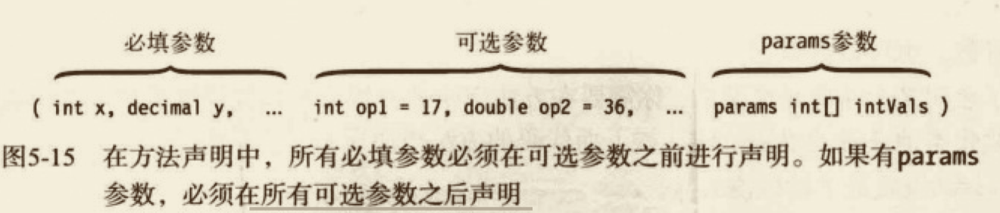

注意：

- 不能随意省略可选参数的组合，避免使用哪些可选参数不明确。你可以省略最后 n 个可选参数，但是不可以随意选择省略任意的可选参数，省略必须从最后开始。
- 如果需要随意省略可选参数列表中的可选参数，而不是从列表的最后开始，那么必须使用可选参数的名字来消除赋值的歧义。

#### 栈桢（调用栈）

在调用方法的时候，内存从栈的顶部开始分配，保存和方法关联的一些数据项。这块内存叫做方法的栈帧（stack frame）。

- 栈桢的内存保存如下内容：
  - 返回地址，也就是方法退出的时候继续执行的位置；
  - 这些参数分配的内存，也就是方法的值参数，或者还可能是参数数组（如果有的话）。
  - 各种和方法调用相关的其他数据管理项。
- 在方法调用时，整个栈桢都会压入栈。
- 在方法退出的时候，整个栈帧都会压入栈。弹出栈帧有的时候也叫做栈展开（unwind）。


#### 递归

除了调用其他方法，方法也可以调用自身。这叫做递归。递归会产生很优雅的代码。调用方法自身的机制和调用其他方法其实是完全一样的。都是为每一次调用把新的栈帧压入栈顶。

### 深入理解类

#### 类成员


#### 成员修饰符的顺序

类成员声明语句由下列部分组成：核心声明、一组可选的修饰符和一组可选的特性（attribute）。用于描述这个结构的语法如下：

【特性】【修饰符】核心声明

- 修饰符
  - 如果有修饰符，必须放在核心声明之前。
  - 如果有多个修饰符，可以是任意顺序。
- 特性
  - 如果有特性，必须放在修饰符和核心声明之前。
  - 如果有多个特性，可以是任意顺序。

#### 实例类成员

类的每个实例拥有自己的各个类成员的副本，这些成员称为实例成员。改变一个实例字段的值不会影响任何其他实例中成员的值。

#### 静态字段

除了实例字段，类还可以拥有静态字段。

- 静态字段被类的所有实例共享，所有实例都访问同一内存位置。因此，如果该内存位置的值被一个实例改变了，这种改变对所有的实例都可见。
- 可以使用 `static` 修饰符将字段声明为静态。

```cs
class D {
    int Mem1; // 实例字段
    static int Mem2; // 静态字段
}
```

注意：静态成员 Mem2 是与所有实例的存储分开保存的，所以不能通过实例名字访问该静态成员。

#### 从类的外部访问静态成员

在前一章中，我们可以使用点运算符可以从类的外部访问 public 实例成员。点运算符由实例名、点和成员组成。

就像实例成员，静态成员也可以使用点运算符从类的外部访问。但因为没有实例，所以必须使用类名。

```cs
// 静态字段
using System;
namespace MyClass
{
    class MyClass7
    {
        int Mem1; // 实例字段
        public static int Mem2;  // 静态字段
    }
    class Program7
    {
        public static void main()
        {

            MyClass7 d1 = new MyClass7();
            MyClass7 d2 = new MyClass7();
            MyClass7.Mem2 = 10;
            Console.WriteLine("After method call: {0}", MyClass7.Mem2);
        }
    }
}
```

##### 静态成员的生存期

静态成员的生命期与实例成员的不同。

- 之前我们已经看到了，只有实例创建之后才产生实例成员，在实例销毁之后实例成员也就不存在了。
- 但是即使类没有实例，也存在静态成员，并且可以访问。

```cs
using System;
namespace MyClass
{
    class MyClass7
    {
        int Mem1; // 实例字段
        public static int Mem2;  // 静态字段
    }
    class Program7
    {
        public static void main()
        {

            MyClass7.Mem2 = 10;
            Console.WriteLine("After method call: {0}", MyClass7.Mem2);
        }
    }
}
```

#### 静态函数成员

除了静态字段，还有静态函数成员。

- 如同静态字段，静态函数成员独立于任何实例。即使没有类的实例，仍然可以调用静态方法。
- 静态函数成员不能访问实例成员。然而，它们能访问其他静态成员。


#### 其他静态成员


#### 成员常量

成员变量类似前一章所述的本地常量，只是它们被声明在类声明中而不是方法内。

```cs
class MyClass {
    const int IntVal = 100;
}
```

与 C 和 C++ 不同，在 C# 中没有全局变量。每个常量都必须声明在类型内。

#### 常量与静态量

然而，成员常量比本地常量更有趣，因为它们表现得像静态值。它们对类的每个实例都是“可见的”，而且即使没有类的实例也可以使用。与真正的静态量不同，常量没有自己的存储位置，而且是编译时被编译器替换。

```cs
// 静态字段
using System;
namespace MyClass
{
    class MyClass7
    {
        int Mem1; // 实例字段
        public static int Mem2;  // 静态字段
        public const int intVal = 100;
    }
    class Program7
    {
        public static void main()
        {

            MyClass7.Mem2 = 10; // 可以访问静态字段
            Console.WriteLine("After method call: {0}, {1}", MyClass7.Mem2, MyClass7.intVal); // 10 100
        }
    }
}
```

#### 属性

属性是代表类的实例或类中的一个数据项的成员。使用属性看起来非常像写入或读取一个字段，语法是相同的。从语法上无法区分它们。

```cs
MyClass mc = new MyClass();
mc.MyField = 5; // 给字段赋值
mc.MyProperty = 10; // 给属性赋值
```

与字段类似，属性有如下特征：

- 它是命名的类成员。
- 它有类型。
- 它可以被赋值和读取。

**然而与字段不同，属性是一个函数成员。**

- 它不为数据存储分配内存。
- 它执行代码。

属性是指定的一组两个匹配的、称为访问器的方法。

- set 访问器为属性赋值。
- get 访问器从属性获取值。

```cs
int Value {
    set {
        SetAccessorCode
    }
    get {
        GetAccessorCode
    }
}
```

##### 属性声明和访问器

set 和 get 访问器有预定义的语法。可以把 set 访问器想象成一个方法，带有单一的参数“设置”属性的值。get 访问器没有参数并从属性返回一个值。

- set 访问器总是：
  - 拥有一个单独的、隐式的值参，名称为 `value`，与属性的类型相同；
  - 拥有一个返回类型的 `void`。
- get 访问器总是：
  - 没有参数；
  - 拥有一个与属性类型相同的返回类型。

set 访问器中的隐式参数 `value` 是一个普通的值参。和其他值参一样，可以用它发送数据到方法体或这种情况中的访问器块。在块的内部，可以像普通变量那样使用 value，包括对它赋值。

访问器的其他重点如下：

- get 访问器的所有执行路径必须包含一条 `return` 语句，返回一个属性的值。
- 访问器 `set` 和 `get` 可以以任何顺序声明，并且，除了这两个访问器外在属性上不允许有其他方法。

##### 使用属性

```cs
// 属性
using System;
namespace MyClass
{
  class MyClass8
  {
    private int TheRealValue; // 后备字段：内存分配
    public int MyValue // 属性：未分配内存
    {
      set
      {
        TheRealValue = value;
      }
      get
      {
        return TheRealValue;
      }
    }
  }
  class Program8
  {
    public static void main()
    {

      MyClass8 mc = new MyClass8();
      mc.MyValue = 5; // 赋值：隐式调用 set 方法
      int test = mc.MyValue; // 表达式：隐式调用 get 方法
      Console.WriteLine("After Property set: {0}, {1}", mc.MyValue, test);
    }
  }
}
```

##### 属性和关联字段

（PS：这个属性的作用跟 vue 的计算属性的作用和相似。）属性常和字段关联，如上面的一节。一种常见的方式是在类中将字段声明为 `private` 以封装该字段，并声明一个 `public` 属性来控制从类的外部对该字段的访问。和属性关联的字段被称为后备字段或后备存储。

##### 执行其他计算

属性访问符并不局限于仅仅对关联的后备字段传进传出数据。访问器 get 和 set 能执行任何计算，或不执行任何计算。唯一必须的行为是 get 访问器需要返回一个属性类型的值。

```cs
// 属性
using System;
namespace MyClass
{
  class MyClass8
  {
    private int TheRealValue; // 后备字段：内存分配
    public int MyValue // 属性：未分配内存
    {
      set
      {
        TheRealValue = value > 100 ? 100 : value;
      }
      get
      {
        return TheRealValue;
      }
    }
  }
  class Program8
  {
    public static void main()
    {

      MyClass8 mc = new MyClass8();
      mc.MyValue = 5; // 赋值：隐式调用 set 方法
      int test = mc.MyValue; // 表达式：隐式调用 get 方法
      Console.WriteLine("After Property set: {0}, {1}", mc.MyValue, test);
    }
  }
}
```

##### 只读和只写属性

要想不定义属性的某个访问器，可以忽略访问器的声明。

- 只有 get 访问器的属性称为只读属性。只读属性是一种安全的，把一项数据从类或类的实例中传出，而不允许太多访问方法。
- 只有 set 访问器的属性称为只写属性。只写属性是一种安全的，把一项数据从类的外部传入类，而不允许太多访问的方法。
- 两个访问器中至少有一个必须定义，否则编译器会产生一条错误信息。

##### 属性与公共字段

##### 自动实现属性

##### 静态属性

#### 实例构造函数

实例构造函数是一个特殊的方法，它在创建类的每个新实例时执行。

- 构造函数用于初始化类实例的状态。
- 如果希望从类的外部创建类的实例，需要将构造函数声明为 `public`。

```cs
class MyClass {
  public MyClass() { // 没有返回类型
  }
}
```

- 构造函数的名称和类名相同。
- 构造函数不能有返回值。

##### 带参数的构造函数

构造函数在下列方法和其他方法相似。

- 构造函数可以带参数。参数的语法和其他方法完全相同。
- 构造函数可以被重载。

在使用创建对象表达式创建类的新实例时，要使用 new 运算符，后面跟着类的某个构造函数。new 运算符使用该构造函数创建类的实例。

```cs
// 实例构造函数
using System;
namespace MyClass
{
  class Class10
  {
    int Id;
    string Name;
    public Class10()
    {
      Id = 28;
      Name = "Jecyu";
    }
    public Class10(int Val) // 设置 public 在类的外部也能创建类的实例
    {
      Id = Val;
      Name = "Jecyu";
    }
    public Class10(String name)
    {
      Name = name;
    }
    public void SoundOff()
    {
      Console.WriteLine("Name {0}, Id {1}", Name, Id);
    }
  }
  class Program10
  {
    public static void main()
    {

      Class10 mc1 = new Class10();
      Class10 mc2 = new Class10(7);
      Class10 mc3 = new Class10("linjy");
      mc1.SoundOff();
      mc2.SoundOff();
      mc3.SoundOff();

    }
  }
}

```

##### 默认构造函数

如果在类的声明中没有显式地提供实例构造函数，那么编译器会提供一个隐式的默认构造函数，它有以下特征：

- 没有参数。
- 方法体为空。

如果你为类声明了任何构造函数，那么编译器就不会为该类定义默认构造函数。

- 因为已经至少有一个显式定义的构造函数，编译器不会创建任何额外的构造函数。
- 在 Main 中，试图使用不带参数的构造函数创建新的实例。因为没有无参数的构造函数，所以编译器会产生一条错误信息。

#### 静态构造函数

构造函数也可以声明为 `static`。实例构造函数初始化类的每个新实例，而 static 构造函数初始化类级别的项。通常，静态构造函数初始化类的静态字段。

- 初始化类级别的项。
  - 在引用任何静态成员之前。
  - 在创建类的任何实例之前。
- 静态构造函数在以下方面与实例构造函数相似。
  - 静态构造函数的名称必须和类名相同。
  - 构造函数不能返回值。
- 静态构造函数在以下方面与实例构造函数不同。
  - 静态函数声明中使用 `static` 关键字。
  - 类只能有一个静态构造函数，而且不能带参数。
  - 静态构造函数不能有访问修饰符。

```cs
// 静态构造函数
using System;
namespace MyClass
{
  class RandomNumberClass
  {
    private static Random RandomKey; // 私有静态字段
    static RandomNumberClass() // 静态构造函数
    {
      RandomKey = new Random(); // 初始化 RandomKey
    }
    public int GetRandomNumber()
    {
      return RandomKey.Next();
    }
  }
  class Program11
  {
    public static void main()
    {

      RandomNumberClass mc1 = new RandomNumberClass();
      RandomNumberClass mc2 = new RandomNumberClass();

      Console.WriteLine("Next Random #: {0}", mc1.GetRandomNumber());
      Console.WriteLine("Next Random #: {0}", mc2.GetRandomNumber());
    }
  }
}

```

关于静态函数的其他重要内容。

- 类既可以有静态构造函数也可以有实例构造函数。
- 如同静态方法，静态构造函数不能访问所在类的实例成员，因此也不能使用 this 访问器。
- 不能从程序显式调用静态构造函数，系统会自动调用它们，在：
  - 类的任何实例被创建之前；
  - 类的任何静态成员被引用之前。

#### 对象初始化语句

在此之前的内容中你已经看到，对象创建表达式由关键字 `new` 后面跟着一个类构造函数及其参数列表组成。**对象初始化语句**扩展了创建语法，在表达式的尾部放置了一组成员初始化语句。这允许你在创建新的对象实例时，设置字段和属性的值。

该语法有两种形式，一种形式包括构造函数的参数列表，另一种不包括。

```bash
new TypeName  {FieldOrProp = InitExpr, FieldOrProp = InitExpr, ...}
new TypeName(ArgList)  {FieldOrProp = InitExpr, FieldOrProp = InitExpr, ...}
```

关于对象初始化语句要了解的重要内容如下：

- 创建对象的代码必须能够访问要初始化的字段和属性。例如，在下面的代码中，X，Y 必须设置 public 。
- 初始化发生在构造方法执行之后，因此在构造方法中设置的值可能会在之后对象初始化中重置为相同或不相同的值。

```cs
// 对象初始化语句
using System;
namespace MyClass
{
  class Point
  {
    public int X = 1;
    public int Y = 2;
  }
  class Program12
  {
    public static void main()
    {

      Point mc1 = new Point();
      Point mc2 = new Point { X = 5, Y = 6 };

      Console.WriteLine("Next Random #: {0}, {1}", mc1.X, mc1.Y); // 1，2
      Console.WriteLine("Next Random #: {0}, {1}", mc2.X, mc2.Y); // 5，6
    }
  }
}

```

#### 析构函数

析构函数（destructor）执行在类的实例被销毁之前需要的清理或释放非托管资源的行为。非托管资源是指通过 Win32 API 获得的文件句柄，或非托管模块。

#### readonly 修饰符

字段可以用 `readonly` 修饰符声明。其作用类似于将字段声明为 const，一旦值被设定就不能被改变。

- const 字段只能在字段的声明初始化语句中初始化，而 readonly 字段可以在下列任意位置设置它的值。
- const 字段的值必须在编译时决定，而 readonly 字段的值可以在运行时决定。这种增加的自由性允许你在不同的环境或不同的构造函数中设置不同的值。
- 它可以是实例字段，也可以是静态字段。
- 它在内存中有存储位置。

#### this 关键字

this 关键字在类中使用，是对当前实例的引用。它只能被用在下列类成员的代码块中。

- 实例构造函数。
- 实例方法。
- 属性和索引器的实例访问器。

很明显，因为静态成员不是实例的一部分，所以不能在任何静态函数成员的代码中使用 this 关键字。更适当地说，this 用于下列目的：

- 用于区分类的成员和本地变量或参数；
- 作为调用方法的实参。

```cs
// this 关键字
using System;
namespace MyClass
{
  class MyClass13
  {
    int Var1 = 10;
    public int ReturnMaxSum(int Var1)
    {
      return Var1 > this.Var1 ? Var1 : this.Var1;
    }
  }
  class Program13
  {
    public static void main()
    {

      MyClass13 mc = new MyClass13();
      Console.WriteLine("Max: {0}", mc.ReturnMaxSum(30));
      Console.WriteLine("Max: {0}", mc.ReturnMaxSum(5));

    }
  }
}

```

#### 索引器

##### 什么是索引器

索引器是一组 get 和 set 访问器，与属性类似。

##### 索引器和属性

索引器和属性有很多方面是相似的。
- 和属性一样，索引器不用分配内存来存储。
- 索引器和属性都主要用来访问其他数据成员，它们与这些成员关联，并为它们提供获取和设置访问。
  - 属性通常表示单独的数据成员。
  - 索引器通常表示多个数据成员。

说明：可以认为索引器是为类的多个数据成员提供 set 和 get 的属性。通过提供索引器，可以在许多可能的数据成员进行选择。索引器本身可以是任何类型，不仅仅是数值类型。

关于索引器，还有一些注意事项如下。
- 和属性一样，索引器可以只有一个访问器，也可以两个都有。
- 索引器总是实例成员，因此不能声明为 `static`。
- 和属性一样，实现 get 和 set 访问器的代码不必一定要关联到某个字段或属性。这段代码可以做任何事情或者什么也不做，只要 get 访问器返回某个指定类型的值即可。

##### 声明索引器

声明索引器的语法如下：
- 索引器没有名称。在名称的位置是关键字 this。
- 参数列表在参数中间。
- 参数列表中必须至少声明一个参数。

```cs
ReturnType this [Type param1, ...] {
  get {}
  set {}
}
```

##### 索引器的 set 访问器

当索引器被用于赋值时，set 访问器被调用，并接受两项数据。如下：
- 一个隐式参数，名称为 value，value 持有要保存的数据；
- 一个或更多索引参数，表示数据要保存到哪里。

在 set 的访问器中的代码必须检查索引参数，以确定数据应该存往何处，然后保存它。
- 它的返回类型为 void。
- 它使用的参数列表和索引器声明中的相同。
- 它有一个名称 value 的隐含参数，值参类型和索引类型相同。


##### 索引器的 get 访问器

当使用索引器获取值时，可以通过一个或多个索引参数，确定它表示的是哪个字段，并返回该字段的值。

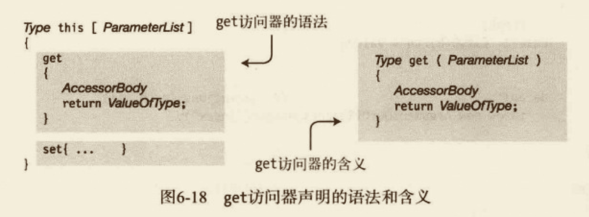

##### 关于索引器的补充

和属性一样，不能显式调用 get 和 set 访问器。取而代之，当索引器用在表达式取值时，将自动调用 get 访问器。当使用赋值语句对索引器赋值时，将自动调用 set 访问器。

##### 一个示例

```cs
// 索引器
using System;
namespace MyClass
{
  class Employee
  {
    public string LastName; // 调用字段 0
    public string FirstName; // 调用字段 1
    public string CityOfBirth; // 调用字段 2
    public string this[int index]
    {
      set
      {
        switch (index)
        {
          case 0:
            LastName = value;
            break;
          case 1:
            FirstName = value;
            break;
          case 2:
            CityOfBirth = value;
            break;
          default:
            throw new ArgumentOutOfRangeException(nameof(index));
        }
      }
      get
      {
        switch (index)
        {
          case 0: return LastName;
          case 1: return FirstName;
          case 2: return CityOfBirth;
          default: throw new ArgumentOutOfRangeException(nameof(index));
        }
      }
    }
  }
  class Program14
  {
    public static void main()
    {

      Employee mc = new Employee();
      mc[0] = "Lin";
      mc[1] = "Jecyu";
      mc[2] = "WC";
      Console.WriteLine("Person: {0}, {1}, {2}", mc[0], mc[1], mc[2]);
    }
  }
}
```

##### 索引器重载

只要索引器的参数列表不同，类就可以有任意多个索引器。这叫做索引器重载，因为所有的索引器都有相同的“名称”：this 访问引用。

```cs
class MyClass { 
  public string this [int index] {
    get {...}
    set {...}
  }
  public string this [int index1, int index2] {
    get {...}
    set {...}
  }
  public int this [float index] {
    get {...}
    set {...}
  }
}
```

请记住，类中重载的索引器必须有不同的参数列表。

#### 访问器的访问修饰符

默认情况下，成员的两个访问器有自身相同的访问级别。也就是说，如果一个属性有 public 级别，那么它的两个访问器都有同样的访问级别，对索引也一样。

不过，你可以为两个访问器分配不同的访问级别。如下代码为 set 访问器声明为 `private`，为 get 访问器声明为 public。注意，在这段代码中，尽管可以从类的外部读取属性，但却只能在类的内部设置它。这是一个非常重要的封装工具。

```cs
class Person {
  public string Name {
    get;
    private set;
  }
  public Person(string name) {
    Name = name;
  }
}

class Program {
  static public void Main() {
    Person p = new Person("Jecyu");
    Console.WriteLine("Person's name is {0}", p.Name)
  }
}
```

访问器的访问修饰符有几个限制：
- 仅当成员（属性或索引器）既有 get 访问器也有 set 访问器时，其访问器才能有访问修饰符。
- 虽然两个访问器都必须出现，但它们中只能有一个访问修饰符。
- 访问器的访问修饰符必须比成员的访问级别有更严格的限制性。

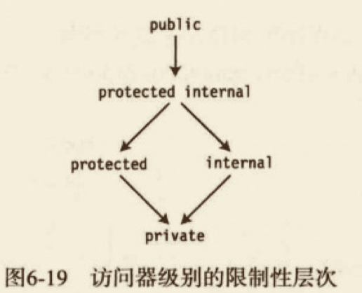

如果一个属性的访问级别是 `public`，在图里较低的4个级别中，可以把任意的一个级别给它的一个访问器。但如果属性的访问级别是 `protected`，唯一能够对访问器使用的访问修饰符是 `private`。

#### 分部类和分部类型

类的声明可以分割为几个类的声明。
- 每个分部类的声明都包含一些类成员的声明。
- 类的分部类声明可以在同一个文件也可以在同一个文件中。

每个局部声明必须被标为 `partial class`，而不是单独的关键字 `class`。分部类声明看起来和普通类声明相同，除了那个附加的类型修饰符 `partial`。

```cs
// 分部方法
using System;
namespace MyClass
{
  partial class MyClass15
  {
    partial void PrintSum(int x, int y); // 定义分部方法
    public void Add(int x, int y)
    {
      PrintSum(x, y);
    }
  }

  partial class MyClass15
  {
    partial void PrintSum(int x, int y) // 实现分部方法
    {
      Console.WriteLine("Sum is {0}", x + y);

    }
  }

  class Program15
  {
    public static void main()
    {
      MyClass15 mc = new MyClass15();
      mc.Add(5, 6);
    }
  }
}

```

#### 分部方法

分部方法是声明在分部类中不同部分的方法。分部部分的不同部分可以声明在不同的分部类中，也可以声明在同一个类中。分部方法的两个部分如下：
- 定义分部方法声明。
  - 给出签名和返回类型。
  - 声明的实现部分只是一个分号。
- 实现分部方法声明。
  - 给出签名和返回类型。
  - 是以正常形式的语句块实现。

关于分部方法需要了解的重要内容如下：
- 定义声明和实现声明的签名和返回类型必须匹配。签名和返回类型有如下特征：
  - 返回类型必须是 void。
  - 签名不能包括访问修饰符，这使部分方法是隐式私有的。
  - 参数列表不能包含有 out 参数。
  - 在定义声明和实现声明中都必须包含上下文关键字 `partial`，直接放在关键字 void 之前。
- 可以有定义部分而没有实现部分。在这种情况下，编译器把方法的声明以及方法内部任何对方法的调用都移除。不能只有分部方法的实现部分而没有定义部分。

### 类和继承

#### 类继承

通过继承我们可以定义一个新类，新类纳入一个已经声明的类并进行扩展。

- 可以使用一个已经存在的类作为新类的基础。已存在的类称为基类（base class），新类称为派生类（derived class）。派生类的组成成员如下：
  - 本身声明中的成员；
  - 基类的成员。
- 要声明一个派生类，需要在类名后加入基类规格说明。**基类规格说明由冒号和后面用作基类的类名称组成。**派生类被描述为直接继承自列出的基类。
- 派生类扩展它的基类，因为它包含了基类的成员，加上它在本身声明中的新增功能。、

```cs
class otherClass : SomeClass {
  ...
}
```

#### 访问继承的成员

继承的成员可以被访问，就像它们是派生类自己声明一样。

```cs
// 类和继承——访问继承的成员
using System;
namespace MyClass
{
  class SomeClass // 基类
  {
    public string Field1 = "base class field";
    public void Method1(string value)
    {
      Console.WriteLine("Base class--Method1:  {0}", value);
    }
  }
  class otherClass : SomeClass // 派生类
  {
    public string Field2 = "derived class field";
    public void Method2(string value)
    {
      Console.WriteLine("Derived class--Method2: {0}", value);
    }

  }


  class Program16
  {
    public static void main()
    {
      otherClass mc = new otherClass();
      mc.Method1(mc.Field1); // 以基类字段为参数的基类方法
      mc.Method1(mc.Field2); // 以派生字段为参数的基类方法
      mc.Method2(mc.Field1); // 以基类字段为参数的派生方法
      mc.Method2(mc.Field2);  // 以派生字段为参数的派生方法
    }
  }
}

```

#### 所有类都派生自 object

除了特殊的类 `object` ，所有类都是派生类，即使它们没有基类规格说明。类 object 是唯一的非派生类，因为它是继承层次结构的基础。

没有基类规格说明的类隐式地直接派生自类 `object`。不加基类规格说明只是指定 obecjt 为基类的简写。

```cs
class SomeClass{}

// 等价于
class SomeClass : object {}
```

关于类继承的其他重要内容如下：
- 一个类声明的基类规格说明中只能有一个单独的类，这称为单独类。
- 虽然类只能直接继承一个基类，但是继承的层次没有限制。也就是说作为基类的类可以派生自另外一个类，而这个类又派生自另外一个类，一直下去，直至最终达到 `object`。
- 所以，通常我们称一个类为派生类时，我们的意思是它直接派生自某类而不是 object。

```cs
class SomeClass{}
class OtherClass : SomeClass {}
class MyNewClass : OtherClass {}
```

#### 屏蔽基类的成员

虽然派生类不能删除它继承的任何成员，但可以用与基类成员名称相同的成员来屏蔽（mask）基类成员。这是继承的主要功能之一，非常实用。

例如，我们要继承包含某个特殊方法的基类。该方法适合声明它的类，但却不一定适合派生类。在这种情况下，我们希望在派生类中声明新成员以屏蔽基类的方法。在派生类中屏蔽基类成员的一些要点如下：
- 要屏蔽一个继承的数据成员，需要声明一个新的相同类型的成员，并使用相同的名称。
- 通过在派生类中声明新的带有相同签名的函数成员，可以隐藏或屏蔽继承的函数成员。请记住，签名由名称和参数列表组成，不包括返回类型。
- 要让编译器知道你在故意屏蔽继承的成员，使用 new 修饰符。否则，程序可以成功编译，但编译器会警告你隐藏了一个继承的成员。
- 也可以屏蔽静态成员。

```cs
// 类和继承——屏蔽基类的访问
using System;
namespace MyClass
{
  class SomeClass2 // 基类
  {
    public string Field1 = "base class field";
    public void Method1(string value)
    {
      Console.WriteLine("Base class--Method1:  {0}", value);
    }
  }
  class otherClass2 : SomeClass // 派生类
  {
    new public string Field1 = "derived class field";
    new public void Method1(string value)
    {
      Console.WriteLine("Derived class--Method2: {0}", value);
    }

  }


  class Program17
  {
    public static void main()
    {
      otherClass2 mc = new otherClass2();
      mc.Method1(mc.Field1); // 以基类字段为参数的基类方法
    }
  }
}

```

#### 基类的访问

如果派生类必须完全地访问被隐藏的继承成员，可以使用基类访问（base access）表达式访问隐藏的继承成员。基类访问表达式由关键字`base`后面跟一个点和成员的名称组成，如下：

```cs
// 类和继承——屏蔽基类的访问
using System;
namespace MyClass
{
  class SomeClass2 // 基类
  {
    public string Field1 = "base class field";
    public void Method1(string value)
    {
      Console.WriteLine("Base class--Method1:  {0}", value);
    }
  }
  class otherClass2 : SomeClass // 派生类
  {
    new public string Field1 = "derived class field";
    new public void Method1(string value)
    {
      Console.WriteLine("Derived class--Method2: {0}", value);
    }
    public void PrintField1()
    {
      Console.WriteLine(Field1); // 访问派生类
      Console.WriteLine(base.Field1); // 访问基类
    }

  }


  class Program17
  {
    public static void main()
    {
      otherClass2 mc = new otherClass2();
      mc.Method1(mc.Field1); // 以基类字段为参数的基类方法
      mc.PrintField1();
    }

  }
}

```

如果你的程序代码经常使用这个特性（即访问隐藏的继承成员），你可能想要重新评估类的设计。一般来说能有更好的设计，但是没有其他办法的时候也可以使用这个特性。

#### 使用基类的引用

派生类的实例由基类的实例加上派生类新增的成员组成。派生类的引用指向整个类对象，包括基类部分。

如果一个派生类对象的引用，就可以获取该对象基类部分的引用（使用类型转换运算符把该引用转换为基类类型）。类型转换运算符放置在对象引用的前面，由圆括号括起的要被转换成的类名组成。

```cs
// 类和继承——使用基类的引用
using System;
namespace MyClass
{
  class MyBaseClass // 基类
  {
    public void Print()
    {
      Console.WriteLine("This is the base class.");
    }
  }
  class MyDerivedClass : MyBaseClass
  {
    new public void Print()
    {
      Console.WriteLine("This is the derived class.");
    }
  }

  class Program18
  {
    public static void main()
    {
      MyDerivedClass derivedClass = new MyDerivedClass();
      MyBaseClass mybc = (MyBaseClass)derivedClass; // 转换成基类
      derivedClass.Print(); // 从派生类部分调用 Print
      mybc.Print(); // 从基类部分调用 Print
    }

  }
}

```

##### 虚方法和覆写方法

在上一节看到，当使用基类引用派生类对象时，得到的是基类的成员。虚方法可以使基类的引用“升至”派生类内。

可以使用基类的引用调用派生类（derived class）的方法，只需满足下面的条件：
- 派生类的方法和基类的方法有相同的签名和返回类型。
- 基类的方法使用 `virtual` 标注。
- 派生类的方法使用 `override` 标注。

```cs
// 类和继承——使用基类的引用
using System;
namespace MyClass
{
  class MyBaseClass2 // 基类
  {
    virtual public void Print()
    {
      Console.WriteLine("This is the base class.");
    }
  }
  class MyDerivedClass2 : MyBaseClass2
  {
    override public void Print()
    {
      Console.WriteLine("This is the derived class.");
    }
  }

  class Program19
  {
    public static void main()
    {
      MyDerivedClass2 derivedClass = new MyDerivedClass2();
      MyBaseClass2 mybc = (MyBaseClass2)derivedClass;
      derivedClass.Print();
      mybc.Print(); // 调用了 MyDerivedClass2 的方法
    }

  }
}

```


其他关于 `virtual` 和 `override` 修饰符的重要信息如下：
- 覆写和被覆写的方法必须有相同的可访问性。换一种说法，被覆写的方法不能是 `private`，而覆写的方法是 `public`。
- 不能覆写 `static` 方法或非虚方法。
- 方法、属性和索引器，以及另一种成员类型事件，都可以被声明为 `virtual` 和 `override`。

##### 覆写标记为 override 的方法

覆写方法可以在继承的任何层次出现。
- 当使用对象基类部分的引用调用一个覆写的方法时，方法的调用被沿派生层次上溯执行，一直到标记为 `override` 的方法的最高派生（most-derived）版本。
- 如果在更高的派生级别有该方法的其他声明，但没有被标记为 `override`，那么它们不会被调用。

```cs
// 类和继承——使用基类的引用
using System;
namespace MyClass
{
  class MyBaseClass3 // 基类
  {
    virtual public void Print()
    {
      Console.WriteLine("This is the base class.");
    }
  }
  class MyDerivedClass3 : MyBaseClass3
  {
    override public void Print()
    {
      Console.WriteLine("This is the derived class.");
    }
  }
  class SecondDerivedClass : MyDerivedClass3
  {
    override public void Print()
    {
      Console.WriteLine("This is the Second derived class.");
    }
  }
  class Program20
  {
    public static void main()
    {
      SecondDerivedClass derivedClass = new SecondDerivedClass();
      MyBaseClass3 mybc = (MyBaseClass3)derivedClass;
      derivedClass.Print(); // This is the Second derived class.
      mybc.Print(); // This is the Second derived class.
    }

  }
}

```

##### 覆盖其他成员类型

在之前的几节中，我们已经学习了如何在方法上使用 `virtual/override`。其实在属性事件以及索引器也是一样的。

```cs
// 类和继承——覆盖其他成员类型
using System;
namespace MyClass
{
  class MyBaseClass4 // 基类
  {
    private int _myInt = 5;
    virtual public int MyProperty
    {
      get
      {
        return _myInt;
      }
    }
  }
  class MyDerivedClass4 : MyBaseClass4
  {
    private int _myInt = 10;
    public override int MyProperty
    {
      get
      {
        return _myInt;
      }
    }

  }
  class Program21
  {
    public static void main()
    {
      MyDerivedClass4 derivedClass = new MyDerivedClass4();
      MyBaseClass4 mybc = (MyBaseClass4)derivedClass;
      Console.WriteLine(derivedClass.MyProperty); // 10
      Console.WriteLine(mybc.MyProperty); // 10
    }

  }
}

```

#### 构造函数的执行

- 继承层次链中每个类在执行它自己的函数构造函数体之前执行它的基类构造函数。
- 要创造对象的基类对象部分，需要隐式调用基类的某个构造函数作为创建实例过程的一部分。

创建一个实例过程中完成的第一件事就是初始化对象的所有实例成员。在此之后，调用基类的构造函数，然后才执行该类自己的构造函数体。


```cs
class MyDerivedClass: MyBaseClass {
  int MyField1 = 5; // 1. 成员初始化
  int MyField2;  // 成员初始化

  public MyDerivedClass() {}  // 3. 构造函数体执行
}

class MyBaseClass {
  public MyBaseClass {  // 2. 基类构造函数调用

  }
}
```

##### 构造函数初始化语句

默认情况下，在构造对象时，将调用基类的无参构造函数。但构造函数可以重载，所以基类可能有一个以上的构造函数。如果希望派生类使用一个指定的基类构造函数而不是无参构造函数，必须在构造函数初始化语句中指定它。

有两种形式的构造函数初始化语句。
- 第一种形式使用关键字 base 并指明使用哪一个基类构造函数。
- 第二种形式使用关键字 this 并指明应该使用当前类的哪一个构造函数。

基类构造函数初始化语句放在冒号后面，冒号紧跟着类的构造函数声明的参数列表。构造函数初始化语句由关键字 base 和要调用的基类构造函数的参数列表组成。

```cs
public MyDerivedClass(int x, string s) : base(s, x) {
  ...
}
```

另一种方式（后续补充）

##### 类访问修饰符

类可以被系统其他类看到并访问。

可访问的（accessible）有时也称为可见的（visible），它们可以互换使用。类的可访问性有两个级别：`public` 和 `internal`。
- 标记为 `public` 的类可以被系统内任何程序集中的代码访问。要使一个类对其他`程序集`可见，使用 `public` 访问修饰符。
- 标记为 `internal` 类只能被它自己所在的程序集内的看到。
  - 这是默认的可访问级别，所以，除非在类的声明中显式的指定修饰符 `public`，程序集外部的代码不能访问该类。
  - 可以使用 `inernal` 访问修饰符显式地声明一个类为内部的。

```cs
public class MyBaseClass {}
internal class MyBaseClass {}
```


#### 程序集间的继承

1. 选中当前的项目，编辑器选择项目-》编辑引用-》勾选要继承的程序集
2. 要继承的项目程序集，声明为 `public` 。
3. 在要使用的项目文件中，using 命名空间使用即可。

```cs
// 源文件名称 Assembly1.cs
using System;
namspace BaseClassNS {
  public class MyBaseClass {
    public void PrintMe() {
      Console.WriteLine("I am MyBaseClass.")
    }
  }
}
```

```cs
// 源文件名称 Assembly2.cs
using System;
using BaseClassNS;
class MyDerivedClass: MyBaseClass { // 在其他程序集的基类

}
```

#### 成员访问修饰符

声明在类中的每个成员对系统的不同部分可见，这依赖于类声明中指派给它的访问修饰符
- 所有显式声明在类声明中的成员是互相可见的，无论它们的访问性如何。
- 继承的成员不在类的声明中显式声明，所以，如你所见，继承的成员对派生类的成员可以是可见的，也可以是不可见的。
- 以下是5个成员访问级别的名称。
  - public
  - private
  - protected
  - internal
  - protected internal
- 必须对每个成员指定成员访问级别。如果不指定某个成员的访问级别，它的隐式访问级别为 `private`。
- 成员不能比它的类有更高的可访问性。也就是说，如果一个类的可访问性限于它所在的程序集，那么类的成员个体也不能从程序集的外部看到，无论它们的访问修饰符是什么，`public` 也不例外。

##### 访问成员的区域

类通过成员的访问修饰符指明了哪些成员可以被其他类访问。

```cs
public class MyClass {
  public int Member1;
  private int Member2;
  protected int Member3;
  internal int Member4;
  protected internal int Member5;
}
```

另一个类（如类B）能否访问这些成员取决于该类的两个特征：
- 类 B 是否派生自 MyClass 类。
- 类 B 是否和 MyClass 类在同一程序集。

这两个特征划分出4个集合。
- 在同一程序集且继承 MyClass。
- 在同一程序集但不继承 MyClass。
- 在不同的程序集且继承 MyClass。
- 在不同的程序集但不继承 MyClass。

##### 公有成员的可访问性

`public` 访问级别是限制性最少的。所有的类，包括程序集内部的类和外部的类都可以自由地访问成员。
公有类的公有成员对同一程序集或其他程序集的所有类可见。

##### 私有成员的可访问性

私有成员的限制级别是最严格的。
- `private` 类成员只能被它自己的类成员访问。它不能被其他的类访问，包括继承它的类。
- 然而，`private` 成员能被嵌套在它的类中的类成员访问。

任何类的私有成员只对它自己的类（或嵌套类）的成员可见。

##### 受保护成员的可访问性

`protected` 访问级别如同 `private` 访问级别，除了一点，它允许派生自该类的类访问该成员。

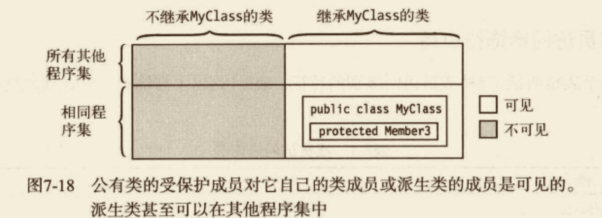

##### 内部成员的可访问性

标记为 `internal` 的成员对程序集内部的所有类可见，但对程序集外部的类不可见。


##### 受保护内部成员的可访问性

标记为 `protected internal` 的成员对所有继承该类的类以及所有程序集内部的类可见。注意，这是`protected` 和 `internal` 的并集，不是交集。


##### 成员访问修饰符小结


#### 抽象成员

抽象成员是指设计为被覆写的函数成员。
- 必须是一个函数成员。也就是说，字段和常量不能为抽象成员。
- 必须用 `abstract` 修饰符标记。
- 不能有实现代码块。

```cs
abstract public void PrintStuff(string s) {};
abstract public int MyProperty {
  get; // 分号替换实现
  set; // 分号替换实现
}
```

抽象成员只可以在`抽象类`中声明。一共有4个类型的成员可以声明为抽象的：
- 方法；
- 事件；
- 属性；
- 索引。

关于抽象成员的其他重要事项如下：
- 尽管抽象成员必须在派生类中用相应的成员覆写，但不能把 `virtual` 修饰符附加到 `abstract` 修饰符。
- 类似虚成员，派生类中抽象成员的实现必须指定 `override` 修饰符。


#### 抽象类

抽象类就是指设计为被继承的类。抽象类只能被用作其他类的基类。
- 不能创建抽象类的实例。
- 抽象类使用 `abstract` 修饰符声明。
- 抽象类可以包含抽象成员或普通的非抽象成员。抽象类的成员可以是抽象员和普通带实现的成员的任意组合。
- 抽象类自己可以派生自另一个抽象类。

```cs
// 类和继承——抽象类
using System;
namespace MyClass
{
  abstract class AbClass // 抽象类
  {
    public void IdentifyBase() // 普通方法
    {
      Console.WriteLine("I am AbClass.");
    }
    abstract public void IdentifyDerived(); // 抽象方法
  }

  class DerivedClass : AbClass
  {
    override public void IdentifyDerived()
    {
      Console.WriteLine("I am DerivedClass.");
    }
  }

  class Program23
  {
    public static void main()
    {
      DerivedClass mc = new DerivedClass();
      mc.IdentifyBase();
      mc.IdentifyDerived();
    }

  }
}

```

#### 密封类

在上一节中，你看到抽象类必须用作基类，它不能像独立的类那样被实例化。密封类与它相反。
- 密封类只能被用作独立的类，它不能被用作基类。
- 密封类使用 `sealed` 修饰符标注。

```cs
sealed class MyClass {
  ...
}
```

#### 静态类

静态类中所有成员都是静态的。静态类用于存放不受实例数据影响的数据和函数。静态类的一个常见用途可能就是创建一个包含一组数学方法和值的数学库。
- 类本身必须标记为 `static`。
- 类的所有成员必须是静态的。
- 类可以有一个静态构造函数，但不能有实例构造函数，不能创建该类的实例。
- 静态类是隐式密封的，也就是说，不能继承静态类。

```cs
// 类和继承——静态类
using System;
namespace MyClass
{
  static public class MyMath
  {
    public static float PI = 3.14f;
    public static bool IsOdd(int x)
    {
      return x % 2 == 1;
    }
    public static int Times2(int x)
    {
      return x * 2;
    }
  }

  class Program24
  {
    public static void main()
    {
      int val = 3;
      Console.WriteLine("{0} is odd is {1}.", val, MyMath.IsOdd(3));
      Console.WriteLine("{0} * 2 = {1}.", val, MyMath.Times2(3));
    }

  }
}

```

#### 扩展方法

```cs
// 类和继承——扩展方法
using System;
namespace MyClass
{
  sealed class MyData // 密封类
  {
    private double D1, D2, D3;
    public MyData(double d1, double d2, double d3)
    {
      D1 = d1;
      D2 = d2;
      D3 = d3;
    }
    public double Sum()
    {
      return D1 + D2 + D3;
    }
  }


  static class ExtendMyData
  {
    public static double Average(this MyData md)
    {
      return md.Sum() / 3;
    }
  }
  class Program25
  {
    public static void main()
    {
      MyData md = new MyData(3, 4, 5);
      Console.WriteLine("Sum: {0}", md.Sum());
      Console.WriteLine("Average: {0}", md.Average());
    }
  }
}
```

#### 命名约定


### 表达式和运算符

#### 表达式

运算符是一个符号，它表示返回单个结果的操作。操作数（operand）是指作为运算符输入的数据元素。一个运算符会：
- 将操作数作为输入；
- 执行某个操作；
- 基于该操作返回一个值。

表达式是运算符和操作数的字符串。可以作为操作数的结构有：
- 字面量；
- 常量；
- 变量；
- 方法调用；
- 元素访问器，如数组访问器和索引器；
- 其他表达式。

表达式可以使用运算符连接以创建其他表达式。

表达式求值（evaluate）是将每个运算符应用到它的操作数的过程，以适当的顺序产生一个值。
- 值被返回到表达式求值的位置。在那里，它可能是一个封闭的表达式的操作数。
- 除了返回值以外，一些表达式还有副作用，比如在内存中设置一个值。

#### 字面量

**字面量**（literal）是源代码中键入的数字或字符串，表示一个指定类型的明确的、固定的值。
```cs
static void Main() {
  Console.WriteLine("{0}", 1024); // 整数字面量
  Console.WriteLine("{0}", 3.1416）; // 双精度字面量
  Console.WriteLine("{0}", 3.1416F）; // 浮点型字面量
  Console.WriteLine("{0}", true）; // 布尔型字面量
  Console.WriteLine("{0}", 'x'）; // 字符型字面量
  Console.WriteLine("{0}", 'Hi there'）; // 字符串字面量
}
```

因为字面量是写进源代码，所以它们的值必须在编译时可知。
- bool 有两个字面量：true 和 false。
- 对于引用类型变量，字面量 null 表示变量没有设置为内存中的数据。

##### 整数字面量

- 没有小数点；
- 带有可选的后缀，指明整数的类型。

##### 实数字面量

- 十进制数字；
- 一个可选的小数点；
- 一个可选的指数部分；
- 一个可选的后缀。

```cs
float f1 = 236F;
double d1 = 236.714;
double d2 = .35192;
double d3 = 6.338e-26;
```

##### 字符字面量

字符字面量由两个单引号内的字符组成。字符字面量可以是下面任意一种：单个字符、一个简单转义序列、一个十六进制转义序列或一个 Unicode 转义序列。

- 字符字面量的类型是 char。
- 简单转义序列是一个反斜杠后面跟着单个字符。
- 十六进制转义序列是一个反斜杠，后面跟着一个大写或小写的 x，后面再跟着4个十六进制数字。
- Unicode 转义序列是一个反斜杠，后面跟着一个大写或小写的 u，后面再跟着4个十六进制数字。

例如，下面的代码展示了字符字面量的不同格式：
```cs
char c1 = 'd'; // 单个字符
char c2 = '\n'; // 简单转义字符
char c3 = '\x0061'; // 十六进制转义字符
char c4 = '\u005a';  // Unicode 转义字符
```

##### 字符串字面量

字符串字面量使用双引号标记，不同于字符字面量使用单引号。有两种字符串字面量类型：
- 常规字符串字面量；
- 逐字字符串字面量。

常规字符串字面量由双引号内的字符序列组成。规则字符串字面量可以包含：
- 字符；
- 简单转义序列；
- 十六进制和 Unicode 转义序列。

例如：
```cs
string st1 = "Hi there";
string st2 = "Val1\t5, Val2\t10";
string st3 = "Add\x000ASome\u0007Interest";
```

逐字字符串字面量的书写如同常规字符串字面量，但它以一个`@`字符为前缀。逐字字符串字面量有如下特征：
- 逐字字面量与常规字符串字面量区别在于转义字符串不会被求值。在双引号中间的所有内容，包括通常被认为是转义序列的内容，都被严格按字符串中列出的那样打印。
- 逐字字面量的唯一例外是相邻的双引号组，它们被解释为单个双引号字符。

#### 求值顺序

表达式可以由许多嵌套的子表达式构成。子表达式的求值顺序可以使表达式的最终值发生变化。

##### 优先级


##### 结合性

假设编译器正在计算一个表达式，且该表达式中所有运算符都有不同的优先级，那么编译器将计算每个子表达式，从级别最高的开始，按照优先级一直计算下去。

但如果两个连续的运算符具有相同的优先级别怎么办？例如，已知表达式`2/6*4`。

当连续的运算符有相同的优先级时，求值顺序由操作结合性决定。也就是说，已知两个相同优先级的运算符，依照运算符的结合性，其中的一个或另一个优先。运算符结合性的一些重要特征如下：
- 左结合运算符从左到右求值。
- 右结合运算符从右到左求值。
- 除赋值运算符以外，其他二元运算符是左结合的。
- 赋值运算符和条件运算符是右结合的。

|运算符类型| 结合性|
|--|--|
|赋值运算符|右结合|
|其他二元运算符|左结合|
|条件运算符|右结合|

可以使用圆括号显式地设定子表达式的求值顺序。括号内的子表达式：
- 覆盖优先级和结合性规则；
- 求值顺序从嵌套的最内层到最外层。

#### 简单算术运算符

|运算符| 名称|描述|
|--|--|:--|
|+|加|计算两个操作数的和|
|-|减|从第一个操作数中减去第二个操作数|
|*|乘|求两个操作数的和|
|/|除|用第二个操作数除第一个。整数除法，截取整数部分到最近的整数|

#### 求余运算符

求余运算符（%）用第二个操作数除第一个操作数，忽略掉商，并返回余数。

|运算符| 名称|描述|
|--|--|:--|
|%|求余|用第二个操作数除第一个操作数并返回余数|

求余运算符还可以用于实数以得到实余数。

#### 关系比较运算符和相等比较运算符

关系比较运算符和相等比较运算符是二元运算符，比较它们的操作数并返回 bool 型值。

|运算符| 名称|描述|
|--|--|:--|
|<|小于|如果第一个操作数小于第二个操作数，返回 true，否则返回 false|
|>|大于|如果第一个操作数大于第二个操作数，返回 true，否则返回 false|
|<=|小于等于|如果第一个操作数小于等于第二个操作数，返回 true，否则返回 false|
|>=|大于等于|如果第一个操作数大于等于第二个操作数，返回 true，否则返回 false|
|==|等于|如果第一个操作数等于第二个操作数，返回 true，否则返回 false|
|!=|不等于|如果第一个操作数不等于第二个操作数，返回 true，否则返回 false|

说明：与 C 和 C++ 不同，在 C# 中数字不具有布尔意义。

##### 比较操作和相等性操作

对于大多数引用类型来说，比较它们的相等性时，将只比较它们的引用。
- 如果引用相等，也就是说，如果它们指向内存中相同对象，那么相等性比较为 true，否则为 false，即使内存中两个分离的对象在所有其他方面都完全相等。
- 这称为浅比较。

string 类型对象也是引用类型，但它的比较方式不同。比较字符串的相等性时，将比较它们的长度和内容（区分大小写）。
- 如果两个字符串有相同的长度和内容（区分大小写），那么相等性比较返回 true，即使它们占用不同的内存区域。
- 这称为深比较（deep comparcomparison）

委托也是引用类型，比较委托的相等时，如果两个委托都是 null，或两者的调用列表中有相同数目的成员，并且调用列表相匹配，那么返回 true。

比较数值表达式时，将比较类型和值。比较 enum 类型时，比较操作数的实际值。

#### 递增运算符和递减运算符

递增运算符对操作数加1。递减运算符对操作数减1。


|运算符| 名称|描述|
|--|--|:--|
|++|前置递增++var|变量的值+1并保存，返回变量的新值|
||后置递增var++|变量的值+1并保存，返回变量递增之前的旧值|
|--|前置递减--var|变量的值-1并保存，返回变量的新值|
||后置递增var--|变量的值-1并保存，返回变量递增之前的旧值|

比较这两种运算符的前置和后置形式
- 无论运算符使用前置形式还是后置形式，在语句执行之后，最终存放在操作数的变量中的值是相同的。
- 唯一不同的是运算符返回给表达式的值。

|运算符| 表达式：x=10|返回给表达式的值|计算后变量的值|
|--|--|--|--|
|前置递增|++x|11|11|
|后置递增|x++|10|11|
|前置递减|--x|9|9|
|后置递增|x--|10|9|

#### 条件逻辑运算符

逻辑运算符用于比较或否定它们的操作数的逻辑值，并返回结果逻辑值。

逻辑与（AND）和逻辑或（OR）运算符是二元左结合运算符。逻辑非（NOT）是一元运算符。

|运算符| 名称|描述|
|--|--|--|
|&&|与|如果两个操作数都是 true，结果为 true；否则为 fale|
|\|\||或|如果至少一个操作数是 true，结果为 true；否则为 false|
|!|非|如果操作数是 false，结果为 true；否则为 false|

条件逻辑运算符使用“短路”（short circuit）模式操作，意思是，如果计算 Expr1 之后结果已经确定，那么它就会跳过 Expr2 的值。

由于这种短路行为，不要在 Expr2 中放置带副作用的表达式（比如改变一个值），因为可能不会计算。

```cs
bool bVal; 
int iVal = 10;
bVal = (1 == 2) && (9 == iVal++); // 结果 bVal = false，iVal = 10
```

#### 逻辑运算符

按位逻辑运算符常用于设置位置组（bit pattern）的方法参数。这些运算符，除按位非运算符以外，都是二元左结合运算符，按位非是一元运算符。

|运算符| 名称|描述|
|--|--|--|--|
|&|位与|产生两个操作数的按位与。仅当两个操作位都为1时结果位才是1|
|\||位或|产生两个操作数的按位或。只要任意一个操作位为1结果位就是1|
|^||位异或|产生两个操作数的按位异或。仅当一个而不是两个操作数为1时结果位为1|
|~||位非|操作数的每个位都取反。该操作得到操作数的二进制反码（数字的反码是其二进制形式按位取反的结果。也就是说，每个0都变成1，每个1都变成0）|


#### 移位运算符

按位移位运算向左或向右把位组移动指定数量个位置，空出的位用0或1填充。

移位运算符是二元左结合运算符。按位移位运算符如下所示。移动的位置数由 Count 给出。
```cs
Operand << Count // 左移
Operand >> Count // 右移
```

|运算符| 名称|描述|
|--|--|--|--|
|<<|左移|将位组向左移动给定数目个位置。位从左边移出并丢失。右边打开的位位置用0填充|
|>>|右移|将位组向右移动给定数目个位置。位从右边移出并丢失|
 
#### 赋值运算符

赋值运算符对运算符右边的表达式求值，并用该值设置运算符左边的变量表达式的值。

|运算符|描述|
|--|--|
|=|简单赋值，计算右边表达式的值，并把返回值赋给左边的变量或表达式|
|*=|复合赋值，var*=expr 等价于 var = var*(expr)|
|/=|复合赋值，var/=expr 等价于 var = var/(expr)|
|%=|复合赋值，var%=expr 等价于 var = var%(expr)|
|+=|复合赋值，var+=expr 等价于 var = var+(expr)|
|-=|复合赋值，var-=expr 等价于 var = var-(expr)|
|<<=|复合赋值，var<<=expr 等价于 var = var<<(expr)|
|>>=|复合赋值，var>>=expr 等价于 var = var>>(expr)|
|&=|复合赋值，var&=expr 等价于 var = var&(expr)|
|^=|复合赋值，var^=expr 等价于 var = var^(expr)|
|\|=|复合赋值，var\|=expr 等价于 var = var\|(expr)|

#### 条件运算符

条件运算符是一种强大且简洁的方法，基于条件的结果，返回两个值之一。

|运算符| 名称|描述|
|--|--|--|--|
|?:|条件运算符|对一个表达式求值，并根据表达式是否返回 true 或 false，返回两个值之一|

条件运算符的语法如下所示。它有一个测试表达式和两个结果表达式。
- Condition 必须返回一个 bool 类型的值。
- 如果 Condition 求值为 true，那么对 Expression1 求值并返回。否则，对 Expression2 求值并返回。

`Condition ? Expression1 : Expression2`

说明：`if...else` 语句是控制流语句，它应当用来做两个行为中的一个。条件运算符返回一个表达式，它应当用于返回两个值中的一个。

#### 一元算术运算符

一元算数运算符设置数字值的符号。
- 一元正运算符简单返回操作数的值。
- 一元负运算符返回减操作数得到的值。

|运算符| 名称|描述|
|--|--|--|--|
|+|正号|返回操作数的数值|
|-|负号|返回减操作数得到的值|

```cs
int x = +10; // x = 10
int y = -x; // y = -10
int z = -y; // z = 10
```

#### 用户定义类型的转换

- 可以为自己的类和结构定义隐式转换和显式转换。这允许把用户定义类型的对象转换成某个其他类型，反之亦然。
- C# 提供隐式转换和显式转换。
  - 对于`隐式转换`，当决定在特定上下文中使用特定类型时，如有必要，编译器会自动执行转换。
  - 对于`显式转换`，编译器只在使用显式转换运算符时才执行转换。


#### 运算符重载

如你所见，C#运算符被定义为使用预定义类型作为操作数来工作。如果面对一个用户定义类型，运算符还不知道如何处理它。运算符重载允许你定义 C# 运算符应该如何操作自定义类型的操作数。
- 运算符重载只用于类和结构。

详细内容后续补充。

#### typeof 运算符

`typeof` 运算符返回其参数的任何类型的 `System.Type` 对象。通过这个对象，可以了解类型的特征。`typeof`是一元运算符。

|运算符| 描述|
|--|--|
|typeof|返回已知类型的 System.Type 值|

```cs
// typeof 运算符
using System;
using System.Reflection; // 使用反射命名空间来全面利用检测类型信息的功能
namespace classdemo.expressionsOperators
{
  class SomeClass
  {
    public int Field1;
    public int Field2;
    public void Method1()
    {

    }
    public int Method2()
    {
      return 1;
    }
  }
  class Program
  {
    public static void main()
    {
      Type t = typeof(SomeClass);
      FieldInfo[] fi = t.GetFields();
      MethodInfo[] mi = t.GetMethods();
      foreach (FieldInfo f in fi)
      {
        Console.WriteLine("Field: {0}", f.Name);
      }
      foreach (MethodInfo m in mi)
      {
        Console.WriteLine("Method: {0}", m.Name);
      }
      SomeClass s = new SomeClass();
      Console.WriteLine("Type s: {0}", s.GetType().Name); 
    }
  }
}

// 输出
// Field: Field1
// Field: Field2
// Method: Method1
// Method: Method2
// Method: Equals
// Method: GetHashCode
// Method: GetType
// Method: ToString
// Type s: SomeClass

```

#### 其他运算符

### 语句

#### 什么是语句

C# 中的语句跟 C 和 C++ 中的语句非常类似。
- 语句是描述某个类型或让程序执行某个动作的源代码指令。
- 语句的种类主要有3种，如下所示：
  - 声明语句 声明类型和变量；
  - 嵌入语句 执行动作或管理控制流。
  - 标签语句 控制跳转。

嵌入语句，它不声明类型、变量或实例。相反，它们使用表达式和控制流结构与由声明语句声明的对象一起工作。
- 简单语句由一个表达式和后面跟着的分号组成。
- `块`是由一对大括号括起来的语句序列。括起来的语句可以包括：
  - 声明语句；
  - 嵌入语句；
  - 标签语句；
  - 嵌套块。

```cs
int x = 10; // 简单声明
int z; // 简单声明
{ // 块
  int y = 20; // 简单声明
  z = x + y; // 嵌入语句
  top: y = 30; // 标签语句
  ... 
  {

  }
}
```

说明：块在语法上算作一个单条嵌入语句。在任何语法上需要一个嵌入语句的地方，都可以使用块。

`空语句` 仅由一个分号组成。可以把空语句用在以下情况的任意位置：语言的语法需要一条嵌入语句而程序逻辑又不需要任何动作。
```cs
if (x < y) {
  ;
} else {
  z = a + b;
}
```

#### 表达式语句

表达式返回值，但它们也有副作用。
- 副作用是一种影响程序状态的行为。
- 许多表达式求值只是为了它们的副作用。

可以在表达式后面放置语句终结符（分号）来创建一个表达式创建一条语句。表达式返回的任何值都会被丢弃。例如，下面的代码展示了一个表达式语句。它由赋值表达式（一个赋值运算符和两个操作数）和后面跟着的一个分号组成。它做下面两件事。
- 该表达式把运算符右边的值赋值给变量 x 引用的内存位置。虽然这可能是这条语句的主要动机，但却被视为副作用。
- 设置了 x 的新值之后，表达式返回 x 的新值。但没有什么东西接收这个返回值，所以它被忽略了。

```cs
x = 10; // 计算这个表达式的全部原因就是完成这个副作用。
```

#### 控制流语句

C# 提供与现代编程语言相同的控制流结构。
- `条件执行`依据一个条件执行或跳过一个代码片段。条件执行语句如下：
  - if；
  - if...else；
  - switch
- `循环语句`重复执行一个代码片段。
  - while；
  - do；
  - for；
  - foreach；
- `跳转语句`把控制流从一个代码片段改变到另一个代码片段中的指定语句。
  - break；
  - continue；
  - return；
  - goto；
  - throw。

说明：与 C 和 C++ 不同，测试表达式必须返回 bool 型值。数字在 C# 中没有布尔意义。

#### if 语句

`if` 语句实现按条件执行。
- TestExpr 必须计算成 bool 型值。
- 如果 TestExpr 求值为 true，执行 Statement。
- 如果求值为 false，则跳过 Statement。

#### if...else 语句

`if...else` 语句实现双路分支。`if...else` 语句的语法如下。
- 如果 TestExpr 求值为 true，执行 Statement1。
- 如果求值为 false，执行 Statement2。

```cs
if (TestExpr)
  Statement1
else 
  Statement2
```

#### while 循环

`while` 是一种简单循环结构，其测试表达式在循环的顶部执行。
- 首先对 TestExpr 求值。
- 如果 TestExpr 求值为 false，将继续执行在 while 循环结尾之后的语句。
- 否则，当 TestExpr 求值为 true 时，执行 Statement，并且再次对 TestExpr 求值。每次 TestExpr 求值为 true 时，Statement 都要再执行一次。循环在 TestExpr 求值为 true 时结束。


```cs
int x = 3;
while (x > 0) {
  Console.WriteLine("x: {0}", x);
  x--;
}
Console.WriteLine("Out of loop.");
```

#### do 循环

`do` 循环是一种简单循环结构，其测试表达式在循环的底部执行。
- 首先，执行 Statement。
- 然后，对 TestExpr 求值。
- 如果 TestExpr 返回 true，那么再次执行 Statement。
- 每次 TestExpr 返回 true，都将再次执行 Statement。
- 当 TestExpr 返回 false 时，控制传递到循环结构结尾之后的那条语句。

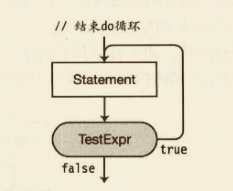

do 循环有几个特征，使它与其他控制流结构相区分。
- 循环体 Statement 至少执行一次，即使 TestExpr 初始化为 false，这是因为在循环底部才会对 TestExpr 求值；
- 在测试表达式的关闭圆括号之后需要一个分号。

```cs
// 结构
do
  Statement;
while( TestExpr );

// 实例
int x = 0;
do 
  Console.WriteLine("x is {0}", x++)
while( x > 3); // 分号必须加上
```

#### for 循环

只要测试表达式在循环体顶端计算时返回 true， for 循环结构就会执行循环体。
- 在 for 循环的开始，执行一次 Initializer。
- 然后对 TestExpr 求值。
- 如果它返回 true，执行 Statement，接着是 IterationExpr。
- 然后返回到循环的顶端，再次对 TestExpr 求值。
- 只要 TestExpr 返回 true，Statement 和 IterationExpr 都将被执行。
- 一旦 TestExpr 返回 false，就继续执行 Statement 之后的语句。

```cs
for (Initializer; TextExpr; IterationExpr)
  Statement
```

语句中的一些部分是可选的，其他部分是必需的。
- Initializer、TestEpr 和 IterationExpr 都是可选的。它们的位置可以空着。如果 TestExpr 位置是空的，那么测试就被假定返回 true。因此，要避免进入无限循环，必须有某种其他退出该语句的方法。
- 作为字段分隔符，两个分号是必需的，即使其他部分都省略了。


- Initializer 只执行一次，在 for 结构的任何其他部分之前。它常被用于声明和初始化循环中使用的本地变量。
- 对 TestExpr 求值以后决定应该执行 Statement 还是跳过。它必须计算成 bool 类型的值。如前所述，如果 TestExpr 为空白，将永远返回 true。
- IterationExpr 在 Statement 之后并且在返回循环顶端 TestExpr 之前立即执行。

```cs
for (int i = 0; i < 3; i++) {
  Console.WriterLine("Inside loop. i: {0}", i);
}
```

##### for 循环语句中变量的作用域

任何声明在 initializer 中的变量只在该 for 语句的内部可见。
- 这与 C 和 C++ 不同，C 和 C++ 中声明把变量引入到外围的块。

##### 初始化和迭代表达式中的多表达式

初始化表达式和迭代表达式都可以包含多个表达式，只要它们用逗号隔开。

```cs
static void Main() {
  const int MaxI = 5;
  for (int i = 0, j = 10; i < MaxI; i++, j += 10) {
    Console.WriteLine("{0}, {1}", i, j);
  }
}
```

#### switch 语句

`switch` 语句实现多路分支。
- `switch` 语句包含0个或多个分支。
- 每个分支以一个或多个分支标签开始。
- 每个分支的末尾必须为 break 语句或其他4种跳转语句。
  - 跳转语句包括 break、return、continue、goto 和 throw。
  - 对于这5种跳转语句，break 最常用于 switch 分支的末尾。break 语句将执行过程跳转到 `switch` 语句的尾部。

分支标签将按顺序求值。如果是某个标签与测试表达式的值匹配，就执行该分支，然后跳转到 `switch` 语句的尾部。


switch 标签的形式如下：
`case ConstantExpression:`
- 测试表达式 TestExpr 在结构的顶端求值。
- 如果 TestExpr 的值等于第一个分支标签中的常量表达式 ConstExpr1 的值，将执行该分支标签后面的语句列表，直到遇到一个跳转语句结束。
- default 分支是可选的，但如果包括了，就必须以一条跳转语句结束。通常用于处理异常。

#### 跳转语句

当控制流到达跳转语句时，程序执行被无条件转移到程序的另一部分。跳转语句包括：
- break；
- continue；
- return；
- goto；
- throw。

#### break 语句

break 语句除了可以被用到 swtich 语句中，还可以被用在下列语句中：
- for；
- foreach；
- while；
- do。

在这些语句体中，break 导致执行`跳出`最内层封装语句（innermost enclosing statement）。

```cs
int x = 0;
while (true) {
  x++;
  if ( x >= 3) {
    break;
  }
}
```

#### continue 语句

continue 语句导致程序执行转到下列类型循环的最内层封装语句的顶端。
- for；
- foreach；
- while；
- do。

```cs
for (int x = 0; x < 5; i++) { // 执行循环5次
  if (x < 3) { // 先执行3次
    continue; // 直接回到循环开始处
  }
  // 当 x >= 3 时执行下面的语句
  Console.WriteLine("Value of x is {0}", x);
}
```

#### 标签语句

标签语句由一个标识符后面跟着一个冒号再跟着一个语句组成。它有下面的形式。

```bash
Identifier: Statement
```

标签语句的执行完全如同标签不存在一样，并仅执行 Statement 部分。
- 给语句增加一个标签允许控制从代码的其他部分转移到该语句。
- 标签语句只允许用在块内部。

##### 标签

标签它们有自己的命名空间，所以标签语句中的标识符可以是任何有效的标识符，包括那些可能已经在重叠的作用域内声明的标识符，比如本地变量和参数。

```cs
int xyz = 0;
xyz: Console.WriteLine("No problem.");
```

然而，也存在一些限制。该标识符不能是：
- 关键字；
- 在重叠范围内和另一个标签标识符相同。

##### 标签语句的作用域

标签语句不能从它的声明所在的块的外部可见（或可访问）。标签语句的作用域为：
- 它声明所在的块；
- 任何嵌套在该块内部的块。


#### goto 语句

`goto` 语句无条件转移控制到一个标签语句。它的一般形式如下，其中 `Identifier` 是标签语句的标识符：
```cs
goto Identifier;
```

例子：
```cs
bool thingsAreFine;
while(true) {
  thingsAreFine = GetNuClearReactorCondition();
  if (thingsAreFine) {
    Console.WriteLine("Things are fine.");
  } else {
    goto NotSoGood;
  }
}
NotSoGood: Console.WriteLine("We have a problem.");
```

goto 语句必须在标签语句的作用域之内。
- goto 语句可以跳到它本身所在块内的任何标签内，或跳出到任何它被嵌套的块内的标签语句。
- goto 语句不能跳入任何嵌套在该语句本身所在块内部的任何块。

警告：使用 goto 语句是非常不好的，因为它会导致弱结构化、难以调试和维护代码。

##### goto 语句在 switch 语句内部

还有另外两种 goto 语句的形式，用在 switch 语句内部。这些 goto 语句把控制转移到 switch 语句内部相应命名的分支标签。
```bash
goto case ConstantExpression;
got default;
```

#### using 语句

某些类型的非托管对象有数量限制或很耗费系统资源。在代码使用完它们后，尽可能快地释放它们是非常重要。using 语句有助于简化该过程并确保这些资源被适当地处置（dispose）。

资源是指一个实现了 `System.IDisposable` 接口的类或结构。
- 分配资源；
- 使用资源；
- 处置资源。

##### 资源的包装使用

##### 多个资源和嵌套

##### using 语句的另一种形式

#### 其他语句

|语句| 描述 |
|--|--|
|checked、unchecked|控制溢出检查上下文|
|foreach|遍历一个集合的每个成员|
|tyr、throw、finally|处理异常|
|return|将控制返回到调用函数的成员，而且还能返回一个值|
|yield|用于迭代|

### 结构

#### 什么是结构

结构是程序员定义的数据类型，与类非常类似。它们有数据成员和函数成员。虽然与类相似，但是有许多重要的区别。最重要的区别是：
- 类是引用类型而结构是值类型；
- 结构是隐式密封的，这意味着它们不能被派生。

声明结构和声明类类似：
```cs
struct StructName {
  MemberDeclarations
}
```

```cs
using System;
namespace classdemo.Struct
{
  struct Point
  {
    public int X;
    public int Y;
  }
  class Program
  {
    public static void main()
    {
      Point first, second, third;
      first.X = 10;
      first.Y = 10;
      second.X = 20;
      second.Y = 20;
      third.X = first.X + second.Y;
      third.Y = first.Y + second.Y;
      Console.WriteLine("first: {0}, {1}", first.X, first.Y);
      Console.WriteLine("second: {0}, {1}", second.X, second.Y);
      Console.WriteLine("third: {0}, {1}", third.X, third.Y);
    }
  }
}

```

#### 结构是值类型

和所有值类型一样，结构类型变量含有自己的数据。因此：
- 结构类型的变量不能为 null；
- 两个结构变量不能引用同一对象。

```cs
class CSimple {
  public int x;
  public int y;
}

struct Simple {
  public int x;
  public int y;
}

static void Main() {
  CSimple cs = new CSimple();
  Simple ss = new Simple();
}
```


#### 对结构赋值

把一个结构赋值给另一个结构，就将一个结构的值复制给另一个结构。这和复制变量不同，复制类变量时只复制引用。

```cs
using System;
namespace classdemo.Struct
{
  class CSimple
  {
    public int X;
    public int Y;
  }

  struct Simple
  {
    public int X;
    public int Y;
  }
  class Program2
  {
    public static void main()
    {
      CSimple cs1 = new CSimple();
      CSimple cs2 = null;
      Simple ss1 = new Simple();
      Simple ss2 = new Simple();

      cs1.X = ss1.X = 5;
      cs1.Y = ss1.Y = 10;

      cs2 = cs1; // 赋值结构实例
      ss2 = ss1; // 赋值类实例
    }
  }
}

```

#### 构造函数和析构函数

结构可以允许有实例构造函数和静态构造函数，但不允许有析构函数。

##### 实例构造函数

语言隐式地为每个结构提供一个无参数的构造函数。这个构造函数把结构的每个成员设置为该类型的默认值。值成员设置成它们的默认值，引用成员设置成 null。

预定义的无参数构造函数对每个结构都存在，而且不能删除或重定义。但是，可以创建另外的构造函数，只要它们有参数。注意，这和类不同。对于类，编译器只在没有其他构造函数声明时提供隐式的无参数构造函数。

调用一个构造函数，包括隐式无参数构造函数，要使用 new 运算符。注意，即使不从堆中分配内存也要使用 new 运算符。

```cs
using System;
namespace classdemo.Struct
{

  struct Simple2
  {
    public int X;
    public int Y;
    public Simple2(int a, int b) // 带有参数的构造函数
    {
      X = a;
      Y = b;
    }
  }
  class Program3
  {
    public static void main()
    {
      Simple2 s1 = new Simple2(); // 调用隐式构造函数
      Simple2 s2 = new Simple2(5, 10);
      Console.WriteLine("s1: {0}, {1}", s1.X, s1.Y);
      Console.WriteLine("s1: {0}, {1}", s2.X, s2.Y);
      // s1: 0, 0
      // s1: 5, 10
    }
  }
}

```

也可以不使用 new 运算符创建结构的实例。然而，如果这样做，有一些限制，如下：
- 在显式设置数据成员之后，才能使用它们的值；
- 在对所有数据成员赋值之后，才能使用任何函数成员。

```cs
struct Simple {
  public int X;
  public int Y;
}

class Program {
  static void Main() {
    Simple s1, s2;
    Console.WriteLine("{0}, {1}", s1.X, s2Y); // 编译错误

    s2.X = 5；
    s2.Y = 10;
    Console.WriteLine("{0}, {1}", s2.X, s2.Y); // 没问题
  }
}
```

##### 静态构造函数

与类相似，结构的静态构造函数创建并初始化静态数据成员，而且不能引用实例成员。结构的静态构造函数遵从与类的静态构造函数一样的规则。
以下两种行为，任意一种发生之前，将会调用静态构造函数。
- 调用显式声明的构造函数。
- 引用结构的静态成员。

#### 字段初始化语句是不允许的

在结构中字段初始化语句是不允许的，如下所示。
```cs
struct Simple {
  public int x = 0; // 编译错误
  public int y = 0; // 编译错误
}
```

#### 结构是密封的

结构总是隐式密封的，因此，不能从它们派生其他结构。

由于结构不支持继承，个别类成员修饰符用在结构成员上将没有意义。因此不能在结构声明时使用。不能用于结构的修饰符如下：
- protected
- internal
- abstract
- virtual

结构本身派生自 `System.ValueType`，`System.ValueType` 派生自 `object`。

#### 装箱和拆箱

如同其他值类型数据，如果想将一个结构实例作为引用类型对象，必须创建装箱（boxing）的副本。装箱的过程就是制作值类型变量的引用类型副本。装箱和拆箱（unboxing）后续再作详细阐述。

#### 结构作为返回值和参数

结构可以用作返回值和参数。
- 返回值 当结构用作返回值时，将创建它的副本并从函数成员返回。
- 值参数 当结构被用作值参数时，将创建实参结构的副本。该副本用于方法的执行中。
- ref 和 out 参数 如果把一个结构用作 `ref` 或 `out` 参数，传入方法的是该结构的一个引用，这样就可以修改其数据成员。

#### 关于结构的其他信息

对结构进行分配比创建类的实例开销小，所以使用结构代替类有时可以提高性能，但要注意到装箱和拆箱的高代价。

最后，关于结构，需要知道的最后一些事情如下：
- 预定义简单类型（int、short、long，等等），尽管在 .NET 和 C# 中被视为原始类型，它们实际上在 .NET 都实现为结构。
- 可以使用与声明分部类相同的方法声明分部结构。
- 结构和类一样，可以实现接口。后续作阐述。

### 枚举

#### 枚举

枚举是由程序员定义的类型，与类或结构一样。
- 与结构一样，枚举是值类型，因此直接存储它们的数据，而不是分开存储成引用和数据。
- 枚举只有一种类型的成员：命名的整数值常量。

每个枚举类型都有一个底层整数类型，默认为 `int`。
- 每个枚举成员都被赋予一个底层类型的常量值。
- 在默认情况下，编译器把第一个成员赋值为0，并对每一个后续成员赋的值比前一个成员多1。

```cs
using System;
namespace classdemo.Enum
{
  enum TrafficLight
  {
    Green, // 逗号分隔，没有分号
    Yellow,
    Red
  }
  class Program
  {
    public static void main()
    {
      // 可以把枚举值赋给变量
      TrafficLight t1 = TrafficLight.Green;
      TrafficLight t2 = TrafficLight.Yellow;
      TrafficLight t3 = TrafficLight.Red;
      Console.WriteLine("{0}, \t{1}", t1, (int)t1); // Green, 	0
      Console.WriteLine("{0}, \t{1}", t2, (int)t2); // Yellow, 	1
      Console.WriteLine("{0}, \t{1}", t3, (int)t3); // Red, 	2
    }
  }
}

```

##### 设置底层类型和显式值

可以把冒号和类型名称放在枚举名之后，这样就可以使用 int 以外的整数类型。类型可以是任何整数类型。所有成员常量都属于枚举的底层类型。

```cs
using System;
namespace classdemo.Enum
{
  enum TrafficLight : ulong
  {
    Green = 10,
    Yellow = 15,
    Red = 15
  }
}

```

成员常量的值可以是底层类型的任何值。要显式地设置一个成员的值，在枚举声明中的变量名之后使用初始化表达式。尽管不能有重复的名称，但可以有重复的值。

##### 隐式成员编号

可以显式地赋值给任何成员常量。如果不初始化一个成员常量，编译器隐式地给它赋一个值。

```cs
enum FaceCards {
  // Member
  Jack = 11,
  Queen, // 12
  King, // 13
  Ace, // 14
  NumberOfFaceCards = 4,
  SomeOtherValue,
  HighestFaceCard = Ace // 14，以上定义 ACE
}
```

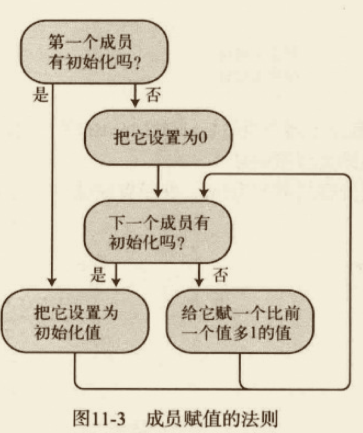

#### 位标志

后续补充

##### Flags 特性

##### 使用位标志的示例 

#### 关于枚举的补充

枚举只有单一的成员类型：声明的成员常量。
- 不能对成员使用修饰符。它们都隐式地具有和枚举相同的访问性。
- 由于成员是常量，即使在没有该枚举类型的变量时它们也可以访问。使用枚举类型名，跟着一个点和成员名。
- 枚举类型是一个独特的类型，比较不同枚举类型的成员会导致编译时错误。

.NET Enum 类型（enum 就是基于该类型的）还包括一些有用的静态方法：
- GetName 方法以枚举类型对象和整数为参数，返回响应的枚举成员的名称；
- GetNames 方法以枚举类型对象为参数，返回该枚举中所有成员的全部名称。

### 数组

数组实际上是由一个变量名称表示的一组同类型的数据元素。每个元素通过变量名称和一个或多个方括号中的索引来访问。

```cs
MyArray[4]
```

#### 定义

让我们从 C# 中与数组有关的一些重要定义开始。
- 元素 数组的独立数据项称作元素。数组的所有元素必须是相同类型的，或继承自相同的类型。
- 秩/维度 数组可以有任何正数的维度数。数组的维度称作秩（rank）。
- 维度长度 数组的每一个维度有一个长度，就是这个方向的位置个数。
- 数组长度 数组的所有维度中的元素的总和称为数组的长度。

#### 重要细节

- 数组一旦创建，大小就固定了。C# 不支持动态数组。
- 数组索引号是从0开始的。也就是说，如果维度长度是n，索引号范围是从0到n-1。

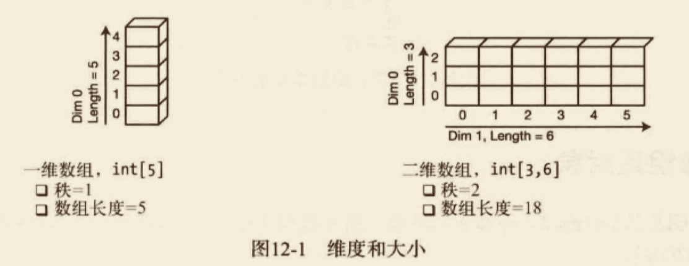

#### 数组的类型

C# 提供了两种类型的数组。
- 一维数组可以认为是单行元素或元素向量。
- 多维数组是由主向量中的位置组成的，每一个位置本身又是一个数组，称为子数组（sub-array）。子数组向量中的位置本身又是一个子数组。

另外，有两种类型的多维度数组：矩形数组（rectangular array）和交错数组（jagged array）。它们有如下特性：
- 矩形数组。
  - 某个维度的所有子数组有相同长度的多维数组。
  - 不管有多少维度，总是使用一组方括号。
    `int x = myArray[4, 6, 2]`
- 交错数组
  - 每一个子数组都是独立数组的多维度数组。
  - 可以有不同长度的子数组。
  - 为数组的每一个维度使用一对方括号。
    `jagArray[2][7][4]`


#### 数组是对象

数组实例是从 `System.Array` 继承的对象。由于数组从 BCL 基类继承，它们也继承了很多有用的方法，如下所示：
- Rank 返回数组维度数的属性。
- Length 返回数组长度（数组中所有元素的个数）的属性。

数组是引用类型，与所有引用类型一样，有数据的引用以及数据对象本身。引用在栈或堆上，而数组对象本身总是在堆上。


尽管数组总是引用类型，但是数组的元素可以是值类型也可以是也可以是引用类型。
- 如果存储的元素都是值类型，数组被称作值类型数组。
- 如果存储在数组中的元素都是引用类型对象，数组被称作引用类型数组。

#### 一维数组和矩形数组

一维数组矩形数组的语法非常类似，因此把它们放在了一起。

##### 声明一维数组或矩形数组

要声明一维数组或矩形数组，可以在类型和变量名称之间使用一对方括号。

方括号内的逗号就是`秩说明符`，它们指定了数组的维度数。秩就是逗号数量加1。比如没有逗号代表一维数组，一个逗号代表二维数组，以此类推。

基类和秩说明符构成了数组类型。例如，如下代码行声明了 `long` 的一维数组。数组类型的是 `long[]` ，读作“long 数组”。

```cs
long[] secondArray;
```

如下代码展示了矩形数组声明的示例。注意以下几点：
- 可以使用任意多的秩说明符。
- 不能在数组类型区域中方数组长度。秩是数组类型的一部分，而维度长度不是类型的一部分。
- 数组声明后，维度数就是固定的了。然而，维度长度直到数组实例化时才确定。

```cs
int[,,] firstArray; // 数组类型：三维整型数组
int[,] arr1; // 数组类型：二维整型数组
long[,,] arr1; // 数组类型：三维long型数组
long[3,2,6] SecondArray; // 编译错误
```

说明：和C/C++ 不同，方括号在基类型后，而不在变量名称后。

#### 实例化一维数组或矩形数组

要实例化数组，我们可以使用`数组创建表达式`。数组创建表达式由 `new` 运算符构成，后面是基类名称和一对方括号。方括号中以逗号分隔每一维度的长度。

- arr2 数组是包含4个 int 的一维数组。
- mcArr 数组是包含4个 MyClass 引用的一维数组。

```cs
int[] arr2 = new int[4];
MyClass[] mcArr = new MyClass[4];
```

说明：与对象创建表达式不一样，数组创建表达式不包含圆括号——即使是对于引用类型数组。

#### 访问数组元素

在数组中使用整型值作为索引来访问数组元素。
- 每一个维度的索引从0开始。
- 方括号内的索引在数组名称之后。

如下代码给出了声明、写入、读取一维数组和二维数组的示例。
```cs
int[] intArr1 = new int[15]; // 声明一维数组
intArr1[2] = 10; // 向第3个元素写入值
int var1 = intArr1[2]; // 从第3个元素读取值

int[,] intArr2 = new int[5, 10]; // 声明二维数组
intArr2[2, 3] = 7; // 向数组写入数据
int var2 = intArr2[2, 3]; // 向数组读取数据
```

#### 初始化数组

当数据被创建之后，每一个元素被自动初始化为类型的默认值。对于预定义的类型，整型默认值是0。对于预定义的类型，整数默认值是0，浮点型的默认值为 0.0，布尔值的默认值为 false，而引用类型的默认值则是 null。

```cs
int[] intArr = new int[4]; // 0 0 0 0
```

##### 显式初始化一维数组

对于一维数组，要设置显式初始值，我们可以在数组实例化的数组创建表达式之后加上一个初始化列表（initialization List）。
- 初始值必须以逗号分隔，并封闭在一组大括号内。
- 不必输入维度长度，因为编译器可以通过初始化值的个数来推断长度。
- 注意，在数组创建表达式和初始化列表中间没有分隔符。也就是说，没有等号或其他连接运算符。

```cs
int[] intArr = new int[]{10, 20, 30, 40};
```

##### 显式初始化二维数组

要显式初始化矩形数组，需要遵守以下规则：
- 每一个初始值向量必须封闭在大括号内。
- 每一个维度也必须嵌套并封闭在大括号内。
- 除了初始值，每一个维度的初始化列表和组成部分也必须使用逗号分隔。

```cs
int[,] intArray2 = new int[,] {{10, 1}, {2, 10}, {11, 9}};
```


##### 快捷语法

在一条语句中声明、数组创建和初始化时，我们可以省略语法的数组创建表达式部分，只提供初始化部分。

```cs
int[] arr = new int[3]{10, 20, 30};  // 等价下面
int[] arr = {10, 20, 30};

int[,] arr = new int[2, 3]{{0, 1, 2}, {11, 12, 13}} // 等价下面
int[,] arr = {{0, 1, 2}, {11, 12, 13}};
```

##### 隐式类型数组

直到现在，我们一直都在数组声明的开始处显式指定数组类型。然而，和其他局部变量一样，数组可以是隐式类型的。也就是说存在以下情况。
- 当初始化数组时，我们可以让编译器根据初始化语句的类型来推断数组类型。只要所有初始化语句能隐式转换为单个类型，就可以这么做。
- 和隐式类型的局部变量一样，使用 `var` 关键字来替代数组类型。

```cs
int[] intArr1 = new int[]{10, 20, 30, 40}; // 显式
var intArr1 = new []{10, 20, 30, 40}; // 隐式

int[,] intArr2 = new int[,]{ {10, 1}, {2, 10}, {11, 9} }; // 显式
var intArr2 = new [,]{ {10, 1}, {2, 10}, {11, 9} }; // 隐式

string[] sArr1 = new string[]{"life", "liberty", "pursuit of happiness"};
var sArr1 = new []{"life", "liberty", "pursuit of happiness"};
```

##### 综合内容

创建一个矩形数组，并对其进行初始化。

```cs
// 声明、创建和初始化一个隐式类型的数组
var arr = new int[,]{{0, 1, 2}, {10, 11, 12}};

// 输出值
for (int i = 0; i < 2; i++) {
  for (int j = 0; j < 3; j++) {
    Console.WriteLine("{0}, {1} is {2}", i, j, arr[i, j]);
  }
}
```

#### 交错数组

交错数组是数组的数组。与矩形数组不同，交错数组的子数组的元素个数可以不同。


##### 声明交错数组（性能优化）

交错数组的声明语法要求每一个维度都有一对独立的方括号。数组变量声明中的方括号数决定了数组的秩。
- 交错数组可能的维度可以是大于1的任意整数。
- 和矩形数组一样，维度长度不能包括在数组类型的声明部分。

```cs
int[][] someArr; // 秩等于2
int[][][] otherArr; // 秩等于3
```

##### 快捷实例化

我们可以将用数组创建表达式创建的顶层数组和交错数组的声明相结合。

```cs
int[][] jagArr = new int[3][];
// 不能在声明语句中初始化顶层数组之外的数组
int[][] jagArr = new int[3][4]; // 编译错误
```

##### 实例化交错数组

和其他类型的数组不一样，交错数组的完全初始化不能在一个步骤中完成。由于交错数组是独立数组的数组——每一个数组必须独立创建。实例化完整的交错数组需要如下步骤：
- 首先，实例化顶层数组。
- 其次，分别实例化每一个子数组，把新建数组的引用赋给它们所属数组的合适元素。

```cs
int[][] arr = new int[3][]; // 1. 实例化顶层数组
arr[0] = new int[]{10, 20, 30}; // 2. 实例化子数组
arr[1] = new int[]{40, 50, 60, 70}; // 3. 实例化子数组
arr[2] = new int[]{80, 90, 100, 110, 120}; // 4. 实例化子数组
```

##### 交错数组中的子数组

由于交错数组中的子数组本身就是数组，因此交错数组中也可能有矩形数组。例如，如下代码创建了一个有3个二维矩形数组的交错数组，并将它们初始化，然后显示了它们的值。

```cs
using System;
namespace classdemo.Array
{
  class Program
  {
    public static void main()
    {
      int[][,] arr; // 带有二维数组的交错数组
      arr = new int[3][,]; // 实例化带有3个二维数组的交错数组
      arr[0] = new int[,] { { 10, 20 }, { 100, 200 } };
      arr[1] = new int[,] { { 30, 40, 50 }, { 300, 400, 500 } };
      arr[2] = new int[,] { { 60, 70, 80, 90 }, { 600, 700, 800, 900 } };
      for (int i = 0; i < arr.GetLength(0); i++) // 获取 arr维度0的长度
      {
        for (int j = 0; j < arr[i].GetLength(0); j++) // 获取 arr[i] 维度0 的长度
        {
          for (int k = 0; k < arr[i].GetLength(1); k++) // 获取 arr[i] 维度1 的长度
          {
            Console.WriteLine("[{0}][{1}, {2}] = {3}", i, j, k, arr[i][j, k]);
          }
          Console.WriteLine("");
        }
        Console.WriteLine("");
      }
    }
  }
}

// [0][0, 0] = 10
// [0][0, 1] = 20

// [0][1, 0] = 100
// [0][1, 1] = 200


// [1][0, 0] = 30
// [1][0, 1] = 40
// [1][0, 2] = 50

// [1][1, 0] = 300
// [1][1, 1] = 400
// [1][1, 2] = 500


// [2][0, 0] = 60
// [2][0, 1] = 70
// [2][0, 2] = 80
// [2][0, 3] = 90

// [2][1, 0] = 600
// [2][1, 1] = 700
// [2][1, 2] = 800
// [2][1, 3] = 900

```

#### 比较矩形数组和交错数组

矩形数组和交错数组的结构区别非常大。例如，下图演示了3x3的矩形数组以及一个由3个长度为3的一维数组构成的交错数组的结构。
- 两个数组都保存了9个整数，但是它们的结构却很不相同。
- 矩形数组只有单个数组对象，而交错数组有4个数组对象。


在 CIL 中，一维数组有特定的指令用于性能优化。矩形数组没有这些指令，并且不在相同级别进行优化。因此，有时使用一维数组（可以被优化）的交错数组比矩形数组（不能被优化）更有效率。

另一方面，矩形数组的编程复杂度要小得多，因为它会被作为一个单元而不是数组的数组。

#### foreach 语句

`foreach` 语句允许我们连续访问数组中的每一个元素。其实它是一个比较普遍的结构，因为可以和其他集合类型一起使用——但是在这部分内容中，我们只会讨论它和数组的使用。

有关`foreach` 语句的重点如下所示：
- 迭代变量是临时的，并且和数组中元素的类型相同。`foreach` 语句使用`迭代变量`来相继表示数组中的每一个元素。
- Type 是数组中元素的类型。我们可以显式提供它的类型。或者，也可以使用 `var` 让其成为隐式类型并通过编译器来推断，因为编译器知道数组的类型。
- Identifier 是迭代变量的名字。
- ArrayName 是要处理的数组的名字。
- Statement 是要为数组中的每一个元素执行一次的单条语句或语句块。

```cs
foreach(Type Identifier in ArrayName) // 显式类型迭代变量声明
  Statement;
foreach(var Identifier in ArrayName) // 隐式类型迭代变量声明
  Statement;
```

`foreach` 语句以如下方式工作。
- 从数组的第一个元素开始并把它赋值给迭代变量。
- 然后执行语句主体。**在主体中，我们可以把迭代变量作为数组元素的只读别名。**
- 在主体执行之后，`foreach` 语句选择数组中的下一个元素并重复处理。

这样，它就循环遍历了数组，允许我们逐个访问每一个元素。

```cs
using System;
namespace classdemo.Array
{
  class Program2
  {
    public static void main()
    {
      int[] arr1 = { 10, 20, 30, 40 };
      foreach (int item in arr1)
      {
        Console.WriteLine("Item Value: {0}", item); // 10, 20, 30, 40
      }
    }
  }
}

```

##### 迭代变量是只读的

由于迭代变量的值是只读的，所以它不能改变。但是，对于值类型数组和引用类型数组而言效果不一样。

对于值类型数组，这意味着在用迭代变量表示数组元素的时候，我们不能改变它们。例如，在如下的代码中，尝试改变迭代变量中的数据产生了编译时错误信息：
```cs
int[] arr1 = {10, 11, 12, 13};
foreach(int item in arr1) {
  item++;  // 编译错误。不得改变变量值。
}
```

对于引用类型数组，我们仍然不能改变迭代变量，但是迭代变量只是保存了数据的引用，而不是数据本身。因此，**虽不能改变引用，但我们可以通过迭代变量改变数据。**

如下代码中，创建了一个有4个 SomeClass 对象的数组并将其初始化。

```cs
// foreach-改变引用类型的数据
using System;
namespace classdemo.Array
{
  class Program3
  {
    class SomeClass
    {
      public int MyField = 0;
    }

    public static void main()
    {
      SomeClass[] mcArr = new SomeClass[4]; // 创建数组
      for (int i = 0; i < 4; i++)
      {
        mcArr[i] = new SomeClass
        {
          MyField = i // 设置字段
        }; // 创建类对象
      }
      foreach (SomeClass item in mcArr)
      {
        item.MyField += 10; // 改变数据
      }
      foreach (SomeClass item in mcArr)
      {
        Console.WriteLine("{0}", item.MyField); // 读取改变的数据
      }
    }
  }
}

```

##### foreach 语句和多维数组

在多维数组，元素的处理次序是最右边的索引号最先递增。当索引从0到长度减1时，开始递增它左边的索引，右边的索引被重置为0。

1. 矩形数组的示例

```cs
// foreach 语句和多维数组
using System;
namespace classdemo.Array
{
  class Program4
  {

    public static void main()
    {
      int total = 0;
      int[,] arr1 = { { 10, 11 }, { 12, 13 } };
      foreach (var element in arr1)
      {
        total += element;
        Console.WriteLine("Element: {0}, Current Total: {1}", element, total);
      }
    }
  }
}
// 输出
// Element: 10, Current Total: 10
// Element: 11, Current Total: 21
// Element: 12, Current Total: 33
// Element: 13, Current Total: 46

```

2. 交错数组的示例

一个交错数组是数组的数组，我们必须为交错数组中的每一个维度使用独立的 `foreach` 语句。`foreach` 语句必须嵌套以确保每一个嵌套数组都被正确处理。

```cs
// foreach 语句和多维数组
using System;
namespace classdemo.Array
{
  class Program5
  {

    public static void main()
    {
      int total = 0;
      int[][] arr1 = new int[2][];
      arr1[0] = new int[] { 10, 11 };
      arr1[1] = new int[] { 12, 13, 14, 15 };
      foreach (int[] array in arr1)
      {
        Console.WriteLine("Starting new array."); // 处理顶层数组
        foreach (int item in array)
        {
          total += item;
          Console.WriteLine(" Item: {0}, Current Total: {1}", item, total);
        }
      }
    }
  }
}
// 输出
// Starting new array.
//  Item: 10, Current Total: 10
//  Item: 11, Current Total: 21
// Starting new array.
//  Item: 12, Current Total: 33
//  Item: 13, Current Total: 46
//  Item: 14, Current Total: 60
//  Item: 15, Current Total: 75

```

#### 数组协变

待补充

#### 数组继承的有用成员

##### Clone 方法

#### 比较数组类型

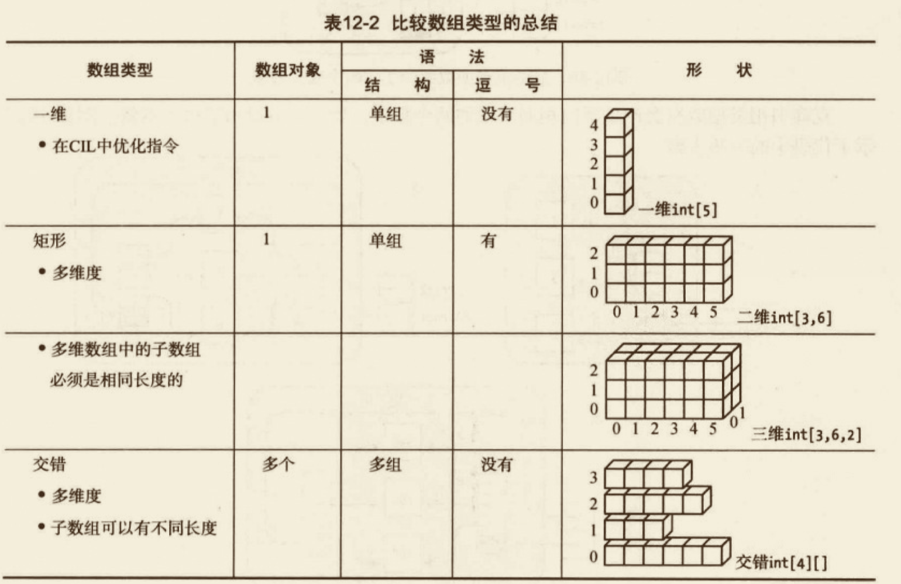

### 委托


### 事件

### 接口

### 转换

### 泛型

### 枚举器和迭代器

### LINQ

### 异步编程

### 命名空间和程序集

### 异常

### 预处理指令

### 反射和特性

### 其他主题

## 进阶活用

## 项目实战

## 底层原理

