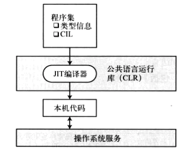
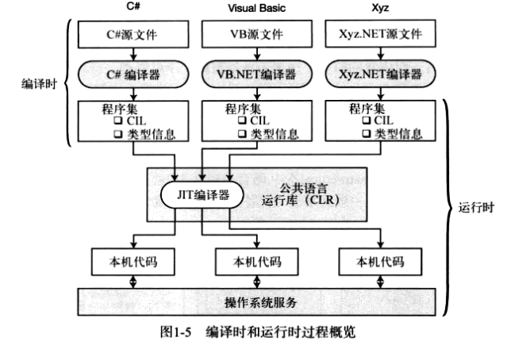

# C#语言

## 基础知识

### 简介

C# 是一个现代的、通用的、面向对象的编程语言，它是由微软（Microsoft）开发的，由 Ecma 和 ISO 核准认可的。

C# 是由 Anders Hejlsberg 和他的团队在 .Net 框架开发期间开发的。

C# 是专为公共语言基础结构（CLI）设计的。CLI 由可执行代码和运行时环境组成，允许在不同的计算机平台和体系结构上使用各种高级语言。

下面列出了 C# 成为一种广泛应用的专业语言的原因：

- 现代的、通用的编程语言。
- 面向对象。
- 面向组件。
- 容易学习。
- 结构化语言。
- 它产生高效率的程序。
- 它可以在多种计算机平台上编译。
- .Net 框架的一部分。

- 布尔条件（Boolean Conditions）
- 自动垃圾回收（Automatic Garbage Collection）
- 标准库（Standard Library）
- 组件版本（Assembly Versioning）
- 属性（Properties）和事件（Events）
- 委托（Delegates）和事件管理（Events Management）
- 易于使用的泛型（Generics）
- 索引器（Indexers）
- 条件编译（Conditional Compilation）
- 简单的多线程（Multithreading）
- LINQ 和 Lambda 表达式
- 集成 Window

### 环境：C#和 .NET 框架

C# 是在为微软公司的 .NET 框架上开发程序而设计的，它属于 .NET 框架的一部分。


编程工具涵盖乐编码和调试需要的一切，包括一下几点：
- Visual Studio 集成开发环境（IDE）。
- **.NET 兼容的编译器**（例如：C#、Visual Basic .NET、F#、IronRuby和托管的 C++）
- 调试器
- 网站开发服务端技术，比如 ASP.NET 或 WCF。
  
BCL （Base Class Libray，基类库）是 .NET 框架使用的一个大的类库，而且也可以在你的程序中使用。

.Net 框架是一个创新的平台，能帮您编写出下面类型的应用程序：

- Windows 应用程序
- Web 应用程序
- Web 服务
- .Net 框架应用程序是多平台的应用程序。框架的设计方式使它适用于下列各种语言：C#、C++、Visual Basic、Jscript、COBOL 等等。所有这些语言可以访问框架，彼此之间也可以互相交互。

**.Net 框架由一个巨大的代码库组成，用于 C# 等客户端语言**。下面列出一些 .Net 框架的组件：

- 公共语言运行库（Common Language Runtime - CLR）
- .Net 框架类库（.Net Framework Class Library）
- 公共语言规范（Common Language Specification）
- 通用类型系统（Common Type System）
- 元数据（Metadata）和组件（Assemblies）
- Windows 窗体（Windows Forms）
- ASP.Net 和 ASP.Net AJAX
- ADO.Net
- Windows 工作流基础（Windows Workflow Foundation - WF）
- Windows 显示基础（Windows Presentation Foundation）
- Windows 通信基础（Windows Communication Foundation - WCF）
- LINQ

#### 大大改进的编程环境

1. 面向对象的开发环境
2. 自动垃圾手机
3. 互操作性
4. 不需要 COM
5. 简化的部署，不需要使用注册表注册。
6. 类型安全性。
7. 基类库（Base Class Library，BCL）。在写自己的程序时，可以使用其中的类：
   - 通用基础类。文件操作、字符串操作、安全和加密。
   - 集合类。列表、字典、散列表以及位数组。
   - 线程和同步类。创建多线程。
   - XML 类。操作 XML 文档。

#### 编译成 CIL

**.NET 语言的编译器接受源代码文件，并生成名为程序集的输出文件**。
- 程序集要么是`可执行`的，要么是 `DLL`。
- 程序集里的代码并不是本机代码，而是一种名称为 CIL（Common Intermediate Language，公共中间语言）的中间语言。
- 程序集包含的信息中，包括下列项目：
  - 程序的 CIL；
  - 程序中使用的类型的元数据；
  - 对其他程序集引用的元数据。


#### 编译成本机代码并执行

程序的 CIL 直到它被调用时才会被编译成本机代码。在运行时，CLR 执行下面的步骤：
1. 检查程序集的安全特性；
2. 在内存中分配空间。
3. 把程序集中的可执行代码发送给实时（Just-in-Time，JIT）编译器，把其中的一部分编译成本机代码。



一旦 CIL 被编译成本机代码，CLR 就在它运行时管理它，执行像释放无主内存、检查数组边界、检查参数类型和管理异常之类的任务。

#### 编译时和运行时



#### CLR

.NET 框架的核心组件是 CLR，它在操作系统的顶层，负责管理程序的执行。CLR 还提供下列服务：
- 自动垃圾收集；
- 安全和认证；
- 通过访问 BCL 得到广泛的编程功能呢，包括如 Web 服务和数据服务之类的功能。

### 程序结构

#### C# Hello World 程序

一个 C# 程序主要包括以下部分：

- 命名空间声明（Namespace declaration）
- 一个 class 
- Class 方法
- Class 属性
- 一个 Main 方法
- 语句（Statements）& 表达式（Expressions）
- 注释

```c#
using System;

namespace start
{
    class MainClass {
        public static void Main(string[] args)
        {
            Console.WriteLine("Hello, Jeycu!");
        }
    }
}
```

- 程序的第一行 **using System**; - **using** 关键字用于在程序中包含** System** 命名空间。 一个程序一般有多个 **using **语句。
- 下一行是 **namespace** 声明。一个 **namespace** 里包含了一系列的类。HelloWorldApplication 命名空间包含了类 MainClass。
- 下一行是 **class** 声明。类 **MainClass** 包含了程序使用的数据和方法声明。类一般包含多个方法。方法定义了类的行为。在这里，HelloWorld 类只有一个 Main 方法。
- 下一行定义了 **Main** 方法，是所有 C# 程序的 **入口点**。**Main** 方法说明当执行时 类将做什么动作。
- 下一行 /*...*/ 将会被编译器忽略，且它会在程序中添加额外的 注释。
- Main 方法通过语句 **Console.WriteLine("Hello Jecyu!");** 指定了它的行为。
- WriteLine 是一个定义在 System 命名空间中的 Console 类的一个方法。该语句会在屏幕上显示消息 "Hello, Jecyu!"。
- 最后一行 **Console.ReadKey()**; 是针对 VS.NET 用户的。这使得程序会等待一个按键的动作，防止程序从 Visual Studio .NET 启动时屏幕会快速运行并关闭。

以下几点值得注意：
- C# 是大小写敏感的。
- 所有的语句和表达式必须以分号（;）结尾。
- 程序的执行从 Main 方法开始。
- 与 Java 不同的是，文件名可以不同于类的名称。

#### 编译 & 执行 C# 程序

如果您使用 Visual Studio.Net 编译和执行 C# 程序，请按下面的步骤进行：

1. 启动 Visual Studio。
2. 在菜单栏上，选择 File -> New -> Project。
3. 从模板中选择 Visual C#，然后选择 Windows。
4. 选择 Console Application。
5. 为您的项目制定一个名称，然后点击 OK 按钮。
6. 新项目会出现在解决方案资源管理器（Solution Explorer）中。
7. 在代码编辑器（Code Editor）中编写代码。
8. 点击 Run 按钮或者按下 F5 键来运行程序。会出现一个命令提示符窗口（Command Prompt window），显示 Hello World。

您也可以使用命令行代替 Visual Studio IDE 来编译 C# 程序：
1. 打开一个文本编辑器，添加上面提到的代码。
2. 保存文件为 helloworld.cs。
3. 打开命令提示符工具，定位到文件所保存的目录。
4. 键入 csc helloworld.cs 并按下 enter 键来编译代码。
5. 如果代码没有错误，命令提示符会进入下一行，并生成 helloworld.exe 可执行文件。
6. 接下来，键入 helloworld 来执行程序。
7. 您将看到 "Hello World" 打印在屏幕上。

## 进阶活用

## 项目实战

## 底层原理

