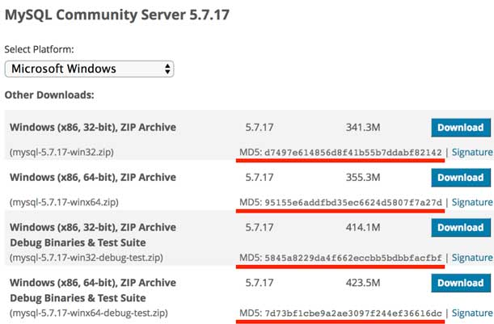
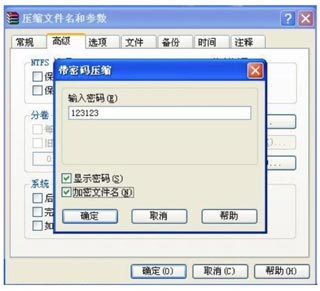

# Java

## 入门


### Java 虚拟机(JVM)

`JVM` 是 `Java Virtual Machine（Java虚拟机）` 的缩写，JVM 是一种用于计算设备的规范，**它是一个虚构出来的计算机**，是通过在实际的计算机上仿真模拟各种计算机功能来实现的。

Java 语言的一个非常重要的特点就是**与平台的无关性**。**而使用 Java 虚拟机是实现这一特点的关键。**<u>一般的高级语言如果要在不同的平台上运行，至少需要编译成不同的目标代码。</u>而**引入 Java 语言虚拟机后，Java 语言在不同平台上运行时不需要重新编译。**

Java 语言使用 Java 虚拟机屏蔽了与具体平台相关的信息，使得 Java 语言编译程序**只需生成在 Java 虚拟机上运行的目标代码(字节码)**，就可以在多种平台上不加修改地运行。Java 虚拟机在执行字节码时，把字节码解释成具体平台上的**机器指令(机器码)**执行。这就是 Java 的能够“一次编译，到处运行”的原因。

源文件 =》 字节码 =》JVM 读取 =》 机器码

### 机器码和字节码

首先，我们知道一段程序要想在电脑上运行，必须“翻译”成电脑能够听懂的，由 0，1 组成的二进制代码，这种类型的代码即称为机器码，机器码是计算机可以直接执行的、速度最快的代码。
在 Java 中，编写好的程序即通常的 `.java`文件需要经过编译器编译成 `.class` 文件，这段 `.class` 文件是一段包含着虚拟机指令、程序和数据片段的二进制文件，即`字节码`，为什么叫字节码？因为这种类型的代码以`一个字节 8bit 为最小单位储存`。

随着 Java 的发展，SUN 给 Java 又分出了三个不同版本：

- Java SE：Standard Edition
- Java EE：Enterprise Edition
- Java ME：Micro Edition

```bash
┌───────────────────────────┐
│Java EE                    │
│    ┌────────────────────┐ │
│    │Java SE             │ │
│    │    ┌─────────────┐ │ │
│    │    │   Java ME   │ │ │
│    │    └─────────────┘ │ │
│    └────────────────────┘ │
└───────────────────────────┘
```

简单来说，`Java SE` 就是标准版，包含标准的 JVM 和标准库，而 `Java E`E 是企业版，它只是 Java SE 的<u>基础上加上了大量的 API 和库</u>，以便方便开发 Web 应用、数据库、消息服务等，Java EE 的应用使用的虚拟机和 Java SE 完全相同。

Java ME 和 Java SE 不同，它是一个针对嵌入式的设备的“瘦身版”，JavaSE 的标准库无法在 Java ME 上使用，<u>Java ME 的虚拟机也是“瘦身版”。</u>

毫无疑问，Java SE 是整个 Java 平台，而 Java EE 是进一步学习 Web 应用所必须的。<u>我们熟悉的 `Spring` 等框架都是 `Java EE` 开源生态系统的一部分。</u>而不幸的，Java ME 从来没有真正流行起来，反而是 Android 开发成为了移动平台的标准之一，因此，没有特殊需求，不建议学习 Java ME。

因此我们推荐的 Java 学习路线图如下：

1. 首先要学习 Java SE，掌握 `Java 语言本身`、Java `核心开发技术`以及 `Java 标准库`的使用。
2. 如果继续学习 Java EE，那么 `Spring 框架`、`数据库开发`、`分布式架构`就是需要学习的。
3. 如果需要学习大数据开发，那么 Hadoop、Spark、Flink 这些大数据平台就是需要学习的，他们都基于 Java 或 Scala 开发；
4. 如果想要学习移动开发，那么就深入 Android 平台，掌握 Android App 开发。

### Java 版本

Java 版本
从 1995 年发布 1.0 版本开始，到目前为止，最新的 Java 版本是 Java 13：

| 时间   | 版本      |
| ------ | --------- |
| 1995   | 1.0       |
| 1998   | 1.2       |
| 2000   | 1.3       |
| 2002   | 1.4       |
| 2004   | 1.5 / 5.0 |
| 2005   | 1.6 / 6.0 |
| 2011   | 1.7 / 7.0 |
| 2014   | 1.8 / 8.0 |
| 2017/9 | 1.9 / 9.0 |
| 2018/3 | 10        |
| 2018/9 | 11        |
| 2019/3 | 12        |
| 2019/9 | 13        |
| 2020/3 | 14        |

### 名词解释

初学者学 Java，经常听到 `JDK`、`JRE` 这些名词，它们到底是什么？

- JDK：Java Development Kit（编译、调试）
- JRE：Java Runtime Enviroment（虚拟机）

(浏览器的 v8 引擎，解释并执行)

二者关系如下：

```bash
  ┌─    ┌──────────────────────────────────┐
  │     │     Compiler, debugger, etc.     │
  │     └──────────────────────────────────┘
 JDK ┌─ ┌──────────────────────────────────┐
  │  │  │                                  │
  │ JRE │      JVM + Runtime Library       │
  │  │  │                                  │
  └─ └─ └──────────────────────────────────┘
        ┌───────┐┌───────┐┌───────┐┌───────┐
        │Windows││ Linux ││ macOS ││others │
        └───────┘└───────┘└───────┘└───────┘
```

简单说，<u>`JRE` 就是运行 Java 字节码的`虚拟机`。但是如果只有 Java 源码，要编译成 Java 字节码，就需要 `JDK`，因为 JDK 除了包含 JRE，还提供了`编译器`、`调试器`等工具。</u>

要学习 Java 开发，当然需要安装 JDK 了。

那 JSR、JCP...... 又是啥？

- JSR 规范：Java Specification Request
- JCP 组织：Java Community Process

为了保证 Java 语言的规范性，SUN 公司搞了一个 JSR 规范，凡是想给 Java 平台加一个功能，比如说访问数据库的功能，大家要先创建一个 JSR 规范，定义好接口，这样，<u>各个数据库厂商都按照规范写出 Java 驱动程序，</u>开发者就不用担心自己写的数据库代码在 MySQL 上能跑，却不能跑在 PostgreSQL 上。

所以 JSR 是一系列的规范，为了

一个 JSR 规范发布时，为了让大家有个参考，还要同时发布一个“参考实现”，以及一个“兼容性测试套件”：

- RI：Reference Implementation
- TCK：Technology Compatibility Kit

比如有人提议要搞一个基于 Java 开发的消息服务器，这个提议很好啊，但是光有提议还不行，得贴出真正能跑的代码，这就是 RI。如果有其他人也想开发这样一个消息服务器，如何保证这些消息服务器对开发者来说接口、功能都是相同的？所以还得提供 TCK。

通常来说，RI 只是一个“能跑”的正确的代码，它不追求速度，所以，如果真正要选择一个 Java 的消息服务器，一般是没人用 RI 的，大家都会选择一个有竞争力的商用或开源产品。

### 编译器和解释器

#### 编译器

编译是从源代码（通常为**高级语言**）到能直接被计算机或虚拟机执行的目标代码（通常为**低级语言或机器语言**）的翻译过程。

#### 解释器

将相对高级的程序代码解释成电脑可以直接运行的机器码。

以 Java 为 例：

电脑是不能直接执行 Java 程序的，一个 `.java` 程序要想被执行，首先需要编译器将高级的 `.java` 程序文件编译成 `.class字节码`片段，字节码经过 `JVM(解释器)` 的处理后生成电脑可以直接执行的`机器码`，至此 `java程序` 才能得以正确运行。

#### 问题

##### C 有编译器，Python 有解释器，Java 有虚拟机，但这三个在原理上有区别和联系呢？尤其是从代码到底层机器运行的过程。

- 对于 C#，它源文件是通过 .Net 语言的编辑器（如 Visual Studio）下生成`可执行程序`或 `DLL`，而 C# 可以通过 Unity 引擎编译成不同的平台目标代码。
- `eclipse` 编译器自带了编译以及 jvm 的运行环境。

- `编译器`：把代码从这种语言改成哪种语言。

-（现代）解释器：`编译器`和`虚拟机`写在一起。

- `虚拟机`：通常指的是运行指令那样的`低级语言`。

因此，java 有 jvm 虚拟机可以跨平台，其他语言如 c、c#、python、js（v8 引擎解析）只要有现代（解释器）也一样可以跨平台执行中间代码，也不需要编译成适合平台的目标代码。例如，浏览器几乎是每台电脑上都可以安装，然后 v8 引擎解释执行 JavaScript 代码。

编译型语言如 C、C++、C#，<u>代码是直接编译成机器码运行，</u><u>但是不同的平台（x86、ARM 等）CPU 的`指令集`不同（还有就是同一个操作系统还分 x86、x64）</u>，因此，<u>需要编译出每一种平台的对应机器码</u>。解释型语言如 Python、Ruby 没有这个问题，可以由解释器加载源码然后运行，<u>代价是运行效率太低。</u>
Java 因为 JVM 运行效率高，原因是 Java 将代码编译成一种`“字节码”`，它类似于`抽象的 CPU 指令`，<u>然后针对不同平台编写虚拟机，</u>不同平台的虚拟机负责加载字节码并执行，这样就实现了“一次编写，到处运行”的效果。当然，这是针对 Java 开发者而言。<u>对于虚拟机，需要为每个平台分别开发。</u>为了保证不同平台、不同公司开发的虚拟机都能正确执行 Java 字节码，SUN 公司指定了一系列的 Java 虚拟机规范。（这个跟 W3C 制作不少规范，让浏览器去实现的道理一样）。从实践的角度看，`JVM` 的兼容性做得非常好，低版本的 Java 字节码完全可以正常运行在高版本的 JVM 上。

### 安装 JDK

因为 Java 程序必须运行在 JVM（JDK 中的 JRE），所以，我们第一件事情就是安装 JDK。

搜索 JDK 14，确保从 [Oracle](https://www.oracle.com/java/technologies/javase-downloads.html) 的官网下载最新的稳定版 JDK：

#### 设置环境变量

安装完 JDK 后， 需要设置一个 `JAVA_HOME` 的环境变量，它指向 JDK 的安装目录。把 `JAVA_HOME` 的 `bin` 目录添加到系统的 `PATH` 中是为了在任意文件夹下都可以运行 `java`。

在 Mac 下，它在 `~/.bash_profile` 或 `~/.zprofile` 里，下面的命令设置默认的 `JAVA_HOME` 指向 `14`，并写入到 `~/.bash_profile` 文件中（这个文件是 Shell 配置文件，也可以看到其他程序的配置，如 vscode）

```bash
echo 'export JAVA_HOME="/Library/Java/JavaVirtualMachines/jdk-14.0.1.jdk/Contents/Home"' >> ~/.bash_profile
```

然后，把 `JAVA_HOME` 的 `bin` 目录附加到系统变量 `PATH` 上。

```bash
echo 'export PATH=$JAVA_HOME/bin:$PATH' >> ~/.bash_profile
```

打开命令行终端，输入命令 `java -version`，如果一切正常，你会看到如下输出。

```bash
java -version # 查看默认的 Java_Home，即当前的运行环境
# java version "14" ...
#Java(TM) SE Runtime Environment
# Java HotSpot(TM) 64-Bit Server VM
```

也可以使用 `echo $JAVA_HOME` 查看默认的 java 版本。

```bash
/Library/Java/JavaVirtualMachines/jdk-14.0.1.jdk/Contents/Home
```

另外可以使用 -V 选项列出所有版本的 `JAVA_HOME`，列出所有的 `JAVA_HOME` 指向的 JDK 安装目录：

```bash
/usr/libexec/java_home -V

Matching Java Virtual Machines (2):
    14.0.1, x86_64:	"Java SE 14.0.1"	/Library/Java/JavaVirtualMachines/jdk-14.0.1.jdk/Contents/Home
    1.8.0_191, x86_64:	"Java SE 8"	/Library/Java/JavaVirtualMachines/jdk1.8.0_191.jdk/Contents/Home
```

（其实 JDK 跟前端工程化安装 Node 环境一样类似。）

如果你看到的版本号不是 `14`，而是`12`、`1.8`之类，说明系统存在多个 JDK，且默认 JDK 不是 JDK 14，需要把 JDK 14 提到 PATH 前面。

为了快速切换 java 版本，在 Mac 上可以使用 `jEnv` 工具。

1. 安装 jenv（类似 nvm 管理 node 版本工具，但 jenv 只能管理版本，并不能安装 JDK。）
2. 配置环境变量

```bash
echo 'export PATH="$HOME/.jenv/bin:$PATH"' >> ~/.bash_profile
echo 'eval "$(jenv init -)"' >> ~/.bash_profile
source ~/.bash_profile
```

3. 添加版本 `jenv add jdk安装的路径 # 这里的路径`，可以通过运行 `/usr/libexec/java_home -V` 查找 `JDK` 路径

```bash
jenv add /Library/Java/JavaVirtualMachines/jdk-14.0.1.jdk/Contents/Home
oracle64-14.0.1 added
14.0.1 added
14.0 added
```

4. 通过安装 jenv 插件，切换 JDK 版本时，将会同步设置 `${JAVA_HOME}` 变量。

```bash
jenv enable-plugin export
## 运行这个才会生效
```

4. 查看当前系统 jenv 管理所有 JDK 版本。

```bash
jenv versions
```

5. 切换版本

```bash
jenv local xxx # 这里需要注意的，jenv local 切换 JDK 版本只对当前文件夹有效,如果切换到其他文件夹，将会切换会当前默认 JDK 版本
jenv global xxxx # jenv global 将会设置一个全局默认的 JDK 版本，即使重启 Shell 窗口，该配置也不会改变
```

#### JDK

在 `JAVA_HOME` 指向 JDK 的 `bin` 目录下可以周到很多可执行文件：

- **java**：这个可执行程序其实就是 JVM，运行 Java 程序，就是启动 JVM ，然后让 JVM 执行指定的编译后的代码；
- **javac**：这是 Java 的编译器，它用于把 Java 源码文件（以 `.java` 后缀结尾）编译为 Java 字节码文件（以 `.class`后缀结尾）；
- **jar**：用于把一组 `.class` 文件打包成一个 `.jar` 文件，便于发布；
- **javadoc**：用于从 Java 源码中自动提取注释并生成文档；
- **jdb**：Java 调试器，用于开发阶段的运行调试。

### 第一个 Java 程序

```java
public class Hello {
  public static void main(String[] args) {
    System.out.println("Hello, word!");
  }
}
```

在一个 Java 程序中，你总能找到一个类似：

```java
public class Hello {
  ...
}
```

的定义，这个定义被称为 class(类)，这里的类名是 `Hello`，大小写敏感，`class` 用来定义一个类，`public` 表示这个类是公开的，`public`、`class` 都是 Java 的关键字，必须小写，`Hello` 是类的名字，按照习惯，首字母 `H` 要大写。而花括号 `{}` 中间则是类的定义。

注意到类的定义中，我们定义了一个名为 `main` 的方法：

```java
public static void main(String[] args) {
  ...
}
```

方法是可执行的代码块，一个方法除了`main`，还有用 `()` 括起来的方法参数参数类型是 `String[]`，参数名是 `args`，`public`，`static` 用来修饰方法，这里表示它是一个公开的静态方法，`void` 是方法的返回类型，而花括号 `{}` 中间的就是方法的代码。

方法的代码每一行用 `;` 结束，这里只有一行代码，就是

```java
System.out.println("Hello, world!");
```

<u>Java 规定，某个类定义的 `public static void main(String[] args)` Java 程序的`固定入口`方法，因此，Java 程序总是从 `main` 方法执行的。</u>

注意到 Java 源码的缩进不是必须的，但是用缩进后，格式好看，很容易看出代码块的开始和结束，缩进一般是 4 个空格或者一个 tab。（生产环境下，则经过压缩，去掉不必要的空白符。）

最后，<u>当我们把代码保存为文件时，文件名必须时 `Hello.java`，而且文件名也要注意大小写，因为要和我们定义的类名 `Hello` 完全保持一致。</u>

#### 如何运行 Java 程序

Java 源码本质上是一个文本文件，我们需要先用 `javac` 把 `Hello.java` 编译成字节码文件 `Hello.class` ，然后，用 `java` 命令执行这个字节码文件：

```bash
┌──────────────────┐
│    Hello.java    │<─── source code
└──────────────────┘
          │ compile
          ▼
┌──────────────────┐
│   Hello.class    │<─── byte code
└──────────────────┘
          │ execute
          ▼
┌──────────────────┐
│    Run on JVM    │
└──────────────────┘
```

因此，可执行文件 `javac` 是编译器，而可执行文件 `java` 就是虚拟机。

第一步，在保存呢 `Hello.java` 的目录下执行命令：

```bash
$ javac Hello.java
```

如果源代码无误，上述命令不会有任何输出，而当前目录下会产生一个 `Hello.class` 文件：

```bash
$ ls
Hello.class Hello.java
```

第二步：执行 `Hello.class`，使用命令：

```
$ java Hello
Hello, world!
```

<u>注意：给虚拟机传递的参数 `Hello` 是我们定义的类名，虚拟机自动查找对应的 class 文件并执行。</u>

另外，直接运行 `java Hello.java` 也是可以的：

```bash
$ java Hello.java
Hello, world!
```

这是 Java 11 新增的一个功能，它可以直接运行一个单文件源码！

<u>需要注意的是，在实际项目中，单个不依赖第三方库的 Java 源码是非常罕见的，所以，绝不大多数情况下，我们无法直接运行一个 Java 源码文件，原因是它需要依赖其他的库。</u>

（备注：TODO，怎么运行，需要用例子来证明。）

打包 `jar` 文件命令：

```bash
$ jar cvf test.jar Hello.class
```

<!-- 第三库是打包成 `.class` 的 jar 包，因此可以使用命令行这样
```bash
// 同一目录
```
```
$ java -classpath xxxx.jar
// 不同目录
$ java
``` -->

如果要利用原始的 javac 编译整个 Java 项目，可以看这篇文章利用脚本批量编译。[利用原始的 javac 编译整个 Java 项目](https://zhuanlan.zhihu.com/p/29345229)，这也是有应用场景的，当你要部署的主机上没有任何软件。

（Java 中的 package 和 import，跟 C# 的 namespace 和 using 类似？后续研究）

#### 小结

- 一个 Java 源码只能定义一个 `public` 类型的 class，并且 class 名称和文件名要完全一致；
- 使用 `javac` 可以 `.java` 源码编译成 `.class` 字节码；
- 使用 `java` 可以运行一个已编译的 Java 程序，参数是类名。

### 使用 IDE

IDE 是集成开发环境：Integrated Development Environment 的缩写。

使用 IDE 的好处在于，<u>可以把编写代码、组织项目、编译、运行、调试等放到一个环境中运行，能极大地提高开发效率。</u>

IDE 提升开发效率主要靠以下几点：

- 编辑器的自动提示，可以大大提高敲代码的速度；
- 代码修改后可以自动重新编译，并直接运行；
- 可以方便地进行断点调试。

目前，流行的用于 Java 开发的 IDE 有：

**Eclipse**

[Eclipse](https://www.eclipse.org/) 是由 IBM 开发并捐赠给开源社区的一个 IDE，也是目前应用最广泛的 IDE。Eclipse 的特点是它本身是 Java 开发的，并且基于插件结构，即是对 Java 开发的支持也是通过插件 `JDT` 实现的。

**IntelliJ Idea**

[IntelliJ Idea](https://www.jetbrains.com/idea/) 是由 JetBrains 公司开发的一个功能强大的 IDE，分为免费版和商用付费版。JetBrains 公司的 IDE 平台也是基于 IDE
平台 + 语言插件的模式，支持 Python 开发环境、Ruby 开发环境、PHP 开发环境等，这些开发环境也分为免费版和付费版。

**NetBeans**

[NetBeans](https://netbeans.org/) 是最早由 SUN 开发的开源 IDE，由于使用人数较少，目前已不再流行。

[Eclipse](Eclipse) 是由 JetBrains 公司开发的一个功能强大的 IDE

#### 使用 Eclipse

- 完全免费
- 所有功能完全满足 Java 开发需求。

#### 安装 Eclipse

下载的版本是：Eclipe IDE for Java Developers：


#### 设置 Eclipse

下载并安装完成后，我们启动 Eclipse，对 IDE 环境做一个基本设置：

选择菜单“Eclipse” - “Preferences”，打开配置对话框：


我们需要调整以下设置项：

##### General > Editors > Text Editors

钩上“Show me line numbers”，这样编辑器会显示行号；

##### General > Workspace

钩上“Refresh using native hooks or polling”，这样 Eclipse 会自动刷新文件夹的改动；


对于 “Text file encoding”，如果 Default 不是 `UTF-8`，一定要改为“Ohter：UTF-8”，所有文本你文件均使用 `UTF-8` 编码；

对于 “New text file line delimiter”，建议使用 Unix，即换行符使用 `\n` 而不是 Windows 的 `\r\n`。

##### Java > Compiler

将 “Complier compliance level” 设置为 `14`，去掉“Use default compliance settings” 并钩上“Enable preview features for Java 14”，这样我们就可以使用 Java 14 的预览功能。


上图是 eclipse 添加安装到主机上的 jre ，供 eclipse 环境选择。IDE 工具并不是说编译、运行的 `JRE` 环境都安装了，它只不过是把前面安装的 JDK 工具引用集成到工具中，便于开发。（例如 visual studio code 运行 node 程序，也要先在电脑上安装了 Node.js 的编译运行环境，v8 引擎。）

然后进行 Java Compile 版本的设置

Eclipse 中 普通 Java 工程与 Java EE 工程 Java Compile 版本设置时是分开的。

普通 Java 工程

- Properties > Java Compiler

J2EE 工程

- Properties -> Project Facets -> Java facet


### 使用 IDE 练习插件

Eclipse 安装反编译插件，查看 `.class` 文件的源码

#### 安装 IDE 练习插件

Eclipse 插件是什么？

- [Eclipse 插件开发基础实践（1）——一个 Hello World 插件](https://www.jianshu.com/p/11fe13b77777)
- [21 款好用的 Eclipse 插件](https://juejin.im/entry/5a055c3af265da4312806086)
- [Eclipse 插件终极攻略（一）:基本概念介绍](https://blog.csdn.net/canlets/article/details/27568885)

启动 Eclipse，选择菜单”Help“ - ”Install New Software...“，在打开的对话框：

点击 “Add”，对 Name 填写一个任意的名称，例如“Java Practive Plugin”，对于 Location，填入`https://liaoxuefeng.gitee.io/learn-java-update-site/`，然后点击“Add” 添加：

如果出现了该网站地址不可访问，可以到[https://gitee.com/liaoxuefeng/learn-java-update-site](https://gitee.com/liaoxuefeng/learn-java-update-site) 直接下载源码解压，然后从本地导入进来。


在列表中选中”Java Practice Feature“，然后点击”Next“ 安装。

在安装过程中，由于插件代码没有数字签名，所以会弹出一个警告：


选择 ”Install anyway“ 继续安装，安装成功后，根据提示重启 Eclipse 即可。


重启 Eclipse 后，选择菜单 ”Window“ - ”Show View（视图）“ - ”Other...“


#### 导入练习

在 “Java Practice” 面板中，双击 “hello.zip”，按照提示导入工程，即可直接下载并导入到 Eclipse 中：


## 基础

### Java 程序基本结构

```java
/**
 *
 *
 * @author
 */
public class Main {

	public static void main(String[] args) {
		System.out.println("Hello Java!");
	}

}

```

因为 Java 是面向对象的语言，一个程序的基本单位就是 `class`，`class` 是关键字，这里定义的 `class` 名字就是 `Hello`：

```java
public class Hello { // 类名是 Hello
  // ...
  // class 定义结束
}
```

注意到 `public` 是访问修饰符，表示该 `class` 是公开的。

不写 `public`，也能正确编译，但是这个类将无法从命令行执行。（测试后，可以从命令行进行）

在 Eclipse 中提交了快捷键 `Ctrl + Shift + F`（macOS 是 ⌘+⇧+F）帮助我们快速格式代码的功能。Eclipse 应该也有类似的插件如 vscode 中的 preitter 等格式化代码。

### 变量和数据类型

#### 什么是变量？

变量就是初中数学的代数的概念，例如一个简单的方程，x，y 都是变量：

y = x^2 + 1

在 Java 中，变量分为两种：`基本类型`的变量和`引用类型`的变量。

执行 `int n = 100;`，该语句定义了变量 `n`，同时赋值为 `100`，因此，JVM 在内存中为变量 `n` 分配一个`存储单元`，填入值 `100`

```bash
      n
      │
      ▼
┌───┬───┬───┬───┬───┬───┬───┐
│   │100│   │   │   │   │   │
└───┴───┴───┴───┴───┴───┴───┘
```

#### 基本类型

<u>基本数据类型是 CPU 可以直接运算的类型。</u>Java 定义了以下几种基本数据类型：

- 整数类型：byte，short，int，long
- 浮点数类型：float，double
- 字符类型：char
- 布尔类型：boolean

Java 定义的这些基本数据类型有什么区别呢？要了解这些区别，我们就必须简单了解一下计算机内存的基本结构。

计算机内存的`最小存储单元`是`字节（byte）`，一个字节就是一个 8 位二进制数，即 `8` 个 `bit`。它的二进制表示范围从 `00000000`~`11111111`，换算成十进制是 `0~255`，换算成十六进制是 `00`~`ff`。

`内存单元`从 0 开始编号，称为`内存地址`。每个内存单元可以看作一间房间，内存地址就是门牌号。

```bash
  0   1   2   3   4   5   6  ...
┌───┬───┬───┬───┬───┬───┬───┐
│   │   │   │   │   │   │   │...
└───┴───┴───┴───┴───┴───┴───┘
```

<u>一个字节是 1 `byte`，1024 字节是 1k，1024K 是 1M，1024M 是 1G，1024G 是 1T</u>。一个拥有 4T 内存的计算机的字节数量就是：

```bash
4T = 4 x 1024G
   = 4 x 1024 x 1024M
   = 4 x 1024 x 1024 x 1024K
   = 4 x 1024 x 1024 x 1024 x 1024
   = 4398046511104
```

不同的数据离诶行占用的字节数不一样呢。我们看一下 Java 基本数据类型占用的字节数：

```bash
       ┌───┐
  byte │   │
       └───┘
       ┌───┬───┐
 short │   │   │
       └───┴───┘
       ┌───┬───┬───┬───┐
   int │   │   │   │   │
       └───┴───┴───┴───┘
       ┌───┬───┬───┬───┬───┬───┬───┬───┐
  long │   │   │   │   │   │   │   │   │
       └───┴───┴───┴───┴───┴───┴───┴───┘
       ┌───┬───┬───┬───┐
 float │   │   │   │   │
       └───┴───┴───┴───┘
       ┌───┬───┬───┬───┬───┬───┬───┬───┐
double │   │   │   │   │   │   │   │   │
       └───┴───┴───┴───┴───┴───┴───┴───┘
       ┌───┬───┐
  char │   │   │
       └───┴───┘
```

`byte` 恰好就是一个字节，而 `long` 和 `double` 需要 8 个字节。

#### 整型

对于整型类型，Java 只定义了带符号的整型。因此，最高位的 bit 表示符号位（0 表示正数，1 表示负数）。各种整型的最大范围如下：

- byte：-128 ～ 127
- short：-32768 ～ 32767
- int：-2147483648 ～ 2147483647
- long：-9223372036854775808 ~ 9223372036854775807

long 型的结尾需要加 L。

特别注意：同一个数的不同进制的表示是完全相同的，例如 `15` = `0xf` = `0b1111`。

#### 浮点型

浮点类型的数就是`小数`，<u>因为小树用科学计数法表示的时候，小数点是可以“浮动”</u>的，如 1234.5 可以表示成 12.345 _ 10^2，也可以表示成 1.2345 _ 10^3，所以称为浮点数。

```java
float f1 = 3.14f;
float f2 = 3.14e38f; // 科学计数法表示的 3.14*10^38
double d = 1.79e308;
double d2 = -1.79e308;
double d3 = 4.9e-324 // 科学计数表示的 4.9*10^-324
```

浮点数可表示的范围非常大，`float` 类型可最大表示 3.4 * 10^38，而 `double` 类型可最大表示 1.79*10^308。

计算：对于单精度浮点数（float）来说，有百一位符号位，指数位共 8 位，尾数共 23 位。指数能够表示的指数度范围为-128~127。尾数为 23 位。当尾数全 1 时再加上小数点知前面的 1，指数取到最大正数 127（8 位，正数最大 127，负数最小-128）,浮点数取得正数的最大值。

+1.111111111111111111111*2^道 127（1.后面 23 个 1，由于尾数的范围 1 ～ 2，其最高位总为 1，故只需存取小数部分，所以小数为版是 23 位 1），约等于 2*2^127=3.4*10^38。为 3.4*10^38 负数亦然。

Double 的计算与此类似，double 的符号位为 63 位，指数为 62 ～ 52 位，共权 11 位。表示的范围为-1024 ～ 1023。尾数为 51 ～ 0。表示的范围为+1.111111111111111111111*2^1023（1.后面 52 个 1）为 1.7*10^308。负数亦然。

#### 布尔类型

#### 字符类型

#### 引用类型

#### 常量

#### var 关键字

#### 变量的作用域范围

### 整数运算

### 浮点数运算

### 布尔运算

### 字符和字符串

### 数组类型

## 类与对象

## 异常处理

## 反射

## 注解

## 泛型

## 集合

## IO

### 基础

IO 是指 Input/Output，即输入和输出。以内存为中心：

- Input 指从`外部`读入数据`到内存`，例如，把文件从磁盘读取到内存，从网络读取数据到内存等等。
- Output 指从`内存`输出`到外部`，例如，把数据从内存写入到文件，把数据从内存输出到网络等。

为什么要把数据读到内存才能处理这些数据？因为代码是在内存中运行的，数据也必须读到内存，最终的表示方式无非是 `byte 数组`，`字符串`等，都必须存放到内存里。

从 Java 代码来看，输入实际上就是从外部，例如，硬盘上的某个文件，把内容读到内存，并且以 Java 提供的某种数据类型表示，例如，`byte[]`，`String`，这样，后续代码才能处理这些数据。

因为内存有“易失性”的特点，所以必须要把处理后的数据以某种方式输出，例如，写入到文件。Output 实际上就是把 Java 表示的数据格式，例如 `byte[]`，`String[]` 等输出到某个地方。

`字节`是最基本的计量单位，你可以使用`字节数组`来存储`二进制数据`的`集合`，例如文件的内容。这样做的缺点是<u>必须把整个文件内容加载到内存中。</u>对于大量二进制数据，如果语言支持，最好使用`流数据模型`。

IO 流是一种顺序读写数据的模式，它的特点是`单向流动`。数据类似自来水一样在水管中流动，所以我们把它称为 `IO 流`。


#### InputStream/OutputStream

IO 流以 `byte（字节）`为最小单位，因此也称为`字节流`。例如，我们要从磁盘上读入一个文件，包含 6 个字节，就相当于读入了 6 个字节的数据。

```ascii
╔════════════╗
║   Memory   ║
╚════════════╝
       ▲
       │0x48
       │0x65
       │0x6c
       │0x6c
       │0x6f
       │0x21
 ╔═══════════╗
 ║ Hard Disk ║
 ╚═══════════╝
```

这 6 个字节是按顺序读入的，所以是输入字节流。

反过来，我们把 6 个字节从内存写入磁盘文件，就是输出字节流：

```ascii
╔════════════╗
║   Memory   ║
╚════════════╝
       │0x21
       │0x6f
       │0x6c
       │0x6c
       │0x65
       │0x48
       ▼
 ╔═══════════╗
 ║ Hard Disk ║
 ╚═══════════╝
```

在 Java 中，`InputStream` 代表输入字节流，`OutStream` 代表输出字节流，这是最基本的两种 IO 流。

#### Reader/Writer

如果我们需要读写的是字符，并且字符不全是单字节表示 ASCII 字符，那么，按照 `char` 来读写显然更方便，这种流称为 `字符流`。

例如，我们把 `char[]` 数组 `Hi你好`这 4 个字符用 `Writer` 字符流写入文件，并且使用 `UTF-8` 编码，得到最终文件内容是 8 （1+1+3+3）个字节，英文字符 `H` 和 `i` 各占一个字节，中文字符`你好`各占 3 各字节。

下面是 16 进制的表示

```bash
0x48
0x69
0xe4bda0
0xe5a5bd
```

反过来，我们用 `Reader` 读取以 `UTF-8` 编码的这 8 个字节，会从 `Reader` 中得到 `Hi你好` 这 4 个字符。

`Reader` 和 `Writer` 本质上是一个能自动`编解码`的 `InputStream` 和 `OutputStream` 。

使用 `Reader`，`数据源`虽然是字节，但我们读入的数据都是 `char` 类型的字符，<u>原因是 `Reader` 内部把读入的 `byte` 做了解码，转换成了 `char`。</u>使用 `InputStream`，我们读入的数据和原始二进制数据一摸一样，是 `byte[]` 数组，但是我们可以自己把二进制 `byte[]` 数组按照某种编码转换为字符串。<u>究竟使用 `Reader` 还是 `InputStream`，要取决于具体的使用场景。如果数据源不是文本，就只能用 `InputStream`，如果数据源是文本，使用 `Reader` 更方法一些。`Writer` 和 `OutputStream` 是类似的。</u>

#### 同步和异步

同步 IO 是指，读写 IO 时代码必须等待数据返回后才继续执行后续代码，它的优点是代码编写简单，缺点是 CPU 执行效率低。

而异步 IO 是指，读写 IO 时仅发出请求，然后立刻执行后续代码，它的优点是 CPU 执行效率高，缺点是代码编写复杂。

Java 标准库的包 `java.io` 提供了同步 IO，而 `java.nio` 则是异步 IO。上面我们讨论的 `InputStream`、`OutputStream`、`Reader` 和 `Writer` 都是同步 IO 的抽象类，对应的`具体实现类`，以文件为例，有 `FileInputStream`、`FileOutputStream`、`FileReader` 和 `FileWriter`。

#### 小结

IO 流是一种流式的数据输入/输出模型：

- 二进制数据以 `byte` 为最小单位在 `InputStream`/`OutputStream` 中单向流动；
- 字符数据以 `char` 为最小单位在 `Reader`/`Writer` 中单向流动。

Java 标准库的 `java.io` 提供了同步功能的 IO 功能：

- 字节流接口：`InputStream`/`OutputStream`
- 字符流接口：`Reader`/`Writer`

### File 对象

在计算机系统中，文件是非常重要的存储方式。Java 的标准库 `java.io` 提供了 `File` 对象来操作文件和目录。

要构造一个 `File` 对象，需要传入文件路径：

注意 Windows 平台使用 `\` 作为路径分隔符，在 Java 字符串中需要用 `\\` 表示一个 `\`。Linux 平台使用 `/` 作为路径分隔符：

可以用 `.` 表示当前目录，`..` 表示上级目录。

#### 文件和目录

#### 创建和删除文件

#### 遍历文件和目录

### InputStream

InputStream 就是 Java 标准库提供的最基本的输入流。它位于 java.io 这个包里。java.io 包提供了所有同步 IO 的功能。

要特别注意的一点是，InputStream 并不是一个接口，而是一个抽象类，它是所有输入流的超类。这个抽象类定义的一个最重要的方法就是 int read()，签名如下：

```java
public abstract int read() throws IOException;
```

`这个方法读取输入流的下一个字节，并返回字节表示的`int`值（0 ～ 255）。`如果已读到末尾，返回`-1` 表示不能继续读取了。

`FileInputStream` 是 InputStream 的一个子类。顾名思义，FileInputStream 就是从文件流中读取数据。

```java
public void readFile() throws IOException {
    // 创建一个FileInputStream对象:
    InputStream input = new FileInputStream("src/readme.txt");
    for (;;) {
        int n = input.read(); // 反复调用read()方法，直到返回-1
        if (n == -1) {
            break;
        }
        System.out.println(n); // 打印byte的值
    }
    input.close(); // 关闭流
}
```

在计算机中，类似文件、网络端口这些资源，都是由操作系统统一管理的。应用程序在运行的过程中，如果打开了一个文件进行读写，完成后要及时地关闭，以便让操作系统把资源释放掉，否则，应用程序占用的资源回越来越多，不但白白占用内存，还会影响其他应用程序的运行。

`InputStream` 和 `OutputStream` 都是通过 `close()` 方法来关闭流。关闭流就会释放对应的底层资源。

利用 Java 7 引入的新的 `try(resource)` 的语法，只需要写 `try` 语句，让编译器自动为我们关闭资源（无论读取过程中是否发生了 IO 错误）。

```java
	private static void InputStreamTest1() throws IOException {
		try (InputStream input = new FileInputStream("../file.txt")) {
			int n;
			while ((n = input.read()) != -1) {
				System.out.println(n);
			}
		}
	}
```

#### 缓冲

在读取流的时候，一次读取一个字节并不是最高效的方法。`很多流支持一次性读取多个字节到缓冲区，对于文件和网络流来说，利用缓冲区一次性读取多个字节流效率往往要高很多`。`InputStream` 提供了两个重载方法来支持读取多个字节：

- `int read(byte[] b)` ：读取若干字节并填充到 `byte[]` 数组，返回读取的字节数

```java
public void readFile() throws IOException {
    try (InputStream input = new FileInputStream("src/readme.txt")) {
        // 定义1000个字节大小的缓冲区:
        byte[] buffer = new byte[1000];
        int n;
        while ((n = input.read(buffer)) != -1) { // 读取到缓冲区
            System.out.println("read " + n + " bytes.");
        }
    }
}
```

#### 阻塞

在调用 `InputStream` 的 `read()` 方法读取数据时，我们说 `read()` 方法时阻塞（Blocking）的。

### OutputStream

和 `InputStream` 相反，`OutputStream` 是 Java 标准库提供的最基本的输出流。

和 `InputStream` 类似，`OutputStream` 也提供了 `close()` 方法关闭输出流，以便释放系统原理。要特别注意：`OutputStream` 还提供了一个 `flush` 方法，它的目的是将缓冲区的内容真正输出到目的地。

为什么要有 `flush` ？因为向磁盘、网络写入数据的时候，出于效率的考虑，操作系统并不是输出一个字节就立刻写入到文件或者发送到网络，而是把输出的字节先放到内存的一个`缓冲区`里（本质上就是一个 `byte[]` 数组），等到缓冲区写满了，再一次性写入文件或者网络。<u>对于很多 IO 设备来说，一次写一个字节和一次写 1000 个字节，花费的时间几句是一样的，所以 `OutputStream` 有个 `flush` 方法（这个方法也用到浏览器页面渲染），能强制把缓冲区内容输出。</u>

通常情况下，我们不需要调用这个 `flush()` 方法，因为缓冲区写满了 `OutputStream` 会自动调用它，并且，在调用 `close()` 方法关闭 `OutputStream` 之前，也会自动调用 `flush` 方法。

但是，在某些情况下，我们必须手动调用 `flush()` 方法。举个例子：

小明正在开发一款在线聊天软件，当用户输入一句话后，就通过 `OutputStream` 的 `write()` 方法写入网络流。小明测试的时候发现，发送方输入后，接收方根本收不到任何信息，怎么回事？

原因就在于写入网络流是先写入内存缓冲区，等缓冲区满了才会一次性发送到网络。如果缓冲区大小是 4K（4 \* 1024 个字节），则发送方要敲几千个自负后，操作系统才会把缓冲区的内容发送出去，这个时候，接收方会一次性收到大量信息。

解决方法就是<u>每输入一句话后，立刻调用 `flush()` ，不管当前缓冲区是否已满，强迫操作系统把缓冲区的内容立刻发送出去。 </u>

实际上，`InputStream` 也有缓冲区。例如，从 `FileInputStream` 读取一个字节时，操作系统往往会一次性读取若干字节到缓冲区，并维护一个指针指向未读的缓冲区。然后，每次我们调用 `int read()` 读取下一个字节时，可以直接返回缓冲区的下一个字节，避免每次读一个字节都导致 IO 操作。当缓冲区全部读完后继续调用 `read()`，则会触发操作系统的下一次读取并再次填满缓冲区。

#### FileOutputStream

```java
	public static void writeFile() throws IOException {
		OutputStream output = new FileOutputStream("./readme.txt");
		output.write(72); // H
		output.write(101); // e
		output.write(108); // l
		output.write(108); // l
		output.write(111); // o
		output.close();
	}
```

```java
public static void writeFile2() throws IOException {
		OutputStream output = new FileOutputStream("./readme.txt");
		output.write("Hello".getBytes("UTF-8")); // Hello
		output.close();
	}
```

和 `InputStream` 一样，上述代码没有考虑到在发生异常的情况下如何正确地关闭资源。写入过程也会经常发生 IO 错误。例如，磁盘已满，无权限写入等等。我们需要用 `try(resource)` 来保证 `OutputStream` 在无论是否发生 IO 错误的时候都能够正确地关闭：

```java
public static void writeFile3() throws IOException {
		try (OutputStream output = new FileOutputStream("./readme.txt")) {
			output.write("Hello".getBytes("UTF-8")); // Hello
		} // 编译器会在此自动为我们写入 finally 并调用 close()
	}
```

#### 阻塞

和 `InputStream` 一样，`OutputStream` 的 `write()` 方法也是阻塞的。

#### OutputStream 实现类

#### 小结

Java 标准库的 `java.io.OutputStream` 定义了所有输出流的超类：

- `FileOutStream` 实现了文件流输出；
  <!-- - `ByteArrayOutputStream` 在内存中模拟一个字节流输出。 -->

某些情况下需要手动调用 `OutputStream` 的 `flush()` 方法来强制输出缓冲区。

总是使用 `try(resource)` 来保证 `OutputStream` 正确关闭。

### Filter 模式（装饰器模式 Decorator）

Java 的 IO 标准库提供的 `InputStream` 根据来源可以包括：

- `FileInputStream`：从文件读取数据，是最终数据源；
- `ServletInputStream`：从 HTTP 请求读取数据，是最终数据源；
- `Socket.getInputStream()`：从 TCP 连接读取数据，是最终数据源；

为了解决依赖继承会导致子类数量失控的问题，JDK 首先将 `InputStream` 分为两大类：

一类是直接提供数据的基础 `InputStream`，例如：

- FileInputStream
- ByteArrayInputStream
- ServeletInputStream
- ...

一类是提供额外附加功能的 `InputStream`，例如：

- BufferedInputStream
- DigestInputStream
- CipherInputStream
- ...

### 操作 Zip

`ZipInputStream` 是一种 `FilterInputStream`，它可以直接读取 zip 包的内容：

```bash
┌───────────────────┐
│    InputStream    │
└───────────────────┘
          ▲
          │
┌───────────────────┐
│ FilterInputStream │
└───────────────────┘
          ▲
          │
┌───────────────────┐
│InflaterInputStream│
└───────────────────┘
          ▲
          │
┌───────────────────┐
│  ZipInputStream   │
└───────────────────┘
          ▲
          │
┌───────────────────┐
│  JarInputStream   │
└───────────────────┘
```

#### 读取 zip 包

我们要创建一个 `ZipInputStream`

#### 写入 zip 包

#### 小结

`ZipInputStream` 可以读取 zip 格式的流，`ZipOutputStream` 可以把多份数据写入 zip 包；

配合 `FileInputStream` 和 `FileOutputStream` 就可以读写 zip 文件。

### 读取 classpath 资源

我们知道，Java 存放 `.class` 的目录或 jar 包可以包含任意其他类型的文件，例如：

- 配置文件，例如 `.properties`。
- 图片文件，例如 `.jpg`。
- 文本文件，例如 `.txt`，`.csv`。

从 classpath 读取文件就可以避免不同环境下（window、linux）文件路径不一致的问题：如果我们把 `default.properties` 文件放到 classpath 中，就不用关心它的实际存放路径。

在 classpath 中的资源文件，路径总是以 `/` 开头，我们先获取当前的 `Class` 对象，然后调用 `getResourceAsStream()` 就可以直接从 classpath 读取任意的资源文件：

```java
try (InputStream input = getClass().getResourceAsStream("/default.properties")) {
  // TODO
}
```

#### 小结

把资源放在 classpath 可以避免文件路径依赖；

Class 对象的 `getResourceAsStream()` 可以从 classpath 中读取指定资源。

根据 classpath 读取资源时，需要检查返回的 `InputStream` 是否为 `null`。

### 序列化

`序列化`是<u>指把一个 Java 对象变成二进制内容，</u>本质上就是一个 `byte[]` 数组。

为什么要把 Java 对象序列化呢？因为序列化后可以把 `byte[]` 保存到文件中，或者把 `byte[]` 通过网络传输到远程，这样，就相当于把 `Java 对象存储到文件或者通过网络传输出去`了。

一个 Java 对象要能序列化，必须实现一个特殊的 `java.io.Serializable` 接口，它的定义如下：

```java
public interface Serializable {}
```

`Serializable` 接口没有定义任何方法，它是一个空接口。我们把这样的空接口称为“标记接口”（Marker Interface），实现了标记接口的类仅仅是给自身贴了个 “标记”，并没有增加任何方法。

有序列化，就有反序列化，即把一个二进制内容（也就是 `byte[]` 数组）变回 `Java 对象`。有了反序列化，保存到文件中的 `byte[]` 数组又可以“变回” Java 对象，或者从网络上读取 `byte[]` “变回” Java 对象。

#### 序列化

把一个 Java 对象变为 `byte[]` 数组，需要使用 `ObjectOutputStream`。它负责把一个 Java 对象写入一个字节流。

```java
	public static void serializableTest() throws IOException {
		ByteArrayOutputStream buffer = new ByteArrayOutputStream();
		try (ObjectOutputStream output = new ObjectOutputStream(buffer)) {
			// 写入 int
			output.writeInt(12345);
			// 写入 String
			output.writeUTF("Hello");
			// 写入 object
			output.writeObject(Double.valueOf(123.456));
		}
		System.out.println(Arrays.toString(buffer.toByteArray()));
	}
```

`ObjectOutputStream` 既可以写入基本类型，如 `int`、`boolean`，也可以写入 `String`（以 UTF-8 编码），还可以写入实现了 `Serializable` 接口的 `Object`。

因为写入 `Object` 时需要大量的类型信息，所以写入的内容很大。

#### 反序列化

和 `objectOutputStream` 相反，`ObjectInputStream` 负责从一个字节流读取 Java 对象：

```java
try (ObjectInputStream input = new ObjectInputStream(...)) {
  int n = input.readInt();
  String s = input.readUTF();
  Double d = (Double) input.readObject();
}
```

除了能读取基本类型和 `String` 类型外，调用 `readObject()` 可以直接返回一个 `Object` 对象。要把它变成一个特定类型，必须强制转型。

`readObject()` 可能抛出的异常有：

- `ClassNotFoundException`：没有找到对应的 Class：
- `InvalidClassException`：Class 不匹配。

对于 `ClassNotFoundException` ，这种情况常见于一台电脑上的 Java 程序把一个 Java 对象，例如，`Person` 对象序列化以后，通过网络传输给另一台电脑上的另一个 Java 程序，但是这台电脑的 Java 程序并没有定义 `Person` 类，所以无法反序列化。

对于 `InvalidClassException`，这种情况常见于序列化的 `Person` 对象定义了一个 `int` 类型的 `age` 字段，但是反序列化时，`Person` 类定义的 `age` 字段被改成了 `long` 类型，所以导致 class 不兼容。

为了避免这种 class 定义变动导致的不兼容，Java 的序列化允许 class 定义一个特殊的 `serialVersionUID` 的静态变量，用于标识 Java 类的序列化 “版本”，通常可以由 IDE 自动生成。如果增加或修改了字段，可以改变 `serialVersionUID` 的值，这样就能自动阻止不匹配的 class 版本：

```java
public class Person implememts Serializable {
  private static final long serialVersionUID = 2709425275741743919L;
}
```

要特别注意反序列化的几个重要的特点：

<u>反系列化时，由 JVM 直接构造出 Java 对象，`不调用构造方法`，构造方法内部的代码，在反序列化时根本不可能执行。</u>

#### 安全性

因为 Java 的序列化机制可以导致一个实例能直接从 `byte[]` 数组创建，而不经过构造方法，因此，它存在一定的安全隐患。一个精心构造 `byte[]` 数组被反序列化后可以执行特定的 Java 代码，从而导致严重的安全漏洞。

实际上，Java 本身提供的基于对象的序列化和反序列化机制既存在`安全性`问题，也存在`兼容性`问题。更好的`序列化方法`是通过 `JSON` 这样的通用数据结构来实现，只输出基本类型（包括 String）的内容呢，而不存储任何与代码相关的信息。

#### 小结

Java 的序列化机制仅适用于 Java，如果需要与其它语言交换数据，必须使用通用的序列化方法，例如 JSON。

### Reader

`Reader` 是 Java 的 IO 库提供的另一个输入流接口。和 `InputStream` 的区别是，`InputStream` 是一个字节流，即以 `byte` 为单位读取，而 `Reader` 是一个字符流，即以 `char` （java 中为 2 个字节）为单位读取：

| InputStream                         | Reader                                    |
| ----------------------------------- | ----------------------------------------- |
| 字节流，以 `byte` 为单位            | 字符流，以 `char` 为单位                  |
| 读取字节（-1，0~255）：`int read()` | 读取字符（-1，0 ～ 65535 ）：`int read()` |
| 读到字节数组 `int read(byte[] b)`   | 读到字符数组：`int read(char[] c)`        |

`java.io.Reader` 是所有字符输入流的超类，它最主要的方法是：

```java
public int read() throws IOException;
```

这个方法读取字符流的`下一个字符`，并返回字符表示的 `int`，范围是 `0`～`65535`。如果已读到末尾，返回 `-1`。

#### FileReader

`FileReader` 是 `Reader` 的一个子类，它可以打开文件并获取 `Reader`。下面的代码演示了如何完整地读取一个 `FileReader` 的所有字符：

```java
public static void readFileByFileReader() throws IOException {
		// 创建一个 FileReader 对象
		Reader reader = new FileReader("./readme.txt");// 字符编码是
		for (;;) {
			int n = reader.read(); // 反复调用 read() 方法，直到返回 -1
			if (n == -1) {
				break;
			}
			System.out.println((char) n); // 打印 char 字符
		}
		reader.close(); // 关闭流
	}
```

如果我们读取一个纯 ASCII 编码的文本文件，上述代码工作是没有问题的。但如果文件中包含中文，就会出现乱码。因为 `FileReader` 默认的编码与系统相关，例如，Windows 系统的默认编码可能是 `GBX`，打开一个 `UTF-8` 编码的文本文件就会出现乱码。

要避免乱码问题，我们需要在创建 `FileReader` 时指定编码：

```java
Reader reader = new FileReader("./readme.txt", StandardCharsets.UTF_8);// 字符编码是 UTF-8
```

和 `InputStream` 类似，`Reader` 也是一种资源，需要保证出错的时候也能正确关闭，所以我们需要用 `try (resource)` 来保证 `Reader` 在无论有没有 IO 错误的时候都能够正确地关闭：

```java
try (Reader reader = new FileReader("src/readme.txt", StandardCharsets.UTF_8))
```

`Reader` 还提供了`一次性读取若干字符`并填充到 `char[]` 数组的方法：

```java
public int read(char[] c) throws IOException
```

它`返回实际读入的字符个数`，最大不超过 `char[]` 数组的长度。返回 `-1` 表示流结束。

利用这个方法，我们可以先设置一个缓冲区，然后，每次尽可能地填充缓冲区：

```java
	public static void readFileByFileReader2() throws IOException {
		try (Reader reader = new FileReader("./readme.txt", StandardCharsets.UTF_8)) {
			char[] buffer = new char[1000];
			int n;
			while ((n = reader.read(buffer)) != -1) {
				System.out.println("read " + n + " chars.");
			}
		}
	}
```

#### CharArrayReader

#### StringReader

#### InputStreamReader

`Reader` 和 `InputStream` 有什么关系？

除了特殊的 `CharArrayReader` 和 `StringReader`，普通的 `Reader` 实际上是基于 `InputStream` 中读入字节流（`byte`），然后，根据编码设置，再转换为 `char` 就可以实现字符流。如果我们查看 `FileReader` 的源码，它在内部实际上持有一个 `FileInputSream`。

既然 `Reader` 本质上是一个基于 `InputStream` 的 `byte` 到 `char` 的转换器，那么，如果我们已经有一个 `InputStream`，想把它转换为 `Reader`，是完全可行的。`InputStreamReader` 就是这样一个转换器，它可以把任何 `InputStream` 转换为 `Reader`。示例代码如下：

```java
// 持有 InputStream
InputStream input = new FileInputStream("./readme.txt");
// 百脑汇为 Reader
Reader reader = new InputStreamReader(input, "UTF-8");
```

构造 `InputStreamReader` 时，我们需要传入 `InputStream` ，还需要指定编码，就可以得到一个 `Reader` 对象。上述代码可以通过 `try (resource)` 更简洁地改写如下：

```java

```

#### 小结

`Reader` 定义了所有字符输入流的超类：

- `FileReader` 实现了文件字符流输入，使用时需要指定编码；
- `CharArrayReader` 和 `StringReader` 可以在内存中模拟一个字符流输入。

`Reader` 是基于 `InputStream` 构造的：可以通过 `InputStreamReader` 在指定编码的同时将任何 `InputStream` 转换为 `Reader`。

总是使用 `try (resource)` 保证 `Reader` 正确关闭。

### Writer

`Reader` 是带编码转换器的 `InputStream`，它把 `byte` 转换为 `char`，而 `Writer` 就是带编码转换器的 `OutputStream`，它把 `char` 转换为 `byte` 并输出。

`Writer` 和 `OutputStream` 的区别如下：

| OutputStream                            | Writer                                         |
| --------------------------------------- | ---------------------------------------------- |
| 字节流，以 `byte` 为单位                | 字符流，以 `char` 为单位                       |
| 写入字节（0 ～ 255）：void write(int b) | 写入字符（0 ～ 65535）：`void write(char c)`   |
| 写入字节数组：void write(byte[] b)      | 写入字符（0 ～ 65535）：`void write(char[] c)` |
| 无对应方法                              | 写入 String[]：`void write(String s)`          |

`Writer` 是所有字符输出流的超类，它提供的方法主要有：

- 写入一个字符 （0 ～ 65535）：`void write(int c)`
- 写入字符数组的所有字符：`void write(char[] c)`
- 写入 String 表示的字符：`void write(String s)`

#### FileWriter

`FileWriter` 就是向文件中写入字符流的 `Writer`。它的使用方法和 `FileReader` 类似。

```java
	public static void writeFileByFileWriter() throws IOException {
		try (Writer writer = new FileWriter("./readme.txt", StandardCharsets.UTF_8)) {
			writer.write('H'); // 写入单个字符
			writer.write("Hello".toCharArray()); // 写入 char[]
			writer.write("Hello"); // 写入 String
		}
	}

```

#### 小结

`Writer` 定义了所有字符输出流的超类：

- `FileWriter` 实现了文件字符流输出。
- `CharArrayWriter` 和 `StringWriter` 在内存中模拟一个字符流输出。

使用 `try (resource)` 保证 `Writer` 正确关闭。

`Writer` 是基于 `OutputStream` 构造的，可以通过 `OutputStreamWriter` 将 `OutputStream` 转为 `Writer`，转换时需要指定编码。

### PrintStream 和 PrintWriter

`PrintStream` 是一种 `FileOutputStream`，它在 `OutputStream` 的接口上，额外提供了一些写入各种数据类型的方法：

- 写入 `int`：`print(int)`
- 写入 `boolean`：`print(boolean)`
- 写入 `String`：`print(String)`
- 写入 `Object`：`print(Object)`，实际上相当于 `print(object.toString())`
- ...

以及对应的一组 `println()` 方法，它会自动加上换行符。

我们经常使用的 `System.out.println()` 实际上就是使用 `PrintStream` 打印各种数据。其中，`System.out` 是系统默认提供的 `PrintStream`，表示标准输出：

```java
System.out.print(12345);// 输出 12345
Sytem.out.print(new Object()); // 输出类似 java.lang.Object@3c7a835a
Sytem.out.println("Hello"); // 输出 Hello 并换行
```

`System.err` 是系统默认提供的标准错误输出。

`PrintStream` 和 `OutputStream` 相比，除了添加一组 `print()`/`println()` 方法，可以打印各种数据类型，比较方便外，它还有一个额外的优点，就是不会跑出 `IOException`，这样我们在编写代码的时候，就不必捕获 `IOException`。

#### PrintWriter

`PrintStream` 最终输出的总是 `byte` 数据（而在 print 后，在控制台会字节显示为对应的字符），而 `PrintWriter` 则是扩展了 `Writer` 接口，它的 `print()`/ `println()` 方法最终输出的是 `char` 数据。两者的使用方法几乎是一模一样的：

#### 小结

`PrintStream` 是一种能够接收各种数据类型的输出，打印数据时比较方便：

- `System.out` 是标准输出；
- `System.err` 是标准错误输出。

`PrintWriter` 是基于 `Writer` 的输出。

## 日期与时间

## 单元测试

## 加密与安全

在计算机系统中，什么是加密与安全呢？

我们举个来自：假设 Bob 要给 Alice 发一封邮件，在邮件发送的过程中，黑客可能会窃取到邮件的内容，所以需要防`窃听`。黑客还可能会篡改邮件的内容，Alice 必须有能力识别邮件有没有`篡改`。最后，黑客可能假冒 Bob 给 Alice 发邮件，Alice 必须有能力识别出`伪造`的邮件。

所以，应对潜在的安全威胁，需要做到三防：

- 防窃听
- 防篡改
- 防伪造

计算机加密技术就是为了实现上述目标，而现代计算机密码学理论是建立在严格的数学理论基础上的，密码学已经逐渐发展成一门科学。对于绝大多数开发者来说，设计一个安全的加密算法非常困难，验证一个加密算法是否安全更加困难，当前被认为安全的加密算法仅仅是迄今为止尚未被攻破。因此，要编写安全的计算机程序，我们要做到：

- 不要自己设计山寨的加密算法；
- 不要自己实现已有的加密算法；
- 不要自己修改已有的加密算法。

### 编码算法

要学习编码算法，我们先来看一看什么是编码。

ASCII 码就是一种编码，字母 `A` 的编码是十六进制的 `0x41`，字母 `B` 是 `0x42`，以此类推：

| 字母 | ASCII 编码 |
| ---- | ---------- |
| A    | 0x41       |
| B    | 0x42       |
| C    | 0x43       |
| D    | 0x44       |
| ...  | ...        |

因为 ASCII 编码最多只能有 127 个字符，要想对更多的文字进行编码，就需要用 Unicode。而中文的中使用 Unicode 编码就是 `0x4e2d`，使用 UTF-8 则需要 3 个字节编码：

| 汉字 | Unicode 编码 | UTF-8 编码 |
| ---- | ------------ | ---------- |
| 中   | 0x4e2d       | 0xe4b8ad   |
| 文   | 0x4e2d       | 0xe69687   |
| 编   | 0x6587       | 0xe7bc96   |
| 码   | 0x7f16       | 0xe7a081   |
| ...  | ...          | ...        |

因此，最简单的编码是直接给每个字符指定一个若干字节表示的整数，复杂一点的编码就需要根据一个已有的编码推算出来。

比如 UTF-8 编码，它是一种不定长编码，但可以从给定字符的 Unicode 编码推算出来。

#### URL 编码

URL 编码是浏览器发送数据给服务器时使用的编码，它通常附加在 URL 的参数部分，例如：

https://www.baidu.com/s?wd=%E4%B8%AD%E6%96%87

<u>之所以需要 URL 编码，是因为处于兼容性考虑，很多服务器只识别 ASCII 字符。</u>但如果 URL 中包含中文、日文这些非 ASCII 字符怎么办？不要紧，URL 编码有一套规则：

- 如果字符是 `A`~`Z`，`a`~`z`，`0`～`9`以及 `-`、`_`、`.`、`*`，则保持不变；
- 如果是其他字符，先转换为 UTF-8 编码，然后对每个字节以 `%xx` 表示。

例如：字符 `中` 的 UTF-8 编码是 `0xe4b8ad`，因此，它的 URL 编码是 `%E4%B8%AD`。URL 编码总是大写。

Java 标准库提供了一个 `URLEncoder` 类来对任意字符进行 URL 编码：

```java
	public static void urlEncode() {
		String encoded = URLEncoder.encode("中文!", StandardCharsets.UTF_8);
		System.out.println(encoded);
	}
```

上述代码运行的结果是 `%E4%B8%AD%E6%96%87%21`，`中`的 URL 编码 `%E4%B8%AD`，`文`的 URL 编码是 `%E6%96%87`，`!` 虽然是 ASCII 字符，也要对其编码为 `%21`。和标准的 URL 编码稍有不同，URL Encoder 把空格字符编码成 `+`，而现在的 URL 编码标准要求空格被编码为 `%20`，不过，服务器都可以处理这两种情况。

如果服务器收到 URL 编码的字符串，就可以对其进行解码，还原成原始字符串。Java 标准库的 `URLDecoder` 就可以解码：

```java
import java.net.URLEncoder;
import java.nio.charset.StandardCharsets;
	public static void urlDecode() {
		String decoded = URLDecoder.decode("%E4%B8%AD%E6%96%87%21", StandardCharsets.UTF_8);
		System.out.println(decoded);
	}
```

要特别注意：URL 编码是编码算法，不是加密算法。URL 编码的目的是把任意文本数据编码为 `%` 前缀表示的文本，编码后的文本仅包含 `A`~`Z`，`a`~`z`，`0`～`9`以及 `-`、`_`、`.`、`*`，便于`浏览器和服务器处理`。

#### Base64 编码

URL 编码是对字符进行编码，表示成 `%xx` 的形式，而 Base64 编码是`对二进制数据进行编码，表示成文本格式`。

Base64 编码可以把任意长度的二进制数据变成文本，且只包含`A`~`Z`、`a`~`z`、`0`~`9`、`+`、`/`、`=` 这些字符。它的原理<u>是把 `3 字节`的二进制数据按 6 bit 一组，用 4 个 int 整数表示，然后查表，把 int 整数用索引对应到字符，得到编码后的字符串。</u>

举个例子：3 个 byte 数据分别是 `e4`、`b8`、`ad`，按 6 bit 分组得到 `39`、`0b`、`22` 和 `2d`：

```bash
┌───────────────┬───────────────┬───────────────┐
│      e4       │      b8       │      ad       │
└───────────────┴───────────────┴───────────────┘
┌─┬─┬─┬─┬─┬─┬─┬─┬─┬─┬─┬─┬─┬─┬─┬─┬─┬─┬─┬─┬─┬─┬─┬─┐
│1│1│1│0│0│1│0│0│1│0│1│1│1│0│0│0│1│0│1│0│1│1│0│1│
└─┴─┴─┴─┴─┴─┴─┴─┴─┴─┴─┴─┴─┴─┴─┴─┴─┴─┴─┴─┴─┴─┴─┴─┘
┌───────────┬───────────┬───────────┬───────────┐
│    39     │    0b     │    22     │    2d     │
└───────────┴───────────┴───────────┴───────────┘
```

因为 6 位整数的范围总是 `0`~`63`，所以，能用 64 个字符表示：字符 `A`~`Z` 对应索引 `0`~`25`，字符 `a`~`z` 对应索引 `26`~`51`，字符 `0`~`9` 对应索引 `52`~`61`，最后两个索引 `62`、`63` 分别用字符 `+` 和 `/` 表示。

<u>在 Java 中，二进制数据就是 `byte[]` 数组。</u>Java 标准库提供了 `Base64` 来对 `byte[]` 数组进行编解码：

```java
	public static void base64Encode() {
		byte[] input = new byte[] { (byte) 0xe4, (byte) 0xb8, (byte) 0xad };
		String b64encoded = Base64.getEncoder().encodeToString(input);
		System.out.println(b64encoded);
	}
```

编码后得到 `5Lit` 4 个字符。要对 `base64` 解码，仍然用 `Base64` 这个类：

```java
	public static void base64Decode() {
		byte[] output = Base64.getDecoder().decode("5Lit");
		System.out.println(Arrays.toString(output));
	}
```

有的童鞋会问：如果输入的 `byte[]` 数组长度不是 3 的整数倍怎么办？这种情况下，需要对输入的末尾补一个或两个 `0x00`，编码后，在结尾加一个 `=` 表示补充了 1 个 `0x00`，加两个 `=` 表示补充了 2 个 `0x00`，解码的时候，去掉末尾补充的一个或两个 `0x00` 即可。

实际上，因为编码后的长度加上 `=` 总是 4 的倍数，所以即使不加 `=` 也可以计算出原始输入的 `byte[]`。Base64 编码的时候可以用 `withoutPadding()` 去掉 `=`，解码出来的结果是一样的：

```java
import java.util.Base64;
	// 如果输入的 `[byte]` 数组长度不是 3 的整数倍数
	public static void base64Encode2() {
		byte[] input = new byte[] { (byte) 0xe4, (byte) 0xb8, (byte) 0xad, 0x21 };
		String b64encoded = Base64.getEncoder().encodeToString(input);
		String b64encoded2 = Base64.getEncoder().withoutPadding().encodeToString(input);
		System.out.println(b64encoded); // 5LitIQ==
		System.out.println(b64encoded2); // 5LitIQ
		byte[] output = Base64.getDecoder().decode(b64encoded2);
		System.out.println(Arrays.toString(output)); // [-28, -72, -83, 33]
	}

```

因为标准的 Base64 编码会出现 `+`、`/` 和 `=`，所以不适合把 Base64 编码后的字符串放到 URL 中。一种针对 URL 的 Base64 编码可以在 URL 中使用的 Base64 编码，它仅仅是把 `+` 变成 `-`，`/` 变成 `_`：

```java
	// 针对兼容 URL 的 base64 编码
	public static void base64Encode3() {
		byte[] input = new byte[] { 0x01, 0x02, 0x7f, 0x00 };
		String b64encoded = Base64.getUrlEncoder().encodeToString(input);
		System.out.println(b64encoded); // AQJ_AA==
		byte[] output = Base64.getUrlDecoder().decode(b64encoded);
		System.out.println(Arrays.toString(output));
// [1, 2, 127, 0]
	}
```

`Base64 编码的目的是把二进制数据变成文本格式，这样在很多文本中就可以处理二进制数据`。例如，电子邮件协议就是文本协议，如果要在电子邮件中添加一个二进制文件，就可以用 Base64 编码，然后以文本的形式传送。（图标可以使用 base64 嵌入 css、html 中，减少对图片对服务器的请求。）

<u>Base64 编码的缺点是传输效率会较低，因为它把原始数据的长度增加了 `1/3`（补字节）</u>。

和 URL 编码一样，Base64 编码是一种编码算法，不是加密算法。

如果把 Base64 的 64 个字符编码表换成 32 个、48 个或者 58 个，就可以用 Base32 编码，Base 48 编码和 Base58 编码。<u>字符越少，编码的效率就会越低。</u>

#### 小结

URL 编码和 Base64 编码都是编码算法，它们不是加密算法；

URL 编码的目的实际把任意文本数据编码为 % 前缀表示的文本，便于浏览器和服务器处理；

Base64 编码的目的是把任意二进制数据编码为文本，但编码后数据量会增加 1/3。

### 哈希算法

`哈希算法（Hash）`又称`摘要算法（Digest）`，它的作用是：对任意一组输入数据进行计算，得到一个固定长度的输出摘要。

[哈希算法与 MD5、SHA](https://zhuanlan.zhihu.com/p/37165658)——MD5、SHA 属于哈希的范畴。

哈希算法最重要的特定就是：
- 相同的输入一定得到相同的输出；
- 不同的输入大概率得到不同的输出。

哈希算法的目的就是为了验证原始数据是否被篡改。

Java 字符串的 `hashCode()` 就是一个哈希算法，它的输入是任意字符串，输出是固定的 4 字节 `int` 整数：

```java
"hello".hashCode(); // 0x5e918d2 99162322
、
"hello, java".hashCode(); // 0x7a9d88e8  2057144552
"hello, bob".hashCode(); // 0xa0dbae2f
```

两个相同的字符串永远会计算出相同的 `hashCode`，否则基于 `hashCode` 定位的 `HashMap` 就无法正常工作。这也是为什么当我们自定义一个 class 时，复写 `equals()` 方法时我们必须正确覆写 `hashCode()` 方法。

#### 哈希碰撞

哈希碰撞是指，两个不同的输入得到了相同的输出。

```java
"AaAaAa".hashCode(); // 0x7460e8c0
"BBAaBB".hashCode(); // 0x7460e8c0
```

有童鞋会问：碰撞能不能避免？答案是不能。碰撞是一定会出现的，因为输出的字节长度是固定的，`String` 的 `hashCode()` 输出是 4 字节整数，最多只有（2^32） 4,294,967,296 种输出，但输入的数据长度是不固定的，有无数种输入。所以，哈希算法是`把一个无限的输入集合映射到一个有限的输出结合，必然会产生碰撞`。

碰撞不可怕，我们担心的不是碰撞，而是碰撞的概率，因为碰撞概率的高低关系到哈希算法的安全性。一个安全的哈希算法必须满足：
- 碰撞概率低；
- 不能猜测输出。

不能猜测输出是指，输入的任意一个 bit 的变化会造成输出完全不同，这样就很难从输出反推输入（只能依靠暴力穷举）。假设一种哈希算法有如下规律：

```java
hashA("java001") = "123456"
hashA("java002") = "123457"
hashA("java003") = "123458"
```

那么很容易从输出 `123456` 反推输入，这种哈希算法就不安全。安全的哈希算法从输出是看不出任何规律的：

```java
hashB("java001") = "123456"
hashB("java002") = "580271"
hashB("java003") = ???
```

常用的哈希算法有：

|算法|输出长度（位）|输出长度（字节）|
|--|--|--|
| MD5 | 128 bits| 16 bytes|
| SHA-1| 160 bits| 20 bytes|
| RipeMD-160| 160 bits| 20 bytes|
| SHA-256| 256 bits| 32 bytes|
| SHA-512| 512 bits| 64 bytes|

根据碰撞概率，`哈希算法的输出长度越长，就越难产生碰撞，也就越安全`。

Java 标准库提供了常用的哈希算法，并且有一套统一的接口。我们以 MD5 算法为例，看看如何对输入计算哈希：

```java
	public static void md5Test() throws Exception {
		// 创建一个 MessageDigest 实例：
		MessageDigest md = MessageDigest.getInstance("MD5");
		// 返回调用 update 输入数据
		md.update("Hello".getBytes("UTF-8"));
		md.update("World".getBytes("UTF-8"));
		byte[] result = md.digest(); // 16 bytes:
		System.out.println(new BigInteger(1, result).toString(16)); // 68e109f0f40ca72a15e05cc22786f8e6
	}
```

使用 `MessageDigest` 时，我们首先根据哈希算法获取一个 `MessageDigest` 实例，然后，反复调用 `update(byte[])` 输入数据。当输入结束后，调用 `digest()` 方法获得 `byte[]` 数组表示的摘要，最后，把它转换为十六机制的字符串。

运行上述代码，可以得到输入 `HelloWorld` 的 MD5 是 `68e109f0f40ca72a15e05cc22786f8e6`。

#### 哈希算法的用途

因为相同的输入永远会得到相同的输出，因此，如果输入被修改了，得到的输出就会不同。

我们在网站上下载软件的时候，经常看到下载页显示的哈希：



如何判断下载到本地的软件是原始的、未经篡改的文件？我们只需要自己计算一下本地文件的哈希值，再与官网公开的哈希值对比，如果相同，说明文件下载正确，否则，说明文件已被篡改。

哈希算法的另一个重要用途是`存储用户口令`。如果直接将用户的原始口令存放到数据库中，会产生极大的安全风险：
- 数据库管理员能够看到用户明文口令。
- 数据库数据一旦泄漏，黑客即可获取用户明文口令。

不存储用户的`原始口令`，那么如何对用户进行认证？

方法是`存储用户口令的哈希`，例如，MD5.

在用户输入原始口令后，`系统计算用户输入的原始口令的 MD5 并与数据库存储的 MD5 对比`，如果一致，说明口令正确，否则，口令错误。（mac 中可以用 md5 命令工具进行测试）

因此，数据库存储用户名和口令的表内容应该像下面这样：

|username|password|
|--|--|
|bob	|f30aa7a662c728b7407c54ae6bfd27d1|
|alice	|25d55ad283aa400af464c76d713c07ad|
|tim	|bed128365216c019988915ed3add75fb|

这样一来，数据库管理员看不到用户的原始口令。即使数据库泄漏，黑客也无法拿到用户的原始口令。想要拿到用户的原始口令，必须用暴力穷举的方法，一个口令一个口令地试，直到某个口令计算的 MD5 恰好等于指定值。

`使用哈希口令时，还要注意防止彩虹表攻击`。

什么是`彩虹表`呢？上面讲到了，如果只拿到 MD5，从 MD5 反推明文口令，只能使用`暴力穷举`的方法。

然而黑客并不笨，暴力穷举会消耗大量的算力和时间。但是，如果有一个`预先计算好的常用口令和它们的 MD5对照表`：

|常用口令| MD5|
|--|--|
|hello123	|f30aa7a662c728b7407c54ae6bfd27d1|
|12345678	|25d55ad283aa400af464c76d713c07ad|
|passw0rd	|bed128365216c019988915ed3add75fb|
|19700101	|570da6d5277a646f6552b8832012f5dc|
|…	|…|
|20201231	|6879c0ae9117b50074ce0a0d4c843060|

这个表就是彩虹表。如果用户使用了常用口令，黑客从 MD5 一下就能反查到原始口令：

bob的MD5：`f30aa7a662c728b7407c54ae6bfd27d1`，原始口令：`hello123`；

alice的MD5：`25d55ad283aa400af464c76d713c07ad`，原始口令：`12345678`；

tim的MD5：`bed128365216c019988915ed3add75fb`，原始口令：`passw0rd`。

这就是为什么不要使用常用密码，以及不要使用生日作为密码的原因。

即使用户使用了常用口令，我们也可以采取措施来抵御彩虹表攻击，方法是`对每个口令额外添加随机数`，这个方法称之为加盐（salt）：

```bash
digest = md5(salt + inputPassword)
```

经过加盐处理的数据库表，内容如下：

|username|salt|password|
|--|--|--|
|bob	|H1r0a	|a5022319ff4c56955e22a74abcc2c210|
|alice	|7$p2w	|e5de688c99e961ed6e560b972dab8b6a|
|tim	|z5Sk9	|1eee304b92dc0d105904e7ab58fd2f64|

加盐的目的在于`使黑客的彩虹表失效，即使用户使用常用口令，也无法从 MD5 反推原始口令`。

#### SHA-1

SHA-1 也是一种哈希算法，它的输出是 160 bits，即 20 字节。SHA-1 是由美国国家安全局开发的，SHA 算法实际上是一个系列，包括 SHA-0（已废弃）、SHA-1、SHA-256、SHA-512 等。

在 Java 中使用 SHA-1，和 MD5 完全一样，只需要把算法名称改为 “SHA-1”：

```java
import java.security.MessageDigest;
	public static void sha1Test() throws Exception {
		// 创建一个 MessageDigest 实例：
		MessageDigest md = MessageDigest.getInstance("SHA-1");
		// 返回调用 update 输入数据
		md.update("Hello".getBytes("UTF-8"));
		md.update("World".getBytes("UTF-8"));
		byte[] result = md.digest(); // 16 bytes:
		System.out.println(new BigInteger(1, result).toString(16)); // 68e109f0f40ca72a15e05cc22786f8e6
	}
```

类似的，计算 SHA-256，我们需要传入名称 `SHA-256`，计算 SHA-512，我们需要传入名称 `SHA-512`。Java 标准库支持的所有哈希算法可以在[这里](https://docs.oracle.com/en/java/javase/14/docs/specs/security/standard-names.html#messagedigest-algorithms)查到。

> ⚠️注意：MD5 因为输出长度较短，短时间内破解是可能的，目前已经不推荐使用。

#### 小结

哈希算法可用于验证数据完整性，具有防篡改检测的功能；

常用的哈希算法有 MD5、SHA-1 等；

用哈希存储口令时要考虑彩虹表攻击。

### BouncyCastle

我们知道，Java 标准库提供了一系列常用的哈希算法。

但如果我们要用的某种算法，Java 标准库没有提供怎么办？

方法一：自己写一个，难度很大；

方法二：找一个现成的第三方库，直接使用。

[BouncyCastle](https://www.bouncycastle.org/) 就是一个提供了很多哈希算法和加密算法的第三方库。它提供了 Java 标准库没有的一些算法，例如，RipeMD160 哈希算法。

#### 小结

BouncyCastle 是一个开源的第三方算法提供商。

BouncyCastle 提供了很多 Java 标准库没有提供的哈希算法和加密算法；

使用第三方算法前需要通过 `Security.addProvider()`注册。

### Hmac 算法

在前面讲到哈希算法时，我们说，存储用户的`哈希口令`时，要`加盐`存储，目的就在于抵御`彩虹表`攻击。

我们回顾一下哈希算法：

```bash
digest = hash(input)
```

正是因为相同的输入会产生相同的输出，我们加盐的目的就在于，使得输入有所变化：

```bash
digest = hash(salt + input)
```

这个 salt 可以看作是一个额外的“认证码”，同样的输入，不同的认证码，会产生不同的输出。因此，要验证输出的哈希，必须同时提供`“认证码”`。

Hmac 算法就是`一种基于密钥的消息认证码算法`，它的全称是 Hash-based Message Authentication Code，是一种更安全的消息摘要算法。

Hmac 算法总是和某种哈希算法配合起来用的。例如，我们使用 MD5 算法，对应的就是 HmacMD5 算法，它相当于 “加盐”的 MD5：

```bash
HmacMD5 = md5(secure_random_key, input)
```

隐翠，HmacMD5 可以看作带有一个安全的 key 的 MD5。使用 HmacMD5 而不是用 MD5 加 salt，有如下好处：
- HmacMD5 使用的 key 长度是 64 字节，更安全；
- Hmac 是比爱哦准算法，同样适用于 SHA-1 等其他哈希算法；
- Hmac 输出和原有的哈希算法长度一致。

可见，Hmac 本质上就是把 key 混入摘要的算法。验证此哈希时，除了原始的输入数据，还要提供 key。

为了保证安全，我们不会自己指定 key，而是 通过 Java 标准库的 KeyGenerator 生成一个安全的随机的 key。下面是使用 HmacMD5 的代码：

```java
	public static void hmacTest() throws Exception {
		KeyGenerator keyGen = KeyGenerator.getInstance("HmacMD5");
		SecretKey key = keyGen.generateKey();
		// 打印随机生成的 key:
		byte[] skey = key.getEncoded();
		System.out.println(new BigInteger(1, skey).toString(16));
		Mac mac = Mac.getInstance("HmacMD5");
		mac.init(key);
		mac.update("HelloWorld".getBytes("UTF-8"));
		byte[] result = mac.doFinal();
		System.out.println(new BigInteger(1, result).toString(16));
	}
```

和 MD5 相比，使用 HmacMD5 的步骤是：
1. 通过名称 `HmacMD5` 获取 `KeyGenerator` 实例；
2. 通过 `KeyGenerator` 创建一个 `SecretKey` 实例；
3. 通过名称 `HmacMD5` 获取 `Mac` 实例；
4. 用 `SecretKey` 初始化 `Mac` 实例；
5. 对 `Mac` 实例反复调用 `update(byte[])` 输入数据；
6. 调用 `Mac` 实例的 `doFinal()` 获取最终的哈希追。

我们可以用 Hmac 算法取代原有的自定义的加盐算法，因此，存储用户名和口令的数据库结构如下：

|username	|secret_key (64 bytes)	|password|
|--|--|--|
|bob	|a8c06e05f92e...5e16|	7e0387872a57c85ef6dddbaa12f376de|
|alice|	e6a343693985...f4be|	c1f929ac2552642b302e739bc0cdbaac|
|tim	|f27a973dfdc0...6003	|af57651c3a8a73303515804d4af43790|

有了 Hmac 计算的哈希和 `SecretKey`，我们想要验证怎么办？这时，`SecretKey` 不能从 `KeyGenerator` 生成，而是从一个 `byte[]` 数组恢复：

```java
	public static void hmacTest2() throws Exception {
		byte[] hkey = new byte[] { 106, 70, -110, 125, 39, -20, 52, 56, 85, 9, -19, -72, 52, -53, 52, -45, -6, 119, -63,
				30, 20, -83, -28, 77, 98, 109, -32, -76, 121, -106, 0, -74, -107, -114, -45, 104, -104, -8, 2, 121, 6,
				97, -18, -13, -63, -30, -125, -103, -80, -46, 113, -14, 68, 32, -46, 101, -116, -104, -81, -108, 122,
				89, -106, -109 };

		SecretKey key = new SecretKeySpec(hkey, "HmacMD5");
		// 打印随机生成的 key:
//		byte[] skey = key.getEncoded();
//		System.out.println(new BigInteger(1, skey).toString(16));
		Mac mac = Mac.getInstance("HmacMD5");
		mac.init(key);
		mac.update("HelloWorld".getBytes("UTF-8"));
		byte[] result = mac.doFinal();
		System.out.println(Arrays.toString(result));
		// [126, 59, 37, 63, 73, 90, 111, -96, -77, 15, 82, -74, 122, -55, -67, 54]
	}
```

恢复 `SecretKey` 的语句就是 `new SecretKeySpec(hkey, "HmacMD5")`

#### 小结

Hmac 算法是一种标准的基于密钥的哈希算法，可以配合 MD5、SHA-1 等哈希算法，计算的摘要长度和原摘要算法长度相同。

### 对称加密算法

对称加密算法就是`传统的用一个密码进行加密和解密`。例如，我们常用的 WinZIP 和 WinRAR 对你压缩包的加密和解密，就是使用对称加密算法。



从程序的角度看，所谓加密，就是这样一个函数，它接收密码和明文，然后输出密文：

```bash
secret = encrypt(key, message);
```

而解密则相反，它接收密码和密文，然后输出明文：

```bash
plain = decrypt(key, secret);
``` 

在软件开发中，常用的对称加密算法有：

|算法|密钥长度|工作模式|填充模式|
|--|--|--|--|
|DES	|56/64	|ECB/CBC/PCBC/CTR/...	NoPadding/PKCS5Padding/...
|AES	|128/192/256	|ECB/CBC/PCBC/CTR/...	NoPadding/PKCS5Padding/|PKCS7Padding/...
|IDEA	|128	|ECB	PKCS5Padding/PKCS7Padding/...

密钥长度直接决定加密强度，而工作模式和填充模式可以看成是对称加密算法的参数和格式选择。Java 标准库的算法实现并不包括所有的工作模式和所有填充模式，但是通常我们只需要挑选常用的使用就可以了。

最后注意，DES 算法由于密钥过短，可以在短时间内被暴力破解，所以现在已经不安全了。

#### 使用 AES 加密

AES 算法是目前应用最广泛的加密算法。我们先用 ECB 模式加密并解密：

```java
public static void ecbTest() throws Exception {
		// 原文：
		String message = "Hello, world!";
		System.out.println("Message：" + message);
		// 128 位密钥
		byte[] key = "1234567890abcdef".getBytes("UTF-8");

		// 加密：
		byte[] data = message.getBytes("UTF-8");
		byte[] encrypted = encrypt(key, data);
		System.out.println("Encrypted：" + Base64.getEncoder().encodeToString(encrypted));
		// 解密：
		byte[] decrypted = decrypt(key, encrypted);
		System.out.println("Decrypted: " + new String(decrypted, "UTF-8"));
	}

	// 加密
	public static byte[] encrypt(byte[] key, byte[] input) throws GeneralSecurityException {
		Cipher cipher = Cipher.getInstance("AES/ECB/PKCS5Padding");
		SecretKey keySpec = new SecretKeySpec(key, "AES");
		cipher.init(Cipher.ENCRYPT_MODE, keySpec);
		return cipher.doFinal(input);
	}

	// 解密：
	public static byte[] decrypt(byte[] key, byte[] input) throws GeneralSecurityException {
		Cipher cipher = Cipher.getInstance("AES/ECB/PKCS5Padding");
		SecretKey keySpec = new SecretKeySpec(key, "AES");
		cipher.init(Cipher.DECRYPT_MODE, keySpec);
		return cipher.doFinal(input);
	}
```

Java 标准库提供的对称加密接口非常简单，使用时按以下步骤编写代码：
1. 根据算法名称/工作模式/填充模式获取 Cipher 实例；
2. 根据算法名称初始化一个 SecretKey 实例，密钥必须是指定长度；
3. 使用 SerectKey 初始化 Cipher 实例，并设置加密或解密模式；
4. 传入明文或密文，获得密文或明文。

ECB 模式是最简单的 AES 加密模式，它只需要一个固定长度的密钥，固定的明文会生成固定的密文，这种一对一的加密方式导致安全性降低，更好的方式是通过 CBC 模式，它需要一个随机数作为 IV 参数，这样对于同一份明文，每次生成的密文都不同。

```java
```

#### 小结

对称加密算法使用同一个密钥进行加密和解密，常用算法有 DES、AES 和 IDEA 等；

密钥长度由算法设计决定，AES 的密钥长度是 128/192/256 位；

使用对称加密算法需要指定算法名称、工作模式和填充模式。

### 口令加密算法

上一节我们讲的 AES 加密，细心的童鞋可能会发现，密钥长度是固定的 128/192/256 位，而不是我们 WinZip / WinRAR 那样，随便输入几位都可以。

但是我们平时使用的加密软件，输入 6 位、8 位都可以，难道加密方式不一样？

实际上用户输入的口令并不能直接作为 AES 的密钥进行加密（除非长度恰好是 128/192/256 位），并且用户输入的口令一般都有规律，安全性远远不如安全随机数产生的随机口令。因此，`用户输入的口令，通常还需要使用 PBE 算法，采用随机数杂凑计算出真正的密钥，再进行加密`。

PBE 就是 Password Based Encryption 的缩写，它的作用如下：

```bash
key = generate(userPassword, secureRandomPassword);
```

PBE 的作用是`把用户输入的口令和一个安全随机的口令用杂凑后计算出真正的密钥。`以 AES 密钥为例，我们让用户输入一个口令，然后生成一个随机数，通过 PBE 算法计算出真正的 AES 口令，再进行加密，代码如下：

#### 小结

PBE 算法通过用户口令和安全的随机 salt 计算出 Key，然后再进行加密；

Key 通过口令和安全的随机 salt 计算得出，大大提高了安全性；

PBE 算法内部使用的仍然是标准对称加密算法（例如 AES）。

### 密钥交换算法

更确切地说，DH 算法是一个密钥协商算法，双方最终协商出一个共同的密钥，而这个密钥不会通过网络传输。

如果我们把 `a` 看成甲的私钥，`A` 看成甲的公钥，`b` 看成乙的私钥，DH 算法的本质就是双方各自生成自己的私钥和公钥，私钥仅对你自己可见，然后交换公钥，并根据自己的私钥和对方的公钥，生成最终的 `secretKey` ，DH 算法通过数学定律保证了双方各自计算出的 `secretKey` 是相同。	

```java
	public static void main(String[] args) {
		// Bob和Alice:
		Person bob = new Person("Bob");
		Person alice = new Person("Alice");

		// 各自生成KeyPair:
		bob.generateKeyPair();
		alice.generateKeyPair();

		// 双方交换各自的PublicKey:
		// Bob根据Alice的PublicKey生成自己的本地密钥:
		bob.generateSecretKey(alice.publicKey.getEncoded());
		// Alice根据Bob的PublicKey生成自己的本地密钥:
		alice.generateSecretKey(bob.publicKey.getEncoded());

		// 检查双方的本地密钥是否相同:
		bob.printKeys();
		alice.printKeys();
		// 双方的SecretKey相同，后续通信将使用SecretKey作为密钥进行AES加解密...
	}


class Person {

	public final String name;

	public PublicKey publicKey;
	private PrivateKey privateKey;
	private byte[] secretKey;

	public Person(String name) {
		this.name = name;
	}

	// 生成本地KeyPair:
	public void generateKeyPair() {
		try {
			KeyPairGenerator kpGen = KeyPairGenerator.getInstance("DH");
			kpGen.initialize(512);
			KeyPair kp = kpGen.generateKeyPair();
			this.privateKey = kp.getPrivate();
			this.publicKey = kp.getPublic();
		} catch (GeneralSecurityException e) {
			throw new RuntimeException(e);
		}
	}

	public void generateSecretKey(byte[] receivedPubKeyBytes) {
		try {
			// 从byte[]恢复PublicKey:
			X509EncodedKeySpec keySpec = new X509EncodedKeySpec(receivedPubKeyBytes);
			KeyFactory kf = KeyFactory.getInstance("DH");
			PublicKey receivedPublicKey = kf.generatePublic(keySpec);
			// 生成本地密钥:
			KeyAgreement keyAgreement = KeyAgreement.getInstance("DH");
			keyAgreement.init(this.privateKey); // 自己的PrivateKey
			keyAgreement.doPhase(receivedPublicKey, true); // 对方的PublicKey
			// 生成SecretKey密钥:
			this.secretKey = keyAgreement.generateSecret();
		} catch (GeneralSecurityException e) {
			throw new RuntimeException(e);
		}
	}

	public void printKeys() {
		System.out.printf("Name: %s\n", this.name);
		System.out.printf("Private key: %x\n", new BigInteger(1, this.privateKey.getEncoded()));
		System.out.printf("Public key: %x\n", new BigInteger(1, this.publicKey.getEncoded()));
		System.out.printf("Secret key: %x\n", new BigInteger(1, this.secretKey));
	}
}
```
<!-- SSH github 这些是哪种算法？ -->

但是 DH 算法并未解决`中间人攻击`，即甲乙双方并不能确保与自己通信的是否真的是对方。消除中间人攻击需要其他方法。

#### 小结

DH 算法是一种`密钥交换`协议，通信双方通过不安全的信道协商密钥，然后进行对称加密传输。

DH 算法没有解决中间人攻击。

### 非对称加密算法

从 DH 算法我们可以看到，`公钥—私钥组成的密钥对`是非常有用的加密方式，因为公钥是可以公开的，而私钥是完全保密的，由此奠定了非对称加密的基础。

`非对称加密就是加密和解密使用的不是相同的密钥：只有同一个公钥—私钥对才能正常加解密。`

因此，如果小明要加密一个文件发送给小红，他应该首先向小红索取她的公钥，然后，他用小红的公钥加密，把加密文件发送给小红，此文件只能由小红的私钥解开，因为小红的私钥在她自己手里，所以，除了小红，没有任何人能解开此文件。

非对称加密相比对称加密的显著优点在于，<u>对称加密需要协商密钥，而非对称加密可以安全地公开各自的公钥，在 N 个密钥对，每个人只管理自己的密钥对。而使用对称加密则需要 `N* (N-1)/2` 个密钥 </u>，因此每个人需要管理 `N-1` 个密钥，密钥管理难度大，而且非常容易泄漏。

既然非对称加密这么好，那我们抛弃对称加密，完全使用非对称加密行不行？也不行。因为非对称加密的缺点就是运算速度非常慢，比对称加密要慢很多。

所以，在实际应用的时候，非对称加密总是和对称加密一起使用。假设小明需要给小红传输加密文件，他们首先交换了各自的公钥，然后：
1. 小明生成一个随机的 AES 口令，然后用小红的公钥通过 RSA 加密这个口令，并发给小红；
2. 小红用自己的 RSA 私钥解密得到 AES 口令；
3. 双方使用这个共享的 AES 口令用 AES 加密通信。

可见非对称加密实际上应用在第一步，即加密“AES 口令”。这也是<u>我们在浏览器中常用的 HTTPS 协议的做法，即浏览器和服务器先通过 RSA 交换 AES 口令，接下来双方通信实际上采用的是速度较快的 AES 对称加密，而不是缓慢的 RSA 非对称加密。</u>

Java 标准库提供了 RSA 算法的实现：

```java
import java.math.BigInteger;
import java.security.*;

import javax.crypto.Cipher;

public class Main {
	public static void main(String[] args) throws Exception {
		// 明文:
		byte[] plain = "Hello，使用RSA非对称加密算法对数据进行加密！".getBytes("UTF-8");
		// 创建公钥／私钥对:
		Person alice = new Person("Alice");
		// 用Alice的公钥加密:
		byte[] pk = alice.getPublicKey();
		System.out.println(String.format("public key: %x", new BigInteger(1, pk)));
		byte[] encrypted = alice.encrypt(plain);
		System.out.println(String.format("encrypted: %x", new BigInteger(1, encrypted)));
		// 用Alice的私钥解密:
		byte[] sk = alice.getPrivateKey();
		System.out.println(String.format("private key: %x", new BigInteger(1, sk)));
		byte[] decrypted = alice.decrypt(encrypted);
		System.out.println(new String(decrypted, "UTF-8"));
	}
}

class Person {
	String name;
	// 私钥:
	PrivateKey sk;
	// 公钥:
	PublicKey pk;

	public Person(String name) throws GeneralSecurityException {
		this.name = name;
		// 生成公钥／私钥对:
		KeyPairGenerator kpGen = KeyPairGenerator.getInstance("RSA");
		kpGen.initialize(1024);
		KeyPair kp = kpGen.generateKeyPair();
		this.sk = kp.getPrivate();
		this.pk = kp.getPublic();
	}

	// 把私钥导出为字节
	public byte[] getPrivateKey() {
		return this.sk.getEncoded();
	}

	// 把公钥导出为字节
	public byte[] getPublicKey() {
		return this.pk.getEncoded();
	}

	// 用公钥加密:
	public byte[] encrypt(byte[] message) throws GeneralSecurityException {
		Cipher cipher = Cipher.getInstance("RSA");
		cipher.init(Cipher.ENCRYPT_MODE, this.pk);
		return cipher.doFinal(message);
	}

	// 用私钥解密:
	public byte[] decrypt(byte[] input) throws GeneralSecurityException {
		Cipher cipher = Cipher.getInstance("RSA");
		cipher.init(Cipher.DECRYPT_MODE, this.sk);
		return cipher.doFinal(input);
	}
}
```

#### 小结

非对称加密就是加密和解密使用的不是相同的密钥，只有同一个公钥—私钥对才能正常加解密；

`只使用非对称加密算法不能防止中间人攻击`。

### 签名算法

我们使用非对称加密算法的时候，对于一个公钥—私钥对，通常是用公钥加密，私钥解密。

如果使用私钥加密，公钥解密是否可行呢？实际上是完全可行的。

不过我们再仔细想一想，私钥是保密，而公钥是公开的，用私钥加密，那相当于所有人都可以用公钥解密。这个加密有什么意义？

这个加密的意义在于，如果小明用自己的私钥加密了一条消息，比如`小明喜欢小红`，然后他公开了加密消息，由于任何人都可以用小明的公钥解密，从而使得任何人都可以确认`小明喜欢小红`这条消息肯定是小明发出的，其他人不能伪造这个消息，小明也不能抵赖这条消息不是自己写的。

因此，<u>私钥加密得到的密文实际上就是数字签名，要验证这个签名是否正确，只能用私钥持有者的公钥进行解密验证。使用数字签名的目的是为了确认某个消息确实是由某个发送方发送的，任何人都不可能伪造消息，并且，发送方也不能抵赖。</u>

在实际应用的时候，签名实际上并不是针对原始消息，而是针对`原始信息的哈希进行签名`，就：

```bash
signature = ecrypt(privateKey, sha256(message));
```

对签名进行验证实际上就是公钥解密：

```bash
hash = decrypt(publicKey, signature)
```

然后把解密后的哈希与远水新秀的哈希进行对比。

因为用户总是使用自己的私钥进行签名，所以，私钥就相当于用户身份。而公钥用来给外部验证用户身份。

常用数字签名算法有：
- MD5withRSA
- SHA1withRSA
- SHA256withRSA

它们实际上就是指定某种哈希算法进行 RSA 签名的方式。

```java

import java.math.BigInteger;
import java.nio.charset.StandardCharsets;
import java.security.*;

public class Main {
	public static void main(String[] args) throws GeneralSecurityException {
		// 生成RSA公钥/私钥:
		KeyPairGenerator kpGen = KeyPairGenerator.getInstance("RSA");
		kpGen.initialize(1024);
		KeyPair kp = kpGen.generateKeyPair();
		PrivateKey sk = kp.getPrivate();
		PublicKey pk = kp.getPublic();

		// 待签名的消息:
		byte[] message = "Hello, I am Bob!".getBytes(StandardCharsets.UTF_8);

		// 用私钥签名:
		Signature s = Signature.getInstance("SHA1withRSA");
		s.initSign(sk);
		s.update(message);
		byte[] signed = s.sign();
		System.out.println(String.format("signature: %x", new BigInteger(1, signed)));

		// 用公钥验证:
		Signature v = Signature.getInstance("SHA1withRSA");
		v.initVerify(pk);
		v.update(message);
		boolean valid = v.verify(signed);
		System.out.println("valid? " + valid);
	}
}`
```

<!-- 文件切片上传，也可以采用私钥加密，公钥处理，不仅仅是 MD5 值 -->

#### 小结

数字签名就是用发送方的私钥对原始数据进行签名，只有用发送方公钥才能通过签名验证。

数字签名用于：
- 防止伪造
- 防止抵赖
- 检测篡改。

常用的数字签名算法包括：MD5withRSA/SHA1withRSA/SHA256withRSA/SHA1with
DSA/SHA512withDSA/ECDSA 等。

### 数字证书

我们知道，摘要算法用来确保数据没有被篡改，非对称加密可以对数据进行加解密，签名算法可以确保数据完整性和抗否认性，把这些算法集合到一起，并搞一套完善的标准，这就是数字证书。

因此，数字证书就是集合了多种密码学算法，用于实现数据加解密、身份认证、签名等多种功能的一种安全标准。

`数字证书可以防止中间人`攻击，因为它采用链式认证，即通过根证书（Root CA）去签名下一级证书，这样层层签名，直到最终的用户证书。<u>而 Root CA 证书内置于操作系统中，所以你，任何经过 CA 认证的数字证书都可以对其本身进行校验，确保证书本身不是伪造的。</u>

我们在上网时常用的 HTTPS 协议就是数字证书的应用。浏览器会自动验证证书的有效性：


要使用数字证书，首先需要创建证书。正常情况下，一个合法的数字证书需要经过 CA 签名，这需要`认证域名并支付一定的费用`。开发的时候，我们可以使用自签名的证书，这种证书可以正常开发调试，但不能对外作为服务使用，因为其他客户端并不认可未经 CA 签名的证书。

在 Java 程序中，数字证书存储在一种 Java 专用的 key store 文件中，JDK 提供了一系列命令来创建和管理 key store。

```java
public static void main(String[] args) throws Exception {
		byte[] message = "Hello, use X.509 cert!".getBytes("UTF-8");
		// 读取KeyStore:
		KeyStore ks = loadKeyStore("/my.keystore", "123456");
		// 读取私钥:
		PrivateKey privateKey = (PrivateKey) ks.getKey("mycert", "123456".toCharArray());
		// 读取证书:
		X509Certificate certificate = (X509Certificate) ks.getCertificate("mycert");
		// 加密:
		byte[] encrypted = encrypt(certificate, message);
		System.out.println(String.format("encrypted: %x", new BigInteger(1, encrypted)));
		// 解密:
		byte[] decrypted = decrypt(privateKey, encrypted);
		System.out.println("decrypted: " + new String(decrypted, "UTF-8"));
		// 签名:
		byte[] sign = sign(privateKey, certificate, message);
		System.out.println(String.format("signature: %x", new BigInteger(1, sign)));
		// 验证签名:
		boolean verified = verify(certificate, message, sign);
		System.out.println("verify: " + verified);
	}
```

以 HTTPS 协议为例，浏览器和服务器建立安全连接的步骤如下：
1. 浏览器向服务器发起请求，服务器向浏览器发送自己的数字证书；
2. 浏览器用操作系统内置的 Root CA 来验证服务器的证书是否有效，如果有效，就使用该证书加密一个随机的 AES 口令并发送给服务器；
3. 服务器用自己的私钥解密获得 AES 口令，并在后续通讯中使用 AES 解密。

上述流程只是一种最常见的单向验证。如果服务器还要验证客户端，那么客户端也需要把自己的证书发送给服务器验证，这种常见常见于网银等。

**注意**：数字证书存储的是公钥，以及相关的证书链和算法信息。私钥必须严格保密，如果数字证书对应的私钥泄漏，就会造成严重的安全威胁。如果 CA 证书的私钥泄漏，那么该 CA 证书签发的所有证书将不可信。数字证书服务商 [DigNotar](https://en.wikipedia.org/wiki/DigiNotar) 就发送过私钥泄漏导致公司破产的事故。

#### 小结

数字证书就是集合了多种密码学算法，用于实现数据加解密、身份认证、签名等多种功能的一种安全标准。

数字证书采用链式签名管理，顶级的 Root CA 证书已内置在操作系统中。

数字证书存储的是公钥，可以安全公开，而私钥必须严格保密。

## 多线程

### 多线程基础

[程序员内功——进程与线程](../temp/程序员内功——进程与线程.md)

### 创建新线程

Java 语言内置了

#### 每个 Thread 需要一个任务来执行，一个可以放在执行空间的任务

Thread 对象需要任务。任务是线程在启动时去执行的工作。该任务是新线程空间的第一个方法，且它一定要长得像下面这样：

```java
// Runnable 这个接口只有一个方法：public void run()
public void run() {
  // 会被新线程的执行的带墨镜
}
```

线程怎么会知道要先放上去哪个方法？因为 Runnable 定义了一个协约。因为 Runnable 是个接口，线程的任务可以被定义在任何实现 Runnable 的类上。线程只在乎传入给 Thread 的构造函数的参数是否为实现 Runnable 的类。

当你把 Runnable 传给 Thread 的构造函数时，实际上就是在给 Thread 取得 `run()` 的办法。

```java
public class Main {

	public static void main(String[] args) {
		Runnable threadJob = new MyRunnable();
		Thread myThread = new Thread(threadJob);
		myThread.start();
		System.out.println("back in main");
	}

}

class MyRunnable implements Runnable {
	public void run() {
		go();
	}
	public void go() {
		doMore();
	}
	public void doMore() {
		System.out.println("top o' the stack");
	}
 }
```

除了上面手动实现 runnable 外，也可以直接复写 Thread 的 run 方法，Thread 类本身也做好了继承 runnable 任务接口的实现。

```java
public class Main {
	public static void main(String[] args) {
		new Thread1().start();
		new Thread2().start();
		System.out.println("back in main");
	}

}
class Thread1 extends Thread {
  @Override
	public void run() {
			System.out.println("Thread-1: running...");
		}
	}
}

class Thread2 extends Thread {
  @Override
	public void run() {
			System.out.println("Thread-2: running...");
		}
	}
}

```

这种面向对象写法更加适合需要处理特殊工作的 Thread 类。

线程执行完 run() 后就不能重新启动了。

#### main 主线程与子线程的出现的不同执行结果

main() 启动新的线程，新的线程启动期间 main 的线程会`暂时`停止执行。

显示调度器会有多个不可预测的范例，
有时它会这样执行：

- main() 启动新的线程，调度器把主线程搁置以便执行新的线程。
- 调度器让新的程序执行完后，主线程恢复

有时它会这样执行

- main() 启动新的线程，调度器把主线程搁置以便执行新的线程。
- 调度器让新的程序执一下就回到主线程继续执行。
- 调度器回到新你的线程继续执行。
- 然后又回到主线程。

Java 虚拟机的调度器（底层 C 也是通过操作系统来调度）不能保证任何的执行时间和顺序，所以我们不能期待它会完全地平均分配执行，最多也只能影响 `sleep` 的最小保证时间。要模拟`并发执行`的效果，可以让线程睡眠。

```java
class MyRunnable implements Runnable {
	public void run() {
		go();
	}
	public void go() {
**		try {
			Thread.sleep(2000);
		} catch(InterruptedException ex) {
			ex.printStackTrace();
		}**
		doMore();
	}
	public void doMore() {
		System.out.println("top o' the stack");
	}
 }
```

除了使用 sleep 外，我们也可以给线程设置优先级，以便优先级高的线程被操作系统调度的优先级较高，操作系统对高优先级线程可能调度更频繁，但我们绝不能通过设置优先级来确保高优先级的线程一定会执行。根据操作系统、使用的 Java 虚拟机版本、CPU 等，你会运行出不一样的结果。

#### 小结

Java 用 `Thread` 对象表示一个线程，通过调用 `start()` 启动一个新线程。

### 线程的状态

## Maven 基础

## 网络编程

网络编程是 Java 最擅长的方向之一，使用 Java 进行网络编程时，由虚拟机实现了底层复杂的网络协议，Java 程序只需要调用 Java 标准库提供的接口，就可以简单高效地编写网络程序。

### 网络编程的基础


在 OSI 模型中，第三层网络层负责 IP 地址，第二层数据链路层则负责 MAC 位址 [1]  。MAC 地址用于在网络中唯一标示一个网卡，一台设备若有一或多个网卡，则每个网卡都需要并会有一个唯一的 [MAC](https://baike.baidu.com/item/MAC%E5%9C%B0%E5%9D%80) 地址（MAC地址（英语：Media Access Control Address），直译为媒体存取控制位址，也称为局域网地址（LAN Address），MAC 位址，以太网地址（Ethernet Address）或物理地址（Physical Address），它是一个用来确认网络设备位置的位址，大多数接入 Internet 的方式是把主机通过局域网组织在一起，然后再通过交换机或路由器等设备和 Internet 相连接。这样一来就出现了如何区分具体用户，防止 IP地址被盗用的问题。由于 IP 地址只是逻辑上的标识，任何人都能随意修改，因此不能用来具体标识一个用户。而 MAC 地址则不然，它是固化在网卡里面的。从理论上讲，除非盗来硬件即网卡，否则一般是不能被冒名顶替的。基于 MAC 地址的这种特点，因此局域网采用了用 MAC 地址来标识具体用户的方法）。

### TCP 编程

### UDP 编程

### 发送 Email

### 接收 Email

### HTTP 编程

### RMI 远程调用

## XML 与 JSON

## JDBC 编程

## 函数式编程

## 设计模式

## Web 开发

JavaEE 最核心的组件就是基于 Servlet 标准的 Web 服务器，开发者编写的应用程序是基于 Servlet API 并运行在 Web 服务器内部的：

```bash
┌─────────────┐
│┌───────────┐│
││ User App ││
│├───────────┤│
││Servlet API││
│└───────────┘│
│ Web Server │
├─────────────┤
│ JavaSE │
└─────────────┘
```

此外，JavaEE 还有一系列技术标准：

- EJB：Enterprise JavaBean，企业级 JavaBean，早期经常用于实现应用程序的业务逻辑，现在基本被轻量级框架如 Spring 所取代；
- JAAS：Java Authentication and Authorization Service，一个标准的认证和授权服务，常用于企业内部，Web 程序通常使用更轻量级的自定义认证；
- JCA：JavaEE Connector Architecture，用于连接企业内部的 EIS 系统等；
- JMS：Java Message Service，用于消息服务；
- JTA：Java Transaction API，用于分布式事务；
- JAX-WS：Java API for XML Web Services，用于构建基于 XML 的 Web 服务；
  ...

目前流行的基于 Spring 的轻量级 JavaEE 开发架构，使用最广泛的是 Servlet 和 JMS，以及一系列开源组件。

## Spring 开发

## 附录

### 概念

## 参考资料

- [Tomcat(一) Tomcat是什么：Tomcat与Java技术 Tomcat与Web应用 以及 Tomcat基本框架及相关配置](https://blog.csdn.net/tjiyu/article/details/54590258)
- [Java 虚拟机——字节码、机器码和 JVM](https://zhuanlan.zhihu.com/p/44657693) 本文主要讲解 Java 虚拟机的概念，字节码、机器码、编译器、解释器的概念。
- [廖雪峰 Java 教程](https://www.liaoxuefeng.com/wiki/1252599548343744)
- [如何设置或更改 PATH 系统变量？](https://www.java.com/zh_CN/download/help/path.xml)
- [Mac 上管理多个 java 版本](https://segmentfault.com/a/1190000004332179)jenv 是一个命令行工具，可以在 Linux/OS X 平台使用，可以管理多个版本 JDK，方便在多个版本 JDK 之间切换，另外其还可以设置 JAVA_HOME 环境变量。
- [Java 又双叒叕发布新版本，这么多版本如何灵活管理？](http://www.justdojava.com/2019/11/20/jenv/)
- [JAVA-包 package、import 使用](https://www.cnblogs.com/lifexy/p/10855188.html)
- [Java 包(package)](https://www.runoob.com/java/java-package.html)
- [Eclipse 安装反编译插件
  ](https://www.cnblogs.com/JealousGirl/p/setup_Decompiler.html)
- 数据类型
