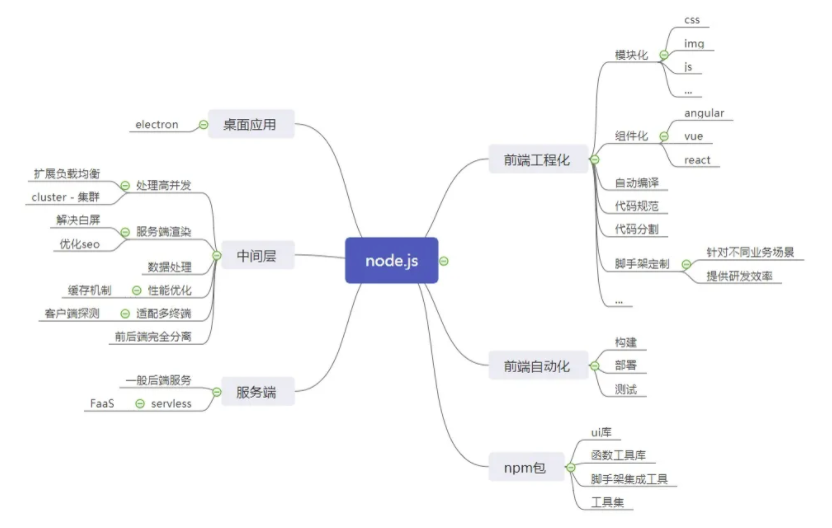

# Node.js

前端工程化的实现很大基础上是依赖了 node 和 npm 包，因此很有必要理解 node 的内部机制。


放一张图，就知道为什么前端要学习 Node 了。



## 基础知识

### 模块机制

#### CommonJS 规范

#### Node 的模块实现

exports 是一个对象，引入需要解构 const { } = require(xxx)，而不是 const target = require(xxx)

## 构建 Web 应用

### 基础功能

请求方法

路径解析

查询字符串

Cookie

Session

缓存

Basic 认证

### 数据上传

### 路由解析

### 中间件

对于 Web 应用而言，我们希望不用接触到这么多细节性的处理，为此我们引入中间件（middleware）来简化和隔离这些基础设施与业务逻辑之间的细节，让开发者能够关注在业务的开发上，以达到提升开发效率的目的。

在最早的中间件的定义中，它是一种在操作系统上为应用软件提供服务的计算机软件。它既不是操作系统的一部分，也不是应用软件的一部分，它处于操作系统与应用软件之间，让应用软件更好、更方便地使用底层服务。如今中间件的含义<u>借指了这种封装底层的细节，为上层提供更方便服务的意义，并非限定在操作系统层面。</u>这里要提到的中间件，就是为我们封装上文提及的所有 HTTP 请求细节处理的中间件，开发者可以脱离这部分细节，专注在业务上。

中间件的行为比较类似 Java 中过滤器（filter）的工作原理，就是在进入具体的业务处理之前，先让过滤器处理。

如同图 8-4 所示，从 HTTP 请求到具体业务逻辑之间，其实有很多的细节要处理。Node 的 http 模块提供了应用层协议网络的封装，对具体业务并没有支持，在业务逻辑之下，必须有开发框架对业务提供支持。这里我们通过中间件的形式搭建开发框架，这个开发框架用来组织各个中间件。对于 Web 应用的各种基础功能，我们通过中间件来完成，每个中间件处理掉相对简单的逻辑，最终汇成强大的基础框架。

由于中间件就是前述的那些基本功能，所以它的上下午也就是请求对象和响应对象：req 和 res。有一点区别的是，由于 Node 异步的原因，我们需要提供一种机制，在当前中间件处理完成后，通知下一个中间件执行。

```js
var middleware = function(req, res, next) {
	// TODO
	next();
} 
```


中间件是在管道中执行的。你可以想象一个送水的真实管道。水从一端磊入，然后在到达目的地之前还会经过各种仪表和阀门。这个比喻中很重要的一部分是顺序问题，你把压力表放在阀门之前和之后的效果是不同的。同样，如果你有个向水中注入什么东西的阀门，这个阀门的“下游”的所有东西都会含有这个新添加的原料。在 Express 程序中，通过调用 app.use 向管道中插入中间件。

在 Express 4.0 中，中间件和路由处理器是按它们的连入顺序调用的，顺序更清晰。

在管道的最后放一个“捕获一切”请求的处理器是常见的做法，由它来处理跟前面其他所有路由都不匹配的请求。这个中间件一般会返回状态码 404 （未找到）。

那么请求在管道中如何“终止”呢？这是由传给每个中间件的 next 函数来实现的。如果不调用 next() ，请求就在那个中间件中终止了。

- 路由处理器（app.get、app.post 等，经常被统称为 app.VERB） 可以被看作只处理特定 HTTP 谓词（GET、POST 等）的中间件。
- 如果不调用 next()，管道就会被终止，也不会再有处理器或中间件做后续处理。如果你不调用 next()， 则应用发送一个响应到客户端（res.send，res.json，res.render 等）；如果不这样做，客户端就会被挂起并最终导致超时。
- 如果调用了 next()，一般不宜再发送响应到客户端。如果你发送了，管道中后续的中间件或处理器还会执行，但它们发送的任何响应都会被忽略。

跟现在的 Serverless 类似


### 页面渲染

## 模版引擎

[Embedded JavaScript templates](https://www.npmjs.com/package/ejs) 服务端和客户端都可以用的模版引擎。

## 进阶活用

### IO

nodejs如何判断一个文件、文件夹是否存在

```js
fs.exists("dirName", function(exists) {
	console.log(exists ? "创建成功" : "创建失败");
});
```

## 持久化

所有网站和 Web 应用程序（除了最简单的）都需要某种持久化方式，即某种比易失性内存更持久的数据存储方式，这样当遇到服务器宕（dang）机、断电、升级和迁移等情况时数据才能保存下来。

### 文件系统持久化

实现持久化的一种方式是将数据存到扁平文件中（“扁平”的意思是文件 没有内在结构，只是一串字节）。Node 通过 fs（文件系统）模块实现文件系统持久化。

<u>文件系统持久后有些不足之处，特别是它的扩展性不好。</u>当你需要不止一台服务器以满足流量的需求时，除非所有服务器都能<u>访问一个共享的文件系统</u>（同一个局域网），否则就会遇到文件系统持久后的问题。此外，因为扁平文件没有内在结构，<u>定位、排序和过滤数据就变成了应用程序的负担。</u>处于这些原因，你应该用数据库而不是文件系统来做数据排序 。排序二进制文件是一个例外，比如图片、音频文件或视频。尽管很多数据库可以处理这类数据，但极少能达到文件系统那种效率（尽管关于二进制文件的信息一般会存在数据库里，以便搜索、排序和过滤）。

如果你确实需要存储二进制数据，记得文件系统依然有扩展性不好的问题。如果你的主机不能访问共享的文件系统（一般是这样），你应该考虑将二进制文件存在数据库中（一般要做些配置，以免数据库被拖垮），或者基于云的存储服务，比如亚马逊 S3 或者微软 Azure 存储。

### 云持久化

### 数据库持久化

所有网站和 Web 应用程序（除了最简单的）都需要数据库。即便你的数据是二进制的，并且你用共享的文件系统或云存储，你也很有可能需要一个数据库来做那些二进制数据的目录。

mysql2 支持
 
## 项目实战

应用：

前端项目，添加路由文件读写

## 底层原理

## 最佳实践

## 参考资料

- [Node.js 在大前端领域的应用分析](https://mp.weixin.qq.com/s/FGwurp1GRyGevJ8tAXSq9w)
- [nodejs.org](http://nodejs.org/api/http.html#http_server_listen_port_hostname_backlog_callback)
- 《深入浅出 Node.js》