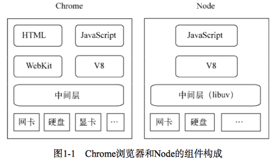

# Node.js

前端工程化的实现很大基础上是依赖了 node 和 npm 包，因此很有必要理解 node 的内部机制。



## 基础知识

### 模块机制

#### CommonJS 规范

#### Node 的模块实现

exports 是一个对象，引入需要解构 const { } = require(xxx)，而不是 const target = require(xxx)

## 构建 Web 应用

### 基础功能

请求方法

路径解析

查询字符串

Cookie

Session

缓存

Basic 认证

### 数据上传

### 路由解析

### 中间件

对于 Web 应用而言，我们希望不用接触到这么多细节性的处理，为此我们引入中间件（middleware）来简化和隔离这些基础设施与业务逻辑之间的细节，让开发者能够关注在业务的开发上，以达到提升开发效率的目的。

在最早的中间件的定义中，它是一种在操作系统上为应用软件提供服务的计算机软件。它既不是操作系统的一部分，也不是应用软件的一部分，它处于操作系统与应用软件之间，让应用软件更好、更方便地使用底层服务。如今中间件的含义<u>借指了这种封装底层的细节，为上层提供更方便服务的意义，并非限定在操作系统层面。</u>这里要提到的中间件，就是为我们封装上文提及的所有 HTTP 请求细节处理的中间件，开发者可以脱离这部分细节，专注在业务上。

中间件的行为比较类似 Java 中过滤器（filter）的工作原理，就是在进入具体的业务处理之前，先让过滤器处理。

如同图 8-4 所示，从 HTTP 请求到具体业务逻辑之间，其实有很多的细节要处理。Node 的 http 模块提供了应用层协议网络的封装，对具体业务并没有支持，在业务逻辑之下，必须有开发框架对业务提供支持。这里我们通过中间件的形式搭建开发框架，这个开发框架用来组织各个中间件。对于 Web 应用的各种基础功能，我们通过中间件来完成，每个中间件处理掉相对简单的逻辑，最终汇成强大的基础框架。

由于中间件就是前述的那些基本功能，所以它的上下午也就是请求对象和响应对象：req 和 res。有一点区别的是，由于 Node 异步的原因，我们需要提供一种机制，在当前中间件处理完成后，通知下一个中间件执行。

```js
var middleware = function(req, res, next) {
	// TODO
	next();
} 
```


跟现在的 Serverless 类似


### 页面渲染

## 进阶活用

### IO

nodejs如何判断一个文件、文件夹是否存在

```js
fs.exists("dirName", function(exists) {
	console.log(exists ? "创建成功" : "创建失败");
});
```

## 项目实战

应用：

前端项目，添加路由文件读写

## 底层原理

## 最佳实践

## 参考资料

- [nodejs.org](http://nodejs.org/api/http.html#http_server_listen_port_hostname_backlog_callback)
- 《深入浅出 Node.js》