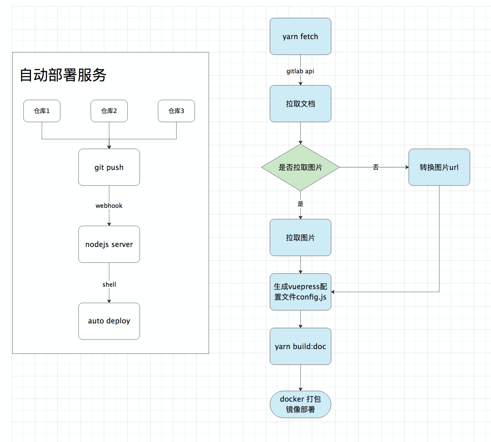

<!--
 * @Author: your name
 * @Date: 2020-09-19 14:59:37
 * @LastEditTime: 2020-09-19 15:24:52
 * @LastEditors: Please set LastEditors
 * @Description: In User Settings Edit
 * @FilePath: /Notebook/docs/temp/1.知识库构建.md
-->

痛点：
- 多个仓库如何组装成自动化测试
- 手写 vuepress 配置不舒服，而且维护起来也麻烦。不如直接新建文件夹放置 md 文件，然后脚本读取自动生成。

