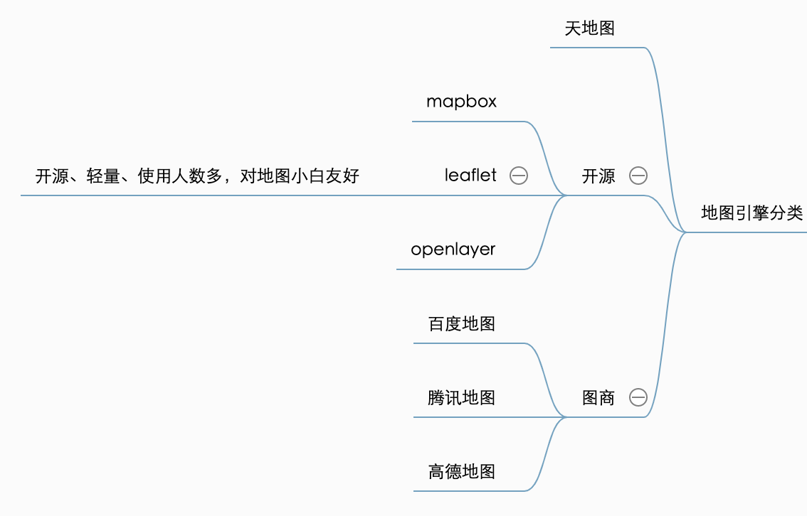
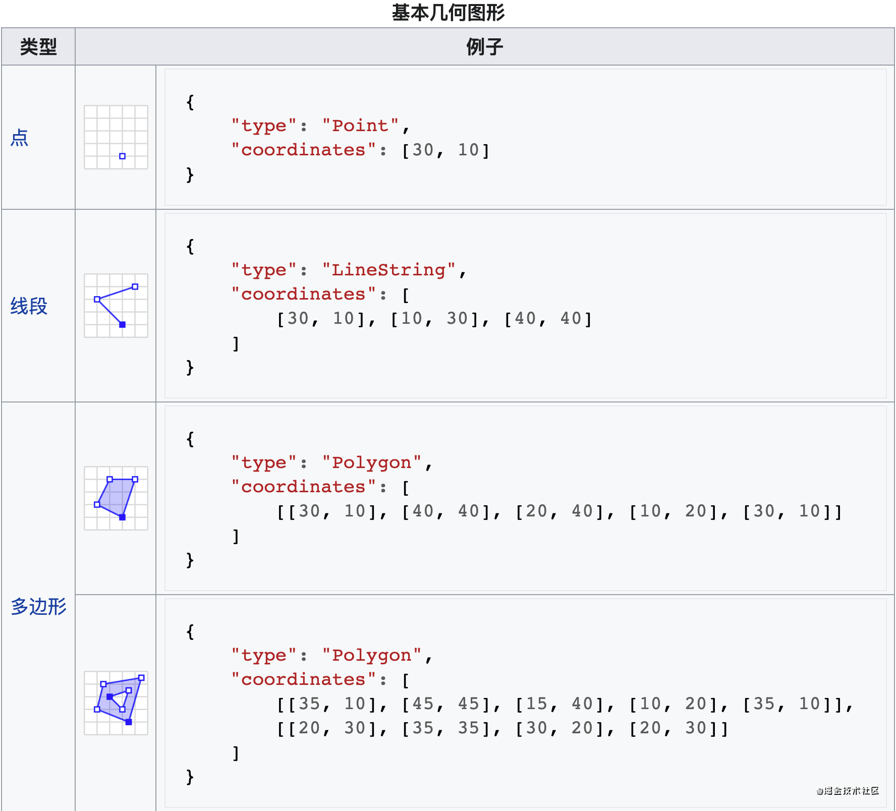

# 从零开发 web 二维地图引擎可视化项目

## 前言

目标：

- 理解地图引擎编写原理
- 提升架构能力和工程化能力，模仿 leaflet（**够轻量**）
- 可视化能力（比如切片与屏幕的展示计算）
- 移动端能力（适应 PC 端和移动端）

目标读者：希望了解二维地图的展示原理，不需要很复杂，不在生产环境使用。

文章分类：

- 实践总结型

### 什么是二维地图引擎？

可以让开发者快速制作 web 在线地图的工具。

### 为什么需要二维地图引擎？

提升效率。

### 现阶段的二维地图引擎的分类



详细可以看这篇文章 [二维地图前端js api对比分析](https://zhuanlan.zhihu.com/p/350866070)，从多个维度对各个 API 进行对比，比如开发者活跃度与易用行、开发文档、发展潜力，通过优势、劣势、适用方向，比如 leaflet 适用 移动端简单地图项目。

## 全局考虑

### 需求分析

轻量级的二维地图可视化引擎。自顶向下。

#### 我们需要什么样的地图能力

新建地图容器=>start:新建地图容器
建立图层实例=>operation:建立图层实例
添加到地图容器=>operation:添加到地图容器
屏幕展示=>end:屏幕展示

1. 需要可以根据屏幕大小、地图中心、缩放等级，新建地图容器
2. 需要支持新建切片图层，添加到地图容器中，进行显示
3. 需要可以对地图进行交互，比如拖拽、缩放、双击
4. 需要支持 PC 端和移动端

```js
var map = L.map('map').setView([51.505, -0.09], 13);

L.tileLayer('https://{s}.tile.openstreetmap.org/{z}/{x}/{y}.png', {
    attribution: '&copy; <a href="https://www.openstreetmap.org/copyright">OpenStreetMap</a> contributors'
}).addTo(map);
```

时序图

new layer -》addTo -〉map

### 架构设计

#### 我们应该怎么设计

##### 1. 需要可以根据屏幕大小、地图中心、缩放等级，新建地图容器

Map 类，实例化为一个 DOM 容器中，监听屏幕大小，地图中心、缩放等级。

##### 2. 需要支持新建切片图层，添加到地图容器中，进行显示

Tile 类，负责保存请求地址，以及生成每个分片 DOM，添加到 Map 类的 DOM 容器中。

##### 3. 需要可以对地图进行交互，比如拖拽、缩放、双击、

监听 Map Container 的 DOM 事件，调用 Tile、Map 类进行地图的展示变化。

##### 4. 需要支持 PC 端和移动端

处理 DOM 的响应式适配，最简单的方案可以是等比缩放。以及分别监听 PC 端和手机端的浏览器 DOM 事件。

### 前置基础知识准备

#### Webgis 二维地图的一些概念

##### 切片、 WMTS 服务

##### 比例尺、缩放等级

##### crs

通过一组称为坐标的三个数字来指定地球上的每个位置。通常，CRS可以分为投影坐标参考系统（也称为笛卡尔坐标或直角坐标参考系统）和地理坐标参考系统。

###### 地理坐标

一般是指由经度、纬度和相对高度组成的坐标系，能够标示地球上的任何一个位置。

###### 投影坐标

投影坐标系使用基于X,Y值的坐标系统来描述地球上某个点所处的位置。这个坐标系是从地球的近似椭球体**投影**得到的，它对应于某个地理坐标系。

##### ogc

[OGC](https://www.ogc.org/) 开放地理空间联盟(**OGC**) **是**一个国际自愿共识标准组织。 **OGC** 的使命**是**开发、批准和维护各种标准，通过这些标准可以在web 上使用并共享您的地图和**相关**地理数据。 使用**OGC** 服务并启用编码，可以对地理数据和软件功能进行开放式访问，这使得组织能够将它们的**GIS** 数据和服务集成到各种计算和移动设备上的任何应用程序中。

##### 切片图层

###### 栅格切片

栅格切片图层将底图作为图像文件（例如，JPG 或 PNG 格式）交付给客户端应用程序，这些图像文件已经预渲染并存储在服务器上，并由客户端按原样显示。 栅格切片图层最适合于为您的地图提供地理环境的底图，例如影像（比如在世界影像底图中）或基于要素的地图，例如地形、国家地理、海洋和其他底图。 栅格切片图层也可以由静态业务图层组成，例如数据的专题地图。

###### 矢量切片

矢量切片图层引用一组 web 可用的矢量切片以及这些切片应被绘制的相应样式。 矢量切片与栅格切片类似，但是它们存储数据的矢量表示。也就是说，地理要素以客户端应用程序可理解的格式表示为点、线和面。 不同于栅格切片图层，矢量切片图层能够适应显示设备的分辨率，并且可以改变样式以用于多种用途。 矢量切片文件比栅格切片文件更小，这意味着制图更快、性能更好。 切片访问性能和矢量绘制的结合使切片能够适应任意显示分辨率（设备不同，分辨率可能不同）。

##### GeoJSON

一种基于JSON的地理空间数据交换格式，它定义了几种类型JSON对象以及它们组合在一起的方法，以表示有关地理要素、属性和它们的空间范围的数据。[GeoJSON规格](https://tools.ietf.org/html/rfc7946)




#### 前端基础知识

##### 原型与类

见[前端技术考核：你怎么理解 JavaScript 原型、类与面向对象编程 ｜牛气冲天新年征文](https://juejin.cn/post/6930407463124959240#heading-21)

##### dom事件绑定、移动端、PC 端交互事件

##### 绘制与动画、CSS3 z-index、transform 

### leaflet的基本实现原理

- leaflet基本概念介绍
  - 三种坐标
  - bounds
  - map容器与leaflet图层
- 结合 crs 再谈 map 容器
- 绘制原理 SVG 和 Canvas
- dom 事件方法

流程化实现。

## 局部实现

### 开发环境设计

#### 源码目录设计

- build ——构建配置
- dist ——输出文件
- docs——文档
- tests——测试文件
- src ——源码
  - na-map.js ——入口文件
  - dom 关于地图的dom渲染和dom事件封装。
  - map 地图的核心，地图相关逻辑（地图交互）。
  - layer 图层相关逻辑。
  - geo 地图投影和坐标适配逻辑
  - core 移动端和PC 端适配判断、事件订阅发布、工具类

#### 技术架构

- 采用 ES6 开发
-  rollup 打包输出

#### 打包文件输出

- na-map.umd.js
- na-map.css

#### 开发环境搭建

###### 运行环境

1. 安装 rollup 打包工具，配置入口文件。

```js
import resolve from "rollup-plugin-node-resolve";
import commonjs from "rollup-plugin-commonjs";
import sourceMaps from "rollup-plugin-sourcemaps";
import camelCase from "lodash.camelcase";
import json from "rollup-plugin-json";

const pkg = require("./package.json");

const libraryName = "na-map";

export default {
  input: `src/${libraryName}.js`,
  output: [
    {
      file: pkg.main,
      name: camelCase(libraryName),
      format: "umd",
      sourcemap: true,
    },
    { file: pkg.module, format: "es", sourcemap: true },
  ],
  // Indicate here external modules you don't wanna include in your bundle (i.e.: 'lodash')
  external: [],
  watch: {
    include: "src/**",
  },
  plugins: [
    // Allow json resolution
    json(),
    // Allow bundling cjs modules (unlike webpack, rollup doesn't understand cjs)
    commonjs(),
    // Allow node_modules resolution, so you can use 'external' to control
    // which external modules to include in the bundle
    // https://github.com/rollup/rollup-plugin-node-resolve#usage
    resolve(),

    // Resolve source maps to the original source
    sourceMaps(),
  ],
};
```

2. 打包输出
3. 开发调试，引入使用

建立 html 文件，引用 dist 打包文件，使用通过 rollup watch 进行监听编写的文件，另外再启动 live-server 进行监听。（TODO：能否有自动的服务器，进行热更新？像开发应用一样的）

```js
<!DOCTYPE html>
<html lang="en">
<head>
  <meta charset="UTF-8">
  <meta http-equiv="X-UA-Compatible" content="IE=edge">
  <meta name="viewport" content="width=device-width, initial-scale=1.0">
  <title>Map</title>
  <link rel="stylesheet" href="../dist/na-map.css">
  <script src="../dist/na-map.es5.js"></script>
</head>
<body>
  <div id="map"></div>
</body>
</html>
```

### 地图类设计

需要可以根据屏幕大小、地图中心、缩放等级，新建地图容器

Map 类，实例化为一个 DOM 容器中，监听屏幕大小，地图中心、缩放等级。

- 保留 dom 节点引用，地图中心，缩放等级


需要支持新建切片图层，添加到地图容器中，进行显示

Tile 类，负责保存请求地址，以及生成每个分片 DOM，添加到 Map 类的 DOM 容器中。

## 小结

## 参考资料

- leaflet

