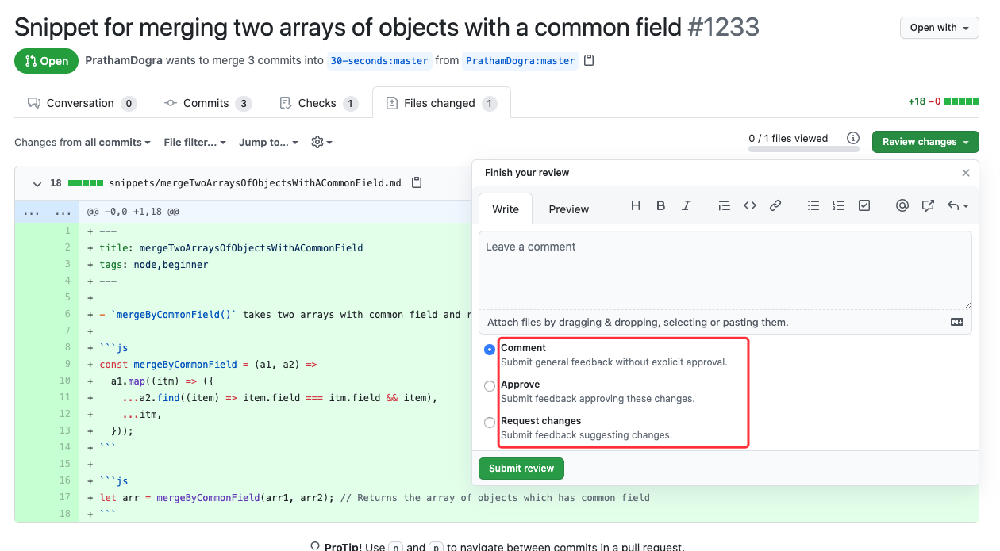

# 如何参与开源项目

目标读者

写作目的

文章大纲

头脑风暴

工作需要的技术栈相关项目

1. Vue（可以寻找 vue-\* 开头的插件）
2. Webpack（寻找 webpack 插件）
3. JS/HTML/CSS
4. UI 组件库

个人开发需要的技术栈相关项目

1. Node（middleware）
2. Express
3. Java

贡献相关

1. 编写该开源项目踩坑/教程文章，在社区中发布。
2. 提交/讨论 issue。
3. 完善文档（vue 3.0 zh），包括含糊不清、拼写错误。
4. 添加用例。
5. 修复 bug，可以考虑一些边界条件。
6. 添加功能，新增一些自己想用的功能。

如何发现？

- 关于功能，主动搜索 label
- 关于文档完善：借助一些命令行工具勘测
- 关于 bug，使用
- awesome-micro-npm-packages
- https://github.com/parro-it/awesome-micro-npm-packages
- 每天看一个，然后进行贡献。先从小项目开始贡献，作者往往也很乐于恢复
- 掘金翻译 GitHub
- [30-seconds-of-code](https://github.com/30-seconds) 每天实现看一个片段，看看能否发现 bug，测试 bug。
- vue 源码 commit

## 参与开源项目的几种方式

- 参与别人的项目
- 自己创建项目
- 构建社区

指南

- How to Contribute to Open Source
- Starting an Open Source Project
- Finding Users for Your Project
- Building Welcoming Communities（freecode camp）
- Best Practices for Maintainers
- Leadership and Governance
- Getting Paid for Open Source Work
- Your Code of Conduct
- Open Source Metrics
- The Legal Side of Open Source

### Do you like to write?（写作）

- Write and improve the project’s documentation
- Curate a folder of examples showing how the project is used
- Start a newsletter for the project, or curate highlights from the mailing list
- Write tutorials for the project, like PyPA’s contributors did
- Write a translation for the project’s documentation

### Do you like organizing?（组织）

- Link to duplicate issues, and suggest new issue labels, to keep things organized
- Go through open issues and suggest closing old ones, like @nzakas did for ESLint
- Ask clarifying questions on recently opened issues to move the discussion forward

### Do you like to code?

- Find an open issue to tackle, like @dianjin did for Leaflet
- Ask if you can help write a new feature
- Automate project setup
- Improve tooling and testing（可以写一些测试用例，或为开源项目添加测试，或完善测试，例如 30s-code）
  Do you like helping people?
  -Answer questions about the project on e.g., Stack Overflow (like this Postgres example) or Reddit
- Answer questions for people on open issues（像之前在 iview 那做得事情）
- Help moderate the discussion boards or conversation channels

### You don’t just have to work on software projects!

While “open source” often refers to software, you can collaborate on just about anything. There are books, recipes, lists, and classes that get developed as open source projects.

For example:

@sindresorhus curates a list of “awesome” lists
@h5bp maintains a list of potential interview questions for front-end developer candidates
@stuartlynn and @nicole-a-tesla made a collection of fun facts about puffins

Even if you’re a software developer, working on a documentation project can help you get started in open source. It’s often less intimidating to work on projects that don’t involve code, and the process of collaboration will build your confidence and experience.

可以给一些 awesome 库、工具等，添加资源。

A typical open source project has the following types of people:（一个典型的开源项目有以下几种参与人员：）

- **Author**: The person/s or organization that created the project
- **Owner**: The person/s who has administrative ownership over the organization or repository (not always the same as the original author)
- **Maintainers**: Contributors who are responsible for driving the vision and managing the organizational aspects of the project (They may also be authors or owners of the project.)
- **Contributors**: Everyone who has contributed something back to the project
- **Community Members**: People who use the project. They might be active in conversations or express their opinion on the project’s direction

A project also has documentation. These files are usually listed in the top level of a repository.

- **LICENSE**: By definition, every open source project must have an open source license. If the project does not have a license, it is not open source.
- **README**: The README is the instruction manual that welcomes new community members to the project. It explains why the project is useful and how to get started.
- **CONTRIBUTING**: Whereas READMEs help people use the project, contributing docs help people contribute to the project. It explains what types of contributions are needed and how the process works. While not every project has a CONTRIBUTING file, its presence signals that this is a welcoming project to contribute to.
- **CODE_OF_CONDUCT**: The code of conduct sets ground rules for participants’ behavior associated and helps to facilitate a friendly, welcoming environment. While not every project has a CODE_OF_CONDUCT file, its presence signals that this is a welcoming project to contribute to.
- **Other documentation**: There might be additional documentation, such as tutorials, walkthroughs, or governance policies, especially on bigger projects.

Finally, open source projects use the following tools to organize discussion. Reading through the archives will give you a good picture of how the community thinks and works.

- **Issue tracker**: Where people discuss issues related to the project.
  Pull requests: Where people discuss and review changes that are in progress.
- **Discussion forums or mailing lists**: Some projects may use these channels for conversational topics (for example, “How do I…“ or “What do you think about…“ instead of bug reports or feature requests). Others use the issue tracker for all conversations.
- **Synchronous chat channel**: Some projects use chat channels (such as Slack or IRC) for casual conversation, collaboration, and quick exchanges.

## 时间安排

寻找固定的时间，去给开源项目贡献。

Contributing to open source happens at all levels, across projects. You don’t need to overthink what exactly your first contribution will be, or how it will look.

Instead, start by thinking about the projects you already use, or want to use. The projects you’ll actively contribute to are the ones you find yourself coming back to.

You might scan a README and find a broken link or a typo. Or you’re a new user and you noticed something is broken, or an issue that you think should really be in the documentation. Instead of ignoring it and moving on, or asking someone else to fix it, see whether you can help out by pitching in. That’s what open source is all about!

## 寻找路径

You can also use one of the following resources to help you discover and contribute to new projects:

- GitHub Explore
- Open Source Friday
- First Timers Only
- CodeTriage
- 24 Pull Requests
- Up For Grabs
- Contributor-ninja
- First Contributions
- SourceSort

## A checklist before you contribute

Meets the definition of open source

- [ ] Does it have a license? Usually, there is a file called LICENSE in the root of the repository.

Project actively accepts contributions

Look at the commit activity on the master branch. On GitHub, you can see this information on a repository’s homepage.

- [ ] When was the latest commit?

- [ ] How many contributors does the project have?

- [ ] How often do people commit? (On GitHub, you can find this by clicking "Commits" in the top bar.)

Next, look at the project’s issues.

- [ ] How many open issues are there?

- [ ] Do maintainers respond quickly to issues when they are opened?

- [ ] Is there active discussion on the issues?

- [ ] Are the issues recent?

- [ ] Are issues getting closed? (On GitHub, click the "closed" tab on the Issues page to see closed issues.)
      Now do the same for the project’s pull requests.

- [ ] How many open pull requests are there?

- [ ] Do maintainers respond quickly to pull requests when they are opened?

- [ ] Is there active discussion on the pull requests?

- [ ] Are the pull requests recent?

- [ ] How recently were any pull requests merged? (On GitHub, click the "closed" tab on the Pull Requests page to see closed PRs.)

Project is welcoming

A project that is friendly and welcoming signals that they will be receptive to new contributors.

- [ ] Do the maintainers respond helpfully to questions in issues?

- [ ] Are people friendly in the issues, discussion forum, and chat (for example, IRC or Slack)?

- [ ] Do pull requests get reviewed?

- [ ] Do maintainers thank people for their contributions?

### How to submit a contribution

#### Communicating effectively

Before you open an issue or pull request, or ask a question in chat, keep these points in mind to help your ideas come across effectively.

Give context. Help others get quickly up to speed. If you’re running into an error, explain what you’re trying to do and how to reproduce it. If you’re suggesting a new idea, explain why you think it’d be useful to the project (not just to you!).

#### Gathering context

Opening an issue
You should usually open an issue in the following situations:

Report an error you can’t solve yourself
Discuss a high-level topic or idea (for example, community, vision or policies)
Propose a new feature or other project idea
Tips for communicating on issues:

If you see an open issue that you want to tackle, comment on the issue to let people know you’re on it. That way, people are less likely to duplicate your work.
If an issue was opened a while ago, it’s possible that it’s being addressed somewhere else, or has already been resolved, so comment to ask for confirmation before starting work.
If you opened an issue, but figured out the answer later on your own, comment on the issue to let people know, then close the issue. Even documenting that outcome is a contribution to the project.

#### Opening an issue

#### Opening a pull request

- Submit trivial fixes (for example, a typo, a broken link or an obvious error)
- Start work on a contribution that was already asked for, or that you’ve already discussed, in an issue

A pull request doesn’t have to represent finished work. It’s usually better to open a pull request early on, so others can watch or give feedback on your progress. <u>Just mark it as a “WIP” (Work in Progress) in the subject line. </u>

- **Fork the repository and clone it locally.** Connect your local to the original “upstream” repository by adding it as a remote. Pull in changes from “upstream” often so that you stay up to date so that when you submit your pull request, merge conflicts will be less likely. (See more detailed instructions here.)
- **Create a branch for your edits.**
  **Reference any relevant issues or supporting documentation in your PR** (for example, “Closes #37.”)
- **Include screenshots of the before and after if your changes include differences in HTML/CSS**. Drag and drop the images into the body of your pull request.
- **Test your changes**! Run your changes against any existing tests if they exist and create new ones when needed. Whether tests exist or not, make sure your changes don’t break the existing project.
- **Contribute in the style of the project to the best of your abilities**. This may mean using indents, semi-colons or comments differently than you would in your own repository, but makes it easier for the maintainer to merge, others to understand and maintain in the future.

#### What happens after you submit a contribution

😭 You don’t get a response.

🚧 Someone requests changes to your contribution.

👎 Your contribution doesn’t get accepted.

🎉 Your contribution gets accepted.

You did it!
Whether you just made your first open source contribution, or you’re looking for new ways to contribute, we hope you’re inspired to take action. Even if your contribution wasn’t accepted, don’t forget to say thanks when a maintainer put effort into helping you. Open source is made by people like you: one issue, pull request, comment, or high-five at a time.

## How to Write an Open Source JavaScript Library

## 如何编写一个开源的 JavaScript 库

### 介绍

- micro libraries
- pros
  - small enough to reason about the code
  - easy to test as there is less code
  - easy to reuse via npm install
- cons
  - managing dependencies as there could be too many
- objective of the course / learn to
  - create a Git repository
  - host it on GitHub
  - create the library
  - publish it to npm
  - create a full test suite for it using
    - karma
    - mocha
    - chai
  - set up continuous integration
  - add ES6 or ES2015 using Babel
  - integrate webpack
  - distribute this as both browser and node consumable

### Setting up GitHub

- create a GitHub account，if you don't have one
- sign in your account and create a new repository
- follow the instructions displayed after creating the repository, to push your code to that repository
- that's all! GitHub setup is complete.

### Configuring npm and creating a package.jsonf

- install node if not already installed
- configure npm locally to make publishing little easier, for example
  - `$ npm set init-author-name "Sarbbottam Bandyopadhyay"`
  - `$ npm set init-author-url "https://sarbbottam.github.io/"`
  - `$ npm set init-author-email "sarbbottam@gmail.com"`
  - `$ npm set init-license "MIT"`
- these will be used as defaults values during `npm init`
- verify configuration
  - `$ cat ~/.npmrc`
- refer `https://docs.npmjs.com/misc/config` for more information
- recommended setting
  - `save-exact` property, it tells `npm` to use the exact version of the packages, rather than a version range, while saving dependency to package.json.
  - it safeguards when semver is not followed properly or there's a mistake in a release.
- create a npm account, if you dont' have one at [npmjs.com](https://www.npmjs.com/)
- `$ npm add-user`, to add your account
  - enter username, password, and email when prompted
- it will create your `auth token` and add it to `~/.npmrc`
- `$ npm init` will prompt for desired information and create `package.json` at the end
- `$ npm init --yes` will create a `package.json`, with the defaults, without prompting.

### Creating the library and adding dependencies

- create the `main` file
- install required dependencies
  - use `-S` or `--save` to save it as `dependency` at `package.json`
  - use `-D` or `--save-dev` to save it as `devDependecy` at `package.json`
- create the functionality

### Pushing to Github

- create a `.gitignore` at the `root` of the project, to list all the ignored files and directories
- `$ git add <file-name>` to stage the changes
  - alternatively `$ git add -all` to stateh all the changes
- `$ git commit` to commit the changes
- `$ git push origin <repo-name>` to push the changes to GitHub(`origin`)
  - `$ git remote -v` will display all the available `remote` and their corresponding `url`

### Publishing to npm

- `$ npm add-user`, if you have not already
- add `package.json/files` to [whitelist the set of files to be published](https://docs.npmjs.com/files/package.json#files)
- you can also add `.npmignore` file to ignore files/directories, that might fall under from whitelist
- `$ npm version <patch|minor|major`, if you have already published to npm
  - `patch` for bug fix
  - `minor` for new feature
  - `major` for breaking changes
- [npm pack](https://docs.npmjs.com/cli/pack) or [npm link](https://docs.npmjs.com/cli/link) to validate the module to be publish
- `$ npm publish`
- verify the released package at `npm.im/<package-name>`

### Releasing a version to GitHub

- add a version tag to git repository
  - to associate the version released at npm to the corrseponding code
- `tag` in git, points to a specific commit
- `$ git tag <version>`
  - `version` released to npm
- `$ git push --tags`
  - GitHub will consider the tag as release and will make it avaliable under `releases` tab
- draft new release
  - fill out the release form with the tag version

<!-- 配上截图说明，图文并茂-->

tag 是一个特殊的 commit，不是分支。

### Releasing a new version to npm

- make necessary updates
- update the `package.json/version` `$ npm version <patch|minor|major>`
  - `patch` for bug fix (1.0.`0`)
  - `minor` for new feature(1.`0`.0, api not changed)
  - `major` for breaking changes(`1`.0.0 as API changed)
- `commit` the changes
- `tag` the commit.
- push changes to Github.
- push the tags to GitHub
- `$ npm publish`

### Publishing a beta version

- make changes
- manually update the package version in `package.json`
  - add `-beta.0` to the end of the version
- `$ checkout -b <branch-name>` for the beta version
- `$ git tag <package-version-beta.0>`
- `$ git push origin <branch-name>`
- `$ git push --tags`
- `$ npm publish --tag beta`（不覆盖最新的发布版本，而是增加一个 beta 的发布版本）
- verify published versions
  - `$ npm info`


pre-alpha-alpha-beta-rc-release [Software release life cycle](https://en.wikipedia.org/wiki/Software_release_life_cycle)

### Setting up Unit Testing with Mocha and Chai

- `$ npm i -D mocha chai`, to install and add them to `devDependcies`
- create a test file
  - `require(chai)`
  - `require` the file to be tested
  ```js
  var expect = require('chai).expect;
  var functionality = required('./path/to/index.js');
  describe('functionality', function() {
    it('should validate the functionality', function() {
      expect(true).to.be.true;
    })
  })
  ```
- update `package.json/script.test`
  - `{"scripts": {"test": "mocha path/to/test/file"}}`
  - add `-w` to watch for changes

### Unit Testing with Mocha and Chai

- use the `global` `describe` function and `it` function to describe the tests and what they should do
- validate functionalities by assertions using `expect`

### Automating Releases with semantic-release

自动化发布版本。

- `semantic-release` automates the releasing and frees you from redundant manual steps.
- `$ npm i -g semantic-release-cli` to install `semantic-release-cli` globally
- `$ semantic-release setup`
  - it will take you through the interactive prompt
  - it will update `package.json/script` w.r.t `release`
  - it will remove the `version` from the commit messages
    - as the version will be determied dynamically from the commit messages
  - this `script` will be executed on `success`
  - update the `package.json/version` to `0.0.0-sematically-released`, to avoid `npm` warning

### Writing conventional commits with commitizen

- commit message [convention](https://github.com/angular/angular.js/blob/master/CONTRIBUTING.md#-git-commit-guidelines)
- `$ npm i -D commitizen cz-conventional-changelog`
  - install `commitizen` globally or add `./node_modules/bin` to system `PATH` [to use cz instead of git](https://github.com/commitizen/cz-cli#installing-the-command-line-tool)
  - alternatively you could use `npm scripts`, `{"scripts: {"commit": "git-cz"}"}`
- [configure commitizen](https://github.com/commitizen/cz-cli#making-your-repo-commitizen-friendly) via `{"config": {"commitizen": { "path": "cz-conventional-changelog"}}}`

### Commiting a new feature with commitizen

- make changes to `source` and `test`
- use `commitizen` to commit with conventional message
- push the changes to GitHub

### Automatically Releasing with TravisCI

- travis build is automatically setup by semantic-release
  - if the build is successful, travis will run `semantic-release`
  - depending on the commit messages, `semantic-release` would
    - push a new version to npm
    - push a new tag and release to github along with change history since the previous version

### Automatically running tests before commits with ghooks

- `$ npm i -D ghooks` to install and add it to `package.json/devDependencies`
- configure `ghooks` via the `{"config": {"ghooks": {"hook-name": "command-to-execute"}}}`

### Adding code coverage recording with Istanbul

- `$ npm i istanbul`
- update `package.json/script.test`
  - `{"scripts": {"test": "istanbul cover -x test-file-name-pattern _mocha --path/to/test/file -R spec"}}`
- `$ npm test` will run the test and generate information at `coverage/` folder
- add `coverage` to `.gitignore` file

### Adding code coverage checking

- create a script called `check-coverage` to verify coverage for statements, branches, function, and lines.
  - ``

### Adding code coverage reporting

### Adding badges to your README

### Adding ES6 Support

### Adding ES6 Support to Tests using Mocha and Babel

### Limit Built Branches on Travis

### Add a browser build to an npm module

<!-- 以上的操作，除了一个测试版本外，也可以给现有的仓库接入，比如 easy-wheel -->

Fork（复制）本代码仓库
点击图示中的按钮去 Fork 这个代码仓库。 这个操作会将代码仓库复制到你的账户名下。

Clone（克隆）代码仓库
clone this repository

接下来，将复制后的代码仓库克隆到你的电脑上。点击图示中的绿色按钮，接着点击复制到剪切板按钮（将代码仓库地址复制下来）

随后打开命令行窗口，敲入如下 git 命令：

git clone "刚才复制的 url 链接"
"刚才复制的 url 链接"（去掉双引号）就是复制到你账户名下的代码仓库地址。获取这链接地址的方法请见上一步。

copy URL to clipboard

譬如：

git clone https://github.com/你的Github用户名/first-contributions.git
'你的 Github 用户名' 指的就是你的 Github 用户名。这一步，你将复制到你账户名下的 first-contributions 这个代码仓库克隆到本地电脑上。

新建一个分支
下面的命令能在命令行窗口中，把目录切换到 first-contributions

cd first-contributions
接下来使用 git checkout 命令新建一个代码分支

git checkout -b <新分支的名称>
譬如：

git checkout -b add-myname
(新分支的名称不一定需要有* add 。然而，在新分支的名称加入 add *是一件合理的事情，因为这个分支的目的是将你的名字添加到列表中。)

对代码进行修改，而后 Commit (提交) 修改
打开 Contributors.md 这个文件，更新文件内容，将你的名字加上去，保存修改。git status 这命令会列出被改动的文件。接着 git add 这命令则可以添加你的改动，就像如下这条命令。

git status

git add Contributors.md
现在就可以使用 git commit 命令 commit 你的修改了。

git commit -m "Add <你的名字> to Contributors list"
将 <你的名字> 替换为你的名字

将改动 Push（发布）到 GitHub
使用 git push 命令发布代码

git push origin <分支的名称>
将 <分支的名称> 替换为之前新建的分支名称。

提出 Pull Request 将你的修改供他人审阅

先大量贡献，后申请加入 vue 组织。

25 个 star 的开源工具/非 README.md

element-plus 先代码审查（https://github.com/element-plus/element-plus/issues/148）
- To be able to participate, you will need to:
- Fork this repo
- Check the project board Migration Backlog and find the component you are going to work on.
- Make sure that you read README before coding.
- After you complete your coding, Pull Request to this repo and loop some reviewers into



通过多次 reviweer 也可以逐渐申请成为仓库的协作者

fix：
- 内存泄漏
- 状态

### fork 后仓库如何与原仓库同步

- [fork 后仓库如何与原仓库同步](../lint/gitBase.md)

### pull requested 被合并后的处理

如何显示原有的星星和 fork 数量，作为 contributor 是没有这个特权的。除非是仓库所有者（creator）把你添加为协作者（collaborator）或者自己申请。[github团队开发之申请加入团队](https://blog.csdn.net/caoli201314/article/details/107080148)

先大体贡献完 30-seconds-code，再贡献其他的主流仓库。

**Author**: The person/s or organization that created the project
**Owner**: The person/s who has administrative ownership over the organization or repository (not always the same as the original author)
Maintainers: Contributors who are responsible for driving the vision and managing the organizational aspects of the project. (They may also be authors or owners of the project.)
**Contributors:** Everyone who has contributed something back to the project.
**Community Members**: People who use the project. They might be active in conversations or express their opinion on the project’s direction.
**An outside collaborator** is a person who isn't explicitly a member of your organization, <u>but who has Read, Write, or Admin permissions to one or more repositories in your organization.</u>

- https://github.com/CoolProp/CoolProp/wiki/Contributors-vs-Collaborators

- [My Git Guide - Guidelines to Using Git and GitHub with Collaborators](http://yescano.com/my_git_guide_-_guidelines_to_using_git_and_github_with_collaborators#:~:text=The%20Difference%20Between%20Collaborator%20vs,especially%20if%20it%20is%20public.&text=Collaborators%20are%20people%20that%20a,work%20directly%20in%20the%20repository.)

## 参考资料

- [https://firstcontributions.github.io/](https://firstcontributions.github.io/)
- [firstcontributions/first-contributions](https://github.com/firstcontributions/first-contributions/blob/master/translations/README.chs.md)
- [How to Write an Open Source JavaScript Library](https://egghead.io/lessons/javascript-introduction-to-how-to-write-an-open-source-javascript-library) 视频，构建自己的库。学会了一个基本开源项目的构建，也就能更好的与他人协作，可以构建一个命令行。
- [How to Conribute to an Open Source Project on GitHub](https://egghead.io/lessons/javascript-introduction-to-github) 视频
- [https://opensource.guide/](https://opensource.guide/) github 官方推荐指南
- 在校生如何在开源社区中成长？ - blindpirate 的回答 - 知乎
  https://www.zhihu.com/question/336820269/answer/762430975
- [30-seconds-of-code](https://github.com/30-seconds/30-seconds-of-code/blob/master/CONTRIBUTING.md)
- [spell 库](https://github.com/jsoref/spelling)
- [A Guide for Contributing to Any Open Source JavaScript Project Ever 💛](https://dev.to/saurabhdaware/a-guide-for-contributing-to-any-open-source-javascript-project-ever-hi)
