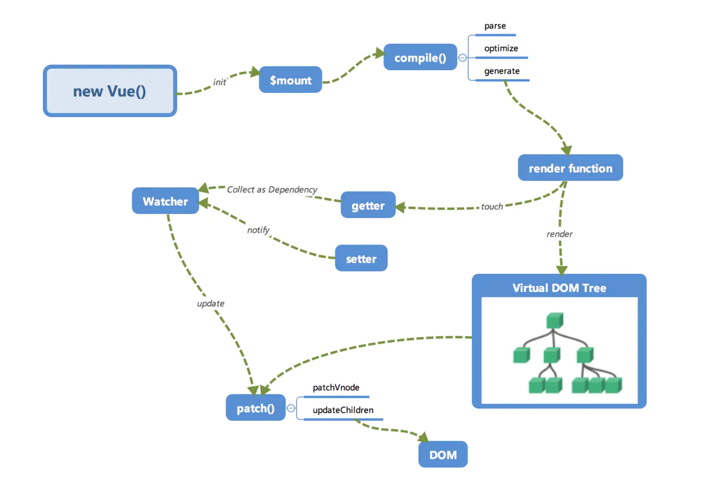
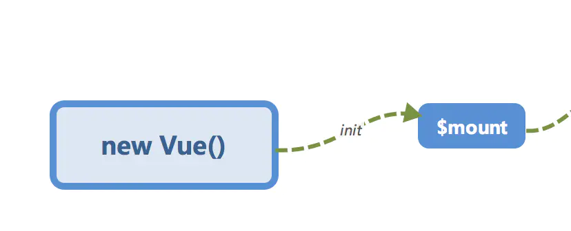

# Vue 项目开发总结（持续更新）

## 头脑风暴

<!-- 有些别人踩坑、有些是自己踩的坑 -->

1. 在请求拦截器里面怎么实现路由跳转？当我刷新 token，拿到了新的 token，怎么回到上一个请求或者跳转页面
2. 这里是有两个问题对不？回到上一个请求，axios 应该有记录的，

JWT

关于当前单页面应用，在某个页面刷新后，出现空白的问题。
这是由于用户行为刷新页面导致，相当于在 index.html 重新加载，这个时候可以使用路由拦截进行用户鉴权操作，但是假如当前路由对应 A 页面，而有些 A 页面的资源是从 B 页面跳转才获取的。这个跟模型评价的产品刷新的逻辑是同一类问题，需要集中解决和总结方案。

这个更新到 Vuex 内存状态管理页面。

Vue 应用状态管理。

## Vue 项目

- **vue-loader**：解析和转换 .vue 文件，提取出其中的逻辑代码 `script`、样式代码 `style` 及 HTML 模版 template，再分别将它们交给对应的 Loader 去处理。
- **css-loader**：加载由 vue-loader 提取出的 CSS 代码。
- **vue-template-compiler**：将 vue-loader 提取出的 HTML 模版编译成对应的可执行的 JavaScript 代码，这和 React 中的 JSX 语法被编译成 JavaScript 代码类似。预先编译好 HTML 模版相对于在浏览器中编译 HTML 模版，性能更好。

### 指令

#### 拖拽指令

使用 mousedown、mousemove（传统） 还是说使用 html5 的 drag 事件呢？（新兴）

1. 首先鼠标按下（onmousedown）
   - 记录目标元素当前的 `left` 和 `top` 值
2. 鼠标移动（onmousemove）
   - 计算每次移动的横向距离 `（disX）` 和纵向距离 `（disY）`
3. 鼠标松开（onmouseup）
   - 完成一次拖拽，做一些收尾工作

- disX = 鼠标按下时的 clientX - 鼠标松开时的 clientX
- disY = 鼠标按下时的 clientY - 鼠标松开时的 clientY
(
4. 边界值处理（不好处理，iview modal，也没有处理，参考下 vue-draggable 的源码看看）

主要考虑角度是：left 和 top 的角度，minLeft、maxLeft 和 minTop 和 maxTop.


```js
/*
 * @Author: Jecyu
 * @Date: 2020-12-26 12:41:12
 * @LastEditors: Jecyu
 * @LastEditTime: 2021-01-04 16:57:32
 * @FilePath: /scst-natural-resources-cli3/src/utils/directives/draggable.js
 * @Description: 
 */
// const getAttr = (obj, key) =>
//   obj.currentStyle
//     ? obj.currentStyle[key]
//     : window.getComputedStyle(obj, false)[key];

const draggable = {
  inserted: function(el, binding) {
    const { handle, parent, moveElStyle } = binding.value; // 将组件的移动和尺寸限制为父对象。
    // 手柄元素
    const handler = el.querySelector(handle);
    // 默认样式设置
    handler.style.cursor = "move";
    // 拖拽元素
    const moveEl =
      binding.value && binding.value.moveElId
        ? document.getElementById(binding.value.moveElId)
        : el;
    moveEl.style.position = "absolute"; // 为拖动元素添加绝对定位
    // 如果容器没有 position 属性，默认不设置为 relative
    if (parent) {
      moveEl.parentNode.style.position = "relative";
    }

    // 初始化目标元素位置
    if (moveElStyle.right) {
      moveEl.style.right = moveElStyle.right ? moveElStyle.right : 0;
    } else if (moveElStyle.left) {
      moveEl.style.left = moveElStyle.left ? moveElStyle.left : 0;
    }

    if (moveElStyle.top) {
      moveEl.style.top = moveElStyle.top ? moveElStyle.top : 0;
    } else if (moveElStyle.bottom) {
      moveEl.style.bottom = moveElStyle.bottom ? moveElStyle.bottom : 0;
    }

    // 绑定手柄元素事件
    handler.onmousedown = function(e) {
      // 记录鼠标按下的坐标和目标元素的 left、top 值
      const currentX = e.clientX;
      const currentY = e.clientY;
      const left = el.offsetLeft;
      const top = el.offsetTop;

      document.onmousemove = function(e) {
        // 鼠标移动时计算每次移动的距离，并改变拖拽元素的定位
        const disX = e.clientX - currentX;
        const disY = e.clientY - currentY;

        // TODO 暂时不考虑边界的问题
        // 分别计算四个方向的边界值处理
        // const minLeft = parseInt(getAttr(el, "width"));
        // const maxLeft = document.body.clientWidth - parseInt(getAttr(el, "width"));
        // const minTop = parseInt(getAttr(el, "height"));
        // const maxTop =
        //   document.body.clientHeight - parseInt(getAttr(el, "height"));

        // 判断左、右边界
        // if (disX < 0 && disX <= -minLeft) {
        //   // 往左移
        //   el.style.left = `${0}px`;
        // } else if (disX > 0 && disX >= maxLeft) {
        //   // 往右移
        //   el.style.left = `${maxLeft}px`;
        // } else {
        //   el.style.left = `${left + disX}px`;
        // }
        moveEl.style.left = `${left + disX}px`;
        moveEl.style.top = `${top + disY}px`;

        // 判断上、下边界
        // if (disY < 0 && disY <= -minTop) {
        //   el.style.top
        // }
        // 阻止事件的默认行为，可以解决选中文本的时候拖不动
        // let x = e.paågeX - disx //
        // let y = e.pageY - disy
        // let maxX = document.body.clientWidth - parseInt(window.getComputedStyle(el).width)
        // let maxY = document.body.clientHeight - parseInt(window.getComputedStyle(el).height)
        // if (x < 0) {
        //   x = 0
        // } else if (x > maxX) {
        //   x = maxX
        // }

        // if (y < 0) {
        //   y = 0
        // } else if (y > maxY) {
        //   y = maxY
        // }
        return false;
      };
      document.onmouseup = function() {
        document.onmousemove = document.onmouseup = null;
      };
    };
  },
  unbind(el, binding) {
    const { handle } = binding.value;
    // 手柄元素
    const handler = el.querySelector(handle);
    handler.onmousedown = null;
  }
};
export default draggable;

```

上面实现这个拖拽指令有限制：
- 不能实现像 modal 框在 header 才可以拖拽。
- 必须设置当前被拖拽的元素为 absolute，且 right、bottom 不固定，只保留有 left、top 值。

 完善：
 - 需要给予 left、top 位置的设置，并且传递可以拖拽的元素配置。
 - 以及边界值的默认配置


对比下来，还要给予 left、top 的初始化默认值设置，这样看来 vue-draggable-resizeable 更加适合实际应用。也更加符合默认设置。

参考资料：
- https://juejin.cn/post/6844903958633267208
- antd 拖拽指令
- iview 的 nrmodal 拖拽
- vue-draggable-resizesvue-draggable-resizessvue-draggable-resizess
#### 缩放指令

缩放组件，比缩放指令更好。

作为一个容器进行处理，这样更加容易操作。缩放指令需要插入手柄元素，这样导致性能问题，添加了多个元素。而不是单个组件例子。

缩放指令，就先不弄了。

```js
/*
 * @Author: Jecyu
 * @Date: 2021-01-04 17:00:14
 * @LastEditors: Jecyu
 * @LastEditTime: 2021-01-04 17:47:44
 * @FilePath: /scst-natural-resources-cli3/src/utils/directives/resizable.js
 * @Description: Vue Dom 元素缩放指令
 */

const getAttr = (obj, key) =>
  obj.currentStyle
    ? obj.currentStyle[key]
    : window.getComputedStyle(obj, false)[key];
const draggable = {
  inserted: function(el, binding) {
    const { handle, parent } = binding.value; // 将组件的移动和尺寸限制为父对象。
    // 手柄元素
    const handler = el.querySelector(handle);
    // 默认样式设置
    handler.style.cursor = "nwse-resize";
    // 目标元素
    const moveEl =
      binding.value && binding.value.moveElId
        ? document.getElementById(binding.value.moveElId)
        : el;

    // 检查父元素的尺寸，避免超过
    let parentWidth = null;
    let parentHeight = null;
    if (parent) {
      parentWidth = parseInt(getAttr(el.parentNode, "width"));
      parentHeight = parseInt(getAttr(el.parentNode, "height"));
    }

    // 绑定手柄元素事件
    handler.onmousedown = function(e) {
      // 记录鼠标按下的坐标和目标元素的 left、top 值
      const currentX = e.clientX;
      const currentY = e.clientY;
      // const left = el.offsetLeft;
      // const top = el.offsetTop;

      document.onmousemove = function(e) {
        // 鼠标移动时计算每次移动的距离，并改变拖拽元素的定位
        const disX = e.clientX - currentX;
        const disY = e.clientY - currentY;
        // 目前只能往右下角进行缩放，后续再支持其他情况
        let width = parseInt(getAttr(el, "width")) + disX;
        let height = parseInt(getAttr(el, "height")) + disY;
        if (parentWidth && width > parentWidth) {
          width = parentWidth;
        }
        if (parentHeight && height > parentHeight) {
          height = parentHeight;
        }

        moveEl.style.width = `${width}px`;
        moveEl.style.height = `${height}px`;

        return false;
      };
      document.onmouseup = function() {
        document.onmousemove = document.onmouseup = null;
      };
    };
  },
  unbind(el, binding) {
    const { handle } = binding.value;
    // 手柄元素
    const handler = el.querySelector(handle);
    handler.onmousedown = null;
  }
};
export default draggable;

```

参考资料：
- https://github.com/mauricius/vue-draggable-resizable/blob/master/src/components/vue-draggable-resizable.vue
#### 透明度指令

## Vue loading 最佳实践

使用 loading 占位的原因是因为白屏：
vue 路由导航后，执行以下步骤：
1. 渲染组件
2. 请求数据
3. 开始执行 js，调用各种函数处理数据，并重新渲染组件，进行 diff 更新。

要考虑的问题：
- 什么时候显示 loading，有些需要让用户感知到 loading，有些则不需要（比如获取用户的权限信息等）。
- 显示 loading 的区域：全屏/区域

什么时候显示 loading
- 数据请求
  - 普通后端数据
  - arcgis 图层数据
- 渲染耗时（主要是数据计算）

最佳实践，就是 loading 与数据的请求挂钩，比如请求表格数据...，之后就是请求图层中...。

渲染耗时，js 单线程会导致整个页面都无法操作。除非是使用 web worker 来操作。

### 采取的方式

有两种，loading 动画可以放在请求拦截里做统一处理，也可以放在每个页面单独处理。

统一 loading 和 统一异常处理。

统一 loading 处理的话，有些图层数据会请求出错。但仍然要正常显示。

不需要显示 loading：
- 少于 2s
### 参考资料

- loading 动画 放在请求拦截里做统一处理，还是放在每个页面里？ - 这波能反杀的回答 - 知乎
https://www.zhihu.com/question/361499790/answer/941722470
## 路由

### 用法

```html
<script src="https://unpkg.com/vue/dist/vue.js"></script>
<script src="https://unpkg.com/vue-router/dist/vue-router.js"></script>

<div id="app">
  <h1>Hello App!</h1>
  <p>
    <!-- 使用 router-link 组件来导航. -->
    <!-- 通过传入 `to` 属性指定链接. -->
    <!-- <router-link> 默认会被渲染成一个 `<a>` 标签 -->
    <router-link to="/foo">Go to Foo</router-link>
    <router-link to="/bar">Go to Bar</router-link>
  </p>
  <!-- 路由出口 -->
  <!-- 路由匹配到的组件将渲染在这里 -->
  <router-view></router-view>
</div>
```

```js
// 0. 如果使用模块化机制编程，导入Vue和VueRouter，要调用 Vue.use(VueRouter)

// 1. 定义 (路由) 组件。
// 可以从其他文件 import 进来
const Foo = { template: "<div>foo</div>" };
const Bar = { template: "<div>bar</div>" };

// 2. 定义路由
// 每个路由应该映射一个组件。 其中"component" 可以是
// 通过 Vue.extend() 创建的组件构造器，
// 或者，只是一个组件配置对象。
// 我们晚点再讨论嵌套路由。
const routes = [
  { path: "/foo", component: Foo },
  { path: "/bar", component: Bar },
];

// 3. 创建 router 实例，然后传 `routes` 配置
// 你还可以传别的配置参数, 不过先这么简单着吧。
const router = new VueRouter({
  routes, // (缩写) 相当于 routes: routes
});

// 4. 创建和挂载根实例。
// 记得要通过 router 配置参数注入路由，
// 从而让整个应用都有路由功能
const app = new Vue({
  router,
}).$mount("#app");

// 现在，应用已经启动了！
```

过注入路由器，我们可以在任何组件内通过 this.$router 访问路由器，也可以通过 this.$route 访问当前路由：

```js
// Home.vue
export default {
  computed: {
    username() {
      // 我们很快就会看到 `params` 是什么
      return this.$route.params.username;
    },
  },
  methods: {
    goBack() {
      window.history.length > 1 ? this.$router.go(-1) : this.$router.push("/");
    },
  },
};
```

路由设计

```html
<router-view></router-view>
```

vue 的动态组件的优势是什么，在标签页的使用场景中用动态组件和路由的区别是什么呢？

#### 传参

##### params

```js
this.\$router.push({
  name: "suggestion-task-detail",
  params: { taskId: "123" },
});
```

这种方式，刷新即 taskId 消失，除非在路由声明显示动态路由。

```js
{
  path: "task-detail/:taskId", // 动态路由
  name: "suggestion-task-detail",
  component: () =>
    import(/* webpackChunkName: "task-detail" */ "@/views/rwxf/suggestion/components/task-detail.vue")
}
```

浏览器显示效果：/task-detail/123

##### path

如上所示，name 和 params 搭配使用，path 和 query 搭配使用。

如果真的需要路由传递负责的对象参数，可以这样使用：

```js
// 路由设置
const route = { path: "task-detail/:taskId/:taskName" };
// 编程式导航
this.$router.push({
  name: "suggestion-task-detail",
  params: { taskId: "123", taskName: "Jecyu" },
});
// 效果
/task-detail/123 / Jecyu;
```

当然这样的话，会导致每次新增传递字段时，都需要更改路由的设置。

另外的方法则是，使用 name + query 对象使用（不规范，但可行），只需要

```js
this.$router.push({
  name: "suggestion-task-detail",
  query: { taskId: "123", taskName: "Jecyu" },
});
```

浏览器显示效果：`http://localhost:9098/#/rwxf/task-distribution/suggestion/task-detail?taskId=123&taskName=Jecyu`

path 和 params 是不能同时生效的!,否则 params 会被忽略掉.所以使用对象写法进行 params 传参时,要么就是 path 加冒号:，要么就是像上例中的'命名路由'.通过 name 和 params 进行传参。然而 **query 却并不受影响，有没有 path 都可以进行传参**。

#### Vue 页面跳转提示信息。

最近做的一个需求，用户上传本地数据后，在跳转页面时，本地数据的缓存会被清空，这里能不能在刷新或者切换的时候给个提示，“本地数据将会被清空，确定离开此页面？”这样的需求，跟用户填写一半的表单想离开一样。
首先 Vue-Router 的路由钩子可以分为全局的，单个路由独享的以及组件级别的。当前的本地数据页面是一个组件，我们可以使用 vue 提供的组件内的路由守卫。组件级别路由分为三种：

- beforeRouterEnter：当你成功获取并能进入路由（在渲染该组件的对应路由被 confirm 前）
- beforeRouteUpdate：在当前路由改变，但是该组件被复用时调用
- beforeRouteLeave：导航离开该组件的对应路由时调用。

```js
const Foo = {
  template: `...`,
  beforeRouterEnter(to, from, next) {
    // 在渲染该组件的对应路由被 confirm 前调用
    // 不！能！获取组件实例 `this`
    // 因为当守卫执行前，组件实例还没被创建
  },
  beforeRouteUpdate(to, from, next) {
    // 在当前路由改变，但是该组件被复用时调用
    // 举例来说，对于一个带有动态参数的路径 /foo/:id，在 /foo/1 和 /foo/2 之间跳转的时候，
    // 由于会渲染同样的 Foo 组件，因此组件实例会被复用。而这个钩子就会在这个情况下被调用。
    // 可以访问组件实例 `this`
  },
  beforeRouteLeave(to, from, next) {
    // 导航离开该组件的对应路由时调用
    // 可以访问组件实例 `this`
  },
};
```

          之后我们可以通过 `beforeRouteLeave` 这个路由钩子，我们可以在用户要离开此页面时候进行提示了。

```js
beforeRouteLeave(to, from, next) {
  if (this.formType !== "本地数据" || this.localIndicators.length === 0) {
    next();
    return;
  }
  this.$Modal.confirm({
    title: "离开页面",
    content: "本地数据将会被清空，确定离开此页面？",
    onOk: () => {
      next();
    },
    onCancel: () => {
      next(false);
    }
});
```

            但是，`beforeRouteLeave` 无法监听浏览器的刷新、页面关闭事件。因此，这里还有使用到 `window.onbeforeunload` 进行监听，就可以满足需求了。遗憾    是，浏览器不提供入口自定义弹框的样式。

```js
mounted() {
  window.addEventListener("beforeunload", this.handleBeforeunload);
},
beforeDestroy() {
  window.removeEventListener("beforeunload", this.handleBeforeunload);
},
methods: {
 // 浏览器刷新
  handleBeforeunload(event) {
    if (this.formType !== "本地数据" || this.localIndicators.length === 0) {
      return;
    }
    event.preventDefault();
    event.returnValue = "本地数据将会被清空，确定刷新此页面？";
    return "本地数据将会被清空，确定刷新此页面？";
  },
}

          最后补充：对于Vue 组件内路由守卫，还可以完成像基础产品卷帘权限控制功能，这样就可以做到具体页面的具体工具的权限控制。
beforeRouteEnter(...args) {
  return toolBarControllBeforeEnter(...args);
},
beforeRouteLeave(...args) {
  return toolBarControllBeforeLeave(...args);
}
methods: {
  // 思路：先拿到静态文件数据
  // 遍历静态数据，用产品名称去匹配，得到该产品需要过滤掉用具
  // 不在静态数据key类工具下的产品，说明不需要key类的工具
  async function toolBarControllBeforeEnter(to, from, next) {
    const controlToolbarInfo = await getControlMapToolbarInfo(); // 先拿到静态文件数据
    const { productName } = localStorage.get(PRODUCTROUTERPARAMS);
    const noNeedToolbarArr = [];
    Object.keys(controlToolbarInfo).forEach(key => {
      const productToolbar = controlToolbarInfo[key];
      if (!productToolbar[productName]) {
        // 需要过滤掉的工具类（比如：Swipe）
        noNeedToolbarArr.push(key);
      }
    });
    if (noNeedToolbarArr.length > 0) {
      const { components } = to.meta;
      // 拿到对应的工具栏组件
      const toolBar = components.find(v => v.name === "ToolBar");
      if (
        toolBar &&
        Array.isArray(toolBar.children) &&
        toolBar.children.length > 0
      ) {
        toolBarInfoCache = toolBar.children.slice();
        toolBar.children = toolBar.children.filter(
          v => !noNeedToolbarArr.includes(v.name) // 过滤掉不需要的工具
        );
      }
    }
    next();
  }
}
```

### 路由实现原理

- [43-vue-router-源码系列](./43-vue-router-源码系列.md)

## axios

它可以单独用，new Vue({}) 这里只不过注册到 this 实例上，详细记录到这里，持续更新。

```js
this.$router.push({ name: "task-detail" });
```

相同名称，只会匹配到最先的一级。

1. /rwxf/task-distribution/suggestion/task-detail

2. /rwxf/task-distribution/comment/task-detail

name 要保证唯一，再说，这个 name 你又不是直接拿去显示。如果想用于显示，放到 meta 中去。

优先匹配到第一个。

\$route .name 当前路由的名称，如果有的话。这里建议最好给每个路由对象命名,方便以后编程式导航.不过记住 name 必须唯一!

否则匹配不到。

      // this.$router.push({ path: "/comment/task-detail"})

解决 name 唯一，或者

##### 实战例子

列表 -》 详情页

## 组件

### mixin

mixin 文件应该添加命名空间，并且 mixin 的方法使用的数据，不应该使用引用 mixin 的组件的属性。

应用场景：任务列表共用 mixin，vue3 的 composition 的 API 是如何解决这个问题的

vue2 mixin 可以通过命名空间来进行区分。

使用\$\_作为 mixins 的私有属性前缀 Mixins 在代码复用上是个不错的方法，它可以将重复代码组合成一个单独的模块，然后按需引入。但是（极大可能），会出现一些问题。下面，我们重点解决属性名重复冲突的问题。当我们将 mixin 混入组件时，也就是将 mixin 内的代码与组件自身的代码进行合并，如果碰到同名属性，会发生什么？组件优先级更高，组件属性的优先级自然更高。如果我想让 mixin 代码的优先级更高，应该怎么办？我们无法分配优先级，但可以通过正确的命名规范来避免属性重叠或者覆盖。为了区分 mixin 属性和组件的属性，我们通常使用`$_`作为属性前缀，为什么呢？主要有下面几个原因：来自 VueJs 风格指南的建议  Vue 使用\*前缀来定义其自身的私有属性$是Vue生态系统暴露给用户的特殊实例属性 在风格指南 — Vue.js中，他们建议像这样给 mixin 添加属性名称：$\_myMixin_updateUser  相对于可读性，我发现给 mixin 添加名称有时候也会产生一些混淆。但这也取决于 mixin 本身代码，特殊情况或者开发人员本身。

通过添加一个简单的\$\*，就像\$\_updateUser 一样，代码更具可读性，可以轻松分辨出组件私有属性和 mixin 的属性。mixin 中使用的方法或者属性应该直接在 mixin 中读取继 mixin 上一点，还有另一点要注意的。假设我们创建了一个 mixin，它使用了 this.language 属性，但这个属性并不是在 mixin 内部定义或获取的，那么混入了这个 mixin 的组件就必须包含这个 language 属性。
  正如你已经知道的，这非常容易出错。为了提前避免错误的发生，mixin 内使用到的属性或者方法最好只在 mixin 内部定义获取。不必担心重复获取属性的问题，因为 VueJs 在这点上很聪明，如果检测到重复读取属性，将会自动处理（大部分情况下是直接从 Vuex 里直接读取）

作者：amandakelake
链接：https://juejin.im/post/6844903773228236814
来源：掘金
著作权归作者所有。商业转载请联系作者获得授权，非商业转载请注明出处。

**测试了，`$_taskMixin_xxx` ，解析器不支持 `$` 开头的用户自定义属性，明明定义了但是却报错说没有当前这个属性，不能用来渲染。**

### 提供

vuejs，如何在父组件调用子组件的方法？

### 动态组件

使用场景

与使用路由的区别

### 组件通信方式

- props/\$emit
  - 父传子 props
  - 子传父 \$emit 触发事件
- 兄弟组件 通过父组件当桥
- $children/$parent
- provide/inject
  - 祖先组件和其子孙组件通信
  - provide/inject,允许一个祖先组件向其所有子孙后代注入一个依赖,不论组件层次有多深,并在起上下文关系成立的时间里始终生效
- ref
- eventBus
  - 没有任何关系的组件通信，通过中央事件总线来进行通信
  - 通过新建一个 Vue 事件的 bus 对象，然后通过`bus.$emit来触发事件`，`bus.$on` 监听触发的事件。使用中央事件总线时，需要在手动清除它，不然它会一直存在，原本只执行一次的操作,将会执行多次。一般在 `beforeMounted` 中进行监听，在 `beforeDestroyed` 进行销毁。
- Vuex 状态管理模式
- `$dispatch/$broadcast`（Vue 1.0 api，Vue 2.0 已经废弃，）
  - \$dispatch 向上派发
  - \$broadcast 向下广播
- `$attrs与$listeners`
- localStorage/sessionStorage 浏览器缓存

#### provide/inject

```html
<template>
  <div id="app">
    <router-view v-if="isRouterAlive" />
  </div>
</template>

<script>
  export default {
    name: 'App',
    components: {
      MergeTipDialog,
      BreakNetTip
    },
    data () {
      return {
        isShow: false,
        isRouterAlive: true
    },

  // 父组件中返回要传给下级的数据
    provide () {
      return {
        reload: this.reload
      }
    },
    methods: {
      reload () {
        this.isRouterAlive = false
        this.$nextTick(() => {
          this.isRouterAlive = true
        })
      }
    }
  }
</script>
```

```html
<template>
  <popup-assign :id="id" @success="successHandle">
    <div class="confirm-d-tit">
      <span class="gray-small-btn">{{ name }}</span>
    </div>
    <strong>将被分配给</strong>
    <a slot="reference" class="unite-btn">
      指派
    </a>
  </popup-assign>
</template>
<script>
  import PopupAssign from "../PopupAssign";
  export default {
    //引用vue reload方法
    inject: ["reload"],
    components: {
      PopupAssign,
    },
    methods: {
      // ...mapActions(['freshList']),
      async successHandle() {
        this.reload();
      },
    },
  };
</script>
```

作者：前端岚枫
链接：https://juejin.cn/post/6844903806166106119
来源：掘金
著作权归作者所有。商业转载请联系作者获得授权，非商业转载请注明出处。

#### 向上派发和向下广播

```js
function broadcast(componentName, eventName, params) {
  this.$children.forEach((child) => {
    const name = child.$options.name;

    if (name === componentName) {
      child.$emit.apply(child, [eventName].concat(params));
    } else {
      // todo 如果 params 是空数组，接收到的会是 undefined
      broadcast.apply(child, [componentName, eventName].concat([params]));
    }
  });
}
export default {
  methods: {
    dispatch(componentName, eventName, params) {
      let parent = this.$parent || this.$root;
      let name = parent.$options.name;

      while (parent && (!name || name !== componentName)) {
        parent = parent.$parent;

        if (parent) {
          name = parent.$options.name;
        }
      }
      if (parent) {
        parent.$emit.apply(parent, [eventName].concat(params));
      }
    },
    broadcast(componentName, eventName, params) {
      broadcast.call(this, componentName, eventName, params);
    },
  },
};
```

## 原理

### 快速调试源码

大型项目的构建流程较为复杂，如果只是想简单了解源码，不需要去了解这些复杂的东西。直接到 CDN 上下载官方编译好了的开发版源码（cdn.jsdelivr.net/npm/react@1…），中间的版本号可以替换成任何想看的版本。

1. 使用 vuecli 搭建调试框架
3. 运行 vue-cli 项目，一般为 `yarn serve`
3. 设置 vscode，配合调试 vue-cli 项目，配置的端口记得为 `yarn serve` 启动的端口。

```json
 {
   "type": "chrome",
   "request": "launch",
   "name": "vuejs: chrome",
   "url": "http://localhost:9980",
   "webRoot": "${workspaceFolder}/src", // 使用 url，需要设置 webRoot 这个提供文件的目录
   "breakOnLoad": true, // 如果为真，调试适配器将尝试在加载脚本之前设置断点，以便能够在这些脚本开始时命中断点
   "sourceMapPathOverrides": { // 防止 sourceMap 没有正确生成，则使用下面右边的文件路径进行覆盖
     "webpack:///src/*": "${webRoot}/*"
   }
 },
```
4. 在需要断点的地方，进行断点
5. 启动调试运行程序即可。

### 运行机制全局概览

#### 全局概览



render function 会被转化为 VNode 节点。Virtual DOM 其实就是一颗以 JavaScript 对象（VNode 节点）作为基础的树，用对象属性来描述节点，时机上它只是一层对真实 DOM 的抽象。最终可以通过一系列操作使这棵树映射到真实环境上。

#### 初始化及挂载


```js
const app = new Vue({
  render: (h) => h(App),
});
app.$mount("#app");
```

在 `new Vue()` 之后。Vue 会调用 `_init` 函数进行初始化，也就是这里的 `init` 过程，

⬇️

```js
function Vue(options) {
  if (!(this instanceof Vue)) {
    warn("Vue is a constructor and should be called with the `new` keyword");
  }
  this._init(options);
}
```

它会初始化生命周期、事件、props、methods、data、computed 和 watch 等。其中最重要的是通过 `Object.defineProperty` 设置 `setter` 与 `getter` 函数，用来实现「响应式」以及「收集依赖」。
⬇️

```js
function initMixin(Vue) {
  Vue.prototype._init = function(options) {
    // ...
    initLifecycle(vm);
    initEvents(vm);
    initRender(vm);
    callHook(vm, "beforeCreate");
    initInjections(vm); // resolve injections before data/props
    initState(vm); // 初始化状态
    initProvide(vm); // resolve provide after data/props
    callHook(vm, "created");
    // ...
    if (vm.$options.el) {
      vm.$mount(vm.$options.el);
    }
  };
}
```

初始化之后调用 `$mount` 会挂载组件，如果是运行时编译，即不存在 render function 但是存在 template 的情况，需要进行 「**编译**」步骤。

```js
Vue.prototype.$mount = function(el, hydrating) {
  el = el && query(el);

  /* istanbul ignore if */
  if (el === document.body || el === document.documentElement) {
    warn(
      "Do not mount Vue to <html> or <body> - mount to normal elements instead."
    );
    return this;
  }

  var options = this.$options;
  // resolve template/el and convert to render function
  if (!options.render) {
    var template = options.template;
    if (template) {
      if (typeof template === "string") {
        if (template.charAt(0) === "#") {
          template = idToTemplate(template);
          /* istanbul ignore if */
          if (!template) {
            warn(
              "Template element not found or is empty: " + options.template,
              this
            );
          }
        }
      } else if (template.nodeType) {
        template = template.innerHTML;
      } else {
        {
          warn("invalid template option:" + template, this);
        }
        return this;
      }
    } else if (el) {
      template = getOuterHTML(el);
    }
    if (template) {
      /* istanbul ignore if */
      if (config.performance && mark) {
        mark("compile");
      }

      var ref = compileToFunctions(
        template,
        {
          outputSourceRange: "development" !== "production",
          shouldDecodeNewlines: shouldDecodeNewlines,
          shouldDecodeNewlinesForHref: shouldDecodeNewlinesForHref,
          delimiters: options.delimiters,
          comments: options.comments,
        },
        this
      );
      var render = ref.render;
      var staticRenderFns = ref.staticRenderFns;
      options.render = render;
      options.staticRenderFns = staticRenderFns;

      /* istanbul ignore if */
      if (config.performance && mark) {
        mark("compile end");
        measure("vue " + this._name + " compile", "compile", "compile end");
      }
    }
  }
  return mount.call(this, el, hydrating);
};
```

#### 编译

compile 可以编译为 `parse`、`optimize` 与 `generate` 三个阶段，最终需要得到 render function。


##### parse

`parse` 会用正则等方式解析 tempalte 模板中的指令、class、style 等数据，形成 AST。

##### optimize 

`optimize` 的主要作用是标记 static 静态节点，这是 Vue 在编译过程中的一处优化，后面当 `update` 更新界面时，会有一个 `patch` 的过程，diff 算法会直接跳过静态节点，从而减少了比较的过程，优化了 `patch` 的性能。
##### generate 

`generate` 是将 AST 转化为 render function 字符串的过程，得到结果是 render 的字符串以及 staticRenderFns 字符串。

在经历 `parse`、`optimize` 与 `generate` 三个阶段以后，组件中就会存在渲染 VNode 所需的 render function。


> 渲染库的核心大致就是，compile，render，diff，对应的语法系统。之后往上就是开发应用层，angular 几乎将所有能用的模式都抽象了。

分析打包后的 vue 版本。

#### 响应式


这里的 `getter` 跟 `setter` 已经在之前介绍过了，在 `init` 的时候通过 `Object.defineProperty` 进行了绑定，它使得当被设置的对象被读取的实际会执行 `getter` 函数，而在当被赋值的时候会执行 `setter` 函数。

当 render function 被渲染的时候，因为会读取所需对象的值，所以会触发 `getter` 函数进行「依赖收集」，「依赖收集」的目的是将观察者 Watcher 对象存放到当前闭包中的订阅者 Dep 的 subs 中。形成如下所示的这样一个关系。


在修改对象的值的时候，会触发对应的 `setter`，`setter` 通知之前「依赖收集」得到的 Dep 中的每一个 Watcher，告诉它们自己的值改变了，需要重新渲染视图。这时候这些 Watcher 就会开始调用 `update` 来更新视图，当然这中间还有一个 `patch` 的过程以及使用队列异步更新的策略，这个后面再讲。
#### Virtual DOM

我们知道，render function 会被转化为 VNode 节点。Virtual DOM 其实就是一颗以 JavaScript 对象（VNODE 节点）作为基础的树，用对象属性来描述节点，实际上它只是一层对真实 DOM 的抽象。最终可以通过一系列操作使这棵树映射到真实环境上。由于 Virtual DOM 是以  JavaScript 对象为基础而不依赖真实平台环境，所以使用它具有了跨平台的能力，比如说浏览器平台、Weex、Node 等。

比如说下面这样一个例子：

```js
{
  tag: 'div', // 说明这是一个 div 标签
  children: [ // 存放该标签的子节点
    { 
      tag: 'a', // 说明这是一个 a 标签
      text: 'click me' // 标签的内容
    }
  ]
}
```

渲染后可以得到

```js
<div>
  <a>click</a>
</div>
```

这只是一个简单的例子，实际上的节点有更多的属性来标识节点，比如 isStatic（代表是否为静态节点）、isComment（代表是否为注释节点）等。

#### 更新视图


前面我们说到，在修改一个对象值的时候，会通过 `setter -> Watcher -> update` 流程来修改对应的视图，那么最终是如何更新视图的呢？

当数据变化后，执行 render function 就可以得到一个新的 VNode 节点，我们如果想要得到新的视图，最简单粗暴的方法就是直接解析这个新的 VNode 节点，然后用 `innerHTML` 直接全部渲染到真实 DOM 中。但是其实我们只对其中的一小块内容进行了修改，这样做似乎有些「**浪费**」。

那么我们为什么不能把只修改那些「改变了的地方」呢？这个时候就要介绍我们的「`patch`」了。我们会将新的 VNode 与旧的 VNode 一起传入 `patch` 进行比较，经过 diff 算法得出它们的「**差异**」。最后我们只需要将浙西「**差异**」的对应 DOM 进行修改即可。

### 响应式系统的基本原理
#### 响应式系统

Vue.js 是一款 MVVM 框架，数据模型仅仅是普通的 JavaScript 对象，但是对这些对象进行操作时，却能影响对应视图，它的核型实现就是「**响应式系统**」。尽管我们在使用 Vue.js 进行开发时不会直接修改「**响应式系统**」，但是理解它的实现有助于避开一些常见的「**坑**」，也有助于在遇见一些琢磨不透的问题时可以深入其原理去解决它。

#### Object.defineProperty

首先我们来介绍一下 `Object.defineProperty`，Vue.js 就是基于它实现「**响应式系统**」的。

首先是使用方法：

```js
/*
 * obj：目标对象
   prop: 需要操作的目标对象的属性名
   descriptor: 描述符
   return value 传入对象
 */
Object.defineProperty(obj, prop, descriptor);
```

针对 [Object.defineProperty](https://developer.mozilla.org/en-US/docs/Web/JavaScript/Reference/Global_Objects/Object/defineProperty) 的descriptor 的访问属性如下：
- `enumerable`，属性是否可以枚举，defineProperty 则默认是 false。
- `configurable`，属性是否可以被修改或删除，默认 false。
- `get`，获取函数，在读取属性时调用，默认值为 undefined。
- `set`，设置函数，在写入属性时调用，默认值为 undefined。
#### 实现 observer （可观察的）

知道了 `Object.defineProperty` 以后，我们来用它使对象变成可观察的。

这一部分的内容在前面介绍过，在 `init` 的阶段会进行初始化，对数据进行「**响应式化**」。



为了便于理解，我们不考虑数组等复杂的情况，只对对象进行处理。

首先我们定义一个 `cb` 函数，这个函数用来模拟视图更新，调用它即代表更新视图，内部可以是一些更新视图的方法。

```js
function cb(val) {
  // 渲染视图
  console.log("视图更新啦～");
}
```

然后我们定义一个 `defineReactive`，这个方法通过 `Object.defineProperty` 来实现对象的 「**响应式**」化，入参是一个 obj（需要绑定的对象）、key（obj 的某一个属性），val（具体的值）。经过 `defineReactive` 处理以后，我们的 obj 的 key 属性在「读」的时候会触发 `reactiveGetter` 方法，而在该属性被「写」的时候则会出触发 `reactiveSetter` 方法。

```js
function defineReactive(obj, key, val) {
  Object.defineProperty(obj, key, {
    enumerable: true, // 属性可枚举
    configurable: true, // 属性可被修改或删除
    get: function reactiveGetter() {
      return val; // 实际上会依赖收集，下一小节会讲
    },
    set: function reactiveSetter(newVal) {
      if (newVal === val) return;
      cb(newVal);
    }
  })
}
```
当然这里是不够的，因为它仅仅是针对对象的一个属性做「**响应式**」，因此我们需要在上面再封装一层 `observer`。这个函数传入一个 value（需要「**响应式**」化的对象），通过遍历所有属性的方式对该对象的每一个属性都通过 `defineReactive` 处理。（注：实际上 observer 会进行递归调用，为了便于理解去掉了递归的过程。）

```js
function observer(value) {
  if (!value || typeof value !== 'object') {
    return;
  }

  Object.keys(value).forEach((key) => {
    defineReactive(value, key, value[key]);
  })
}
```

最后，让我们用 `observer` 来封装一个 Vue 吧！

在 Vue 的构造函数中，对 `options` 的 `data` 进行处理，这里的 `data` 就是我们在写 Vue 项目时组件中的 `data` 属性（实际上时一个函数，这里当作一个对象来简单处理）。

```js
class Vue {
  // Vue 构造类
  constructor(options) {
    this._data = options.data;
    observer(this._data);
  }
}
```

这样我们只要 new 一个 Vue 对象，就会将 `data` 中的数据进行「**响应式**」化。如果我们对 `data` 的属性进行下面的操作，就会触发 `cb` 方法更新视图。

```js
let o = new Vue({
  data: {
    test: "I am test."
  }
});
o._data.test = "hello, world"; // 视图更新啦
```

#### 结合源码

在 Vue 的初始化阶段，`_init` 方法执行的时候，会执行 `ininState(vm)` 方法。
```js
function initState (vm) {
    vm._watchers = [];
    var opts = vm.$options;
    if (opts.props) { initProps(vm, opts.props); }
    if (opts.methods) { initMethods(vm, opts.methods); }
    if (opts.data) { // 如果 data 有值，则执行响应式处理
      initData(vm);
    } else {
      observe(vm._data = {}, true /* asRootData */);
    }
    if (opts.computed) { initComputed(vm, opts.computed); }
    if (opts.watch && opts.watch !== nativeWatch) {
      initWatch(vm, opts.watch);
    }
  }
```

<!-- initProps
```js

  function initProps (vm, propsOptions) {
    var propsData = vm.$options.propsData || {};
    var props = vm._props = {};
    // cache prop keys so that future props updates can iterate using Array
    // instead of dynamic object key enumeration.
    var keys = vm.$options._propKeys = [];
    var isRoot = !vm.$parent;
    // root instance props should be converted
    if (!isRoot) {
      toggleObserving(false);
    }
    var loop = function ( key ) {
      keys.push(key);
      var value = validateProp(key, propsOptions, propsData, vm);
      /* istanbul ignore else */
      {
        var hyphenatedKey = hyphenate(key);
        if (isReservedAttribute(hyphenatedKey) ||
            config.isReservedAttr(hyphenatedKey)) {
          warn(
            ("\"" + hyphenatedKey + "\" is a reserved attribute and cannot be used as component prop."),
            vm
          );
        }
        defineReactive$$1(props, key, value, function () {
          if (!isRoot && !isUpdatingChildComponent) {
            warn(
              "Avoid mutating a prop directly since the value will be " +
              "overwritten whenever the parent component re-renders. " +
              "Instead, use a data or computed property based on the prop's " +
              "value. Prop being mutated: \"" + key + "\"",
              vm
            );
          }
        });
      }
      // static props are already proxied on the component's prototype
      // during Vue.extend(). We only need to proxy props defined at
      // instantiation here.
      if (!(key in vm)) {
        proxy(vm, "_props", key);
      }
    };

    for (var key in propsOptions) loop( key );
    toggleObserving(true);
  }
``` -->

其中会执行 `initData()`来对 data 数据进行初始化。

```js
  function initData (vm) {
    var data = vm.$options.data;
    data = vm._data = typeof data === 'function'
      ? getData(data, vm)
      : data || {};
    if (!isPlainObject(data)) {
      data = {};
      warn(
        'data functions should return an object:\n' +
        'https://vuejs.org/v2/guide/components.html#data-Must-Be-a-Function',
        vm
      );
    }
    // proxy data on instance
    var keys = Object.keys(data);
    var props = vm.$options.props;
    var methods = vm.$options.methods;
    var i = keys.length;
    while (i--) {
      var key = keys[i];
      {
        if (methods && hasOwn(methods, key)) {
          warn(
            ("Method \"" + key + "\" has already been defined as a data property."),
            vm
          );
        }
      }
      if (props && hasOwn(props, key)) {
        warn(
          "The data property \"" + key + "\" is already declared as a prop. " +
          "Use prop default value instead.",
          vm
        );
      } else if (!isReserved(key)) {
        proxy(vm, "_data", key);
      }
    }
    // observe data
    observe(data, true /* asRootData */);
  }
```

data 的初始化过程调用了 `observe(data, true)` 方法观测整个 `data` 的变化，把 `data` 变成响应式。

```js
 /**
   * Attempt to create an observer instance for a value,
   * returns the new observer if successfully observed,
   * or the existing observer if the value already has one.
   */
  function observe (value, asRootData) {
    if (!isObject(value) || value instanceof VNode) {
      return
    }
    var ob;
    if (hasOwn(value, '__ob__') && value.__ob__ instanceof Observer) {
      ob = value.__ob__;
    } else if (
      shouldObserve &&
      !isServerRendering() &&
      (Array.isArray(value) || isPlainObject(value)) &&
      Object.isExtensible(value) &&
      !value._isVue
    ) {
      ob = new Observer(value);
    }
    if (asRootData && ob) {
      ob.vmCount++;
    }
    return ob
  }

   /**
   * Observer class that is attached to each observed
   * object. Once attached, the observer converts the target
   * object's property keys into getter/setters that
   * collect dependencies and dispatch updates.
   */
  var Observer = function Observer (value) {
    this.value = value;
    this.dep = new Dep();
    this.vmCount = 0;
    def(value, '__ob__', this);
    if (Array.isArray(value)) {
      if (hasProto) {
        protoAugment(value, arrayMethods);
      } else {
        copyAugment(value, arrayMethods, arrayKeys);
      }
      this.observeArray(value);
    } else {
      this.walk(value);
    }
  };

  /**
   * Walk through all properties and convert them into
   * getter/setters. This method should only be called when
   * value type is Object.
   */
  Observer.prototype.walk = function walk (obj) {
    var keys = Object.keys(obj);
    for (var i = 0; i < keys.length; i++) {
      defineReactive$$1(obj, keys[i]);
    }
  };
```

最终会跑到 `defineReactive$$1` 方法，分别对对象的每个数据进行响应式处理。

```js
/**
   * Define a reactive property on an Object.
   */
  function defineReactive$$1 (
    obj,
    key,
    val,
    customSetter,
    shallow
  ) {
    var dep = new Dep();

    var property = Object.getOwnPropertyDescriptor(obj, key);
    if (property && property.configurable === false) {
      return
    }

    // cater for pre-defined getter/setters
    var getter = property && property.get;
    var setter = property && property.set;
    if ((!getter || setter) && arguments.length === 2) {
      val = obj[key];
    }

    var childOb = !shallow && observe(val);
    Object.defineProperty(obj, key, {
      enumerable: true,
      configurable: true,
      get: function reactiveGetter () {
        var value = getter ? getter.call(obj) : val;
        if (Dep.target) {
          dep.depend();
          if (childOb) {
            childOb.dep.depend();
            if (Array.isArray(value)) {
              dependArray(value);
            }
          }
        }
        return value
      },
      set: function reactiveSetter (newVal) {
        var value = getter ? getter.call(obj) : val;
        /* eslint-disable no-self-compare */
        if (newVal === value || (newVal !== newVal && value !== value)) {
          return
        }
        /* eslint-enable no-self-compare */
        if (customSetter) {
          customSetter();
        }
        // #7981: for accessor properties without setter
        if (getter && !setter) { return }
        if (setter) {
          setter.call(obj, newVal);
        } else {
          val = newVal;
        }
        childOb = !shallow && observe(newVal);
        dep.notify();
      }
    });
  }
```

### 响应式系统的依赖收集追踪原理 
#### 为什么要依赖收集

先举个例子

```js
new Vue({
    template: 
        `<div>
            <span>{{text1}}</span> 
            <span>{{text2}}</span> 
        <div>`,
    data: {
        text1: 'text1',
        text2: 'text2',
        text3: 'text3'
    }
});
```

然后我们做了这么一个操作

```js
this.text3 = 'modify text3';
```

我们修改了 `data` 的 `text3` 的数据，但是因为视图中并不需要用到 `text3`，所以我们并不需要触发上一章所讲的 `cb` 函数来更新视图，调用 `cb` 显然是不正确的。

再来举一个例子：

```js
let globalObj = {
    text1: 'text1'
};

let o1 = new Vue({
    template:
        `<div>
            <span>{{text1}}</span> 
        <div>`,
    data: globalObj
});

let o2 = new Vue({
    template:
        `<div>
            <span>{{text1}}</span> 
        <div>`,
    data: globalObj
});
```

这个时候，我们执行了如下操作。

```js
globalObj.text1 = 'hello,text';
```

我们应该需要通知 `o1` 和 `o2` 两个 vm 实例进行视图的更新，「依赖收集」会让 `text1` 这个数据知道“哦～有两个地方依赖我的数据，我变化的时候需要通知它们～”。

最终会形成数据与视图的一种对应关系，如下图。


接下来，我们来介绍一下「依赖收集」是如何实现的。

#### 订阅者 Dep

首先我们来实现一个订阅者 Dep，
```js
class Dep {
    constructor () {
        /* 用来存放Watcher对象的数组 */
        this.subs = [];
    }

    /* 在subs中添加一个Watcher对象 */
    addSub (sub) {
        this.subs.push(sub);
    }

    /* 通知所有Watcher对象更新视图 */
    notify () {
        this.subs.forEach((sub) => {
            sub.update();
        })
    }
}
```

为了方便理解我们只实现了添加的部分代码，主要是两件事：

1. 用 `addSub` 方法可以在目前的 `Dep` 对象中增加一个 `Watcher` 的订阅操作。
2. `notify` 方法通知目前 `Dep` 对象的 `subs` 中所有的 `Watcher` 对象触发更新操作。

#### 观察者 Watcher

```js
class Watcher {
    constructor () {
        /* 在new一个Watcher对象时将该对象赋值给Dep.target，在get中会用到 */
        Dep.target = this;
    }

    /* 更新视图的方法 */
    update () {
        console.log("视图更新啦～");
    }
}

Dep.target = null;
```
#### 依赖收集

接下来我们修改一下 `defineReactive` 以及 Vue 的构造函数，来完成依赖收集。

我们在闭包中增加了一个 Dep 类的对象，用来收集 `Watcher` 对象。在对象被「读」的时候，会触发 `reactiveGetter` 函数把当前的 `Watcher` 对象（存放在 Dep.target 中）收集到 `Dep` 类中去。之后如果当该对象被「写」的时候，则会触发 `reactiveSetter` 方法，通知 `Dep` 类调用 `notify` 来触发所有 `Watcher` 对象的 `update` 方法更新对应视图。

```js

function defineReactive (obj, key, val) {
    /* 一个Dep类对象 */
    const dep = new Dep();
    
    Object.defineProperty(obj, key, {
        enumerable: true,
        configurable: true,
        get: function reactiveGetter () {
            /* 将Dep.target（即当前的Watcher对象存入dep的subs中） */
            dep.addSub(Dep.target);
            return val;         
        },
        set: function reactiveSetter (newVal) {
            if (newVal === val) return;
            /* 在set的时候触发dep的notify来通知所有的Watcher对象更新视图 */
            dep.notify();
        }
    });
}

function observer(value) {
  if (!value || typeof value !== 'object') {
    return;
  }

  Object.keys(value).forEach((key) => {
    defineReactive(value, key, value[key]);
  })
}

class Vue {
    constructor(options) {
        this._data = options.data;
        observer(this._data);
        /* 新建一个Watcher观察者对象，这时候Dep.target会指向这个Watcher对象 */
        new Watcher();
        /* 在这里模拟render的过程，为了触发test属性的get函数 */
        console.log('render~', this._data.test);
    }
}
```

#### 小结

总结一下。

首先在 `observer` 的过程中会注册 `get` 方法，该方法用来进行「**依赖收集**」。在它的闭包中会有一个 `Dep` 对象，这个对象用来存放 Watcher 对象的实例。其实「**依赖收集**」就是把 `Watcher` 实例存放在对应的 `Dep` 对象中去。`get` 方法可以让当前的 `Watcher` 对象（Dep.target）存放在它的 subs 中（`addSub`）方法，在数据变化时，`set` 会调用 `Dep` 对象的 `notify` 方法通知它内部所有的 `Watcher` 对象进行视图更新。

这是 `Object.defineProperty` 的 `set/get` 方法处理的事情，那么「**依赖收集**」的前提条件还有两个：
1. 触发 `get` 方法；
2. 新建一个 Watcher 对象。

这个我们在 Vue 的构造类处理。新建一个 `Watcher` 对象只需要 new 出来，这时候 `Dep.target` 已经指向了这个 new 出来的 `Watcher` 对象。而触发 `get` 也很简单，实际上只要把 render function 进行渲染，那么其中依赖的对象都会被「读取」，这里我们通过打印模拟这个过程，读取 test 来触发 `get` 进行「依赖收集」。


#### 结合 vue Vue.js v2.6.11 源码过程。

什么时候会新建一个 Watcher 对象呢？Vue mount 的过程就是通过调用 `mountComponent()` 方法的，里面实例化渲染了一个 `Watcher`。

```js
function mountComponent (
    vm,
    el,
    hydrating
  ) {
    //...

    // we set this to vm._watcher inside the watcher's constructor
    // since the watcher's initial patch may call $forceUpdate (e.g. inside child
    // component's mounted hook), which relies on vm._watcher being already defined
    new Watcher(vm, updateComponent, noop, {
      before: function before () {
        if (vm._isMounted && !vm._isDestroyed) {
          callHook(vm, 'beforeUpdate');
        }
      }
    }, true /* isRenderWatcher */);
    hydrating = false;

    // manually mounted instance, call mounted on self
    // mounted is called for render-created child components in its inserted hook
    if (vm.$vnode == null) {
      vm._isMounted = true;
      callHook(vm, 'mounted');
    }
    return vm
  }
```

会进入 Watcher 的构造函数逻辑：
```js
/**
   * A watcher parses an expression, collects dependencies,
   * and fires callback when the expression value changes.
   * This is used for both the $watch() api and directives.
   */
  var Watcher = function Watcher (
    vm,
    expOrFn,
    cb,
    options,
    isRenderWatcher
  ) {
    this.vm = vm;
    if (isRenderWatcher) {
      vm._watcher = this;
    }
    vm._watchers.push(this);
    // options
    if (options) {
      this.deep = !!options.deep;
      this.user = !!options.user;
      this.lazy = !!options.lazy;
      this.sync = !!options.sync;
      this.before = options.before;
    } else {
      this.deep = this.user = this.lazy = this.sync = false;
    }
    this.cb = cb;
    this.id = ++uid$2; // uid for batching
    this.active = true;
    this.dirty = this.lazy; // for lazy watchers
    this.deps = [];
    this.newDeps = [];
    this.depIds = new _Set();
    this.newDepIds = new _Set();
    this.expression = expOrFn.toString();
    // parse expression for getter
    if (typeof expOrFn === 'function') {
      this.getter = expOrFn;
    } else {
      this.getter = parsePath(expOrFn);
      if (!this.getter) {
        this.getter = noop;
        warn(
          "Failed watching path: \"" + expOrFn + "\" " +
          'Watcher only accepts simple dot-delimited paths. ' +
          'For full control, use a function instead.',
          vm
        );
      }
    }
    this.value = this.lazy
      ? undefined
      : this.get();
  };
```

然后调用了 `this.get()`，其中调用了 `pushTarget()` 记录 `VNode`，以及调用 `this.getter.call(vm, vm);` 进行渲染 组件为 VNode，进行数据对象的访问，从而触发收集依赖。

```js
  /**
   * Evaluate the getter, and re-collect dependencies.
   */
  Watcher.prototype.get = function get () {
    pushTarget(this); // 
    var value;
    var vm = this.vm;
    try {
      // 触发 getter 方法
      value = this.getter.call(vm, vm);
    } catch (e) {
      if (this.user) {
        handleError(e, vm, ("getter for watcher \"" + (this.expression) + "\""));
      } else {
        throw e
      }
    } finally {
      // "touch" every property so they are all tracked as
      // dependencies for deep watching
      if (this.deep) {
        traverse(value);
      }
      popTarget();
      this.cleanupDeps();
    }
    return value
  };

```

`pushTarget(this)` 这个方法会把当前的 `Watcher` 实例添加到 `Dep.target` 中：

```js
  // The current target watcher being evaluated.
  // This is globally unique because only one watcher
  // can be evaluated at a time.
  Dep.target = null;
  var targetStack = [];

  function pushTarget (target) {
    targetStack.push(target);
    Dep.target = target;
  }

```

调用完 `this.getter.call()` 后，会调用 `updateComponent()` 方法：
```js
updateComponent = function () {
 vm._update(vm._render(), hydrating);
};
```

### 实现 Virtual DOM 下的一个 VNode
#### 什么是 VNode

#### 实现一个 Vnode
#### 结合 Vue 2.0 源码

在 `updateComponent()` 方法中，会调用了 `vm._render()`。

```js
updateComponent = function () {
 vm._update(vm._render(), hydrating);
};
```

它把实例生成了 VNode 供渲染所用，关键代码是 ` vnode = render.call(vm._renderProxy, vm.$createElement);`

```js 
Vue.prototype._render = function () {
      var vm = this;
      var ref = vm.$options;
      var render = ref.render;
      var _parentVnode = ref._parentVnode;

      if (_parentVnode) {
        vm.$scopedSlots = normalizeScopedSlots(
          _parentVnode.data.scopedSlots,
          vm.$slots,
          vm.$scopedSlots
        );
      }

      // set parent vnode. this allows render functions to have access
      // to the data on the placeholder node.
      vm.$vnode = _parentVnode;
      // render self
      var vnode;
      try {
        // There's no need to maintain a stack because all render fns are called
        // separately from one another. Nested component's render fns are called
        // when parent component is patched.
        currentRenderingInstance = vm;
        vnode = render.call(vm._renderProxy, vm.$createElement);
      } catch (e) {
        handleError(e, vm, "render");
        // return error render result,
        // or previous vnode to prevent render error causing blank component
        /* istanbul ignore else */
        if (vm.$options.renderError) {
          try {
            vnode = vm.$options.renderError.call(vm._renderProxy, vm.$createElement, e);
          } catch (e) {
            handleError(e, vm, "renderError");
            vnode = vm._vnode;
          }
        } else {
          vnode = vm._vnode;
        }
      } finally {
        currentRenderingInstance = null;
      }
      // if the returned array contains only a single node, allow it
      if (Array.isArray(vnode) && vnode.length === 1) {
        vnode = vnode[0];
      }
      // return empty vnode in case the render function errored out
      if (!(vnode instanceof VNode)) {
        if (Array.isArray(vnode)) {
          warn(
            'Multiple root nodes returned from render function. Render function ' +
            'should return a single root node.',
            vm
          );
        }
        vnode = createEmptyVNode();
      }
      // set parent
      vnode.parent = _parentVnode;
      return vnode
    };
  }
```
## 参考资料

- awesome vue
- [Vue 项目里戳中你痛点的问题及解决办法（更新）](https://juejin.cn/post/6844903632815521799#heading-26)
- 原理：
  - 入门教程：使用 CDN 快速调试源码，结合 深入了解 vue.js 内部运行机制小册
  - 进阶：结合慕课网教程和 gitbook [vue-analysis]结合源码分析，进行逐步构建。这块只要是看要深入那部分的讲解。
  - 深入：模仿制造个小框架
- [剖析 Vue.js 内部运行机制](https://juejin.im/book/6844733705089449991/section/6844733705211084808)
- [Vue 风格指南](https://cn.vuejs.org/v2/style-guide/index.html)
- [可能比文档还详细--VueRouter 完全指北](https://juejin.im/post/6844903665388486664)
- [axios 拦截器封装 http 请求，刷新 token 重发请求](https://juejin.im/post/6844903894481371143#heading-3)
- [Vue 中使用 optionalChaining——可选链（包括在 js 和 template 中使用）](https://blog.csdn.net/weixin_43960696/article/details/105579832)
- [10 分钟学会 optioanl chaining 可选链](https://juejin.im/post/6844904200220966920#heading-5)
- [Vue 进阶必学之高阶组件 HOC](https://juejin.im/post/6844904116603486221?utm_source=gold_browser_extension#heading-4)
- [【译】VueJS 最佳实践](https://juejin.im/post/6844903773228236814#heading-5)
