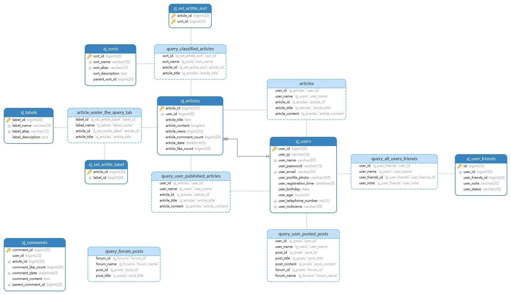
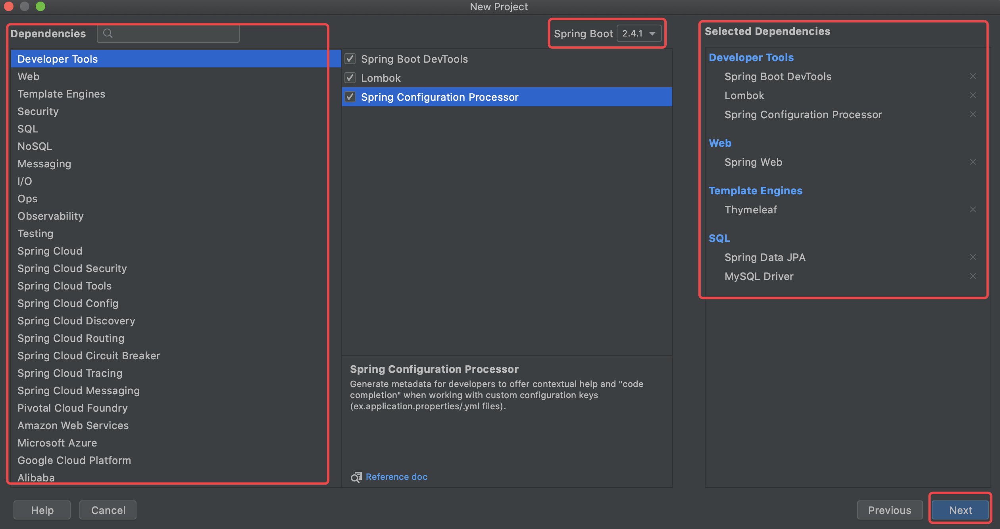
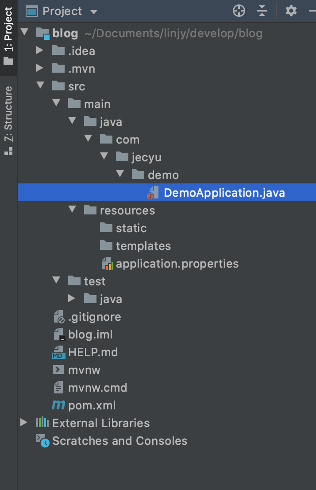

# 前端工程师入门 Java，从实现博客入手

<!-- - 前后端不分离
- 前后端分离
- 微服务/微前端
notebook 抓取，同步更新
 -->

## 总体架构

### 业务架构

#### 需求与功能

用户故事模版：

- 作为一个（某个角色）使用者，我可以做（某个功能）事情，如此可以有（某个商业价值）的好处。

角色、功能、商业价值

个人博客系统的用户故事：

**角色**：普通访客、管理员（我）

**访客**

- 分页查看所有的博客
- 快速查看博客数最多的 6 个分类
- 可以查看所有的分类
- 可以查看某个分类下的博客列表
- 可以快速查看标记博客最多的 10 个标签
- 可以查看所有的标签
- 可以查看某个标签的博客列表
- 可以根据年度时间线查看博客列表
- 可以快速查看最新的推荐博客
- 可以用关键字全局搜索博客
- 可以查看单个博客内容
- 可以赞赏博客内容
- 可以微信扫码阅读博客内容
- 可以在首页扫描公众号二维码关注我

**我**

- 用户名和密码登录后台管理
- 管理博客
  - 发布新博客
  - 对博客进行分类
  - 对博客打标签
  - 修改博客
  - 删除博客
  - 根据标题、分类、标签查询博客
- 管理博客分类
  - 新增一个分类
  - 修改一个分类
  - 删除一个分类
  - 根据分类名称查询分类
- 管理标签
  - 新增一个标签
  - 修改一个标签
  - 删除一个标签
  - 根据名称查询标签

#### 功能规划图


### 系统架构

### 技术架构

### 技术选型

- 后端：Spring Boot + JPA + thymeleaf
- 数据库：MySQL
- 前端 UI：Semantic UI 框架

### 工具与环境

- IDEA
- Maven 3
- JDK 8
- Axure RP 8 原型设计

## 前端开发

### 页面设计

前端展示：首页、详情页、分类、标签、归档、关于我

Axure 可以直接预览 html

### 页面插件集成

- 编辑器 markdown
- 内容排版 typo.css
- 动画 animate.css
- 目录生成 Tocbot
- 代码高亮 prism
- 平滑滚动 jquery.scrollTo
- 二维码生成 qrcode.js

数据库表设计工具 基本 ER 图

## 后端开发

### 数据库设计



### 构建框架

可以参考 [Spring Boot(二)：开始第一个 Spring Boot 项目](https://zhuanlan.zhihu.com/p/115189577)


#### 构建与配置

##### 1. 引入 Spring Boot 模块

- web
- Thymeleaf（模版）
- JPA
- MySQL
- Aspects
- DevTools
  - lombok 日志管理




<!--  -->



```sh
blog
 +-src
  +-main
    +-java
      +- com.shumile.demo
        +- DemoApplication.java
  +-resources
     +-static
     +-templates
     +-application.properties
 +-test
 +-pom.xml
```

主要目录：

- src/main/java：程序开发以及主程序入口
- src/main/resources：配置文件
- src/test/java：测试程序

主要文件：

- 1、DemoApplication.java -项目唯一启动类（带有@SpringBootApplication 注解）

- 2、static 存放 web 访问的静态资

- 3、templates 存放模板文件

- 4、application.properties 项目配置文件

- 5、pom.xml 配置 maven 依赖的文件

##### 2. Application.yml 配置

使用 thymeleaft 3

数据库连接配置

#### 异常处理
## 参考资料

- [Spring Boot 日志管理](http://www.imooc.com/wiki/springbootlesson/logback.html)
- [个人博客数据库设计](https://juejin.im/post/6844903805482434568#heading-11)
- [通俗易懂 Springboot 搭建博客系统 (无废话版！)](https://www.bilibili.com/video/BV1664y1F7c1?p=4)
- 原博客地址：https://onestar.newstar.net.cn/
  源码领取方式一：
  关注公众号【编程日刊】，后台回复【博客】，即可领取源码
  源码领取方式二：
  前端页面源码地址：https://github.com/oneStarLR/myblog-page
  以 jpa 为持久层源码地址：https://github.com/oneStarLR/myblog-jpa
  以 mybatis 为持久层源码地址：https://github.com/oneStarLR/myblog-mybaits
  欢迎给 star 以鼓励(^\_−)☆

后端开发笔记：
前端页面展示（一）：https://onestar.newstar.net.cn/blog/37
技术需求（二）：https://onestar.newstar.net.cn/blog/38
框架搭建（三）：https://onestar.newstar.net.cn/blog/41
后台登录（四）：https://onestar.newstar.net.cn/blog/42
实体类构建（五）：https://onestar.newstar.net.cn/blog/43
分类管理（六）：https://onestar.newstar.net.cn/blog/44
博客管理（七）：https://onestar.newstar.net.cn/blog/46
友链管理（八）：https://onestar.newstar.net.cn/blog/47
相册管理（九）：https://onestar.newstar.net.cn/blog/48
博客首页显示（十）：https://onestar.newstar.net.cn/blog/49
博客详情页面显示（十一）：https://onestar.newstar.net.cn/blog/50
其他页面显示（十二）：https://onestar.newstar.net.cn/blog/51
线上部署（十三）：https://onestar.newstar.net.cn/blog/52
完结——十年之约：https://onestar.newstar.net.cn/blog/53
