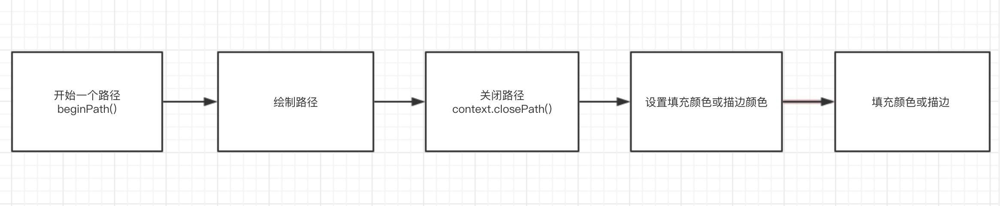
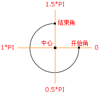

# Canvas 使用与踩坑总结（笔记）

复杂例子可以查看 Arcgis 地图的在线 demo 和 echart

通过图层的加载、移除、事件、放大等看 Canvas 是如何进行处理的，一个企业级的 canvas 实战。

- 切片服务是如何加载的，如何通过比例尺来使用 canvas 进行对应的缩放处理的。

## 入门

```html
<!DOCTYPE html>
<html lang="en">
  <head>
    <meta charset="UTF-8" />
    <meta name="viewport" content="width=device-width, initial-scale=1.0" />
    <title>CSS 属性设置 width、height</title>
    <style>
      #canvas {
        background: #000;
      }
    </style>
  </head>
  <body>
    <canvas id="canvas"></canvas>
    <script>
      const canvas = document.getElementById("canvas");
      const context = canvas.getContext("2d");
      // 使用 JS 来设置宽高
      // 尽量使用 HTML 的width 和 height 属性或者直接使用 JS 动态来设置宽高，不要使用 CSS 设置
      const cx = (canvas.width = 400);
      const cy = (canvas.height = 400);

      context.beginPath();
      context.arc(100, 100, 50, 0, Math.PI * 2, true);
      context.closePath();
      context.fillStyle = "rgb(255, 255, 255)";
      context.fill();
    </script>
  </body>
</html>
```

| 方法               | 描述                                                    |
| ------------------ | ------------------------------------------------------- |
| fill()             | 填充路径                                                |
| stroke()           | 描边                                                    |
| arc()              | 创建圆弧                                                |
| rect()             | 创建矩形                                                |
| fillRect()         | 绘制矩形路径区域                                        |
| strokeRect()       | 绘制矩形路径描边                                        |
| clearRect()        | 在给定的矩形内清除指定的像素                            |
| arcTo()            | 创建两切线之间的弧/曲线                                 |
| beginPath()        | 起始一条路径，或重置当前路径                            |
| moveTo()           | 把路径移动到画布中的指定点，不创建线条                  |
| lineTo()           | 添加一个新点，然后在画布中创建从该点到最后指定点的线条  |
| closePath()        | 创建从当前点回到起始点的路径                            |
| clip()             | 从原始画布剪切任意形状和尺寸的区域                      |
| quadraticCurveTo() | 创建二次方贝塞尔曲线                                    |
| bezierCurveTo()    | 创建三次方贝塞尔曲线                                    |
| isPointInPath()    | 如果指定的点位于当前路径中，则返回 true，否则返回 false |



开始路径，可以想象用 photoshop 钢笔路径

- `stroke()` ：描边
- `fill()` ：填充

我们可以通过 `strokeStyle` 属性和 `fillStyle` 属性来设置描边和填充的颜色。这里不仅可以设置单一的颜色，还可以设置渐变。

- `arc()` 方法创建弧/曲线（用于创建圆或部分圆）。

context.arc(x,y,r,sAngle,eAngle,counterclockwise);
x：圆心的 x 坐标
y：圆心的 y 坐标
r：圆的半径
sAngle：起始角，以弧度计（弧的圆形的三点钟位置是 0 度）
eAngle：结束角，以弧度计
counterclockwise：可选。规定应该逆时针还是顺时针绘图。false 为顺时针，true 为逆时针



- 如果没有 moveTo，那么第一次 lineTo 的就视为 moveTo

### 直线

| 样式       | 描述                                     |
| ---------- | ---------------------------------------- |
| lineCap    | 设置或返回线条的结束端点样式             |
| lineJoin   | 设置或返回两条线相交时，所创建的拐角类型 |
| lineWidth  | 设置或返回当前的线条宽度                 |
| miterLimit | 设置或返回最大斜接长度                   |

### 绘制矩形

- `fillRect(x,y,width,height)`：绘制一个实心矩形
- `strokeRect(x,y,width,height)`：绘制一个空心矩形

我们可以通过 fillStyle() 和 strokeStyle() 来设置填充的颜色和描边的颜色。

### 颜色、样式和阴影

#### 设置阴影

| 属性          | 描述                                     |
| ------------- | ---------------------------------------- |
| fillStyle     | 设置或返回用于填充绘画的颜色、渐变或模式 |
| strokeStyle   | 设置或返回用于笔触的颜色、渐变或模式     |
| shadowColor   | 设置或返回用于阴影的颜色                 |
| shadowBlur    | 设置或返回用于阴影的模糊级别             |
| shadowOffsetX | 设置或返回阴影距形状的水平距离           |
| shadowOffsetY | 设置或返回阴影距形状的垂直距离           |

#### 设置渐变

| 方法                   | 描述                                    |
| ---------------------- | --------------------------------------- |
| createLinearGradient() | 创建线性渐变（用在画布内容上）          |
| createPattern()        | 在指定的方向上重复指定的元素            |
| createRadialGradient() | 创建放射状/环形的渐变（用在画布内容上） |
| addColorStop()         | 规定渐变对象中的颜色和停止位置          |

context.createLinearGradient(x0, y0, x1, y1);

- x0：开始渐变的 x 坐标
- y0：开始渐变的 y 坐标
- x1：结束渐变的 x 坐标
- y1：结束渐变的 y 坐标

`context.createLinearGradient()` 的参数是两个点的坐标，这两个点的连线实际上就是渐变的方向。我们可以使用 `addColorStop` 方法来设置渐变的颜色。

`gradient.addColorStop(stop, color)`：

- `stop`：介于 0.0 与 1.0 之间的值，表示渐变中开始与结束之间的位置。
- `color`：在结束位置显示的 CSS 颜色值

### 图形转换

| 方法             | 描述                                             |
| ---------------- | ------------------------------------------------ |
| `scale()`        | 缩放当前绘图至更大或更小                         |
| `rotate()`       | 旋转当前绘图                                     |
| `translate()`    | 重新映射画布上的 (0,0) 位置                      |
| `transform()`    | 替换绘图的当前转换矩阵                           |
| `setTransform()` | 将当前转换重置为单位矩阵，然后运行 `transform()` |

画布旋转、缩放，对应地图的旋转，缩放。

`rotate()` 方法 `context.rotate(angle)`;

- angle : 旋转角度，以弧度计。 如需将角度转换为弧度，请使用 degrees*Math.PI/180 公式进行计算。 举例：如需旋转 5 度，可规定下面的公式：5*Math.PI/180。

在进行图形转换的时候，我们需要画布旋转，然后再绘制图形。

**这样的结果是，我们使用的图形变换的方法都是作用在画布上的，既然对画布进行了变换，那么在接下来绘制的图形都会变换。这点是需要注意点。**

比如，我对画布使用了 `rotate(20 * Math.PI/180)` 方法，就是将画布旋转了 20 度，然后之后绘制的图形都会旋转 20 度。

<!-- 多个画布元素，进行旋转 -->

### 图像绘制

| 方法        | 描述                         |
| ----------- | ---------------------------- |
| drawImage() | 向画布上绘制图像、画布或视频 |

`context.drawImage(img,sx,sy,swidth,sheight,x,y,width,height);`

- `img`：规定要使用的图像、画布或视频
- `sx`：可选。开始剪切的 x 坐标位置
- `sy`：可选。开始剪切的 y 坐标位置
- `swidth`：可选。被剪切图像的宽度
- `sheight`：可选。被剪切图像的高度
- `x`：在画布上放置图像的 x 坐标位置
- `y`：在画布上放置图像的 y 坐标位置
- `width`：可选。要使用的图像的宽度（伸展或缩小图像）
- `height`：可选。要使用的图像的高度（伸展或缩小图像）

炫酷的背景

- 背景
  单一颜色
  渐变
  平铺
- 炫酷
  动
  随机
- 特效（与用户交互）
  鼠标跟随
  视觉差

## 进阶

### 怎么实现随机粒子

- 粒子
- 规则图形
- 随机
- 数量多

JS + Canvas 动画，JS 捕获鼠标事件，然后动态绘制。

至于动画是不断擦除和绘制的过程，就像以前翻看的小人书，翻页动画。

应用例子：要素图层的渲染器设置移动。

#### 怎么使的随机例子动起来

Canvas 制作动画是一个不断擦除再重绘（可以通过 clearRect 重绘某一部分）的过程，跟原始实现动画的方式类似。在纸片上画每一帧，然后以很快的速度翻动小本本，就会有动画的效果。

现在我们实现动画需要在很短的时间内不断的清除内容再重新绘制，新的图形和原先清除的图形之间有某种位置关系，速度足够的话，我们就会看到动画的效果。

**应用例子**：可以参考百度地图的人口迁入迁出是如何实现动画效果。

### 使你的鼠标和屏幕互动

1. 创建 Cavans 元素，设置参数
2. 鼠标移动事件，将坐标信息 push 到数组
3. 设置颜色
4. 设置动画 `animate()` 函数

```html
<!DOCTYPE html>
<html lang="en">
  <head>
    <meta charset="UTF-8" />
    <meta name="viewport" content="width=device-width, initial-scale=1.0" />
    <title>使你的鼠标和屏幕互动</title>
    <style>
      * {
        padding: 0;
        margin: 0;
      }
      #canvas {
        background: #000000;
      }
    </style>
  </head>
  <body>
    <canvas id="canvas"></canvas>
    <script>
      const ctx = document.getElementById("canvas");
      const content = ctx.getContext("2d");
      const WIDTH = document.documentElement.clientWidth;
      const HEIGHT = document.documentElement.clientHeight;
      ctx.width = WIDTH;
      ctx.height = HEIGHT;
      const para = {
        num: 100,
        color: false, // 颜色 如果是 false 则是随机渐变颜色
        r: 0.9, // 圆每次增加的半径
        o: 0.09, // 判断圆消失的条件，数值越大，消失的越快
        a: 1,
      };
      let color, color2;
      const round_arr = []; // 存放圆的数组

      // 鼠标事件
      window.onmousemove = function(event) {
        const mouseX = event.clientX;
        const mouseY = event.clientY;

        round_arr.push({
          mouseX,
          mouseY,
          r: para.r, // 设置半径每次增大的数值
          o: 1, // 判断圆消失的条件，数值越大，消失得越快
        });
      };

      // 判断参数是否设置了 color，如果设置了 color，就使用该值
      // 如果参数中的 color 为 fasle，那么就使用随机的颜色
      if (para.color) {
        color2 = para.color;
      } else {
        color = Math.random() * 360;
      }

      // 动画
      function animate() {
        if (!para.color) {
          color += 0.1;
          color2 = "hsl(" + color + ",100%,80%)";
        }
        content.clearRect(0, 0, WIDTH, HEIGHT);

        for (let i = 0; i < round_arr.length; i++) {
          content.fillStyle = color2;
          content.beginPath();
          content.arc(
            round_arr[i].mouseX,
            round_arr[i].mouseY,
            round_arr[i].r,
            0,
            Math.PI * 2
          );
          content.closePath();
          content.fill();
          round_arr[i].r += para.r;
          round_arr[i].o -= para.o;

          if (round_arr[i].o <= 0) {
            round_arr.splice(i, 1);
            i--;
          }
        }
        window.requestAnimationFrame(animate);
      }
      animate();
    </script>
  </body>
</html>
```

核心思想是记录位置、操作信息，

鼠标的操作进行更新信息，然后使用 Canvas 重新绘制即可。

应用例子：鼠标移动地图（记录上一次的位置信息，记录鼠标的位置信息，对地图的信息整体改变，然后重新绘制）

实践例子：一个简单图片绘制，跟鼠标一起的信息处理。每次鼠标移动，图片的位置跟随移动。

后续。

### 使用 Canvas 实现地图的渲染、拖拽、缩放

监听鼠标事件，然后更改渲染的数据，进行对 Canvas 重新绘制。

### 使用 Canvas 实现一个可交互的图表

- Chart.js

## 实战

- API
- 抽象层次

从设计入手，API 和抽象层次两个方面来分析源码和动手设计一款出来。

mini-arcgis-api-for-js

如果你思考用哪个可视化库，那就先从你的时间、你的编码习惯、任务本身以及库的目标用户等角度来决定库的抽象层次。选择好哪种抽象层次的库之后，再去看看 API 设计以及其他可能需要考虑的因素：

- 渲染技术：用的是 SVG，Canvas，还是 WebGL
- 性能：包大小，速度，服务端渲染等
- 其他：类型安全，证书，主题风格，动效等

### 抽象层级

- 封装一个图形操作库（Graphic Libraries）
  - three.js

### 设计一个地图库

- 分析地图库 Arcgis
  - Arcgis api for js 3.x 版本使用 svg 实现地图，4.x 使用 canvas（2d 和 3d webgl）。
- 分析地图库 Openlayer


### 设计一款图表库

- 分析图表库 ECharts、D3

## 一些坑

### Canvas.toDataURL() 失效不可读

或者读不了

解决方案：

1. 通过服务端出图。

对比通过打印服务出图的时间记录，与前端 html2canvas 出图的时间。

### Canvas 不能出矢量图（arcgis 4.x 的时候）

- task printTask
- html2canvas（4.12 后版本与前版本）

- [Arcgis 导出图片](https://www.jianshu.com/p/30db6d047c50)

因为 html2canvas 转化成 canvas 的时候并不支持 transform
我们看看各个图层在 dom 是如何构成。可能会导致 图层和底图偏移。（3.x）

只能通过 svg 出图，这个也是 Arcgis api 3.x 的时候，导出图片的好处。 svg 出图。

地图的图层绘制，也是通过 drawImage

- 上面，我们是用 base64 来进行下载的，而谷歌浏览器限制了 donwload 属性的 a 标签 url 长度。这时候我们可以将 html2canvas 转化为 `blob`，再使用一个插件： `FileSaver` 进行下载 ，代码如下，只需要在返回 canvas 的代码块中修改一下就可以了：

使用瓦片服务，会出现跨域问题。地图会空白,如图，左边为需要的效果，右边为实际效果。（svg 的情况，带有 html 的）

作者：alan_1
链接：https://www.jianshu.com/p/30db6d047c50
来源：简书
著作权归作者所有。商业转载请联系作者获得授权，非商业转载请注明出处。

## 参考资料

- [解决 canvas 图片 getImageData,toDataURL 跨域问题](https://www.zhangxinxu.com/wordpress/2018/02/crossorigin-canvas-getimagedata-cors/)
- [超简单的 canvas 绘制地图](https://juejin.im/post/6844903782124371981)
- [深入理解定时器系列第二篇——被誉为神器的 requestAnimationFrame](https://user-gold-cdn.xitu.io/2017/12/3/1601cd6b7a0d58b7)
- [如何使用 Canvas 制作出炫酷的网页背景特效](https://juejin.im/book/6844723714655780871/section/6844723715284926471)
- [借助 SVG forginObject 实现 DOM 转图片实例页面](https://www.zhangxinxu.com/study/201708/svg-foreignobject-dom-to-image.html)
- [可视化库的设计空间](https://mp.weixin.qq.com/s/Y0ZBxpGdlr3fE8BtkjtvGw)
