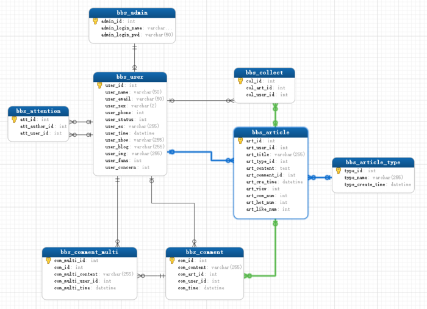

# BBS 项目架构

页面布局

判断用户是否登录
登录显示评论框
没有显示登录和注册功能
显示评论内容
判断有没回复评论使用 @ 符号连接
评论功能

- 获取评论的信息
- 发送数据给后端
- 当前评论文章的 id
- 评论内容，
csrf
后端处理
获取前端传来的数据
表操作
文章表中当前文章评论数据
操作评论表，插入评论内容
返回数据
前端处理
提示用户评论成功
清空框中内容
将用户填加的内容动态的添加的标签中显示 appen
回复功能

点击回复功能标签显示要评论那个人的用户名通过@连接，并在文本框中显示，获取焦点，
并获取点前评论用户的 id
添加内容
判断用户是否是子评论通过 id 判断
如果是则获取提交内容进行处理，将@和用户名取出实现保存数据
传送数据
当前文章的 id
处理过的内容
写评论内容用户的 id
跨平台校验
后台处理
直接在插入数据的 sql 语句加入 id 字段
返回数据
前端处理
显示评论成功
动态添加标签
前端子评论的渲染

1. 清除全局变量写评论的用户 id
   发表一个评论渲染
   原始目的：在 Arcgis 源代码不满足需求，需要修复处理。

# 参考资料

- [BBS 数据库设计](https://www.cnblogs.com/randysun/p/11877429.html)
- [BBS 项目架构实现](https://www.cnblogs.com/randysun/p/11877471.html)
- [【Spring Boot 实战】论坛项目【第一季】](https://www.bilibili.com/video/BV1r4411r7au?t=23&p=37)
