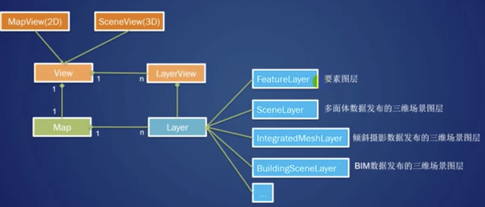
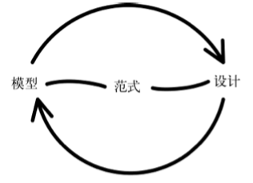

# Arcgis API For JS 二三维一体化

**最好的方案是**：二三维使用统一的地理坐标系，比如都使用 4490。这样就避免了很多问题。

- 为什么不统一使用地理坐标系，这是因为投影坐标有它的作用，在计算某些面积的时候更加准确。统一坐标系的话，使用 arcgis 直接赋值 viewpoint 即可？如果有地形图是不是就不行了呢？
- 如何跨越坐标系的影响，建立高度与比例尺的映射关系。
- 主要是二维的投影坐标系对于统计、分析比较精确，而地理坐标系是不正确。因此不同。

ppt 演讲，后组合成 blog。

消息通信机制 + 同步处理。

（上）
（下）

## 前言

必须理解二维与三维地图展示的原理，否则在切换二三维或联动时就会遇到很多问题。[63-高效调试](63-高效调试.md)

头脑风暴

- 运维权限，三维地图服务如何配置，目前只支持二维地图服务
  - 前端配置文件
- 如何更好地嵌入三维地图
- 三维数据包括场景数据和高程数据，arcgis for api 如何加载处理
  - arcgis 4.9 api 所支持的三维服务如何
  - mapView（二维）
  - sceneView（三维）
  - 加载高程数据
    - ElevationLayer
    - TileLayer
  - 加载场景数据
    - SceneLayer
    -
  - 加载三维影像数据
    - ImageryLayerView
- 加载三维图层时，不需要设置 baseMap 地图，因为不是叠加。
- 三维与二维的区别
- 二三维联动/切换
- 三维需求

- 定位渲染
- 目前的基线 draw 无法使用
- 查询数据，在三维服务中一样可以正常查询

- 如何更好的接入，对于二三维一体化。是否需要新建一个 三维 map 组件专门处理。

  - 三维与二维其实更像是一个摄像机的正交
  - 运维权限
  - 二维与三维底图坐标系要一致。
  - 如果要在三维中，添加二维图层，通过共用 view，然后叠加
  - 是否要同步二维地图已经加载的图层，在三维地图中的显示，例如某个专题、查询的渲染效果，同步添加三维地图上。

- 图层的叠加要求
  - 参考坐标系一致 spatialReference
  - center/zoom/scale
  - 场景图层
  - camera 的设置
- [x] 二维叠加到三维地图上
- [x] 天地图加载到三维
- [ ] 运维权限的配置底图
- 操作
  - 定位（二维要素的定位、三维要素的）
    - 经度与维度
    - x 与 y
  - 查询分析
- 实现：地图初始化、空间参考坐标系的问题了
  - 目标没有一个二维图层、三维高程同一个坐标系上的数据服务
- 下午在基础信息平台引入三维测试，二维地图的显示
- 地图是天地图，如果不正确设置的话，地图也会出不来

使用同一个 map 对象，实现特殊同步，如果需要集成再考虑后续处理。

viewpoint

```js
var view = new SceneView({
        container: "viewDiv",
        viewingMode: "global",
        map: map,
        camera: {
          position: {
            x: -168869,
            y: 3806095,
            z: 1618269,
            spatialReference: {
              wkid: 102100
            }
          },
          heading: 17,
          tilt: 48
        },
        constraints: {
          `snapToZoom: false`
        }
      });
```

## 前置知识

### 地图坐标系

- [地理坐标系统](./地理坐标系统.md)

http://localhost:55355/arcgis_js_v412_sdk/arcgis_js_api/sdk/latest/api-reference/esri-geometry-projection.html

### 数据

### ArcGIS 三维数据生产

### ArcGIS 服务发布

10.7

ArcGIS Pro

### ArcGIS 三维服务使用

### 已知的限制

- 二维数据（动态服务、要素服务）可以在三维地图中加载显示
  - 切片无法叠加上去（待研究）
- 三维数据不能在二维地图中加载显示
- 绘制工具暂无法支持三维数据

## 二三维一体化

### 初始化范围

### 地图是如何制作出来的——二维地图与三维地图

- 如何映射到二维地图
- 二维地图数据（x，y/经度、维度）如何映射叠加到三维球体
  - 能否直接添加等等
  - 切片与动态图层（切片加载，ArcGIS API 会对应请求到相对应的图片）
  - 坐标系统（本身集成到三维）

默认的二维也可以添加到三维地图上的，用了相同的世界坐标。

理解这些有利于确定二三维如何一体化，首先是展示上的一体化。

- 二三维切换（联动），同步数据、事件、查询结果
- 二维在三维地球中进行叠加

### 限制

Limitations about switching between 2D and 3D
Keep in mind that switching from a MapView to a SceneView requires careful consideration for a number of factors. See the list below for some of the factors of consideration. This list is not comprehensive.

- **Data types** - Some layers aren't supported in 2D because of their 3D nature. These include SceneLayer, IntegratedMeshLayer, and PointCloudLayer. They will need to be removed from the map instance altogether, or replaced with 2D counterparts. For example, you could switch a SceneLayer representing buildings with a polygon FeatureLayer representing building footprints. ElevationLayer doesn't need to be considered as closely as the other layers mentioned above since the Map's ground is ignored in MapViews.
- **Symbols** - While most 2D symbols are useable in SceneView, all 3D symbols are not supported in MapViews. Renderers may need to be reconfigured if 3D symbols are used.
- **UI components** - If adding widgets and other UI components using view.ui.add(), then keep in mind that these components need extra logic for persisting from one view to the next.
- **Widgets** - All widgets in the API are tied to a specific view. If persisting widgets from a 2D to 3D view is desired then extra logic will need to be included for switching the view referenced by each widget. This includes a view's popup instance.

### 是否二维和三维共用一个地图组件，考虑到复用公共的组件，在三维中能否使用二维地图的工具函数、初始化 ，或者说区分为不同的工具类合集。

最终想要实现的效果：

- 将二维和三维地图集成到同一个 GIS 中,在浏览器中并列显示二维和三维地图，实现二维和三维地图的联动和数据同步，用户就可以通过两个维度同时去观察和处理地理信息数据。
- 实现二维和三维地图的联动，数据显示、更新与分析结果的同步，并且与 OGC Web 服务无缝集成，完成了 WebGIS 二三维一体化的目标。

考虑指标：

- `底图加载`是否一致（需要做哪些处理），例如加载天地图、影像图等（）
  - 地图的 spatialReference 引用
  - 全球场景，对底图的切片本身有要求。
- `图层加载`（例如加载三维图层、在三维地图中加载二维图层，方法一致，除了高程图层）
- 要素（数据）查询（查询 API 几乎一致，除了 sceneLayer 的服务端和客户端查询，绘制工具需要添加三维符号，这个也不能直接复用，考虑到后续。可以逐步添加上。）
  - 属性查询、空间查询
  - 绘制工具是否一致，看了官网示例可以公开课（ArcGIS JavaScript API 开发 Web 3D 应用），不一致，绘制的是三维符号，但只不过是在原来的二维面增加了高度。本质上绘制应该也是可以查询到数据，测试后可以使用。只不过没有绘制出一个高度的效果。可以在二维图层绘制，但是如果是绘制的线是立体的，例如从某一个点从另外的三维的，也是 x，y，z 都改变的话，就不能简单复用了。
  - 二维的图层叠加后，一样可以点击对应图层的符号弹出弹框，只不过它是二维的。
- `要素定位`（不一致，除了 extent，还需要设置摄像机的处理。或者在三维中完全可以用摄像机替换掉 extent 的定位，添加 heading 和 tilt，不过 API 都是使用 goTo，只不过封装上需要处理）
  - 二维服务无法在三维地图中定位，如果默认不调整摄像机的情况下，是可以按照原来的二维那样进行定位的，因为默认是正交投影的视图。
  - 因此如果要正常在三维地图中定位二维的要素时，除了 x，y 坐标外，还要设置摄像机进行处理。（这个也跟 WebGL 的原理一致，Unity 3D 的游戏摄像机一致，这个例子可以看规划分析的开发适应性。）
- `要素符号化渲染`（渲染方法不一致，多了 3D SymbolLayer）
  - 可以对二维数据进行三维符号化（ 但是方式不太一样，多了符号的图层，例如对于 symbolLayer 的渲染）
    - 二维要素点能否直接显示为三维要素点，可以通过 symbolLayer 结合某个渲染字段作为 z 轴的信息。
    - 或者把二维数据添加 z 轴。
  - 三维的渲染
- `事件通信`（是否有二三维联动的需求）、数据同步（重点考虑），数据主要是同一个 Map 数据。
  - 二三维代码一体化，直接在初始化的时候就进行了同步，在初始化的时候，同时实例化了三维与二维的 mapView 与 SceneView。
  - 分开渲染，那么 sceneView 的数据不能够同步渲染。
  - 抽离一个共同的图层数据管理，在切换时进行同步。目前佛山的实践是没有同步数据的，而是重新进行了渲染，initMap 加载数据，在切换地图的时候就进行了渲染。这样的话，需要重新触发加载图层，例如在某个专题图层打开的情况，如何切换同步到三维。
  - 所以不仅仅考虑初始化，还要考虑编辑。
  - map 对象是一致的，这就是数据。在切换的时候，加载不同的 map？
- 能否能够集成现有的`运维的配置`，需要开发对应的三维地图配置
  - 针对三维图层的配置
- 如何配置

mapView 与 sceneView 都是两个图层，最好的数据更新即可同步。现有的架构。（架构）

- 三维中：本地视图（一块区域）与全球视图（一个球体）
- 如何在 WebGIS 中组合二三维的架构。
- 可以通过 ·localSence· 也可以转换到本二维视图。（这样就不用两个 view 了？功能上可能不够）

考虑如何引入，至于范围上会有多少的区别？如果要同步图层和数据的话，那么在一开始的增删改查也要对 Map 进行的处理，切换的时候，基于现在的 Map 进行实例化不同的地图 View 视图。（二维和三维视图）

map 是共同的数据，mapView 和 sceneView 是视图，以及一些处理的方法。

要素图层也可以发布不带有 z 的，可以通过 SceneLayer 进行链接管理显示要素的属性。主要 demo 为 [](http://localhost:8080/arcgis_js_v49_sdk/arcgis_js_api/sdk/latest/sample-code/sandbox/index.html?sample=layers-scenelayer-query-popup)

另外一种是服务发布了关联要素图层的场景图层，可以直接点击查询


demo

- 完全 Map 组件
  - styleProject
- 二三维一体化 demo
  - 设置 viewClass

LOD 是什么

- View 视图层
- Map 数据层



ground：dm 图层

webScene 作为一个非 Global 的自定义三维地图，直接加载一个特定的三维地图。

## 实现三维

arcgis for js api ：4.9

arcmap 软件版本：

三维数据：高程数据与场景数据

### 二三维模式切换

版本一：不同步，全部初始化

```html
<!-- <template v-show="sceneType === '2d'"> -->
<div class="eyemap-map" ref="mapNode"></div>
<div
  class="shadow-map"
  ref="shadowMapNode"
  :style="shadowMapSize"
  v-if="mapExport"
></div>
<!-- </template> -->
<!-- <template v-show="sceneType === '3d'">
      <div class="eyemap-map 3d" ref="mapNode3d"></div>
      <div class="shadow-map 3d" ref="shadowMapNode3d" :style="shadowMapSize" v-if="mapExport"></div>
    </template> -->
```

版本二：同步 map 对象，通过两个不同的 dom 容器隐藏/显示，来进行同步，并切换。（武汉方案，未测试陈工）

目前不需要 mapStore 处理。

测试可以。版本三：同步 map 对象，共用一个 container ，通过操作 mapView 或 sceneView 的 container 属性，进行切换。（这个可以看看应该是 container 属性改变后，会重新挂载 view 视图）

由于共用了统一个 map 对象，因此三维的底图和二维的底图，空间坐标系必须一致。（4460，需要做一次坐标偏移）

再进一步的是，使用 mapStore 管理两个以上的 views

底图处理

viewpoint，如果底图的坐标系不同，那么会导致 viewpoint 不一致。

二三维的坐标系必须一致，才能一体化

坐标跟游戏的贴图。

## 搭建架构

技术：

- 状态模式 （状态机就是说输出与两个因素有关:输入和当前状态。）
  - Map 类（currentState：d2MapState/d3MapState）
- 消息订阅发布通信

Map 类记录了当前的状态：

- this.d2MapState = new D2MapState()
- this.d3MapState = new D3MapState()

切换视图时，把请求委托给当前持有状态去执行。

Map

- setState() // d2MapState/d3MapState

```js
d2MapState {
  onViewClick() {
    console.log('三维')
    this.Map.setState(this.d3MapState) // 切换到三维
  }
}
```

不太像。

状态切换复杂度上升：

- 另外切换状态不仅仅是 3d/2d 按钮的切换，还有各种不同的场景按钮记录。（但是这个不算是状态的新增，这是只是新增的场景，是备忘录模式。）

数据的处理：（改造可以把 Map 作为 this 传进去，也可以只把 Map 的 data 数据传入）

- 这个时候如果除了 currentState 外，还有 data 数据，这个 data 是所有状态对象都可以更改的，需要切换 state 把它传过去。setState(data)
- Map 作为中介者，需要处理 data 为各个状态对象可以处理的数据。

二三维一体化是有限的状态机。状态模式是状态机的实现之一。

### 基本例子：电灯

### Vue 的实现

《JavaScript 设计模式》——状态模式



状态模式、状态机、历史快照

## 功能实现

### 专题制图（或截屏）

### 场景保存（书签）

传统的书签，仅仅是保存地图范围。

改善的书签：

- 保存地图范围
- 绘制的要素
- 加载的图层
- 专题开关
- ...

两个层面：

- 数据的恢复
- UI 的恢复

以上均在同一个视图下，也就是同一个二维或三维视图下，数据、功能等恢复都没有问题。

然而，当涉及到二三维数据同步的时候，并且使用同一个数据存储器进行数据同步。

这个时候如果场景恢复后，比如当前在二维场景下，也就是图层数据 1，2，3。要恢复到三维时，是会把所有的图层 1，2，3 关闭，然后加载到三维中去进行恢复。

如果此时用户切换到二维时，由于 1，2，3 已经被关闭，此时作为底图的 1 也会被关闭的，需要手动开启。

会让用户觉得是 bug 的问题，因为首次进入二维场景是有底图 1 的。

**解决方案**：如果切换时，检测到二维场景的基本底图或三维的基本底图被关闭，可以进行打开，这样就可以既能让历史快照恢复的干净，也不会让用户觉得有问题。况且现在三维的底图是无法进行开关的，这个也是需要进一步处理。

用户使用角度来说，当前的恢复场景不要影响到原先三维或二维的初始化视图。因为解决方案是，二维与三维视图需要有默认状态，可以先显示为默认的底图的第一个图层不关闭。三维则是 ground 和 background。

给要不清除的数据都添加一个 isDefault 属性，或者更具体的：`isSceneRestoreNotClear: false`

不能违反历史快照恢复的规则，在恢复前其他的东西都要清除。避免出现恢复。

#### 初步实现

可以通过 json 格式，这个 valueObject 来存储不确定的字段信息给数据库。比较灵活，可以适应后续需要新增字段的情况，而不需要改动数据库。

1. 问题：JSON.stringify 的问题，一些属性克隆有问题。对于具有 proto 属性。（后续要研究），很多 graphic 克隆有问题。lodash 深度拷贝 viewpoint 会丢失属性为空。
2. promise async 会有些问题
3. 正常是 dev 打包，但由于临时测试就没有办法，就用 linjy 分支
4. 保存场景需要把三维的目录也记录下来，后面打开。

```js
let mapData = {
  viewpoint,
  extent,
  visibleBaseMaps,
  graphicObjs,
  measureGraphicObjs,
  openedTopics,
};
return {
  content: JSON.stringify(mapData),
  name: sceneMarkName,
};
```

#### 多状态切换的问题（快照）

使用备忘录：

场景还原应用备忘录模式，场景内部涉及到二三维状态的切换。


在前端层面，如果是一次性的保存与操作，比如地图中的场景保存功能。

需要把保存快照和恢复快照的方法放到 Map 对象中，而 aMemento 备忘录则是后端提供接口处理。其他的组件则是 aCaretaker 的职位。

实现：

```html

```

### 绘制工具（geometry）

### 测量工具

### 视点同步

如果从二维同步到三维时，用户不知道当前的视图点位于哪个位置，可以改善三维中显示出当前视图的行政区划名称，以及具体的地标名称。

目前三维到二维，二维到三维的视点已基本进行同步。剩下就是行政区划的组件显示的一致了。

只需要通过投影定位，以及一些细节的处理。

viewpoint 等属性不可以枚举，这样使用了 Object.keys 的 isEmpty 函数都不能正常进行判断是否为空。

```js
const temp1 = {
  rotation: 0,
  scale: 875462.5441919795,
  targetGeometry: {
    spatialReference: {
      latestWkid: 4524,
      wkid: 4524,
    },
    x: 36548557.6947,
    y: 2558020.34475,
  },
};
temp1.propertyIsEnumerable("rotation");
false;
!0;
true;
temp1.hasOwnProperty("camera");
true;
```

需要对以下非空的判断进行处理。

```js
/**
 * returns true if the value is an empty object, collection, has no enumerable properties or is any type that is not cosidered a collection.
 * @param {*} val
 */
export const isEmpty = val => val == null || !(Object.keys(val) || val).length;
```

这是因为 Object.key 带来的问题，只需要添加对对象的判断即可。
当前这个判断是还是有问题，如果明确设置 enumeratable 为 false，
JSON.stringify(val) === "{}"; 一样为空。需要后续处理。排查是否是其他的问题。

```js
/**
 * 如果值是一个空对象，集合，或者是一个不被集合视为任何类型的类型，返回 true。注意：即使对象没有任何枚举属性，但实际有属性的。
 * @param {*} val
 */
export const isEmpty = val => {
  if (Object.prototype.toString.call(val) === "[object Object]") {
    // 针对没有任何枚举属性的对象，特别是 Arcgis 4.12 的类实例，比如 viewpoint、graphic
    return JSON.stringify(val) === "{}";
  }
  return val == null || !(Object.keys(val) || val).length;
};
```

之前是在二三维的视点同步就出现这个判断。

参考资料：
- [js 如何判断对象是否为空](https://jingyan.baidu.com/article/86112f13bc89ec273797873a.html)

### 定位

### 查询

### 渲染

### 底图处理

tiled、dynamic、wmts、tdt

3D 坐标系
投影坐标系也逐渐开始使用 z 值来计量低于或高于平均海平面的高程。

### 权限配置

## 附录

版本一：map.VUE

```html
<template>
  <div style="width:100%; height:100%;">
    <!-- <template v-show="sceneType === '2d'"> -->
    <div class="eyemap-map" ref="mapNode"></div>
    <div
      class="shadow-map"
      ref="shadowMapNode"
      :style="shadowMapSize"
      v-if="mapExport"
    ></div>
    <!-- </template> -->
    <!-- <template v-show="sceneType === '3d'">
      <div class="eyemap-map 3d" ref="mapNode3d"></div>
      <div class="shadow-map 3d" ref="shadowMapNode3d" :style="shadowMapSize" v-if="mapExport"></div>
    </template> -->
  </div>
</template>

<script>
  // ...
  // import MapStore from "./model/mapStore";
  // import mapConfig from "../../../views/FZBZ/NatureAnalysisEvaluation/ModelEvalution/Common/mixins/mapConfig";
  export default {
    name: "eyemap-map",
    mixins: [
      layerUtils,
      canvasLayerUtils,
      query,
      render,
      baseUtils,
      // geometryUtils,
      locateUtils,
      draw,
      drawTool,
      measure,
    ],
    components: {},
    props: {},
    data() {
      return {
        viewConfig: {
          mapView: null,
          sceneView: null,
          activeView: null,
          container: null,
          baseMap2d: null,
          baseMap3d: null,
        },
      };
    },
    computed: {
      currentViewpoint() {
        if (
          this.mapView.viewpoint.targetGeometry.latitude !== null &&
          this.mapView.viewpoint.targetGeometry.longitude !== null
        ) {
          return JSON.stringify({
            level: this.mapView.zoom,
            latitude: this.mapView.viewpoint.targetGeometry.latitude,
            longitude: this.mapView.viewpoint.targetGeometry.longitude,
          });
        } else {
          return JSON.stringify({
            level: this.mapView.zoom,
            latitude: this.mapView.viewpoint.targetGeometry.x,
            longitude: this.mapView.viewpoint.targetGeometry.y,
          });
        }
      },
    },
    watch: {
      showScaleBar(val) {
        this._showScaleBar(val);
      },
      sceneType: {
        handler(val) {
          this.switchView(val);
        },
      },
    },
    beforeDestroy() {
      if (this.legendInst) {
        this.legendInst.$destroy();
      }
      console.log("map destroy");
      if (this.toolTipTimeOut) {
        clearTimeout(this.toolTipTimeOut);
        this.toolTipTimeOut = null;
      }
      if (this.mapPointerMoveHandler) {
        this.mapPointerMoveHandler.remove();
        this.mapPointerMoveHandler = null;
      }
      if (this.mapPointerLeaveHandler) {
        this.mapPointerLeaveHandler.remove();
        this.mapPointerLeaveHandler = null;
      }
      if (this.mapClickHandler) {
        this.mapClickHandler.remove();
        this.mapClickHandler = null;
      }
      this.eventBus.$emit("EyeMapDestroy");
    },
    // 把 map、mapView 注入到子组件中
    provide() {
      return {
        map: this.map,
        mapView: this.mapView,
        eventBus: this.eventBus,
        shadowMapView: this.shadowMapView,
        curSubSystemName: "",
      };
    },
    async mounted() {
      this.$eyeMapApiPromiseLazy().then(() => {
        this.initMap();
        // this.loadApiModeules();
      });
      let subSysName = "";
      if (
        this.$route.matched &&
        this.$route.matched[0] &&
        this.$route.matched[0].meta
      ) {
        subSysName = this.$route.matched[0].meta.navTitle;
      }
      this.curSubSystemName = subSysName;
    },
    methods: {
      // 加载 api
      async loadApiModeules() {
        const modules = await loadModules(
          "esri/Graphic",
          "esri/geometry/Polygon",
          "esri/layers/GraphicsLayer"
        );
        for (let key in modules) {
          if (this.hasOwnProperty(key)) {
            this[key] = modules[key];
          }
        }
      },
      async get3dMapInitParams() {
        const { Extent, Point } = await loadModules(
          "esri/geometry/Extent",
          "esri/geometry/Point"
        );
        let options = {};
        // 参考坐标系需要与底图一直，否则视图也加载不出来
        if (JSON.stringify(this.viewpoint) != "{}") {
          let pt = new Point({
            x: this.viewpoint.latitude,
            y: this.viewpoint.longitude,
            spatialReference: {
              wkid: this.viewpoint.wkid,
              wkt: this.viewpoint.wkt, // + 3d
            },
          });
          options = {
            spatialReference: {
              wkid: this.viewpoint.wkid,
              wkt: this.viewpoint.wkt, // + 3d
            },
            center: pt,
            scale: this.viewpoint.scale,
          };
        } else {
          options = {
            // spatialReference: {
            //   wkid: this.extent.wkid // -
            // },
            constraints: {
              rotationEnabled: false,
            },
            environment: {
              background: {
                type: "color",
                color: [3, 24, 42, 1],
              },
              starsEnabled: true,
              atmosphereEnabled: false,
            },
          };
          let pt = new Point({
            x: this.extent.x,
            y: this.extent.y,
            spatialReference: {
              wkid: this.extent.wkid, // -
            },
          });
          if (this.checkParameter(this.extent.zoom)) {
            options.center = pt;
            options.zoom = this.extent.zoom;
          } else {
            if (this.checkParameter(this.extent.scale)) {
              options.center = pt;
              options.scale = this.extent.scale;
            } else {
              if (this.checkParameter(this.extent.extent)) {
                options.extent = new Extent({
                  xmin: this.extent.extent.xmin,
                  ymin: this.extent.extent.ymin,
                  xmax: this.extent.extent.xmax,
                  ymax: this.extent.extent.ymax,
                  // spatialReference: {
                  //   wkid: this.extent.wkid
                  // }
                });
              } else {
                console.log("init map para error");
              }
            }
          }
        }
        return options;
      },
      async get2dMapInitParams() {
        const { Extent, Point } = await loadModules(
          "esri/geometry/Extent",
          "esri/geometry/Point"
        );
        let options = {};
        if (JSON.stringify(this.viewpoint) != "{}") {
          let pt = new Point({
            x: this.viewpoint.latitude,
            y: this.viewpoint.longitude,
            spatialReference: {
              wkid: this.viewpoint.wkid,
            },
          });
          options = {
            spatialReference: {
              wkid: this.viewpoint.wkid,
            },
            center: pt,
            scale: this.viewpoint.scale,
          };
        } else {
          options = {
            spatialReference: {
              wkid: this.extent.wkid,
            },
            constraints: {
              rotationEnabled: false,
            },
          };
          let pt = new Point({
            x: this.extent.x,
            y: this.extent.y,
            spatialReference: {
              wkid: this.extent.wkid,
            },
          });
          if (this.checkParameter(this.extent.zoom)) {
            options.center = pt;
            options.zoom = this.extent.zoom;
          } else {
            if (this.checkParameter(this.extent.scale)) {
              options.center = pt;
              options.scale = this.extent.scale;
            } else {
              if (this.checkParameter(this.extent.extent)) {
                options.extent = new Extent({
                  xmin: this.extent.extent.xmin,
                  ymin: this.extent.extent.ymin,
                  xmax: this.extent.extent.xmax,
                  ymax: this.extent.extent.ymax,
                  spatialReference: {
                    wkid: this.extent.wkid,
                  },
                });
              } else {
                console.log("init map para error");
              }
            }
          }
        }
        return options;
      },
      async initMap() {
        const {
          MapView,
          SceneView,
          Map,
          Basemap,
          TileLayer,
          MapImageLayer,
          GraphicsLayer,
          // watchUtils,
          // Extent,
          // Point,
          config,
          urlUtils,
          // lang,
          WebTileLayer,
          TileInfo,
        } = await loadModules(
          "esri/views/MapView",
          "esri/views/SceneView",
          "esri/Map",
          "esri/Basemap",
          "esri/layers/TileLayer",
          "esri/layers/MapImageLayer",
          "esri/layers/GraphicsLayer",
          "esri/core/watchUtils",
          "esri/geometry/Extent",
          "esri/geometry/Point",
          "esri/config",
          "esri/core/urlUtils",
          "dojo/_base/lang",
          "esri/layers/WebTileLayer",
          "esri/layers/support/TileInfo"
        );

        let mapServerProxy = this.$store.getters.mapServerProxy;
        config.request.proxyRules = []; // 清除已经存在的服务代理信息
        if (mapServerProxy && mapServerProxy[this.module]) {
          let serverProxy = mapServerProxy[this.module];
          if (serverProxy !== null && JSON.stringify(serverProxy) != "{}") {
            Object.keys(serverProxy).forEach((key) => {
              urlUtils.addProxyRule({
                urlPrefix: key,
                proxyUrl: serverProxy[key],
              });
            });
          } else {
            console.log("serverProxy为null或空对象");
          }
        } else {
          console.log("mapServerProxy为空或module未指定");
        }
        // 设置云服务管理代理的服务请求让携带cookie
        // let dataMapList = this.$store.getters.dataMapList;
        // dataMapList.forEach(service => {
        //   if (service.useproxy === "true") {
        //     const pattern = /(http|https):\/\/?(\w+(\.)?)+(:[0-9]{1,4})+/;
        //     const domainUrl = service.url.match(pattern)[0];
        //     const trustedServers = config.request.trustedServers;
        //     if (trustedServers.indexOf(domainUrl) < 0) {
        //       trustedServers.push(domainUrl);
        //     }
        //   }
        // });

        // 将底图服务添加到 map 上（切片服务和影像服务、天地图）
        const tbasemaps = []; // 天地图
        const tbasemaps_1 = [];
        const dbasemaps = []; // 动态图层
        if (this.baseLayerUrls && this.baseLayerUrls.length > 0) {
          for (let i = 0; i < this.baseLayerUrls.length; i++) {
            let access_token = "";
            if (this.baseLayerUrls[i].type === "tiled") {
              if (
                this.baseLayerUrls[i].access_token &&
                this.baseLayerUrls[i].access_token === true
              ) {
                access_token = this.$store.getters.access_token;
                config.request.interceptors.push({
                  urls: this.baseLayerUrls[i].url,
                  before: function(params) {
                    if (params.requestOptions.query) {
                      params.requestOptions.query.access_token = access_token;
                    } else {
                      params.requestOptions.query = {};
                      params.requestOptions.query.access_token = access_token;
                    }
                  },
                  after: function(response) {
                    if (!response.ssl) {
                      // response.ssl = true;
                    }
                  },
                });
              }
              let tlayer = new TileLayer({
                url: this.baseLayerUrls[i].url,
                visible: true, // this.baseLayerUrls[i].visible
              });
              if (this.baseLayerUrls[i].hasOwnProperty("id")) {
                tlayer.id = this.baseLayerUrls[i].id;
              }

              if (this.baseLayerUrls[i].visible === true) {
                tbasemaps.push(tlayer);
              } else {
                tlayer.visible = false;
                tbasemaps_1.push(tlayer);
              }
            } else if (this.baseLayerUrls[i].type === "dynamic") {
              let dlayer = new MapImageLayer({
                url: this.baseLayerUrls[i].url,
                visible: this.baseLayerUrls[i].visible,
              });
              if (this.baseLayerUrls[i].hasOwnProperty("id")) {
                dlayer.id = this.baseLayerUrls[i].id;
              }
              dbasemaps.push(dlayer);
            } else if (this.baseLayerUrls[i].type === "wmts") {
              if (
                this.baseLayerUrls[i].access_token &&
                this.baseLayerUrls[i].access_token === true
              ) {
                access_token =
                  "&access_token=" + this.$store.getters.access_token;
              }
              const _wmtsLayer = await createWmtsLayer(
                this.baseLayerUrls[i].id,
                this.baseLayerUrls[i].name,
                this.baseLayerUrls[i].url + access_token,
                this.tileInfo
              );
              _wmtsLayer.visible = true;
              if (this.baseLayerUrls[i].visible === true) {
                tbasemaps.push(_wmtsLayer);
              } else {
                _wmtsLayer.visible = false;
                tbasemaps_1.push(_wmtsLayer);
              }
            } else if (this.baseLayerUrls[i].type === "tdt") {
              const _tdtLayer = await createTDTLayer(
                this.baseLayerUrls[i].name,
                this.baseLayerUrls[i].name,
                this.baseLayerUrls[i].url
              );
              _tdtLayer.visible = true;
              _tdtLayer.on(
                "layerview-create",
                ((event) => {
                  if (_tdtLayer.name == "电子地图注记") {
                    this.swipeLayer = event.layerView;
                    // event.layerView.container._childrenRenderParameters.state.clipParas = {
                    //   type: "H",
                    //   width: this.swipeValue
                    // };
                    // this.swipeLayer.watch("updating", val => {
                    //   console.log(val);
                    // });
                  }
                }).bind(this)
              );
              if (this.baseLayerUrls[i].visible === true) {
                tbasemaps.push(_tdtLayer);
              } else {
                _tdtLayer.visible = false;
                tbasemaps_1.push(_tdtLayer);
              }
            }
          }
        } else {
          console.log("basemap config error");
          return;
        }

        const map = new Map();
        const shadowMap = new Map();
        // this.mapStore = new MapStore(map); // 实例化 mapStore 记录

        // 底图处理
        if (tbasemaps.length > 0) {
          const basemap = new Basemap({
            baseLayers: tbasemaps.concat(tbasemaps_1),
          });
          map.basemap = basemap;
          shadowMap.baseMap = basemap;
          this.viewConfig.basemap = basemap;

          // 临时方案 3D 底图，因为目前的 2d 底图都无法正常添加到 3维球体上
          let tileInfo = new TileInfo({
            dpi: 90.71428571427429,
            rows: 256,
            cols: 256,
            compressionQuality: 0,
            origin: {
              x: -180,
              y: 90,
            },
            spatialReference: {
              wkid: 4326, // 临时方案，后续采用客户统一的底图服务支持二维和三维显示
              // wkid: 4490
            },
            lods: [
              {
                level: 0,
                levelValue: 1,
                resolution: 0.703125,
                scale: 295497593.05875003,
              },
              {
                level: 1,
                levelValue: 2,
                resolution: 0.3515625,
                scale: 147748796.52937502,
              },
              {
                level: 2,
                levelValue: 3,
                resolution: 0.17578125,
                scale: 73874398.264687508,
              },
              {
                level: 3,
                levelValue: 4,
                resolution: 0.087890625,
                scale: 36937199.132343754,
              },
              {
                level: 4,
                levelValue: 5,
                resolution: 0.0439453125,
                scale: 18468599.566171877,
              },
              {
                level: 5,
                levelValue: 6,
                resolution: 0.02197265625,
                scale: 9234299.7830859385,
              },
              {
                level: 6,
                levelValue: 7,
                resolution: 0.010986328125,
                scale: 4617149.8915429693,
              },
              {
                level: 7,
                levelValue: 8,
                resolution: 0.0054931640625,
                scale: 2308574.9457714846,
              },
              {
                level: 8,
                levelValue: 9,
                resolution: 0.00274658203125,
                scale: 1154287.4728857423,
              },
              {
                level: 9,
                levelValue: 10,
                resolution: 0.001373291015625,
                scale: 577143.73644287116,
              },
              {
                level: 10,
                levelValue: 11,
                resolution: 0.0006866455078125,
                scale: 288571.86822143558,
              },
              {
                level: 11,
                levelValue: 12,
                resolution: 0.00034332275390625,
                scale: 144285.93411071779,
              },
              {
                level: 12,
                levelValue: 13,
                resolution: 0.000171661376953125,
                scale: 72142.967055358895,
              },
              {
                level: 13,
                levelValue: 14,
                resolution: 8.58306884765625e-5,
                scale: 36071.483527679447,
              },
              {
                level: 14,
                levelValue: 15,
                resolution: 4.291534423828125e-5,
                scale: 18035.741763839724,
              },
              {
                level: 15,
                levelValue: 16,
                resolution: 2.1457672119140625e-5,
                scale: 9017.8708819198619,
              },
              {
                level: 16,
                levelValue: 17,
                resolution: 1.0728836059570313e-5,
                scale: 4508.9354409599309,
              },
              {
                level: 17,
                levelValue: 18,
                resolution: 5.3644180297851563e-6,
                scale: 2254.4677204799655,
              },
              {
                level: 18,
                levelValue: 19,
                resolution: 2.68220901489257815e-6,
                scale: 1127.23386023998275,
              },
              {
                level: 19,
                levelValue: 20,
                resolution: 1.341104507446289075e-6,
                scale: 563.616930119991375,
              },
            ],
          });
          let tiledLayer = new WebTileLayer(
            "http://{subDomain}.tianditu.com/vec_c/wmts?SERVICE=WMTS&VERSION=1.0.0&REQUEST=GetTile&LAYER=vec&STYLE=default&FORMAT=tiles&TILEMATRIXSET=c&TILEMATRIX={level}&TILEROW={row}&TILECOL={col}&tk=ac0daf56728bbb77d9514ba3df69bcd3",
            {
              subDomains: ["t0", "t1", "t2", "t3", "t4", "t5", "t6", "t7"],
              tileInfo: tileInfo,
            }
          );
          this.viewConfig.basemap3d = {
            baseLayers: [tiledLayer],
          };
        }
        if (dbasemaps.length > 0) {
          map.addMany(dbasemaps);
        }
        let regionGraphicLayer = new GraphicsLayer({
          id: "regionGraphicLayer",
        });
        map.add(regionGraphicLayer);
        this.regionGraphicLayer = regionGraphicLayer;

        // 将map添加到view中
        const mapNode = this.$refs.mapNode;
        // const mapNode3d = this.$refs.mapNode3d;
        const shadowNode = this.$refs.shadowMapNode;
        this.viewConfig.container = mapNode;
        // const shadowNode3d = this.$refs.shadowMapNode3d;

        // 初始化范围
        let option = await this.get2dMapInitParams();
        let option3d = await this.get3dMapInitParams();

        const mapView = this.createView(MapView, map, mapNode, option);
        this.viewConfig.mapView = mapView;
        this.viewConfig.activeView = mapView;
        // const mapView3d = this.createView(SceneView, map, mapNode, option3d); // 不能使用同一个 mapNode 会把 2dMap 覆盖掉
        const mapView3d = this.createView(SceneView, map, null, option3d);
        this.viewConfig.sceneView = mapView3d;
        // 把 view 都存起来，由于 map 作为一个组件给每个子系统使用，即拥有多个地图组件，因此不便放到 store 里管理
        // 单独使用 model 引入
        // 地图初始化的时候，通过使用共同的 map 对象（Model），底图的初始化，便把一系列的地图视图存起来，包括 shadowMapView。数据结构可以使用哈希表处理，可以对视图的增加、删除，新增视图
        // 在切换视图的时候，从 store 中获取视图，例如 sceneView，然后赋予给 mapView 即可（mapView 即是当前激活的视图，后期更改命名）
        // 并进行视图点的同步，这样一个懒方式。也可以针对多个视图同时存在的情况下，操作视图对其他视图同步处理。
        // this.mapStore.addView("2d", mapView);
        // this.mapStore.addView("3d", mapView3d);

        // let shadowMapView = null;
        // let shadowMapView3d = null;
        if (this.mapExport) {
          shadowMapView = this.createView(MapView, map, shadowNode, option);
          // shadowMapView3d = this.createView(
          //   // TODO 后续处理导出
          //   SceneView,
          //   map,
          //   shadowNode3d,
          //   option3d
          // );
        }

        // 初始化视图
        this.map = map;
        window.distMap = map;
        // if (this.sceneType === "2d") {
        //   this.mapView = mapView; // 后续切换视图需要更改的属性
        //   this.shadowMapView = shadowMapView;
        // } else if (this.sceneType === "3d") {
        //   this.mapView = mapView3d;
        //   this.shadowMapView = shadowMapView3d;
        // }
        // 同步当前激活的 view，这个切换视图也需要切换
        this.mapView = this.viewConfig.activeView;
        this.shadowMapView = this.viewConfig.activeView;
        await this.initView();
      },
      async initView() {
        const { watchUtils, lang } = await loadModules(
          "esri/core/watchUtils",
          "dojo/_base/lang"
        );
        this.mapView.ui.components = [];
        // 是否有图例
        if (this.legend) {
          const { Expand } = await loadModules("esri/widgets/Expand");
          let legendMount = document.createElement("div");
          let legendContainer = document.createElement("div");
          legendContainer.appendChild(legendMount);
          const scrLegend = Vue.extend(screenLegend);
          const instance = new scrLegend();
          this.legendInst = instance;
          instance.map = this.map;
          instance.mapView = this.mapView;
          instance.eventBus = this.eventBus;
          instance.store = this.$store;
          instance.mapVC = this;
          instance.module = this.module;
          instance.$mount(legendMount);
          const bgExpand = new Expand({
            view: this.mapView,
            mode: "floating",
            content: legendContainer,
            collapseIconClass: "esri-icon-overview-arrow-bottom-right",
            collapseTooltip: "隐藏图例",
            expandIconClass: "esri-icon-media",
            expandTooltip: "显示图例",
          });
          this.expandInst = bgExpand;
          this.mapView.ui.add(bgExpand, "bottom-right");
        }

        // 是否有全屏
        if (this.fullScreen) {
          const { Fullscreen } = await loadModules("esri/widgets/Fullscreen");
          const fullscreen = new Fullscreen({
            view: this.mapView,
          });
          this.mapView.ui.add(fullscreen, "bottom-right");
        }

        // 是否有全图
        if (this.fullMap) {
          const { Home } = await loadModules("esri/widgets/Home");
          this.homeWidget = new Home({
            view: this.mapView,
          });
          this.mapView.ui.add(this.homeWidget, "bottom-right");

          this.homeWidget.goToOverride = lang.hitch(this, function(mapView) {
            console.log("fullmap");

            let mapToPromise = mapView.goTo(this.initViewPoint, {
              duration: 500,
            });

            mapToPromise.then(
              lang.hitch(this, function() {
                this.$emit("map-full-extent", {
                  home: true,
                  scale: this.initViewPoint.scale,
                  x: this.initViewPoint.targetGeometry.x,
                  y: this.initViewPoint.targetGeometry.y,
                });
              })
            );
            return mapToPromise;
          });
        }

        // 是否有最大最小
        if (this.zoom) {
          const { Zoom } = await loadModules("esri/widgets/Zoom");
          const zoom = new Zoom({
            view: this.mapView,
          });
          this.mapView.ui.add(zoom, "bottom-right");
        }

        // 完成后发送map-ready事件
        window.distMapView = this.mapView;

        if (this.showScaleBar) {
          const { ScaleBar } = await loadModules("esri/widgets/ScaleBar");
          let scaleBar = new ScaleBar({
            view: this.mapView,
            unit: "metric",
            style: "ruler",
          });
          this.mapScalebar = scaleBar;
          this.mapView.ui.add(scaleBar, {
            position: "bottom-left",
          });
          if (this.shadowMapView) {
            let scaleBar = new ScaleBar({
              view: this.shadowMapView,
              unit: "metric",
              style: "ruler",
            });
            this.shadowScaleBar = scaleBar;
            this.shadowMapView.ui.add(scaleBar, {
              position: "bottom-left",
            });
          }
        }

        this.mapView.when(
          lang.hitch(this, function() {
            this.initViewPoint = this.mapView.viewpoint;
            if (this.sceneType == "3d") {
              // this.setShowGeo(
              //   options.extent,
              //   this.extent.heading,
              //   this.extent.tilt
              // );
              this.add3dLayer();
            }
            // this.originImg = mapView.allLayerViews.items[1].container.element.toDataURL();
            this.mapView.watch("extent", (val) => {
              this.$emit("map-extent", {
                type: val.type,
                extent: val.extent,
                center: val.center,
                scale: this.mapView.scale,
              });
            });
            this.toolTipTimeOut = setTimeout(() => {
              this.setToolTip();
            }, 1000);
            if (this.mapType === "alone") {
              // 为alone时，标识为distMap专有
              this.eventBus.$emit("mapInitReady", {
                map,
                mapView: this.mapView,
                mapDiv: this,
              });
              this.$emit("map-ready", {
                map,
                mapView: this.mapView,
                mapDiv: this,
              });
            } else if (this.mapType === "split") {
              // 为split时，标识为分屏地图页面
              this.$emit("map-ready-split", {
                map,
                mapView: this.mapView,
                mapDiv: this,
              });
            }
            setTimeout(this.addWidgetClickHandler, 500);
          })
        );
        // 监测主图范围变化更新打印图范围
        watchUtils.whenTrue(this.mapView, "stationary", () => {
          if (this.mapView.extent) {
            this.eventBus.$emit("mapExtentChange", {
              vueComponent: this,
              type: this.mapView.extent.type,
              extent: this.mapView.extent,
              center: this.mapView.extent.center,
              scale: this.mapView.scale,
            });
            if (this.shadowMapView) {
              this.shadowMapView.extent = this.mapView.extent;
            }
          }
        });
        if (this.shadowMapView) {
          this.shadowMapView.watch("stationary", (res) => {
            this.$emit("shdowMapExtentChange", res);
          });
        }
      },
      async switchView(viewType) {
        const open3d = viewType === "3d";
        this.viewConfig.activeView.container = null; // 移除上一个视图的容器引用，即隐藏视图
        if (open3d) {
          if (this.viewConfig.activeView.viewpoint) {
            this.viewConfig.sceneView.viewpoint = this.viewConfig.activeView.viewpoint.clone();
          }
          this.viewConfig.sceneView.container = this.viewConfig.container;
          this.viewConfig.activeView = this.viewConfig.sceneView;
          // 临时处理，后续统一底图坐标系，可以同时添加到二维和三维球体上的
          this.map.basemap = this.viewConfig.basemap3d;
          // const view = this.mapStore.findView("2d");
          // view.viewpoint = this.activeView.viewpoint;
          // this.mapView = view;
          // this.shadowMapView = this.mapStore.findView("2dshadow");
        } else {
          // 如果目前是 sceneView，同步 mapView 的视图点
          if (this.viewConfig.activeView.viewpoint) {
            this.viewConfig.mapView.viewpoint = this.viewConfig.activeView.viewpoint.clone();
          }
          this.viewConfig.mapView.container = this.viewConfig.container;
          this.viewConfig.activeView = this.viewConfig.mapView;
          this.map.basemap = this.viewConfig.basemap;
          // const view = this.mapStore.findView("3d");
          // view.viewpoint = this.activeView.viewpoint;
          // this.mapView = view;
          // this.mapView.container = ""
          // this.shadowMapView = this.mapStore.findView("3dshadow");
        }
        this.mapView = this.viewConfig.activeView;
        this.shadowMapView = this.viewConfig.activeView;
        // await this.initView();
      },
      /**
       * 创建地图视图：2d/3d
       */
      createView(viewType, map, containerNode, option) {
        const view = new viewType({
          map,
          container: containerNode,
          ...option,
        });
        return view;
      },
      /**
       * 增加三维数据
       */
      async add3dLayer() {
        if (this.d3Layer) {
          const { ElevationLayer, TileLayer } = await loadModules(
            "esri/layers/ElevationLayer",
            "esri/layers/TileLayer"
          );
          if (this.d3Layer.elevationLayer) {
            this.d3Layer.elevationLayer.forEach((url, index) => {
              let elevationLayer = new ElevationLayer(url);
              this.map.ground.layers.add(elevationLayer);
              if (index == 0) {
                elevationLayer.on(
                  "layerview-create",
                  ((event) => {
                    this.setShowGeo(
                      event.target.fullExtent,
                      this.extent.heading,
                      this.extent.tilt
                    );
                  }).bind(this)
                );
              }
            });
          }
          if (this.d3Layer.layers) {
            this.d3Layer.layers.forEach((item) => {
              let layer = null;
              if (item.type == "tileLayer") {
                layer = new TileLayer(item.url);
              }
              this.map.layers.add(layer);
            });
          }
        }
      },

      // 给地图右下角的小部件添加点击事件，用于记录日志
      addWidgetClickHandler() {
        if (
          this.mapView.ui._components &&
          this.mapView.ui._components.length > 0
        ) {
          this.mapView.ui._components.forEach((component) => {
            let node = component.node;
            if (node.className.indexOf("esri-expand") > -1) {
              node.addEventListener("click", () => {
                if (component.widget.expanded) {
                  this.functionLog(
                    this.curSubSystemName,
                    "图例",
                    "地图操作",
                    "打开"
                  );
                } else {
                  this.functionLog(
                    this.curSubSystemName,
                    "图例",
                    "地图操作",
                    "关闭"
                  );
                }
              });
            }
            if (node.className.indexOf("esri-fullscreen") > -1) {
              node.addEventListener("click", () => {
                this.functionLog(
                  this.curSubSystemName,
                  "地图全屏",
                  "地图操作",
                  "点击"
                );
              });
            }
            if (node.className.indexOf("esri-home") > -1) {
              node.addEventListener("click", () => {
                this.functionLog(
                  this.curSubSystemName,
                  "地图全图",
                  "地图操作",
                  "点击"
                );
              });
            }
            if (node.className.indexOf("esri-zoom") > -1) {
              node.addEventListener("click", (evt) => {
                if (evt.target.className.indexOf("esri-icon-plus") > -1) {
                  this.functionLog(
                    this.curSubSystemName,
                    "地图放大",
                    "地图操作",
                    "点击"
                  );
                } else if (
                  evt.target.className.indexOf("esri-icon-minus") > -1
                ) {
                  this.functionLog(
                    this.curSubSystemName,
                    "地图缩小",
                    "地图操作",
                    "点击"
                  );
                }
              });
            }
          });
        }
      },
      /**
       * 设置显示的extent
       */
      setShowGeo: function(geo, heading, tilt) {
        this.mapView.goTo({
          target: geo,
          heading: heading,
          tilt: tilt,
        });
      },
      setMapCenterPoint(x, y, level, scale) {
        console.log("test定位");
        this.locateByCoordinate(x, y, level, scale).then(() => {
          this.initViewPoint = this.mapView.viewpoint;
        });
      },
      getMapCenterPoint() {
        if (
          this.mapView.viewpoint.targetGeometry.latitude !== null &&
          this.mapView.viewpoint.targetGeometry.longitude !== null
        ) {
          if (this.mapView.spatialReference.wkid) {
            return {
              wkid: this.mapView.spatialReference.wkid,
              scale: this.mapView.scale,
              latitude: this.mapView.viewpoint.targetGeometry.latitude,
              longitude: this.mapView.viewpoint.targetGeometry.longitude,
            };
          } else {
            return {
              wkt: this.mapView.spatialReference.wkt,
              scale: this.mapView.scale,
              latitude: this.mapView.viewpoint.targetGeometry.latitude,
              longitude: this.mapView.viewpoint.targetGeometry.longitude,
            };
          }
        } else {
          if (this.mapView.spatialReference.wkid) {
            return {
              wkid: this.mapView.spatialReference.wkid,
              scale: this.mapView.scale,
              latitude: this.mapView.viewpoint.targetGeometry.x,
              longitude: this.mapView.viewpoint.targetGeometry.y,
            };
          } else {
            return {
              wkt: this.mapView.spatialReference.wkt,
              scale: this.mapView.scale,
              latitude: this.mapView.viewpoint.targetGeometry.x,
              longitude: this.mapView.viewpoint.targetGeometry.y,
            };
          }
        }
      },
      takeScreenshot(isShadow) {
        // html2canvas出图对filter置灰无效，故出图之前对置灰的canvas像素点进行灰度设置
        const mapView = isShadow ? this.shadowMapView : this.mapView;
        const mapNode = isShadow
          ? this.$refs.shadowMapNode
          : this.$refs.mapNode;
        const layerViews = mapView.allLayerViews.items;
        for (let i = 0; i < layerViews.length; i++) {
          const layer = layerViews[i];
          if (!layer.visible) {
            continue;
          }
          let element = layer.container.element;
          let opacity = layer.layer.opacity;
          if (opacity < 1) {
            let ctx = element.getContext("2d");
            const w = element.width;
            const h = element.height;
            let ctxData = ctx.getImageData(0, 0, w, h);
            for (let j = 0; j < ctxData.data.length; j += 4) {
              // 改变每个像素的透明度
              ctxData.data[j + 3] = ctxData.data[j + 3] * opacity;
            }
            ctx.putImageData(ctxData, 0, 0);
          }
          if (element && element.classList.contains("gray-map")) {
            let context = element.getContext("2d");
            const w = element.width;
            const h = element.height;
            let canvasData = context.getImageData(0, 0, w, h);
            for (let x = 0; x < canvasData.width; x++) {
              for (let y = 0; y < canvasData.height; y++) {
                let idx = (x + y * canvasData.width) * 4;
                let r = canvasData.data[idx + 0];
                let g = canvasData.data[idx + 1];
                let b = canvasData.data[idx + 2];
                let gray = 0.299 * r + 0.587 * g + 0.114 * b;
                canvasData.data[idx + 0] = gray;
                canvasData.data[idx + 1] = gray;
                canvasData.data[idx + 2] = gray;
              }
            }
            context.putImageData(canvasData, 0, 0);
          }
        }
        return html2canvas(mapNode, {
          backgroundColor: null,
        });
      },
      async _showScaleBar(showScaleBar) {
        if (showScaleBar) {
          const { ScaleBar } = await loadModules("esri/widgets/ScaleBar");
          let scaleBar = new ScaleBar({
            view: this.mapView,
            unit: "metric",
            style: "ruler",
          });
          this.mapScalebar = scaleBar;
          this.mapView.ui.add(this.mapScalebar, {
            position: "bottom-left",
          });
          if (this.shadowMapView) {
            let scaleBar = new ScaleBar({
              view: this.mapView,
              unit: "metric",
              style: "ruler",
            });
            this.shadowScaleBar = scaleBar;
            this.shadowMapView.ui.add(this.shadowMapScalebar, {
              position: "bottom-left",
            });
          }
        } else {
          this.mapScalebar && this.mapScalebar.destroy();
          this.mapView.ui.remove("scaleBar");
          if (this.shadowMapView) {
            this.shadowScaleBar && this.shadowScaleBar.destroy();
            this.shadowMapView.ui.remove("scaleBar");
          }
        }
      },

      getCurrentLegend() {
        if (this.legendInst) {
          return {
            topicLegend: this.legendInst.legendList,
            renderLegend: this.legendInst.renderColorLabelData,
          };
        }
        return null;
      },

      getCurrentShowLayers() {
        let showLayers = [];
        let baseLayers = this.map.basemap.baseLayers.items;
        baseLayers.forEach((item) => {
          if (item.visible) {
            showLayers.push(item);
          }
        });
        return showLayers;
      },

      setToolTip() {
        let homeDiv = document.querySelector(
          ".esri-component.esri-home.esri-widget--button.esri-widget"
        );
        if (homeDiv) homeDiv.title = "默认视图";
        let fullscreenDiv = document.querySelector(
          ".esri-component.esri-fullscreen.esri-widget--button.esri-widget"
        );
        if (fullscreenDiv) fullscreenDiv.title = "地图全屏";
        if (this.toolTipTimeOut) {
          clearTimeout(this.toolTipTimeOut);
          this.toolTipTimeOut = null;
        }
      },

      zoomToInitExtent() {
        this.homeWidget.go();
      },

      functionLog(subSysName, targetName, site, action) {
        log({
          systemName: subSysName,
          type: logType.FEATUREOPER,
          action: action,
          targetObj: targetName,
          site: site,
        });
      },
    },
  };
</script>
```

## 加载三维数据


### 加载场景数据

### 加载场景图层和高程图层

数据的生成

对应的加载图层

如何直到数据是高程数据还是场景数据。

ElevationLayer is a tile layer used for rendering elevations in SceneViews. A default world elevation layer can be added to the map by setting the map's ground property to world-elevation.

If the service is requested from a different domain, a CORS enabled server or a proxy is required.

The SceneLayer is a layer type designed for on-demand streaming and displaying large amounts of data in a SceneView. SceneLayers support two geometry types: Point and 3D Objects (e.g. Buildings).

[A guide to scene layers](http://localhost:8080/arcgis_js_v49_sdk/arcgis_js_api/sdk/latest/guide/working-with-scene-layers/index.html)

判断 layerType 类型：3dObject sts

**3D Object** scene layer SceneLayer yes (see renderers) no partially (see Query section of the SceneLayer class) yes (see popupTemplate) 3D-object-sample
**Point cloud scene layer** PointCloudLayer yes (see supported
renderers in PointCloudRenderer) no no no point-cloud-samples
**Integrated mesh scene laye**r IntegratedMeshLayer no no no no integrated-mesh-sample
Point scene layer SceneLayer

如何判断使用哪个 sceneLayer 和 evaluationLayer

- 操作图层和底图，三维中也有

## 二三维同步&切换

地理坐标、平面坐标、

三维目录展示也是一个问题，

当前在三维中，查看二维

### 图层叠加

**注意图层服务开关，如果服务还没有完全创建加载，这个时候又关闭服务，是不会从 map.layers 上获取到东西的。需要等待加载图层服务完毕，才可以继续点击 UI 切换按钮。可能是事件循环的问题，改变 visible 为 false 不起作用。需要等待之前的开启，才能进行关闭。**待调试处理。有时候可以，有时候不行。

- 不同坐标参考类型
  - 地理坐标
  - 投影坐标
  - 屏幕坐标（图片叠加）
- 同一个类型的不同的参考坐标（比如同时投影坐标 西安 80，国家 2000）
- 不同视图下加载，比如三维中加
- 不同加载类型，比如切片服务与动态服务

- 计算单位的不同

地图加载

原理：如何展示地图，浏览器坐标系，canvas 。

1. 4490 坐标系要在 4524 中加载，如何处理。
2. 二维与三维视图点无法同步，是否需要转换处理的。
   （地理坐标、投影坐标）地理坐标默认可以在三维中叠加，二维中又如何处理
   多坐标系如何转换

二维坐标（x，y）肯定可以转到三维上才对。

对二维的 viewpoint 进行同步转换到三维中去。

- 可用方面
- 性能方面（webworker、投影转换）

**Supported coordinate systems**
The SceneView supports following coordinate systems in a global scene:

- WGS84 or WebMercator

  - Noncached layers with any spatial reference since they will be reprojected to the scene spatial reference（非缓存的图层，可以自动被投影）
  - In a local scene the following coordinate systems are supported:

- Any Projected Coordinate System
  Noncached layers with any spatial reference since they will be reprojected to the scene spatial reference。（非缓存的图层，可以自动被投影，只要支持动态导出图片，统一以动态服务图层进行加载即可。）

优点与缺点。

### 投影工具类（重构）

涉及功能：

- 保存场景、定位、视图点同步、图层加载
- 行政区划的定位（也要进行投影，因此有必要把所有功能相关的投影抽离出来）

### 同步加载数据

### 一些必要调整

分屏

屏幕坐标-》地图坐标转换 toMap 在三维中转换有问题。

```js
this.mapPointerMoveHandler = this.mapView.on("point-move", (evt) => {
  let mapPoint = this.mapView.toMap({
    x: evt.x,
    y: evt.y,
  }); // null
});
this.curX = map.x.toFixed(2);
this.curY = map.y.toFixed(2);
```

需要判断 mapPoint 是否为空

下面的 extent 触发时，val 为 null，在 SceneView 下。

```js
mapView.when(
        lang.hitch(this, function() {
          this.initViewPoint = mapView.viewpoint;
          // this.originImg = mapView.allLayerViews.items[1].container.element.toDataURL();
          mapView.watch("extent", val => {
            this.$emit("map-extent", {
              type: val.type,
              extent: val.extent,
              center: val.center,
              scale: mapView.scale
            });
          });
          this.toolTipTimeOut = setTimeout(() => {
            this.setToolTip();
          }, 1000);
```

val 也为 null，原因在于没有用 extent 初始化。后续都需要处理。

分屏同步视点。

#### 传统的二三维一体化

比如客户的，只是在三维视图中，进行二维图层的叠加，并不是应用层的二三维地图一致。

把二维与三维的配置，独立开了，但共用同一个数据 store，以实现二维（动态）地图可以在三维中叠加。

就算坐标系不同，视图点应该也可以同步才对，因为二维地图是投影坐标系，而三维地图是地理坐标系。肯定是要转换的。

无法同步 viewpoint，只有相同坐标系才能同步？？？

这样官方的例子，二维 viewpoint 与三维 viewpoint 是如何同步的

第二个版本处理

只有适合的才是更好的。
http://localhost:55355/arcgis_js_v412_sdk/arcgis_js_api/sdk/latest/sample-code/sandbox/index.html?sample=views-switch-2d-3d

http://localhost:55355/arcgis_js_v412_sdk/arcgis_js_api/sdk/latest/sample-code/sandbox/index.html?sample=views-synchronize

### 版本一的设计：同 map，同 dom，不同 view。 Smart UI 模式。

在用户界面中实现所有的业务逻辑，将应用层序分成小的功能模块，分别将它们实现成用户界面，并在其中嵌入业务规则。用关系数据库作为共享的数据存储库。使用自动化程度最高的用户界面创建工具和可用的可视化编程工具。

关注点：同步

优缺点分析

符合案例需求：客户的在三维地图 Map 中，添加二维的图层，使用同一个 map 和 node。

如何在浏览器端实现地图二三维一体化？

<!-- 具体可以控制台看 sourcecode -->

### 领域驱动设计：版本二的设计：不同 map 不同 dom 不同 view

关注点：可扩展且能同步

需求：

- 分层分级代理（地形图是否有效）
- 不同图层服务的加载

使用 UML 建领域模型与需求人员确定二三维

数据的存储与走向。

尝试使用。

领域模型，可以使用 UML 类图顺序交互或通信交互图。

电子元件的应用。

草图 -》

缩小型的分层架构

- view（表示层）
- controller（应用层，转换函数，工具类处理，协调 model 任务？）
- model（业务领域层）

每一层。确立好，最后再看基础设施层如何管好数据。

上层对下层：

- 上层可以直接使用或操作下层元素，方法是通过调用下层元素的公共接口，保存对下层元素的引用（至少是暂时的）

下层对上层通信：

- 回调模式
- 观察者模式

vue 单文件组件本质上还是解决 view 层面的事情。

**实体**：
很多对象不是通过它们的属性定义的，**而是通过连续性和标识定义的**。

- 图层 id 是图层实体的唯一标识。
- 图层的维度类型则是图层实体的属性，比如二维或三维，便于剔除。

展示 -> 空间查询属性（可以参考 arcgis 的官方显示）

**对象**：

用于描述领域的某个方面而本身没有概念标识的对象成为 Value Object（值对象）。Value Object 被实例化之后用来表示一些设计元素，对于这些设计元素，我们只关心它们是什么，而不关心它们是谁。

二维跟三维的数据、工具函数也不太一样，有多少。

原始数据：包含二维图层、三维图层、视图点

生命周期：

先准备好每个。

外部调用：

同一个实体，在不同视图或者不同客户端同时展示，d2 View 和 d3 View。

mv 层，c 层交给 vue 框架渲染处理（也就是子视图组件的 Map 组件）。

- 原始数据改变，通知中间数据改变，地图进行重新初始化。关键这里。（依赖跟踪）

原始数据只包含图层和基础，只要原始数据改变则会触发相关视图的渲染。重新初始化渲染

Keep in mind that switching from a MapView to a SceneView requires careful consideration for a number of factors. See the list below for some of the factors of consideration. This list is not comprehensive.

一些限制需要处理：

- **Data types** - Some layers aren't supported in 2D because of their 3D nature. **These include SceneLayer, IntegratedMeshLayer, and PointCloudLayer**. They will need to be removed from the map instance altogether, or replaced with 2D counterparts. For example, you could switch a SceneLayer representing buildings with a polygon FeatureLayer representing building footprints. ElevationLayer doesn't need to be considered as closely as the other layers mentioned above since the Map's ground is ignored in MapViews.
- **Symbols** - While most 2D symbols are useable in SceneView, all 3D symbols are not supported in MapViews. Renderers may need to be reconfigured if 3D symbols are used. -**UI components** - If adding widgets and other UI components using view.ui.add(), then keep in mind that these components need extra logic for persisting from one view to the next.
- **Widgets** - All widgets in the API are tied to a specific view. If persisting widgets from a 2D to 3D view is desired then extra logic will need to be included for switching the view referenced by each widget. This includes a view's popup instance.

后续重构运维的服务结构，统一灵活起来。

要保证 layer 不被随便更改，获得当前激活的类型。

- 禁用一些 UI 工具。全局。

#### 前端

难点：

- props 的进一步重构，而不是仅仅通过 v-bind，后续会引起不少问题的。

##### 三维地图的工具函数不同，比如加载图层，默认对二维图层都采用动态形式加载（这是针对采取了投影坐标 4524 的图层，以便系统 api 可以做投影转换处理）、切片暂不支持

- 如何都通过 Map 对外作适配器，然后根据不同的视图下加载不同的工具类、Mixin，import() 动态加载
- 以 draw 绘制工具为例，是选择适配器模式同一个 Map 的 draw 方法同时适配二维与三维的接口呢？还是使用策略模式，不同的视图下，根据用户的需求，使用 Map 的不同 draw 方法，比如 D2Draw、D3Draw，这样外部调用方需要学习两套不同的方法集合及名称。逻辑判断多。
- 适配器模式是一种“亡羊补牢”的模式，没有人会在程序的设计之初就使用它。两个不适配的软件实体做处理，因此使用策略模式更好一点，因为三维工具方法和二维的入参可能不一样。采用策略模式，需要改动的地方比较多。
- 二三维中，有不共用的工具，也有共用的工具，比如图层开启、定位。保持入参一致？然后在内部处理。先保持一致。统一在内部进行处理。把 Map 统一对外提供，就是为了保持接口的一致性。
- 使用高阶组件来、函数式组件

**方法一**：把原先访问到 this.\$refs.Map 给到 `this.$refs.Map.$refs.viewMap`，这样不太友好。

基于当前的架构很难改，但是既然重构了，就应该好好拆开。

**方法二**：把 component 组件的方法和属性都放到 map 的原型链上，虽然可以，但是查找问题时，也会有冲突。

有没有第三种办法呢？方法一是比较好的解偶方法了。

使用方法一，`this.$refs.Map.$refs.viewMap` -> `this.$refs.Map.getViewComponent()`，就不用改太多了，也能把二三维进行成功解偶。

自定义适配器，·https://juejin.cn/book/6844733790204461070/section/6844733790271569933

**目前需要保证二三维 mixin 的入参和名称一致，后续更改为分别获取就可以进行处理**

主体重构，工具类函数也要重构。

二三维一体化。

- 后续，把三维地图的类型等，也添加到运维系统里去。先跑通前端的配置。整体重构好服务的配置，让汉文过来。也好改规划审查。

改造。

如何区分好上级与下级组件依赖，进一步分离处理，更好的设计模式。

Map 作为一个地图类组件，接收 d2-map 和 d3-map，同一个操作时，输出不同的行为。

##### eventBus 的处理

通过上层 Map 组件注入到子组件，也就是 d2-map 和 d3-map 身上。

##### map、mapView 的依赖。

更好的重构模式。架构思考。

```js
  // 初始化 map 和 mapView
    onMapReady({ map, mapView, mapDiv, eventBus }) {
      this.map = map;
      this.mapView = mapView;
      this.eventBus = eventBus;
      this.$emit("map-ready", {
        map,
        mapView,
        mapDiv
      });
    }
```

先实现叠加，再处理同步数据。（叠加，要同步数据）

##### 工具类的重构

掌握设计模式的好机会。重构添加图层的工具类。

添加图层时，添加进去 map 的所有图层，都要添加

- customloadType
- viewType
- stackType
- feLayerId

是否要添加坐标系的记录，在三维中，与当前视图坐标系不同的切片图层则走动态服务，如果相同，则正常用切片来加，避免速度过慢。

能否直接通过

**所有的图层都要添加上 feLayerId**，要不然增删改会有问题，特别是二维到三维的转换。

- [ ] 绘制图层 graphics 是否需要同步，待处理。（其他的再处理）暂不同步，把 graphic 图层去掉。暂时不做 graphic 同步处理。
- [x] 整体架构
- [ ] 同步数据
- [ ] 同步视点
- [ ] 图层加载函数重构
- [ ] 同步还要考虑加密的问题，比如三维底图（这个属性）
- [ ] 地图组件初始化添加图层，要用工具类去处理，以及 access-token 等处理，还需要优化。
- [ ] 需要处理初次加载的图层，以及同步之后加载的图层处理逻辑。
- [x] 地图初始化重构
- [ ] 三维其他工具，后续处理。
- [ ] 一定要注意类型
- [ ] 什么时候移除
- 复盘
  - 评估 2 天，那实际上需要 3 天才行，因为还需要一天的时间，学习一些重构的技巧、架构方面。
  - 虽然二三维一体化，三维辅助。二维为主体。

**专题 baseData 数据的 id 添加。所有添加图层和关闭图层，这个 layerId 要统一起来，id 要保持一致，避免处理。后续再弄。自定义的也要处理。**

很多关闭、增删、都是用的 layer_shadow_id 等来处理的。考虑所有添加图层的地方。

后续需要统一一个标识。

```js
    async closeLayer(info, isRenderLegend = true) {
      this.map.layers.items.forEach(item => {
        let uid = info.url + "_shadow_" + info.layerID;
        if (item.id === uid) {
          item.visible = false;
        }
      });
      if (isRenderLegend) {
        this.eventBus.$emit("setFeatureLegend", [
          {
            url: info.url,
            layerID: info.layerID,
            operation: "remove"
          }
        ]);
      }
    },

```

Map 对象

- allLayers
- layers 操作
- basemap 地图
- ground 高程

**特殊的处理，可以考虑添加装饰器模式，比如 addLayer，addLayer_1 添加了是否渲染图例的。装饰器也可以添加到函数的**

单一职责。

图层类型，除了切片、动态服务，还有要素图层，这种没有 url 的，也需要处理。

以作为同步加载数据处理，其他要继续弄。，后续再考虑其他的同步，先最小化处理。

TODO 处理天地图、网络地图等非 tiled、mapLayer 的

工具类函数，考虑抽离出公共

非 arcgis 的属性需要注明，避免冲突。

### 工具类重构

#### 投影工具类重构抽离

- 坐标系抽离
- gp 服务抽离

让每个组件、其他工具类都可以正常访问到。而不是写死在 mixin 里。

### 地图初始化重构

addLayer 没有正常添加的话，导致后续的添加不成功。比如测试环境在 3D 环境中，无法正常添加二维。因为前面的底图有问题。这个需要处理的。

后续处理。

### EventBus 的重构规范法，整理系统的 eventBus 处理

多个组件，统一一个 EventBus，在多个

```js
import Vue from "vue";

export default new Vue();
```

因为模块的缓存作用，外部调用的是同一个实例。

### widget 工具栏插件化架构

### 透明度设置

- 对于二维地图，直接设置 layer.opacity
- 对于三维地图

### 用户视图范围定位重构

#### 定位的根本

viewpoint

- camera
- rotation (视图的旋转角度，0 - 360 度)
- scale（缩放比例）
- targetGeometry

三维的 viewpoint

```js
var view = new SceneView({
  camera: {  // 摄像机
    position: [
       7.654, // longitude 经度
         45.919, // lattitude 纬度
      50000  // elevation in meters 高程
    ],
    //    position: [
    //    x: 852039.3825316979, // longitude 对应的参考坐标系下的 x点
    //    y: 5767378.401137408, // 参考坐标系下的 y 点
    //   z: 50000  // elevation in meters 高程
    // ],
    tilt: 80, // 上下倾斜 0 - 90 ，不能仰视
    heading: 360 // 左右转向
  }
// 对于的 targetGeometry 的 x、y、z（对应高程）
  // x: 852039.3824024152
  // y: 5776050.014277057
  // z: 3939.0009986991063
```

二维的 viewpoint

```js
const viewpoint {
  camera: null,
  rotation: 351, // 跟三维一致
  scale: 102469244,  // 跟三维一致
  targetGeometry:
  atitude: -20.081383638565047,
  longitude: 82.07191146653412,
  m: undefined,
  spatialReference: Object,
  type: "point",
  x: 9136203.392885208,
  y: -2282674.432435195,
  z: unde
}
```

注意上面记录的都是视图点，至于 extent 可以通过 mapView 获取。

经度场景，定位处理

因此在三维视图中，通用使用 camera 进行定位即可，而转换到二维视图中，可以使用 targetGeometry 进行同步。

这里的 camera 不是 x、y、z 了，经度与维度相对于的坐标系不同了，是一个固定点？

经度、纬度与 x、y、z 的描述区别，在 unity 中都是看的 x、y、z。什么时候经度与纬度，什么时候又可以用 x、y、z。

在 arcgis 等 web 框架中，如何定位？

定位原理如下：

- 对于二维地图：
  - 坐标点：x，y
  - zoom（设置缩放等级 3）/scale（设置缩放比例：12400），都是对应的。
  - rotation 旋转的角度
- 对于三维地图
  - 坐标点：x，y，z
  - heading
  - tile
  - 缩放等级 zoom/scale
  - rotation 旋转的角度
- 另外：可以只使用 extent 范围定位，这样就不需要设置坐标点和缩放等级了，对于图层的定位是有用的。因为 extent 包括 xmin，ymin，xmax，ymax，zmin，zmax
- 最重要的是，参考坐标系要一致，不一致需要进行转换处理。（二三维首先具有一个基本坐标系，再根据获得点进行转换。）

**三维视图下如何定位**：需要对坐标点进行转换，包括 Extent 的处理。
坐标采用 point 转换，extent 采用 polygon 转换。

二三维默认接受 prop：viewpoint，抽离投影转换工具和定位工具。

**使用场景：**

- 二维图层，不同坐标系，在三维中的定位如何处理
- 直接 this.mapView.goTo()

#### 获取\*可以从下面的属性进行获取上述特性：

- point
- extent
- graphic
- layerView
- layer（服务信息）
- mapView（可以获取 viewpoint，也可以直接获取 mapView.spatialReference）
- sceneView
- viewpoint

知识点：canvas 屏幕是如何根据投影或地理坐标

**注意**：4490 的坐标系的图层也是可以叠加到二维地图的，只要二维的参考坐标系也是 4490 即可。

##### 对于图层服务定位

查询图层：统一走通 feLayerId 标识，避免 id 的影响。逐步更改，先从三维起。

通过服务查询 json，也可以通过加载到地图中的图层，获取 fullExtent，后者比较稳定。前者可能有些服务没有范围。

统一 feLayerId 与加载到图层中的 id，要确立好。这里的 feLayerId 不论是父图层，还是子图层，统一都有这个 feLayerId 标识。至于 id 则动态服务图层只有一个。全局使用唯一的 feLayerId。

如果本身是投影坐标系，叠加到三维视图时 arcgis 会做一次转换，但是 map.allLayers 记录的图层实例，还是旧的参考坐标。以便每次转换。

<!-- 如果是直接通过地图 map 获取图层的实例范围，就不需要手动进行转换，会出现错误的范围？ -->

直接通过二维的 extent 进行定位是有问题的，三维的 mapView 会定位到其他地位，主要是没有 z 值。

需要校正 z 值，可以获得当前视图的 viewpoint 获得中心点，把 z 值 和 extent 的 x、y 进行结合处理。

然后 goTo(center)，而不是 extent 了。或者传入 camera 来处理，只需要把 position 的 x、y、z 进行替换，其他可以不变。

传入 camera 的话，就不是全图了，只有 gotTo(Extent) 才是查看全图范围。

还是用 Extent，以后校正 z。摄像机的设置如何处理。

arcgis 定位。

先暂时这样处理。后续再看看怎么处理摄像机的准确定位问题。

#### 编码实现：使用 goTo，或者初始化 mapView 或 sceneView 提供配置 Object 配置。

- goTo(target, options){Promise}
  Sets the view to a given target. The target parameter can be one of the following:

- [longitude, latitude] pair of coordinates
- Geometry (or array of Geometry[])
- Graphic (or array of Graphic[])
- Viewpoint
- Camera
- Object with a combination of target, center, scale, position, heading and tilt properties (with target being any of the types listed above). The center property is provided as a convenience to animate the SceneView.center and is the equivalent of specifying the target with the center Point. **The target must be provided in the spatial reference of the view.**

```js
  if (tempExtent) {
    if (isExtend) tempExtent = tempExtent.expand(2);
    this.mapView.goTo([tempExtent], {
      duration: 500
    });
  }
  通过 extent 方法去定位。
```

二维的 extent 在做了三维转换后，会保持摄像机的情况下，进行终点范围的定位。以 extent 为中心。

上面这种写法在二维地图是没有任何问题的。

```json
 "crossorigin": { // 跨域代理
    config: [
      {
        "urlPrefix": "http://map5gh.nlis.local", // 前缀
        "proxyUrl": "http://map.nlis.local/proxy" // 代理地址
     },
     {
        "urlPrefix": "http://map4eps.nlis.local",
        "proxyUrl": "http://map.nlis.local/proxy"
      },
     {
        "urlPrefix": "http://172.16.2.32:6080",
        "proxyUrl": "http://map.nlis.local/proxy"
      },
      {
        "urlPrefix": "http://map6mix/arcgis/rest/services",
        "proxyUrl": "http://map.nlis.local/proxy"
      },
    ]
  },
```

http://map6mix/arcgis/rest/services", 这个没有给出 ip，无法做代理。如何处理呢。

代理问题。

#### 应用：按点、范围、图层服务定位、保存场景

### 同步视图点

任务调度，二三维视图同步。

之所有不能直接赋值 viewpoint，是因为坐标参考系不一致，不能直接使用，需要进行坐标转换。

- extent
- zoom
- camera
- center
- 等等各种传入 props 的目的都是为了初始化定位
- 如果不传入，默认会以底图为初始化范围。

初始化描述：

二维视图点：

不同坐标系下的视图点，4524 与 4490 的处理。

- center
- zoom

http://localhost:55355/arcgis_js_v412_sdk/arcgis_js_api/sdk/latest/sample-code/sandbox/index.html?sample=scene-easy-navigate

```js
const option = {
  center: [x, y], // 中心点
  zoom: 15, // 缩放等级 scale
};
```

三维视图点

```js
const option = {
  camera: {
    position: [x, y, z], // 摄像机位置
    tilt: 70, // 左右
    heading: 0, // 上下
  },
  spatialReference: {
    wkid: 4490, // 地理参考坐标系
  },
};
```

地理坐标、（屏幕）平面坐标、投影坐标。

viewpoint.targer

参考坐标系不同，坐标值也不同，怎么同步视图点呢？

相同视图下，可以直接赋值 viewpont 。二维视图到三维时，可以记录 x、y，至于 z 可以给一个默认的。

因为二维视图的 viewpoint 的坐标点跟三维是不一致的，一个是平面坐标系系。

投影进行坐标转换。

直接把 viewpoint 传入 sceneView 构造函数有问题，需要设置为以下：

```js
const viewpoint = await this.getViewPoint(this.viewpoint);
const viewOption = {
  camera: viewpoint.camera,
  spatialReference: viewpoint.spatialReference,
};
const mapView3d = new SceneView({
  map,
  container: mapNode,
  ...viewOption,
});
```

默认情况下要给二维和三维固定的视图点，默认为全图。

**这里有个坑**：二维底图的切片等级与三维底图的切片等级是不一致的，那么记录 scale 缩放等级会有问题，不会正常显示的。

- zoom: 5 缩放等级
- scale：具体的缩放比例

二维的缩放的 zoom 与 scale 在三维中是不同值的显示，这样同步数据时需要进行转换的。

不同坐标系下的二三维地图，如何进行同步呢？：

- 二维到三维，如何根据二维的比例尺计算三维的高度级数。以及缩放的比例。
- 三维到二维中，如何根据当前的高度级数计算二维的比例尺。

如果仅仅是三维视图点的恢复，比如场景恢复，就只需要记录视图点（包括当前视图下的 scale 和 zoom）即可恢复。

二维到三维则不可以简单切换。

二维有比例尺，那三维不是

二维到三维的同步原理，如何映射的，比如游戏的纹理图。

核心方法完成将电子地图的中心点坐标设为当前浏览的三维场景的中心点坐标，并计算三维场景的显示比例来确定电子地图的显示层级。**三维场景的显示比例是通过当前三维场景在 3D 窗口的宽度与其所展现的实际的三维球体上的距离的比值确定**

显示比例需要计算。

高度与比例尺的对应关系。

- 三维的比例尺如何计算的，二维的比例尺是如何计算的。有什么区别？

- 目前已经实现 x、y 的投影转换，但是比例尺计算是个问题。

- 还有三维的高度计算问题。

因为三维地图包含地形数据，所以拖拽过程当中如果地形有起伏，则当前地图距离视点会比较近，会自动加载高级别的地图，也就导致了地图级别发送变化，比例尺会对应的发生变化。而且三维地图没有绝对的级别概念，中间会有平滑缩放的过程，所以看起来会是逐渐变化。如果去掉地形，保持垂直视角，比例尺级别就不变了，也是这个道理。

另外如果在三维地图当中视角是倾斜的，我们能看到远方的地图，这时候因为三维地图的特效，视野之外的或者距离视点远的地方会自动加载低级别的地图，这时候虽然都在同一个屏幕内，但地图的比例尺却是完全不一样的。

因此不能简单传递 scale 的值。需要计算高度的映射。

### ⚠ 重要：重构 vuex 对 map、mapView 的记录

因为很多组件都用到了当前视图的记录，如果只是单个屏幕切换就没问题，多个分屏得要考虑用那个，还是说当前鼠标激活那个就用那个 map，情况需要考虑清楚。

- viewPoint
- 空间坐标参考系

这些是否需要重构呢？以便更好匹配处理。

是否需要时刻更新 map、mapView 的指向，对于多个 Map 组件视图，应该如何存储处理。

目前先对单个处理，也就是同一个视图中只有一个地图组件出现，要么三维，要么二维出现。

⚠️ ### TODO 组件通信重构 EventBus vs vuex 混乱

（这个也需要好好花点时间理清楚调用关系，领域驱动）

```js
EventBus.$on("showClickLayers", this.showClickLayers);
EventBus.$on("changeLayerOpacity", this.changeLayerOpacity);
EventBus.$on("histroyData", this.handHistoryData);
EventBus.$on("changeSwipeStyle", this.changeSwipeStyle);
```

### 重构图层工具函数

主要为：

- 获取（要素信息）、增、删、改（设置透明、是否可见、清除要素、过滤图层（对子图层的更改）、改变图层在地图容器中的排序等级）

其他：

- 图层类型：二维图层、三维图层？是否需要区别开来（能否重用某些部分）
- 定位（缩放地图到整个图层范围）
- 制图（置灰、获取图片）
- 是否加密需要 token 访问、是否跨域（需要代理访问）
  - 4.12 对三维 scene 加载需要 token，但是二维添加 token 反而访问不了。

重构技术：

- 装饰器模式
- 继承？高阶函数？

重构规则

- 单一职责
- 开发封闭

在把三维专题目录弄出来的同时，对该图层函数进行重构处理。

后续再整合到三维专题目录到二维专题目录中去。需要处理运维。

另外抽离出来比较好，因为规划分析评价的系统没有这个目录。

专题目录。这里也要处理。

还得把**用经纬度表示的曲面地理坐标被转化成以距离为单位的平面直角坐标。**

在三维地图中，就是用的经度和维度坐标。

## 参考资料

- [怎样画一张地图？](https://zhuanlan.zhihu.com/p/93039025) 科普地图
- 专利文件：[在 Web 页面上实现二三维地图联动的方法](https://patents.google.com/patent/CN103399928A/zh)，有很多系列文章。跟自己的初步构想一致。
- 需求一步步。
- 流水线。

- 架构设计

  - 《领域驱动之前有那么一篇文章》前端页面
  - 《领域驱动设计》
  - 《实现领域驱动》
  - 《重构-xxxx》
  - 《恰如其分的软件架构》
  - 《软件设计精要与模式》

- [WebGL 入门与实践](https://juejin.cn/book/6844733755580481543/section/6844733755937013773)
- [viewing-modes](http://localhost:8080/arcgis_js_v49_sdk/arcgis_js_api/sdk/latest/api-reference/esri-views-SceneView.html#viewing-modes)
- [ArcGIS API for JavaScript 4.2 学习笔记[21] 对 3D 场景上的 3D 要素进行点击查询【Query 类学习】](https://www.cnblogs.com/onsummer/p/6421503.html)
- 《（简）超图软件-SM 二三维一体化解决方案 V1-20120619 (1)》pdf
- [ArcGis Api for JavaScript 开发心得【原】](https://www.cnblogs.com/xionglee/articles/5814932.html)
- [三维 GIS 开发](http://www.bolemap.com/xtkf/3w/)
- 《SuperMap GIS 二三维一体化开发实战》
- [2019 年 Esri 技术公开课（9）使用 ArcGIS JavaScript API 开发 Web 3D 应用](https://malagis.com/esri-open-class-2019-07-16.html) 从 ArcGIS 三维数据产生、ArcGIS 服务发布、ArcGIS 三维服务使用。
- 这个可以引入到地图中[使用 Javascript API for ArcGIS 4.X 实现二三维一体化](https://blog.csdn.net/qq_36264495/article/details/78032997?utm_medium=distribute.pc_relevant.none-task-blog-BlogCommendFromMachineLearnPai2-2.nonecase&depth_1-utm_source=distribute.pc_relevant.none-task-blog-BlogCommendFromMachineLearnPai2-2.nonecase)
- [Esri Events](https://www.youtube.com/c/EsriEvents/search?query=3d) Esri 官方演讲视频
  - [Practical Guide to Building 3D Web Apps](https://www.youtube.com/watch?v=jmwCtQvGJTo)
- [ESRI 公开课 2019](https://malagis.com/category/esri-open-class-2019/2/)
- [WebGL 系列教程]()
- [node ~ zip 压缩 && 文件加密](https://juejin.im/post/5b455c41f265da0f9a2ccfe2)
- [百度地图]
- [SceneView](http://localhost:8080/arcgis_js_v49_sdk/arcgis_js_api/sdk/latest/api-reference/esri-views-SceneView.html)
- [arcgis api 4.x for js 之基础地图篇](https://zhuanlan.zhihu.com/p/33074260)
- [4.11API 在三维加载 wkid4490 天地图](http://zhihu.geoscene.cn/article/3942)
- [Switch view from 2D to 3D](http://localhost:8080/arcgis_js_v49_sdk/arcgis_js_api/sdk/latest/sample-code/views-switch-2d-3d/index.html)
- [SceneView](http://localhost:8080/arcgis_js_v49_sdk/arcgis_js_api/sdk/latest/api-reference/esri-views-SceneView.html#viewing-modes)
- [（原创）ArcGIS 系列教程（一）：DEM 数字高程模型数据的生成](（原创）ArcGIS系列教程（一）：DEM数字高程模型数据的生成)
- [ArcGIS 10.5.1 三维能力全方位提升](http://zhihu.geoscene.cn/article/3249)
- [本地部署和配置 ArcGIS API for JavaScript，实现 server 中 JavaScript Viewer 离线查看服务](http://zhihu.geoscene.cn/article/3052)
- [Portal for ArcGIS 与 ArcGIS Server 的集成方式](https://blog.csdn.net/esricd/article/details/17033657)
- [场景和 3D 数据](https://enterprise.arcgis.com/zh-cn/portal/latest/use/troubleshoot-scenes.htm#anchor4)
- [SceneView memory resources](https://developers.arcgis.com/javascript/latest/sample-code/sceneview-memory/index.html)
- [arcgis api for js 4.5 部署到 tomcat 后如何解决跨域问题](http://zhihu.geoscene.cn/question/18749)
- [Tomcat 跨域配置](https://blog.csdn.net/qq_35117024/article/details/105435813)

```

```
