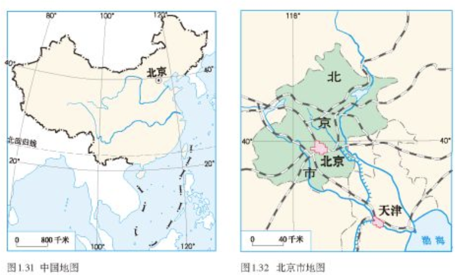
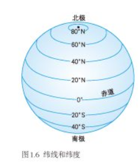

# 从生成地图数据到 Web 加载地图显示的过程

- 三维地图
- 二维地图
- 二三维度如何叠加
- goTo
- center、scale、

## 前言

底图没出来，地图服务。服务器发布。

地图为标准。

地理野外考察、飞机、卫星快速获取


## 头脑风暴

- 地图服务 URL 及数据存储状态保存（混乱，不知道什么时候被更新，没有统一的管理）
  - 配置文件 JSON
  - Vuex
  - LocalStorage
- 访问地图服务地址
  - 是否需要配置代理（跨域访问、token）
- 初始化显示
  - 空间参考坐标系
  - 初始范围和中心点
  - 比例尺、缩放等级、地图中心
  - 对 extend 进行 expand、缓冲区
  - 坐标偏移（是否需要计算端进行计算）
  - 分层分级
  - 分辨率
- 常见操作
  - 地图定位
    - 行政区划定位
    - 项目定位
  - 画图查询
地图配置
- appConfig.json
- mapinit.json
- region.json
- 多端协同
  - 地图服务计算端
  - 业务端
  - 客户端

初始化范围，设置了初始化范围才会显示地图。

地球和地球仪

如何把地球映射到地球上，2 维地图投影，3 维地图

映射投影

对比卫星影像与屏二维地图

## 渲染

数据的来源

## 地图的阅读

通过地图的阅读来反过来排查地图显示的相关信息。


比例尺：表示图上距离比实地距离缩小的程度。纸上比例尺、数字比例尺。

单位：厘米、千米。

纸上一厘米代表实际多少米/千米，再根据屏幕 dpi 96 转换为像素的大小。

### 选择适用的地图

- 中国地图
- 北京市地图
- 北京动物园地图

根据比例尺、缩放等级



||表示范围的大或小|表示内容的详或略|
|--|--|--|
|比例尺较大|中国地图|略|
|比例尺较小|北京地图|详|

## 定位

地图数据除了图片外，要实时渲染的话，就是根据描述图形的坐标数据进行绘制了。


地图表面（通常的地平面），利用经纬度来定位，地图技术在屏幕上显示则是这样使用，在二维地图上则利用 x，y 轴，三维地图上则多了 z 轴来描述。

地球内部则不算入经度和纬度。




通过指向标、经度、纬度判断方向

s

东北三省：黑龙江、辽宁省、吉林省。

查看天地图。

zoom 控制缩放等级，center 在当前的地图下，定位的中心点，经度和纬度。

经度和纬度。

### 行政区划定位

行政区代码，query 查询空间服务，获得 geometry 图形点数据，然后绘制图形，并根据 geometry 的值，算得边界框 xMin，yMin，xMax、yMax，从而获得 Extent 进行定位。

### ArcGIS mapView goTo Method 

## 应用

```js
// 登录的时候调用
/**
 * @description 设置用户的地图定位范围，并存储在localStorage中
 * @param {String} ownRegion 行政区划代码
 */
export const setUserMapExtent = async ownRegion => {
  let mapConfig = store.getters.mapLocateInfo;
  if (
    ownRegion &&
    ownRegion !== "" &&
    ownRegion !== "000000000000" &&
    JSON.stringify(mapConfig) != "{}"
  ) {
    const res = await HttpRequest.get(mapConfig.url + "?f=json");
    if (res.status === 200) {
      let layers = "";
      for (let i = 0; i < res.data.layers.length; i++) {
        let layer = res.data.layers[i];
        if (layer.parentLayerId === -1) {
          layers += layer.id + ",";
        }
      }
      if (layers.length > 0) {
        layers = layers.substring(0, layers.lastIndexOf(","));
        let requestUrl =
          mapConfig.url +
          "/find?searchText=" +
          ownRegion +
          "&searchFields=" +
          mapConfig.field +
          "&layers=" +
          layers +
          "&returnGeometry=true&f=json";
        const request = await HttpRequest.get(requestUrl);
        if (request.status === 200) {
          if (
            request.data.results &&
            request.data.results[0] &&
            request.data.results[0].geometry &&
            request.data.results[0].geometry.rings
          ) {
            let rings = request.data.results[0].geometry.rings;
            if (rings && rings.length > 0) {
              let xTotal = 0;
              let yTotal = 0;
              let pointCount = 0;
              let xmin, xmax, ymin, ymax;
              for (let i = 0; i < rings.length; i++) {
                let ring = rings[i];
                for (let j = 0; j < ring.length; j++) {
                  pointCount++;
                  xTotal += ring[j][0];
                  yTotal += ring[j][1];
                  if (i === 0 && j === 0) {
                    xmin = xmax = ring[j][0];
                    ymin = ymax = ring[j][1];
                  } else {
                    if (ring[j][0] < xmin) xmin = ring[j][0];
                    if (ring[j][0] > xmax) xmax = ring[j][0];
                    if (ring[j][1] < ymin) ymin = ring[j][1];
                    if (ring[j][1] > ymax) ymax = ring[j][1];
                  }
                }
              }
              let x = xTotal / pointCount;
              let y = yTotal / pointCount;
              // 根据用户的行政区划 重设 map的定位信息
              Object.assign(store.getters.extent, {
                x: x,
                y: y,
                zoom: null,
                scale: null,
                extent: {
                  xmin: xmin,
                  xmax: xmax,
                  ymin: ymin,
                  ymax: ymax
                }
              });
            }
          } else {
            console.log("获取图层信息失败");
          }
        } else {
          console.log("获取图层信息失败");
        }
      } else {
        console.log("获取图层信息失败");
      }
    } else {
      console.log("获取图层信息失败");
    }
  } else {
    if (ownRegion === "000000000000") {
      let tempExtent = store.getters.defaultMapConfig.extent;
      tempExtent.extent = null;
      Object.assign(store.getters.extent, tempExtent);
    }
  }
  let storeMapExtent = store.getters.extent;
  localStorage.save(USER_MAPEXTENT, storeMapExtent);
};

```

proxy.js
```js
/**
 * @description 设置子系统地图底图、切换的权限，并存在localStorage中
 * @param {String} name 子系统路由标识
 */
export const basemapProxy = async name => {
  let systemcode = getSystemCodeByRoute(name);
  if (systemcode === null) {
    console.log("module指定错误");
    return;
  }
  if (moduleWithProxy === null) moduleWithProxy = {};
  if (moduleWithBasemap === null) moduleWithBasemap = {};
  if (!moduleWithProxy[name] || !moduleWithBasemap[name]) {
    // 未点过该子系统，进行存储
    let proxyHas = {};
    let basemapHas = [];
    let basemapList = [];
    let resources = await getOtherResources(systemcode);
    debugger;
    if (resources && resources.dataMap && resources.dataMap.length > 0) {
      // 几何服务
      resources.dataMap.forEach(service => {
        if (service.serviceType === "geometry") {
          geometryUrl = service.url;
        }
      });
```

## 参考资料

- 《人教版七年级地理上下册》
- 地图技术开源解决方案
- b 站地图综合知识（初中、高中、大学）
- [ArcGIS坐标系统与投影变换](https://malagis.com/esri-open-class-2017-summary.html)
- [[Esri Events](https://www.youtube.com/c/EsriEvents/search?query=3d) Esri 官方演讲视频]