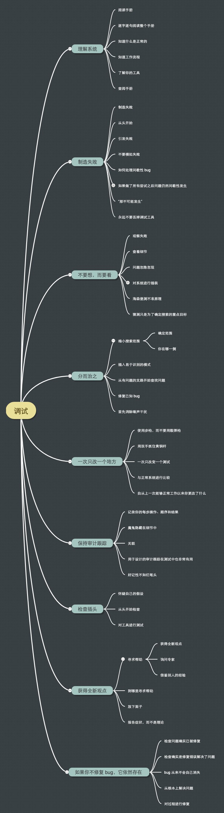

# 万字分享调试九法，助你成为闪修侠

文章风格：火影小剧场。配图风格。

<!-- 调试之道 -->

<!-- 调试九法带你解决 bug  -->

<!-- bug 虐我千百遍，我待它如初恋 -->

<!--副标题： # 如何高效上手调试 -->

头脑风暴
- 什么用调试九法，遇到 bug 时就可以边查阅并操作。

文章大纲
- 为什么要学会调试
- 如何高效调试
  - 调试法则
  - 场景复现
- 调试工具

<!-- 一页纸 ppt，组织 -->

- 空间
- 时间

- 复现
- 一些 github 仓库的 bug 修复。
- 回顾总结工作以来遇到的所有 bug，进行分类、归纳总结。各大仓库、开源项目的 bugfix 记录。
- 案例：除了总结自己在工作中遇到的问题的解决外，还可以参考各大平台比如掘金上的某某 xxxx 解决、解决 xxxx 的思路、xxx 问题，以及查看 github 仓库的 bugfix 记录。故障检修指南也来自 google。

可以把 bug 场景尽可能还原出来。

这个文可以考虑在 **2020-12-31** 前输出。遇到 bug 时可以进行记录调试过程。

阅读时长：30 min
## 前言

如何防止 bug 的产生，需要锻炼好程序架构设计和重构的能力。如何修复 bug 的产生，则需要修炼调试的能力。无论是设计好系统，还是设计中的系统，都需要不断调试，不断实现，不断修复。

参考

> 查找 bug 的根源并修复。

bug 的优先级、重要性


<!-- 阅读时长：30 min -->

### 调试不仅仅是故障检修

调试通常是查明为什么一个设计没有按计划工作，而故障检修指南通常是在已知设计没有问题的情况下，查明一件产品出了什么问题。

## 调试九法带你解决 bug

<!-- 置顶该篇 blgo -->
<!-- 每个规则结合案例，如何应用。 -->

<!-- 使用十步学习法 -->

> 谁 bug 修得快，谁就占据了优势。

系统设计与调试经验是一名优秀工程师所需的条件。

调试规则



记住并应用这些规则，抵挡“走捷径”的诱惑，因为捷径往往是陷阱。

bug 类型

- 设计错误
- 构建错误
- 使用错误

案例：除了总结自己在工作中遇到的问题的解决外，还可以参考各大平台比如掘金上的某某 xxxx 解决、解决 xxxx 的思路、xxx 问题，以及查看 github 仓库的 bugfix 记录。故障检修指南也来自 google

### 理解系统

在理解 xxx 的工作原理之前，我根本无法对问题进行调试。

> 你必须掌握系统的工作原理以及它是如何设计。在某些情况下，还要知道为什么这样设计。如果你没有理解系统中的某个部分，那么这通常就是出问题的地方。

应用：必须理解二维与三维地图展示的原理，否则在切换二三维或联动时就会遇到很多问题。

#### 阅读手册

> 墨菲定律（Murphy's Law），事情如果有变坏的可能，不管这种可能性有多小，它总会发生。

如果你是一位工程师，正在调试自己公司的产品，那么你需要读一读内部手册。工程师们设计它是用来做什么的？读一下功能说明以及所有的设计规范，研究一下图表、时序图和状态机。分析它们的代码，还要读一下注释。

注意，手册上的信息也不全信。手册可能也是错的，很多难以发现的 bug 就出在这里。但你仍需要了解他们的想法，哪怕其中有些信息是很难接受的。

理解了你自己的系统后，还会获得一个额外的好处。当你找到 bug 时，必须在不破坏其他地方的前提下修复它们。理解系统行为时不破坏系统的第一步。

layer.fullExtent 每次都被缩放大两倍。 

```js
if (tempExtent === null) {
  serviceExtent = layer.fullExtent;
  tempExtent = serviceExtent;
}
// if (isExtend) tempExtent = tempExtent.expand(2); // 这里的赋值非常危险，会不断改变了 map 对象的 layer tempExtent 记录，导致多次定位相同图层时出现问题。因为前面的 tempExtent = serviceExtent; 改变了 layer.fullExtent
```

```js
  /**
     * 缩放到专题，通过加载到地图中的图层 fullExntent 进行定位
     * @param {*} layers
     */
    async locateToLayers(layers, isExtend = false) {
      const layerInfos = [];
      layers.forEach(layer => {
        const newLayer = this.map.allLayers.items.find(
          item => item.feLayerId === layer.feLayerId
        );
        if (newLayer) {
          layerInfos.push(newLayer);
        }
      });
      let tempExtent = null;
      for (const layer of layerInfos) {
        let serviceExtent = null;
        serviceExtent = layer.fullExtent; // 这里的 extent 就是一个 Extent 实例，这里 fullExtent 是图层的全部范围

        // 是否做投影处理
        if (
          serviceExtent &&
          serviceExtent.spatialReference.hasOwnProperty("wkid")
        ) {
          let wkid = serviceExtent.spatialReference.wkid;
          if (wkid === this.mapView.spatialReference.wkid) {
            if (tempExtent === null) {
              tempExtent = serviceExtent;
            } else {
              tempExtent = tempExtent.union(serviceExtent);
            }
          } else {
            // 不同参考坐标系，需要进行投影。
            let polygons = await this.projectGeometry([serviceExtent]);
            if (tempExtent === null) {
              tempExtent = polygons[0].extent;
            } else {
              tempExtent = tempExtent.union(polygons[0].extent);
            }
          }
        }
      }

      if (tempExtent) {
        console.log("tempExtent ->", tempExtent);

        // if (isExtend) tempExtent = tempExtent.expand(2); // 这里的赋值非常危险，会不断改变了 map 对象的 layer tempExtent 记录，导致多次定位相同图层时出现问题。因为前面的 tempExtent = serviceExtent; 改变了 layer.fullExtent
        this.mapView.goTo([tempExtent], {
          duration: 500
        });
      }
    },
```

#### 逐字逐句阅读整个手册

问题的线索可能就隐藏在被略过的那些章节中。

编程指南和 API 可能非常厚，但你必须深入挖掘它，查找你认为有问题的函数。图表部分可以忽略，它们会干扰你。（一些框架，官方使用指南等）但数据表要仔细查看，可能表中不起眼儿的一行制定了一个模糊的时序参数，而它就是问题所在。

从供应商的站点获取最新的文档，并阅读网站上所列出的最近一星期发现的常见错误。

参考设计和样本程序给出了产品的一种思考方式，但是，使用这些设计时一定要注意，创建它们的人往往只了解他们的产品，而没有遵循好的设计实践，或者不是为真实应用而设计的（最常见的缺点是不能进行错误恢复）。

不要照搬这些设计，避免以后出现 bug。（比如 Arcgis 上很多的样例程序。）

**案例**

#### 知道什么是正常的

当你检查系统时，必须知道系统的正常工作状态。知道什么是正常的，可以帮助你注意到什么是不正常的。

你必须掌握一些你所工作的技术领域的基础知识。否则你阅读手册后也不能理解其中的说明。（比如之前在一体化的 SSO 单点登录的问题）

缺乏基础知识解释了为什么很多人找不到自己的家用电脑的毛病：他们只是没有理解计算机的基本原理。

如果你无法学习那些需要掌握的知识，可以向有专业知识或经验的人请教。（比如实施监督系统的业务知识）

#### 工作流程

当你尝试寻找 bug 时，必须知道要查找的路线。开始时，你需要猜测在哪里把系统分隔开，以便**隔离问题**，这种猜测完全取决于你对系统功能划分的了解。你至少要大体上知道所有的模块和接口都是做什么的。

你应该知道系统中的所有 API 和通信接口都是用来交换什么数据的。（比如二三维地图组件的数据通信）

当系统有一些部分是“黑盒子”时，这意味着你不知道它内部有什么，但应该知道它们如何与其他部分交互，这至少可以判断问题是在内部还是外部。如果问题发生在黑盒子内部，必要时更换盒子（比如一些第三方框架、不同的地图服务器发布出的服务），但如果问题出在外部，就可以修复它了。

##### 了解你的工具

调试工具是用来观察系统的眼和耳，你必须选择正确的工具，并正确地解释得到的结果。你越是精通工具，就越容易查明系统中发生了什么事情。

##### 查阅手册

不要猜测，而要查阅手册。软件工具的开发人员已经把详细信息写到手册中，而你不应该盲目相信自己的记忆。养成良好的查阅习惯，无论是函数的参数，还是函数名称。

### 制造失败
#### 制造失败

一种简单的方法是进行一次内部预演，还有一种同样有效的方法是演示给未来的投资者（或客户）。

仔细观察你做了什么，然后再做一次，并且记下你做的每个步骤。然后按照你自己所写的步骤，确定这样确实导致了错误。（修复：场景还原底图的优化，就用到这个技巧。 ）

#### 从头开始

由于 bug 可能仅仅在机器的某个复杂状态下才会出现，因此必须仔细注意机器在执行这些步骤的状态。试着从一个已知的状态开始，比如刚刚重启的计算机，地图初始化。

#### 引发失败

在调试故障的时候，如果需要手工执行很多步骤，那么使这个过程自动化会很有帮助。在很多情况下，只有在重复很多次后，错误才会复现，可以借用一些自动、半自动手段进行测试。

如果你的 Web 浏览器有时会打开错误的页面，就应该通过设置浏览器让它自动进行请求页面，以便查找错误。如果网络软件是在高流量下发生错误，应该运行一个网络加载工具来模拟负载，这样就可以引发错误。

#### 不要模拟失败

在类似的系统上再现 bug 是一种较为有用的方法，但有一些限制条件。如果一个 bug 可以在多个系统上再现，那么我们就可以认为它是设计 bug，因为它并不是在一种系统上以某种特定的方式出现。但是，如果无法快速再现它，那么不要为了使它出现而改变你的模拟环境。这样会产生新的配置，而不是原来发生错误的那个配置了。无论一个系统在哪种常规配置下发生故障（即使是间歇性故障），都要在系统上使用该配置来查找问题。

注意，不要用一个看似完全相同（而实际上不同）的环境来代替并希望看到相同的效果。

记住，这并不意味着不能用自动化过程来引发失败（比如 katalon-recorder Chrome 扩展），也不意味着在这个过程中不能采用一些起到放大效果的措施。

#### 如何处理间歇性 bug

关键问题在于你并没有完全弄清楚失败是如何发生的。你知道你做了什么，但是你并不知道完整的、准确的的条件。

#### 如果做了所有尝试之后问题仍然间歇性发生
#### 如果你不修复 bug，它将依然存在

## 你也可以做到

从现在起，看看哪些工程师陷入困境，然后施以援手，帮助他们化解问题。

- 你可以帮同事解决 bug，看看大群上的提问。
- 你可以去 github 给你感兴趣的项目修复 bug。
- 你也可以去 stackoverflow 回答问题。

## 小结

## 参考资料

- 如何高效上手调试