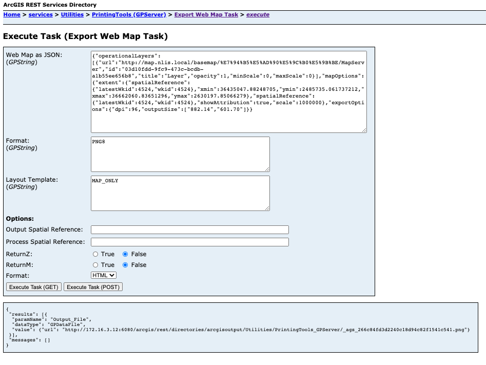

通过 GP 服务请求制图

缺点：
1. 如果某个服务的 exportMap 不起作用，那么就会出现问题。
2. 如果同时请求多个服务的话，就会出现性能上的问题，叠加的图层越多，需要请求的时间越长。

因此有必要前端使用 canvas2html 实现，更加稳定。（至于置灰可以放一放）

http://map.nlis.local/arcgis/rest/services/IMAGE/2019%E5%B9%B4%E5%A4%A9%E5%9C%B0%E5%9B%BE%E5%8D%97%E5%AE%81%E5%B8%82%E7%9F%A2%E9%87%8F%E7%94%B5%E5%AD%90%E5%9C%B0%E5%9B%BE_%E6%94%BF%E5%8A%A1%E7%89%88/MapServer/export?bbox=3.6225038938553676E7,2412163.361250704,3.689337777523135E7,2748184.866627047