# WebGL 从入门到实战总结

## 0. 前言

**主要解决：**

- 地图导出图片问题（现在专题制图，通过 GP 服务，除了地图外，是可以把绘制的东西，也一并导出来的。现在只不过是不能通过客户端导图而已，不算紧急。主要看图层置灰的第二点。）
- 图层置灰问题（可以 review 4.13 源码 swipe 是如何与图层关联操作的。）
- 三维地图与二维地图的渲染区别（坐标系、定位、绘制等）

入门教程

- 开始 WebGL
- 给 WebGL 的上下文环境添加 2D 内容
- 在 WebGL 中使用着色器（shader）去赋予颜色
- 用 WebGL 让对象动起来
- 使用 WebGL 创建 3D 物体
- 在 WebGL 中使用纹理贴图（texture）
- WebGL 中的灯光
- WebGL 中的动画纹理贴图

<!-- 《十步学习法》

- 了解全局
- 确定范围
- 定义目标
- 寻找资源
- 创建学习计划
  - 基本的绘制 3d 图形，导出图形，
  - 创建一个迷型的 3d 库原理学习
- 筛选资源
- 开始学习，浅尝辄止
- 动手操作，边玩边学
- 全面掌握，学以致用
- 乐为人师，融汇贯通 -->

以下使用 WebGL 1.0 版本

## 1. 入门（小白 p6）

- WebGL 是一组图形 API，允许我们使用 JavaScript 控制 GPU 渲染过程，进行 3D 绘图。
- WebGL 应用由 JavaScript 程序和着色器程序构成。
- WebGL 如何将 3D 模型数据显示在 2D 平面上。
- WebGL 编程要素：开发者需要针对 CPU 和 GPU 进行编程，CPU 部分是 JavaScript 程序，GPU 部分是着色器程序。
### 什么是 WebGL

WebGL 是一组基于 JavaScript 语言的图形规范，浏览器厂商按照这组规范进行实现，为 Web 开发者提供一套 `3D 图形`相关的 API。那么，这些 API 能够帮助开发者做些什么呢？

这些 API 能够让 Web 开发者使用 JavaScript 语言直接和显卡（GPU）进行通信。当然 WebGL 的 GPU 部分也有对应的编程语言，简称 `GLSL`。我们用它来编写运行在 GPU 上的着色器程序。着色器程序需要接收 CPU（WebGL 使用 JavaScript）传递过来的数据，然后对这些数据进行流水线处理，最终显示在屏幕上，进而显示丰富多彩的 3D 应用，比如 3D 图表，网页游戏，3D 地图，WebVR 等。


### WegGL 的工作原理

3D 模型数据从诞生到最终显示在屏幕上，这期间经历了什么样的过程呢？大家可以想象一下 `流水线`的生产过程，流水线按照既定的步骤对原料进行加工，当前步骤只对前一步骤进行处理，然后将处理后的结果传递给下一步骤，最终将原材料生产成完整的产品。WebGL 的工作方式和流水线类似，也是按照流水线的方式将 3D 模型数据渲染到 2D 屏幕上的，业界把这种渲染方式称为`图形管线` 或者 `渲染管线`。

我们知道，WegGL 只能够绘制 `点`、`线段`、`三角形`这三种图元，但是我们经常看到 WebGL 程序中含有立方体、球体、圆柱体等规则形体，甚至很多更复杂更逼真的不规则模型，那么 WebGL 是如何绘制它们的呢？其实这些模型本质上是由一个一个的`点` 组成，`GPU` 将这些点用 `三角形图元` 绘制成一个个的微小平面，这些平面之间互相连接，从而组成各种各样的立体模型。

因此，我们的首要任务是创建组成这些模型的顶点数据。

一般情况下，最初的顶点坐标是相对于 `模型中心`的，不能直接传递到着色器中，我们需要对 `顶点坐标` 按照一系列步骤执行 `模型变换`，`视图变换`，`投影转换`，转换之后的坐标才是 WebGL 可接受的坐标，即`裁剪空间坐标`。我们把最终的 `变换矩阵` 和 `原始顶点坐标` 传递给 `GPU`，GPU 的渲染管线丢它们执行流水线作业。

GPU 渲染管线的主要处理过程如下：
- 首先进入**顶点着色器阶段**，利用 GPU 的并行计算优势对顶点逐个进行坐标变换。
- 然后进入**图元装配阶段**，将顶点按照图元类型组装成图形。
- 接下来是**光栅化阶段**，光栅化阶段将图形用不包含颜色信息的像素填充。
- 在之后进行**片元着色器**，该阶段为像素着色，并最终显示在屏幕上。

### 什么是 GLSL

`GLSL` 的中文意思是 OpenGL 着色语言，英文全称是 OpenGL Shading Language，它是用来在 OpenGL 编写`着色器程序`的语言。

- 着色器程序
  - 我们知道了 GLSL 是用来编写着色器程序的语言，那么新的问题来了，着色器程序是用来做什么的呢？简单来说，着色器程序是在显卡（GPU）`固定渲染管线`的一部分，使 GPU 渲染过程中的某些部分允许开发者通过 `编程`进行控制。

用一句话来说：着色器程序允许我们通过编程来控制 GPU 的渲染。

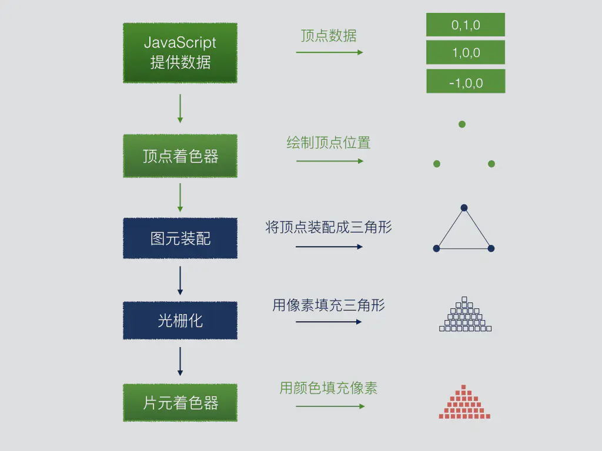

上图简单演示了 WebGL 对一个红色三角形的渲染过程，绿色部分为开发者可以通过编程的部分：
- JavaScript 程序
  - 处理着色器需要的 `顶点坐标`、`法向量` `颜色` `纹理`等信息，并负责为 `着色器` 提供这些数据，上图为了演示方便，只是提供了三角形顶点的位置数据。
- 顶点着色器
  - 接收 JavaScript 传递过来的 `顶点信息`，将顶点绘制到对应坐标。
- 图元装配器
  - 将三个顶点装配成指定`图元类型`，上图采用的是三角形图元。
- 光栅化阶段
  - 将三角形内部区域用空像素进行着色。
- 片元着色器
  - 为三角形内部的像素填充颜色信息，上图为暗红色。


实际上，对顶点信息的变换操作既可以在 `JavaScript` 中进行，也可以在`着色器程序` 中进行。通常我们都是在 `JavaScript` 中生成一个包含了所有变换的最终矩阵变换，然后将矩阵传递给着色器，利用 GPU 并行计算优势对所有顶点执行变换。

<!-- WebGL 程序的工作流程可以总结如下：

1. 使用 JavaScript 代码初始化 WebGL 程序，并使用它在 HTML5 Canvas 的 WebGL 上下文上绘制 2D 或 3D 场景。

2. 首先使用第一个被称为顶点着色器（vertex shader）的 GLSL 脚本对场景中的所有顶点进行绘制。它计算场景的抽象数学模型，并将其交给第二个 GLSL 脚本。

3. 第二个 GLSL 脚本称为片段着色器（fragment shader），它针对画布中的每个可见片段（像素）进行着色。它通过称为栅格化的过程来计算每个片段的颜色。

4. 这些片段（fragments） 构成了在颜色缓冲区的位图图像，该图像最终显示在画布上。

 

#### 基本语法

着色器源代码可以放在 JavaScript 字符串中，也可以从单独的文件中加载。

以下是其语法的主要功能：

- **int** 整数: 0, 1, 2, -10,...。
- **float** 浮点数： 0.0, 0.1, 1.0, -10.5,...。
- **bool** 布尔值：取值为 true 或者 false。
- **vec4** 是 4 个浮点组成的数组，代表顶点坐标或 3D 向量（x, y, z, w） 或颜色 (r, g, b, alpha)。同理也存在 vec2(x, y) 和 vec3(x, y, z/r, g, b) 类型。
- **mat4** 是 4 x 4 浮点数的矩阵（网格），可用于转换 3D 中的顶点坐标和向量。 也存在类型 mat2（2x2）和 mat3（3x3）
- **sampler2D** 是对纹理图像的参考； **samplerCube**是对“ 3D 纹理”（映射到多维数据集的 6 个纹理的集合）的引用。
- A **variable** is declared with its type, for example: int i = -1, float f = 2.0 or vec4 v = vec4(1.0, 2.0, 3.0, 4.0).
- A **constant** is a variable with a fixed value: const int c = 100;.
- 可以提取向量的 xyzw/rgba 分量，并在另一个向量中重新组合（重组），例如：float f = v.x，vec3 rgb = v.rgb，vec4 w = v.zxxy。
- 每个指令必须以 `;` 结尾。
- **Math functions**: cos, sin, tan, pow, exp, log, log2, sqrt, abs, sign, floor, ceil, round, trunc, fract, mod, min, max, clamp, mix, step, length, distance, dot, cross, reflect, normalize...
- **Math operators** (=, +, -, _, /, &&, ||, ==, !=, >, >=, <, <=, ++, --, ^^, +=, -=, _=, /=) only work between variables of the same type or same length (ex: int + int, float / float, mat4 \_ vec4 ...).
- **Type casting** （类型转换） allows to convert a type into another, when it's possible. Ex: `bool b = true; int i = int(b); /_ i = 1 _/ float f = float(i); /_ f = 1.0 \*/`.
- **Tests and loops**（测试和循环） are also available (if, else, switch, for, while), but loops must have a constant limit. (you can't do `for(int i = 0; i < j; i++){...} if j is variable)`.
- 每个着色器（shader）（程序执行开始的地方）的入口点是一个 `void main(){...}` 函数。
- 自定义函数也可以由 main（）或彼此创建和调用，但是不允许递归。
- - 可以在每个着色器中使用指令设置 int、float 和 Samplers2Ds 的精度（lowp/mediump/highp），例如 precision highp int；
- 这些指令必须位于着色器代码的开头，但是片段缓冲区中仅浮点精度是强制性的，默认情况下所有其他值均具有值。
- 顶点着色器必须设置一个包含当前顶点坐标的全局变量 `gl_Position`（在渲染单个点时还必须设置 `gl_PointSize`）。
- 片段着色器（fragment shader）必须设置一个包含当前片段颜色的全局变量 `gl_FragColor`。
  它可以访问 3 个全局变量：`gl_FragCoord`（窗口坐标），`gl_PointCoord`（点内坐标）和 `gl_FrontFacing`（当前三角形方向）。

### JavaScript 和 WebGL 通信

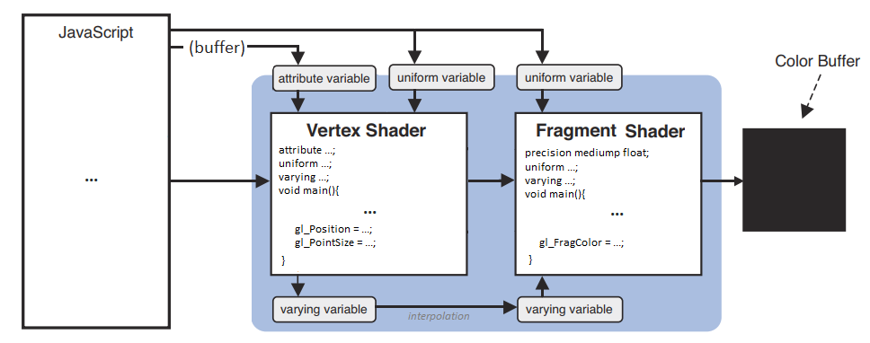

主要有四种机制，用来在不同脚本（scripts）之间发送数据：

- **Attributes** 是 JavaScript 传递给顶点着色器（vertex shader）的全局变量。它们的值可以针对每个顶点而变化（例如：顶点坐标）。
- **Uniforms** 是 JavaScript 传递给顶点着色器（vertex shader）和片段着色器（fragment shader）（例如，一种颜色）的全局变量。它们的值在整个帧中保持不变。
- **Varyings** 不能被 JavaScript 访问。 它们只能被 vertex shader 写入和 被 fragment shader 读取。
- **Data buffers** are big arrays of numbers passed by JS to the vertex shader in chunks of 1 to 4 values.
  For example, if a long list of vertex coordinates (X,Y,Z, X,Y,Z, ...) is sent to the vertex buffer 3 by 3, the shader will receive each chunk in the form of an attribute vec3.

Each attribute, uniform and varying must be declared before main() in the shaders that uses them.

### 刚刚够的数学知识

> 线性代数：关键是理解几何直观和数值计算的关系
#### 几何基础

- 2D 点具有两个空间坐标系（水平 X，垂直 Y）
- 3D 点具有深度的第三个 Z 坐标
- 原点是所有坐标均等于 0 的点

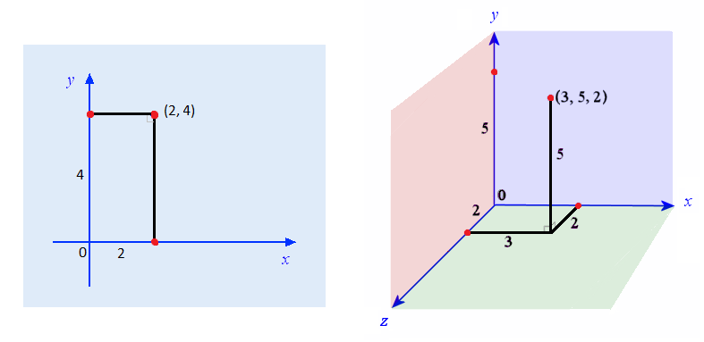

#### 三角学基础

- 角度范围 0 到 360 度，等效于：0 到 2 \* PI 弧度（PI 弧度是半圆）。
- 通过将角度乘以 π/ 180，可以将度数转换为弧度。
- 弧度角可以通过将其乘以 180 /π 来转换为度。
- 三角圆是半径为 1 的圆，以 2D 平面的原点为中心。 该圆的每个点都对应一个逆时针测量的角度。
- 最右边的点代表角度 0（或`2 * Pi rad），最上面的点代表Pi / 2 rad，最左边的点代表`Pi rad`，最下面的点代表 3 \* Pi / 2 rad。
- 大于 2 _ Pi 或小于 0 的角度类似于相同的角度模 2 _ Pi（例如：5 _ Pi rad = Pi rad; -Pi / 2 rad = 3 _ Pi / 2 rad）。
- 角度“α”的余弦是三角圆上相应点的 X 坐标，并且在-1 和 1 之间振荡。
- 正弦是同一点的 Y 坐标，也在-1 和 1 之间振荡。
- 切线是在此点和 X 轴垂直于半径的线段的长度。 它的值介于-∞ 和+∞ 之间，等于 sin（α）/ cos（α）。


#### 向量

物理专业学习的视角
<!-- 

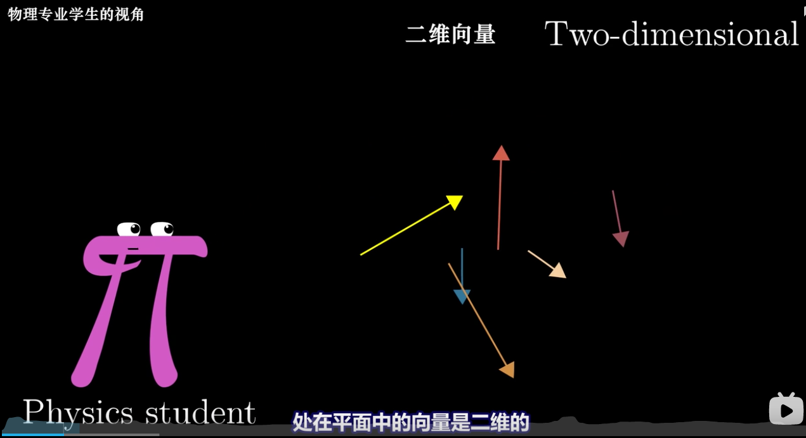

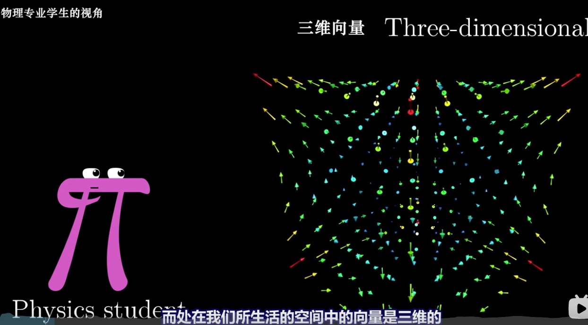

 -->

- 向量是数字数组，它可以表示空间中的点（顶点），也可以表示方向（偏移）。
- 当它代表一个点时，它是一个坐标列表。
  - 例如，[2, 4] 可以表示 2D 点的 X 和 Y 坐标，[3, 5, 2] 可以表示 3D 的 X，Y 和 Z 坐标。
- 当是方向时（从空间中的位置到另一个位置），它表示在每个坐标中如何应用偏移量。你可以想象它像箭一样。
  - 例如，[1, 2, 3] 表示 X 偏移为 1 个单位，Y 偏移 2 个单位，Z 偏移 3 个单位。
- 与顶点相反，方向向量没有位置。它们仅代表一个偏移量，并且该偏移量可以从任何位置开始。
  - 你可以像这样构建向量 AB（从 A 点到 B 点）：AB = [xB - xA, yB - yA, zB - zA]。

<!-- 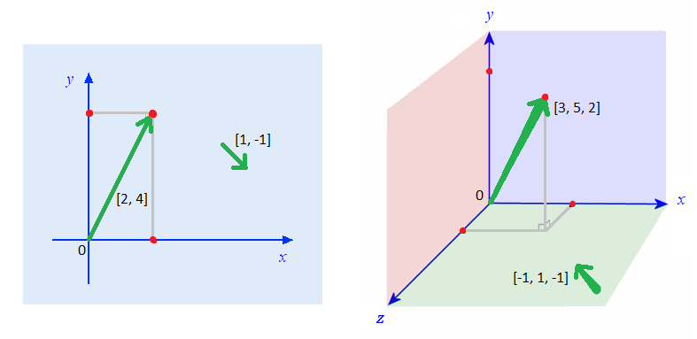

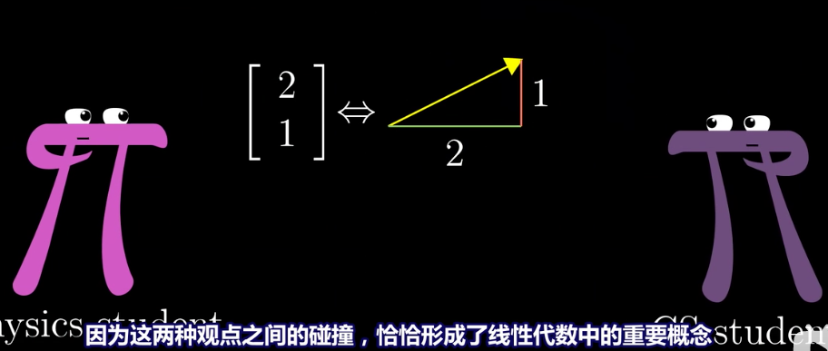


 -->

#### 操作向量

> 相加、相乘

- 将两个向量相加，就是将它们的项一一相加：`V + W = [xV + xW，yV + yW，zV + zW]。`
  <!-- - 
  - 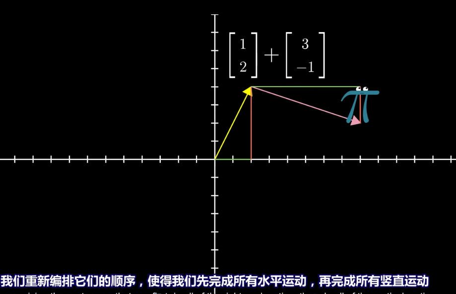
  - 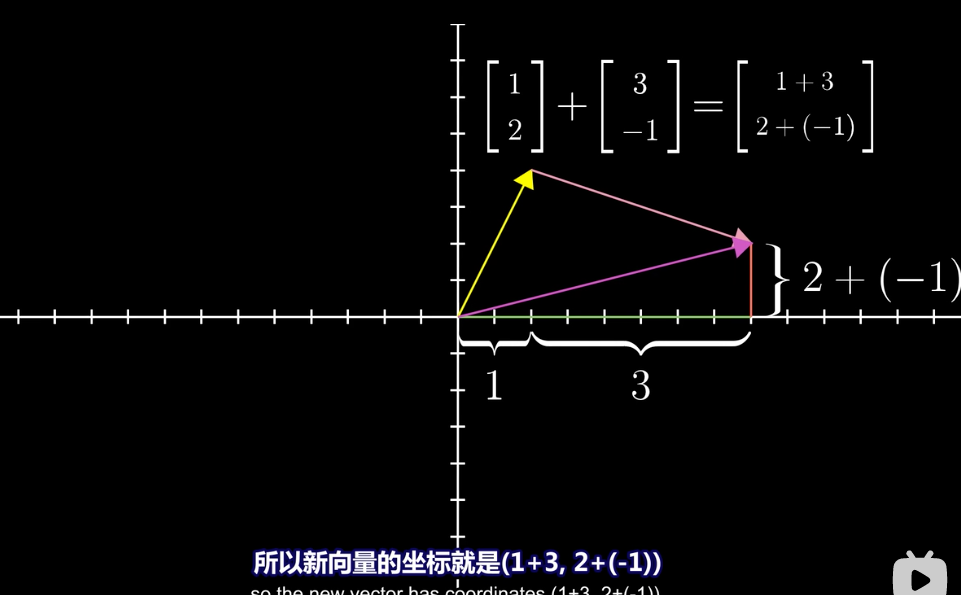 -->
- 缩放向量包括将所有项乘以给定的量：`V * n = [xV * n, yV * n, zV * n]。`
  <!-- - 
  -  -->
- 测量向量的长度（或大小）类似于使用毕达哥拉斯测量两点之间的距离：`|| V || = sqrt（xV²+yV²+zV²）`
- 对向量进行归一化包括将其长度调整为 1 个单位，而不改变其方向。等效于按 `1 / || V ||` 进行缩放。
- 可以使用**点积**计算两个归一化向量 V 和 W 之间的相对角度（方向差）：`V.W = xV * xW + yV * yW + zV * zW。`
  - 点积等于向量之间角度的余弦值。 例如，如果它们相等，则为 1；如果垂直，则为 0；如果相反，则为-1。


- 两个向量 V 和 W 的叉积是一个垂直于两个向量的向量。 可以这样计算：`V×W = [yV * zW-zV * yW，zV * xW-xV * zW，xV * yW-yV * xW]`。


- 三角形 ABC 的法线是垂直于其表面的向量，更准确地说，垂直于三角形内部的任何向量。
  - 如果点 A，B 和 C 逆时针排列，则可以将其计算为向量 AB 和 BC 的叉积。 （如果为顺时针方向，法线将指向相反的方向）。
  - 顾名思义，三角形的法线必须归一化，因为它经常涉及点积。


> 归一化（normalize）：１）把数据变成(０，１)或者（1,1）之间的小数。主要是为了数据处理方便提出来的，把数据映射到 0 ～ 1 范围之内处理，更加便捷快速。２）把有量纲表达式变成无量纲表达式，便于不同单位或量级的指标能够进行比较和加权。归一化是一种简化计算的方式，即将有量纲的表达式，经过变换，化为无量纲的表达式，成为纯量。
> 作者：brucep3
> 链接：https://www.jianshu.com/p/95a8f035c86c
> 来源：简书
> 著作权归作者所有。商业转载请联系作者获得授权，非商业转载请注明出处。

#### 矩阵

> 在 3D 图形引擎中，计算可以在多个不同的笛卡儿坐标空间中执行，从一个坐标空间到另一个坐标空间需要使用变换矩阵。

矩阵是数字的网格（n 行 m 列数字组成的数组）。 它表示一个线性方程组，可以通过乘法应用于任何向量。将矩阵与向量相乘在于计算向量与矩阵的每一行的点积。


例如，在 3D 中，下面的“身份”矩阵将向量转换成自身（这是中立的操作。


如果在对角线上使用不同于 1 的值，则向量将被缩放：


如果在其他字段中使用适当的值，则可以执行旋转：

- 沿 X 轴（弧度的角度 φ）


- 沿 Y 轴（弧度角 θ）：


- 沿 Z 轴（弧度 ψ）：

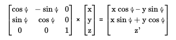

弧度：2𝜋


角度：θ

#### 矩阵的运算

- 可以通过反转矩阵的水平和垂直轴（对角线保持不变）来转置矩阵
  - 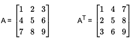
  - 可以将两个或两个以上大小相等的矩阵相乘，以合并（累加）它们的变换。
  - 结果是一个矩阵，其中包含第一矩阵的每一行与第二矩阵的每一列的点积。
  - 组合顺序很重要，从右到左。 例如，执行平移 T，然后旋转 R，然后比例 S 的矩阵等于 S * R *T。

最后，矩阵可以求逆，它带有一个复杂的方程式，它取消了原始矩阵所做的转换。

`A * A-1 = identity`

`A * A-1 * V = V`

齐次坐标

- 在屏幕上渲染顶点时，只有 x、y 和 z 坐标重要，先前用于计算平移和投影的 W 坐标会被丢弃。

### 2D 图形

- 图元：WebGL 能够绘制的基本图形元素，包含三种：`点`、`线段`、`三角形`。
- 片元：可以理解为像素，像素着色阶段是在片元着色器中。
- 裁剪坐标系：裁剪坐标系是顶点着色器的 `gl_Position` 内置变量接收到坐标所在的坐标系。
- 设备坐标系：又名 NDC 坐标系，是裁剪坐标系各个分量对 w 分量相除得到的坐标系，特点是 x、y、z 坐标分量的取值范围都在【-1， 1】 之间，可以将它理解为边长为 2 的正方体，坐标系原点在正方体中心。
#### Hello, point

这里有个最简单的 WebGL 程序，在画布中间绘制一个红色的正方形。

```html
<!DOCTYPE html>
<html lang="en">
  <head>
    <meta charset="UTF-8" />
    <meta name="viewport" content="width=device-width, initial-scale=1.0" />
    <title>Hello，point</title>
  </head>
  <body>
    <canvas id="canvas" width="400" height="400"></canvas>
    <script>
      // Get the WebGL rendering context
      const canvas = document.querySelector("canvas");
      const gl = canvas.getContext("webgl");

      // Vertex shader
      const vshader = `
      void main() {
        // Set vertex position: vec4(x, y, z, 1.0)
        gl_Position = vec4(0.0, 0.0, 0.0, 1.0);

        // Point size in pixels: float
        gl_PointSize = 10.0;
      }`;

      // Fragment shader
      const fshader = `
      precision mediump float;
      void main() {
        // Set fragment color: vec4(r, g, b, alpha)
        gl_FragColor = vec4(1.0, 0.0, 0.0, 1.0);
      }`;

      // Compile the vertex shader
      const vs = gl.createShader(gl.VERTEX_SHADER);
      gl.shaderSource(vs, vshader);
      gl.compileShader(vs);

      // Compile the fragment shader
      const fs = gl.createShader(gl.FRAGMENT_SHADER);
      gl.shaderSource(fs, fshader);
      gl.compileShader(fs);

      // Create the WebGL program and use it
      const program = gl.createProgram();
      gl.attachShader(program, vs);
      gl.attachShader(program, fs);
      gl.linkProgram(program);
      gl.useProgram(program);

      // Log compilation errors, if any
      console.log("vertex shader:", gl.getShaderInfoLog(vs) || "OK");
      console.log("fragment shader:", gl.getShaderInfoLog(fs) || "OK");
      console.log("program:", gl.getProgramInfoLog(program) || "OK");

      // Set the clear color (black)
      gl.clearColor(0.0, 0.0, 0.0, 1.0); //  set the default background color

      // Clear the canvas
      gl.clear(gl.COLOR_BUFFER_BIT);

      // Draw points
      gl.drawArrays(gl.POINTS, 0, 1); // mode, starting pint, number of points to draw
    </script>
  </body>
</html>
```

##### 技巧&提示

- 在某些设备上，最大支持的点大小是 62 px 值，更多信息可以看 [webglstats](http://webglstats.com/webgl/parameter/ALIASED_POINT_SIZE_RANGE)
- 在某些设备上，如果点的中心在画布之外，则这些点可能会完全消失（有关 [webglfundamentals](<(https://webglfundamentals.org/webgl/lessons/webgl-drawing-without-data.html#pointsissues)>) 的更多信息）。
- 如果你不喜欢把你的 着色器代码放在 JS 字符串中，你也可以用：
  - script 块（`<script type="x-shader/x-vertex" id="vshader">...</script> / <script type="x-shader/x-fragment" id="fshader">...</script>`）
    (然后使用 `document.getElementById('vshader').innerText / document.getElementById('fshader').innerText)` 进行获取)。
  - 外部文件，比如 fs 外部文件，例如 fshader.glsl 和 vshader.glsl)
    （并使用 XHR，提取或您选择的任何方法将其检索为文本)
- 程序的创建（第 26 至 46 行）总是相同且非常冗长，因此我们可以将其放在 compile（）函数中，并在下一章中重用它（请参见 webgl.js）：

```js
// Compile a WebGL program from a vertex shader and a fragment shader
compile = (gl, vshader, fshader) => {
  // Compile the vertex shader
  const vs = gl.createShader(gl.VERTEX_SHADER);
  gl.shaderSource(vs, vshader);
  gl.compileShader(vs);

  // Compile the fragment shader
  const fs = gl.createShader(gl.FRAGMENT_SHADER);
  gl.shaderSource(fs, fshader);
  gl.compileShader(fs);

  // Create the WebGL program and use it
  const program = gl.createProgram();
  gl.attachShader(program, vs);
  gl.attachShader(program, fs);
  gl.linkProgram(program);
  gl.useProgram(program);

  // Log compilation errors, if any
  console.log("vertex shader:", gl.getShaderInfoLog(vs) || "OK");
  console.log("fragment shader:", gl.getShaderInfoLog(fs) || "OK");
  console.log("program:", gl.getProgramInfoLog(program) || "OK");

  return program;
};
```

#### 自定义值：属性（attributes） 和 uniforms

当然，如果 WebGL 仅仅是画一个点，就不会很有趣。

为了使它更灵活，我们可以为其提供自定义值。这可以通过 attributes（顶点缓冲区） 和 uniforms（两种缓冲区都可以读取）来完成。

- atrribute 属性是变量，可以包含浮点数或向量（vec2，vec3，vec4）。你的程序在所有设备上都不能超过 16 个属性。
- uniform 是常量，可以包含 int、float，向量或矩阵（mat2，mat3，mat4）。你的程序不应超过 128 个顶点 uniform 和 64 个片段 uniform。

```html
<!DOCTYPE html>
<html lang="en">
  <head>
    <meta charset="UTF-8" />
    <meta name="viewport" content="width=device-width, initial-scale=1.0" />
    <title>Custom values: attributes and uniform</title>
  </head>
  <body>
    <canvas id="canvas" width="400" height="400"></canvas>
    <script src="../lib/webgl.js"></script>

    <script>
      // Get the WebGL rendering context
      const canvas = document.querySelector("canvas");
      const gl = canvas.getContext("webgl");

      function compile(gl, vshader, fshader) {
        // Compile the vertex shader
        const vs = gl.createShader(gl.VERTEX_SHADER);
        gl.shaderSource(vs, vshader);
        gl.compileShader(vs);

        // Compile the fragment shader
        const fs = gl.createShader(gl.FRAGMENT_SHADER);
        gl.shaderSource(fs, fshader);
        gl.compileShader(fs);

        // Create the WebGL program and use it
        const program = gl.createProgram();
        gl.attachShader(program, vs);
        gl.attachShader(program, fs);
        gl.linkProgram(program);
        gl.useProgram(program);

        // Log compilation errors, if any
        console.log("vertex shader:", gl.getShaderInfoLog(vs) || "OK");
        console.log("fragment shader:", gl.getShaderInfoLog(fs) || "OK");
        console.log("program:", gl.getProgramInfoLog(program) || "OK");
        return program;
      }

      // Vertex shader
      const vshader = `
      attribute vec4 position;
      attribute float size;
      void main() {
        gl_Position = position;
        gl_PointSize = size;
      }`;

      // Fragment shader
      const fshader = `
      precision mediump float;
      uniform vec4 color;
      void main() {
        gl_FragColor = color;
      }`;

      // Compile program
      const program = compile(gl, vshader, fshader);

      // Select the position attribute and set its X/Y/Z values
      const position = gl.getAttribLocation(program, "position");
      gl.vertexAttrib4f(position, 0, 0, 0, 1);

      // Select the size attribute and set its value
      const size = gl.getAttribLocation(program, "size");
      gl.vertexAttrib1f(size, 10);

      // Select the color uniform and set its value
      const color = gl.getUniformLocation(program, "color");
      gl.uniform4f(color, 1, 0, 0, 1);

      // Set the clear color (black)
      gl.clearColor(0.0, 0.0, 0.0, 1.0);

      // Clear the canvas
      gl.clear(gl.COLOR_BUFFER_BIT);

      // Draw points
      gl.drawArrays(gl.POINTS, 0, 1); // mode, starting pint, number of points to draw
    </script>
  </body>
</html>
```

##### What happens here?

- Position is declared with `attribute vec4 position;`, targeted with `position = gl.getAttribLocation(program, 'position')` and set with `gl.vertexAttrib4f(position, 0, 0, 0, 1)`.
- Point size is declared with `attribute float size;`, targeted with `size = gl.getAttribLocation(program, 'size')` and set with `gl.vertexAttrib1f(size, 10)`.
- Point color is declared with `uniform float color;,` targeted with `color = gl.getUniformLocation(program, 'color')`and set with `gl.uniform1f(color, 1, 0, 0, 1)`.

##### 绑定 attribute 和 uniform

| Type  | GLSL declaration   | How to set its value in JS                                                                                                                                        |
| ----- | ------------------ | ----------------------------------------------------------------------------------------------------------------------------------------------------------------- |
| vec4  | attribute vec4 v;  | var f = gl.getAttribLocation(program, 'f'); <br>`gl.vertexAttrib4f(f, 1.0, 2.0, 3.0, 4.0); // list`<br>`gl.vertexAttrib4fv(f, [1.0, 2.0, 3.0, 4.0]); // or array` |
| float | attribute float f; | `var f = gl.getAttribLocation(program, 'f');` <br>`gl.vertexAttrib1f(f, 1.0);`                                                                                    |

uniforms 可以这样设置：

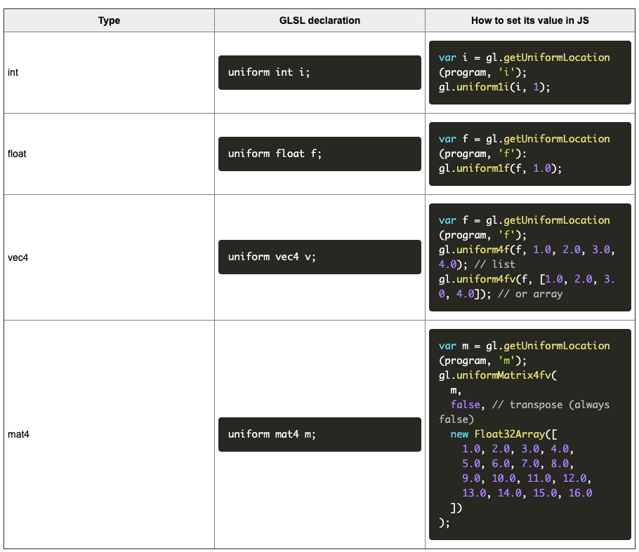

<!-- TODO 加载表格插件的处理，可以方便的进行编辑，看看是否考虑使用 typo，但是 typo 没有 git 不好。 -->

##### 技巧与提示

- vec4 属性的第四个值默认情况下为 1.0，因此经常遇到一些仅用 `gl.vertexAttrib3f(position, 0, 0, 0);`
- Boolean Uniform 在语言规范中也存在，但不适用于所有设备。如果需要一个，请考虑将其体会为 int 或 float。
- Matrix 属性在该语言的规范中也存在，但是 JavaScript 没有方便的方法来设置其值，而且它们也并不是很有用。
  你可以通过设置新的属性 attribute 或 uniform 并再次调用 drawArrays 来绘制任意数量的点。
  例如，您可以添加以下行以添加其他两个点：
  ```js
  gl.vertexAttrib3f(position, 0.25, 0, 0);
  gl.uniform4f(color, 0, 1, 0, 1); // green
  gl.drawArrays(gl.POINTS, 0, 1);

  gl.vertexAttrib3f(position, 0.5, 0, 0);
  gl.uniform4f(color, 0, 0, 1, 1); // blue
  gl.drawArrays(gl.POINTS, 0, 1);
  ```
- 在片段着色器（fragment shader）内部，你可以访问 `gl_PointCoord vec2`，以告诉你片段在点中的放置位置。
  此外，在 GLSL 中，你可以使用 `discard` 语句来避免渲染，并使用 `distance()` 测量两点之间的距离。
  结果，你可以舍弃距离中心半径为 0.5 的每个片段，从而获得一个圆点。
  ```js
  float d = distance(gl_PointCoord, vec2(0.5, 0.5));
  if (d < .5) {gl_FragColor = vec4(1.0, 0.0, 0.0, 0.0, 1.0)}
  else { discard;}
  ```

#### 绘制多个点，一个连续性的问题

默认情况下，WebGL 在连续多次调用 `gl.drawArrays` 是没有问题的，但只能在相同的时间帧内不断调用。（待考察这个翻译）

这里有个例子在每 500 ms 绘制一个新的点。

```html
<!DOCTYPE html>
<html lang="en">
  <head>
    <meta charset="UTF-8" />
    <meta name="viewport" content="width=device-width, initial-scale=1.0" />
    <title>Draw many points， a matter of continuity</title>
  </head>
  <body>
    <canvas id="canvas" width="400" height="400"></canvas>
    <script src="../lib/webgl.js"></script>

    <script>
      // Get the WebGL rendering context
      const canvas = document.querySelector("canvas");
      // const gl = canvas.getContext("webgl");
      const gl = canvas.getContext("webgl", { preserveDrawingBuffer: true }); // 强制保留旧的绘制内容

      // Vertex shader
      const vshader = `
      attribute vec4 position;
      attribute float size;
      void main() {
        gl_Position = position;
        gl_PointSize = size;
      }`;

      // Fragment shader
      const fshader = `
      precision mediump float;
      uniform vec4 color;
      void main() {
        gl_FragColor = color;
      }`;

      // Compile program
      const program = compile(gl, vshader, fshader);

      // Select the position attribute and set its X/Y/Z values
      const position = gl.getAttribLocation(program, "position");
      // Select the size attribute and set its value
      const size = gl.getAttribLocation(program, "size");
      // Select the color uniform and set its value
      const color = gl.getUniformLocation(program, "color");

      // Set the clear color (black)
      gl.clearColor(0.0, 0.0, 0.0, 1.0);

      // Clear the canvas
      gl.clear(gl.COLOR_BUFFER_BIT);

      // Add a new random point every 500ms
      setInterval(() => {
        const x = Math.random() * 2 - 1;
        const y = Math.random() * 2 - 1;

        const r = Math.random();
        const g = Math.random();
        const b = Math.random();

        gl.vertexAttrib3f(position, x, y, 0);
        gl.vertexAttrib1f(size, 10);
        gl.uniform4f(color, r, g, b, 1);
        // Draw points
        gl.drawArrays(gl.POINTS, 0, 1); // mode, starting pint, number of points to draw
      }, 500);
    </script>
  </body>
</html>

```
##### What happens here?

As you can see, the canvas is not cleared (in black), but completely reset each time drawArrays() is called. This is the standard behavior when the draws happen at different moments.
To solve this, there are two solutions:

1. Save the positions and colors of every new point in a JS array or object.
Then every 500ms, clear the canvas (to make the background black) and redraw all the saved points;
2. Force `{ preserveDrawingBuffer: true }` when creating the WebGL context, as you can see by removing the commented code on line 4.
In this case, you won't have to clear the canvas if you want the old points to stay visible and immobile.
In both cases, the result will look like this:

Both solutions are okay in this example, but in real conditions (animated WebGL scenes with moving objects), you don't want the previous frames to stay visible.
So the only solution will be to clear the canvas and redraw everything at each new frame.

##### 总结


#### 绘制线和三角形

下一步包括一次声明多个点，并告诉 WebGL 如何显示它们：点、线或三角形。

为此，我们将使用数据缓冲区（data buffer）（二进制数的数组）通过属性将 JS 的顶点属性发送到片段着色器。支持以下类型：

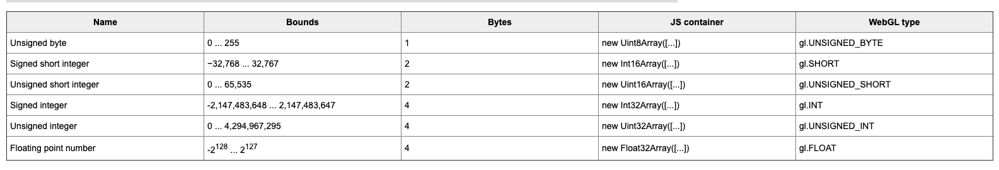

然后， 通过更改 **gl.drawArrays** 的第一个参数，可以通过 7 种不同的方式将这些顶点渲染为点、线和三角形。


这是绘制彩色三角形的最简单方法：

```html
<!DOCTYPE html>
<html lang="en">
  <head>
    <meta charset="UTF-8" />
    <meta name="viewport" content="width=device-width, initial-scale=1.0" />
    <title>Drawing lines and triangles</title>
  </head>
  <body>
    <canvas id="canvas" width="400" height="400"></canvas>
    <script src="../../lib/webgl.js"></script>

    <script>
      // Get the WebGL rendering context
      const canvas = document.querySelector("canvas");
      const gl = canvas.getContext("webgl");

      // Vertex shader
      const vshader = `
      attribute vec4 position;
      void main() {
        gl_Position = position;
      }`;

      // Fragment shader
      const fshader = `
      precision mediump float;
      uniform vec4 color;
      void main() {
        gl_FragColor = color;
      }`;

      // Compile program
      const program = compile(gl, vshader, fshader);

      // Select the position attribute and set its X/Y/Z values
      const position = gl.getAttribLocation(program, "position");
      // Select the color uniform and set its value
      const color = gl.getUniformLocation(program, "color");

      // Set color
      gl.uniform4f(color, 1, 0, 0, 1);

      // Fill a buffer with a list of x/y/z coordinates,
      // and pass them to the position attribute of the vertex shader
      const vertices = new Float32Array([
        0, // point 1
        0.5,
        0,
        -0.5, // point 2
        -0.5,
        0,
        0.5, // point 3
        -0.5,
        0,
      ]);
      const buffer = gl.createBuffer();
      gl.bindBuffer(gl.ARRAY_BUFFER, buffer);
      gl.bufferData(gl.ARRAY_BUFFER, vertices, gl.STATIC_DRAW);
      gl.vertexAttribPointer(position, 3, gl.FLOAT, false, 0, 0);
      // target chunk size type normalize stride offset
      gl.enableVertexAttribArray(0.0, 0.0, 0.0, 1.0);

      // Set the clear color (black)
      gl.clearColor(0.0, 0.0, 0.0, 1.0);

      // Clear the canvas
      gl.clear(gl.COLOR_BUFFER_BIT);

      // Render
      gl.drawArrays(gl.TRIANGLES, 0, 3);
    </script>
  </body>
</html>

```

##### What happens here?

- 数据缓冲区由 3 点坐标填充，并通过 **createBuffer, bindBuffer, bufferData, vertexAttribPointer & enableVertexAttribArray** 绑定到 **position** 属性上。
- 最后，我们让 `gl.drawArrays` 将这些点渲染为三角形。结果，三角形内的每个片段将自动重用“颜色” uniform 变量（红色）。
- 如果将 `gl.TRIANGLES` 替换为 `gl.LINE_LOOP` ，将仅渲染点0-1、1-2和2-0之间的线，线宽为1px（1个片段）。
  您也可以尝试 `gl.LINE_STRIP` 跟踪点 0-1 和 1-2 之间的线，并尝试 `gl.LINES` 画点 0 和 1 之间的线，因为它仅适用于连续的点对。
  不幸的是，大多数设备无法更改线宽，因此我们必须坚持使用1px的线或使用三角形的“作弊法”。更多信息可以看 [MDN](https://developer.mozilla.org/en-US/docs/Web/API/WebGLRenderingContext/lineWidth) 和 [mattdesl's website](https://mattdesl.svbtle.com/drawing-lines-is-hard)
  线和三角形不需要在顶点着色器中设置 `gl_PointSize`。如果将 `gl.TRIANGLES` 替换为 `gl.POINTS`，则必须再次设置 `gl_PointSize` 否则它们将不会出现。

##### Tips & tricks

- 通过在 `const vertices = new Float32Array()` 这里添加顶点坐标并在 `gl.drawArrays()` 更新顶点数，可以绘制任意数量的三角形。
- 在以下所有章节的 demo 中，可以将 `gl.TRIANGLES` 替换为 `gl.LINE_LOOP`，以查看线框场景。
- WebGL 默认情况下会进行抗锯齿（像素平滑）。可以使用
`canvas.getContext('webgl', {antialias: false});`, j禁用此功能，以节省资源，特别是在高清屏（retina）屏幕上。
- 缓冲区的创建和绑定也非常冗长，因此我们将其放在 webgl.js 的 buffer() 函数中：
  
```js
const buffer = (gl, data, program, attribute, size, type) => {
  gl.bindBuffer(gl.ARRAY_BUFFER, gl.createBuffer());
  gl.bufferData(gl.ARRAY_BUFFER, data, gl.STATIC_DRAW);
  const a = gl.getAttribLocation(program, attribute);
  gl.vertexAttribPointer(a, size,type, false, 0, 0);
  // target chunk size type normalize stride offset
  gl.enableVertexAttribArray(a);
}
```

#### 初级入门 --- 从一个点开始：掌握 WebGL 的编程要素

- 图元：WebGL 能够绘制的基本图形元素，包含三种：`点`、`线段`、`三角形`。
- 片元：可以理解为像素，像素着色阶段在片元着色器中。
- 裁剪坐标系：裁剪坐标系是顶点着色器中的 `gl_Position` 内置变量接收到的坐标所在的坐标系。
- 设备坐标系：又名 NDC 坐标系，是裁剪坐标系各个分量对 w 分量相除得到的坐标系，特点是 x、y、z 坐标分量的取值范围都在 【-1，1】之间，可以将它理解为边长为 2 的正方体，坐标系原点在正方体中心。

##### 1. 准备着色器源码

- 顶点着色器

顶点着色器的主要任务是告诉 GPU 在 `裁剪坐标系`的原点（也就是屏幕中心）画一个大小为 10 的点。

```js
void main() {
  // 声明顶点位置
  gl_Position = vec4(0.0, 0.0, 0.0, 1.0);
  // 声明要绘制的点的大小
  gl_PointSize = 10.0;
}
```

- 片元着色器

顶点着色器中的数据经过 `图元装配` 和 `光栅化` 之后，来到了 `片元着色器`。在本例中，片元着色器额任务是通知 GPU 将光栅化的像素渲染成红色，所以片元着色器要对内置变量 `gl_FlagColor` （代表像素要填充的颜色）进行赋值。

```js
  void main() {
    // 设置像素颜色为红色
    gl_FragColor = vec4(1.0, 0.0, 0.0, 1.0);
  }
```

- gl_Position、gl_PointSize、gl_FragColor 是 GLSL 的内置属性
  - gl_Position：顶点的 `裁剪坐标系坐标`，包含 X，Y，Z，W 四个坐标分量，顶点着色器接收到这个坐标之后，对它进行透视除法，即将各个分量的取值范围都在【-1，1】之间，GPU 获取这个属性值作为顶点的最终位置进行绘制。

##### 2. 准备 HTML 文件

##### 3. JavaScript 程序

```js

```
#### 多属性缓冲区和不同的颜色

现在，我们要为三个顶点赋予不同的颜色，并用它们绘制一个三角形。

顶点颜色可以通过**可变变量**传输到**片段缓冲区**，以产生渐变（**此过程成为颜色插值**）。

每个顶点的 X/Y/Z 和 R/G/B 值可以存储在两个数据缓冲区或交错的数据缓冲区下，如下所示：

```html
<canvas id="canvas" width=400 height=400></canvas>
<script src="../../lib/webgl.js"></script>
<script>
var gl = canvas.getContext('webgl');

// Vertex shader
var vshader = `
attribute vec4 position;
attribute vec4 color;
varying vec4 v_color;
void main() {
  gl_Position = position;
  v_color = color;
}`;

// Fragment shader
var fshader = `
precision mediump float;
varying vec4 v_color;
void main() {
  gl_FragColor = v_color;
}`;

// Compile program
const program = compile(gl, vshader, fshader);

// Define vertices and colors
const verticesColors = new Float32Array([
   //x ,  y,    z,    r,    g,    b
   0.0,   0.5,  0.0,  0.0,  1.0,  0.0, 
  -0.5,  -0.5,  0.0,  0.0,  0.0,  1.0, 
   0.5,  -0.5,  0.0,  1.0,  0.0,  0.0, 
]);
  
// Save the number of vertices (3)
const n = 3;

// Get the size of each float in bytes (4)
const FSIZE = verticesColors.BYTES_PER_ELEMENT;
console.log('FSIZE ->', FSIZE); // -> 获得每个元素的字节大小为：4

// Create a buffer object
gl.bindBuffer(gl.ARRAY_BUFFER, gl.createBuffer()); // 绑定某个缓冲区对象为当前缓冲区
gl.bufferData(gl.ARRAY_BUFFER, verticesColors, gl.STATIC_DRAW); // 往缓冲区中复制数据

// Bind the attribute position to the 1st, 2nd and 3rd floats in every chunk of 6 floats in the buffer
const position = gl.getAttribLocation(program, 'position');
gl.vertexAttribPointer( // 设置顶点属性从缓冲区中读取数据的方法
  position,   // target
  3,          // interleaved data size // 读取 3 个
  gl.FLOAT,   // type
  false,      // normalize
  FSIZE * 6,  // stride (chunk size)，x、y、z、r、g、b 每一组数据有 6 个
  0           // offset (position of interleaved data in chunk) 从第一个开始读取
);
gl.enableVertexAttribArray(position); // 启用顶点属性
  
// Bind the attribute color to the 4th, 5th and 6th float in every chunk
const color = gl.getAttribLocation(program, 'color');
gl.vertexAttribPointer(
  color,      // target
  3,          // interleaved chunk size，每次读取的 chunk 大小为 3
  gl.FLOAT,   // type
  false,      // normalize
  FSIZE * 6,  // stride 步长
  FSIZE * 3   // offset // 偏移 3，进行读取
);
gl.enableVertexAttribArray(color);

// Set the clear color，设置背景颜色
gl.clearColor(0.0, 0.0, 0.0, 1.0);

// Clear canvas
gl.clear(gl.COLOR_BUFFER_BIT);

// Render
gl.drawArrays(gl.TRIANGLES, 0, n);
</script>
```

#### What happens here?

- 初始化 3 x 6 浮点数的缓冲区并将其绑定到程序。
- 然后，对于数据缓冲区中每 6 个浮点数的块：
  - `gl.vertexAttribPointer（position，3，gl.FLOAT，false，FSIZE * 6，0）`; 保留属性位置的前3个值（第47行），
  - `gl.vertexAttribPointer（color，3，gl.FLOAT，false，FSIZE * 6，FSIZE * 3）`; 保留属性颜色的最后3个值（第59行）。
- vertexAttribPointer 的最后两个参数（步长和偏移量）以字节计，可以使用 BYTES_PER_ELEMENT 来检索缓冲区项的大小。
- gl.enableVertexAttribArray 完成了将属性绑定到 verticesColors 数据缓冲区的操作。
  但是，数据缓冲区未明确命名（自动绑定到WebGL程序的最后一个缓冲区）。
- 在两个着色器中都声明了变化的v_color。
  - 在顶点着色器中，它接收当前顶点的颜色。
  - 在片段着色器中，其值是从周围的三个顶点自动插值的。

#### Tips and tricks

- 在每个可变化的变量名称添加前缀 “v_” 是一个好习惯。
- 一个 WebGL 程序不应超过 6 个 varying 才能在所有设备上运行。
- 颜色插值还可以在 LINES、LINE_STRIP 和 LINE_LOOP 模式下使用。
- 当大多数WebGL教程到达这一著名的“三色三角形”步骤时，它们就会停止。 但是还有很多要讲的！ ;）

  与 POINTS 模式（具有 **gl_PointCoords**）相反，在TRIANGLES 模式下，没有全局变量指示当前片段位于三角形内的位置。
  但是您可以访问 **gl_FragCoords**，以告知片段在画布上的位置。
#### Translate, rotate, scale

如果要移动、旋转或缩放三角形，我们需要知道如何变换其每个顶点。

- 平移（Translation）包括沿给定方向移动所有顶点（通过增加或减少其 X/Y/Z 坐标）。
- 渲染（Rotation）包括使顶点绕枢轴点（pivot point）以给定角度（顺时针旋转一整圈为 360 度 或 2*PI 弧度）移动。
- 缩放（Scaling）包括通过使顶点离枢轴点更近或更远来使三角形变小或变大。

可以逐个组件地进行这些操作（先计算 X 的值、然后依次选择 Y 和 Z，然后计算新的值），但是我们通常使用功能强大的工具：矩阵变换。

每个变换都可以写成 mat4 (4 x 4 浮点数的矩阵)，并乘以乘法应用于顶点的齐次坐标 (vec4(X, Y, Z, 1.0))

>关于齐次坐标：从计算的角度，引入齐次坐标，可以把缩放、旋转、平移等变换都统一起来，都表示成一连串的矩阵相乘的形式。从表示的角度，解决了欧式空间中，无穷远点无法表示的问题。
具体参考：[为什么要引入齐次坐标，齐次坐标的意义。](https://www.jianshu.com/p/0cce4406d5ad)

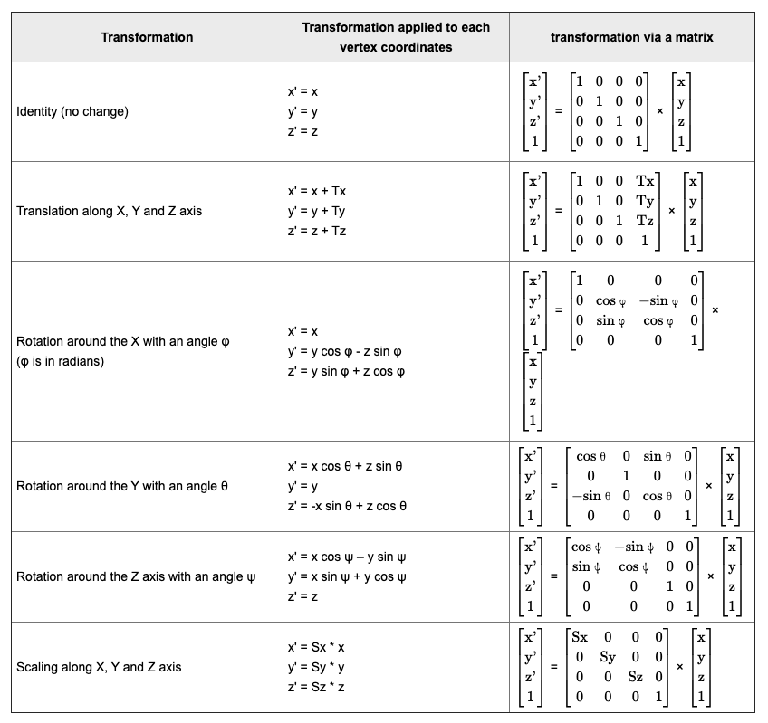

```html
<canvas id="canvas" width="400" height="400"></canvas>
<script src="../../lib/webgl.js"></script>
<script>
  var gl = canvas.getContext("webgl");

  // Vertex shader
  var vshader = `
attribute vec4 position;
uniform mat4 translation;
uniform mat4 rotation;
uniform mat4 scale;
void main() {
  // Translation, then rotation, then scale
  gl_Position = (scale * (rotation * translation)) * position;
}`;

  // Fragment shader
  var fshader = `
precision mediump float;
uniform vec4 color;
void main() {
  gl_FragColor = color;
}`;

  // Compile program
  var program = compile(gl, vshader, fshader);

  // Get shaders attributes and uniforms
  var color = gl.getUniformLocation(program, "color");
  var translation = gl.getUniformLocation(program, "translation");
  var rotation = gl.getUniformLocation(program, "rotation");
  var scale = gl.getUniformLocation(program, "scale");

  // Set color
  gl.uniform4f(color, 1.0, 0.0, 0.0, 1.0);

  // Set position
  var vertices = new Float32Array([0, 0.5, -0.5, -0.5, 0.5, -0.5]);
  buffer(gl, vertices, program, "position", 2, gl.FLOAT);

  // Set translation matrix (transposed)
  var Tx = 0.8;
  var Ty = -0.6;
  var t_matrix = new Float32Array([
    1.0,
    0.0,
    0.0,
    0.0,
    0.0,
    1.0,
    0.0,
    0.0,
    0.0,
    0.0,
    1.0,
    0.0,
    Tx,
    Ty,
    0.0,
    1.0,
  ]);
  gl.uniformMatrix4fv(translation, false, t_matrix);

  // Set rotation matrix (transposed)
  var B = 0.7;
  var cosB = Math.cos(B);
  var sinB = Math.sin(B);
  var r_matrix = new Float32Array([
    cosB,
    sinB,
    0.0,
    0.0,
    -sinB,
    cosB,
    0.0,
    0.0,
    0.0,
    0.0,
    1.0,
    0.0,
    0.0,
    0.0,
    0.0,
    1.0,
  ]);
  gl.uniformMatrix4fv(rotation, false, r_matrix);

  // Set scale matrix (transposed)
  var S = 0.4;
  var s_matrix = new Float32Array([
    S,
    0.0,
    0.0,
    0.0,
    0.0,
    S,
    0.0,
    0.0,
    0.0,
    0.0,
    S,
    0.0,
    0.0,
    0.0,
    0.0,
    1.0,
  ]);
  gl.uniformMatrix4fv(scale, false, s_matrix);

  // Set the clear color
  gl.clearColor(0.0, 0.0, 0.0, 1.0);

  // Clear canvas
  gl.clear(gl.COLOR_BUFFER_BIT);

  // Render
  gl.drawArrays(gl.TRIANGLES, 0, 3);
</script>

```

##### What happens here?

- 该演示在同一个三角形上执行了 3 种变换：平移、旋转，然后缩放。
- 这些变换可以通过以下方式完成：将矩阵从右向左相乘，然后将所得矩阵乘积与顶点坐标相乘。
- 这 3 个矩阵在 JS 中声明，并使用 uniform 发送到片段着色器。
- WebGL 仅接受已转置的统一矩阵（水平轴和垂直轴颠倒的矩阵），因此我们在 JS 代码中手动对其进行转置。
- 在接下来的章节中，矩阵乘积将只计算一次，并传递给顶点着色器，以避免为每个顶点重新计算矩阵乘积。
##### Tips and tricks

- 大小相同的矩阵和向量可以在 GLSL 中原生相乘（例如：mat4 * vec4）
- 在 JS 中，必须逐项完成
- 在 matrix.js 添加的辅助函数

```js
// Create an identity mat4
identity = () => {
  return new Float32Array([
    1, 0, 0, 0,
    0, 1, 0, 0,
    0, 0, 1, 0,
    0, 0, 0, 1
  ]);
};

// Compute the multiplication of two mat4 (c = a x b)

```

##### How to change the pivot point

如上所述，旋转和缩放矩阵仅允许将世界的原点 [0, 0, 0] 用作枢轴点。想象一个不以原点为中心的三角形，你需要绕其中心旋转 90 度（Pi/2 弧度），例如点 [0.5, 0.5, 0]。解决方案是将 3 个变换矩阵应用于该三角形的顶点。

- 围绕原点 [0, 0, 0] 进行移动；
- 旋转 90 度；
- 将它们转换回 [0.5, 0.5, 0] 处。
#### Texturing

### 3D 图形
## 2. 进阶（P7）

Arcgis 二维与三维地图的实现。

## 3. 解决问题

### 地图导出图片问题

#### 使用传统的方案 toDataURL

```js
$("canvas").toDataURL();
```

原因

#### 方案一

#### 分析

### 图层置灰问题

着色器？review 卷帘工具的原理
## 参考资料
- 英文入门教程：WebGL guide (part 1/2)
  May 2020 https://xem.github.io/articles/webgl-guide.html
- MDN 入门教程：[MDN](https://developer.mozilla.org/zh-CN/docs/Web/API/WebGL_API)
- 进阶：小册《WebGL 入门与实践》
- 系统：《WebGL 编程指南》
- 深入
  - 《3D 游戏与计算机图形学中的数学方法》
- mapboxGL 如何绘制、Arcgis 又是如何处理，为什么会导出不了图片
- [https://mp.weixin.qq.com/s/0G8rGoWNZ0XkBA9FQQPXLg](https://mp.weixin.qq.com/s/0G8rGoWNZ0XkBA9FQQPXLg)
- 数学，线性代数
  - 视频：这个系列视频讲得比较全了，都是动画演示，非常直观。自己按需观看吧：
    视频地址：【双语字幕】「线性代数的本质」合集。如何直观理解矩阵和线性代数？ 张孟杨的回答 - 知乎
    https://www.zhihu.com/question/21082351/answer/126177114
  - 辅助理解：如何直观理解矩阵和线性代数？ - JHack 的回答 - 知乎
    https://www.zhihu.com/question/21082351/answer/734162947
  - 数学动画库 https://github.com/3b1b/manim