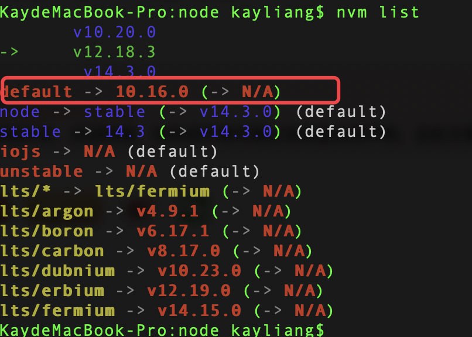

# Web 开发者包管理器干货总结（持续更新）

## npm vs yarn

```sh
$ npm init vite-app <project-name>
$ cd <project-name>
$ npm install
$ npm run dev
```

```sh
$ yarn create vite-app <project-name>
$ cd <project-name>
$ yarn
$ yarn dev
```

## 头脑风暴

- npm install -g 安装的包放在哪里？

```bash
kayliang@KaydeMacBook-Pro ~ % npm install -g tinypng-cli
npm WARN deprecated request@2.88.2: request has been deprecated, see https://github.com/request/request/issues/3142
npm WARN deprecated har-validator@5.1.5: this
/Users/kayliang/.nvm/versions/node/v10.16.0/bin/tinypng -> /Users/kayliang/.nvm/versions/node/v10.16.0/lib/node_modules/tinypng-cli/tinypng-cli.js
+ tinypng-cli@0.0.7
```

## npm

- 命令行
  - npx

### package.json

- peerDependencies

对于消费方可能也用到的组件，写到 peerDependency 中。看下面一张图就可以理解。这样可以减少重复打包。

- devDependencies
- bin

### 开发 npm 包

不同的包如何进行连接，在没有安装 devServe 的情况下。package1 要使用 package2 的东西，通过 import/require 进来，如何直接引用本地 npm 包。

- npm 包1，xcli-servers
```js
import { appListenStart } from "./services/init";
import { gisSystem } from "./services/search/gis";
import { regionSystem } from "./services/search/reigon";

module.exports = {
  appListenStart,
  gisSystem,
  regionSystem
};

```
- npm 包2

```js
const { gisSystem, regionSystem } = require('xcli-server');
```

如果这两种的目录不在一起，那还有一种方法：

```js
$ # 先去到模块目录，把它 link 到全局
$ cd path/to/my-utils
$ npm link
$
$ # 再去项目目录通过包名来 link
$ cd path/to/my-project
$ npm link my-utils
```

实战应用：

1. 在使用的模块目录进行：yarn link，注意包装 package.json 包含入口的字段 main，比如 `"main": "dist/index.js",`

```sh
xcli-server kayliang$ yarn link
yarn link v1.22.10
success Registered "xcli-server".
info You can now run `yarn link "xcli-server"` in the projects where you want to use this package and it will be used instead.
```

2. 然后去使用的 npm 包文件夹里：

```sh
yarn link "xcli-server"
```

3. 最后在文件夹里使用，注意这里必须跟第二步的包名一致

```js
// const { gisSystem, regionSystem } = require('xcli-ui-server'); 这是发布在 node_module 的包。
const { gisSystem, regionSystem } = require('xcli-server');
```

### 多版本 node 的处理

不同 node 版本下，如何处理全局安装的包
- [用nvm改变node版本的时候全局模块找不到](https://zhuanlan.zhihu.com/p/31927735)

If the above doesn't fix the problem, you may try the following:

If you use bash, it may be that your .bash_profile (or ~/.profile) does not source your ~/.bashrc properly. You could fix this by adding source ~/<your_profile_file> to it or follow the next step below.

Try adding the snippet from the install section, that finds the correct nvm directory and loads nvm, to your usual profile (~/.bash_profile, ~/.zshrc, ~/.profile, or ~/.bashrc).

#### nvm 设置 nodejs 默认版本

https://www.cnblogs.com/Joans/p/10275293.html




这里有个坑，当你要安装一个全局安装包的时候，无论你当前在哪个 node 版本下，它都会默认安装到 default 指定的这个安装包，这是极其不合理的。

这是因为 安装前缀路径被写死在了 `.npmrc`  里了。https://github.com/nvm-sh/nvm/issues/2011


把这行去掉，重新 nvm list


虽然命令行还是官方默认的 10.16.0，但是在 npm install -g yarn 的情况下，安装路径已经发生了变化：


另外在安装装 NVM 前要把全局安装的 node 以及 node_module 目录删除干净，避免出现其他意外的问题。

```sh
#查看已经安装在全局的模块，以便删除这些全局模块后再按照不同的 node 版本重新进行全局安装
npm ls -g --depth=0
# /Users/kayliang/.nvm/versions/node/v10.16.0/lib
└── (empty)

#删除全局 node_modules 目录
sudo rm -rf /usr/local/lib/node_modules

#删除 node
sudo rm /usr/local/bin/node

#删除全局 node 模块注册的软链
cd  /usr/local/bin && ls -l | grep "../lib/node_modules/" | awk '{print $9}'| xargs rm
```

## package.lock.json

## yarn link 与 npm link 使用及原理

如何链接不到，请看这个。

`warning There's already a package called "vega" registered. This command has had no effect. If this command was run in another folder with the same name, the other folder is still linked. Please run yarn unlink in the other folder if you want to register this folder.`

For anyone else coming here, you can delete the link in `~/.config/yarn/link`

https://juejin.im/post/6844904164468768776

- [你所不知道的模块调试技巧 - npm link ](https://github.com/atian25/blog/issues/17)

## 发布一个 npm 包

github 私有仓库，发布到私有 npm，输入密码确认下载。

github 公有仓库

为什么使用 npm install -g 而不是用 yarn，有什么区别吗

## yarn.lock

## 参考资料

- [nvm](https://github.com/nvm-sh/nvm#troubleshooting-on-macos)
- [npm 快速入门](https://www.npmjs.cn/getting-started/what-is-npm/)
- [NPM 组件你应该知道的事](https://mp.weixin.qq.com/s/Sx171hDbQS1yKQemJXxKbQ)
- [Npm vs Yarn 之备忘大全](https://juejin.im/entry/6844903558630866951)
- [在 Mac 下安装 nvm 管理 node（解决版）](https://segmentfault.com/a/1190000017391932)