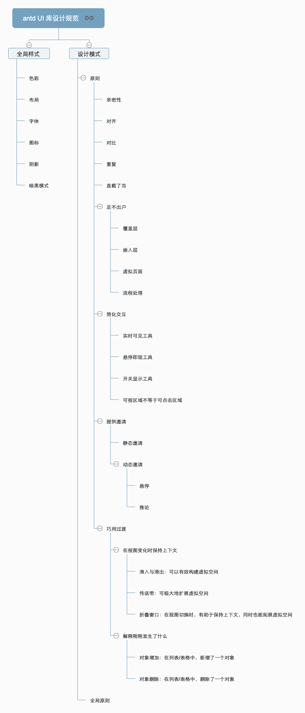

# 专业拆造轮子系列

仿轮子 = 拆 + 造

造 UI 组件：
使用技术：
- 原生 JS 还是 框架
- 如果使用框架，则有 vue2/vue3

基础类库比如：
- lodash 
- axios
- ...

不同阶段，造什么轮子

查看 github 代码提交历史

造简单的轮子版本时，可以查看 github 代码提交历史。

- 搞明白造轮子的重要性
- 有哪些轮子造
- 怎样去造，造轮子的不同阶段

通过造轮子最终达到外练名气，内聚功力。

开始任何一件事前，只思考定方向，一旦方向定了，不要太过于考虑准备得好不好，就是开始做。遇到不会的，想办法解决就是。
## 造轮子的不同阶段

### 别人的建议：

第一阶段：学习为主、查漏补缺
第二阶段：简单轮子，自己实现
第三阶段：分析负责轮子实现原理，提交 Merge Request
第四阶段：实现自己的组件——实现真正的造轮子

### 结合纳撸多自身情况

1. **第一阶段**：不要想着一开始就去仿、去看整个 UI 组件库，因为它们的引用很多，比如 antd-design-vue 一个骨架屏组件依赖了很多额外的命令，base、config、locale 等，这样往往会让你丢了西瓜，拾芝麻。不是说这些不重要，只是这个阶段你不需要关注太多。不要忘记了你只是想快速理解这个组件的实现原理。

所以对于组件来说，可以去 github 搜索，一个个看它们的效果，如果效果喜欢，就再下载源码读一读。看看人家是怎么实现的，怎么做的，用到哪些技术买不会的去学。

这个阶段以学习为主，先看人家怎么做出来的（包括 review 仓库提交历史代码），学习相关技术仿造一个（可以放到 github 上，注意：不要觉得自己弄出来一个，就指定火，好大喜功，一步登天，这是不可能的🙅‍♂️。**也不觉得自己放那么一个平平无奇的组件就觉得显示自己水平不行，你要记得你是学习，造轮子是渐进的过程。不要打肿脸充胖子，这样是非常不好的**。）

当然除了组件库外，像 vue 框架这些，也可以取巧方法看，比如别人实现的 miniVue，以及官方的打包文件都可以调试。问题不大。

这个阶段，仿个 **3 到 6 个月**，逐渐让自己的知识形成系统。这个时候，就可以尝试自己去写一个了。（第二阶段）

2. **第二阶段：简单轮子自己实现**。（**3 个月**）

在自己的知识形成体系以后，在看博客或文章时，经常会看到别人介绍一些组件、轮子，这时，就想如果自己实现，要如何实现（这个时候先不要具体看文章，先看实现效果）。自己先尝试实现出来，把 bug 都解决。（比如 Phodal、justjavac 造轮子、掘金上的解决、一些 github blog 的介绍等）

然后，再去看人家的源码，在对比的过程中，就会发现，思路
是不是一样，他实现的比你好还是比你的差，他里面涉及的一些知识，是不是有问题等，你还可以进行提交 pr。

通过不断的磨练，能够看到 80% 的轮子都能活学活实现后，就可以进入下一步。

3. **第三阶段：分析复杂轮子实现原理，提交 Merge Request**（**3 个月**）

在自己能实现一些简单轮子的时候，这时候就需要找一些复杂的轮子进行拆解，看看人家的代码架构。学习架构的知识和实现原理，为自己实现轮子打下基础。比如前端路由、diff、react hook、复杂 UI 组件比如表格、在线 Excel等

目标：可以参与到工作所用到的开源库中，修bug，拓展功能，改变核心逻辑。

4. **第四阶段：实现真正的轮子**

当你在使用一个框架、组件时，发现用着它不爽，或者有自己的想法时，就可以尝试自己去改进一个出来。最好的改进方式，还是先对市面的所有相似轮子原理完全了解之后，在他们的基础上加以改进，效果会更好。

在完成前面三个阶段后，第四阶段则是看时机了。之后造轮子的能力上来之后，前面三个阶段做的事情就可以不按顺序了，可以在任何适当的时候都可以做，**当然，第三阶段的事情优先级排在最高，这样才可以提升你的竞争力**。

（以补充个人短板+全栈修仙之路的前端进阶为目标点来造轮子与拆轮子）

1. 通过空间轴列出所有轮子，再根据工作情况和自身能力木桶原理，进行轻重缓急补足，回想这两周较常用的轮子，进行造拆。
2. 如果第一点没有外，就看看将来的

## 第一阶段
### UI 组件库

四表一局

模仿的样式网站：
- facebook完整 https://www.facebook.com/
- 以及 antd 组件库的设计样式

- [最全的UI库集合](https://juejin.cn/post/6844904143950184455#heading-1)

如何评价 Ant Design 这个项目（一个设计语言）？

- Material Design    // 什么是material design？
- 总体介绍，核心思想
- Motion  //  动效：淡入淡出，各种转场动画等
- Style      // 风格：颜色，图标，排版，文案等，这一组可以说是“网页版平面设计” 规范
- Layout   // 布局：网格系统，跨设备布局等  
- Components  // 
- 各种组件Patterns   // 解决特定问题的常见模式
- Growth & communications  // 增长传播策略
- Usability  // 可用性
- Platforms  // 跨平台
- Resources // 资源

作者：小狐濡尾
链接：https://www.zhihu.com/question/33629737/answer/150301306
来源：知乎
著作权归作者所有。商业转载请联系作者获得授权，非商业转载请注明出处。

#### 按钮

仿造：JS 原生 Button —— Vue Button，各自造一个仓库，都是作为学习用。- react Button

设计规范样式，可以仿造 antd-design 的设计

仓库仿造学习：https://github.com/alexwolfe/Buttons

详细分析文：[专业拆造轮子系列-按钮](专业拆造轮子系列-按钮.md)

### 函数库

- lodash
### 系统搭建轮子

- [ant-design-pro](https://github.com/ant-design/ant-design-pro/)
- [umi](https://umijs.org/zh-CN/docs)
- 乾坤
## 参考资料

- antd
  - [动效语言](https://motion.ant.design/language/basic-cn)
  - [Ant Design 设计工程化](https://mp.weixin.qq.com/s?__biz=MjM5MTA1MjAxMQ==&mid=2651243414&idx=1&sn=423f1ba3135a48847d4e2016afab50ef&chksm=bd491a128a3e93046a4bc9e997bf13c7168d0a2280d08648624916ed60e7a50edbfdf34d5855&mpshare=1&scene=1&srcid=0118PLCmtA7rXFSHyS0Zei2i&sharer_sharetime=1610928403644&sharer_shareid=791943f918fc132c4b385797127c7ffd#rd)
- UI 设计规范：
  - https://ant.design/docs/spec/colors-cn
  - https://design.google/resources/
- [有哪些让程序员受益终生的建议](https://zhuanlan.zhihu.com/p/85861940)
- [程序员如何通过造轮子走向人生巅峰？](https://blog.csdn.net/harvic880925/article/details/103868932)
- [前端常用插件、工具类库汇总，不要重复造轮子啦！！！](https://juejin.cn/post/6844903683411410951?utm_source=gold_browser_extension%3Futm_source%3Dgold_browser_extension#heading-1)
- https://js.coach/?page=1&query=&menu%5Bcollections%5D=Vue
- [前端工程师在业余时间如何提高自身能力——造轮子](https://cloud.tencent.com/developer/article/1030022)
- [初读Ant Design源码](https://zhuanlan.zhihu.com/p/54166478)
- [前端新人工作中多造轮子对未来的发展是好是坏？](https://www.zhihu.com/question/53209764)