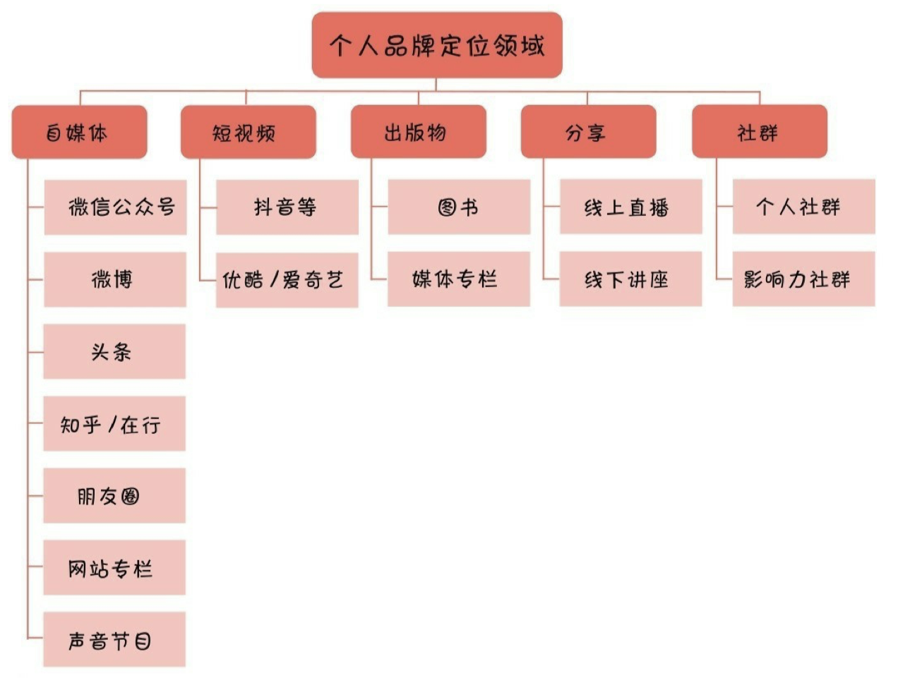
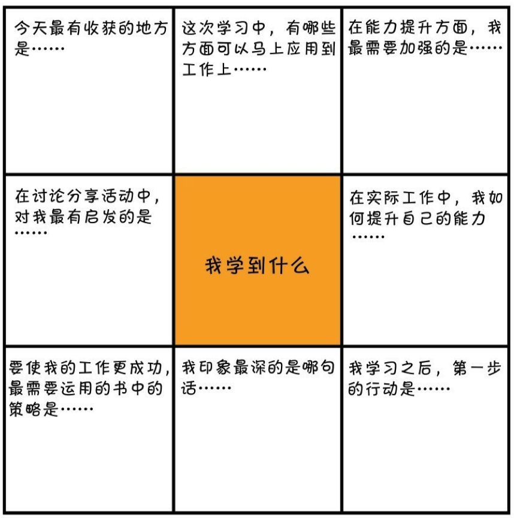
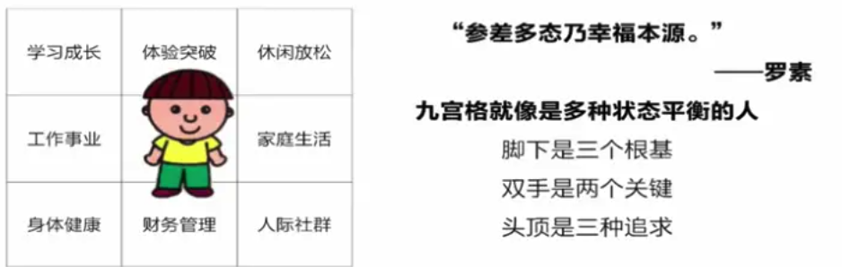
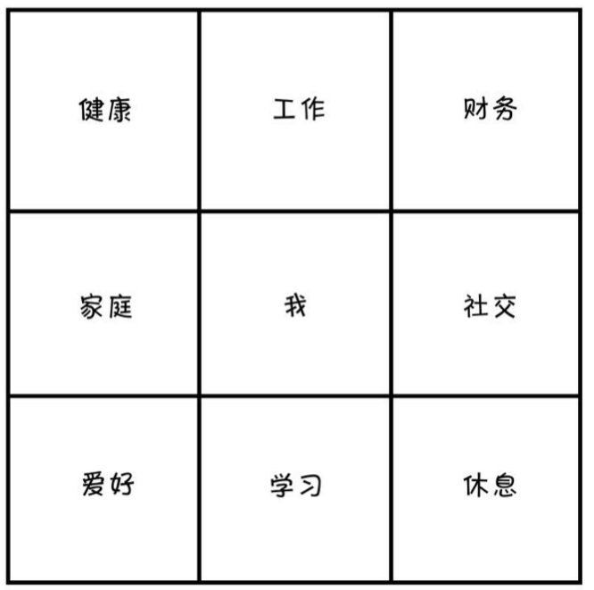

最能发挥写作价值的平台就是自己的工作岗位。

## 写作

### 开营之前 写作，是每个人都应该掌握的技能

我是林济煜，来自广东湛江。我的职业是一名 Web 前端开发工程师，技术栈为 Vue、Gis、JS。我做过最有成就感的事情是通过自己的努力解决了工作中其他人难以解决、或没解决过的难题。

我能够分享自己研究的技术，实践经验给大家。

我是一个好学不倦、表达能力还需提供，但动手实践能力较强的打工人。

我学习写作的目标是一来能够对工作汇报应付自如，二来对于生活中遇到的比如与人辩论、口头上、书面表达上不处于弱势，三来能够持续输出技术文章，并获得认可，形成个人品牌，成为一个副业，避免程序员 35 岁危机。

- 时间轴
- 空间轴

写作：跟 UML 建模很像。空间轴则是事物。

大纲先粗后细

### 先搭好框架，才能又快又好
#### 搭建你的写作变现的认知框架

我写作的方向：

- 打造个人品牌
- 结构化表达

| 目标         | 入门定位           | 考核要求   |
| ------------ | ------------------ | ---------- |
| 打造个人品牌 | 有一技之长（编码） | 个人影响力 |

2021 年，我要在**打造个人品牌**方向，每周写出一篇文章超过**5**个读者愿意点赞。（计算周一早上发，周五计算结束）

我希望学习打造个人品牌方向，过去对此并不清晰认识，理解了这一点可以让我有针对寻找相关的资料和方法。
#### 搭建个人品牌的写作框架

1. 请系列化运营自己的个人品牌

2. 请选择一个适合自己发挥的平台

最佳策略：先在一个点突破，再借势卡位多平台。

2021 年的突破点是在**掘金**，然后再引流到公众号上来。积极参与平台的活动。

3. 请明确自己产出的内容的风格。

让自己的文字在内容之外加上个人的温度，这样才方便读者对你产生独一无二的印象。（比如木鱼水心，B 站的大 up 主，声音非常有辨识度。

风格：人对什么内容敏感，突出这一点，就能给自己的文字带来风格。

回答 3 个问题：

- 你准备从哪个平台开始起步写作
  - 掘金
- 你准备搭建哪些平台做个人品牌运营
  - 个人网站
  - 微信公众号
  - 知乎专栏
  - 社群
  - ...
- 你的个人品牌写作，个性化风格是什么
  - 如何形成？不同的写作目标读者有不同的风格，汇报给领导的文章跟写给程序员看的技术文章风格大不同。前者需要严肃，后者可以稍加表情包增添幽默感。
  - 对于要形成自己的个人品牌来说，更多是后者。在形成或找到自己的写作个性风格前，先尽量提升读者的阅读体验，少点枯燥。
    - 便于读者理解，**使用口语化叙述**
    - 强调重点，缩减文字，多列小标题。
    - 段落多空行，密集文字处多配图。
    - **减少疲劳，多配点表情包。**

什么是“框架式写作”？就是针对自己擅长的领域，列出所有可以讨论的话题，按照一定的逻辑顺序建立话题库，最终可以看作一本图书的原型。

**空间轴**

- 入门
  - 要搞清楚 xxx 的定义，以及它和 xxx、xxx 的区别
- 基础
  - 要学会/做好/用好 xxx，需要 xxx，具备 xxx 能力，有了这些基础才能更好地理解 xxx
- 专业
  - 怎样 xxx、如何 xxx、各种细分
- 训练
  - 如何训练才能把这些知识转变为自己的能力？知识并不等于技能，技能是需要训练的，要训练就得有一定的方法和流程，也必须达到一定的训练量和准备，甚至通过某种特定的考核。

**时间轴**

- 初级
- 中级
- 高级

可以把这些分类的知识列出来组成一个框架树。

#### 用“框架式写作”快速搞定提升流量的文章技巧
## 时间管理

<!-- 最佳状态：睡完觉后的前两个小时 -->

在时间管理高手眼里，首先需要培养的**统筹思维**，只有统筹各种时间用于自己的目标，才能实现时间的有效利用。

时间管理高手的第二个思维是**成本思维**。（如何完成目标和控制成本）

九宫格复盘工具

### 目标管理 用时间创造真正的价值

把时间尽可能多地分配到有产出的事情上，而不是让自己的注意力漂移不定，这就是成为时间管理高手的第一步。

#### 找对大目标

> 直接用于完成大目标的时间/每周的 168 小时 = 每周大目标用时比

在一周内，可以结合自己本周的安排，每天分配不同长度的时间给大目标，但累计时长需要超过 8 小时，每周大目标用时比超过 5%。

#### 人生九宫格

把九宫格模型和紧急重要模型结合来看，就会对时间分配有更客观的认识。

**友情提示：**这个世界有时候并不公平，有时候努力做对了所有的事情，目标依然不能达成，这是人生的常态，我们得接受这一点。时间管理不能帮你解决所有的问题，但是我们可以调整心态，说服自己调整下一阶段的人生平衡九宫格。

#### 不同的人生阶段，要有不同的九宫格

如果想成为企业家，或者其他领域的领军人物，九宫格不见得够用，也许得把它扩展成十六宫格。或者在每一个格子里还得细化出更多的小格子，要么自己管理，要么安排其他人去做好管理。

> "九宫格"是慢慢成长起来的——理解这句话很重要。

## 参考资料

- [月复盘与计划](https://www.jianshu.com/p/89cefccfd05c)
- [跟你保证，关于新手写作的问题，仅看这一篇就够了
  ](https://zhuanlan.zhihu.com/p/75631472)
- [初学者的技术写作：技术博客基础知识 A-Z 指南](https://g.yuque.com/bzhang/wwjx2/nvz9mt?language=en-us#33b9bce7)
