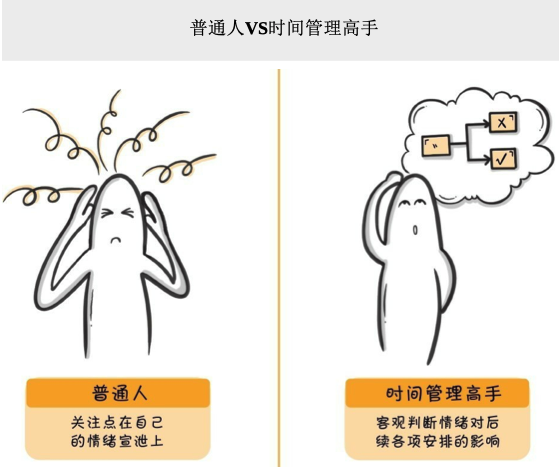
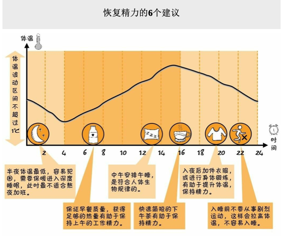
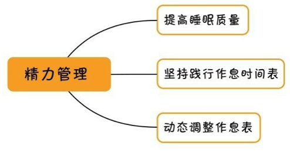
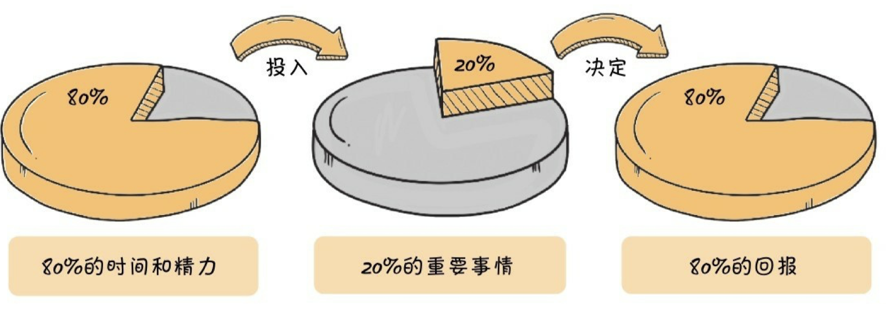
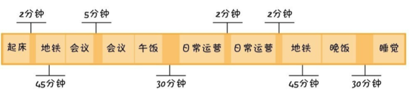
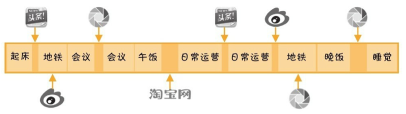

最能发挥写作价值的平台就是自己的工作岗位。

## 写作

### 开营之前 写作，是每个人都应该掌握的技能

我是林济煜，来自广东湛江。我的职业是一名 Web 前端开发工程师，技术栈为 Vue、Gis、JS。我做过最有成就感的事情是通过自己的努力解决了工作中其他人难以解决、或没解决过的难题。

我能够分享自己研究的技术，实践经验给大家。

我是一个好学不倦、表达能力还需提供，但动手实践能力较强的打工人。

我学习写作的目标是一来能够对工作汇报应付自如，二来对于生活中遇到的比如与人辩论、口头上、书面表达上不处于弱势，三来能够持续输出技术文章，并获得认可，形成个人品牌，成为一个副业，避免程序员 35 岁危机。

- 时间轴
- 空间轴

写作：跟 UML 建模很像。空间轴则是事物。

大纲先粗后细

### 先搭好框架，才能又快又好
#### 搭建你的写作变现的认知框架

我写作的方向：

- 打造个人品牌
- 结构化表达

| 目标         | 入门定位           | 考核要求   |
| ------------ | ------------------ | ---------- |
| 打造个人品牌 | 有一技之长（编码） | 个人影响力 |

2021 年，我要在**打造个人品牌**方向，每周写出一篇文章超过**5**个读者愿意点赞。（计算周一早上发，周五计算结束）

我希望学习打造个人品牌方向，过去对此并不清晰认识，理解了这一点可以让我有针对寻找相关的资料和方法。
#### 搭建个人品牌的写作框架

1. 请系列化运营自己的个人品牌

2. 请选择一个适合自己发挥的平台

最佳策略：先在一个点突破，再借势卡位多平台。

2021 年的突破点是在**掘金**，然后再引流到公众号上来。积极参与平台的活动。

3. 请明确自己产出的内容的风格。

让自己的文字在内容之外加上个人的温度，这样才方便读者对你产生独一无二的印象。（比如木鱼水心，B 站的大 up 主，声音非常有辨识度。

风格：人对什么内容敏感，突出这一点，就能给自己的文字带来风格。

回答 3 个问题：

- 你准备从哪个平台开始起步写作
  - 掘金
- 你准备搭建哪些平台做个人品牌运营
  - 个人网站
  - 微信公众号
  - 知乎专栏
  - 社群
  - ...
- 你的个人品牌写作，个性化风格是什么
  - 如何形成？不同的写作目标读者有不同的风格，汇报给领导的文章跟写给程序员看的技术文章风格大不同。前者需要严肃，后者可以稍加表情包增添幽默感。
  - 对于要形成自己的个人品牌来说，更多是后者。在形成或找到自己的写作个性风格前，先尽量提升读者的阅读体验，少点枯燥。
    - 便于读者理解，**使用口语化叙述**
    - 强调重点，缩减文字，多列小标题。
    - 段落多空行，密集文字处多配图。
    - **减少疲劳，多配点表情包。**

什么是“框架式写作”？就是针对自己擅长的领域，列出所有可以讨论的话题，按照一定的逻辑顺序建立话题库，最终可以看作一本图书的原型。

**空间轴**

- 入门
  - 要搞清楚 xxx 的定义，以及它和 xxx、xxx 的区别
- 基础
  - 要学会/做好/用好 xxx，需要 xxx，具备 xxx 能力，有了这些基础才能更好地理解 xxx
- 专业
  - 怎样 xxx、如何 xxx、各种细分
- 训练
  - 如何训练才能把这些知识转变为自己的能力？知识并不等于技能，技能是需要训练的，要训练就得有一定的方法和流程，也必须达到一定的训练量和准备，甚至通过某种特定的考核。

**时间轴**

- 初级
- 中级
- 高级

可以把这些分类的知识列出来组成一个框架树。

#### 用“框架式写作”快速搞定提升流量的文章技巧
## 时间管理

<!-- 最佳状态：睡完觉后的前两个小时 -->

在时间管理高手眼里，首先需要培养的**统筹思维**，只有统筹各种时间用于自己的目标，才能实现时间的有效利用。

时间管理高手的第二个思维是**成本思维**。（如何完成目标和控制成本）

九宫格复盘工具

### 目标管理 用时间创造真正的价值

把时间尽可能多地分配到有产出的事情上，而不是让自己的注意力漂移不定，这就是成为时间管理高手的第一步。

#### 找对大目标

> 直接用于完成大目标的时间/每周的 168 小时 = 每周大目标用时比

在一周内，可以结合自己本周的安排，每天分配不同长度的时间给大目标，但累计时长需要超过 8 小时，每周大目标用时比超过 5%。

#### 人生九宫格

把九宫格模型和紧急重要模型结合来看，就会对时间分配有更客观的认识。

**友情提示：**这个世界有时候并不公平，有时候努力做对了所有的事情，目标依然不能达成，这是人生的常态，我们得接受这一点。时间管理不能帮你解决所有的问题，但是我们可以调整心态，说服自己调整下一阶段的人生平衡九宫格。

#### 不同的人生阶段，要有不同的九宫格

如果想成为企业家，或者其他领域的领军人物，九宫格不见得够用，也许得把它扩展成十六宫格。或者在每一个格子里还得细化出更多的小格子，要么自己管理，要么安排其他人去做好管理。

> "九宫格"是慢慢成长起来的——理解这句话很重要。

#### 要勇于打破人生的平衡

记住：真正的时间管理高手，不是追求平衡，而是擅长取舍。“我们面临着太多的选择，而选择的能力是我们一生成就如何的决定性因素。”

此外，即使有了大目标，也一定会遇到各种各样非做不可的事情，把所预定的目标冲击得七零八落，最终目标没有守住。为了避免出现这种情况，**需要给自己规划一条必须守得住的底线**。

- 第一，制订出实现这个目标的最小时间分配方案。
- 第二，用这个最小时间分配方案去划底线任务。
- 第三，要做备用计划，即万一既定的目标顶不住了，还可以接受的时间调整预案是什么（具体看这篇文章：[备用时段：高效规划时间的新方法](https://36kr.com/p/1019102495851782)）。

有了预案，一旦大目标分配的时间不足了，一周 7 x 24 小时，算算自己哪里还有多余的时间可调。如果没有时间可用，不好意思，请选择牺牲某一块的时间。

一旦做好了牺牲的决心，其实很多时间分配上的纠结就不存在了，大部分不是工作效率低到不可接受，而是内心太纠结，什么都想要，反而花费了大量时间在取舍。

取舍是一种能力，前提是你要经常做价值判断的训练。

### 情绪管理 选对合适你的时间工具

影响情绪的原因很多，比如认为自己不够完美，不够健康，不够自由，不够有钱，没人喜欢，缺乏天赋，老是事与愿违，找不到生命的意义与使命......这都会让人产生压力、不开心，导致自己明明有好办法却不想用，想自暴自弃。

普通人会把更多的关注点放在自己的情绪宣泄上，而时间管理高手会更客观地判断自己的情绪对后续各项安排的影响，包括对工作时间的影响。一想清楚如果自己因为闹情绪耽误工作得不偿失，就会冷静处理。

我拖延的真正原因是完美觉得要做就做好，而不是先完成，再完美。

1. 相信自己做得更好，增大奖励与适当的惩罚。
2. 增强自我效能感，相信自己能够做得好，有把握。

#### 8 种非理性情绪
### 精力管理 找准你的作息节奏

#### 城市越大，人就越忙

即便身体素质一般，但如果一开始就树立了大目标，坚定地朝着目标走，哪怕每天走得慢一点，总能每天接近一点点，假以时日，大目标还是能完成。

体弱多病但是成就了一番事业的人比比皆是，与他们相比，无非是在向着目标走的路上，要更加注意自己的身体。

除了注意身体，更要调整自己的情绪，避免陷入负面情绪之中。一个情绪不好，身体恢复机能也会变差，随之而来的就是工作状态不佳。（PS：跟打篮球一样，如果你几次进攻不佳就开始怀疑自己，那么接下来的进攻你都不能应用自如，只会更加怀疑自己，从而导致队友也不信任你。）

#### 认知身体原理，提升睡眠质量，快速恢复精力

睡眠仓（白领、运动员）

高效睡眠也是一种实战技能，是可以通过训练来提升的。

睡眠不是只比睡眠长度，还得比睡眠质量。

评估一个人的睡眠质量，只需要看他经过一段时间睡眠后，能否解除疲劳保持精神愉快，能否很好地进行一天的工作与学习。

- 改善睡眠的环境，拉窗帘、用厚被子、软枕头，保持低噪声
- 睡前避免剧烈运动
- 睡前避免喝刺激性饮料
- 睡前避免吃太多东西
- **保持到点就睡的习惯**
- **早睡早起**

最需要培养成习惯的是最后两条！假如某天加班到 10 点多的时候，回到家也尽量快点进入睡眠。

自然光使人清醒，室温过高使人懒散。

请分析你的睡眠质量：

1. 每天大约睡眠 7 小时
2. 一般需要大概半小时的入睡时间，在情绪影响/吃太饱则需要一个小时以上。
3. 有效睡眠超过 4 小时
4. 清醒后感觉精力有恢复，但是感觉还是有点疲惫。

#### 作息不规律，是很多人难以恢复精力的根源

#### 用好作息时间表，恢复身体节奏

刻意训练多个精力高峰时期。

#### 小结

找到你的精力时刻，进行安排不同挑战难度的任务。
### 日程管理 不怕变化太快

以“事件”为中心的模式，其实是把自己的事件掌控权交给了别人。
以”时间”为中心的模式，则努力管理

#### 学习“牛人”的工作法，三步搞定工作日程表

#### 石块装杯法，用好日程表的关键

#### 用活长周期日程表，解决意外冲突

### 效率管理 让你的一天等于别人的几天

在一定质量和成本预期下，达到合理的水平，这就是有效率。

工作效率偶尔很高不重要，稳定发挥比偶尔发挥最好状态更重要。
### 碎片管理 碎片时间，一样可以完成主要任务

#### 算清楚你的“分薪”，你才会重视碎片时间

分薪：10000/22/7/60 约 **1 元**

如何提高分薪，碎片时间花点时间提高主业（业务知识、行业知识、前景）和寻找副业（）。

平时分配一些时间用于关注个人所在行业的职业发展信息。

GIS 行业、互联网行业（教育、金融）对应的业务以及技术发展。

其他的，比如理财、房产。

花一点时间梳理这些流程，把它们固化到自己的时间日历中，甚至设置自动提醒，填完之后，再也不用亲人或朋友忘记责怪自己忘记重要日子了。

#### 为你的碎片时间寻找多元用途

如果有可能，要尽量减少碎片时间，尤其是注意避免自己主动把大块时间切碎。

1分钟 能干什么？

3 分钟你能干什么？

5 分钟你能干什么？

10 分钟你能干什么？

最后请不要焦虑，不要让用好每一分钟的愿望成为自己的压力。
#### 用场景化思维活用你的碎片时间

#### 用项目精理的 WBS 工具，串联你的碎片时间

### 外包管理 每天工作 4 小时

## 高效学习

把需要考核的问题都列举出来，带着问题寻找答案。

## 参考资料

- [月复盘与计划](https://www.jianshu.com/p/89cefccfd05c)
- [跟你保证，关于新手写作的问题，仅看这一篇就够了
  ](https://zhuanlan.zhihu.com/p/75631472)
- [初学者的技术写作：技术博客基础知识 A-Z 指南](https://g.yuque.com/bzhang/wwjx2/nvz9mt?language=en-us#33b9bce7)
- [备用时段：高效规划时间的新方法](https://36kr.com/p/1019102495851782)