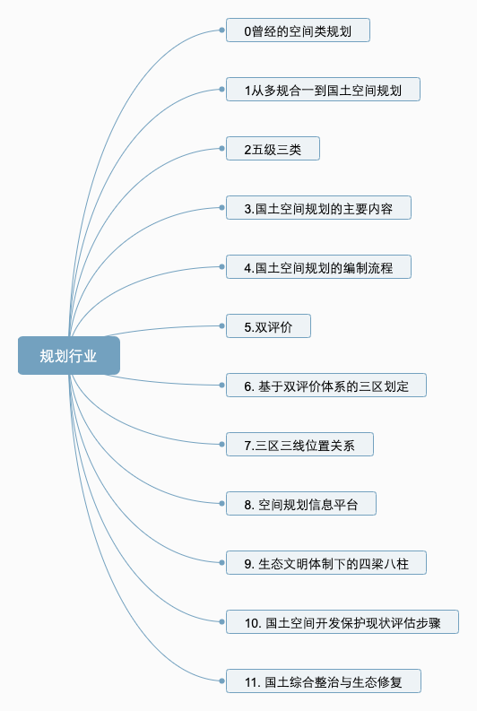
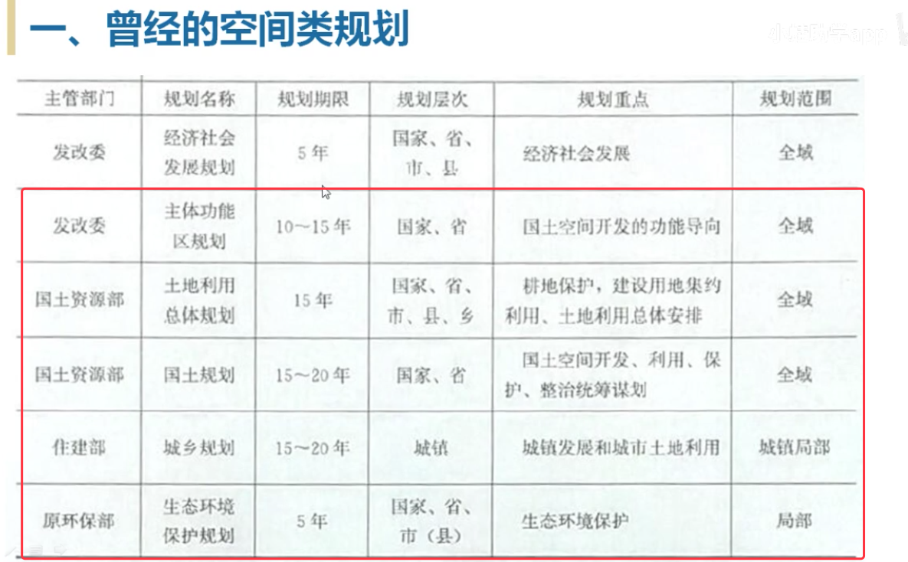
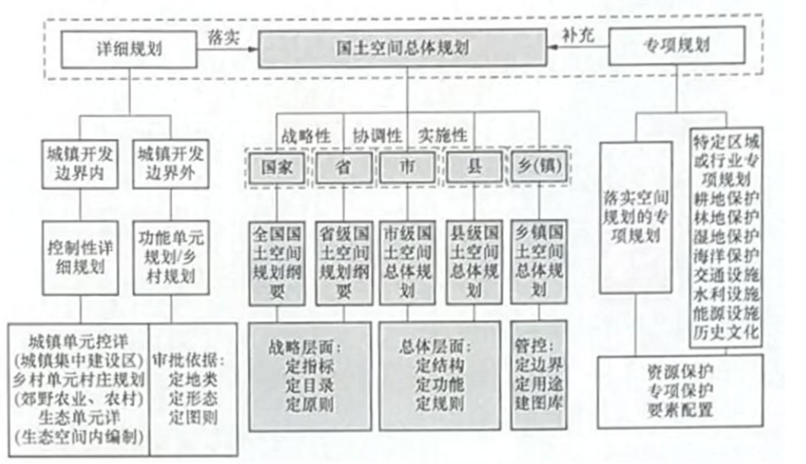

# 非 GIS：快速进入 GIS 规划行业

地表、地下划给自然资源部。

关于公司业务知识视频整体回顾，了解行业 > 确定产品方向（数据中心与业务智能）> 技术赋能应用。基础业务理解。至少可以提升一下跟需求交流的术语，知道他们在讲什么东西。也能听得懂公司的一些业务培训。

对应产品、

国土空间规划“一张图”实施监督信息系统

基础性

## 曾经的空间类规划

 

## 从多规合一到国土空间规划

多个规划合为一

为什么要做多规合一，政出不同部门，期限也不一样。

国土空间规划是多规合一的新说法。多个部门合一，以便政策更加容易实现，规划政策推行一致。

## 五级三类

国土空间规划的体系。

**五级**：国家、省、市、县、乡（镇），每一层的关注点不同。层层指导。

上位规划、下位规划。做过一定的业务相关后，也听得不少。

现在国家推出五级并行，这样就可以让下位的规划提出自己的发展诉求，反馈上级，让他们调整。不仅仅是服从上级（市 县），由上级是否采纳意见。（流程化意见）

实施监督，为了监督。

县级很难拿到双评价相关的数据，主要由市级处理。

**三类**：总体规划、详细规划（城镇开发边界）、专项规划（文物、林业）

## 参考资料

- [「第一期」如何快速进去国土空间规划行业？](https://www.bilibili.com/video/BV1R54y1D7rD?t=38)