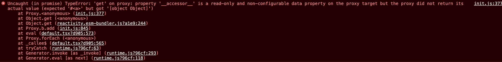

# vue3.x 项目开发总结（持续更新）

## 基础

### 使用

### Setup 文件组织


### 响应式 API

#### ref，reactive，toRef，toRefs 的区别使用

1. ref  对我们的值创建了一个**响应式引用**

```js
import { ref } from 'vue'

const counter = ref(0)

console.log(counter) // { value: 0 }
console.log(counter.value) // 0

counter.value++
console.log(counter.value) // 1
```

2. reactive

3. toRefs

   > 官方：因为 props 是响应式的，你不能使用 ES6 解构，因为它会消除 prop 的响应性。

   为了方便我们对它进行包装，`toRefs` 可以理解成批量包装 props 对象，如：

   ```js
   const { name } = toRefs(props);
   const handleClick = () => {
     // 因为是包装对象，所以读取的时候要用.value
     console.log('name :>> ', name.value);
   };
   复制代码
   ```

   **可以理解这一切都是因为我们要用解构，`toRefs` 所采取的解决方案。**

4. toRef

### composition API

我们从 `setup` 返回的所有内容都将暴露给组件的其余部分 (计算属性、方法、生命周期钩子等等) 以及组件的模板

props 的属性，不需要在 `setup` 中进行返回。

- TS 支持
- 复杂组件逻辑进行分离
- 组件间逻辑分享

#### 生命周期钩子注册内部 `setup`

```js
// in our component
setup (props) {
  const repositories = ref([])
  // methods
  const getUserRepositories = async () => {
    repositories.value = await fetchUserRepositories(props.user)
  }

  onMounted(getUserRepositories) // on `mounted` call `getUserRepositories`

  return {
    repositories,
    getUserRepositories
  }
}
```

#### Watch 响应式更改

```js
import { ref, watch } from 'vue'

const counter = ref(0)
watch(counter, (newValue, oldValue) => {
  console.log('The new counter value is: ' + counter.value)
})
```

Vue3.0升级_老版本项目升级改造指南

变化大吗？

- 90% 以上代码可与 vue2.0 复用
- Composition API 作为新增 API 不会影响旧的逻辑代码
- Mixin 不再推荐（需要改造）

我不会 TS，我好慌

TS 可选

Vite

考虑未来会不会有这个使用场景。

import API

TypeScript

## 项目实战问题

### v-on Listeners  移除

TSX 可以写在 Render 函数中，也可以写在 Setup 返回中

先直接使用 d2-map


### Arcgis 的响应式原理以及与 Vue 的冲突问题


#### 重现步骤

1. 在 setup 内声明一个变量，该变量的值是通过 ref/reactive 包装

```js
const origin = {
  mapObj: null
}
const state = reactive(origin);
```

2. 使用 Arcgis 4.12 API For JS，实例化一个地图对象

```js
const map = new Map({});
```

3. 把 map 对象赋予给 mapObj

```js
state.mapObj = map;
```

4. 添加图层

```js
const newLayer = new MapImageLayer({
  visible: true,
  url: server.url
});
state.mapObj.add(newLayer);  //  这样会报错误的关键代码
// let mapObj = ref({});  这样就不会报错，addLayer 时
// mapObj.add(newLayer); 
```

5. 在执行 state.mapObj.add(newLayer) 这行代码后，就会报以上的错误。

init.js:377 Uncaught (in promise) TypeError: 'get' on proxy: property '`__accessor__`' is a read-only and non-configurable data property on the proxy target but the proxy did not return its actual value (expected '#<a>' but got '[object Object]')

#### 问题分析

首先是错误的分析，我们知道 Proxy 有这么一个特性：如果要访问的目标属性是不可写以及不可配置的，则返回的值必须与该目标属性的值相同。

否则就会出现以下 错误：


可以发现这个错误跟我们的错误报错几乎一样。

我们来重新分析重新步骤的代码：

```js
const origin = {
  mapObj: null
}
const state = reactive(origin); // 对 origin 响应式处理，内部使用了 Proxy
const map = new Map({});
state.mapObj = map; // 把 map 指针赋予给 state.mapObj
const newLayer = new MapImageLayer({ // 新建图层
  visible: true,
  url: server.url
});
state.mapObj.add(newLayer);  // 添加图层
```

mapObj.add 的这个操作会引起 arcgis 内部的` __accessor__` 访问器冲突操作，应该是 vue 的 reactive 改变了 mapObj 的一些东西导致的错误。

这块还需要深入研究下，看了 Esri 社区也有人遇到这个问题，官方回应会在最新的版本进行发布。https://community.esri.com/t5/arcgis-api-for-javascript/arcgis-js-api-4-x-not-supported-with-vuejs-3-0/m-p/1010906。

风险评估：

- 考虑到后续还要 vuex，而官方还没提供相关的工具，先把大屏项目转回 vue2。
- 上述的错误

#### 解决方案

So I think there are some issues here in the patterns being used. One of the nice things about the Composition API and Vue3 in general is you can explicitly choose what is reactive and what isn't. In my opinion, I don't think you want to make your **view** and **layer** reactive.

map 对象不需要响应式，还有就是图层对象也不需要响应式。至于问题是怎样的，

先切回 vue2 分之，vue3 这个作为研究分支，保留着用吧。为什么会出现这个问题，还有待研究。

## 问题总结

异步请求的数据，如何放到 Setup 声明的数据里，再进行渲染。

## 参考资料

- [Vue3.0 新特性以及使用变更总结(实际工作用到的)](https://blog.csdn.net/qiwoo_weekly/article/details/115339575)

- [vue 3官方文档]( https://vue3js.cn/docs/zh/guide/migration/introduction.html#%E5%BF%AB%E9%80%9F%E5%BC%80%E5%A7%8B)
- [https://github.com/blacksonic/awesome-vue-3](https://v3.cn.vuejs.org/guide/migration/introduction.html#%E6%A6%82%E8%A7%88)
- [Vue3丨从 5 个维度来讲 Vue3 变化](https://juejin.cn/post/6910009240053055496#heading-0)
- [【第2072期】 或许这就是下一代组件库](https://mp.weixin.qq.com/s/hwzxIvE8OFkSaWvRL5M59A)
- [基于Vue3.0开发知乎日报实战](https://juejin.im/post/6854573216459915277#heading-7)
- [Vue3.0 && Vue3.0初体验 一](https://juejin.im/post/6847902215458258958)
- [Vue 3.0 来了，我们该做些什么？](https://juejin.im/post/6874604408030789640?utm_source=gold_browser_extension#comment)
- 视频
  - [Vue3.0 + Vite开发快速入门（2）：经典案例实战入门ToDoList项目](https://www.bilibili.com/video/BV1Ph411R7gg?t=1040)
  - [前端新工具vite，快速上手vue 3.0+ vite开发](https://www.bilibili.com/video/BV1LC4y1h7BF/?spm_id_from=333.788.videocard.3)
  - [https://github.com/vitejs/vite](https://github.com/vitejs/vite) 把 readme 看完。